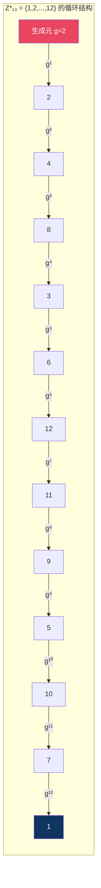
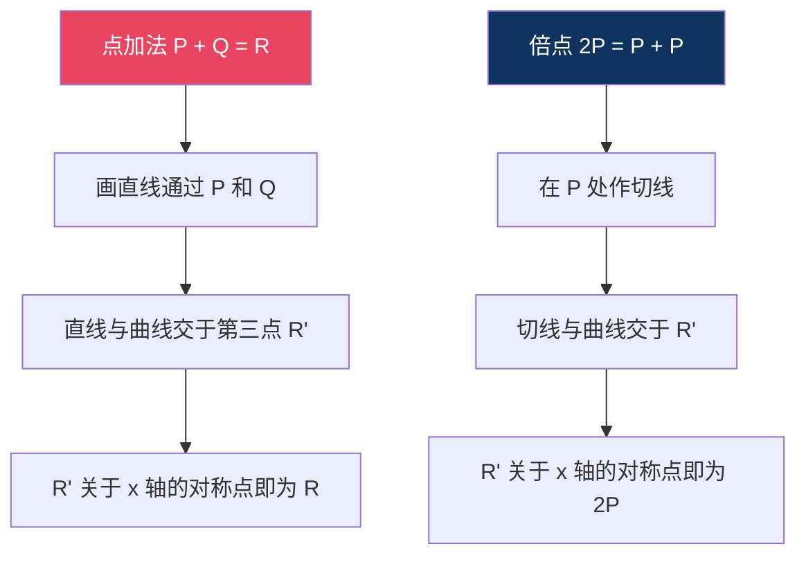
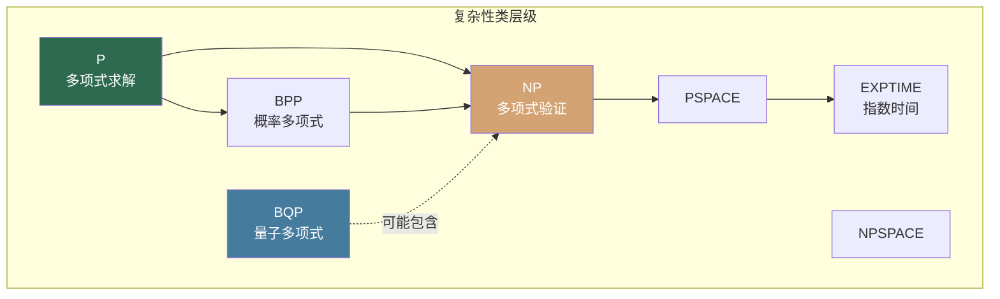

## 13.1 密码学的数学基础

密码学本质上是一门应用数学。每一个加密算法的安全性，最终都可以归结为某个数学问题的计算困难性。本节系统梳理支撑现代密码学的核心数学分支，从整除性到椭圆曲线，从信息论到计算复杂性，为后续所有算法的学习打下坚实基础。

```mermaid
graph TD
    A[密码学的数学基础] --> B[数论]
    A --> C[抽象代数]
    A --> D[信息论]
    A --> E[概率论]
    A --> F[计算复杂性理论]

    B --> B1[整除与模运算]
    B --> B2[欧拉函数与费马定理]
    B --> B3[离散对数问题]
    B --> B4[素性检测]

    C --> C1[群论]
    C --> C2[环与域]
    C --> C3[有限域 GF(p) / GF(2^n)]
    C --> C4[椭圆曲线]

    D --> D1[熵与信息量]
    D --> D2[完美保密]
    D --> D3[唯一解距离]

    E --> E1[概率分布]
    E --> E2[不可区分性]
    E --> E3[随机性检测]

    F --> F1[P / NP / NP-Hard]
    F --> F2[单向函数]
    F --> F3[归约证明]

    style A fill:#1a1a2e,stroke:#e94560,color:#fff
    style B fill:#16213e,stroke:#0f3460,color:#fff
    style C fill:#16213e,stroke:#0f3460,color:#fff
    style D fill:#16213e,stroke:#0f3460,color:#fff
    style E fill:#16213e,stroke:#0f3460,color:#fff
    style F fill:#16213e,stroke:#0f3460,color:#fff
```

---

### 13.1.1 数论基础

数论是密码学的数学根基。RSA、Diffie-Hellman、ElGamal 等经典算法的安全性全部建立在数论难题之上。即使学习椭圆曲线密码学和后量子密码学，数论知识也不可或缺。

#### 13.1.1.1 整除性与最大公约数

**整除的定义**：对于整数 $a$ 和 $b$（$b \neq 0$），如果存在整数 $k$ 使得 $a = kb$，则称 $b$ 整除 $a$，记作 $b \mid a$。

**带余除法**：对于任意整数 $a$ 和正整数 $n$，存在唯一的一对整数 $q$（商）和 $r$（余数），使得：

$$a = qn + r, \quad 0 \le r < n$$

带余除法是模运算的直接基础。

**最大公约数（GCD）**：$\gcd(a, b)$ 是能同时整除 $a$ 和 $b$ 的最大正整数。计算 GCD 的经典方法是**欧几里得算法**（辗转相除法），其核心思想是：

$$\gcd(a, b) = \gcd(b, \; a \bmod b)$$

```python
def gcd(a, b):
    """欧几里得算法求最大公约数"""
    while b != 0:
        a, b = b, a % b
    return a

# 验证
assert gcd(48, 18) == 6
assert gcd(1071, 462) == 21
```

**扩展欧几里得算法**不仅能求出 $\gcd(a, b)$，还能找到整数 $x, y$ 满足贝祖等式：

$$ax + by = \gcd(a, b)$$

这个算法在求模逆元时至关重要（见下文 13.1.1.3）。

```python
def extended_gcd(a, b):
    """扩展欧几里得算法，返回 (gcd, x, y) 满足 ax + by = gcd"""
    if a == 0:
        return b, 0, 1
    gcd, x1, y1 = extended_gcd(b % a, a)
    x = y1 - (b // a) * x1
    y = x1
    return gcd, x, y

# 验证：21 = 1071 * (-107) + 462 * 247
g, x, y = extended_gcd(1071, 462)
assert g == 21
assert 1071 * x + 462 * y == g
print(f"gcd={g}, x={x}, y={y}")  # gcd=21, x=46, y=-107
```

**互质**：若 $\gcd(a, b) = 1$，则称 $a$ 和 $b$ 互质。互质的概念贯穿整个密码学——RSA 的公私钥对必须互质于 $\phi(n)$，Diffie-Hellman 的生成元必须与模数互质。

#### 13.1.1.2 模运算

模运算（取模运算）是密码学中最频繁出现的运算。对于整数 $a$ 和正整数 $n$，$a \bmod n$ 表示 $a$ 除以 $n$ 的余数。

**模运算的核心性质**：

| 性质 | 公式 | 说明 |
|------|------|------|
| 加法同余 | $(a + b) \bmod n = [(a \bmod n) + (b \bmod n)] \bmod n$ | 先取模再相加，结果不变 |
| 乘法同余 | $(a \times b) \bmod n = [(a \bmod n) \times (b \bmod n)] \bmod n$ | 先取模再相乘，结果不变 |
| 幂运算 | $a^b \bmod n$ 可通过快速幂算法高效计算 | RSA 加密的核心运算 |

**模运算为什么如此重要**：模运算将无限的整数空间映射到有限集合 $\{0, 1, 2, \ldots, n-1\}$ 中，使得：
- 运算结果始终有界，适合计算机处理
- 正向计算容易（多项式时间），逆向求解困难（需要解决离散对数或大数分解问题）
- 构成有限群、有限域等代数结构的基础

**快速幂算法（模幂运算）**：直接计算 $a^b \bmod n$ 在 $b$ 很大时会溢出。快速幂（平方-乘法算法）通过将指数拆分为二进制位，将时间复杂度从 $O(b)$ 降到 $O(\log b)$：

```python
def mod_pow(base, exponent, modulus):
    """快速幂算法：计算 base^exponent mod modulus"""
    if modulus == 1:
        return 0
    result = 1
    base = base % modulus
    while exponent > 0:
        # 如果当前位为1，乘上当前的base
        if exponent % 2 == 1:
            result = (result * base) % modulus
        # 指数右移一位，base自乘
        exponent = exponent >> 1
        base = (base * base) % modulus
    return result

# 计算 2^100 mod 13 = 3
print(mod_pow(2, 100, 13))  # 3

# 计算 7^256 mod 13（RSA 中典型的模幂运算规模）
print(mod_pow(7, 256, 13))  # 9
```

Python 内置的三参数 `pow(base, exp, mod)` 使用同样的算法，且用 C 实现，性能远优于手写版本：

```python
# 实际开发中直接使用内置函数
assert pow(2, 100, 13) == 3
```

#### 13.1.1.3 模逆元

**模逆元**是模运算下的"除法"。给定整数 $a$ 和正整数 $n$，若存在整数 $a^{-1}$ 使得：

$$a \cdot a^{-1} \equiv 1 \pmod{n}$$

则 $a^{-1}$ 称为 $a$ 模 $n$ 的逆元。模逆元存在的充要条件是 $\gcd(a, n) = 1$（即 $a$ 与 $n$ 互质）。

**求模逆元的方法**：

**方法一：扩展欧几里得算法**

```python
def mod_inverse_eea(a, n):
    """用扩展欧几里得算法求 a 模 n 的逆元"""
    gcd, x, _ = extended_gcd(a % n, n)
    if gcd != 1:
        raise ValueError(f"模逆元不存在：gcd({a}, {n}) = {gcd}")
    return x % n

# 求 3 模 11 的逆元：3 * 4 = 12 ≡ 1 (mod 11)
print(mod_inverse_eea(3, 11))  # 4
```

**方法二：费马小定理（当 n 为质数时）**

当 $n$ 是质数时，由费马小定理 $a^{n-1} \equiv 1 \pmod{n}$ 可得：

$$a^{-1} \equiv a^{n-2} \pmod{n}$$

```python
def mod_inverse_fermat(a, p):
    """用费马小定理求 a 模质数 p 的逆元"""
    return pow(a, p - 2, p)

print(mod_inverse_fermat(3, 11))  # 4
```

模逆元在 RSA 解密、椭圆曲线点运算、Diffie-Hellman 密钥交换中无处不在。

#### 13.1.1.4 欧拉函数与欧拉定理

**欧拉函数** $\phi(n)$ 表示小于 $n$ 且与 $n$ 互质的正整数个数。关键性质：

| 输入类型 | 公式 | 示例 |
|----------|------|------|
| 质数 $p$ | $\phi(p) = p - 1$ | $\phi(7) = 6$ |
| 两个不同质数之积 $pq$ | $\phi(pq) = (p-1)(q-1)$ | $\phi(15) = 8$ |
| 质数的幂 $p^k$ | $\phi(p^k) = p^k - p^{k-1}$ | $\phi(8) = 4$ |
| 一般情况（积性函数） | $\phi(mn) = \phi(m) \cdot \phi(n)$（当 $\gcd(m,n)=1$） | — |

**RSA 的核心公式来源**：RSA 选择两个大质数 $p, q$，计算 $n = pq$，则 $\phi(n) = (p-1)(q-1)$。选取公钥指数 $e$ 满足 $\gcd(e, \phi(n)) = 1$，私钥 $d$ 是 $e$ 模 $\phi(n)$ 的逆元。

**欧拉定理**：若 $\gcd(a, n) = 1$，则：

$$a^{\phi(n)} \equiv 1 \pmod{n}$$

费马小定理是欧拉定理在 $n$ 为质数时的特例（$\phi(p) = p-1$）。

**欧拉定理保证了 RSA 的正确性**：加密 $c = m^e \bmod n$，解密 $m = c^d \bmod n$，其中 $ed \equiv 1 \pmod{\phi(n)}$。由于 $ed = 1 + k\phi(n)$，所以：

$$c^d = (m^e)^d = m^{ed} = m^{1 + k\phi(n)} = m \cdot (m^{\phi(n)})^k \equiv m \cdot 1^k = m \pmod{n}$$

#### 13.1.1.5 费马小定理

费马小定理是欧拉定理的特殊情况，但因其简洁性，在密码学中有独立的应用价值。

**定理**：若 $p$ 是质数，$a$ 是不被 $p$ 整除的整数，则：

$$a^{p-1} \equiv 1 \pmod{p}$$

**应用**：
- **快速求模逆元**：$a^{-1} \equiv a^{p-2} \pmod{p}$（见 13.1.1.3）
- **素性检测**：费马素性检测基于此定理的逆否命题——若 $a^{n-1} \not\equiv 1 \pmod{n}$，则 $n$ 一定不是质数
- **简化大指数运算**：计算 $a^k \bmod p$ 时可先将 $k$ 对 $p-1$ 取模

#### 13.1.1.6 中国剩余定理（CRT）

**定理**：设 $n_1, n_2, \ldots, n_k$ 两两互质，$N = n_1 n_2 \cdots n_k$，则同余方程组：

$$x \equiv a_1 \pmod{n_1}$$
$$x \equiv a_2 \pmod{n_2}$$
$$\vdots$$
$$x \equiv a_k \pmod{n_k}$$

在模 $N$ 意义下有唯一解。

**CRT 在密码学中的应用**：
- **RSA 加速**：利用 $n = pq$，将 $c^d \bmod n$ 分解为两个较小的模幂运算 $c^d \bmod p$ 和 $c^d \bmod q$，再用 CRT 合并，速度提升约 4 倍
- **秘密共享**：Asmuth-Bloom 秘密共享方案直接基于 CRT
- **Garbled Circuit 优化**：安全多方计算中利用 CRT 减少通信量

```python
def chinese_remainder_theorem(remainders, moduli):
    """中国剩余定理求解
    
    Args:
        remainders: 余数列表 [a1, a2, ...]
        moduli: 模数列表 [n1, n2, ...]（两两互质）
    Returns:
        x 满足 x ≡ ai (mod ni) 对所有 i
    """
    N = 1
    for m in moduli:
        N *= m
    
    x = 0
    for ai, ni in zip(remainders, moduli):
        Ni = N // ni
        # Ni 模 ni 的逆元
        yi = pow(Ni, -1, ni)
        x += ai * Ni * yi
    
    return x % N

# 示例：x ≡ 2 (mod 3), x ≡ 3 (mod 5), x ≡ 2 (mod 7)
# 答案：x = 23
print(chinese_remainder_theorem([2, 3, 2], [3, 5, 7]))  # 23
```

#### 13.1.1.7 离散对数问题（DLP）

离散对数问题是 Diffie-Hellman 密钥交换、ElGamal 加密、DSA 签名等算法的安全基础。

**定义**：给定质数 $p$、生成元 $g$（$g$ 模 $p$ 的原根）和 $h$，求满足以下方程的整数 $x$：

$$g^x \equiv h \pmod{p}$$

这就是**离散对数问题**（DLP）。记作 $x = \log_g h \pmod{p}$。

**为什么 DLP 是困难的**：
- 正向计算 $g^x \bmod p$ 很容易（快速幂，$O(\log x)$）
- 逆向求解 $x$ 在经典计算机上目前没有已知的多项式时间算法
- 最优的经典算法（数域筛法）的时间复杂度为 $O\left(\exp\left((\sqrt[3]{\frac{64}{9}})(\ln p)^{1/3}(\ln \ln p)^{2/3}\right)\right)$，是亚指数级的

```python
# 正向容易：计算 3^17 mod 19
p, g, x = 19, 3, 17
h = pow(g, x, p)  # h = 11
print(f"g^x mod p = {h}")

# 逆向困难：已知 h=11, g=3, p=19，求 x？
# 对于小数字可以暴力，但 p 增长到 2048 位时就不可行了
for candidate in range(1, p):
    if pow(g, candidate, p) == h:
        print(f"找到 x = {candidate}")  # x = 17
        break
```

**Diffie-Hellman 问题（DHP）**：即使不直接求解 DLP，攻击者仍可能试图从 $g^a \bmod p$ 和 $g^b \bmod p$ 计算 $g^{ab} \bmod p$。目前假设 DHP 至少和 DLP 一样困难，但严格等价性尚未证明。

#### 13.1.1.8 素性检测

密码学需要生成大质数（RSA 需要 1024 位以上的质数）。素性检测分为两类：

**确定性算法**：
- **AKS 算法**（2002）：首个被证明的多项式时间确定性素性检测算法，时间复杂度 $O(\log^6 n)$，但实际效率不如概率算法

**概率性算法（实际使用）**：
- **Miller-Rabin 测试**：工业界标准。对奇数 $n$，随机选取底数 $a$ 进行测试。合数被误判为质数的概率不超过 $1/4$。进行 $k$ 轮测试后，错误概率降至 $4^{-k}$。实际中通常进行 40-64 轮，错误概率可忽略

```python
import random

def miller_rabin(n, k=40):
    """Miller-Rabin 素性检测
    
    Args:
        n: 待检测的奇数
        k: 测试轮数
    Returns:
        True 表示"很可能是质数"，False 表示"一定是合数"
    """
    if n < 2: return False
    if n == 2 or n == 3: return True
    if n % 2 == 0: return False
    
    # 将 n-1 写成 2^r * d 的形式
    r, d = 0, n - 1
    while d % 2 == 0:
        r += 1
        d //= 2
    
    # 进行 k 轮测试
    for _ in range(k):
        a = random.randrange(2, n - 1)
        x = pow(a, d, n)
        
        if x == 1 or x == n - 1:
            continue
        
        for _ in range(r - 1):
            x = pow(x, 2, n)
            if x == n - 1:
                break
        else:
            return False  # 一定是合数
    
    return True  # 很可能是质数

# 生成大质数
def generate_prime(bits=512):
    """生成指定位数的质数"""
    while True:
        # 随机生成一个奇数
        n = random.getrandbits(bits) | (1 << bits - 1) | 1
        if miller_rabin(n):
            return n

p = generate_prime(256)
print(f"生成的 256 位质数: {p}")
print(f"位数: {p.bit_length()}")
```

**Solovay-Strassen 测试**：基于欧拉准则的另一种概率素性检测，理论意义大于实际应用，已被 Miller-Rabin 取代。

---

### 13.1.2 代数基础

抽象代数为密码学提供了精确的数学语言和结构化框架。理解群、环、域等代数结构，才能真正理解 Diffie-Hellman、椭圆曲线、AES 的数学原理。

#### 13.1.2.1 群论

**群的定义**：一个群 $(G, *)$ 由集合 $G$ 和二元运算 $*$ 组成，满足四个公理：

| 公理 | 含义 | 示例（整数加法群 $\mathbb{Z}$） |
|------|------|------|
| 封闭性 | $\forall a, b \in G: a * b \in G$ | 任意两整数之和仍是整数 |
| 结合律 | $(a * b) * c = a * (b * c)$ | $(1+2)+3 = 1+(2+3)$ |
| 单位元 | $\exists e \in G: a * e = e * a = a$ | $0$ 是加法单位元 |
| 逆元 | $\forall a \in G: \exists a^{-1}: a * a^{-1} = e$ | $a$ 的加法逆元是 $-a$ |

若群还满足**交换律**（$a * b = b * a$），则称为**阿贝尔群**（交换群）。

**循环群**：若群 $G$ 中存在元素 $g$（生成元），使得 $G$ 中每个元素都可以表示为 $g$ 的某次幂，则 $G$ 是循环群，记作 $G = \langle g \rangle$。



**密码学中的关键群**：

| 群 | 定义 | 密码学应用 |
|---|---|---|
| $\mathbb{Z}_p^*$ | 模质数 $p$ 的乘法群，阶为 $p-1$ | Diffie-Hellman、ElGamal、DSA |
| $\mathbb{Z}_n^*$ | 模合数 $n$ 的乘法群，阶为 $\phi(n)$ | RSA |
| 椭圆曲线点群 | 椭圆曲线上点构成的有限阿贝尔群 | ECDH、ECDSA |
| 群的阶 | 群中元素的个数 $|G|$ | 决定离散对数的难度 |

**拉格朗日定理**：有限群 $G$ 的任意子群 $H$ 的阶整除 $G$ 的阶，即 $|H|$ 整除 $|G|$。这个定理是许多密码学证明的基础。

#### 13.1.2.2 环与域

**环**：环 $(R, +, \times)$ 是一个集合配备两个运算，满足：
- $(R, +)$ 是阿贝尔群
- 乘法满足结合律
- 乘法对加法满足分配律

整数环 $\mathbb{Z}$ 是最典型的环。环中乘法不一定有逆元，这正是"在环上求逆困难"的代数基础。

**域**：域是乘法也构成群的环（除零元素外）。域要求每个非零元素都有乘法逆元。

| 结构 | 加法逆元 | 乘法逆元 | 示例 |
|------|---------|---------|------|
| 环 | ✓ | 不一定 | $\mathbb{Z}$（整数没有乘法逆元） |
| 域 | ✓ | ✓ | $\mathbb{Q}$（有理数）、$\mathbb{F}_p$ |

**有限域（伽罗瓦域）**：包含有限个元素的域，记作 $GF(q)$ 或 $\mathbb{F}_q$。有限域的存在性和唯一性定理：

- 对任意素数幂 $q = p^k$，存在唯一的（同构意义下）有限域 $GF(q)$
- 有限域的阶必须是素数幂

| 有限域 | 元素个数 | 构造方式 | 应用 |
|--------|---------|---------|------|
| $GF(p)$ | $p$（质数） | $\{0, 1, \ldots, p-1\}$ 上的模运算 | RSA、DH、ElGamal |
| $GF(2^n)$ | $2^n$ | 多项式模不可约多项式 | AES、椭圆曲线二进制域 |

```python
# GF(7) 上的运算示例
p = 7

# 加法：(5 + 6) mod 7 = 4
print(f"5 + 6 = {(5 + 6) % p}")

# 乘法：(3 * 5) mod 7 = 1
print(f"3 × 5 = {(3 * 5) % p}")

# 乘法逆元：3 * 5 ≡ 1 (mod 7)，所以 3⁻¹ = 5
print(f"3⁻¹ = {pow(3, -1, p)}")  # 5

# 验证
assert (3 * pow(3, -1, p)) % p == 1
```

#### 13.1.2.3 有限域 GF(2^n) 与 AES

AES（高级加密标准）的数学基础是有限域 $GF(2^8)$。理解这个域上的运算是理解 AES 内部结构的关键。

**$GF(2^8)$ 的构造**：将 8 位字节看作系数为 0 或 1 的 7 次多项式。例如字节 `0x57` = `01010111` 对应多项式 $x^6 + x^4 + x^2 + x + 1$。

**加法**：多项式加法 = 系数模 2 加法 = 逐位异或（XOR）

```text
  01010111  (x⁶+x⁴+x²+x+1)
⊕ 10000011  (x⁷+x+1)
= 11010100  (x⁷+x⁶+x⁴+x²)
```

**乘法**：多项式乘法后对**不可约多项式**取模。AES 使用的不可约多项式为：

$$m(x) = x^8 + x^4 + x^3 + x + 1 \quad \text{(十六进制 0x11B)}$$

```python
def gf256_mul(a, b):
    """GF(2^8) 上的乘法，不可约多项式 0x11B"""
    result = 0
    for _ in range(8):
        if b & 1:
            result ^= a
        high_bit = a & 0x80
        a = (a << 1) & 0xFF
        if high_bit:
            a ^= 0x1B  # 对 x⁸+x⁴+x³+x+1 取模
        b >>= 1
    return result

# 验证 AES S-box 中的一个乘法
print(hex(gf256_mul(0x57, 0x83)))  # 0xC1
```

**为什么 AES 选择 $GF(2^8)$**：
- 每个元素正好一个字节，天然适配计算机处理
- XOR 运算速度极快（单周期指令）
- 不可约多项式保证了乘法逆元的存在性
- 域上的代数结构保证了 AES 的差分均匀性和线性逼近性

#### 13.1.2.4 椭圆曲线数学

椭圆曲线密码学（ECC）在相同安全强度下需要的密钥长度远小于 RSA（256 位 ECC ≈ 3072 位 RSA），是现代密码学的主流方向。

**椭圆曲线的定义**（Weierstrass 方程）：

$$y^2 = x^3 + ax + b \quad \text{(在域 } \mathbb{F}_p \text{ 上)}$$

其中 $4a^3 + 27b^2 \neq 0$（确保无奇点）。

**点加法的几何直觉**：



**点加法的代数公式**：设 $P = (x_1, y_1)$，$Q = (x_2, y_2)$，$R = P + Q = (x_3, y_3)$：

当 $P \neq Q$ 时：
$$\lambda = \frac{y_2 - y_1}{x_2 - x_1} \bmod p$$
$$x_3 = \lambda^2 - x_1 - x_2 \bmod p$$
$$y_3 = \lambda(x_1 - x_3) - y_1 \bmod p$$

当 $P = Q$（倍点）时：
$$\lambda = \frac{3x_1^2 + a}{2y_1} \bmod p$$

```python
class EllipticCurve:
    """椭圆曲线 y² = x³ + ax + b (mod p) 上的点运算"""
    
    def __init__(self, a, b, p):
        self.a = a
        self.b = b
        self.p = p
        # 验证非奇异性
        assert (4 * a**3 + 27 * b**2) % p != 0, "曲线有奇点"
    
    def add(self, P, Q):
        """椭圆曲线上的点加法"""
        if P is None: return Q
        if Q is None: return P
        
        x1, y1 = P
        x2, y2 = Q
        
        if x1 == x2 and y1 != y2:
            return None  # 无穷远点 O
        
        if P == Q:
            # 倍点公式
            lam = (3 * x1**2 + self.a) * pow(2 * y1, -1, self.p) % self.p
        else:
            # 点加公式
            lam = (y2 - y1) * pow(x2 - x1, -1, self.p) % self.p
        
        x3 = (lam**2 - x1 - x2) % self.p
        y3 = (lam * (x1 - x3) - y1) % self.p
        
        return (x3, y3)
    
    def scalar_mul(self, k, P):
        """标量乘法 kP（double-and-add 算法）"""
        result = None  # 无穷远点
        addend = P
        
        while k > 0:
            if k & 1:
                result = self.add(result, addend)
            addend = self.add(addend, addend)
            k >>= 1
        
        return result

# NIST P-256 曲线参数（简化示例用小参数）
# 实际 P-256: p = 2^256 - 2^224 + 2^192 + 2^96 - 1
curve = EllipticCurve(a=2, b=3, p=97)
G = (3, 6)  # 生成元（简化）

# 计算 2G, 3G, ...
for k in range(1, 10):
    R = curve.scalar_mul(k, G)
    print(f"{k}G = {R}")
```

**椭圆曲线离散对数问题（ECDLP）**：给定椭圆曲线上的点 $P$ 和 $Q = kP$，求整数 $k$。这是椭圆曲线密码学安全性的基石。

**ECDLP 比经典 DLP 更难**：目前求解 ECDLP 的最优算法（Pollard's rho）的时间复杂度为 $O(\sqrt{n})$，其中 $n$ 是群的阶。而经典 DLP 有亚指数级算法。这意味着 ECC 可以用更短的密钥达到相同的安全级别。

| 安全级别（位） | RSA 密钥长度 | ECC 密钥长度 | 比率 |
|---------------|-------------|-------------|------|
| 80 | 1024 | 160 | 6.4:1 |
| 128 | 3072 | 256 | 12:1 |
| 192 | 7680 | 384 | 20:1 |
| 256 | 15360 | 512 | 30:1 |

**常用的椭圆曲线**：

| 曲线 | 标准 | 域 | 应用 |
|------|------|---|------|
| P-256 (secp256r1) | NIST | $\mathbb{F}_p$ | TLS、IPsec |
| P-384 | NIST | $\mathbb{F}_p$ | 高安全级 TLS |
| Curve25519 | Bernstein | $\mathbb{F}_{2^{255}-19}$ | Signal、WireGuard、SSH |
| secp256k1 | SEC 2 | $\mathbb{F}_p$ | Bitcoin、Ethereum |

**Montgomery 曲线与 Curve25519**：Daniel Bernstein 设计的 Curve25519 使用 Montgomery 形式 $By^2 = x^3 + Ax^2 + x$，使得标量乘法可以只用 $x$ 坐标完成（x25519），避免了完整的点运算，实现更快且天然抵抗侧信道攻击。

---

### 13.1.3 信息论基础

Claude Shannon 在 1949 年发表的《保密系统的通信理论》奠定了密码学的信息论基础。信息论回答了一个根本问题：**什么样的加密方案是真正安全的？**

#### 13.1.3.1 熵与信息量

**信息熵**衡量一个随机变量的不确定性：

$$H(X) = -\sum_{i} p(x_i) \log_2 p(x_i)$$

| 概念 | 含义 | 密码学意义 |
|------|------|-----------|
| 信息熵 $H(X)$ | 随机变量的平均信息量 | 密钥空间的"有效大小" |
| 联合熵 $H(X,Y)$ | 两个变量的总不确定性 | 明文-密文对的信息量 |
| 条件熵 $H(X|Y)$ | 已知 Y 后 X 的剩余不确定性 | 已知密文后明文的剩余不确定性 |
| 互信息 $I(X;Y) = H(X) - H(X|Y)$ | X 和 Y 共享的信息量 | 密文泄露的明文信息量 |

**完美保密要求**：$H(M|C) = H(M)$，即知道密文后明文的不确定性不变——密文不泄露任何关于明文的信息。

#### 13.1.3.2 Shannon 完美保密

**一次一密（OTP）**是唯一被证明达到完美保密的加密方案：

- 密钥长度 = 明文长度
- 密钥完全随机且只使用一次
- 加密：$c_i = m_i \oplus k_i$

**Shannon 的不可能定理**：任何达到完美保密的加密方案，密钥空间必须不小于明文空间，即 $|K| \ge |M|$。这意味着完美保密在实际中不可行（需要和数据等长的密钥），因此现代密码学退而求其次，追求**计算安全性**。

#### 13.1.3.3 唯一解距离

**唯一解距离** $U$ 表示在给定足够多密文的情况下，密钥可以被唯一确定的密文长度：

$$U = \frac{H(K)}{r}$$

其中 $H(K)$ 是密钥熵，$r$ 是明文的冗余度（英语约为 1.5 比特/字符）。

对于 256 位 AES 密钥和英语明文：$U = 256 / 1.5 \approx 171$ 字符。超过这个长度的密文理论上可以被唯一破解——但"理论上可破解"和"实际可破解"之间隔着计算复杂性的鸿沟。

---

### 13.1.4 概率论基础

现代密码学的安全性定义（IND-CPA、IND-CCA 等）全部建立在概率论框架之上。

#### 13.1.4.1 概率分布与随机变量

密码学中的随机性无处不在：
- **密钥生成**：必须从均匀分布中采样
- **初始化向量（IV）**：必须不可预测
- **随机预言机模型**：将哈希函数建模为随机函数
- **概率加密**：如 ElGamal 加密引入随机因子

#### 13.1.4.2 不可区分性（Indistinguishability）

现代密码学的核心安全概念。**IND-CPA（选择明文攻击下的不可区分性）**的定义：

1. 挑战者生成密钥 $k$
2. 攻击者选择两条等长明文 $m_0, m_1$
3. 挑战者随机选择 $b \in \{0, 1\}$，返回 $c = E_k(m_b)$
4. 攻击者猜测 $b'$
5. 若 $|Pr[b' = b] - 1/2|$ 可忽略，则方案满足 IND-CPA

**直观含义**：攻击者无法通过密文区分两条可能的明文——这是语义安全的严格形式化。

#### 13.1.4.3 随机性与伪随机性

真随机数生成器（TRNG）基于物理噪声源（热噪声、放射性衰变），伪随机数生成器（PRNG）从短种子扩展出长的伪随机序列。

**密码学安全伪随机数生成器（CSPRNG）**的要求：
- **不可预测性**：即使知道之前的所有输出，也无法预测下一个输出位
- **后向安全性**：即使内部状态泄露，之前的输出也无法恢复
- **前向安全性**：内部状态被攻破后能自动恢复安全

```python
import os
import hashlib

class CSPRNG:
    """简化的 CSPRNG 实现（基于 HKDF 思想，仅作教学用途）"""
    
    def __init__(self, seed=None):
        if seed is None:
            seed = os.urandom(32)  # 系统熵源
        self.state = seed
        self.counter = 0
    
    def next_bytes(self, n):
        """生成 n 字节伪随机数据"""
        self.counter += 1
        # 用 HMAC 扩展
        data = self.state + self.counter.to_bytes(8, 'big')
        output = hashlib.sha256(data).digest()
        # 更新状态（后向安全性）
        self.state = hashlib.sha256(self.state + output).digest()
        return output[:n]

rng = CSPRNG()
print(rng.next_bytes(16).hex())
print(rng.next_bytes(16).hex())
```

**实际开发中永远使用操作系统提供的 CSPRNG**（Python 的 `os.urandom()`、`secrets` 模块），不要自己实现。

---

### 13.1.5 计算复杂性理论

计算复杂性理论为"什么是安全的"提供了精确的数学定义。它回答的核心问题是：**攻击者需要多少计算资源才能破解密码？**

#### 13.1.5.1 复杂性类



| 复杂性类 | 定义 | 密码学意义 |
|---------|------|-----------|
| **P** | 确定性图灵机在多项式时间内可解 | 可行的计算 |
| **NP** | 非确定性图灵机在多项式时间内可解（或：解可在多项式时间内验证） | 解可验证但不一定可求 |
| **NP-Complete** | NP 中最难的问题，所有 NP 问题可归约到它 | SAT、3-SAT 等 |
| **NP-Hard** | 至少和 NP-Complete 一样难（不一定在 NP 中） | 整数分解推测在此 |
| **BPP** | 概率图灵机在多项式时间内可解（允许小错误概率） | 实际可行的计算 |
| **BQP** | 量子计算机在多项式时间内可解 | Shor 算法破解 RSA/DLP |

**密码学的基本假设**：$P \neq NP$。如果 $P = NP$，则所有"验证容易、求解困难"的问题都将变得容易，密码学将失去基础。虽然 $P \neq NP$ 尚未被证明，但被广泛相信。

#### 13.1.5.2 单向函数

**定义**：函数 $f$ 是单向函数，如果：
1. **正向容易**：对任意输入 $x$，可在多项式时间内计算 $f(x)$
2. **逆向困难**：对随机选取的 $y = f(x)$，任何多项式时间算法都无法以不可忽略的概率找到原像 $x'$ 使得 $f(x') = y$

**密码学中被认为单向函数的问题**：

| 问题 | 正向计算 | 逆向困难 | 相关算法 |
|------|---------|---------|---------|
| 大整数分解 | 给定 $p, q$，计算 $n = pq$ | 给定 $n$，分解为 $p \times q$ | RSA |
| 离散对数 | 给定 $g, x, p$，计算 $g^x \bmod p$ | 给定 $g, h, p$，求 $x$ 使 $g^x \equiv h$ | DH, ElGamal, DSA |
| 椭圆曲线 DLP | 给定 $P, k$，计算 $kP$ | 给定 $P, Q$，求 $k$ 使 $Q = kP$ | ECDH, ECDSA |
| 格上的最短向量 | 给定格基，生成向量 | 给定格基，找最短非零向量 | Lattice-based (后量子) |
| 编码理论 | 给定消息，编码 | 给定编码，纠错 | Code-based (后量子) |

**单向函数的存在性**：单向函数的存在意味着 $P \neq NP$，但反之不成立。单向函数的存在性是现代密码学最核心的开放问题——如果单向函数不存在，则安全的加密、数字签名、伪随机数生成都不可能存在。

#### 13.1.5.3 归约证明

密码学的安全性证明采用**归约**（reduction）方法：如果能破解密码方案 $S$，就能解决困难问题 $P$。由于 $P$ 被认为是困难的，所以 $S$ 也应该是安全的。

**RSA 安全性的形式化论证**（简化版）：

```text
定理：如果大整数分解是困难的，则 RSA 是安全的（在特定攻击模型下）。

证明（归约）：
假设存在多项式时间攻击者 A 能破解 RSA
（即从密文 c = m^e mod n 恢复明文 m）
我们构造多项式时间算法 B 解决大整数分解：
  1. B 接收挑战合数 N
  2. B 设置 RSA 公钥 (e, N)
  3. B 调用 A 解密密文，得到明文
  4. 利用 A 的行为帮助分解 N

由于假设大整数分解是困难的，A 不存在。
```

**注意**：严格来说，RSA 的安全性等价于 RSA 问题（从 $m^e \bmod n$ 恢复 $m$），而非直接等价于大整数分解。但这两个问题之间存在微妙的关系，且目前没有已知的方法在不分解 $n$ 的情况下解决 RSA 问题。

#### 13.1.5.4 困难性假设

密码学并不需要绝对的困难性证明（这涉及 $P$ vs $NP$ 等未解决的基础问题），而是基于**计算困难性假设**：

| 假设 | 内容 | 相关密码方案 |
|------|------|-------------|
| **整数分解假设** | 对随机选取的大半质数 $n = pq$，分解 $n$ 在多项式时间内不可行 | RSA, Rabin |
| **大整数分解假设（RSA 假设）** | 给定 $n = pq$ 和 $e$，从 $c = m^e \bmod n$ 恢复 $m$ 不可行 | RSA |
| **CDH 假设** | 给定 $g, g^a, g^b$，计算 $g^{ab}$ 不可行 | Diffie-Hellman |
| **DDH 假设** | $(g, g^a, g^b, g^{ab})$ 与 $(g, g^a, g^b, g^c)$ 计算不可区分 | ElGamal |
| **ECDLP 假设** | 椭圆曲线上离散对数问题困难 | ECC 全家桶 |
| **LWE 假设** | 带噪声的格上学习问题困难 | 后量子密码学 |

**假设的安全强度会随着时间降低**：
- 1999 年：512 位 RSA 被分解
- 2009 年：768 位 RSA 被分解
- 2019 年：795 位 RSA 被分解
- 2010 年：推荐 RSA 最小 2048 位
- 2030 年+：推荐 RSA 3072 位或 ECC 256 位

---

### 13.1.6 后量子密码学的数学基础

量子计算机对现有密码学构成威胁：Shor 算法可在多项式时间内解决整数分解和离散对数问题，Grover 算法可将暴力搜索加速到平方根时间。后量子密码学（PQC）基于量子计算机也难以解决的数学问题。

#### 13.1.6.1 格密码学

**格**（Lattice）是 $n$ 维空间中整数线性组合构成的离散点集。给定线性无关的向量 $\mathbf{b}_1, \mathbf{b}_2, \ldots, \mathbf{b}_n \in \mathbb{R}^n$（格基），格定义为：

$$L = \left\{ \sum_{i=1}^{n} z_i \mathbf{b}_i \;\middle|\; z_i \in \mathbb{Z} \right\}$$

**格上的困难问题**：

| 问题 | 定义 | 密码学应用 |
|------|------|-----------|
| **SVP**（最短向量问题） | 找到格中最短的非零向量 | 安全性基础 |
| **CVP**（最近向量问题） | 给定目标点，找格中最近的点 | 安全性基础 |
| **LWE**（带误差学习） | 给定 $(\mathbf{A}, \mathbf{As} + \mathbf{e})$，求 $\mathbf{s}$ | Kyber, Dilithium |
| **NTRU** | 基于多项式环上的最短向量 | NTRU 加密 |

**LWE 问题**是 NIST 后量子标准化中最重要的数学基础。给定随机矩阵 $\mathbf{A} \in \mathbb{Z}_q^{m \times n}$、秘密向量 $\mathbf{s} \in \mathbb{Z}_q^n$ 和小噪声向量 $\mathbf{e}$，区分 $(\mathbf{A}, \mathbf{As} + \mathbf{e})$ 和 $(\mathbf{A}, \mathbf{u})$（$\mathbf{u}$ 均匀随机）是困难的。

#### 13.1.6.2 哈希函数的数学基础

密码学哈希函数（如 SHA-256、SHA-3）不基于数论困难问题，其安全性基于以下属性：

| 属性 | 定义 | 攻击复杂度（SHA-256） |
|------|------|---------------------|
| **抗原像性** | 给定 $y$，找 $x$ 使 $H(x) = y$ 不可行 | $2^{256}$ |
| **抗第二原像性** | 给定 $x_1$，找 $x_2 \neq x_1$ 使 $H(x_1) = H(x_2)$ 不可行 | $2^{256}$ |
| **抗碰撞性** | 找任意 $x_1 \neq x_2$ 使 $H(x_1) = H(x_2)$ 不可行 | $2^{128}$（生日攻击） |

**生日攻击**：由于生日悖论，在 $n$ 位哈希值中找到碰撞只需约 $2^{n/2}$ 次计算，而非直觉的 $2^n$。这就是为什么 128 位哈希（如 MD5）已被认为不安全，而 SHA-256 提供 128 位碰撞抗性。

#### 13.1.6.3 NIST 后量子标准化

2024 年 NIST 正式发布了首批后量子密码标准：

| 算法 | 类型 | 数学基础 | 用途 |
|------|------|---------|------|
| **ML-KEM (Kyber)** | 密钥封装 | 模格上的 LWE/MLWE | 密钥交换 |
| **ML-DSA (Dilithium)** | 数字签名 | 模格上的 LWE/MLWE | 数字签名 |
| **SLH-DSA (SPHINCS+)** | 数字签名 | 哈希函数 | 备用签名 |
| **FN-DSA (Falcon)** | 数字签名 | NTRU 格 | 紧凑签名 |

---

### 13.1.7 常见误区与易错点

#### 误区一：「模运算是取余数，和取余一样」

Python 中 `%` 运算符的行为与数学定义一致（结果非负），但 C/Java 中对负数的行为不同：`-7 % 3` 在 Python 中是 `2`，在 C 中是 `-1`。密码学实现必须确保使用数学定义的模运算。

#### 误区二：「RSA 的安全性等价于大整数分解」

RSA 的安全性基于 RSA 问题（从 $c = m^e \bmod n$ 恢复 $m$），而非直接等价于分解 $n$。虽然目前没有已知的不分解 $n$ 就解决 RSA 问题的方法，但严格等价性未被证明。实际中两者难度接近。

#### 误区三：「ECC 的密钥 256 位，所以只提供 256 位安全」

256 位 ECC 密钥提供的是 128 位安全级别（因为 Pollard's rho 算法复杂度为 $O(\sqrt{n}) = O(2^{128})$）。安全级别和密钥长度是不同的概念。

#### 误区四：「量子计算机会破解所有密码」

Shor 算法威胁的是基于整数分解和离散对数的方案（RSA、DH、ECC），但**对称加密**（AES）和**哈希函数**（SHA-3）受 Grover 算法影响较小——只需将密钥长度加倍即可（AES-128 → AES-256）。后量子密码学已经在标准化。

#### 误区五：「费马小定理可以完美判断质数」

费马素性检测有缺陷：存在**Carmichael 数**（如 561 = 3×11×17），对所有与 $n$ 互质的 $a$ 都满足 $a^{n-1} \equiv 1 \pmod{n}$，但不是质数。实际中应使用 Miller-Rabin 测试。

#### 误区六：「自己实现加密算法更安全」

密码学的第一条规则是：不要自己发明密码算法（Schneier's Law）。即使是数学基础扎实的开发者，在实现中也容易引入侧信道漏洞（时序攻击、缓存攻击、功耗分析）。始终使用经过广泛审查的库（OpenSSL、libsodium、Bouncy Castle）。

---

### 13.1.8 数学工具与实践

#### Python 密码学数学工具

```python
# ===== 数论运算 =====
import math

# 最大公约数
assert math.gcd(48, 18) == 6

# 模逆元（Python 3.8+）
assert pow(3, -1, 11) == 4  # 3 * 4 ≡ 1 (mod 11)

# 快速模幂
assert pow(2, 100, 13) == 3

# ===== sympy：符号数学库 =====
# pip install sympy
from sympy import isprime, nextprime, factorint, primitive_root

# 素性检测
assert isprime(104729) == True

# 下一个质数
print(nextprime(100))  # 101

# 质因数分解
print(factorint(360))  # {2: 3, 3: 2, 5: 1}

# 原根（生成元）
print(primitive_root(13))  # 2（Z*₁₃ 的生成元是 2）

# ===== cryptography 库 =====
# pip install cryptography
from cryptography.hazmat.primitives.asymmetric import ec
from cryptography.hazmat.primitives.asymmetric.ec import (
    SECP256R1, generate_private_key
)

# 生成 ECC 密钥对
private_key = generate_private_key(SECP256R1())
public_key = private_key.public_key()
print(f"密钥生成成功，曲线: {public_key.curve.name}")
```

#### OpenSSL 命令行数学工具

```bash
# 生成大质数
openssl prime -generate -bits 512

# 检测素性
openssl prime 104729

# 生成 RSA 密钥并查看数学参数
openssl genrsa 2048 2>/dev/null | openssl rsa -text -noout

# 生成 ECC 密钥并查看参数
openssl ecparam -name prime256v1 -genkey -noout | \
  openssl ec -text -noout

# 计算模逆元（需要 bc）
echo "modular_inverse(3, 11)" | bc -l
```

#### 数学验证清单

在学习或审查密码学实现时，使用以下检查表确认数学基础：

| 检查项 | 验证方法 |
|--------|---------|
| 使用的质数是否真的是质数？ | Miller-Rabin 测试 ≥ 40 轮 |
| RSA 参数是否满足 $ed \equiv 1 \pmod{\phi(n)}$？ | 计算 $(ed) \bmod \phi(n)$ |
| ECC 点是否在曲线上？ | 验证 $y^2 \equiv x^3 + ax + b \pmod{p}$ |
| 随机数是否来自 CSPRNG？ | 使用 `os.urandom()` 或 `secrets` 模块 |
| 模运算是否使用数学定义？ | 负数取模结果必须非负 |
| 密钥长度是否达到当前安全标准？ | RSA ≥ 2048 位，ECC ≥ 256 位 |

---

### 13.1.9 本节知识图谱

```mermaid
graph LR
    subgraph "数论"
    A1[整除/GCD] --> A2[模运算]
    A2 --> A3[模逆元]
    A2 --> A4[欧拉函数]
    A4 --> A5[RSA 原理]
    A2 --> A6[离散对数]
    A6 --> A7[DH/ElGamal]
    A2 --> A8[素性检测]
    end

    subgraph "代数"
    B1[群] --> B2[循环群]
    B2 --> B3[Diffie-Hellman]
    B4[域] --> B5[有限域]
    B5 --> B6[AES/GF(2⁸)]
    B5 --> B7[椭圆曲线]
    B7 --> B8[ECC]
    end

    subgraph "信息论"
    C1[熵] --> C2[完美保密]
    C2 --> C3[一次一密]
    C1 --> C4[唯一解距离]
    end

    subgraph "计算复杂性"
    D1[P vs NP] --> D2[单向函数]
    D2 --> D3[困难性假设]
    D3 --> D4[安全性证明]
    end

    subgraph "后量子"
    E1[格理论] --> E2[LWE/MLWE]
    E2 --> E3[Kyber/Dilithium]
    end

    A5 --> D3
    A7 --> D3
    B8 --> D3
    B6 --> D3
```

---

> **下一节**：[13.2 对称加密算法](02-132对称加密算法.md) — 在掌握了数学基础之后，我们将进入对称加密的世界，从 AES 的轮函数设计到 ChaCha20 的流密码结构，深入理解每比特数据是如何被保护的。
