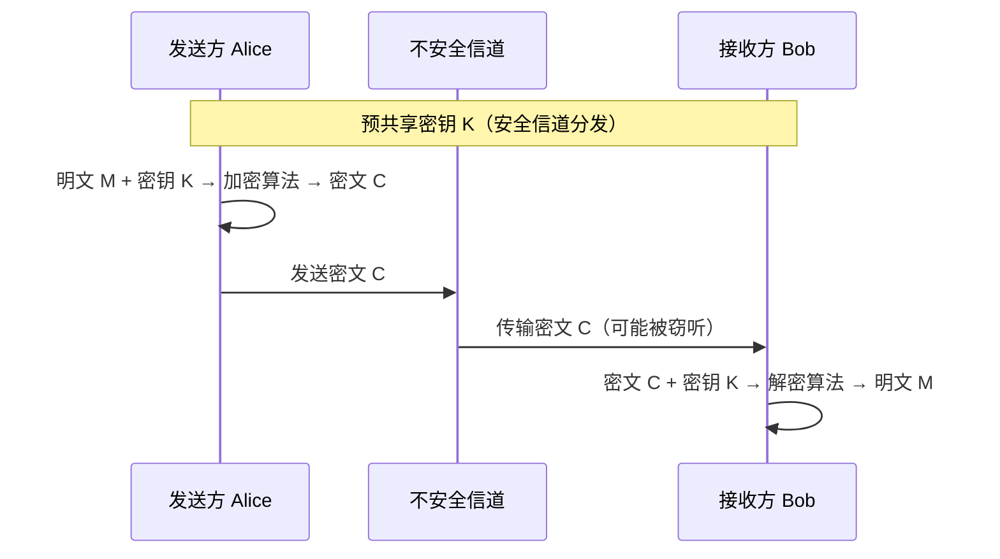
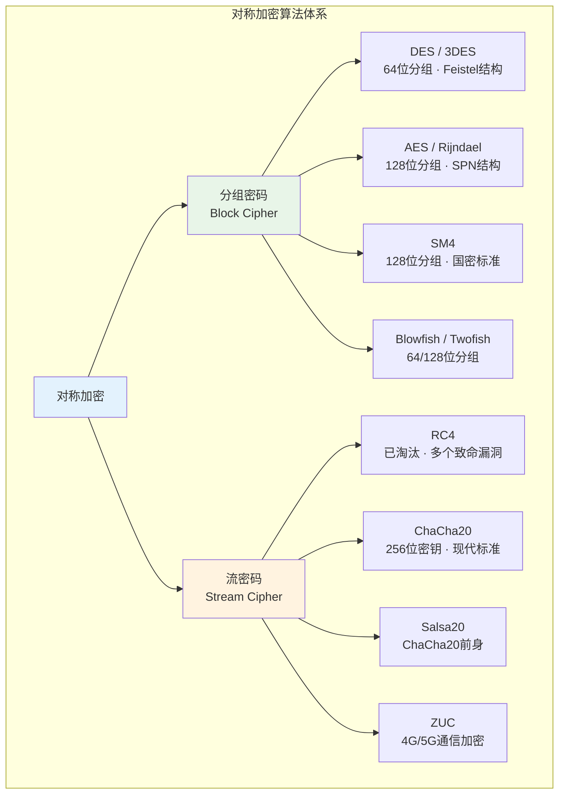
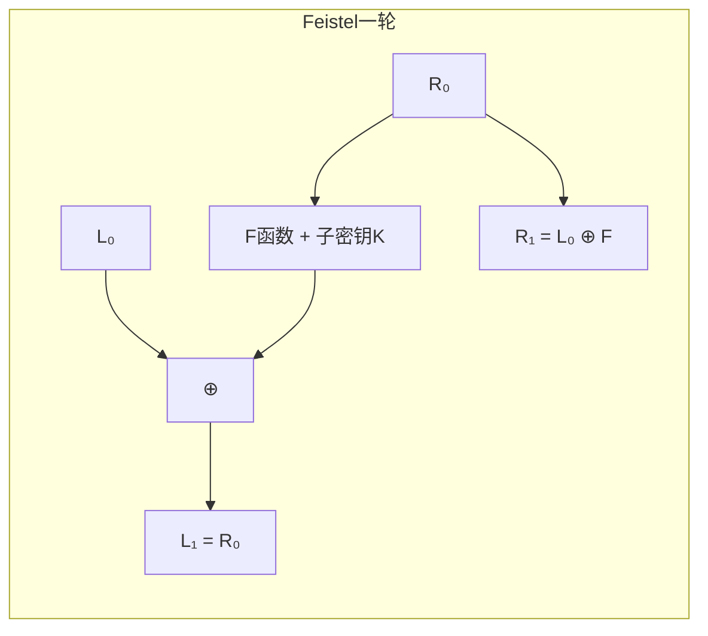
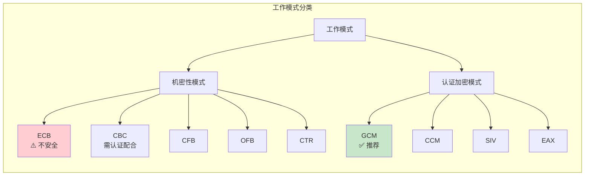
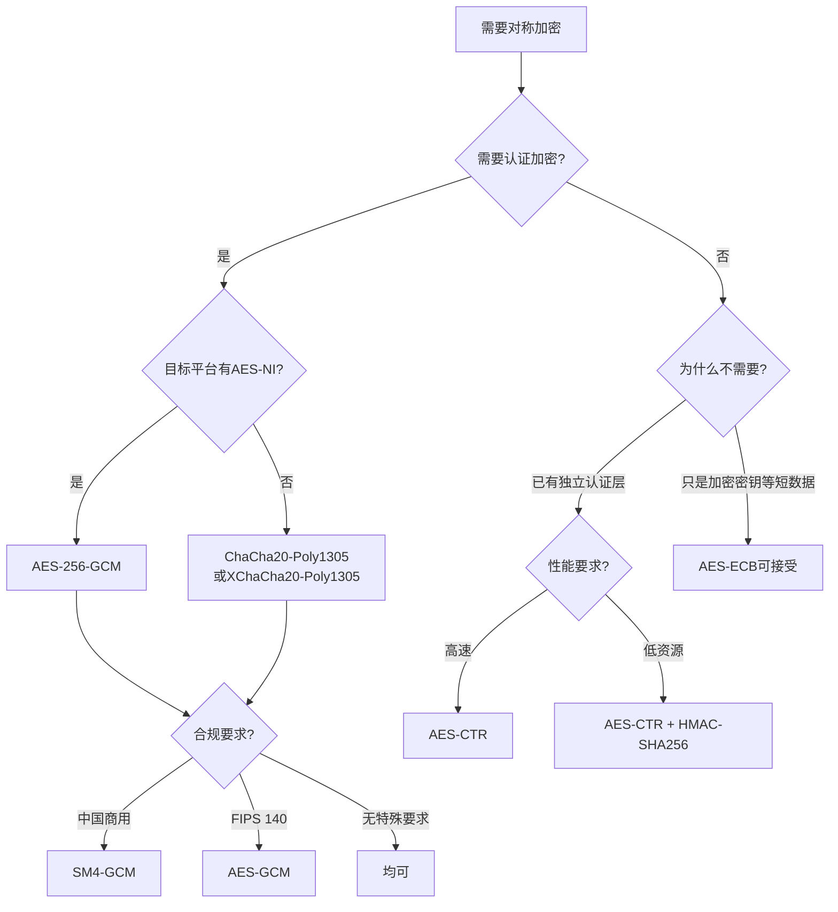

## 13.2 对称加密算法

对称加密是密码学中最古老、最高效、也是应用最广泛的加密范式。其核心思想朴素而强大——加密和解密使用同一个密钥。从古罗马的凯撒密码到现代TLS连接中的AES-GCM，对称加密始终是数据机密性的第一道防线。本节将从基本概念出发，经由分组密码和流密码两大分支，系统展开对称加密的完整知识体系。

### 13.2.1 对称加密的基本概念

#### 核心原理

对称加密系统由三个算法组成：

1. **密钥生成算法** `Gen(λ) → K`：以安全参数λ为输入，输出密钥K
2. **加密算法** `Enc(K, M) → C`：以密钥K和明文M为输入，输出密文C
3. **解密算法** `Dec(K, C) → M`：以密钥K和密文C为输入，恢复明文M

正确性要求：对任意由`Gen`生成的密钥K和任意合法明文M，恒有`Dec(K, Enc(K, M)) = M`。



#### 对称加密的优势与局限

| 维度 | 优势 | 局限 |
|------|------|------|
| **速度** | 比非对称加密快100-1000倍，AES-NI硬件加速下可达数GB/s | — |
| **资源消耗** | CPU和内存占用低，适合嵌入式和IoT设备 | — |
| **密钥管理** | — | n个通信方需要 n(n-1)/2 个密钥，扩展性差 |
| **密钥分发** | — | 必须通过安全信道分发密钥，这本身就是个难题 |
| **不可否认性** | — | 双方共享密钥，无法证明消息来源 |

正是由于密钥分发的局限性，实际系统普遍采用**混合加密**模式：用非对称加密（如RSA/ECDH）安全地交换对称密钥，再用对称密钥加密实际数据。TLS、SSH、PGP等协议均采用这种架构。

#### 对称加密的两大分支

根据加密粒度的不同，对称加密算法分为**分组密码**（Block Cipher）和**流密码**（Stream Cipher）两大类：



| 特征 | 分组密码 | 流密码 |
|------|----------|--------|
| **加密粒度** | 固定长度块（64或128位） | 逐位或逐字节 |
| **速度** | 需要填充，略有开销 | 无填充开销，连续处理 |
| **并行性** | CBC不可并行，CTR/GCM可并行 | 天然流式，但一般不并行 |
| **典型应用** | 磁盘加密、数据库加密、TLS | 实时通信、嵌入式设备、5G |
| **错误传播** | 部分模式下1位错误影响整个块 | 1位错误仅影响对应位 |

### 13.2.2 分组密码

分组密码将明文分成固定长度的块（通常64位或128位），每个块使用相同的密钥进行加密。分组密码是对称加密的核心构件，也是构建流密码、哈希函数、消息认证码的基础原语。

#### 设计原则：混淆与扩散

香农在1949年的论文中提出了密码设计的两大原则：

- **混淆（Confusion）**：使密文与密钥之间的关系尽可能复杂。典型实现：S盒（替换盒），将输入位映射为非线性输出
- **扩散（Diffusion）**：使明文每一位的影响扩散到尽可能多的密文位。典型实现：P盒（置换盒）和线性混合层

现代分组密码的每一轮都同时实现混淆和扩散，经过多轮迭代后，密文与明文之间的统计关系被彻底打散。

#### Feistel网络与SPN结构

分组密码的内部结构主要分为两大类：

**Feistel网络**（DES、Blowfish、Camellia采用）：
- 将块分为左右两半 L₀ 和 R₀
- 每轮执行：Lᵢ = Rᵢ₋₁，Rᵢ = Lᵢ₋₁ ⊕ F(Rᵢ₋₁, Kᵢ)
- 解密算法与加密算法结构相同，只需反转子密钥顺序
- 优势：F函数不需要可逆，设计灵活
- 劣势：每轮只加密一半数据，扩散效率较低



**替代-置换网络（SPN）**（AES、PRESENT采用）：
- 每轮对整个块进行替代（S盒）和置换（P盒/线性变换）
- 加密和解密使用不同的算法结构
- 优势：扩散速度快，每轮影响所有位
- 劣势：加解密实现不同，需要更多代码/电路

#### DES（数据加密标准）

DES（Data Encryption Standard）是密码学史上最重要的算法之一，于1977年被美国国家标准局（NBS，后更名为NIST）采纳为联邦信息处理标准（FIPS 46）。尽管已被淘汰，但理解DES对于掌握现代密码设计至关重要。

**算法参数：**
| 参数 | 值 |
|------|-----|
| 分组大小 | 64位 |
| 密钥长度 | 64位（其中8位为奇偶校验，有效密钥56位） |
| 轮数 | 16轮 |
| 结构 | Feistel网络 |
| F函数 | 扩展置换 → 与子密钥异或 → S盒替代 → P盒置换 |

**DES的加密过程：**

1. **初始置换（IP）**：对64位明文进行固定的位重排（这一步没有密码学意义，被认为是为了让硬件实现更方便）
2. **16轮Feistel迭代**：每轮使用48位子密钥（从56位主密钥通过密钥调度算法生成）
3. **左右交换**：最后一轮后左右两半不交换（与前15轮不同）
4. **逆初始置换（IP⁻¹）**：对结果进行IP的逆操作

**DES的F函数详细过程：**

1. **扩展置换（E盒）**：将32位R扩展为48位（部分位重复，增加冗余）
2. **密钥加**：48位扩展结果与48位子密钥进行异或
3. **S盒替代**：48位分成8组，每组6位送入一个S盒，输出4位（8个S盒共输出32位）。S盒是DES中唯一的非线性组件，也是其安全性的核心
4. **P盒置换**：对32位输出进行固定置换，实现位间的扩散

**密钥调度算法：**
- 64位主密钥去除8位奇偶校验位，得到56位
- 经过置换选择1（PC-1）分为28位的C₀和D₀
- 每轮左移1或2位（第1/2/9/16轮移2位，其余移1位）
- 经过置换选择2（PC-2）生成48位子密钥

**DES被淘汰的原因：**

56位有效密钥的密钥空间为 2⁵⁶ ≈ 7.2 × 10¹⁶。在1977年这足够大，但随着计算能力的增长：

- **1997年**：RSA公司的DES Challenge I，通过互联网分布式计算在96天内破解
- **1998年**：电子前沿基金会（EFF）建造的专用硬件"Deep Crack"在56小时内破解DES，造价约25万美元
- **1999年**：Deep Crack与分布式网络配合，22小时15分钟破解DES
- **2017年**：比特币挖矿算力如果转用于暴力破解DES，可在数秒内完成

**差分密码分析**（1990年，Biham和Shamir）：通过分析明文对差异对密文对差异的影响来恢复密钥。DES的S盒设计恰好对此类攻击有抵抗力——这揭示了NSA在S盒设计中确实植入了防御知识，但并未植入后门。

#### 3DES（三重DES）

3DES通过三次DES运算来扩大密钥空间，是DES到AES过渡期间的实际标准。

**三种密钥选项：**

| 模式 | 有效密钥长度 | 安全性 | 说明 |
|------|-------------|--------|------|
| DES-EEE3 | 168位 | 最高 | 三次加密，三个独立密钥 |
| DES-EDE3 | 168位 | 最高 | 加密-解密-加密，三个独立密钥（最常用） |
| DES-EDE2 | 112位 | 中等 | 加密-解密-加密，两个独立密钥（K₁=K₃） |

**EDE模式的加密过程：**
```text
C = E(K₃, D(K₂, E(K₁, M)))
```
使用"解密"操作在中间步骤并非密码学必要——选择EDE而非EEE仅仅是为了向后兼容单DES（当K₁=K₂=K₃时退化为单DES）。

**3DES的局限：**
- 速度是AES的约三分之一（三次运算）
- 64位分组大小在加密大量数据时存在安全风险（Sweet32攻击：当加密数据量超过2³²块时，存在生日攻击）
- NIST已于2023年正式废弃3DES（FIPS 46-3撤回）

#### AES（高级加密标准）

AES（Advanced Encryption Standard）是当今使用最广泛的对称加密算法，由比利时密码学家Joan Daemen和Vincent Rijmen设计的Rijndael算法赢得NIST公开竞赛后于2001年标准化（FIPS 197）。

**算法参数：**
| 参数 | 值 |
|------|-----|
| 分组大小 | 128位（16字节，表示为4×4字节矩阵） |
| 密钥长度 | 128/192/256位（分别对应10/12/14轮） |
| 结构 | 替代-置换网络（SPN） |
| 设计准则 | 抵抗差分和线性密码分析 |

**Rijndael赢得竞赛的原因：**
- 在所有候选算法中安全性与效率的最佳平衡
- 软件实现在普通CPU上即可达到高速
- 设计简洁，数学结构清晰（基于有限域GF(2⁸)运算）
- 硬件实现面积小，适合智能卡和嵌入式设备

**AES加密的四个核心操作：**

每一轮（最后一轮除外）包含四个步骤：

**① SubBytes（字节替代）—— 混淆层**
- 对状态矩阵的每个字节独立进行S盒替代
- S盒基于有限域GF(2⁸)上的乘法逆元和仿射变换构造
- 这是AES中唯一的非线性操作，提供混淆特性
- S盒的设计可证明具有最优的非线性度和差分均匀性

```text
S盒查找表（十六进制）：
 | 0  1  2  3  4  5  6  7  8  9  a  b  c  d  e  f
-+------------------------------------------------
0| 63 7c 77 7b f2 6b 6f c5 30 01 67 2b fe d7 ab 76
1| ca 82 c9 7d fa 59 47 f0 ad d4 a2 af 9c a4 72 c0
2| b7 fd 93 26 36 3f f7 cc 34 a5 e5 f1 71 d8 31 15
3| 04 c7 23 c3 18 96 05 9a 07 12 80 e2 eb 27 b2 75
...
```

**② ShiftRows（行移位）—— 扩散层**
- 状态矩阵的每一行循环左移不同的偏移量
- 第0行不移位，第1行左移1字节，第2行左移2字节，第3行左移3字节
- 作用：使不同列之间的字节产生关联，实现列间的扩散

```text
移位前：        移位后：
[ a0 a4 a8 a12 ]   [ a0  a4  a8  a12 ]
[ a1 a5 a9 a13 ]   [ a5  a9  a13 a1  ]
[ a2 a6 a10 a14]   [ a10 a14 a2  a6  ]
[ a3 a7 a11 a15]   [ a15 a3  a7  a11 ]
```

**③ MixColumns（列混合）—— 扩散层**
- 对每一列进行线性变换，将4个字节混合为4个新字节
- 运算基于GF(2⁸)上的矩阵乘法
- 作用：使列内每个字节的改变影响到整列所有字节
- 最后一轮省略此步骤（不影响安全性，但简化了逆运算）

**④ AddRoundKey（轮密钥加）**
- 将当前状态与本轮子密钥进行异或
- 这是密钥材料进入加密过程的唯一环节
- 128位密钥 × 11个轮密钥 = 1408位密钥材料

**AES密钥扩展：**
- 128位主密钥扩展为11个128位轮密钥（AES-128）
- 扩展过程包含：RotWord（4字节循环移位）、SubWord（S盒替代）、Rcon（轮常数异或）
- 密钥扩展算法的设计确保了轮密钥之间的独立性
- 相关密钥攻击（Related-Key Attack）：AES-192和AES-256在理论上有相关密钥攻击（Biryukov等，2009），但在实际场景中攻击者无法控制密钥关系，因此不构成威胁

**不同密钥长度的安全性：**

| 版本 | 密钥长度 | 轮数 | 安全级别 | 推荐程度 |
|------|---------|------|---------|---------|
| AES-128 | 128位 | 10 | 2¹²⁸次操作 | ✅ 足够安全，性能最优 |
| AES-192 | 192位 | 12 | 2¹⁹²次操作 | ✅ 安全，但实际优势有限 |
| AES-256 | 256位 | 14 | 2²⁵⁶次操作 | ✅ 最高安全级别，合规要求时使用 |

> **实践建议**：对于绝大多数应用，AES-128已经足够安全。选择AES-256通常是为了满足合规要求（如NSA Suite B要求256位密钥用于绝密级信息），而非因为AES-128不安全。

#### 国密SM4

SM4是中国国家密码管理局于2012年发布的分组密码标准（GM/T 0002-2012），原名SMS4。2016年正式成为国家标准（GB/T 32907-2016），是商用密码体系的核心算法之一。

| 参数 | 值 |
|------|-----|
| 分组大小 | 128位 |
| 密钥长度 | 128位 |
| 轮数 | 32轮 |
| 结构 | 非平衡Feistel网络（广义Feistel） |

SM4的每轮使用一个32位轮密钥，包含一个非线性变换τ（4个并行S盒）和一个线性变换L。32轮的安全裕度大于AES（AES-128用10轮，而SM4用32轮），其设计可证明能抵抗差分和线性密码分析。

#### 分组密码的工作模式

分组密码本身只能加密固定长度的数据块。工作模式（Mode of Operation）定义了如何将分组密码应用于任意长度的数据，以及如何处理多个数据块之间的关系。工作模式的选择对安全性的影响不亚于算法本身。



**ECB（电子密码本）模式：**

```text
明文: P₁ P₂ P₃ P₄ → 加密 → C₁ C₂ C₃ C₄
```

- 每个块独立加密，相同明文块产生相同密文块
- **致命缺陷**：保留了明文的统计模式。经典案例——Linux企鹅Tux的ECB加密图片仍然清晰可见轮廓
- **绝对禁止**用于加密任何具有结构的数据
- 唯一合法用途：加密单个随机数据块（如加密一个随机生成的密钥）

**CBC（密码块链接）模式：**

```text
P₁ ⊕ IV → E(K,·) → C₁
P₂ ⊕ C₁ → E(K,·) → C₂
P₃ ⊕ C₂ → E(K,·) → C₃
```

- 每个明文块在加密前先与前一个密文块异或
- 第一个块使用初始化向量（IV），IV必须不可预测（使用CSPRNG生成）
- 相同的明文在不同IV下产生不同的密文，消除了ECB的模式泄露
- **不能并行加密**（每块依赖前一块的密文），但**可以并行解密**
- **填充要求**：如果明文不是块大小的整数倍，需要填充。PKCS#7是最常用的填充方案
- **经典攻击——Padding Oracle**：如果服务器对填充错误和解密错误返回不同响应，攻击者可以逐字节恢复明文（Vaudenay, 2002）。应对方案：使用AEAD模式，或在验证填充前先验证MAC（Encrypt-then-MAC）

**CTR（计数器）模式：**

```text
E(K, Nonce||Ctr₁) ⊕ P₁ = C₁
E(K, Nonce||Ctr₂) ⊕ P₂ = C₂
E(K, Nonce||Ctr₃) ⊕ P₃ = C₃
```

- 将分组密码转换为流密码：加密递增的计数器，将输出与明文异或
- **可以完全并行处理**（加密和解密都可以）
- 不需要填充（可以处理任意长度的最后一块）
- **Nonce必须唯一**：同一密钥下重用Nonce会导致密钥流重复，攻击者可通过异或两个密文消除密钥流，得到两个明文的异或值——这在实践中是致命的
- 随机Nonce：64位随机Nonce在加密约2³²个块后有50%概率出现碰撞；计数器Nonce：需要安全的计数器管理

**GCM（伽罗瓦/计数器模式）—— 认证加密：**

GCM是当前最广泛使用的认证加密（AEAD）模式，同时提供机密性、完整性和真实性。

```text
认证加密: (C, T) = AES-GCM(K, IV, A, P)
认证解密: P or ⊥ = AES-GCM⁻¹(K, IV, A, C, T)
```

- 基于CTR模式提供加密，基于GHASH（伽罗瓦域哈希）提供认证
- 输入参数：密钥K、IV、附加认证数据A（AAD，不加密但受完整性保护）、明文P
- 输出：密文C和认证标签T（通常128位）
- **性能优势**：加密和认证可以高度并行，且GHASH可以用硬件（CLMUL指令）高效实现
- **使用注意**：同一密钥下的IV绝对不能重复。推荐使用96位随机IV或（48位固定部分 + 80位计数器）的组合
- **标签截断风险**：将128位标签截断到32位会将伪造概率从2⁻¹²⁸降低到2⁻³²——对于高吞吐量系统来说不够安全

**各模式综合对比：**

| 模式 | 并行加密 | 并行解密 | 填充 | 认证 | Nonce唯一性 | 推荐场景 |
|------|---------|---------|------|------|------------|---------|
| ECB | ✅ | ✅ | 需要 | ❌ | — | ❌ 几乎不推荐 |
| CBC | ❌ | ✅ | 需要 | ❌ | IV不可预测 | 遗留系统，配合HMAC |
| CTR | ✅ | ✅ | 不需要 | ❌ | 绝对唯一 | 通用加密 |
| GCM | ✅ | ✅ | 不需要 | ✅ | 绝对唯一 | ✅ TLS、VPN、通用 |
| CCM | ❌ | ❌ | 不需要 | ✅ | 绝对唯一 | WPA3、蓝牙 |
| XChaCha20-Poly1305 | ✅ | ✅ | 不需要 | ✅ | 随机安全 | WireGuard、libsodium |

> **实践建议**：新项目应直接使用AES-256-GCM或ChaCha20-Poly1305。如果必须使用CBC模式，务必配合HMAC使用Encrypt-then-MAC方案，并严格验证MAC后再处理填充。

#### 填充方案

当明文长度不是分组大小的整数倍时，需要进行填充。填充方案的选择影响安全性和互操作性。

**PKCS#7 填充（最常用）：**
```text
原始数据: 48 65 6C 6C 6F    (5字节)
填充后:   48 65 6C 6C 6F 0B 0B 0B 0B 0B 0B 0B 0B 0B 0B 0B  (16字节，填充11个0x0B)
```
- 填充值等于需要填充的字节数
- 如果数据恰好是块大小的整数倍，需要添加一个完整块的填充
- 解密后检查最后一个字节确定填充长度，并验证所有填充字节是否一致

**ANSI X.923 填充：**
- 填充字节除最后一个外全为0x00，最后一个字节为填充长度
- 比PKCS#7更容易在十六进制查看器中识别

**ISO 10126 填充（已废弃）：**
- 除最后一个字节外填充随机值，最后一个字节为填充长度
- 提供少量随机性但已不再推荐

**Zero Padding：**
- 用零字节填充
- 缺陷：无法区分数据末尾的零字节是填充还是数据本身
- 仅适用于数据长度已知的场景（如加密固定长度的密钥）

### 13.2.3 流密码

流密码通过生成伪随机密钥流并与明文逐位异或来加密数据。在数学上，流密码的加密过程可以表示为：C = P ⊕ KS，其中KS是由密钥和初始向量决定的伪随机密钥流。解密过程完全相同：P = C ⊕ KS（因为异或操作的自逆性）。

#### 流密码的核心安全性要求

1. **密钥流的周期足够长**：密钥流不应在实际使用中重复
2. **统计特性接近真随机**：通过所有可计算的统计测试
3. **不可预测性**：即使知道密钥流的前n位，也无法以优于随机猜测的概率预测第n+1位
4. **密钥和Nonce的唯一性**：绝对不能用相同密钥和Nonce加密两条不同消息

#### RC4——从辉煌到淘汰

RC4（Rivest Cipher 4）由Ron Rivest于1987年设计，曾是最广泛使用的流密码之一。它被用于SSL/TLS（RC4选项）、WEP无线加密和多种专有协议中。

**算法结构：**

RC4由两个阶段组成：

1. **密钥调度算法（KSA）**：初始化256字节的状态数组S
```python
def KSA(key):
    S = list(range(256))
    j = 0
    for i in range(256):
        j = (j + S[i] + key[i % len(key)]) % 256
        S[i], S[j] = S[j], S[i]
    return S
```

2. **伪随机生成算法（PRGA）**：从状态数组生成密钥流
```python
def PRGA(S):
    i = j = 0
    while True:
        i = (i + 1) % 256
        j = (j + S[i]) % 256
        S[i], S[j] = S[j], S[i]
        yield S[(S[i] + S[j]) % 256]
```

**RC4被废弃的原因：**

| 漏洞 | 年份 | 严重程度 | 说明 |
|------|------|---------|------|
| 密钥流偏差 | 2001 | 高 | 密钥流前几位存在统计偏差，可恢复部分明文 |
| Fluhrer-Mantin-Shamir攻击 | 2001 | 致命 | 针对WEP协议，可在数分钟内恢复WEP密钥 |
| Bar-Mitzvah攻击 | 2013 | 高 | 利用RC4密钥流中1/256的初始字节偏差 |
| NOMORE攻击 | 2015 | 致命 | 对TLS中的RC4实施实际可行的密码分析 |
| RFC 7465 | 2015 | — | IETF正式禁止在TLS中使用RC4 |

RC4的教训：一个算法即使没有被彻底"破解"，其统计偏差的累积效应也可能使其在实际应用中不安全。安全标准不是"能否破解"的二元判断，而是"偏差是否小到可接受"的量化评估。

#### ChaCha20——现代流密码标准

ChaCha20由Daniel J. Bernstein于2008年设计（ChaCha20是Salsa20的改进版本），是当今最重要的流密码之一，与AES并列为现代加密的两大主力。

**算法参数：**
| 参数 | 值 |
|------|-----|
| 密钥长度 | 256位（32字节） |
| Nonce长度 | 96位（12字节）或192位（XChaCha20） |
| 块大小 | 512位（64字节，16个32位字） |
| 轮数 | 20轮（10次double-round） |

**核心操作——Quarter Round：**
ChaCha20的每一轮由4个Quarter Round组成。一个Quarter Round对4个32位字执行以下操作：
```text
a += b; d ^= a; d <<<= 16;
c += d; b ^= c; b <<<= 12;
a += b; d ^= a; d <<<= 8;
c += d; b ^= c; b <<<= 7;
```
全部操作为加法、异或和循环移位——这些在所有CPU架构上都是高效的原生操作。

**ChaCha20 vs AES：**

| 维度 | AES | ChaCha20 |
|------|-----|----------|
| **硬件加速** | 需要AES-NI指令集 | 不需要特殊硬件 |
| **无硬件加速时** | 速度较慢（S盒需要查表） | 速度快（只有加法/异或/移位） |
| **有硬件加速时** | 非常快（~1 cpb） | 中等（~3-4 cpb） |
| **侧信道抗性** | 软件实现易受缓存时序攻击 | 天然恒定时间 |
| **适合场景** | 服务器（有AES-NI） | 移动设备、IoT（无AES-NI） |
| **标准化** | FIPS 197 | RFC 8439 |

> **为什么TLS 1.3同时保留AES和ChaCha20？** 服务器有AES-NI时优选AES-GCM，客户端（尤其是手机）无AES-NI时使用ChaCha20-Poly1305。这就是为什么你在Chrome的`chrome://flags`中可以看到"ChaCha20-Poly1305"选项。

**XChaCha20-Poly1305：**
- 将Nonce从96位扩展到192位（使用HChaCha20对前128位进行密钥派生）
- 解决了ChaCha20的Nonce管理难题：192位随机Nonce在实践中不会碰撞
- 被libsodium、WireGuard等采用

#### ZUC——5G通信的加密核心

ZUC（祖冲之算法）是中国自主设计的流密码算法，是3GPP标准中4G LTE和5G NR的加密算法之一。

| 参数 | 值 |
|------|-----|
| 密钥长度 | 128位 |
| 初始向量 | 128位 |
| 输出 | 32位密钥字/时钟周期 |
| 结构 | LFSR + 非线性函数F |

ZUC包含两个算法：128-EEA3（加密算法）和128-EIA3（完整性算法），分别用于数据加密和消息认证。截至2024年，ZUC没有已知的实用密码分析攻击。

### 13.2.4 认证加密（AEAD）

传统上，加密（机密性）和认证（完整性+真实性）是分别实现的。但"分别实现、分别部署"的模式在实践中导致了大量安全漏洞——开发者要么忘记添加认证，要么使用了不安全的组合方式。认证加密（Authenticated Encryption with Associated Data，AEAD）将两者合并为一个原子操作，从根本上消除了这类风险。

#### 为什么需要认证加密

未认证的加密模式（如纯CBC、纯CTR）面临以下攻击：

- **密文篡改**：攻击者可以翻转密文中的特定位，导致明文中对应位被翻转
- **Padding Oracle攻击**：CBC模式下，服务器的错误消息泄露填充是否正确，攻击者可逐字节恢复明文
- **密文重放**：将截获的密文重新发送
- **密文拼接**：将不同消息的密文片段组合成新的"有效"密文

AEAD模式通过认证标签（Tag）一次性解决所有这些问题。

#### AEAD的安全目标

AEAD方案的安全性定义为两个属性：

1. **密文不可区分性（IND-CPA）**：攻击者无法区分两条消息的密文（即使可以选择明文）
2. **密文不可伪造性（INT-CTXT）**：攻击者无法生成一个未由加密算法产生的有效（密文，标签）对

满足这两个属性的AEAD方案，即使在攻击者能够选择密文解密（CCA2）的场景下也保持安全。

#### 主要AEAD方案对比

| 方案 | 底层密码 | 认证方式 | 性能特征 | 采用情况 |
|------|---------|---------|---------|---------|
| **AES-128/256-GCM** | AES + GHASH | GMAC | 有AES-NI + CLMUL时极快 | TLS 1.3默认 |
| **ChaCha20-Poly1305** | ChaCha20 + Poly1305 | MAC | 无AES-NI时比GCM快 | TLS 1.3、WireGuard |
| **AES-CCM** | AES + CBC-MAC | MAC先于加密 | 比GCM慢但实现简单 | WPA3、蓝牙LE |
| **AES-GCM-SIV** | AES + POLYVAL | SIV模式 | 抗Nonce重用 | Google Tink |
| **XChaCha20-Poly1305** | XChaCha20 + Poly1305 | MAC | 192位Nonce，随机安全 | libsodium |

### 13.2.5 侧信道攻击与防护

密码算法的数学安全性不等于实现的安全性。侧信道攻击利用算法实现过程中泄露的物理信息（时间、功耗、电磁辐射、声音）来恢复密钥，绕过了数学层面的全部安全保证。

#### 时序攻击（Timing Attack）

2003年，Bernstein发表了针对AES软件实现的时序攻击研究。由于AES的S盒查表操作会触发CPU缓存的不同行，不同密钥字节导致的缓存命中/未命中模式会产生可测量的时间差异。

**攻击原理：**
```text
缓存行大小通常为64字节
AES S盒为256字节 = 4个缓存行
密钥字节决定查表索引 → 决定访问哪个缓存行 → 决定访问时间
通过统计大量加密操作的时间分布 → 恢复密钥
```

**防护措施：**

1. **位切片实现**：将S盒操作转化为纯布尔运算，不使用查表
2. **AES-NI硬件指令**：CPU直接执行AES操作，完全避免软件查表
3. **恒定时间编程**：确保所有代码路径执行时间完全相同
```c
// 不安全：条件分支导致时间泄露
if (condition) { result = a; } else { result = b; }

// 安全：恒定时间选择
result = a ^ ((a ^ b) & (-condition));
```
4. **预取整个S盒**：一次性将S盒加载到L1缓存，消除缓存未命中的差异

#### 功耗分析攻击（Power Analysis）

- **SPA（简单功耗分析）**：直接观察单次加密操作的功耗曲线，识别轮数和操作类型
- **DPA（差分功耗分析）**：收集大量功耗样本，通过统计分析（相关性/差分）恢复密钥
- **防护**：掩码技术（Masking）——将敏感中间值拆分为多个随机分享值，在最后一刻才合并

### 13.2.6 对称加密算法选型指南

在实际项目中选择对称加密算法需要综合考虑安全性、性能、合规性和生态支持。

#### 选型决策树



#### 常见场景推荐

| 场景 | 推荐算法 | 理由 |
|------|---------|------|
| Web/TLS | AES-256-GCM 或 ChaCha20-Poly1305 | TLS 1.3标准，浏览器全面支持 |
| 磁盘加密 | AES-256-XTS | XTS模式专为存储加密设计，允许随机访问 |
| 数据库列级加密 | AES-256-GCM | 需要认证防止篡改 |
| IoT/嵌入式 | ChaCha20-Poly1305 | 无需硬件加速，恒定时间 |
| 中国商用系统 | SM4-GCM 或 SM4-CTR+SM3-HMAC | 国密合规要求 |
| 密钥包装 | AES-256-KWP (RFC 5649) | 专用密钥包装模式 |
| 文件加密 | AES-256-GCM + 分段加密 | 每段独立IV和标签 |

### 13.2.7 Python实战：对称加密编程

#### 使用PyCryptodome实现AES-GCM

```python
from Crypto.Cipher import AES
from Crypto.Random import get_random_bytes
import json, base64

def aes_gcm_encrypt(plaintext: str, key: bytes) -> dict:
    """
    AES-256-GCM认证加密
    
    参数:
        plaintext: 明文字符串
        key: 32字节密钥
        
    返回:
        包含nonce、ciphertext、tag的字典（均base64编码）
    """
    cipher = AES.new(key, AES.MODE_GCM)
    # 附加认证数据：可以绑定上下文信息（如用户ID、时间戳）
    aad = b"v1.0"
    cipher.update(aad)
    ciphertext, tag = cipher.encrypt_and_digest(plaintext.encode('utf-8'))
    
    return {
        'version': 'v1.0',
        'nonce': base64.b64encode(cipher.nonce).decode(),
        'ciphertext': base64.b64encode(ciphertext).decode(),
        'tag': base64.b64encode(tag).decode()
    }

def aes_gcm_decrypt(encrypted: dict, key: bytes) -> str:
    """
    AES-256-GCM认证解密
    """
    nonce = base64.b64decode(encrypted['nonce'])
    ciphertext = base64.b64decode(encrypted['ciphertext'])
    tag = base64.b64decode(encrypted['tag'])
    
    cipher = AES.new(key, AES.MODE_GCM, nonce=nonce)
    aad = b"v1.0"
    cipher.update(aad)
    
    # decrypt_and_digest在标签验证失败时抛出ValueError
    # 这是正确的做法——绝不输出未经认证的明文
    plaintext = cipher.decrypt_and_verify(ciphertext, tag)
    return plaintext.decode('utf-8')

# 使用示例
key = get_random_bytes(32)  # 256位密钥
encrypted = aes_gcm_encrypt("这是一条秘密消息", key)
print(f"加密结果: {json.dumps(encrypted, indent=2)}")

decrypted = aes_gcm_decrypt(encrypted, key)
print(f"解密结果: {decrypted}")
```

#### 使用libsodium实现XChaCha20-Poly1305

```python
import nacl.secret
import nacl.utils

def xchacha20_encrypt(plaintext: str, key: bytes) -> dict:
    """
    XChaCha20-Poly1305认证加密
    使用192位随机Nonce，无需管理Nonce状态
    """
    box = nacl.secret.SecretBox(key)
    nonce = nacl.utils.random(nonce_size=nacl.secret.SecretBox.NONCE_SIZE)  # 24字节
    encrypted = box.encrypt(plaintext.encode('utf-8'), nonce)
    
    return {
        'nonce': encrypted[:nacl.secret.SecretBox.NONCE_SIZE].hex(),
        'ciphertext': encrypted[nacl.secret.SecretBox.NONCE_SIZE:].hex()
    }

def xchacha20_decrypt(encrypted: dict, key: bytes) -> str:
    box = nacl.secret.SecretBox(key)
    nonce = bytes.fromhex(encrypted['nonce'])
    ciphertext = bytes.fromhex(encrypted['ciphertext'])
    
    # libsodium将nonce和密文拼接传递
    plaintext = box.decrypt(nonce + ciphertext)
    return plaintext.decode('utf-8')
```

#### 使用SM4（gmssl库）

```python
# pip install gmssl
from gmssl import sm4

def sm4_cbc_encrypt(plaintext: bytes, key: bytes, iv: bytes) -> bytes:
    """SM4-CBC加密（PKCS7填充）"""
    crypt = sm4.CryptSM4()
    crypt.set_key(key, sm4.SM4_ENCRYPT)
    return crypt.cbc_encrypt(plaintext, iv)

def sm4_cbc_decrypt(ciphertext: bytes, key: bytes, iv: bytes) -> bytes:
    """SM4-CBC解密"""
    crypt = sm4.CryptSM4()
    crypt.set_key(key, sm4.SM4_DECRYPT)
    return crypt.cbc_decrypt(ciphertext, iv)
```

#### OpenSSL命令行操作

```bash
# AES-256-GCM加密文件
openssl enc -aes-256-gcm -salt -pbkdf2 -iter 100000 \
    -in plaintext.txt -out encrypted.bin -pass pass:MyPassword

# AES-256-GCM解密文件
openssl enc -aes-256-gcm -d -pbkdf2 -iter 100000 \
    -in encrypted.bin -out decrypted.txt -pass pass:MyPassword

# 生成随机密钥（base64输出）
openssl rand -base64 32

# ChaCha20-Poly1305加密
openssl enc -chacha20-poly1305 -salt -pbkdf2 -iter 100000 \
    -in plaintext.txt -out encrypted.bin -pass pass:MyPassword

# 查看支持的加密算法列表
openssl enc -list
```

### 13.2.8 历史教训与常见误区

#### 案例一：WEP协议的全线崩溃

Wi-Fi的WEP协议使用RC4加密，暴露了多个致命的设计缺陷：

1. **24位IV太短**：在繁忙网络中几小时内就会出现IV重用
2. **IV以明文传输**：攻击者可以直接观察到IV碰撞
3. **IV重用导致密钥流重用**：C₁ ⊕ C₂ = P₁ ⊕ P₂，统计方法可恢复明文
4. **CRC-32不提供认证**：Bit-flipping攻击可篡改密文而不被发现
5. **密钥与IV直接拼接**：导致Fluhrer-Mantin-Shamir攻击，可直接恢复完整密钥

**教训**：正确的算法 + 错误的使用方式 = 灾难。WEP的RC4本身没有被"破解"，而是协议设计中的多个缺陷共同导致了系统性崩溃。现代WPA3使用AES-GCMP-SHA384替代了WEP的全部设计。

#### 案例二：CVE-2016-2107（OpenSSL Padding Oracle）

OpenSSL在实现AES-CBC解密时，存在一个微妙的timing差异——MAC验证失败和填充验证失败的代码路径执行时间略有不同。这个差异只有几纳秒，但足以让远程攻击者利用。修复方案是确保所有错误路径使用恒定时间返回。

#### 案例三：Nonce重用灾难

AES-GCM对Nonce重用极其敏感——同一密钥下两次使用相同Nonce会导致认证标签密钥H被泄露，攻击者可以伪造任意消息的认证标签。这不是理论风险：

- 2016年，CVE-2016-0270：IBM JDK的AES-GCM实现在多线程环境下Nonce可能重复
- 2019年，多个TLS实现在大量连接后出现IV碰撞

**防护**：
- 使用96位随机Nonce：确保密钥加密的数据量不超过约2³²个块
- 使用计数器Nonce：维护持久化的计数器
- 使用AES-GCM-SIV：对Nonce重用有更强的抵抗力（但Nonce重用仍会降低安全性到"仅机密性"）

#### 常见误区清单

| 误区 | 正确做法 |
|------|---------|
| "我用了AES就安全了" | AES + ECB模式完全不安全。算法不等于方案 |
| "自己实现了AES加解密" | 使用经过验证的库，不要自己实现。数学正确≠实现安全 |
| "IV可以是固定值" | IV/Nonce必须满足算法要求的唯一性或不可预测性 |
| "加密后不需要校验" | 必须使用AEAD或独立的MAC。未认证的加密形同虚设 |
| "密钥直接写在代码里" | 使用密钥管理服务（KMS）或硬件安全模块（HSM） |
| "64位分组密码没问题" | 64位分组在加密大量数据时存在生日攻击风险 |
| "RC4简单快速能用" | 已被禁用。任何新系统都不应使用RC4 |

---

> **本节要点回顾**
>
> 1. 对称加密分为分组密码和流密码两大类，现代系统普遍使用AEAD模式
> 2. AES是当前唯一的标准化分组密码选择，ChaCha20-Poly1305是无AES-NI环境的优选
> 3. 工作模式的选择直接影响安全性——新项目使用GCM或ChaCha20-Poly1305
> 4. 实现安全性与数学安全性同等重要——使用成熟库，避免侧信道泄露
> 5. Nonce/IV管理是对称加密中最常见的出错点——要么保证唯一，要么使用SIV模式
