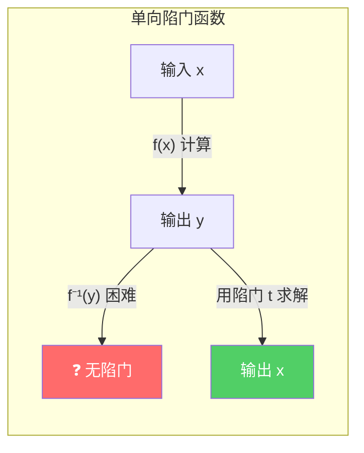
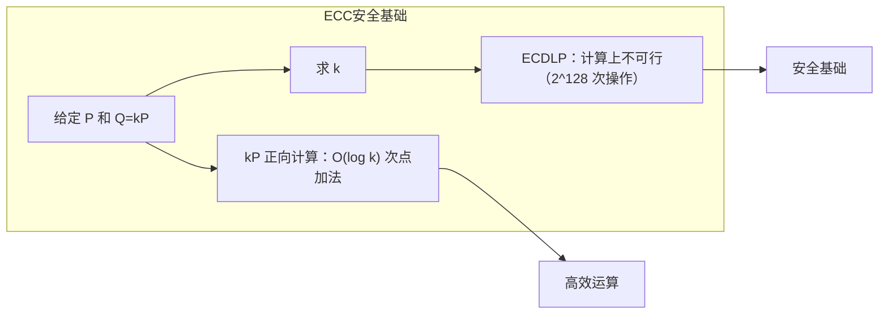
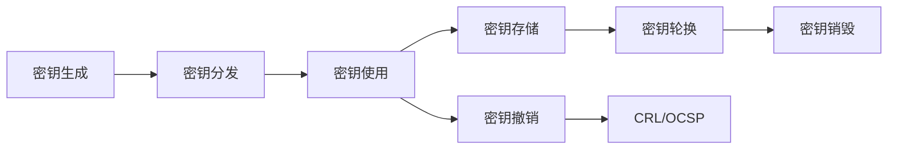

## 13.3 非对称加密算法

对称加密的致命弱点在于密钥分发——通信双方必须预先共享同一把密钥，而密钥本身的安全传输又需要另一条安全信道，形成"先有鸡还是先有蛋"的困境。1976年，Whitfield Diffie和Martin Hellman发表了《密码学的新方向》，首次提出了公钥密码学（Public Key Cryptography）的概念，从根本上改变了密码学的格局。每个参与者拥有一对数学关联的密钥：**公钥**可以公开分发给任何人，**私钥**必须由持有者严格保密。这对密钥具有非对称性质——公钥加密的数据只能用对应私钥解密，私钥签名的数据只能用对应公钥验证。

### 13.3.1 公钥密码学的数学基础

公钥密码学的安全性建立在几个经典的**单向陷门函数**（Trapdoor One-Way Function）之上。单向函数的特点是正向计算容易、逆向计算极其困难；而"陷门"则指存在一个秘密信息（私钥），持有它可以高效地完成逆向运算。

| 困难问题 | 数学描述 | 典型算法 | 安全强度基础 |
|---------|---------|---------|------------|
| 大整数分解（IFP） | 给定 n = p × q，求 p 和 q | RSA | 分解2048位整数约需 2^112 次操作 |
| 离散对数（DLP） | 给定 g, h, p，求 x 使得 g^x ≡ h (mod p) | DH, ElGamal, DSA | 与 IFP 安全性相当 |
| 椭圆曲线离散对数（ECDLP） | 给定椭圆曲线上点 P 和 Q = kP，求 k | ECDH, ECDSA, EdDSA | 256位ECC ≈ 3072位RSA |
| 格问题（Lattice） | 最短向量问题（SVP）、学习含误差（LWE） | CRYSTALS-Kyber/Dilithium | 后量子安全 |



**为什么这些问题"困难"？** 它们并非已被证明是计算上不可行的（NP-hard至今未被证明），而是经过几十年的密码分析，至今没有发现多项式时间算法。密码学的安全性是**经验性的**——基于当前最好的攻击算法所需计算量来评估。一旦某个问题被突破（如量子计算机破解ECDLP），依赖该问题的所有算法都会失效。

### 13.3.2 Diffie-Hellman密钥交换

Diffie-Hellman（DH）密钥交换是第一个公开的公钥密码协议，虽然它不是加密算法，但它是理解整个公钥密码体系的基石。

**协议流程：**

```text
公开参数：大质数 p，生成元 g（通常 g=2）

Alice                                    Bob
─────                                    ───
选择私密随机数 a                          选择私密随机数 b
计算 A = g^a mod p          ──A──>       计算 B = g^b mod p
                              <──B──
计算共享密钥 K = B^a mod p                计算共享密钥 K = A^b mod p

数学验证：B^a = (g^b)^a = g^(ab) = (g^a)^b = A^b
```

窃听者Eve只能看到 p、g、A、B，但无法高效计算 g^(ab) mod p——这就是**离散对数问题**。

**实际安全考量：**
- p的位数至少2048位（NIST SP 800-56A标准）
- 生成元g的选择影响安全性，通常使用g=2
- 原始DH不提供身份认证，容易遭受**中间人攻击（MITM）**——必须配合数字签名或证书使用
- DH本身不提供**前向保密**，必须使用**临时DH（DHE）**或**椭圆曲线临时DH（ECDHE）**实现

```python
# Python 演示 DH 密钥交换（仅用于教学，生产环境请用标准库）
import hashlib, secrets

def dh_key_exchange():
    # 使用 RFC 3526 的 2048-bit MODP Group 参数
    p = int(
        "FFFFFFFFFFFFFFFFC90FDAA22168C234C4C6628B80DC1CD1"
        "29024E088A67CC74020BBEA63B139B22514A08798E3404DD"
        "EF9519B3CD3A431B302B0A6DF25F14374FE1356D6D51C245"
        "E485B576625E7EC6F44C42E9A637ED6B0BFF5CB6F406B7ED"
        "EE386BFB5A899FA5AE9F24117C4B1FE649286651ECE45B3D"
        "C2007CB8A163BF0598DA48361C55D39A69163FA8FD24CF5F"
        "83655D23DCA3AD961C62F356208552BB9ED529077096966D"
        "670C354E4ABC9804F1746C08CA18217C32905E462E36CE3B"
        "E39E772C180E86039B2783A2EC07A28FB5C55DF06F4C52C9"
        "DE2BCBF6955817183995497CEA956AE515D2261898FA0510"
        "15728E5A8AACAA68FFFFFFFFFFFFFFFF", 16
    )
    g = 2

    # Alice
    a = secrets.randbelow(p - 2) + 1
    A = pow(g, a, p)

    # Bob
    b = secrets.randbelow(p - 2) + 1
    B = pow(g, b, p)

    # 双方分别计算共享密钥
    K_alice = pow(B, a, p)
    K_bob = pow(A, b, p)

    assert K_alice == K_bob, "共享密钥必须一致"
    shared_key = hashlib.sha256(K_alice.to_bytes(256, 'big')).hexdigest()
    return shared_key

key = dh_key_exchange()
print(f"DH 共享密钥: {key[:32]}...")
```

### 13.3.3 RSA算法

RSA算法由Ron Rivest、Adi Shamir和Leonard Adleman于1977年提出，至今仍是应用最广泛的公钥算法之一。它基于大整数分解的困难性。

#### 13.3.3.1 密钥生成

```python
from sympy import isprime, mod_inverse
import secrets

def generate_rsa_keys(bits=2048):
    """生成RSA密钥对"""
    # 第一步：选择两个大质数
    while True:
        p = secrets.randbits(bits // 2)
        if isprime(p) and p.bit_length() == bits // 2:
            break
    while True:
        q = secrets.randbits(bits // 2)
        if isprime(q) and q != p and q.bit_length() == bits // 2:
            break

    # 第二步：计算模数
    n = p * q

    # 第三步：计算欧拉函数
    phi_n = (p - 1) * (q - 1)

    # 第四步：选择公钥指数
    e = 65537  # 标准选择：2^16 + 1，素数，汉明权重小，加密快

    # 第五步：计算私钥指数
    d = mod_inverse(e, phi_n)

    # 第六步：计算CRT参数（优化解密速度）
    dp = d % (p - 1)
    dq = d % (q - 1)
    q_inv = mod_inverse(q, p)

    public_key = (n, e)
    private_key = (n, d, p, q, dp, dq, q_inv)
    return public_key, private_key
```

**密钥生成的安全要点：**
- p和q必须是**强随机**质数，不能用弱随机源
- p和q的位数必须相近（均为n的一半），但不能太接近（否则可用Fermat分解攻击）
- |p - q| 必须足够大，至少相差 2^(bits/2 - 100)
- 不能使用同一个n的多个密钥对（共享素数攻击）
- e = 65537 是行业标准选择，避免使用 e = 3（易受广播攻击）或过大的e

#### 13.3.3.2 加密与解密

```text
加密：c = m^e mod n
解密：m = c^d mod n

数学原理：根据欧拉定理，m^(ed) ≡ m (mod n)
当 ed ≡ 1 (mod φ(n)) 时成立
```

**裸RSA是不安全的！** 直接使用上述公式存在严重的安全缺陷：
- **确定性加密**：相同明文产生相同密文，泄露模式信息
- **小指数攻击**：若m^e < n，可直接开e次方根恢复明文
- **同态性质**：E(m1) × E(m2) = E(m1 × m2)，允许构造性攻击

因此实际使用中必须配合**填充方案**（Padding Scheme）。

#### 13.3.3.3 RSA填充方案

| 填充方案 | 标准 | 安全性 | 用途 | 推荐程度 |
|---------|------|-------|------|---------|
| PKCS#1 v1.5 | RFC 8017 | 已有攻击（Bleichenbacher 1998） | 历史兼容 | ❌ 不推荐新系统使用 |
| OAEP | RFC 8017 | 语义安全（IND-CCA2） | 加密 | ✅ 推荐 |
| PSS | RFC 8017 | 语义安全 | 签名 | ✅ 推荐 |

**OAEP（Optimal Asymmetric Encryption Padding）工作原理：**

```text
OAEP 填充过程：
1. 将明文 M 填充为 DB = Hash(L) || PS || 0x01 || M
   - L：标签（默认空）
   - PS：零字节填充至总长度
2. 生成随机种子 seed
3. 用掩码生成函数 MGF1：
   dbMask = MGF(seed, len(DB))
   maskedDB = DB ⊕ dbMask
   seedMask = MGF(maskedDB, len(seed))
   maskedSeed = seed ⊕ seedMask
4. 编码消息 EM = 0x00 || maskedSeed || maskedDB
5. 对 EM 执行 RSA 加密
```

```python
from cryptography.hazmat.primitives.asymmetric import padding
from cryptography.hazmat.primitives import hashes

# 正确的 RSA 加密（使用 OAEP）
def rsa_encrypt_oaep(public_key, plaintext: bytes) -> bytes:
    ciphertext = public_key.encrypt(
        plaintext,
        padding.OAEP(
            mgf=padding.MGF1(algorithm=hashes.SHA256()),
            algorithm=hashes.SHA256(),
            label=None
        )
    )
    return ciphertext

# 正确的 RSA 解密
def rsa_decrypt_oaep(private_key, ciphertext: bytes) -> bytes:
    plaintext = private_key.decrypt(
        ciphertext,
        padding.OAEP(
            mgf=padding.MGF1(algorithm=hashes.SHA256()),
            algorithm=hashes.SHA256(),
            label=None
        )
    )
    return plaintext
```

#### 13.3.3.4 RSA常见攻击与防御

| 攻击名称 | 攻击原理 | 影响 | 防御措施 |
|---------|---------|------|---------|
| 共模攻击 | 同一n用不同e加密同一明文：c1=m^e1, c2=m^e2，用扩展欧几里得算法恢复m | 泄露明文 | 每个系统使用独立密钥对 |
| 低加密指数广播攻击 | e=3，对3个接收者加密同一明文，CRT恢复m | 泄露明文 | 使用 e=65537 |
| Håstad广播攻击 | e个线性相关明文的加密结果可被恢复 | 泄露明文 | 使用OAEP填充 |
| Bleichenbacher攻击 | 利用PKCS#1 v1.5填充验证的差异构造oracle | 恢复明文 | 使用OAEP填充 |
| 时序攻击 | 通过解密时间差异推断私钥信息 | 私钥泄露 | 使用常数时间算法、CRT优化 |
| Wiener攻击 | d < n^(1/4)/3 时，连分数算法可恢复d | 私钥泄露 | 使用足够大的d |
| Fermat分解 | p和q过于接近时，可用Fermat方法分解n | 私钥泄露 | 确保|p-q|足够大 |

### 13.3.4 椭圆曲线密码学（ECC）

椭圆曲线密码学（Elliptic Curve Cryptography，ECC）由Neal Koblitz和Victor Miller于1985年独立提出。相比RSA，ECC在相同安全级别下密钥更短、计算更快、带宽占用更小，是现代密码学的主流选择。

#### 13.3.4.1 椭圆曲线数学

在有限域 GF(p) 上（p为大质数），椭圆曲线的Weierstrass方程为：

```text
y² = x³ + ax + b  (mod p)
其中 4a³ + 27b² ≠ 0（确保曲线非奇异）
```

曲线上的点集加上一个特殊的"无穷远点"O构成一个**加法群**，其群运算规则如下：

```text
点加法 P + Q = R：
1. 若 P = O，则 R = Q
2. 若 Q = O，则 R = P
3. 若 P = -Q（即 xP = xQ, yP = -yQ），则 R = O
4. 否则：
   - 若 P ≠ Q（一般加法）：λ = (yQ - yP) / (xQ - xP)
   - 若 P = Q（倍点）：λ = (3xP² + a) / (2yP)
   - xR = λ² - xP - xQ
   - yR = λ(xP - xR) - yP

标量乘法 kP = P + P + ... + P（k次）——这是ECC的核心运算
```



#### 13.3.4.2 常用椭圆曲线

| 曲线名称 | 参数 | 密钥长度 | 安全级别 | 特点 | 应用场景 |
|---------|------|---------|---------|------|---------|
| P-256 (secp256r1) | NIST标准 | 256位 | 128位 | 通用性最强 | TLS、SSH、PKI |
| P-384 (secp384r1) | NIST标准 | 384位 | 192位 | 高安全性需求 | 政府/军事 |
| secp256k1 | Koblitz曲线 | 256位 | 128位 | 高效实现 | 比特币、以太坊 |
| Curve25519 | Bernstein设计 | 256位 | 128位 | 抗侧信道、高速 | Signal、WireGuard、TLS 1.3 |
| Ed448 (Goldilocks) | Bernstein设计 | 448位 | 224位 | 超高安全性 | NIST后量子过渡期 |

**Curve25519为何受青睐？**
- 设计上避免了实现陷阱（如无效曲线攻击）
- Montgomery阶梯算法天然抗时序攻击
- 协商密钥仅需32字节
- 无需选择曲线参数（消除后门担忧）

#### 13.3.4.3 ECDH密钥交换

椭圆曲线Diffie-Hellman（ECDH）将传统DH搬到椭圆曲线上：

```text
公开参数：曲线E，基点G，阶n

Alice                                    Bob
─────                                    ───
选择私钥 a ∈ [1, n-1]                    选择私钥 b ∈ [1, n-1]
计算公钥 A = aG               ──A──>     计算公钥 B = bG
                              <──B──
计算共享点 S = aB                         计算共享点 S = bA

数学验证：aB = a(bG) = abG = b(aG) = bA
共享密钥 K = KDF(S.x)  （取S的x坐标作为密钥材料）
```

```python
from cryptography.hazmat.primitives.asymmetric import ec
from cryptography.hazmat.primitives import hashes
from cryptography.hazmat.primitives.kdf.hkdf import HKDF

def ecdh_key_exchange():
    # Alice 生成密钥对
    alice_private = ec.generate_private_key(ec.SECP256R1())
    alice_public = alice_private.public_key()

    # Bob 生成密钥对
    bob_private = ec.generate_private_key(ec.SECP256R1())
    bob_public = bob_private.public_key()

    # Alice 计算共享密钥
    alice_shared = alice_private.exchange(ec.ECDH(), bob_public)

    # Bob 计算共享密钥
    bob_shared = bob_private.exchange(ec.ECDH(), alice_public)

    assert alice_shared == bob_shared

    # 使用 HKDF 派生最终密钥
    derived_key = HKDF(
        algorithm=hashes.SHA256(),
        length=32,
        salt=None,
        info=b"handshake data",
    ).derive(alice_shared)

    return derived_key

key = ecdh_key_exchange()
print(f"ECDH 共享密钥: {key.hex()[:32]}...")
```

#### 13.3.4.4 ECDSA数字签名

椭圆曲线数字签名算法（ECDSA）是DSA在椭圆曲线上的对应算法，广泛用于TLS、SSH、区块链等领域。

**签名过程：**
```text
输入：消息m，私钥d，曲线基点G，阶n
1. 计算消息哈希 e = HASH(m)
2. 生成随机数 k ∈ [1, n-1]（必须使用密码学安全随机数！）
3. 计算点 (x1, y1) = kG
4. 计算 r = x1 mod n（若r=0则回到第2步）
5. 计算 s = k⁻¹(e + rd) mod n（若s=0则回到第2步）
6. 签名为 (r, s)
```

**验证过程：**
```text
输入：消息m，签名(r,s)，公钥Q，曲线基点G，阶n
1. 验证 r, s ∈ [1, n-1]
2. 计算 e = HASH(m)
3. 计算 w = s⁻¹ mod n
4. 计算 u1 = ew mod n, u2 = rw mod n
5. 计算点 (x1, y1) = u1G + u2Q
6. 若 r ≡ x1 (mod n)，签名有效
```

**ECDSA的致命缺陷——随机数k重用：** 如果对两条不同消息使用相同的k签名，私钥可被直接计算：

```text
已知：(r, s1) 对 m1，(r, s2) 对 m2（r相同说明k相同）
计算：k = (e1 - e2) * (s1 - s2)^(-1) mod n
然后：d = (s1*k - e1) * r^(-1) mod n
```

2010年索尼PS3的ECDSA实现就因为使用固定k值，导致私钥被完全恢复。

**现代替代方案：EdDSA（Ed25519）**
EdDSA通过确定性随机数生成（RFC 8032）彻底消除了k重用的风险：

```python
from cryptography.hazmat.primitives.asymmetric.ed25519 import Ed25519PrivateKey

def ed25519_sign_verify():
    # 生成密钥对
    private_key = Ed25519PrivateKey.generate()
    public_key = private_key.public_key()

    # 签名
    message = b"Hello, Ed25519!"
    signature = private_key.sign(message)
    print(f"签名: {signature.hex()[:32]}...")

    # 验证
    try:
        public_key.verify(signature, message)
        print("✅ 签名验证通过")
    except Exception:
        print("❌ 签名验证失败")

ed25519_sign_verify()
```

### 13.3.5 ElGamal加密算法

ElGamal加密由Taher ElGamal于1985年提出，基于离散对数问题。它是许多密码协议的基础，也被用于PGP/GPG。

**密钥生成：**
```text
1. 选择大质数p，生成元g
2. 选择随机私钥 x ∈ [2, p-2]
3. 计算公钥 y = g^x mod p
4. 公钥：(p, g, y)，私钥：x
```

**加密过程（概率性加密）：**
```text
对明文 m ∈ [1, p-1]：
1. 选择随机数 k ∈ [2, p-2]
2. 计算 c1 = g^k mod p
3. 计算共享值 s = y^k mod p
4. 计算 c2 = m × s mod p
5. 密文为 (c1, c2)
```

**解密过程：**
```text
1. 计算 s = c1^x mod p
2. 计算 m = c2 × s^(-1) mod p
```

ElGamal的重要特性是**语义安全**——相同明文在不同加密时产生不同密文（因为每次加密都使用新的随机数k）。这也是它被PGP采用的原因之一。

### 13.3.6 数字签名深入

数字签名是非对称加密的另一核心应用，提供**认证性**、**完整性**和**不可否认性**。

#### 13.3.6.1 签名算法对比

| 算法 | 基础问题 | 签名长度 | 验证速度 | 特点 |
|------|---------|---------|---------|------|
| RSA-PSS | IFP | 256-512字节 | 快（e=65537） | 最广泛支持 |
| DSA | DLP | 40字节 | 中等 | NIST标准，逐渐淘汰 |
| ECDSA | ECDLP | 64-72字节 | 中等 | 高效、广泛使用 |
| Ed25519 | ECDLP | 64字节 | 极快 | 确定性签名，抗侧信道 |
| Ed448 | ECDLP | 114字节 | 快 | 超高安全级别 |

#### 13.3.6.2 使用OpenSSL实战

```bash
# === RSA 签名完整流程 ===

# 生成 RSA 私钥
openssl genpkey -algorithm RSA -out rsa_private.pem -pkeyopt rsa_keygen_bits:2048

# 提取公钥
openssl pkey -in rsa_private.pem -pubout -out rsa_public.pem

# 对文件签名（PSS 填充）
openssl dgst -sha256 -sign rsa_private.pem -sigopt rsa_padding_mode:pss \
    -sigopt rsa_pss_saltlen:32 -out signature.bin document.txt

# 验证签名
openssl dgst -sha256 -verify rsa_public.pem -sigopt rsa_padding_mode:pss \
    -sigopt rsa_pss_saltlen:32 -signature signature.bin document.txt
# 输出：Verified OK

# === ECDSA 签名完整流程 ===

# 生成 EC 私钥（P-256 曲线）
openssl ecparam -genkey -name prime256v1 -noout -out ec_private.pem

# 提取公钥
openssl ec -in ec_private.pem -pubout -out ec_public.pem

# 对文件签名
openssl dgst -sha256 -sign ec_private.pem -out ec_signature.bin document.txt

# 验证签名
openssl dgst -sha256 -verify ec_public.pem -signature ec_signature.bin document.txt

# === Ed25519 签名完整流程 ===

# 生成 Ed25519 密钥对
openssl genpkey -algorithm Ed25519 -out ed_private.pem

# 提取公钥
openssl pkey -in ed_private.pem -pubout -out ed_public.pem

# 签名和验证
openssl pkeyutl -sign -inkey ed_private.pem -rawin -in document.txt -out ed_sig.bin
openssl pkeyutl -verify -inkey ed_public.pem -rawin -in document.txt -sigfile ed_sig.bin
```

### 13.3.7 密钥管理与PKI

非对称加密的安全性最终取决于密钥管理。一个算法再强，密钥管理不当也是白费。

#### 13.3.7.1 密钥生命周期



#### 13.3.7.2 PKI证书链

公钥基础设施（PKI）通过证书将公钥与身份绑定：

```text
根CA证书（自签名，预装在操作系统/浏览器中）
  └── 中间CA证书（由根CA签名）
        └── 终端实体证书（由中间CA签名，包含网站公钥）
```

**X.509证书关键字段：**
- Subject：证书持有者身份（CN、O、OU等）
- Issuer：签发者身份
- Validity：有效期（Not Before / Not After）
- Public Key：持有者公钥
- Extensions：密钥用途、SAN、CRL分发点等
- Signature：CA对以上内容的数字签名

```bash
# 查看证书详情
openssl x509 -in certificate.pem -text -noout

# 验证证书链
openssl verify -CAfile root_ca.pem -untrusted intermediate.pem server.pem

# 证书吊销检查
openssl ocsp -issuer intermediate.pem -cert server.pem \
    -url http://ocsp.ca.com -resp_text
```

### 13.3.8 算法选择指南

在实际项目中选择非对称加密算法，需要综合考虑安全需求、性能约束和兼容性：

| 场景 | 推荐算法 | 密钥长度 | 理由 |
|------|---------|---------|------|
| TLS 1.3 密钥交换 | X25519 (ECDH) | 256位 | 标准默认、高效、抗侧信道 |
| TLS 1.3 签名 | Ed25519 或 ECDSA P-256 | 256位 | 高效、广泛支持 |
| SSH 密钥 | Ed25519 | 256位 | 短密钥、确定性签名 |
| 文件/邮件加密 | RSA-OAEP | 2048-4096位 | 兼容性最强 |
| 代码签名 | ECDSA P-384 或 Ed25519 | 384/256位 | 安全性与效率平衡 |
| 区块链/加密货币 | secp256k1 | 256位 | 生态系统标准 |
| 政府/军事 | RSA-4096 或 P-521 | 4096/521位 | 合规性要求 |
| 嵌入式/IoT | Curve25519 | 256位 | 低计算资源需求 |

### 13.3.9 后量子密码学

量子计算机对现有非对称密码构成根本性威胁：

- **Shor算法**：在足够大的量子计算机上，可以在多项式时间内分解大整数和求解离散对数，直接摧毁RSA、DH、ECC的安全性
- **Grover算法**：将对称加密和哈希的安全性减半（AES-128 → 64位安全性，SHA-256 → 128位安全性）

**NIST后量子标准化进展（2024年）：**
- **ML-KEM（CRYSTALS-Kyber）**：密钥封装机制，基于Module-LWE，已发布为FIPS 203
- **ML-DSA（CRYSTALS-Dilithium）**：数字签名，基于Module-LWE/SIS，已发布为FIPS 204
- **SLH-DSA（SPHINCS+）**：无状态哈希签名，已发布为FIPS 205
- **FN-DSA（FALCON）**：基于NTRU格的签名，标准化进行中

**混合模式迁移策略：** 在后量子算法被完全验证之前，业界采用"经典+后量子"混合模式：

```python
# TLS 1.3 混合密钥交换示意
# 客户端同时发送 X25519 和 ML-KEM 的公钥
# 服务器用两个算法分别计算共享密钥，然后拼接
# 最终密钥 = KDF(X25519_shared || ML-KEM_shared)
```

这种策略确保即使后量子算法被攻破，传统算法仍提供保护；反之亦然。

### 13.3.10 常见误区与陷阱

**误区一："公钥加密比对称加密更安全"**
非对称加密的安全性并不比对称加密"更高"——它们基于不同的数学问题。实际上，在相同安全级别下，AES-256的安全性（256位）远超RSA-15360（约256位安全级别）。非对称加密的优势在于解决了密钥分发问题，而非"更安全"。

**误区二："RSA加密可以加密任意长度的数据"**
RSA只能加密小于模数n的明文（实际受填充方案限制，RSA-2048只能加密约190字节）。实际应用中，RSA通常只用于加密一个对称密钥（如AES密钥），再用对称密钥加密实际数据——这就是**混合加密**（Hybrid Encryption）模式。

**误区三："ECC密钥短所以安全性低"**
密钥长度与安全性不是线性关系。256位ECC密钥提供128位安全级别，等价于3072位RSA。密钥更短反而是优势——更少的带宽、更快的计算。

**误区四："自签名证书和CA签名证书一样安全"**
自签名证书的加密强度可能相同，但缺少**信任链**验证。任何人可以生成任何域名的自签名证书，中间人攻击者可以轻松替换。CA签名证书的价值在于**身份验证**，而非加密强度。

**误区五："生成密钥对后私钥就安全了"**
私钥的安全性取决于存储方式。明文存储在磁盘上的私钥随时可能被窃取。生产环境应使用：
- 硬件安全模块（HSM）
- TPM芯片
- 加密密钥库（如PKCS#12格式加密存储）
- 云KMS服务（AWS KMS、Azure Key Vault）
