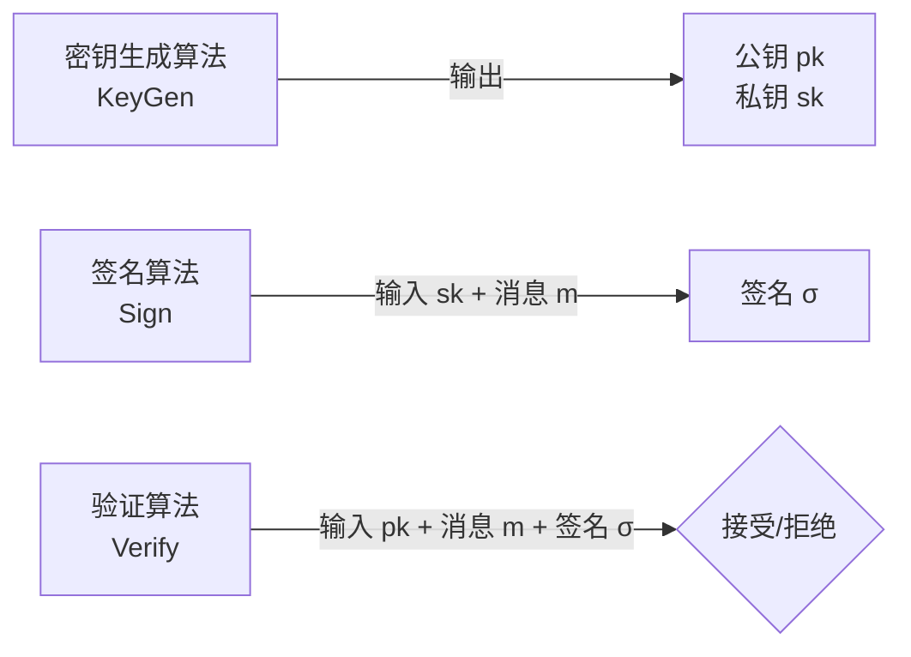
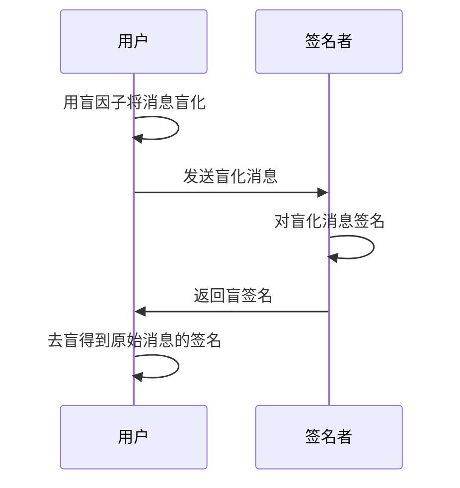
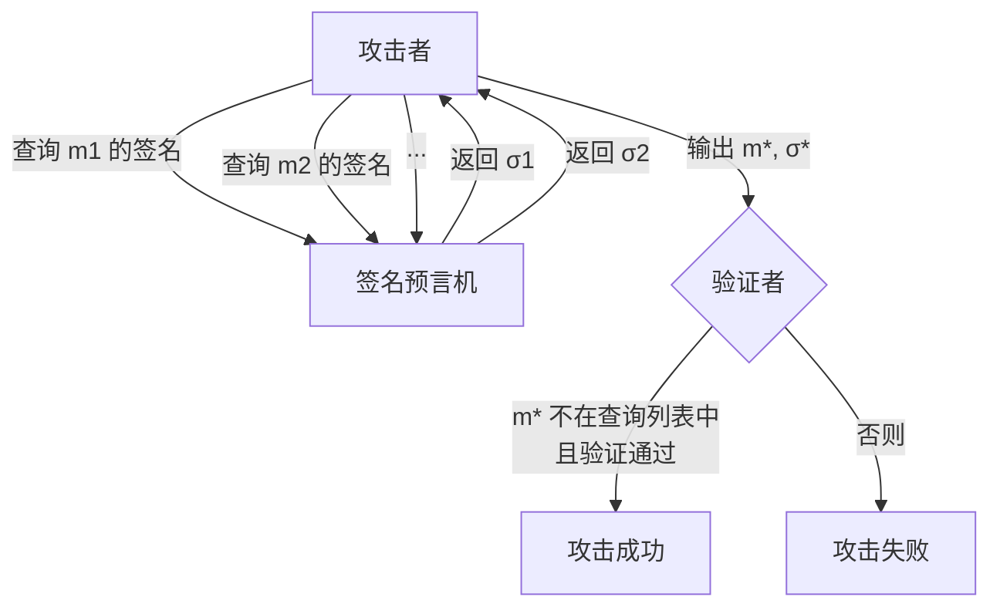
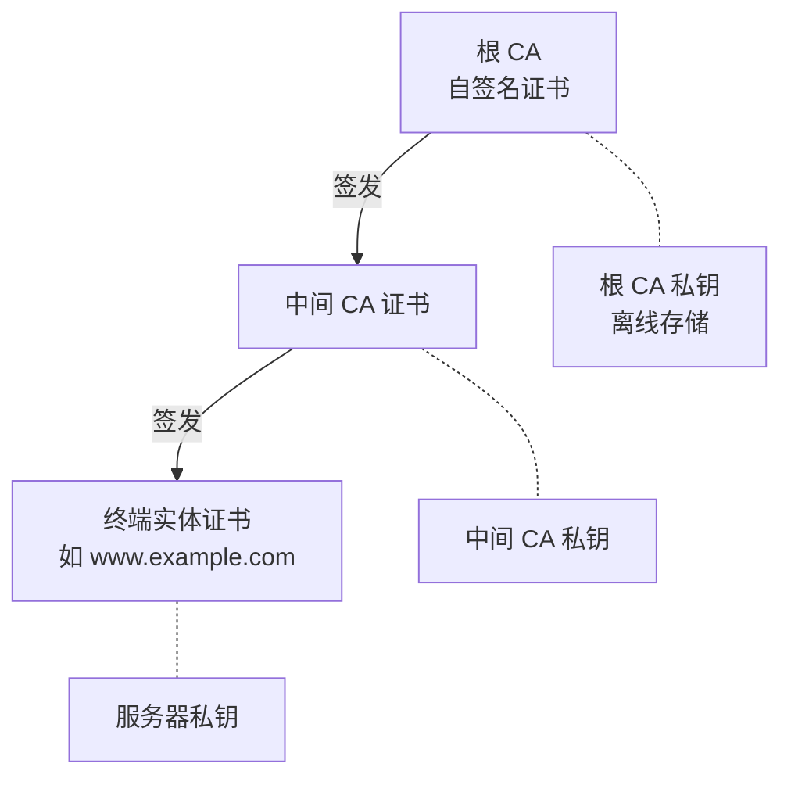
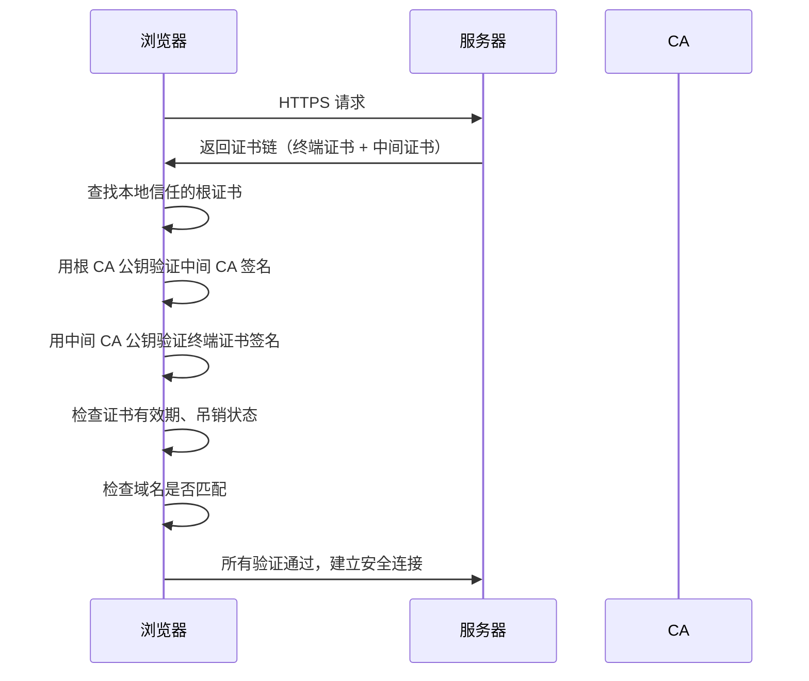
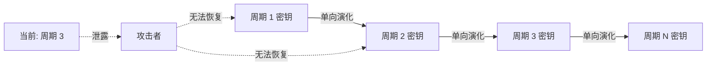
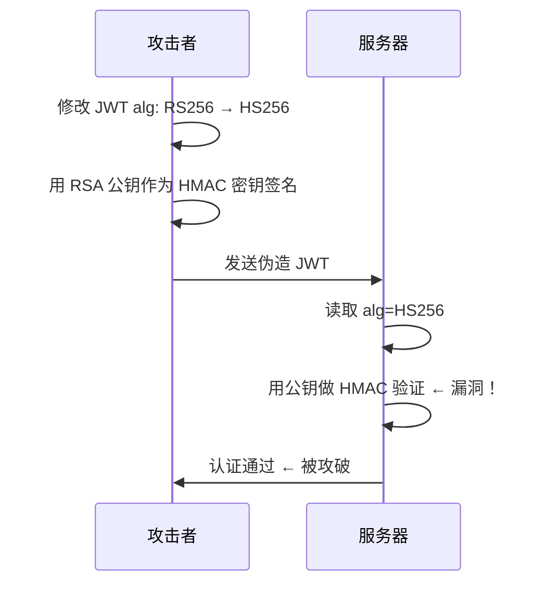

## 13.5 数字签名

数字签名（Digital Signature）是公钥密码学中最重要的构造之一，它将现实世界中手写签名的概念数学化，为数字世界提供了**身份认证**、**完整性校验**和**不可否认性**三大安全保证。与对称加密解决的"保密"问题不同，数字签名解决的是"信任"问题——在互不信任的双方之间，如何证明一条消息确实来自声称的发送者，且在传输过程中未被篡改。

### 13.5.1 从手写签名到数字签名

#### 现实世界签名的问题

手写签名存在三个根本缺陷：

| 缺陷 | 说明 |
|------|------|
| 可复制 | 签名可以被复印、拍照或临摹，附在任何文件上 |
| 不可验证 | 普通人无法判断签名真伪，需要笔迹鉴定专家 |
| 不可迁移 | 签名绑定在物理载体上，无法通过网络传输 |

#### 数字签名的诞生

1976 年，Whitfield Diffie 和 Martin Hellman 在论文《New Directions in Cryptography》中首次提出了数字签名的概念框架。他们设想：如果存在一种密码系统，加密和解密使用不同的密钥，那么用私钥"加密"（实际上是签名运算）的数据，任何人都可以用公钥验证，这就能实现数字世界中的"签名"。

1978 年，Ronald Rivest、Adi Shamir 和 Leonard Adleman 提出了 RSA 算法，第一个实现了实用的数字签名方案。此后，DSA（1991）、ECDSA（2000）、EdDSA（2011）等方案相继出现，数字签名成为互联网安全基础设施的基石。

### 13.5.2 数字签名的形式化定义

一个数字签名方案由三个概率多项式时间算法组成：



形式化地：

- **KeyGen(1^λ) → (pk, sk)**：以安全参数 λ 为输入，输出公钥 pk 和私钥 sk
- **Sign(sk, m) → σ**：以私钥 sk 和消息 m 为输入，输出签名 σ
- **Verify(pk, m, σ) → {0, 1}**：以公钥 pk、消息 m 和签名 σ 为输入，输出 1（接受）或 0（拒绝）

**正确性要求**：对于任何合法的消息 m 和密钥对 (pk, sk)，有：

```text
Verify(pk, m, Sign(sk, m)) = 1
```

即合法签名必须总是通过验证。

#### 盲签名（Blind Signature）

盲签名是 Chaum 于 1983 年提出的特殊签名形式。签名者在不看到消息内容的情况下对消息签名，常用于电子现金和隐私保护场景。



盲签名的性质保证了签名者无法将签名与具体的签署请求关联，实现了签署过程的不可追踪性。

#### 环签名与群签名

**环签名（Ring Signature）** 允许签名者以群组中任意一员的身份进行签名，但外界只知道签名者是群组成员之一，无法确定具体是谁。环签名不需要群组协调，签名者可以自行选择"环成员"。Monero 加密货币使用环签名保护交易发送者的隐私。

**群签名（Group Signature）** 与环签名类似，但存在一个群管理员，可以在必要时揭示真实签名者身份。适用于需要隐私但保留可审计性的场景，如匿名投票系统。

#### 门限签名（Threshold Signature）

(t, n) 门限签名将签名能力分散到 n 个参与方，任意 t 个参与方合作即可完成签名，少于 t 个则无法产生有效签名。私钥在生成时就被拆分为 n 个份额（share），签名过程中每个参与方用自己的份额生成部分签名，最终合成完整签名。

门限签名的应用场景：

- **企业多签钱包**：需要 3/5 高管同意才能签署大额转账
- **CA 证书签发**：根证书的签名能力由多个安全官员共同控制
- **分布式系统**：多个服务器共同签名一个响应，防止单点妥协

### 13.5.3 数字签名的安全模型

#### 安全属性

数字签名必须满足三个核心安全属性：

**1. 正确性（Correctness）**

合法密钥对产生的签名必须总是通过验证。这是最基本的要求，任何正确实现都应满足。

**2. 不可伪造性（Unforgeability）**

这是数字签名最核心的安全属性。形式化定义为**在选择消息攻击下的存在不可伪造性（EUF-CMA, Existential Unforgeability under Chosen Message Attack）**。

攻击模型如下：

- 攻击者可以访问签名预言机（Signing Oracle），即可以对任意消息请求签名
- 攻击者的目标是产生一个从未查询过的消息的有效签名
- 如果攻击者成功的概率可以忽略不计，则方案满足 EUF-CMA



**3. 不可否认性（Non-repudiation）**

签名者不能否认自己签署过的消息。这是因为只有签名者持有私钥，任何人都可以用公钥验证签名的真实性。这一特性在法律和商业场景中至关重要——数字签名在许多国家具有与手写签名同等的法律效力。

#### 安全性等级对比

| 安全等级 | 定义 | 含义 |
|---------|------|------|
| EUF-CMA | 选择消息攻击下的存在不可伪造性 | 最强标准：攻击者可选消息查询签名，仍无法伪造 |
| SUF-CMA | 强不可伪造性 | 在 EUF-CMA 基础上，攻击者不能为已有签名的消息生成新签名 |
| EUF-RMA | 随机消息攻击下的存在不可伪造性 | 攻击者只能对随机消息查询签名，较弱 |
| EUF-KOA | 密钥仅攻击下的存在不可伪造性 | 攻击者仅知道公钥，不能查询签名，最弱 |

现代数字签名方案（RSA-PSS、ECDSA、EdDSA）均被证明满足 EUF-CMA 安全性（在标准假设下）。

#### 与消息认证码（MAC）的对比

数字签名和 MAC 都能验证消息的完整性和真实性，但有本质区别：

| 特性 | 数字签名 | 消息认证码（MAC） |
|------|---------|-----------------|
| 密钥类型 | 非对称（公钥/私钥） | 对称（共享密钥） |
| 不可否认性 | 有：只有签名者有私钥 | 无：双方共享密钥，都能生成 MAC |
| 验证者范围 | 任何人持有公钥即可验证 | 仅持有共享密钥的参与方 |
| 计算速度 | 慢（涉及大数运算） | 快（哈希或分组密码运算） |
| 密钥管理 | 需要 PKI 保障公钥真实性 | 需要安全的密钥分发通道 |
| 典型场景 | 代码签名、证书、合同 | API 认证、会话完整性、数据传输 |

**选型原则**：如果只需要通信双方之间验证消息完整性，MAC 更高效；如果需要第三方验证或不可否认性，必须使用数字签名。

### 13.5.4 RSA 数字签名

#### RSA 签名的数学原理

RSA 签名的安全性基于 RSA 问题的困难性，而 RSA 问题的困难性又依赖于大整数分解问题的困难性。

**签名过程**：

1. 对消息 m 计算哈希值：h = H(m)
2. 对哈希值进行填充（Padding）得到编码消息 EM
3. 计算签名：σ = EM^d mod n

**验证过程**：

1. 计算 σ^e mod n，得到编码消息 EM'
2. 对消息 m 重新计算哈希并填充，得到 EM
3. 比较 EM' 与 EM 是否一致

#### PKCS#1 v1.5 签名方案（旧标准）

PKCS#1 v1.5 是最早的 RSA 签名填充方案，构造简单但存在已知弱点：

```text
EM = 0x00 || 0x01 || PS || 0x00 || T

其中：
- 0x00 0x01：类型标识（签名）
- PS：填充字节（0xFF），使总长度等于密钥长度
- 0x00：分隔符
- T：DER 编码的 DigestInfo（算法 OID + 哈希值）
```

**PKCS#1 v1.5 的安全问题**：Bleichenbacher 在 2006 年展示了在某些实现中，可以通过精心构造的签名绕过验证。如果验证实现没有严格检查填充格式，攻击者可以伪造签名。因此，现代应用应该使用 RSA-PSS。

#### RSA-PSS 签名方案（推荐标准）

RSA-PSS（Probabilistic Signature Scheme，概率签名方案）由 Bellare 和 Rogaway 于 1996 年提出，是 RSA 签名的现代标准。与 PKCS#1 v1.5 的关键区别：

| 特性 | PKCS#1 v1.5 | RSA-PSS |
|------|------------|---------|
| 确定性 | 确定性（同消息产生同签名） | 概率性（引入随机盐值） |
| 安全证明 | 无形式化安全证明 | 可证明安全（在 RSA 假设下） |
| 填充结构 | 简单固定 | 复杂但安全 |
| 推荐程度 | 仅用于兼容遗留系统 | 新系统必须使用 |

**PSS 编码过程**：

```text
输入：消息 m，盐值 salt（随机），哈希函数 H
1. mHash = H(m)
2. M' = (0x)00 00 00 00 00 00 00 00 || mHash || salt
3. H = Hash(M')
4. 生成 DB = PS || 0x01 || salt（PS 为零填充）
5. dbMask = MGF1(H, emLen - hLen - 1)
6. maskedDB = DB ⊕ dbMask
7. 将 maskedDB 最高位设为 0
8. EM = maskedDB || H || 0xbc
```

其中 MGF1 是掩码生成函数，通常基于哈希函数（如 SHA-256），将短的哈希值扩展为所需长度的伪随机序列。

#### RSA 签名的密钥长度与安全性

| RSA 密钥长度 | 等效对称密钥长度 | 安全性评估 |
|------------|---------------|----------|
| 1024 位 | ~80 位 | 已不安全，禁止使用 |
| 2048 位 | ~112 位 | 当前最低安全要求 |
| 3072 位 | ~128 位 | 推荐用于新系统 |
| 4096 位 | ~140 位 | 高安全需求场景 |
| 7680 位 | ~192 位 | 长期安全需求 |
| 15360 位 | ~256 位 | 最高安全级别 |

NIST SP 800-57 建议：2030 年之前淘汰 2048 位 RSA，迁移至 3072 位或 ECC。

### 13.5.5 DSA 与 ECDSA 签名

#### DSA（Digital Signature Algorithm）

DSA 由 David Kravitz 于 1991 年提出，被 NIST 采纳为联邦标准（FIPS 186）。DSA 基于有限域上的离散对数问题（DLP）。

**DSA 参数**：

- p：大素数（2048 或 3072 位）
- q：p-1 的素因子（224 或 256 位）
- g：阶为 q 的生成元，g = h^((p-1)/q) mod p，其中 h 是随机整数
- x：私钥，随机整数 0 < x < q
- y：公钥，y = g^x mod p

**签名过程**：

```text
1. 选择随机整数 k，0 < k < q
2. 计算 r = (g^k mod p) mod q
3. 计算 s = k^{-1} · (H(m) + x·r) mod q
4. 签名 σ = (r, s)
```

**验证过程**：

```text
1. 计算 w = s^{-1} mod q
2. 计算 u1 = H(m)·w mod q
3. 计算 u2 = r·w mod q
4. 计算 v = (g^{u1} · y^{u2} mod p) mod q
5. 验证 v == r
```

**DSA 的局限性**：

- 只能用于签名，不能用于加密（RSA 可以同时用于两者）
- 签名长度与 q 的长度成正比（通常 56 字节）
- 需要高质量的随机数 k，如果 k 被重用或可预测，私钥会泄露
- 相比 ECDSA，DSA 密钥和参数更长，计算更慢

DSA 已在 FIPS 186-5（2023）中被标记为遗留算法，新系统应使用 ECDSA 或 EdDSA。

#### ECDSA（Elliptic Curve Digital Signature Algorithm）

ECDSA 是 DSA 的椭圆曲线版本，由 Scott Vanstone 于 1992 年提出。它将 DSA 的离散对数问题从有限域转移到椭圆曲线上，用更短的密钥达到同等安全强度。

**椭圆曲线上的 DLP**：

在椭圆曲线 E 上，给定基点 G 和点 Q = kG（标量乘法），从 Q 和 G 求 k 是困难的，这就是椭圆曲线离散对数问题（ECDLP）。目前最好的已知算法（Pollard's rho）对 n 阶曲线需要 O(√n) 步。

**ECDSA 签名过程**：

```text
输入：私钥 d，消息 m，曲线参数 (E, G, n)
1. 计算 e = H(m)（截取到与 n 等长）
2. 选择随机整数 k，1 ≤ k ≤ n-1
3. 计算 (x1, y1) = kG
4. 计算 r = x1 mod n（如果 r = 0，回到步骤 2）
5. 计算 s = k^{-1} · (e + d·r) mod n（如果 s = 0，回到步骤 2）
6. 签名 σ = (r, s)
```

**ECDSA 验证过程**：

```text
输入：公钥 Q，消息 m，签名 (r, s)，曲线参数
1. 验证 r, s ∈ [1, n-1]
2. 计算 e = H(m)
3. 计算 w = s^{-1} mod n
4. 计算 u1 = e·w mod n
5. 计算 u2 = r·w mod n
6. 计算 (x1, y1) = u1·G + u2·Q
7. 验证 r ≡ x1 (mod n)
```

#### ECDSA 随机数 k 的安全问题

ECDSA 对随机数 k 的质量极度敏感。这是 ECDSA 最大的安全隐患：

**索尼 PS3 事件（2010 年）**：索尼的 PS3 签名实现使用了固定的 k 值（k 不变），导致黑客可以从两个不同消息的签名中恢复私钥：

```text
已知：s1 = k^{-1}(e1 + d·r) mod n
      s2 = k^{-1}(e2 + d·r) mod n
计算：s1 - s2 = k^{-1}(e1 - e2) mod n
      k = (e1 - e2)(s1 - s2)^{-1} mod n
      d = (s1·k - e1) · r^{-1} mod n
```

**三星 TEE 漏洞（2019 年）**：三星 TrustZone 中的 ECDSA 实现因随机数生成器缺陷，导致可从签名中提取私钥，影响数百万台设备。

**RFC 6979 确定性 ECDSA**：为解决随机数质量问题，Thomas Pornin 在 RFC 6979 中提出了确定性 ECDSA——用 HMAC-DRBG 从私钥和消息派生 k，消除对随机数生成器的依赖：

```python
# RFC 6979 确定性 k 生成的伪代码
def deterministic_k(private_key, message_hash):
    # 用 HMAC-DRBG 从 (private_key, message_hash) 派生 k
    # 相同的输入总是产生相同的 k
    # 消除了随机数质量问题，但仍保持概率性签名的安全性质
    V = b'\x01' * 32
    K = b'\x00' * 32
    K = hmac(K, V + b'\x00' + private_key + message_hash)
    V = hmac(K, V)
    K = hmac(K, V + b'\x01' + private_key + message_hash)
    V = hmac(K, V)
    while True:
        V = hmac(K, V)
        candidate = int.from_bytes(V, 'big')
        if 1 <= candidate < n:
            return candidate
        K = hmac(K, V + b'\x00')
        V = hmac(K, V)
```

#### 常用椭圆曲线对比

| 曲线 | 标准 | 域大小 | 等效安全级别 | 典型应用 |
|------|------|--------|------------|---------|
| P-256 (secp256r1) | NIST FIPS 186-4 | 256 位 | 128 位 | TLS、PKI、FIPS 合规 |
| P-384 (secp384r1) | NIST FIPS 186-4 | 384 位 | 192 位 | 高安全政府/军事 |
| P-521 (secp521r1) | NIST FIPS 186-4 | 521 位 | 256 位 | 最高安全级别 |
| secp256k1 | SEC2 | 256 位 | 128 位 | 比特币、以太坊 |
| Curve25519 | RFC 7748 | 255 位 | 128 位 | SSH、TLS 1.3、Signal |
| Curve448 | RFC 7748 | 448 位 | 224 位 | 高安全需求 |

**NIST 曲线 vs Curve25519 的争论**：

NIST 曲线（P-256 等）的参数生成过程不透明——NIST 使用了"随机种子"生成曲线参数，但未公布这些种子的选择过程。这引发了后门疑虑（尽管没有证据）。Daniel Bernstein 设计的 Curve25519 使用了完全透明的参数选择过程（"rigid" 设计），每个参数都有明确的数学理由，因此被密码学社区广泛信任。

### 13.5.6 EdDSA 签名

#### EdDSA 的设计哲学

EdDSA（Edwards-curve Digital Signature Algorithm）由 Daniel Bernstein 等人于 2011 年提出（RFC 8032），设计目标是"让正确实现容易，让错误实现困难"。它解决了 ECDSA 的几个实际问题：

| 问题 | ECDSA | EdDSA |
|------|-------|-------|
| 随机数依赖 | 需要 CSPRNG 生成 k | 确定性签名，无需随机数 |
| 实现复杂度 | 容易出错（边界检查、格式转换） | 极简实现，参数固定 |
| 侧信道防护 | 需要额外实现常数时间运算 | 设计时已内置常数时间 |
| 签名可延展性 | r 或 s 可被修改为等效值 | 签名唯一编码，不可延展 |

#### Ed25519 算法详解

Ed25519 使用扭曲 Edwards 曲线 Curve25519 上的点进行运算。曲线方程为：

```text
-x² + y² = 1 + d·x²·y²
其中 d = -121665/121666 (mod p)，p = 2^255 - 19
```

**密钥生成**：

```text
1. 生成 32 字节随机种子 k
2. 计算 h = SHA-512(k)（取前 32 字节作为标量，后 32 字节用于签名）
3. 对标量进行位修剪（clamp）：清除最低 3 位，设置最高位，清除次高位
4. 计算公钥 A = a·B（B 是基点，a 是修剪后的标量）
```

**签名过程**：

```text
输入：消息 M，32 字节种子 k
1. h = SHA-512(k)，拆分为 a（前 32 字节）和 b（后 32 字节）
2. r = SHA-512(b || M)（确定性 nonce，完全由私钥和消息决定）
3. R = r·B
4. S = (r + SHA-512(R || A || M) · a) mod L（L 是基点的阶）
5. 签名 = (R, S)，共 64 字节
```

**验证过程**：

```text
输入：公钥 A，消息 M，签名 (R, S)
验证：S·B == R + SHA-512(R || A || M)·A
```

这个验证等式的核心思想是：如果签名是合法的，那么 `S·B = (r + H·a)·B = r·B + H·a·B = R + H·A`。

#### Ed448 算法

Ed448 是 EdDSA 的高安全级别变体，使用 Goldilocks 曲线（域大小 448 位，等效 224 位对称安全）。Ed448 使用 SHAKE256（SHA-3 系列）作为哈希函数，提供更大的安全余量。

```text
密钥长度：57 字节
签名长度：114 字节
哈希函数：SHAKE256（输出 912 位）
安全级别：约 224 位
```

**Ed25519 vs Ed448 选型**：

- Ed25519：绝大多数场景的最佳选择，128 位安全足够
- Ed448：需要更高安全级别或额外安全余量时使用（如国家级通信）

### 13.5.7 算法综合对比

| 特性 | RSA-PSS | DSA | ECDSA | Ed25519 | Ed448 |
|------|---------|-----|-------|---------|-------|
| 数学基础 | 大整数分解 | 离散对数 | 椭圆曲线 DLP | Edwards 曲线 | Edwards 曲线 |
| 密钥长度 | 2048-4096 位 | 2048-3072 位 | 256-521 位 | 256 位 | 456 位 |
| 签名长度 | 256-512 字节 | 40-56 字节 | 64-132 字节 | 64 字节 | 114 字节 |
| 签名速度 | 慢（~1000/s） | 中等 | 中等 | 快（~60000/s） | 快 |
| 验证速度 | 快（~30000/s） | 慢 | 慢 | 快（~30000/s） | 快 |
| 确定性 | 否（PSS 引入盐） | 否 | 否（标准） | 是 | 是 |
| 抗侧信道 | 较好 | 需注意 | 需注意 | 内置 | 内置 |
| 同时支持加密 | 是 | 否 | 否 | 否 | 否 |
| 标准化 | PKCS#1, FIPS 186-5 | FIPS 186-5 | FIPS 186-5 | RFC 8032 | RFC 8032 |
| 推荐度 | 兼容性场景 | 遗留 | 合规需求 | **首选** | 高安全 |

**性能数据参考**（单核，OpenSSL 3.x，2024 年硬件）：

| 操作 | RSA-2048 | RSA-4096 | ECDSA P-256 | Ed25519 |
|------|----------|----------|-------------|---------|
| 签名 | ~1,200 次/秒 | ~200 次/秒 | ~25,000 次/秒 | ~60,000 次/秒 |
| 验证 | ~30,000 次/秒 | ~8,000 次/秒 | ~10,000 次/秒 | ~30,000 次/秒 |
| 密钥生成 | ~50 次/秒 | ~5 次/秒 | ~50,000 次/秒 | ~100,000 次/秒 |

Ed25519 在签名速度上比 ECDSA 快 2-3 倍，比 RSA-2048 快 50 倍，同时签名长度只有 64 字节（RSA-2048 需要 256 字节）。这使得 Ed25519 在高吞吐场景（如 TLS 握手、分布式系统）中具有显著优势。

### 13.5.8 数字签名在 PKI 中的应用

数字签名是公钥基础设施（PKI）的核心技术。PKI 通过证书链将公钥与实体身份绑定。

#### X.509 证书的签名结构



X.509 v3 证书的核心字段：

| 字段 | 说明 | 示例 |
|------|------|------|
| Version | 证书版本 | v3 |
| Serial Number | 唯一序列号 | 0x04E25F8A... |
| Signature Algorithm | 签名算法 | sha256WithRSAEncryption |
| Issuer | 颁发者（CA） | CN=Let's Encrypt Authority X3 |
| Validity | 有效期 | 2024-01-01 至 2024-04-01 |
| Subject | 持有者 | CN=www.example.com |
| Subject Public Key | 持有者公钥 | RSA 2048 位公钥 |
| Extensions | 扩展字段 | SAN、Key Usage 等 |
| Signature | CA 对以上内容的签名 | 256 字节 RSA 签名 |

**证书验证流程**：



#### 证书透明度（Certificate Transparency）

CT 是 Google 推动的安全机制，要求所有公开信任的证书必须记录在公开的、仅追加的日志（Merkle Tree）中。每个日志条目都是经过签名的，任何人都可以审计。CT 有效防止了恶意 CA 颁发伪造证书而不被发现的情况。

### 13.5.9 数字签名的高级构造

#### 聚合签名（Aggregate Signature）

聚合签名允许将多个不同签名者对不同消息的签名聚合为一个短签名。Boneh 等人于 2003 年提出了基于双线性映射的聚合签名方案。

```text
原始签名：σ1 = Sign(sk1, m1), σ2 = Sign(sk2, m2), ..., σn = Sign(skn, mn)
聚合签名：σ_agg = σ1 · σ2 · ... · σn（群运算）
验证：Verify(pk1, m1, pk2, m2, ..., mn, σ_agg)
```

应用场景：
- 区块链交易批量验证（节省区块空间和验证时间）
- 安全路由协议（多个路由器对路径声明签名）
- BLS 签名在以太坊 2.0 中用于验证委员会签名

#### 前向安全签名（Forward-Secure Signature）

前向安全签名将私钥分为多个时间周期，每个周期使用不同的密钥，且周期结束后立即删除旧密钥。即使当前周期的密钥泄露，攻击者也无法伪造过去周期的签名。



实现方式通常基于二叉树结构：密钥从根节点开始，沿树的路径向下演化，每个叶节点对应一个时间周期。单向函数保证了无法从当前密钥推导出历史密钥。

#### 后量子数字签名

量子计算机对基于因数分解和离散对数的签名方案（RSA、ECDSA）构成威胁。Shor 算法可以在多项式时间内解决这些问题。后量子签名方案主要包括：

**1. 基于哈希的签名（Hash-Based Signatures）**

- **LMS（Leighton-Micali Signature）**：RFC 8554 标准化，使用 Merkle 树结构
- **XMSS（eXtended Merkle Signature Scheme）**：RFC 8391 标准化，支持有状态的多时间签名
- **SPHINCS+**：NIST 选定的后量子标准（FIPS 205），无状态哈希签名

基于哈希的签名安全性仅依赖于哈希函数的抗碰撞性，这是目前最保守的后量子假设。

**2. 基于格的签名（Lattice-Based Signatures）**

- **Dilithium（ML-DSA）**：NIST FIPS 204 标准，基于模块格问题（MLWE/MSIS）
- 密钥约 2.5 KB，签名约 2.4 KB（Dilithium3），远大于 Ed25519
- 安全性基于最短向量问题（SVP）和最近向量问题（CVP）的困难性

**3. 基于同源的签名**

- **SQISign**：基于超奇异椭圆曲线同源问题，签名极短（约 200 字节），但计算速度慢

| 方案 | 密钥大小 | 签名大小 | 签名速度 | 验证速度 | NIST 标准 |
|------|---------|---------|---------|---------|----------|
| RSA-2048 | 256 B | 256 B | 慢 | 快 | 否（非后量子） |
| Ed25519 | 32 B | 64 B | 快 | 快 | 否（非后量子） |
| LMS-20-10 | ~3 KB | ~4 KB | 快 | 快 | FIPS 205 候选 |
| Dilithium3 | ~2.5 KB | ~2.4 KB | 中等 | 快 | FIPS 204 |
| SPHINCS+-128f | 32 B | ~17 KB | 慢 | 中等 | FIPS 205 |
| SQISign | ~177 B | ~204 B | 极慢 | 慢 | 研究中 |

后量子签名面临的主要挑战是**签名和密钥大小**——Dilithium 的签名是 Ed25519 的 37 倍，这在带宽受限的场景（IoT、区块链）中是重大问题。

#### 零知识签名证明

零知识证明（ZKP）允许证明者向验证者证明自己知道某个签名的私钥，而不泄露私钥本身。这在隐私保护中极为重要：

- **匿名凭证**：证明自己持有某机构颁发的证书，但不透露证书内容
- **区块链隐私**：Zcash 使用 zk-SNARKs 实现匿名交易
- **身份验证**：证明自己超过 18 岁，但不透露具体年龄

### 13.5.10 数字签名的常见攻击与防御

#### 算法级攻击

**1. Bleichenbacher 攻击（RSA PKCS#1 v1.5）**

2006 年，Daniel Bleichenbacher 发现某些 RSA 签名验证实现存在缺陷——它们没有严格检查 PKCS#1 v1.5 填充的完整性。攻击者可以构造一个"畸形"但通过验证的签名。

```text
正常签名：00 01 FF FF FF ... FF 00 <DigestInfo>
畸形签名：00 01 FF FF FF ... FF 00 <DigestInfo> <垃圾数据>
                                    ↑ 某些实现不检查后面的垃圾
```

**防御**：使用 RSA-PSS 替代 PKCS#1 v1.5；实现时严格验证填充格式。

**2. ECDSA 随机数攻击**

如前所述，如果 k 被重用或可预测，私钥可被恢复。防御措施：
- 使用确定性 ECDSA（RFC 6979）
- 使用 Ed25519（确定性签名）
- 确保 CSPRNG 正常工作

**3. 签名可延展性攻击**

某些签名方案（如 ECDSA）允许将签名 (r, s) 修改为 (r, n-s)，两者都是同一消息的有效签名。这在比特币中曾导致交易延展性攻击（BIP 66 修复）。

**防御**：使用确定性签名（Ed25519）或验证时强制 s < n/2（低 s 值要求）。

#### 协议级攻击

**1. 签名绕过（Signature Stripping）**

攻击者移除或替换签名字段。防御：验证逻辑必须在签名缺失时**拒绝**，而非跳过。

**2. 算法混淆攻击**

最常见的 JWT 攻击之一。攻击者将 JWT 头部的 `alg` 从 `RS256` 改为 `HS256`，然后用 RSA 公钥作为 HMAC 密钥生成签名。如果服务器用公钥做 HMAC 验证，就会接受攻击者伪造的 token。



**防御**：验证时硬编码允许的算法列表，不要从 token 中读取 `alg` 字段。

**3. 重放攻击**

攻击者截获合法签名消息并重新发送。防御：
- 消息中包含时间戳（设置有效期）
- 消息中包含 nonce（随机数，仅使用一次）
- 使用序列号

**4. 密钥替换攻击**

攻击者生成自己的密钥对，声称其公钥属于目标实体。如果验证者没有通过可信渠道获取公钥，攻击者可以用自己的私钥签名，验证者会误以为签名来自目标实体。

**防御**：使用 PKI（证书链）验证公钥，或通过可信信道（如面对面交换、已验证的安全通道）分发公钥。

### 13.5.11 数字签名的法律地位

数字签名在许多司法管辖区具有法律效力：

| 国家/地区 | 法律框架 | 效力说明 |
|----------|---------|---------|
| 美国 | ESIGN Act (2000) | 电子签名与手写签名具有同等法律效力 |
| 欧盟 | eIDAS (2014) | 高级电子签名（AdES）具有与手写签名同等法律效力 |
| 中国 | 电子签名法 (2004, 2015修订) | 可靠的电子签名与手写签名具有同等法律效力 |
| 日本 | 电子签名法 (2000) | 经认证的电子签名具有法律推定效力 |

中国的《电子签名法》第十三条规定，可靠的电子签名应满足：
1. 电子签名制作数据用于电子签名时，属于电子签名人专有
2. 签署时电子签名制作数据仅由电子签名人控制
3. 签署后对电子签名的任何改动能够被发现
4. 签署后对数据电文内容和形式的任何改动能够被发现

这些要求直接对应数字签名的核心安全属性：私钥保密、签名不可伪造、消息完整性。

### 13.5.12 小结

数字签名是密码学中最实用的工具之一，它将非对称加密的数学性质转化为可验证的信任。本节从形式化定义出发，深入讲解了 RSA-PSS、DSA/ECDSA 和 EdDSA 三大类签名方案的数学原理、安全特性和实际差异，分析了数字签名在 PKI 中的核心作用，并介绍了聚合签名、前向安全签名和后量子签名等高级构造。

**关键要点**：

- 签名的核心安全属性是不可伪造性（EUF-CMA），而非保密性
- 新项目首选 Ed25519，需要合规时用 ECDSA P-256，遗留系统用 RSA-2048+
- ECDSA 的随机数 k 是最大的安全隐患，使用确定性 ECDSA（RFC 6979）或 Ed25519
- 签名安全 90% 取决于密钥管理，再强的算法在私钥泄露时都毫无意义
- 后量子签名是未来趋势，但当前的密钥和签名大小仍是挑战
