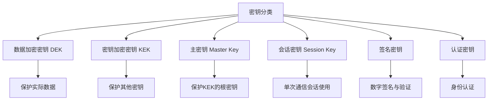
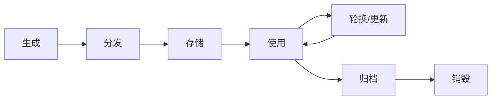
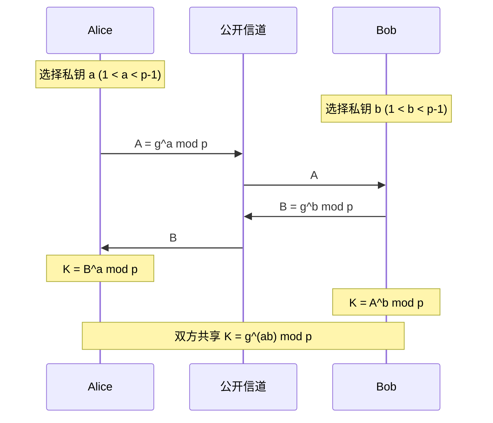
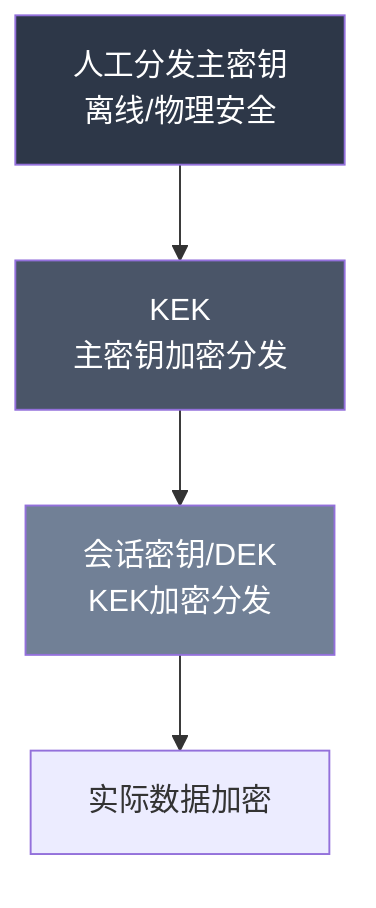
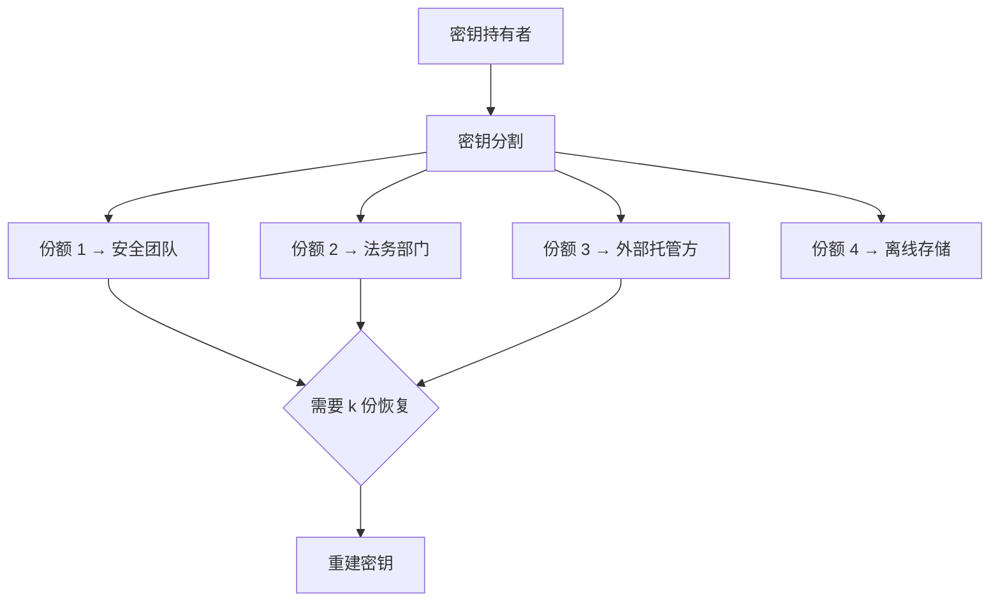

## 13.6 密钥管理

密钥管理是密码学工程中最关键、也最容易出错的环节。Bruce Schneier 曾指出："密钥管理是密码学中最困难的部分，大多数密码系统的失败不是算法被破解，而是密钥管理出了问题。"密码算法的强度再高，如果密钥在生成、分发、存储、使用、轮换或销毁的任一环节出现漏洞，整个系统的安全性都会归零。

本节从理论基础出发，系统性地阐述密钥管理的完整知识体系，为后续的实践技巧和工具使用奠定坚实的理论根基。

### 13.6.1 密钥管理的核心目标

密钥管理需要同时满足以下安全目标，这些目标之间存在内在张力，需要根据场景权衡：

| 目标 | 含义 | 实现难点 |
|------|------|----------|
| **机密性** | 密钥不被未授权方获取 | 存储、传输、内存中的保护 |
| **完整性** | 密钥不被篡改或替换 | 防止中间人攻击、供应链攻击 |
| **可用性** | 授权方在需要时能获取密钥 | 高可用存储、灾备恢复 |
| **可审计性** | 密钥的使用可被追踪和验证 | 日志、监控、不可抵赖性 |
| **不可关联性** | 不同密钥的泄露互不影响 | 密钥隔离、层次化设计 |

### 13.6.2 密钥分类体系

不同类型的密钥承担不同的功能，管理策略也因此不同。理解密钥分类是制定管理策略的前提。

**按功能分类：**

- **数据加密密钥（DEK，Data Encryption Key）**：直接用于加密用户数据，生命周期较短，通常每次加密操作或每天生成新的 DEK。因为直接接触大量密文，暴露风险相对较高，所以需要频繁轮换。

- **密钥加密密钥（KEK，Key Encryption Key）**：用于加密保护 DEK，不直接接触用户数据。KEK 的生命周期比 DEK 长（通常数月到一年），但必须以更高安全等级保护，因为 KEK 泄露会导致所有受其保护的 DEK 同时暴露。

- **主密钥（Master Key）**：密钥层次结构中的根密钥，用于保护 KEK。主密钥通常存储在硬件安全模块（HSM）中，生命周期最长（数年），数量最少。主密钥的安全性是整个密钥体系的根基。

- **会话密钥（Session Key）**：为单次通信会话临时生成的密钥，使用后即销毁。TLS 握手产生的预主密钥和会话密钥就是典型例子。

**按密码学体制分类：**

- **对称密钥**：加密解密使用同一密钥，计算效率高，但密钥分发是核心难题。
- **非对称密钥对**：公钥可公开，私钥严格保密。解决了分发问题，但计算开销大。
- **混合密钥**：实际系统中普遍采用混合模式——用非对称算法保护对称密钥，用对称密钥加密数据。

### 13.6.3 密钥生命周期

密钥从产生到销毁经历完整的生命周期，每个阶段都有特定的安全要求和风险点：

#### 13.6.3.1 密钥生成

密钥生成是生命周期的起点，这一步的安全性决定了后续所有环节的上限。生成阶段的核心要求是**不可预测性**——攻击者即使掌握了之前所有密钥的知识，也无法预测下一个密钥。

**密码学安全随机数生成器（CSPRNG）的要求：**

- 熵源必须来自物理随机现象（硬件噪声、热噪声、放射性衰变等）
- 通过后处理算法消除统计偏差
- 即使部分内部状态泄露，剩余状态仍不可预测（前向安全性）
- 常见实现：Linux 的 `/dev/urandom`（基于 ChaCha20 CSPRNG）、Windows 的 `CryptGenRandom`、硬件 RNG 芯片

**密钥生成中的常见陷阱：**

| 错误做法 | 风险 | 正确做法 |
|----------|------|----------|
| 使用 `random` 模块 | 伪随机，可预测 | 使用 `secrets` 或 `os.urandom` |
| 使用时间戳做种子 | 熵值过低，可暴力穷举 | 使用系统 CSPRNG |
| 人工选定密钥 | 存在人类偏好模式 | 计算机随机生成 |
| 密钥长度不足 | 穷举攻击可行 | 遵循 NIST 推荐长度 |
| 重复使用同一密钥 | 一次泄露全面崩盘 | 每个用途独立密钥 |

**密钥长度推荐（NIST SP 800-57）：**

| 密码学原语 | 2030年前安全 | 2030年后安全 | 备注 |
|-----------|-------------|-------------|------|
| AES | 128 位 | 256 位 | 对称加密 |
| RSA | 2048 位 | 3072 位 | 非对称加密/签名 |
| ECC (P-256) | 256 位 | 384 位 | 椭圆曲线 |
| SHA-256 | 256 位输出 | 256 位输出 | 哈希函数 |

#### 13.6.3.2 密钥分发

密钥分发解决的核心问题是：如何在通信双方之间安全地建立共享密钥，尤其是在不安全的信道上。这是密码学中最经典的问题之一。

**Diffie-Hellman 密钥交换（1976）：**

Diffie-Hellman 协议是第一个实用的公钥密码学协议，允许双方在完全公开的信道上协商出共享密钥，窃听者即使截获所有交换信息也无法计算出密钥。

协议基于离散对数问题的困难性：给定素数 p、生成元 g 和 $g^a \mod p$，计算 a 在计算上不可行。

**协议流程：**

**安全性分析：**

- 碰到被动窃听者是安全的——攻击者只能获得 g、p、$g^a \mod p$、$g^b \mod p$，计算 $g^{ab} \mod p$ 等价于求解 Diffie-Hellman 问题，目前没有多项式时间算法
- **不能抵抗中间人攻击**——主动攻击者可以分别与双方建立独立的共享密钥，因此必须配合身份认证机制（如数字证书、PSK）
- 量子计算威胁——Shor 算法可以在量子计算机上高效求解离散对数，后量子密码学中需要迁移到基于格的密钥交换（如 CRYSTALS-Kyber/ML-KEM）

**密钥封装机制（KEM）：**

现代密钥交换更常用密钥封装机制，将密钥分发转化为"用公钥封装一个随机密钥"的过程：

1. 发送方生成随机对称密钥 K
2. 用接收方公钥加密 K 得到密文 C
3. 发送 C 给接收方
4. 接收方用私钥解密 C 得到 K

RSA-KEM 和 ECIES 是典型的混合加密方案。在 TLS 1.3 中，密钥交换使用 ECDHE（椭圆曲线 Diffie-Hellman Ephemeral），既提供前向保密性，又实现高效密钥协商。

**密钥分发的层次模型：**

实际系统中，密钥分发并非一次性完成，而是通过层次化模型逐级保护：

- 主密钥通过物理安全手段（离线设备、面对面交接）分发，数量极少
- KEK 用主密钥加密后通过网络分发
- 会话密钥用 KEK 加密后通过网络实时分发

#### 13.6.3.3 密钥存储

密钥存储是攻击面最广、出问题最多的环节。密钥在存储状态下可能面临的威胁包括：未授权访问、物理窃取、内存转储、侧信道泄漏等。

**存储安全等级（从低到高）：**

1. **明文文件**：绝对禁止。密钥以明文形式存储在磁盘上，任何有文件读取权限的人都能获取。
2. **密码加密的文件**：使用口令派生的密钥加密密钥文件（如 OpenSSL 的 `-aes256` 选项）。安全性取决于口令强度和 KDF 的迭代次数。
3. **操作系统密钥环**：如 macOS Keychain、GNOME Keyring、Windows Credential Manager。提供了用户级隔离，但操作系统漏洞可能导致泄露。
4. **硬件安全模块（HSM）**：专用硬件设备，密钥在 HSM 内部生成和使用，私钥从不离开硬件。提供物理级别的防篡改保护，符合 FIPS 140-2/3 标准。
5. **可信平台模块（TPM）**：集成在主板上的安全芯片，提供密封存储（sealing）和远程证明功能。密钥与特定平台状态绑定。
6. **云密钥管理服务（KMS）**：如 AWS KMS、Azure Key Vault、Google Cloud KMS。云服务商管理 HSM 基础设施，用户通过 API 调用使用密钥。需评估信任模型和合规要求。

**内存中的密钥保护：**

密钥在使用时必须加载到内存中，这是另一个高风险环节：

- **内存锁定**：使用 `mlock()` 系统调用防止密钥被换出到交换分区（swap）
- **及时清零**：密钥使用完毕后立即覆写内存中的数据（不能仅依赖 GC 回收，因为语言运行时可能延迟回收或复制对象）
- **隔离进程**：将密钥处理逻辑放在独立进程中，限制其他进程的内存访问
- **避免调试信息泄露**：日志、core dump、错误消息中绝不能包含密钥

#### 13.6.3.4 密钥使用

密钥使用阶段的安全控制目标是：确保密钥只被授权的操作使用，防止误用和滥用。

**使用控制机制：**

- **密钥用途绑定**：每个密钥应有明确的用途标记（如"仅用于 AES-GCM 加密"），系统拒绝将签名密钥用于加密等不匹配的操作。X.509 证书中的 Key Usage 扩展字段就是这一机制的标准化实现。
- **使用次数限制**：某些场景下需要限制密钥的使用次数，如一次性签名方案、限制 GCM 模式下的加密次数（防止 nonce 重用导致安全性崩塌）。
- **时间窗口限制**：密钥只在指定的时间范围内有效，过期后自动失效。
- **上下文绑定**：密钥的使用与特定上下文绑定，如 TLS 绑定（channel binding）防止会话密钥被用于其他信道。

**密钥派生（Key Derivation）：**

在实际使用中，很少直接使用原始密钥，而是通过密钥派生函数（KDF）从主密钥派生出不同用途的子密钥：

- **HKDF（HMAC-based KDF）**：RFC 5869 标准，分提取（Extract）和扩展（Expand）两步，从输入密钥材料中安全地派生出指定长度和用途的密钥
- **PBKDF2**：从低熵密码派生密钥，通过大量迭代增加暴力破解成本
- **scrypt / Argon2**：抗 GPU/ASIC 的内存密集型 KDF，专为密码派生设计

密钥派生的关键原则是：从一个主密钥可以派生多个子密钥，但反过来，知道任何一个子密钥不应该能推导出主密钥或其他子密钥。

#### 13.6.3.5 密钥轮换

密钥轮换是指定期更换密钥，其必要性源于以下几个因素：

- **限制暴露窗口**：即使密钥泄露，攻击者也只能解密轮换周期内的数据
- **前向保密（Forward Secrecy）**：即使当前密钥泄露，过去会话的机密性不受影响
- **后向保密（Backward Secrecy）**：即使当前密钥泄露，未来会话的安全性不受影响
- **合规要求**：PCI DSS 等标准明确要求定期轮换密钥

**轮换策略设计要点：**

1. **新旧密钥共存期**：新密钥启用后，旧密钥需要保留一段时间用于解密历史数据或处理缓存中的请求。共存期的长度取决于系统特性，通常为 24 小时到 30 天。

2. **无缝切换机制**：密钥轮换不应导致服务中断。常见做法是维护密钥版本列表，加密时使用最新版本密钥并标记版本号，解密时根据标记选择对应版本密钥。

3. **自动化**：手动轮换容易遗漏或出错，应建立自动化机制。云 KMS 通常提供自动轮换功能。

**不同密钥类型的轮换周期参考：**

| 密钥类型 | 建议轮换周期 | 理由 |
|----------|-------------|------|
| TLS 会话密钥 | 每次连接 | 提供前向保密 |
| API 密钥 | 90 天 | 限制泄露影响 |
| 数据库加密密钥 | 90 天 | 平衡安全与运维 |
| 证书签名密钥 | 1-2 年 | 信任链稳定性 |
| HSM 主密钥 | 3-5 年 | 操作复杂度高 |

#### 13.6.3.6 密钥销毁

密钥销毁是生命周期的终点，但其重要性常被忽视。不彻底的销毁等同于密钥泄露。

**销毁要求：**

- **不可恢复性**：销毁后，通过任何技术手段（包括取证分析）都无法恢复密钥
- **确认机制**：销毁操作必须有可验证的确认（审计日志、销毁证明）
- **层次级联**：销毁 KEK 时，受其保护的所有 DEK 同时被视为不可信

**销毁技术手段：**

- **密码学销毁**：删除用于加密密钥的 KEK，使密钥本身变为不可解密的密文（Crypto Shredding）。这是云环境中最常用的方法，因为无法保证云存储上的物理擦除。
- **安全擦除**：多次覆写存储密钥的磁盘扇区（NIST SP 800-88 中的 Clear 和 Purge 标准）
- **物理销毁**：对存储密钥的物理介质进行消磁或粉碎（适用于退役的 HSM、硬盘等）
- **内存清零**：使用 `SecureZeroMemory`（Windows）或 `explicit_bzero`（Linux）安全覆写内存，防止编译器优化掉清零操作

### 13.6.4 密钥层次结构与密钥封装

现代密码系统普遍采用分层密钥架构，而非将所有密钥平铺管理。这种设计遵循了最小权限原则和故障隔离原则。

**层次结构的核心思想：**

顶层密钥（主密钥）数量最少、保护等级最高、生命周期最长；越往下，密钥数量越多、保护等级逐级降低、生命周期越短。上层密钥保护下层密钥，最底层密钥保护数据。

**密钥封装（Key Wrapping）：**

密钥封装是用一个密钥加密另一个密钥的标准化方法。NIST SP 800-38F 定义了三种 AES 密钥封装算法：

- **KW（Key Wrap）**：使用 AES-ECB 模式的变体，不需要 IV
- **KWP（Key Wrap with Padding）**：支持非标准长度的密钥
- **TKW（TKW with 三重 DES）**：兼容遗留系统

密钥封装保证了：即使封装后的密钥在网络上被截获，没有封装密钥也无法解密出原始密钥。

### 13.6.5 密钥托管与恢复

密钥托管（Key Escrow）是指将密钥副本交给可信第三方保管，以便在必要时恢复。这是一个安全性和可用性之间的经典权衡问题。

**密钥恢复的需求场景：**

- 员工离职后需要恢复其加密的业务数据
- 法律要求提供数据访问能力（法院传票、合规审计）
- 灾难恢复场景下的业务连续性

**密钥分割方案：**

直接托管密钥给单一方风险过高，因此引入了密钥分割技术：

- **Shamir 秘密共享（SSS）**：将密钥分为 n 份，任意 k 份即可恢复原始密钥（k-of-n 阈值方案）。数学基础是拉格朗日插值多项式——k 个点唯一确定一个 k-1 次多项式。
- **实施要点**：n 份应交给不同的可信方保管，物理上隔离存储，避免单点妥协。阈值 k 的选择需要平衡安全性和可用性——k 太小安全性不足，k 太大可用性降低。

**企业级密钥恢复架构：**

### 13.6.6 密钥泄露与应急响应

密钥泄露一旦发生，必须立即启动应急响应流程，每一分钟的延迟都可能导致更大的损失。

**泄露检测信号：**

- 异常的密钥使用模式（非工作时间的大量解密操作）
- 来自异常地理位置或 IP 的认证请求
- 密钥文件的哈希值发生变化
- HSM 发出篡改告警

**应急响应流程：**

1. **立即撤销**：通过 CRL（证书吊销列表）或 OCSP（在线证书状态协议）撤销泄露的证书
2. **强制轮换**：立即生成新密钥并替换所有使用旧密钥的服务
3. **影响评估**：确定泄露密钥保护了哪些数据、泄露的时间窗口、影响范围
4. **通知相关方**：按照合规要求通知受影响的用户、监管机构
5. **根因分析**：查明泄露途径（内部人员、外部攻击、配置错误等），修复漏洞
6. **事后复盘**：更新密钥管理策略，防止同类事件再次发生

### 13.6.7 密钥管理标准与框架

密钥管理不是凭感觉操作，有成熟的标准和框架可以遵循：

- **NIST SP 800-57**：密钥管理推荐实践，定义了密钥类型、生命周期、长度推荐等核心规范。这是密钥管理领域最权威的参考文档。
- **NIST SP 800-132**：基于密码的密钥派生标准，规范了 PBKDF2 的使用参数。
- **PKCS#11**：加密令牌（HSM、智能卡）的通用接口标准，定义了应用程序与硬件安全设备的交互协议。
- **KMIP（Key Management Interoperability Protocol）**：OASIS 标准，定义了密钥管理系统之间的互操作协议，支持密钥的创建、注册、定位、检索、更新和销毁等操作。
- **ISO 11770**：密钥管理国际标准，定义了密钥建立、管理和生命周期的技术要求。
- **FIPS 140-2/3**：密码模块安全标准，定义了硬件和软件密码模块的安全等级。

### 13.6.8 常见误区与反模式

以下是密钥管理实践中最常犯的错误，每一个都曾在真实系统中导致过严重安全事故：

**误区一：将密钥硬编码在源代码中**

开发者为了方便，直接在代码中写入 API 密钥或加密密钥。一旦代码被提交到版本控制（尤其是公开仓库），密钥立即暴露。GitHub 上每天有数千个密钥因此泄露，攻击者自动化扫描公开仓库寻找泄露的密钥。

正确做法：使用环境变量、密钥管理服务或加密的配置文件管理密钥。

**误区二：使用弱随机源生成密钥**

使用 `random.random()`、时间戳、进程 ID 等低熵源生成密钥。曾有比特币钱包因使用可预测的随机数而被盗取数百万美元。在 Debian OpenSSL 事件中，移除了一行熵收集代码导致生成的密钥空间从 $2^{128}$ 缩小到 $2^{15}$，影响了数百万密钥。

正确做法：始终使用操作系统提供的 CSPRNG（`/dev/urandom`、`secrets` 模块）。

**误区三：密钥复用**

将同一个密钥用于多个不同用途（如同时用于加密和签名），或将同一个密钥用于多个系统/用户。这违反了密钥隔离原则——一处泄露导致全面崩盘，且不同用途的安全性假设可能冲突。

正确做法：每个用途、每个系统、每个用户使用独立密钥，通过密钥派生从主密钥生成子密钥。

**误区四：忽略密钥轮换**

"密钥没泄露就不用换"——这种想法忽略了密钥泄露可能在很长时间内不被发现。如果密钥从不轮换，一旦泄露，所有历史数据都会暴露。

正确做法：建立定期轮换机制，并确保系统支持多版本密钥并存。

**误区五：密钥销毁不彻底**

仅执行文件删除操作（`rm`/`del`），不覆写数据，更不清除内存中的副本。文件删除仅移除目录项，数据仍可通过取证工具恢复。

正确做法：使用密码学销毁（删除 KEK 使密钥不可解密）或安全擦除工具，并确保内存中无残留。

**误区六：日志中记录密钥**

调试时将密钥打印到日志，或错误处理时将密钥包含在异常消息中。生产环境的日志可能被多个人访问，也可能被集中收集到日志平台，扩大了暴露面。

正确做法：绝对不在日志中记录密钥。使用密钥标识符（Key ID）代替密钥本身进行追踪。

### 13.6.9 云环境与现代密钥管理

随着云计算的普及，密钥管理面临新的挑战和范式：

**Bring Your Own Key（BYOK）vs. 云提供商管理密钥：**

- 云提供商管理密钥：便捷但需要信任云提供商
- BYOK：用户生成密钥并导入云 KMS，控制权在用户手中
- Hold Your Own Key（HYOK）：密钥始终由用户控制，云服务只能通过用户的 HSM 代理使用密钥，安全性最高但可用性受限

**密钥管理即服务（KMaaS）：**

云 KMS 提供了密钥管理的标准化 API，典型操作包括：

- 创建密钥（CreateKey）：在 HSM 内部生成密钥
- 加密（Encrypt）：在 HSM 内部执行加密操作，密钥不离开 HSM
- 解密（Decrypt）：在 HSM 内部执行解密操作
- 生成数据密钥（GenerateDataKey）：返回明文 DEK 和 KEK 加密后的 DEK
- 旋转密钥（RotateKey）：自动创建新版本密钥

**零信任架构下的密钥管理：**

在零信任模型中，密钥管理需要额外考虑：

- 每次访问都需要独立验证，不依赖网络位置信任
- 短生命周期证书和密钥（SPIFFE/SPIRE 标准）
- 自动化证书颁发和轮换（如 ACME 协议）
- 服务网格中的 mTLS 自动管理（Istio、Linkerd）

### 13.6.10 本节小结

密钥管理是密码学工程化中最核心、最复杂的环节。算法可以标准化，但密钥管理必须根据具体场景定制。掌握以下核心原则：

1. **层次化**：用主密钥保护 KEK，用 KEK 保护 DEK，形成金字塔结构
2. **最小权限**：每个密钥只拥有完成其任务所需的最少权限
3. **生命周期意识**：密钥从生成到销毁的每一步都需要安全管理
4. **纵深防御**：不依赖单一安全措施，多层保护相互补充
5. **自动化**：将密钥生成、分发、轮换、销毁尽可能自动化，减少人为错误
6. **可审计**：密钥的每一次使用都应有记录，支持事后审查和合规验证

密钥管理的理论知识为后续的实践技巧（13.2 节密钥管理实践技巧）和实战案例（企业级密钥管理系统案例）提供了必要的概念框架。理解了"为什么"，才能在实践中做出正确的判断和取舍。
