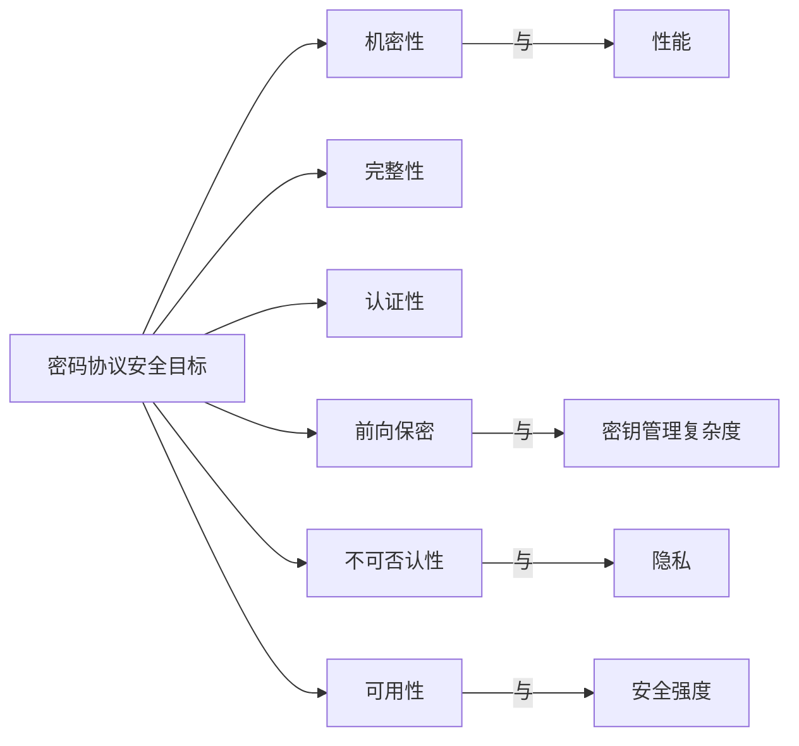
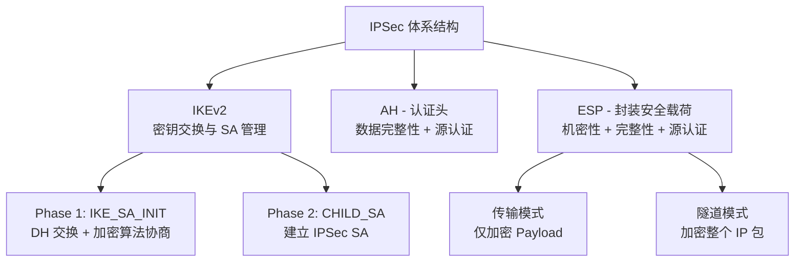
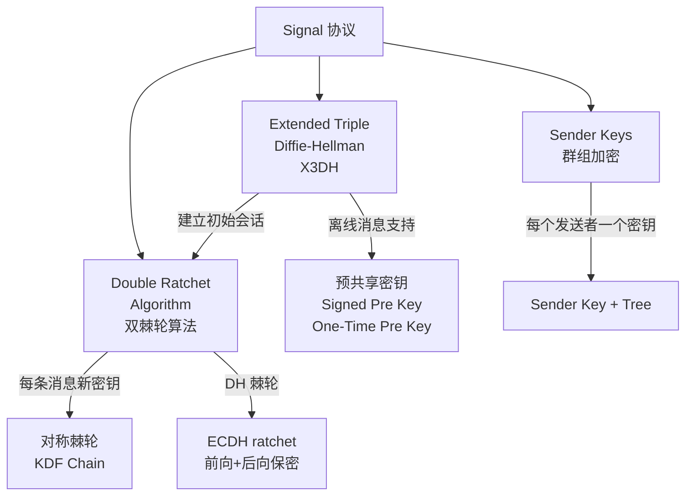
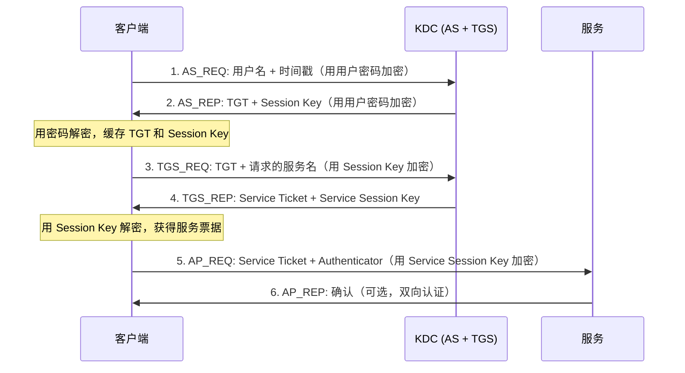

## 13.7 密码协议

密码算法是砖块，密码协议是建筑蓝图。单独一个 AES 或 RSA 无法保护任何通信——**协议决定了密钥如何协商、身份如何验证、数据如何封装、异常如何处理**。密码学历史上最惨痛的安全事故，绝大多数不是算法被破解，而是协议设计有缺陷：BEAST 攻击利用 CBC 模式的可预测 IV、POODLE 利用 SSL 3.0 的填充验证、Heartbleed 利用 TLS 心跳扩展的边界检查缺失、Logjam 利用 DH 参数太小。理解密码协议，就是理解"把算法组合成安全系统"这门工程学科。

### 13.7.1 密码协议的基本概念

#### 什么是密码协议

密码协议（Cryptographic Protocol）是一组**定义了参与方之间如何交换和处理密码学消息的规则与步骤**。它不仅规定"用什么算法"，更规定"在什么时机、以什么顺序、携带什么参数"来使用这些算法。

一个完整的密码协议需要回答以下核心问题：

| 核心问题 | 协议层面的职责 | 示例 |
|---|---|---|
| **密钥从哪来？** | 密钥协商/交换机制 | ECDHE 导出会话密钥 |
| **谁在说话？** | 身份认证机制 | X.509 证书验证服务器身份 |
| **消息是否被篡改？** | 完整性保护机制 | HMAC 或 AEAD 标签校验 |
| **消息是否泄露？** | 机密性保护机制 | AES-GCM 加密应用数据 |
| **能否否认？** | 不可否认性机制 | 数字签名绑定发送者身份 |
| **如何应对异常？** | 错误处理与降级策略 | 告警协议、连接终止 |

#### 密码协议的层次模型

密码协议通常按 OSI 模型分层部署，不同层解决不同粒度的安全问题：

```text
┌─────────────────────────────────────────────────────┐
│  应用层协议                                           │
│  OAuth 2.0 / OpenID Connect / S/MIME / PGP          │
│  → 身份认证、授权、端到端消息加密                       │
├─────────────────────────────────────────────────────┤
│  传输层协议                                           │
│  TLS 1.3 / DTLS / QUIC                              │
│  → 流量加密、服务器认证、前向保密                       │
├─────────────────────────────────────────────────────┤
│  网络层协议                                           │
│  IPSec (IKEv2 + AH + ESP)                           │
│  → IP 包级加密、站点间 VPN                            │
├─────────────────────────────────────────────────────┤
│  链路层协议                                           │
│  WPA3 / MACsec / WireGuard                          │
│  → 链路帧加密、接入认证                               │
└─────────────────────────────────────────────────────┘
```

#### 协议设计的核心安全目标

任何密码协议的设计都围绕以下安全目标展开，这些目标之间存在权衡关系：



**前向保密（Perfect Forward Secrecy, PFS）** 是现代协议最重要的设计目标之一：即使长期私钥未来被泄露，历史会话的密钥也不会被推导出来。实现 PFS 的标准方法是使用临时 Diffie-Hellman 密钥交换（DHE/ECDHE），每次会话生成新的临时密钥对，会话结束后立即销毁。

**后向保密（Backward Secrecy / Future Secrecy）** 是前向保密的对偶：即使当前会话密钥泄露，未来的会话仍然安全。Signal 协议的双棘轮机制同时实现了前向保密和后向保密。

#### 密码协议的形式化验证

密码协议的正确性极难通过代码审查保证——人类直觉在多步交互中容易遗漏攻击路径。形式化方法是验证协议安全性的关键工具：

- **符号模型（Dolev-Yao 模型）**：假设攻击者可以完全控制网络但无法破解密码原语。工具：ProVerif、Tamarin
- **计算模型**：将安全性归约到数学困难问题。证明更严格但更复杂
- **可证明安全性（Provable Security）**：证明"如果能攻破协议，则能解决底层困难问题"，从而将协议安全性建立在数学基础上

**案例：TLS 1.3 的形式化验证**。TLS 1.3 在标准化过程中进行了前所未有的形式化分析：ProVerif、Tamarin、CryptoVerif 三个独立工具分别验证了其安全性。这是 TLS 1.2 从未做到的——TLS 1.2 的设计缺陷在部署多年后才被陆续发现。

---

### 13.7.2 TLS/SSL 协议

TLS（Transport Layer Security）是互联网上最重要的密码协议，保护着所有 HTTPS 流量、电子邮件传输、VPN 连接等。全球超过 95% 的网页流量受 TLS 保护。

#### TLS 的演进历史

| 版本 | 年份 | 状态 | 关键变化 |
|---|---|---|---|
| SSL 2.0 | 1995 | **已废弃** | 首个广泛部署版本，大量设计缺陷 |
| SSL 3.0 | 1996 | **已废弃（POODLE）** | 重新设计，引入 MAC-then-Encrypt |
| TLS 1.0 | 1999 | **已废弃** | 基于 SSL 3.0，使用 HMAC |
| TLS 1.1 | 2006 | **已废弃** | 显式 IV 防御 CBC 攻击 |
| TLS 1.2 | 2008 | 广泛使用 | 支持 AEAD、SHA-256、密码套件协商 |
| TLS 1.3 | 2018 | **推荐** | 强制 PFS、1-RTT 握手、移除不安全特性 |

#### TLS 1.3 握手流程详解

TLS 1.3 相比 1.2 进行了革命性的简化。握手从 2-RTT 减少到 1-RTT（首次连接），支持 0-RTT 恢复：

```text
客户端                                              服务器
  │                                                   │
  │── ClientHello ─────────────────────────────────→  │
  │    supported_versions: [TLS 1.3]                  │
  │    cipher_suites: [TLS_AES_256_GCM_SHA384, ...]   │
  │    key_share: [x25519 public key]                 │
  │    supported_groups: [x25519, secp256r1, ...]     │
  │    signature_algorithms: [ecdsa_secp256r1_sha256]  │
  │                                                   │
  │← ServerHello ────────────────────────────────────│
  │    cipher_suite: TLS_AES_256_GCM_SHA384           │
  │    key_share: [x25519 public key]                 │
  │                                                   │
  │← {EncryptedExtensions} ─────────────────────────│
  │    server_name, ALPN, ... （全部加密传输）          │
  │← {Certificate} ─────────────────────────────────│
  │    server_certificate                             │
  │← {CertificateVerify} ───────────────────────────│
  │    signature(handshake_transcript, server_privkey) │
  │← {Finished} ────────────────────────────────────│
  │    HMAC(derived_handshake_traffic_secret)         │
  │                                                   │
  │── {Finished} ──────────────────────────────────→  │
  │    HMAC(derived_handshake_traffic_secret)         │
  │                                                   │
  │←════════════ 应用数据（AEAD 加密）═══════════════→│
```

**TLS 1.3 相比 1.2 的关键改进：**

1. **强制前向保密**：移除 RSA 密钥交换和静态 DH，所有密钥交换必须使用 (EC)DHE
2. **1-RTT 握手**：客户端在 ClientHello 中直接发送 key_share，无需等待服务器选定参数
3. **加密更多握手消息**：服务器证书、扩展等在密钥协商完成后加密传输，保护隐私
4. **仅保留 5 个安全密码套件**：消除了 TLS 1.2 中数百个密码套件的选择困难和配置错误
5. **移除所有已知不安全特性**：CBC 模式、压缩、重协商、DSA 签名、RC4、MD5 等

**TLS 1.3 的 5 个密码套件：**

```text
TLS_AES_128_GCM_SHA256          // 默认，兼容性最好
TLS_AES_256_GCM_SHA384          // 更强安全性
TLS_CHACHA20_POLY1305_SHA256    // 移动设备优选（无 AES 硬件加速时更快）
TLS_AES_128_CCM_SHA256          // 适用于受限环境
TLS_AES_128_CCM_8_SHA256        // 8 字节认证标签，受限 IoT 场景
```

#### TLS 密钥派生（HKDF）

TLS 1.3 使用 HKDF（HMAC-based Key Derivation Function）从共享密钥派生所有工作密钥：

```text
PSK / (EC)DHE 共享密钥
         │
         ▼
  early_secret = HKDF-Extract(0, PSK)
         │
         ▼
  handshake_secret = HKDF-Extract(derive_secret(early_secret, "derived", ""), (EC)DHE)
         │
    ┌────┴────┐
    ▼         ▼
client_     server_
handshake   handshake
_traffic    traffic
_secret     secret
    │         │
    ▼         ▼
  用于加密     用于加密
  客户端→服务器  服务器→客户端
  握手消息      握手消息
         │
         ▼
  master_secret = HKDF-Extract(derive_secret(handshake_secret, "derived", ""), 0)
         │
    ┌────┴────┐
    ▼         ▼
client_     server_
application application
_traffic    traffic
_secret     secret
    │         │
    ▼         ▼
  应用数据加密   应用数据加密
```

每个密钥通过 `derive_secret` 函数从上一层密钥派生，实现了密钥隔离：即使一个密钥泄露，不会影响其他密钥的安全性。

#### TLS 1.3 的 0-RTT 恢复

TLS 1.3 支持 0-RTT 恢复（早期数据），客户端可以在发送 ClientHello 的同时发送加密的应用数据，进一步减少延迟。但 0-RTT 存在重要的安全限制：

- **无前向保密**：0-RTT 数据使用 PSK 加密，如果 PSK 泄露，0-RTT 数据可被解密
- **重放攻击风险**：0-RTT 数据可以被网络中间人重放。服务器必须实现防重放机制（如一次性票据、单滑动窗口）
- **仅限幂等请求**：不应在 0-RTT 中发送有副作用的操作（如 POST 请求、支付操作）

#### TLS 证书与 PKI

TLS 身份认证依赖 X.509 证书体系（PKI）。证书验证是 TLS 安全的基石：

```text
根 CA（Root CA）
  ├── 中间 CA 1（Intermediate CA）
  │     ├── 服务器证书 example.com
  │     └── 服务器证书 api.example.com
  └── 中间 CA 2（Intermediate CA）
        └── 服务器证书 shop.example.com
```

**证书验证步骤：**
1. 检查证书链：从服务器证书到根 CA 的完整链
2. 验证签名：每一级证书的签名由上一级 CA 的私钥生成
3. 检查有效期：证书的 Not Before / Not After 字段
4. 检查吊销状态：通过 OCSP（在线证书状态协议）或 CRL（证书吊销列表）
5. 检查域名匹配：证书中的 Subject Alternative Name (SAN) 是否匹配请求的域名
6. 检查约束：基本约束（是否为 CA）、密钥用法等

**证书固定（Certificate Pinning）**：将特定证书或公钥硬编码到客户端中，防止被恶意 CA 签发的假证书欺骗。但维护成本高，Google 已在 Chrome 中移除了证书固定，转而依赖 Certificate Transparency（CT）日志。

#### TLS 常见攻击与防御

| 攻击 | 利用的缺陷 | 受影响版本 | 防御 |
|---|---|---|---|
| **BEAST** (2011) | CBC 模式的可预测 IV | TLS 1.0 | 升级到 TLS 1.2+ |
| **POODLE** (2014) | SSL 3.0 的填充验证 | SSL 3.0 | 禁用 SSL 3.0 |
| **Heartbleed** (2014) | OpenSSL 心跳扩展的边界检查缺失 | OpenSSL 1.0.1 | 更新 OpenSSL |
| **FREAK** (2015) | 降级到出口级 RSA (512-bit) | 旧版 TLS | 禁用出口密码套件 |
| **Logjam** (2015) | DH 参数太小 (1024-bit) | TLS with DHE | 使用 ECDHE 或 2048+ bit DHE |
| **CRIME** (2012) | TLS 压缩泄露信息 | TLS 压缩 | 禁用 TLS 压缩 |
| **ROBOT** (2017) | RSA PKCS#1 v1.5 填充验证 | TLS with RSA | 使用 ECDHE 密钥交换 |
| **Raccoon** (2020) | DH 定时侧信道 | TLS 1.2 with DHE | 使用 TLS 1.3 / ECDHE |

#### 使用 OpenSSL 手动进行 TLS 握手

```bash
# 查看服务器支持的 TLS 版本和密码套件
openssl s_client -connect example.com:443 -tls1_3 -brief

# 详细查看 TLS 1.3 握手过程
openssl s_client -connect example.com:443 -tls1_3 -trace

# 验证证书链
openssl s_client -connect example.com:443 -showcerts

# 测试特定密码套件
openssl s_client -connect example.com:443 -cipher TLS_AES_256_GCM_SHA384

# 提取服务器证书
echo | openssl s_client -connect example.com:443 2>/dev/null | openssl x509 -text -noout

# 使用 curl 测试 TLS 配置
curl -v --tlsv1.3 https://example.com 2>&1 | grep -E "SSL|TLS|certificate"
```

#### 使用 Python 实现 TLS 客户端

```python
import ssl
import socket

def check_tls_config(hostname, port=443):
    """检查目标服务器的 TLS 配置"""
    context = ssl.create_default_context()

    with socket.create_connection((hostname, port)) as sock:
        with context.wrap_socket(sock, server_hostname=hostname) as ssock:
            cert = ssock.getpeercert()
            cipher = ssock.cipher()
            version = ssock.version()

            print(f"TLS 版本: {version}")
            print(f"密码套件: {cipher[0]}")
            print(f"协议: {cipher[1]}")
            print(f"密钥长度: {cipher[2]} bits")
            print(f"证书主题: {dict(x[0] for x in cert['subject'])}")
            print(f"颁发者: {dict(x[0] for x in cert['issuer'])}")
            print(f"有效期至: {cert['notAfter']}")

check_tls_config("example.com")
```

---

### 13.7.3 IPSec 协议

IPSec（Internet Protocol Security）在网络层（IP 层）提供安全服务，是构建 VPN 的核心技术。与 TLS 工作在传输层不同，IPSec 保护的是 IP 数据包本身，对上层应用完全透明。

#### IPSec 架构

IPSec 由三个核心组件组成：



#### AH 与 ESP 的对比

| 特性 | AH（认证头） | ESP（封装安全载荷） |
|---|---|---|
| **协议号** | 51 | 50 |
| **机密性** | ✗ 不提供 | ✓ AES-GCM / ChaCha20 |
| **完整性** | ✓ 完整认证 | ✓ 认证（不包含外层 IP 头） |
| **源认证** | ✓ | ✓ |
| **NAT 穿越** | ✗ 认证整个 IP 头，NAT 修改后校验失败 | ✓ 传输模式有问题，隧道模式无影响 |
| **典型用途** | 已极少单独使用 | VPN 的主流选择 |

现代 IPSec 部署几乎全部使用 ESP，AH 因为与 NAT 不兼容而被弃用。

#### IPSec 两种工作模式

**传输模式**：仅加密/认证 IP 包的载荷部分（TCP/UDP 数据），保留原始 IP 头。用于主机到主机的端到端安全。

```text
┌──────────────┬─────────────┬──────────┐
│  原始 IP 头   │   TCP 头    │  数据    │
└──────────────┴─────────────┴──────────┘
                    ↓ 传输模式 ESP
┌──────────────┬─────────────┬──────────┬───────┬──────────┐
│  原始 IP 头   │ ESP 头      │ 加密数据  │ ESP尾  │ ESP认证  │
└──────────────┴─────────────┴──────────┴───────┴──────────┘
```

**隧道模式**：加密整个原始 IP 包，加上新的 IP 头。用于 VPN（站点到站点、远程访问）。

```text
┌──────────────┬─────────────┬──────────┐
│  原始 IP 头   │   TCP 头    │  数据    │
└──────────────┴─────────────┴──────────┘
                    ↓ 隧道模式 ESP
┌───────────┬──────────────┬─────────────┬──────────┬───────┬──────────┐
│ 新 IP 头   │ ESP 头       │ 原始IP头+   │ 加密数据  │ ESP尾  │ ESP认证  │
│ (公网地址)  │              │ TCP头       │          │       │          │
└───────────┴──────────────┴─────────────┴──────────┴───────┴──────────┘
```

#### IKEv2 密钥交换流程

IKEv2（Internet Key Exchange version 2）是 IPSec 的密钥协商协议，负责建立安全关联（SA）：

```text
发起方 (Initiator)                              响应方 (Responder)
    │                                                │
    │── IKE_SA_INIT ─────────────────────────────→   │
    │    HDR, SAi1, KEi, Ni                          │
    │    (DH 公钥, Nonce, 算法提案)                    │
    │                                                │
    │←── IKE_SA_INIT ──────────────────────────────│
    │    HDR, SAr1, KEr, Nr                          │
    │    (选定算法, DH 公钥, Nonce)                    │
    │                                                │
    │    === 此时已建立加密通道（使用 DH 共享密钥）===    │
    │                                                │
    │── IKE_AUTH ────────────────────────────────→   │
    │    {IDi, AUTH, SAi2, TSi, TSr, ...}            │
    │    (身份, 认证数据, 子 SA 提案)                   │
    │                                                │
    │←── IKE_AUTH ─────────────────────────────────│
    │    {IDr, AUTH, SAr2, TSi, TSr, ...}            │
    │    (身份, 认证数据, 子 SA 参数)                   │
    │                                                │
    │    === CHILD_SA 建立完成，IPSec 隧道就绪 ===      │
```

IKEv2 使用两阶段交换：Phase 1 建立 IKE SA（保护后续协商本身的通道），Phase 2 建立 CHILD SA（保护实际数据流量的通道）。仅需 4 条消息即可完成建立。

#### 使用 strongSwan 配置 IPSec VPN

strongSwan 是最流行的开源 IPSec 实现。以下是一个站点到站点 VPN 的配置示例：

```bash
# /etc/ipsec.conf - 站点到站点配置
config setup
    charondebug="ike 2, knl 2, cfg 2"

conn site-to-site
    keyexchange=ikev2
    left=203.0.113.1          # 本地公网 IP
    leftsubnet=10.0.1.0/24    # 本地私网
    leftid=@site-a
    leftauth=psk
    right=198.51.100.1        # 对端公网 IP
    rightsubnet=10.0.2.0/24   # 对端私网
    rightid=@site-b
    rightauth=psk
    ike=aes256gcm16-sha384-ecp384!   # Phase 1 算法
    esp=aes256gcm16-sha384-ecp384!   # Phase 2 算法
    auto=start

# /etc/ipsec.secrets - 预共享密钥
@site-a @site-b : PSK "YourVeryLongAndRandomPreSharedKeyHere2024!"
```

```bash
# 启动与管理
sudo systemctl start strongswan
sudo ipsec statusall              # 查看所有 SA 状态
sudo ipsec status                 # 简要状态
sudo ipsec restart                # 重启
sudo ip xfrm state                # 查看内核中的 SA
sudo ip xfrm policy               # 查看安全策略
```

---

### 13.7.4 SSH 协议

SSH（Secure Shell）是远程系统管理的基石协议，提供加密的命令行会话、端口转发和文件传输。SSH 协议有 v1（已废弃）和 v2 两个版本，现代部署全部使用 SSH-2。

#### SSH 协议架构

SSH 协议由三个独立的子协议组成，运行在单一 TCP 连接之上：

```text
┌─────────────────────────────────────────────────┐
│               SSH 传输层协议 (RFC 4253)           │
│  服务器认证、数据加密、完整性保护、压缩            │
├─────────────────────────────────────────────────┤
│              SSH 认证协议 (RFC 4252)              │
│  用户认证（公钥/密码/键盘交互/GSSAPI）             │
├─────────────────────────────────────────────────┤
│              SSH 连接协议 (RFC 4254)              │
│  多路复用：会话/端口转发/X11转发/Agent转发         │
└─────────────────────────────────────────────────┘
              ↑ 运行在 TCP 之上（默认端口 22）
```

#### SSH 密钥交换与认证

SSH 握手流程（以 Ed25519 密钥和 Curve25519 密钥交换为例）：

```text
客户端                                              服务器
  │                                                   │
  │←── 版本交换 ────────────────────────────────────→│
  │    "SSH-2.0-OpenSSH_9.6"                          │
  │                                                   │
  │←── 算法协商（Key Exchange Init）───────────────→│
  │    kex_algorithms, server_host_key_algorithms,    │
  │    encryption_algorithms, mac_algorithms,         │
  │    compression_algorithms                         │
  │                                                   │
  │←── Curve25519 ECDH 密钥交换 ─────────────────→│
  │    客户端发送 ECDH 公钥 Q_C                       │
  │    服务器发送 ECDH 公钥 Q_S + 签名                │
  │    双方计算共享密钥 K = X25519(d, Q)              │
  │                                                   │
  │    === 会话密钥派生完成，后续数据加密传输 ===       │
  │                                                   │
  │←── 用户认证 ─────────────────────────────────→│
  │    公钥认证：客户端用私钥签名会话数据               │
  │    服务器验证签名和公钥是否在 authorized_keys 中    │
  │                                                   │
  │←══════════ 加密的交互会话 ═══════════════════→│
```

#### SSH 认证方法详解

| 认证方法 | 安全性 | 便利性 | 适用场景 |
|---|---|---|---|
| **Ed25519 公钥** | ★★★★★ | ★★★★ | 推荐首选，密钥短、签名快 |
| **RSA 公钥 (4096-bit)** | ★★★★ | ★★★ | 兼容性最好，旧系统 |
| **ECDSA 公钥 (P-256)** | ★★★★ | ★★★★ | 部分硬件令牌支持 |
| **密码认证** | ★★ | ★★★★★ | 仅限测试环境，必须配合 fail2ban |
| **FIDO2/U2F 硬件密钥** | ★★★★★ | ★★★ | 高安全环境，需要物理密钥 |

#### SSH 密钥管理最佳实践

```bash
# 生成 Ed25519 密钥（推荐）
ssh-keygen -t ed25519 -C "user@host - $(date +%Y-%m-%d)" -f ~/.ssh/id_ed25519_work

# 生成带密码保护的密钥
ssh-keygen -t ed25519 -a 100 -f ~/.ssh/id_ed25519_prod
# -a 100: KDF 轮数增加到 100，暴力破解更困难

# 查看密钥指纹
ssh-keygen -lf ~/.ssh/id_ed25519.pub

# 使用 ssh-agent 管理密钥（避免反复输入密码）
eval $(ssh-agent -s)
ssh-add ~/.ssh/id_ed25519_work

# 使用 ssh-copy-id 部署公钥
ssh-copy-id -i ~/.ssh/id_ed25519.pub user@server

# 配置 ~/.ssh/config 简化连接
cat >> ~/.ssh/config << 'EOF'
Host prod
    HostName 203.0.113.10
    User deploy
    IdentityFile ~/.ssh/id_ed25519_prod
    IdentitiesOnly yes
    ServerAliveInterval 60
EOF
```

#### SSH 隧道与端口转发

SSH 最强大的功能之一是隧道——通过加密连接转发任意 TCP 流量：

```bash
# 本地端口转发：访问 localhost:8080 实际访问 remote:80
ssh -L 8080:internal-server:80 user@bastion-host
# 场景：通过跳板机访问内网 Web 服务

# 远程端口转发：外部通过 remote:9090 访问本地 3000
ssh -R 9090:localhost:3000 user@public-server
# 场景：将本地开发服务器暴露到公网

# 动态端口转发（SOCKS5 代理）
ssh -D 1080 user@proxy-server
# 场景：配置浏览器使用 SOCKS5://localhost:1080 代理

# SSH ProxyJump（多跳）
ssh -J jump1,jump2 user@final-host
# 场景：通过多层跳板机访问最终主机

# 保持连接存活
ssh -o ServerAliveInterval=30 -o ServerAliveCountMax=3 user@server
```

#### SSH 安全加固

```bash
# /etc/ssh/sshd_config 关键安全配置
Port 2222                              # 修改默认端口（减少扫描噪音）
PermitRootLogin no                     # 禁止 root 登录
PasswordAuthentication no              # 禁用密码认证
PubkeyAuthentication yes               # 启用公钥认证
AuthenticationMethods publickey        # 仅公钥
MaxAuthTries 3                         # 最大认证尝试次数
LoginGraceTime 30                      # 认证超时时间
AllowUsers deploy admin                # 仅允许特定用户
ClientAliveInterval 300                # 空闲超时
ClientAliveCountMax 2                  # 超时次数
X11Forwarding no                       # 禁用 X11 转发
AllowTcpForwarding no                  # 禁用端口转发（按需开启）
AllowAgentForwarding no                # 禁用 Agent 转发

# 仅允许 Ed25519 和 RSA 4096
HostKey /etc/ssh/ssh_host_ed25519_key
HostKey /etc/ssh/ssh_host_rsa_key
KexAlgorithms curve25519-sha256,diffie-hellman-group16-sha512
Ciphers chacha20-poly1305@openssh.com,aes256-gcm@openssh.com
MACs hmac-sha2-512-etm@openssh.com,hmac-sha2-256-etm@openssh.com
```

```bash
# 使用 ssh-audit 检查 SSH 配置安全性
# https://github.com/jtesta/ssh-audit
pip install ssh-audit
ssh-audit localhost:2222
```

---

### 13.7.5 Signal 协议

Signal 协议是端到端加密消息的黄金标准，被 WhatsApp（20 亿用户）、Facebook Messenger（秘密对话）、Google Messages 等广泛采用。它实现了前向保密、后向保密和可否认性。

#### Signal 协议核心机制

Signal 协议结合了三种密钥管理机制：



#### X3DH 密钥交换

Extended Triple Diffie-Hellman (X3DH) 解决了一个关键问题：**当接收方离线时如何建立安全会话**。

每个 Signal 用户维护以下长期密钥：
- **Identity Key (IK)**：长期身份密钥（X25519）
- **Signed Pre Key (SPK)**：中期签名预密钥（定期轮换，由 IK 签名）
- **One-Time Pre Keys (OPK)**：一次性预密钥池（用完即弃）

X3DH 计算四个 DH 共享密钥：

```text
DH1 = X25519(IK_A, SPK_B)    // 发送方身份 × 接收方预密钥
DH2 = X25519(EK_A, IK_B)     // 发送方临时 × 接收方身份
DH3 = X25519(EK_A, SPK_B)    // 发送方临时 × 接收方预密钥
DH4 = X25519(EK_A, OPK_B)    // 发送方临时 × 接收方一次性密钥

SK = KDF(DH1 || DH2 || DH3 || DH4)
```

四个 DH 结果混合后派生出初始共享密钥 SK，即使其中一个密钥被破解，其他三个 DH 仍然保护会话安全。

#### 双棘轮算法

双棘轮（Double Ratchet）是 Signal 协议的核心，同时使用对称棘轮和 DH 棘轮：

```text
对称棘轮（KDF Chain）：每个消息密钥由前一个密钥派生
  MK_1 = KDF(SK, "msg1")
  MK_2 = KDF(MK_1, "msg2")
  MK_3 = KDF(MK_2, "msg3")
  → 前向保密：知道 MK_3 无法推导 MK_1 或 MK_2

DH 棘轮：每次发送/接收方向切换时执行新的 DH 交换
  Alice 发送：DH_Alice_1 → 推导新 Chain Key
  Bob 接收后回复：DH_Bob_1 → 推导全新 Chain Key
  Alice 发送：DH_Alice_2 → 推导新 Chain Key
  → 后向保密：即使当前链泄露，下一次 DH 交换产生全新密钥
```

#### Signal 协议与 TLS 的安全特性对比

| 安全特性 | TLS 1.3 | Signal 协议 |
|---|---|---|
| **前向保密** | ✓（ECDHE） | ✓（DH 棘轮） |
| **后向保密** | ✗（同会话内） | ✓（每条消息） |
| **离线消息** | ✗（需要在线握手） | ✓（X3DH + OPK） |
| **可否认性** | ✗（数字签名） | ✗（MAC 代替签名） |
| **群组加密** | 靠上层协议 | ✓（Sender Keys） |
| **服务端可读** | 传输加密，端点可读 | ✗（端到端加密） |

---

### 13.7.6 WireGuard 协议

WireGuard 是新一代 VPN 协议，以极简设计和高性能著称。它仅使用 4000 行代码（对比 OpenVPN 的 100,000+ 行），攻击面极小。

#### WireGuard 密码学选择

WireGuard 不做算法协商——所有密码学原语在协议设计时硬编码：

| 功能 | 算法 |
|---|---|
| 密钥交换 | Curve25519 (ECDH) |
| 对称加密 | ChaCha20-Poly1305 |
| 密钥派生 | HKDF-SHA256 |
| 哈希函数 | BLAKE2s |
| 地址认证 | SipHash2-4 |

这种"没有选择就没有错误配置"的设计哲学消除了 TLS 中常见的密码套件配置错误。

#### WireGuard 握手（Noise IK）

WireGuard 使用 Noise 框架的 IK 模式（Identity-Known）：

```text
客户端 (Initiator)                                服务器 (Responder)
  │                                                   │
  │  已知服务器公钥 S_pub                               │
  │                                                   │
  │── Handshake Initiation ──────────────────────→   │
  │    发送方公钥 (ephemeral)                          │
  │    用 S_pub 加密的静态公钥                          │
  │    Poly1305 认证标签                                │
  │    时间戳（防重放）                                  │
  │                                                   │
  │←── Handshake Response ─────────────────────────│
  │    发送方公钥 (ephemeral)                          │
  │    用临时密钥加密的响应                              │
  │    Poly1305 认证标签                                │
  │                                                   │
  │    === 会话密钥派生完成 ===                         │
  │                                                   │
  │←═══════════ 加密数据传输 (数据报) ═══════════════→│
  │    每 120 秒或每 2^64 字节自动密钥轮换               │
```

整个握手仅需 1-RTT，固定 120 秒或传输 2^64 字节后自动密钥轮换（实现前向保密）。

#### WireGuard 配置示例

```ini
# /etc/wireguard/wg0.conf - 服务器端
[Interface]
PrivateKey = <server_private_key>
Address = 10.0.0.1/24
ListenPort = 51820
PostUp = iptables -A FORWARD -i wg0 -j ACCEPT; iptables -t nat -A POSTROUTING -o eth0 -j MASQUERADE
PostDown = iptables -D FORWARD -i wg0 -j ACCEPT; iptables -t nat -D POSTROUTING -o eth0 -j MASQUERADE

[Peer]
PublicKey = <client_public_key>
AllowedIPs = 10.0.0.2/32
```

```ini
# /etc/wireguard/wg0.conf - 客户端
[Interface]
PrivateKey = <client_private_key>
Address = 10.0.0.2/24
DNS = 1.1.1.1

[Peer]
PublicKey = <server_public_key>
Endpoint = 203.0.113.1:51820
AllowedIPs = 0.0.0.0/0    # 全部流量走 VPN
PersistentKeepalive = 25   # NAT 保活
```

```bash
# 管理命令
wg genkey | tee privatekey | wg pubkey > publickey   # 生成密钥对
sudo wg-quick up wg0                                  # 启动接口
sudo wg-quick down wg0                                # 停止接口
sudo wg show                                          # 查看状态
sudo systemctl enable wg-quick@wg0                    # 开机自启
```

---

### 13.7.7 Kerberos 认证协议

Kerberos 是企业网络中最广泛使用的认证协议，Active Directory 的核心认证机制。它使用票据（Ticket）而非密码在网络中传递身份。

#### Kerberos 工作流程



**关键安全概念：**
- **TGT（Ticket Granting Ticket）**：由 KDC 签发，证明用户身份已验证。有效期通常 10 小时
- **Session Key**：KDC 为客户端和 TGS 之间生成的临时会话密钥
- **Service Ticket**：KDC 为客户端和特定服务之间签发的票据，包含该服务的会话密钥
- **Golden Ticket 攻击**：攻击者获取 KRBTGT 账户的 NTLM 哈希后，可以伪造任意 TGT，获得域内任何服务的访问权限
- **Silver Ticket 攻击**：攻击者获取服务账户的 NTLM 哈希后，伪造特定服务的 Service Ticket

#### Kerberos 安全加固

```powershell
# Windows 域环境中加固 Kerberos
# 禁用 RC4 加密（容易被暴力破解）
Set-ADDefaultDomainPasswordPolicy -Identity corp.local -EncryptionType AES128,AES256

# 启用 Kerberos Armoring（保护 AS_REQ 不被离线破解）
# 组策略 → 计算机配置 → 管理模板 → 系统 → KDC → 要求 KDC 支持声明、复合身份验证和 Kerberos Armoring

# 审计 Kerberos 票据请求
# 启用事件 ID 4768 (TGT 请求), 4769 (服务票据请求), 4771 (预认证失败)
auditpol /set /subcategory:"Kerberos Authentication Service" /success:enable /failure:enable
```

---

### 13.7.8 协议设计原则与常见陷阱

#### 密码协议设计的十条原则

1. **不要自己设计协议**：使用经过形式化验证和广泛部署的协议（TLS 1.3、Signal、WireGuard）
2. **使用 AEAD 加密**：永远不要单独使用分组密码或流密码，必须配合认证（AES-GCM、ChaCha20-Poly1305）
3. **密钥分离**：不同用途使用不同密钥——加密、认证、MAC 各用独立密钥
4. **默认前向保密**：使用临时密钥交换（ECDHE），不要依赖长期密钥加密会话密钥
5. **拒绝降级攻击**：客户端和服务器必须明确协商版本和算法，不允许降级到弱算法
6. **验证所有输入**：证书、密钥、参数都必须验证——长度、格式、范围、签名
7. **随机化所有非密钥值**：IV、Nonce 必须由 CSPRNG 生成或使用确定性构造（如 AES-GCM 的计数器模式）
8. **错误信息不泄露机密**：密码学错误返回通用错误消息，不泄露"哪个字段不对"
9. **防重放**：使用序列号、时间戳或一次性令牌防止消息重放
10. **最小化信任假设**：不信任网络、不信任客户端、不信任证书颁发机构（使用 CT 和证书固定）

#### 常见协议设计反模式

```text
✗ 反模式 1: Encrypt-then-MAC 错误
  正确: 先加密，再对密文计算 MAC（验证后才解密）
  错误: 先 MAC，再加密（攻击者可以修改密文而不被发现）
  错误: 仅加密不认证（各种 Padding Oracle 攻击）

✗ 反模式 2: 重复使用 Nonce
  AES-GCM + 重复 Nonce → 可以恢复认证密钥 → 伪造任意消息
  ChaCha20 + 重复 Nonce → 两次加密 XOR 后抵消密钥流 → 明文泄露

✗ 反模式 3: 硬编码密钥或 IV
  代码中的硬编码密钥 = 公开密钥 = 没有加密
  固定 IV + CBC 模式 = BEAST 攻击

✗ 反模式 4: 自定义哈希用于密码存储
  SHA-256(密码) → 彩虹表秒破
  正确: Argon2id / bcrypt / scrypt + 随机盐

✗ 反模式 5: 密钥协商后不认证
  匿名 DH → 中间人攻击
  必须使用证书或预共享密钥认证通信方
```

---

### 13.7.9 密码协议对比总览

| 协议 | 工作层 | 主要用途 | 密钥交换 | 认证方式 | PFS | 0-RTT |
|---|---|---|---|---|---|---|
| **TLS 1.3** | 传输层 | Web/应用加密 | (EC)DHE | X.509 证书 | ✓ | ✓（有限） |
| **IPSec/IKEv2** | 网络层 | VPN | DH/ECDH | PSK/证书/EAP | ✓ | ✗ |
| **SSH** | 应用层 | 远程管理 | Curve25519 | 公钥/密码 | ✓ | ✗ |
| **Signal** | 应用层 | 端到端消息 | X3DH | 信任链 | ✓ | ✓ |
| **WireGuard** | 网络层 | VPN | Curve25519 | 公钥 | ✓ | ✗ |
| **Kerberos** | 应用层 | 企业认证 | KDC 分发 | 密码/票据 | ✗ | ✗ |
| **Noise** | 框架 | 自定义协议 | XX/XK/IK | 可选 | ✓ | ✗ |

---

### 13.7.10 学习路径与进一步阅读

**入门阶段**：理解 TLS 握手流程、SSH 公钥认证、基本的 VPN 概念。能够使用 Wireshark 抓包观察 TLS 握手过程。

**进阶阶段**：深入理解 Signal 协议的双棘轮机制、IPSec/IKEv2 的两阶段交换、Kerberos 票据系统。能够使用 `openssl s_client` 和 `ssh -vv` 调试协议问题。

**精通阶段**：阅读 RFC 文档（RFC 8446/TLS 1.3、RFC 4253/SSH、RFC 7296/IKEv2），使用 ProVerif/Tamarin 进行形式化验证，能够发现和利用协议实现漏洞（如 Bleichenbacher 攻击、Timing Oracle）。

**推荐阅读**：
- *Cryptography Engineering*（Ferguson, Schneier, Kohno）— 协议设计思维的权威教材
- *Real-World Cryptography*（David Wong）— 现代密码协议的工程实践
- [RFC 8446: TLS 1.3](https://datatracker.ietf.org/doc/html/rfc8446) — TLS 1.3 完整规范
- [Signal Protocol Specification](https://signal.org/docs/) — Signal 协议技术文档
- [WireGuard Whitepaper](https://www.wireguard.com/protocol/) — WireGuard 协议设计论文
