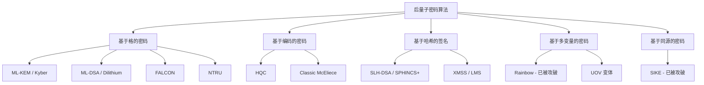
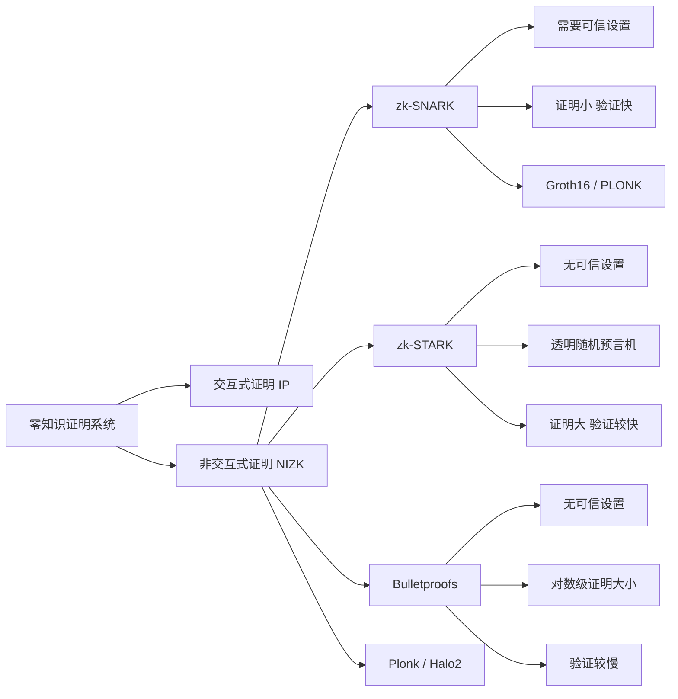
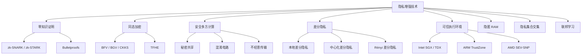

## 13.8 密码学的未来发展趋势

密码学正处于历史上最深刻的变革期。量子计算的逼近、隐私保护需求的爆发、以及人工智能与密码学的交叉融合，正在重塑整个领域的技术格局。本节系统梳理密码学的前沿发展方向，从算法层、协议层、应用层三个维度展开，帮助读者建立对未来密码学生态的全景认知。

### 13.8.1 后量子密码学（Post-Quantum Cryptography, PQC）

#### 量子计算对现有密码体系的威胁

Shor 算法可以在多项式时间内分解大整数和求解离散对数问题，这意味着 RSA、ECC、DH 等广泛使用的公钥密码算法在足够强大的量子计算机面前将被彻底攻破。Grover 算法则可以将对称密钥搜索的复杂度从 O(2^n) 降低到 O(2^{n/2})，虽不致命但要求将密钥长度加倍。

当前主流算法受量子计算威胁的程度如下：

| 算法类型 | 代表算法 | 量子威胁 | 紧迫程度 |
|---------|---------|---------|---------|
| 公钥加密 | RSA-2048, RSA-4096 | Shor 算法多项式破解 | 极高 |
| 椭圆曲线 | ECDSA, ECDH, Ed25519 | Shor 算法多项式破解 | 极高 |
| Diffie-Hellman | DH, DHE | Shor 算法多项式破解 | 极高 |
| 对称加密 | AES-128, AES-256 | Grover 算法加速搜索 | 中等（加倍密钥即可） |
| 哈希函数 | SHA-256, SHA-3 | Grover 算法加速碰撞 | 中等（加倍输出即可） |

**"先存储后解密"（Harvest Now, Decrypt Later）威胁**：攻击者可以现在截获并存储加密通信数据，等量子计算机成熟后再解密。对于需要长期保密的数据（政府机密、医疗记录、金融数据），即使量子计算机还需 10-20 年才实用化，现在就必须开始迁移。

#### NIST 后量子密码标准化进程

NIST 从 2016 年启动后量子密码标准化项目，经过多轮评估，于 2024 年正式发布了首批标准：

**已发布标准（2024 年 8 月）：**

- **ML-KEM（FIPS 203）**：原 CRYSTALS-Kyber，基于 Module-LWE 问题的密钥封装机制，用于密钥交换。公钥 800-1568 字节，密文 768-1568 字节，密钥生成和封装速度极快。
- **ML-DSA（FIPS 204）**：原 CRYSTALS-Dilithium，基于 Module-LWE/LWE 问题的数字签名算法。签名大小 2420-4627 字节，验证速度快。
- **SLH-DSA（FIPS 205）**：原 SPHINCS+，基于哈希的无状态数字签名，安全性依赖最小（仅需哈希函数安全），但签名较大（7856-49856 字节）。

**仍在评估中的算法：**

- **HQC**：基于准循环码的密钥封装，作为 ML-KEM 的备用方案。
- **FALCON**：基于 NTRU 格的签名方案，签名紧凑（666-1280 字节）但实现复杂，需要高精度浮点运算或定点运算。



#### 后量子密码的核心困难问题

后量子密码的安全性建立在以下数学困难问题之上：

**1. 格（Lattice）问题**

格是 n 维空间中整数线性组合构成的离散点集。核心困难问题包括：
- **最短向量问题（SVP）**：在给定格中找到最短非零向量。已知最好的经典算法复杂度为 2^{O(n)}，量子算法同样无法有效求解。
- **最近向量问题（CVP）**：给定格和一个目标点，找到格中距目标最近的点。
- **Learning With Errors（LWE）**：给定 (A, b = As + e)，其中 e 是小噪声向量，恢复秘密 s。噪声的存在使得线性代数方法失效。
- **Module-LWE / Ring-LWE**：LWE 的结构化变体，利用多项式环结构提升效率，但安全性假设更强。

**2. 编码（Code-based）问题**

- **译码问题**：给定一个随机线性码的生成矩阵和一个含错误的码字，恢复原始消息。McEliece 方案自 1978 年提出至今未被攻破，但公钥尺寸巨大（约 1MB）。

**3. 哈希（Hash-based）问题**

- 安全性完全依赖哈希函数的抗碰撞性和原像抗性，不依赖任何数论假设。即使量子计算机出现，SHA-3 等哈希函数经过适当调整仍然安全。

#### 迁移策略与实践

组织向后量子密码迁移需要分阶段推进：

```text
阶段 1：密码资产盘点（Crypto Inventory）
├── 扫描所有系统中使用的密码算法和协议
├── 标记每个资产的敏感级别和数据生命周期
├── 识别依赖公钥密码的关键路径
└── 评估"先存储后解密"风险

阶段 2：混合部署（Hybrid Mode）
├── 在现有算法基础上叠加后量子算法
├── 例如：X25519 + ML-KEM-768 组合密钥交换
├── 任一层安全则整体安全（保守策略）
└── Google Chrome、Cloudflare 已采用此方案

阶段 3：全面迁移（Full Migration）
├── 淘汰所有量子脆弱算法
├── 更新密钥管理系统
├── 升级 HSM 固件支持后量子算法
└── 更新合规和审计流程
```

**已部署的后量子实践案例：**

- **Signal 协议（PQXDH）**：2023 年 Signal 将 X25519 与 ML-KEM-1024 组合，实现后量子安全的即时通信密钥交换。
- **Google Chrome**：默认启用 X25519Kyber768 混合密钥交换（TLS 1.3）。
- **Cloudflare**：在 TLS 握手中部署 ML-KEM-768 混合模式。
- **Apple iMessage（PQ3）**：2024 年引入后量子密钥轮换机制，每个会话周期重新生成后量子密钥。

### 13.8.2 同态加密（Homomorphic Encryption, HE）

#### 基本原理

同态加密允许在密文上直接执行计算操作，计算结果解密后与在明文上执行相同操作的结果一致。形式化表述：

设 Enc 为加密函数，Dec 为解密函数，对任意明文 m₁, m₂：
- **加法同态**：Dec(Enc(m₁) ⊕ Enc(m₂)) = m₁ + m₂
- **乘法同态**：Dec(Enc(m₁) ⊗ Enc(m₂)) = m₁ × m₂
- **全同态**：同时支持加法和乘法同态，从而支持任意计算

#### 同态加密的分类

| 类型 | 支持操作 | 代表方案 | 效率 | 应用场景 |
|------|---------|---------|------|---------|
| 部分同态（PHE） | 仅加法或仅乘法 | Paillier（加法）、RSA（乘法） | 高 | 电子投票、聚合统计 |
| 有限同态（SHE） | 有限次加法和乘法 | BGV、BFV | 中 | 特定电路评估 |
| 全同态（FHE） | 任意计算 | CKKS、TFHE、OpenFHE | 低 | 通用安全计算 |

#### 全同态加密的发展历程

全同态加密被称为"密码学的圣杯"（Grail of Cryptography），其发展历程体现了理论突破与工程优化的交替推进：

**2009 年 — Gentry 的突破**

Craig Gentry 基于理想格提出第一个全同态加密方案。核心思想是"自举"（Bootstrapping）：对密文进行同态解密操作，将噪声控制在可接受范围内，从而支持无限次运算。但初代方案单次自举需要约 30 分钟，完全不实用。

**2011-2014 年 — 三大方案体系形成**

- **BGV（Brakerski-Gentry-Vaikuntanathan）**：引入模交换（Modulus Switching）技术控制噪声增长，支持层次型 FHE。
- **BFV（Brakerski/Fan-Vercauteren）**：BGV 的变体，使用缩放技术替代模交换，实现更简洁。
- **GSW（Gentry-Sahai-Waters）**：基于近似特征向量的新构造，为后续 TFHE 奠定基础。

**2016-2020 年 — 实用化推进**

- **CKKS（Cheon-Kim-Kim-Song）**：支持近似浮点数运算，特别适合机器学习场景。允许在加密数据上训练模型或进行推理。
- **TFHE（Torus FHE）**：支持逐位门操作的快速自举（约 10 毫秒/门），适合布尔电路评估。
- **SEAL、HElib、OpenFHE、Lattigo**：成熟的开源库出现，大幅降低使用门槛。

**2021 年至今 — 工程优化与硬件加速**

- Intel HEXL 库利用 AVX-512 指令集加速 NTT 运算。
- DARPA DPRIVE 项目资助专用 FHE 加速芯片开发。
- Cornami、Duality Technologies 等公司开发 FHE 专用硬件。
- Zama 发布 fhEVM，在以太坊虚拟机上实现同态加密智能合约。

#### 同态加密的核心技术

**噪声管理**

所有格基 FHE 方案都有一个共同特点：每次同态操作都会在密文中累积噪声。噪声超过阈值后密文将无法正确解密。控制噪声的主要技术：

- **密钥交换（Key Switching）**：将密文从一个密钥下转换到另一个密钥下，同时减小噪声。
- **模交换（Modulus Switching）**：将密文模数缩小，等比例降低噪声。
- **自举（Bootstrapping）**：同态地执行解密电路，将噪声"刷新"到初始水平。这是实现全同态的关键操作。

**编码方案**

明文如何编码到密文空间直接影响效率和精度：
- **整数编码**：BFV/BGV 方案，适合精确整数运算。
- **浮点编码**：CKKS 方案，支持近似浮点运算，适合科学计算和机器学习。
- **布尔编码**：TFHE 方案，每个比特单独加密，支持任意逻辑门。

#### 同态加密的实际应用

**隐私保护机器学习**

```python
# 使用 TenSEAL 进行加密推理的简化示例
import tenseal as ts

# 创建加密上下文
context = ts.context(
    ts.SCHEME_TYPE.CKKS,
    poly_modulus_degree=8192,
    coeff_mod_bit_sizes=[60, 40, 40, 60]
)
context.global_scale = 2**40
context.generate_galois_keys()

# 客户端加密输入数据
input_data = [0.5, 0.3, 0.8, 0.1]
encrypted_input = ts.ckks_vector(context, input_data)

# 服务端在密文上执行线性模型: y = w·x + b
# 模型权重（明文或密文）
weights = [0.2, 0.4, 0.1, 0.6]
bias = 0.1

# 密文上的点积运算
encrypted_result = encrypted_input.dot(weights) + bias

# 客户端解密结果
result = encrypted_result.decrypt()
# result ≈ [0.5*0.2 + 0.3*0.4 + 0.8*0.1 + 0.1*0.6 + 0.1] = [0.44]
```

**隐私集合交集（PSI）**

两方各自持有一组数据，需要求交集但不泄露各自集合的内容。同态加密可以实现高效的 PSI 协议，应用于广告归因、金融反洗钱等场景。

**加密数据库查询**

对数据库中的加密字段执行查询操作，服务端无法获知查询内容和数据明文。如 CipherCompute、ZeroDB 等产品已提供初步可用的加密数据库方案。

#### 同态加密的性能现状与瓶颈

截至 2025 年，全同态加密的性能开销仍然显著：

| 操作 | 明文耗时 | FHE 耗时 | 性能比 |
|------|---------|---------|--------|
| 1024 点 FFT | ~1 μs | ~100 μs | ~100× |
| 矩阵乘法 128×128 | ~1 ms | ~1 s | ~1000× |
| 神经网络推理（MNIST） | ~1 ms | ~10 s | ~10000× |
| 自举（每次） | N/A | ~10 ms（TFHE） | 主要瓶颈 |

主要瓶颈包括：密文膨胀（明文 1 字节 → 密文数 KB）、自举开销、多项式运算复杂度。硬件加速是突破瓶颈的关键路径。

### 13.8.3 零知识证明（Zero-Knowledge Proof, ZKP）

#### 核心概念

零知识证明是一种交互式或非交互式协议，允许证明者（Prover）向验证者（Verifier）证明某个陈述为真，而不泄露除"该陈述为真"之外的任何信息。

零知识证明必须满足三个性质：
- **完备性（Completeness）**：如果陈述为真，诚实的证明者总能说服诚实的验证者。
- **可靠性（Soundness）**：如果陈述为假，任何（哪怕是恶意的）证明者都无法说服诚实的验证者（除极小概率外）。
- **零知识性（Zero-Knowledge）**：验证者除了"陈述为真"这一事实外，无法获得任何额外信息。形式化地说，存在一个模拟器可以在不知道证据的情况下生成与真实证明不可区分的通信记录。

#### 零知识证明的主要技术路线



**zk-SNARK（Zero-Knowledge Succinct Non-Interactive Argument of Knowledge）**

- **Succinct**：证明大小为常数级（约 200 字节），验证时间为毫秒级。
- **Non-Interactive**：证明者生成一个证明字符串，验证者单次验证即可。
- **Argument**：计算可靠性（仅对计算能力有限的攻击者安全）。
- **of Knowledge**：证明者必须"知道"证据才能生成证明。

核心数学基础是 QAP（Quadratic Arithmetic Program）：将计算问题转化为多项式等式，利用双线性配对（Bilinear Pairing）实现简洁验证。

**局限性**：大多数 zk-SNARK 方案需要"可信设置"（Trusted Setup），即生成一组公共参考字符串（CRS）。如果 CRS 生成过程中的秘密参数（"有毒废料"）泄露，攻击者可以伪造证明。

**zk-STARK（Zero-Knowledge Scalable Transparent Argument of Knowledge）**

- **Scalable**：证明者时间为拟线性，验证时间为对数级。
- **Transparent**：无需可信设置，仅依赖哈希函数的随机预言机模型。
- 基于 FRI（Fast Reed-Solomon Interactive Oracle Proof）协议。
- 证明大小约 50-200 KB，比 SNARK 大但证明生成更快。
- 抗量子计算（仅依赖哈希函数安全性）。

**Bulletproofs**

- 无需可信设置。
- 证明大小为对数级（约 672 字节用于范围证明）。
- 验证时间为线性级，但支持批量验证。
- Monero、MimbleWimble 等隐私币广泛使用。

**Plonk / Halo2 / Nova**

- **Plonk**：通用可信设置（只需一次设置），使用多项式承诺方案（KZG/IPA），成为当前主流 zkEVM 的基础。
- **Halo2**：无需可信设置的递归证明系统，使用 IPA（Inner Product Argument）多项式承诺。
- **Nova / SuperNova**：递归证明的最新进展，支持增量可验证计算（IVC），每步开销仅为一个群运算。

#### 零知识证明的应用领域

**区块链与加密货币**

零知识证明在区块链领域的应用最为成熟：

- **Zcash（zk-SNARK）**：发送方、接收方和金额全部隐藏，链上仅记录"一笔合法交易发生了"。
- **Tornado Cash（zk-SNARK）**：以太坊上的混币协议，存入和取出之间通过零知识证明切断关联。
- **zkSync / StarkNet / Polygon zkEVM**：Layer 2 扩容方案，将大量交易压缩为一个零知识证明提交到主链，吞吐量提升 100-1000 倍。
- **zkRollup 原理**：在链下执行交易并生成状态转换的有效性证明，链上只需验证证明，无需重新执行交易。

**身份认证与隐私保护**

- **选择性披露**：证明"我已年满 18 岁"而不泄露具体年龄或出生日期。
- **匿名凭证**：证明"我是某机构的合法用户"而不泄露用户身份。
- **zkLogin**：Sui 区块链引入的方案，用 OAuth 账号（Google/Apple）登录区块链，通过 ZKP 隐藏关联。

**机器学习验证**

- **zkML**：证明一个 AI 模型确实在输入数据上执行了声称的推理过程，且结果正确。
- 应用场景包括：AI 模型审计、去中心化 AI 推理市场、隐私保护联邦学习验证。
- 代表项目：EZKL、Modulus Labs、Giza。

**可验证计算**

委托远程服务器执行计算，服务器返回结果和零知识证明，客户端可以快速验证结果正确性而无需重新计算。这在云计算、外包计算等场景中具有重要价值。

#### 零知识证明的开发框架

| 框架 | 语言 | 证明系统 | 特点 |
|------|------|---------|------|
| Circom + SnarkJS | JavaScript | Groth16/PLONK | 生态最成熟，入门友好 |
| gnark | Go | Groth16/PLONK | 性能优秀，后端灵活 |
| Halo2 | Rust | IPA/KZG | Zcash 团队开发，无可信设置 |
| Noir | Rust DSL | 多种后端 | 抽象层级高，语法简洁 |
| Cairo | 自定义语言 | STARK | StarkNet 原生，图灵完备 |
| Risc Zero | Rust | STARK | RISC-V 虚拟机，通用计算 |
| SP1 | Rust | STARK+PLONK | Succinct Labs，高性能 |

### 13.8.4 安全多方计算（Secure Multi-Party Computation, MPC）

#### 核心概念

安全多方计算允许多个参与方在不泄露各自私有输入的前提下，联合计算一个约定函数的结果。形式化地说，n 个参与方 P₁, P₂, ..., Pₙ 分别持有输入 x₁, x₂, ..., xₙ，协议执行后每个参与方得到 f(x₁, x₂, ..., xₙ) 的结果，但除了结果本身外，任何参与方都无法推断其他方的输入信息。

#### 主要技术路线

**1. 秘密共享（Secret Sharing）**

- **Shamir 秘密共享**：将秘密 s 编码为一个 t-1 次多项式 f(x) 的常数项（f(0) = s），分发 n 个点 (i, f(i)) 给 n 个参与方。任意 t 个点可以插值恢复 f(0)，t-1 个点无法获得任何信息。
- **加法秘密共享**：将秘密 s 分为 n 个随机份额 s₁, s₂, ..., sₙ，满足 s₁ + s₂ + ... + sₙ = s。每个份额看起来完全随机。
- **GMW 协议**：基于加法秘密共享和不经意传输（OT），可以安全计算任意布尔电路。
- **BGW 协议**：基于 Shamir 秘密共享，在诚实多数假设下可以安全计算任意函数。

**2. 混淆电路（Garbled Circuits, GC）**

由 Andrew Yao 提出，一方将计算函数编译为布尔电路并对每个门进行加密，另一方通过不经意传输获取对应输入的密钥，逐门解密得到输出。常与 OT 扩展技术配合使用。

**3. 同态加密 + 秘密共享**

利用同态加密的加法同态特性实现高效的乘法协议，结合秘密共享分担计算负载。SPDZ 协议族是这类方案的代表。

#### 应用场景

**隐私保护数据分析**

- 多家银行联合进行反洗钱模型训练，每家银行的数据不出本地。
- 多个医疗机构联合进行疾病风险预测，患者数据保持加密。
- 中国电信与中国联通曾使用 MPC 进行联合数据分析优化网络覆盖。

**隐私保护机器学习（PPML）**

- **联邦学习 + MPC**：各参与方本地训练模型，通过 MPC 安全聚合梯度，防止单个方的梯度泄露训练数据信息。
- **加密推理**：模型持有方和数据持有方通过 MPC 协议完成推理，双方互相看不到对方的信息。

**阈值签名（Threshold Signature）**

将签名私钥通过秘密共享分散到多个参与方，至少 t 个参与方合作才能生成有效签名。任何单一方都无法独立签名。应用包括：
- 多签钱包替代方案（比链上多签更隐私、更便宜）。
- 分布式密钥管理系统。
- TSS（Threshold Signature Scheme）已在 Fireblocks、ZenGo 等钱包中部署。

### 13.8.5 属性基加密与功能加密

#### 属性基加密（Attribute-Based Encryption, ABE）

传统加密中，加密方必须知道接收方的公钥。ABE 允许加密方根据访问策略加密数据，只有属性满足策略的用户才能解密。

**两种类型：**

- **密钥策略 ABE（KP-ABE）**：密钥关联访问策略，密文关联属性集合。适合付费内容分发。
- **密文策略 ABE（CP-ABE）**：密文关联访问策略，密钥关联属性集合。适合细粒度访问控制。

**示例策略**：`(部门: 研发部 AND 级别: 高级) OR (部门: 安全部 AND 角色: 管理员)`

只有属性满足上述布尔表达式的用户才能解密。这比传统的"加密给特定公钥"灵活得多，特别适合云存储、医疗数据共享等场景。

**核心挑战**：属性撤销困难（用户属性变更后如何撤销其解密能力）、策略表达能力与效率的权衡、大规模部署下的密钥管理复杂度。

#### 功能加密（Functional Encryption, FE）

功能加密是 ABE 的推广。给定函数 f 的功能密钥 SK_f，持有 SK_f 的人只能从密文中恢复 f(m)，而无法获得 m 本身。

例如：加密员工薪资数据，给人力资源部门一个"求平均值"的功能密钥，给税务部门一个"求总和"的功能密钥。各方只能获得其授权函数的计算结果，看不到原始数据。

功能加密仍处于理论研究阶段，实用化方案的效率有待大幅提升。

### 13.8.6 可搜索加密与隐私保护数据检索

#### 动态可搜索对称加密（DSSE）

可搜索加密允许在加密数据上执行关键词搜索，服务端返回匹配的加密文档但无法获知搜索内容或文档内容。

**威胁模型**：服务端不可信但诚实执行协议（Honest-but-Curious）。

**主要技术路线：**

- **对称可搜索加密（SSE）**：基于对称密码构建，效率高但仅支持单用户。
- **非对称可搜索加密（ASE）**：基于公钥密码构建，支持多用户但效率较低。
- **隐匿模式（Oblivious RAM, ORAM）**：通过随机化访问模式隐藏查询模式，安全性最强但开销最大。

**泄露函数与安全层级**：

SSE 方案的安全性由其泄露函数定义。常见的泄露包括：
- 访问模式泄露：哪些文档匹配了查询。
- 搜索模式泄露：两次搜索是否使用了相同关键词。
- 泄露越少安全性越高，但通常伴随着更高的性能开销。

### 13.8.7 区块链密码学前沿

#### 账户抽象（Account Abstraction）

以太坊 ERC-4337 实现了账户抽象，允许用户账户使用任意签名方案和验证逻辑。这为后量子签名迁移提供了便利——用户只需更新验证逻辑即可切换到后量子签名算法，无需改变账户地址。

#### 多方计算钱包

基于 MPC 的阈值签名方案替代传统多签，实现：
- 私钥永不完整出现在任何单一设备上。
- 签名过程在链上不可区分于普通交易（更好的隐私性）。
- 签名 Gas 费与普通交易相同（比多签更便宜）。

#### 零知识以太坊（zkEVM）

将整个以太坊虚拟机的执行转化为零知识证明电路，实现以太坊 Layer 2 的完全兼容扩展：

| 类型 | 兼容性 | 代表项目 | 特点 |
|------|--------|---------|------|
| Type 1 | 完全等价 | Taiko | 与以太坊完全一致，最慢 |
| Type 2 | EVM 等价 | Scroll, zkSync Era | 兼容大部分合约 |
| Type 2.5 | EVM 等价+优化 | Polygon zkEVM | 适度修改提升效率 |
| Type 3 | 几乎 EVM 等价 | Scroll Alpha | 去除少数难证明操作 |
| Type 4 | 高级语言等价 | StarkNet, zkSync Lite | 编译为 ZK 友好的 IR |

### 13.8.8 人工智能与密码学的交叉

#### 密码学在 AI 中的应用

**隐私保护机器学习**

- **联邦学习**：模型在各参与方本地训练，仅交换模型更新而非原始数据。
- **差分隐私**：在梯度或模型参数中注入精心校准的噪声，保证单个样本对模型的影响可忽略。
- **同态加密推理**：用户加密输入数据发送给 AI 服务，服务在密文上推理后返回加密结果。

**AI 模型安全**

- **模型水印**：在模型参数中嵌入不可见的标记，用于版权保护和模型溯源。
- **对抗样本防御**：密码学原语（如哈希校验）用于验证输入的完整性。
- **可验证 AI**：通过零知识证明验证 AI 推理的正确性，防止恶意服务商偷工减料或篡改结果。

#### AI 在密码学中的应用

**密码分析**

- 神经网络用于侧信道攻击（如电磁辐射分析、功耗分析），从密码设备的物理泄漏中恢复密钥。
- 深度学习辅助差分/线性密码分析，自动发现高概率差分特征。
- 但目前 AI 尚未真正"攻破"任何设计良好的密码算法。

**密码方案优化**

- 机器学习辅助选择 S-box 的设计参数，平衡非线性度和差分均匀性。
- 强化学习优化同态加密的参数选择（模数链、多项式度数等）。
- 自动化搜索轻量级密码结构。

**AI 辅助形式化验证**

- 大语言模型辅助编写密码协议的形式化证明（如用 Coq/Lean4 验证协议安全性）。
- AI 辅助发现协议实现中的逻辑漏洞。
- 但 LLM 生成的密码学代码需要严格审查——模型可能引入微妙的实现漏洞。

### 13.8.9 轻量级密码学与物联网安全

#### 轻量级密码算法的需求

物联网（IoT）设备通常具有以下约束：
- 计算能力有限（8 位或 32 位微控制器）
- 内存极小（几 KB RAM 和 Flash）
- 功耗受限（电池供电，需要运行数年）
- 需要实时响应（延迟敏感）

传统密码算法（如 AES-128）在高端设备上表现良好，但在极端受限的设备上可能不可行。

#### NIST 轻量级密码标准化

NIST 于 2023 年发布了轻量级密码标准：

- **ASCON（NIST SP 800-232）**：被选为轻量级认证加密和哈希的标准。基于 Sponge 结构，硬件面积仅需约 3000 个等效门（GE），远低于 AES 的约 20000 GE。支持 AEAD 和可变长度哈希。
- 竞赛中其他值得关注的方案：GIFT-COFBOT（极小硬件面积）、Xoodyak（灵活多功能）。

#### 轻量级密码的设计原则

- **Sponge 结构**：复用同一核心排列实现加密、哈希、MAC 等多种功能。
- **小状态尺寸**：减少寄存器和存储需求。
- **位切片实现**：在并行硬件中高效处理多个数据块。
- **侧信道防护**：在不大幅增加面积的前提下实现恒定时间实现。

### 13.8.10 量子密钥分发（Quantum Key Distribution, QKD）

#### 基本原理

QKD 利用量子力学的基本原理（不可克隆定理、测量坍缩）在两个通信方之间建立共享密钥。任何窃听行为都会不可避免地干扰量子态，从而被通信双方检测到。

**BB84 协议**（最经典的 QKD 协议）：

```text
Alice                           Eve（窃听者）                      Bob
  |                                 |                                |
  |--- 随机选择基（+/×）------------|--------------------------------|
  |--- 发送对应基的量子比特 ---------|--- 可能测量/转发 ---------------|
  |                                 |--- 测量引入误码 ----------------|
  |                                 |                                |
  |<--------- 公开比较测量基 ---------|--------------------------------|
  |                                 |                                |
  |    保留基相同的比特作为密钥       |                                |
  |<========= 隐私放大 + 纠错 =======|================================|
  |                                 |                                |
  |    生成最终安全密钥              |                                |
```

#### QKD 的实际部署

**已部署网络：**

- **中国"墨子号"卫星**：2016 年发射，实现 1200 公里卫星-地面量子密钥分发。2017 年实现北京-维也纳 7600 公里洲际量子加密视频通话。
- **京沪量子通信干线**：2017 年开通，全长 2000+ 公里，连接北京、济南、合肥、上海，中间经过 32 个可信中继节点。
- **欧洲量子通信基础设施（EuroQCI）**：欧盟资助的泛欧量子通信网络，计划覆盖所有 27 个成员国。
- **美国量子网络**：芝加哥量子交换中心（CQEC）、布鲁克海恩-石溪量子网络等。

**QKD 的技术局限：**

- **距离限制**：光纤中量子信号衰减严重，无中继情况下约 100-200 公里。可信中继引入安全隐患。
- **速率瓶颈**：当前商用 QKD 系统的密钥生成速率约为 10-100 kbps，远低于经典密钥协商。
- **成本高昂**：单套 QKD 设备价格约 10-50 万美元。
- **不抗中间人攻击**：QKD 只能分发密钥，无法认证通信方身份。首次使用仍需经典认证通道。
- **后量子密码的竞争**：ML-KEM 等后量子算法在成本、部署便捷性上远优于 QKD。

**学术界观点分歧**：一部分研究者认为 QKD 是长期最佳方案（物理定律保证安全）；另一部分认为后量子密码已经足够，QKD 的成本和限制使其在大多数场景下不实用。目前主流共识是：QKD 适合极高安全需求的场景（政府、军事），后量子密码适合大规模通用部署。

### 13.8.11 隐私增强技术（Privacy-Enhancing Technologies, PETs）全景



**差分隐私**：在数据发布或查询结果中注入噪声，保证单条记录的增删对输出分布的影响可忽略。ε（隐私预算）越小隐私保护越强，但数据可用性越低。Apple（键盘输入统计）、Google（Chrome 使用统计）、美国人口普查局均采用差分隐私。

**可信执行环境（TEE）**：利用硬件隔离在处理器内创建安全飞地，代码和数据在飞地内不可被外部软件（包括操作系统和虚拟机管理程序）访问。Intel SGX、AMD SEV-SNP、ARM TrustZone 是主流 TEE 技术。优势是性能接近原生，劣势是需要信任硬件厂商，且历史上不断被侧信道攻击突破。

### 13.8.12 密码学标准化趋势

#### 国际标准化动态

| 标准组织 | 关键工作 | 时间线 |
|---------|---------|--------|
| NIST | PQC 标准化（FIPS 203/204/205） | 2024 年发布 |
| NIST | 轻量级密码（ASCON） | 2023 年发布 |
| NIST | 密码敏捷性框架制定中 | 2025-2026 |
| ISO/IEC | 后量子密码国际标准对接 | 进行中 |
| ETSI | QKD 网络标准 | 持续更新 |
| IETF | TLS/SSH 的 PQC 集成 | 草案阶段 |
| W3C | Web Crypto API 扩展 | 规划中 |

#### 中国的密码标准化

- **SM2**：椭圆曲线公钥密码算法，用于数字签名和密钥交换。
- **SM3**：密码哈希函数，输出 256 位，安全性与 SHA-256 相当。
- **SM4**：分组密码算法，128 位密钥和分组长度，用于无线局域网安全。
- **SM9**：基于身份的密码算法，简化密钥管理。
- **ZUC**：流密码算法，用于 4G/5G 移动通信加密。

中国密码标准化的一个重要趋势是推进国产密码算法的国际标准化——SM2/SM3/SM9 已被 ISO/IEC 采纳为国际标准。

### 13.8.13 密码敏捷性（Crypto Agility）

#### 为什么需要密码敏捷性

密码敏捷性是指系统能够在不大幅修改架构的情况下，快速替换密码算法的能力。这一需求在以下场景中尤为紧迫：

- 后量子密码迁移：需要将现有系统中的 RSA/ECC 替换为后量子算法。
- 算法被攻破：如 SIKE 在 2022 年被完全攻破，使用 SIKE 的系统需要紧急迁移。
- 合规要求变更：不同国家和行业对密码算法有不同的合规要求。

#### 实现密码敏捷性的关键设计

```python
# 密码敏捷性架构示例：算法注册表模式
class CryptoRegistry:
    """密码算法注册表，支持运行时算法切换"""
    
    def __init__(self):
        self._algorithms = {}
        self._default = None
    
    def register(self, name, algorithm, is_default=False):
        """注册密码算法"""
        self._algorithms[name] = algorithm
        if is_default:
            self._default = name
    
    def get(self, name=None):
        """获取算法实例"""
        name = name or self._default
        if name not in self._algorithms:
            raise ValueError(f"Unknown algorithm: {name}")
        return self._algorithms[name]
    
    def list_algorithms(self):
        """列出所有已注册算法"""
        return list(self._algorithms.keys())

# 使用示例
registry = CryptoRegistry()
registry.register("ml-kem-768", MLKEM768(), is_default=True)
registry.register("x25519", X25519())
registry.register("hybrid-x25519-mlkem", HybridX25519MLKEM())

# 代码通过注册表获取算法，不直接引用具体实现
kem = registry.get()  # 默认使用 ML-KEM-768
```

**密码敏捷性的工程实践：**

- **算法标识编码**：在密文/签名/证书中嵌入算法标识符，接收方根据标识符选择解密/验证算法。
- **密码模块抽象层**：所有密码操作通过抽象接口调用，具体实现可替换。
- **密钥版本管理**：同一密钥用途下维护多个算法版本的密钥，支持平滑过渡。
- **自动化迁移工具**：批量扫描和替换系统中的密码算法引用。

### 13.8.14 量子互联网与量子安全通信

#### 量子互联网的愿景

量子互联网的目标是在远距离量子节点之间分发纠缠态，支持以下应用：

- **量子密钥分发**：基于量子物理原理的安全密钥交换。
- **分布式量子计算**：连接多个小型量子计算机形成等效大型量子计算机。
- **量子传感器网络**：利用纠缠态提升分布式传感的精度。
- **量子时钟同步**：利用纠缠态实现超高精度时间同步。

#### 量子中继技术

光纤中量子信号的指数衰减限制了 QKD 的传输距离。量子中继通过以下技术突破距离限制：

1. **量子存储器**：将量子态暂存于原子系综或固态量子存储器中。
2. **纠缠交换**：通过 Bell 态测量将两段短距离纠缠连接为长距离纠缠。
3. **纠缠纯化**：从多对低保真度纠缠中提取少量高保真度纠缠。

当前技术水平：量子存储器保真度约 90%，存储时间约 1 秒，距离实用化仍有差距。

### 13.8.15 格密码深入：后量子密码的核心引擎

#### 格密码为何成为主流

在 NIST 后量子标准化中，基于格的方案占据了核心位置（ML-KEM、ML-DSA、FALCON 全部基于格）。原因包括：

- **安全性基础扎实**：最短向量问题（SVP）和最近向量问题（CVP）是 NP-hard 问题的近似版本。
- **效率优势**：格运算主要是多项式乘法和矩阵运算，硬件友好，速度快。
- **多功能性**：同一数学框架支持加密、签名、全同态加密、属性基加密等。
- **渐进安全性**：即使子问题被部分攻破，仍然可以调整参数维持安全性。

#### LWE 问题详解

Learning With Errors（LWE）是格密码的基础假设：

给定 n 维向量 s（秘密），选择 m 个随机向量 aᵢ ∈ Z_q^n 和小噪声 eᵢ ∈ Z，计算 bᵢ = ⟨aᵢ, s⟩ + eᵢ mod q。公开 (A, b)，恢复 s 是困难的。

```python
# LWE 问题的简化演示
import numpy as np

def lwe_sample(n, q, m, secret, error_bound):
    """生成 LWE 样本 (A, b = As + e)"""
    A = np.random.randint(0, q, size=(m, n))
    e = np.random.randint(-error_bound, error_bound + 1, size=m)
    b = (A @ secret + e) % q
    return A, b, e

# 参数选择
n = 256          # 维度（安全参数）
q = 7681         # 模数
m = 512          # 样本数
error_bound = 1  # 噪声界

secret = np.random.randint(0, q, size=n)
A, b, e = lwe_sample(n, q, m, secret, error_bound)

# 攻击者需要从 (A, b) 恢复 secret
# 没有 e 时就是简单线性代数（高斯消元）
# 有 e 时问题变得计算困难
```

#### Module-LWE 与 Ring-LWE

- **Ring-LWE**：在多项式环 Z_q[x]/(x^n + 1) 上定义 LWE，利用 NTT（数论变换）加速多项式乘法，将公钥大小压缩到 O(n)。
- **Module-LWE**：Ring-LWE 的推广，使用 k × k 矩阵形式，兼顾灵活性和效率。ML-KEM（Kyber）采用 Module-LWE。

### 13.8.16 密码学的伦理与社会影响

#### 隐私与安全的平衡

密码学技术的发展引发了一系列伦理和政策争议：

- **"加密后门"争论**：执法机构要求在加密系统中预留后门以便犯罪调查，安全专家普遍反对——后门一旦存在就无法限制其使用范围，会被恶意行为者利用。
- **隐私币监管**：Monero、Zcash 等隐私加密货币面临交易所下架压力，部分国家已禁止隐私币交易。
- **零知识证明的双刃性**：保护隐私的同时也可能被用于隐藏非法交易（如 Tornado Cash 被美国制裁）。

#### 密码学民主化

开源密码库（如 OpenSSL、libsodium、Bouncy Castle）和密码学教育的普及，使得个人和小组织也能获得军用级别的密码保护。这是密码学发展的正面影响。

#### 量子计算的地缘政治影响

量子计算能力的不对称可能导致新的地缘政治失衡。率先实现实用化量子计算机的国家将拥有破解对手加密通信的能力。这推动了各国在量子计算和后量子密码领域的投资竞赛。

### 13.8.17 学习资源推荐

#### 学术论文

- **Regev, O.** "On Lattices, Learning with Errors, Random Linear Codes, and Cryptography." STOC 2005. — LWE 问题的奠基论文。
- **Gentry, C.** "Fully Homomorphic Encryption Using Ideal Lattices." STOC 2009. — 全同态加密的开创性工作。
- **Goldwasser, S., Micali, S., Rackoff, C.** "The Knowledge Complexity of Interactive Proof-Systems." STOC 1985. — 零知识证明的原始论文。
- **Ben-Sasson, E. et al.** "Scalable, Transparent, and Post-quantum Secure Computational Integrity." 2018. — zk-STARK 的完整论文。

#### 开源项目

- **OpenFHE**：最全面的全同态加密库，支持 BFV/BGV/CKKS/TFHE。
- **liboqs（Open Quantum Safe）**：后量子密码算法的开源 C 库，集成 OpenSSL。
- **Circom + SnarkJS**：零知识证明的入门级开发工具链。
- **MP-SPDZ**：安全多方计算的通用框架，支持多种协议。
- **Tenseal**：Python 同态加密库，基于 Microsoft SEAL。

#### 在线资源

- **PQCrypto 标准文档**：NIST FIPS 203/204/205 官方文档。
- **ZKP MOOC**：Dan Boneh 等人开设的零知识证明公开课。
- **Crypto Book（Boneh & Shoup）**：免费在线密码学教材，覆盖前沿主题。

### 13.8.18 常见误区与纠正

**误区 1："量子计算会破解所有加密"**

纠正：量子计算主要威胁公钥密码（RSA、ECC），对称密码和哈希函数通过加倍密钥长度即可抵御。后量子公钥密码（如 ML-KEM）已在标准化且开始部署。

**误区 2："后量子密码已经完全成熟可以放心使用"**

纠正：后量子密码的数学基础（格问题、编码问题）比 RSA 和 ECC 的数论基础历史更短，安全性假设还需要更长时间的检验。混合模式（经典 + 后量子）是当前最安全的过渡策略。

**误区 3："同态加密已经可以替代所有隐私计算技术"**

纠正：全同态加密的性能开销仍然巨大（千倍到万倍），对于大多数实际场景，MPC 或 TEE 更为实用。HE 适合特定场景（如远程加密推理、统计聚合），但不是万能方案。

**误区 4："零知识证明只用于区块链"**

纠正：零知识证明在身份认证、数据合规审计、供应链验证、电子投票等非区块链场景中同样有重要应用。区块链只是推动了 ZKP 技术的快速发展和工程化。

**误区 5："QKD 比后量子密码更安全"**

纠正：QKD 依赖物理层安全，需要专用硬件且受距离限制；后量子密码基于数学困难问题，可以在现有网络基础设施上部署。两者适用于不同场景，不存在绝对的优劣。

**误区 6："密码算法越新越好"**

纠正：密码学的核心原则之一是保守——新算法需要经过长时间的公开密码分析才能建立信任。AES、SHA-3 等经历了多年分析的算法仍然是最安全的选择。贸然采用未经充分检验的新算法是危险的。

### 13.8.19 总结与展望

密码学的未来呈现以下核心趋势：

1. **后量子迁移是最紧迫的现实任务**。NIST 标准已经发布，主流浏览器和通信协议已开始集成，组织应立即启动密码资产盘点和迁移规划。

2. **隐私计算从理论走向工程化**。同态加密、零知识证明、安全多方计算的性能正在快速提升，专用硬件加速和算法优化并行推进，预计 3-5 年内将出现大规模工业部署。

3. **密码敏捷性成为系统架构的基本要求**。在算法快速迭代的时代，硬编码特定算法的系统将面临巨大的迁移成本。模块化、可替换的密码架构是必要的工程实践。

4. **AI 与密码学深度融合**。AI 辅助密码分析、密码方案优化和形式化验证；密码学保障 AI 模型的隐私性、完整性和可验证性。两者的交叉将产生新的研究方向和应用场景。

5. **标准化和合规驱动技术选择**。NIST、ISO、中国国密标准的更新直接影响产业界的技术选型。关注标准化动态是密码工程师的基本素养。

密码学是一门"永远在演进"的学科。从凯撒密码到后量子密码，密码编码者与密码分析者之间的攻防博弈从未停止。理解这些前沿趋势不仅关乎技术选型，更关乎在信息安全领域保持长期竞争力的能力。

> **本节关键要点**：后量子密码标准化已完成并开始部署；同态加密和零知识证明正从理论走向实用；安全多方计算和属性基加密提供了丰富的隐私计算工具箱；密码敏捷性是应对算法迭代的工程基础；量子密钥分发与后量子密码各有适用场景；密码学与 AI 的融合是未来十年的核心趋势。
