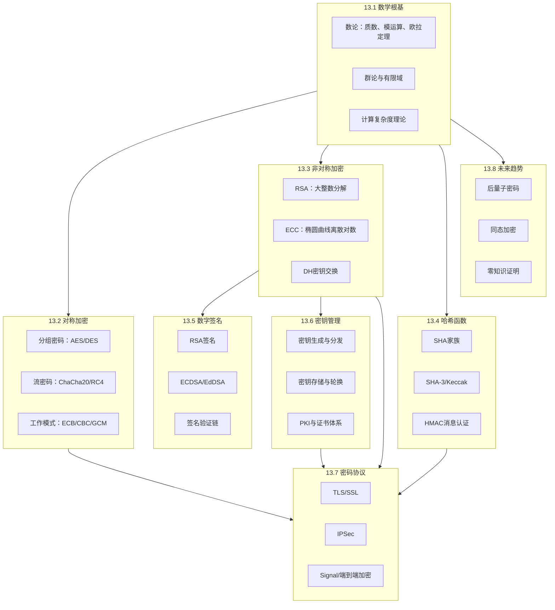

## 理论基础总结

本章是密码学理论基础的收束篇。前面八节从数学根基出发，经由对称加密、非对称加密、哈希函数、数字签名、密钥管理、密码协议，一路推进到未来趋势，构成了一条完整的知识链。本节将这些内容串联起来，提炼核心认知框架，指出各知识点之间的深层关联，并为后续的实战章节打下坚实基础。

### 知识体系全景图



这张图揭示了一个核心事实：**密码学不是一堆孤立算法的集合，而是一棵以数学为根、以协议为冠的树**。任何一个分支的深入理解，都依赖于对根系的扎实掌握。

### 八节核心要点回顾

#### 13.1 数学基础：一切的地基

密码学的安全性最终归结为数学问题的计算困难性。本节涵盖三大支柱：

| 数学工具 | 密码学应用 | 核心困难问题 |
|----------|-----------|-------------|
| 数论（质数、模运算、欧拉定理） | RSA、DH密钥交换 | 大整数分解、离散对数 |
| 群论与有限域 | AES（GF(2⁸)运算）、ECC | 椭圆曲线离散对数 |
| 概率论与信息论 | 一次性密码本、熵分析 | 完善保密性证明 |

**关键认知**：理解"计算困难"而非"绝对不可能"是密码学思维的起点。RSA不是"不可破解"，而是"破解所需计算量远超现实资源"。当计算资源（如量子计算机）发生质变时，安全假设可能崩塌——这正是后量子密码学诞生的原因。

#### 13.2 对称加密：速度与效率的王者

对称加密是密码学中性能最优的加密方式，适用于大数据量加密场景。

**算法演进脉络**：

```plaintext
DES (1977, 56位密钥)
 └── 已不安全，仅作教学用途
     └── 3DES (过渡方案，三次DES加密)
         └── AES (2001, 128/192/256位密钥, 当前标准)
             └── ChaCha20-Poly1305 (流密码, 移动设备优化)

分组模式演进：
ECB (不安全, 暴露模式) → CBC (需要IV) → CTR (可并行) → GCM (认证加密, 首选)
```

**实战要点**：
- **永远不要使用ECB模式**：相同明文块产生相同密文块，泄露数据模式
- **首选AEAD模式**（GCM/CCM/ChaCha20-Poly1305）：同时提供加密和认证
- **IV/Nonce不可重用**：GCM模式下Nonce重用会导致认证密钥泄露，完全破坏安全性
- **密钥长度选择**：AES-128足够应对当前威胁，AES-256提供更高安全余量

#### 13.3 非对称加密：解决信任问题的利器

非对称加密的核心贡献是**在不安全信道上建立信任**。它解决了对称加密的密钥分发难题。

**三大算法族对比**：

| 特性 | RSA | ECC | DH/DHE |
|------|-----|-----|--------|
| 安全基础 | 大整数分解 | 椭圆曲线离散对数 | 离散对数 |
| 256位安全所需密钥长度 | 15360位 | 512位 | 15360位 |
| 性能 | 较慢 | 快（密钥短） | 中等 |
| 主要用途 | 加密/签名 | 加密/签名/密钥协商 | 密钥交换 |
| 前向保密 | 不支持 | 支持（ECDHE） | 支持（DHE） |

**关键认知**：现代系统中，非对称加密很少直接加密数据——它主要用于**密钥交换**和**数字签名**。实际数据加密仍由对称加密完成（混合加密模式）。

#### 13.4 哈希函数：数据的数字指纹

哈希函数将任意长度数据压缩为固定长度摘要，是密码学中最基础、应用最广泛的原语。

**安全性质层级**：

```plaintext
第一层级（基础）：
├── 确定性：相同输入 → 相同输出
├── 快速计算：O(n)时间复杂度
└── 雪崩效应：输入微小变化 → 输出巨大差异

第二层级（抗攻击）：
├── 抗原像攻击（Pre-image Resistance）：
│   给定h，找到m使得H(m)=h 在计算上不可行
├── 抗第二原像攻击（Second Pre-image Resistance）：
│   给定m1，找到m2≠m1使得H(m1)=H(m2) 在计算上不可行
└── 抗碰撞攻击（Collision Resistance）：
    找到任意m1≠m2使得H(m1)=H(m2) 在计算上不可行
```

**算法选择指南**：
- **SHA-256**：通用场景首选，安全性与性能平衡
- **SHA-3**：当SHA-2被怀疑存在弱点时的备用方案，采用完全不同的Keccak结构
- **BLAKE3**：极高性能场景（如文件校验），比SHA-256快数倍
- **MD5/SHA-1**：**已不安全**，仅用于非安全场景（如数据校验）

#### 13.5 数字签名：不可否认性的实现

数字签名是公钥密码学最具革命性的应用——它实现了**不可否认性**（Non-repudiation），即签名者无法否认自己签过的内容。

**签名过程本质**：

```plaintext
签名：Sig = Sign(PrivateKey, Hash(Message))
验证：Verify(PublicKey, Sig, Message) → True/False

安全性依赖：
1. 私钥保密性 → 只有持有者能签名
2. 哈希函数的抗碰撞性 → 无法伪造不同消息产生相同签名
3. 签名算法的不可逆性 → 无法从签名反推私钥
```

**实际应用中的签名链**：TLS证书验证、代码签名、区块链交易、电子合同——这些场景的本质都是签名链的层层传递和验证。

#### 13.6 密钥管理：安全体系的阿喀琉斯之踵

> "密码系统的安全性取决于密钥管理，而非算法保密。" ——Kerckhoffs原则

密钥管理是密码学中最容易被忽视、也最容易出问题的环节。

**密钥生命周期**：

```plaintext
生成 → 分发 → 存储 → 使用 → 更新 → 销毁
 │       │       │       │       │       │
 ▼       ▼       ▼       ▼       ▼       ▼
 CSPRNG  PKI     HSM    最小    自动    安全
 随机性  证书    硬件   权限    轮换    擦除
 保证    体系    保护   原则    策略    程序
```

**常见致命错误**：
- 使用弱随机数生成器（如早期Debian OpenSSL漏洞导致密钥空间缩小到32768种）
- 密钥硬编码在源代码中（GitHub上每天都有数千个泄露的API密钥）
- 密钥长期不轮换（一旦泄露，所有历史通信均可解密）
- 缺少密钥撤销机制（泄露的密钥仍然被信任）

#### 13.7 密码协议：算法的交响乐

密码协议将多种密码原语组合起来，构建完整的安全通信系统。单独的算法是砖块，协议是建筑设计。

**TLS 1.3握手——现代密码协议的典范**：

```plaintext
TLS 1.3完整握手（1-RTT）：

Client                                      Server
  │                                           │
  │  ClientHello                              │
  │  + supported_versions: [0x0304]           │
  │  + key_share: [x25519公钥]                │
  │  + signature_algorithms: [ed25519]        │
  │──────────────────────────────────────────→│
  │                                           │
  │                       ServerHello         │
  │                       + key_share: [x25519]│
  │                       {EncryptedExtensions}│
  │                       {Certificate}       │
  │                       {CertificateVerify} │
  │                       {Finished}          │
  │←──────────────────────────────────────────│
  │                                           │
  │  {Finished}                               │
  │  [Application Data]                       │
  │──────────────────────────────────────────→│
```

**TLS 1.3相比1.2的关键改进**：

| 改进项 | TLS 1.2 | TLS 1.3 | 安全意义 |
|--------|---------|---------|---------|
| 握手往返 | 2-RTT | 1-RTT / 0-RTT(PSK) | 性能提升，减少延迟 |
| 密钥交换 | RSA/DHE/ECDHE | 仅ECDHE/DHE | 强制前向保密 |
| 对称加密 | CBC/RC4/AEAD | 仅AEAD | 消除填充Oracle等攻击 |
| 密码套件 | 可协商 | 仅5个安全套件 | 消除误配置风险 |
| 密钥导出 | PRF | HKDF | 更安全的密钥派生 |

**Signal协议——端到端加密的黄金标准**：

Signal协议是WhatsApp、Signal等应用的底层加密方案，其核心创新在于**Double Ratchet算法**，实现了前向保密和后向保密的完美结合。

```plaintext
Signal协议核心组件：

1. X3DH（Extended Triple Diffie-Hellman）
   身份密钥(IK) + 签名预密钥(SPK) + 一次性预密钥(OPK)
   → 即使接收方离线也能建立安全会话

2. Double Ratchet
   ├── DH Ratchet：每次消息交换更新DH密钥对
   │   → 实现前向保密（泄露当前密钥不影响过去）
   └── Symmetric Ratchet：KDF链派生消息密钥
       → 每条消息使用独立密钥

安全属性：
├── 前向保密：破解当前密钥 ≠ 解密历史消息
├── 后向保密：破解当前密钥 ≠ 解密未来消息
└── 可否认性：无法向第三方证明消息来源
```

#### 13.8 未来趋势：密码学的新边疆

**后量子密码学**是当前最紧迫的趋势。量子计算机对现有密码体系的威胁已经从理论走向现实：

| 威胁类型 | 受影响算法 | 量子算法 | 当前状态 |
|----------|-----------|---------|---------|
| 完全破解 | RSA、ECC、DH | Shor算法 | 理论可行，等待硬件 |
| 安全性减半 | AES-128→64位安全 | Grover算法 | 已有缓解方案（AES-256） |
| 安全性减半 | SHA-256→128位安全 | Grover算法 | 已有缓解方案（SHA-384/512） |

**NIST后量子密码标准**（2024年最终选定）：

| 算法 | 原名 | 用途 | 安全基础 | 密钥大小 | 签名/密文大小 |
|------|------|------|---------|---------|--------------|
| ML-KEM | CRYSTALS-Kyber | 密钥封装 | 模格LWE问题 | 800-1568B | 768-1568B |
| ML-DSA | CRYSTALS-Dilithium | 数字签名 | 模格LWE问题 | 1312-2592B | 2420-4595B |
| SLH-DSA | SPHINCS+ | 数字签名(备用) | 哈希函数 | 32-64B | 7856-49856B |
| FN-DSA | FALCON | 数字签名(紧凑) | NTRU格 | 897-1793B | 666-1280B |

**同态加密**允许在密文上直接执行计算，是隐私计算的终极目标。当前FHE方案（如CKKS、BFV）已在特定场景（如医疗数据分析）中初步可用，但性能开销仍是明文计算的10⁴-10⁶倍。

**零知识证明**（ZKP）允许证明某个陈述为真而不泄露任何额外信息。zk-SNARKs和zk-STARKs在区块链隐私交易（如Zcash）和可验证计算中已大规模部署。

### 各知识点之间的深层关联

理解这些关联，是从"记住知识点"到"真正理解密码学"的关键跨越。

#### 关联一：对称与非对称的互补

对称加密和非对称加密不是竞争关系，而是互补关系。现代安全通信几乎都采用**混合加密**：

```plaintext
混合加密工作流程：

1. 密钥交换（非对称）：
   Alice和Bob通过ECDHE协商出一个共享会话密钥
   → 解决密钥分发问题

2. 数据加密（对称）：
   使用协商出的会话密钥，通过AES-GCM加密实际数据
   → 解决性能问题

3. 完整性保护（哈希）：
   GCM模式内置认证，或使用HMAC验证数据完整性
   → 解决篡改检测问题

结果：兼具非对称加密的便利性和对称加密的高效性
```

#### 关联二：哈希函数的多重角色

哈希函数在密码体系中扮演三个不同但都至关重要的角色：

| 角色 | 具体应用 | 所需安全性质 |
|------|---------|-------------|
| 数据完整性校验 | 文件校验、软件签名 | 抗碰撞性 |
| 密码存储 | bcrypt/scrypt/Argon2哈希后存储 | 抗原像攻击 |
| 构建其他密码原语 | HMAC、数字签名、密钥派生(KDF) | 抗碰撞性+抗原像 |

#### 关联三：密钥管理是所有安全的瓶颈

无论算法多么安全，密钥管理失败就意味着整个系统失败。历史上几乎所有重大密码学安全事故都与密钥管理有关：

- **Heartbleed（2014）**：OpenSSL漏洞导致服务器私钥泄露，HTTPS保护形同虚设
- **Debian弱密钥（2008）**：随机数生成器bug导致所有生成的SSH/SSL密钥可被暴力破解
- **Sony PS3签名密钥泄露（2010）**：ECDSA实现中Nonce重用导致私钥被数学推导出来

### 侧信道攻击：理论安全与实际安全的鸿沟

密码学理论证明的安全性是在数学模型中的安全性。现实世界中，攻击者可以利用物理信号（时间、功耗、电磁辐射、故障注入）绕过数学屏障。

**主要侧信道攻击类型**：

```plaintext
侧信道攻击分类：

1. 时序攻击（Timing Attack）
   ├── 原理：不同密钥位导致不同执行时间
   ├── 典型案例：OpenSSL RSA-CRT时序泄漏（2003）
   └── 防御：常数时间算法、掩码技术

2. 缓存攻击（Cache Attack）
   ├── 原理：CPU缓存访问模式泄露密钥信息
   ├── 典型案例：AES T-Table实现的FLUSH+RELOAD攻击
   └── 防御：使用硬件AES指令、表查找消除

3. 功耗分析（Power Analysis）
   ├── 原理：密码操作的功耗与处理的数据相关
   ├── 典型案例：智能卡DPA/SPA攻击
   └── 防御：掩码技术、随机化

4. 故障注入（Fault Injection）
   ├── 原理：干扰计算过程获取错误结果，通过差分分析恢复密钥
   ├── 典型案例：RSA-CRT故障攻击（Bellcore攻击）
   └── 防御：冗余计算、一致性检查
```

**防御的核心原则**：使用常数时间算法（不依赖密钥值的执行路径）、使用硬件安全模块（HSM）、实施掩码技术（随机化中间值）。

### 常见误区与纠正

| 误区 | 纠正 |
|------|------|
| "我的算法是安全的，所以我的系统是安全的" | 算法安全 ≠ 实现安全 ≠ 系统安全。侧信道、实现缺陷、配置错误都可能破坏安全性 |
| "加密就等于安全" | 加密只提供机密性。完整性、认证、不可否认性同样重要 |
| "密钥越长越安全" | 密钥长度要匹配算法和威胁模型。AES-256比AES-128更安全，但性能开销也更大 |
| "私有算法比公开算法更安全" | Kerckhoffs原则：安全性应依赖密钥保密，而非算法保密。经过公开审查的算法更可靠 |
| "MD5/SHA-1还能用" | MD5存在实用碰撞攻击，SHA-1已有公开碰撞。用于安全场景已不安全 |
| "RSA直接加密数据" | 现代系统使用RSA/ECC进行密钥交换，用AES加密数据（混合加密） |
| "HTTPS = 完全安全" | HTTPS只保护传输层。应用层漏洞、证书伪造、中间人攻击仍可能发生 |

### 从理论到实践的学习路径

```plaintext
入门阶段（理解概念）：
├── 掌握模运算和质数的基本概念
├── 理解对称/非对称加密的区别和用途
├── 了解哈希函数的基本性质
└── 能够使用现成库完成基本加密操作

进阶阶段（理解原理）：
├── 深入理解RSA/ECC的数学原理
├── 掌握密钥交换协议的工作机制
├── 理解数字签名的完整流程
├── 了解TLS握手的每个步骤
└── 能够识别常见的密码学误用

高级阶段（设计与分析）：
├── 能够分析密码协议的安全性
├── 理解形式化验证方法
├── 掌握侧信道攻击与防御
├── 了解后量子密码学的进展
└── 能够设计安全的密码方案

专家阶段（前沿研究）：
├── 同态加密的理论与实践
├── 零知识证明协议设计
├── 后量子密码算法分析
├── 密码学的形式化证明
└── 密码学与区块链的交叉
```

### 实战检验清单

在实际项目中应用密码学时，逐项检查以下要点：

```plaintext
□ 加密算法选择
  ├── 是否使用了经过充分审查的标准算法？
  ├── 密钥长度是否满足安全需求？
  └── 是否避免了已知不安全的算法（DES、MD5、SHA-1）？

□ 密钥管理
  ├── 密钥是否通过CSPRNG生成？
  ├── 密钥是否安全存储（HSM、密钥管理服务）？
  ├── 是否有密钥轮换策略？
  └── 密钥销毁是否彻底？

□ 实现安全
  ├── 是否使用了成熟的密码库（OpenSSL、libsodium）？
  ├── 是否避免了自行实现密码算法？
  ├── 是否考虑了侧信道攻击防护？
  └── IV/Nonce是否保证唯一性？

□ 协议设计
  ├── 是否使用了标准协议（TLS 1.3）而非自定义协议？
  ├── 是否启用了前向保密？
  ├── 证书验证是否完整？
  └── 是否有回退保护（禁止降级攻击）？
```

### 本章小结

密码学理论基础八节内容构成了一个从数学根基到工程应用的完整知识体系。核心要点可以浓缩为以下几句话：

1. **数学是根基**：所有密码算法的安全性都建立在特定数学问题的计算困难性之上
2. **对称加密负责效率，非对称加密解决信任**：实际系统中两者协同工作（混合加密）
3. **哈希函数是最基础的原语**：从数据完整性到密钥派生，无处不在
4. **数字签名实现不可否认性**：是身份认证和数据完整性的基石
5. **密钥管理是安全的阿喀琉斯之踵**：算法再强，密钥管理失败则一切归零
6. **协议是算法的交响乐**：TLS 1.3、Signal等协议将多种原语组合为完整的安全方案
7. **理论安全 ≠ 实际安全**：侧信道攻击提醒我们必须关注实现层面的安全
8. **量子计算正在重塑密码学格局**：后量子密码已从研究走向标准，迁移准备刻不容缓

掌握了这些理论基础，我们已经具备了进入密码学实战领域的能力。接下来的章节将从理论走向实践，探讨密码学在真实世界中的攻击与防御。
