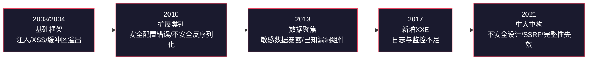
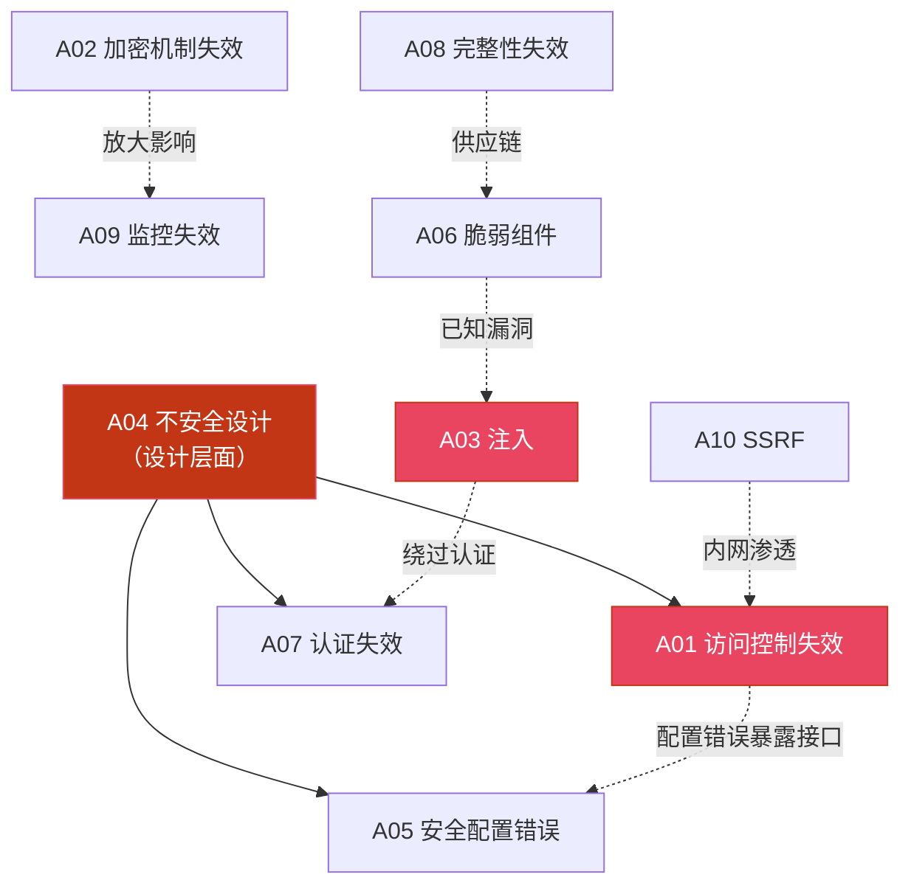

# 第14章 Web安全——OWASP Top 10

## 为什么Web安全至关重要

Web应用已成为现代互联网的核心基础设施。从电子商务、在线银行到社交媒体、企业管理平台，几乎所有互联网服务都依赖于Web技术。根据W3Techs的统计，全球排名前1000万的网站中，超过97%由Web应用驱动。这种无处不在的普及性，使Web应用成为网络攻击者的首选目标。

以下数据揭示了Web安全威胁的严峻性：

- **Verizon《2023数据泄露调查报告》**：Web应用攻击约占所有安全事件的26%，连续多年位居攻击向量榜首
- **IBM《2023年数据泄露成本报告》**：全球数据泄露平均成本达到445万美元，Web应用漏洞是主要入口之一
- **CVE/NVD数据库**：Web相关漏洞（SQL注入、XSS、CSRF等）长期占据已披露漏洞的显著比例
- **国家信息安全漏洞共享平台（CNVD）**：Web应用漏洞是报送数量最多的漏洞类型

OWASP Top 10正是在这样的背景下诞生的——它将全球海量安全数据浓缩为十大最关键风险，为开发者、安全从业者和企业管理者提供了一份清晰的安全优先级指南。

## OWASP与Top 10框架

### OWASP组织简介

OWASP（Open Web Application Security Project，开放式Web应用安全项目）成立于2001年，是一个开放的全球性社区，专注于Web应用安全的研究、工具开发和最佳实践推广。OWASP的所有成果均以开源形式发布，任何人都可以免费获取和使用。

除Top 10之外，OWASP还维护着众多重要项目：

| 项目 | 用途 | 适用角色 |
|------|------|----------|
| OWASP Testing Guide | Web应用安全测试的完整方法论 | 安全测试人员 |
| OWASP ASVS（应用安全验证标准） | 定义应用安全验证的三个等级 | 开发者、架构师 |
| OWASP SAMM（软件保障成熟度模型） | 评估和改进软件安全开发生命周期 | 安全管理者 |
| OWASP Cheat Sheet Series | 各类安全编码速查表 | 开发者 |
| OWASP Juice Shop | 现代Web应用靶场，包含100+安全挑战 | 学习者 |

### Top 10的演变历程

OWASP Top 10自2003年首次发布以来，经历了多次重大更新，每一次修订都映射了安全威胁格局的变迁：



**2021版的重大变化**（相较2017版）：

| 变化类型 | 具体内容 | 背景原因 |
|----------|----------|----------|
| 新增 | A04 不安全设计 | 从源头解决安全问题，而非仅修补实现缺陷 |
| 新增 | A08 软件和数据完整性失效 | SolarWinds供应链攻击敲响警钟 |
| 新增 | A10 SSRF | 云原生架构下SSRF利用急剧增长 |
| 合并 | XXE并入A03 注入 | XXE单独存在意义降低 |
| 跃升 | A01 从第五升至第一 | 访问控制缺陷在实际事件中占比最高 |
| 更名 | "敏感数据暴露"→"加密机制失效" | 强调根因（加密机制）而非表象（数据暴露） |

### 2021版数据来源

2021版Top 10的数据来源于全球超过500个组织提交的超过50万个实际应用的安全测试数据，结合了CVE/NVD漏洞数据库的统计分析。OWASP采用了一种基于数据驱动的方法论：

1. **数据征集**：向全球安全公司和研究机构征集匿名化的测试数据
2. **CVE分析**：从CVE/NVD数据库中提取与Web相关的漏洞数据
3. **映射与分类**：将原始数据映射到OWASP的风险分类体系
4. **专家评审**：由安全专家对结果进行评审和调整

这种方法确保了清单的客观性、代表性和时效性。

## OWASP Top 10 2021 速览

| 排名 | 编号 | 风险名称 | 核心问题 | 常见后果 |
|------|------|----------|----------|----------|
| 1 | A01 | 失效的访问控制（Broken Access Control） | 权限校验不足，用户越权访问 | 数据泄露、账户接管 |
| 2 | A02 | 加密机制失效（Cryptographic Failures） | 敏感数据未加密或加密不当 | 个人信息泄露、合规违规 |
| 3 | A03 | 注入（Injection） | 用户输入被当作代码执行 | 远程代码执行、数据窃取 |
| 4 | A04 | 不安全设计（Insecure Design） | 架构层面缺乏安全考量 | 业务逻辑被滥用 |
| 5 | A05 | 安全配置错误（Security Misconfiguration） | 默认配置、不必要的功能暴露 | 信息泄露、未授权访问 |
| 6 | A06 | 脆弱和过时的组件（Vulnerable and Outdated Components） | 使用已知漏洞的第三方组件 | 供应链攻击、远程利用 |
| 7 | A07 | 身份识别与认证失效（Identification and Authentication Failures） | 认证机制存在缺陷 | 账户接管、暴力破解 |
| 8 | A08 | 软件和数据完整性失效（Software and Data Integrity Failures） | CI/CD管道和更新机制缺乏验证 | 供应链攻击、恶意代码注入 |
| 9 | A09 | 安全日志与监控失效（Security Logging and Monitoring Failures） | 缺乏有效的日志记录和监控 | 攻击无法被及时发现 |
| 10 | A10 | 服务端请求伪造（SSRF） | 服务器被诱导发起内部请求 | 内网穿透、凭据窃取 |

### 十大风险之间的关联

OWASP Top 10的各项风险并非孤立存在，它们之间存在密切的协同关系。理解这些关联是建立系统化安全思维的关键：



**典型攻击链示例**：

1. **SSRF → 内网探测 → 访问控制失效 → 数据泄露**：攻击者通过SSRF访问云元数据服务获取IAM凭据，然后利用凭据访问S3存储桶中的敏感数据
2. **脆弱组件 → 注入 → 认证绕过 → 权限提升**：利用旧版框架的SQL注入漏洞绕过登录，再通过水平越权获取管理员权限
3. **不安全设计 → 业务逻辑滥用 → 完整性失效**：优惠券系统缺乏使用限制设计，被自动化脚本批量利用

## 本章学习目标

通过本章的学习，读者将能够：

1. **理解OWASP Top 10的完整框架**：掌握十大安全风险的定义、分类逻辑和演变历史，理解每项风险的本质特征和潜在影响。
2. **掌握各类漏洞的技术原理**：深入理解注入攻击、认证失效、敏感数据泄露等核心漏洞的底层机制，建立系统化的安全思维。
3. **具备实战检测与防御能力**：学会使用专业工具进行漏洞扫描和手动测试，能够编写安全的代码并实施有效的防御策略。
4. **建立持续安全意识**：识别安全开发中的常见误区，掌握持续学习和实践的方法，形成正确的Web安全观。

## 章节结构与内容导航

本章共分为七个部分，按照"理论→方法→实操→反思→练习→总结→进阶"的学习路径编排：

| 部分 | 文件 | 核心内容 | 学习重点 |
|------|------|----------|----------|
| 章节概览 | 00-章节概览（本文件） | 背景、框架、结构导航 | 建立全局认知 |
| 理论基础 | 理论基础/（13个子文件） | A01-A10逐一详解 + 风险关联分析 + 版本对比 | 理解每项风险的技术原理和攻击模型 |
| 核心技巧 | 核心技巧/（9个子文件） | 测试方法论、信息收集、注入/认证/访问控制/SSRF测试、工具链、防御编码、高级测试技术 | 掌握Web安全测试的完整工具链和方法 |
| 实战案例 | 实战案例/（10个子文件） | 电商平台SQL注入、社交平台XSS蠕虫、云SSRF攻击链、金融业务逻辑漏洞、SolarWinds供应链攻击、GraphQL信息泄露、OAuth重定向攻击、WebSocket劫持 | 通过真实案例理解漏洞利用的完整过程 |
| 常见误区 | 04-常见误区 | Web安全学习和实践中的典型错误认知 | 纠正错误思维，避免踩坑 |
| 练习方法 | 05-练习方法 | 系统化学习路径、靶场资源、技能树 | 找到适合自己的练习方法 |
| 本章小结 | 06-本章小结 | 核心知识点回顾 | 巩固所学，查漏补缺 |
| 深度拓展 | 07-深度拓展 | 现代Web架构安全、高级攻击技术、安全工程实践 | 高级读者的进阶之路 |

### 理论基础部分（13个子文件）

理论基础部分按以下顺序展开：

```text
14.1  OWASP与Top 10的由来（组织背景、版本演变、数据来源）
14.2  A01 失效的访问控制（越权、IDOR、目录遍历）
14.3  A02 加密机制失效（传输加密、存储加密、密钥管理）
14.4  A03 注入（SQL注入、命令注入、XSS、NoSQL注入、LDAP/XPath注入）
14.5  A04 不安全设计（威胁建模、业务逻辑缺陷、安全设计原则）
14.6  A05 安全配置错误（默认凭据、调试信息泄露、云存储配置）
14.7  A06 脆弱和过时的组件（供应链安全、依赖审计、SBOM）
14.8  A07 身份识别与认证失效（暴力破解、会话管理、MFA）
14.9  A08 软件和数据完整性失效（反序列化、CI/CD安全、更新验证）
14.10 A09 安全日志与监控失效（日志规范、SOC、应急响应）
14.11 A10 服务端请求伪造（SSRF原理、云元数据利用、绕过技巧）
14.12 十大风险之间的关系（攻击链、协同利用、系统化安全思维）
14.13 OWASP Top 10 2021 详细分析（综合对比、统计深度解读）
```

### 核心技巧部分（9个子文件）

```text
14.13 Web安全测试方法论（黑盒/白盒/灰盒、测试流程）
14.14 信息收集技术（子域名枚举、技术栈识别、端点发现）
14.15 注入漏洞测试技巧（SQL注入检测、XSS检测、命令注入检测）
14.16 认证与会话测试（暴力破解防护、会话管理、Cookie安全）
14.17 访问控制测试（IDOR测试、垂直越权测试、HTTP方法绕过）
14.18 SSRF测试技巧（基本Payload、绕过技巧、DNS重绑定）
14.19 核心安全工具链（Burp Suite、ZAP、SQLMap、Nuclei等）
14.20 防御编码核心技巧（参数化查询、输出编码、安全配置清单）
      高级Web安全测试技术（反序列化、模板注入、原型污染等）
```

## 学习建议与前置知识

### 前置知识

学习本章前，建议读者具备以下基础：

| 知识领域 | 最低要求 | 推荐水平 |
|----------|----------|----------|
| HTTP协议 | 了解请求/响应模型、状态码、Cookie | 理解HTTP头部、会话机制、CORS |
| Web开发 | 熟悉至少一种后端语言（Python/Java/PHP等） | 有完整的Web应用开发经验 |
| SQL基础 | 能编写基本的增删改查语句 | 理解JOIN、子查询、存储过程 |
| Linux基础 | 基本的命令行操作 | 熟悉网络命令（curl、netstat等） |
| 网络基础 | 了解TCP/IP、DNS基本概念 | 理解代理、VPN、防火墙的工作原理 |

如果上述基础有欠缺，建议先学习本书前面的相关章节，或参考OWASP官方文档补充知识。

### 学习路径建议

Web安全是一个实践性极强的领域。建议读者采用以下学习路径：

**第一阶段：建立认知（3-5小时）**
- 精读本概览文件，建立全局认知
- 通读理论基础部分，重点理解每项风险的本质和攻击原理
- 绘制属于自己的OWASP Top 10知识图谱

**第二阶段：掌握方法（5-8小时）**
- 学习核心技巧部分的测试方法论和工具使用
- 搭建本地测试环境（推荐Docker部署DVWA或OWASP Juice Shop）
- 跟随教程完成基础漏洞的检测和复现

**第三阶段：实战强化（5-10小时）**
- 研读实战案例部分，理解真实攻击链的完整过程
- 在靶场环境中独立完成安全挑战
- 尝试对开源项目进行安全审计

**第四阶段：持续精进（长期）**
- 关注OWASP社区动态和CVE数据库
- 参与CTF比赛和Bug Bounty项目
- 建立自己的安全测试检查清单和知识库

### 推荐靶场环境

| 靶场 | 特点 | 难度 | 部署方式 |
|------|------|------|----------|
| DVWA | 经典入门靶场，覆盖基础漏洞 | 入门 | Docker/PHP |
| OWASP Juice Shop | 现代Web应用，100+挑战 | 入门-中级 | Docker/Node.js |
| WebGoat | OWASP官方教学平台 | 入门-中级 | Docker/Java |
| Hack The Box | 在线渗透测试平台 | 中级-高级 | 在线平台 |
| PortSwigger Web Security Academy | Burp Suite官方教程+靶场 | 入门-高级 | 在线平台 |
| TryHackMe | 引导式学习+靶场 | 入门-中级 | 在线平台 |

> 本章预计学习时间：15-20小时（含实操练习）

---

> ⚠️ **安全警告与免责声明**
>
> 本章内容仅供**合法的安全测试与教育目的**使用。所有技术、工具和方法的讨论均旨在帮助安全从业者在**获得明确授权**的前提下进行防御性安全研究。
>
> - 🚫 **未经授权**对任何系统、网络或应用进行安全测试是**违法行为**（中国《网络安全法》第27条、《刑法》第285/286条）
> - ✅ 所有实践活动应在**隔离的实验环境**中进行（如虚拟机、Docker容器、CTF平台）
> - ✅ 遵守所在国家和地区的**网络安全法律法规**
> - ✅ 遵循**负责任的漏洞披露**原则
>
> 作者不对因滥用本章内容造成的任何后果承担责任。
