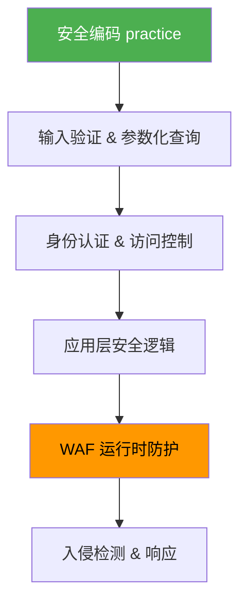
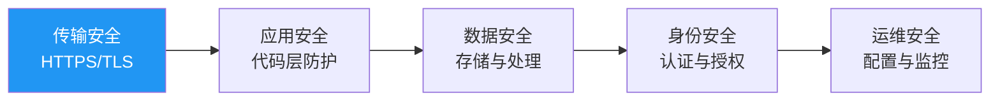
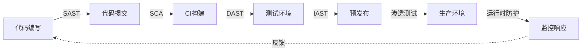
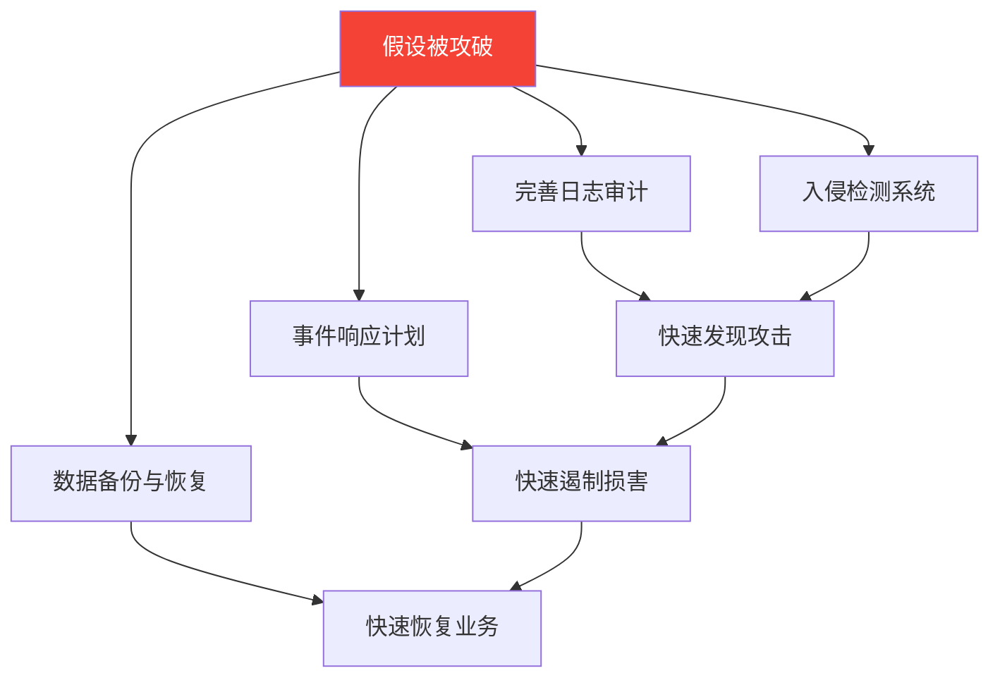

# 常见误区：Web安全认知纠正

Web安全领域充斥着大量似是而非的认知，这些误区不仅存在于非技术人员中，甚至在从业多年的开发者和管理者中也根深蒂固。每一个误区背后，都有真实的攻击事件作为反例。本节逐一拆解八个最常见的安全认知陷阱，帮助读者建立准确的安全观。

---

## 14.27 误区一：「我们有WAF，所以是安全的」

### 误区描述

许多组织认为部署了Web应用防火墙（WAF）就万事大吉，将WAF视为Web安全的"银弹"。这种心态在采购了商业WAF产品的企业中尤为普遍——安全团队完成部署后，管理层便认为安全问题已经解决。

### 为什么这是错误的

WAF是纵深防御体系中的一层，但它存在根本性的局限：

**绕过技术已经成熟到可以工具化**。OWASP有一个专门的项目叫做"自动化绕过WAF"（WAF Bypass），汇总了数十种通用绕过技术：

| 绕过技术 | 原理 | 示例 |
|---------|------|------|
| 编码变换 | WAF规则匹配明文，但后端解码后执行 | URL编码、双重编码、Unicode变体 |
| 分块传输 | Transfer-Encoding: chunked 将payload拆分 | 每个chunk单独不触发规则 |
| HTTP参数污染 | 同名参数在WAF和后端解析不一致 | `id=1&id=1' OR 1=1--` |
| 畸形HTTP请求 | 利用WAF与服务器解析差异 | 大小写变换、换行符注入 |
| 超大请求体 | 超过WAF检测上限则跳过检测 | 上传超大POST body包裹payload |
| JSON/XML嵌套 | 深层嵌套结构绕过浅层解析 | 多层JSON包裹SQL注入payload |

**误报与漏报的两难困境**。WAF的规则引擎面临根本性的精度问题：

- 规则过严 → 误报率飙升 → 正常业务请求被拦截 → 运维团队被迫关闭规则 → 安全形同虚设
- 规则过宽 → 漏报率升高 → 攻击请求被放过 → 安全保障不存在
- 实际生产环境中，大多数WAF运行在"检测模式"而非"阻断模式"，因为阻断带来的业务中断风险太高

**无法防御逻辑漏洞**。WAF基于特征匹配和规则引擎，本质上是一个"模式识别系统"。它无法理解业务逻辑，因此对以下攻击完全无能为力：

- 负数金额的商品下单（业务逻辑漏洞）
- 普通用户通过修改订单ID访问他人订单（越权访问）
- 利用优惠券叠加漏洞反复薅羊毛
- 通过合法API调用实现数据批量爬取

这些攻击的每一个HTTP请求都是"合法"的——没有SQL注入特征，没有XSS payload，WAF看到的只是一堆正常的参数和值。

**WAF本身也是攻击目标**。2019年Citrix ADC（常被用作WAF/负载均衡）被披露存在远程代码执行漏洞（CVE-2019-19781），影响全球超过80,000台设备。攻击者直接攻破WAF本身，整个"防线"瞬间瓦解。

### 正确认知

WAF是安全防御的重要补充层，但应该是安全策略的**最后一道防线**，而不是第一道。安全应该从设计和编码阶段开始，而非依赖运行时的防护设备。正确的纵深防御模型中，WAF的位置如下：



WAF应当被视为"检测与响应"层而非"预防"层。它最有价值的场景是：作为虚拟补丁在应用修复漏洞之前提供临时防护，以及作为安全监控的传感器收集攻击情报。

---

## 14.28 误区二：「我们是小公司，不会被攻击」

### 误区描述

很多中小企业认为自己规模小、数据少、知名度低，攻击者不会对自己感兴趣，因此忽视Web安全投入。

### 为什么这是错误的

**自动化攻击是无差别的**。Shodan的互联网扫描数据显示，全球每天有数十亿次自动化扫描在探测Web服务。这些扫描工具（如MASSCAN、ZMap）的工作方式是遍历整个IPv4地址空间，根本不在乎目标是世界500强还是个人博客。你的服务器只要暴露了端口，就会被扫描。

以下数据说明了"小目标"的真实处境：

| 指标 | 数据来源 | 数值 |
|-----|---------|------|
| 中小企业遭受网络攻击比例 | Verizon DBIR 2023 | 43%的数据泄露涉及中小企业 |
| 攻击后6个月内倒闭比例 | 美国国家网络安全联盟 | 60%的中小企业在遭受攻击后6个月内倒闭 |
| 平均数据泄露成本（中小企业） | IBM Security 2023 | 约16.5万美元 |
| 自动化扫描从上线到首次被探测的时间 | 多项蜜罐研究 | 平均不到1小时 |

**小公司是攻击供应链的跳板**。2013年Target百货数据泄露事件（4000万张信用卡信息被盗）的入侵起点是Target的一家小型HVAC（暖通空调）供应商。攻击者先攻破了这家只有几百人的小公司，然后利用其VPN凭证横向渗透进入Target的内网。这个案例清楚地说明：在供应链攻击模型中，小公司不是"不值得攻击"，而是"更容易攻击且同样有价值"。

**数据的价值不因公司规模而降低**。一个只有1万用户的在线商城，其用户数据在暗网市场的价格与大型电商平台的用户数据没有本质区别——邮箱+密码的组合在暗网上批量售卖，每条记录的价格在0.01到0.1美元之间。1万条记录就是100到1000美元，而攻击成本可能只是几美分的电费。

**合规责任不分大小**。中国《个人信息保护法》明确规定，处理个人信息的组织无论规模大小，都必须采取必要的安全保护措施。2023年，多家小型App因数据安全问题被网信办通报处罚，罚款金额从几万到几十万不等——对于中小企业来说，这可能是致命的。

### 正确认知

安全投入应与风险成正比，而非与公司规模成正比。中小企业可以采用低成本高效率的安全策略：

- 使用成熟的框架和平台（自带安全机制），而非从零开发
- 优先修复OWASP Top 10中的高危漏洞
- 利用免费的安全扫描工具（如OWASP ZAP、Nuclei）定期检查
- 采用云服务商提供的安全能力（如AWS WAF、Cloudflare免费版）
- 最基本的：及时更新依赖、使用HTTPS、不在代码中硬编码密钥

---

## 14.29 误区三：「HTTPS就是安全的」

### 误区描述

认为网站使用了HTTPS就代表安全，将传输层加密等同于全面安全。浏览器地址栏的"小锁头"图标成了用户和部分开发者心中的"安全认证标志"。

### 为什么这是错误的

HTTPS解决的是一个特定的问题：**网络传输过程中数据的机密性和完整性**。它通过TLS协议在客户端和服务器之间建立加密通道，防止中间人窃听和篡改。但安全远不止传输层这一个维度。

**HTTPS无法防护应用层漏洞**。以下攻击与HTTPS毫无关系：

| 攻击类型 | HTTPS能否防护 | 原因 |
|---------|-------------|------|
| SQL注入 | 否 | 攻击payload在HTTPS隧道中正常传输 |
| XSS（跨站脚本） | 否 | 恶意脚本通过加密通道到达浏览器后仍然执行 |
| CSRF（跨站请求伪造） | 否 | 浏览器自动携带Cookie发送请求，HTTPS不影响此行为 |
| 业务逻辑漏洞 | 否 | 所有请求都是"合法"的，只是逻辑被滥用 |
| 文件上传漏洞 | 否 | 恶意文件通过加密通道上传后仍然在服务器执行 |
| 权限提升 | 否 | 与传输层无关，是应用层的访问控制问题 |

**HTTPS配置不当反而制造虚假安全感**。以下是常见的HTTPS配置错误：

- **使用过时的TLS版本**：TLS 1.0/1.1已被RFC 8996正式废弃，但仍有许多服务器支持。这些版本存在BEAST、POODLE等已知攻击
- **弱密码套件**：支持RC4、DES、3DES等弱加密算法
- **证书验证不严格**：客户端不校验证书链、不检查证书吊销状态
- **混合内容**：HTTPS页面中加载HTTP资源，形成降级攻击面
- **HSTS未启用**：缺少HTTP Strict Transport Security头，首次连接可能被降级

**HTTPS不等于身份可信**。HTTPS证书只证明"你连接的服务器拥有这个域名的证书"，不证明"这个网站是安全的"或"这个网站不会欺骗你"。钓鱼网站同样可以获取免费的DV证书（如Let's Encrypt），在浏览器中显示与合法网站相同的"小锁头"。2023年APWG的报告显示，超过80%的钓鱼网站使用了HTTPS。

**HTTPS不保护终端**。如果用户的设备被恶意软件感染，HTTPS无法阻止键盘记录器捕获输入的密码；如果服务器被入侵，HTTPS无法阻止攻击者直接读取数据库中的数据。

### 正确认知

HTTPS是基础安全要求——2024年的今天，不使用HTTPS的网站就像不锁门的房间。但HTTPS只是安全拼图的一小块。完整的Web安全需要覆盖以下层面：



任何一个层面的缺失都意味着整体安全的失败——正如木桶的容量取决于最短的那块板。

---

## 14.30 误区四：「安全测试只需要在上线前做一次」

### 误区描述

将安全测试视为一次性的检查清单，在应用上线前进行一次渗透测试或安全扫描就认为"安全已覆盖"。

### 为什么这是错误的

**威胁环境持续演变**。CVE数据库每年新增超过20,000个漏洞，今天安全的代码可能因为其依赖的第三方库被披露漏洞而变得不安全。Log4Shell（CVE-2021-44228）就是一个极端例子——全球无数应用因为使用了Log4j这个被广泛信任的日志库而突然暴露在远程代码执行风险下，而这些应用在上线时都是"安全"的。

**代码持续变化**。GitLab的DevSecOps报告指出，中型项目平均每周合并30-50个PR。每次合并都可能引入新的安全问题：

- 新增的API端点未做权限校验
- 修改的正则表达式被绕过
- 新引入的依赖携带已知漏洞
- 配置文件中的默认值被恢复
- 调试代码被意外提交到生产分支

**一次渗透测试的"保鲜期"极短**。Gartner的研究表明，在快速迭代的开发环境中，一次渗透测试的有效期平均只有30天。之后代码库的变化可能已经使测试结果失效。

### 正确认知

安全是一个持续的过程，应融入DevOps流程形成DevSecOps。以下是持续安全检测的完整框架：



各阶段的安全检测手段：

| 阶段 | 工具类型 | 代表工具 | 检测能力 |
|-----|---------|---------|---------|
| 代码编写 | IDE安全插件 | Semgrep、SonarLint | 实时提示不安全代码模式 |
| 代码提交 | SAST（静态分析） | SonarQube、CodeQL、Bandit | 源码级漏洞检测 |
| CI构建 | SCA（成分分析） | Snyk、Dependabot、Trivy | 第三方依赖已知漏洞 |
| 测试环境 | DAST（动态分析） | OWASP ZAP、Burp Suite | 运行时漏洞检测 |
| 预发布 | IAST（交互式分析） | Contrast Security | 结合代码和运行时的精准检测 |
| 生产环境 | RASP（运行时防护） | OpenRASP | 实时阻断攻击 |
| 持续 | 模糊测试 | AFL、LibFuzzer | 发现未知崩溃和异常 |

**自动化是持续安全的前提**。人工渗透测试仍然必要，但不能作为唯一的检测手段。CI/CD管道中嵌入自动化安全门禁（Security Gate），在代码合并前自动执行SAST和SCA扫描，发现高危漏洞时自动阻断部署流程——这才是"持续安全"的核心实践。

---

## 14.31 误区五：「开源代码比商业代码更安全（或更不安全）」

### 误区描述

有人认为开源代码因为可以被所有人审查所以更安全（"足够多的眼球"理论），也有人认为开源代码因为源码公开所以更容易被攻击。两种观点都过于简化。

### 为什么两种观点都不完全正确

**"足够多的眼球"理论的局限**。Eric Raymond在《大教堂与集市》中提出的"只要有足够多的眼球，所有bug都是浅层的"这一论断，被广泛引用但很少被深入审视。事实是：

- "足够多的眼球"假设有人真的在看。Linux内核有数千名贡献者，但很多小众的npm/pip包可能只有1个维护者，甚至无人维护
- 安全审计需要专业能力。能读懂代码的人不一定能看出安全漏洞
- Heartbleed（CVE-2014-0160）在OpenSSL中存在了两年才被发现，而OpenSSL是全球使用最广泛的加密库之一

**开源的安全优势确实存在**，但有条件：

| 优势 | 条件 | 无条件时的风险 |
|-----|------|-------------|
| 源码可审计 | 有人真的在审计 | 大量项目无人审计 |
| 漏洞修复快 | 维护者响应及时 | 无人维护的项目漏洞永远不会修复 |
| 社区审查 | 社区活跃且安全意识强 | 社区可能只关注功能，忽略安全 |
| 透明度高 | 安全问题被公开披露 | 攻击者也看到了漏洞公告 |

**开源供应链攻击日益严重**。Sonatype的2023年软件供应链报告记录了超过245,000个恶意开源包，同比增长了数倍。典型的供应链攻击手法包括：

- **Typosquatting（域名抢注）**：发布名称与流行包极其相似的恶意包（如`python-dateutil` vs `dateutil-python`）
- **依赖混淆（Dependency Confusion）**：利用包管理器优先从公共仓库拉取的特性，发布与内部包同名的恶意包
- **维护者账号劫持**：通过社会工程或凭证泄露接管流行包的发布权限
- **恶意提交**：在代码贡献中植入后门（如2021年PHP的Git服务器被入侵事件）

**闭源代码也有其安全优势**：

- 攻击者无法直接阅读源码，增加了攻击成本
- 商业公司有明确的安全责任和SLA
- 可以进行专业的第三方安全审计
- 漏洞修复流程通常有明确的时间承诺

### 正确认知

安全与否取决于**代码质量、维护活跃度、社区健康度、安全审计投入**，而非单纯的开源或闭源。评估一个组件的安全性，应该看：

1. 过去12个月的安全漏洞披露数量和修复速度
2. 维护团队的响应时间和活跃度
3. 是否有定期的安全审计
4. CVE数据库中的历史记录
5. 社区规模和贡献者多样性

使用任何代码（开源或闭源）之前，都应该进行安全评估，而不是基于"开源=安全"或"闭源=安全"的假设做决策。

---

## 14.32 误区六：「OWASP Top 10就是Web安全的全部」

### 误区描述

将OWASP Top 10视为Web安全的完整指南，认为覆盖了这十项风险就万事大吉。一些组织甚至将"通过OWASP Top 10检查"等同于"安全达标"。

### 为什么这是错误的

**OWASP Top 10是一个风险排名，不是安全清单**。它的数据来源是真实世界的数据泄露和漏洞统计数据，反映的是"最常被利用的风险"，而非"所有可能的风险"。这就像说"交通事故最常见的原因是超速"——正确，但不意味着只要不超速就不会出事故。

**OWASP Top 10未覆盖或覆盖不足的重要安全领域**：

| 安全领域 | OWASP Top 10覆盖程度 | 说明 |
|---------|-------------------|------|
| 业务逻辑漏洞 | 低 | 每个应用的业务逻辑不同，难以统一分类 |
| API安全 | 中 | 2021版新增了部分内容，但API安全的复杂性远超Top 10 |
| 移动安全 | 无 | 有专门的OWASP Mobile Top 10 |
| 云安全 | 无 | 有专门的OWASP Cloud Top 10 |
| 容器安全 | 无 | 容器逃逸、镜像安全等不在范围内 |
| 供应链安全 | 低 | 2021版A08涉及，但覆盖不充分 |
| 社会工程学 | 无 | 钓鱼、社工攻击不在Web安全Top 10范围内 |
| 隐私保护 | 无 | 数据隐私、GDPR合规等是独立领域 |
| DoS/DDoS | 无 | 可用性安全不在Top 10范围内 |
| 竞态条件 | 低 | TOCTOU等并发安全问题 |

**Top 10缺少具体实施指导**。它告诉你"注入是风险"，但不告诉你"如何在Spring Boot中正确使用PreparedStatement"或"Django ORM的哪些操作可能产生注入"。这就像一张疾病列表告诉你"发烧是症状"，但不开药方。

### 正确认知

OWASP Top 10是重要的**入门参考和沟通工具**——它帮助非安全人员理解Web安全的主要风险，帮助安全团队向管理层解释安全投入的优先级。但它应作为安全建设的起点而非终点。完整的Web安全知识体系应包含：

- **OWASP ASVS（Application Security Verification Standard）**：详细的安全验证标准，分三个级别，提供可执行的检查清单
- **OWASP Testing Guide**：完整的安全测试方法论，覆盖每个测试用例的具体步骤
- **OWASP Cheat Sheet Series**：针对每个安全主题的开发者速查手册
- **CWE/SANS Top 25**：更底层的软件弱点分类，覆盖代码级安全问题
- **NIST SP 800-53**：全面的安全控制框架

---

## 14.33 误区七：「安全是安全团队的事，与开发无关」

### 误区描述

认为安全是专门的安全团队或安全部门的责任，开发人员只需要实现功能需求，安全问题"交给安全团队处理"。

### 为什么这种认知根深蒂固且危害极大

**"左移"原则的经济学**。IBM System Sciences Institute的研究数据被广泛引用，因为它揭示了一个触目惊心的事实：

| 发现阶段 | 相对修复成本 |
|---------|-----------|
| 需求/设计阶段 | 1x（基准） |
| 开发/编码阶段 | 6.5x |
| 测试阶段 | 15x |
| 生产环境 | 100x |

这意味着：如果在设计阶段发现一个SQL注入风险（例如决定使用ORM而非原生SQL），成本几乎为零；如果在生产环境中被攻击者利用后才发现，修复成本包括紧急补丁、事件响应、数据泄露通知、法律诉讼、品牌损失——可能高达数百万美元。

**规模不匹配是结构性问题**。典型的企业中，安全团队与开发团队的人数比大约是1:50甚至1:100。即使安全团队24小时不休息，也无法审查所有代码、覆盖所有功能。这就像一个城市的消防员数量——消防员负责灭火和救援，但防火的责任在于每个建筑的使用者和管理者。

**安全漏洞最终存在于代码中**。XSS漏洞存在于前端的HTML渲染逻辑中，SQL注入存在于后端的数据库查询中，越权访问存在于API的权限校验中——这些代码是开发者写的，只有开发者最有能力和条件在编写时就避免引入漏洞。指望安全团队在事后从数十万行代码中找出漏洞，既不现实也不经济。

**安全债务与技术债务同源**。很多开发者熟悉"技术债务"的概念——为了赶进度而采取的捷径，后期需要偿还。安全债务是技术债务中最危险的一种：它不会在日常开发中产生可感知的摩擦（不像糟糕的代码架构那样影响开发速度），但一旦被利用，后果是灾难性的。

### 正确认知

安全是每个人的责任，但需要组织机制来支撑。以下是经过验证的实践：

**安全冠军（Security Champion）机制**。在每个开发团队中培养1-2名对安全感兴趣的开发者，他们不需要成为安全专家，但需要：

- 参加额外的安全培训（每月4-8小时）
- 在团队代码审查中关注安全问题
- 作为安全团队与开发团队的沟通桥梁
- 参与安全事件的复盘和改进

**安全编码规范必须具体可执行**。不要写"所有输入必须验证"这种空话，而要写：

```python
# 安全编码规范示例

# ✅ 正确：使用参数化查询
cursor.execute("SELECT * FROM users WHERE id = %s", (user_id,))

# ❌ 错误：字符串拼接
cursor.execute(f"SELECT * FROM users WHERE id = {user_id}")

# ✅ 正确：使用ORM的自动转义
User.objects.filter(id=user_id)

# ❌ 错误：使用ORM的extra/raw查询
User.objects.raw(f"SELECT * FROM users WHERE id = {user_id}")
```

**开发者安全培训应聚焦实战**。与其让开发者看40小时的理论视频，不如：

- 提供安全编码的Dojo练习（OWASP WebGoat、Juice Shop）
- 在PR审查中发现安全问题时进行即时教学
- 定期进行内部CTF竞赛
- 分享本公司的安全事件案例（脱敏后）

---

## 14.34 误区八：「密码哈希了就是安全的」

### 误区描述

认为只要对密码进行了哈希处理，数据库泄露后密码就是安全的。这种误区在初级开发者中非常普遍，甚至一些有经验的开发者也不清楚哈希算法之间的本质区别。

### 为什么这是错误的

哈希的安全性取决于三个关键因素：**算法选择、盐值（Salt）、拉伸（Stretching）**。缺少任何一个，哈希都形同虚设。

**弱哈希算法的根本问题**。MD5和SHA-1是为"快速计算"而设计的——这在文件校验场景下是优点，但在密码存储场景下是致命缺陷。一个现代GPU（如NVIDIA RTX 4090）的哈希计算速度：

| 算法 | RTX 4090 计算速度 | 8位纯数字密码破解时间 |
|-----|-----------------|-------------------|
| MD5 | ~1640亿次/秒 | < 1秒 |
| SHA-1 | ~540亿次/秒 | < 1秒 |
| SHA-256 | ~220亿次/秒 | < 1秒 |
| bcrypt (cost=12) | ~18万次/秒 | ~55天 |
| Argon2id (推荐参数) | ~3千次/秒 | ~9年 |

对比可以清楚地看到：MD5/SHA类算法与bcrypt/Argon2之间存在**百万倍**的速度差异。对于密码存储来说，"慢"是特性而非缺陷。

**没有盐值的哈希等于明文**。攻击者预先计算常用密码的哈希值，存入彩虹表（Rainbow Table）。互联网上已经存在覆盖数百亿条记录的彩虹表，包括：

- 所有8位及以下的数字和字母组合
- 常用密码字典（RockYou、SecLists等）的所有变体
- 常见的密码模式（单词+数字+符号的组合）

不加盐的哈希在彩虹表面前毫无抵抗力——一次查表操作就能破解大量密码。

**盐值必须随机且唯一**。以下都是错误的盐值用法：

```python
# ❌ 错误：使用固定盐值
salt = "mysalt123"
hash = sha256(salt + password)

# ❌ 错误：使用用户名作为盐值
salt = username
hash = sha256(salt + password)

# ❌ 错误：全局共享一个盐值
salt = get_global_salt()
hash = sha256(salt + password)

# ✅ 正确：每个密码使用独立的随机盐值（bcrypt自动处理）
import bcrypt
hash = bcrypt.hashpw(password.encode(), bcrypt.gensalt(rounds=12))
```

### 正确做法

2024年的密码存储应遵循以下标准：

```python
# 推荐方案一：bcrypt（成熟可靠，广泛支持）
import bcrypt
# 哈希
hashed = bcrypt.hashpw(password.encode('utf-8'), bcrypt.gensalt(rounds=12))
# 验证
is_valid = bcrypt.checkpw(password.encode('utf-8'), hashed)

# 推荐方案二：Argon2id（OWASP推荐，抗GPU/ASIC攻击）
from argon2 import PasswordHasher
ph = PasswordHasher(
    time_cost=3,        # 迭代次数
    memory_cost=65536,  # 内存消耗 64MB
    parallelism=4,      # 并行度
    hash_len=32,        # 输出长度
    type=argon2.Type.ID # 使用Argon2id变体
)
# 哈希
hashed = ph.hash(password)
# 验证
try:
    ph.verify(hashed, password)
    # 检查是否需要重新哈希（参数升级时）
    if ph.check_needs_rehash(hashed):
        hashed = ph.hash(password)  # 使用新参数重新哈希
except Exception:
    is_valid = False
```

**参数选择指南**：

| 算法 | 参数 | 安全等级 | 适用场景 |
|-----|------|---------|---------|
| bcrypt | rounds=10 | 基础 | 低风险应用、资源受限环境 |
| bcrypt | rounds=12 | 推荐 | 大多数Web应用 |
| bcrypt | rounds=14 | 高 | 高安全需求 |
| Argon2id | m=65536, t=3, p=4 | 推荐 | 新项目首选 |
| Argon2id | m=262144, t=4, p=8 | 高 | 高安全需求 |

**迁移策略**：如果你的系统正在使用MD5/SHA存储密码，不可能一次性将所有用户的密码哈希迁移到新算法。推荐的渐进迁移策略是"hash-then-hash"：

```python
# 迁移策略：在旧哈希上再套一层新哈希
def migrate_password(old_hash, new_password):
    """用户下次登录时自动迁移"""
    # 先验证旧密码
    if verify_old_hash(old_password, old_hash):
        # 用新算法哈希原始密码
        new_hash = bcrypt.hashpw(new_password.encode(), bcrypt.gensalt())
        return new_hash
```

---

## 14.35 误区补充：其他常见认知陷阱

除了上述八个核心误区外，以下认知偏差在实践中也频繁出现，值得警惕。

### 「我们用了框架，框架会处理安全」

**事实**：框架提供了安全机制，但不能自动保证安全。Django的ORM默认使用参数化查询，但如果开发者使用`extra()`或`raw()`方法执行原生SQL，仍然会产生注入漏洞。React默认对JSX进行转义防止XSS，但如果开发者使用`dangerouslySetInnerHTML`，防护就失效了。框架是工具，使用工具的人决定了最终的安全性。

### 「我们做了代码审计，没有安全问题」

**事实**：代码审计的覆盖率和深度受限于审计者的技能、时间和方法。一次代码审计只能证明"在审计范围内未发现问题"，不能证明"没有问题"。此外，很多安全问题不在代码层面——架构设计缺陷、配置错误、运维流程漏洞等，都不是代码审计能覆盖的。

### 「安全和用户体验是矛盾的」

**事实**：这是偷懒的借口。好的安全设计应该是对用户透明的。HTTPS不会影响用户操作，CSRF Token在后台自动传递，密码强度检查在用户输入时实时反馈。真正影响体验的安全措施（如强制密码复杂度、频繁要求重新认证）往往可以通过更好的设计来优化（如Passkey、WebAuthn、风险自适应认证）。

### 「我们有安全合规认证，所以是安全的」

**事实**：合规是最低标准，不是安全的证明。PCI DSS认证的公司仍然遭受数据泄露的案例屡见不鲜——2013年Target数据泄露时是PCI DSS合规的，2017年Equifax数据泄露时也是。合规审计是基于检查清单的，而攻击者不按检查清单行动。

### 「开源库star数多就是安全的」

**事实**：npm包`event-stream`在被植入恶意代码时有数百万周下载量和数千star。流行程度不等于安全性，甚至可能意味着更大的攻击面——越流行的包，被攻击者盯上的概率越高。

---

## 14.36 总结：建立正确的安全观

这些误区的共同特点是将复杂的安全问题过度简化——用一个简单的结论替代深入的思考。Web安全没有银弹，没有一劳永逸的解决方案。

正确的安全观建立在五个核心原则之上：

**1. 纵深防御（Defense in Depth）**

不依赖单一安全措施。每一层防护都可能被突破，但突破多层防护的成本远高于突破单层。就像中世纪城堡的防御：护城河、城墙、箭塔、吊桥、内城墙——每一层都不完美，但组合在一起就形成了强大的防御。

**2. 持续安全（Continuous Security）**

安全是持续的过程，而非一次性的项目。今天安全的系统明天可能因为新的漏洞披露、代码变更、环境变化而变得不安全。安全检测应融入CI/CD管道，成为开发流程的自然组成部分。

**3. 全员参与（Shared Responsibility）**

安全是整个组织的责任。安全团队是"安全架构师"和"安全顾问"，但"安全施工"的责任在于每一个写代码、配服务器、处理数据的人。安全冠军机制、安全编码规范、安全培训是将安全责任落地的关键手段。

**4. 风险驱动（Risk-Based Approach）**

基于风险评估决定安全投入的优先级。不是所有漏洞都同样严重，不是所有系统都同样重要。将有限的安全资源投入到风险最高的地方——处理敏感数据的系统、面向互联网的服务、权限管理的核心模块。

**5. 假设被攻破（Assume Breach）**

假设任何防御都可能失效，做好检测和响应准备。这不是悲观主义，而是成熟的工程思维。正如软件设计中的"错误处理"——你不会假设网络永远不中断，而是设计重试和降级机制。安全也一样：设计时就假设攻击者会突破防线，因此需要完善的日志审计、入侵检测、事件响应计划和数据备份策略。



记住安全领域的一句格言："**安全不是一个产品，而是一个过程。**"（Bruce Schneier）理解并接受这一点，是走出所有安全误区的第一步。
