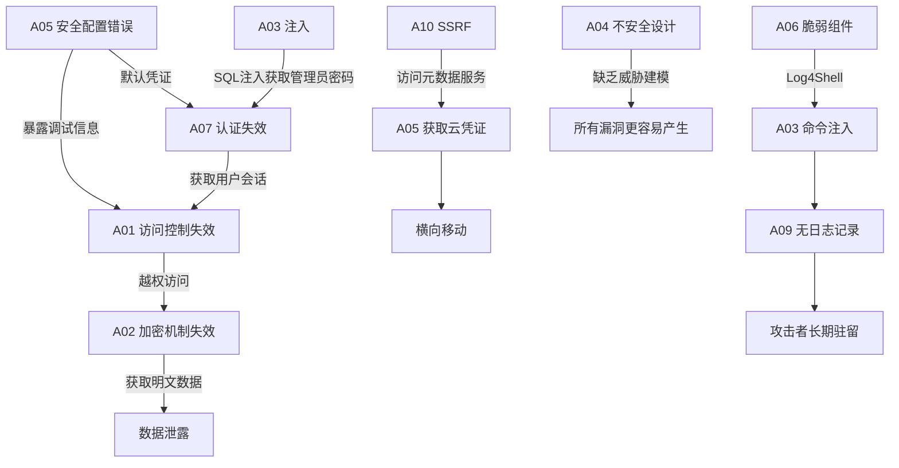

# 本章小结

本章围绕 OWASP Top 10 2021 版展开了系统化的讲解，从理论原理到实战检测、从攻击手法到防御策略、从单一漏洞到安全体系，构建了一个完整的 Web 安全知识框架。本小结将从知识回顾、能力检验、实战速查三个维度进行总结，帮助读者巩固所学并建立可落地的安全实践路径。

---

## 一、OWASP Top 10 2021 全景回顾

### 1.1 十大风险速记表

| 排名 | 编号 | 风险名称 | 核心问题 | 一句话攻击模型 | 关键防御措施 |
|------|------|----------|----------|---------------|-------------|
| 1 | A01 | 失效的访问控制 | 权限校验不足 | 攻击者访问不属于自己的资源 | 服务端强制授权、默认拒绝、最小权限 |
| 2 | A02 | 加密机制失效 | 敏感数据保护不当 | 窃取传输中或存储的敏感数据 | TLS 1.3、Argon2/bcrypt、密钥管理 |
| 3 | A03 | 注入 | 不可信输入被执行 | 恶意输入被解释为代码 | 参数化查询、输出编码、最小权限 |
| 4 | A04 | 不安全设计 | 架构层安全缺失 | 利用设计缺陷而非实现缺陷 | 威胁建模、安全需求、安全设计模式 |
| 5 | A05 | 安全配置错误 | 默认或不当配置 | 利用默认凭证或暴露的服务 | 安全基线、自动化配置检查、最小化部署 |
| 6 | A06 | 脆弱和过时的组件 | 使用有漏洞的依赖 | 利用已知漏洞的第三方组件 | SCA 工具、SBOM、依赖更新策略 |
| 7 | A07 | 身份识别与认证失效 | 认证机制缺陷 | 暴力破解、凭证填充、会话劫持 | MFA、安全会话管理、限速策略 |
| 8 | A08 | 软件和数据完整性失效 | CI/CD 和更新缺乏验证 | 篡改构建产物或更新包 | 代码签名、完整性校验、依赖锁定 |
| 9 | A09 | 安全日志与监控失效 | 攻击行为无法被发现 | 攻击者在系统中长期驻留 | 全面日志、实时告警、SIEM 集成 |
| 10 | A10 | SSRF | 服务器被诱导访问内部资源 | 利用服务器发起内部网络请求 | URL 白名单、网络隔离、IMDSv2 |

### 1.2 十大风险之间的关联

OWASP Top 10 并非孤立的十个问题，它们之间存在深层关联，一次真实的攻击往往涉及多个风险项的组合利用：



典型攻击链示例：

1. **A06 → A03 → A01 → A02**：攻击者发现目标使用了存在漏洞的 Log4j 版本（A06），通过 JNDI 注入获取命令执行权限（A03），利用应用未做权限校验直接访问管理接口（A01），最终导出未加密的用户数据库（A02）。
2. **A05 → A10 → A01 → A09**：云服务器元数据服务未做网络隔离（A05），攻击者通过 SSRF 获取 IAM 临时凭证（A10），用凭证访问 S3 存储桶（A01），而系统没有记录异常访问行为（A09）。

### 1.3 2021 版相比 2017 版的重大变化

理解版本演进有助于把握行业安全趋势：

| 变化 | 说明 | 反映的趋势 |
|------|------|-----------|
| A04「不安全设计」新增 | 强调架构层面的安全缺陷 | 安全左移到设计阶段 |
| A08「软件和数据完整性失效」新增 | 供应链和 CI/CD 安全 | 供应链攻击事件激增（SolarWinds） |
| A10「SSRF」独立成项 | 从「A05 配置错误」中独立 | 云原生架构下 SSRF 风险急剧上升 |
| 「XXE」合并入「注入」 | XML 外部实体不再单独列出 | XML 使用减少，JSON 成为主流 |
| 「反序列化」合并入「完整性失效」 | 不再单独列出 | 纳入更广泛的完整性框架 |

---

## 二、核心知识体系回顾

### 2.1 注入攻击体系（A03）

注入攻击的本质是**不可信数据被当作代码解释执行**。本章覆盖的注入类型：

| 注入类型 | 攻击面 | 典型 Payload | 防御关键 |
|---------|--------|-------------|---------|
| SQL 注入 | 数据库查询 | `' OR 1=1--` | 参数化查询（PreparedStatement） |
| XSS | 浏览器渲染 | `<script>alert(1)</script>` | 输出编码 + CSP |
| 命令注入 | 操作系统 | `; cat /etc/passwd` | 避免调用 shell，使用参数化 API |
| SSTI | 模板引擎 | `{{7*7}}` / `${7*7}` | 模板沙箱、禁止用户输入进入模板 |
| NoSQL 注入 | 文档数据库 | `{"$gt":""}` | 输入验证、禁用操作符解析 |
| LDAP 注入 | 目录服务 | `*)(uid=*))(|(uid=*` | 参数化 LDAP 查询 |
| XPath 注入 | XML 查询 | `' or '1'='1` | 参数化 XPath |

SQL 注入防御的核心逻辑——为什么参数化查询优于输入过滤：

```python
# ❌ 错误：黑名单过滤（可绕过）
query = f"SELECT * FROM users WHERE id = {user_input.replace(';', '').replace('--', '')}"
# 攻击者使用 %00、注释嵌套、编码变换即可绕过

# ❌ 错误：转义（容易遗漏边界情况）
query = f"SELECT * FROM users WHERE name = '{user_input.replace(chr(39), chr(39)+chr(39))}'"

# ✅ 正确：参数化查询（数据库引擎层面分离代码和数据）
cursor.execute("SELECT * FROM users WHERE id = %s", (user_input,))
# 即使 user_input = "1; DROP TABLE users"，也只会被当作字符串值而非SQL语句
```

参数化查询有效的根本原因：数据库引擎在**编译阶段**就确定了 SQL 语句的结构，参数值在**执行阶段**才填入，两者在解析层面完全隔离。这与输入过滤试图在语法层面识别恶意内容有本质区别——过滤是一场注定失败的博弈，因为你无法穷举所有绕过方式。

### 2.2 访问控制体系（A01）

访问控制失效连续多年位居榜首，其核心子类型包括：

**IDOR（不安全的直接对象引用）**是最常见的访问控制漏洞：

```text
# 水平越权：用户A访问用户B的订单
GET /api/orders/1001  # 用户A的订单（正常）
GET /api/orders/1002  # 用户B的订单（越权，如果服务端未校验归属）

# 垂直越权：普通用户访问管理功能
GET /admin/users      # 管理员功能（如果仅前端隐藏入口，服务端未校验角色）
```

**防御模式**——在每个数据访问点实施授权校验：

```python
# ✅ 正确的访问控制实现
def get_order(order_id, current_user):
    order = db.get_order(order_id)
    if order is None:
        return NotFound()
    if order.user_id != current_user.id and not current_user.is_admin:
        return Forbidden()  # 既检查所有权，又检查管理员角色
    return order
```

### 2.3 加密与认证体系（A02、A07）

**密码哈希算法选择对比**：

| 算法 | 类型 | 抗 GPU | 可调参数 | 推荐度 |
|------|------|--------|---------|--------|
| MD5 | 快速哈希 | 极弱（100亿次/秒） | 无 | ❌ 禁止使用 |
| SHA-1 | 快速哈希 | 极弱 | 无 | ❌ 禁止使用 |
| SHA-256 | 快速哈希 | 弱 | 无 | ❌ 不适合密码 |
| bcrypt | 自适应哈希 | 较强 | cost factor | ✅ 可用 |
| scrypt | 内存硬哈希 | 强 | N, r, p | ✅ 可用 |
| Argon2id | 内存硬哈希 | 最强 | time, memory, parallelism | ✅ 推荐首选 |

Argon2id 获得 2015 年密码哈希竞赛冠军，是目前学术界和工业界公认的最优密码哈希算法。其核心优势在于**内存硬特性**——验证一个密码需要大量内存访问，这使得 GPU 和 ASIC 并行攻击的成本急剧上升。

**会话管理安全要点**：

```http
# 安全的 Cookie 配置
Set-Cookie: session=abc123; HttpOnly; Secure; SameSite=Lax; Path=/; Max-Age=3600
```

- `HttpOnly`：禁止 JavaScript 访问，防御 XSS 窃取 Cookie
- `Secure`：仅通过 HTTPS 传输，防止网络嗅探
- `SameSite=Lax`：限制跨站请求携带 Cookie，防御 CSRF
- `Max-Age`：设置合理过期时间，减少会话劫持窗口

### 2.4 SSRF 与云安全（A10）

SSRF 在云原生环境下危害被急剧放大，因为云实例的元数据服务通常通过链路本地地址（169.254.169.254）提供：

```bash
# 典型 SSRF 攻击：获取 AWS 临时凭证
GET http://169.254.169.254/latest/meta-data/iam/security-credentials/ec2-role HTTP/1.1

# 返回的临时凭证可被用于：
# - 访问 S3 存储桶
# - 操作 EC2 实例
# - 读取 Secrets Manager 中的密钥
```

**多层防御策略**：

| 防御层 | 措施 | 说明 |
|--------|------|------|
| 网络层 | 禁止应用服务器访问元数据服务 | iptables / 安全组规则 |
| 应用层 | URL 白名单校验 | 只允许访问预定义的外部 URL |
| DNS 层 | 防 DNS 重绑定攻击 | 解析后校验 IP 是否在黑名单 |
| 云平台层 | 使用 IMDSv2 | 要求 PUT 请求获取 token，防止 SSRF |

---

## 三、安全能力自检清单

完成本章学习后，读者应能通过以下自检清单验证自己的掌握程度。每个能力项标注了难度等级（⭐入门 ⭐⭐进阶 ⭐⭐⭐高阶）。

### 3.1 漏洞识别能力

| 能力项 | 检验标准 | 难度 |
|--------|---------|------|
| SQL 注入识别 | 能判断参数是否直接拼入 SQL，能区分数字型/字符型/盲注 | ⭐ |
| XSS 识别 | 能区分反射型/存储型/DOM 型，能判断输出上下文（HTML/JS/URL） | ⭐ |
| IDOR 发现 | 能识别 API 中的直接对象引用，能测试水平/垂直越权 | ⭐⭐ |
| SSRF 检测 | 能识别可控 URL 参数，能利用 DNS 重绑定绕过校验 | ⭐⭐ |
| 认证缺陷分析 | 能评估密码策略、会话管理、MFA 实现的安全性 | ⭐⭐ |
| 业务逻辑漏洞 | 能发现负数金额、竞态条件、流程绕过等逻辑缺陷 | ⭐⭐⭐ |
| 供应链风险评估 | 能使用 SCA 工具扫描依赖，能分析 CVE 影响范围 | ⭐⭐ |
| SSTI 识别与利用 | 能判断模板引擎类型，能构造 RCE payload | ⭐⭐⭐ |

### 3.2 安全防御能力

| 能力项 | 检验标准 | 难度 |
|--------|---------|------|
| 参数化查询 | 能在主流语言/框架中正确使用参数化查询 | ⭐ |
| 输出编码 | 能根据输出上下文选择正确的编码方式（HTML/JS/URL/CSS） | ⭐⭐ |
| 安全响应头配置 | 能配置完整的 HTTP 安全头部（HSTS/CSP/X-Frame-Options 等） | ⭐⭐ |
| CSP 编写 | 能编写有效的 Content Security Policy，理解 nonce 和 hash 机制 | ⭐⭐ |
| 认证架构设计 | 能设计安全的认证流程，包括密码策略、MFA、会话管理 | ⭐⭐⭐ |
| 威胁建模 | 能对 Web 应用进行 STRIDE 威胁建模 | ⭐⭐⭐ |

### 3.3 工具使用能力

| 工具 | 能检验标准 | 难度 |
|------|-----------|------|
| Burp Suite | 能拦截/修改请求、使用 Intruder 进行模糊测试、使用 Repeater 手动测试 | ⭐ |
| SQLMap | 能配置参数进行注入检测，理解 tamper 脚本的使用 | ⭐⭐ |
| Nuclei | 能编写和使用模板进行自动化扫描 | ⭐⭐ |
| Semgrep/CodeQL | 能编写自定义规则进行代码安全审计 | ⭐⭐⭐ |
| Nmap | 能进行服务版本检测和脚本扫描 | ⭐ |

---

## 四、常见误区速查

本章「常见误区」部分总结了八个典型错误认知。以下是核心纠正要点：

| 误区 | 核心纠正 |
|------|---------|
| 「有 WAF 就安全了」 | WAF 是最后一道防线，不是第一道；无法防御逻辑漏洞 |
| 「小公司不会被攻击」 | 自动化攻击不区分目标规模，小公司往往是首选跳板 |
| 「HTTPS 就是安全的」 | HTTPS 仅保护传输层，应用层漏洞（SQLi/XSS/CSRF）与之无关 |
| 「上线前测一次就够了」 | 安全是持续过程，每次代码变更都可能引入新漏洞 |
| 「开源一定更安全（或更不安全）」 | 安全取决于代码质量和维护活跃度，不是开源/闭源 |
| 「Top 10 就是全部」 | Top 10 是风险排名而非完整清单，需配合 ASVS/Testing Guide |
| 「安全是安全团队的事」 | 漏洞存在于代码中，开发者是第一责任人 |
| 「密码哈希了就安全」 | MD5/SHA1 可被 GPU 每秒暴力破解数十亿次，必须用 Argon2/bcrypt |

---

## 五、实战工具速查表

### 5.1 渗透测试工具链

| 阶段 | 工具 | 用途 | 备注 |
|------|------|------|------|
| 信息收集 | Subfinder / Amass | 子域名枚举 | 结合 Certificate Transparency |
| 信息收集 | httpx | HTTP 探测 | 批量验证子域名存活 |
| 信息收集 | Gobuster / ffuf | 目录/文件枚举 | 字典质量决定效果 |
| 信息收集 | Wappalyzer | 技术栈识别 | 浏览器插件或 CLI |
| 漏洞扫描 | Nuclei | 模板化漏洞扫描 | 社区模板库 8000+ |
| 漏洞扫描 | Nikto | Web 服务器扫描 | 检查已知配置问题 |
| 漏洞扫描 | ZAP | 综合 DAST 扫描 | 开源替代 Burp Suite |
| 手动测试 | Burp Suite | HTTP 代理拦截 | 行业标准，社区版免费 |
| 注入利用 | SQLMap | SQL 注入自动化 | 支持 6 种注入技术 |
| 注入利用 | XSStrike / Dalfox | XSS 检测 | 智能 payload 生成 |
| 注入利用 | Commix | 命令注入利用 | 支持多种注入点 |
| 代码审计 | Semgrep | 静态分析 | 自定义规则，多语言支持 |
| 依赖审计 | Snyk / Dependabot | 依赖漏洞检测 | 集成 CI/CD |

### 5.2 防御工具链

| 类别 | 工具 | 用途 |
|------|------|------|
| WAF | ModSecurity + OWASP CRS | 开源 WAF 方案 |
| SAST | Semgrep / CodeQL | 代码安全扫描 |
| SCA | Snyk / Trivy | 依赖和容器漏洞扫描 |
| 密钥管理 | HashiCorp Vault | 密钥和凭证管理 |
| 日志监控 | ELK / Splunk | 安全日志聚合分析 |
| 完整性校验 | Sigstore / cosign | 容器镜像签名验证 |

---

## 六、知识图谱与交叉引用

### 6.1 OWASP Top 10 与其他安全框架的映射

| OWASP Top 10 | CWE Top 25 | MITRE ATT&CK | PCI DSS 4.0 |
|-------------|-----------|--------------|-------------|
| A01 访问控制 | CWE-79 XSS, CWE-862 缺失授权 | T1078 有效账户 | Req 7 访问控制 |
| A02 加密失效 | CWE-259 硬编码密码, CWE-327 弱加密 | T1552 凭证获取 | Req 4 加密传输 |
| A03 注入 | CWE-89 SQL注入, CWE-78 命令注入 | T1190 利用面向公众的应用 | Req 6 开发安全 |
| A04 不安全设计 | CWE-200 信息泄露, CWE-522 低凭据保护 | T1190 利用面向公众的应用 | Req 6.2 安全开发 |
| A05 配置错误 | CWE-16 配置, CWE-611 XXE | T1190 利用面向公众的应用 | Req 2 默认安全 |
| A06 脆弱组件 | CWE-1104 使用不维护的组件 | T1195 供应链入侵 | Req 6.3 补丁管理 |
| A07 认证失效 | CWE-287 认证不当, CWE-384 会话固定 | T1110 暴力破解 | Req 8 身份认证 |
| A08 完整性失效 | CWE-502 反序列化, CWE-829 不可信控制 | T1195 供应链入侵 | Req 6.3 软件完整性 |
| A09 日志失效 | CWE-778 日志不足 | T1070 指标清除 | Req 10 日志监控 |
| A10 SSRF | CWE-918 SSRF | T1090 代理 | Req 6.2 输入验证 |

### 6.2 本章与全书的关联

Web 安全不是一个孤立领域，它与其他安全域存在广泛交叉：

- **第12章 网络安全基础**：Web 安全的底层依赖——TCP/IP 协议安全、TLS 配置、DNS 安全
- **第13章 渗透测试**：Web 渗透是渗透测试的核心组成部分，信息收集、漏洞利用、后渗透阶段的知识可直接复用
- **第15章 移动安全**：移动应用的 API 后端面临与 Web 相同的安全风险（A01-A10）
- **第16章 云安全**：SSRF（A10）在云环境中的危害被急剧放大，云配置安全直接关联 A05

---

## 七、学习成果检验

完成本章学习后，读者应能回答以下问题，并理解其背后的**为什么**而非仅记住**是什么**：

### 7.1 理论理解类

1. **OWASP Top 10 2021 版与 2017 版相比有哪些重大变化？这些变化反映了什么样的安全趋势？**
   - 考察点：理解「安全左移」和「供应链安全」两大趋势

2. **SQL 注入的防御为什么推荐参数化查询而不是输入过滤？从数据库引擎的解析机制角度解释。**
   - 考察点：理解参数化查询在编译阶段和执行阶段分离代码与数据的机制

3. **什么是 IDOR？它与传统访问控制漏洞有什么区别？在 RESTful API 设计中如何避免？**
   - 考察点：理解直接对象引用的本质，掌握服务端授权校验模式

4. **为什么说 A04「不安全设计」是 2021 版最重要的新增项？它与 A03「注入」等实现层漏洞有什么本质区别？**
   - 考察点：理解设计缺陷与实现缺陷的差异，掌握威胁建模的价值

### 7.2 实战应用类

5. **SSRF 攻击在云环境中为什么特别危险？从 AWS EC2 实例获取元数据到横向移动，完整的攻击链是什么？**
   - 考察点：理解 IMDSv1 的安全缺陷和 IMDSv2 的防御原理

6. **存储型 XSS 和反射型 XSS 的根本区别是什么？各自的防御策略有何不同？DOM XSS 为什么更难防御？**
   - 考察点：理解 XSS 的三种变体在数据流上的差异，掌握上下文感知的输出编码

7. **如何为密码选择合适的哈希算法？bcrypt、scrypt 和 Argon2 各有什么特点？为什么 Argon2id 被推荐为首选？**
   - 考察点：理解内存硬哈希函数对抗 GPU/ASIC 并行攻击的原理

### 7.3 体系思维类

8. **假设你是一家初创公司的安全负责人，预算有限，你会优先解决 OWASP Top 10 中的哪些风险？为什么？**
   - 考察点：基于风险评估确定安全投入优先级的能力

9. **一次真实的 Web 攻击通常涉及 OWASP Top 10 中的多个风险项。请描述一个至少涉及三个风险项的完整攻击链。**
   - 考察点：理解十大风险之间的关联性，建立攻击链思维

---

## 八、下一步学习路径

### 8.1 短期目标（1-2 周）：夯实基础

| 任务 | 具体行动 | 预期成果 |
|------|---------|---------|
| 搭建靶场环境 | 安装 DVWA + OWASP Juice Shop | 有可随时练习的本地环境 |
| 配置 Burp Suite | 安装社区版，配置浏览器代理，完成第一个请求拦截 | 掌握最基本的测试工具 |
| PortSwigger 入门 | 完成 SQL Injection 和 XSS 的基础实验室 | 理解两类最常见漏洞的检测方法 |
| 代码审计入门 | 在 Semgrep Playground 上尝试 10 条安全规则 | 了解静态分析的工作方式 |

### 8.2 中期目标（1-3 个月）：技能深化

| 任务 | 具体行动 | 预期成果 |
|------|---------|---------|
| 系统靶场练习 | 完成 PortSwigger 所有 OWASP Top 10 实验室 | 掌握各类漏洞的检测与利用 |
| CTF 参与 | 在 HackTheBox / TryHackMe 完成 20 个 Web 类挑战 | 积累实战经验 |
| 安全编码实践 | 在自己的项目中实施参数化查询、输出编码、CSP | 从攻击者转型为防御者 |
| Nuclei 模板 | 编写 5 个自定义 Nuclei 扫描模板 | 理解自动化扫描的工作原理 |
| 阅读真实漏洞报告 | 在 HackerOne Hacktivity 上阅读 30 份公开报告 | 学习专业安全研究者的思路 |

### 8.3 长期目标（3-6 个月）：独立实战

| 任务 | 具体行动 | 预期成果 |
|------|---------|---------|
| 独立渗透测试 | 对开源 Web 应用进行完整的渗透测试并撰写报告 | 具备独立评估能力 |
| 漏洞赏金计划 | 在 HackerOne / Bugcrowd 上提交第一个有效漏洞 | 获得实战认可 |
| 高级技术研究 | 学习反序列化、SSTI、JWT 攻击、OAuth 安全等高级主题 | 掌握进阶攻击技术 |
| 安全工具链 | 建立个人的安全测试工具链和知识库 | 形成可复用的工作流 |
| 专业认证 | 考虑 CEH、OSCP 或 eWPT 等安全认证 | 获得行业认可的资质 |

---

## 九、进阶学习资源

### 9.1 权威书籍

| 书名 | 作者 | 侧重点 | 适合阶段 |
|------|------|--------|---------|
| 《The Web Application Hacker's Handbook》 | Stuttard & Pinto | Web 渗透测试全面指南 | 中级→高级 |
| 《Real-World Bug Hunting》 | Peter Yaworski | 真实漏洞赏金案例 | 初级→中级 |
| 《Tangled Web》 | Michal Zalewski | 浏览器安全深度解析 | 中级→高级 |
| 《Web Application Obfuscation》 | Heiderich 等 | WAF 绕过与混淆技术 | 高级 |
| 《OWASP Testing Guide v4.2》 | OWASP 项目组 | Web 安全测试方法论 | 所有阶段 |

### 9.2 在线平台

| 平台 | 地址 | 特点 |
|------|------|------|
| PortSwigger Web Security Academy | portswigger.net/web-security | 免费，交互式实验室，覆盖全面 |
| OWASP Juice Shop | owasp.org/www-project-juice-shop | 开源靶场，模拟真实电商应用 |
| HackTheBox | hackthebox.com | 竞技性靶场，难度分级 |
| TryHackMe | tryhackme.com | 引导式学习路径，适合入门 |
| HackerOne Hacktivity | hackerone.com/hacktivity | 公开漏洞报告，学习真实案例 |
| Bugcrowd University | bugcrowd.com/hackers/bugcrowd-university | 免费漏洞赏金培训 |

### 9.3 必读标准与指南

- **OWASP ASVS（Application Security Verification Standard）**：Web 应用安全验证标准，比 Top 10 更全面的安全检查清单
- **OWASP Testing Guide**：系统化的 Web 安全测试方法论
- **CWE/SANS Top 25**：最危险的 25 种软件错误，与 OWASP Top 10 互补
- **NIST SP 800-95**：Web 应用安全测试指南

---

## 十、本章核心要义

> **安全不是一个产品，而是一个过程。** —— Bruce Schneier

OWASP Top 10 是 Web 安全学习的起点，而非终点。它的真正价值不在于记住了十个风险名称，而在于建立了以下思维方式：

1. **攻击者思维**：像攻击者一样思考，才能发现防御的盲点。每个用户输入都是潜在的攻击向量，每个 API 端点都可能是突破口。

2. **纵深防御**：没有单一措施能防御所有攻击。安全编码 + 安全配置 + WAF + 监控告警，多层防护确保任何单一防线被突破时仍有其他防线。

3. **安全左移**：在设计阶段发现一个安全缺陷的成本，可能只是在生产环境修复的百分之一。威胁建模、安全需求分析、安全编码规范，这些「前置工作」的投入产出比远高于事后补救。

4. **持续演进**：攻击手法在进化，防御技术也在进化。今天安全的系统明天可能不再安全。建立持续学习、持续检测、持续改进的安全文化，比掌握任何单一技术都重要。

Web 安全领域没有一劳永逸的解决方案。保持学习的热情、实践的习惯和质疑的精神，是成为优秀安全从业者的关键。真正的安全之路，从这里正式开始。
