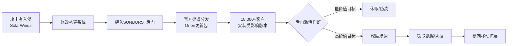

## 14.25 案例五：SolarWinds供应链攻击（A08）

### 背景与事件概览

2020年12月8日，网络安全公司FireEye披露其遭到国家级攻击者入侵，随后揭开了一场波及全球的供应链攻击事件——SolarWinds攻击。这起攻击被广泛认为是俄罗斯对外情报局（SVR）所为，攻击代号为UNC2452、Nobelium或APT29。

攻击者入侵了SolarWinds公司的构建系统，在其IT监控软件Orion Platform的更新包中植入了名为**SUNBURST**（又名Solorigate）的后门。由于Orion被全球超过33,000家组织使用，包括多个美国政府机构、财富500强企业及主要安全厂商，这起事件成为软件供应链安全的分水岭事件。



### 攻击技术深度分析

#### 攻击时间线

| 时间节点 | 事件 |
|---------|------|
| 2019年10月 | 攻击者首次在SolarWinds测试环境中植入测试代码 |
| 2020年2月20日 | SUNBURST后门代码首次被编译到Orion 2019.4 HF 5版本 |
| 2020年3月26日 | 受感染版本通过官方渠道推送给客户 |
| 2020年6月 | 攻击者开始在部分目标环境中部署第二阶段载荷 |
| 2020年12月8日 | FireEye披露入侵事件 |
| 2020年12月12日 | 确认SolarWinds为攻击源头 |
| 2020年12月13日 | CISA发布紧急指令ED 21-01 |

#### 攻击手法详解

**1. 初始入侵与构建系统渗透**

攻击者首先通过某种方式（至今未完全公开）获得了SolarWinds内部网络的访问权限。关键在于，攻击者并未直接修改源代码仓库，而是渗透到了构建环境：

```plaintext
攻击路径：
  外部网络 → SolarWinds内网 → 构建服务器 → 编译环境
                                    ↓
                            修改编译配置/源代码
                                    ↓
                          SUNBURST被编译进Orion DLL
```

**2. SUNBURST后门技术特征**

SUNBURST被植入到`SolarWinds.Orion.Core.BusinessLayer.dll`中，该DLL是Orion平台的核心组件。后门具有以下技术特征：

```plaintext
伪装机制：
  1. 使用合法的SolarWinds代码签名证书签名
  2. 与正常Orion代码风格保持一致
  3. 通过WMI查询收集环境信息，避免在安全厂商测试环境中激活
  4. 使用DNS隧道进行C2通信，伪装成合法的SolarWinds域名

通信域名：
  avsvmcloud[.]com（伪装成SolarWinds云服务）
  
  DNS查询格式：
  {encoded_data}.appsync-api.{region}.avsvmcloud[.]com
  
  示例解码：
  初始域名 → Base32编码 → 哈希处理 → 子域名构造
```

**3. 多阶段攻击载荷**

```plaintext
第一阶段：SUNBURST（Solorigate）
  - 植入位置：Orion.Core.BusinessLayer.dll
  - 功能：环境侦察、C2通信、条件激活
  - 触发条件：运行2周后才开始C2通信

第二阶段：TEARDROP（Raindrop）
  - 加载方式：内存加载，无文件落地
  - 功能：加载Cobalt Strike Beacon
  - 特征：使用自定义的内存加载器绕过EDR

第三阶段：Cobalt Strike Beacon
  - 通信：HTTPS C2通道
  - 功能：横向移动、凭据窃取、数据渗出
  - 变体：针对不同目标环境定制化
```

**4. 智能目标筛选机制**

SUNBURST最精巧的设计在于其目标筛选机制：

```plaintext
环境检查清单：
  □ 检查是否在虚拟机/沙箱环境中运行
  □ 检查是否安装了特定安全产品（如CrowdStrike、FireEye）
  □ 检查系统语言是否为特定语言（避免俄语系统）
  □ 检查域名是否属于高价值目标（政府、国防、科技）
  □ 收集已安装的Windows服务列表
  □ 收集网络配置和域信息

激活决策：
  如果环境被判定为"安全研究" → 长期休眠
  如果环境被判定为"低价值" → 仅收集基础信息
  如果环境被判定为"高价值" → 部署第二阶段载荷
```

### 关键教训与防御策略

#### 1. 构建环境安全（CI/CD Pipeline Security）

构建系统是软件供应链中最脆弱的环节之一。攻击者一旦获得构建环境的访问权限，就能在编译过程中注入恶意代码，且这些代码会带有合法的数字签名。

```plaintext
构建环境安全清单：
  ┌─────────────────────────────────────────────────────────────┐
  │  访问控制                                                    │
  │  • 构建服务器使用独立的网络段                                  │
  │  • 实施最小权限原则，限制构建服务账号权限                       │
  │  • 启用MFA和IP白名单访问构建系统                              │
  │  • 定期轮换构建服务账号凭据                                   │
  └─────────────────────────────────────────────────────────────┘
  ┌─────────────────────────────────────────────────────────────┐
  │  构建完整性                                                   │
  │  • 使用可重现构建（Reproducible Builds）                      │
  │  • 构建过程记录详细日志并签名存储                              │
  │  • 独立验证构建输出与源代码的一致性                            │
  │  • 构建完成后立即计算并存储哈希值                              │
  └─────────────────────────────────────────────────────────────┘
```

**可重现构建验证示例**：

```bash
#!/bin/bash
# 可重现构建验证脚本

# 1. 从可信源获取源代码
git clone --depth 1 --branch v2.0.0 https://github.com/example/app.git
cd app

# 2. 记录构建环境
BUILD_ENV=$(cat <<EOF
{
  "os": "$(uname -a)",
  "compiler": "$(gcc --version | head -1)",
  "timestamp": "$(date -u +%Y-%m-%dT%H:%M:%SZ)"
}
EOF
)
echo "$BUILD_ENV" > build-env.json

# 3. 执行构建
make clean && make

# 4. 计算输出哈希
EXPECTED_HASH="a1b2c3d4e5f6..."
ACTUAL_HASH=$(sha256sum build/app | cut -d' ' -f1)

# 5. 验证一致性
if [ "$EXPECTED_HASH" = "$ACTUAL_HASH" ]; then
    echo "✓ 构建验证通过"
else
    echo "✗ 构建验证失败！输出可能被篡改"
    echo "  期望: $EXPECTED_HASH"
    echo "  实际: $ACTUAL_HASH"
    exit 1
fi
```

#### 2. 代码签名与完整性验证

数字签名是验证软件来源和完整性的关键机制。SolarWinds事件暴露了几个关键问题：

```plaintext
签名验证的三个层次：
  ┌─────────────────────────────────────────────────────────────┐
  │  层次1：签名有效性验证                                        │
  │  • 证书是否由可信CA签发                                      │
  │  • 证书是否在有效期内                                        │
  │  • 证书是否被吊销（检查CRL/OCSP）                            │
  └─────────────────────────────────────────────────────────────┘
  ┌─────────────────────────────────────────────────────────────┐
  │  层次2：签名内容完整性                                        │
  │  • 签名是否覆盖了整个文件（不仅仅是头部）                      │
  │  • 是否使用了足够强度的哈希算法（SHA-256+）                    │
  │  • 签名时间戳是否合理                                        │
  └─────────────────────────────────────────────────────────────┘
  ┌─────────────────────────────────────────────────────────────┐
  │  层次3：来源可信性验证                                        │
  │  • 证书是否属于预期的发布者                                   │
  │  • 证书公钥是否与已知的发布者公钥匹配                         │
  │  • 是否通过官方渠道获取（非第三方镜像）                       │
  └─────────────────────────────────────────────────────────────┘
```

**Windows代码签名验证**：

```powershell
# PowerShell脚本：验证数字签名完整性
function Verify-CodeSignature {
    param([string]$FilePath)
    
    $signature = Get-AuthenticodeSignature $FilePath
    
    # 1. 检查签名状态
    if ($signature.Status -ne 'Valid') {
        Write-Host "✗ 签名状态异常: $($signature.Status)" -ForegroundColor Red
        Write-Host "  原因: $($signature.StatusMessage)" -ForegroundColor Yellow
        return $false
    }
    
    # 2. 检查证书吊销状态
    $cert = $signature.SignerCertificate
    $chain = New-Object Security.Cryptography.X509Certificates.X509Chain
    $chain.ChainPolicy.RevocationMode = 'Online'
    $chain.Build($cert) | Out-Null
    
    if ($chain.ChainStatus -contains 'Revoked') {
        Write-Host "✗ 证书已被吊销" -ForegroundColor Red
        return $false
    }
    
    # 3. 验证发布者信息
    Write-Host "✓ 签名验证通过" -ForegroundColor Green
    Write-Host "  发布者: $($cert.Subject)" -ForegroundColor Cyan
    Write-Host "  颁发者: $($cert.Issuer)" -ForegroundColor Cyan
    Write-Host "  指纹: $($cert.Thumbprint)" -ForegroundColor Cyan
    
    return $true
}

# 使用示例
Verify-CodeSignature "C:\Program Files\SolarWinds\Orion\SolarWinds.Orion.Core.BusinessLayer.dll"
```

#### 3. 供应链安全监控体系

建立多层次的监控体系，能够在攻击发生的早期阶段进行检测：

```plaintext
监控层次架构：
  ┌─────────────────────────────────────────────────────────────┐
  │  网络层监控                                                  │
  │  • 监控DNS查询异常（如大量TXT记录查询）                       │
  │  • 监控异常的外部连接（特别是对已知C2域名）                    │
  │  • 分析网络流量模式变化                                      │
  └─────────────────────────────────────────────────────────────┘
  ┌─────────────────────────────────────────────────────────────┐
  │  主机层监控                                                  │
  │  • 进程行为监控（异常父子进程关系）                           │
  │  • 文件系统监控（关键目录文件变化）                           │
  │  • 注册表监控（自启动项变化）                                │
  └─────────────────────────────────────────────────────────────┘
  ┌─────────────────────────────────────────────────────────────┐
  │  应用层监控                                                  │
  │  • 软件完整性校验（定期哈希比对）                             │
  │  • 配置文件变更监控                                          │
  │  • 异常API调用检测                                           │
  └─────────────────────────────────────────────────────────────┘
```

**SolarWinds IOC检测脚本**：

```python
#!/usr/bin/env python3
"""
SolarWinds SUNBURST IOC检测工具
检测已知的IOC和行为特征
"""

import hashlib
import os
import re
import sys
import socket

# 已知SUNBURST文件哈希（部分）
KNOWN_HASHES = {
    "32519b85c0b422e4656de6e6c41715b2": "SUNBURST v1",
    "d0d626deb3f9484e649294a8dfa814c5": "SUNBURST v2",
    "b91ce2fa41029f6955bff20079468448": "TEARDROP",
}

# 已知恶意域名
MALICIOUS_DOMAINS = [
    "avsvmcloud.com",
    "freescanonline.com",
    "deftsecurity.com",
    "thedoccloud.com",
    "websitetheme.com",
    "highdatabase.com",
    "incomeupdate.com",
    "databasegalore.com",
    "panhardware.com",
    "zupertech.com",
]

def check_file_hash(filepath):
    """检查文件哈希是否匹配已知恶意哈希"""
    if not os.path.exists(filepath):
        return None
    
    with open(filepath, 'rb') as f:
        content = f.read()
        md5 = hashlib.md5(content).hexdigest()
        sha256 = hashlib.sha256(content).hexdigest()
    
    if md5 in KNOWN_HASHES:
        return {
            'malicious': True,
            'threat': KNOWN_HASHES[md5],
            'md5': md5,
            'sha256': sha256
        }
    
    return {'malicious': False, 'md5': md5, 'sha256': sha256}

def scan_for_indicators():
    """扫描系统中的IOC"""
    results = []
    
    # 1. 检查关键文件
    suspicious_paths = [
        r"C:\Program Files\SolarWinds\Orion\SolarWinds.Orion.Core.BusinessLayer.dll",
        r"C:\Windows\Temp\*.dll",
        r"C:\Windows\Temp\*.exe",
    ]
    
    for path_pattern in suspicious_paths:
        # 简化版：实际应使用glob模式匹配
        if os.path.exists(path_pattern):
            result = check_file_hash(path_pattern)
            if result and result['malicious']:
                results.append({
                    'type': 'malicious_file',
                    'path': path_pattern,
                    'threat': result['threat'],
                    'hash': result['sha256']
                })
    
    # 2. 检查网络连接
    try:
        # 获取活动连接
        import subprocess
        netstat = subprocess.run(
            ['netstat', '-ano'], 
            capture_output=True, text=True
        )
        
        for domain in MALICIOUS_DOMAINS:
            if domain in netstat.stdout:
                results.append({
                    'type': 'suspicious_connection',
                    'domain': domain,
                    'recommendation': '立即阻断连接并进行调查'
                })
    except Exception as e:
        print(f"网络检查失败: {e}")
    
    return results

def main():
    print("SolarWinds SUNBURST IOC检测工具")
    print("=" * 50)
    
    results = scan_for_indicators()
    
    if not results:
        print("✓ 未检测到已知IOC")
        return 0
    
    print(f"✗ 检测到 {len(results)} 个可疑指标：\n")
    for i, result in enumerate(results, 1):
        print(f"{i}. 类型: {result['type']}")
        for key, value in result.items():
            if key != 'type':
                print(f"   {key}: {value}")
        print()
    
    return 1

if __name__ == '__main__':
    sys.exit(main())
```

### 对比分析：供应链攻击演进

| 攻击事件 | 时间 | 攻击方式 | 影响范围 | 技术特点 |
|---------|------|---------|---------|---------|
| **SolarWinds** | 2020 | 构建系统入侵 | 18,000+组织 | DNS隧道C2，智能目标筛选 |
| **Codecov** | 2021 | 构建脚本篡改 | 29,000+用户 | Bash脚本注入，环境变量窃取 |
| **Log4Shell** | 2021 | 开源组件漏洞 | 几乎所有Java应用 | JNDI注入，零日利用 |
| **3CX** | 2023 | 多级供应链 | 600,000+用户 | 从上游供应商开始的级联攻击 |
| **xz-utils** | 2024 | 社会工程学 | Linux系统 | 维护者接管，后门植入SSH |

### 进阶防御：软件供应链安全框架

#### SLSA框架（Supply-chain Levels for Software Artifacts）

Google提出的SLSA框架为软件供应链安全提供了分级标准：

```plaintext
SLSA安全级别：
  ┌─────────────────────────────────────────────────────────────┐
  │  SLSA 1：构建过程有文档记录                                  │
  │  • 证明软件有构建过程                                        │
  │  • 不要求构建过程的完整性                                    │
  └─────────────────────────────────────────────────────────────┘
  ┌─────────────────────────────────────────────────────────────┐
  │  SLSA 2：构建过程有防护                                      │
  │  • 使用版本控制系统                                          │
  │  • 使用托管的构建服务                                        │
  │  • 生成来源证明（Provenance）                                │
  └─────────────────────────────────────────────────────────────┘
  ┌─────────────────────────────────────────────────────────────┐
  │  SLSA 3：构建过程有严格防护                                  │
  │  • 构建过程在隔离环境中执行                                  │
  │  • 来源证明经过签名验证                                      │
  │  • 支持可重现构建                                            │
  └─────────────────────────────────────────────────────────────┘
  ┌─────────────────────────────────────────────────────────────┐
  │  SLSA 4：最高安全级别                                        │
  │  • 双人审查所有变更                                          │
  │  • 可重现构建强制要求                                        │
  │  • 构建环境完全密封                                          │
  └─────────────────────────────────────────────────────────────┘
```

#### 实施供应链安全的最佳实践

```plaintext
组织层面：
  1. 建立软件物料清单（SBOM）管理流程
     • 记录所有软件组件及其版本
     • 监控已知漏洞数据库
     • 定期审计第三方依赖

  2. 实施供应商安全评估
     • 评估供应商的安全成熟度
     • 要求供应商提供安全认证（如SOC 2）
     • 建立供应商安全事件响应流程

  3. 部署软件组成分析（SCA）工具
     • 自动识别开源组件漏洞
     • 许可证合规检查
     • 依赖关系可视化

技术层面：
  1. 使用Sigstore进行代码签名
     • 无需管理长期密钥
     • 基于OIDC的身份验证
     • 透明日志审计

  2. 实施SBOM生成和验证
     • 使用SPDX或CycloneDX格式
     • 在CI/CD管道中自动生成
     • 验证SBOM与实际构建的一致性

  3. 部署运行时应用自保护（RASP）
     • 监控应用运行时行为
     • 检测异常的API调用
     • 阻断恶意操作
```

### 常见误区与纠正

**误区1：只关注开源组件漏洞，忽视商业软件供应链风险**

SolarWinds攻击证明，商业软件同样可能成为供应链攻击的入口。组织需要对所有软件（包括商业软件）进行安全评估，而不仅仅是开源组件。

**误区2：认为代码签名就能保证软件安全**

数字签名只能证明软件的来源和完整性，无法保证软件本身没有安全漏洞或恶意代码。攻击者一旦获得合法的签名证书，就能对恶意软件进行签名。

**误区3：忽视构建环境的安全性**

构建环境是供应链攻击的关键环节。如果构建服务器被入侵，攻击者可以在编译过程中注入恶意代码，且这些代码会带有合法的签名。需要将构建环境视为关键基础设施进行保护。

**误区4：依赖单一的安全检测手段**

SolarWinds后门使用了多种规避技术，单一的安全产品难以全面检测。需要建立多层次的防御体系，包括网络监控、主机监控、应用监控等多个维度。

### 总结与行动建议

SolarWinds攻击揭示了软件供应链安全的根本挑战：**信任链的脆弱性**。当组织信任软件供应商时，这种信任会延伸到供应商的整个开发和构建过程。任何环节的失败都可能导致严重的安全后果。

**立即行动清单**：

```plaintext
短期（1-3个月）：
  □ 审计当前使用的软件供应链
  □ 建立软件物料清单（SBOM）
  □ 验证关键软件的数字签名
  □ 部署网络监控，检测已知IOC

中期（3-6个月）：
  □ 实施CI/CD管道安全加固
  □ 部署软件组成分析（SCA）工具
  □ 建立供应商安全评估流程
  □ 制定供应链安全事件响应计划

长期（6-12个月）：
  □ 实施SLSA框架（至少达到Level 2）
  □ 部署代码签名和验证基础设施
  □ 建立可重现构建流程
  □ 参与行业供应链安全信息共享
```

通过SolarWinds事件，我们认识到供应链安全不是一个技术问题，而是一个需要技术、流程和人员共同参与的系统工程。只有建立全面的供应链安全管理体系，才能有效应对日益复杂的供应链攻击威胁。

***
