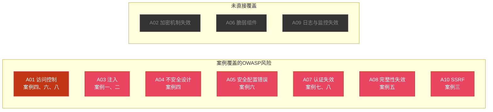
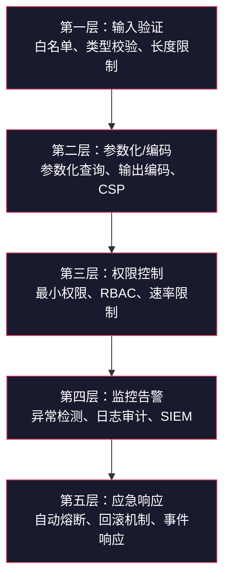
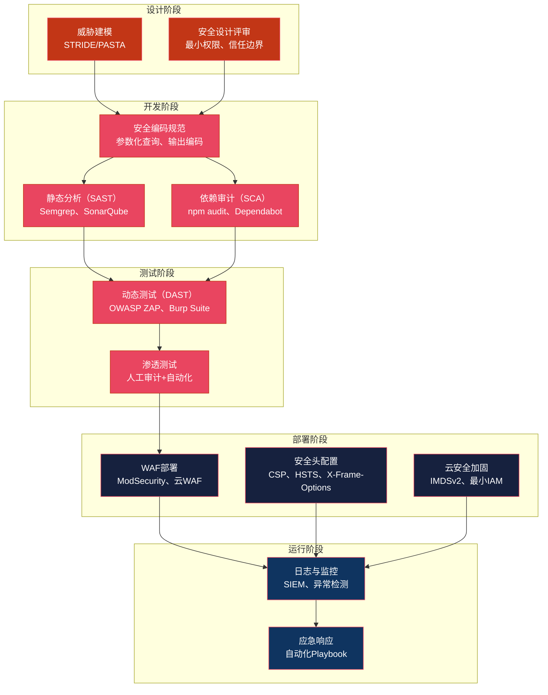
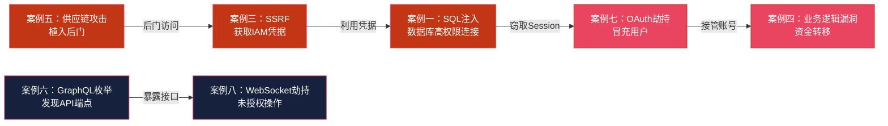

## 14.26 案例总结

前面八个实战案例覆盖了OWASP Top 10中绝大多数风险类别。本节将从全局视角对这些案例进行系统性复盘：提取共性规律、构建防御模型、建立开发团队可直接落地的安全检查清单。

### 八大案例全景对照

| 案例 | OWASP分类 | 攻击面 | 核心手法 | 影响范围 | 根本原因 |
|------|-----------|--------|----------|----------|----------|
| 案例一：电商SQL注入 | A03 注入 | 搜索接口 | UNION注入提取用户数据 | 50万用户数据泄露 | 字符串拼接SQL、错误信息泄露、高权限数据库账号 |
| 案例二：XSS蠕虫 | A03 注入 | 个人资料编辑 | img onerror自传播蠕虫 | 10万+账号感染 | 自制HTML过滤器、缺乏CSP |
| 案例三：云SSRF攻击链 | A10 SSRF | URL预览功能 | 利用元数据服务获取IAM凭据 | 生产数据全量泄露 | 无URL白名单、无IP过滤、IAM过度授权 |
| 案例四：金融业务逻辑漏洞 | A01 访问控制 + A04 不安全设计 | 转账接口 | 负数金额绕过校验 | 资金直接损失 | 信任客户端数据、无服务端校验 |
| 案例五：SolarWinds供应链攻击 | A08 完整性失效 | 构建系统 | 植入后门到官方更新包 | 18000+组织受影响 | 构建环境被入侵、缺乏完整性验证 |
| 案例六：GraphQL信息泄露 | A01 访问控制 + A05 安全配置错误 | GraphQL API | 内省查询枚举schema | API结构和敏感字段暴露 | 生产环境启用内省、无查询复杂度限制 |
| 案例七：OAuth重定向攻击 | A07 认证失效 | OAuth授权流程 | 篡改redirect_uri窃取授权码 | 用户账号被接管 | 重定向URI校验不严格、缺乏state参数 |
| 案例八：WebSocket跨站劫持 | A07 认证失效 + A01 访问控制 | WebSocket连接 | 跨站建立WebSocket发送恶意消息 | 未授权操作执行 | 未验证Origin、无CSRF防护 |

### OWASP Top 10覆盖度分析



八个案例覆盖了OWASP Top 10中的七项风险，其中A03（注入）和A01（访问控制）各出现两次，是实际安全事件中最高频的漏洞类型。未直接覆盖的三项风险（A02加密机制失效、A06脆弱组件、A09日志与监控失效）在案例中以隐性角色存在——案例一中密码存储加密不当属于A02范畴，案例五中被利用的构建工具可归类为A06，而所有案例的爆发都与A09（缺乏有效监控）密切相关。

### 跨案例规律提取

#### 规律一：信任边界错误是最普遍的根因

八个案例中，有六个涉及"信任边界"定位错误：

- **案例一**：信任用户输入直接拼接SQL——应将所有用户输入视为不可信数据
- **案例二**：信任自制过滤器能防御XSS——应使用经过安全审计的成熟库
- **案例三**：信任用户提供的URL是安全的——应对所有外部输入做边界校验
- **案例四**：信任客户端提交的金额数据——服务端必须独立校验业务规则
- **案例七**：信任redirect_uri参数的合法性——应使用精确匹配白名单
- **案例八**：信任来自浏览器的WebSocket连接——必须验证Origin和认证状态

**核心原则**：零信任架构不只适用于网络边界，更适用于应用层的每一个数据输入点。开发者必须明确划分"信任区"（服务端逻辑、数据库内部操作）和"非信任区"（所有客户端输入、第三方API响应），并在边界上实施严格的验证和净化。

#### 规律二：单点防御必然被绕过

没有哪个案例是通过单一防御措施就能完全阻止的。每个成功的攻击都突破了至少一层防护：

| 案例 | 被绕过的防御 | 为什么单点防御不够 |
|------|-------------|-------------------|
| 案例一 | WAF规则、输入长度限制 | 编码绕过、分段注入 |
| 案例二 | script标签过滤 | HTML事件属性、SVG标签等替代向量 |
| 案例三 | 基础URL校验 | DNS重绑定、IPv6表示、URL编码绕过 |
| 案例四 | 前端金额校验 | 客户端可被完全控制 |
| 案例五 | 代码签名 | 构建系统被入侵后签名本身被篡改 |
| 案例七 | 前缀匹配验证 | 路径遍历、参数污染绕过 |

**核心原则**：纵深防御（Defense in Depth）不是可选策略，而是必须架构。每一层防御都假设其他层可能失效，从而确保单一突破不会导致全面沦陷。



#### 规律三：攻击面随架构演进不断扩大

从案例一到案例八，攻击面的演变清晰地映射了Web技术栈的演进：

```text
传统Web → 云原生 → API驱动 → 现代协议
案例一     案例三    案例六     案例八
SQL注入    SSRF      GraphQL    WebSocket
XSS蠕虫    元数据    内省查询    跨站劫持
           利用      信息泄露
```

每一轮技术升级都引入了新的攻击面：云环境带来了元数据服务暴露的风险，GraphQL的灵活性变成了信息泄露的帮凶，WebSocket的全双工通信绕过了传统CSRF防护机制。安全团队必须在采纳新技术的同时，同步评估其引入的安全风险。

#### 规律四：检测延迟直接放大损失

| 案例 | 攻击持续时间 | 检测方式 | 损失放大倍数 |
|------|-------------|----------|-------------|
| 案例一：SQL注入 | 数周 | 外部安全研究员发现 | 数据已大量外泄 |
| 案例二：XSS蠕虫 | 2小时 | 用户投诉+异常流量 | 10万账号感染 |
| 案例三：SSRF | 数天 | 事后审计云日志 | 生产数据全量泄露 |
| 案例四：业务逻辑漏洞 | 不明 | 资金对账异常 | 直接资金损失 |
| 案例五：SolarWinds | 数月 | 外部安全公司发现 | 18000+组织受影响 |

**关键发现**：八个案例中，没有一个是通过组织自身的安全监控体系主动发现的。这直接对应了A09（安全日志与监控失效）——即使监控不在Top 10的高频榜单上，它却是决定损失大小的关键变量。

### 通用攻击模型：STRIDE + OWASP交叉分析

将案例映射到STRIDE威胁模型，可以更系统地理解每类攻击的本质：

| STRIDE威胁类型 | 对应案例 | OWASP风险 | 攻击者目标 |
|---------------|----------|-----------|-----------|
| **S**poofing（仿冒） | 案例七（OAuth劫持） | A07 认证失效 | 冒充合法用户获取授权 |
| **T**ampering（篡改） | 案例四（金额篡改）、案例五（代码篡改） | A04 不安全设计、A08 完整性失效 | 修改数据或代码达到未授权目的 |
| **R**epudiation（抵赖） | 案例四（缺乏交易审计） | A09 监控失效 | 攻击者否认恶意操作 |
| **I**nformation Disclosure（信息泄露） | 案例一（数据库泄露）、案例三（IAM凭据）、案例六（Schema泄露） | A03 注入、A10 SSRF、A01 访问控制 | 获取敏感数据 |
| **D**enial of Service（拒绝服务） | 案例二（平台下线） | A03 注入 | 破坏服务可用性 |
| **E**levation of Privilege（权限提升） | 案例三（IAM凭据）、案例八（未授权操作） | A10 SSRF、A01 访问控制 | 获取更高权限 |

### 纵深防御架构设计

基于对八个案例的分析，可以构建一个完整的Web应用安全防御架构：



### 开发团队安全检查清单

将八个案例的教训转化为可直接执行的检查清单。每个检查项都标注了对应的案例编号，便于追溯根因：

#### 输入验证与输出编码

| 检查项 | 对应案例 | 实施要点 |
|--------|----------|----------|
| 所有SQL查询使用参数化语句 | 案例一 | 禁止字符串拼接构建SQL，使用PreparedStatement/ORM |
| 用户输入在输出时进行上下文相关编码 | 案例二 | HTML上下文用HTML编码、JS上下文用JS编码、URL上下文用URL编码 |
| 使用成熟的HTML净化库处理富文本 | 案例二 | 推荐DOMPurify（前端）或bleach（Python）/jsoup（Java） |
| 所有API参数进行类型和范围校验 | 案例四 | 金额必须>0，数量必须为整数，字符串不超过最大长度 |
| 文件上传限制MIME类型和扩展名 | 通用 | 白名单校验，存储路径与Web根目录隔离 |

#### 认证与授权

| 检查项 | 对应案例 | 实施要点 |
|--------|----------|----------|
| OAuth redirect_uri使用精确匹配 | 案例七 | 禁止前缀匹配或通配符，验证完整URL包括路径和端口 |
| OAuth流程必须使用state参数 | 案例七 | state值应为加密随机数，绑定用户会话 |
| WebSocket连接验证Origin和认证状态 | 案例八 | 不要仅依赖Cookie认证，需要独立的Token验证 |
| API端点实施细粒度RBAC | 案例四、六 | 每个接口独立校验权限，不依赖前端路由守卫 |
| 敏感操作实施二次认证 | 案例四 | 转账、修改密码等操作需要短信/邮件验证码 |

#### 服务端请求安全

| 检查项 | 对应案例 | 实施要点 |
|--------|----------|----------|
| SSRF防护：URL白名单+IP过滤 | 案例三 | 禁止访问私有IP段（10/8、172.16/12、192.168/16、169.254/16） |
| 云元数据服务使用IMDSv2 | 案例三 | AWS强制IMDSv2，GCP/Azure使用类似机制 |
| IAM角色配置最小权限 | 案例三 | 应用IAM角色只授予必要的S3/数据库访问权限 |
| GraphQL生产环境禁用内省查询 | 案例六 | 设置`introspection: false`，使用查询白名单 |

#### 供应链与构建安全

| 检查项 | 对应案例 | 实施要点 |
|--------|----------|----------|
| CI/CD管道实施代码签名 | 案例五 | 构建产物必须签名，客户端验证签名 |
| 依赖包定期审计和更新 | 案例五 | 使用Dependabot/Renovate自动更新，npm audit/Snyk扫描 |
| 构建环境网络隔离 | 案例五 | 构建服务器不能直接访问互联网，通过代理拉取依赖 |
| 发布文件提供SHA256校验和 | 案例五 | 供用户验证下载文件完整性 |

#### 监控与应急

| 检查项 | 对应案例 | 实施要点 |
|--------|----------|----------|
| 异常查询模式告警 | 案例一 | SQL错误率突增、异常UNION查询触发告警 |
| 账户行为基线监控 | 案例二 | 短时间内大量资料修改触发人工审核 |
| 云API调用审计 | 案例三 | IAM凭据使用模式异常（新IP、高频调用）触发告警 |
| 金融交易异常检测 | 案例四 | 负数金额、异常大额、短时间内高频交易触发熔断 |
| 安全事件响应预案 | 全部 | 从检测到修复的时间窗口目标：< 1小时（关键漏洞） |

### 案例启示：从"事后补救"到"安全左移"

传统安全模式是"开发→测试→上线→出事→修复"，安全介入发生在最后阶段。八个案例无一例外地证明：越晚发现漏洞，修复成本越高，损失越大。

| 发现阶段 | 修复成本（相对值） | 案例对比 |
|----------|-------------------|----------|
| 需求设计阶段 | 1x | 案例四：如果在设计阶段就定义了金额校验规则，漏洞不会存在 |
| 编码阶段 | 5x | 案例一：如果使用参数化查询，SQL注入从根本上不可能发生 |
| 测试阶段 | 15x | 案例二：如果XSS测试覆盖了事件属性，蠕虫不会爆发 |
| 生产环境 | 60x | 案例三：SSRF导致数据泄露后，修复不仅涉及代码，还包括数据泄露通知、合规审计、品牌修复 |
| 被公开利用后 | 100x+ | 案例五：SolarWinds事件导致股价暴跌、CEO辞职、国会听证 |

安全左移（Shift Left Security）不是一句口号，而是经过无数真实事件验证的经济最优解。将安全检查嵌入需求评审、代码审查、CI/CD管道的每一个环节，是将修复成本从60x-100x降低到1x-5x的关键。

### 案例之间的攻击链关联

真实攻击中，攻击者往往不会只利用单一漏洞。以下展示了案例之间的潜在组合攻击路径：



**典型攻击链**：
1. 攻击者通过GraphQL内省查询（案例六）发现SSRF端点
2. 利用SSRF（案例三）获取云环境IAM凭据
3. 凭据权限过高，可访问数据库直接执行SQL（案例一的变体）
4. 获取用户Session后冒充用户身份（案例七的变体）
5. 利用业务逻辑漏洞（案例四）转移资金

这条攻击链涉及五个不同类型的漏洞，但每一个单独来看都是"中低危"或"可接受风险"。只有将它们串联起来，才能看到完整的危害。这就是为什么安全不能只关注单个漏洞的严重程度，而必须从攻击链的视角进行系统性防御。

### 从案例到能力：学习路径建议

对于希望深入Web安全的读者，建议按以下路径将案例知识转化为实战能力：

**初级阶段——复现与理解**
- 搭建DVWA/Juice Shop靶场，逐个复现案例中的攻击手法
- 重点练习案例一（SQL注入）和案例二（XSS），这两类漏洞占据实际攻击的绝大多数
- 使用Burp Suite拦截和修改请求，理解HTTP层面发生了什么

**中级阶段——工具化与自动化**
- 使用SQLMap自动化SQL注入测试，对比手动和自动化的效率差异
- 使用OWASP ZAP的主动扫描功能发现案例三到案例八类型的漏洞
- 编写自定义Burp Suite插件检测业务逻辑漏洞（案例四）

**高级阶段——架构与设计**
- 对开源项目进行完整的安全审计，尝试在代码层面发现案例中的根因
- 学习威胁建模方法（STRIDE、PASTA），在设计阶段识别潜在风险
- 研究真实CVE报告（CVE Details、NVD），分析漏洞从发现到修复的完整生命周期
- 参与Bug Bounty项目（HackerOne、Bugcrowd），将技能变现

每个案例都提醒我们：安全是一个系统工程，需要从设计、开发、部署、运维的全生命周期进行防护。没有任何单一工具、单一方法或单一人员能够保证绝对安全——但通过系统化的安全工程实践，可以将风险降低到业务可接受的水平。这正是OWASP Top 10存在的意义：不是列出所有可能的漏洞，而是帮助安全从业者聚焦于最高优先级的风险，用有限的资源实现最大的安全收益。
