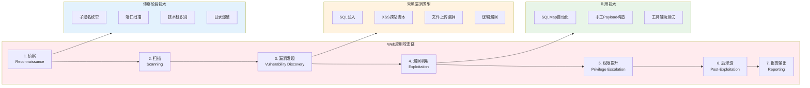

## 14.13 Web安全测试方法论

Web安全测试不是"跑一遍扫描器就完事"的技术活，而是一套需要系统化思维、严格流程和持续迭代的工程实践。本节将从方法论层面建立完整的测试框架，涵盖测试策略选择、流程设计、工具链搭建、报告撰写和质量度量，帮助你从"发现漏洞"的初级阶段跃迁到"构建安全体系"的高级阶段。

### 14.13.1 测试流程概述

Web安全测试应遵循系统化的方法论。OWASP Testing Guide v4.2 提供了一个业界公认的完整测试框架，将测试活动分为 11 个大类、96 个测试用例，覆盖从信息收集到业务逻辑验证的全链路。

#### OWASP Testing Guide 测试阶段

| 阶段 | 编号 | 测试内容 | 核心目标 |
|------|------|----------|----------|
| 信息收集 | OTG-INFO | 子域名、端口、技术栈、WAF识别 | 构建完整的攻击面地图 |
| 配置管理测试 | OTG-CONFIG | 服务器配置、SSL/TLS、HTTP头、CORS | 发现配置缺陷和暴露面 |
| 身份管理测试 | OTG-IDENT | 用户枚举、密码策略、注册流程 | 评估身份体系的健壮性 |
| 认证测试 | OTG-AUTHN | 凭证传输、多因素认证、密码找回 | 验证认证机制的安全性 |
| 授权测试 | OTG-AUTHZ | 权限提升、IDOR、目录遍历 | 确认访问控制的有效性 |
| 会话管理测试 | OTG-SESS | Cookie属性、会话固定、CSRF | 评估会话生命周期安全 |
| 输入验证测试 | OTG-INPVAL | SQL注入、XSS、命令注入、文件包含 | 检测注入类漏洞 |
| 错误处理测试 | OTG-ERR | 错误信息泄露、异常处理、堆栈追踪 | 评估错误处理机制 |
| 加密测试 | OTG-CRYPST | 传输加密、静态加密、密钥管理 | 验证加密实现的正确性 |
| 业务逻辑测试 | OTG-BUSLOGIC | 流程绕过、竞态条件、价格篡改 | 发现逻辑设计缺陷 |
| 客户端测试 | OTG-CLIENT | DOM XSS、JS安全、Clickjacking | 评估客户端攻击面 |

#### 标准化测试流程

一个完整的Web安全测试周期通常包含 6 个阶段：

**第一阶段：准备与范围确认（Pre-engagement）**

测试前的准备工作决定了整个测试的质量上限。这一步最常见的错误是"拿到URL就开始扫"，结果要么漏测关键资产，要么越界触发法律风险。

必须确认的信息清单：
- 测试范围：哪些域名、IP、端口、路径在测试范围内
- 排除范围：哪些系统/功能绝对不能碰（如生产数据库的写操作）
- 测试时间：是否需要在维护窗口进行，避免影响业务
- 联系方式：紧急联系人、技术对接人、安全部门联系人
- 授权文件：签署渗透测试授权书（Get Out of Jail Free Letter）
- 账号准备：是否提供测试账号，权限级别如何
- 环境信息：测试环境还是生产环境，是否已做数据脱敏

**第二阶段：信息收集（Reconnaissance）**

信息收集是整个测试的基石。收集的信息越全面，后续发现漏洞的概率越高。经验法则：信息收集应占整个测试时间的 30-40%。

被动信息收集（不直接接触目标）：
- 域名和子域名：使用 Certificate Transparency（crt.sh）、DNS 暴力枚举、搜索引擎 dork
- IP 和网络：WHOIS 查询、BGP 路由分析、CDN 识别
- 技术栈：Wappalyzer、BuiltWith、HTTP 响应头分析
- 人员信息：GitHub/GitLab 代码泄露、社交媒体信息、邮箱地址
- 历史数据：Wayback Machine 存档、Google Cache、历史 DNS 记录

主动信息收集（直接与目标交互）：
- 端口扫描：Nmap 全端口扫描服务发现
- 目录爆破：使用 SecLists 字典枚举隐藏路径
- 参数发现：使用 Arjun/ParamSpider 发现隐藏参数
- API 端点：分析 JS 文件中的 API 调用、Swagger/OpenAPI 文档
- WAF 识别：使用 wafw00f 判断是否部署了 WAF 及其类型

**第三阶段：漏洞发现与验证（Vulnerability Discovery）**

这一步是将收集到的信息转化为可验证的漏洞发现。关键原则：每个发现的漏洞都必须通过实际利用（或 PoC）来验证，不能仅凭扫描器报告就下结论。

测试策略分为三个层次：
1. 自动化扫描：使用 Burp Suite Professional、OWASP ZAP、Nuclei 等工具进行广度扫描
2. 半自动测试：利用 Burp 的 Intruder/Repeater 对特定功能进行深度测试
3. 纯手工测试：针对业务逻辑漏洞、权限控制缺陷等需要人工判断的场景

**第四阶段：漏洞利用与影响评估（Exploitation）**

发现漏洞后，需要评估其实际影响。一个"理论上严重"的漏洞如果无法利用，其风险等级可能并不高。反之，一个看似低危的漏洞在特定业务场景下可能造成严重后果。

评估维度：
- 可利用性：攻击复杂度、是否需要认证、是否需要用户交互
- 影响范围：机密性、完整性、可用性的影响程度
- 业务影响：数据泄露量、财务损失、品牌损害
- CVSS 评分：使用 CVSS v3.1 计算器给出标准化评分

**第五阶段：后渗透与横向移动（Post-exploitation）**

在授权范围内，评估攻破一个点后能造成多大的连锁反应：
- 能否获取更高权限的账号
- 能否访问其他用户的敏感数据
- 能否影响后端基础设施
- 攻击路径的完整链条是什么

**第六阶段：报告与修复跟踪（Reporting）**

报告是渗透测试的最终交付物，也是最容易被低估的环节。一份好的报告应该让开发团队拿到后能直接修复，而不需要再追问"这个漏洞怎么复现"。

#### Web应用攻击链全景图



### 14.13.2 黑盒、白盒与灰盒测试

三种测试模式各有适用场景，选择哪种取决于你的测试目标、时间预算和信息获取能力。

#### 黑盒测试（Black-box Testing）

**定义**：在完全不了解内部实现的情况下进行测试，模拟真实外部攻击者的视角。

**适用场景**：
- 外部渗透测试：评估面向互联网的资产暴露面
- 竞品安全评估：无法获取源代码时的唯一选择
- 合规性测试：模拟真实攻击者的攻击路径

**优势**：
- 最贴近真实攻击场景，发现的漏洞具有直接的威胁意义
- 不受内部实现细节的干扰，专注于外部暴露面
- 可以验证 WAF、IDS 等安全防护设备的实际效果

**劣势**：
- 覆盖率有限，难以发现深层逻辑漏洞
- 测试时间长，信息收集阶段耗时大
- 可能遗漏需要源码审计才能发现的漏洞（如硬编码密钥）

**典型工具链**：Nmap → Subfinder → Burp Suite → SQLMap → Nuclei

**实战技巧**：
- 使用多个子域名枚举工具交叉验证，避免遗漏
- 重点关注 JS 文件中的 API 端点和硬编码 token
- 利用 Wayback Machine 和 Google Cache 发现已下线但仍在响应的接口
- 对发现的每个子域名独立进行端口扫描，不要假设都用 80/443

#### 白盒测试（White-box Testing）

**定义**：拥有完整的源代码、架构文档、数据库 Schema 等内部信息，进行深度代码审计和架构分析。

**适用场景**：
- 开发阶段的安全评审
- 合并请求（MR/PR）的安全审查
- 安全事件的事后根因分析
- 高风险模块的深度审计

**优势**：
- 覆盖率最高，可以审查每一行代码
- 能发现设计层面的缺陷（如不安全的架构模式）
- 测试效率高，不需要花时间信息收集

**劣势**：
- 需要安全人员具备代码审计能力
- 容易陷入代码细节而忽略业务逻辑
- 无法验证外部防护措施的有效性

**典型工具链**：Semgrep → CodeQL → SonarQube → 手工审计

**代码审计重点关注的模式**：

```python
# 高风险代码模式检查清单

# 1. SQL 注入 - 字符串拼接 SQL
query = f"SELECT * FROM users WHERE id = {user_id}"  # 危险
query = "SELECT * FROM users WHERE id = %s"  # 安全（参数化查询）

# 2. 命令注入 - 拼接 shell 命令
os.system(f"ping {host}")  # 危险
subprocess.run(["ping", host], capture_output=True)  # 安全（参数列表）

# 3. 路径遍历 - 拼接文件路径
file_path = os.path.join(upload_dir, filename)  # 可能危险
file_path = os.path.join(upload_dir, os.path.basename(filename))  # 安全

# 4. 硬编码凭证
API_KEY = "sk-1234567890abcdef"  # 危险
API_KEY = os.environ.get("API_KEY")  # 安全

# 5. 不安全的反序列化
data = pickle.loads(user_input)  # 极度危险
data = json.loads(user_input)  # 相对安全

# 6. SSRF - 用户可控的 URL 请求
requests.get(user_provided_url)  # 危险
requests.get(validate_url(user_provided_url, allowed_domains))  # 安全
```

#### 灰盒测试（Grey-box Testing）

**定义**：介于黑盒和白盒之间，拥有部分内部信息（如 API 文档、架构图、测试账号），是最常用的实战测试模式。

**适用场景**：
- 甲方委托的渗透测试（最常见）
- 安全众测（Bug Bounty）项目
- 内部安全团队的定期评估

**优势**：
- 兼顾效率和覆盖面，不需要花大量时间信息收集
- 可以验证业务逻辑层面的漏洞
- 测试结果更具实际参考价值

**劣势**：
- 需要甲方配合提供测试环境和账号
- 信息不完整可能导致测试方向偏差
- 测试边界需要明确约定

**典型工具链**：API 文档分析 → Burp Suite → Postman → 自定义脚本

#### 三种模式对比

| 维度 | 黑盒测试 | 白盒测试 | 灰盒测试 |
|------|----------|----------|----------|
| 信息掌握程度 | 零 | 完整 | 部分 |
| 测试覆盖率 | 低（30-40%） | 高（80-90%） | 中高（60-70%） |
| 测试效率 | 低 | 高 | 中高 |
| 模拟真实攻击 | 最贴近 | 不贴近 | 较贴近 |
| 发现逻辑漏洞 | 较难 | 容易 | 容易 |
| 发现配置漏洞 | 容易 | 较难 | 容易 |
| 技能要求 | 信息收集+利用 | 代码审计 | 两者兼备 |
| 成本 | 中 | 高 | 中 |
| 最佳使用时机 | 外部评估 | 开发阶段 | 定期评估 |

### 14.13.3 测试环境搭建

一个标准化的测试环境可以大幅提高测试效率和结果的一致性。

#### 核心工具链

```bash
# === 基础环境 ===
# Kali Linux 或 Parrot OS 作为主测试系统
# 或在 Ubuntu/Debian 上手动安装渗透测试工具

# === 代理与拦截 ===
# Burp Suite Professional（推荐）或 Community Edition
# 下载地址：https://portswigger.net/burp
# 配置浏览器代理：127.0.0.1:8080
# 安装 CA 证书以拦截 HTTPS 流量

# === 信息收集工具 ===
subfinder -d target.com -o subdomains.txt        # 子域名枚举
httpx -l subdomains.txt -o live_hosts.txt         # 存活探测
nmap -sV -sC -oA nmap_scan target.com             # 端口服务扫描
waybackurls target.com > wayback_urls.txt          # 历史URL
gau target.com >> all_urls.txt                      # 通用URL收集

# === 漏洞扫描 ===
nuclei -l live_hosts.txt -t cves/ -o results.txt  # 模板化漏洞扫描
nikto -h https://target.com                        # Web服务器扫描
wapiti -u https://target.com                       # Web应用扫描

# === 目录与参数发现 ===
feroxbuster -u https://target.com -w /usr/share/seclists/Discovery/Web-Content/raft-medium-directories.txt
arjun -u https://target.com/api/endpoint           # 隐藏参数发现

# === 自动化利用 ===
sqlmap -u "https://target.com/page?id=1" --batch   # SQL注入检测
xsstrike -u "https://target.com/search?q=test"    # XSS检测
```

#### 浏览器插件推荐

| 插件名称 | 用途 | 浏览器 |
|----------|------|--------|
| Wappalyzer | 技术栈识别 | Chrome/Firefox |
| HackTools | 常用Payload速查 | Chrome/Firefox |
| FoxyProxy | 代理快速切换 | Firefox |
| Cookie-Editor | Cookie编辑与管理 | Chrome/Firefox |
| JWT Editor | JWT令牌解码与篡改 | Chrome/Firefox |
| Retire.js | 前端库漏洞检测 | Chrome/Firefox |

#### Burp Suite 高效配置

Burp Suite 是Web安全测试的核心工具，以下配置可以显著提高测试效率：

**1. 宏（Macro）自动化认证**
当测试需要频繁登录时，配置宏自动处理认证：
- Project Options → Sessions → Session Handling Rules → Add
- 配置 Rule Actions → Run a macro
- 录制登录宏，设置 Token 提取规则

**2. 匹配与替换（Match and Replace）**
自动修改请求/响应中的特定内容：
- Proxy → Options → Match and Replace
- 示例：将所有 `admin=false` 替换为 `admin=true`

**3. Intruder 优化配置**
- 使用 Pitchfork 模式进行多参数协同爆破
- 配置 Grep - Match 提取响应中的关键信息
- 使用 Resource Pool 控制请求速率，避免触发 WAF

### 14.13.4 测试方法论详解

#### 输入验证测试方法论

输入验证是Web安全测试中最基础也是最重要的部分。OWASP Testing Guide 中，输入验证测试（OTG-INPVAL）包含以下关键测试项：

**SQL注入测试策略**

SQL注入至今仍是OWASP Top 10的常客（注入类漏洞常年位居前三），原因是很多开发者仍然使用字符串拼接构建SQL查询。

分层测试方法：
1. 基于错误的检测：发送单引号 `'`、双引号 `"`、反斜杠 `\`，观察是否返回数据库错误信息
2. 基于布尔的检测：发送 `AND 1=1`（真）和 `AND 1=2`（假），比较响应差异
3. 基于时间的检测：发送 `SLEEP(5)` 或 `WAITFOR DELAY '0:0:5'`，观察响应延迟
4. 带外（OOB）检测：使用 DNSLog 或 Burp Collaborator 接收数据

```sql
-- 常见注入测试Payload

-- 1. 错误检测
'
"
`
') 
")
'))

-- 2. 联合查询注入
' UNION SELECT NULL,NULL,NULL-- -
' UNION SELECT 1,2,3-- -
' UNION SELECT table_name,NULL FROM information_schema.tables-- -

-- 3. 布尔盲注
' AND 1=1-- -    (真条件，页面正常)
' AND 1=2-- -    (假条件，页面异常)
' AND SUBSTRING(@@version,1,1)='5'-- -

-- 4. 时间盲注
' AND SLEEP(5)-- -                    (MySQL)
'; WAITFOR DELAY '0:0:5'-- -          (MSSQL)
' AND pg_sleep(5)-- -                 (PostgreSQL)

-- 5. 堆叠查询
'; DROP TABLE test-- -
'; EXEC xp_cmdshell('whoami')-- -
```

**XSS测试策略**

XSS 分为反射型、存储型和 DOM 型三种，测试方法各有侧重。

反射型XSS测试要点：
- 测试所有用户输入点：URL参数、表单字段、HTTP头（Referer、User-Agent）
- 使用无害 payload 先确认注入点：`<script>alert(1)</script>`
- 尝试绕过过滤：大小写混写、编码绕过、事件处理器替代
- 关注 HTML 上下文：标签内、属性内、JS 变量内

存储型XSS测试要点：
- 测试所有会持久化的输入：评论、昵称、个人简介、文件名
- 使用不同 payload 分别测试每个输入字段
- 检查 payload 在哪些页面被渲染：管理员后台、用户个人页、API 响应
- 特别关注富文本编辑器的过滤机制

```html
<!-- XSS 测试Payload集 -->

<!-- 基础注入 -->
<script>alert('XSS')</script>

<svg onload=alert('XSS')>

<!-- 事件处理器 -->
<input onfocus=alert('XSS') autofocus>
<details open ontoggle=alert('XSS')>
<marquee onstart=alert('XSS')>

<!-- 绕过过滤 -->
<ScRiPt>alert('XSS')</ScRiPt>
<script>alert('XSS')</script>

<a href="javascript:alert('XSS')">click</a>
<a href="data:text/html,<script>alert('XSS')</script>">click</a>

<!-- DOM XSS -->

javascript:alert(document.domain)
#<script>alert('XSS')</script>
```

#### 认证与授权测试方法论

认证和授权缺陷是导致数据泄露的首要原因。测试时需要覆盖以下场景：

**认证测试矩阵**

| 测试项 | 测试方法 | 预期结果 |
|--------|----------|----------|
| 暴力破解防护 | 连续错误登录10次 | 账号锁定或验证码 |
| 密码策略 | 尝试设置弱密码 | 拒绝弱密码 |
| 凭证传输 | 抓包检查登录请求 | 使用HTTPS传输 |
| 多因素认证 | 绕过2FA直接访问 | 无法绕过 |
| 密码找回 | 重放密码重置请求 | Token一次性使用 |
| 会话固定 | 登录前后Cookie不变 | Cookie应重新生成 |
| 默认凭证 | 尝试常见默认密码 | 无法使用默认密码 |
| 用户枚举 | 比较登录错误信息 | 错误信息不泄露用户名 |

**IDOR（不安全的直接对象引用）测试**

IDOR 是最常见的授权漏洞之一。测试方法：

```bash
# IDOR 测试流程

# 1. 识别资源标识符
# GET /api/users/123/profile  → 用户123的资料
# GET /api/orders/456         → 订单456的详情
# GET /api/invoices/INV-789   → 发票789

# 2. 使用其他用户的凭证访问
# 用户A (ID=123) → GET /api/users/456/profile
# 如果能访问 → IDOR漏洞确认

# 3. 测试不同标识符格式
# 数字递增：/api/users/123 → /api/users/124
# UUID替换：替换为其他用户的UUID
# 字符串替换：/api/users/john → /api/users/admin

# 4. 测试批量IDOR
# 使用 Burp Intruder 对ID参数进行批量遍历
# 关注响应状态码和响应长度的差异
```

#### 业务逻辑测试方法论

业务逻辑漏洞无法被自动化扫描器发现，需要测试人员深入理解业务流程后手动测试。

**常见业务逻辑漏洞及测试方法**

**1. 价格篡改**
```http
# 正常购买请求
POST /api/checkout
Content-Type: application/json

{
  "items": [
    {"product_id": "P001", "quantity": 1, "price": 99.00}
  ],
  "total": 99.00,
  "discount_code": null
}

# 篡改测试 - 修改价格
{
  "items": [
    {"product_id": "P001", "quantity": 1, "price": 0.01}
  ],
  "total": 0.01,
  "discount_code": null
}

# 篡改测试 - 修改数量为负数
{
  "items": [
    {"product_id": "P001", "quantity": -1, "price": 99.00}
  ],
  "total": -99.00,
  "discount_code": null
}

# 篡改测试 - 重复使用优惠码
{
  "items": [{"product_id": "P001", "quantity": 1, "price": 99.00}],
  "total": 49.00,
  "discount_code": "WELCOME50"
}
# 注意：服务端是否验证 price 与数据库一致
# 注意：服务端是否验证 total 的计算逻辑
# 注意：优惠码是否限制使用次数
```

**2. 流程绕过**
```http
# 正常支付流程：选择商品 → 确认订单 → 支付 → 完成
# 绕过测试：跳过支付步骤直接访问完成页面

# 步骤1：创建订单
POST /api/orders
→ 返回 order_id: "ORD-001", status: "pending"

# 步骤2：跳过支付，直接确认
POST /api/orders/ORD-001/confirm
→ 如果返回成功 → 流程绕过漏洞

# 步骤3：测试状态篡改
PUT /api/orders/ORD-001/status
{"status": "paid"}
→ 如果订单状态变为 paid → 状态篡改漏洞
```

**3. 竞态条件测试**

```bash
# 竞态条件测试：同时发送多个请求，利用并发漏洞

# 场景：余额为100元，同时发起两次提现100元
# 期望：第二次失败
# 实际：可能两次都成功（TOCTOU漏洞）

# 使用 Burp Intruder 的并发请求功能
# 或使用 turbo intruder 插件

# Python 并发测试脚本
import requests
import concurrent.futures

url = "https://target.com/api/withdraw"
headers = {"Authorization": "Bearer <token>"}
data = {"amount": 100}

def withdraw():
    return requests.post(url, json=data, headers=headers)

# 同时发送20个提现请求
with concurrent.futures.ThreadPoolExecutor(max_workers=20) as executor:
    futures = [executor.submit(withdraw) for _ in range(20)]
    results = [f.result().status_code for f in futures]
    success_count = results.count(200)
    if success_count > 1:
        print(f"[!] 竞态条件漏洞：{success_count}个请求同时成功")
```

### 14.13.5 测试报告撰写规范

一份专业的渗透测试报告应包含以下结构：

```markdown
# Web应用渗透测试报告

## 1. 执行摘要
- 测试范围与目标
- 测试时间与方法
- 整体风险评级（高/中/低）
- 关键发现摘要（不超过5条）

## 2. 漏洞详情

### 漏洞编号：VULN-001
- **漏洞名称**：SQL注入 - 用户登录接口
- **风险等级**：严重（Critical）
- **CVSS评分**：9.8 (AV:N/AC:L/PR:N/UI:N/S:U/C:H/I:H/A:H)
- **影响范围**：所有用户账号，可通过登录接口获取完整数据库访问权限
- **漏洞描述**：登录接口的 username 参数未进行参数化查询，攻击者可注入SQL语句
- **复现步骤**：
  1. 访问 https://target.com/login
  2. 在用户名字段输入：admin' OR '1'='1'-- -
  3. 任意密码登录
  4. 成功以管理员身份登录
- **证据截图**：[附图]
- **修复建议**：使用参数化查询（Prepared Statement），禁止字符串拼接SQL
- **修复验证**：修复后重新测试同一注入点，确认无法利用

## 3. 漏洞统计
| 风险等级 | 数量 | 占比 |
|----------|------|------|
| 严重 | 2 | 10% |
| 高危 | 5 | 25% |
| 中危 | 8 | 40% |
| 低危 | 5 | 25% |

## 4. 修复优先级建议
1. 立即修复（24小时内）：严重级别漏洞
2. 尽快修复（1周内）：高危漏洞
3. 计划修复（1个月内）：中危漏洞
4. 评估后修复：低危漏洞

## 5. 附录
- 完整扫描日志
- 工具版本信息
- 测试环境配置
```

### 14.13.6 常见测试误区与纠正

| 误区 | 后果 | 正确做法 |
|------|------|----------|
| 只依赖自动化扫描器 | 漏掉逻辑漏洞和复杂链式攻击 | 自动化+手工结合，扫描器覆盖广度，手工挖掘深度 |
| 扫完就交报告 | 漏洞未经验证，误报率高 | 每个漏洞必须手动复现并截图留存 |
| 忽视信息收集 | 遗漏隐藏资产和攻击面 | 信息收集占测试时间30-40% |
| 只测HTTP流量 | 忽略WebSocket、gRPC等协议 | 检查所有协议和数据传输通道 |
| 测试环境和生产不一致 | 测试结果无法代表真实安全状况 | 尽量在生产环境的镜像环境测试 |
| 只关注OWASP Top 10 | 忽视业务特有的安全风险 | 结合业务场景设计专项测试用例 |
| 不验证修复效果 | 同一漏洞反复出现 | 修复后必须回归测试 |
| 测试账号权限过高 | 无法发现权限控制缺陷 | 使用多个不同权限的账号分别测试 |

### 14.13.7 自动化测试与CI/CD集成

将安全测试融入开发流程（DevSecOps）是现代安全测试的趋势。

#### SAST（静态应用安全测试）

```yaml
# .github/workflows/security-sast.yml
name: SAST Security Scan
on: [push, pull_request]

jobs:
  semgrep:
    runs-on: ubuntu-latest
    steps:
      - uses: actions/checkout@v4
      - uses: returntocorp/semgrep-action@v1
        with:
          config: >-
            p/owasp-top-ten
            p/security-audit
            p/secrets
```

#### DAST（动态应用安全测试）

```yaml
# .github/workflows/security-dast.yml
name: DAST Security Scan
on:
  schedule:
    - cron: '0 2 * * 1'  # 每周一凌晨2点

jobs:
  zap-scan:
    runs-on: ubuntu-latest
    steps:
      - name: ZAP Full Scan
        uses: zaproxy/action-full-scan@v0.7.0
        with:
          target: 'https://staging.target.com'
          rules_file_name: 'zap-rules.tsv'
          cmd_options: '-a -j -l WARN -z "-config api.disablekey=true"'
```

#### SCA（软件组成分析）

```bash
# 依赖漏洞扫描
npm audit --production           # Node.js
pip-audit                        # Python
mvn org.owasp:dependency-check-maven:check  # Java/Maven
bundler-audit check              # Ruby
trivy fs --security-checks vuln .  # 通用
```

### 14.13.8 安全测试度量指标

衡量安全测试的质量和效果，需要关注以下指标：

| 指标 | 计算方法 | 健康基准 |
|------|----------|----------|
| 漏洞发现率 | 发现漏洞数 / 测试用例数 | 持续下降表示安全状况改善 |
| 漏洞修复率 | 已修复漏洞 / 发现漏洞总数 | >90%（高危以上100%） |
| 平均修复时间（MTTR） | 从发现到修复的平均天数 | 严重<24h，高危<7天 |
| 误报率 | 误报数 / 总报告漏洞数 | <10% |
| 测试覆盖率 | 已测资产 / 总资产 | >95% |
| 回归率 | 修复后复发的漏洞数 | <5% |

### 14.13.9 进阶：攻击面管理（ASM）

传统渗透测试是"点状"的——在某个时间点对特定目标进行测试。攻击面管理（Attack Surface Management）则是"持续"的——实时监控组织的整个攻击面。

**攻击面管理的核心要素**：
- 资产发现自动化：持续发现新的子域名、IP、云服务、SaaS 应用
- 变化监控：检测新增端口、服务变更、SSL 证书到期
- 暴露面评估：识别互联网暴露的敏感服务（数据库端口、管理后台）
- 阴影IT发现：识别未被安全团队知晓的资产

```bash
# 持续攻击面监控脚本示例
#!/bin/bash
DOMAIN="target.com"
PREVIOUS_SCAN="/tmp/asm/previous.txt"
CURRENT_SCAN="/tmp/asm/current.txt"

# 子域名枚举
subfinder -d $DOMAIN -silent | sort > $CURRENT_SCAN

# 与上次扫描结果对比
if [ -f $PREVIOUS_SCAN ]; then
    NEW_SUBS=$(comm -13 $PREVIOUS_SCAN $CURRENT_SCAN)
    if [ -n "$NEW_SUBS" ]; then
        echo "[!] 发现新增子域名："
        echo "$NEW_SUBS"
        # 发送告警通知
    fi
fi

mv $CURRENT_SCAN $PREVIOUS_SCAN
```

### 14.13.10 学习资源推荐

| 资源 | 类型 | 适合阶段 | 说明 |
|------|------|----------|------|
| OWASP Testing Guide v4.2 | 指南 | 入门-高级 | Web安全测试的权威参考 |
| OWASP Web Security Testing Guide | 在线课程 | 入门 | OWASP官方培训材料 |
| PortSwigger Web Security Academy | 实验平台 | 入门-中级 | 免费在线Web安全实验室 |
| Hack The Box | 靶场 | 中级-高级 | 实战渗透练习平台 |
| PentesterLab | 实验平台 | 中级 | 专注于Web安全的实验环境 |
| Burp Suite 官方文档 | 文档 | 全阶段 | Burp Suite深度使用指南 |
| 《Web应用安全权威指南》 | 书籍 | 中级 | 系统讲解Web安全测试方法 |
| HTB Academy | 课程 | 中级-高级 | 结构化的渗透测试课程 |

### 14.13.11 本节小结

Web安全测试方法论的核心要点：

1. **系统化**：遵循标准化的测试流程，不遗漏测试环节
2. **分层化**：黑盒、白盒、灰盒各有适用场景，合理组合使用
3. **自动化与手工结合**：自动化工具负责广度，手工测试挖掘深度
4. **验证优先**：每个漏洞必须通过PoC验证，不接受未经确认的报告
5. **持续化**：安全测试不是一次性活动，应融入CI/CD持续进行
6. **可量化**：通过度量指标追踪安全测试的效果和改进趋势

记住：好的安全测试不仅能发现当前的漏洞，更能推动团队建立持续改进的安全文化。方法论是骨架，工具是肌肉，经验是灵魂——三者缺一不可。
