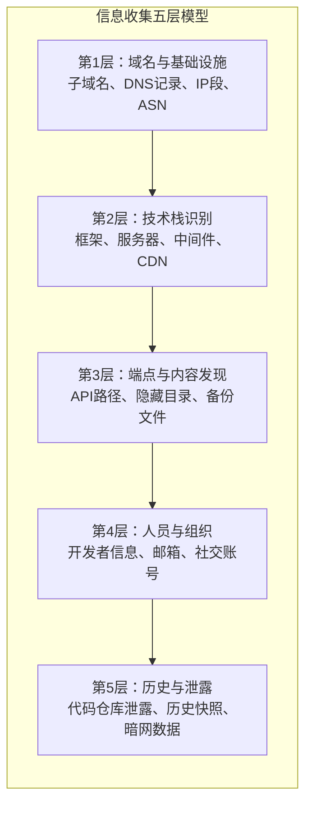

## 14.14 信息收集技术

信息收集（Reconnaissance）是Web安全测试的第一步，也是决定后续测试深度和效率的关键阶段。一个经验丰富的渗透测试人员，会将70%以上的时间花在信息收集上——因为攻击面越大，发现漏洞的概率越高。信息收集不是简单地跑几个工具，而是系统性地构建目标的完整画像：域名结构、技术栈、业务逻辑、人员信息、历史痕迹，每一层信息都可能成为突破口。

本节按照信息收集的层次递进关系，从域名层→技术层→端点层→人员层→历史层，逐层展开，覆盖被动收集和主动收集两大类方法。

### 14.14.1 信息收集的层次模型

信息收集可以分为五个层次，从外到内逐步深入：



| 层次 | 收集目标 | 典型工具 | 产出物 |
|------|---------|---------|--------|
| 域名层 | 子域名、DNS记录、IP范围 | Subfinder, Amass, dig | 域名资产清单 |
| 技术层 | 框架、服务器、WAF | Wappalyzer, WhatWeb, httpx | 技术栈画像 |
| 端点层 | URL路径、API接口、参数 | gobuster, ffuf, JS分析 | 端点清单 |
| 人员层 | 邮箱、用户名、组织架构 | theHarvester, Hunter.io | 人员画像 |
| 历史层 | 代码泄露、历史页面 | Wayback Machine, GitDorker | 历史数据集 |

被动收集（Passive Reconnaissance）不直接与目标系统交互，不会触发安全告警；主动收集（Active Reconnaissance）直接与目标交互，可能被WAF或IDS检测到。在实际测试中，应先完成被动收集，再进行主动收集，避免过早暴露测试意图。

### 14.14.2 子域名枚举

子域名枚举是扩大攻击面最直接的手段。一个主域名下可能有数百个子域名，每个子域名都可能运行不同的服务、存在不同的漏洞。子域名枚举的方法可以分为五大类：

#### 14.14.2.1 被动枚举（数据聚合）

被动枚举通过查询公开数据源获取子域名，不与目标系统直接交互：

**Subfinder** 是目前最流行的被动子域名枚举工具，整合了 VirusTotal、crt.sh、Shodan、SecurityTrails 等数十个数据源：

```bash
# 基本用法
subfinder -d example.com -o subdomains.txt

# 指定数据源（提高覆盖率）
subfinder -d example.com -sources virustotal,shodan,crt.sh,securitytrails -o subdomains.txt

# 静默模式（只输出域名，适合管道）
subfinder -d example.com -silent | httpx -silent -status-code -title

# 递归枚举（对发现的子域名继续枚举）
subfinder -d example.com -recursive -o subdomains_recursive.txt
```

**Amass** 是 OWASP 维护的网络映射和攻击面发现工具，功能更全面但速度较慢：

```bash
# 被动枚举模式
amass enum -passive -d example.com -o amass_passive.txt

# 主动枚举（含DNS爆破）
amass enum -active -d example.com -brute -o amass_active.txt

# 使用配置文件（推荐，可配置API密钥提高限额）
amass enum -d example.com -config ~/.config/amass/config.ini

# 数据库存储模式（支持增量更新）
amass enum -d example.com -dir ~/.amass -o amass_results.txt
```

Amass 的配置文件示例（`~/.config/amass/config.ini`）：

```ini
[data_sources]
[data_sources.VirusTotal]
[data_sources.VirusTotal.Credentials]
apikey = YOUR_VIRUSTOTAL_API_KEY

[data_sources.Shodan]
[data_sources.Shodan.Credentials]
apikey = YOUR_SHODAN_API_KEY

[data_sources.SecurityTrails]
[data_sources.SecurityTrails.Credentials]
apikey = YOUR_SECURITYTRAILS_API_KEY
```

配置API密钥后，Amass 可以查询更多数据源，子域名覆盖率可提升 30%-50%。

**theHarvester** 同时支持子域名和邮箱收集：

```bash
# 从多个数据源收集子域名和邮箱
theHarvester -d example.com -b all -l 500 -o harvester_results.html

# 指定数据源
theHarvester -d example.com -b bing,google,virustotal,crt.sh
```

#### 14.14.2.2 证书透明度日志（Certificate Transparency）

证书透明度（CT）日志记录了所有颁发的SSL/TLS证书，是发现子域名的高效被动方法。任何申请过SSL证书的子域名都会出现在CT日志中。

```bash
# 使用 curl 查询 crt.sh（PostgreSQL接口）
curl -s "https://crt.sh/?q=%25.example.com&output=json" | jq -r '.[].name_value' | sort -u

# 使用 certsh 工具（更稳定的查询方式）
curl -s "https://crt.sh/?q=%.example.com&output=json" | \
  jq -r '.[].name_value' | \
  tr ',' '\n' | \
  sed 's/^\*\.//' | \
  sort -u > ct_subdomains.txt
```

CT日志的优势在于：
- 完全被动，无法被目标检测
- 覆盖率高，包含已过期和已撤销的证书
- 可以发现已被下线但仍记录在案的子域名

CT日志的局限：
- 只包含申请过公开SSL证书的子域名
- 内部域名或使用自签名证书的域名不会出现
- 数据量大，需要去重和过滤

常用的CT日志查询平台：
- **crt.sh**：免费，支持通配符查询，最常用
- **Censys**：提供更丰富的证书元数据
- **Facebook CT**：Facebook维护的CT日志查询接口
- **CertSpotter**：提供证书变更监控功能

#### 14.14.2.3 DNS爆破（Brute Force）

DNS爆破通过逐个尝试预定义的子域名前缀来发现有效子域名，是主动收集方法：

```bash
# 使用 gobuster 的 DNS 模式
gobuster dns -d example.com -w /usr/share/wordlists/subdomains-top1million-5000.txt -t 50 -o dns_results.txt

# 使用 ffuf 进行DNS爆破（需要配合DNS解析工具）
# ffuf 更常用于HTTP爆破，DNS爆破推荐使用专用工具

# 使用 puredns（高性能DNS爆破）
puredns bruteforce /usr/share/wordlists/subdomains-top1million-5000.txt example.com \
  --resolvers /path/to/resolvers.txt \
  --rate-limit 1000 \
  --write bruteforce_results.txt

# 使用 shuffledns（massdns的封装）
shuffledns -d example.com -w wordlist.txt -r /path/to/resolvers.txt -o shuffledns_results.txt
```

常用的子域名字典：

| 字典名称 | 条目数 | 适用场景 |
|---------|-------|---------|
| subdomains-top1million-5000.txt | 5,000 | 快速扫描，覆盖高频子域名 |
| subdomains-top1million-110000.txt | 110,000 | 中等深度扫描 |
| subdomains-top1million-1100000.txt | 1,100,000 | 深度扫描，耗时较长 |
| SecLists DNS Jhaddix.txt | 230,000 | 专业渗透测试常用 |
| Commonspeak2 | 变动 | 基于真实流量数据生成 |

DNS爆破的关键优化：
- 使用高质量的公共DNS解析器（如 1.1.1.1, 8.8.8.8）提高解析速度
- 使用 `massdns` 等高性能工具（支持每秒数万次查询）
- 泛解析（Wildcard DNS）会导致大量误报，需先检测并过滤

```bash
# 检测泛解析
dig randomstring12345.example.com A +short
dig randomstring67890.example.com A +short
# 如果两个随机字符串都解析到相同IP，则存在泛解析
```

#### 14.14.2.4 搜索引擎与Web数据

```bash
# Google Dork 搜索子域名（使用工具自动化）
# 工具：dnsgen, alterx, gotator
# 使用 dnsgen 生成变体子域名
cat known_subdomains.txt | dnsgen - | massdns -r resolvers.txt -q -o S -

# 使用 GitHub 搜索泄露的子域名
# 搜索语法："*.example.com" in:file
# 工具自动化：truffleHog, GitDorker
```

#### 14.14.2.5 子域名聚合与验证

收集完成后需要聚合去重，并验证哪些子域名是存活的：

```bash
# 1. 聚合所有来源的子域名
cat subfinder.txt amass.txt ct_subdomains.txt bruteforce.txt | sort -u > all_subdomains.txt

# 2. DNS解析验证（剔除无法解析的域名）
cat all_subdomains.txt | dnsx -silent -a -resp -o resolved_subdomains.txt

# 3. HTTP存活探测
cat all_subdomains.txt | httpx -silent -status-code -title -tech-detect -o live_subdomains.txt

# 4. 探针（获取响应头、截图等）
cat all_subdomains.txt | httpx -silent -status-code -title -tech-detect \
  -screenshot -screenshot-timeout 10 \
  -o probed_results.json

# 5. 使用 aquatone 进行可视化
cat all_subdomains.txt | aquatone -out aquatone_report
```

推荐的信息收集工作流（Pipeline）：

```bash
# 一键信息收集管道
subfinder -d example.com -silent | \
  sort -u | \
  dnsx -silent -a -resp | \
  httpx -silent -status-code -title -tech-detect -follow-redirects | \
  tee final_results.txt

# 结果格式：domain [status_code] [title] [technologies]
```

### 14.14.3 技术栈识别

技术栈识别（Fingerprinting）是信息收集的第二层，目标是确定目标使用的技术组合，包括Web服务器、编程语言、框架、CMS、数据库、CDN、WAF等。了解技术栈后，可以缩小漏洞测试范围，针对性地利用已知漏洞。

#### 14.14.3.1 HTTP响应头分析

HTTP响应头是最直接的技术信息来源：

```bash
# 使用 curl 查看完整响应头
curl -sI https://example.com

# 典型响应头示例
# HTTP/2 200
# server: nginx/1.24.0
# x-powered-by: Express
# x-aspnet-version: 4.0.30319
# x-frame-options: SAMEORIGIN
# strict-transport-security: max-age=31536000
# content-security-policy: default-src 'self'
```

需要关注的关键响应头：

| 响应头 | 泄露的信息 | 安全建议 |
|--------|-----------|---------|
| `Server` | Web服务器类型和版本（如 `Apache/2.4.41`） | 移除或泛化 |
| `X-Powered-By` | 后端语言/框架（如 `PHP/7.4`, `Express`） | 移除 |
| `X-AspNet-Version` | ASP.NET 版本 | 移除 |
| `X-Generator` | CMS信息（如 `WordPress 6.4`） | 移除 |
| `X-Drupal-Cache` | Drupal CMS | 移除 |
| `Set-Cookie` | 会话管理机制（如 `PHPSESSID`, `JSESSIONID`） | 重命名Cookie |
| `X-Runtime` | Ruby on Rails 应用 | 移除 |
| `Via` / `X-Cache` | CDN/缓存层信息 | 泛化 |

```bash
# 批量检查响应头中的技术泄露
cat live_domains.txt | while read domain; do
  echo "=== $domain ==="
  curl -sI "https://$domain" | grep -iE "server:|x-powered-by:|x-aspnet|x-generator|x-drupal|x-runtime|set-cookie"
done
```

#### 14.14.3.2 自动化指纹识别工具

**Wappalyzer** 是最流行的浏览器插件，也可以作为命令行工具使用：

```bash
# 安装 CLI 版本
npm install -g wafw00f  # WAF检测
npm install -g wappalyzer-cli  # Wappalyzer CLI

# 使用 wappalyzer
wappalyzer https://example.com

# 输出示例：
# {
#   "technologies": [
#     {"name": "Nginx", "categories": ["Web servers"], "version": "1.24.0"},
#     {"name": "Vue.js", "categories": ["JavaScript frameworks"]},
#     {"name": "PHP", "categories": ["Programming languages"], "version": "8.1"},
#     {"name": "MySQL", "categories": ["Databases"]},
#     {"name": "Cloudflare", "categories": ["CDN"]}
#   ]
# }
```

**WhatWeb** 是专业的命令行网站指纹识别工具：

```bash
# 基本扫描
whatweb https://example.com

# 详细输出（显示匹配的特征）
whatweb -a 3 https://example.com

# 批量扫描
whatweb -i live_domains.txt --log-json=whatweb_results.json

# 使用插件列表查看支持的指纹
whatweb -l
```

**httpx** 支持技术检测（配合 Wappalyzer 指纹库）：

```bash
# httpx 内置技术检测
cat live_domains.txt | httpx -silent -tech-detect

# 输出示例：
# https://example.com [200] [Nginx,PHP 8.1,MySQL,jQuery]
# https://api.example.com [200] [Express,Node.js,MongoDB]
```

#### 14.14.3.3 WAF检测

在进行主动测试前，需要确认目标是否部署了Web应用防火墙（WAF）：

```bash
# 使用 wafw00f 检测WAF
wafw00f https://example.com

# 输出示例：
# Checking https://example.com
# The site https://example.com is behind Cloudflare (Cloudflare Inc.)
# Number of requests: 2

# 批量WAF检测
wafw00f -i live_domains.txt -o waf_results.json -f json
```

常见WAF的识别特征：

| WAF产品 | 识别方式 |
|---------|---------|
| Cloudflare | `cf-ray` 响应头、`__cfduid` Cookie |
| AWS WAF | `X-Amzn-Trace-Id` 响应头 |
| Akamai | `X-Akamai-Transformed` 响应头 |
| ModSecurity | 触发规则时返回403，页面包含"ModSecurity" |
| Imperva/Incapsula | `X-Iinfo` 响应头、`incap_ses` Cookie |
| F5 BIG-IP | `BIGipServer` Cookie（Base64编码） |

#### 14.14.3.4 错误页面分析

默认错误页面是重要的技术信息来源：

- **404页面**：自定义404页面可能包含框架版本信息
- **500错误**：开发模式下可能泄露完整的堆栈跟踪
- **调试页面**：如 Django的DEBUG页面、Spring Boot的`/actuator`端点
- **默认页面**：Apache的"It works!"、Nginx默认页面、Tomcat管理页面

```bash
# 故意访问不存在的路径触发404
curl -s https://example.com/nonexistent-path-12345

# 常见的敏感路径探测
curl -s https://example.com/actuator          # Spring Boot
curl -s https://example.com/.env               # Laravel环境配置
curl -s https://example.com/server-status      # Apache状态页
curl -s https://example.com/nginx_status       # Nginx状态页
curl -s https://example.com/wp-login.php       # WordPress登录页
```

### 14.14.4 端点与内容发现

端点发现是信息收集的核心环节，目标是找到所有可访问的URL路径、API接口、隐藏文件和目录。

#### 14.14.4.1 目录爆破

目录爆破（Directory Brute-forcing）通过尝试大量预定义路径来发现隐藏资源：

**gobuster** 是最常用的目录爆破工具：

```bash
# 基本目录爆破
gobuster dir -u https://example.com -w /usr/share/wordlists/dirbuster/directory-list-2.3-medium.txt -t 50 -o dir_results.txt

# 带扩展名的爆破（寻找特定文件类型）
gobuster dir -u https://example.com -w wordlist.txt -x php,html,js,json,bak,sql,zip -t 50

# 使用代理（避免被封IP）
gobuster dir -u https://example.com -w wordlist.txt -p http://127.0.0.1:8080

# 包含状态码过滤
gobuster dir -u https://example.com -w wordlist.txt -s 200,204,301,302,307,401,403
```

**ffuf** 是更现代、更快速的爆破工具：

```bash
# 基本目录爆破
ffuf -u https://example.com/FUZZ -w /usr/share/wordlists/dirb/common.txt -o ffuf_results.json -of json

# 带过滤器（排除特定响应大小，减少误报）
ffuf -u https://example.com/FUZZ -w wordlist.txt -fs 4242 -mc 200,301,302

# 多个FUZZ位置（同时爆破目录和文件扩展名）
ffuf -u https://example.com/FUZZ.FUZ2Z -w wordlist.txt:FUZZ,extensions.txt:FUZ2Z

# 递归爆破（对发现的目录继续爆破）
ffuf -u https://example.com/FUZZ -w wordlist.txt -recursion -recursion-depth 2

# 使用POST方法爆破参数
ffuf -u https://example.com/login -X POST -d "username=admin&password=FUZZ" -w passwords.txt -fc 401
```

**dirsearch** 是Python编写的目录扫描工具：

```bash
# 基本扫描
dirsearch -u https://example.com -e php,html,js

# 指定字典和线程
dirsearch -u https://example.com -w /usr/share/wordlists/dirb/common.txt -t 50

# 排除特定状态码
dirsearch -u https://example.com -e php --exclude-status 404
```

常用字典推荐：

| 字典名称 | 来源 | 条目数 | 适用场景 |
|---------|------|-------|---------|
| dirb/common.txt | Kali Linux | 4,614 | 快速基础扫描 |
| dirbuster/directory-list-2.3-medium.txt | OWASP | 220,560 | 中等深度 |
| raft-medium-directories.txt | SecLists | 30,000 | 目录专用 |
| raft-medium-files.txt | SecLists | 17,000 | 文件专用 |
| jhaddix/content_discovery_all.txt | Jhaddix | 48,000 | 综合字典 |
| onelistforall.txt | miyakogi | 90,000 | 社区聚合字典 |

#### 14.14.4.2 JavaScript文件分析

JavaScript文件中通常包含大量的API端点、业务逻辑和敏感信息。现代前端应用（React、Vue、Angular）将大量逻辑放在JS中，因此JS分析是端点发现的重要手段。

```bash
# 1. 下载页面中的所有JS文件
cat live_domains.txt | getJS --complete --output js_urls.txt

# 2. 使用 gau (GetAllUrls) 从公开数据源收集URL
echo "example.com" | gau --threads 5 | grep "\.js$" | sort -u > gau_js.txt

# 3. 使用 LinkFinder 分析JS文件中的端点
python3 linkfinder.py -i https://example.com/app.js -o cli

# 4. 使用 SecretFinder 搜索JS中的敏感信息（API密钥、Token等）
python3 SecretFinder.py -i https://example.com/app.js -o cli

# 5. 使用 nuclei 扫描JS文件中的敏感模式
nuclei -l js_urls.txt -t nuclei-templates/http/exposures/
```

手动分析JS文件的关键步骤：

1. **查找API端点**：搜索 `/api/`、`/v1/`、`/v2/`、`fetch(`、`axios.`、`$.ajax`、`XMLHttpRequest`
2. **查找硬编码密钥**：搜索 `apikey`、`secret`、`token`、`password`、`key=`
3. **查找内部路径**：搜索 `/admin/`、`/internal/`、`/debug/`、`/test/`
4. **查找环境变量**：搜索 `process.env`、`import.meta.env`、`VUE_APP_`、`REACT_APP_`
5. **查找未发布的功能**：搜索 `feature_flag`、`beta`、`experimental`、`TODO`

使用浏览器开发者工具进行JS分析：

```text
1. 打开目标网站，按F12打开开发者工具
2. 切换到 Sources 面板
3. 查看 Page → 目标域名下的所有JS文件
4. 使用 Ctrl+Shift+F 全局搜索关键词
5. 在 Network 面板中过滤 XHR/Fetch 请求，观察API调用模式
6. 查看 Application 面板中的 LocalStorage、SessionStorage、IndexedDB
```

#### 14.14.4.3 历史快照与存档

**Wayback Machine**（Internet Archive）保存了网站的历史快照，可以发现已下线但仍然有效的端点：

```bash
# 使用 waybackurls 从Wayback Machine获取历史URL
echo "example.com" | waybackurls | sort -u > wayback_urls.txt

# 过滤特定类型的URL
echo "example.com" | waybackurls | grep -E "\.(php|asp|aspx|jsp|json|xml|sql|bak)" | sort -u > wayback_sensitive.txt

# 使用 waymore 获取更多历史资源
python3 waymore.py -i example.com -mode U -oU waymore_urls.txt

# 使用 gau (GetAllUrls) 聚合多个历史数据源
echo "example.com" | gau --threads 5 | sort -u > gau_urls.txt
```

**Google Cache** 和其他缓存服务也可以发现已删除的内容：

```bash
# Google Cache 查询
# 使用搜索语法：cache:example.com/page
# 工具：google-cache-parser

# CommonCrawl（大规模网页爬虫数据）
# 使用 cc.py 或 commoncrawl-index-client 查询
```

#### 14.14.4.4 Sitemap与Robots.txt分析

```bash
# 检查 robots.txt
curl -s https://example.com/robots.txt

# 典型 robots.txt 分析：
# User-agent: *
# Disallow: /admin/          ← 暴露管理后台路径
# Disallow: /api/internal/   ← 暴露内部API
# Disallow: /backup/         ← 暴露备份目录
# Sitemap: https://example.com/sitemap.xml  ← 完整的站点地图

# 检查 sitemap.xml
curl -s https://example.com/sitemap.xml

# 检查常见的站点地图位置
curl -s https://example.com/sitemap_index.xml
curl -s https://example.com/sitemap.txt
curl -s https://example.com/sitemap/

# 使用工具自动解析sitemap
python3 sitemap-parser.py https://example.com/sitemap.xml
```

除了 robots.txt 和 sitemap.xml，还应检查以下常见路径：

```text
/.well-known/security.txt    # 安全联系信息
/.well-known/openid-configuration  # OpenID配置
/crossdomain.xml              # Flash跨域策略
/clientaccesspolicy.xml       # Silverlight跨域策略
/humans.txt                   # 网站开发者信息
/favicon.ico                  # 通过favicon哈希识别CMS
/manifest.json                # PWA应用清单
/ads.txt                      # 广告配置
/.git/HEAD                    # Git仓库泄露
/.svn/entries                 # SVN仓库泄露
/wp-json/wp/v2/users          # WordPress REST API
/graphql                      # GraphQL端点
/actuator                     # Spring Boot端点
/swagger-ui.html              # API文档
```

#### 14.14.4.5 参数发现

发现API端点后，还需要找到支持的参数：

```bash
# 使用 Arjun 进行参数发现
arjun -u https://example.com/api/search -o arjun_params.json

# 使用 ParamSpider
python3 paramspider.py -d example.com -o paramspider_results.txt

# 使用 ffuf 爆破GET参数
ffuf -u "https://example.com/search?FUZZ=test" -w /usr/share/wordlists/params.txt -fs 0

# 使用 ffuf 爆破POST参数
ffuf -u "https://example.com/api/search" -X POST \
  -H "Content-Type: application/json" \
  -d '{"FUZZ":"test"}' \
  -w /usr/share/wordlists/params.txt
```

### 14.14.5 人员信息收集（OSINT）

人员信息收集针对的目标是开发者、运维人员、管理员等与目标系统相关的个人。这类信息常被用于社工攻击、密码喷洒和钓鱼攻击。

#### 14.14.5.1 邮箱收集

```bash
# theHarvester 收集邮箱
theHarvester -d example.com -b all -l 500

# Hunter.io API 查询
curl -s "https://api.hunter.io/v2/domain-search?domain=example.com&api_key=YOUR_KEY" | jq '.data.emails[]'

# 使用搜索引擎收集
# Google Dork: "@example.com" site:example.com
# Google Dork: "@example.com" filetype:pdf
# LinkedIn: 搜索目标公司员工
```

#### 14.14.5.2 代码仓库搜索

开发者可能在公开代码仓库中泄露敏感信息：

```bash
# GitHub 搜索（Dork语法）
# 搜索泄露的密钥："example.com" password OR secret OR api_key
# 搜索配置文件："example.com" filename:.env
# 搜索数据库文件："example.com" filename:database
# 搜索内部URL："example.com" filename:config

# 使用 GitDorker 自动化
python3 GitDorker.py -t YOUR_GITHUB_TOKEN -q "example.com" -d dorks/medium_dorks.txt

# 使用 truffleHog 搜索仓库中的高熵字符串
trufflehog git https://github.com/org/repo --only-verified

# 使用 gitleaks 扫描本地仓库
gitleaks detect -s /path/to/repo -v
```

#### 14.14.5.3 社交媒体与泄露数据库

```bash
# 使用 holehe 检查邮箱注册了哪些平台
python3 holehe.py user@example.com

# 使用 maigret 通过用户名搜索社交账号
python3 maigret.py username

# 使用 DeHashed/IntelX 查询泄露数据
# 这些是付费服务，但能提供大量泄露的凭据信息
```

### 14.14.6 云环境信息收集

随着越来越多的应用部署在云环境中，云相关的信息收集变得越来越重要：

```bash
# S3 Bucket 发现
# 使用 lazys3 暴力枚举S3 bucket名称
ruby lazys3.rb example

# 使用 cloud_enum 多云枚举
python3 cloud_enum.py -k example -l cloud_enum_results.txt

# 检查 S3 bucket 权限
aws s3 ls s3://example-bucket --no-sign-request
aws s3 cp s3://example-bucket/config.json /tmp/ --no-sign-request

# 检查常见的云存储URL
curl -s https://example.s3.amazonaws.com/
curl -s https://storage.googleapis.com/example/
curl -s https://example.blob.core.windows.net/
```

云环境信息收集的关键点：
- **S3 Bucket**：名称常与公司名、项目名、域名相关
- **CloudFront**：可能配置不当导致源站IP泄露
- **Azure Blob Storage**：容器名可枚举
- **Google Cloud Storage**：桶名可枚举
- **云元数据服务**：`http://169.254.169.254/`（SSRF利用）

### 14.14.7 信息收集工作流与自动化

将上述技术整合为一个完整的自动化工作流：

```bash
#!/bin/bash
# 信息收集自动化脚本
DOMAIN=$1
OUTPUT_DIR="./recon_${DOMAIN}"
mkdir -p ${OUTPUT_DIR}/{subdomains,alive,js,endpoints,screenshots}

echo "[*] 阶段1：子域名枚举"
subfinder -d ${DOMAIN} -silent -o ${OUTPUT_DIR}/subdomains/subfinder.txt
amass enum -passive -d ${DOMAIN} -o ${OUTPUT_DIR}/subdomains/amass.txt 2>/dev/null
curl -s "https://crt.sh/?q=%25.${DOMAIN}&output=json" | jq -r '.[].name_value' | sort -u > ${OUTPUT_DIR}/subdomains/crtsh.txt
cat ${OUTPUT_DIR}/subdomains/*.txt | sort -u > ${OUTPUT_DIR}/subdomains/all.txt

echo "[*] 阶段2：存活验证"
cat ${OUTPUT_DIR}/subdomains/all.txt | dnsx -silent -a -resp > ${OUTPUT_DIR}/alive/resolved.txt
cat ${OUTPUT_DIR}/subdomains/all.txt | httpx -silent -status-code -title -tech-detect -o ${OUTPUT_DIR}/alive/live.txt

echo "[*] 阶段3：JS文件分析"
cat ${OUTPUT_DIR}/alive/live.txt | awk '{print $1}' | getJS --complete > ${OUTPUT_DIR}/js/urls.txt
cat ${OUTPUT_DIR}/js/urls.txt | xargs -I{} sh -c 'python3 SecretFinder.py -i {} -o cli >> ${OUTPUT_DIR}/js/secrets.txt'

echo "[*] 阶段4：端点发现"
cat ${OUTPUT_DIR}/alive/live.txt | awk '{print $1}' | waybackurls >> ${OUTPUT_DIR}/endpoints/wayback.txt
cat ${OUTPUT_DIR}/alive/live.txt | awk '{print $1}' | gau >> ${OUTPUT_DIR}/endpoints/gau.txt
cat ${OUTPUT_DIR}/endpoints/*.txt | sort -u > ${OUTPUT_DIR}/endpoints/all.txt

echo "[*] 阶段5：目录爆破"
cat ${OUTPUT_DIR}/alive/live.txt | awk '{print $1}' | while read url; do
  ffuf -u ${url}/FUZZ -w /usr/share/wordlists/dirb/common.txt -mc 200,301,302,403 -fs 0 -o ${OUTPUT_DIR}/endpoints/ffuf_$(echo ${url} | sed 's/[^a-zA-Z0-9]/_/g').json -of json 2>/dev/null
done

echo "[*] 阶段6：截图"
cat ${OUTPUT_DIR}/alive/live.txt | awk '{print $1}' | httpx -silent -screenshot -screenshot-timeout 10 -o ${OUTPUT_DIR}/screenshots/results.txt

echo "[*] 完成！结果保存在 ${OUTPUT_DIR}/"
```

### 14.14.8 常见误区与纠正

| 误区 | 正确做法 |
|------|---------|
| 只用一种工具收集子域名 | 多工具聚合，Subfinder + Amass + CT日志 + DNS爆破 |
| 跳过信息收集直接进行漏洞扫描 | 信息收集应占测试时间的50%-70% |
| 只关注主域名 | 子域名、IP段、ASN都需要覆盖 |
| 忽略泛解析导致大量误报 | 先检测泛解析，再进行DNS爆破 |
| 只使用默认字典 | 根据目标行业和语言定制字典 |
| 不验证收集结果的存活状态 | 收集后必须进行存活验证 |
| 忽略JS文件中的信息 | JS文件是API端点和密钥的重要来源 |
| 不检查历史快照 | Wayback Machine常能发现已下线但仍有效的端点 |
| 不考虑WAF的影响 | 先检测WAF，调整测试策略和速率 |
| 只关注Web层面 | 云环境、DNS记录、邮件服务器同样重要 |

### 14.14.9 进阶技巧

**被动DNS（pDNS）分析**：通过历史DNS解析记录发现目标曾经使用过的IP地址，有助于发现隐藏的基础设施：

```bash
# SecurityTrails pDNS 查询
curl -s "https://api.securitytrails.com/v1/history/example.com/dns/a?apikey=YOUR_KEY"

# VirusTotal pDNS 查询
curl -s "https://www.virustotal.com/api/v3/domains/example.com/resolutions?apikey=YOUR_KEY"
```

**ASN与IP段发现**：找到目标的ASN号后，可以获取其拥有的所有IP段：

```bash
# 使用 amass 进行ASN查询
amass intel -asn 13335

# 使用 nmap 扫描整个IP段
nmap -sn 104.16.0.0/12 -oX network_scan.xml
```

**ASN查询**：
```bash
# 通过域名查找ASN
whois $(dig +short example.com | head -1) | grep -i origin

# 使用 bgp.he.net 查询ASN信息
# 网页查询：https://bgp.he.net/
```

**虚拟主机发现**：同一IP上可能托管多个网站，发现这些虚拟主机可以扩大攻击面：

```bash
# 使用 virtual-host-discovery
ruby scan.rb --ip=$(dig +short example.com) --host=example.com

# 使用 ffuf 进行虚拟主机发现
ffuf -u https://TARGET_IP/ -H "Host: FUZZ.example.com" -w subdomains.txt -fs SIZE_OF_DEFAULT
```

**GraphQL内省**：如果目标使用GraphQL，可以通过内省查询获取完整的API架构：

```bash
# GraphQL 内省查询
curl -X POST https://example.com/graphql \
  -H "Content-Type: application/json" \
  -d '{"query":"{__schema{types{name,fields{name,type{name}}}}}"}'

# 使用 graphql-path-enum 查找攻击路径
python3 graphql-path-enum.py --endpoint https://example.com/graphql
```

**API文档发现**：许多应用会暴露API文档：

```bash
# 常见的API文档路径
/swagger-ui.html
/swagger-ui/
/api-docs
/v2/api-docs
/v3/api-docs
/openapi.json
/openapi.yaml
/graphiql
/playground
```
