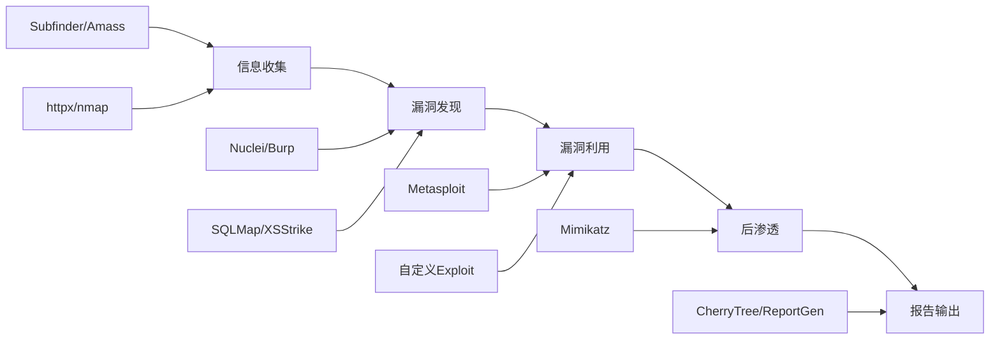

## 14.19 核心安全工具链

安全工具是渗透测试者的武器库。但工具本身不等于能力——理解每类工具的设计哲学、适用场景和局限性，才能在实战中灵活组合、高效作战。本节构建从信息收集到漏洞验证的完整工具链，覆盖开源与商业方案，并给出可直接复用的实战工作流。

### 14.19.1 工具链全景架构

一次完整的 Web 安全评估通常遵循以下流水线，每个阶段对应一类核心工具：



工具选择的核心原则：

| 维度 | 考量 | 示例 |
|------|------|------|
| 授权范围 | 仅在授权范围内使用主动扫描工具 | 内网评估用 Nmap，外部侦察用被动 OSINT |
| 目标环境 | 生产环境避免破坏性测试 | 禁用 SQLMap 的 `--os-shell` 等高危选项 |
| 工具成熟度 | 优先选择社区活跃、维护频繁的工具 | Nuclei（GitHub 20k+ stars）优于长期未更新的工具 |
| 输出可复现 | 所有操作需可记录、可复现 | 使用 Burp 项目文件、tee 日志、script 录屏 |
| 合规性 | 遵守当地法律法规和行业规范 | 中国需遵守《网络安全法》《数据安全法》 |

### 14.19.2 代理与流量拦截工具

代理工具是 Web 安全测试的基石——所有 HTTP/S 流量经过代理后，测试者才能检查、修改、重放请求。

#### Burp Suite

Burp Suite 是业界标准的 Web 安全测试平台，由 PortSwigger 开发。

**版本对比：**

| 特性 | Community（免费） | Professional（付费） |
|------|-------------------|---------------------|
| 代理拦截 | ✅ | ✅ |
| Repeater | ✅ | ✅ |
| Intruder | 限速（慢） | 高速并发 |
| Scanner | ❌ | 自动化扫描 |
| Collaborator | ❌ | 带外检测（SSRF/OOB） |
| 插件生态 | 基础 | 完整 BApp Store |
| 项目保存 | ❌ | 完整项目文件 |

**核心工作流：**

```text
1. 配置浏览器代理 → 127.0.0.1:8080
2. Target → 爬取目标站点结构
3. Proxy → HTTP History 中筛选感兴趣请求
4. Repeater → 手动修改请求参数，观察响应差异
5. Intruder → 对参数进行自动化 Fuzzing
6. Scanner → 自动发现漏洞（Pro 版）
```

**Burp Suite 高效使用技巧：**

```bash
# 启动 Burp 并指定项目文件（Pro 版）
java -jar burpsuite_pro.jar --project-file=assessment.burp

# 命令行模式启动（CI/CD 集成）
java -jar burpsuite_pro.jar --project-file=scan.burp --config-file=scan-config.json --unpause-spider-and-scanner
```

**关键配置优化：**

- **匹配替换（Match and Replace）**：自动修改请求/响应中的特定内容，例如替换 User-Agent、移除安全头部用于绕过测试
- **宏（Macros）**：自动化处理认证流程——登录 → 获取 Token → 注入到后续请求
- **作用域（Scope）**：严格限定扫描范围，避免误扫非授权目标
- **上游代理（Upstream Proxy）**：企业环境中通过公司代理出网

#### OWASP ZAP

ZAP（Zed Attack Proxy）是 OWASP 维护的免费开源 Web 安全扫描器，适合预算有限的团队。

```bash
# 安装（Docker 方式，推荐）
docker pull ghcr.io/zaproxy/zaproxy:stable

# 快速扫描
docker run -t ghcr.io/zaproxy/zaproxy:stable zap-full-scan.py \
    -t https://target.example.com \
    -r report.html

# API 扫描（OpenAPI/Swagger）
docker run -t ghcr.io/zaproxy/zaproxy:stable zap-api-scan.py \
    -t https://target.example.com/openapi.json \
    -f openapi \
    -r api-report.html

# 命令行主动扫描
docker run -t ghcr.io/zaproxy/zaproxy:stable zap-active-scan.py \
    -t https://target.example.com \
    -r active-report.html
```

**ZAP vs Burp Suite 选型：**

| 维度 | ZAP | Burp Suite Pro |
|------|-----|---------------|
| 价格 | 免费开源 | ~$449/年 |
| 自动化扫描 | 良好 | 优秀 |
| 手动测试 | 基础 | 极强 |
| CI/CD 集成 | 原生支持（Docker/CLI） | 需要额外配置 |
| 插件生态 | 中等 | 丰富（BApp Store） |
| 学习曲线 | 平缓 | 中等 |
| 适用场景 | 自动化流水线、入门学习 | 专业渗透测试 |

#### mitmproxy

mitmproxy 是 Python 编写的交互式 HTTPS 代理，特别适合脚本化和自动化场景。

```bash
# 安装
pip install mitmproxy

# 交互式终端界面
mitmproxy --listen-port 8080

# Web 界面
mitmweb --listen-port 8080

# 命令行转储模式（适合脚本）
mitmdump --listen-port 8080 -w traffic.flow

# 回放已录制流量
mitmdump -r traffic.flow
```

**脚本化拦截示例：**

```python
# intercept_auth.py - 自动注入认证头
from mitmproxy import http

def request(flow: http.HTTPFlow) -> None:
    if "api.target.com" in flow.request.pretty_host:
        flow.request.headers["Authorization"] = "Bearer eyJhbGciOi..."
        # 移除可能的安全头以测试降级
        flow.request.headers.pop("X-CSRF-Token", None)

def response(flow: http.HTTPFlow) -> None:
    # 记录所有包含错误信息的响应
    if flow.response and b"error" in flow.response.content:
        print(f"[!] Error in {flow.request.pretty_url}: "
              f"{flow.response.content[:200]}")
```

```bash
# 使用脚本启动
mitmdump -s intercept_auth.py --listen-port 8080
```

#### Charles Proxy 与 Fiddler

| 工具 | 平台 | 特点 | 适用场景 |
|------|------|------|---------|
| Charles | 跨平台（Java） | 界面友好，SSL 代理简单 | 移动 App 测试 |
| Fiddler | Windows/.NET | 强大的规则系统，FiddlerScript | Windows 环境 Web 测试 |
| Fiddler Everywhere | 跨平台 | 新版跨平台 Fiddler | 替代传统 Fiddler |

### 14.19.3 漏洞扫描与检测工具

#### Nuclei — 模板化漏洞扫描

Nuclei 是 ProjectDiscovery 开发的基于模板的漏洞扫描器，已成为安全社区的标配工具。其核心设计思想是将漏洞检测逻辑模板化，实现可复用、可共享的检测规则。

```bash
# 安装
go install -v github.com/projectdiscovery/nuclei/v3/cmd/nuclei@latest
# 或者
docker pull projectdiscovery/nuclei:latest

# 更新模板库
nuclei -update-templates

# 基础扫描
nuclei -u https://target.example.com -t cves/

# 批量扫描（从文件读取目标）
nuclei -l urls.txt -t cves/ -o results.txt

# 指定严重级别
nuclei -u https://target.example.com -t cves/ -severity critical,high

# 使用特定标签
nuclei -u https://target.example.com -tags cve,rce,sqli

# 并发控制（避免 WAF 封锁）
nuclei -u https://target.example.com -t cves/ -c 10 -rl 50

# 代理配置
nuclei -u https://target.example.com -proxy http://127.0.0.1:8080

# 输出 JSON 格式（便于程序处理）
nuclei -u https://target.example.com -t cves/ -json -o results.json
```

**Nuclei 模板编写：**

```yaml
id: example-sqli-detection
info:
  name: SQL Injection Detection - Error Based
  author: security-team
  severity: high
  description: 检测基于错误的 SQL 注入漏洞
  tags: sqli,detect,error-based

requests:
  - method: GET
    path:
      - "{{BaseURL}}/search?q=1'"
      - "{{BaseURL}}/search?q=1 OR 1=1--"
      - "{{BaseURL}}/search?q=1' AND '1'='1"

    matchers-condition: and
    matchers:
      - type: word
        words:
          - "SQL syntax"
          - "mysql_fetch"
          - "ORA-01756"
          - "PostgreSQL"
        condition: or

      - type: status
        status:
          - 200

    extractors:
      - type: regex
        regex:
          - "at line [0-9]+"
```

**Nuclei 工作流组合（侦察→扫描流水线）：**

```bash
# 完整流水线：子域名发现 → 存活探测 → 漏洞扫描
subfinder -d target.com -silent | \
  httpx -silent -status-code -title | \
  tee alive_urls.txt | \
  awk '{print $1}' | \
  nuclei -t cves/ -severity critical,high,medium -o findings.txt
```

#### SQLMap — SQL 注入自动化

SQLMap 是最成熟的 SQL 注入检测与利用工具，支持几乎所有数据库后端。

```bash
# 基础检测
sqlmap -u "https://target.com/page?id=1" --batch

# 从 Burp 请求文件测试
sqlmap -r request.txt --batch

# 指定参数和方法
sqlmap -u "https://target.com/login" --data="user=admin&pass=test" \
    --method=POST -p user

# 技术指定（提升速度）
sqlmap -u "https://target.com/page?id=1" --technique=BEU \
    --level=3 --risk=2

# 枚举数据库
sqlmap -u "https://target.com/page?id=1" --dbs
sqlmap -u "https://target.com/page?id=1" -D mydb --tables
sqlmap -u "https://target.com/page?id=1" -D mydb -T users --dump

# 绕过 WAF（tamper 脚本）
sqlmap -u "https://target.com/page?id=1" \
    --tamper=space2comment,between,randomcase \
    --random-agent

# 联合查询优化
sqlmap -u "https://target.com/page?id=1" --union-cols=5-10 \
    --union-char=NULL --technique=U

# OS Shell（需 DBA 权限，慎用）
sqlmap -u "https://target.com/page?id=1" --os-shell
```

**SQLMap Tamper 脚本速查：**

| Tamper 脚本 | 作用 | 适用 WAF |
|-------------|------|---------|
| `space2comment` | 空格替换为 `/**/` | 通用 |
| `between` | `>` 替换为 `NOT BETWEEN 0 AND` | 通用 |
| `randomcase` | 随机大小写 | 关键字过滤 |
| `charencode` | URL 编码 | 简单过滤 |
| `greatest` | `>` 替换为 `GREATEST()` | MySQL |
| `apostrophemask` | 单引号 UTF-8 编码 | 字符过滤 |
| `halfversionedmorekeywords` | MySQL 版本注释 | MySQL 专用 |

#### Nikto — Web 服务器扫描

```bash
# 基础扫描
nikto -h https://target.example.com

# 指定端口
nikto -h target.example.com -p 8080,8443

# 使用代理
nikto -h target.example.com -useproxy http://127.0.0.1:8080

# 输出报告
nikto -h target.example.com -o report.html -Format html

# 调整速度（避免检测）
nikto -h target.example.com -Pause 2 -maxtime 3600
```

#### XSStrike — XSS 检测

```bash
# 克隆安装
git clone https://github.com/s0md3v/XSStrike
cd XSStrike && pip install -r requirements.txt

# 扫描目标
python xsstrike.py -u "https://target.com/search?q=test"

# 从文件批量扫描
python xsstrike.py --file urls.txt --level 3

# POST 请求测试
python xsstrike.py -u "https://target.com/comment" \
    --data="content=test&name=user" -p content
```

### 14.19.4 信息收集与侦察工具

信息收集是渗透测试的第一步，目标是尽可能多地了解目标系统的攻击面。

#### 子域名发现

```bash
# Subfinder - 被动子域名枚举
subfinder -d target.com -silent -o subdomains.txt

# Amass - 综合子域名枚举（OWASP 项目）
amass enum -passive -d target.com -o amass_results.txt
amass enum -active -d target.com -brute -o amass_active.txt

# 子域名爆破
gobuster dns -d target.com -w /usr/share/wordlists/subdomains.txt \
    -t 50

# 证书透明度日志查询
curl -s "https://crt.sh/?q=%25.target.com&output=json" | \
    jq -r '.[].name_value' | sort -u
```

#### 存活探测与服务识别

```bash
# httpx - 批量 HTTP 探测
cat subdomains.txt | httpx -silent -status-code -title \
    -tech-detect -o alive.txt

# Nmap - 端口扫描与服务识别
nmap -sV -sC -O target.com -oX scan.xml
nmap -sU --top-ports 100 target.com  # UDP 扫描
nmap -p 1-65535 -T4 target.com       # 全端口快速扫描

# Masscan - 超高速端口扫描
masscan 10.0.0.0/8 -p 80,443,8080,8443 --rate 10000 -oJ results.json
```

#### Web 技术识别

```bash
# Wappalyzer CLI
npm install -g wappalyzer
wappalyzer https://target.example.com

# whatweb
whatweb https://target.example.com --color=never

# httpx 内置技术检测
echo "https://target.example.com" | httpx -tech-detect
```

#### OSINT（开源情报）

```bash
# theHarvester - 邮箱/子域名/IP 收集
theHarvester -d target.com -b google,bing,linkedin -l 200

# Shodan CLI
shodan search "org:Target ssl.cert.subject.CN:target.com"

# Google Dork 常用语法
# site:target.com filetype:sql
# site:target.com intitle:"index of"
# site:target.com ext:php inurl:admin
# site:target.com inurl:login | inurl:signin
# site:target.com "password" | "credential" filetype:pdf
```

### 14.19.5 静态应用安全测试（SAST）

SAST 工具在不运行代码的情况下分析源码，发现潜在安全漏洞。适合在 CI/CD 流水线中集成，实现"左移"安全。

#### 工具对比

| 工具 | 语言支持 | 特点 | 集成方式 |
|------|---------|------|---------|
| SonarQube | 30+ 语言 | 综合代码质量 + 安全 | CI/CD 插件、Web API |
| Semgrep | 20+ 语言 | 语义化模式匹配、规则灵活 | CLI、CI/CD、PR 检查 |
| Bandit | Python | Python 专用安全分析 | CLI、pre-commit |
| ESLint Security | JavaScript/TS | 安全相关 lint 规则 | ESLint 插件 |
| FindSecBugs | Java | SpotBugs 安全插件 | IDE、Maven/Gradle |
| Brakeman | Ruby | Rails 专用安全扫描 | CLI |

#### Semgrep — 语义化代码扫描

Semgrep 的核心优势是用类似源码的语法编写规则，而非正则表达式，大幅降低误报率。

```bash
# 安装
pip install semgrep

# 使用社区规则集扫描
semgrep --config=p/owasp-top-ten src/
semgrep --config=p/security-audit src/
semgrep --config=p/python src/

# 多规则组合
semgrep --config=p/owasp-top-ten --config=p/secrets src/

# CI/CD 模式（有漏洞时非零退出）
semgrep --config=p/security-audit --error --severity ERROR src/

# 自定义规则扫描
semgrep --config=rules/custom.yaml src/
```

**Semgrep 自定义规则示例：**

```yaml
# rules/sql-injection.yaml
rules:
  - id: python-sql-injection
    patterns:
      - pattern: |
          $CURSOR.execute("..." + $VAR + "...")
      - pattern-not: |
          $CURSOR.execute("..." + "..." + "...")
    message: 检测到潜在的 SQL 注入——使用参数化查询替代字符串拼接
    languages: [python]
    severity: ERROR
    metadata:
      cwe:
        - "CWE-89: Improper Neutralization of Special Elements used in an SQL Command"
      owasp:
        - A03:2021 - Injection

  - id: hardcoded-password
    patterns:
      - pattern: |
          $VAR = "..."
      - metavariable-regex:
          metavariable: $VAR
          regex: (?i)(password|passwd|secret|api_key|token)
    message: 检测到硬编码凭据
    languages: [python, javascript]
    severity: WARNING
```

#### Bandit — Python 安全分析

```bash
# 安装
pip install bandit

# 扫描项目
bandit -r src/ -f json -o bandit-report.json

# 指定严重级别
bandit -r src/ -ll  # 仅显示中等及以上

# 跳过特定检查
bandit -r src/ -s B101  # 跳过 assert 检查

# 常见发现
# B101: assert 语句（生产代码不应使用）
# B105: 硬编码密码
# B106: 硬编码密码（函数参数）
# B108: 临时文件不安全路径
# B110: try-except-pass（静默吞异常）
# B301/B302: pickle/marshal 反序列化
# B303: 不安全的哈希算法（MD5/SHA1）
# B602: subprocess 使用 shell=True
```

### 14.19.6 动态应用安全测试（DAST）

DAST 工具从外部对运行中的应用进行黑盒测试，无需源码访问。

#### Nuclei（进阶用法）

```bash
# 使用自定义模板目录
nuclei -u https://target.com -t custom-templates/ -t cves/

# 模板工作流——链式执行
nuclei -u https://target.com -w workflows/login-bypass.yaml

# 标记已知误报（排除列表）
nuclei -u https://target.com -t cves/ -exclude-templates known-fp.yaml

# 模糊测试模式
nuclei -u https://target.com -t fuzzing/ -dast

# 配合 httpx 过滤技术栈后针对性扫描
echo "https://target.com" | httpx -tech-detect | grep "WordPress" | \
    nuclei -t technologies/wordpress/ -t cves/wordpress/
```

#### ZAP 自动化框架

ZAP 提供 Automation Framework，用 YAML 配置文件定义扫描流程：

```yaml
# zap-automation.yaml
env:
  contexts:
    - name: "Target Application"
      urls:
        - "https://target.example.com"
      includePaths:
        - "https://target.example.com.*"
      excludePaths:
        - ".*logout.*"
      authentication:
        method: "form"
        parameters:
          loginUrl: "https://target.example.com/login"
          loginRequestData: "username=&password="
        verification:
          method: "response"
          loggedInRegex: "\\QWelcome\\E"

jobs:
  - type: spider
    parameters:
      context: "Target Application"
      maxDuration: 10

  - type: activeScan
    parameters:
      context: "Target Application"
      maxRuleDurationInMins: 5
      maxScanDurationInMins: 30

  - type: report
    parameters:
      template: "traditional-html"
      reportFile: "zap-report.html"
```

```bash
# 运行自动化扫描
docker run -v $(pwd):/zap/wrk/:rw -t ghcr.io/zaproxy/zaproxy:stable \
    zap-full-scan.py -t https://target.example.com \
    -c zap-automation.yaml
```

### 14.19.7 Fuzzing 工具

Fuzzing 是通过向目标发送大量变异输入来发现漏洞的技术。

#### ffuf — Web Fuzzer

```bash
# 安装
go install github.com/ffuf/ffuf/v2@latest

# 目录爆破
ffuf -u https://target.com/FUZZ -w /usr/share/wordlists/dirb/common.txt \
    -mc 200,301,302,403

# 子域名爆破
ffuf -u https://FUZZ.target.com -w subdomains.txt -mc 200

# 参数 Fuzzing
ffuf -u "https://target.com/search?q=FUZZ" -w params.txt \
    -mc 200 -fs 0

# POST 数据 Fuzzing
ffuf -u https://target.com/login \
    -X POST -d "user=admin&pass=FUZZ" -w passwords.txt \
    -mc 302 -H "Content-Type: application/x-www-form-urlencoded"

# 多位置 Fuzzing
ffuf -u "https://FUZZ.target.com/FUZZ" -w subdomains.txt:FUZZ \
    -w paths.txt:FUZZ -mc 200

# 过滤响应大小（去除误报）
ffuf -u https://target.com/FUZZ -w wordlist.txt -fs 4242

# 速率控制
ffuf -u https://target.com/FUZZ -w wordlist.txt -rate 100
```

#### wfuzz — 另一款经典 Fuzzer

```bash
# 安装
pip install wfuzz

# 目录爆破
wfuzz -c -z file,/usr/share/wordlists/dirb/common.txt \
    --hc 404 https://target.com/FUZZ

# 参数爆破
wfuzz -c -z file,params.txt --hc 404 \
    "https://target.com/?FUZZ=test"

# 多载荷组合
wfuzz -c -z file,users.txt -z file,passwords.txt \
    --hc 401 "https://target.com/login?user=FUZZ&pass=FUZ2Z"
```

### 14.19.8 密码与认证攻击工具

#### Hashcat — 离线密码破解

```bash
# 基础语法：hashcat -m <hash类型> <hash文件> <字典>
# 常见 hash 类型：0=MD5, 100=SHA1, 1000=NTLM, 3200=bcrypt

# MD5 破解
hashcat -m 0 hashes.txt rockyou.txt

# SHA256 破解
hashcat -m 1400 hashes.txt rockyou.txt

# NTLM 破解
hashcat -m 1000 ntlm_hashes.txt rockyou.txt

# 规则攻击（变形字典）
hashcat -m 0 hashes.txt rockyou.txt -r rules/best64.rule

# 掩码攻击（暴力破解）
hashcat -m 0 hashes.txt -a 3 ?a?a?a?a?a?a  # 6位任意字符
# ?l=小写 ?u=大写 ?d=数字 ?s=特殊字符 ?a=全部

# 组合攻击
hashcat -m 0 hashes.txt -a 6 wordlist.txt ?d?d?d?d

# GPU 性能优化
hashcat -m 0 hashes.txt rockyou.txt -d 1,2 -w 3
```

#### John the Ripper

```bash
# 基础破解
john --wordlist=rockyou.txt hashes.txt

# 指定格式
john --format=raw-md5 --wordlist=rockyou.txt hashes.txt

# 显示已破解密码
john --show hashes.txt

# 增量模式（暴力破解）
john --incremental hashes.txt
```

#### Hydra — 在线密码爆破

```bash
# SSH 爆破
hydra -l admin -P passwords.txt ssh://target.com

# HTTP POST 表单爆破
hydra -l admin -P passwords.txt target.com http-post-form \
    "/login:user=^USER^&pass=^PASS^:Invalid credentials"

# HTTP Basic Auth
hydra -l admin -P passwords.txt target.com http-get /admin

# 速率控制
hydra -l admin -P passwords.txt -t 4 -W 3 ssh://target.com

# 从文件加载用户名
hydra -L users.txt -P passwords.txt ftp://target.com
```

### 14.19.9 安全编码与依赖审计工具

#### 依赖漏洞扫描

```bash
# npm audit (Node.js)
npm audit
npm audit fix

# pip-audit (Python)
pip install pip-audit
pip-audit
pip-audit -r requirements.txt

# retire.js (JavaScript 前端库)
npm install -g retire
retire --path ./public/js/

# OWASP Dependency-Check (Java/多语言)
dependency-check --project MyApp --scan ./lib --format HTML

# Trivy (容器 + 依赖)
trivy fs --security-checks vuln .
trivy image myapp:latest
```

#### 密钥泄露检测

```bash
# truffleHog - Git 历史密钥扫描
trufflehog git https://github.com/org/repo.git

# gitleaks - Git 密钥扫描
gitleaks detect --source . --report-format json --report-path gitleaks.json
gitleaks git https://github.com/org/repo.git

# detect-secrets (Yelp)
pip install detect-secrets
detect-secrets scan > .secrets.baseline
detect-secrets audit .secrets.baseline

# Git hooks 预防
# .pre-commit-config.yaml
repos:
  - repo: https://github.com/Yelp/detect-secrets
    rev: v1.4.0
    hooks:
      - id: detect-secrets
        args: ['--baseline', '.secrets.baseline']
  - repo: https://github.com/gitleaks/gitleaks
    rev: v8.18.0
    hooks:
      - id: gitleaks
```

### 14.19.10 容器与云安全工具

```bash
# Trivy - 容器镜像漏洞扫描
trivy image nginx:latest
trivy image --severity HIGH,CRITICAL myapp:v1.0

# Scout - Docker 镜像扫描
docker scout cves myapp:latest

# Checkov - 基础设施即代码（IaC）安全
pip install checkov
checkov -d ./terraform/
checkov -d ./kubernetes/
checkov -f docker-compose.yaml

# kube-bench - Kubernetes CIS 基准
kubectl apply -f https://raw.githubusercontent.com/aquasecurity/kube-bench/main/job.yaml
kubectl logs -l app=kube-bench

# kube-hunter - Kubernetes 渗透测试
docker run --rm -it aquasec/kube-hunter --remote 10.0.0.0/24
```

### 14.19.11 实战工具链组合

#### 自动化侦察流水线

将多个工具串联为自动化流水线，是现代渗透测试的核心工作方式：

```bash
#!/bin/bash
# recon-pipeline.sh - 自动化侦察脚本
TARGET=$1
OUTPUT_DIR="recon_${TARGET}_$(date +%Y%m%d)"
mkdir -p "$OUTPUT_DIR"

echo "[*] Phase 1: 子域名发现"
subfinder -d "$TARGET" -silent | tee "$OUTPUT_DIR/subdomains.txt"
amass enum -passive -d "$TARGET" >> "$OUTPUT_DIR/subdomains.txt"
sort -u "$OUTPUT_DIR/subdomains.txt" -o "$OUTPUT_DIR/subdomains.txt"
echo "[+] 发现 $(wc -l < "$OUTPUT_DIR/subdomains.txt") 个子域名"

echo "[*] Phase 2: 存活探测"
cat "$OUTPUT_DIR/subdomains.txt" | httpx -silent -status-code \
    -title -tech-detect | tee "$OUTPUT_DIR/alive.txt"
echo "[+] $(wc -l < "$OUTPUT_DIR/alive.txt") 个存活目标"

echo "[*] Phase 3: 端口扫描"
awk '{print $1}' "$OUTPUT_DIR/alive.txt" | \
    sed 's|https\?://||' | sort -u | \
    nmap -iL - -sV --top-ports 1000 -oX "$OUTPUT_DIR/nmap.xml"

echo "[*] Phase 4: 漏洞扫描"
awk '{print $1}' "$OUTPUT_DIR/alive.txt" | \
    nuclei -t cves/ -severity critical,high -o "$OUTPUT_DIR/nuclei.txt"

echo "[*] Phase 5: 目录爆破"
awk '{print $1}' "$OUTPUT_DIR/alive.txt" | \
    ffuf -w /usr/share/wordlists/dirb/common.txt -mc 200,301,302,403 \
    -o "$OUTPUT_DIR/ffuf.json" -of json

echo "[+] 侦察完成，结果保存在 $OUTPUT_DIR/"
```

#### CI/CD 安全集成

```yaml
# .github/workflows/security-scan.yaml
name: Security Pipeline
on: [push, pull_request]

jobs:
  sast:
    runs-on: ubuntu-latest
    steps:
      - uses: actions/checkout@v4
      - name: Semgrep SAST
        uses: returntocorp/semgrep-action@v1
        with:
          config: >-
            p/owasp-top-ten
            p/security-audit
      - name: Bandit (Python)
        run: |
          pip install bandit
          bandit -r src/ -f json -o bandit.json || true
      - name: Dependency Check
        run: |
          pip install pip-audit
          pip-audit -r requirements.txt
      - name: Secret Detection
        uses: gitleaks/gitleaks-action@v2

  dast:
    runs-on: ubuntu-latest
    needs: sast
    steps:
      - name: ZAP Scan
        uses: zaproxy/action-full-scan@v0.7.0
        with:
          target: 'https://staging.target.com'
```

### 14.19.12 工具链选型决策矩阵

根据项目规模和团队能力，选择合适的工具组合：

| 场景 | 推荐工具链 | 预算 | 技能要求 |
|------|-----------|------|---------|
| 个人学习 | ZAP + Nuclei + SQLMap + ffuf | 免费 | 入门 |
| 小团队安全审计 | Burp Community + Semgrep + Nuclei + trivy | 免费 | 中级 |
| 专业渗透测试 | Burp Pro + Nuclei + SQLMap + Hashcat + ffuf | 中等 | 高级 |
| 企业 DevSecOps | SonarQube + Trivy + ZAP Automation + Semgrep + Gitleaks | 中等 | 中级 |
| 红队作战 | Burp Pro + Cobalt Strike + Nuclei + Custom Tools | 高 | 专家 |

### 14.19.13 常见误区与最佳实践

**误区一：工具越多越好**

堆砌工具不如精通核心工具。实际工作中，80% 的发现来自 3-5 个核心工具。新手应该先精通 Burp Suite + Nuclei + SQLMap，再逐步扩展。

**误区二：自动化扫描等于渗透测试**

自动化工具只能发现已知模式的漏洞。逻辑漏洞（如越权访问、业务流程绕过）需要人工分析。工具是辅助，不是替代。

**误区三：只关注高危漏洞**

信息泄露、版本暴露、不当配置等"低危"发现，往往是攻击链的起点。信息收集阶段的每个发现都值得记录。

**误区四：忽略工具自身的安全风险**

- 从官方仓库下载工具，验证校验和
- 不要在生产环境中运行未经验证的第三方工具
- Burp/ZAP 代理会解密 HTTPS 流量——确保测试环境隔离
- SQLMap 等工具会修改数据库——只在授权范围内使用

**最佳实践：**

1. **建立工具更新机制**：定期更新工具和模板库，Nuclei 模板每天都有新规则
2. **日志记录**：所有操作必须有日志，便于报告撰写和事后审计
3. **环境隔离**：测试工具运行在独立的虚拟机或容器中，避免污染工作环境
4. **模板积累**：将常用的 Nuclei 模板、Semgrep 规则积累为团队知识库
5. **输出标准化**：统一报告格式，便于跨工具结果汇总

### 14.19.14 进阶：工具链自动化与编排

当工具链规模增大后，手动执行各工具变得低效。以下是几种常见的自动化编排方案：

**方案一：Shell 脚本编排（轻量级）**

适合小团队和一次性任务，如 14.19.11 中的侦察脚本。

**方案二：Python 编排（中等复杂度）**

```python
#!/usr/bin/env python3
"""pipeline.py - 安全扫描流水线编排"""
import subprocess
import json
import sys
from pathlib import Path
from concurrent.futures import ThreadPoolExecutor

def run_cmd(cmd: str, capture=True) -> str:
    """执行命令并返回输出"""
    result = subprocess.run(cmd, shell=True, capture_output=capture, text=True)
    if result.returncode not in (0, 1):  # nuclei 返回 1 表示发现漏洞
        print(f"[!] Command failed: {cmd}", file=sys.stderr)
    return result.stdout

def subdomain_enum(domain: str) -> list[str]:
    """子域名枚举"""
    output = run_cmd(f"subfinder -d {domain} -silent")
    subs = list(set(output.strip().split('\n')))
    print(f"[+] 发现 {len(subs)} 个子域名")
    return subs

def alive_check(subdomains: list[str]) -> list[str]:
    """存活探测"""
    input_data = '\n'.join(subdomains)
    output = run_cmd(f"echo '{input_data}' | httpx -silent")
    alive = [u for u in output.strip().split('\n') if u]
    print(f"[+] {len(alive)} 个存活目标")
    return alive

def nuclei_scan(urls: list[str], severity="critical,high") -> list[dict]:
    """漏洞扫描"""
    input_data = '\n'.join(urls)
    output = run_cmd(
        f"echo '{input_data}' | nuclei -t cves/ -severity {severity} -json",
        capture=True
    )
    findings = []
    for line in output.strip().split('\n'):
        if line:
            try:
                findings.append(json.loads(line))
            except json.JSONDecodeError:
                pass
    print(f"[+] 发现 {len(findings)} 个漏洞")
    return findings

if __name__ == "__main__":
    target = sys.argv[1]
    subs = subdomain_enum(target)
    alive = alive_check(subs)
    findings = nuclei_scan(alive)
    
    # 输出报告
    report_path = Path(f"report_{target}.json")
    report_path.write_text(json.dumps(findings, indent=2, ensure_ascii=False))
    print(f"[+] 报告已保存: {report_path}")
```

**方案三：ProjectDiscovery 的 pdtm 生态**

ProjectDiscovery 提供了一整套工具链及其管理器：

```bash
# 安装 ProjectDiscovery 工具管理器
go install -v github.com/projectdiscovery/pdtm/cmd/pdtm@latest

# 安装全套工具
pdtm -i subfinder,httpx,nuclei,katana,notify

# 工具组合：发现→爬取→扫描→通知
subfinder -d target.com -silent | \
  httpx -silent | \
  katana -d 3 | \
  nuclei -t cves/ | \
  notify -id slack
```

### 14.19.15 工具安装速查表

```bash
# Go 工具（需要 Go 环境）
go install github.com/projectdiscovery/nuclei/v3/cmd/nuclei@latest
go install github.com/projectdiscovery/subfinder/v2/cmd/subfinder@latest
go install github.com/projectdiscovery/httpx/cmd/httpx@latest
go install github.com/ffuf/ffuf/v2@latest

# Python 工具
pip install mitmproxy semgrep bandit sqlmap wfuzz trufflehog detect-secrets

# 系统包管理
apt install nmap nikto hydra john hashcat

# Docker（推荐方式，避免环境依赖）
docker pull ghcr.io/zaproxy/zaproxy:stable
docker pull projectdiscovery/nuclei:latest
docker pull aquasec/trivy
```
