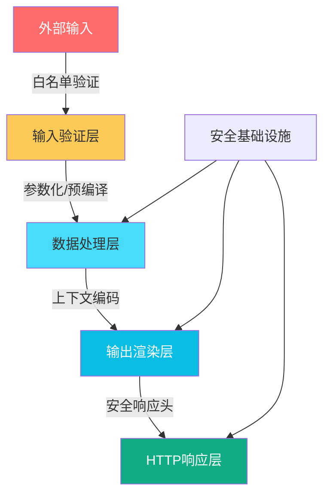
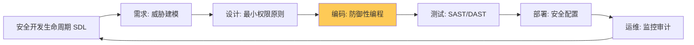

## 14.20 防御编码核心技巧

安全防御不是"加一层WAF"就能解决的问题。真正的防御编码要求开发者在每一行代码中贯彻安全思维——从数据输入到业务处理到输出渲染，每个环节都有对应的攻击面，也都有对应的防御手段。本节系统性地覆盖Web应用中最关键的防御编码技术，与前面的攻击测试章节形成攻防对照。

### 14.20.1 防御编码总览

防御编码的核心理念可以用一句话概括：**不信任任何外部输入，在边界处验证，在上下文中编码，在失败时安全降级**。



| 防御层次 | 核心原则 | 对应攻击类型 |
|----------|----------|-------------|
| 输入验证 | 白名单优于黑名单 | 所有注入类攻击 |
| 参数化查询 | 代码与数据分离 | SQL/NoSQL注入 |
| 输出编码 | 按上下文选择编码 | XSS、HTML注入 |
| 访问控制 | 默认拒绝，显式授权 | 越权、IDOR |
| 会话管理 | 最小权限、及时过期 | 会话劫持、固定 |
| 加密存储 | 强算法、正确使用 | 数据泄露 |
| 安全响应头 | 纵深防御 | 点击劫持、MIME嗅探 |
| 错误处理 | 信息不泄露 | 信息收集 |
| 日志审计 | 可追溯、防篡改 | 事后分析 |

### 14.20.2 SQL注入防御：参数化查询与ORM

SQL注入常年位居OWASP Top 10，其根本原因是**代码与数据的边界模糊**。防御的核心原则是：永远不要将用户输入直接拼接到SQL语句中。

#### 14.20.2.1 参数化查询（PreparedStatement）

参数化查询是防御SQL注入的第一道也是最重要的一道防线。数据库驱动会将SQL模板和参数分开发送，确保参数永远被当作数据而非代码执行。

**Python（原生驱动）：**

```python
import psycopg2
import sqlite3

# ===== 错误写法：字符串拼接 =====
def unsafe_query(user_id):
    # f-string拼接 —— 直接注入点
    query = f"SELECT * FROM users WHERE id = {user_id}"
    cursor.execute(query)
    
    # format拼接 —— 同样危险
    query = "SELECT * FROM users WHERE name = '{}'".format(name)
    cursor.execute(query)
    
    # % 拼接 —— 同样危险
    query = "SELECT * FROM users WHERE name = '%s'" % name
    cursor.execute(query)

# ===== 正确写法：参数化查询 =====
def safe_query(cursor, user_id):
    # 使用占位符 + 参数元组
    query = "SELECT * FROM users WHERE id = %s"
    cursor.execute(query, (user_id,))

def safe_insert(cursor, username, email):
    query = "INSERT INTO users (username, email) VALUES (%s, %s)"
    cursor.execute(query, (username, email))

# SQLite 使用 ? 作为占位符
def sqlite_safe(cursor, user_id):
    query = "SELECT * FROM users WHERE id = ?"
    cursor.execute(query, (user_id,))

# PostgreSQL 使用 %s 作为占位符（psycopg2）
# MySQL 使用 %s 作为占位符（pymysql/mysql-connector）
# Oracle 使用 :name 作为命名占位符
```

**Java（JDBC PreparedStatement）：**

```java
// ===== 错误写法 =====
String unsafe = "SELECT * FROM users WHERE id = " + userId;
Statement stmt = conn.createStatement();
ResultSet rs = stmt.executeQuery(unsafe);

// ===== 正确写法 =====
String safe = "SELECT * FROM users WHERE id = ?";
PreparedStatement pstmt = conn.prepareStatement(safe);
pstmt.setInt(1, userId);
ResultSet rs = pstmt.executeQuery();

// 批量操作同样使用参数化
String insert = "INSERT INTO users (name, email) VALUES (?, ?)";
PreparedStatement insertStmt = conn.prepareStatement(insert);
for (User user : userList) {
    insertStmt.setString(1, user.getName());
    insertStmt.setString(2, user.getEmail());
    insertStmt.addBatch();
}
insertStmt.executeBatch();
```

**Node.js（各类驱动）：**

```javascript
// mysql2
const [rows] = await pool.execute(
  'SELECT * FROM users WHERE id = ? AND status = ?',
  [userId, 'active']
);

// pg (node-postgres)
const { rows } = await pool.query(
  'SELECT * FROM users WHERE id = $1 AND status = $2',
  [userId, 'active']
);

// 错误写法
const unsafe = `SELECT * FROM users WHERE id = ${userId}`;  // 绝对禁止
```

**PHP（PDO）：**

```php
// ===== 错误写法 =====
$unsafe = "SELECT * FROM users WHERE id = " . $_GET['id'];
$result = $conn->query($unsafe);

// ===== 正确写法：预处理语句 =====
$stmt = $pdo->prepare('SELECT * FROM users WHERE id = :id');
$stmt->execute(['id' => $userId]);
$user = $stmt->fetch();

// 位置占位符
$stmt = $pdo->prepare('SELECT * FROM users WHERE id = ? AND status = ?');
$stmt->execute([$userId, 'active']);
```

#### 14.20.2.2 ORM层防御

现代ORM框架默认使用参数化查询，但提供了"逃生舱口"（raw query），使用不当仍然会导致注入。

```python
# Django ORM —— 默认安全
from django.db.models import Q

# 安全：ORM自动生成参数化查询
users = User.objects.filter(id=user_id, is_active=True)
users = User.objects.filter(
    Q(username__icontains=search_term) | Q(email__icontains=search_term)
)

# 危险：extra() 和 raw() 需要手动参数化
User.objects.raw('SELECT * FROM users WHERE id = %s', [user_id])  # 安全
User.objects.raw(f'SELECT * FROM users WHERE id = {user_id}')     # 危险

# SQLAlchemy —— 使用 text() 和 bindparam
from sqlalchemy import text

# 安全
result = session.execute(
    text("SELECT * FROM users WHERE id = :id"),
    {"id": user_id}
)

# 危险：直接拼接
result = session.execute(
    text(f"SELECT * FROM users WHERE id = {user_id}")
)
```

**ORM注入陷阱清单：**

| 陷阱 | 说明 | 修复 |
|------|------|------|
| `raw()` / `extra()` | Django中执行原生SQL | 始终使用参数化 |
| `text()` 直接拼接 | SQLAlchemy的text不自动转义 | 用 `:param` 绑定 |
| `filter(**kwargs)` 动态字典 | 字典key可控时可能注入字段名 | 白名单校验key |
| LIKE子句未转义 | `%` 和 `_` 是通配符 | 手动转义 `%` → `\%` |
| ORDER BY注入 | ORDER BY不能参数化 | 白名单列名 |
| 表名/列名动态拼接 | 参数化不适用于标识符 | 白名单验证 |

```python
# LIKE 子句安全处理
def safe_like_search(cursor, user_input):
    # 转义通配符
    escaped = user_input.replace('%', r'\%').replace('_', r'\_')
    query = "SELECT * FROM users WHERE name LIKE %s"
    cursor.execute(query, (f'%{escaped}%',))

# ORDER BY 安全处理
ALLOWED_ORDER_FIELDS = {'name', 'created_at', 'id'}

def safe_order_by(field, direction='ASC'):
    if field not in ALLOWED_ORDER_FIELDS:
        raise ValueError(f"Invalid sort field: {field}")
    if direction not in ('ASC', 'DESC'):
        raise ValueError(f"Invalid sort direction: {direction}")
    # 白名单验证后安全拼接（标识符不能参数化）
    return f"ORDER BY {field} {direction}"
```

### 14.20.3 NoSQL注入防御

NoSQL数据库（MongoDB、Redis等）虽然没有SQL语法，但同样面临注入风险，尤其是MongoDB的查询语法基于JSON/JavaScript，攻击者可以通过操纵查询逻辑实现注入。

```javascript
// ===== MongoDB注入示例 =====

// 错误写法：直接使用用户输入构造查询
app.post('/login', (req, res) => {
  const query = {
    username: req.body.username,  // 攻击者可传入 {$ne: ""}
    password: req.body.password   // 攻击者可传入 {$ne: ""}
  };
  // 查询变成 {username: {$ne: ""}, password: {$ne: ""}} —— 绕过认证
  db.collection('users').findOne(query);
});

// ===== 正确写法：类型验证 + 查询净化 =====
const { body, validationResult } = require('express-validator');

app.post('/login', 
  [
    body('username').isString().trim().notEmpty(),
    body('password').isString().trim().notEmpty(),
  ],
  async (req, res) => {
    const errors = validationResult(req);
    if (!errors.isEmpty()) {
      return res.status(400).json({ errors: errors.array() });
    }
    
    // 确保传入的是纯字符串，不是操作符对象
    const query = {
      username: String(req.body.username),
      password: String(req.body.password)
    };
    
    const user = await db.collection('users').findOne(query);
  }
);

// Mongoose天然提供类型安全
const userSchema = new mongoose.Schema({
  username: { type: String, required: true },
  password: { type: String, required: true }
});

// Mongoose会自动将 $ne 等操作符转为字符串
const user = await User.findOne({
  username: req.body.username,
  password: req.body.password
});
```

**通用NoSQL防御规则：**

1. **强制类型转换**：将所有输入转为预期类型（`String()`、`parseInt()`）
2. **禁止操作符对象**：在查询条件中不允许出现 `$gt`、`$ne`、`$regex` 等操作符
3. **使用ODM**：Mongoose等ODM提供了类型校验层
4. **输入验证**：使用 `express-validator` 或 `joi` 在路由层验证

### 14.20.4 XSS防御：输出编码与CSP

XSS（跨站脚本攻击）的本质是**在不该执行脚本的上下文中执行了脚本**。防御原则：在输出到不同上下文时，使用对应上下文的编码方式。

#### 14.20.4.1 上下文感知编码

```python
from markupsafe import escape, Markup
from urllib.parse import quote, quote_plus
import json
import html

# ===== HTML上下文 =====
# 对用户输入进行HTML实体编码
user_input = '<script>alert("xss")</script>'

# markupsafe.escape 转义 < > & " '
safe_html = escape(user_input)
# 输出: &lt;script&gt;alert(&quot;xss&quot;)&lt;/script&gt;

# 手动编码（了解原理）
def html_encode(s):
    return (s
        .replace('&', '&amp;')
        .replace('<', '&lt;')
        .replace('>', '&gt;')
        .replace('"', '&quot;')
        .replace("'", '&#x27;')
    )

# ===== JavaScript上下文 =====
# 将数据嵌入JavaScript时，使用JSON序列化
user_name = 'test"; alert("xss"); //'
safe_js = json.dumps(user_name)  # 自动转义引号和特殊字符
# 输出: "test\"; alert(\"xss\"); //"

# Jinja2模板中：{{ variable | tojson }} 可安全嵌入JS
# 绝对不要这样做：<script>var name = "{{ user_input }}";</script>
# 应该这样做：<script>var name = {{ user_input | tojson }};</script>

# ===== URL上下文 =====
user_query = 'search term & more'
safe_url = quote(user_query, safe='')
# 输出: search%20term%20%26%20more

# HTML属性中的URL
# <a href="/search?q={{ url_encoded_query }}"> —— 需要URL编码

# ===== CSS上下文 =====
# CSS中可以注入 expression() 或 url(javascript:...)
# 防御：只允许白名单字符，或使用CSS.escape()
def css_encode(s):
    # 只保留字母数字和连字符
    return ''.join(c for c in s if c.isalnum() or c in '-_')
```

**编码对照表：**

| 输出上下文 | 编码函数 | 转义内容 | 语言/库 |
|-----------|---------|---------|---------|
| HTML正文 | HTML Entity | `<>&"'` | Python: `markupsafe.escape` |
| HTML属性 | HTML Attribute | 同上 + 空格 | 同上，确保属性值在引号内 |
| JavaScript | JSON Stringify | `"'\\` 等 | `json.dumps()` |
| URL参数 | URL Encode | 非字母数字 | `urllib.parse.quote()` |
| CSS | CSS Escape | 非白名单字符 | `CSS.escape()` (JS) |
| SQL | 参数化查询 | 不适用 | 驱动的prepare/execute |
| JSON | JSON Serialize | `"\` 等 | `json.dumps()` |

#### 14.20.4.2 模板引擎自动转义

现代模板引擎默认开启自动转义，但开发者经常因为"需要显示HTML"而手动关闭，这正是XSS最常见的入口。

```python
# ===== Jinja2（Flask默认） =====
# 默认自动转义HTML —— 安全
# {{ user_input }}  → 自动转义

# 需要输出原始HTML时，必须先净化
from markupsafe import Markup
import bleach

# 错误：直接标记为安全
# {{ user_input | safe }}  → 如果user_input含恶意脚本，直接执行

# 正确：先净化再标记
def safe_html(raw_html):
    allowed_tags = ['p', 'br', 'strong', 'em', 'a', 'ul', 'ol', 'li']
    allowed_attrs = {'a': ['href', 'title']}
    cleaned = bleach.clean(raw_html, tags=allowed_tags, attributes=allowed_attrs)
    return Markup(cleaned)

# 在模板中使用
# {{ safe_html(user_content) }}

# ===== Django模板 =====
# 默认自动转义 —— {{ variable }} 安全
# 需要原始HTML时：{{ variable|safe }}  → 同样需要先净化
# mark_safe() 同理

# ===== React =====
# JSX默认转义 —— 安全
# {userInput}  → 自动转义

# 危险：dangerouslySetInnerHTML
# <div dangerouslySetInnerHTML={{__html: userInput}} />  → XSS
# 正确：先用DOMPurify净化
import DOMPurify from 'dompurify';
<div dangerouslySetInnerHTML={{__html: DOMPurify.sanitize(userInput)}} />
```

#### 14.20.4.3 内容安全策略（CSP）

CSP是防御XSS的最后一道防线——即使存在注入点，CSP也能阻止内联脚本的执行。

```nginx
# Nginx CSP配置
# 严格策略：只允许同源脚本和样式
add_header Content-Security-Policy "
    default-src 'self';
    script-src 'self';
    style-src 'self' 'unsafe-inline';
    img-src 'self' data: https:;
    font-src 'self';
    connect-src 'self' https://api.example.com;
    frame-ancestors 'none';
    base-uri 'self';
    form-action 'self';
    upgrade-insecure-requests;
" always;

# 使用nonce的策略（更灵活，每次请求生成随机nonce）
add_header Content-Security-Policy "
    default-src 'self';
    script-src 'nonce-${NONCE}';
    style-src 'nonce-${NONCE}';
" always;
```

```python
# Flask中动态生成CSP nonce
import secrets
from functools import wraps

def csp_nonce(f):
    @wraps(f)
    def decorated(*args, **kwargs):
        g.csp_nonce = secrets.token_urlsafe(16)
        response = f(*args, **kwargs)
        response.headers['Content-Security-Policy'] = (
            f"default-src 'self'; "
            f"script-src 'nonce-{g.csp_nonce}'; "
            f"style-src 'nonce-{g.csp_nonce}';"
        )
        return response
    return decorated

# 模板中使用
# <script nonce="{{ csp_nonce }}">...</script>
```

**CSP指令速查：**

| 指令 | 作用 | 推荐值 |
|------|------|--------|
| `default-src` | 默认资源策略 | `'self'` |
| `script-src` | 脚本来源 | `'self'` 或 `'nonce-xxx'` |
| `style-src` | 样式来源 | `'self' 'unsafe-inline'` |
| `img-src` | 图片来源 | `'self' data: https:` |
| `connect-src` | AJAX/WebSocket | `'self'` + API域名 |
| `frame-ancestors` | 嵌入限制 | `'none'` 或 `'self'` |
| `base-uri` | base标签限制 | `'self'` |
| `form-action` | 表单提交限制 | `'self'` |
| `upgrade-insecure-requests` | HTTP→HTTPS | 添加即可 |

### 14.20.5 CSRF防御

CSRF（跨站请求伪造）利用浏览器自动携带Cookie的特性，诱导用户在已登录状态下执行非预期操作。

#### 14.20.5.1 CSRF Token机制

```python
# ===== Flask-WTF CSRF保护 =====
from flask_wtf.csrf import CSRFProtect

app = Flask(__name__)
app.config['SECRET_KEY'] = secrets.token_hex(32)
csrf = CSRFProtect(app)

# 模板中
# <form method="post">
#     {{ csrf_token() }}
#     <input type="submit">
# </form>

# AJAX请求携带Token
# <meta name="csrf-token" content="{{ csrf_token() }}">
# 
# fetch('/api/action', {
#   method: 'POST',
#   headers: {
#     'X-CSRFToken': document.querySelector('meta[name=csrf-token]').content
#   }
# });

# ===== Django CSRF保护（默认开启） =====
# settings.py
MIDDLEWARE = [
    'django.middleware.csrf.CsrfViewMiddleware',  # 默认就有
]

# 模板中
# <form method="post">
#     
#     <input type="submit">
# </form>

# API视图豁免（谨慎使用）
from django.views.decorators.csrf import csrf_exempt

@csrf_exempt  # 仅在有其他CSRF防护时使用
def api_view(request):
    pass
```

#### 14.20.5.2 SameSite Cookie

SameSite属性是浏览器级别的CSRF防护，现代浏览器默认 `SameSite=Lax`。

```python
# Flask配置
app.config['SESSION_COOKIE_SAMESITE'] = 'Lax'     # 推荐
app.config['SESSION_COOKIE_SECURE'] = True          # 仅HTTPS
app.config['SESSION_COOKIE_HTTPONLY'] = True         # 防JS读取

# Lax vs Strict vs None
# Lax:   顶级导航的GET请求会携带Cookie，POST不携带（推荐大多数场景）
# Strict: 任何跨站请求都不携带Cookie（用户体验差，链接跳转后未登录）
# None:  跨站也携带Cookie（必须同时设置Secure，用于跨站SSO等场景）
```

#### 14.20.5.3 双重Cookie验证

```python
# 对于SPA应用，双Cookie验证是一种轻量级替代方案
# 原理：前端JS读取Cookie中的token，放到请求头中发送
# 攻击者无法读取其他域的Cookie，因此无法伪造请求头

# 服务端设置
@app.after_request
def set_csrf_cookie(response):
    if 'csrf_token' not in request.cookies:
        response.set_cookie(
            'csrf_token',
            secrets.token_hex(32),
            httponly=False,     # JS需要读取
            secure=True,
            samesite='Lax',
            max_age=3600
        )
    return response

# 验证
def verify_double_submit():
    cookie_token = request.cookies.get('csrf_token')
    header_token = request.headers.get('X-CSRF-Token')
    return cookie_token and header_token and cookie_token == header_token
```

### 14.20.6 命令注入防御

命令注入发生在应用将用户输入拼接到系统命令中执行时。最佳实践是**避免调用系统命令**，如果必须调用，使用参数化方式。

```python
import subprocess
import shlex

# ===== 错误写法 =====
import os

def unsafe_ping(host):
    # shell=True + 字符串拼接 = 命令注入
    os.system(f"ping -c 4 {host}")
    # 攻击者输入: ; cat /etc/passwd
    
    # 仍然危险
    os.popen(f"ping -c 4 {host}")

# ===== 正确写法 =====

# 方案1：使用列表参数 + shell=False（推荐）
def safe_ping(host):
    # 白名单验证
    import re
    if not re.match(r'^[a-zA-Z0-9.\-]+$', host):
        raise ValueError(f"Invalid hostname: {host}")
    
    result = subprocess.run(
        ['ping', '-c', '4', host],
        capture_output=True,
        text=True,
        timeout=10,
        shell=False  # 默认值，明确写出
    )
    return result.stdout

# 方案2：使用 shlex.quote() 转义（仅在必须shell=True时）
def safer_ping_with_shell(host):
    safe_host = shlex.quote(host)
    result = subprocess.run(
        f"ping -c 4 {safe_host}",
        capture_output=True,
        text=True,
        shell=True  # 尽量避免
    )
    return result.stdout

# 方案3：用库替代命令调用
# 不要 os.system("curl ...")，用 requests.get()
# 不要 os.system("convert ...")，用 Pillow
# 不要 os.system("tar ...")，用 tarfile 模块
```

**Java命令注入防御：**

```java
// 错误写法
Runtime.getRuntime().exec("ping -c 4 " + userInput);  // 注入风险

// 正确写法：使用ProcessBuilder + 参数数组
ProcessBuilder pb = new ProcessBuilder("ping", "-c", "4", validatedHost);
pb.redirectErrorStream(true);
Process process = pb.start();

// 使用Apache Commons Exec（更安全的封装）
CommandLine cmdLine = CommandLine.parse("ping");
cmdLine.addArgument("-c");
cmdLine.addArgument("4");
cmdLine.addArgument(validatedHost, false);  // 第二个参数=是否做shell转义
```

### 14.20.7 路径遍历防御

路径遍历攻击通过 `../` 等序列访问受限文件。防御核心：**规范化路径后验证是否在允许的目录内**。

```python
import os
from pathlib import Path

# ===== 错误写法 =====
def unsafe_read(filename):
    filepath = os.path.join('/data/uploads', filename)
    return open(filepath).read()
    # 攻击者输入: ../../../etc/passwd

# ===== 正确写法 =====
UPLOAD_DIR = Path('/data/uploads').resolve()

def safe_read(filename):
    # 1. 基础验证：不允许路径分隔符
    if '/' in filename or '\\' in filename or '..' in filename:
        raise ValueError("Invalid filename")
    
    # 2. 构建完整路径并规范化
    filepath = (UPLOAD_DIR / filename).resolve()
    
    # 3. 验证是否在允许的目录内（关键步骤）
    if not str(filepath).startswith(str(UPLOAD_DIR)):
        raise ValueError("Path traversal detected")
    
    # 4. 额外验证：不允许符号链接跳出目录
    if filepath.is_symlink():
        real_path = filepath.resolve()
        if not str(real_path).startswith(str(UPLOAD_DIR)):
            raise ValueError("Symlink traversal detected")
    
    return filepath.read_text(encoding='utf-8')

# 更安全的方案：使用UUID作为文件名
import uuid

def save_upload(file_content, original_filename):
    ext = Path(original_filename).suffix.lower()
    if ext not in {'.jpg', '.png', '.pdf', '.txt'}:
        raise ValueError(f"Disallowed extension: {ext}")
    
    safe_name = f"{uuid.uuid4().hex}{ext}"
    save_path = UPLOAD_DIR / safe_name
    save_path.write_bytes(file_content)
    return safe_name  # 返回安全的文件名给客户端
```

**Java路径遍历防御：**

```java
// 使用Paths.normalize() + startsWith验证
Path baseDir = Paths.get("/data/uploads").toAbsolutePath().normalize();
Path requested = baseDir.resolve(userInput).normalize();

if (!requested.startsWith(baseDir)) {
    throw new SecurityException("Path traversal detected");
}
```

### 14.20.8 XXE防御

XXE（XML外部实体注入）利用XML解析器加载外部实体，可导致文件读取、SSRF、DoS等攻击。

```python
# ===== Python XML安全解析 =====
from defusedxml import ElementTree as SafeET
from defusedxml import minidom as SafeMinidom
import lxml.etree as etree

# 错误：使用标准库的XML解析
import xml.etree.ElementTree as ET  # 不安全
tree = ET.parse('user_input.xml')

# 正确：使用defusedxml
tree = SafeET.parse('user_input.xml')  # 自动禁用外部实体

# lxml安全配置
parser = etree.XMLParser(
    resolve_entities=False,        # 禁用外部实体解析
    no_network=True,               # 禁止网络访问
    dtd_validation=False,          # 禁用DTD验证
    load_dtd=False,                # 不加载DTD
    huge_tree=False,               # 防止DoS
)
tree = etree.parse('user_input.xml', parser)
```

```java
// Java XML安全解析
DocumentBuilderFactory dbf = DocumentBuilderFactory.newInstance();

// 必须设置的安全特性
dbf.setFeature("http://apache.org/xml/features/disallow-doctype-decl", true);
dbf.setFeature("http://xml.org/sax/features/external-general-entities", false);
dbf.setFeature("http://xml.org/sax/features/external-parameter-entities", false);
dbf.setFeature("http://apache.org/xml/features/nonvalidating/load-external-dtd", false);
dbf.setXIncludeAware(false);
dbf.setExpandEntityReferences(false);

DocumentBuilder db = dbf.newDocumentBuilder();
Document doc = db.parse(inputStream);
```

**防御规则总结：**

1. **优先使用JSON**：避免XML的复杂性
2. **必须用XML时**：使用安全的解析库（`defusedxml`）
3. **禁用DTD**：`disallow-doctype-decl` 是最强的防护
4. **禁用外部实体**：`resolve_entities=False`
5. **限制资源**：设置解析超时和大小限制

### 14.20.9 SSRF防御

SSRF（服务端请求伪造）使攻击者能够以服务器身份访问内部资源。防御需要**多层验证**。

```python
import ipaddress
from urllib.parse import urlparse
import socket

# 黑名单：内网地址段
BLOCKED_NETWORKS = [
    ipaddress.ip_network('127.0.0.0/8'),       # 本地回环
    ipaddress.ip_network('10.0.0.0/8'),         # A类私网
    ipaddress.ip_network('172.16.0.0/12'),      # B类私网
    ipaddress.ip_network('192.168.0.0/16'),     # C类私网
    ipaddress.ip_network('169.254.0.0/16'),     # 链路本地
    ipaddress.ip_network('::1/128'),            # IPv6回环
    ipaddress.ip_network('fc00::/7'),           # IPv6私网
    ipaddress.ip_network('0.0.0.0/8'),         # 当前网络
]

def is_safe_url(url, allowed_schemes=None):
    """验证URL是否安全（不指向内网）"""
    if allowed_schemes is None:
        allowed_schemes = {'http', 'https'}
    
    # 1. 解析URL
    parsed = urlparse(url)
    
    # 2. 验证协议
    if parsed.scheme not in allowed_schemes:
        return False, f"Blocked scheme: {parsed.scheme}"
    
    # 3. 验证主机名不为空
    hostname = parsed.hostname
    if not hostname:
        return False, "Missing hostname"
    
    # 4. 阻止纯IP地址的绕过写法
    # 0x7f000001 = 127.0.0.1
    # 2130706433 = 127.0.0.1
    # 0177.0.0.1 = 127.0.0.1 (八进制)
    # 127.1 = 127.0.0.1
    try:
        # DNS解析（防御DNS Rebinding需要在验证后再做一次）
        resolved_ip = socket.gethostbyname(hostname)
        ip = ipaddress.ip_address(resolved_ip)
    except (socket.gaierror, ValueError):
        return False, f"Cannot resolve hostname: {hostname}"
    
    # 5. 验证解析后的IP不在内网
    for network in BLOCKED_NETWORKS:
        if ip in network:
            return False, f"Blocked internal IP: {resolved_ip}"
    
    # 6. 阻止元数据服务（云环境）
    METADATA_HOSTS = ['169.254.169.254', 'metadata.google.internal']
    if hostname in METADATA_HOSTS or resolved_ip in METADATA_HOSTS:
        return False, "Blocked metadata service"
    
    return True, "OK"

# 使用示例
def fetch_external_resource(url):
    safe, reason = is_safe_url(url)
    if not safe:
        raise ValueError(f"URL not allowed: {reason}")
    
    import requests
    # 设置超时，防止DoS
    # 再次验证（防御DNS Rebinding攻击）
    response = requests.get(url, timeout=5, allow_redirects=False)
    
    # 验证重定向目标也是安全的
    if response.is_redirect:
        redirect_url = response.headers.get('Location')
        safe, reason = is_safe_url(redirect_url)
        if not safe:
            raise ValueError(f"Redirect target not allowed: {reason}")
    
    return response
```

**DNS Rebinding防御：**

DNS Rebinding攻击通过在验证时返回合法IP，在实际请求时返回内网IP来绕过验证。

```python
import socket

def ssrf_with_dns_rebinding_defense(url):
    """防御DNS Rebinding的SSRF检查"""
    parsed = urlparse(url)
    hostname = parsed.hostname
    
    # 第一次解析：验证阶段
    ip1 = socket.gethostbyname(hostname)
    if not is_safe_ip(ip1):
        raise ValueError("Unsafe IP")
    
    # 使用自定义连接，将IP固定为第一次解析的结果
    # 这样即使DNS在两次查询间发生变化，也不会影响实际连接
    import requests
    from urllib.parse import urlunparse
    
    # 将URL中的hostname替换为解析后的IP
    safe_url = parsed._replace(netloc=ip1).geturl()
    
    response = requests.get(
        safe_url,
        timeout=5,
        headers={'Host': hostname}  # 保留原始Host头
    )
    return response
```

### 14.20.10 认证与会话安全

认证是最容易出现严重漏洞的环节。OWASP Top 10中的"Broken Authentication"涵盖了密码策略、会话管理、多因素认证等多个方面。

#### 14.20.10.1 密码存储

```python
import bcrypt
import hashlib
import secrets

# ===== 错误写法 =====
# 明文存储
password = "user_password"
db.save(password)  # 数据库泄露 = 所有账户泄露

# MD5/SHA1
hashed = hashlib.md5(password.encode()).hexdigest()  # 彩虹表秒破

# 简单加盐SHA
salt = "fixed_salt"  # 盐值固定 = 没有盐
hashed = hashlib.sha256((password + salt).encode()).hexdigest()

# ===== 正确写法：bcrypt =====
def hash_password(password: str) -> str:
    """使用bcrypt哈希密码（自动生成盐）"""
    salt = bcrypt.gensalt(rounds=12)  # cost factor 12，平衡安全与性能
    hashed = bcrypt.hashpw(password.encode('utf-8'), salt)
    return hashed.decode('utf-8')

def verify_password(password: str, hashed: str) -> bool:
    """验证密码"""
    return bcrypt.checkpw(password.encode('utf-8'), hashed.encode('utf-8'))

# ===== 替代方案：Argon2（OWASP推荐） =====
from argon2 import PasswordHasher

ph = PasswordHasher(
    time_cost=3,        # 迭代次数
    memory_cost=65536,   # 内存使用（KB）
    parallelism=4,       # 并行度
)

def hash_password_argon2(password: str) -> str:
    return ph.hash(password)

def verify_password_argon2(password: str, hashed: str) -> bool:
    try:
        return ph.verify(hashed, password)
    except Exception:
        return False
```

**密码哈希算法对比：**

| 算法 | 安全性 | 性能 | 推荐度 | 说明 |
|------|--------|------|--------|------|
| MD5/SHA1 | 已破解 | 极快 | ❌ 绝对禁止 | 彩虹表、GPU暴力 |
| SHA256+盐 | 弱 | 快 | ❌ 不推荐 | GPU友好，易被暴力 |
| bcrypt | 强 | 中等 | ✅ 推荐 | 自适应cost，广泛支持 |
| scrypt | 强 | 慢 | ✅ 推荐 | 内存硬函数 |
| Argon2id | 最强 | 中等 | ✅ 首选 | 2015年密码哈希竞赛冠军 |

#### 14.20.10.2 安全会话管理

```python
# ===== Flask安全会话配置 =====
from datetime import timedelta
import secrets

app.config.update(
    # Cookie安全属性
    'SESSION_COOKIE_HTTPONLY': True,      # 防止JS读取Session Cookie
    'SESSION_COOKIE_SECURE': True,        # 仅通过HTTPS发送
    'SESSION_COOKIE_SAMESITE': 'Lax',    # 防止CSRF
    'SESSION_COOKIE_NAME': '__Host-sid',  # __Host-前缀强制Secure+无Domain
    'PERMANENT_SESSION_LIFETIME': timedelta(minutes=30),
    
    # 密钥
    'SECRET_KEY': secrets.token_hex(32),  # 每次部署生成新密钥
)

# ===== 会话固定攻击防御 =====
@app.before_request
def regenerate_session():
    """关键操作前重新生成Session ID"""
    if request.endpoint in ('login', 'mfa_verify'):
        session.modified = True  # 触发Session ID重新生成
        # 或者显式清除并重建
        # old_data = dict(session)
        # session.clear()
        # session.update(old_data)

# ===== 登录成功后 =====
def login_user(user):
    session.clear()  # 清除旧Session（防御会话固定）
    session['user_id'] = user.id
    session['ip'] = request.remote_addr
    session['ua'] = request.headers.get('User-Agent', '')
    session['created_at'] = time.time()
    session.permanent = True

# ===== 会话超时与并发控制 =====
@app.before_request
def check_session_timeout():
    if 'user_id' in session:
        # 绝对超时：30分钟
        if time.time() - session.get('created_at', 0) > 1800:
            session.clear()
            return redirect('/login?reason=timeout')
        
        # 空闲超时：15分钟
        if time.time() - session.get('last_active', 0) > 900:
            session.clear()
            return redirect('/login?reason=idle')
        
        session['last_active'] = time.time()
        
        # 可选：IP/UA绑定检测
        if session.get('ip') != request.remote_addr:
            session.clear()
            return redirect('/login?reason=session_hijack')
```

### 14.20.11 安全的HTTP响应头

安全响应头是纵深防御的重要组成部分，能有效缓解点击劫持、MIME嗅探、协议降级等攻击。

```nginx
# ===== Nginx完整安全头配置 =====

# 防止点击劫持：禁止被iframe嵌入
add_header X-Frame-Options "DENY" always;
# DENY: 完全禁止; SAMEORIGIN: 允许同源嵌入

# 防止MIME类型嗅探
add_header X-Content-Type-Options "nosniff" always;

# 控制Referer信息泄露
add_header Referrer-Policy "strict-origin-when-cross-origin" always;
# strict-origin-when-cross-origin: 跨站只发origin，同站发完整URL

# 强制HTTPS（HSTS）
add_header Strict-Transport-Security "max-age=63072000; includeSubDomains; preload" always;
# max-age: 2年; includeSubDomains: 包含子域; preload: 加入浏览器预加载列表

# CSP（详见14.20.4.3节）
add_header Content-Security-Policy "default-src 'self'; script-src 'self';" always;

# 权限策略（限制浏览器API访问）
add_header Permissions-Policy "camera=(), microphone=(), geolocation=(), payment=()" always;

# 防止DNS预取泄露
add_header X-DNS-Prefetch-Control "off" always;

# 跨域策略
add_header Cross-Origin-Opener-Policy "same-origin" always;
add_header Cross-Origin-Embedder-Policy "require-corp" always;
add_header Cross-Origin-Resource-Policy "same-origin" always;
```

```python
# ===== Flask中间件方式 =====
@app.after_request
def set_security_headers(response):
    response.headers['X-Frame-Options'] = 'DENY'
    response.headers['X-Content-Type-Options'] = 'nosniff'
    response.headers['X-XSS-Protection'] = '0'  # 现代浏览器不需要，反而可能引入漏洞
    response.headers['Referrer-Policy'] = 'strict-origin-when-cross-origin'
    response.headers['Permissions-Policy'] = 'camera=(), microphone=()'
    response.headers['Content-Security-Policy'] = "default-src 'self'"
    response.headers['Strict-Transport-Security'] = 'max-age=63072000; includeSubDomains'
    
    # 移除服务器版本信息
    response.headers.pop('Server', None)
    response.headers.pop('X-Powered-By', None)
    
    return response
```

**安全头速查表：**

| 头部 | 作用 | 推荐值 | 优先级 |
|------|------|--------|--------|
| Content-Security-Policy | 防XSS/数据注入 | 自定义（见上文） | ⭐⭐⭐ |
| Strict-Transport-Security | 强制HTTPS | `max-age=63072000; includeSubDomains` | ⭐⭐⭐ |
| X-Frame-Options | 防点击劫持 | `DENY` 或 `SAMEORIGIN` | ⭐⭐⭐ |
| X-Content-Type-Options | 防MIME嗅探 | `nosniff` | ⭐⭐⭐ |
| Referrer-Policy | 控制Referer | `strict-origin-when-cross-origin` | ⭐⭐ |
| Permissions-Policy | 限制浏览器API | 按需配置 | ⭐⭐ |
| Cross-Origin-* | 跨域隔离 | `same-origin` | ⭐⭐ |

### 14.20.12 输入验证最佳实践

输入验证是防御编码的第一道防线，但很多开发者对它的理解停留在"检查长度和类型"的层面。

```python
import re
from typing import Optional
from pydantic import BaseModel, validator, constr, conint

# ===== Pydantic声明式验证（推荐） =====
class UserRegistration(BaseModel):
    username: constr(min_length=3, max_length=32, pattern=r'^[a-zA-Z0-9_]+$')
    email: str
    age: conint(ge=0, le=150)
    password: constr(min_length=8, max_length=128)
    
    @validator('email')
    def validate_email(cls, v):
        # 简单格式验证
        if not re.match(r'^[a-zA-Z0-9._%+-]+@[a-zA-Z0-9.-]+\.[a-zA-Z]{2,}$', v):
            raise ValueError('Invalid email format')
        return v.lower().strip()
    
    @validator('password')
    def validate_password_strength(cls, v):
        if not re.search(r'[A-Z]', v):
            raise ValueError('Password must contain uppercase letter')
        if not re.search(r'[a-z]', v):
            raise ValueError('Password must contain lowercase letter')
        if not re.search(r'[0-9]', v):
            raise ValueError('Password must contain digit')
        return v

# 使用
@app.post('/register')
def register(data: UserRegistration):
    # Pydantic已经完成所有验证，data中的数据是安全的
    ...
```

**输入验证核心原则：**

1. **白名单优于黑名单**：定义允许的模式，拒绝一切不符合的
2. **在服务端验证**：客户端验证可被绕过，服务端验证是必须的
3. **尽早验证**：在数据进入系统的第一时间验证
4. **验证后再次编码**：验证和编码是两个独立的防御层
5. **类型强制转换**：期望数字就转为 `int`，期望布尔就转为 `bool`

```python
# 白名单验证示例
import re

# 文件名白名单
SAFE_FILENAME = re.compile(r'^[a-zA-Z0-9_\-.]{1,255}$')

# 邮箱白名单（简化版）
SAFE_EMAIL = re.compile(r'^[a-zA-Z0-9._%+-]+@[a-zA-Z0-9.-]+\.[a-zA-Z]{2,63}$')

# IP地址白名单
def validate_ip(ip_str):
    try:
        ip = ipaddress.ip_address(ip_str)
        return not ip.is_private  # 只允许公网IP
    except ValueError:
        return False

# 数字范围验证
def validate_page_number(page_str):
    try:
        page = int(page_str)
        return max(1, min(page, 1000))  # 限制在1-1000之间
    except (ValueError, TypeError):
        return 1  # 默认值
```

### 14.20.13 安全的错误处理与日志

错误处理不当会导致信息泄露（栈追踪、数据库结构、内部路径），日志不完整则会影响事后分析和取证。

```python
import logging
import traceback
import uuid

# ===== 错误处理：向用户隐藏细节 =====

# 配置日志
logging.basicConfig(
    level=logging.INFO,
    format='%(asctime)s [%(levelname)s] %(name)s: %(message)s',
    handlers=[
        logging.FileHandler('/var/log/app/security.log'),
        logging.StreamHandler()
    ]
)
security_logger = logging.getLogger('security')

@app.errorhandler(Exception)
def handle_exception(e):
    # 生成错误ID，用于关联日志
    error_id = uuid.uuid4().hex[:12]
    
    # 详细信息只记录到日志
    security_logger.error(
        f"[{error_id}] Unhandled exception: {type(e).__name__}: {e}\n"
        f"[{error_id}] Path: {request.path}\n"
        f"[{error_id}] Method: {request.method}\n"
        f"[{error_id}] IP: {request.remote_addr}\n"
        f"[{error_id}] User: {session.get('user_id', 'anonymous')}\n"
        f"[{error_id}] Traceback:\n{traceback.format_exc()}"
    )
    
    # 用户只看到通用错误信息 + 错误ID
    return jsonify({
        'error': 'Internal server error',
        'error_id': error_id,  # 用户可用于报告问题
        'message': 'An unexpected error occurred. Please contact support with the error ID.'
    }), 500

# 不同错误类型返回不同状态码
@app.errorhandler(404)
def not_found(e):
    return jsonify({'error': 'Not found'}), 404

@app.errorhandler(429)
def rate_limited(e):
    return jsonify({'error': 'Too many requests', 'retry_after': e.retry_after}), 429

@app.errorhandler(403)
def forbidden(e):
    return jsonify({'error': 'Forbidden'}), 403
```

**安全日志记录要点：**

```python
# 必须记录的安全事件
SECURITY_EVENTS = {
    'login_success': logging.INFO,
    'login_failure': logging.WARNING,
    'password_change': logging.INFO,
    'permission_denied': logging.WARNING,
    'csrf_failure': logging.WARNING,
    'rate_limit_hit': logging.WARNING,
    'input_validation_failure': logging.WARNING,
    'suspicious_input': logging.ERROR,
    'session_hijack_attempt': logging.ERROR,
    'admin_action': logging.INFO,
}

def log_security_event(event_type, request, **extra):
    """结构化安全事件日志"""
    if event_type not in SECURITY_EVENTS:
        raise ValueError(f"Unknown event type: {event_type}")
    
    log_data = {
        'event': event_type,
        'timestamp': datetime.utcnow().isoformat(),
        'ip': request.remote_addr,
        'user_agent': request.headers.get('User-Agent', ''),
        'path': request.path,
        'method': request.method,
        'user_id': session.get('user_id', 'anonymous'),
        **extra
    }
    
    security_logger.log(
        SECURITY_EVENTS[event_type],
        json.dumps(log_data, ensure_ascii=False)
    )

# 使用示例
log_security_event('login_failure', request, 
    attempted_username=username,
    reason='invalid_password'
)
```

**日志安全红线：**

- ❌ 永远不要记录密码、Token、信用卡号等敏感信息
- ❌ 永远不要在日志中包含完整的请求体（可能含敏感数据）
- ✅ 记录用户ID、IP、时间戳、操作类型、操作结果
- ✅ 对日志文件设置适当的访问权限（`chmod 640`）
- ✅ 日志轮转和归档策略（避免磁盘占满）
- ✅ 敏感字段脱敏（邮箱 `u***@example.com`，IP部分遮掩）

### 14.20.14 文件上传安全

文件上传是Web应用中最危险的功能之一，不当的实现可导致任意文件上传、WebShell植入、存储型XSS等攻击。

```python
import magic
from pathlib import Path
import uuid

# 安全配置
UPLOAD_DIR = Path('/data/uploads')
ALLOWED_EXTENSIONS = {'.jpg', '.jpeg', '.png', '.gif', '.pdf', '.txt'}
ALLOWED_MIME_TYPES = {
    'image/jpeg', 'image/png', 'image/gif',
    'application/pdf', 'text/plain'
}
MAX_FILE_SIZE = 10 * 1024 * 1024  # 10MB

def secure_upload(file_storage):
    """安全的文件上传处理"""
    
    # 1. 检查文件大小
    file_storage.seek(0, 2)
    size = file_storage.tell()
    file_storage.seek(0)
    if size > MAX_FILE_SIZE:
        raise ValueError(f"File too large: {size} bytes")
    
    # 2. 检查文件扩展名（白名单）
    original_name = file_storage.filename
    ext = Path(original_name).suffix.lower()
    if ext not in ALLOWED_EXTENSIONS:
        raise ValueError(f"Disallowed extension: {ext}")
    
    # 3. 检查MIME类型（基于文件内容，不信任Content-Type头）
    header = file_storage.read(2048)
    file_storage.seek(0)
    detected_mime = magic.from_buffer(header, mime=True)
    if detected_mime not in ALLOWED_MIME_TYPES:
        raise ValueError(f"Disallowed MIME type: {detected_mime}")
    
    # 4. 图片额外验证：用Pillow尝试打开
    if detected_mime.startswith('image/'):
        from PIL import Image
        try:
            img = Image.open(file_storage)
            img.verify()  # 验证图片完整性
            file_storage.seek(0)
        except Exception:
            raise ValueError("Invalid image file")
    
    # 5. 生成安全的文件名
    safe_name = f"{uuid.uuid4().hex}{ext}"
    save_path = UPLOAD_DIR / safe_name
    
    # 6. 保存文件
    file_storage.save(str(save_path))
    
    # 7. 设置文件权限
    save_path.chmod(0o644)
    
    # 8. 返回安全文件名
    return safe_name
```

**上传目录安全配置（Nginx）：**

```nginx
# 上传目录禁止执行
location /uploads/ {
    # 禁止脚本执行
    location ~* \.(php|py|pl|cgi|sh|asp|aspx|jsp)$ {
        deny all;
    }
    
    # 禁止HTML文件（防止存储型XSS）
    location ~* \.(html|htm|svg|xml)$ {
        add_header Content-Type "application/octet-stream" always;
        add_header Content-Disposition "attachment" always;
    }
    
    # 正确的MIME类型
    add_header X-Content-Type-Options "nosniff" always;
}
```

### 14.20.15 依赖安全与供应链防护

现代应用的大部分代码来自第三方依赖。依赖中的漏洞是攻击者的常用入口。

```bash
# ===== Python依赖安全 =====

# pip-audit：检查已知漏洞
pip install pip-audit
pip-audit                      # 检查当前环境
pip-audit -r requirements.txt  # 检查依赖文件

# safety：另一种漏洞检查工具
pip install safety
safety check

# pipenv安全检查
pipenv check

# 锁定依赖版本
pip freeze > requirements.txt  # 或使用 pip-compile (pip-tools)
```

```bash
# ===== Node.js依赖安全 =====

# npm audit
npm audit
npm audit fix                  # 自动修复
npm audit fix --force          # 强制修复（可能破坏兼容性）

# yarn audit
yarn audit

# Snyk（更全面的扫描）
npx snyk test
```

```bash
# ===== Go依赖安全 =====
go install golang.org/x/vuln/cmd/govulncheck@latest
govulncheck ./...
```

**依赖安全管理清单：**

| 措施 | 工具 | 频率 |
|------|------|------|
| 漏洞扫描 | pip-audit / npm audit / govulncheck | 每次CI + 每周 |
| 锁定版本 | requirements.txt / package-lock.json / go.sum | 始终 |
| 最小依赖 | 审查是否真正需要该库 | 引入时 |
| 依赖更新 | Dependabot / Renovate | 每周 |
| 签名验证 | npm签名 / PyPI验证 | 发布时 |
| SBOM生成 | syft / CycloneDX | 每次发布 |

### 14.20.16 速率限制与暴力破解防护

速率限制是防御暴力破解、撞库攻击和API滥用的关键机制。

```python
# ===== Flask-Limiter =====
from flask_limiter import Limiter
from flask_limiter.util import get_remote_address

limiter = Limiter(
    app,
    key_func=get_remote_address,
    default_limits=["200 per day", "50 per hour"],
    storage_uri="redis://localhost:6379",  # 分布式存储
)

# 登录接口：严格限制
@app.route('/login', methods=['POST'])
@limiter.limit("5 per minute")  # 每分钟最多5次
def login():
    ...

# API接口：适度限制
@app.route('/api/data')
@limiter.limit("100 per minute")
def get_data():
    ...

# 基于用户ID的限制（登录后）
@app.route('/api/action')
@limiter.limit("30 per minute", key_func=lambda: session.get('user_id'))
def action():
    ...
```

```python
# ===== 账户锁定策略 =====
import time
from collections import defaultdict

class AccountLockout:
    def __init__(self, max_attempts=5, lockout_duration=900):
        self.attempts = defaultdict(list)  # {username: [timestamps]}
        self.max_attempts = max_attempts
        self.lockout_duration = lockout_duration
    
    def record_failure(self, username):
        now = time.time()
        self.attempts[username].append(now)
        # 清理过期记录
        self.attempts[username] = [
            t for t in self.attempts[username]
            if now - t < self.lockout_duration
        ]
    
    def is_locked(self, username):
        now = time.time()
        recent_failures = [
            t for t in self.attempts.get(username, [])
            if now - t < self.lockout_duration
        ]
        return len(recent_failures) >= self.max_attempts
    
    def clear(self, username):
        self.attempts.pop(username, None)

lockout = AccountLockout()

@app.route('/login', methods=['POST'])
@limiter.limit("10 per minute")
def login():
    username = request.form['username']
    
    if lockout.is_locked(username):
        log_security_event('account_locked', request, username=username)
        return jsonify({'error': 'Account temporarily locked. Try again later.'}), 429
    
    user = authenticate(username, request.form['password'])
    if not user:
        lockout.record_failure(username)
        log_security_event('login_failure', request, username=username)
        return jsonify({'error': 'Invalid credentials'}), 401
    
    lockout.clear(username)
    login_user(user)
    return jsonify({'success': True})
```

### 14.20.17 加密与密钥管理

```python
from cryptography.fernet import Fernet
from cryptography.hazmat.primitives.ciphers.aead import AESGCM
import os

# ===== 数据加密（AES-GCM，推荐） =====
def encrypt_data(plaintext: str, key: bytes) -> bytes:
    """AES-256-GCM加密（提供机密性+完整性）"""
    aesgcm = AESGCM(key)
    nonce = os.urandom(12)  # 96位随机nonce
    ciphertext = aesgcm.encrypt(nonce, plaintext.encode(), None)
    return nonce + ciphertext  # nonce + 密文 + 认证标签

def decrypt_data(encrypted: bytes, key: bytes) -> str:
    """AES-256-GCM解密"""
    aesgcm = AESGCM(key)
    nonce = encrypted[:12]
    ciphertext = encrypted[12:]
    plaintext = aesgcm.decrypt(nonce, ciphertext, None)
    return plaintext.decode()

# 密钥管理：从环境变量或密钥管理系统读取
import os

def get_encryption_key() -> bytes:
    """获取加密密钥（永远不要硬编码）"""
    key = os.environ.get('ENCRYPTION_KEY')
    if not key:
        raise RuntimeError("ENCRYPTION_KEY environment variable not set")
    return bytes.fromhex(key)

# 生成新密钥：python -c "import os; print(os.urandom(32).hex())"
```

**密钥管理原则：**

1. **密钥不入代码**：使用环境变量、密钥管理服务（AWS KMS、HashiCorp Vault）
2. **密钥轮换**：定期更换密钥，旧密钥保留用于解密历史数据
3. **最小权限**：只有需要加密/解密的服务才能访问密钥
4. **密钥分离**：不同用途使用不同密钥（签名、加密、Token签名）
5. **安全随机数**：使用 `os.urandom()` 或 `secrets` 模块，不用 `random`

```python
# 不安全的随机数
import random
token = random.randint(100000, 999999)  # 可预测，绝对禁止用于安全场景

# 安全的随机数
import secrets
token = secrets.token_hex(32)           # 256位安全随机token
otp = secrets.randbelow(900000) + 100000  # 6位OTP
```

### 14.20.18 安全编码检查清单

在代码审查时，可以使用以下检查清单逐项确认：

| 类别 | 检查项 | 严重度 |
|------|--------|--------|
| SQL注入 | 所有数据库查询使用参数化 | 🔴 Critical |
| SQL注入 | ORM的raw/extra方法已参数化 | 🔴 Critical |
| XSS | 输出到HTML/JS/URL时使用对应编码 | 🔴 Critical |
| XSS | CSP策略已配置 | 🟠 High |
| CSRF | 状态修改操作有CSRF保护 | 🔴 Critical |
| 认证 | 密码使用bcrypt/Argon2存储 | 🔴 Critical |
| 认证 | 登录有速率限制和账户锁定 | 🟠 High |
| 会话 | Cookie设置了HttpOnly/Secure/SameSite | 🟠 High |
| 会话 | 登录后重新生成Session ID | 🟠 High |
| 上传 | 验证文件内容而非仅扩展名 | 🔴 Critical |
| 上传 | 上传目录禁止执行 | 🔴 Critical |
| 路径 | 文件操作前规范化并验证路径 | 🔴 Critical |
| SSRF | URL请求验证目标IP非内网 | 🟠 High |
| 命令注入 | 禁止shell=True或已严格转义 | 🔴 Critical |
| XXE | XML解析禁用外部实体 | 🟠 High |
| 错误处理 | 不向用户暴露堆栈/SQL/路径 | 🟠 High |
| 日志 | 安全事件已记录且不含敏感信息 | 🟡 Medium |
| 依赖 | 依赖已锁定版本且定期扫描 | 🟡 Medium |
| 密钥 | 密钥不在代码中，使用环境变量 | 🔴 Critical |
| HTTP头 | 安全响应头已配置 | 🟡 Medium |

### 14.20.19 安全编码工具链

| 工具 | 类型 | 用途 | 集成阶段 |
|------|------|------|---------|
| Bandit | SAST | Python安全静态分析 | CI/CD |
| Semgrep | SAST | 多语言规则匹配扫描 | CI/CD |
| SonarQube | SAST | 综合代码质量+安全 | CI/CD |
| OWASP ZAP | DAST | 动态应用安全测试 | 测试 |
| Burp Suite | DAST | 专业Web安全测试 | 测试 |
| pip-audit | SCA | Python依赖漏洞扫描 | CI/CD |
| npm audit | SCA | Node.js依赖漏洞扫描 | CI/CD |
| Trivy | Container | 容器镜像漏洞扫描 | CI/CD |
| Checkov | IaC | 基础设施即代码安全 | CI/CD |
| GitLeaks | Secret | Git仓库密钥泄露检测 | Pre-commit |

```bash
# Bandit：Python安全扫描
pip install bandit
bandit -r src/ -f json -o bandit-report.json

# Semgrep：多语言安全扫描
pip install semgrep
semgrep --config=auto src/

# pre-commit钩子自动扫描
# .pre-commit-config.yaml
# repos:
#   - repo: https://github.com/PyCQA/bandit
#     rev: '1.7.5'
#     hooks:
#       - id: bandit
#         args: ['-c', 'pyproject.toml']
```

### 14.20.20 本章总结

防御编码不是某个单独技术点的堆砌，而是一种贯穿开发全流程的思维方式。回顾本节内容，核心要点如下：

1. **输入不信任**：所有外部数据在进入系统时必须经过白名单验证
2. **参数化优先**：SQL查询、命令调用、XML解析都使用参数化/预编译方式
3. **上下文编码**：输出编码必须根据目标上下文（HTML/JS/URL/CSS）选择正确的编码函数
4. **纵深防御**：输入验证 + 参数化 + 输出编码 + CSP + 安全头，多层叠加
5. **安全默认值**：默认拒绝、默认加密、默认超时、默认最小权限
6. **持续验证**：依赖扫描、SAST/DAST、安全头检测，纳入CI/CD流水线



在实际项目中，建议将上述检查清单集成到代码审查流程中，将安全工具集成到CI/CD流水线中，让安全成为开发的默认状态而非事后补救。
