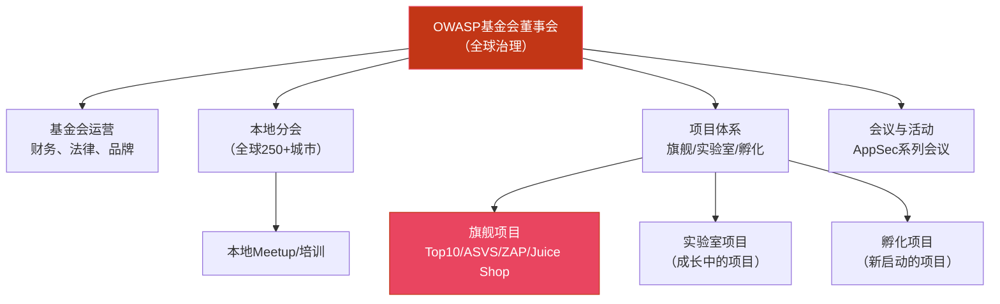
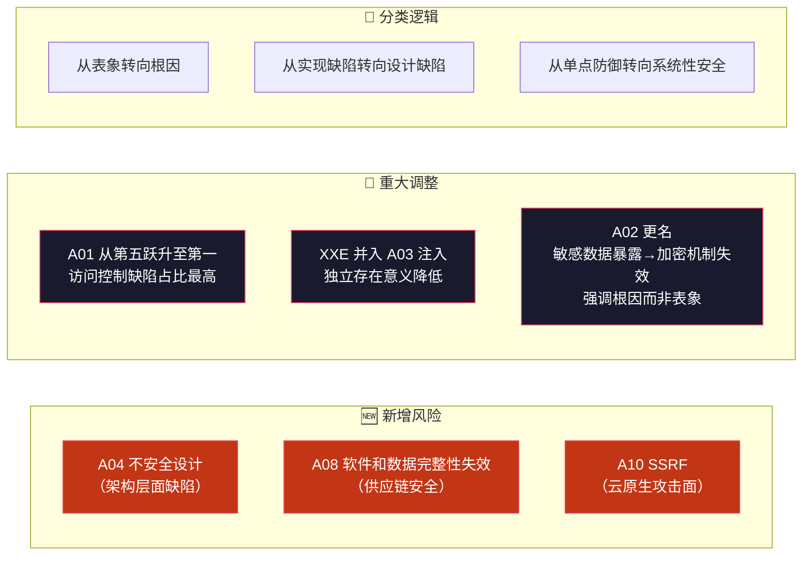
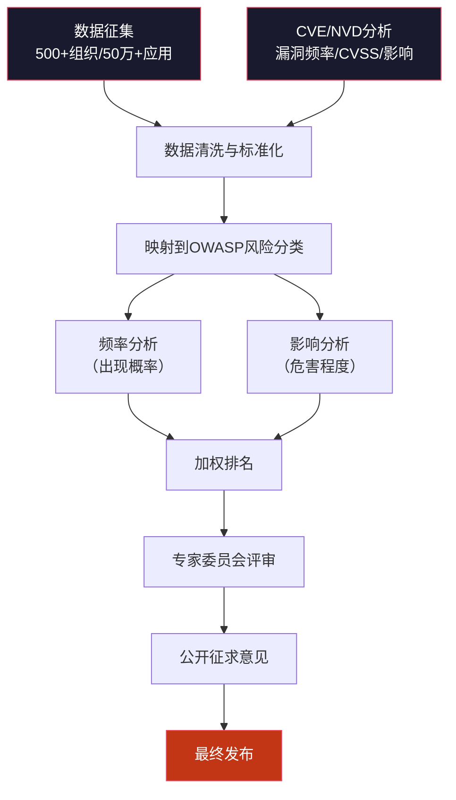

## 14.1 OWASP与Top 10的由来

Web安全领域存在大量框架、标准和指南，但没有任何一个项目的影响力能与OWASP Top 10相比。要真正理解Top 10的价值，必须先理解它背后的组织——OWASP，以及这份清单从诞生到如今经历的二十余年演变。本节将从组织起源讲起，逐步展开Top 10的版本演进、数据方法论和行业影响，为后续逐一剖析十大风险奠定认知基础。

### 14.1.1 OWASP组织简介

#### 诞生背景

2000年前后，互联网正经历第一次大规模商业化浪潮。电子商务、在线银行、Web邮箱等应用爆发式增长，但安全问题几乎被完全忽视。开发者关注功能实现，企业关注用户增长，安全被视为"额外成本"而非必要投资。当时的Web安全领域面临几个核心困境：

- **知识碎片化**：安全研究散布在个人博客、邮件列表和零散的论文中，缺乏系统性整理
- **商业壁垒**：安全知识被锁定在昂贵的商业培训和闭源工具中，中小团队难以获取
- **社区缺失**：没有一个统一的平台让开发者、安全研究者和企业管理者交流协作

2001年，Mark Curphey（时任Foundstone安全顾问）创建了OWASP（Open Web Application Security Project，开放式Web应用安全项目）。项目的初衷极其朴素：**让Web安全知识对所有人免费开放**。

#### 组织架构与治理

OWASP并非一家公司，而是一个以社区驱动为核心的非营利组织（501(c)(3)）。其治理结构经过多次演变，当前架构如下：

**本地分会**是OWASP社区活力的源泉。截至2024年，OWASP在全球超过250个城市设有本地分会，定期举办技术分享、培训工作坊和CTF竞赛。中国在北京、上海、深圳、成都、西安等城市均有活跃分会。

#### OWASP核心项目矩阵

OWASP维护着超过200个项目，覆盖Web安全的各个维度。以下列出与本书内容最为密切的核心项目：

| 项目名称 | 类型 | 核心用途 | 适用角色 | 成熟度 |
|----------|------|----------|----------|--------|
| **OWASP Top 10** | 文档 | Web应用最关键安全风险的标准化清单 | 所有人 | 旗舰 |
| **OWASP ASVS**（应用安全验证标准） | 标准 | 定义应用安全验证的三个等级（L1/L2/L3），包含280+安全需求 | 开发者、架构师、审计师 | 旗舰 |
| **OWASP Testing Guide** | 方法论 | Web应用安全测试的完整方法论，涵盖从信息收集到报告的全流程 | 渗透测试人员 | 旗舰 |
| **OWASP SAMM**（软件保障成熟度模型） | 框架 | 评估和改进软件安全开发生命周期（SSDL）的成熟度 | 安全管理者、CISO | 旗舰 |
| **OWASP Cheat Sheet Series** | 速查表 | 100+份安全编码速查表，涵盖认证、加密、输入验证等主题 | 开发者 | 旗舰 |
| **OWASP ZAP**（Zed Attack Proxy） | 工具 | 开源Web应用安全扫描器，支持自动化和手动测试 | 安全测试人员 | 旗舰 |
| **OWASP Juice Shop** | 靶场 | 基于Node.js的现代Web应用靶场，包含100+安全挑战 | 学习者、培训师 | 旗舰 |
| **OWASP Dependency-Check** | 工具 | 开源的软件成分分析（SCA）工具，检测已知漏洞组件 | 开发者、DevSecOps | 旗舰 |
| **OWASP CSRFGuard** | 工具 | CSRF防护库，为Java Web应用提供自动化的CSRF Token防护 | Java开发者 | 实验室 |
| **OWASP Amass** | 工具 | 网络映射和外部资产发现工具，用于攻击面枚举 | 安全测试人员 | 旗舰 |

这些项目之间的关系可以用一句话概括：**Top 10告诉你"什么是最重要的风险"，Testing Guide告诉你"如何发现这些风险"，ASVS告诉你"安全到什么程度才算够"，SAMM告诉你"如何系统性地提升安全能力"**。

#### OWASP的行业影响力

OWASP Top 10早已超越了一份技术文档的范畴，成为全球Web安全事实上的"通用语言"：

- **合规引用**：PCI DSS（支付卡行业数据安全标准）将OWASP Top 10作为Web应用安全测试的基准参考；ISO 27001实施指南中也将其列为应用安全控制的重要输入
- **采购标准**：越来越多的企业在软件采购合同中要求供应商证明其产品符合OWASP Top 10的安全要求
- **教育体系**：全球众多高校的网络安全课程将OWASP Top 10作为教学大纲的核心框架
- **法规映射**：中国《网络安全法》《数据安全法》《个人信息保护法》中的相关条款，与OWASP Top 10的多项风险直接对应
- **工具集成**：主流SAST/DAST工具（SonarQube、Checkmarx、Fortify、Burp Suite等）均内置了基于OWASP Top 10的检测规则

### 14.1.2 Top 10的演变历程

OWASP Top 10自2003年首次发布以来，经历了六次重大版本迭代。每一次修订都不是简单的排名调整，而是对Web安全威胁格局变化的系统性回应。

#### 版本演进全景

| 版本 | 年份 | 核心变化 | 时代背景 |
|------|------|----------|----------|
| **V1** | 2003 | 首次发布，确立"Top N"形式 | Web应用开始大规模商业化 |
| **V2** | 2004 | 增加类别描述和修复建议 | SQL Slammer等蠕虫爆发引起关注 |
| **V3** | 2007 | 重新分类，增加"信息泄露"和"不安全的直接对象引用" | Web 2.0兴起，AJAX带来新攻击面 |
| **V4** | 2010 | 引入"安全配置错误""不安全的反序列化"等新类别 | 云计算开始普及，配置管理问题凸显 |
| **V5** | 2013 | 强化"敏感数据暴露"，增加"使用含已知漏洞的组件" | 大规模数据泄露事件频发（Heartbleed、ShellShock） |
| **V6** | 2017 | 引入XXE独立条目，增加"不足的日志记录和监控" | 勒索软件爆发，强调检测和响应能力 |
| **V7** | 2021 | 重大重构：新增"不安全设计""完整性失效""SSRF"，合并XXE | 供应链攻击（SolarWinds）和云原生安全成为焦点 |

#### 各版本深度解读

**2003/2004版：奠基之作**

2003版是OWASP Top 10的起点，其核心贡献在于将散布在各处的Web安全知识浓缩为一份简洁的风险清单。初始版本的十大风险包括：

1. 未验证的输入（Unvalidated Input）
2. 破损的访问控制（Broken Access Control）
3. 破损的认证和会话管理（Broken Authentication and Session Management）
4. 跨站脚本攻击（XSS）
5. 缓冲区溢出（Buffer Overflow）
6. 注入缺陷（Injection Flaws）
7. 不当的错误处理（Improper Error Handling）
8. 不安全的存储（Insecure Storage）
9. 拒绝服务（Denial of Service）
10. 不安全的配置管理（Insecure Configuration Management）

2004版在此基础上增加了更详细的描述和修复建议，使其从一份"风险清单"进化为"行动指南"。

**2010版：适应云时代**

2010版的关键变化是将"安全配置错误"独立为一个类别，这与云计算的兴起密切相关。当应用从本地部署迁移到云端，配置管理的复杂度呈指数级增长——默认安全组、S3存储桶权限、IAM策略等成为新的攻击面。同时，"不安全的反序列化"首次被纳入考量，尽管当时这个漏洞类别尚未引起广泛关注（后来的Apache Commons Collections反序列化漏洞链证明了其前瞻性）。

**2013版：数据泄露时代的回应**

2013版的背景是大规模数据泄露事件的集中爆发。2011年索尼PlayStation Network泄露7700万用户数据，2013年Adobe泄露1.53亿用户记录。这些事件推动了两个关键变化：

- "敏感数据暴露"（Sensitive Data Exposure）被赋予更高权重，强调对个人信息和支付数据的保护
- "使用含已知漏洞的组件"（Using Components with Known Vulnerabilities）首次进入Top 10，反映了供应链安全意识的觉醒

**2017版：从预防到检测**

2017版最引人注目的变化是新增了"不足的日志记录和监控"（Insufficient Logging & Monitoring）。这反映了行业对安全认知的一次范式转变——从"只关注如何防止攻击"扩展到"如何及时发现已经发生的攻击"。Equifax数据泄露事件（1.47亿用户数据泄露，攻击者在内网驻留了76天未被发现）是这一转变的最佳注脚。

同时，"XML外部实体注入"（XXE）被独立为一个条目，因为大量基于Java的XML解析器默认启用了外部实体解析，导致了大量实际的安全事件。

**2021版：面向未来的重构**

2021版是Top 10历史上变动最大的一次修订，其核心理念可以用一句话概括：**从"漏洞列表"向"风险框架"的转型**。

关键变化包括：

其中最具深意的调整是**A04"不安全设计"的引入**。传统安全思维聚焦于"代码写得安不安全"，而A04将视野提升到"架构设计得安不安全"——一个在设计层面就存在缺陷的系统，无论代码写得多好都无法真正安全。这与近年来威胁建模（Threat Modeling）和安全左移（Shift Left Security）的理念高度一致。

#### 2021版十大风险速览

为方便后续章节的引用，这里列出2021版的完整清单：

| 排名 | 编号 | 风险名称 | 英文名称 | 核心问题 |
|------|------|----------|----------|----------|
| 1 | A01 | 失效的访问控制 | Broken Access Control | 权限校验不足，用户越权访问 |
| 2 | A02 | 加密机制失效 | Cryptographic Failures | 敏感数据未加密或加密不当 |
| 3 | A03 | 注入 | Injection | 用户输入被当作代码执行 |
| 4 | A04 | 不安全设计 | Insecure Design | 架构层面缺乏安全考量 |
| 5 | A05 | 安全配置错误 | Security Misconfiguration | 默认配置、不必要的功能暴露 |
| 6 | A06 | 脆弱和过时的组件 | Vulnerable and Outdated Components | 使用已知漏洞的第三方组件 |
| 7 | A07 | 身份识别与认证失效 | Identification and Authentication Failures | 认证机制存在缺陷 |
| 8 | A08 | 软件和数据完整性失效 | Software and Data Integrity Failures | CI/CD管道和更新机制缺乏验证 |
| 9 | A09 | 安全日志与监控失效 | Security Logging and Monitoring Failures | 缺乏有效的日志记录和监控 |
| 10 | A10 | 服务端请求伪造 | Server-Side Request Forgery (SSRF) | 服务器被诱导发起内部请求 |

### 14.1.3 Top 10的数据方法论

#### 2021版数据来源

2021版Top 10的数据收集方法较之前版本有了显著改进，采用了双轨数据驱动的方法论：

**数据轨一：应用安全测试数据**

OWASP向全球安全公司和研究机构征集匿名化的应用安全测试数据。2021版的数据征集覆盖了：

- **500+** 个组织提交的测试数据
- **超过50万个** 独立Web应用的安全测试结果
- 数据涵盖渗透测试、漏洞扫描、代码审计等多种测试类型
- 所有数据经过匿名化处理，不包含具体的应用名称或组织信息

**数据轨二：CVE/NVD漏洞数据库分析**

OWASP数据团队对CVE（Common Vulnerabilities and Exposures）和NVD（National Vulnerability Database）中的漏洞数据进行了系统性分析：

- 筛选与Web应用相关的CVE条目
- 统计各类漏洞的出现频率、CVSS评分分布和影响范围
- 分析漏洞在不同技术栈中的分布特征

**分类映射与专家评审**

原始数据经过以下步骤转化为最终的Top 10排名：

2021版的排名依据采用了**"加权频率扫描"**（Weighted Incidence）方法，同时考虑了：
- **频率**（How often does it occur?）——该类漏洞在测试数据中出现的比例
- **影响**（How severe is it?）——该类漏洞被利用后的平均危害程度

这意味着排名不是简单地按"出现次数"排序，而是综合了"多常见"和"多严重"两个维度。

#### 方法论的演进与争议

Top 10的方法论并非没有争议。历年来，社区对其提出的主要质疑包括：

**争议一：样本偏差**

提交数据的组织以北美和欧洲的安全公司为主，亚洲、非洲和南美洲的数据代表性不足。这意味着Top 10可能更准确地反映了发达市场的安全状况，而非全球全貌。

**争议二：类型体系不一致**

不同安全公司对漏洞的分类标准存在差异。例如，一个包含SQL注入和XSS的"注入类"发现，在某些报告中被归为"注入"，在另一些报告中被拆分为独立条目。这种不一致性影响了统计的精确性。

**争议三："安全设计"的量化困难**

A04"不安全设计"是2021版新增的类别，但"设计缺陷"在传统安全测试数据中很难被量化统计。一个在实现层面没有漏洞的设计，可能在业务逻辑层面存在严重的滥用风险——这类问题通常不会出现在自动化扫描报告中。

**争议四：排名的误导性**

部分从业者将Top 10理解为"只需关注这10个问题"，实际上Top 10之外还有大量安全风险（如CSRF、文件上传、业务逻辑漏洞等）同样需要重视。OWASP在官方文档中反复强调，Top 10是"风险意识的起点"而非"安全工作的终点"。

#### 与其他安全框架的定位对比

OWASP Top 10并非孤立存在，它在整个Web安全知识体系中处于特定的位置：

| 框架/标准 | 定位 | 深度 | 受众 | 与Top 10的关系 |
|----------|------|------|------|----------------|
| **OWASP Top 10** | 风险意识 | 概述级 | 所有人 | — |
| **OWASP ASVS** | 安全需求规格 | 详细级（280+检查项） | 开发者、审计师 | Top 10的"深度展开版" |
| **OWASP Testing Guide** | 测试方法论 | 操作级 | 渗透测试人员 | "如何发现"Top 10中的问题 |
| **NIST SP 800-53** | 安全控制目录 | 全面级 | 企业安全团队 | 更广泛的安全控制框架 |
| **PCI DSS** | 合规标准 | 强制级 | 支付行业 | 引用Top 10作为Web安全基准 |
| **CWE Top 25** | 编码缺陷排名 | 详细级 | 开发者 | 从代码层面补充Top 10的视角 |
| **SANS Top 25** | 软件错误排名 | 详细级 | 开发者 | 与CWE Top 25高度重叠 |
| **MITRE ATT&CK** | 攻击技术矩阵 | 战术级 | 安全运营 | 从攻击者视角补充Top 10的防御视角 |

**实践建议**：如果你是初学者，从Top 10入手建立全局认知；如果你是开发者，用ASVS指导编码；如果你是测试人员，用Testing Guide指导测试；如果你是安全管理者，用SAMM评估成熟度。这些框架互为补充，而非互相替代。

### 14.1.4 Top 10的实际应用场景

理解Top 10的"由来"不仅是历史知识，更重要的是理解它在实际工作中的应用价值。

#### 场景一：安全培训与意识提升

Top 10最广泛的用途是作为安全培训的框架。对于非安全背景的开发者和管理者，Top 10提供了一份"最小必要知识清单"：

- **新员工入职培训**：用Top 10让开发者在1-2小时内建立Web安全的基本认知
- **年度安全意识教育**：结合最新版本的Top 10更新培训内容
- **管理层汇报**：用Top 10的框架向非技术管理层解释安全风险的优先级

#### 场景二：安全测试基准

安全团队可以将Top 10作为测试覆盖度的最低基准：

- **渗透测试范围**：确保每次渗透测试至少覆盖Top 10中的所有类别
- **自动化扫描配置**：配置SAST/DAST工具时，优先启用Top 10相关的检测规则
- **安全验收标准**：在CI/CD管道中设置门禁，阻断存在Top 10高危漏洞的构建

#### 场景三：安全架构评审

在系统设计阶段，用Top 10作为安全评审的检查清单：

- **威胁建模输入**：将Top 10的十大类别作为威胁建模的起点
- **架构设计审查**：评审系统架构时，逐一检查每个类别的防护措施
- **第三方组件评估**：评估引入的第三方组件是否满足Top 10的安全要求

#### 场景四：合规与合同要求

Top 10已经成为事实上的安全合规基准：

- **供应商安全评估**：在软件采购合同中要求供应商声明符合OWASP Top 10
- **安全审计依据**：内部和外部审计中将Top 10作为Web应用安全的评估基准
- **保险与风险管理**：网络安全保险承保时参考Top 10的覆盖情况

### 14.1.5 常见误解与澄清

围绕OWASP Top 10，业界存在一些广泛流传的误解，需要在进入后续章节之前予以澄清：

**误解一："Top 10只是入门材料，专业人士不需要关注"**

事实恰恰相反。Top 10的简洁性使其成为高效沟通的工具。即使是最资深的安全专家，在向开发团队、管理层或客户传达安全优先级时，Top 10仍然是最有效的框架。简洁不等于浅薄。

**误解二："做到Top 10合规就是安全的"**

Top 10覆盖的是"最关键的十大风险"，而非"全部风险"。Web安全的完整攻击面远大于十个类别。CSRF、文件上传漏洞、业务逻辑缺陷、竞态条件等重要风险均未单独出现在2021版中。Top 10是安全工作的起点，不是终点。

**误解三："Top 10的排名越靠前越危险"**

排名反映的是"综合风险程度"（频率×影响），而非单一的"危险程度"。例如，注入攻击（A03）虽然"只"排第三，但在特定场景下其危害可能远超排名更高的类别。实际工作中应根据自身应用的特点进行风险评估，而非机械地按排名分配资源。

**误解四："Top 10只适用于Web应用"**

虽然Top 10的名称明确指向Web应用，但其中的多项风险（如A01访问控制、A02加密机制、A04不安全设计、A06脆弱组件、A08完整性失效）同样适用于移动应用、API服务、IoT设备甚至传统软件。Top 10的分类逻辑具有跨领域的参考价值。

**误解五："每两年更新一次"**

OWASP Top 10没有固定的发布周期。实际的更新间隔为3-4年，具体取决于数据积累和威胁格局变化的程度。2003→2004→2007→2010→2013→2017→2021，间隔从1年到4年不等。下一次更新预计在2024-2025年期间。

### 14.1.6 从Top 10看Web安全的演变规律

回顾二十余年的版本演进，可以提炼出几条贯穿始终的规律：

**规律一：攻击面随技术演进持续扩大**

从2003年的基础Web应用，到2010年的云计算，到2017年的微服务，再到2021年的云原生和API驱动架构，攻击面随着技术架构的演进不断扩大。Top 10的每次更新都在努力覆盖新的攻击面（如2021版新增的SSRF就直接反映了云原生架构带来的新风险）。

**规律二：安全关注点从"技术"向"流程"和"设计"迁移**

早期的Top 10聚焦于具体的技术漏洞（SQL注入、XSS、缓冲区溢出）。2021版新增的"不安全设计"和"软件和数据完整性失效"则将关注点提升到了架构设计和软件工程流程的层面。这反映了行业共识：**真正的安全不能只靠修补代码缺陷，必须从设计和流程的源头解决问题**。

**规律三：从"预防"到"检测与响应"的范式扩展**

2017版新增的"不足的日志记录和监控"标志着一个重要的范式转变——安全不仅是"防止被攻击"，还包括"及时发现正在发生的攻击"。这个认知转变对安全运营中心（SOC）的建设和安全团队的组织架构产生了深远影响。

**规律四：供应链安全从边缘走向核心**

从2013版的"使用含已知漏洞的组件"到2021版的"软件和数据完整性失效"，供应链安全在Top 10中的权重持续上升。SolarWinds（2020）、Log4Shell（2021）、3CX供应链攻击（2023）等事件表明，供应链攻击已经成为国家级APT组织的常用战术。

```mermaid
graph LR
    subgraph 2003["2003-2007 技术漏洞期"]
        direction TB
        T1["SQL注入"]
        T2["XSS"]
        T3["缓冲区溢出"]
    end
    
    subgraph 2010["2010-2013 架构安全期"]
        direction TB
        T4["安全配置错误"]
        T5["敏感数据暴露"]
        T6["已知漏洞组件"]
    end
    
    subgraph 2017["2017 运维安全期"]
        direction TB
        T7["日志与监控不足"]
        T8["XXE独立"]
    end
    
    subgraph 2021["2021 设计与供应链期"]
        direction TB
        T9["不安全设计"]
        T10["完整性失效"]
        T11["SSRF"]
    end
    
    2003 --> 2010 --> 2017 --> 2021
    
    style 2003 fill:#1a1a2e,stroke:#e94560,color:#fff
    style 2010 fill:#1a1a2e,stroke:#e94560,color:#fff
    style 2017 fill:#1a1a2e,stroke:#e94560,color:#fff
    style 2021 fill:#1a1a2e,stroke:#e94560,color:#fff
```

这些规律不仅是对历史的总结，也为我们预判未来Top 10的演变方向提供了线索：AI驱动的安全威胁、API安全、身份联邦安全、隐私保护等新兴议题，都有可能在未来的版本中获得更高的权重。

### 14.1.7 如何高效利用Top 10

作为本节的收尾，这里给出针对不同角色利用Top 10的具体建议：

**对初学者**：
1. 首先通读本节，建立OWASP和Top 10的全局认知
2. 阅读OWASP官方的Top 10页面（https://owasp.org/www-project-top-ten/），了解每项风险的简要描述
3. 搭建OWASP Juice Shop靶场，通过实践加深理解
4. 在后续章节中逐一深入学习每项风险的技术细节

**对开发者**：
1. 将Top 10作为代码审查的安全检查清单
2. 重点关注与自身技术栈最相关的风险类别
3. 参考OWASP Cheat Sheet Series获取具体的安全编码指南
4. 在IDE中集成安全检查插件（如SonarLint），实时检测Top 10相关的编码问题

**对安全测试人员**：
1. 确保每次测试覆盖Top 10的所有类别
2. 使用OWASP Testing Guide指导测试方法
3. 建立自己的Top 10测试检查清单，包含各类别的具体测试用例
4. 关注每个版本的变化，及时更新测试方法

**对安全管理者**：
1. 用Top 10作为安全培训和意识提升的基础框架
2. 将Top 10的覆盖情况纳入安全KPI指标
3. 用OWASP SAMM评估组织的安全成熟度
4. 在安全策略和标准中引用Top 10作为基准

---

> **本节关键要点**：OWASP Top 10不是一个静态的"漏洞排行榜"，而是一个随着Web安全威胁格局持续演进的"风险意识框架"。理解它的由来、方法论和演变规律，是深入学习后续十大风险的必要前提。接下来的14.2节将从排名第一的"失效的访问控制"开始，逐一展开每项风险的技术原理和攻击模型。
