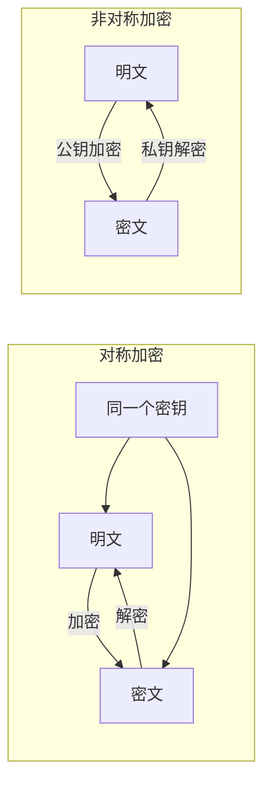
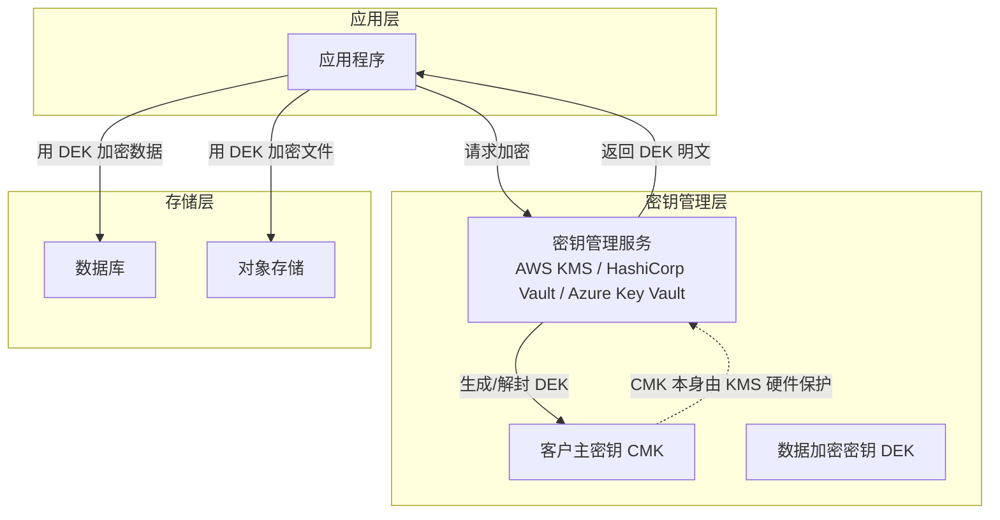

## 14.3 A02：加密机制失效（Cryptographic Failures）

### 14.3.1 定义与演变

加密机制失效（Cryptographic Failures）是 OWASP Top 10 2021 中排名第二的Web安全风险。它指的是在数据的传输、存储或处理过程中，加密保护措施缺失、配置不当或使用了已知存在漏洞的加密方案。

在 OWASP Top 10 2017 版中，这一风险被称为"敏感数据暴露（Sensitive Data Exposure）"。2021 版的更名并非简单的文字调整，而是根本性的视角转换：

| 维度 | 2017 版（A03） | 2021 版（A02） |
|------|---------------|---------------|
| 关注焦点 | 数据泄露的结果 | 加密机制本身的缺陷 |
| 防御思路 | 防止数据被看到 | 确保加密方案本身正确 |
| 责任归属 | 运维/网络层 | 架构/开发层 |
| 检测方式 | 数据泄露后才知道 | 编码阶段即可发现 |

这种转变的核心逻辑是：**加密机制如果从根上就是错的，那保护再多层也只是在沙子上盖楼**。与其关注"数据有没有被泄露"，不如关注"加密本身有没有做好"。

### 14.3.2 为什么加密机制失效如此危险

加密机制失效之所以排在第二位，根本原因在于它是一种**底层失效**——一旦底层加密出问题，所有依赖它的上层保护全部归零。

**数据泄露的规模惊人**：根据 IBM《2024 年数据泄露成本报告》，全球数据泄露的平均成本为 488 万美元。其中，加密不充分是导致泄露成本增加的关键因素之一——未部署广泛加密的企业，其泄露成本比已部署的企业平均高出 28%。

**攻击成本极低，修复成本极高**：攻击者利用弱加密（如 MD5 哈希）破解密码，成本可以低到忽略不计。而企业修复一次加密失效的代价可能涉及全量密码重置、证书轮换、合规审计、用户通知，以及无法估量的声誉损失。

**合规风险巨大**：GDPR、PCI DSS、HIPAA、《个人信息保护法》等法规均对加密提出明确要求。加密机制失效直接意味着合规违规，可能招致高额罚款。例如 GDPR 对严重违规可处以全球年营业额 4% 或 2000 万欧元（取较高者）的罚款。

**长尾效应**：加密密钥泄露的影响不会在泄露后立刻结束。攻击者可以用泄露的密钥解密历史通信（"先收集、后解密"攻击），甚至伪造合法凭证持续渗透。

### 14.3.3 加密基础：你需要知道的核心概念

在深入具体的失效模式之前，有必要快速梳理加密的核心概念，确保后续讨论有共同的术语基础。

#### 14.3.3.1 对称加密与非对称加密



**对称加密**：加密和解密使用同一个密钥。速度快，适合大量数据加密。代表算法：AES-256-GCM、ChaCha20-Poly1305。

**非对称加密**：使用公钥加密、私钥解密。速度慢，适合密钥交换和数字签名。代表算法：RSA（2048位以上）、ECDSA（P-256 曲线以上）、Ed25519。

**哈希函数**：单向函数，不可逆。用于密码存储、完整性校验。安全的哈希算法：SHA-256、SHA-3、BLAKE2、BLAKE3。

**消息认证码（MAC）**：使用共享密钥验证消息完整性和真实性。实现方式：HMAC-SHA256。

**数字签名**：使用私钥签名、公钥验证。用于身份认证和不可否认性。

#### 14.3.3.2 密码学原语的安全边界

| 原语 | 安全算法 | 已被淘汰/不安全 | 原因 |
|------|---------|----------------|------|
| 对称加密 | AES-256-GCM, ChaCha20 | DES, 3DES, RC4, Blowfish(64位块) | DES密钥太短(56位), RC4存在统计偏差, 3DES易受Sweet32攻击 |
| 非对称加密 | RSA-2048+, ECDSA P-256+, Ed25519 | RSA-1024, DSA-1024 | 密钥长度不足, 可被分解 |
| 哈希函数 | SHA-256, SHA-3, BLAKE2 | MD5, SHA-1 | MD5存在碰撞, SHA-1已被Google实际碰撞 |
| 密码哈希 | Argon2id, bcrypt, scrypt | MD5, SHA-1, SHA-256(裸哈希) | 无盐/计算太快, 无法抵御GPU暴力破解 |
| 密钥派生 | HKDF, PBKDF2(HMAC-SHA256, ≥600k次迭代) | 自定义KDF, 低迭代PBKDF2 | 迭代次数不足无法抵御离线破解 |
| 随机数生成 | /dev/urandom, CryptGenRandom, getrandom() | rand(), random(), Math.random() | 可预测, 无密码学安全性 |

#### 14.3.3.3 "加密"不等于"安全"：三个核心属性

加密的目标是同时保证三个属性，缺少任何一个都是失效：

1. **机密性（Confidentiality）**：只有授权方能读取数据。通过加密实现。
2. **完整性（Integrity）**：数据未被篡改。通过 MAC 或数字签名实现。
3. **真实性（Authenticity）**：数据确实来自声称的发送方。通过数字签名或认证加密（AEAD）实现。

只做加密不做完整性校验是常见的致命错误。例如，使用 AES-CBC 模式而不验证 MAC，攻击者可以利用 Padding Oracle 攻击逐字节解密密文。

### 14.3.4 加密机制失效的七大模式

OWASP A02 覆盖的加密失效远不止"用了弱算法"这么简单。以下是按严重程度排序的七大失效模式。

#### 14.3.4.1 模式一：传输层加密缺失或不当

**症状**：使用 HTTP 传输敏感数据、TLS 配置不当、证书验证缺失。

**具体表现**：

- Web 应用未启用 HTTPS，或允许 HTTP 回退
- API 端点使用 HTTP 明文传输认证令牌、支付信息
- 移动 App 未实施证书锁定（Certificate Pinning）
- TLS 配置允许弱密码套件（如包含 RC4、NULL、EXPORT 级别）
- TLS 版本过旧（TLS 1.0/1.1 已于 2021 年被主流浏览器废弃）
- 证书验证代码中禁用了 hostname 验证

**真实案例**：2019 年 Capital One 数据泄露（影响 1.06 亿用户）中，部分内部服务之间的通信未充分加密，配合 SSRF 漏洞被攻击者利用。2017 年 Equifax 泄露中，部分内部系统使用自签名证书且未验证，导致中间人攻击成为可能。

**传输层安全的正确配置**：

```nginx
# Nginx TLS 最佳实践配置
server {
    listen 443 ssl http2;
    
    # 证书和密钥
    ssl_certificate     /etc/letsencrypt/live/example.com/fullchain.pem;
    ssl_certificate_key /etc/letsencrypt/live/example.com/privkey.pem;
    
    # 仅允许 TLS 1.2 和 1.3
    ssl_protocols TLSv1.2 TLSv1.3;
    
    # 推荐的密码套件（TLS 1.2）
    ssl_ciphers 'ECDHE-ECDSA-AES128-GCM-SHA256:ECDHE-RSA-AES128-GCM-SHA256:ECDHE-ECDSA-AES256-GCM-SHA384:ECDHE-RSA-AES256-GCM-SHA384:ECDHE-ECDSA-CHACHA20-POLY1305:ECDHE-RSA-CHACHA20-POLY1305';
    ssl_prefer_server_ciphers off;  # TLS 1.3 中建议关闭
    
    # OCSP Stapling
    ssl_stapling on;
    ssl_stapling_verify on;
    ssl_trusted_certificate /etc/letsencrypt/live/example.com/chain.pem;
    
    # HSTS（强制 HTTPS，includeSubDomains 根据实际情况设置）
    add_header Strict-Transport-Security "max-age=63072000; includeSubDomains; preload" always;
    
    # 会话缓存
    ssl_session_cache shared:SSL:10m;
    ssl_session_timeout 1d;
    ssl_session_tickets off;  # TLS 1.3 中 session tickets 安全性改善，但仍建议关闭
}

# 强制 HTTP 跳转 HTTPS
server {
    listen 80;
    server_name example.com;
    return 301 https://$host$request_uri;
}
```

**HSTS 预加载提交**：配置好 HSTS 后，应向浏览器 HSTS 预加载列表提交域名（https://hstspreload.org），防止首次访问时的降级攻击。

**客户端证书验证代码中的常见错误**：

```python
# ❌ 危险：禁用证书验证
import requests
response = requests.get('https://api.example.com', verify=False)  # 极度危险

# ❌ 危险：忽略主机名验证（Java 示例）
SSLContext ctx = SSLContext.getInstance("TLS");
ctx.init(null, new TrustManager[]{new X509TrustManager() {
    public void checkClientTrusted(X509Certificate[] chain, String authType) {}
    public void checkServerTrusted(X509Certificate[] chain, String authType) {}
    public X509Certificate[] getAcceptedIssuers() { return new X509Certificate[0]; }
}}, null);

# ✅ 正确：使用系统信任库并验证证书
import ssl
import httpx

# httpx 默认就验证证书，无需额外配置
client = httpx.Client(verify=True)  # 显式声明也是好习惯
response = client.get('https://api.example.com')

# 如需自定义 CA，指向 CA 文件
client = httpx.Client(verify='/path/to/custom-ca-bundle.pem')
```

#### 14.3.4.2 模式二：弱密码哈希

**症状**：使用 MD5、SHA-1、SHA-256 裸哈希存储密码，未使用盐值，迭代次数不足。

这是最常见、影响最广的加密失效模式。几乎所有密码泄露事件的根源都在于此。

**为什么不能用通用哈希函数存密码**：

通用哈希函数（MD5、SHA-256 等）设计目标是**计算速度快**——这是文件校验、数字签名等场景的需求。但对于密码存储，速度快恰恰是致命弱点：

- 一块 RTX 4090 显卡：每秒可计算约 1640 亿次 MD5、250 亿次 SHA-256
- 10 位全字符密码（字母+数字+符号）的搜索空间约 6.7×10^19
- 以 1640 亿次/秒的速度，理论上需要约 12.9 年才能穷举
- 但实际中，大多数密码的熵远低于理论最大值，加上字典攻击和规则变形，破解一个常见密码可能只需要几秒钟

**专用密码哈希函数的设计目标**：

专用密码哈希函数（Argon2、bcrypt、scrypt）通过以下机制对抗暴力破解：

| 机制 | 说明 | 代表算法 |
|------|------|---------|
| 时间成本（迭代次数） | 强制计算耗时，降低每秒尝试次数 | bcrypt, scrypt |
| 内存成本 | 要求大量 RAM，限制 GPU 并行度 | Argon2id, scrypt |
| 并行度限制 | 限制可同时使用的计算核心数 | Argon2id |
| 盐值 | 唯一随机盐，使彩虹表攻击失效 | 所有专用算法 |

**密码哈希的正确实现**：

```python
# ✅ 推荐：使用 Argon2id（OWASP 首选）
from argon2 import PasswordHasher
from argon2.exceptions import VerifyMismatchError

# 参数说明：
# time_cost: 迭代次数（默认 3）
# memory_cost: 内存使用量 KiB（默认 65536 = 64MB）
# parallelism: 并行度（默认 4）
# hash_len: 输出哈希长度（默认 32）
# salt_len: 盐值长度（默认 16）
ph = PasswordHasher(
    time_cost=3,
    memory_cost=65536,   # 64MB
    parallelism=4,
    hash_len=32,
    salt_len=16
)

# 注册时：哈希密码
def register_user(username, password):
    hashed = ph.hash(password)
    # 存储: username -> hashed
    # 哈希格式: $argon2id$v=19$m=65536,t=3,p=4$<salt>$<hash>
    return hashed

# 登录时：验证密码
def verify_password(stored_hash, password):
    try:
        return ph.verify(stored_hash, password)
    except VerifyMismatchError:
        return False

# ⚠️ 重要：验证后检查是否需要重新哈希（参数升级后）
def verify_and_rehash(stored_hash, password):
    if ph.check_needs_rehash(stored_hash):
        new_hash = ph.hash(password)
        # 更新数据库中的哈希
        return True, new_hash
    return ph.verify(stored_hash, password), stored_hash
```

```python
# ✅ 备选：使用 bcrypt
import bcrypt

# 注册
def hash_password_bcrypt(password):
    # rounds=12 对应约 250ms 延迟（现代硬件）
    # 根据服务器性能调整，目标是登录延迟 200-500ms
    salt = bcrypt.gensalt(rounds=12)
    hashed = bcrypt.hashpw(password.encode('utf-8'), salt)
    return hashed.decode('utf-8')

# 登录
def verify_password_bcrypt(stored_hash, password):
    return bcrypt.checkpw(
        password.encode('utf-8'),
        stored_hash.encode('utf-8')
    )
```

```java
// ✅ Java：使用 Spring Security 的 BCryptPasswordEncoder
// 或直接使用 jBCrypt
import org.springframework.security.crypto.bcrypt.BCryptPasswordEncoder;

BCryptPasswordEncoder encoder = new BCryptPasswordEncoder(12); // strength = 12
String hashed = encoder.encode(rawPassword);
boolean matches = encoder.matches(rawPassword, hashed);
```

**盐值的正确使用**：

```text
❌ 错误：全局盐
   password_hash = hash(password + "my_global_salt")
   // 所有用户共用一个盐，一旦盐泄露，攻击者可为所有用户预计算彩虹表

❌ 错误：用户名作盐
   password_hash = hash(password + username)
   // 用户名是公开信息，攻击者可以提前计算

✅ 正确：每个用户独立的随机盐
   salt = crypto.random(16)  // 16 字节随机盐
   password_hash = argon2id(password, salt)
   // 存储: (username, salt, password_hash)
   // Argon2/bcrypt 内部已处理盐值，无需手动管理
```

**经典案例**：2012 年 LinkedIn 泄露（1.17 亿账户），密码使用未加盐的 SHA-1 存储。60% 的密码在几天内被破解。如果当时使用 bcrypt，这一比例将降到不足 1%。

#### 14.3.4.3 模式三：加密密钥管理不当

**症状**：密钥硬编码在源代码中、存储在版本控制系统、使用弱密钥、无轮换机制。

密钥管理是加密体系中最容易出问题的环节。加密算法再强，密钥管理不当等于没有加密。

**常见错误**：

```text
❌ 错误1：密钥硬编码
   AES_KEY = "1234567890abcdef"  // 源码中写死
   JWT_SECRET = "super-secret-key"  // 配置文件中明文

❌ 错误2：密钥存入 Git
   .env 文件包含 API_KEY=xxx 并被提交到仓库
   数据库连接字符串含密码被提交

❌ 错误3：使用弱密钥
   DES 密钥 (56位)、1024 位 RSA 密钥
   "password" 作为 AES 密钥

❌ 错误4：无密钥轮换
   同一个密钥使用多年不更换
   证书过期不更新

❌ 错误5：密钥混用
   同一个密钥同时用于加密和签名
   不同安全级别的数据使用同一密钥
```

**正确的密钥管理架构**：



**信封加密（Envelope Encryption）模式**：

```python
# ✅ 使用信封加密保护大量数据
import os
from cryptography.hazmat.primitives.ciphers.aead import AESGCM
from cryptography.hazmat.primitives import hashes
from cryptography.hazmat.primitives.kdf.hkdf import HKDF

class EnvelopeEncryptor:
    """
    信封加密实现：
    1. 向 KMS 请求数据加密密钥 (DEK)
    2. 用 DEK 加密实际数据
    3. 用 CMK 加密 DEK（由 KMS 自动完成）
    4. 存储：加密后的 DEK + 加密后的数据
    
    实际生产中应使用 AWS KMS / Vault 等，此处演示原理。
    """
    
    def __init__(self, master_key: bytes):
        """master_key 在生产环境应来自 KMS"""
        self.master_key = master_key
    
    def generate_dek(self) -> tuple[bytes, bytes]:
        """生成数据加密密钥，返回 (dek, encrypted_dek)"""
        dek = AESGCM.generate_key(bit_length=256)
        # 用主密钥加密 DEK（简化版，实际应调用 KMS API）
        nonce = os.urandom(12)
        aesgcm = AESGCM(self.master_key)
        encrypted_dek = aesgcm.encrypt(nonce, dek, b'dek-protection')
        return dek, nonce + encrypted_dek  # nonce 前置
    
    def encrypt(self, plaintext: bytes, associated_data: bytes = b'') -> tuple[bytes, bytes]:
        """加密数据，返回 (密文, 打包的 DEK)"""
        dek, packed_dek = self.generate_dek()
        aesgcm = AESGCM(dek)
        nonce = os.urandom(12)
        ciphertext = aesgcm.encrypt(nonce, plaintext, associated_data)
        return nonce + ciphertext, packed_dek
    
    def decrypt(self, packed_ciphertext: bytes, packed_dek: bytes, 
                associated_data: bytes = b'') -> bytes:
        """解密数据"""
        # 先解封 DEK
        dek_nonce = packed_dek[:12]
        dek_ciphertext = packed_dek[12:]
        aesgcm = AESGCM(self.master_key)
        dek = aesgcm.decrypt(dek_nonce, dek_ciphertext, b'dek-protection')
        
        # 用 DEK 解密数据
        data_nonce = packed_ciphertext[:12]
        data_ciphertext = packed_ciphertext[12:]
        aesgcm_dek = AESGCM(dek)
        return aesgcm_dek.decrypt(data_nonce, data_ciphertext, associated_data)
```

**密钥轮换策略**：

| 密钥类型 | 建议轮换周期 | 轮换方式 |
|---------|-------------|---------|
| TLS 证书 | 90 天 | 自动续期（Let's Encrypt + certbot） |
| JWT 签名密钥 | 90 天 | 双密钥策略：新旧共存过渡期 |
| 数据加密密钥 (DEK) | 每次加密操作 | 信封加密，每次生成新 DEK |
| 客户主密钥 (CMK) | 1-2 年 | KMS 自动轮换，旧密钥保留用于解密 |
| API 密钥 | 90-180 天 | 双密钥策略，滚动更新 |
| 数据库密码 | 90 天 | 自动化轮换（Vault Dynamic Secrets） |

#### 14.3.4.4 模式四：使用已淘汰的加密算法

**症状**：仍在使用 DES、3DES、RC4、MD5 进行加密操作。

**淘汰算法的完整清单与替代方案**：

| 已淘汰算法 | 淘汰原因 | 替代方案 | 备注 |
|-----------|---------|---------|------|
| DES | 56 位密钥，1999 年已被暴力破解 | AES-256-GCM | 单次 DES 破解不到 24 小时 |
| 3DES | 64 位块大小，Sweet32 攻击可在约 785GB 数据后恢复明文 | AES-256-GCM | NIST 已于 2023 年废除 |
| RC4 | 存在统计偏差，可用于 TLS 1.0 的 BEAST 攻击 | ChaCha20-Poly1305 或 AES-256-GCM | 所有主流浏览器已禁用 |
| Blowfish (64位块) | 64 位块大小限制，与 3DES 相同的问题 | AES-256 或 ChaCha20 | bcrypt 内部使用但仅用于密码哈希 |
| MD5（用于加密/HMAC） | 碰撞攻击可在数秒内完成 | SHA-256, SHA-3, BLAKE2 | HMAC-MD5 目前未被实际攻破但仍不推荐 |
| SHA-1 | Google 于 2017 年展示了实际碰撞 | SHA-256, SHA-3 | 所有主要 CA 已停止签发 SHA-1 证书 |
| RSA < 2048 位 | 可被国家级攻击者分解 | RSA-2048+, Ed25519, ECDSA P-256+ | 建议直接使用 Ed25519 |
| DSA | 依赖随机数质量，Sony PS3 签名事件 | Ed25519, ECDSA P-256+ | NIST 已于 2023 年废除 |

**代码中检测弱算法**：

```python
# Python：检测代码中是否使用了弱加密算法
# 使用 bandit 静态分析工具
# pip install bandit
# bandit -r src/ -t B301,B302,B303,B304,B305

# bandit 检测规则：
# B301: 使用 hashlib 中的弱哈希
# B302: 使用 DES/3DES
# B303: 使用 MD5/SHA-1
# B304: 使用不安全的密码算法
# B305: 使用不安全的密码模式
```

```java
// Java：使用 SpotBugs + FindSecBugs 插件检测
// Maven 配置：
// <plugin>
//   <groupId>com.github.spotbugs</groupId>
//   <artifactId>spotbugs-maven-plugin</artifactId>
//   <configuration>
//     <plugins>
//       <plugin>
//         <groupId>com.h3xstream.findsecbugs</groupId>
//         <artifactId>findsecbugs-plugin</artifactId>
//       </plugin>
//     </plugins>
//   </configuration>
// </plugin>

// FindSecBugs 检测项：
// - WEAK_MESSAGE_DIGEST: 弱哈希（MD5/SHA-1）
// - DES_USAGE: DES/3DES 使用
// - ECB_MODE: ECB 模式使用
// - PADDING_ORACLE: Padding Oracle 漏洞
// - NULL_CIPHER: NULL 密码套件
```

#### 14.3.4.5 模式五：加密模式选择错误

**症状**：使用 ECB 模式、CBC 模式未验证填充、未使用认证加密。

这个问题往往被忽视——很多人认为"用了 AES 就安全了"，但实际上 AES 的**操作模式**同样重要。

**分组密码操作模式对比**：

| 模式 | 安全性 | 推荐度 | 说明 |
|------|--------|--------|------|
| ECB | ❌ 不安全 | 禁止 | 相同明文块产生相同密文块，泄露数据模式 |
| CBC | ⚠️ 需谨慎 | 不推荐 | 需要正确实现填充验证，易受 Padding Oracle 攻击 |
| CTR | ⚠️ 需谨慎 | 不推荐 | 无完整性保护，可被篡改 |
| GCM | ✅ 推荐 | 首选 | 认证加密（AEAD），同时保证机密性和完整性 |
| CCM | ✅ 推荐 | 备选 | 认证加密，适合资源受限环境 |
| ChaCha20-Poly1305 | ✅ 推荐 | 首选 | AEAD，移动端性能优异，无侧信道风险 |

**ECB 模式的经典危害**：

ECB 模式将明文分成固定大小的块，每个块独立加密。这意味着相同的明文块始终产生相同的密文块。最经典的例子是 Linux 企鹅 Tux 图片的 ECB 模式加密——原图的轮廓在加密后仍然清晰可见，因为图像中大量相同颜色的像素块产生了相同的密文块。

**正确使用 AES-GCM**：

```python
from cryptography.hazmat.primitives.ciphers.aead import AESGCM
import os

def encrypt_aes_gcm(key: bytes, plaintext: bytes, associated_data: bytes = b'') -> bytes:
    """
    AES-256-GCM 加密
    
    参数：
        key: 256 位 (32 字节) 密钥
        plaintext: 明文
        associated_data: 附加认证数据（不加密但会被完整性保护）
    返回：
        nonce + ciphertext + tag（拼接为一个字节串）
    """
    if len(key) != 32:
        raise ValueError("AES-256 requires a 32-byte key")
    
    aesgcm = AESGCM(key)
    # 12 字节随机 nonce（每次加密必须不同）
    nonce = os.urandom(12)
    
    # 加密 + 认证
    ciphertext = aesgcm.encrypt(nonce, plaintext, associated_data)
    
    # 返回 nonce + ciphertext（GCM tag 已附加在 ciphertext 末尾）
    return nonce + ciphertext

def decrypt_aes_gcm(key: bytes, packed: bytes, associated_data: bytes = b'') -> bytes:
    """AES-256-GCM 解密"""
    if len(key) != 32:
        raise ValueError("AES-256 requires a 32-byte key")
    
    nonce = packed[:12]
    ciphertext = packed[12:]
    
    aesgcm = AESGCM(key)
    
    # 解密 + 验证完整性
    # 如果密文被篡改或 associated_data 不匹配，会抛出 InvalidTag 异常
    return aesgcm.decrypt(nonce, ciphertext, associated_data)

# 使用示例
key = AESGCM.generate_key(bit_length=256)
plaintext = b"Sensitive data that needs protection"
aad = b"user_id:12345"  # 附加认证数据

encrypted = encrypt_aes_gcm(key, plaintext, aad)
decrypted = decrypt_aes_gcm(key, encrypted, aad)
assert decrypted == plaintext

# nonce 重用会导致密钥流重复，使攻击者能恢复明文
# 因此每次加密必须使用新的随机 nonce
```

**Nonce 重用的灾难性后果**：

GCM 模式下 nonce 重用是最严重的密码学错误之一。如果同一密钥下两个不同消息使用相同的 nonce，攻击者可以：

1. 恢复两条消息的 XOR（泄露明文模式）
2. 伪造任意消息的合法认证标签
3. 完全破坏 GCM 的认证保证

在 TLS 1.3 中，nonce 由序列号隐式管理，消除了这个风险。但在自定义加密方案中，必须确保 nonce 的唯一性。

#### 14.3.4.6 模式六：随机数生成器不安全

**症状**：使用编程语言内置的非密码学安全随机数生成器生成密钥、令牌、盐值。

```python
import random
import os
import secrets

# ❌ 不安全：可预测的伪随机数
token = ''.join([str(random.randint(0, 9)) for _ in range(6)])
# random 使用 Mersenne Twister 算法，观察 624 个输出即可预测后续所有值

# ❌ 不安全：Node.js 中的 Math.random()
# token = Math.random().toString(36).substring(2)

# ❌ 不安全：Java 中的 java.util.Random
# Random rand = new Random();
# byte[] key = new byte[32];
# rand.nextBytes(key);  // 可预测！

# ✅ 安全：使用密码学安全的随机数
token = secrets.token_hex(32)    # 64 字符十六进制字符串
api_key = secrets.token_urlsafe(32)  # URL 安全的 token
password = secrets.token_urlsafe(16)  # 随机密码

# ✅ 安全：使用 os.urandom
key = os.urandom(32)             # 32 字节随机密钥
salt = os.urandom(16)            # 16 字节随机盐
iv = os.urandom(12)              # 12 字节随机 nonce

# ✅ 安全：Java 中的 SecureRandom
# SecureRandom sr = new SecureRandom();
# byte[] key = new byte[32];
# sr.nextBytes(key);

# ✅ 安全：Go 中的 crypto/rand
# key := make([]byte, 32)
# _, err := rand.Read(key)

# ✅ 安全：Rust 中的 ring 或 rand crate
# use ring::rand::{SecureRandom, SystemRandom};
# let rng = SystemRandom::new();
# let mut key = vec![0u8; 32];
# rng.fill(&mut key).unwrap();
```

**为什么 `random` / `Math.random` 不安全**：

Python 的 `random` 模块使用 Mersenne Twister (MT19937) 算法。该算法的状态空间为 19937 位，但内部状态可以通过观察 624 个连续的 32 位输出完全恢复。一旦状态被恢复，攻击者可以预测所有后续输出。Java 的 `java.util.Random` 同样使用线性同余生成器，更易于预测。

**Web 应用中的关键场景**：

| 场景 | 需要的安全级别 | 推荐工具 |
|------|-------------|---------|
| 会话令牌 | 密码学安全 | `secrets.token_urlsafe(32)` |
| 密码重置令牌 | 密码学安全 | `secrets.token_urlsafe(32)` |
| CSRF Token | 密码学安全 | `secrets.token_hex(32)` |
| 验证码 (6位) | 密码学安全 | `secrets.randbelow(1000000)` |
| 加密密钥 | 密码学安全 | `os.urandom(32)` 或 `AESGCM.generate_key()` |
| 盐值 | 密码学安全 | `os.urandom(16)` |
| 游戏随机数 | 无需安全 | `random.randint()` 即可 |

#### 14.3.4.7 模式七：侧信道攻击漏洞

**症状**：密码比较使用非恒定时间函数、错误消息泄露解密细节。

侧信道攻击不直接攻击加密算法本身，而是利用实现中的物理特征（时间、功耗、声音、电磁辐射）推断密钥信息。

**时序攻击（Timing Attack）**：

```python
# ❌ 不安全：字符串比较会短路返回
def verify_token_unsafe(expected, actual):
    if expected == actual:  # Python 字符串比较在发现第一个不同字节时提前返回
        return True        # 攻击者可以通过测量响应时间逐字节猜测 token
    return False

# ✅ 安全：使用恒定时间比较
import hmac

def verify_token_safe(expected, actual):
    return hmac.compare_digest(expected, actual)

# 手动实现恒定时间比较（理解原理）
def constant_time_compare(a: bytes, b: bytes) -> bool:
    if len(a) != len(b):
        return False
    result = 0
    for x, y in zip(a, b):
        result |= x ^ y  # 逐字节异或，不短路
    return result == 0
```

**Padding Oracle 攻击**：

Padding Oracle 攻击是 CBC 模式中最经典的侧信道攻击。攻击者通过观察服务器对不同填充的响应差异（错误消息、响应时间、HTTP 状态码），可以逐字节恢复明文，而不需要知道密钥。

```python
# ❌ 不安全：泄露填充错误信息
def decrypt_cbc_unsafe(key, ciphertext):
    try:
        plaintext = aes_cbc_decrypt(key, ciphertext)
        return {"status": "success", "data": plaintext}
    except PaddingError:
        return {"status": "error", "message": "Invalid padding"}  # 泄露信息！
    except DecryptionError:
        return {"status": "error", "message": "Decryption failed"}

# ✅ 安全：使用 AEAD 模式（根本不需要填充）
def decrypt_gcm_safe(key, packed):
    try:
        nonce = packed[:12]
        ciphertext = packed[12:]
        aesgcm = AESGCM(key)
        plaintext = aesgcm.decrypt(nonce, ciphertext, None)
        return {"status": "success", "data": plaintext}
    except Exception:
        # 统一错误消息，不区分具体原因
        return {"status": "error", "message": "Decryption failed"}
```

**防御侧信道攻击的核心原则**：

1. 使用 AEAD 模式（GCM/CCM/ChaCha20-Poly1305），避免填充问题
2. 所有密码学比较使用恒定时间函数
3. 错误消息不区分具体失败原因（统一返回"认证失败"）
4. 恒定时间的错误处理路径（即使验证失败也执行相同的操作）

### 14.3.5 特定场景的加密指南

#### 14.3.5.1 REST API 通信加密

```python
# ✅ FastAPI 中的安全通信最佳实践
from fastapi import FastAPI, Security, HTTPException
from fastapi.security import HTTPBearer
import httpx

app = FastAPI()

# 强制 HTTPS（通过反向代理或应用层）
@app.middleware("http")
async def force_https(request, call_next):
    if request.headers.get("x-forwarded-proto") == "http":
        url = request.url._replace(scheme="https")
        raise HTTPException(status_code=301, headers={"Location": str(url)})
    return await call_next(request)

# API 密钥验证（通过 HTTPS 传输）
security = HTTPBearer()

# 调用第三方 API 时验证 TLS
async def call_external_api():
    async with httpx.AsyncClient(
        verify=True,           # 验证 TLS 证书
        timeout=30.0,
        follow_redirects=False  # 防止 HTTPS -> HTTP 降级
    ) as client:
        response = await client.get("https://api.partner.com/data")
        return response.json()
```

#### 14.3.5.2 数据库字段级加密

```python
# ✅ 敏感字段的透明加密（应用层）
import json
from cryptography.hazmat.primitives.ciphers.aead import AESGCM
import os

class FieldEncryptor:
    """
    数据库敏感字段加密器
    使用信封加密：每条记录使用独立的 DEK
    """
    
    def __init__(self, kms_client):
        self.kms = kms_client
    
    def encrypt_field(self, plaintext: str, context: str = "") -> str:
        """加密单个字段，返回 Base64 编码的密文"""
        import base64
        
        # 从 KMS 获取 DEK
        dek, encrypted_dek = self.kms.generate_data_key()
        
        aesgcm = AESGCM(dek)
        nonce = os.urandom(12)
        
        # associated_data 绑定上下文（如表名+字段名+记录ID）
        ciphertext = aesgcm.encrypt(nonce, plaintext.encode('utf-8'), context.encode('utf-8'))
        
        # 打包：encrypted_dek(长度可变) + nonce(12) + ciphertext
        packed = encrypted_dek + nonce + ciphertext
        return base64.b64encode(packed).decode('utf-8')
    
    def decrypt_field(self, packed_b64: str, context: str = "") -> str:
        """解密单个字段"""
        import base64
        
        packed = base64.b64decode(packed_b64)
        
        # 从 KMS 解封 DEK
        encrypted_dek = packed[:self.kms.encrypted_dek_size]
        nonce = packed[self.kms.encrypted_dek_size:self.kms.encrypted_dek_size + 12]
        ciphertext = packed[self.kms.encrypted_dek_size + 12:]
        
        dek = self.kms.decrypt_data_key(encrypted_dek)
        aesgcm = AESGCM(dek)
        
        plaintext = aesgcm.decrypt(nonce, ciphertext, context.encode('utf-8'))
        return plaintext.decode('utf-8')

# 使用示例
# encryptor = FieldEncryptor(kms_client)
# user.credit_card = encryptor.encrypt_field("4111-1111-1111-1111", f"users:{user.id}:credit_card")
# 原始值：4111-1111-1111-1111
# 存储值：eyJlbmNyeXB0ZWRfZGVrIjogLi4uLCAibm9uY2UiOiAiLi4uIn0=
```

#### 14.3.5.3 日志中的敏感数据脱敏

```python
# ✅ 结构化日志中的自动脱敏
import re
import logging

class SensitiveDataFilter(logging.Filter):
    """自动过滤日志中的敏感数据"""
    
    PATTERNS = [
        # 信用卡号（16 位数字，可能有分隔符）
        (re.compile(r'\b(\d{4}[-\s]?\d{4}[-\s]?\d{4}[-\s]?\d{4})\b'), '****-****-****-****'),
        # 社保号 / 身份证号（简化示例）
        (re.compile(r'\b(\d{3}[-]?\d{2}[-]?\d{4})\b'), '***-**-****'),
        # 中国身份证号
        (re.compile(r'\b(\d{17}[\dXx])\b'), '****'),
        # 邮箱地址（保留域名）
        (re.compile(r'([a-zA-Z0-9._%+-]+)@([a-zA-Z0-9.-]+\.[a-zA-Z]{2,})'), '****@\\2'),
        # 手机号
        (re.compile(r'\b(1[3-9]\d{9})\b'), '1**********'),
        # API 密钥模式
        (re.compile(r'(api[_-]?key|token|secret|password|authorization)\s*[=:]\s*\S+', re.IGNORECASE), '\\1=****'),
    ]
    
    def filter(self, record):
        msg = record.getMessage()
        for pattern, replacement in self.PATTERNS:
            msg = pattern.sub(replacement, msg)
        record.msg = msg
        record.args = ()
        return True

# 使用
logger = logging.getLogger(__name__)
logger.addFilter(SensitiveDataFilter())

# 即使代码中意外记录敏感数据，也会被自动脱敏
logger.info("Processing payment for card 4111-1111-1111-1111, user email: john@example.com")
# 实际输出：Processing payment for card ****-****-****-****, user email ****@example.com
```

### 14.3.6 密码学敏捷性：为后量子时代做准备

密码学敏捷性（Crypto Agility）是指系统能够快速替换加密算法而无需大规模重构代码的能力。这在量子计算即将实用化的今天尤为重要。

**为什么现在就要关注**：

- NIST 已于 2024 年正式发布了后量子密码标准（FIPS 203/204/205）
- "先收集、后解密"（Harvest Now, Decrypt Later）攻击意味着今天加密的数据可能在未来被量子计算机解密
- 主要浏览器和操作系统已开始集成后量子密钥交换（如 Chrome 的 X25519Kyber768）

**NIST 后量子密码标准**：

| 标准 | 算法 | 用途 | 密钥大小 |
|------|------|------|---------|
| FIPS 203 | ML-KEM (Kyber) | 密钥封装/交换 | 公钥 800-1568 字节 |
| FIPS 204 | ML-DSA (Dilithium) | 数字签名 | 公钥 1312-2592 字节 |
| FIPS 205 | SLH-DSA (SPHINCS+) | 数字签名（无状态哈希） | 公钥 32 字节，签名 7-49KB |

**实现密码学敏捷性的代码架构**：

```python
from abc import ABC, abstractmethod
from enum import Enum
from dataclasses import dataclass
from typing import Optional

class Algorithm(Enum):
    # 当前算法
    AES_256_GCM = "AES-256-GCM"
    RSA_OAEP = "RSA-OAEP-SHA256"
    ECDSA_P256 = "ECDSA-P256"
    
    # 后量子算法（未来迁移目标）
    ML_KEM_768 = "ML-KEM-768"
    ML_DSA_65 = "ML-DSA-65"

@dataclass
class CryptoContext:
    """加密上下文，记录使用的算法和版本"""
    algorithm: Algorithm
    key_version: int
    parameters: dict
    
class CryptoProvider(ABC):
    """密码学提供者抽象基类"""
    
    @abstractmethod
    def encrypt(self, plaintext: bytes, context: CryptoContext) -> bytes:
        pass
    
    @abstractmethod
    def decrypt(self, ciphertext: bytes, context: CryptoContext) -> bytes:
        pass

class AESGCMProvider(CryptoProvider):
    """AES-256-GCM 提供者"""
    
    def encrypt(self, plaintext: bytes, context: CryptoContext) -> bytes:
        from cryptography.hazmat.primitives.ciphers.aead import AESGCM
        import os
        
        key = self._get_key(context.key_version)
        aesgcm = AESGCM(key)
        nonce = os.urandom(12)
        # 将上下文信息绑定到 AAD
        aad = f"{context.algorithm.value}:{context.key_version}".encode()
        ciphertext = aesgcm.encrypt(nonce, plaintext, aad)
        return nonce + ciphertext
    
    def decrypt(self, ciphertext: bytes, context: CryptoContext) -> bytes:
        from cryptography.hazmat.primitives.ciphers.aead import AESGCM
        
        key = self._get_key(context.key_version)
        nonce = ciphertext[:12]
        aesgcm = AESGCM(key)
        aad = f"{context.algorithm.value}:{context.key_version}".encode()
        return aesgcm.decrypt(nonce, ciphertext[12:], aad)

class CryptoManager:
    """
    密码学管理器：实现算法无关的加密/解密
    支持算法迁移和密钥版本管理
    """
    
    def __init__(self):
        self._providers: dict[Algorithm, CryptoProvider] = {}
        self._current_algorithm = Algorithm.AES_256_GCM
        self._current_key_version = 1
    
    def register_provider(self, algorithm: Algorithm, provider: CryptoProvider):
        self._providers[algorithm] = provider
    
    def encrypt(self, plaintext: bytes) -> tuple[bytes, CryptoContext]:
        """使用当前推荐算法加密"""
        context = CryptoContext(
            algorithm=self._current_algorithm,
            key_version=self._current_key_version,
            parameters={}
        )
        provider = self._providers[self._current_algorithm]
        ciphertext = provider.encrypt(plaintext, context)
        return ciphertext, context
    
    def decrypt(self, ciphertext: bytes, context: CryptoContext) -> bytes:
        """根据上下文中的算法解密（支持旧算法）"""
        provider = self._providers[context.algorithm]
        if provider is None:
            raise ValueError(f"Unknown algorithm: {context.algorithm}")
        return provider.decrypt(ciphertext, context)
    
    def migrate(self, ciphertext: bytes, old_context: CryptoContext) -> tuple[bytes, CryptoContext]:
        """将旧算法加密的数据迁移到新算法"""
        plaintext = self.decrypt(ciphertext, old_context)
        return self.encrypt(plaintext)
```

### 14.3.7 自动化检测与合规审计

#### 14.3.7.1 静态代码分析

```bash
# Python 项目：使用 bandit 扫描加密相关问题
pip install bandit
bandit -r src/ -t B301,B302,B303,B304,B305,B306,B307 -f json -o crypto_audit.json

# 常见检测项：
# B301: hash 函数中的弱哈希
# B302: marshal.loads 反序列化
# B303: MD5/SHA-1 使用
# B304: 不安全的密码算法（DES/Blowfish 等）
# B305: 不安全的密码模式（ECB）
# B306: 不安全的随机数生成器（random 模块）
# B307: eval() 使用

# Node.js 项目：使用 eslint-plugin-security
npm install --save-dev eslint-plugin-security
# .eslintrc.json:
# { "plugins": ["security"], "extends": ["plugin:security/recommended"] }

# Java 项目：使用 SpotBugs + FindSecBugs
mvn spotbugs:check

# Go 项目：使用 gosec
go install github.com/securego/gosec/v2/cmd/gosec@latest
gosec -rules=G401,G402,G403,G404 ./...
# G401: 弱加密 (MD5/SHA-1)
# G402: TLS InsecureSkipVerify
# G403: 弱密钥大小
# G404: 不安全的随机数
```

#### 14.3.7.2 TLS 配置扫描

```bash
# 使用 testssl.sh 扫描 TLS 配置
git clone --depth 1 https://github.com/drwetter/testssl.sh.git
cd testssl.sh
./testssl.sh --full https://example.com

# 使用 nmap 扫描密码套件
nmap --script ssl-enum-ciphers -p 443 example.com

# 使用 sslyze 进行详细分析
pip install sslyze
sslyze --regular example.com

# 检查证书链
openssl s_client -connect example.com:443 -servername example.com </dev/null 2>/dev/null | openssl x509 -noout -text

# 检查 HSTS 头
curl -sI https://example.com | grep -i strict-transport
```

#### 14.3.7.3 PCI DSS 加密要求速查

PCI DSS 4.0 对加密的核心要求：

| 要求编号 | 内容 | 要点 |
|---------|------|------|
| 4.2.1 | TLS 保护持卡人数据 | TLS 1.2+，强密码套件 |
| 3.5.1 | 磁盘级加密 | 全盘或分区加密保护存储的 PAN |
| 3.6.1 | 密钥管理程序 | 密钥生成、分发、存储、轮换、销毁的完整生命周期 |
| 3.7.1 | 密钥存储安全 | 密钥不得与加密数据存储在同一位置 |
| 8.3.1 | 密码哈希 | 使用强单向哈希函数（如 bcrypt），加唯一盐 |

### 14.3.8 自查清单

在代码审查或安全审计中，按以下清单逐项检查：

**传输加密**：
- [ ] 所有 HTTP 端点是否已升级为 HTTPS
- [ ] HTTP 是否配置了 301 重定向到 HTTPS
- [ ] HSTS 头是否已配置且 max-age ≥ 1 年
- [ ] TLS 版本是否为 1.2+（推荐 TLS 1.3）
- [ ] 密码套件是否排除了 RC4、NULL、EXPORT、DES
- [ ] 证书是否来自受信任的 CA，且未过期
- [ ] OCSP Stapling 是否已启用
- [ ] 客户端证书验证是否正确（如有使用）

**密码存储**：
- [ ] 是否使用 Argon2id / bcrypt / scrypt 存储密码
- [ ] 每个用户是否有独立的随机盐
- [ ] 迭代次数/内存成本是否足够（Argon2: ≥64MB, bcrypt: rounds ≥12）
- [ ] 是否禁止了 MD5、SHA-1、SHA-256 裸哈希存储密码
- [ ] 是否有密码复杂度策略（长度 ≥12 字符，或使用密码短语）
- [ ] 密码哈希参数是否支持平滑升级（rehash 机制）

**密钥管理**：
- [ ] 密钥是否存储在 KMS 或 Vault 中（非代码/配置文件）
- [ ] .gitignore 是否排除了所有含密钥的文件
- [ ] 是否有 git 历史扫描工具（如 truffleHog / git-secrets）
- [ ] 密钥是否有定期轮换机制
- [ ] 不同用途是否使用不同密钥（加密/签名/认证分离）
- [ ] 废弃密钥是否安全销毁

**加密实现**：
- [ ] 是否使用 AEAD 模式（GCM / CCM / ChaCha20-Poly1305）
- [ ] 禁止使用 ECB 模式
- [ ] CBC 模式是否同时验证 MAC（Encrypt-then-MAC）
- [ ] nonce/IV 是否每次加密都唯一（随机生成）
- [ ] 随机数生成器是否为密码学安全（secrets/os.urandom/SecureRandom）
- [ ] 密码学比较是否使用恒定时间函数（hmac.compare_digest）
- [ ] 错误消息是否统一，不泄露具体的解密失败原因

**敏感数据**：
- [ ] 日志中是否自动脱敏敏感字段
- [ ] 错误页面是否暴露技术细节
- [ ] 数据库备份是否加密
- [ ] 内存中的敏感数据使用后是否清零（C 语言中 `memset_s`，Java 中 `char[]` 而非 `String`）

### 14.3.9 常见误区与纠正

**误区一："我们用了 AES-256，所以数据是安全的"**

纠正：AES-256 只是算法选择。如果用的是 ECB 模式，相同明文块仍会产生相同密文块。如果密钥硬编码在客户端代码中，任何人都能提取。加密的安全性取决于整个方案，而非单一算法。

**误区二："内部系统不需要 HTTPS"**

纠正：2013 年 Target 数据泄露的起点就是内部网络中的 HVAC 系统未加密通信。内网横向移动是 APT 攻击的标准操作。零信任架构要求所有通信都加密，无论内外网。

**误区三："MD5 加盐后就安全了"**

纠正：MD5 的核心问题是计算速度太快。即使加盐，一块 GPU 仍能每秒计算数十亿次。加盐只阻止了彩虹表攻击，无法阻止暴力破解。必须使用专用密码哈希函数。

**误区四："我们的数据不敏感，不需要加密"**

纠正：OWASP A02 的范围不仅是信用卡号和社会安全号。密码重置令牌、会话 ID、内部 API 路径、用户行为数据都是攻击者的目标。2018 年 Under Armour 的 MyFitnessPal 泄露（1.5 亿用户），泄露的"只是"饮食记录和运动数据——但这些数据足以用于精准社会工程攻击。

**误区五："自定义加密方案更安全，因为攻击者不知道算法"**

纠正：这是"隐蔽式安全"（Security through Obscurity），是密码学的大忌。根据 Kerckhoffs 原则，一个密码系统的安全性应该完全取决于密钥的保密性，而非算法的保密性。自定义方案通常缺乏同行评审，隐藏着未知的漏洞。使用经过数十年公开分析的标准化算法才是正确选择。

**误区六："我用了 SSL/TLS，数据传输就绝对安全了"**

纠正：TLS 保护的是传输通道，但不保护端点。如果服务器被入侵，攻击者可以在 TLS 解密后读取数据。如果客户端被恶意软件感染，数据在客户端就被截获。TLS 还不保护 URL 路径和域名（SNI 泄露），以及不保护已存储在浏览器缓存中的数据。

### 14.3.10 进阶：实际渗透测试中的加密漏洞发现

对于安全研究人员和渗透测试人员，以下是发现加密失效的实操方法：

**传输层检测**：

```bash
# 快速检测站点是否支持弱密码套件
nmap --script ssl-enum-ciphers -p 443 target.com | grep -E "WEAK|DEPRECATED"

# 检测是否支持 SSLv3（POODLE 攻击）
openssl s_client -ssl3 -connect target.com:443

# 检测 TLS 降级
sslscan target.com

# 检测证书透明度
curl -s "https://crt.sh/?q=target.com&output=json" | jq '.[].name_value' | sort -u
```

**密码存储检测**（需获得授权访问数据库）：

```sql
-- 识别弱哈希模式（通过哈希长度和格式）
SELECT 
    CASE 
        WHEN LENGTH(password_hash) = 32 THEN 'MD5 (32 hex chars) - 不安全'
        WHEN LENGTH(password_hash) = 40 THEN 'SHA-1 (40 hex chars) - 不安全'
        WHEN password_hash LIKE '$2a$%' OR password_hash LIKE '$2b$%' THEN 'bcrypt - 安全'
        WHEN password_hash LIKE '$argon2%' THEN 'Argon2 - 安全'
        WHEN password_hash LIKE '$6$%' THEN 'SHA-512 crypt - 不推荐'
        ELSE CONCAT('未知格式 (', LENGTH(password_hash), ' chars) - 需手动检查')
    END AS hash_type,
    COUNT(*) AS user_count
FROM users
GROUP BY hash_type
ORDER BY user_count DESC;
```

**JWT 令牌加密分析**：

```bash
# 解码 JWT（不验证签名）
echo "eyJhbGciOiJIUzI1NiJ9.eyJzdWIiOiIxMjM0NTY3ODkwIn0.xxx" | cut -d. -f2 | base64 -d 2>/dev/null | jq .

# 检测 JWT 算法混淆攻击（将 RS256 降级为 HS256）
# 使用 jwt_tool：https://github.com/ticarpi/jwt_tool
python3 jwt_tool.py <JWT_TOKEN> -X a  # 尝试所有算法

# 检测 None 算法
# 修改 header: {"alg":"none","typ":"JWT"}
# 重新编码（去掉签名部分）并发送
```

**密钥泄露检测**：

```bash
# 使用 truffleHog 扫描 Git 历史中的密钥泄露
pip install truffleHog
trufflehog git https://github.com/org/repo.git

# 使用 git-secrets 防止未来泄露
git secrets --install
git secrets --register-aws  # 添加 AWS 密钥模式
git secrets --add 'private_key'  # 自定义模式

# 使用 Gitleaks
gitleaks detect --source . --report-format json --report-path leaks.json
```

### 14.3.11 总结

加密机制失效（A02）是一个系统性风险，涵盖了从传输层到存储层、从算法选择到密钥管理的完整链条。其核心防御策略可归纳为四条原则：

1. **全面加密**：所有敏感数据在传输和存储时都必须加密，不存在"内部系统不需要加密"这种例外
2. **正确实现**：使用标准化的、经过同行评审的密码学库，选择 AEAD 模式，正确管理密钥生命周期
3. **纵深防御**：加密只是安全体系的一层，需要与访问控制、密钥管理、审计日志等配合形成完整防护
4. **持续演进**：关注密码学的最新发展（如后量子密码），建立密码学敏捷性，确保系统能在算法被淘汰时快速迁移

加密不是一个"做完就结束"的事情，而是一个需要持续关注和更新的系统工程。

***
