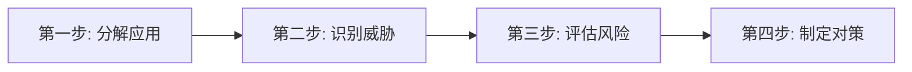
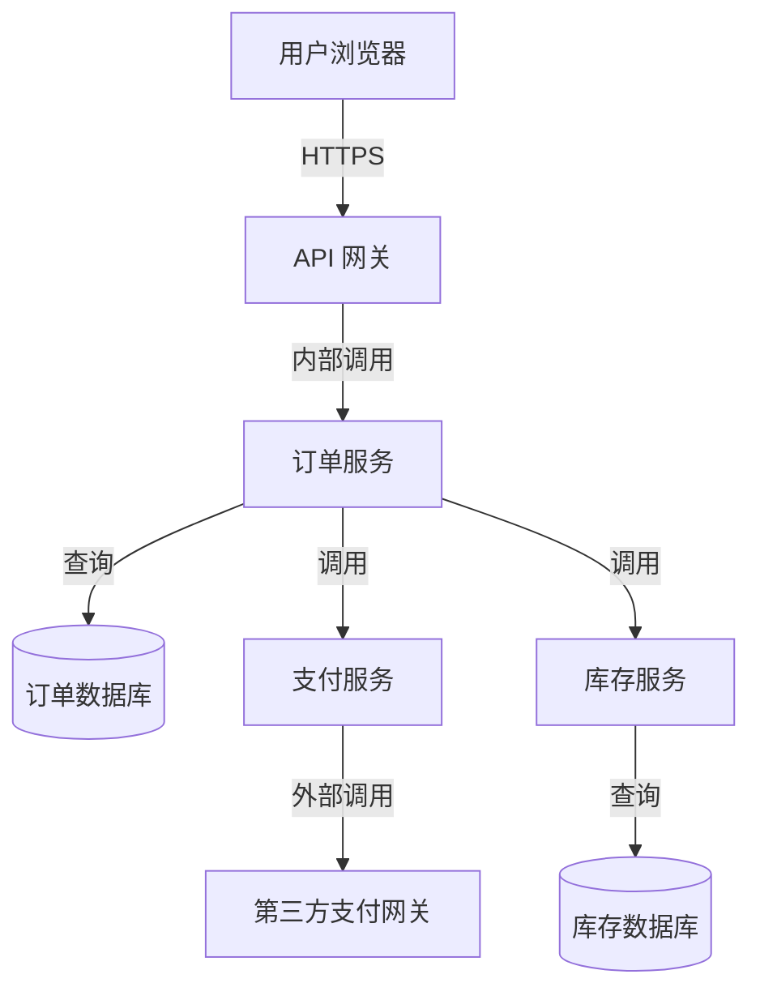
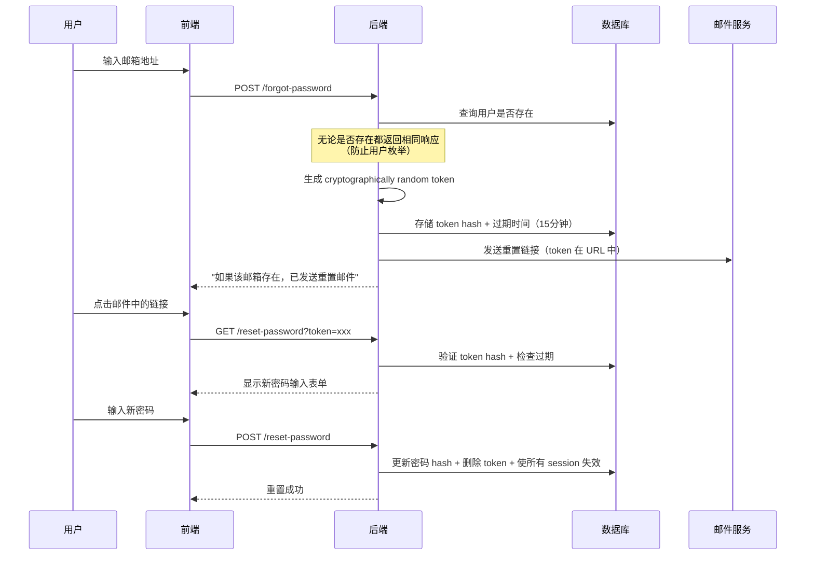
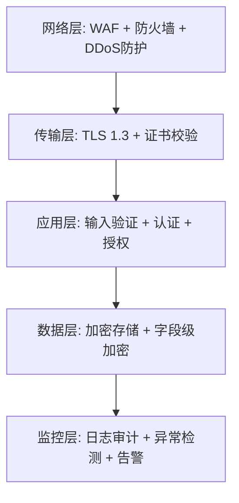
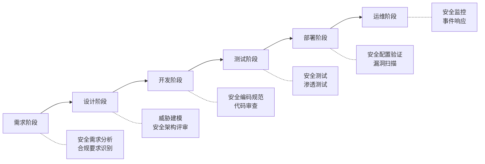

## 14.5 A04：不安全设计（Insecure Design）

### 14.5.1 为什么 OWASP 2021 新增了这个类别

OWASP Top 10 在 2021 版中将"不安全设计"（A04:2021）列为独立风险类别，这是该榜单历史上第一次将**架构层面的缺陷**与**实现层面的漏洞**明确区分。这一变化背后有一个关键洞察：大量安全事件的根源并非编码错误，而是系统设计之初就没有将安全纳入考量。

传统漏洞（如 SQL 注入、XSS）属于"代码写错了"——修复方式是纠正代码。不安全设计属于"架构想错了"——即使代码实现完美，系统本身仍然不安全。举例来说：一个密码重置流程如果设计上只依赖邮箱链接而没有二次验证，那么无论代码写得多规范，攻击者只要获取到重置链接就能劫持账号。

#### 不安全设计 vs 不安全实现

| 维度 | 不安全设计（Design） | 不安全实现（Implementation） |
|------|---------------------|---------------------------|
| 根因 | 架构/流程/逻辑层面缺少安全控制 | 编码过程中的技术性错误 |
| 典型例子 | 业务逻辑允许负数订单金额 | SQL 注入、XSS、缓冲区溢出 |
| 修复方式 | 重新设计流程或架构 | 打补丁、修改代码 |
| 检测方式 | 威胁建模、架构评审 | 代码审计、SAST/DAST |
| 修复成本 | 高（可能涉及重构） | 低到中（定位并修复） |
| SAST/DAST 可发现性 | 极低 | 高 |

核心区别：不安全实现是"做错了"，不安全设计是"想错了"。

### 14.5.2 威胁建模：安全设计的基石

威胁建模（Threat Modeling）是识别和评估系统安全风险的结构化方法，是预防不安全设计的核心手段。它应该在项目最早期——需求分析和架构设计阶段——就开始执行，而非等到开发完成后再补救。

#### STRIDE 威胁模型

微软提出的 STRIDE 模型是最广泛使用的威胁分类框架：

| 威胁类型 | 全称 | 含义 | 攻击示例 |
|---------|------|------|---------|
| **S** | Spoofing（欺骗） | 冒充他人身份 | 伪造 JWT token、Session 劫持 |
| **T** | Tampering（篡改） | 修改数据或代码 | 篡改 API 请求参数、修改数据库记录 |
| **R** | Repudiation（抵赖） | 否认执行过某操作 | 删除操作日志后否认执行过删除 |
| **I** | Information Disclosure（信息泄露） | 暴露敏感信息 | 错误信息泄露堆栈、API 返回多余字段 |
| **D** | Denial of Service（拒绝服务） | 系统不可用 | 资源耗尽攻击、死锁 |
| **E** | Elevation of Privilege（提权） | 获取更高权限 | 水平越权访问他人数据、垂直越权获取管理员权限 |

#### 威胁建模四步法



**第一步：分解应用**

绘制数据流图（DFD），识别以下要素：

- **外部实体**（矩形）：用户、外部系统、第三方 API
- **处理过程**（圆形）：应用组件、服务、函数
- **数据存储**（平行线）：数据库、文件、缓存
- **数据流**（箭头）：组件间的数据传输
- **信任边界**（虚线）：权限级别变化的边界

**第二步：识别威胁**

对 DFD 中的每个元素，应用 STRIDE 模型逐一检查：

- 外部实体主要面临 Spoofing 威胁
- 数据流主要面临 Tampering 和 Information Disclosure
- 处理过程面临所有六类威胁
- 数据存储主要面临 Tampering、Information Disclosure 和 Repudiation

**第三步：评估风险**

使用 DREAD 评分模型量化风险等级：

- **Damage（损害）**：攻击成功后造成的损害程度（1-10）
- **Reproducibility（复现性）**：攻击的复现难度（1-10）
- **Exploitability（利用难度）**：发动攻击的难度（1-10）
- **Affected Users（影响范围）**：受影响的用户比例（1-10）
- **Discoverability（可发现性）**：漏洞被发现的难度（1-10）

风险分数 = (D + R + E + A + D) / 5，分数越高风险越大。

**第四步：制定对策**

根据风险等级优先处理高分威胁，为每个威胁制定具体的缓解措施。

#### 实战案例：电商系统的威胁建模

以一个典型的电商下单流程为例：



信任边界分析：
1. 用户浏览器 → API 网关：不可信外部 → 可信内部
2. 订单服务 → 第三方支付网关：可信内部 → 半可信外部
3. 各服务之间：需要验证调用者身份

识别出的高风险威胁：
- 用户可以篡改订单金额（Tampering）
- 用户可以重复提交订单（DoS/业务逻辑滥用）
- 支付回调可能被伪造（Spoofing）
- 订单金额与库存扣减不同步（一致性风险）

### 14.5.3 不安全设计的七大典型场景

#### 场景一：业务逻辑缺陷

业务逻辑漏洞是最典型的不安全设计，因为它们利用的是系统设计本身的缺陷而非代码错误。

**电商负数金额攻击**

```python
# 设计缺陷：未验证业务上下文中的数值合理性
# 即使代码正确处理了负数，设计上就不该允许负数商品数量
def apply_discount(order_total, discount_percent):
    """
    设计层面应该：
    1. 验证 discount_percent 在 0-100 范围内
    2. 验证折扣后金额 >= 0
    3. 限制总折扣金额不超过订单金额
    """
    return order_total * (1 - discount_percent / 100)

# 攻击：discount_percent = -50 → 金额变为原来的 1.5 倍
# 攻击：discount_percent = 200 → 金额变负数，退款变成收入
```

**优惠券无限使用**

```text
设计缺陷流程：
1. 生成优惠券 → 分发给用户
2. 用户下单时提交优惠券码 → 系统验证有效性 → 应用折扣
❌ 缺失：优惠券使用次数追踪
❌ 缺失：同一用户重复使用检查
❌ 缺失：优惠券与用户/订单的绑定关系
```

**积分/余额逻辑攻击**

```python
# 设计缺陷示例：转账流程未考虑并发
def transfer(from_account, to_account, amount):
    balance = get_balance(from_account)
    if balance >= amount:  # 检查余额
        # ⚠️ 检查和扣减之间存在竞态条件
        # 并发场景下两个请求可能同时通过余额检查
        deduct(from_account, amount)
        credit(to_account, amount)
```

正确设计应该使用数据库事务 + 行级锁：

```sql
BEGIN;
SELECT balance FROM accounts WHERE id = ? FOR UPDATE;
-- FOR UPDATE 确保行级锁，防止并发修改
UPDATE accounts SET balance = balance - ? WHERE id = ? AND balance >= ?;
UPDATE accounts SET balance = balance + ? WHERE id = ?;
COMMIT;
```

#### 场景二：缺乏速率限制

速率限制是防御暴力破解、凭证填充、API 滥用的基础控制。缺少速率限制意味着系统对攻击者敞开大门。

**需要速率限制的关键端点：**

| 端点类型 | 推荐限制策略 | 说明 |
|---------|------------|------|
| 登录接口 | 5次/分钟/账号 + 20次/分钟/IP | 防暴力破解，区分账号和IP维度 |
| 密码重置 | 3次/小时/邮箱 | 防止邮箱轰炸和枚举 |
| 注册接口 | 10次/小时/IP | 防批量注册 |
| 短信验证码 | 1次/60秒/手机号 | 防短信轰炸 |
| API 调用 | 100次/分钟/用户 | 防 API 滥用 |
| 文件上传 | 10次/分钟/用户 | 防存储耗尽 |
| 搜索接口 | 30次/分钟/用户 | 防爬虫和资源耗尽 |

**多维度限流设计：**

```python
# 使用令牌桶算法的多维度限流示例
import time
import redis

class RateLimiter:
    def __init__(self, redis_client):
        self.redis = redis_client

    def is_allowed(self, key, max_requests, window_seconds):
        """
        滑动窗口限流
        key: 限流维度标识，如 "login:user:123" 或 "login:ip:1.2.3.4"
        """
        now = time.time()
        pipe = self.redis.pipeline()
        pipe.zremrangebyscore(key, 0, now - window_seconds)
        pipe.zadd(key, {str(now): now})
        pipe.zcard(key)
        pipe.expire(key, window_seconds)
        results = pipe.execute()
        request_count = results[2]
        return request_count <= max_requests

# 使用方式
limiter = RateLimiter(redis.Redis())

def login_handler(request):
    username = request.form['username']
    ip = request.remote_addr

    # 双维度限流
    if not limiter.is_allowed(f"login:user:{username}", 5, 60):
        return "账号临时锁定，请1分钟后重试", 429
    if not limiter.is_allowed(f"login:ip:{ip}", 20, 60):
        return "请求过于频繁，请稍后重试", 429

    # 验证密码...
```

#### 场景三：不安全的密码重置流程

密码重置是最常被忽视的高危流程。设计缺陷可能导致整个账号体系被攻破。

**常见的不安全设计模式：**

1. **基于用户名的重置**：输入用户名就发送重置链接 → 用户名枚举
2. **可预测的重置 token**：token 是序列号或时间戳 → 可预测/暴力破解
3. **token 无过期时间**：获取 token 后可永久使用
4. **重置后不使旧 session 失效**：攻击者已有的 session 仍有效
5. **通过 URL 参数传递 token**：token 留在浏览器历史和服务器日志中

**安全的密码重置流程设计：**



#### 场景四：缺少职责分离

关键操作如果由单一角色独立完成，一旦该角色被攻破，整个系统沦陷。

**典型场景：**

- 财务转账：出纳一个人就能完成转账（应需要审批）
- 代码部署：开发者直接推送到生产环境（应需要审批和 CI/CD）
- 用户数据删除：客服就能删除用户账号（应需要主管审批）
- 系统配置修改：单个管理员修改安全策略（应需要双人确认）

**实现方式：四眼原则（Four-Eyes Principle）**

```python
# 审批工作流示例
class ApprovalWorkflow:
    def __init__(self):
        self.pending_approvals = {}  # approval_id -> request

    def submit_request(self, requester, action, target, details):
        """提交需要审批的操作"""
        approval_id = generate_uuid()
        self.pending_approvals[approval_id] = {
            'requester': requester,
            'action': action,
            'target': target,
            'details': details,
            'status': 'pending',
            'approvals': [],
            'required_approvals': 2,  # 至少需要2人审批
            'created_at': datetime.now(),
            'expires_at': datetime.now() + timedelta(hours=24)
        }
        return approval_id

    def approve(self, approval_id, approver):
        """审批操作"""
        request = self.pending_approvals[approval_id]

        # 关键：审批人不能是请求人
        if approver == request['requester']:
            raise ValueError("审批人不能是操作请求人")

        # 关键：审批人必须有对应权限
        if not has_approval_permission(approver, request['action']):
            raise PermissionError("该用户无此操作的审批权限")

        request['approvals'].append({
            'approver': approver,
            'timestamp': datetime.now()
        })

        if len(request['approvals']) >= request['required_approvals']:
            self._execute_action(request)
            request['status'] = 'approved'
```

#### 场景五：不安全的直接对象引用（设计层面）

虽然 IDOR 通常归类为访问控制问题，但从设计角度看，暴露内部标识符本身就是设计缺陷。

**设计层面的改进建议：**

```python
# 不安全设计：直接暴露数据库自增 ID
# GET /api/users/123
# GET /api/users/124  → 攻击者可以遍历

# 更好的设计：使用不可预测的资源标识符
import uuid

class User:
    def __init__(self):
        self.id = auto_increment()           # 内部使用
        self.public_id = uuid.uuid4().hex    # 对外暴露
        # GET /api/users/a1b2c3d4e5f6...

# 最佳设计：使用间接引用映射
# 用户看到的 token 与实际资源 ID 之间有一层映射
class ResourceMapping:
    def create_token(self, resource_type, resource_id):
        """为资源创建临时访问 token"""
        token = secrets.token_urlsafe(32)
        self.redis.setex(
            f"resource_token:{token}",
            3600,  # 1小时过期
            f"{resource_type}:{resource_id}"
        )
        return token
```

#### 场景六：缺乏安全审计和日志设计

日志不是事后补救的工具，而是安全架构的核心组件。设计阶段必须规划"记录什么、怎么记录、记录到哪里"。

**安全日志设计要求：**

```python
# 安全日志记录器设计
import json
import hashlib
from datetime import datetime

class SecurityAuditLogger:
    """
    设计原则：
    1. 日志不可篡改（写入后不可修改）
    2. 日志不包含敏感数据（密码、token、身份证号）
    3. 日志包含足够的上下文用于事件重建
    4. 日志必须有完整性校验
    """

    REQUIRED_FIELDS = [
        'timestamp',      # 何时
        'event_type',     # 什么事
        'actor',          # 谁做的
        'source_ip',      # 从哪来
        'resource',       # 操作对象
        'action',         # 做了什么
        'result',         # 结果（成功/失败）
        'request_id',     # 请求追踪 ID
    ]

    SENSITIVE_FIELDS = ['password', 'token', 'secret',
                        'credit_card', 'ssn', 'id_number']

    def log_event(self, event_data):
        # 自动脱敏
        sanitized = self._sanitize(event_data)
        # 添加前一条日志的哈希（形成链式完整性）
        sanitized['previous_hash'] = self.last_log_hash
        # 计算当前日志哈希
        log_hash = hashlib.sha256(
            json.dumps(sanitized, sort_keys=True).encode()
        ).hexdigest()
        sanitized['integrity_hash'] = log_hash
        self.last_log_hash = log_hash
        # 写入不可变存储（如只追加的日志文件、SIEM 系统）
        self._write_immutable(sanitized)
```

**必须记录的安全事件：**

- 认证事件：登录成功/失败、登出、密码修改、MFA 操作
- 授权事件：权限变更、角色分配、越权尝试
- 数据操作：敏感数据的创建、读取、修改、删除
- 系统事件：配置变更、服务启停、异常错误
- 管理事件：用户创建/删除、策略变更、系统升级

#### 场景七：API 设计安全缺陷

API 是现代应用的攻击面核心，设计阶段的安全考量至关重要。

**常见的 API 不安全设计：**

1. **过度数据暴露**：API 返回的数据远超客户端需要
2. **批量分配**：客户端可以设置不应由用户控制的字段
3. **缺少资源配额**：没有限制单次请求返回的数据量
4. **GraphQL 深度/宽度攻击**：允许无限嵌套查询
5. **版本管理缺失**：旧版本 API 存在已知漏洞但仍在运行

```python
# 过度数据暴露示例
# 不安全设计
@app.route('/api/users/<id>')
def get_user(id):
    user = User.query.get(id)
    return user.to_dict()  # 返回所有字段，包括密码 hash、内部 ID、角色等

# 安全设计：明确的 API 响应模型
class UserPublicResponse:
    """定义对外暴露的字段白名单"""
    def __init__(self, user):
        self.id = user.public_id
        self.username = user.username
        self.avatar = user.avatar_url
        # 注意：不包含 email、phone、role、password_hash 等

# GraphQL 深度限制示例
# 不安全设计：允许无限嵌套
# query { user(id:1) { orders { items { product { category { ... } } } } } }

# 安全设计：限制查询深度和复杂度
GRAPHQL_MAX_DEPTH = 5
GRAPHQL_MAX_COMPLEXITY = 1000
```

### 14.5.4 安全设计原则体系

安全设计原则是指导架构决策的基石。以下原则应贯穿整个系统设计过程。

#### 核心原则

**1. 最小权限原则（Principle of Least Privilege）**

每个组件、用户、进程只应拥有完成其功能所需的最小权限。

```yaml
# Kubernetes Pod 安全上下文示例
apiVersion: v1
kind: Pod
metadata:
  name: app-pod
spec:
  securityContext:
    runAsNonRoot: true          # 不以 root 运行
    runAsUser: 1000
    fsGroup: 2000
    readOnlyRootFilesystem: true  # 只读根文件系统
  containers:
    - name: app
      image: myapp:latest
      securityContext:
        allowPrivilegeEscalation: false  # 禁止提权
        capabilities:
          drop:
            - ALL                # 删除所有 Linux capabilities
```

**2. 纵深防御（Defense in Depth）**

不依赖单一安全控制，而是部署多层防御。



**3. 失效安全（Fail Secure）**

系统异常时应进入安全状态，而非暴露敏感信息或降低安全控制。

```python
# 不安全：异常时绕过认证
def get_user_data(request):
    try:
        user = authenticate(request)
    except Exception:
        user = get_default_user()  # ❌ 异常时返回默认用户

# 安全：异常时拒绝访问
def get_user_data(request):
    try:
        user = authenticate(request)
    except Exception as e:
        logger.warning(f"认证异常: {e}")
        abort(401)  # ✅ 异常时返回未授权
```

**4. 开放设计（Open Design）**

安全性不应依赖设计的保密性（Kerckhoffs 原则）。系统应该在设计公开的情况下仍然安全。

**5. 职责分离（Separation of Duties）**

关键操作拆分为多个步骤，由不同角色完成，防止单点失控。

**6. 默认安全（Secure by Default）**

系统安装后的默认配置应该是安全的，安全功能不应是可选插件。

```python
# 不安全设计：安全功能默认关闭
class SecurityConfig:
    rate_limiting = False       # 速率限制默认关闭
    csrf_protection = False     # CSRF 保护默认关闭
    audit_logging = False       # 审计日志默认关闭
    encryption_at_rest = False  # 静态加密默认关闭

# 安全设计：安全功能默认开启
class SecurityConfig:
    rate_limiting = True
    csrf_protection = True
    audit_logging = True
    encryption_at_rest = True
```

**7. 经济适用原则（Economy of Mechanism）**

安全机制应尽可能简单。复杂的系统更容易包含设计缺陷。

### 14.5.5 安全设计的 SDL 集成

安全设计必须嵌入软件开发生命周期（SDL）的每个阶段，而非开发完成后的补救措施。



**各阶段安全设计活动：**

| SDL 阶段 | 安全设计活动 | 交付物 |
|---------|------------|--------|
| 需求分析 | 识别安全需求和合规要求 | 安全需求规格书 |
| 架构设计 | 威胁建模、安全架构评审 | 威胁模型文档、安全设计文档 |
| 详细设计 | 安全控制设计、API 安全设计 | 安全设计规格书 |
| 开发实现 | 安全编码规范执行、代码审查 | 安全代码审查报告 |
| 测试验证 | 安全测试用例执行、渗透测试 | 安全测试报告 |
| 部署上线 | 安全配置验证、漏洞扫描 | 安全基线检查报告 |
| 运维监控 | 安全监控、事件响应、定期复审 | 安全运维手册、事件响应计划 |

### 14.5.6 安全设计参考工具与框架

#### OWASP 资源

- **OWASP ASVS（Application Security Verification Standard）**：应用安全验证标准，提供详细的安全控制清单，可作为安全设计的检查表
- **OWASP Cheat Sheet Series**：安全设计速查表集合，涵盖认证、会话管理、访问控制等各领域
- **OWASP Top 10 Proactive Controls**：OWASP 主动安全控制清单，与 Top 10 的"问题"对应的是"解法"

#### 威胁建模工具

| 工具 | 类型 | 适用场景 |
|------|------|---------|
| Microsoft Threat Modeling Tool | 桌面应用 | 传统企业应用，基于 STRIDE |
| OWASP Threat Dragon | Web/桌面 | 开源免费，支持 DFD 绘制 |
| IriusRisk | SaaS/自部署 | 企业级，自动化威胁建模 |
| ThreatModeler | SaaS | 企业级，CI/CD 集成 |
| draw.io + 威胁模型模板 | Web 应用 | 轻量级，灵活自定义 |

#### 安全设计检查清单

在架构评审时，逐项检查以下内容：

```markdown
## 认证设计
- [ ] 是否支持多因素认证（MFA）
- [ ] 密码策略是否合理（最小长度、复杂度、历史检查）
- [ ] 会话管理是否安全（超时、绑定、再生）
- [ ] 是否有账户锁定机制（防暴力破解）

## 授权设计
- [ ] 是否遵循最小权限原则
- [ ] 是否实现了 RBAC 或 ABAC
- [ ] 是否有水平和垂直越权防护
- [ ] 是否有权限变更审计日志

## 数据保护
- [ ] 敏感数据是否加密存储
- [ ] 传输是否使用 TLS 1.2+
- [ ] 是否有数据脱敏策略
- [ ] 是否有数据保留和销毁策略

## 输入验证
- [ ] 是否对所有输入进行服务端验证
- [ ] 是否使用白名单而非黑名单
- [ ] API 是否有速率限制
- [ ] 是否防重放攻击

## 错误处理
- [ ] 错误信息是否不暴露内部细节
- [ ] 异常时是否 fail secure
- [ ] 是否有全局异常处理器
- [ ] 是否有安全的错误日志

## 日志审计
- [ ] 是否记录所有安全关键事件
- [ ] 日志是否防篡改
- [ ] 日志是否脱敏（不含密码、token）
- [ ] 是否有日志监控和告警
```

### 14.5.7 真实案例分析

#### 案例一：Parler 数据泄露（2021）

**事件概述**：社交媒体平台 Parler 在 2021 年 1 月遭遇大规模数据泄露，攻击者通过 API 批量下载了约 70TB 的用户数据，包括含有 GPS 坐标的视频和图片。

**设计缺陷分析**：
- API 使用连续递增的 post ID，攻击者可遍历所有内容
- 删除的内容并未真正从 CDN 移除，仅在前端隐藏
- API 没有速率限制，允许高速批量下载
- 没有身份验证就能访问公开内容的元数据

**正确设计**：使用随机化资源标识符、实施速率限制、真正删除数据而非软删除暴露、API 需要认证。

#### 案例二：Capital One 数据泄露（2019）

**事件概述**：攻击者利用 SSRF 漏洞获取了 AWS 元数据服务的临时凭证，进而访问了 S3 存储桶中的 1 亿条客户记录。

**设计缺陷分析**：
- EC2 实例的 IAM 角色权限过大（违反最小权限原则）
- WAF 规则配置不完善，未检测到 SSRF 攻击
- 缺少网络层面的元数据服务访问控制
- S3 存储桶未启用服务端加密

**正确设计**：最小权限 IAM 角色、网络层隔离元数据服务（IMDSv2）、S3 服务端加密、WAF 规则定期审计。

#### 案例三：逻辑漏洞薅羊毛事件（国内常见）

**事件概述**：某电商平台优惠券系统设计缺陷，攻击者通过以下流程批量获取优惠券：
1. 注册大量虚假账号
2. 每个账号领取新用户优惠券
3. 下单后取消订单，优惠券退回但已计入消费额
4. 利用退回的优惠券叠加使用

**设计缺陷分析**：
- 优惠券与账号的绑定关系不严格
- 取消订单后优惠券应失效但未失效
- 缺少反欺诈检测
- 缺少设备指纹和行为分析

**正确设计**：优惠券与订单强绑定（退款即失效）、新用户注册需要手机+实名认证、异常行为检测（同设备多账号、下单取消频率异常）。

### 14.5.8 常见误区与纠正

| 误区 | 正确认知 |
|------|---------|
| "我们有 WAF 和防火墙，设计层面不需要额外考虑" | WAF 只能防御已知攻击模式，无法防御业务逻辑漏洞 |
| "SAST/DAST 工具能发现所有安全问题" | 工具无法理解业务逻辑，设计缺陷必须靠人工分析 |
| "威胁建模太耗时，项目赶不上" | 早期发现设计缺陷的修复成本是上线后的 1/100 |
| "安全设计是安全团队的事" | 安全设计需要架构师、开发、产品、安全多方协作 |
| "遵循 OWASP Top 10 就够了" | Top 10 是风险清单，不是安全设计方法论 |
| "用框架就安全了" | 框架提供安全机制，但业务逻辑设计仍需人工把关 |

### 14.5.9 本节小结

不安全设计是 OWASP 2021 新增的风险类别，强调安全必须从设计阶段就融入系统架构，而非事后补救。其核心要点：

1. **区分设计与实现**：设计缺陷无法通过打补丁解决，需要重新设计
2. **威胁建模是基石**：在架构阶段使用 STRIDE 等框架系统性识别威胁
3. **七大典型场景**：业务逻辑缺陷、缺乏速率限制、不安全密码重置、缺少职责分离、不安全的直接对象引用、缺乏安全审计、API 设计缺陷
4. **安全设计原则**：最小权限、纵深防御、失效安全、默认安全等原则贯穿始终
5. **嵌入 SDL**：安全设计活动必须融入软件开发生命周期的每个阶段
6. **工具辅助而非替代**：威胁建模工具和检查清单辅助设计，但最终需要人的安全思维

不安全设计的修复成本远高于其他漏洞类型——因为它要求的是架构层面的改变，而非代码层面的修补。预防不安全设计的最佳策略是在项目最早期就开始威胁建模，并在整个开发过程中持续验证安全设计的正确性。
