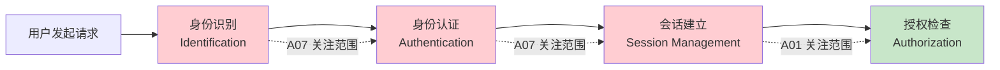
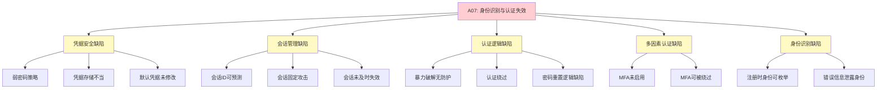
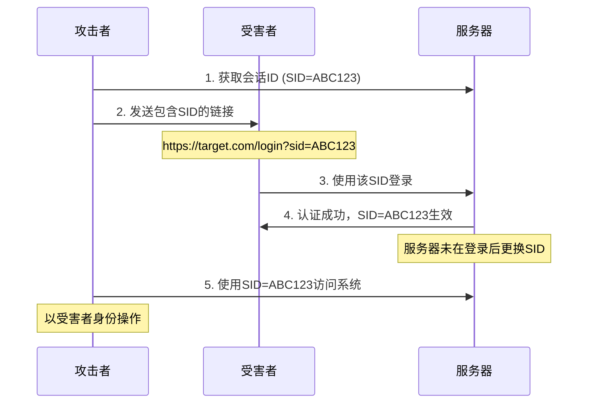
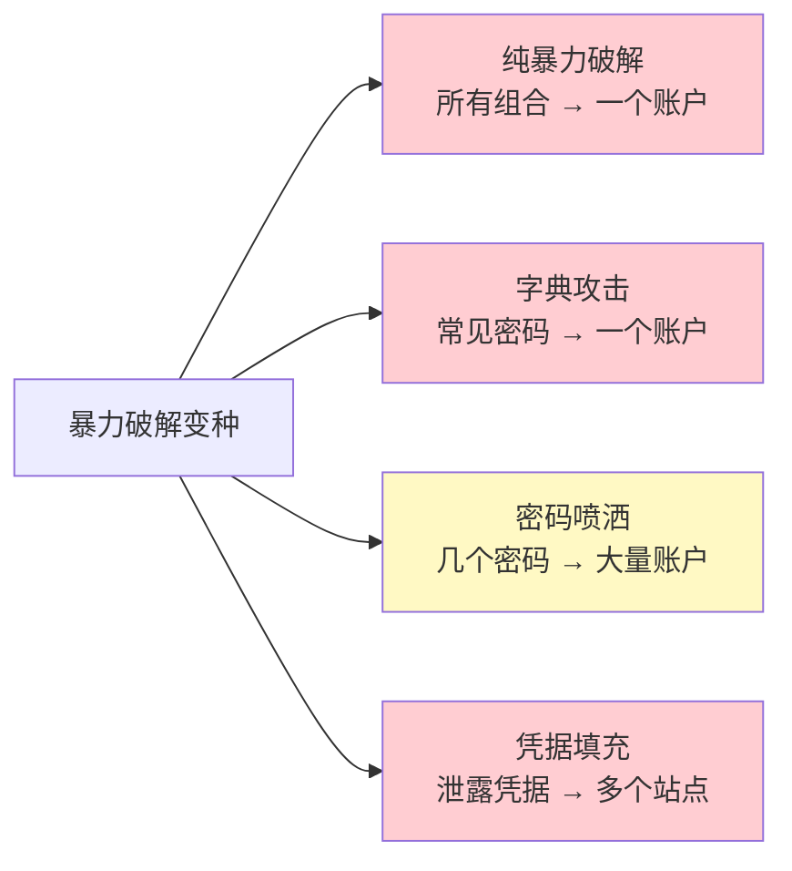
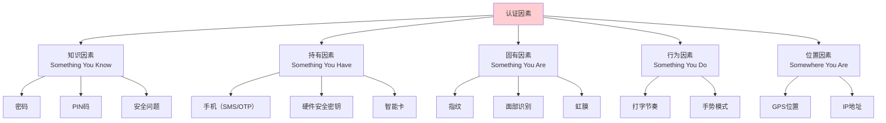
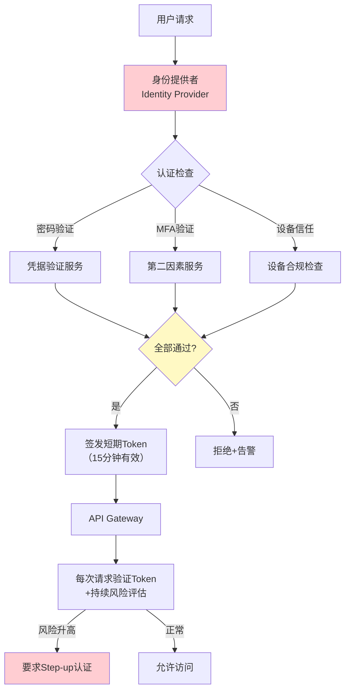

## 14.8 A07：身份识别与认证失效（Identification and Authentication Failures）

### 14.8.1 定义与本质

身份识别与认证失效（A07）是指Web应用在确认用户身份的过程中存在缺陷，使攻击者能够冒充合法用户、窃取凭据或绕过认证机制。OWASP对该类别的正式定义涵盖了从前端登录表单到后端凭据存储、从会话管理到多因素认证的完整认证链路。

在OWASP Top 10:2017版本中，这一类别被称为"Broken Authentication"（排名第二），2021版将其更名为"Identification and Authentication Failures"并降至第七位——名称变化反映了OWASP对"身份识别"环节的重视：认证失效不仅仅是密码验证的问题，更包括系统是否正确识别了"谁在请求"。

**认证（Authentication）与授权（Authorization）的区别**是理解本类漏洞的基础。认证回答"你是谁"，授权回答"你能做什么"。A07关注前者——如果认证本身就被绕过，后续的授权控制形同虚设。



**从攻击者视角看**：认证机制是进入系统的钥匙。一旦认证失效，攻击者不需要再寻找注入点或XSS漏洞——他们直接以合法用户身份操作，所有安全审计日志都会显示"正常登录"，极难被事后追溯。

### 14.8.2 漏洞分类体系

A07涵盖的漏洞可以分为以下五大类：



### 14.8.3 凭据安全缺陷

#### 14.8.3.1 弱密码策略

弱密码策略是认证失效最常见的根源之一。NIST SP 800-63B（2023修订版）对密码策略的建议已经从"强制复杂度"转向"强制长度+黑名单"：

| 策略维度 | 旧式做法（已淘汰） | NIST推荐做法 | 原因 |
|---------|-------------------|-------------|------|
| 最小长度 | 6-8字符 | 8字符（用户自设），15字符（管理员） | 长度对抗暴力破解的效果远超复杂度 |
| 复杂度要求 | 必须含大小写+数字+特殊字符 | 不强制复杂度 | 复杂度要求导致用户写出your_password这类可预测变体 |
| 密码更换周期 | 强制90天更换 | 不强制定期更换 | 定期更换导致用户选择更弱的密码或简单递增 |
| 密码黑名单 | 无 | 禁止已泄露密码、常见密码、服务名等 | Have I Been Pwned API提供数十亿已泄露密码 |
| 密码管理器 | 禁止粘贴 | 允许并鼓励粘贴 | 密码管理器是提升密码安全性的最有效工具 |

**常见弱密码Top 20**（根据SplashData年度统计）：

```text
123456、password、123456789、12345678、12345、1234567、qwerty、
abc123、football、1234、111111、1234567890、admin、welcome、
123、monkey、master、dragon、login、princess
```

**密码强度与破解时间对比**（假设每秒10亿次哈希尝试）：

| 密码类型 | 示例 | 组合数 | 破解时间 |
|---------|------|--------|---------|
| 6位纯数字 | 123456 | 10^6 | < 0.001秒 |
| 8位小写字母 | password | 26^8 ≈ 2×10^11 | 约3分钟 |
| 8位混合字符 | your_password | 95^8 ≈ 6.6×10^15 | 约77天 |
| 12位混合字符 | Tr0ub4dor&3 | 95^12 ≈ 5.4×10^23 | 约1700万年 |
| 20位随机passphrase | correct-horse-battery-staple | 2048^4（Diceware） | 约10^13年 |

#### 14.8.3.2 凭据存储不当

凭据存储是认证安全的最后防线。即使数据库泄露，正确的哈希策略也能为用户争取更换密码的时间。

**哈希算法安全等级对比**：

| 算法 | 类型 | 推荐度 | 特点 | 适用场景 |
|------|------|--------|------|---------|
| MD5 | 快速哈希 | ❌ 禁止使用 | GPU每秒数十亿次碰撞，已被彩虹表完全破解 | 仅用于文件校验 |
| SHA-1 | 快速哈希 | ❌ 禁止使用 | Google已公开碰撞攻击（SHAttered） | 仅用于Git对象标识 |
| SHA-256 | 快速哈希 | ❌ 不推荐 | 速度过快，不适合密码哈希 | 数字签名、证书 |
| bcrypt | 自适应哈希 | ✅ 推荐 | 内置salt，可调节cost factor（2^cost次迭代） | 通用Web应用 |
| scrypt | 自适应哈希 | ✅ 推荐 | 内存密集型，抗ASIC/GPU攻击 | 高安全需求场景 |
| Argon2id | 自适应哈希 | ✅ 首选 | 2015年密码哈希竞赛冠军，可调时间/内存/并行度 | 新系统首选 |

**错误的密码存储示例**：

```python
# ❌ 严重错误：明文存储
def store_password_plaintext(username, password):
    db.execute("INSERT INTO users (username, password) VALUES (?, ?)",
               (username, password))

# ❌ 错误：仅使用MD5
def store_password_md5(username, password):
    hashed = hashlib.md5(password.encode()).hexdigest()
    db.execute("INSERT INTO users (username, password) VALUES (?, ?)",
               (username, hashed))

# ❌ 错误：MD5 + 硬编码盐
def store_password_md5_salt(username, password):
    salt = "my_fixed_salt"  # 盐必须唯一且随机
    hashed = hashlib.md5((salt + password).encode()).hexdigest()
    db.execute("INSERT INTO users (username, password) VALUES (?, ?)",
               (username, hashed))
```

**正确的密码存储示例**：

```python
# ✅ 使用bcrypt（推荐）
import bcrypt

def store_password_bcrypt(username, password):
    # bcrypt自动处理salt生成，cost factor默认为12（2^12次迭代）
    hashed = bcrypt.hashpw(password.encode('utf-8'), bcrypt.gensalt(rounds=12))
    db.execute("INSERT INTO users (username, password) VALUES (?, ?)",
               (username, hashed.decode('utf-8')))

def verify_password_bcrypt(username, password):
    row = db.execute("SELECT password FROM users WHERE username = ?", (username,))
    if row:
        return bcrypt.checkpw(password.encode('utf-8'), row['password'].encode('utf-8'))
    return False

# ✅ 使用Argon2id（首选）
from argon2 import PasswordHasher

ph = PasswordHasher(
    time_cost=3,        # 迭代次数
    memory_cost=65536,  # 内存使用64MB
    parallelism=4,      # 并行线程数
    hash_len=32,        # 输出哈希长度
    salt_len=16         # 盐长度
)

def store_password_argon2(username, password):
    hashed = ph.hash(password)
    db.execute("INSERT INTO users (username, password) VALUES (?, ?)",
               (username, hashed))

def verify_password_argon2(username, password):
    row = db.execute("SELECT password FROM users WHERE username = ?", (username,))
    if row:
        try:
            return ph.verify(row['password'], password)
        except argon2.exceptions.VerifyMismatchError:
            return False
        except argon2.exceptions.InvalidHashError:
            # 哈希需要重新计算（参数已更新）
            new_hash = ph.hash(password)
            db.execute("UPDATE users SET password = ? WHERE username = ?",
                       (new_hash, username))
            return True
    return False
```

#### 14.8.3.3 默认凭据未修改

许多系统在安装后保留默认管理员凭据。攻击者通常拥有主流系统的默认凭据字典：

| 系统/组件 | 默认用户名 | 默认密码 | 高危场景 |
|----------|-----------|---------|---------|
| Tomcat Manager | tomcat | tomcat | 部署恶意WAR包获取RCE |
| Jenkins | admin | 自动生成（在初始日志中） | 执行任意系统命令 |
| phpMyAdmin | root | 空或123456 | 直接操作数据库 |
| MongoDB | 无认证 | 无认证 | 读取/删除全部数据 |
| Redis | 无认证 | 无认证 | 写入SSH公钥获取服务器权限 |
| Elasticsearch | elastic | changeme | 索引数据全部暴露 |
| WordPress Admin | admin | 用户自设 | 网站完全控制权 |
| Oracle DB | scott | tiger | 数据库访问 |
| MySQL | root | 空 | 数据库完全控制 |

### 14.8.4 会话管理缺陷

会话（Session）是认证后的持续状态。会话管理缺陷意味着攻击者可以在用户认证通过后劫持其会话。

#### 14.8.4.1 会话ID安全要求

安全的会话ID必须满足以下条件：

| 要求 | 说明 | 不满足的后果 |
|------|------|------------|
| 足够的随机性 | 使用CSPRNG（密码学安全伪随机数生成器）生成，至少128位熵 | 攻击者可预测或暴力枚举会话ID |
| 足够的长度 | 至少128位（32个十六进制字符） | 空间太小导致暴力枚举可行 |
| 不可预测性 | 不能基于时间戳、用户ID、递增序列等可预测因子 | 攻击者可推算其他用户的会话ID |
| 唯一性 | 每次会话必须生成新的ID | 会话固定攻击 |

**测试会话ID随机性的方法**：

```bash
# 收集多个会话ID进行随机性分析
# 1. 使用Burp Suite的Sequencer模块
# 2. 或手动收集后用工具分析

# 收集100个会话Cookie
for i in $(seq 1 100); do
    curl -s -c - https://target.com/login | grep SESSIONID >> session_ids.txt
done

# 使用ent工具进行熵分析
cat session_ids.txt | ent
# 期望结果：熵值接近8.0（每字节），卡方测试通过
```

#### 14.8.4.2 会话固定攻击（Session Fixation）

会话固定攻击的流程：



**防御方法**：用户认证成功后必须立即生成新的会话ID：

```python
# Flask示例
from flask import session, redirect

@app.route('/login', methods=['POST'])
def login():
    username = request.form['username']
    password = request.form['password']
    
    if verify_credentials(username, password):
        # 关键：清除旧session，创建新session
        session.clear()
        session.regenerate()  # 或在Flask中直接设置新session
        session['user_id'] = get_user_id(username)
        session['login_time'] = time.time()
        return redirect('/dashboard')
    
    return 'Login failed', 401

# Django示例（Django默认每次登录创建新session_key）
def login_view(request):
    if authenticate(request, username=username, password=password):
        # Django的login()默认会轮换session_key
        request.session.cycle_key()  # 显式轮换
        login(request, user)
        return redirect('/dashboard')
```

#### 14.8.4.3 会话超时与注销

会话生命周期管理的常见错误：

| 问题 | 风险 | 正确做法 |
|------|------|---------|
| 会话永不超时 | 用户忘记退出时，会话永久有效 | 设置绝对超时（如24小时）和空闲超时（如30分钟） |
| 注销不清除服务端会话 | 注销后Token仍有效 | 注销时销毁服务端会话记录 |
| 仅清除客户端Cookie | 攻击者可重放旧Cookie | 必须同时清除服务端Session存储 |
| 超时过短 | 频繁登录影响用户体验 | 关键操作（修改密码、支付）要求重新认证，非关键页面适度放宽 |

**正确的注销实现**：

```python
# 服务端注销
@app.route('/logout', methods=['POST'])
def logout():
    if 'session_id' in session:
        # 从Redis/数据库中删除会话记录
        redis_client.delete(f"session:{session['session_id']}")
    
    # 清除服务端session
    session.clear()
    
    # 清除客户端Cookie（设置过期时间为过去）
    response = redirect('/login')
    response.delete_cookie('session_id', path='/', domain='.example.com')
    response.delete_cookie('remember_token', path='/', domain='.example.com')
    
    return response
```

### 14.8.5 暴力破解与凭据填充

#### 14.8.5.1 暴力破解（Brute Force）

暴力破解是指攻击者系统性地尝试所有可能的密码组合。常见变种：

- **纯暴力破解**：尝试所有字符组合，密码越长耗时越久
- **字典攻击**：使用常见密码列表逐个尝试，效率远高于纯暴力
- **密码喷洒（Password Spraying）**：用少数常见密码尝试大量账户，规避单账户锁定策略
- **凭据填充（Credential Stuffing）**：使用其他网站泄露的用户名/密码对批量尝试



#### 14.8.5.2 暴力破解防护策略

**多层防御体系**（纵深防御原则）：

| 防御层 | 措施 | 实现方式 | 效果 |
|-------|------|---------|------|
| 网络层 | IP限速 | Nginx limit_req、Cloudflare Rate Limiting | 阻止单IP高频请求 |
| 应用层 | 账户锁定 | 连续失败N次后锁定账户或延迟响应 | 防止单账户暴力破解 |
| 应用层 | 验证码 | 登录失败2-3次后触发CAPTCHA | 阻止自动化脚本 |
| 应用层 | 速率限制 | 基于IP+账户的滑动窗口限速 | 精细化控制请求频率 |
| 通知层 | 异常告警 | 检测异常登录模式并通知用户 | 及时发现攻击 |
| 认证层 | MFA | 强制多因素认证 | 即使密码泄露也无法登录 |

**基于Redis的登录速率限制实现**：

```python
import redis
import time

r = redis.Redis()

def check_login_rate_limit(username, ip_address):
    """检查登录速率限制，返回 (allowed, wait_seconds)"""
    
    # 键1：基于用户名的限制（防止单账户暴力破解）
    user_key = f"login_attempts:user:{username}"
    # 键2：基于IP的限制（防止分布式攻击）
    ip_key = f"login_attempts:ip:{ip_address}"
    
    user_attempts = int(r.get(user_key) or 0)
    ip_attempts = int(r.get(ip_key) or 0)
    
    # 用户级别：5分钟内最多5次失败
    if user_attempts >= 5:
        ttl = r.ttl(user_key)
        return False, ttl
    
    # IP级别：1分钟内最多10次失败
    if ip_attempts >= 10:
        ttl = r.ttl(ip_key)
        return False, ttl
    
    return True, 0

def record_login_failure(username, ip_address):
    """记录登录失败"""
    user_key = f"login_attempts:user:{username}"
    ip_key = f"login_attempts:ip:{ip_address}"
    
    pipe = r.pipeline()
    pipe.incr(user_key)
    pipe.expire(user_key, 300)  # 5分钟窗口
    pipe.incr(ip_key)
    pipe.expire(ip_key, 60)     # 1分钟窗口
    pipe.execute()

def record_login_success(username, ip_address):
    """登录成功后清除失败计数"""
    r.delete(f"login_attempts:user:{username}")
```

**渐进式延迟（Exponential Backoff）**：

```python
import time
import math

def login_with_backoff(username, password):
    attempts = get_failed_attempts(username)  # 从数据库/Redis获取
    
    if attempts > 0:
        # 延迟时间：2^attempts 秒，最大60秒
        delay = min(2 ** attempts, 60)
        time.sleep(delay)
    
    if verify_credentials(username, password):
        clear_failed_attempts(username)
        return create_session(username)
    else:
        increment_failed_attempts(username)
        return None
```

### 14.8.6 认证绕过漏洞

认证绕过是指攻击者无需知道正确凭据即可通过认证。以下是常见的认证绕过方式：

#### 14.8.6.1 SQL注入绕过认证

```sql
-- 经典的认证绕过Payload
-- 用户名: admin' --
-- 密码: 任意值
SELECT * FROM users WHERE username='admin' --' AND password='anything'
-- 注释符将密码检查部分消除

-- 另一种变体
-- 用户名: ' OR 1=1 --
SELECT * FROM users WHERE username='' OR 1=1 --' AND password='anything'
-- 1=1 恒真，返回第一个用户（通常是admin）
```

**防御**：使用参数化查询（Prepared Statement），永远不要拼接SQL字符串。

#### 14.8.6.2 JWT认证缺陷

JWT（JSON Web Token）是现代Web应用常用的无状态认证机制，但配置不当会导致严重漏洞：

**未验证签名算法**：

```python
# ❌ 危险：允许none算法
import jwt

# 攻击者构造的Token（header中alg设为none）
# {"alg": "none", "typ": "JWT"}
# {"sub": "admin", "role": "admin"}
# 签名: （空）

# 不安全的验证方式
payload = jwt.decode(token, options={"verify_signature": False})

# ✅ 安全：强制指定算法
payload = jwt.decode(token, key=SECRET_KEY, algorithms=["HS256"])
```

**弱密钥攻击**：

```bash
# 使用hashcat暴力破解JWT的HS256密钥
hashcat -a 0 -m 16500 jwt.txt wordlist.txt

# 使用jwt_tool工具
python3 jwt_tool.py <JWT_TOKEN> -C -d wordlist.txt
```

**RSA公钥混淆攻击（alg:HS256 vs RS256）**：

```python
# 攻击场景：服务端使用RS256（RSA+SHA256），但允许客户端指定算法
# 攻击者将alg改为HS256，并用RSA公钥作为HMAC密钥签名
# 服务端用同一个公钥验证HMAC → 验证通过

# ❌ 漏洞代码
payload = jwt.decode(token, PUBLIC_KEY, algorithms=["RS256", "HS256"])

# ✅ 修复：只允许预期的算法
payload = jwt.decode(token, PRIVATE_KEY, algorithms=["RS256"])
```

**JWT安全检查清单**：

| 检查项 | 风险 | 修复 |
|-------|------|------|
| alg是否设为none | 完全绕过签名验证 | 服务端强制指定允许的算法列表 |
| 是否使用对称算法（HS256）且密钥较弱 | 密钥可被暴力破解 | 使用至少256位随机密钥 |
| 是否存在kid注入 | 密钥ID可控导致密钥切换 | 验证kid为预期值 |
| exp是否校验 | Token永不过期 | 始终校验exp字段 |
| 是否存在签名混淆 | RS256→HS256攻击 | 只允许一种算法 |

### 14.8.7 密码重置漏洞

密码重置流程是认证系统的高危攻击面，因为它本身就是"绕过现有密码"的合法通道。

#### 14.8.7.1 常见密码重置漏洞

**重置Token可预测**：

```python
# ❌ 错误：基于时间戳生成Token
import time
reset_token = md5(str(time.time()) + username)  # 可预测

# ❌ 错误：短Token
import random
reset_token = str(random.randint(100000, 999999))  # 仅100万种可能

# ✅ 正确：使用CSPRNG生成足够长的Token
import secrets
reset_token = secrets.token_urlsafe(32)  # 256位熵
```

**重置Token未及时失效**：

```python
# ❌ Token永不失效
def reset_password(token, new_password):
    user = db.query("SELECT * FROM users WHERE reset_token = ?", (token,))
    if user:
        update_password(user['id'], new_password)
        # 缺少：db.execute("UPDATE users SET reset_token=NULL WHERE id=?", (user['id'],))

# ✅ Token使用后立即失效，并设置过期时间
def reset_password(token, new_password):
    user = db.query(
        "SELECT * FROM users WHERE reset_token = ? AND reset_token_expires > ?",
        (token, datetime.now())
    )
    if user:
        update_password(user['id'], new_password)
        db.execute(
            "UPDATE users SET reset_token=NULL, reset_token_expires=NULL WHERE id=?",
            (user['id'],)
        )
        # 同时使所有现有会话失效
        invalidate_all_sessions(user['id'])
```

**用户枚举（User Enumeration）**：

```python
# ❌ 错误：通过重置响应差异泄露用户是否存在
@app.route('/reset-password', methods=['POST'])
def reset_password_request():
    email = request.form['email']
    user = db.query("SELECT * FROM users WHERE email = ?", (email,))
    if user:
        send_reset_email(email)
        return "重置邮件已发送"  # 用户存在
    else:
        return "该邮箱未注册"    # 用户不存在 → 枚举漏洞

# ✅ 正确：无论用户是否存在，返回相同响应
@app.route('/reset-password', methods=['POST'])
def reset_password_request():
    email = request.form['email']
    user = db.query("SELECT * FROM users WHERE email = ?", (email,))
    if user:
        send_reset_email(email)
    # 始终返回相同消息，不泄露用户是否存在
    return "如果该邮箱已注册，您将收到重置邮件"
```

### 14.8.8 多因素认证（MFA）

#### 14.8.8.1 MFA因素分类



#### 14.8.8.2 MFA方案安全性对比

| MFA方案 | 安全等级 | 抗钓鱼 | 抗SIM劫持 | 用户体验 | 成本 |
|---------|---------|--------|----------|---------|------|
| SMS验证码 | 低 | ❌ | ❌ | 高 | 低 |
| TOTP（Google Authenticator） | 中 | ❌ | ✅ | 中 | 无 |
| HOTP（HMAC-Based OTP） | 中 | ❌ | ✅ | 中 | 无 |
| 推送通知（如Duo Push） | 中高 | ⚠️ | ✅ | 高 | 中 |
| FIDO2/WebAuthn（硬件密钥） | 高 | ✅ | ✅ | 高 | 高 |
| 生物识别（指纹/面部） | 中 | ❌ | ✅ | 高 | 中 |

**TOTP实现示例**：

```python
import pyotp
import qrcode

# 服务端生成TOTP密钥
def enable_totp(user_id):
    secret = pyotp.random_base32()  # 160位密钥
    db.execute("UPDATE users SET totp_secret = ? WHERE id = ?", (secret, user_id))
    
    # 生成二维码URI
    totp = pyotp.TOTP(secret)
    provisioning_uri = totp.provisioning_uri(
        name=get_user_email(user_id),
        issuer_name="MyApp"
    )
    return provisioning_uri

# 验证TOTP
def verify_totp(user_id, code):
    secret = db.query("SELECT totp_secret FROM users WHERE id = ?", (user_id,))
    if secret:
        totp = pyotp.TOTP(secret['totp_secret'])
        # valid_window=1 允许前后30秒的误差
        return totp.verify(code, valid_window=1)
    return False
```

**SMS验证码的安全风险**：

虽然SMS是最常见的第二因素，但它存在已被实际利用的安全缺陷：

- **SIM Swap攻击**：攻击者欺骗运营商将受害者手机号转移到自己的SIM卡
- **SS7协议漏洞**：电信信令协议存在已知漏洞，可拦截短信
- **恶意软件拦截**：Android恶意应用可读取短信内容
- **社会工程**：通过钓鱼获取用户转发验证码

**NIST SP 800-63B已将SMS从"受限"降级为"受限验证器"**，不再推荐作为唯一的第二因素。

### 14.8.9 真实安全事件

#### 事件1：GitHub 2013年密码暴力破解事件

2013年，GitHub遭受大规模暴力破解攻击。攻击者使用从其他网站泄露的凭据列表对GitHub账户进行凭据填充。受影响的账户被强制重置密码。此事件促使GitHub引入了：
- 登录速率限制
- 异常登录检测（新设备/IP登录时通知用户）
- 支持FIDO2硬件密钥的U2F认证

#### 事件2：Twitter 2022年5.4亿数据泄露

2022年，一个包含5.4亿Twitter用户数据（包括邮箱、手机号、姓名）的数据库在暗网出售。数据来源于2021年底的一个API漏洞（通过手机号/邮箱批量查询用户资料）。泄露的数据为凭据填充攻击提供了充足的"用户名"库。

#### 事件3：Uber 2022年社工+MFA疲劳攻击

2022年9月，Uber遭受攻击。攻击者的攻击链：
1. 从暗网购买了Uber承包商的泄露凭据
2. 尝试登录其Uber账户（凭据仍然有效）
3. 触发MFA推送通知（Duo Push）
4. 持续发送MFA请求，承包商最终误点"批准"（MFA疲劳攻击）
5. 获得内网访问权限，最终控制Uber的AWS、GCP、Slack等核心系统

**教训**：MFA推送通知应限制频率，且应显示请求的具体操作而非简单的"批准/拒绝"。

#### 事件4：Colonial Pipeline 2021年勒索攻击

2021年5月，美国最大燃油管道运营商Colonial Pipeline遭DarkSide勒索软件攻击。入侵路径：一个暴露在互联网上的VPN账户使用了泄露的旧密码，且该账户未启用MFA。攻击者使用凭据填充直接进入内网，随后部署勒索软件。Colonial Pipeline支付了440万美元赎金，美国东海岸燃油供应中断数天。

### 14.8.10 认证安全架构设计

#### 14.8.10.1 零信任认证架构



#### 14.8.10.2 现代认证最佳实践清单

| 实践 | 说明 | 优先级 |
|------|------|--------|
| 使用成熟的认证框架 | OAuth 2.0 + OpenID Connect，或SAML 2.0 | 高 |
| 密码策略基于NIST 800-63B | 最少8字符，黑名单检查，不强制复杂度 | 高 |
| 使用bcrypt/Argon2id存储密码 | 不使用MD5/SHA系列 | 高 |
| 实施MFA | 至少TOTP，推荐FIDO2 | 高 |
| 会话管理 | 认证后轮换Session ID，设置合理超时 | 高 |
| 防暴力破解 | 速率限制+渐进延迟+CAPTCHA | 高 |
| 安全的密码重置 | CSPRNG Token + 限时 + 使用后失效 | 中 |
| 防用户枚举 | 统一错误消息，响应时间一致 | 中 |
| 记录认证事件 | 登录成功/失败/密码重置/MFA操作 | 中 |
| 监控异常行为 | 新设备/IP/地理位置异常检测 | 中 |
| 支持密码管理器 | 允许粘贴密码，不禁止自动填充 | 低 |
| 账户恢复机制 | 多种恢复方式，但不降低安全性 | 低 |

### 14.8.11 认证测试要点

测试A07类漏洞时需要覆盖以下检查点：

| 测试项 | 测试方法 | 预期结果 |
|-------|---------|---------|
| 暴力破解防护 | 使用Hydra/Burp Intruder连续发送错误密码 | 触发速率限制或账户锁定 |
| 密码策略 | 尝试设置弱密码（123456、password等） | 被系统拒绝 |
| 会话固定 | 登录前后Cookie中的Session ID对比 | 登录后Session ID必须改变 |
| Session ID随机性 | 收集100+个Session ID进行Sequencer分析 | 熵值应足够高 |
| 会话超时 | 登录后等待空闲超时时间再操作 | 被要求重新登录 |
| 注销有效性 | 注销后使用旧Session ID访问 | 应返回401/302 |
| 密码重置Token | 分析Token的随机性和有效期 | 随机、有期限、一次性使用 |
| 用户枚举 | 对登录/注册/密码重置接口对比不同输入的响应 | 无信息差异 |
| JWT验证 | 修改alg为none、篡改payload | 验证失败 |
| 默认凭据 | 尝试常见系统的默认用户名/密码组合 | 应被拒绝或已修改 |
| MFA绕过 | 尝试跳过MFA步骤直接访问需要认证的资源 | 必须完成MFA |
| 记住我功能 | 分析"记住我"Cookie的内容和有效期 | 不含明文密码，有过期机制 |

### 14.8.12 常见误区

**误区一：锁定账户就能防暴力破解**

账户锁定是经典防御措施，但单独使用时存在两个问题：攻击者可以利用锁定机制对任意用户发起DoS攻击（锁定合法用户），以及密码喷洒攻击通过每次只尝试一个密码规避单账户锁定。正确做法是结合IP级限速、渐进延迟和CAPTCHA。

**误区二：HTTPS就等于认证安全**

HTTPS仅保证传输层加密，防止中间人窃听。它不解决密码弱、会话管理差、认证逻辑缺陷等应用层问题。HTTPS是必要的基础，但远远不够。

**误区三：MFA万能论**

MFA显著提升安全性，但并非不可绕过。实际已知的MFA绕过手段包括：SIM Swap、MFA疲劳攻击、实时钓鱼代理（如evilginx2）、备份码泄露、会话劫持绕过MFA等。MFA应作为纵深防御的一层，而非唯一依赖。

**误区四：密码越复杂越好**

强制用户使用包含大小写字母+数字+特殊字符的复杂密码，反而导致用户写出your_password1!这类可预测模式的密码，或者写在便签纸上。NIST建议更长的密码（16+字符）配合密码管理器，比短而复杂的密码更安全。

**误区五：加盐哈希就够了**

加盐（salt）防止彩虹表攻击，但盐本身不防止暴力破解。如果使用MD5+盐，攻击者仍然可以对每个盐值单独进行暴力破解。必须使用慢哈希函数（bcrypt/Argon2id），让每次尝试的计算成本足够高。

***
