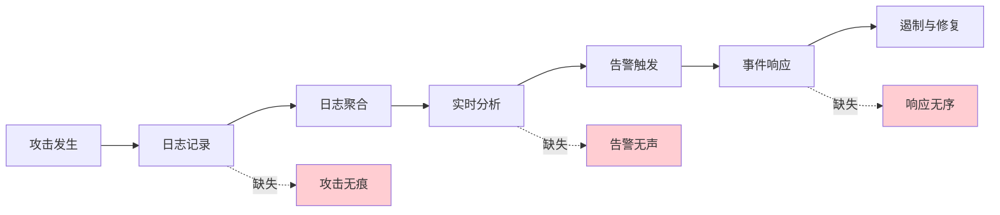
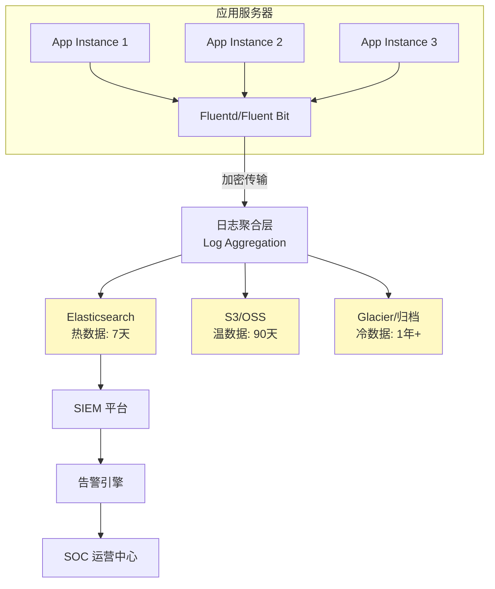
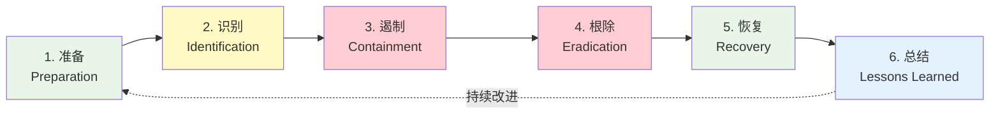
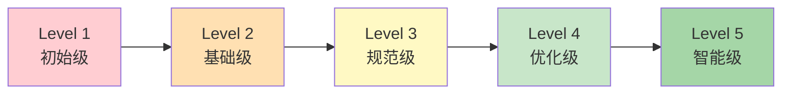

## 14.10 A09：安全日志与监控失效（Security Logging and Monitoring Failures）

### 14.10.1 定义与本质

安全日志与监控失效是指Web应用在日志记录、安全监控、告警通知和应急响应等环节存在缺陷，导致攻击行为无法被及时发现、记录和处置。这不仅仅是"日志写得少"的问题，而是一整套安全检测体系的缺失或失灵。

IBM《2024年数据泄露成本报告》指出，全球数据泄露的平均识别周期为**194天**，平均遏制周期为**29天**，合计超过220天。在这长达7个月的窗口期里，攻击者可以持续窃取数据、横向移动、建立持久化后门。而导致检测延迟的首要原因，正是日志记录不足和监控告警失效。

OWASP Top 10:2021将此项从2017版的**第十位提升到第九位**，编号从A10变更为A09。虽然排名看似微调，但OWASP重新定义了其范畴——从单纯的"日志不足"扩展为"安全日志与监控失效"，强调**记录、检测、响应**三者的闭环。



### 14.10.2 历史演变与评分变化

| 版本 | 编号 | 排名 | 名称 | 关键变化 |
|------|------|------|------|----------|
| OWASP 2013 | — | — | 未单独列出 | 日志相关内容分散在其他类别中 |
| OWASP 2017 | A10 | 第10位 | 不足的日志记录和监控（Insufficient Logging & Monitoring） | 首次独立成类 |
| OWASP 2021 | A09 | 第9位 | 安全日志与监控失效（Security Logging and Monitoring Failures） | 范围扩大，强调检测与响应闭环 |

2021版的核心变化在于：不仅关注"有没有记录"，更关注"记录了能否发现威胁"、"发现了能否及时响应"。这反映了业界从被动防御向主动检测的思维转变。

### 14.10.3 为什么安全日志与监控会失效

要理解这个风险，必须先理解它失效的根因。通常不是单一因素，而是多个环节同时失守：

**一、认知层面的误区**

| 误区 | 实际情况 |
|------|----------|
| "我们有防火墙就够了" | 防火墙只防网络层，无法检测应用层攻击（如业务逻辑漏洞利用） |
| "日志是运维的事，不是安全的事" | 运维日志关注系统健康，安全日志关注威胁情报，两者目标完全不同 |
| "攻击发生的概率很低" | Akamai报告显示，Web应用每天遭受的自动化扫描攻击平均超过数千次 |
| "我们规模小，不会被盯上" | 自动化攻击工具不区分目标大小，小目标往往防护更弱，更容易得手 |

**二、技术层面的缺陷**

1. **日志记录不足**：关键安全事件未被记录，或记录的信息不足以支撑事后分析
2. **日志格式不统一**：各组件使用不同日志格式，无法进行关联分析
3. **日志存储不可靠**：日志存储在本地，攻击者可在入侵后清除痕迹
4. **缺乏实时分析**：日志只存储不分析，沦为"数字垃圾"
5. **告警阈值不合理**：过低导致告警疲劳（Alert Fatigue），过高导致漏报
6. **缺乏上下文关联**：孤立的日志条目无法还原完整攻击链

**三、组织层面的问题**

- 没有专职的安全运营团队
- 安全预算不足，将日志监控视为"成本"而非"投资"
- 缺乏明确的日志保留策略和合规要求
- 事件响应流程未建立或未演练

### 14.10.4 OWASP 定义的 CWE 与关联漏洞

OWASP A09 关联了以下 CWE（Common Weakness Enumeration）：

| CWE 编号 | 名称 | 说明 |
|----------|------|------|
| CWE-223 | Omission of Security-Relevant Information | 安全相关信息被遗漏 |
| CWE-778 | Insufficient Logging | 日志记录不足，无法支撑审计 |
| CWE-779 | Excessive Logging | 日志过多导致存储和分析负担 |
| CWE-117 | Improper Output Neutralization for Logs | 日志注入攻击（CRLF注入） |
| CWE-532 | Insertion of Sensitive Information into Log File | 敏感信息泄露到日志中 |

**特别注意 CWE-117（日志注入）**：如果应用未对日志内容进行转义，攻击者可以通过注入换行符（\r\n）来伪造日志条目，或通过大量垃圾日志来掩盖真实攻击痕迹。

### 14.10.5 必须记录的安全事件（完整清单）

#### 14.10.5.1 认证与身份事件

```yaml
认证事件清单:
  登录类:
    - 登录成功（含时间、用户名、源IP、User-Agent）
    - 登录失败（含失败原因：密码错误、账户锁定、MFA失败）
    - 多因素认证触发与结果
    - 密码重置请求与完成
    - 会话创建与销毁
    - SSO令牌颁发与验证

  账户类:
    - 账户创建与激活
    - 账户锁定与解锁
    - 账户权限变更（角色分配、权限提升）
    - 账户禁用与删除
    - 账户信息修改（邮箱、手机号等关键字段）
```

#### 14.10.5.2 访问控制事件

```yaml
访问控制事件清单:
  数据访问:
    - 敏感数据查询（含查询参数摘要）
    - 数据导出操作（含导出范围和数量）
    - 批量数据访问（超过阈值时触发）
    - 跨租户/跨部门数据访问尝试

  权限操作:
    - 越权访问尝试（含请求路径和当前权限）
    - 特权操作执行（管理后台操作、系统配置变更）
    - API密钥创建、轮换、吊销
    - 文件上传与下载（含文件名、大小、MIME类型）
```

#### 14.10.5.3 系统与应用事件

```yaml
系统事件清单:
  应用层:
    - 应用启动与关闭
    - 配置变更（含变更前后对比）
    - 依赖服务连接失败
    - 未捕获的异常和错误
    - 输入验证失败（含疑似攻击载荷摘要）

  系统层:
    - 服务器启动与关闭
    - 磁盘空间告警
    - 进程异常退出
    - 系统时间变更（影响日志时间线可信度）
    - 防火墙规则变更
```

#### 14.10.5.4 网络安全事件

```yaml
网络事件清单:
  - 异常请求频率（暴力破解特征）
  - 扫描行为检测（大量404/400响应）
  - 已知恶意IP访问
  - DDoS攻击特征
  - TLS/SSL握手失败
  - DNS查询异常
  - 出站连接到已知C2服务器
```

### 14.10.6 日志记录的最佳实践

#### 14.10.6.1 日志格式标准化

统一的日志格式是实现跨系统关联分析的基础。推荐使用**结构化日志**（JSON格式），并遵循以下字段规范：

```json
{
  "timestamp": "2024-12-15T08:23:45.123Z",
  "level": "WARN",
  "event_type": "AUTH_FAILURE",
  "source_ip": "203.0.113.42",
  "user_agent": "Mozilla/5.0 ...",
  "user_id": "u_12345",
  "session_id": "sess_abc123",
  "request_id": "req_xyz789",
  "resource": "/api/v2/users/profile",
  "method": "GET",
  "status_code": 401,
  "response_time_ms": 45,
  "error_detail": "invalid_credentials",
  "geo_country": "CN",
  "geo_city": "Shanghai",
  "correlation_id": "corr_001",
  "service_name": "auth-service",
  "environment": "production",
  "trace_id": "abc123def456",
  "message": "Authentication failed for user u_12345 from 203.0.113.42"
}
```

**字段说明：**

| 字段 | 必选 | 说明 |
|------|------|------|
| timestamp | 是 | ISO 8601格式，含时区，精确到毫秒 |
| level | 是 | 日志级别：DEBUG/INFO/WARN/ERROR/FATAL |
| event_type | 是 | 事件分类，用于过滤和聚合 |
| source_ip | 是 | 客户端真实IP（注意处理代理和CDN） |
| user_id | 是 | 关联用户身份，无身份时为anonymous |
| request_id | 是 | 请求追踪ID，用于串联单次请求的所有日志 |
| message | 是 | 人类可读的事件描述 |
| session_id | 推荐 | 会话标识，用于追踪用户行为序列 |
| correlation_id | 推荐 | 跨服务关联ID，用于分布式追踪 |

#### 14.10.6.2 日志保护机制

日志是安全事件调查的关键证据。如果攻击者可以篡改或删除日志，整个监控体系就形同虚设。



**日志保护的关键措施：**

1. **传输加密**：日志从产生到存储全程使用TLS加密传输
2. **写入后不可变（Append-Only）**：日志存储使用只追加模式，禁止修改和删除
3. **访问控制**：日志存储系统与应用系统隔离，使用独立的认证体系
4. **完整性校验**：定期对日志文件计算哈希值，检测篡改
5. **多副本冗余**：日志至少存储在两个不同的物理位置
6. **独立管理权限**：日志系统的管理员权限与应用系统管理员权限分离

#### 14.10.6.3 日志保留策略

不同合规标准对日志保留期有不同要求：

| 合规标准 | 最短保留期 | 适用范围 |
|----------|-----------|----------|
| PCI DSS | 12个月在线 + 总计至少1年 | 支付卡行业 |
| GDPR | 无固定要求，但需定义合理期限 | 欧盟用户数据 |
| 等保2.0 | 6个月以上 | 中国境内信息系统 |
| HIPAA | 6年 | 美国医疗健康信息 |
| SOX | 7年 | 美国上市公司财务数据 |
| ISO 27001 | 由组织策略决定，通常3-5年 | 信息安全管理体系 |

**推荐的分层存储策略：**

```yaml
日志分层存储:
  热存储 (Hot):
    周期: 0-7天
    存储: SSD/Elasticsearch热节点
    用途: 实时监控、告警、即时查询
    查询延迟: 毫秒级

  温存储 (Warm):
    周期: 7-90天
    存储: HDD/Elasticsearch温节点
    用途: 事件调查、合规审计
    查询延迟: 秒级

  冷存储 (Cold):
    周期: 90天-1年
    存储: 对象存储(S3/OSS)
    用途: 合规保留、长期趋势分析
    查询延迟: 分钟级

  归档 (Archive):
    周期: 1年以上
    存储: Glacier/低频存储
    用途: 法律取证、极端场景回溯
    查询延迟: 小时级
```

### 14.10.7 日志注入攻击与防护

#### 14.10.7.1 CRLF日志注入

当应用未对日志内容进行转义时，攻击者可以通过注入回车换行符（\r\n）来伪造日志条目：

```text
# 攻击者在登录用户名字段注入：
用户名: admin\r\n2024-12-15 INFO Login success: user=admin

# 生成的日志（被篡改）：
2024-12-15 08:23:45 WARN Login failed: user=admin
2024-12-15 INFO Login success: user=admin
2024-12-15 08:23:45 ERROR Password validation...
```

攻击者通过注入伪造了一条"登录成功"的日志，在事后审计时可能误导调查人员。

#### 14.10.7.2 防护措施

```python
import re
import json
from datetime import datetime

def safe_log_event(event_type: str, user_input: str, **kwargs):
    """安全的日志记录函数，防止日志注入"""

    # 1. 移除CRLF字符，防止日志注入
    sanitized_input = re.sub(r'[\r\n\x00-\x1f]', '', user_input)

    # 2. 截断过长输入，防止日志洪水攻击
    max_input_length = 256
    if len(sanitized_input) > max_input_length:
        sanitized_input = sanitized_input[:max_input_length] + "...[truncated]"

    # 3. 使用结构化日志格式，避免字符串拼接
    log_entry = {
        "timestamp": datetime.utcnow().isoformat() + "Z",
        "event_type": event_type,
        "user_input": sanitized_input,
        **kwargs
    }

    # 4. JSON序列化确保特殊字符被正确转义
    return json.dumps(log_entry, ensure_ascii=False)

# 使用示例
print(safe_log_event(
    "LOGIN_ATTEMPT",
    "admin\r\nFAKE LOG LINE",
    source_ip="203.0.113.42",
    result="failure"
))
```

### 14.10.8 敏感信息泄露到日志

#### 14.10.8.1 常见泄露场景

| 泄露内容 | 危险等级 | 场景示例 |
|----------|----------|----------|
| 明文密码 | 严重 | 登录失败日志记录了用户输入的密码 |
| JWT Token | 高 | 请求日志包含完整的Authorization头 |
| API密钥 | 高 | 第三方服务调用日志包含密钥 |
| 信用卡号 | 严重 | 支付日志记录了完整卡号 |
| 身份证号 | 高 | 用户注册日志记录了身份证 |
| 会话Cookie | 高 | 调试日志输出了完整的Cookie头 |
| 内部IP地址 | 中 | 错误日志暴露了内网架构 |

#### 14.10.8.2 日志脱敏方案

```python
import re

class LogSanitizer:
    """日志脱敏处理器"""

    # 预定义的脱敏规则
    PATTERNS = [
        # 密码字段 - 完全遮盖
        (r'(password|passwd|pwd|secret)\s*[=:]\s*\S+', r'\1=******'),
        # 信用卡号 - 保留前6后4
        (r'\b(\d{6})\d{4,9}(\d{4})\b', r'\1****\2'),
        # 身份证号 - 保留前3后4
        (r'\b(\d{3})\d{11}(\d{4})\b', r'\1***********\2'),
        # 手机号 - 保留前3后4
        (r'\b(1[3-9]\d)\d{4}(\d{4})\b', r'\1****\2'),
        # 邮箱 - 遮盖用户名部分
        (r'\b(\w{1,3})\w+(@\w+\.\w+)\b', r'\1***\2'),
        # JWT Token
        (r'(Bearer\s+)eyJ[\w.-]+', r'\1[TOKEN_REDACTED]'),
        # IP地址（可选，取决于合规要求）
        (r'\b(\d{1,3})\.(\d{1,3})\.\d{1,3}\.\d{1,3}\b', r'\1.\2.x.x'),
    ]

    def sanitize(self, message: str) -> str:
        result = message
        for pattern, replacement in self.PATTERNS:
            result = re.sub(pattern, replacement, result, flags=re.IGNORECASE)
        return result

# 使用示例
sanitizer = LogSanitizer()
raw_log = 'User login failed: user=zhangsan, password=MyP@ss123, ip=203.0.113.42'
print(sanitizer.sanitize(raw_log))
# 输出: User login failed: user=zhang***, password=******, ip=203.0.x.x
```

### 14.10.9 实时监控与告警体系

#### 14.10.9.1 告警分级模型

有效的告警体系必须分级管理，避免"告警疲劳"——当安全团队每天收到数百条低优先级告警时，真正的威胁反而被淹没在噪音中。

| 级别 | 名称 | 响应时间 | 触发条件示例 | 通知方式 |
|------|------|----------|-------------|----------|
| P0 | 紧急 | 15分钟内 | 确认的数据泄露、勒索软件活动、核心系统被入侵 | 电话+短信+即时通讯 |
| P1 | 高危 | 1小时内 | 权限提升成功、SQL注入告警、异常批量数据导出 | 短信+即时通讯 |
| P2 | 中危 | 4小时内 | 大量登录失败（暴力破解）、可疑API调用模式 | 即时通讯+邮件 |
| P3 | 低危 | 24小时内 | 单次登录失败、配置变更、证书即将过期 | 邮件+工单 |
| P4 | 信息 | 下次巡检 | 常规安全扫描、正常配置变更 | 日报/周报汇总 |

#### 14.10.9.2 基于规则的检测场景

```yaml
检测规则示例:
  暴力破解检测:
    条件: 5分钟内同一IP登录失败 >= 10次
    级别: P2
    动作: 自动封禁IP 30分钟，通知安全团队

  水平越权检测:
    条件: 同一用户在10分钟内访问超过20个不同用户的数据
    级别: P1
    动作: 限制该用户会话，触发人工审查

  异常时间访问:
    条件: 非工作时间(00:00-06:00)管理员登录
    级别: P2
    动作: 要求二次验证，记录详细日志

  数据外泄检测:
    条件: 单次请求响应体 > 10MB 且包含敏感字段
    级别: P1
    动作: 限流 + 通知安全团队

  横向移动检测:
    条件: 内部主机在1小时内连接超过50个其他内部主机
    级别: P0
    动作: 隔离主机，启动应急响应
```

#### 14.10.9.3 告警疲劳的应对策略

告警疲劳（Alert Fatigue）是安全运营中最大的敌人之一。PagerDuty的调查显示，63%的安全分析师因告警过多而忽略了重要告警。

**应对措施：**

1. **基线学习**：先花2-4周建立正常行为基线，再基于偏差设置告警
2. **告警去重**：相同类型的告警在时间窗口内合并为一条
3. **告警聚合**：将关联告警聚合为一个"安全事件"
4. **定期调优**：每周审查告警规则，关闭误报率高的规则
5. **引入风险评分**：综合多个维度计算告警的风险分值，只对高分告警触发即时通知

### 14.10.10 SIEM平台选型与部署

#### 14.10.10.1 主流SIEM对比

| 平台 | 类型 | 优势 | 劣势 | 适用场景 |
|------|------|------|------|----------|
| Elastic Security (ELK) | 开源 | 灵活、社区活跃、成本可控 | 运维复杂、大规模性能调优难度高 | 中小企业、技术团队强 |
| Splunk Enterprise | 商业 | 查询能力强、生态完善 | 价格昂贵（按数据量计费） | 大型企业、合规要求高 |
| Microsoft Sentinel | 云原生SaaS | 与Azure深度集成、AI能力 | 厂商锁定、非Azure环境集成成本高 | 微软技术栈企业 |
| Wazuh | 开源 | 入侵检测+SIEM一体化、轻量 | 社区规模较小 | 中小企业、预算有限 |
| QRadar (IBM) | 商业 | 威胁情报集成好、合规模板丰富 | 部署复杂、价格高 | 金融、政府等合规行业 |

#### 14.10.10.2 ELK Stack 日志分析架构

```yaml
ELK Stack 部署架构:
  数据采集层 (Beats):
    Filebeat: 文件日志采集（应用日志、系统日志）
    Metricbeat: 系统指标采集（CPU、内存、网络）
    Packetbeat: 网络流量分析
    Auditbeat: 审计事件采集（文件完整性、系统调用）

  数据传输层 (Logstash):
    输入: Kafka / Redis / Beats
    过滤: Grok解析、GeoIP、User-Agent解析
    输出: Elasticsearch

  数据存储与检索层 (Elasticsearch):
    热节点: 3+节点，SSD存储
    温节点: 按需，HDD存储
    索引策略: 按日滚动（logstash-YYYY.MM.dd）

  可视化层 (Kibana):
    仪表盘: 安全事件概览、攻击趋势、地理分布
    发现: 实时日志搜索和过滤
    告警: 基于阈值的告警规则
```

### 14.10.11 应急响应流程

日志和监控的最终目的是支撑应急响应。一个完善的应急响应流程包括六个阶段：



**各阶段与日志监控的关系：**

| 阶段 | 日志监控的角色 | 关键动作 |
|------|---------------|----------|
| 准备 | 建立日志基线和检测规则 | 部署SIEM、定义告警规则、培训团队 |
| 识别 | 通过日志告警发现安全事件 | 确认告警真实性、评估影响范围 |
| 遏制 | 利用日志追踪攻击路径 | 隔离受影响系统、封禁攻击IP |
| 根除 | 分析日志确定根因 | 清除后门、修补漏洞 |
| 恢复 | 监控恢复过程的异常 | 逐步恢复服务、持续监控 |
| 总结 | 基于日志还原完整攻击链 | 编写事件报告、更新检测规则 |

### 14.10.12 攻击者如何清除痕迹（红队视角）

理解攻击者的手法是构建有效防御的前提。以下是攻击者常用的日志清除技术：

**1. 应用层日志清除**
```bash
# 清除Web服务器访问日志
> /var/log/nginx/access.log
echo "" > /var/log/apache2/access.log

# 清除特定时间段的日志（更隐蔽）
sed -i '/2024-12-15 08:23/,/2024-12-15 09:45/d' /var/log/app/application.log
```

**2. 系统层日志清除**
```bash
# 清除认证日志
> /var/log/auth.log
journalctl --rotate && journalctl --vacuum-time=1s

# Windows事件日志清除
wevtutil cl Security
wevtutil cl System
wevtutil cl Application
```

**3. 更高级的痕迹隐藏技术**

| 技术 | 原理 | 防御 |
|------|------|------|
| Timestomping | 修改文件时间戳 | 集中日志收集 + 完整性校验 |
| 日志服务劫持 | 停止或重定向syslog服务 | 日志服务健康检查 + 心跳监控 |
| 内核级隐藏 | Rootkit隐藏日志文件 | 文件完整性监控（FIM） |
| 网络层绕过 | 攻击不产生日志的操作 | 网络流量全量捕获（PCAP） |
| 日志注入混淆 | 注入大量假日志淹没真实记录 | 日志速率限制 + 异常检测 |

**核心防御原则：日志一旦产生，必须立即发送到攻击者无法触及的远程日志服务器。** 本地日志只能作为缓冲，不能作为唯一存储。

### 14.10.13 真实案例分析

#### 案例一：Equifax数据泄露（2017年）

**事件概况**：1.47亿用户的个人信息被泄露，包括姓名、社保号、出生日期、地址等。

**日志监控失败点**：
- 攻击者利用Apache Struts漏洞（CVE-2017-5638）入侵，该漏洞已有补丁但未修复
- 入侵发生在2017年5月，直到7月底才被发现——**超过2个月的检测延迟**
- 内部SSL检查设备因配置错误（证书过期）停止了对外传流量的检查
- 大量数据通过加密通道外传，未被任何监控系统捕获

**教训**：监控设备本身也需要监控，证书过期这种"小事"可以导致整个安全体系失效。

#### 案例二：SolarWinds供应链攻击（2020年）

**事件概况**：攻击者入侵SolarWinds的构建系统，在Orion软件更新包中植入后门（SUNBURST），影响了约18000个组织。

**日志监控失败点**：
- 后门通信使用合法域名和标准HTTPS，绕过了传统的基于签名的检测
- 攻击者活动时间与正常管理员活动重叠，降低了异常检测的有效性
- 被入侵组织的内部监控未能检测到横向移动
- 从初始入侵到发现历时约**14个月**

**教训**：不能仅依赖已知攻击特征的检测，需要建立行为基线和异常检测能力。供应链安全不能只信任供应商。

#### 案例三：某电商平台日志注入攻击

**事件概况**：攻击者发现电商平台的搜索功能会将用户输入记录到访问日志中，且未做转义。

**攻击过程**：
1. 攻击者在搜索框中注入CRLF + 伪造的日志条目
2. 伪造的日志显示"管理员登录成功"和"订单退款已审批"
3. 在安全审计时，审计人员看到伪造日志，误认为是内部人员操作
4. 攻击者利用这段时间窗口继续扩大攻击

**教训**：日志系统本身也是攻击面，必须对日志输入进行严格的验证和转义。

### 14.10.14 检测能力成熟度模型

组织可以参照以下模型评估自身的安全日志与监控成熟度：



| 等级 | 名称 | 特征 | MTTD |
|------|------|------|------|
| Level 1 | 初始级 | 仅有系统日志，无安全监控 | 数月甚至不检测 |
| Level 2 | 基础级 | 关键系统有日志，有基础告警 | 数周 |
| Level 3 | 规范级 | SIEM部署完成，有专职SOC团队 | 数天 |
| Level 4 | 优化级 | 自动化响应，威胁情报集成，定期红蓝对抗 | 数小时 |
| Level 5 | 智能级 | AI驱动检测，自动化编排，预测性安全 | 数分钟 |

> MTTD = Mean Time To Detect（平均检测时间）

### 14.10.15 合规框架对日志监控的要求

不同行业和地区的合规标准对安全日志与监控提出了明确要求：

**等保2.0（中国）**
- 三级系统要求日志保存不少于6个月
- 要求对重要用户行为和重要安全事件进行审计
- 审计记录应包括事件日期和时间、用户、事件类型、事件是否成功等

**PCI DSS v4.0**
- 要求10.2：记录所有对系统组件的访问（包括读取）
- 要求10.3：记录的审计日志条目必须包含特定字段
- 要求10.4：通过自动化机制执行日志审查
- 要求10.5：保护日志不被篡改
- 要求10.7：保留审计日志历史至少12个月

**GDPR（欧盟）**
- Article 33：发现个人数据泄露后72小时内通知监管机构
- Article 30：维护处理活动记录
- 日志中不得记录个人数据原文（需脱敏）

### 14.10.16 代码实现示例

#### 14.10.16.1 Python安全日志中间件

```python
import logging
import json
import time
import uuid
from datetime import datetime, timezone
from functools import wraps

class SecurityEventLogger:
    """安全事件日志记录器"""

    def __init__(self, service_name: str, log_file: str = "security_events.log"):
        self.service_name = service_name
        self.logger = logging.getLogger(f"security.{service_name}")
        self.logger.setLevel(logging.INFO)

        # 文件处理器 - JSON格式
        handler = logging.FileHandler(log_file)
        handler.setFormatter(logging.Formatter('%(message)s'))
        self.logger.addHandler(handler)

    def log_event(self, event_type: str, severity: str, **details):
        """记录安全事件"""
        event = {
            "timestamp": datetime.now(timezone.utc).isoformat(),
            "service": self.service_name,
            "event_type": event_type,
            "severity": severity,
            "event_id": str(uuid.uuid4()),
            "details": self._sanitize(details)
        }
        self.logger.info(json.dumps(event, ensure_ascii=False))

    def _sanitize(self, data: dict) -> dict:
        """脱敏处理"""
        sensitive_keys = {'password', 'token', 'secret', 'authorization', 'cookie'}
        sanitized = {}
        for key, value in data.items():
            if key.lower() in sensitive_keys:
                sanitized[key] = "[REDACTED]"
            elif isinstance(value, str) and len(value) > 1024:
                sanitized[key] = value[:1024] + "...[truncated]"
            else:
                sanitized[key] = value
        return sanitized

    def log_auth_failure(self, username: str, source_ip: str, reason: str, **extra):
        """记录认证失败"""
        self.log_event(
            "AUTH_FAILURE", "WARN",
            username=username, source_ip=source_ip,
            failure_reason=reason, **extra
        )

    def log_privilege_escalation(self, user_id: str, source_role: str,
                                  target_role: str, source_ip: str, success: bool):
        """记录权限提升"""
        self.log_event(
            "PRIVILEGE_ESCALATION", "CRITICAL" if success else "HIGH",
            user_id=user_id, source_role=source_role,
            target_role=target_role, source_ip=source_ip,
            success=success
        )

    def log_data_access(self, user_id: str, resource: str,
                         action: str, record_count: int, **extra):
        """记录数据访问"""
        severity = "WARN" if record_count > 100 else "INFO"
        self.log_event(
            "DATA_ACCESS", severity,
            user_id=user_id, resource=resource,
            action=action, record_count=record_count, **extra
        )


# 使用示例
sec_logger = SecurityEventLogger("user-service")

# 记录认证失败
sec_logger.log_auth_failure(
    username="admin",
    source_ip="203.0.113.42",
    reason="invalid_password",
    attempt_number=5
)

# 记录权限提升
sec_logger.log_privilege_escalation(
    user_id="u_12345",
    source_role="user",
    target_role="admin",
    source_ip="198.51.100.10",
    success=True
)

# 记录批量数据访问
sec_logger.log_data_access(
    user_id="u_67890",
    resource="/api/v2/users/export",
    action="EXPORT",
    record_count=50000,
    format="csv"
)
```

#### 14.10.16.2 Nginx访问日志增强配置

```nginx
# /etc/nginx/conf.d/security-logging.conf

# 自定义日志格式 - 包含安全审计所需字段
log_format security_audit escape=json
    '{'
        '"timestamp":"$time_iso8601",'
        '"remote_addr":"$remote_addr",'
        '"x_forwarded_for":"$http_x_forwarded_for",'
        '"request_method":"$request_method",'
        '"request_uri":"$request_uri",'
        '"status":$status,'
        '"body_bytes_sent":$body_bytes_sent,'
        '"request_time":$request_time,'
        '"http_referer":"$http_referer",'
        '"http_user_agent":"$http_user_agent",'
        '"upstream_addr":"$upstream_addr",'
        '"upstream_status":"$upstream_status",'
        '"ssl_protocol":"$ssl_protocol",'
        '"request_id":"$request_id",'
        '"cookie_session":"$cookie_session"'
    '}';

# 应用到虚拟主机
server {
    listen 443 ssl;
    server_name example.com;

    # 安全审计日志
    access_log /var/log/nginx/security_audit.log security_audit;

    # 错误日志 - 记录异常请求
    error_log /var/log/nginx/security_error.log warn;

    # 限制请求体大小，防止日志洪水
    client_max_body_size 10m;

    # 拦截可疑请求并记录
    location ~* \.(env|git|svn|htaccess|htpasswd)$ {
        access_log /var/log/nginx/suspicious_access.log security_audit;
        return 444;  # 关闭连接，不返回响应
    }
}
```

### 14.10.17 常见误区与纠正

| 误区 | 正确做法 |
|------|----------|
| 日志记录越多越好 | 记录安全相关的有意义事件，过多日志增加存储成本和分析噪音 |
| 有了日志就安全了 | 日志只是数据，必须配合分析、告警和响应流程才能产生价值 |
| 日志存在本地就行 | 本地日志可被攻击者清除，必须实时转发到独立的日志服务器 |
| SIEM部署完就不用管了 | SIEM需要持续调优检测规则、更新威胁情报、维护数据质量 |
| 安全监控是安全团队的事 | 需要开发、运维、安全三方协作，开发负责埋点，运维负责基础设施，安全负责规则和响应 |
| 只监控入站流量 | 出站流量同样重要，数据外泄、C2通信、DNS隧道都通过出站流量 |
| 告警越多越安全 | 告警疲劳是真实威胁，宁可减少数量提高质量 |
| 低危告警可以忽略 | 低危告警的组合可能构成高危攻击链，需要关联分析 |

### 14.10.18 自查清单

在完成本节学习后，对照以下清单评估你所负责系统的日志与监控能力：

```markdown
## A09 安全日志与监控自查清单

### 日志记录
- [ ] 所有认证事件（成功/失败）都有记录
- [ ] 所有权限变更操作都有记录
- [ ] 敏感数据访问有记录（含访问者、时间、数量）
- [ ] 系统管理操作有记录
- [ ] 日志使用结构化格式（JSON等）
- [ ] 日志包含足够的上下文信息（时间、用户、IP、请求ID）
- [ ] 日志输入已做防注入处理
- [ ] 敏感信息已从日志中脱敏

### 日志存储与保护
- [ ] 日志实时转发到独立的集中式日志系统
- [ ] 日志传输使用TLS加密
- [ ] 日志存储使用只追加模式
- [ ] 日志保留期符合合规要求（通常>=6个月）
- [ ] 日志访问有独立的权限控制
- [ ] 日志完整性有定期校验机制

### 监控与告警
- [ ] 有实时安全监控能力（SIEM或等效系统）
- [ ] 告警规则覆盖关键攻击场景
- [ ] 告警分级合理（P0-P4）
- [ ] 有告警去重和聚合机制
- [ ] 告警误报率在可接受范围（<20%）
- [ ] 有专职或兼职的安全运营人员

### 应急响应
- [ ] 有书面的应急响应计划
- [ ] 应急响应计划至少每年演练一次
- [ ] 安全事件响应时间有SLA定义
- [ ] 事件报告流程清晰
- [ ] 有事后复盘和改进机制
```

### 14.10.19 进阶：威胁狩猎（Threat Hunting）

当组织的检测能力达到Level 3以上时，应开始建立主动威胁狩猎能力，而不是被动等待告警。

**威胁狩猎的核心理念**：假设环境中已经存在未被发现的入侵者，主动搜索其痕迹。

**常用狩猎查询示例（KQL语法）**：

```text
// 1. 检测异常的PowerShell执行
DeviceProcessEvents
| where FileName == "powershell.exe"
| where ProcessCommandLine has_any ("-enc", "-encodedcommand", "downloadstring", "bypass")
| project Timestamp, DeviceName, AccountName, ProcessCommandLine

// 2. 检测DNS隧道特征
DnsEvents
| where strlen(Query) > 100
| summarize count() by ClientIP, bin(TimeGenerated, 1h)
| where count_ > 50

// 3. 检测异常的服务创建
DeviceEvents
| where ActionType == "ServiceInstalled"
| where InitiatingProcessFileName !in ("msiexec.exe", "setup.exe")
| project Timestamp, DeviceName, ServiceName, InitiatingProcessFileName

// 4. 检测横向移动 - Pass-the-Hash
IdentityLogonEvents
| where LogonType == "Network"
| where AuthenticationPackageName == "NTLM"
| where FailureReason == ""
| summarize UniqueTargets = dcount(TargetDevice) by AccountName, bin(TimeGenerated, 1h)
| where UniqueTargets > 10
```

### 14.10.20 小结

安全日志与监控失效是一个"静默的杀手"——它不会直接导致系统被入侵，但它决定了你在被入侵后能否及时发现。一个完善的日志与监控体系需要覆盖五个维度：

1. **记录**：全面、结构化、安全地记录安全相关事件
2. **收集**：实时、可靠地将日志汇聚到集中平台
3. **分析**：通过规则和行为分析从海量日志中识别威胁
4. **告警**：分级、去重、可操作地通知相关人员
5. **响应**：有流程、有演练、有复盘地处理安全事件

缺少任何一个环节，整个体系就会出现盲区。正如安全行业的一句格言："你无法保护你看不见的东西。"（You can't protect what you can't see.）
