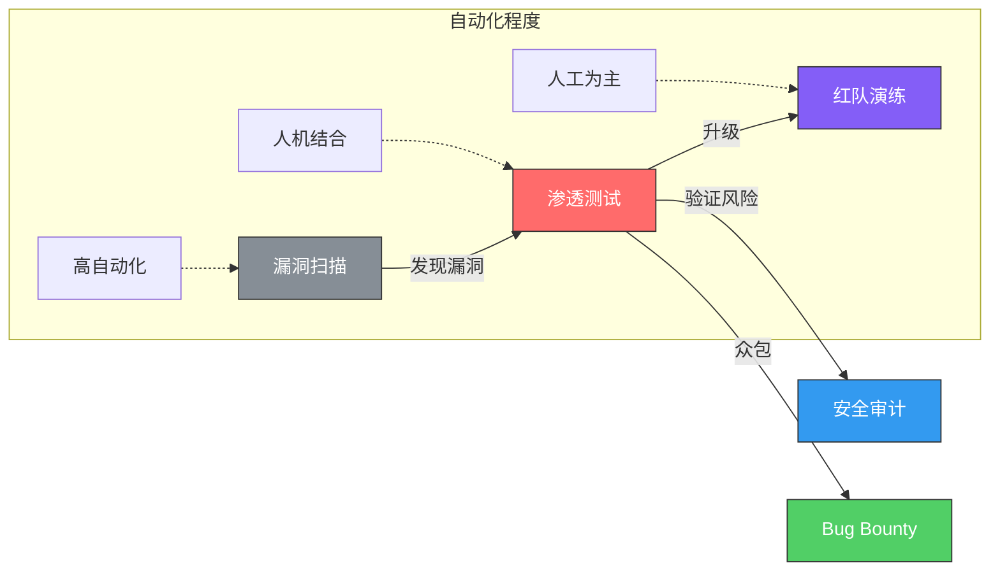
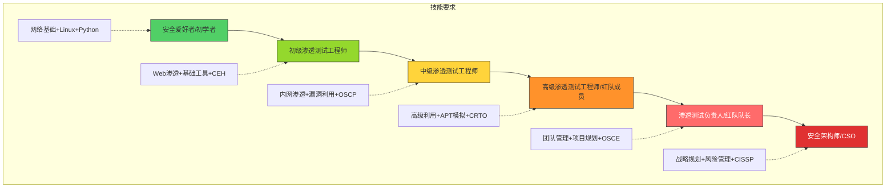
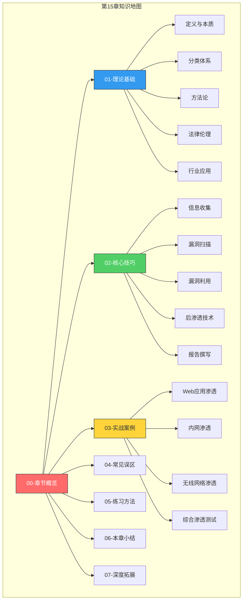

# 第15章 网络渗透测试

## 引言

> "要防御一个系统，你必须先学会攻击它。渗透测试不是破坏的艺术，而是理解的艺术。"

2023年，全球因网络攻击造成的经济损失超过8万亿美元。Verizon《数据泄露调查报告》显示，74%的安全事件涉及人为因素，而渗透测试是发现这些"人为漏洞"最有效的手段之一。渗透测试（Penetration Testing）是一种通过模拟真实攻击者的手段，对目标网络系统进行安全性评估的系统化方法。它不同于漏洞扫描的"清单式检查"，而是强调完整的攻击链——从信息收集、漏洞发现、漏洞利用、权限提升、横向移动到最终目标达成，以攻击者的视角全面审视网络系统的安全防护能力。

渗透测试的核心价值在于"验证性"。漏洞扫描告诉你"可能存在什么问题"，渗透测试告诉你"这个问题到底能不能被利用，利用后会造成多大损失"。这种从理论风险到实际威胁的转化，是任何自动化工具无法替代的。

### 为什么渗透测试如此重要

在当今的网络安全体系中，渗透测试已经从一种可选的安全评估手段，发展成为许多行业合规要求的必要环节：

| 合规标准 | 适用行业 | 渗透测试要求 |
|----------|----------|-------------|
| PCI DSS v4.0 | 金融/支付 | 每年至少一次外部渗透测试，重大变更后需追加测试 |
| HIPAA | 医疗 | 定期安全风险评估，渗透测试是核心组成部分 |
| 等保2.0（GB/T 22239） | 国内所有行业 | 三级及以上系统要求定期安全检测和评估 |
| SOC 2 | 云服务/SaaS | Type II审计中包含渗透测试证据 |
| ISO 27001 | 通用 | A.12.6要求技术漏洞管理，渗透测试是最佳实践 |
| NIS2 | 欧盟关键基础设施 | 要求定期安全评估，包括渗透测试 |

除了合规驱动，渗透测试还能带来以下直接收益：

- **真实风险评估**：区分"理论上存在漏洞"和"实际上可被利用"，避免安全资源的错配
- **防御体系验证**：检验防火墙、IDS/IPS、WAF、EDR等防御措施的实际效果，发现盲点
- **应急响应检验**：测试安全团队的检测和响应能力，评估SOC的MTTD和MTTR指标
- **安全意识提升**：用实际攻击案例说服管理层和员工重视安全投入
- **供应链安全**：评估第三方组件和供应链中的安全风险

```mermaid
graph TB
    subgraph 渗透测试的价值链
        A[模拟真实攻击] --> B[发现安全漏洞]
        B --> C[验证可利用性]
        C --> D[评估影响范围]
        D --> E[提供修复建议]
        E --> F[验证修复效果]
    end
    
    subgraph 对比：漏洞扫描
        G[自动化扫描] --> H[报告已知漏洞]
        H --> I[无法验证利用]
        I --> J[误报率高]
    end
    
    style A fill:#ff6b6b,stroke:#333,color:#fff
    style C fill:#ffa94d,stroke:#333
    style F fill:#51cf66,stroke:#333
    style G fill:#868e96,stroke:#333
    style J fill:#e03131,stroke:#333,color:#fff
```

---

## 渗透测试与相关概念辨析

初学者常常将渗透测试与漏洞扫描、安全审计、红队演练等概念混淆。这些活动虽然都属于安全评估范畴，但在目标、方法、深度和产出上有本质区别：

| 维度 | 漏洞扫描 | 渗透测试 | 安全审计 | 红队演练 | Bug Bounty |
|------|---------|---------|---------|---------|------------|
| **目标** | 发现已知漏洞 | 验证漏洞可利用性 | 检查合规性 | 模拟真实APT攻击 | 发现未知漏洞 |
| **方法** | 自动化为主 | 人工+自动化 | 文档审查+配置检查 | 全方位攻击模拟 | 众包式安全测试 |
| **深度** | 表面扫描 | 深入利用 | 策略层面 | 战略层面 | 深入利用 |
| **时间** | 数小时 | 数天到数周 | 数周到数月 | 数周到数月 | 持续进行 |
| **人员** | 工具操作员 | 渗透测试工程师 | 安全审计师 | 红队专家 | 安全研究员 |
| **产出** | 漏洞清单 | 漏洞+利用路径+修复建议 | 合规报告 | 攻击报告+改进建议 | 漏洞报告+PoC |
| **成本** | 低 | 中到高 | 中 | 高 | 按漏洞付费 |
| **适用场景** | 日常安全检查 | 合规评估/重大变更前 | 年度审计 | 高安全需求 | 持续安全验证 |



### 渗透测试的分类体系

渗透测试可以从多个维度进行分类，每种分类对应不同的测试策略和适用场景：

**按知识背景分类：**

| 类型 | 测试人员信息 | 优点 | 缺点 | 典型场景 |
|------|------------|------|------|---------|
| 黑盒测试 | 仅知道目标基本信息（域名/IP） | 最接近真实攻击者视角 | 测试周期长，覆盖可能不全 | 外部安全评估 |
| 白盒测试 | 完整信息（源码、架构、配置） | 覆盖全面，效率高 | 与真实攻击有差距 | 代码审计、开发阶段 |
| 灰盒测试 | 部分信息（用户账号、基本架构） | 效率与真实性平衡 | 需要合理界定信息范围 | 最常用的测试方式 |

**按目标范围分类：**

- **网络基础设施渗透**：路由器、交换机、防火墙、VPN等网络设备
- **Web应用渗透**：前端、后端、API、数据库等Web组件
- **移动应用渗透**：Android/iOS客户端、通信协议、数据存储
- **无线网络渗透**：WiFi接入点、蓝牙、Zigbee等无线协议
- **社会工程学**：钓鱼邮件、电话欺诈、物理入侵
- **云环境渗透**：AWS/Azure/GCP配置、容器安全、IAM策略
- **物联网渗透**：嵌入式设备、固件分析、MQTT/CoAP协议

---

## 渗透测试方法论概览

渗透测试方法论是指导测试活动的系统化框架，它定义了测试的阶段、流程和最佳实践。掌握主流方法论是从业余走向专业的关键一步。

### 主流方法论对比

| 方法论 | 全称 | 侧重点 | 适用场景 | 特点 |
|--------|------|--------|---------|------|
| **PTES** | Penetration Testing Execution Standard | 通用渗透测试 | 企业级渗透测试 | 7阶段模型，业界最广泛认可 |
| **OWASP** | Open Web Application Security Project | Web应用安全 | Web渗透测试 | 详细的测试用例和检查清单 |
| **OSSTMM** | Open Source Security Testing Methodology Manual | 全面安全测试 | 综合安全评估 | 5通道模型，可量化指标(STAR) |
| **NIST SP 800-115** | Technical Guide to Information Security Testing | 合规性测试 | 政府/合规场景 | 美国标准，强调计划和准备 |
| **ISSAF** | Information Systems Security Assessment Framework | 安全评估 | 综合安全评估 | 详细的工具和技术参考 |
| **OWASP WSTG** | Web Security Testing Guide | Web安全测试 | Web应用测试 | 持续更新的测试清单 |

### PTES七阶段模型详解

PTES（Penetration Testing Execution Standard）是渗透测试领域最被广泛认可的方法论，它定义了渗透测试的完整生命周期：


| 阶段 | 核心任务 | 关键产出 | 时间占比 |
|------|---------|---------|---------|
| 前期交互 | 确定范围、签署授权、制定计划 | 授权书、测试计划 | 5-10% |
| 情报收集 | 域名枚举、端口扫描、技术栈识别 | 情报报告、攻击面地图 | 15-25% |
| 威胁建模 | 分析攻击面、确定攻击路径 | 攻击路径规划 | 10-15% |
| 漏洞分析 | 自动化扫描+人工分析 | 漏洞清单、利用可行性评估 | 15-20% |
| 渗透攻击 | 漏洞利用、获取权限 | 初始访问权限 | 15-25% |
| 后渗透 | 提权、横向移动、数据获取 | 影响范围评估 | 15-20% |
| 报告撰写 | 整理发现、编写报告 | 最终渗透测试报告 | 10-15% |

### OWASP测试指南的核心维度

OWASP测试指南专注于Web应用安全，其测试框架涵盖以下核心维度：

1. **信息收集**：搜索引擎侦查、应用入口识别、指纹识别
2. **配置管理**：服务器配置、应用配置、敏感信息泄露
3. **身份认证**：凭据传输、认证绕过、密码策略
4. **授权**：路径遍历、权限提升、IDOR
5. **会话管理**：会话令牌安全、会话固定、CSRF
6. **输入验证**：注入攻击、XSS、文件上传
7. **错误处理**：错误信息泄露、日志审计
8. **加密**：传输加密、存储加密、密钥管理
9. **业务逻辑**：业务流程绕过、竞态条件
10. **客户端**：DOM XSS、客户端数据泄露

---

## 渗透测试的工具生态

渗透测试工具是测试人员的"武器库"。理解工具的分类和用途，能够帮助你选择合适的工具组合。需要强调的是：**工具只是手段，方法论和思维才是核心**。一个优秀的渗透测试人员即使只用最基础的工具，也能完成高质量的测试。

### 工具分类与核心工具

| 类别 | 工具 | 用途 | 开源/商业 |
|------|------|------|-----------|
| **信息收集** | Nmap | 端口扫描、服务识别、OS检测 | 开源 |
| | Subfinder | 子域名枚举 | 开源 |
| | Amass | 攻击面映射 | 开源 |
| | Shodan/Censys | 网络空间搜索引擎 | 商业(有限免费) |
| | Recon-ng | 信息收集框架 | 开源 |
| **漏洞扫描** | Nuclei | 模板化漏洞扫描 | 开源 |
| | Nessus | 企业级漏洞扫描 | 商业(家庭版免费) |
| | OpenVAS | 开源漏洞扫描 | 开源 |
| | Nikto | Web服务器扫描 | 开源 |
| **Web渗透** | Burp Suite | HTTP代理/扫描/测试 | 商业(社区版免费) |
| | OWASP ZAP | Web应用安全测试 | 开源 |
| | sqlmap | SQL注入自动化 | 开源 |
| | ffuf/gobuster | 目录/参数爆破 | 开源 |
| **漏洞利用** | Metasploit | 漏洞利用框架 | 开源(Pro版商业) |
| | Cobalt Strike | 红队协作平台 | 商业 |
| | Empire | 后渗透框架 | 开源 |
| **密码攻击** | Hashcat | GPU加速密码破解 | 开源 |
| | John the Ripper | 密码破解 | 开源 |
| | Hydra | 在线暴力破解 | 开源 |
| **后渗透** | Impacket | Windows协议工具集 | 开源 |
| | CrackMapExec | AD环境横向移动 | 开源 |
| | Mimikatz | Windows凭据提取 | 开源 |
| | BloodHound | AD攻击路径分析 | 开源 |
| **网络分析** | Wireshark | 网络流量分析 | 开源 |
| | tcpdump | 命令行抓包 | 开源 |
| **社会工程** | Gophish | 钓鱼邮件平台 | 开源 |
| | SET | 社会工程工具包 | 开源 |
| **操作系统** | Kali Linux | 渗透测试专用系统 | 开源 |
| | Parrot OS | 安全测试系统 | 开源 |

### Kali Linux：渗透测试的标准平台

Kali Linux是Offensive Security维护的渗透测试专用Linux发行版，预装了600+安全工具，是渗透测试人员的首选工作环境。

```bash
# Kali Linux 常用命令速查
# 更新系统
sudo apt update && sudo apt full-upgrade -y

# 查看预装工具分类
apt list --installed | grep -i "kali"

# 启动常用服务
sudo systemctl start postgresql  # Metasploit数据库
sudo msfdb init                  # 初始化MSF数据库

# 网络配置
ip addr show                     # 查看网络接口
iwconfig                         # 查看无线接口
sudo airmon-ng start wlan0       # 启用监听模式
```

---

## 渗透测试的法律与伦理框架

这是本章最重要的前置知识，也是所有渗透测试活动的底线。**未经授权的渗透测试就是犯罪**——这不是建议，而是法律事实。

### 中国法律框架

| 法律法规 | 关键条款 | 与渗透测试的关系 |
|---------|---------|-----------------|
| 《网络安全法》(2017) | 第27条：禁止非法侵入他人网络 | 未经授权的渗透测试违反此法 |
| 《刑法》第285条 | 非法侵入计算机信息系统罪 | 最高可处3年以上有期徒刑 |
| 《刑法》第286条 | 破坏计算机信息系统罪 | 造成严重后果的，最高可处5年以上 |
| 《数据安全法》(2021) | 数据处理活动安全要求 | 渗透测试涉及数据处理需合规 |
| 等保2.0 | GB/T 22239-2019 | 三级以上系统要求定期渗透测试 |

### 授权文件必备要素

合法的渗透测试必须以书面授权为基础。授权文件（通常称为"授权书"或"Statement of Work"）应包含：

```yaml
授权书关键要素:
  测试范围:
    - 目标系统清单（IP地址、域名、应用名称）
    - 明确排除的系统和范围
    - 测试类型（黑盒/白盒/灰盒）
  
  时间窗口:
    - 测试开始和结束日期
    - 允许测试的时间段（工作时间/非工作时间）
    - 紧急停止流程和联系人
  
  方法限制:
    - 允许使用的测试手段
    - 禁止的测试手段（如DDoS、社会工程）
    - 是否允许使用自动化扫描
    - 是否允许真实漏洞利用
  
  数据处理:
    - 测试数据的存储和保护要求
    - 测试结束后的数据销毁流程
    - 敏感数据的处理规范
  
  责任界定:
    - 测试人员在授权范围内的免责条款
    - 测试造成意外损害的处理流程
    - 保险和赔偿安排
```

### 渗透测试伦理准则

1. **最小影响原则**：测试过程中尽量减少对目标系统正常运行的影响，避免使用可能导致系统崩溃的攻击手段
2. **数据保护原则**：对测试过程中接触到的敏感数据严格保密，测试结束后按约定销毁
3. **及时报告原则**：发现严重安全漏洞应立即报告，不利用漏洞谋取私利
4. **合法边界原则**：严格在授权范围内测试，不以任何理由超越授权
5. **专业诚信原则**：如实报告测试结果，不夸大也不隐瞒发现

---

## 渗透测试的职业发展路径

渗透测试是一个高度专业化的职业方向，有着清晰的成长路径和认证体系。

### 职业发展阶梯



### 核心认证体系

| 认证 | 颁发机构 | 难度 | 费用 | 特点 | 适合阶段 |
|------|---------|------|------|------|---------|
| **CEH** | EC-Council | ★★☆ | ~$1,199 | 知识面广，偏理论 | 入门 |
| **CompTIA PenTest+** | CompTIA | ★★☆ | ~$404 | 行业认可度高 | 入门到中级 |
| **eJPT** | INE | ★★☆ | ~$249 | 实战导向，入门友好 | 入门 |
| **OSCP** | OffSec | ★★★★ | ~$1,599 | 24小时实战考核，含金量最高 | 中级到高级 |
| **GPEN** | SANS/GIAC | ★★★ | ~$8,499 | 方法论深入 | 中级 |
| **CRTO** | Zero-Point | ★★★ | ~$499 | 红队实战，AD渗透 | 中级到高级 |
| **OSEP** | OffSec | ★★★★★ | ~$1,599 | 高级规避技术 | 高级 |
| **OSCE** | OffSec | ★★★★★ | ~$1,599 | 高级漏洞利用 | 高级 |
| **CISP-PTE** | 中国信息安全测评中心 | ★★★ | ~¥15,000 | 国内权威认证 | 中级 |

### 薪资参考（中国市场，2024年）

| 职级 | 年限 | 年薪范围(一线城市) | 核心能力要求 |
|------|------|-------------------|-------------|
| 初级渗透测试工程师 | 0-2年 | 12-25万 | Web渗透、基础工具使用 |
| 中级渗透测试工程师 | 2-5年 | 25-45万 | 内网渗透、漏洞利用、报告撰写 |
| 高级渗透测试工程师 | 5-8年 | 45-70万 | 高级利用、红队技术、团队协作 |
| 渗透测试专家/负责人 | 8年+ | 70-120万+ | 方法论建设、团队管理、战略规划 |

---

## 本章学习目标

通过本章的学习，读者将能够：

1. **理解渗透测试的理论框架**：掌握渗透测试与漏洞扫描、安全审计的区别与联系，理解不同类型渗透测试（黑盒、白盒、灰盒）的特点和适用场景，熟悉PTES、OWASP、OSSTMM等主流方法论
2. **掌握渗透测试的标准流程**：熟悉从前期交互、信息收集、威胁建模、漏洞分析、渗透攻击到后渗透攻击和报告撰写的完整七阶段流程
3. **熟悉核心工具与技术**：学会使用Nmap、Metasploit、Burp Suite、Wireshark等主流渗透测试工具，掌握网络扫描、漏洞利用、权限提升等关键技能
4. **了解实战攻防案例**：通过Web应用渗透、内网渗透、无线网络渗透和综合渗透四个典型案例，理解渗透测试在真实场景中的完整操作流程
5. **建立合法合规意识**：深刻理解渗透测试的法律边界和伦理规范，确保所有测试活动在授权范围内进行
6. **构建系统化学习路径**：从靶场环境搭建到CTF竞赛参与，建立持续提升渗透测试能力的方法体系

---

## 章节结构

本章按照"理论→方法→实操→反思→练习"的逻辑顺序，分为七个部分展开：

| 小节 | 主题 | 核心内容 | 学习重点 |
|------|------|---------|---------|
| 01 | 理论基础 | 定义与分类、方法论体系、法律伦理、行业应用 | 建立理论框架，理解"为什么" |
| 02 | 核心技巧 | 信息收集、漏洞扫描、漏洞利用、后渗透、报告撰写 | 掌握核心技术，学习"怎么做" |
| 03 | 实战案例 | Web渗透、内网渗透、无线渗透、综合渗透 | 真实场景演练，理解"何时用" |
| 04 | 常见误区 | 认知误区、方法论误区、实践误区 | 避免踩坑，知道"不该做" |
| 05 | 练习方法 | 靶场搭建、CTF竞赛、实战训练 | 持续提升，规划"怎么练" |
| 06 | 本章小结 | 核心知识点回顾、进阶方向指引 | 巩固知识，明确"下一步" |
| 07 | 深度拓展 | 高级话题、前沿技术、资源推荐 | 深入研究，探索"更远处" |



---

## 前置知识要求

学习本章之前，读者应具备以下基础知识。如果某些领域还不熟悉，建议先回顾对应章节：

| 知识领域 | 具体要求 | 对应章节 | 自查标准 |
|---------|---------|---------|---------|
| **网络基础** | TCP/IP协议栈、常见网络服务工作原理 | 第5章 | 能看懂Wireshark抓包，理解三次握手 |
| **操作系统** | Linux和Windows命令行操作 | 第6、7章 | 能熟练使用bash和PowerShell |
| **编程基础** | 至少掌握Python，能编写自动化脚本 | 第8章 | 能用Python写网络请求和数据处理脚本 |
| **Web基础** | HTTP/HTTPS协议、Web架构、常见Web漏洞 | 第14章 | 理解SQL注入、XSS、CSRF的原理 |
| **安全基础** | 加密与认证概念、防火墙/IDS工作原理 | 第13章 | 理解对称/非对称加密、TLS握手流程 |

**快速自测**：如果你能回答以下问题，说明你已经具备学习本章的基础：

1. TCP三次握手的过程是什么？SYN/ACK/FIN分别代表什么？
2. HTTP GET和POST请求有什么区别？什么是HTTP头部？
3. SQL注入的基本原理是什么？如何防御？
4. Linux中`chmod 755`代表什么权限？
5. 什么是公钥和私钥？TLS如何保证通信安全？

如果以上问题中有2个以上无法回答，建议先学习对应的前置章节。

---

## 关键术语表

| 术语 | 英文全称 | 中文解释 |
|------|---------|---------|
| PTES | Penetration Testing Execution Standard | 渗透测试执行标准 |
| OWASP | Open Web Application Security Project | 开放式Web应用安全项目 |
| OSSTMM | Open Source Security Testing Methodology Manual | 开源安全测试方法手册 |
| CVE | Common Vulnerabilities and Exposures | 通用漏洞披露 |
| CVSS | Common Vulnerability Scoring System | 通用漏洞评分系统 |
| PoC | Proof of Concept | 概念验证 |
| Exploit | - | 漏洞利用代码 |
| Payload | - | 攻击载荷 |
| Shell | - | 命令行交互接口 |
| WebShell | - | Web后门脚本 |
| C2 | Command and Control | 命令与控制 |
| APT | Advanced Persistent Threat | 高级持续性威胁 |
| TTPs | Tactics, Techniques and Procedures | 战术、技术和流程 |
| IoC | Indicator of Compromise | 入侵指标 |
| EDR | Endpoint Detection and Response | 终端检测与响应 |
| WAF | Web Application Firewall | Web应用防火墙 |
| IDS/IPS | Intrusion Detection/Prevention System | 入侵检测/防御系统 |
| SIEM | Security Information and Event Management | 安全信息和事件管理 |
| AD | Active Directory | 活动目录 |
| Lateral Movement | - | 横向移动 |
| Privilege Escalation | - | 权限提升 |
| Pivoting | - | 跳板/代理转发 |
| Reverse Shell | - | 反弹Shell |
| Bind Shell | - | 正向Shell |

---

## 学习建议

渗透测试是一门实践性极强的技术，仅仅阅读理论知识远远不够。以下是经过验证的高效学习路径：

### 第一阶段：环境搭建（1-2周）

```bash
# 推荐虚拟化环境搭建
# 1. 安装VirtualBox或VMware
# 2. 下载Kali Linux镜像
#    https://www.kali.org/get-kali/
# 3. 下载靶机环境
#    - VulnHub: https://www.vulnhub.com/
#    - TryHackMe: https://tryhackme.com/
#    - Hack The Box: https://www.hackthebox.com/

# Kali Linux基础配置
sudo apt update && sudo apt full-upgrade -y
sudo apt install -y kali-linux-large  # 安装完整工具集
```

### 第二阶段：工具熟悉（2-4周）

从单一工具开始，逐步掌握工具链：

1. **Nmap** → 端口扫描和服务识别
2. **Burp Suite** → Web应用拦截和测试
3. **Metasploit** → 漏洞利用框架
4. **Wireshark** → 网络流量分析
5. **sqlmap** → SQL注入自动化

### 第三阶段：靶场练习（4-8周）

| 靶场平台 | 难度 | 特点 | 推荐顺序 |
|---------|------|------|---------|
| DVWA | 入门 | 经典Web漏洞靶场 | 1 |
| WebGoat | 入门 | OWASP官方教学靶场 | 2 |
| VulnHub | 入门到中级 | 离线靶机，自由度高 | 3 |
| TryHackMe | 入门到中级 | 引导式学习路径 | 4 |
| Hack The Box | 中级到高级 | 实战型靶机，社区活跃 | 5 |
| Proving Grounds | 中级到高级 | OffSec官方靶场 | 6 |

### 第四阶段：方法论内化（持续）

- **阅读报告**：学习优秀的渗透测试报告模板和写法
- **参加CTF**：通过竞赛锻炼实战能力和时间管理
- **考取认证**：以OSCP为目标，系统化提升技能
- **社区参与**：关注安全社区，参与漏洞研究和分享

### 核心原则

1. **循序渐进**：先从简单靶场开始，逐步过渡到复杂环境
2. **重视方法论**：工具会过时，方法论和思维方式是长期资产
3. **记录笔记**：建立个人知识库，记录工具用法、技巧和心得
4. **遵守法律底线**：永远不要对未经授权的目标进行测试

---

> ⚠️ **安全警告与免责声明**
>
> 本章所有技术内容仅用于合法的安全研究和授权的渗透测试。在未获得目标系统所有者明确书面授权的情况下，对任何系统进行渗透测试都是违法行为。读者应严格遵守所在国家和地区的法律法规，将所学技能用于正当的安全防护工作。本书作者和出版方不对任何滥用本书技术内容的行为承担责任。

---

渗透测试不仅是一项技术技能，更是一种安全思维方式的培养。通过本章的学习，希望读者能够建立起从攻击者视角审视安全问题的能力，理解"知攻才能善防"的深层含义，为成为一名合格的网络安全专业人员奠定坚实基础。接下来，让我们从渗透测试的理论基础开始，一步步揭开网络渗透测试的完整知识体系。
