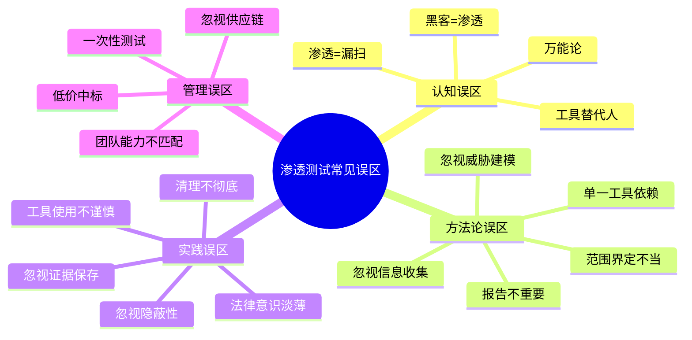
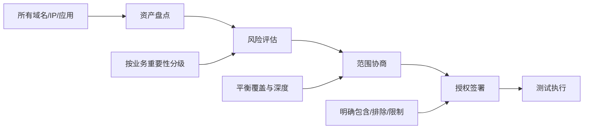
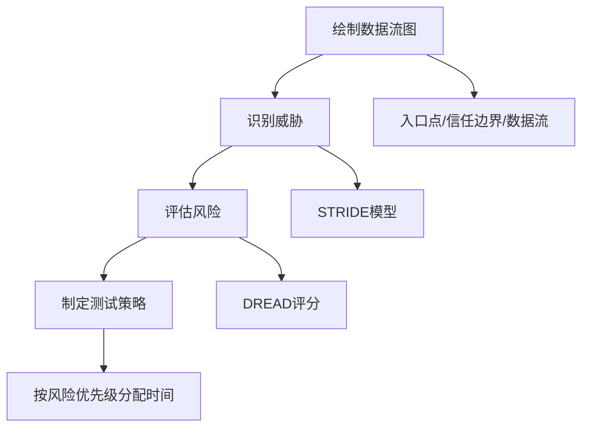
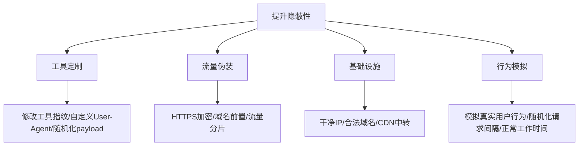
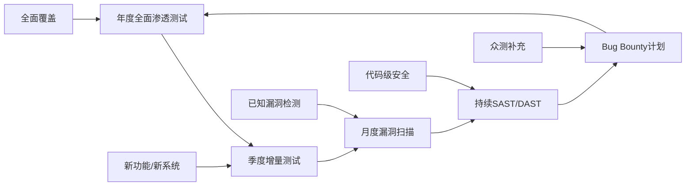
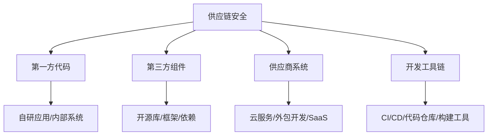
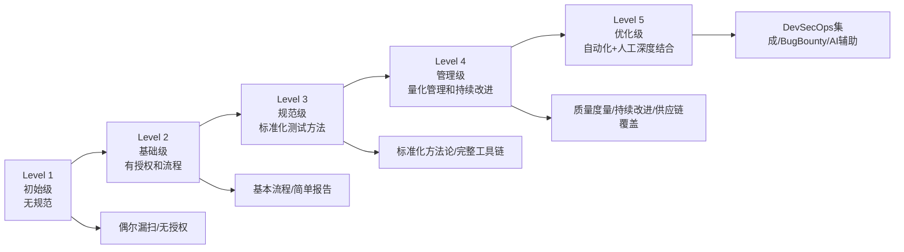

# 04 常见误区

渗透测试是一门融合技术、方法论和职业素养的综合性实践。然而，从初入行的新手到从业多年的资深人员，都可能陷入各种认知偏差和实践陷阱。这些误区轻则降低测试质量、遗漏关键风险，重则引发法律纠纷、造成生产事故。

本节将渗透测试中的常见误区系统性地梳理为**认知误区、方法论误区、实践误区和管理误区**四大类，每一类都配合真实场景分析和纠正建议，帮助读者建立正确的职业认知。



---

## 4.1 认知误区

认知误区是最根本的一类误区，它影响着人们对渗透测试本质的理解。错误的认知会导致不合理的期望、错误的决策，甚至整个安全策略的方向性偏差。

### 4.1.1 渗透测试等于漏洞扫描

**误区描述**

这是最常见的误区之一。许多初学者，甚至一些非技术背景的管理人员，认为渗透测试就是使用 Nessus 或 Nmap 等工具进行漏洞扫描。在一些企业采购安全服务时，也常将"漏洞扫描报告"等同于"渗透测试报告"。

**为什么这是错的**

漏洞扫描和渗透测试在目标、方法、深度和产出上存在本质差异：

| 维度 | 漏洞扫描 | 渗透测试 |
|------|----------|----------|
| 目标 | 发现已知漏洞 | 验证可利用性并评估实际影响 |
| 方法 | 自动化特征匹配 | 自动化+人工分析+漏洞利用 |
| 深度 | 表面检测，大量误报 | 深入验证，确认可达性 |
| 覆盖范围 | 广但浅 | 窄但深 |
| 产出 | 漏洞列表（含误报） | 可利用漏洞+攻击路径+业务影响 |
| 逻辑漏洞 | 无法发现 | 核心关注点之一 |
| 人工智慧 | 不需要 | 高度依赖 |
| 时间成本 | 几小时 | 几天到几周 |
| 费用 | 低 | 高 |

漏洞扫描存在以下核心局限：

**第一，只能发现已知漏洞。** 漏洞扫描器通过 CVE 特征库匹配已知漏洞签名，无法识别零日漏洞、逻辑漏洞和业务逻辑缺陷。例如：

- 电商平台的"先领券后改价"逻辑漏洞——商品原价100元，优惠券满99减50，用户先领券再将商品改为1元，最终以1元购买
- 银行转账的"金额篡改"——前端传入负数金额，后端未校验，导致反向转账
- 权限提升的"IDOR"——普通用户通过修改 URL 中的用户 ID 访问其他用户的数据

这些漏洞的共同特点是：系统功能本身是正常的，但业务逻辑存在缺陷，只有理解业务流程的人工测试才能发现。

**第二，无法验证可利用性。** 扫描器报告的漏洞可能存在以下情况：

- 误报：系统已打补丁但版本号未更新，扫描器仍报告漏洞
- 不可达：漏洞存在于内网隔离环境，外部无法访问
- 有缓解措施：虽然存在漏洞但 WAF/IPS 已拦截相关攻击向量
- 依赖条件：漏洞利用需要特定的前置条件（如已认证、特定配置）

渗透测试的价值恰恰在于区分"理论上存在"和"实际上可利用"的漏洞。

**第三，不会进行后渗透操作。** 渗透测试的核心价值之一是评估"突破边界后能造成多大影响"。这包括：

- 权限提升：从普通用户提升到管理员/root
- 横向移动：从一台机器扩展到整个内网
- 数据获取：评估能访问多少敏感数据
- 持久化：评估攻击者能否建立长期驻留

漏洞扫描完全不涉及这些环节。

**真实案例**

某金融公司每年购买漏洞扫描服务，连续三年扫描报告均显示"低风险"。后来委托安全团队进行渗透测试，测试人员通过信息收集发现了一个被遗忘的测试子域名，该子域名运行着一个未更新的管理系统，通过已知漏洞获取了服务器权限，进而通过内网横向移动获取了数据库服务器的访问权限，最终获取了超过200万条用户数据。这个攻击路径是任何自动化扫描器都无法完整发现的。

**纠正建议**

正确理解渗透测试的完整流程：信息收集→威胁建模→漏洞分析→漏洞利用→后渗透→报告撰写。漏洞扫描只是"漏洞分析"阶段的辅助工具之一。

### 4.1.2 渗透测试可以发现所有漏洞

**误区描述**

有些组织在进行渗透测试后，认为系统已经"绝对安全"了，甚至在宣传中声称"已通过专业安全测试"。这是一个危险的误解，它可能导致组织放松警惕，忽视持续的安全建设。

**为什么这是错的**

渗透测试有四个固有的局限性，决定了它不可能发现所有漏洞：

**时间限制。** 渗透测试通常在有限的时间内进行（几天到几周）。一个中等规模的 Web 应用可能有数百个功能点、数千个参数，要在一两周内全面测试每一个输入点是不现实的。测试人员只能根据风险优先级选择重点区域进行深入测试。

以一个典型的两周渗透测试为例：

| 阶段 | 时间占比 | 实际天数 |
|------|----------|----------|
| 信息收集与威胁建模 | 30% | 3天 |
| 漏洞发现与利用 | 40% | 4天 |
| 后渗透与横向移动 | 15% | 1.5天 |
| 报告撰写 | 15% | 1.5天 |

在4天的实际漏洞发现时间内，测试人员能深入测试的功能模块是有限的。

**范围限制。** 渗透测试有明确的范围界定，测试人员只能在授权范围内进行测试。范围之外的系统和漏洞不在测试覆盖之内。例如：

- 测试范围仅限于 Web 应用，不包括移动 App
- 测试范围是外网，不包括内网
- 测试范围是生产环境，不包括测试/预发布环境
- 排除了第三方系统和供应链

**人为因素。** 渗透测试的效果很大程度上取决于测试人员的技能水平和经验。不同的测试人员可能发现不同数量和类型的漏洞。OWASP 的一项研究表明，针对同一目标的渗透测试，不同团队的测试结果重叠率仅为30%-40%。这意味着：

- 团队A发现的漏洞中，60%-70%团队B没有发现
- 团队B也会发现一些团队A遗漏的漏洞
- 没有任何一个团队能独立发现所有漏洞

**动态变化。** 系统是不断变化的：新的代码部署、配置变更、新发现的 CVE、业务逻辑调整都可能引入新的安全风险。一次渗透测试只能反映测试时点的安全状况。例如：

- 测试完成后第二天发布的代码更新引入了一个新的SQL注入漏洞
- 三个月后 Log4Shell 漏洞被公开，此前的测试不可能覆盖
- 业务上线了新功能但未纳入安全测试范围

**纠正建议**

- 将渗透测试视为持续安全建设的一个环节，而非一次性安全保证
- 建议至少每年进行一次全面渗透测试，重大变更后进行增量测试
- 结合 SAST/DAST 代码审计、安全开发流程、持续监控、漏洞管理等构建纵深防御
- 建立 Bug Bounty（漏洞赏金）计划作为渗透测试的补充
- 用"安全覆盖率"而非"是否通过测试"来衡量安全状态

### 4.1.3 自动化工具可以替代人工测试

**误区描述**

随着 AI 和自动化技术的发展，有些人认为自动化工具（包括 AI 驱动的扫描器）可以完全替代人工渗透测试。一些安全厂商也宣传其产品能实现"全自动渗透测试"。

**为什么这是错的**

自动化工具的优势在于速度快、覆盖广、可重复，适合进行大规模的漏洞扫描和已知漏洞检测。但在以下关键领域，自动化工具存在根本性不足：

**逻辑漏洞识别。** 业务逻辑漏洞需要理解业务流程的上下文。例如：

- 优惠券使用逻辑：系统允许在同一订单中叠加使用"新用户券"和"满减券"，虽然每个券独立看都是合理的，但组合使用导致商家亏本
- 竞态条件：两个并发请求同时购买最后一件商品，都成功了，导致超卖
- 状态机绕过：订单流程为"下单→付款→发货→收货"，攻击者跳过"付款"直接修改状态为"已发货"

这些漏洞依赖于对业务逻辑的深度理解，自动化工具无法胜任。

**漏洞链组合利用。** 单个低危漏洞可能通过组合利用产生严重的安全影响。这种攻击链的发现需要创造性思维：

1. 信息泄露（低危）：错误页面泄露服务器版本号
2. 已知漏洞（中危）：该版本存在一个文件读取漏洞
3. 配置缺陷（低危）：服务器配置文件中包含数据库密码
4. 最终影响（高危）：通过文件读取获取配置文件中的数据库密码，直接访问数据库

自动化工具会分别报告这四个问题，但不会将它们串联起来评估组合风险。

**环境适应性。** 每个目标系统都有其独特性：自定义的 WAF 规则、非标准的认证流程、私有的 API 协议。自动化工具使用通用的检测规则，可能无法适应这些特殊情况。人工测试人员可以根据具体情况调整测试策略，例如：

- 遇到自定义 WAF 时，分析其规则并构造绕过 payload
- 遇到非标准认证时，逆向分析认证协议寻找弱点
- 遇到私有 API 时，通过抓包和模糊测试理解其行为

**隐蔽性要求。** 在红队演练场景中，测试需要尽可能隐蔽，避免被安全设备检测。这需要人工的策略规划：

- 控制请求频率，避免触发速率限制
- 使用合法流量特征伪装攻击流量
- 选择低噪声的攻击路径
- 根据防御方的反应动态调整策略

**对抗性思维。** 渗透测试的本质是模拟真实攻击者的行为。真实攻击者会进行社会工程学、物理入侵、供应链攻击等非技术手段，这些是自动化工具完全无法模拟的。

**纠正建议**

将自动化工具定位为"效率倍增器"而非"替代品"。正确的协作模式是：

1. 用自动化工具进行快速扫描和初步发现，建立目标的基线视图
2. 用人工进行深入分析、漏洞验证和创造性攻击
3. 用自动化工具进行回归测试，验证修复的有效性
4. 用人工进行业务逻辑测试和红队演练

### 4.1.4 渗透测试人员就是黑客

**误区描述**

一些人将渗透测试人员等同于黑客，认为"会攻击就能做渗透测试"。这种认知误区导致了一些人忽视渗透测试的职业规范和方法论，仅凭技术热情行事。

**为什么这是错的**

渗透测试人员和黑客在技能上有重叠，但在以下方面存在本质差异：

| 维度 | 黑客（恶意） | 渗透测试人员（授权） |
|------|-------------|---------------------|
| 授权 | 未经授权 | 书面授权（RoE） |
| 目标 | 窃取/破坏/勒索 | 发现漏洞并帮助修复 |
| 边界 | 无限制 | 严格遵守测试范围 |
| 记录 | 隐藏痕迹 | 详细记录所有操作 |
| 报告 | 不需要 | 核心交付物 |
| 法律 | 违法 | 合法 |
| 职业道德 | 无约束 | 遵守职业道德准则 |

更重要的是，一名优秀的渗透测试人员需要具备黑客所不具备的能力：

- **报告撰写能力**：将技术发现转化为客户可理解和可行动的信息
- **沟通能力**：与客户的技术团队和管理层有效沟通
- **风险评估能力**：从业务视角评估漏洞的实际影响
- **项目管理能力**：在有限时间内高效完成测试任务
- **法律意识**：严格遵守授权范围和法律法规

**纠正建议**

渗透测试是一个需要综合能力的专业职业，不仅需要攻击技术，更需要方法论、沟通能力和职业素养。建议从业者系统学习渗透测试方法论（如 OWASP Testing Guide、PTES、OSSTMM），并考取相关认证（如 OSCP、CEH、GPEN）。

---

## 4.2 方法论误区

方法论误区影响测试的系统性和完整性。这类误区通常源于经验不足或对测试流程的片面理解。

### 4.2.1 忽视信息收集阶段

**误区描述**

许多初学者急于进行漏洞利用，往往跳过或草率进行信息收集阶段。他们认为"信息收集太无聊了，直接上扫描器多快"。这是一个严重的错误——信息收集的质量直接决定了后续所有测试环节的效果。

**为什么信息收集如此重要**

信息收集是渗透测试的"地基"，地基不牢，后续所有工作都可能是徒劳。充分的信息收集可以：

**扩大攻击面。** 目标系统的实际攻击面往往远大于客户告知的范围。通过主动和被动信息收集，可以发现：

- 子域名：`dev.example.com`、`staging.example.com`、`admin.example.com` 等测试/管理环境
- 暴露的服务：Redis（6379）、MongoDB（27017）、Elasticsearch（9200）等未授权访问的数据库
- 历史信息：GitHub 泄露的代码和密钥、Wayback Machine 中的历史页面、DNS 历史记录
- 第三方服务：CDN、邮件服务、云存储等第三方组件的安全状况
- 人员信息：员工邮箱、社交账号、组织架构等可用于社会工程学的信息

**精准定位目标。** 了解目标的技术栈后，可以有针对性地选择测试方法：

- 发现使用 Apache Struts → 直接测试 S2-045/S2-057 等已知漏洞
- 发现使用 Spring Boot → 测试 Actuator 端点泄露、SpEL 注入
- 发现使用 WordPress → 使用 WPScan 进行插件和主题漏洞检测
- 发现使用 Fastjson → 测试反序列化漏洞

**发现隐藏入口。** 很多被遗忘的系统往往安全防护最薄弱：

- 老版本的管理系统（`/admin/old/`）
- 开发人员留下的调试接口（`/debug/`、`/test/`）
- 合并后未下线的被收购公司系统
- 云存储桶中的敏感文件

**信息收集时间分配建议**

```text
渗透测试总时间：10天
├── 被动信息收集：2天（不与目标直接交互）
│   ├── 搜索引擎：Google Dorking、Shodan、Censys
│   ├── DNS 枚举：子域名、DNS 记录、区域传送
│   ├── 代码仓库：GitHub/GitLab 泄露搜索
│   ├── 社交媒体：LinkedIn、Twitter、论坛
│   └── 历史数据：Wayback Machine、证书透明度日志
├── 主动信息收集：1.5天（与目标直接交互）
│   ├── 端口扫描：全端口扫描 + 服务识别
│   ├── Web 目录爆破：dirsearch/gobuster
│   ├── 技术指纹：Wappalyzer、WhatWeb
│   └── API 文档：Swagger、GraphQL Introspection
└── 信息整理与攻击面分析：0.5天
    ├── 资产清单整理
    ├── 风险优先级排序
    └── 测试策略制定
```

**信息收集的核心清单**

```bash
# 被动信息收集示例流程

# 1. 子域名枚举（多工具交叉验证）
subfinder -d example.com -o subfinder.txt
amass enum -passive -d example.com -o amass.txt
assetfinder --subs-only example.com > assetfinder.txt
# 合并去重
cat subfinder.txt amass.txt assetfinder.txt | sort -u > all_subdomains.txt

# 2. DNS 记录查询
dig example.com ANY
dig example.com MX
dig example.com TXT  # SPF/DKIM/DMARC
dig example.com NS   # 检查区域传送

# 3. 搜索引擎侦察
# Google Dorking
# site:example.com filetype:pdf
# site:example.com ext:php inurl:admin
# site:*.example.com -www
# "example.com" password filetype:txt

# 4. 证书透明度日志
curl -s "https://crt.sh/?q=%25.example.com&output=json" | jq -r '.[].name_value' | sort -u

# 5. GitHub 信息泄露
# 搜索组织名、域名、关键词
# "example.com" password
# "example.com" api_key
# org:example-company secret

# 主动信息收集示例流程

# 1. 端口扫描
nmap -sS -sV -sC -O -p- --min-rate 1000 -iL targets.txt -oA full_scan
# 快速扫描常用端口
nmap -sS --top-ports 1000 -T4 -iL targets.txt -oA quick_scan

# 2. Web 技术识别
whatweb https://example.com
wappalyzer https://example.com

# 3. 目录扫描
gobuster dir -u https://example.com -w /usr/share/wordlists/dirbuster/directory-list-2.3-medium.txt -t 50 -o dirs.txt

# 4. 虚拟主机发现
ffuf -u https://example.com -H "Host: FUZZ.example.com" -w subdomains.txt -mc 200
```

**纠正建议**

- 将渗透测试总时间的 30%-40% 用于信息收集
- 使用多种工具交叉验证，避免单一工具的盲区
- 建立系统化的信息收集清单和流程
- 将收集到的信息进行关联分析，绘制目标资产地图

### 4.2.2 过度依赖单一工具

**误区描述**

有些测试人员过度依赖某一个工具（最常见的是 Metasploit），所有的测试工作都围绕这个工具进行。"手里拿着锤子，看什么都像钉子"。

**典型表现**

- 所有漏洞利用都通过 Metasploit 的现有模块完成，遇到没有现成模块的漏洞就放弃
- 只使用 Nessus 进行漏洞检测，不手动验证扫描结果
- 所有 Web 测试都依赖 Burp Suite 的自动化扫描功能
- 只会使用图形界面工具，不会编写自定义脚本

**为什么这是错的**

每个工具都有其设计目标和适用场景，也有其盲区。过度依赖单一工具会导致：

**覆盖面不足。** 不同工具的检测能力和覆盖范围不同。例如：

- Metasploit 擅长已知漏洞利用，但 Web 应用测试能力不如 Burp Suite
- Nmap 擅长端口扫描和服务识别，但无法进行漏洞验证
- Nessus 擅长大规模漏洞扫描，但误报率高且无法检测逻辑漏洞
- Burp Suite 擅长 Web 应用测试，但不涉及网络层和系统层测试

**工具指纹明显。** 使用默认配置的单一工具，其网络特征（User-Agent、请求模式、payload 格式）容易被安全设备识别和拦截。

**技能瓶颈。** 过度依赖工具会导致"知其然不知其所以然"。当工具无法解决问题时，缺乏手动分析和解决问题的能力。

**正确的工具矩阵**

渗透测试应该根据测试阶段和目标类型选择合适的工具组合：

| 测试阶段 | 推荐工具 | 用途 |
|----------|----------|------|
| 信息收集 | Subfinder, Amass, Nmap, Shodan | 资产发现和枚举 |
| Web 扫描 | Nikto, Nuclei, SQLMap | Web 漏洞自动化检测 |
| Web 手动测试 | Burp Suite, Postman | 代理拦截和手动测试 |
| 漏洞利用 | Metasploit, Cobalt Strike | 漏洞利用和后渗透 |
| 密码攻击 | Hashcat, John the Ripper, Hydra | 密码破解和暴力破解 |
| 无线测试 | Aircrack-ng, Wifite | 无线网络安全测试 |
| 社会工程 | Gophish, SET | 钓鱼邮件和社工攻击 |
| 自定义脚本 | Python, Bash, PowerShell | 特定场景的定制化测试 |

**纠正建议**

- 掌握多种工具的使用方法，建立自己的工具链
- 理解工具背后的原理比单纯掌握操作更重要——工具会更新换代，原理相对稳定
- 学会编写自定义脚本和工具，应对非标准场景
- 定期关注安全社区的新工具和新技术

### 4.2.3 忽视报告撰写

**误区描述**

有些技术能力强的测试人员不重视报告撰写，认为"找到漏洞就行了，报告随便写写"。他们的报告可能只有寥寥几页，缺乏详细的复现步骤和修复建议。

**为什么报告如此重要**

渗透测试的最终目的是帮助客户改善安全状况，而报告是传达测试结果和改进建议的**唯一正式载体**。一份质量不佳的报告会导致：

**客户无法理解漏洞严重性。** 如果报告只写"发现一个 SQL 注入漏洞"，没有说明攻击者可以通过这个漏洞获取什么数据、造成什么影响，管理层就无法做出正确的风险决策。

**开发人员无法复现和修复。** 如果报告没有提供详细的复现步骤（包括使用的 payload、请求/响应的完整内容、必要的环境信息），开发人员可能无法在本地重现漏洞，修复工作无从下手。

**测试价值被浪费。** 客户花了钱做渗透测试，但如果报告质量差，测试结果无法被有效利用，这笔投资就浪费了。

**引发争议。** 如果报告中的漏洞描述不够详细和客观，客户可能会质疑漏洞的真实性和严重性，引发不必要的争议。

**一份好的渗透测试报告结构**

```text
1. 执行摘要（给管理层看）
   ├── 测试概述：范围、时间、方法
   ├── 关键发现：高危漏洞数量和类型
   ├── 风险评估：整体安全评级
   └── 核心建议：最优先需要解决的问题

2. 技术详情（给技术团队看）
   ├── 漏洞详情（每个漏洞独立章节）
   │   ├── 漏洞标题和分类
   │   ├── 严重等级（CVSS 评分）
   │   ├── 影响范围
   │   ├── 详细描述
   │   ├── 复现步骤（含截图和请求/响应）
   │   ├── 风险分析
   │   └── 修复建议（含代码示例）
   └── 攻击路径图

3. 附录
   ├── 测试工具清单
   ├── 测试人员资质
   ├── 测试时间线
   └── 免责声明
```

**漏洞报告示例**

```markdown
## 漏洞编号：VULN-001

### 基本信息
- **漏洞类型：** SQL 注入（Error-based）
- **严重等级：** 高危（CVSS 8.6）
- **影响组件：** /api/v2/search 端点
- **发现日期：** 2025-01-15

### 影响范围
攻击者可通过该漏洞读取数据库中的所有数据，包括用户
表（约50万条记录，含密码哈希）、订单表（含收货地址和
手机号）、管理员表（含后台登录凭据）。

### 复现步骤
1. 使用测试账号登录系统（账号：test_user，密码：见加密通道）
2. 打开 Burp Suite 拦截请求
3. 在搜索框输入测试 payload
4. 观察响应中的数据库错误信息

**请求：**
POST /api/v2/search HTTP/1.1
Host: app.example.com
Content-Type: application/json

{"query": "test' AND 1=CONVERT(int,@@version)--"}

**响应（截取关键部分）：**
{"error": "Conversion failed when converting the nvarchar 
value 'Microsoft SQL Server 2019 (RTM) - 15.0.2000.5' 
to data type int."}

### 修复建议
1. 使用参数化查询替代字符串拼接
2. 实施输入验证和过滤
3. 配置 WAF 规则拦截 SQL 注入 payload
4. 遵循最小权限原则配置数据库账户
```

**纠正建议**

- 重视报告撰写能力的培养，将其视为核心职业技能
- 学习如何将技术发现转化为客户可理解和可行动的信息
- 建立报告模板，确保每个漏洞都有完整的描述和复现步骤
- 报告完成后请非技术同事审阅，确保"外行也能看懂摘要"

### 4.2.4 测试范围界定不当

**误区描述**

测试范围的界定对渗透测试的效果有重要影响。范围过窄可能导致重要系统不在测试覆盖之内，范围过宽可能导致测试时间不足、深度不够。

**常见的范围界定问题**

**问题一：排除关键系统。** 客户认为"内部系统不需要测试"或"这个系统刚上线很安全"。事实上：

- 内部系统往往是横向移动的目标，一旦边界被突破，内部系统的安全状况直接决定了攻击者能造成多大影响
- "刚上线"不代表安全——新系统可能包含大量未经安全审查的新代码

**问题二：缺少排除清单。** 没有明确的排除清单，测试人员不清楚哪些系统不能测试，可能导致：

- 误测了不在授权范围内的第三方系统，引发法律问题
- 遗漏了应该测试的系统，因为不确定是否在范围内

**问题三：时间窗口限制过严。** 只允许在非工作时间测试（如凌晨2-6点），且总时间过短（如3天）。这会导致测试深度严重不足，大量漏洞被遗漏。

**问题四：缺少测试账号。** 没有提供足够权限的测试账号，测试人员只能测试未认证状态下的漏洞，无法测试认证后的功能和权限问题。

**正确的范围界定流程**



**范围界定检查清单**

```markdown
□ 包含项
  □ 所有域名和子域名清单
  □ 所有 IP 地址段
  □ Web 应用和 API 端点
  □ 移动应用（Android/iOS）
  □ 网络设备（路由器/交换机/防火墙）
  □ 云服务（AWS/Azure/GCP 资源）

□ 排除项
  □ 第三方系统和供应商系统
  □ 生产数据库（明确禁止写入操作）
  □ 物理安全测试（如未授权）
  □ 社会工程学测试（如未授权）
  □ 拒绝服务测试

□ 限制条件
  □ 允许的测试时间段
  □ 禁止使用的工具和技术
  □ 紧急联系方式
  □ 测试账号和权限
  □ IP 白名单（避免被 WAF/IPS 拦截）
```

**纠正建议**

- 在前期交互阶段与客户充分沟通，使用上述检查清单确保不遗漏
- 对于大型项目，建议分阶段进行：先测高风险系统，再测中低风险系统
- 确保授权文件（Authorization Letter）覆盖所有测试活动
- 测试过程中如发现范围外的严重漏洞，及时与客户沟通是否扩大范围

### 4.2.5 忽视威胁建模

**误区描述**

许多测试人员在信息收集完成后直接开始漏洞扫描和利用，跳过了威胁建模（Threat Modeling）阶段。这导致测试缺乏针对性，无法聚焦于最高风险的攻击路径。

**为什么威胁建模重要**

威胁建模帮助测试人员回答以下关键问题：

- 谁是最可能的攻击者？（脚本小子、APT 组织、内部人员？）
- 攻击者最可能的动机是什么？（窃取数据、勒索、破坏？）
- 最有价值的资产是什么？（用户数据、核心业务、声誉？）
- 最可能的攻击路径是什么？（外部攻击、内部威胁、供应链？）

没有威胁建模，测试人员可能花大量时间测试低风险区域，而忽略了高风险区域。

**简化的威胁建模流程**



**STRIDE 威胁模型**

| 威胁类型 | 含义 | 测试关注点 |
|----------|------|------------|
| Spoofing（欺骗） | 假冒身份 | 认证机制、会话管理 |
| Tampering（篡改） | 修改数据 | 输入验证、数据完整性 |
| Repudiation（抵赖） | 否认行为 | 日志审计、不可否认性 |
| Information Disclosure（信息泄露） | 数据泄露 | 加密、访问控制、错误处理 |
| Denial of Service（拒绝服务） | 服务不可用 | 资源限制、速率限制 |
| Elevation of Privilege（权限提升） | 越权访问 | 权限模型、最小权限原则 |

**纠正建议**

- 在信息收集后、漏洞测试前，进行至少 2-4 小时的威胁建模
- 使用 STRIDE 或类似模型系统化地识别威胁
- 根据威胁评估结果制定测试优先级
- 将威胁建模结果记录在报告中，作为测试策略的依据

---

## 4.3 实践误区

实践误区是测试执行过程中的具体错误行为。这类误区轻则降低测试效率，重则引发安全事故和法律纠纷。

### 4.3.1 使用攻击性工具不谨慎

**误区描述**

在渗透测试过程中，使用某些攻击性工具时需要特别谨慎，避免对目标系统造成不可预期的损害。但有些测试人员忽视风险评估，盲目使用高风险工具。

**三类核心风险**

**拒绝服务风险。** 某些漏洞利用工具和扫描行为可能导致目标系统崩溃或服务中断：

| 风险行为 | 可能后果 | 预防措施 |
|----------|----------|----------|
| 缓冲区溢出利用（不稳定exploit） | 进程崩溃、蓝屏 | 先在本地环境验证exploit稳定性 |
| 大规模并发暴力破解 | 认证服务过载 | 控制并发数和请求频率 |
| 全端口 SYN 扫描（高并发） | 网络设备过载 | 使用 `--max-rate` 限制速率 |
| 目录递归爆破（大字典+高并发） | Web 服务响应缓慢 | 限制线程数和请求频率 |
| SQL 注入的 `BENCHMARK()`/`pg_sleep()` | 数据库性能下降 | 避免使用时间盲注的高延迟payload |

**数据损坏风险。** 某些操作可能修改或删除目标系统中的数据：

- SQL 注入的 `UPDATE`/`DELETE`/`DROP` 操作
- 文件上传的 WebShell 可能覆盖已有文件
- 反序列化漏洞的利用可能导致不可预期的系统行为
- XSS payload 中的 JavaScript 可能修改页面数据

**安全设备告警。** 过于激进的测试行为可能触发安全设备的告警：

- 大量端口扫描触发 IDS 告警
- 暴力破解触发账户锁定策略
- 漏洞利用 payload 被 WAF 拦截并记录
- 异常流量触发 SOC 的应急响应流程

**安全操作规范**

```markdown
□ 测试前
  □ 与客户确认是否有生产环境的高风险操作限制
  □ 确认目标系统是否有备份和回滚机制
  □ 获取紧急联系人和紧急停止机制
  □ 在测试环境（如有）中验证 exploit 稳定性

□ 测试中
  □ 记录所有执行的命令和操作
  □ 使用 screen/tmux 记录会话（可回溯）
  □ 避免在生产数据库中执行写入操作
  □ 控制暴力破解的并发数和总尝试次数
  □ 遇到系统异常时立即停止并通知客户

□ 测试后
  □ 检查目标系统是否正常运行
  □ 清理所有测试残留
  □ 向客户报告测试过程中任何异常情况
```

**纠正建议**

- 在使用任何攻击性工具前，评估其可能的风险等级
- 建立"高风险操作"清单，与客户事先沟通确认
- 在测试过程中保持与客户的沟通渠道畅通
- 优先使用低风险的验证方法（如 PoC 而非完整 exploit）

### 4.3.2 忽视隐蔽性要求

**误区描述**

在某些测试场景下（如红队演练、竞争情报收集），需要测试行为尽可能隐蔽，避免被安全设备检测到。但有些测试人员忽视隐蔽性要求，使用过于明显和激进的测试方法，导致测试过早暴露，无法真实评估安全防御能力。

**常见的隐蔽性问题**

**工具指纹暴露。** 许多安全工具具有明显的网络特征：

| 工具 | 特征 | 被检测方式 |
|------|------|------------|
| Nmap 默认扫描 | 特定的 TCP 选项和窗口大小 | IDS 指纹匹配 |
| SQLMap 默认 User-Agent | 包含 "sqlmap" 字符串 | WAF 日志分析 |
| Burp Suite 默认代理 | 特定的请求头和行为模式 | 反向代理检测 |
| Metasploit payload | 已知的 payload 特征码 | 杀毒软件/EDR |
| Hydra 暴力破解 | 规律的请求间隔和失败模式 | 行为分析 |

**流量模式异常。** 测试行为如果产生异常的流量模式，容易被检测：

- 高频请求：短时间内大量请求，超过正常用户行为
- 规律间隔：请求间隔过于均匀，不符合人类行为特征
- 异常数据量：请求/响应数据量异常（如大量数据外传）
- 时间异常：非工作时间的大量请求

**IP 和域名特征。** 使用已知的恶意 IP 或域名进行测试：

- 使用知名的 VPS 提供商 IP（常被安全团队监控）
- 使用被列入黑名单的域名
- 使用免费域名（如 .tk、.ml）

**提升隐蔽性的方法**



**纠正建议**

- 在红队演练前，与客户明确隐蔽性要求的等级
- 使用 C2 框架（如 Cobalt Strike、Sliver）进行统一的隐蔽性管理
- 定制化工具配置，消除默认指纹
- 使用合法的基础设施（干净的 IP、合法的域名、HTTPS 加密）
- 模拟真实用户的行为模式（请求频率、时间分布、浏览路径）

### 4.3.3 测试后清理不彻底

**误区描述**

渗透测试过程中，测试人员可能会在目标系统上留下各种"痕迹"。如果测试后清理不彻底，这些残留物可能带来严重的安全风险。

**常见遗留问题及风险**

| 遗留物 | 安全风险 | 清理方法 |
|--------|----------|----------|
| 测试账号 | 攻击者利用进行未授权访问 | 测试结束后立即删除所有测试账号 |
| WebShell | 攻击者利用进行远程控制 | 删除所有上传的文件并验证 |
| 后门程序 | 持久化访问后门 | 检查并清除所有植入的后门 |
| 修改的配置 | 系统行为异常或安全降低 | 恢复所有修改的配置文件 |
| 数据库测试数据 | 数据污染或信息泄露 | 清理测试插入的所有数据 |
| DNS 记录 | 指向攻击者控制的服务器 | 删除测试添加的 DNS 记录 |
| 证书和密钥 | 被用于中间人攻击 | 吊销测试证书，删除测试密钥 |
| 临时文件 | 包含敏感测试信息 | 删除所有临时文件和日志 |

**清理检查清单**

```markdown
测试后清理清单（模板）

□ 账号清理
  □ 删除所有创建的测试用户账号
  □ 恢复修改的账号密码和权限
  □ 清除测试用的 API Key 和 Token

□ 文件清理
  □ 删除所有上传的 WebShell 和测试文件
  □ 删除所有后门程序
  □ 删除所有临时文件和工具
  □ 验证删除是否彻底（再次检查）

□ 配置恢复
  □ 恢复所有修改的系统配置
  □ 恢复所有修改的网络配置
  □ 恢复所有修改的安全策略

□ 数据清理
  □ 清理数据库中的测试数据
  □ 清理日志中的测试记录（如客户要求）
  □ 确认数据清理不影响正常业务

□ 网络清理
  □ 删除测试添加的 DNS 记录
  □ 关闭测试打开的端口和防火墙规则
  □ 吊销测试使用的证书

□ 验证确认
  □ 确认目标系统正常运行
  □ 请客户确认清理结果
  □ 双方签字确认清理完成
```

**纠正建议**

- 在测试计划中明确清理步骤和责任
- 在测试过程中实时记录所有对目标系统的修改
- 测试结束后按照清理清单逐一执行，不遗漏
- 请客户确认清理结果，双方签字

### 4.3.4 法律意识淡薄

**误区描述**

部分技术人员法律意识淡薄，在以下场景中存在法律风险：

- 未获得授权对目标系统进行安全测试
- 在测试过程中超越授权范围
- 将渗透测试技术用于非法目的
- 泄露测试过程中获取的敏感数据
- 未经客户同意公开测试结果

**法律框架**

中国相关的法律法规包括：

| 法律法规 | 相关条款 | 法律后果 |
|----------|----------|----------|
| 《刑法》第285条 | 非法侵入计算机信息系统罪 | 三年以下有期徒刑或拘役 |
| 《刑法》第286条 | 破坏计算机信息系统罪 | 五年以下或五年以上有期徒刑 |
| 《网络安全法》 | 网络安全义务和责任 | 行政处罚、吊销执照 |
| 《数据安全法》 | 数据处理活动规范 | 行政处罚、刑事责任 |
| 《个人信息保护法》 | 个人信息处理规范 | 行政处罚、民事赔偿 |

**高风险场景分析**

**场景一：未授权测试。** "我觉得这个网站有漏洞，想帮他们测一下。"——即使是出于善意，未经授权的安全测试也是违法的。国内已有多起因此被追究刑事责任的案例。

**场景二：越权测试。** 授权范围是 Web 应用测试，但测试人员"顺便"测试了客户的内网系统，这属于超越授权范围，同样可能触犯法律。

**场景三：数据泄露。** 测试过程中获取了客户的敏感数据（如用户数据库），如果这些数据被泄露（无论是故意还是意外），测试人员需要承担法律责任。

**场景四：报告泄露。** 渗透测试报告中包含客户的安全漏洞信息，如果报告被泄露，可能被攻击者利用。

**纠正建议**

- 所有安全测试活动必须在明确的**书面授权**下进行
- 授权文件应明确：测试范围、测试时间、测试方法、禁止行为、紧急联系人
- 严格遵守授权范围，不以任何理由超越边界
- 对测试过程中获取的所有数据严格保密
- 使用加密通道传输测试报告和敏感数据
- 测试结束后按约定销毁客户数据

### 4.3.5 忽视文档和证据保存

**误区描述**

有些测试人员不重视测试过程的文档记录，认为"只要发现漏洞就行了"。但在实际工作中，完整的文档记录至关重要。

**为什么文档记录重要**

**法律保护。** 完整的文档记录可以证明测试行为在授权范围内，是测试人员的法律保护伞。如果发生争议（如客户怀疑测试人员做了超出授权的操作），文档是唯一的证据。

**漏洞复现。** 详细的记录可以帮助开发人员复现和修复漏洞。没有记录的漏洞发现，开发人员可能无法重现，导致漏洞无法修复。

**知识积累。** 测试记录是宝贵的知识资产，可以帮助团队积累经验、改进方法、培训新人。

**质量保证。** 文档记录可以帮助项目经理和质量审核人员评估测试的完整性和质量。

**自动化记录工具**

```bash
# 终端会话记录（自动记录所有命令和输出）
script -a pentest_$(date +%Y%m%d_%H%M%S).log

# tmux 会话记录（支持回放）
tmux pipe-pane -o 'cat >> ~/pentest_$(date +%Y%m%d_%H%M%S).log'

# Burp Suite 日志功能
# Project Options -> Misc -> Logging -> 勾选所有日志类型

# 自动化截图工具（定期截图记录）
# 在 Burp Suite 中，每个漏洞请求/响应自动保存
```

**纠正建议**

- 在测试开始前，建立标准化的记录流程
- 使用自动化工具辅助记录，减少手动记录的遗漏
- 对每个发现的漏洞，记录：时间、目标、方法、payload、请求/响应、截图
- 定期备份测试记录，防止数据丢失
- 测试结束后整理记录，形成完整的测试文档

### 4.3.6 忽视安全防护

**误区描述**

渗透测试人员在测试过程中也需要保护自己的安全。有些测试人员忽视自身防护，导致：

- 测试环境被目标系统反向攻击
- 测试工具和数据被泄露
- 测试过程被第三方监控
- 个人身份信息被关联

**测试环境安全规范**

**使用隔离的测试环境。** 在虚拟机或容器中进行测试，与个人环境隔离。即使测试工具被感染或测试环境被攻破，也不会影响个人数据和系统。

```bash
# 推荐的测试环境配置
# 使用 VirtualBox/VMware 运行 Kali Linux 虚拟机
# 虚拟机网络配置为 NAT 或 Host-only，避免直接暴露

# 或者使用 Docker 容器
docker run -it --rm --name pentest \
  --net=host \
  -v /path/to/tools:/tools \
  kalilinux/kali-rolling /bin/bash
```

**保护测试数据。** 测试过程中获取的所有数据（包括漏洞信息、系统配置、用户数据）都应该加密存储，防止泄露。

```bash
# 使用 GPG 加密测试报告
gpg --encrypt --recipient user@example.com report.pdf

# 使用 VeraCrypt 创建加密容器存储测试数据
veracrypt --create /path/to/container --size 10G --encryption aes --hash sha-512

# 使用密码管理器存储测试凭据
# 推荐：KeePassXC、Bitwarden
```

**保护网络连接。** 使用 VPN 或代理进行测试，防止测试流量被监控或关联到真实 IP。

**纠正建议**

- 始终在隔离的测试环境中工作
- 使用加密存储所有测试数据和报告
- 使用 VPN/代理保护网络连接
- 定期更新测试工具和操作系统
- 遵循最小权限原则配置测试环境

---

## 4.4 管理误区

管理误区涉及渗透测试项目的组织、管理和决策层面，通常影响测试的整体效果和投资回报。

### 4.4.1 一次性测试思维

**误区描述**

有些组织将渗透测试视为"一次性"的安全检查，测试完成后就认为安全问题已经解决，不再持续关注。这种思维导致安全状况随时间持续恶化，直到发生安全事件才再次重视。

**为什么持续测试很重要**

- 代码持续更新，新漏洞不断引入
- 新的 CVE 不断被公开，已知漏洞持续增加
- 业务变化带来新的攻击面
- 攻击技术不断演进，防御策略需要持续更新

**持续安全测试模型**



**纠正建议**

- 建立持续的安全测试计划，而不是一次性的检查
- 将安全测试集成到 CI/CD 流程中
- 建立漏洞管理流程，跟踪漏洞从发现到修复的全生命周期
- 定期评估安全投入的效果，调整安全策略

### 4.4.2 低价中标思维

**误区描述**

有些组织在选择渗透测试服务时，以价格作为唯一标准，选择报价最低的服务商。这种做法往往导致测试质量低下，无法发现关键安全问题。

**低价测试的典型表现**

- 测试时间严重不足（如3天的项目只给1天）
- 使用大量自动化扫描，减少人工投入
- 测试人员经验不足，由初级人员执行
- 报告质量差，漏洞描述不详细
- 缺少后渗透和横向移动测试
- 缺少业务逻辑漏洞测试

**如何评估测试质量**

| 评估维度 | 高质量测试 | 低质量测试 |
|----------|-----------|-----------|
| 测试时间 | 充足，覆盖全面 | 严重不足，草草了事 |
| 人员资质 | OSCP/CISSP 等高级认证 | 无认证或基础认证 |
| 测试深度 | 包含后渗透、逻辑漏洞 | 仅自动化扫描 |
| 报告质量 | 详细复现步骤+修复建议 | 简单漏洞列表 |
| 沟通频次 | 定期进度汇报+发现沟通 | 提交报告后无跟进 |

**纠正建议**

- 渗透测试的价值在于发现关键安全问题，低价低质的测试可能比不做测试更有害（给了虚假的安全感）
- 选择服务商时综合考虑资质、案例、口碑，而非仅看价格
- 要求服务商提供详细的测试方案和人员资质证明
- 在合同中明确测试范围、时间、方法和交付物标准

### 4.4.3 忽视供应链安全

**误区描述**

许多组织的渗透测试只关注自身系统，忽视了供应链安全。攻击者可能通过供应商、合作伙伴或第三方组件间接入侵目标系统。

**供应链攻击的真实案例**

- **SolarWinds 事件（2020）：** 攻击者入侵了 SolarWinds 的软件构建流程，在 Orion 软件更新中植入后门，影响了超过 18,000 个组织，包括多个美国政府机构
- **Codecov 事件（2021）：** 攻击者篡改了 Codecov 的 Bash Uploader 脚本，窃取了使用该工具的组织的环境变量和凭据
- **Log4Shell（2021）：** Apache Log4j 2 的远程代码执行漏洞影响了全球数百万个 Java 应用

**供应链安全测试范围**



**纠正建议**

- 将供应链安全纳入渗透测试范围
- 使用 SCA（软件成分分析）工具检测第三方组件漏洞
- 定期审查供应商的安全状况
- 建立 SBOM（软件物料清单），跟踪所有组件的版本和安全状态
- 对关键供应商进行安全评估

### 4.4.4 团队能力不匹配

**误区描述**

有些组织安排不具备足够能力的团队进行渗透测试，或者测试人员的技能与测试目标不匹配。例如：

- 让网络工程师测试 Web 应用安全
- 让刚入行的新手测试关键系统
- 让内部开发人员测试自己开发的系统（利益冲突+知识盲区）

**能力不匹配的后果**

- 无法发现深层次的安全漏洞
- 测试方法不当，可能遗漏关键攻击面
- 测试结果不可靠，给组织虚假的安全感
- 内部人员测试自己的系统可能存在利益冲突（不愿意暴露自己代码的问题）

**纠正建议**

- 根据测试目标选择具备相应技能的测试团队
- Web 应用测试需要 Web 安全专家，网络测试需要网络安全专家
- 关键系统的测试建议由外部独立团队进行
- 建立测试人员的能力评估标准和持续培训机制
- 考取行业认证（OSCP、CEH、GPEN、OSWE 等）作为能力基准

---

## 4.5 误区自检清单

在实际工作中，可以使用以下清单自检是否存在常见误区：

```markdown
认知层面
□ 是否正确理解了渗透测试与漏洞扫描的区别？
□ 是否对渗透测试结果有合理的期望（不是万能的）？
□ 是否重视人工测试的价值（不完全依赖自动化工具）？
□ 是否理解渗透测试人员与黑客的本质区别？

方法论层面
□ 信息收集阶段是否充分（占总时间30%以上）？
□ 是否使用了多种工具交叉测试？
□ 报告是否详细到开发人员可以复现和修复？
□ 测试范围是否经过充分沟通和确认？
□ 是否进行了威胁建模来确定测试优先级？

实践层面
□ 使用高风险工具前是否评估了风险？
□ 红队演练是否注意了隐蔽性？
□ 测试结束后是否完成了全面清理？
□ 是否有书面授权并严格遵守范围？
□ 是否完整记录了测试过程？

管理层面
□ 是否建立了持续的安全测试计划？
□ 选择测试服务时是否综合考虑质量而非仅看价格？
□ 是否将供应链安全纳入了测试范围？
□ 测试团队的能力是否与测试目标匹配？
```

---

## 4.6 进阶话题：从误区到最佳实践

理解误区的最终目的是建立正确的实践。以下是将误区转化为最佳实践的总结：

### 4.6.1 渗透测试成熟度模型



| 等级 | 特征 | 关键能力 |
|------|------|----------|
| Level 1 | 偶尔进行，无规范 | 基本漏洞扫描 |
| Level 2 | 有授权和基本流程 | 标准渗透测试 |
| Level 3 | 标准化方法论 | 红队演练、代码审计 |
| Level 4 | 量化管理、持续改进 | 供应链安全、威胁情报 |
| Level 5 | 深度自动化+人工 | DevSecOps、AI辅助、众测 |

### 4.6.2 建立正确的渗透测试文化

渗透测试不应被视为"找茬"或"合规检查"，而应被视为组织安全建设的重要组成部分。正确的渗透测试文化包括：

- **学习导向**：将发现的漏洞视为改进的机会，而非追究责任的依据
- **持续改进**：建立从漏洞发现到修复验证的完整闭环
- **全员参与**：安全不仅仅是安全团队的责任，开发、运维、管理层都应参与
- **知识共享**：将测试发现的问题和经验在组织内分享，避免重复犯错

---

本节系统分析了渗透测试中常见的认知误区、方法论误区、实践误区和管理误区，并给出了具体的纠正建议和自检清单。希望读者能够对照自检，在实际工作中避免这些常见错误。下一节将介绍渗透测试的练习方法和学习路径。
