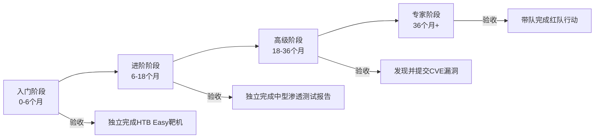
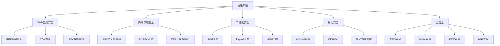
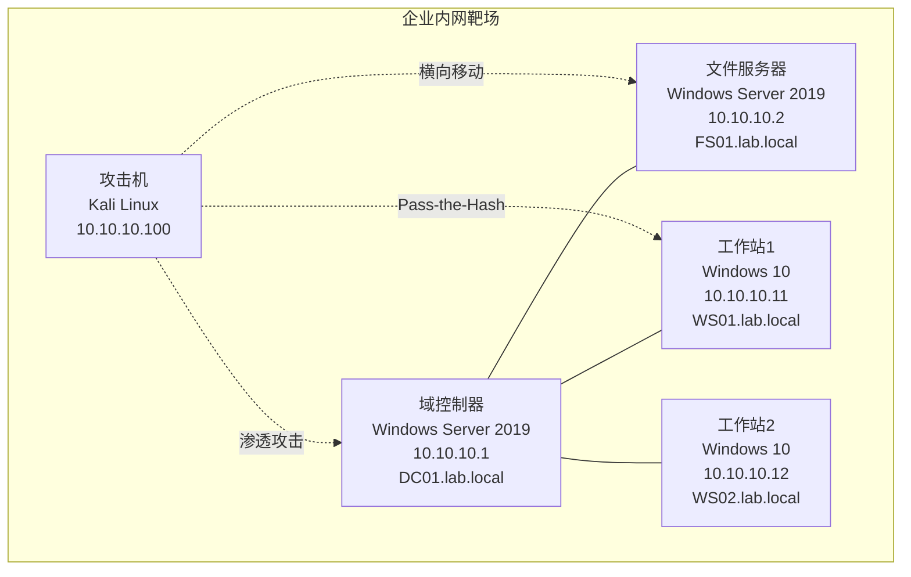
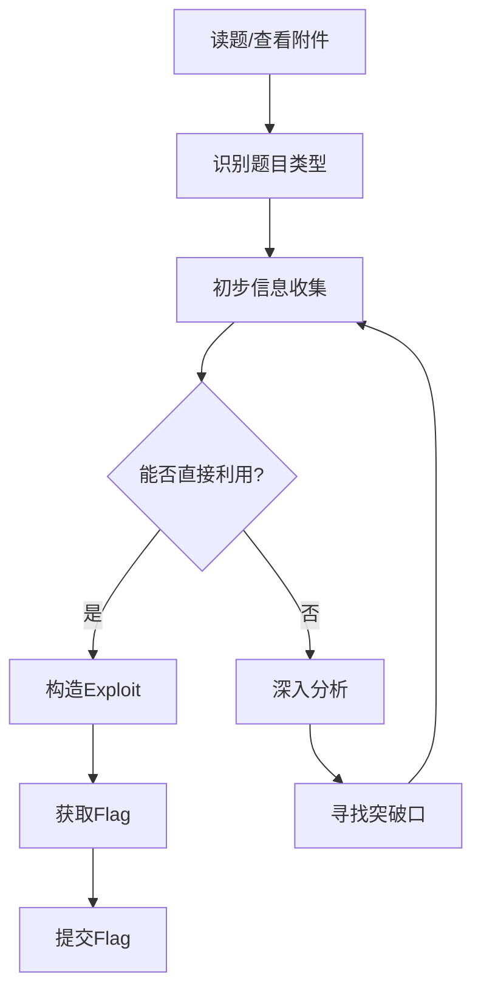
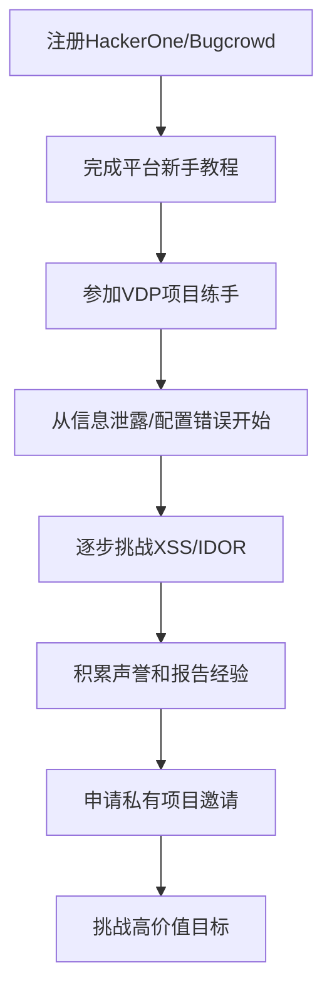
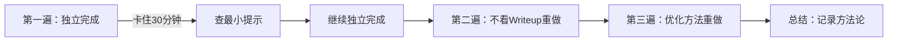
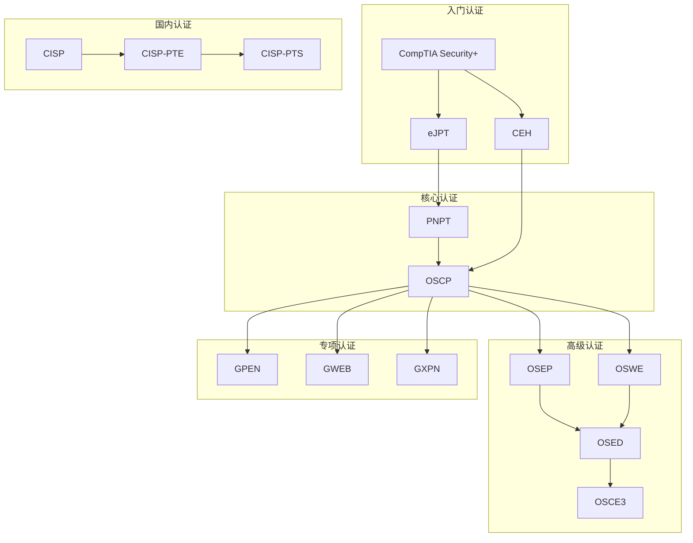

# 05 练习方法

渗透测试是一门以实践为核心的技艺。再多的理论知识，如果不在真实或模拟环境中反复锤炼，都无法转化为真正的能力。本章提供一套从零基础到专业级的完整练习体系——包括学习路径规划、靶场环境搭建、CTF竞赛参与、漏洞赏金实战、练习方法论和持续学习资源，帮助读者建立系统化的渗透测试能力成长框架。

## 5.1 学习路径规划

渗透测试的学习不是"学完工具就算入门"，而是一个理论→实验→实战→复盘的螺旋上升过程。下面按阶段给出详细路线，每个阶段都包含明确的能力目标、学习内容和验收标准。



### 5.1.1 入门阶段（0-6个月）

入门阶段的目标是建立渗透测试的基础知识体系，掌握基本工具的使用方法，能够独立完成简单的漏洞利用。

**理论学习（前2个月）**：

| 学习模块 | 核心知识点 | 推荐资源 | 验收标准 |
|---------|-----------|---------|---------|
| 计算机网络 | TCP/IP五层模型、三次握手/四次挥手、ARP/ICMP/DNS工作原理、HTTP/HTTPS协议细节 | 《计算机网络：自顶向下方法》 | 能用Wireshark抓包分析完整HTTP请求生命周期 |
| 操作系统 | Linux文件系统/权限/进程管理、Windows域基础/注册表/服务管理 | OverTheWire Bandit + 《鸟哥的Linux私房菜》前15章 | 能在纯命令行环境下完成用户管理、网络配置、服务部署 |
| Web技术 | HTML/CSS/JS基础、前后端交互流程、Cookie/Session机制、RESTful API设计 | MDN Web Docs | 能手动构造HTTP请求并理解响应各字段含义 |
| 编程语言 | Python基础语法、requests库、正则表达式、文件操作、Socket编程 | 《Python编程：从入门到实践》 | 能编写自动化信息收集脚本（端口扫描+目录爆破） |
| OWASP Top 10 | SQL注入、XSS、CSRF、文件上传、命令注入、SSRF等漏洞原理 | OWASP官方文档 + PortSwigger Web Academy | 能在DVWA上手动利用全部10类漏洞 |

**工具学习（第3-4个月）**：

渗透测试工具的学习不是"知道菜单在哪里"，而是理解工具的底层原理，能够在工具失效时手动完成同等操作。

- **Nmap**：不要只记命令参数。要理解TCP SYN扫描、TCP Connect扫描、UDP扫描的区别和适用场景。学会用NSE脚本扩展扫描能力，能编写简单的NSE脚本。练习：对Metasploitable 2完成全端口扫描+服务版本识别+漏洞脚本扫描，输出完整报告。
- **Burp Suite**：重点掌握Repeater的手动请求修改、Intruder的四种攻击模式（Sniper/Battering ram/Pitchfork/Cluster bomb）、Scanner的误报识别。练习：在PortSwigger Labs上完成至少30个实验。
- **Wireshark**：掌握显示过滤器语法（`http.request.method == "POST"`、`tcp.stream eq 5`等）、追踪TCP流、提取传输文件。练习：分析一个包含SQL注入流量的pcap文件，还原注入payload。
- **Metasploit Framework**：理解Module/Payload/Encoder的架构，掌握`search`→`use`→`set`→`exploit`的工作流。练习：对Metasploitable 2利用至少5个不同服务的漏洞获取shell。

**实践练习（第5-6个月）**：

- 搭建DVWA靶场，在所有难度级别下完成全部漏洞练习
- 使用Metasploitable 2靶机完成至少10个服务的漏洞利用
- 在TryHackMe上完成"Pre Security"和"Complete Beginner"两条学习路径
- 开始接触Hack The Box的Easy级别退役靶机，至少完成5台
- **关键验收**：能独立完成一台HTB Easy靶机，从信息收集到提权，全程不需要看Writeup

### 5.1.2 进阶阶段（6-18个月）

进阶阶段的目标是提升技术深度和广度，能够独立完成中等难度的渗透测试项目，具备编写自定义工具和利用的能力。

**技术深化方向**：

**Web安全进阶**：
- 深入理解反序列化漏洞：Java反序列化（Commons Collections链）、PHP反序列化（`__wakeup`/`__destruct`魔术方法）、Python pickle反序列化
- SSRF进阶：利用file协议读取本地文件、利用gopher协议攻击内网Redis/Memcached、DNS Rebinding绕过SSRF防护
- XXE进阶：带外数据外带（OOB-XXE）、Blind XXE、通过参数实体绕过WAF
- 模板注入（SSTI）：识别模板引擎→构造payload→获取RCE的完整流程
- 练习资源：PortSwigger Web Security Academy全部高级实验、HackTheBox中等Web靶机

**内网渗透**：
- Active Directory攻击链：初始访问→信息收集→横向移动→权限提升→域控获取
- 核心技术：Kerberoasting、AS-REP Roasting、Pass-the-Hash、Pass-the-Ticket、DCShadow、DCSync
- 工具链：BloodHound（AD关系图谱）、Impacket（协议攻击）、Rubeus（Kerberos攻击）、CrackMapExec（横向移动）
- 练习：搭建包含多台机器的AD环境，模拟完整攻击链

**二进制安全基础**：
- 理解栈溢出原理：覆盖返回地址→控制EIP/RIP→执行shellcode
- 学习使用GDB/GEF/pwndbg调试器
- 掌握基本的ROP链构造
- 练习：完成Exploit Education的Phoenix全部挑战

**工具进阶清单**：

| 工具 | 进阶用法 | 学习目标 |
|-----|---------|---------|
| Burp Suite | 自定义扩展开发、Auth Token分析、序列化数据处理 | 能编写Burp插件自动化测试流程 |
| Metasploit | 自定义模块编写、Meterpreter后渗透、持久化 | 能编写自定义exploit模块 |
| Cobalt Strike | Beacon管理、Malleable C2 Profile、Spear Phishing | 能搭建C2基础设施完成红队模拟 |
| Nmap | NSE脚本编写、大规模扫描优化 | 能编写专用NSE脚本 |
| Python | Scapy包构造、自动化漏洞利用框架 | 能编写完整的渗透测试工具 |

**实践练习**：

- 在Hack The Box上完成至少20台Medium级别靶机
- 参加至少5场CTF竞赛，积累解题经验
- 搭建包含Active Directory的内网环境，反复练习完整攻击链
- 在HackerOne/Bugcrowd上提交至少3个有效漏洞报告
- **关键验收**：能独立编写一份完整的渗透测试报告，包含发现、复现步骤、影响分析和修复建议

### 5.1.3 高级阶段（18-36个月）

高级阶段的目标是培养专业化的渗透测试能力，能够在复杂场景下独立完成高难度的测试任务，并开始向特定方向深耕。

**专业方向选择**：



**高级技术研修**：

- **自定义漏洞利用开发**：从fuzzing到漏洞确认到exploit编写的完整流程。学习AFL/libFuzzer进行模糊测试，学习使用WinDbg/x64dbg分析崩溃，学习绕过DEP/ASLR/CFG等现代缓解措施。
- **高级隐蔽通信**：Domain Fronting、DNS over HTTPS隧道、自定义C2协议设计、流量伪装（Malleable C2、域前置、CDN隧道）。理解网络检测规则并设计绕过方案。
- **安全产品绕过**：EDR的用户态/内核态Hook机制及绕过方法、WAF规则识别与绕过技术（编码变换、分块传输、参数污染）、AMSI绕过、AppLocker/WDAC绕过。
- **威胁建模**：学习STRIDE/DREAD威胁建模方法，能够对目标系统进行系统化的安全评估。

**实践练习**：

- 在Hack The Box上完成Hard和Insane级别靶机
- 在CTF竞赛中获得名次（至少进入前20%）
- 向CVE/NVD提交至少1个原创漏洞（目标：获得CVE编号）
- 参与开源安全工具的开发和维护
- **关键验收**：能独立完成一个企业级环境的全面渗透测试，输出专业的渗透测试报告

### 5.1.4 专家阶段（36个月以上）

专家阶段的核心能力是创新——发现新的攻击向量、开发新的利用技术、推动安全社区的发展。

**核心能力要求**：

- **漏洞研究**：能够对0day漏洞进行独立研究和利用开发，不依赖已知的PoC和利用代码
- **红队领导**：能够规划和执行企业级红队行动，模拟高级持续性威胁（APT）的完整攻击链
- **安全咨询**：能够为企业提供安全架构设计、安全策略制定、安全培训等咨询服务
- **社区贡献**：在安全会议上发表演讲、发布安全研究论文、开发被广泛使用的安全工具

**专家级实践**：

- 发现并报告至少5个CVE漏洞
- 在安全会议（DEF CON、Black Hat、HITB等）上发表演讲或进行Workshop
- 开发至少一个被安全社区广泛使用的工具
- 带队完成至少10次企业级红队评估
- 持续跟踪最新的安全研究和技术趋势

## 5.2 靶场环境搭建

靶场环境是渗透测试练习的基础设施。一个好的靶场环境应该具备：网络隔离（防止攻击扩散到生产环境）、快照恢复（实验失败后快速重置）、多样化的目标系统（覆盖不同攻击场景）。

### 5.2.1 本地靶场环境

**硬件要求**：

| 配置项 | 最低配置 | 推荐配置 | 说明 |
|-------|---------|---------|------|
| CPU | 4核8线程 | 8核16线程 | 虚拟机并发需要充足算力 |
| 内存 | 16GB | 32GB+ | 同时运行3-5台虚拟机 |
| 存储 | 256GB SSD | 512GB NVMe SSD | SSD对虚拟机性能影响巨大 |
| 网络 | 有线网卡 | 有线+无线双网卡 | 方便构建多网段环境 |

**虚拟化平台选择**：

| 平台 | 优势 | 劣势 | 适用场景 |
|-----|------|------|---------|
| VMware Workstation Pro | 性能好、快照管理方便、网络配置灵活 | 付费（订阅制） | Windows桌面环境首选 |
| VirtualBox | 免费开源、跨平台 | 性能略逊、网络配置较复杂 | 预算有限的入门者 |
| Proxmox VE | 免费、企业级虚拟化、支持容器 | 需要专用服务器 | 搭建长期使用的靶场服务器 |
| Docker | 启动快、资源占用小、便于编排 | 无法模拟完整网络栈 | Web靶场、快速部署 |

**网络架构设计**：

本地靶场应构建隔离的虚拟网络，避免靶场流量泄露到宿主网络：

```text
靶场网络架构：
┌─────────────────────────────────────────┐
│ 宿主机（物理网络 192.168.1.0/24）         │
│ ┌─────────────────────────────────────┐ │
│ │ VMware NAT Network (10.10.10.0/24) │ │
│ │                                     │ │
│ │  ┌──────────┐  ┌──────────────┐    │ │
│ │  │ Kali     │  │ Metasploitable│   │ │
│ │  │ 10.10.10.100│ │ 10.10.10.128  │  │ │
│ │  └──────────┘  └──────────────┘    │ │
│ │                                     │ │
│ │  ┌──────────┐  ┌──────────────┐    │ │
│ │  │ DVWA     │  │ Win Server   │    │ │
│ │  │ 10.10.10.130│ │ 10.10.10.200  │  │ │
│ │  └──────────┘  └──────────────┘    │ │
│ └─────────────────────────────────────┘ │
└─────────────────────────────────────────┘
```

**核心靶场部署**：

**Kali Linux 部署与配置**：

```bash
# 方法1：使用预构建VMware镜像（推荐）
# 从 https://www.kali.org/get-kali/ 下载VMware镜像
# 解压后用VMware打开.vmx文件

# 方法2：从ISO安装
# 下载ISO后在VMware中创建新虚拟机，挂载ISO安装

# 安装后基础配置
sudo apt update && sudo apt full-upgrade -y
sudo apt install -y kali-linux-large    # 安装完整工具集

# 安装常用额外工具
sudo apt install -y seclists wordlists rockyou
sudo apt install -y bloodhound neo4j
sudo apt install -y ghidra
sudo pip3 install pwntools ropper

# 配置共享文件夹（方便在宿主机和Kali之间传输文件）
# VMware: 设置→选项→共享文件夹→启用→添加路径
sudo vmware-config-tools.pl

# 创建快照（每次重大变更前都应创建快照）
```

**DVWA 靶场部署**：

```bash
# 方法1：Docker一键部署（推荐）
docker run -d \
  --name dvwa \
  -p 80:80 \
  -p 3306:3306 \
  vulnerables/web-dvwa

# 方法2：手动部署（更接近真实环境）
# 安装LAMP环境
sudo apt install -y apache2 mariadb-server php php-mysql php-gd libapache2-mod-php

# 下载DVWA
cd /var/www/html
sudo git clone https://github.com/digininja/DVWA.git
sudo cp DVWA/config/config.inc.php.dist DVWA/config/config.inc.php

# 配置数据库
sudo systemctl start mariadb
sudo mysql -e "CREATE DATABASE dvwa;"
sudo mysql -e "CREATE USER 'dvwa'@'localhost' IDENTIFIED BY 'p@ssw0rd';"
sudo mysql -e "GRANT ALL ON dvwa.* TO 'dvwa'@'localhost';"
sudo mysql -e "FLUSH PRIVILEGES;"

# 配置PHP
sudo sed -i 's/allow_url_include = Off/allow_url_include = On/' /etc/php/*/apache2/php.ini
sudo sed -i 's/allow_url_fopen = Off/allow_url_fopen = On/' /etc/php/*/apache2/php.ini

# 设置目录权限
sudo chmod -R 777 DVWA/hackable/uploads/
sudo chmod -R 777 DVWA/config/

# 重启Apache
sudo systemctl restart apache2

# 访问 http://localhost/DVWA/setup.php 完成初始化
# 默认账号：admin / password
```

**Metasploitable 2 部署**：

```bash
# 下载Metasploitable 2虚拟机镜像
wget https://sourceforge.net/projects/metasploitable/files/Metasploitable2/Metasploitable2-Linux.zip

# 解压并导入VMware/VirtualBox
unzip Metasploitable2-Linux.zip
# 用VMware打开.vmx文件，网络设置为与Kali同一虚拟网络

# 默认登录：msfadmin / msfadmin
# 验证靶机可用：从Kali执行 nmap -sV 10.10.10.128
```

**VulnHub靶机使用流程**：

```bash
# 1. 从 https://www.vulnhub.com/ 选择靶机下载OVA文件
# 2. 导入VMware：文件→打开→选择.ova文件
# 3. 网络设置为Host-Only或NAT（确保与Kali在同一网段）
# 4. 启动靶机，开始练习

# 常用靶机推荐（按难度排序）：
# Easy:   DC-1, Kioptrix Level 1, Stapler
# Medium: SickOS, Mr Robot, Kioptrix 2014
# Hard:   Raven, Symfonos, DerpNStink
```

**Docker Compose 一键靶场**：

对于需要同时运行多个靶场的场景，使用Docker Compose统一管理：

```yaml
# docker-compose.yml
version: '3.8'

services:
  dvwa:
    image: vulnerables/web-dvwa
    ports:
      - "8081:80"
    networks:
      pentest-net:
        ipv4_address: 172.20.0.10

  webgoat:
    image: webgoat/webgoat
    ports:
      - "8082:8080"
    networks:
      pentest-net:
        ipv4_address: 172.20.0.11

  juice-shop:
    image: bkimminich/juice-shop
    ports:
      - "8083:3000"
    networks:
      pentest-net:
        ipv4_address: 172.20.0.12

  mutillidae:
    image: citizenstig/nowasp
    ports:
      - "8084:80"
    networks:
      pentest-net:
        ipv4_address: 172.20.0.13

networks:
  pentest-net:
    driver: bridge
    ipam:
      config:
        - subnet: 172.20.0.0/24
```

```bash
# 启动全部靶场
docker-compose up -d

# 访问地址：
# DVWA:        http://localhost:8081
# WebGoat:     http://localhost:8082
# Juice Shop:  http://localhost:8083
# Mutillidae:  http://localhost:8084
```

### 5.2.2 云端靶场平台

在线靶场平台的优势是无需本地环境搭建、靶机种类丰富、有社区支持和学习路径引导。以下是主流平台的详细对比：

| 平台 | 难度范围 | 费用 | 特色 | 适合人群 |
|------|---------|------|------|---------|
| Hack The Box | Easy→Insane | 免费（退役靶机）/ VIP $14/月 | 靶机质量最高、社区活跃、有Starting Point引导路径 | 有基础的学习者 |
| TryHackMe | Beginner→Advanced | 免费（部分房间）/ $14/月 | 引导式学习、结构化路径、内置VPN | 零基础入门者 |
| PentesterLab | Easy→Hard | 免费（部分）/ $34/月 | Web安全专项、注重原理讲解 | Web安全方向 |
| PortSwigger Labs | Apprentice→Expert | 完全免费 | 最权威的Web安全教学、配合官方教材 | Web安全学习必备 |
| OverTheWire | 渐进式 | 完全免费 | 命令行挑战、Linux基础、Wargame模式 | Linux基础训练 |
| VulnHub | 多样化 | 完全免费 | 可下载的完整虚拟机、离线练习 | 离线练习需求 |
| CyberDefenders | 多样化 | 免费（部分）/ Pro $9/月 | 蓝队取证分析、防守视角 | 兼修防御侧 |
| Proving Grounds | Easy→Hard | $19/月 | OffSec官方平台、OSCP备考首选 | OSCP备考者 |

**Hack The Box 使用指南**：

```bash
# 1. 注册账号：https://www.hackthebox.com/
# 2. 下载VPN连接文件：Access → Connection Pack
# 3. 连接VPN
sudo openvpn lab_name.ovpn

# 4. 选择靶机，点击Spawn Machine
# 5. 开始渗透测试流程

# HTB靶机标准解题流程：
# Step 1: 信息收集
nmap -sC -sV -oN nmap_initial.txt <target_ip>

# Step 2: 枚举Web服务（如果有）
gobuster dir -u http://<target_ip> -w /usr/share/wordlists/dirb/common.txt -o gobuster.txt

# Step 3: 漏洞识别与利用
# 根据扫描结果选择利用方式

# Step 4: 获取初始访问（User Flag）
cat user.txt

# Step 5: 提权
# 枚举系统信息，寻找提权向量
# linux: LinPEAS, linux-exploit-suggester
# windows: WinPEAS, PowerUp, Sherlock

# Step 6: 获取Root/Admin权限（Root Flag）
cat root.txt
```

**TryHackMe 学习路径推荐**：

```text
入门路径（按顺序完成）：
1. Pre Security（前置知识）
   - Network Fundamentals
   - How The Web Works
   - Linux Fundamentals
   - Windows Fundamentals

2. Complete Beginner（入门基础）
   - Introduction to Cyber Security
   - Pentesting Fundamentals
   - Burp Suite Basics
   - Web Application Security

3. Offensive Pentesting（渗透测试）
   - Introduction to Pentesting
   - Network Services
   - Shells and Privilege Escalation
   - Reverse Engineering

进阶路径：
4. Web Application Security（Web安全专项）
5. Red Teaming（红队技术）
6. Complete Beginner → Offensive Security 链路
```

### 5.2.3 企业级靶场环境

练习内网渗透和域攻击需要搭建模拟企业网络环境。这类环境比Web靶场复杂得多，但也是从"会用工具"到"理解企业安全"的关键跳板。

**Active Directory 靶场搭建**：



**自动化搭建方案（Detection Lab）**：

Detection Lab是一个开源项目，可以自动化部署包含安全监控的Active Directory环境：

```bash
# 克隆Detection Lab
git clone https://github.com/clong/DetectionLab.git
cd DetectionLab

# 需要预先安装Vagrant和VirtualBox/VMware
# 修改Vagrantfile中的配置参数

# 启动环境（首次构建需要较长时间）
vagrant up

# Detection Lab包含：
# - DC：域控制器 + Windows Event Forwarding + Sysmon
# - WEF：Windows Event Collector
# - Win10：域内工作站
# - Logger：日志服务器（Splunk/Zeek）
```

**手动搭建AD靶场关键步骤**：

```powershell
# === 域控制器配置 ===

# 1. 设置静态IP
New-NetIPAddress -InterfaceAlias "Ethernet" -IPAddress 10.10.10.1 -PrefixLength 24 -DefaultGateway 10.10.10.254
Set-DnsClientServerAddress -InterfaceAlias "Ethernet" -ServerAddresses 10.10.10.1

# 2. 安装AD域服务
Install-WindowsFeature AD-Domain-Services -IncludeManagementTools

# 3. 提升为域控制器
Install-ADDSForest `
  -DomainName "lab.local" `
  -DomainNetbiosName "LAB" `
  -ForestMode "WinThreshold" `
  -DomainMode "WinThreshold" `
  -InstallDNS:$true `
  -SafeModeAdministratorPassword (ConvertTo-SecureString "your_password123!" -AsPlainText -Force) `
  -Force:$true

# 4. 创建组织单位和用户
New-ADOrganizationalUnit -Name "Employees" -Path "DC=lab,DC=local"
New-ADOrganizationalUnit -Name "Service Accounts" -Path "DC=lab,DC=local"

# 创建普通用户
New-ADUser -Name "张三" -SamAccountName "zhangsan" -UserPrincipalName "zhangsan@lab.local" `
  -Path "OU=Employees,DC=lab,DC=local" `
  -AccountPassword (ConvertTo-SecureString "Welcome1" -AsPlainText -Force) `
  -Enabled $true

# 创建域管理员
New-ADUser -Name "Domain Admin" -SamAccountName "da_admin" -UserPrincipalName "da_admin@lab.local" `
  -Path "OU=Employees,DC=lab,DC=local" `
  -AccountPassword (ConvertTo-SecureString "Str0ngP@ss!" -AsPlainText -Force) `
  -Enabled $true
Add-ADGroupMember -Identity "Domain Admins" -Members "da_admin"

# 5. 故意引入安全配置缺陷（练习用）
# 设置Kerberoastable SPN
Set-ADUser -Identity "zhangsan" -ServicePrincipalNames @{Add="MSSQLSvc/sql01.lab.local:1433"}

# 设置AS-REP Roastable账户
Set-ADAccountControl -Identity "zhangsan" -DoesNotRequirePreAuth $true

# 创建弱密码策略的服务账户
New-ADUser -Name "svc_backup" -SamAccountName "svc_backup" `
  -Path "OU=Service Accounts,DC=lab,DC=local" `
  -AccountPassword (ConvertTo-SecureString "backup123" -AsPlainText -Force) `
  -Enabled $true
```

**内网靶场练习场景清单**：

完成以下场景练习，覆盖内网渗透的核心技术：

| 场景 | 技术点 | 预期收获 |
|------|--------|---------|
| AS-REP Roasting | 无需预认证的用户枚举 | 获取用户NTLM哈希 |
| Kerberoasting | SPN票据请求与离线破解 | 获取服务账户密码 |
| Pass-the-Hash | 利用NTLM哈希横向移动 | 不知明文密码也能横向 |
| Pass-the-Ticket | 利用Kerberos票据横向移动 | 理解Kerberos认证流程 |
| ACL滥用 | 利用错误的ACL配置提权 | 理解AD权限模型 |
| DCSync | 模拟域控复制获取所有哈希 | 理解AD复制机制 |
| GPP密码 | 组策略中存储的密码 | 理解GPP安全风险 |
| Unconstrained Delegation | 无约束委派攻击 | 理解委派安全 |

## 5.3 CTF竞赛参与

CTF（Capture The Flag，夺旗赛）是网络安全领域最流行的竞赛形式。它将复杂的安全知识拆解为可量化的挑战题目，通过"解题→得分→排名"的机制提供即时反馈，是提升渗透测试技能最高效的途径之一。

### 5.3.1 CTF竞赛形式详解

**Jeopardy（解题模式）**：

最常见的CTF形式。题目按类别分组，每个题目有对应的分值，队伍选择性解题。

主要题目类别：

| 类别 | 典型题目 | 核心技能 | 工具 |
|------|---------|---------|------|
| Web | SQL注入、XSS、反序列化、SSRF | Web漏洞识别与利用 | Burp Suite、dirsearch、sqlmap |
| Pwn | 栈溢出、堆利用、格式化字符串 | 二进制漏洞利用 | pwntools、GDB、ROPgadget |
| Reverse | 逆向分析、加壳脱壳、反调试 | 程序分析能力 | IDA Pro、Ghidra、x64dbg |
| Crypto | RSA攻击、AES模式攻击、密码分析 | 密码学知识 | SageMath、CyberChef、Python |
| Forensics | 流量分析、内存取证、磁盘分析 | 数字取证能力 | Wireshark、Volatility、Autopsy |
| Misc | 编程题、AI安全、区块链、杂项 | 综合能力 | 因题而异 |

**Attack-Defense（攻防模式）**：

最接近真实攻防对抗的竞赛形式。每个队伍维护一组服务，同时攻击其他队伍的服务。

- **防守要求**：保证己方服务可用（SLA检查）、修复己方服务中的漏洞、监控异常流量
- **攻击要求**：发现其他队伍服务中的漏洞、编写自动化exploit批量获取flag、隐藏自己的攻击痕迹
- **核心能力**：快速漏洞发现、自动化exploit开发、攻防兼备的综合能力
- **代表赛事**：DEF CON CTF、SECCON CTF Final

**King of the Hill（山丘之王）**：

多个队伍争夺对同一目标系统的控制权，需要反复提权、植入后门、清除其他队伍的后门。控制root权限时间最长的队伍获胜。

### 5.3.2 CTF练习平台与路线

**入门练习（0-3个月）**：

| 平台 | 特点 | 推荐理由 |
|------|------|---------|
| PicoCTF | CMU主办、题目质量高、有学习引导 | 最佳入门平台 |
| OverTheWire Bandit | Linux命令行基础 | 补齐Linux基础 |
| TryHackMe CTF房间 | 引导式解题 | 边学边练 |
| CryptoHack | 密码学专项 | Crypto入门首选 |

**进阶练习（3-12个月）**：

| 平台 | 特点 | 推荐理由 |
|------|------|---------|
| CTFtime | 全球CTF赛事聚合平台 | 了解赛事日历，报名参赛 |
| Hack The Box CTF | 高质量Web和Pwn题目 | 进阶实战 |
| Root Me | 400+挑战、涵盖所有类别 | 全面练习 |
| RingZer0 | 多类别安全挑战 | 分类练习 |
| W3Challs | Web安全专项 | Web进阶 |

**高级练习（12个月以上）**：

| 平台 | 特点 | 推荐理由 |
|------|------|---------|
| CTFtime赛事 | 实时竞赛 | 实战对抗 |
| 0CTF/TCTF | 国际顶级赛事 | 最高难度挑战 |
| Real World CTF | 真实场景漏洞 | 接近实战 |
| XCTF联赛 | 国内顶级CTF赛事 | 国内最高水平 |

### 5.3.3 CTF解题方法论

CTF不是"猜答案"，而是有系统方法的。以下是经过验证的解题框架：

**通用解题流程**：



**Web题解题思路**：

```python
# Web题标准检查流程
checklist = {
    "源码检查": "查看页面源码、JS文件、注释中的隐藏信息",
    "请求分析": "检查HTTP头、Cookie、隐藏参数、API端点",
    "目录枚举": "使用gobuster/dirsearch扫描目录和文件",
    "参数FUZZ": "对已知参数进行值Fuzzing",
    "框架识别": "识别Web框架，查找已知漏洞",
    "认证绕过": "尝试默认凭据、SQL注入登录、JWT伪造",
    "文件操作": "测试文件上传、LFI、RFI",
    "逻辑漏洞": "检查越权、竞态条件、业务逻辑缺陷",
}
```

**Pwn题解题思路**：

```python
# Pwn题标准分析流程
from pwn import *

# 1. 文件分析
# file ./vuln           # 查看文件类型
# checksec ./vuln       # 检查安全机制
# strings ./vuln        # 查看字符串

# 2. 静态分析
# 使用Ghidra/IDA反编译，理解程序逻辑
# 关注：栈变量布局、危险函数（gets/strcpy/sprintf）、格式化字符串

# 3. 动态分析
# 使用GDB+GEF调试，确定偏移量
# pattern create 200    # 生成pattern
# pattern offset $rsp   # 确定偏移量

# 4. 编写Exploit
io = process('./vuln')
# 或 io = remote('challenge.ctf.com', 1337)

payload = b'A' * offset      # 填充到返回地址
payload += p64(pop_rdi)       # ROP: pop rdi; ret
payload += p64(bss_addr)      # 指向可写区域
payload += p64(system_addr)   # 调用system()

io.sendline(payload)
io.interactive()
```

### 5.3.4 CTF参赛实战指南

**赛前准备清单**：

```text
环境准备：
□ 更新Kali Linux和所有工具
□ 准备好VPN连接（如果比赛需要）
□ 测试Burp Suite、Wireshark、Ghidra等核心工具
□ 准备好pwntools、z3-solver、angr等Python库
□ 准备好常用脚本模板（Web扫描、二进制利用、密码学攻击）

团队分工：
□ 明确每人的专长方向（Web/Pwn/Crypto/Reverse/Misc）
□ 建立即时通讯群组（Discord/Telegram）
□ 准备共享文档（解题记录、flag管理）
□ 指定一人负责Flag提交（避免重复提交）

知识储备：
□ 整理常见加密算法和攻击方法的速查表
□ 准备常见Web漏洞的检测和利用脚本
□ 整理二进制分析的常用工具和技巧
□ 准备取证分析的常用工具链
```

**赛中策略**：

1. **开局30分钟**：全队浏览所有题目，标记难度和预期耗时，优先解决"低悬果实"（分值低但耗时短的题目）
2. **前2小时**：每人专注各自擅长的类别，快速拿分
3. **中期**：交叉协助，专攻难题。对于卡住的题目，及时换人尝试
4. **最后1小时**：集中精力攻克有望解出的难题，放弃无望的题目
5. **Flag管理**：使用共享文档实时记录解题进度和Flag，避免重复工作

**赛后复盘模板**：

```markdown
# CTF复盘报告

## 比赛信息
- 比赛名称：
- 比赛时间：
- 最终排名：/ 总队伍数
- 总得分：

## 解题记录

### 题目1：[题目名称]（类别 | 分值 | ✓/✗）
**解题思路**：
[详细描述解题过程]

**关键技术点**：
[列出涉及的核心知识点]

**耗时**：
**反思**：[做得好的地方/需要改进的地方]

### 题目2：...

## 未解出的题目

### 题目X：[题目名称]
**赛后Writeup关键思路**：
[从官方Writeup或其他队伍的解题报告中总结]

**未能解出的原因**：
[分析为什么当时没有想到]

**需要补充的知识**：
[列出需要学习的内容]

## 改进计划
1. [具体的学习目标]
2. [需要准备的工具/脚本]
3. [下次比赛的策略调整]
```

## 5.4 漏洞赏金计划

漏洞赏金计划（Bug Bounty Program）是将渗透测试技能应用于真实目标的最佳途径。它提供合法的测试授权、真实的攻击目标、经济回报，以及与专业安全团队交流的机会。

### 5.4.1 平台选择与入门

**国际平台**：

| 平台 | 特色 | 费用 | 支付方式 | 适合人群 |
|------|------|------|---------|---------|
| HackerOne | 最大的Bug Bounty平台、企业客户最多 | 免费注册 | PayPal/银行转账 | 所有水平 |
| Bugcrowd | 第二大平台、有VDP项目 | 免费注册 | PayPal/银行转账 | 所有水平 |
| Intigriti | 欧洲平台、社区活跃 | 免费注册 | 银行转账 | 有经验者 |
| YesWeHack | 欧洲平台、法国政府项目 | 免费注册 | 银行转账 | 有经验者 |

**国内平台**：

| 平台 | 特色 | 费用 | 适合人群 |
|------|------|------|---------|
| 补天 | 国内最大、覆盖国内企业 | 免费注册 | 所有水平 |
| 漏洞盒子 | 国内主流、企业覆盖广 | 免费注册 | 所有水平 |
| SRC子域名 | 各大厂商自己的SRC | 免费 | 有特定目标者 |

**新手入门路线图**：



### 5.4.2 赏金漏洞挖掘方法论

漏洞赏金不是"看到目标就开扫"，而是有系统的方法。以下是一套经过验证的赏金挖掘流程：

**Phase 1：侦察（Reconnaissance）**：

侦察是赏金挖掘中最重要也最容易被忽视的阶段。80%的高价值漏洞都来自于充分的信息收集。

```bash
# 子域名枚举
subfinder -d target.com -o subdomains.txt
amass enum -passive -d target.com -o amass_subs.txt
assetfinder --subs-only target.com | sort -u >> subdomains.txt

# 子域名存活探测
httpx -l subdomains.txt -o alive.txt -mc 200,301,302,403 -threads 50

# 目录扫描
cat alive.txt | while read url; do
  gobuster dir -u "$url" -w /usr/share/wordlists/dirb/common.txt -o "gobuster_$(echo $url | md5sum | cut -c1-8).txt"
done

# 参数发现
arjun -u https://target.com/api/endpoint

# JavaScript文件分析（寻找API端点和敏感信息）
cat alive.txt | while read url; do
  python3 /opt/SecretFinder/SecretFinder.py -i "$url" -o cli
done

# GitHub/GitLab信息泄露搜索
# 搜索目标公司的代码仓库中可能泄露的敏感信息
# 注意：只能搜索公开信息，不能尝试访问私有仓库
```

**Phase 2：测试（Testing）**：

从侦察阶段收集的信息中，选择最有可能存在漏洞的目标进行深入测试：

**高优先级测试目标**：

| 优先级 | 目标类型 | 原因 | 典型漏洞 |
|-------|---------|------|---------|
| P0 | 新功能/新上线的服务 | 未经充分测试 | 各类漏洞 |
| P1 | API端点 | 逻辑复杂、校验不足 | BOLA/IDOR、认证绕过 |
| P1 | 认证/授权逻辑 | 安全关键 | 越权、Token伪造 |
| P2 | 文件上传功能 | 处理复杂 | 任意文件上传、RCE |
| P2 | 密码重置流程 | 逻辑复杂 | 邮箱枚举、Token可预测 |
| P3 | Webhook/回调URL | 信任关系 | SSRF |
| P3 | 导入/导出功能 | 文件处理 | XXE、SSTI |

**Phase 3：报告（Reporting）**：

漏洞报告的质量直接决定是否被接受和赏金金额。一份好的报告应该让安全团队能够在不联系你的情况下独立复现漏洞。

**漏洞报告模板**：

```markdown
# 漏洞报告：[漏洞类型] in [受影响功能]

## 摘要
[一句话描述漏洞：类型 + 位置 + 影响]

## 影响
[具体描述攻击者利用此漏洞能做什么]
[量化影响范围：影响多少用户/数据]

## 受影响的URL/端点
- `POST /api/v1/users/profile`
- `GET /api/v1/admin/users`

## 复现步骤

### 前提条件
- 需要两个账号：Attacker (user A) 和 Victim (user B)
- Victim创建了私有资源X

### 步骤

1. 以Attacker账号登录
2. 访问 `GET /api/v1/resources/123`
3. 修改请求中的ID参数为Victim的资源ID：
   ```
   GET /api/v1/resources/456 HTTP/1.1
   Host: target.com
   Authorization: Bearer <attacker_token>
```text
4. 观察响应：返回了Victim的私有资源数据

### 预期结果
应该返回403 Forbidden

### 实际结果
返回200 OK + Victim的私有数据

## 支持材料
[截图、视频、HTTP请求/响应记录]

## 修复建议
- 在服务端实施对象级别的访问控制
- 验证当前用户是否有权限访问请求的资源
```

### 5.4.3 常见赏金漏洞深入挖掘

**IDOR（不安全的直接对象引用）**：

IDOR是赏金中回报率最高的漏洞类型之一，因为它往往直接导致大规模数据泄露。

**发现模式**：
- API中使用递增数字ID（`/api/users/123`、`/api/users/124`）
- 请求参数中包含其他用户的资源标识符
- 批量操作接口未验证权限

**测试方法**：
```text
1. 注册两个测试账号A和B
2. 账号A创建资源，记录资源ID
3. 账号B尝试访问账号A的资源ID
4. 修改请求中的用户ID、订单ID、文件ID等参数
5. 检查响应中是否包含不属于当前用户的数据
6. 特别关注：GraphQL查询中的ID参数、批量API中的ID列表
```

**子域名接管（Subdomain Takeover）**：

```text
原理：某子域名的CNAME记录指向一个已释放/未注册的云服务
      攻击者注册该云服务，即可接管该子域名

检测流程：
1. 子域名枚举获取所有子域名
2. DNS解析检查CNAME记录
3. 检查CNAME指向的服务是否可接管

检测工具：
- subjack: subjack -w subdomains.txt -t 100 -o results.txt
- nuclei: nuclei -l subdomains.txt -t takeovers/
- can-i-take-over-xyz: 手动检查各云服务

可接管的服务：
- AWS S3 Bucket (未创建的)
- Azure Web App (已删除的)
- GitHub Pages (未配置的)
- Heroku App (已过期的)
- Shopify (已关闭的)
- Fastly (未配置的)
- Ghost (已过期的)
```

**SSRF（服务端请求伪造）**：

```text
原理：应用接受用户提供的URL并发起请求，攻击者可以指向内部服务

利用场景：
1. 访问内网服务：http://169.254.169.254/latest/meta-data/ (AWS元数据)
2. 读取本地文件：file:///etc/passwd
3. 攻击内网Redis：通过gopher协议发送Redis命令
4. 端口扫描内网：通过响应时间判断端口是否开放

绕过技巧：
- IP地址变体：0x7f000001、2130706433、017700000001、127.1
- DNS重绑定：第一次解析到外部IP通过验证，第二次解析到内部IP发起请求
- URL解析差异：利用不同语言/库解析URL的差异
- IPv6：[::1]、[::ffff:127.0.0.1]
```

### 5.4.4 漏洞赏金职业发展

**声誉系统**：

HackerOne和Bugcrowd都有声誉系统，你的声誉直接影响你能获得的机会：

| 阶段 | 声誉范围 | 可获得的机会 |
|------|---------|-------------|
| 初级 | 0-100 | 公开项目、VDP项目 |
| 中级 | 100-1000 | 部分私有项目邀请 |
| 高级 | 1000-5000 | 大部分私有项目 |
| 专家 | 5000+ | 所有私有项目、平台顾问 |

**提升声誉的方法**：

1. 持续提交高质量报告（不是数量，是质量）
2. 在公开项目中发现高危漏洞
3. 获得企业的好评和感谢
4. 参加平台组织的活动和挑战
5. 在社区中帮助其他研究者

**收入预期**：

| 漏洞严重程度 | 赏金范围 | 典型场景 |
|------------|---------|---------|
| 低危（Informational） | $0-250 | 信息泄露、配置错误 |
| 中危（Medium） | $250-2,000 | 反射型XSS、CSRF |
| 高危（High） | $2,000-10,000 | 存储型XSS、IDOR、SSRF |
| 严重（Critical） | $10,000-100,000+ | RCE、认证绕过、SQLi |

## 5.5 渗透测试练习方法论

很多学习者在靶场做了大量练习，到了真实测试时仍然无从下手。根本原因是缺乏正确的练习方法。本节提供一套经过验证的渗透测试练习方法论。

### 5.5.1 主动学习法

被动地跟着Writeup做靶机，学习效率极低。主动学习法要求你在每个环节都先独立思考，实在无法进展时再参考外部资料。

**练习三遍法**：



- **第一遍**：完全独立完成。卡住30分钟后，只查最小的提示（比如"这个服务存在漏洞"），然后继续独立完成。这遍的目标是"做完"。
- **第二遍**：不看Writeup从头重做。目标是在1小时内完成，验证自己是否真正掌握了方法。
- **第三遍**：优化方法重做。尝试用不同的工具、不同的思路完成同一个靶机。目标是"做得更好"。

### 5.5.2 渗透测试思维框架

渗透测试不是"跑工具→看结果"，而是有系统化的思维框架：

**OSSTMM方法论简化版**：

```text
信息收集 → 威胁建模 → 漏洞分析 → 漏洞利用 → 后渗透 → 报告

每个阶段的关键问题：
1. 信息收集：我发现了什么？还有什么没发现？
2. 威胁建模：哪些资产最有价值？哪些攻击路径最可行？
3. 漏洞分析：发现的弱点是否可利用？利用条件是什么？
4. 漏洞利用：如何证明漏洞的影响？需要什么前置条件？
5. 后渗透：获取权限后能做什么？如何扩大战果？
6. 报告：如何清晰地传达发现？如何给出可操作的修复建议？
```

**渗透测试思考清单**：

在每个靶机练习中，养成使用以下清单的习惯：

```text
信息收集阶段：
□ 域名和子域名枚举完成
□ 端口扫描（全端口）完成
□ 服务版本识别完成
□ Web目录扫描完成
□ 技术栈识别完成
□ 搜索引擎信息收集（Google Dork）完成
□ GitHub/GitLab公开代码搜索完成
□ 已知漏洞库查询完成

漏洞分析阶段：
□ 每个开放服务的已知漏洞已检查
□ Web应用的输入点已识别
□ 认证和授权机制已分析
□ API端点已枚举
□ 配置文件和备份文件已搜索

利用阶段：
□ 低悬果实优先（已知CVE、默认凭据）
□ 每个发现的漏洞都尝试利用
□ 获取的凭据尝试在其他服务上复用
□ 已获取的shell尝试提权
□ 横向移动检查
```

### 5.5.3 笔记与知识管理

渗透测试的学习需要积累大量的工具使用技巧、漏洞利用方法和解题思路。没有良好的笔记体系，很多宝贵的经验会随时间遗忘。

**推荐的笔记结构**：

```text
渗透测试笔记/
├── 01-工具/
│   ├── nmap/
│   │   ├── 常用命令速查.md
│   │   ├── NSE脚本编写.md
│   │   └── 高级用法.md
│   ├── burpsuite/
│   │   ├── 配置指南.md
│   │   ├── 插件推荐.md
│   │   └── 高级技巧.md
│   └── ...
├── 02-漏洞类型/
│   ├── SQL注入/
│   │   ├── 原理与分类.md
│   │   ├── 检测方法.md
│   │   ├── 利用技巧.md
│   │   └── 绕过WAF.md
│   └── ...
├── 03-靶机笔记/
│   ├── HTB/
│   │   ├── Easy/
│   │   ├── Medium/
│   │   └── ...
│   └── TryHackMe/
├── 04-CTF/
│   ├── Writeup/
│   └── 常见题型模板.md
├── 05-赏金/
│   ├── 已提交报告/
│   └── 常见漏洞模式.md
└── 06-学习笔记/
    ├── 书籍笔记/
    ├── 课程笔记/
    └── 认证备考/
```

**推荐工具**：
- **Obsidian**：本地Markdown知识库，支持双向链接和图谱视图，适合构建个人知识网络
- **Notion**：云端笔记，支持数据库和模板，适合团队协作
- **CherryTree**：树状结构笔记，渗透测试社区常用
- **GitBook**：适合写成结构化的知识库

### 5.5.4 常见练习误区

**误区1：只做靶机不做真实测试**

靶机是练习工具，不是目标。很多学习者在HTB上做了几十台靶机，却从未在真实目标上测试过。靶机的漏洞是设计好的，真实环境的漏洞是隐蔽的。在掌握基础后，应该尽早参与漏洞赏金计划。

**误区2：只看Writeup不自己动手**

看别人的解题过程和自己动手做是完全不同的学习深度。看Writeup是被动接收信息，自己动手是主动构建知识。建议先独立尝试至少30分钟，再看提示。

**误区3：工具依赖过重**

自动化工具是效率放大器，不是替代品。如果不理解sqlmap的SQL注入检测原理，当sqlmap失效时你就束手无策。先手动理解原理，再用工具提高效率。

**误区4：不做笔记和复盘**

每完成一个靶机或CTF题目，如果不记录方法论，下次遇到类似问题可能还是不会做。笔记的价值在于"不需要再次记忆"。

**误区5：追求广度忽视深度**

什么都学一点但什么都不精通，是渗透测试学习的最大陷阱。选择一个方向深入，比浅尝辄止地学习所有方向更有效。

**误区6：忽视防守侧知识**

只学攻击不学防守，会导致：
- 无法写出有价值的修复建议
- 不理解安全检测机制，容易被发现
- 无法评估漏洞的实际影响

建议同时学习基础的防守知识：日志分析、入侵检测、安全监控。

## 5.6 持续学习资源

### 5.6.1 技术博客与社区

**中文社区**：

| 社区 | 特色 | URL |
|------|------|-----|
| 先知社区 | 阿里旗下、高质量技术文章 | https://xianzhisecurity.com/ |
| FreeBuf | 安全资讯+技术文章 | https://www.freebuf.com/ |
| 安全客 | 360旗下、安全资讯 | https://www.anquanke.com/ |
| 看雪论坛 | 二进制安全、逆向工程 | https://bbs.kanxue.com/ |
| 吾爱破解 | 逆向工程、软件安全 | https://www.52pojie.cn/ |
| T00ls | 渗透测试技术交流 | https://www.t00ls.com/ |
| 安全脉搏 | 综合安全技术 | https://www.secpulse.com/ |

**英文社区**：

| 社区 | 特色 | URL |
|------|------|-----|
| PortSwigger Research | Web安全研究权威 | https://portswigger.net/research |
| Project Zero | Google零日漏洞研究 | https://googleprojectzero.blogspot.com/ |
| Reddit r/netsec | 综合安全讨论 | https://www.reddit.com/netsec/ |
| Hacker News | 技术新闻 | https://news.ycombinator.com/ |
| Medium安全标签 | 大量独立研究者文章 | https://medium.com/tag/security |
| Orange Tsai's Blog | 顶级Web安全研究 | https://blog.orange.tw/ |
| LiveOverflow | 视频+博客、CTF和安全 | https://liveoverflow.com/ |

**RSS订阅推荐**（使用Feedly等工具聚合）：

- PortSwigger Web Security Blog
- Project Zero Blog
- Trail of Bits Blog
- NCC Group Research
- SANS Internet Storm Center

### 5.6.2 学习资源推荐

**书籍推荐（按方向分类）**：

Web安全方向：
| 书名 | 作者 | 适合阶段 | 推荐理由 |
|------|------|---------|---------|
| 《Web应用安全权威指南》 | 徐焱等 | 入门-进阶 | 国内Web安全经典，覆盖全面 |
| 《黑客攻防技术宝典：Web实战篇》 | Dafydd Stuttard | 进阶 | Web安全圣经，深入底层原理 |
| 《白帽子讲Web安全》 | 吴翰清 | 入门 | 阿里安全专家的Web安全入门 |
| 《SQL注入攻击与防御》 | Justin Clarke | 进阶 | SQL注入专项深入 |
| 《The Web Application Hacker's Handbook》 | Stuttard & Pinto | 进阶-高级 | 英文原版更佳 |

渗透测试方向：
| 书名 | 作者 | 适合阶段 | 推荐理由 |
|------|------|---------|---------|
| 《渗透测试实战第三版》 | Georgia Weidman | 入门-进阶 | OSCP配套教材，系统全面 |
| 《Metasploit渗透测试魔鬼训练营》 | 诸葛建伟 | 入门-进阶 | Metasploit深度讲解 |
| 《内网安全攻防》 | 候亮 | 进阶 | 国内内网渗透经典 |
| 《红队攻防入门》 | 匿名 | 进阶 | 红队技术综合入门 |

二进制安全方向：
| 书名 | 作者 | 适合阶段 | 推荐理由 |
|------|------|---------|---------|
| 《深入理解计算机系统》（CSAPP） | Randal Bryant | 基础 | 计算机基础必读 |
| 《逆向工程核心原理》 | 李承远 | 进阶 | 逆向工程系统入门 |
| 《漏洞战争》 | 石头 | 进阶-高级 | 真实漏洞分析 |
| 《Android软件安全权威指南》 | 丰生强 | 进阶 | Android安全权威 |

**在线课程**：

| 课程 | 平台 | 费用 | 认证 | 适合阶段 |
|------|------|------|------|---------|
| PWK (Penetration Testing with Kali) | OffSec | $799-1599 | OSCP | 进阶 |
| CPTS (Certified Penetration Testing Specialist) | Hack The Box Academy | $490/年 | CPTS | 入门-进阶 |
| BSCP (Bug Bounty Hunter) | PortSwigger | 免费-付费 | BSCP | 入门-进阶 |
| eJPT (eLearnSecurity Junior Penetration Tester) | INE | $249 | eJPT | 入门 |
| PNPT (Practical Network Penetration Tester) | TCM Security | $399 | PNPT | 进阶 |
| CyberDefenders Blue Team | CyberDefenders | 免费 | CDBA | 防守侧 |
| SANS SEC560 | SANS | $8,000+ | GPEN | 高级 |

**YouTube频道推荐**：

| 频道 | 内容 | 语言 |
|------|------|------|
| IppSec | HTB靶机完整解题过程 | 英文 |
| LiveOverflow | CTF和安全研究 | 英文 |
| John Hammond | CTF解题和安全教程 | 英文 |
| NetworkChuck | 网络和安全基础 | 英文 |
| The Cyber Mentor | 渗透测试入门系列 | 英文 |
| STÖK | Bug Bounty实战 | 英文 |
| NahamSec | Bug Bounty教程 | 英文 |
| 泷羽Sec | 国内安全技术教程 | 中文 |

### 5.6.3 认证路径规划

认证不是目的，而是系统化学习的里程碑。以下是推荐的认证路径：



**核心认证详解**：

| 认证 | 颁发机构 | 费用 | 考试形式 | 有效期 | 含金量 |
|------|---------|------|---------|--------|-------|
| CompTIA Security+ | CompTIA | $392 | 选择题+操作题 | 3年 | 入门级 |
| eJPT | INE | $249 | 48小时实操 | 终身 | 入门级 |
| PNPT | TCM Security | $399 | 5天实操+2天报告 | 终身 | 进阶级 |
| OSCP | OffSec | $799-1599 | 23小时45分实操 | 终身 | 业界标杆 |
| OSEP | OffSec | $1599 | 48小时实操 | 终身 | 高级红队 |
| OSWE | OffSec | $1599 | 48小时实操 | 终身 | Web安全专家 |
| OSCE3 | OffSec | OSEP+OSWE+OSED | 三证合一 | 终身 | 顶级认证 |
| CISP-PTE | 中国信息安全测评中心 | ¥6,000-8,000 | 实操+面试 | 3年 | 国内认可 |

**OSCP备考建议**（因为这是渗透测试最核心的认证）：

```text
备考时间：3-6个月（有基础）/ 6-12个月（无基础）

备考路线：
1. 完成PWK课程全部内容（4-8周）
2. 完成课程配套的所有练习（2-4周）
3. 完成Hack The Box Pro Labs的Dante（可选，2-4周）
4. 在Proving Grounds Practice上练习至少40台靶机（4-6周）
5. 模拟考试：在24小时内独立完成5台靶机+1台BOF（2次）

考试技巧：
- 先做Buffer Overflow题（25分，几乎必拿）
- 再从低分靶机开始（10分、20分靶机）
- 70分通过，不需要拿所有分数
- 每获得一个shell立即记录步骤（报告需要）
- 随时截图保存证据
```

### 5.6.4 保持技术前沿

渗透测试领域的技术更新速度极快，去年的攻击技术今年可能已经被防御，去年的0day今年可能已经广泛利用。保持技术前沿是持续成长的关键。

**信息获取渠道**：

1. **安全会议**：DEF CON、Black Hat、HITB、HCON、KCon（国内），关注最新的研究议题
2. **CVE/NVD**：定期浏览新披露的CVE，特别是高危和严重级别的
3. **Twitter/X**：关注安全研究者的即时分享，很多0day的PoC首先在Twitter上发布
4. **GitHub Trending**：定期浏览Security类别的Trending项目
5. **安全通告订阅**：订阅CNVD、US-CERT、厂商安全通告

**技术趋势跟踪**：

| 趋势 | 关注重点 | 学习方向 |
|------|---------|---------|
| AI安全 | LLM注入、Prompt Injection、AI辅助攻击 | 学习AI系统的攻击面 |
| 云原生安全 | Kubernetes安全、Serverless安全 | 云安全专项 |
| 供应链攻击 | 依赖投毒、构建系统攻击 | 供应链安全分析 |
| 零信任架构 | 零信任绕过技术 | 零信任安全评估 |
| IoT安全 | 固件分析、协议安全 | IoT安全专项 |

本节提供了从入门到专家的完整练习体系。渗透测试是一项需要终身学习的技能——技术在变，攻击面在变，但系统化的学习方法和扎实的基础功底永远不会过时。坚持练习，保持好奇心，你将在安全领域不断成长。
