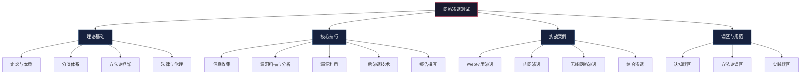
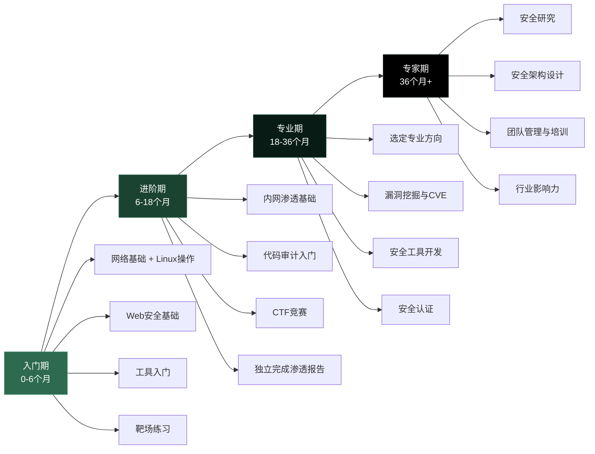

# 06 本章小结

本章从理论到实践、从工具到思维，系统性地构建了网络渗透测试的完整知识体系。作为全章的收束，本节不仅回顾核心知识点，更帮助读者建立全局视角——理解各知识点之间的关联、评估自身能力水平、规划下一阶段的成长路径。

## 6.1 知识体系全景回顾

渗透测试的知识体系可以用一棵"技能树"来理解：根部是理论基础，主干是方法论流程，枝叶是具体技术和工具，果实是最终的报告输出。

### 6.1.1 理论基础要点

**渗透测试的本质**：渗透测试是一种授权的安全评估活动，通过模拟真实攻击者的手段，对目标系统进行安全性检验。它与漏洞扫描的核心区别在于：渗透测试强调"验证性攻击"——不仅要发现漏洞，更要验证漏洞的可利用性和实际影响范围。漏洞扫描工具报告一个SQL注入点，渗透测试人员则会实际利用这个注入点，证明它能读取哪些数据、是否能获取操作系统权限、影响范围有多大。

**渗透测试的分类体系**：

| 维度 | 类型 | 特点 | 适用场景 |
|------|------|------|----------|
| 知识背景 | 黑盒测试 | 测试者无任何内部信息，完全模拟外部攻击者 | 外部威胁评估、客户视角验证 |
| 知识背景 | 白盒测试 | 测试者拥有完整源码、架构文档、内部拓扑 | 代码审计、深度安全评估 |
| 知识背景 | 灰盒测试 | 测试者拥有有限的内部信息（如普通员工凭据） | 内部威胁评估、合规测试 |
| 目标范围 | 网络渗透 | 针对网络基础设施（路由器、防火墙、服务） | 基础设施安全评估 |
| 目标范围 | Web应用渗透 | 针对Web应用的业务逻辑和代码层面 | 应用安全评估 |
| 目标范围 | 无线网络渗透 | 针对Wi-Fi网络和无线协议 | 物理安全评估 |
| 目标范围 | 社会工程 | 针对人员的安全意识和行为 | 安全意识培训验证 |

**主流方法论**：

- **PTES（渗透测试执行标准）**：定义了渗透测试的七个阶段——前期交互、情报收集、威胁建模、漏洞分析、渗透攻击、后渗透攻击、报告撰写。这是业界最广泛采用的流程框架。
- **OWASP测试指南**：专注于Web应用安全测试，提供了详细的测试用例清单和技术方法。适用于Web应用的系统化安全评估。
- **OSSTMM（开源安全测试方法手册）**：提供了全面的安全测试框架，强调可量化和可重复的测试方法。
- **NIST SP 800-115**：美国国家标准与技术研究院发布的安全测试技术指南，为政府和企业的安全测试提供标准化指导。

**法律与伦理**：渗透测试必须在明确的书面授权下进行，严格遵守《网络安全法》《数据安全法》《个人信息保护法》等法律法规。测试人员应当遵循四项核心原则：最小影响原则（不对目标系统造成不必要的损害）、数据保护原则（不泄露测试过程中接触的敏感数据）、及时报告原则（发现高危漏洞立即报告）、合法边界原则（严格在授权范围内操作）。

### 6.1.2 核心技巧要点

**信息收集**：信息收集是渗透测试的基础，其质量直接决定后续工作的方向和效率。建议将30%-40%的测试时间用于信息收集阶段。

- **被动收集**：不与目标系统直接交互，包括域名查询（Whois、备案信息）、DNS信息（子域名枚举、DNS记录分析）、搜索引擎（Google Hacking、Shodan、Fofa）、社交媒体（员工信息、组织架构）、公网数据库（泄露凭据库、历史漏洞库）。
- **主动收集**：与目标系统直接交互，包括端口扫描（Nmap、Masscan）、服务枚举（版本识别、服务指纹）、Web信息收集（目录枚举、参数发现、WAF识别）。
- **工具链**：Subfinder + Amass（子域名发现）→ Nmap（端口扫描）→ WhatWeb/Wappalyzer（技术栈识别）→ Burp Suite（Web信息收集）。

**漏洞扫描与分析**：自动化扫描工具（Nessus、OpenVAS、Nuclei）是漏洞发现的起点，但绝不是终点。自动化扫描结果存在三类问题：误报（报告的漏洞实际上不存在）、漏报（实际存在的漏洞未被发现）、影响误判（漏洞的严重程度被高估或低估）。因此，所有自动化扫描结果都必须经过人工验证——用实际的PoC验证漏洞是否真实存在，评估漏洞在当前环境中的实际影响。

**漏洞利用**：

- **Web应用漏洞**：SQL注入（获取数据库数据、执行系统命令）、XSS（窃取Cookie、钓鱼攻击）、SSRF（访问内网资源、读取云元数据）、反序列化（远程代码执行）、文件上传（上传WebShell获取服务器权限）。
- **网络服务漏洞**：利用已知CVE漏洞（如EternalBlue、Log4Shell）获取系统权限。Metasploit Framework是最常用的漏洞利用框架，集成了数千个漏洞利用模块。
- **利用原则**：谨慎操作，先在本地环境验证，再对目标系统执行；避免使用可能导致系统崩溃的利用代码；记录每一步操作和输出。

**后渗透技术**：

- **权限提升**：Linux提权（SUID滥用、内核漏洞、Cron任务、Capabilities）、Windows提权（令牌模拟、服务配置错误、UAC绕过、AlwaysInstallElevated）。
- **横向移动**：Pass the Hash（利用NTLM哈希直接认证）、Kerberoasting（请求服务票据离线破解）、Pass the Ticket（利用Kerberos票据认证）、PsExec/WMI远程执行。
- **持久化**：WebShell、计划任务（Cron/Scheduled Tasks）、启动项、注册表后门、DLL劫持。
- **数据获取与隐蔽传输**：数据加密压缩后通过DNS隧道、ICMP隧道或HTTPS通道外传。

**报告撰写**：渗透测试报告是最重要的交付物，它决定了测试成果能否转化为实际的安全改进。一份高质量的报告应包含：执行摘要（面向管理层，非技术语言说明风险）、测试范围与方法（明确测试边界和采用的技术手段）、漏洞详情（每个漏洞的描述、复现步骤、影响范围、风险等级）、风险评估（CVSS评分、业务影响分析）、修复建议（具体可操作的修复方案和优先级排序）。

### 6.1.3 实战案例要点

本章通过四个递进式的实战案例，展示了渗透测试在不同场景中的完整操作流程：

**Web应用渗透案例**：从信息收集阶段发现了Spring Boot Actuator未授权访问端点，通过env端点泄露的数据库凭据获取了数据库访问权限，进一步利用SQL注入和弱口令进入后台管理系统，最终通过文件上传漏洞获取了服务器的完全控制权。这个案例的关键教训是：**信息收集的质量决定了渗透测试的成败**——Actuator端点的发现是整个攻击链的起点。

**内网渗透案例**：模拟钓鱼攻击获取初始立足点后，通过Mimikatz提取内存中的凭据，使用Pass the Hash横向移动到域控服务器，利用Kerberoasting破解服务账户密码，最终通过AD CS（Active Directory Certificate Services）攻击获取了整个域的完全控制权。关键教训：**内网渗透的核心是凭据的收集和复用**——一个泄露的管理员凭据可能导致整个域的沦陷。

**无线网络渗透案例**：展示了WPA2-PSK密码破解（抓取四次握手包后离线字典/暴力破解）、WPA2-Enterprise的Evil Twin攻击（搭建伪造认证服务器捕获用户凭据），以及网络隔离验证（测试VLAN隔离是否有效）。关键教训：**无线网络的安全边界比有线网络更模糊**——物理邻近的攻击者可以轻松接入无线网络。

**综合渗透案例**：从外部零信息开始，通过Shodan和Google发现Jenkins未授权访问实例，在Jenkins中找到硬编码的Git凭据，利用凭据进入代码仓库发现AWS访问密钥，最终通过云环境的IAM配置错误获取了整个AWS账户的控制权。关键教训：**现代渗透测试必须覆盖云环境**——传统的网络边界已经模糊，攻击者可能从一个暴露的CI/CD服务直接跳入云环境。

### 6.1.4 常见误区要点

本章总结的误区分为三个层面，每个误区都配有纠正方法：

| 误区层面 | 常见误区 | 正确做法 |
|----------|----------|----------|
| 认知误区 | 渗透测试等于漏洞扫描 | 渗透测试强调验证性攻击，漏洞扫描只是其中一个环节 |
| 认知误区 | 渗透测试能发现所有漏洞 | 任何测试都有局限性，渗透测试是采样评估而非穷举 |
| 认知误区 | 自动化工具能替代人工测试 | 工具擅长已知漏洞，逻辑缺陷和组合风险需要人工分析 |
| 方法论误区 | 忽视信息收集阶段 | 信息收集决定渗透方向，投入30%-40%时间是合理的 |
| 方法论误区 | 过度依赖单一工具 | 综合使用多工具交叉验证，避免单一工具的盲区 |
| 方法论误区 | 忽视报告撰写 | 报告是最重要的交付物，决定了测试成果能否落地 |
| 实践误区 | 在生产环境随意测试 | 先在测试环境验证利用代码，再在生产环境谨慎执行 |
| 实践误区 | 测试后不清理痕迹 | 留下的后门和测试账户可能被真正的攻击者利用 |
| 实践误区 | 不保存测试证据 | 缺少证据会导致报告缺乏说服力，也无法应对争议 |

## 6.2 关键技能自评清单

通过本章的学习，读者应当具备以下关键技能。使用这张自评清单，客观评估自己的掌握程度：

### 6.2.1 技术能力维度

**信息收集能力（⭐⭐⭐）**：能够使用多种工具和方法，对目标系统进行全面的信息收集，建立完整的攻击面视图。具体检验标准：能够在2小时内完成一个中等规模域名的子域名枚举、端口扫描、技术栈识别和关联分析，输出一份结构化的攻击面报告。

**漏洞发现能力（⭐⭐⭐⭐）**：能够结合自动化工具和人工分析，发现目标系统中存在的安全漏洞，包括已知漏洞（通过扫描工具和漏洞数据库）、配置错误（通过服务指纹和默认配置检查）和逻辑缺陷（通过业务流程分析和手动测试）。具体检验标准：能够在OWASP Top 10覆盖的漏洞类型中，独立发现至少7类漏洞。

**漏洞利用能力（⭐⭐⭐⭐）**：能够验证漏洞的可利用性，使用适当的工具和技术利用漏洞获取系统访问权限。具体检验标准：能够独立完成SQL注入（从数据读取到RCE）、文件上传（从WebShell到系统权限）、已知CVE漏洞利用的完整流程。

**后渗透能力（⭐⭐⭐⭐⭐）**：能够在获取初始访问权限后，进行权限提升、横向移动、持久化和数据获取等后渗透操作。具体检验标准：能够在Linux和Windows环境中各完成至少3种提权方法，在模拟内网中完成从普通用户到域管理员的横向移动。

**报告撰写能力（⭐⭐⭐）**：能够撰写结构清晰、内容详实、可操作性强的渗透测试报告。具体检验标准：报告能够让非技术管理层理解风险，同时让开发团队能够按照修复建议实施改进。

### 6.2.2 工具能力维度

| 工具类别 | 必须掌握 | 推荐掌握 | 了解即可 |
|----------|----------|----------|----------|
| 网络扫描 | Nmap | Masscan、Zmap | Unicornscan |
| 漏洞扫描 | Nuclei | Nessus、OpenVAS | Nikto、Gobuster |
| Web测试 | Burp Suite | sqlmap、XSStrike | Commix、tplmap |
| 漏洞利用 | Metasploit | Cobalt Strike | Empire、Sliver |
| 后渗透 | Mimikatz | BloodHound | Rubeus、Certipy |
| 密码破解 | Hashcat | John the Ripper | Hydra、Medusa |
| 抓包分析 | Wireshark | tcpdump | tshark |
| 编程语言 | Python | Bash、PowerShell | Go、Rust |

### 6.2.3 思维能力维度

**系统化思维**：能够从全局视角审视目标系统的安全状况，而不是孤立地看待单个漏洞。能够识别漏洞之间的关联，理解多个低危漏洞的组合可能产生高危影响。

**攻击者思维**：能够站在攻击者的角度思考问题——"如果我要突破这个系统，我会怎么做？"这种思维模式能够帮助发现防御者容易忽视的安全盲区。

**创造性思维**：能够灵活运用已有技术，创造性地解决渗透测试中遇到的障碍。当标准工具和技术失效时，能够找到替代方案或自行开发新的利用方法。

**风险评估思维**：能够准确评估漏洞的实际影响和利用难度，合理确定修复优先级。不是所有漏洞都值得立即修复——渗透测试人员需要帮助组织将有限的资源投入到最有效的安全改进中。

## 6.3 能力成长路线图

渗透测试的学习不是一条直线，而是一个螺旋上升的过程。以下路线图提供了分阶段的学习指引：

### 6.3.1 入门期（0-6个月）：建立基础

**学习目标**：掌握网络安全的基础知识和渗透测试的基本工具，能够在简单靶场中完成基础的渗透测试任务。

**核心学习内容**：

1. **网络基础深化**：深入理解TCP/IP协议栈（三次握手、四次挥手、协议分层）、常见网络服务的工作原理（HTTP/HTTPS、DNS、FTP、SSH、SMB）、子网划分和路由基础。
2. **Linux操作能力**：熟练使用命令行、文件系统操作、用户和权限管理、进程管理、网络配置、Shell脚本编写。
3. **Web安全基础**：理解OWASP Top 10中的每一种漏洞类型，能够在DVWA、WebGoat等靶场中独立发现和利用这些漏洞。
4. **核心工具入门**：掌握Nmap（端口扫描和服务识别）、Burp Suite（Web请求拦截和修改）、sqlmap（SQL注入自动化利用）、Metasploit（漏洞利用框架基础操作）。

**靶场练习**：

| 靶场 | 难度 | 特点 | 建议顺序 |
|------|------|------|----------|
| DVWA | ⭐ | 经典Web安全入门靶场 | 第1个 |
| WebGoat | ⭐⭐ | OWASP官方教学靶场 | 第2个 |
| Metasploitable 2 | ⭐⭐ | 包含大量已知漏洞的Linux系统 | 第3个 |
| VulnHub-DC系列 | ⭐⭐ | 递进式内网渗透练习 | 第4个 |

**里程碑检验**：能够在4小时内独立完成DVWA所有难度级别的全部漏洞利用，能够用Nmap完成一个中等复杂度网络的端口扫描和服务识别。

### 6.3.2 进阶期（6-18个月）：提升深度和广度

**学习目标**：掌握内网渗透和代码审计的基础技能，能够在中等难度的靶场中独立完成渗透测试，能够参加CTF竞赛并取得基本成绩。

**核心学习内容**：

1. **内网渗透基础**：Active Directory架构理解、域内信息收集（BloodHound）、凭据提取（Mimikatz）、横向移动技术（Pass the Hash、PsExec）、Kerberos协议攻击（Kerberoasting、AS-REP Roasting）。
2. **代码审计入门**：PHP/Java/Python代码审计基础、常见安全编码缺陷识别、自动化代码审计工具使用（Semgrep、CodeQL）。
3. **漏洞利用进阶**：缓冲区溢出基础（栈溢出原理和利用）、Web应用逻辑漏洞挖掘、API安全测试、反序列化漏洞利用。
4. **自动化能力**：使用Python编写自定义渗透测试工具、理解并修改现有漏洞利用代码、自动化信息收集和报告生成。

**里程碑检验**：能够在Hack The Box上独立攻破至少10台Easy难度和3台Medium难度的机器，能够在CTF比赛中独立解决Web和Crypto类题目。

### 6.3.3 专业期（18-36个月）：培养专长

**学习目标**：选定专业方向并深入研究，能够发现和报告真实软件中的安全漏洞，能够独立完成企业级的渗透测试项目。

**专业方向选择**：

| 方向 | 核心技能 | 典型工作 | 发展前景 |
|------|----------|----------|----------|
| Web安全 | 代码审计、逻辑漏洞、API安全 | Web应用渗透测试、安全开发咨询 | 需求量大，入门相对容易 |
| 内网/域渗透 | AD安全、横向移动、域控攻防 | 企业内网渗透测试、红队评估 | 技术深度要求高，薪资优秀 |
| 二进制安全 | 逆向工程、漏洞挖掘、Exploit开发 | 软件安全研究、漏洞赏金猎人 | 技术门槛最高，回报也最大 |
| 云安全 | AWS/Azure/GCP安全、容器安全 | 云环境渗透测试、安全架构评估 | 需求快速增长，人才紧缺 |
| 移动安全 | Android/iOS逆向、应用安全 | 移动应用安全测试 | 稳定需求，结合业务安全 |

**里程碑检验**：能够独立完成一个包含AD域环境的企业级渗透测试项目，能够向厂商报告一个真实软件中的安全漏洞并获得确认。

### 6.3.4 专家期（36个月以上）：引领方向

**学习目标**：在专业领域达到行业领先水平，能够进行安全研究和工具开发，能够指导团队和培养新人。

**发展方向**：

1. **安全研究**：深入研究特定领域的安全问题（如IoT安全、工控安全、AI安全），发现新的攻击向量和防御方法，发表安全研究报告和漏洞分析文章。
2. **安全架构设计**：从攻击者视角转变为防御者视角，设计安全架构和防御体系，帮助企业建立纵深防御能力。
3. **团队管理与培训**：带领渗透测试团队，建立测试标准和质量体系，培养新一代安全人才。
4. **行业影响力**：在安全会议上发表演讲，参与安全标准的制定，为社区贡献开源安全工具。

## 6.4 继续学习资源

### 6.4.1 认证路径

渗透测试领域的认证可以帮助系统化地梳理知识体系，同时也是职业发展的重要加分项：

| 认证 | 机构 | 难度 | 特点 | 建议阶段 |
|------|------|------|------|----------|
| CEH | EC-Council | ⭐⭐ | 理论为主，广度覆盖 | 入门期 |
| eJPT | INE | ⭐⭐ | 实操为主，入门推荐 | 入门期 |
| OSCP | OffSec | ⭐⭐⭐⭐ | 24小时实操考试，业界标杆 | 进阶期 |
| OSWE | OffSec | ⭐⭐⭐⭐⭐ | Web应用安全专家 | 专业期 |
| OSEP | OffSec | ⭐⭐⭐⭐⭐ | 高级渗透测试与防御绕过 | 专业期 |
| CRTP | Pentester Academy | ⭐⭐⭐ | AD安全与红队技术 | 进阶期 |
| CRTE | Pentester Academy | ⭐⭐⭐⭐ | 高级AD安全 | 专业期 |

### 6.4.2 持续学习渠道

**技术社区与资讯**：

- **安全客（anquanke.com）**：国内安全资讯和技术文章聚合平台
- **先知社区（xianzhicommunity）**：高质量的安全技术分享和漏洞分析
- **HackTricks（book.hacktricks.xyz）**：渗透测试技术百科，持续更新
- **PortSwigger Web Security Academy**：Web安全学习的最佳免费资源
- **OWASP项目文档**：Web安全标准和测试指南

**漏洞情报**：

- **CVE/NVD（cve.mitre.org）**：标准漏洞数据库，掌握最新漏洞动态
- **Exploit-DB（exploit-db.com）**：公开漏洞利用代码库
- **GitHub Security Advisories**：开源项目安全公告
- **CNVD（cnvd.org.cn）**：中国国家信息安全漏洞共享平台

**实战练习平台**：

- **Hack The Box（hackthebox.com）**：最活跃的渗透测试靶场社区
- **TryHackMe（tryhackme.com）**：引导式学习路径，适合初学者
- **PentesterLab（pentesterlab.com）**：专注于Web安全的练习平台
- **VulnHub（vulnhub.com）**：离线靶机下载，本地虚拟化练习

### 6.4.3 推荐书目

| 阶段 | 书籍 | 作者 | 侧重点 |
|------|------|------|--------|
| 入门 | 《Metasploit渗透测试魔鬼训练营》 | 诸葛建伟等 | 渗透测试全流程实操 |
| 入门 | 《Web安全攻防：渗透测试实战指南》 | 徐焱等 | Web安全入门与实战 |
| 进阶 | 《内网安全攻防：渗透测试实战指南》 | 徐焱等 | 内网渗透技术 |
| 进阶 | 《黑客攻防技术宝典：Web实战篇》 | Dafydd Stuttard | Web安全深度分析 |
| 专业 | 《渗透测试实战第三版》（Georgia Weidman） | Georgia Weidman | OSCP考试参考 |
| 专业 | 《The Hacker Playbook 3》 | Peter Kim | 红队实战技术 |

## 6.5 本章核心总结

网络渗透测试是网络安全领域最具挑战性和实用性的技术之一。它不仅要求测试人员具备扎实的技术功底，还需要良好的逻辑思维能力、创造性的问题解决能力以及高度的职业道德意识。

回顾本章的核心要点：

**理论层面**：渗透测试是授权的安全评估活动，遵循PTES等方法论框架，在严格的法律和伦理约束下执行。理解渗透测试的本质——验证性攻击而非漏洞扫描——是建立正确渗透测试思维的第一步。

**技术层面**：渗透测试遵循信息收集→漏洞发现→漏洞利用→后渗透→报告撰写的完整流程。每个阶段都有其核心工具和技术，但更重要的是理解各阶段之间的逻辑关系——前一阶段的输出是后一阶段的输入，信息收集的质量直接决定渗透测试的成败。

**实践层面**：渗透测试是一项实践性极强的技能，仅靠理论学习远远不够。靶场练习、CTF竞赛和漏洞赏金计划是提升实战能力的三条主要路径。从简单的DVWA靶场开始，逐步挑战更复杂的综合性靶场，在实践中不断积累经验和建立直觉。

**成长层面**：渗透测试的学习是一个持续演进的过程。从入门期的基础知识积累，到进阶期的技术深度提升，再到专业期的领域专长培养，最终到专家期的行业引领——每个阶段都有明确的学习目标和检验标准。

最后，再次强调：**渗透测试技术应当用于合法的安全研究和防护工作，任何未经授权的安全测试行为都是违法的。** 希望每一位安全从业者都能坚守职业道德底线，用所学技能守护网络空间的安全。技术是中性的，决定其价值的是使用者的意图——选择用技术保护他人，才是安全从业者的最高追求。
