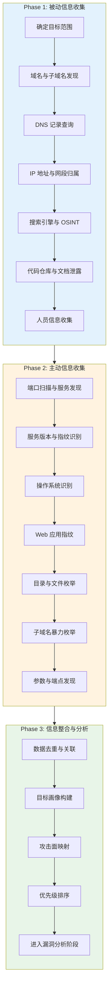
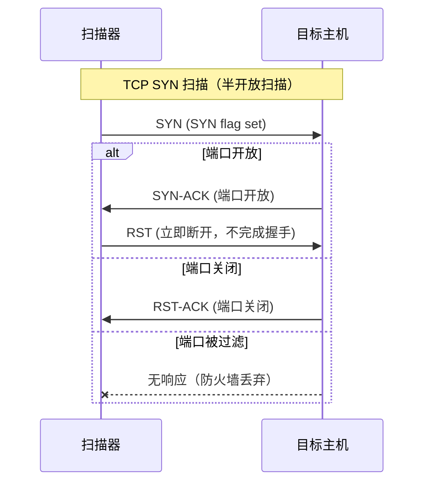

## 2.1 信息收集技术

信息收集（Reconnaissance）是渗透测试生命周期中最关键的阶段。业界公认的经验法则是：渗透测试 80% 的时间应花在信息收集上，真正的漏洞利用往往只占 20%。信息收集的质量直接决定后续攻击面的广度和深度——收集得越全面，发现可利用漏洞的概率就越高。

信息收集的核心目标是构建一张完整的**目标画像**：目标组织有哪些域名和子域名、运行哪些服务、使用什么技术栈、有哪些人员和联系方式、暴露了哪些敏感信息。这张画像越精确，后续的攻击路径就越清晰。

### 信息收集的理论框架

#### 道：为什么信息收集如此重要

从攻击者的视角看，任何系统都不可能做到完美防御。信息收集的本质是在庞大的攻击面中寻找**薄弱环节**。一个企业可能有数百个子域名、数十个 Web 应用、上千个开放端口，但只要找到一个未修补的漏洞、一个暴露的管理后台、一个泄露的凭据，就可以突破整个防线。

从防御者的视角看，了解攻击者如何进行信息收集，才能有针对性地部署防护措施、监控异常扫描行为、减少信息泄露面。

#### 法：信息收集的方法论体系

信息收集按照**与目标的交互程度**分为两大类：

| 维度 | 被动信息收集（Passive Recon） | 主动信息收集（Active Recon） |
|------|-------------------------------|------------------------------|
| 交互方式 | 不直接与目标系统交互 | 直接与目标系统通信 |
| 隐蔽性 | 极高，目标无法感知 | 较低，可能触发告警 |
| 信息精度 | 中等，依赖公开数据源 | 高，可获取实时精确信息 |
| 法律风险 | 低，仅查询公开信息 | 较高，可能构成未授权访问 |
| 典型手段 | WHOIS、搜索引擎、OSINT | 端口扫描、服务枚举、漏洞扫描 |
| 适用阶段 | 项目初期，建立基础画像 | 被动收集完成后，深入探测 |

按照**信息类型**分类：

- **基础设施信息**：IP 地址段、域名、DNS 记录、网络拓扑
- **服务信息**：开放端口、运行服务、服务版本、操作系统
- **应用信息**：Web 技术栈、目录结构、API 端点、参数
- **人员信息**：员工姓名、邮箱、职位、社交账号
- **敏感信息**：泄露的凭据、源代码、配置文件、内部文档

#### 术：信息收集的标准流程



#### 器：核心工具矩阵

| 类别 | 工具 | 用途 | 特点 |
|------|------|------|------|
| 综合扫描 | Nmap | 端口扫描、服务识别、OS 检测 | 行业标准，脚本引擎强大 |
| 子域名枚举 | Subfinder | 被动子域名发现 | 聚合多个数据源，速度快 |
| 子域名枚举 | Amass | 主动+被动子域名发现 | OWASP 项目，功能全面 |
| 目录枚举 | Gobuster | 目录/文件暴力枚举 | Go 编写，支持多模式 |
| 目录枚举 | Ffuf | Web Fuzzer | 极速，支持模糊匹配 |
| Web 指纹 | WhatWeb | 网站技术识别 | 指纹库庞大 |
| 网络空间 | Shodan | 互联网设备搜索 | 可搜索 Banner、证书、漏洞 |
| 网络空间 | Censys | 互联网主机和证书搜索 | 数据更新频繁 |
| OSINT | theHarvester | 邮箱、子域名、IP 收集 | 集成多个数据源 |
| 元数据 | FOCA | 文档元数据分析 | 可从文档中提取用户、路径等 |
| 漏洞扫描 | Nuclei | 基于模板的漏洞扫描 | 模板库庞大，社区活跃 |

---

### 2.1.1 被动信息收集详解

被动信息收集是渗透测试的第一步，其核心优势在于**完全不与目标系统产生直接交互**，因此不会在目标的日志中留下任何痕迹。这对于红队行动和需要隐蔽性的场景尤为重要。

#### 一、域名与子域名发现

**1. WHOIS 查询**

WHOIS 查询是最基础的域名信息收集手段，可以获取域名的注册人、注册商、注册时间、过期时间、DNS 服务器等信息。

```bash
# 基本 WHOIS 查询
whois example.com

# 查询 IP 地址的归属信息
whois 192.168.1.1

# 使用 Python whois 库批量查询
python3 -c "
import whois
w = whois.whois('example.com')
print(f'注册商: {w.registrar}')
print(f'注册时间: {w.creation_date}')
print(f'DNS服务器: {w.name_servers}')
"
```

**实战技巧**：许多企业使用隐私保护服务隐藏 WHOIS 信息，但可以通过历史 WHOIS 记录（如 SecurityTrails、WhoisXML API）获取变更前的真实注册人信息。同一注册人通常注册多个相关域名，通过注册人信息反查可以发现更多目标资产。

**2. 证书透明度日志（Certificate Transparency）**

证书透明度（CT）日志是发现子域名最高效的被动手段之一。每当 CA 签发 SSL/TLS 证书时，都会将证书信息提交到公开的 CT 日志中。通过查询 CT 日志，可以发现目标组织申请过证书的所有子域名，包括那些 DNS 记录已删除但证书仍存在的域名。

```bash
# 使用 crt.sh 查询（基于 PostgreSQL 的 CT 日志搜索引擎）
curl -s "https://crt.sh/?q=%25.example.com&output=json" | jq -r '.[].name_value' | sort -u

# 使用 certsh 工具
python3 -c "
import requests, json
url = 'https://crt.sh/?q=%25.example.com&output=json'
resp = requests.get(url)
data = json.loads(resp.text)
domains = set()
for entry in data:
    for name in entry['name_value'].split('\n'):
        domains.add(name.strip())
for d in sorted(domains):
    print(d)
"

# 使用 Subfinder（聚合 CT 日志在内的 40+ 数据源）
subfinder -d example.com -silent -o subdomains.txt

# 使用 Amass 进行深度枚举
amass enum -passive -d example.com -o amass_results.txt
```

**3. DNS 记录查询**

DNS 记录包含丰富的信息，不仅有 A/AAAA 记录（IP 地址），还有 MX（邮件服务器）、NS（域名服务器）、TXT（SPF/DKIM/DMARC 等安全策略）、SRV（服务发现）、CNAME（别名）等记录。

```bash
# 查询所有常见记录类型
for type in A AAAA MX NS TXT CNAME SOA SRV; do
    echo "=== $type ==="
    dig +short example.com $type
done

# 使用 dnsx 进行批量解析
cat subdomains.txt | dnsx -silent -a -cname -mx -ns

# 反向 DNS 查询（从 IP 反查域名）
dig -x 93.184.216.34 +short

# DNS 区域传输尝试（如果配置不当，可获取完整区域文件）
dig @ns1.example.com example.com AXFR
```

**4. 被动 DNS 数据库**

被动 DNS 数据库记录了历史 DNS 解析数据，可以发现目标域名曾经解析过的 IP 地址、CNAME 变更历史等。这些数据对于发现已下线但可能仍然可访问的服务非常有价值。

```bash
# SecurityTrails API 查询历史 DNS
curl -s "https://api.securitytrails.com/v1/history/example.com/subdomains" \
    -H "APIKEY: your_api_key"

# VirusTotal 被动 DNS 查询
curl -s "https://www.virustotal.com/api/v3/domains/example.com/subdomains" \
    -x-h "x-apikey: your_api_key"

# DNSDumpster（免费在线工具，可导出图表）
# 访问 https://dnsdumpster.com/
```

#### 二、搜索引擎与 Google Hacking

Google Hacking 是利用搜索引擎高级运算符发现目标敏感信息的技术。这一技术由 Johnny Long 在 2004 年系统化提出，并收录在 Google Hacking Database（GHDB）中。

**核心搜索运算符：**

| 运算符 | 用途 | 示例 |
|--------|------|------|
| `site:` | 限定搜索域名 | `site:example.com` |
| `filetype:` | 限定文件类型 | `site:example.com filetype:pdf` |
| `intitle:` | 页面标题包含 | `intitle:"index of" "parent directory"` |
| `inurl:` | URL 包含 | `inurl:admin site:example.com` |
| `intext:` | 正文包含 | `intext:"password" site:example.com` |
| `cache:` | 查看缓存版本 | `cache:example.com/login` |
| `link:` | 链接到指定页面 | `link:example.com` |
| `related:` | 相关网站 | `related:example.com` |
| `-` | 排除关键词 | `site:example.com -www` |
| `*` | 通配符 | `"default password" * router` |

**实战 Google Hacking 查询集：**

```bash
# 发现暴露的目录列表
site:example.com intitle:"index of" "parent directory"

# 发现暴露的配置文件
site:example.com ext:xml | ext:conf | ext:cnf | ext:reg | ext:inf | ext:rdp | ext:cfg | ext:txt | ext:ora | ext:ini

# 发现暴露的数据库文件
site:example.com ext:sql | ext:dbf | ext:mdb

# 发现暴露的日志文件
site:example.com ext:log

# 发现登录页面
site:example.com inurl:login | inurl:admin | inurl:portal | inurl:signin

# 发现暴露的错误信息（可能泄露技术栈和路径）
site:example.com intext:"error" | intext:"warning" | intext:"fatal" | intext:"exception"

# 发现暴露的 phpinfo 页面
site:example.com inurl:phpinfo.php | inurl:test.php | inurl:info.php

# 发现 GitHub 上泄露的敏感信息
site:github.com "example.com" password | secret | api_key | token

# 发现暴露的 API 文档
site:example.com inurl:swagger | inurl:api-docs | inurl:openapi
```

**Google Hacking Database（GHDB）**：Exploit-DB 维护的 GHDB 收录了数千条经过验证的 Google Hacking 查询，按类别分为： footholds、sensitive directories、web server detection、vulnerable files、vulnerable servers、error messages、software containing login pages、sensitive online shopping info 等。访问 https://www.exploit-db.com/google-hacking-database 获取最新查询集。

**其他搜索引擎的类似功能：**
- **Bing**：支持 `site:`、`filetype:`、`ip:`（同 IP 站点查询）、`inurl:` 等
- **Yandex**：在某些地区的索引覆盖更广，支持 `url:`、`mime:` 等
- **Baidu**：对中文站点索引更全，支持 `site:`、`filetype:`、`inurl:` 等

#### 三、网络空间搜索引擎

网络空间搜索引擎（Internet-wide Scanning Engines）通过持续扫描全网 IP 地址空间，收集开放端口、服务 Banner、SSL 证书、HTTP 响应头等信息。

**Shodan**

Shodan 是最知名的网络空间搜索引擎，可以搜索互联网上暴露的各种设备和服务。

```bash
# 安装 Shodan CLI
pip install shodan
shodan init YOUR_API_KEY

# 搜索特定组织的设备
shodan search "org:Example Inc" --fields ip_str,port,product,version

# 搜索特定端口和服务
shodan search "apache port:80 country:CN"

# 搜索特定漏洞
shodan search "vuln:CVE-2021-44228"

# 查询单个 IP 的完整信息
shodan host 93.184.216.34

# 下载数据集进行离线分析
shodan download results "org:Example Inc"
shodan parse results.json.gz
```

**Shodan 常用过滤器：**

| 过滤器 | 说明 | 示例 |
|--------|------|------|
| `org` | 组织名称 | `org:"Google LLC"` |
| `net` | CIDR 网段 | `net:192.168.0.0/16` |
| `port` | 端口号 | `port:22` |
| `product` | 软件产品 | `product:Apache` |
| `version` | 软件版本 | `product:Apache version:2.4.49` |
| `os` | 操作系统 | `os:Windows` |
| `country` | 国家代码 | `country:CN` |
| `city` | 城市 | `city:Beijing` |
| `hostname` | 主机名 | `hostname:.example.com` |
| `ssl` | SSL 证书信息 | `ssl.cert.subject.cn:example.com` |
| `vuln` | CVE 编号 | `vuln:CVE-2021-44228` |
| `http.title` | 页面标题 | `http.title:"Dashboard"` |
| `http.status` | HTTP 状态码 | `http.status:200` |

**Censys**

Censys 提供互联网主机和证书的搜索功能，数据更新频率高，且免费套餐额度比 Shodan 更慷慨。

```bash
# 安装 Censys CLI
pip install censys

# 配置 API 凭据
censys config

# 搜索主机
censys search "services.http.response.html_title: 'Dashboard' AND location.country: China"

# 查询单个主机
censys view 93.184.216.34

# 搜索证书
censys search-certificates "parsed.subject.common_name: example.com"
```

**ZoomEye（钟馗之眼）**

ZoomEye 是知道创宇推出的网络空间搜索引擎，对国内资产的覆盖更为全面。

```bash
# 使用 ZoomEye 命令行工具
pip install zoomeye
zoomeye init -apikey YOUR_API_KEY

# 搜索
zoomeye search "app:Apache country:China"
zoomeye search "hostname:.example.com"
```

#### 四、社交媒体与 OSINT

**1. 人员信息收集**

人员信息收集是渗透测试中常被忽视但极具价值的环节。通过收集目标组织的员工信息，可以为社会工程攻击、密码字典生成、邮箱地址推测等提供素材。

```bash
# theHarvester：从多个数据源收集邮箱、子域名、IP
theHarvester -d example.com -b all -f report.html

# LinkedIn 员工信息收集（需配合工具如 LinkedIn2Username）
# 从 LinkedIn 公司页面获取员工列表，生成用户名字典
python3 linkedin2username.py -c "Example Inc" -d example.com

# Hunter.io：邮箱地址发现与验证
curl -s "https://api.hunter.io/v2/domain-search?domain=example.com&api_key=YOUR_KEY"

# 生成可能的邮箱格式
# 常见格式：first.last@domain, firstlast@domain, f.last@domain, first@domain
```

**2. 代码仓库搜索**

GitHub、GitLab 等代码托管平台上可能存在目标组织的敏感信息泄露。

```bash
# GitHub 搜索敏感信息
# 在 GitHub 搜索框中使用：
# "example.com" password
# "example.com" api_key
# "example.com" secret
# org:example-org filename:.env
# org:example-org filename:config.yml

# 使用 GitLeaks 扫描本地仓库
gitleaks detect --source /path/to/repo --report-format json

# 使用 TruffleHog 扫描 GitHub 仓库
trufflehog github --org example-org

# 使用 GitDorker 进行自动化搜索
python3 GitDorker.py -t YOUR_GITHUB_TOKEN -q "example.com" -d dorks/medium_dorks.txt
```

**GitHub 常见敏感信息泄露模式：**
- `.env` 文件中的 API 密钥和数据库凭据
- `config.yml`/`application.properties` 中的配置信息
- 硬编码的密码、Token、私钥
- 内部系统 URL 和 IP 地址
- 数据库连接字符串
- AWS/Azure/GCP 凭据

**3. 文档元数据分析**

公开的 PDF、Word、Excel 等文档中可能包含有价值的元数据，如作者姓名、组织名称、软件版本、文件路径等。

```bash
# ExifTool：提取文档元数据
exiftool document.pdf
# 关注字段：Author, Creator, Producer, Company, LastModifiedBy

# FOCA：自动化元数据分析（Windows GUI 工具）
# 可从搜索引擎批量下载文档并提取元数据

# metagoofil：自动化文档下载与元数据提取
metagoofil -d example.com -t pdf,docx,xlsx -l 20 -o output -f results.html

# 批量分析目录中的所有文档
find /path/to/docs -type f \( -name "*.pdf" -o -name "*.docx" -o -name "*.xlsx" \) \
    -exec exiftool {} \; | grep -E "Author|Creator|Company|Producer"
```

#### 五、公开数据泄露与凭据收集

数据泄露是现代渗透测试中最重要的被动信息来源之一。历史泄露数据库中可能包含目标组织员工的邮箱和密码，这些凭据可以直接用于凭据填充攻击（Credential Stuffing）。

```bash
# Have I Been Pwned API（检查邮箱是否出现在泄露事件中）
curl -s "https://haveibeenpwned.com/api/v3/breachedaccount/user@example.com" \
    -H "hibp-api-key: YOUR_KEY"

# DeHashed（泄露数据库搜索引擎）
# 可搜索邮箱、用户名、密码哈希、IP 地址等

# 使用 BreachDirectory API
curl -s "https://breachdirectory.p.rapidapi.com/" \
    -d '{"term":"example.com"}' \
    -H "x-rapidapi-key: YOUR_KEY"

# IntelX（Intelligence X）：搜索泄露数据、暗网内容
# 提供 CLI 工具和 API
```

---

### 2.1.2 主动信息收集详解

主动信息收集需要与目标系统直接交互，因此会在目标的日志、IDS/IPS 中留下痕迹。在进行主动收集前，必须确保已获得合法授权，并根据目标环境选择合适的扫描强度和隐蔽策略。

#### 一、端口扫描技术

端口扫描是主动信息收集的核心，目的是发现目标主机上开放的网络端口和运行的服务。

**1. TCP 扫描技术原理**

理解 TCP 三次握手是理解端口扫描技术的基础：



**Nmap 扫描类型详解：**

```bash
# ========== TCP 扫描技术 ==========

# TCP SYN 扫描（-sS）：默认且最常用
# 原理：发送 SYN 包，收到 SYN-ACK 后发送 RST 断开，不完成三次握手
# 优点：速度快，隐蔽性较好，不被多数日志记录
# 要求：需要 root/管理员权限（原始套接字）
nmap -sS -T4 --open target_ip

# TCP 全连接扫描（-sT）：完成完整的三次握手
# 原理：调用系统的 connect() 函数建立完整连接
# 优点：不需要 root 权限
# 缺点：速度慢，容易被日志记录
nmap -sT -T4 target_ip

# TCP ACK 扫描（-sA）：探测防火墙规则
# 原理：发送 ACK 包，根据 RST 响应判断端口是否被过滤
# 用途：判断防火墙是有状态还是无状态
nmap -sA -T4 target_ip

# TCP Window 扫描（-sW）：利用 TCP 窗口大小差异
# 原理：某些系统对开放和关闭端口的 ACK 响应窗口大小不同
nmap -sW -T4 target_ip

# TCP NULL/FIN/Xmas 扫描（-sN/-sF/-sX）：绕过简单过滤
# 原理：RFC 793 规定关闭端口应返回 RST，开放端口应忽略
# 优点：可绕过某些简单的状态检测防火墙
# 缺点：Windows 系统不遵循 RFC，此方法无效
nmap -sN -T4 target_ip  # NULL 扫描（无标志位）
nmap -sF -T4 target_ip  # FIN 扫描（仅 FIN 标志）
nmap -sX -T4 target_ip  # Xmas 扫描（FIN+PSH+URG）

# Idle 扫描（-sI）：终极隐蔽技术
# 原理：利用僵尸主机的 IP ID 值变化来推断目标端口状态
# 优点：扫描流量完全来自僵尸主机，扫描者 IP 不暴露
# 要求：需要找到一个合适的僵尸主机（IP ID 递增且可预测）
nmap -sI zombie_host:port target_ip

# ========== UDP 扫描技术 ==========

# UDP 扫描（-sU）：发现 UDP 服务
# 原理：发送 UDP 包，根据 ICMP 端口不可达响应判断状态
# 缺点：速度极慢（ICMP 限速），常需要配合版本检测
nmap -sU -T4 --top-ports 100 target_ip

# ========== 扫描优化选项 ==========

# 指定端口范围
nmap -sS -p 1-65535 target_ip        # 全端口扫描
nmap -sS -p- target_ip               # 同上（简写）
nmap -sS --top-ports 1000 target_ip  # 扫描最常见的 1000 个端口
nmap -sS -p 80,443,8080,8443 target_ip  # 指定端口列表

# 速度与隐蔽性平衡（Timing Templates）
nmap -sS -T0 target_ip  # Paranoid：极慢，IDS 规避
nmap -sS -T1 target_ip  # Sneaky：慢速
nmap -sS -T2 target_ip  # Polite：正常速度，减少带宽占用
nmap -sS -T3 target_ip  # Normal：默认速度
nmap -sS -T4 target_ip  # Aggressive：快速，适用于可靠网络
nmap -sS -T5 target_ip  # Insane：极快，可能牺牲准确性

# 服务版本与操作系统检测
nmap -sS -sV -O -T4 target_ip

# 使用 Nmap 脚本引擎（NSE）进行深度探测
nmap -sS -sV --script=default,vuln target_ip
nmap -sS --script=http-enum target_ip      # HTTP 目录枚举
nmap -sS --script=smb-vuln* target_ip      # SMB 漏洞检测
nmap -sS --script=ssl-heartbleed target_ip  # Heartbleed 检测
```

**2. Masscan：极速端口扫描**

Masscan 是目前最快的端口扫描工具，可以在 6 分钟内完成整个 IPv4 地址空间的单端口扫描。它使用自定义的 TCP/IP 栈，不依赖操作系统的网络栈。

```bash
# 安装 Masscan
apt install masscan  # Debian/Ubuntu
# 或从源码编译
git clone https://github.com/robertdavidgraham/masscan
cd masscan && make

# 扫描单个 IP 的所有端口
masscan 192.168.1.1 -p0-65535 --rate=10000

# 扫描整个网段的特定端口
masscan 10.0.0.0/8 -p80,443,8080 --rate=100000 -oJ results.json

# 输出格式选项
masscan 192.168.1.0/24 -p22,80,443 --rate=10000 -oX results.xml   # XML
masscan 192.168.1.0/24 -p22,80,443 --rate=10000 -oL results.list  # 列表
masscan 192.168.1.0/24 -p22,80,443 --rate=10000 -oG results.grep  # Grepable

# 排除特定 IP
masscan 10.0.0.0/8 -p80 --rate=50000 --exclude 10.0.0.1

# Banner 抓取
masscan 192.168.1.0/24 -p80 --rate=10000 --banners
```

**3. Rustscan：现代端口扫描器**

Rustscan 以极快的速度完成端口扫描，然后自动将发现的开放端口传递给 Nmap 进行深度探测，兼具速度和深度。

```bash
# 安装 Rustscan
# Docker 方式（推荐）
docker pull rustscan/rustscan:latest

# 使用 Rustscan
rustscan -a 192.168.1.1 -- -sV -sC  # 扫描后自动运行 Nmap 服务检测
rustscan -a 192.168.1.1 -p 1-65535 -- -sV  # 全端口扫描
rustscan -a 192.168.1.0/24 -b 500 -- -A   # 批量扫描，batch size 500
```

**4. 扫描结果分析与解读**

```bash
# Nmap 输出格式选项
nmap -sS -sV -oN results.txt target_ip   # 标准文本
nmap -sS -sV -oX results.xml target_ip   # XML 格式
nmap -sS -sV -oG results.grep target_ip  # Grepable 格式
nmap -sS -sV -oA results target_ip       # 同时输出所有格式

# 使用 Ndiff 比较两次扫描结果的差异
ndiff scan1.xml scan2.xml

# 使用 Zenmap（Nmap GUI）可视化扫描结果
```

**端口状态含义：**

| 状态 | 含义 | 后续动作 |
|------|------|----------|
| `open` | 端口开放，有服务在监听 | 进行服务枚举和漏洞扫描 |
| `closed` | 端口关闭，无服务监听 | 记录但通常无需深入 |
| `filtered` | 被防火墙/ACL 过滤，无法判断状态 | 尝试绕过防火墙技术 |
| `unfiltered` | ACK 扫描特有，端口可达但无法判断开/关 | 需要其他扫描类型进一步判断 |
| `open\|filtered` | UDP 扫描特有，无法区分开放和过滤 | 尝试版本检测确认 |

#### 二、服务枚举与指纹识别

发现开放端口后，下一步是识别运行在每个端口上的具体服务、版本和配置信息。

**1. Nmap 服务版本检测**

```bash
# 版本检测（-sV）
nmap -sV -T4 target_ip

# 激进版本检测（更准确但更慢）
nmap -sV --version-intensity 9 target_ip

# 使用默认脚本 + 版本检测 + OS 检测（综合扫描）
nmap -A -T4 target_ip

# 指定端口的服务检测
nmap -sV -p 22,80,443,3306,6379 target_ip
```

**2. 常见服务的深度枚举**

**SSH 枚举（端口 22）：**
```bash
# 获取 SSH 版本和算法信息
nmap -p22 --script ssh2-enum-algos target_ip

# SSH 弱密钥检测
nmap -p22 --script ssh-hostkey target_ip

# 暴力破解（需授权）
hydra -l admin -P /usr/share/wordlists/rockyou.txt ssh://target_ip
```

**SMB 枚举（端口 139/445）：**
```bash
# SMB 版本检测
nmap -p139,445 --script smb-os-discovery,smb-security-mode target_ip

# SMB 共享枚举
smbclient -L //target_ip -N  # 匿名列举共享
smbclient -L //target_ip -U username

# enum4linux 全面枚举
enum4linux -a target_ip

# CrackMapExec 内网利器
crackmapexec smb target_ip -u '' -p '' --shares  # 空凭据枚举
crackmapexec smb target_ip -u admin -p password --shares  # 已知凭据
crackmapexec smb 192.168.1.0/24 -u admin -p password --sam  # 批量提取哈希

# SMB 漏洞检测
nmap -p445 --script smb-vuln-ms17-010 target_ip  # EternalBlue
nmap -p445 --script smb-vuln* target_ip           # 所有 SMB 漏洞脚本
```

**SNMP 枚举（端口 161/162）：**
```bash
# SNMP 社区字符串暴力破解
onesixtyone -c /usr/share/seclists/Discovery/SNMP/snmp.txt target_ip

# SNMPwalk 获取系统信息（使用常见社区字符串）
snmpwalk -v2c -c public target_ip
snmpwalk -v2c -c public target_ip 1.3.6.1.2.1.1  # 系统信息
snmpwalk -v2c -c public target_ip 1.3.6.1.4.1.77.1.2  # 用户列表
snmpwalk -v2c -c public target_ip 1.3.6.1.2.1.25.4.2.1.2  # 运行进程
snmpwalk -v2c -c public target_ip 1.3.6.1.2.1.6.13.1.3  # TCP 连接表

# braa：高速 SNMP 扫描器
braa public@target_ip:1.3.6.1.2.1.1.*
```

**LDAP 枚举（端口 389/636）：**
```bash
# LDAP 匿名绑定检测
ldapsearch -x -H ldap://target_ip -b "dc=example,dc=com"

# 枚举域用户（匿名绑定）
ldapsearch -x -H ldap://target_ip -b "dc=example,dc=com" "(objectClass=user)" sAMAccountName

# 枚举域管理员
ldapsearch -x -H ldap://target_ip -b "dc=example,dc=com" \
    "(&(objectClass=group)(cn=Domain Admins))" member

# 使用 ldapdomaindump 进行全面枚举
ldapdomaindump -u 'DOMAIN\user' -p 'password' ldap://target_ip
```

**NFS 枚举（端口 2049）：**
```bash
# 查看 NFS 共享
showmount -e target_ip

# 挂载 NFS 共享
mkdir /tmp/nfs_mount
mount -t nfs target_ip:/shared /tmp/nfs_mount -o nolock

# 检查是否有 no_root_squash 配置（可提权）
cat /etc/exports  # 在目标上查看
```

**数据库服务枚举：**
```bash
# MySQL（端口 3306）
nmap -p3306 --script mysql-info,mysql-enum target_ip
mysql -h target_ip -u root -p  # 尝试连接

# MSSQL（端口 1433）
nmap -p1433 --script ms-sql-info target_ip
crackmapexec mssql target_ip -u sa -p ''  # 空密码尝试

# PostgreSQL（端口 5432）
nmap -p5432 --script pgsql-brute target_ip

# Redis（端口 6379）
redis-cli -h target_ip INFO
redis-cli -h target_ip CONFIG GET dir
redis-cli -h target_ip KEYS *

# MongoDB（端口 27017）
nmap -p27017 --script mongodb-info target_ip
mongo --host target_ip --eval "db.adminCommand('listDatabases')"
```

#### 三、Web 应用信息收集

Web 应用是现代互联网最主要的攻击面，需要专门的信息收集流程。

**1. Web 技术栈识别**

```bash
# WhatWeb：网站技术指纹识别
whatweb target_url
whatweb -a 3 target_url  # 激进模式，更详细

# Wappalyzer CLI
wappalyzer target_url

# httpx：快速 HTTP 探测
cat subdomains.txt | httpx -status-code -title -tech-detect -follow-redirects

# 检查 HTTP 响应头（手动分析）
curl -I -s target_url
curl -s target_url | head -100  # 查看 HTML 源码中的 meta 标签、JS/CSS 引用

# 检查常见敏感文件
for file in robots.txt sitemap.xml .well-known/security.txt crossdomain.xml \
    .git/HEAD .svn/entries .env wp-config.php.bak WEB-INF/web.xml; do
    code=$(curl -s -o /dev/null -w "%{http_code}" "target_url/$file")
    echo "$file -> $code"
done
```

**2. 目录与文件枚举**

```bash
# Gobuster：Go 编写的高速目录枚举工具
# 目录模式
gobuster dir -u target_url -w /usr/share/wordlists/dirbuster/directory-list-2.3-medium.txt \
    -x php,html,js,txt,bak,old,conf -t 50 -o gobuster_results.txt

# DNS 模式
gobuster dns -d example.com -w /usr/share/wordlists/seclists/Discovery/DNS/subdomains-top1million-5000.txt

# 虚拟主机模式
gobuster vhost -u target_url -w /usr/share/wordlists/seclists/Discovery/DNS/subdomains-top1million-5000.txt

# Ffuf：极速 Web Fuzzer
# 目录枚举
ffuf -u target_url/FUZZ -w /usr/share/wordlists/dirb/common.txt -mc 200,301,302,403

# 子域名枚举
ffuf -u http://FUZZ.example.com -w subdomains.txt -mc 200

# 参数发现
ffuf -u target_url/api?FUZZ=test -w params.txt -mc 200 -fs 4242

# POST 数据 Fuzzing
ffuf -u target_url/login -X POST -d "username=admin&password=FUZZ" -w passwords.txt

# Dirb：经典目录枚举
dirb target_url /usr/share/wordlists/dirb/common.txt

# 使用递归枚举（发现目录后自动深入扫描）
gobuster dir -u target_url -w wordlist.txt -r  # 递归
ffuf -u target_url/FUZZ -w wordlist.txt -recursion -recursion-depth 2
```

**3. 子域名枚举**

子域名枚举是扩大攻击面的关键步骤。一个组织的主站可能防护严密，但某个被遗忘的测试环境、开发环境或旧版本应用可能存在严重漏洞。

```bash
# Subfinder：被动子域名发现（聚合 40+ 数据源）
subfinder -d example.com -all -silent -o subdomains.txt

# Amass：OWASP 项目，主动+被动枚举
amass enum -d example.com -o amass_passive.txt  # 被动模式
amass enum -active -d example.com -o amass_active.txt  # 主动模式（含暴力破解）
amass enum -d example.com -config config.ini  # 自定义配置

# 子域名暴力破解
gobuster dns -d example.com -w wordlist.txt -t 50
puredns resolve subdomains.txt --resolvers resolvers.txt

# 子域名接管检测
subjack -w subdomains.txt -t 100 -timeout 30 -o results.txt
nuclei -l subdomains.txt -t takeover/

# 验证子域名是否存活
cat subdomains.txt | httpx -silent -status-code -title -o alive_subdomains.txt
```

**4. 参数与 API 端点发现**

```bash
# Arjun：HTTP 参数发现
arjun -u target_url/api
arjun -u target_url/api -m JSON  # JSON 方式
arjun -u target_url/api --wordlist params.txt

# Param Miner（Burp Suite 插件）
# 自动发现隐藏参数

# Kiterunner：API 端点发现
kr scan target_url -w routes-large.kite
kr wordlist list -m routes  # 列出可用字典

# 使用 Wayback Machine 发现历史端点
waybackurls example.com | sort -u | tee wayback_urls.txt
gau example.com | sort -u >> wayback_urls.txt  # GetAllUrls
cat wayback_urls.txt | grep -E "\.js$" | sort -u  # 提取 JS 文件
cat wayback_urls.txt | grep -E "\.json$|\.xml$|\.csv$"  # 提取数据文件

# JS 文件分析（发现 API 端点和敏感信息）
cat js_files.txt | while read url; do
    curl -s "$url" | grep -oE '"/api/[^"]+"|/v[0-9]+/[^"]+' 
done | sort -u
```

#### 四、信息整合与攻击面分析

信息收集的最终目的是将所有数据整合成可操作的情报。

```bash
# 使用 Recon-ng 进行自动化信息整合
recon-ng
> workspaces create example_project
> db insert companies company 'Example Inc'
> use recon/domains-hosts/hackertarget
> set SOURCE example.com
> run

# 使用 SpiderFoot 自动化 OSINT
docker run -p 5001:5001 smicallef/spiderfoot
# 访问 http://localhost:5001 创建扫描任务

# 信息汇总模板
cat << 'EOF' > target_report.md
# 目标信息收集报告

## 1. 域名资产
- 主域名: example.com
- 子域名: [列表]
- 相关域名: [列表]

## 2. IP 资产
- IP 段: [列表]
- CDN: [是/否，CDN 提供商]
- 真实 IP: [列表]

## 3. 技术栈
- Web 服务器: [Apache/Nginx/etc]
- 后端语言: [PHP/Java/Python/etc]
- CMS: [WordPress/Drupal/etc]
- 数据库: [MySQL/PostgreSQL/etc]

## 4. 开放服务
| 端口 | 服务 | 版本 | 备注 |
|------|------|------|------|
| 22   | SSH  | 7.9  |      |
| 80   | HTTP | nginx 1.18 |    |

## 5. 人员信息
- 邮箱格式: first.last@example.com
- 已知员工: [列表]
- 泄露凭据: [列表]

## 6. 攻击面评估
- 高风险资产: [列表]
- 中风险资产: [列表]
- 低风险资产: [列表]
EOF
```

---

### 2.1.3 高级信息收集技术

#### 一、绕过 CDN 获取真实 IP

许多网站使用 CDN（如 Cloudflare、AWS CloudFront）隐藏真实服务器 IP。获取真实 IP 是后续渗透的关键前提。

```bash
# 方法 1：历史 DNS 记录查找
# CDN 部署前的 DNS 记录可能暴露真实 IP
curl -s "https://api.securitytrails.com/v1/history/example.com/dns/a" \
    -H "APIKEY: your_key"

# 方法 2：子域名直接解析
# 非 CDN 保护的子域名可能直接解析到真实 IP
for sub in mail ftp vpn admin portal dev test staging api direct; do
    ip=$(dig +short "$sub.example.com" | head -1)
    [ -n "$ip" ] && echo "$sub.example.com -> $ip"
done

# 方法 3：邮件服务器 IP
# MX 记录通常不受 CDN 保护
dig +short example.com MX
dig +short mail.example.com A

# 方法 4：SSL 证书搜索
# 通过证书指纹在 Censys/Shodan 中搜索
echo | openssl s_client -connect example.com:443 2>/dev/null | \
    openssl x509 -noout -fingerprint -sha256
# 然后在 Censys 中搜索该证书指纹

# 方法 5：HTTP 标头特征匹配
# 向真实 IP 发送请求，对比与通过 CDN 访问时的响应头差异
curl -s -H "Host: example.com" http://suspected_real_ip/

# 方法 6：利用 SPF 记录
dig +short example.com TXT | grep spf

# 方法 7：在线工具
# https://www.ipip.net/
# https://tools.ipip.net/cdn.php
```

#### 二、WAF 检测与绕过准备

在进行主动扫描前，检测目标是否部署了 WAF（Web Application Firewall）至关重要。

```bash
# WAFW00F：WAF 检测工具
wafw00f target_url

# Nmap WAF 检测脚本
nmap -p80,443 --script http-waf-detect target_ip
nmap -p80,443 --script http-waf-fingerprint target_ip

# 手动检测方法
# 发送恶意请求，观察响应差异
curl -s -o /dev/null -w "%{http_code}" "target_url/?id=1 AND 1=1"
curl -s -o /dev/null -w "%{http_code}" "target_url/?id=<script>alert(1)</script>"
# 如果返回 403/406/501，可能有 WAF

# Nuclei WAF 检测模板
nuclei -u target_url -t technologies/waf-detect.yaml
```

#### 三、网络拓扑映射

```bash
# traceroute：追踪网络路径
traceroute target_ip
mtr target_ip  # 持续 traceroute + 统计

# Nmap 网络拓扑发现
nmap -sn 192.168.1.0/24  # 主机发现（Ping 扫描）
nmap -sn -PE -PA80,443 192.168.1.0/24  # 多种发现技术组合

# 使用 Nmap NSE 脚本进行拓扑发现
nmap --script broadcast-ping 192.168.1.0/24
nmap --script targets-sniffer  # 被动监听网络中的主机

# 可视化网络拓扑
# 使用 Nmap XML 输出 + xsltproc 生成 HTML 报告
nmap -A -oX scan.xml target_network
xsltproc scan.xml -o report.html
```

---

### 2.1.4 信息收集的隐蔽与反检测

在红队行动中，信息收集阶段的隐蔽性至关重要。以下是减少检测风险的关键策略：

**扫描速率控制：**
```bash
# Nmap 低速扫描（避免触发 IDS）
nmap -sS -T1 --max-rate 10 --scan-delay 10s target_ip

# 随机化扫描顺序
nmap -sS --randomize-hosts 192.168.1.0/24

# 分散扫描时间
# 将扫描任务拆分为多个小批次，在不同时间段执行

# 使用代理链隐藏扫描源
proxychains nmap -sS -T2 target_ip

# 使用 TOR 网络
# 注意：Nmap 的 SYN 扫描不能直接通过 TOR 使用，需要配合 proxychains
```

**指纹伪装：**
```bash
# 伪装源端口（模拟常见服务流量）
nmap -sS --source-port 53 target_ip   # 模拟 DNS 流量
nmap -sS --source-port 80 target_ip   # 模拟 HTTP 流量

# 伪造 MAC 地址
nmap -sS --spoof-mac 0 target_ip  # 随机 MAC

# 使用 decoy 扫描（混入虚假源 IP）
nmap -sS -D RND:10 target_ip  # 随机 10 个 decoy 地址
nmap -sS -D decoy1,decoy2,ME,target_ip  # 指定 decoy
```

---

### 2.1.5 常见误区与纠正

**误区 1：只用 Nmap 扫描端口就够了**

纠正：Nmap 只是信息收集的起点。完整的被动收集（WHOIS、CT 日志、OSINT）和 Web 应用层的信息收集（目录枚举、子域名、参数发现）同样重要。很多漏洞存在于主域名之外的子域名、API 端点和遗留系统中。

**误区 2：被动收集不会留下任何痕迹**

纠正：虽然被动收集不直接与目标交互，但查询 CT 日志、使用在线工具时，这些平台的查询记录可能被追溯。使用付费 API 时也需要考虑 API 提供商是否会记录和共享查询信息。

**误区 3：扫描速度越快越好**

纠正：高速扫描容易触发 IDS/IPS 告警，导致 IP 被封禁。应根据目标环境调整扫描速率，对关键目标使用低速、分时段的策略。质量比速度更重要——遗漏一个关键端口可能比慢几分钟的代价大得多。

**误区 4：只关注 80/443 端口**

纠正：很多高价值服务运行在非标准端口上（8080、8443、9090、3000、5000 等）。应进行全端口扫描（至少扫描 top 10000 端口），或使用 Masscan 进行快速全端口初筛后再用 Nmap 深入探测。

**误区 5：忽略 IPv6 地址**

纠正：许多组织的 IPv6 防护不如 IPv4 完善，IPv6 地址可能暴露额外的攻击面。使用 `dnsrecon -d example.com -t zonewalk` 进行 IPv6 枚举，或在 AAAA 记录中查找 IPv6 地址。

**误区 6：信息收集只在项目初期进行**

纠正：信息收集应该贯穿整个渗透测试过程。在漏洞利用阶段可能需要新的信息，在后渗透阶段需要对内网进行新的信息收集。信息收集是一个迭代过程，而非一次性任务。

---

### 2.1.6 自动化信息收集工作流

将信息收集流程自动化可以提高效率和一致性：

```bash
#!/bin/bash
# recon_auto.sh - 自动化信息收集脚本
DOMAIN=$1
OUTPUT_DIR="recon_$(date +%Y%m%d_%H%M%S)"
mkdir -p "$OUTPUT_DIR"

echo "[*] 目标: $DOMAIN"
echo "[*] 输出目录: $OUTPUT_DIR"

# Phase 1: 被动子域名发现
echo "[+] Phase 1: 子域名发现..."
subfinder -d "$DOMAIN" -silent -o "$OUTPUT_DIR/subdomains_subfinder.txt"
amass enum -passive -d "$DOMAIN" -o "$OUTPUT_DIR/subdomains_amass.txt"
cat "$OUTPUT_DIR"/subdomains_*.txt | sort -u > "$OUTPUT_DIR/subdomains_all.txt"
echo "    发现 $(wc -l < "$OUTPUT_DIR/subdomains_all.txt") 个子域名"

# Phase 2: 子域名存活验证
echo "[+] Phase 2: 存活验证..."
cat "$OUTPUT_DIR/subdomains_all.txt" | httpx -silent -status-code -title \
    -o "$OUTPUT_DIR/alive_subdomains.txt"
echo "    存活 $(wc -l < "$OUTPUT_DIR/alive_subdomains.txt") 个子域名"

# Phase 3: 端口扫描
echo "[+] Phase 3: 端口扫描..."
cat "$OUTPUT_DIR/subdomains_all.txt" | dnsx -silent -a -resp-only | \
    sort -u > "$OUTPUT_DIR/ip_addresses.txt"
masscan -iL "$OUTPUT_DIR/ip_addresses.txt" -p0-65535 --rate=10000 \
    -oL "$OUTPUT_DIR/masscan_results.txt" 2>/dev/null

# Phase 4: Web 技术识别
echo "[+] Phase 4: Web 指纹..."
cat "$OUTPUT_DIR/alive_subdomains.txt" | awk '{print $1}' | \
    httpx -tech-detect -o "$OUTPUT_DIR/tech_stack.txt"

# Phase 5: 目录枚举（对存活子域名）
echo "[+] Phase 5: 目录枚举..."
mkdir -p "$OUTPUT_DIR/directories"
while read url; do
    domain=$(echo "$url" | sed 's|https\?://||;s|/.*||')
    gobuster dir -u "$url" -w /usr/share/wordlists/dirb/common.txt \
        -t 20 -q -o "$OUTPUT_DIR/directories/$domain.txt" 2>/dev/null &
    # 控制并发数
    [ $(jobs -r | wc -l) -ge 5 ] && wait
done < <(cat "$OUTPUT_DIR/alive_subdomains.txt" | awk '{print $1}')
wait

# Phase 6: 汇总报告
echo "[+] Phase 6: 生成报告..."
echo "=== 信息收集报告 ===" > "$OUTPUT_DIR/report.txt"
echo "目标: $DOMAIN" >> "$OUTPUT_DIR/report.txt"
echo "时间: $(date)" >> "$OUTPUT_DIR/report.txt"
echo "子域名总数: $(wc -l < "$OUTPUT_DIR/subdomains_all.txt")" >> "$OUTPUT_DIR/report.txt"
echo "存活子域名: $(wc -l < "$OUTPUT_DIR/alive_subdomains.txt")" >> "$OUTPUT_DIR/report.txt"
echo "IP 地址数: $(wc -l < "$OUTPUT_DIR/ip_addresses.txt")" >> "$OUTPUT_DIR/report.txt"
echo "" >> "$OUTPUT_DIR/report.txt"
echo "=== 存活子域名 ===" >> "$OUTPUT_DIR/report.txt"
cat "$OUTPUT_DIR/alive_subdomains.txt" >> "$OUTPUT_DIR/report.txt"

echo "[*] 完成！报告保存在 $OUTPUT_DIR/report.txt"
```

---

### 2.1.7 本节小结

信息收集是渗透测试中投入产出比最高的阶段。掌握被动收集技术（WHOIS、CT 日志、OSINT、网络空间搜索）可以在不暴露自身的情况下建立目标的完整画像；掌握主动收集技术（端口扫描、服务枚举、Web 探测）可以深入挖掘每一个可能的攻击面。

关键要点回顾：
1. **先被动后主动**：被动收集不会留下痕迹，应首先进行
2. **全端口扫描**：不要只关注常见端口，高价值服务可能在任意端口
3. **子域名是关键**：被遗忘的子域名往往是最薄弱的环节
4. **信息要关联**：单独的数据点价值有限，关联分析才能发现攻击路径
5. **持续收集**：信息收集贯穿整个渗透测试过程，不是一次性任务
6. **记录一切**：详细记录每个发现，避免重复工作和遗漏信息
